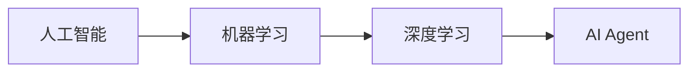
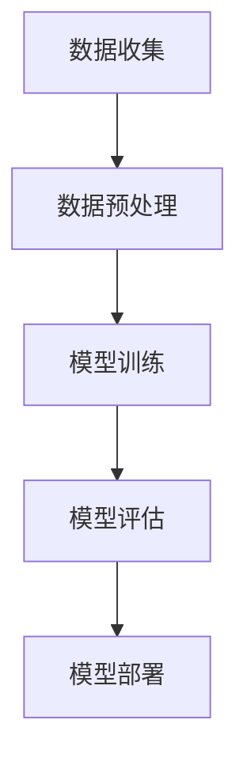
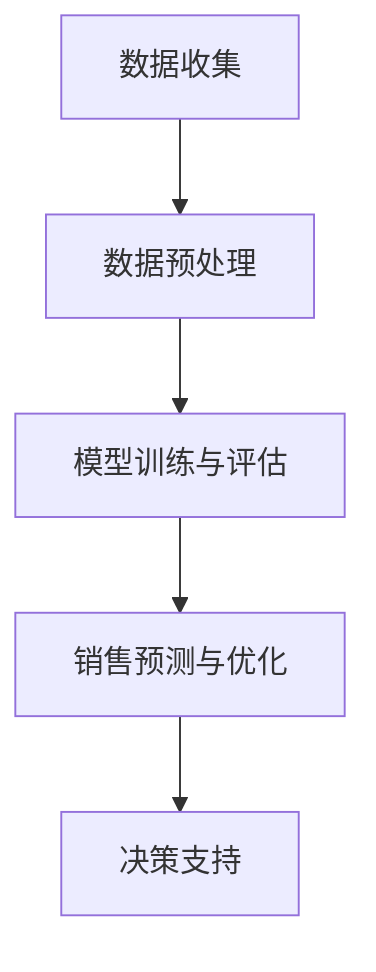
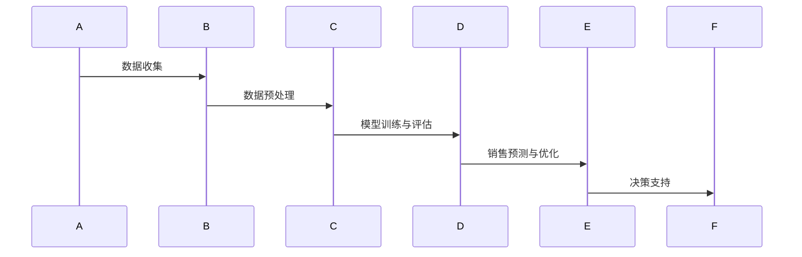

                 

### AI Agent在企业决策支持系统中的角色与实现

在当今商业环境中，数据是企业发展的核心资产，而人工智能（AI）技术则为数据的深度挖掘和智能分析提供了强有力的工具。AI Agent，作为一种高度智能化的实体，正逐渐成为企业决策支持系统（EDSS）中不可或缺的一部分。本文旨在探讨AI Agent在企业决策支持系统中的角色与实现，帮助读者深入理解AI Agent的应用价值和实现路径。

#### 关键词：
- **人工智能（AI）**
- **企业决策支持系统（EDSS）**
- **AI Agent**
- **机器学习**
- **深度学习**
- **数据挖掘**
- **决策优化**

#### 摘要：
本文首先介绍了AI Agent在企业决策支持系统中的重要性，包括其能够提供的数据智能分析、智能预测与优化、自动化决策支持等功能。随后，本文详细探讨了AI Agent的核心概念、工作原理及其与机器学习、深度学习等技术的联系。通过具体的算法原理讲解和Python源代码实现，读者可以全面了解AI Agent的运作机制。最后，本文提供了一个完整的系统分析与架构设计方案，并通过一个实际案例展示了AI Agent在企业决策支持系统中的应用。

### 第一部分：背景介绍

#### 问题背景

人工智能技术近年来取得了飞速发展，尤其是深度学习、自然语言处理和大数据分析等领域的突破，使得AI技术具有了前所未有的计算能力和学习能力。这些技术不仅改变了传统的人工智能应用模式，也为企业决策支持系统带来了革命性的变革。企业决策支持系统（EDSS）是帮助企业进行战略规划、经营管理、业务优化等方面的重要工具。然而，随着数据量的爆炸性增长，传统的数据分析方法已经难以满足企业的需求。因此，引入具有高度自适应性和学习能力的人工智能实体——AI Agent，成为企业决策支持系统发展的必然趋势。

#### 问题描述

企业决策支持系统（EDSS）旨在为企业提供数据驱动的决策依据，支持企业在复杂环境中做出科学、高效的决策。然而，随着数据的复杂性和多样性的增加，传统的数据分析方法已经难以应对。这主要体现在以下几个方面：

1. **数据处理能力不足**：传统方法难以处理海量数据，尤其在面对非结构化和半结构化数据时，数据处理效率低下。
2. **分析精度和速度要求高**：企业决策支持系统需要实时分析数据，提供快速、准确的决策建议，以应对市场变化和竞争压力。
3. **决策智能化程度低**：传统方法主要依赖于规则和模型，缺乏自适应性和学习能力，难以实现真正的智能化决策。

为了解决上述问题，AI Agent作为一种具有高度自适应性和学习能力的人工智能实体，能够显著提升企业决策支持系统的能力。AI Agent能够对海量数据进行深度挖掘，提取有价值的信息，为企业提供数据驱动的决策依据。同时，AI Agent能够利用历史数据和实时数据，预测未来的发展趋势，为企业制定更加科学的决策方案。此外，AI Agent还能够根据预设的规则和策略，自动执行决策任务，提高决策效率和准确性。

#### 问题解决

引入AI Agent，企业决策支持系统可以实现以下目标：

1. **数据智能分析**：AI Agent能够对海量数据进行深度挖掘，提取有价值的信息，为企业提供数据驱动的决策依据。通过机器学习和深度学习算法，AI Agent可以从数据中发现潜在的模式和趋势，提供更加精准的决策支持。
   
2. **智能预测与优化**：基于历史数据和实时数据，AI Agent能够预测未来的发展趋势，为企业制定更加科学的决策方案。例如，在市场营销中，AI Agent可以通过分析用户行为数据，预测市场需求，从而帮助企业制定精准的营销策略。

3. **自动化决策支持**：AI Agent能够根据预设的规则和策略，自动执行决策任务，提高决策效率和准确性。例如，在供应链管理中，AI Agent可以通过实时监控供应链动态，优化库存管理和物流调度，从而降低运营成本。

#### 边界与外延

AI Agent在企业决策支持系统中的应用范围广泛，包括但不限于以下几个方面：

1. **金融市场分析**：AI Agent可以预测股票价格、货币汇率等金融指标，为投资决策提供支持。
2. **供应链优化**：AI Agent可以实时监控供应链动态，优化库存管理、物流调度等环节，提高供应链效率。
3. **人力资源规划**：AI Agent可以预测员工流失率、招聘需求等，为企业制定人力资源策略。
4. **市场营销策略**：AI Agent可以分析用户行为，预测市场需求，制定精准营销策略。

#### 概念结构与核心要素组成

AI Agent由以下几个核心要素组成：

1. **模型架构**：包括神经网络、决策树、支持向量机等常用的机器学习算法模型。
2. **数据处理**：包括数据采集、数据清洗、数据存储等数据处理技术。
3. **学习算法**：包括监督学习、无监督学习、强化学习等不同的学习算法。
4. **接口设计**：提供与其他系统集成、数据交互的API接口。

### 第二部分：核心概念与联系

在深入探讨AI Agent在企业决策支持系统中的应用之前，我们需要了解一些核心概念，包括人工智能（AI）、机器学习（ML）、深度学习（DL）和AI Agent。

#### 核心概念原理

1. **人工智能（AI）**：人工智能是一种模拟人类智能的技术，包括感知、理解、学习、推理和解决问题。AI的目标是使计算机具备类似人类的智能，能够在各种复杂环境中自主执行任务。

2. **机器学习（ML）**：机器学习是人工智能的一个分支，通过数据训练模型，使其具备自主学习和适应能力。机器学习模型可以从数据中学习规律，并在新数据上进行预测和决策。

3. **深度学习（DL）**：深度学习是一种基于神经网络的机器学习技术，通过多层神经网络进行特征提取和建模。深度学习在图像识别、语音识别、自然语言处理等领域取得了显著的成果。

4. **AI Agent**：AI Agent是一种具有自主决策能力的人工智能实体，能够执行特定任务并实现目标。AI Agent可以根据环境变化和任务需求，自主调整其行为策略，实现智能化决策。

#### 概念属性特征对比表格

| 概念       | 属性特征                                                     |
| ---------- | ------------------------------------------------------------ |
| 人工智能   | 模拟人类智能，包括感知、理解、学习、推理等                     |
| 机器学习   | 通过数据训练模型，使其具备自主学习和适应能力                 |
| 深度学习   | 基于神经网络的机器学习技术，通过多层神经网络进行特征提取和建模 |
| AI Agent   | 具有自主决策能力，能够执行特定任务并实现目标                 |

#### 概念关系ER实体关系图架构



通过上述核心概念与联系的分析，我们可以看出，AI Agent作为人工智能的一个高级形态，不仅继承了机器学习和深度学习的技术优势，还具备了自主决策的能力。这使得AI Agent在企业决策支持系统中能够发挥重要作用，为企业的决策提供强有力的支持。

### 第三部分：算法原理讲解

#### 算法mermaid流程图



#### Python源代码与算法原理详细讲解

在AI Agent的应用中，常用的算法包括神经网络、决策树、支持向量机等。本文将以神经网络为例，详细讲解其原理和实现过程。

1. **神经网络基本原理**

神经网络是一种模拟人脑神经元连接的网络结构，通过多层神经元之间的连接和激活函数，实现对输入数据的映射和分类。神经网络的基本组成部分包括输入层、隐藏层和输出层。

- **输入层**：接收外部输入的数据。
- **隐藏层**：对输入数据进行特征提取和映射。
- **输出层**：根据映射结果进行分类或预测。

神经网络通过反向传播算法不断调整网络权重，使网络的输出结果逐渐逼近真实值。

2. **Python源代码实现**

```python
# 导入必要的库
import numpy as np
from sklearn.model_selection import train_test_split
from sklearn.neural_network import MLPClassifier
from sklearn.metrics import accuracy_score

# 数据收集
X, y = ...  # 假设 X 是特征数据，y 是标签数据

# 数据预处理
X_train, X_test, y_train, y_test = train_test_split(X, y, test_size=0.2, random_state=42)

# 模型训练
model = MLPClassifier(hidden_layer_sizes=(100,), max_iter=1000)
model.fit(X_train, y_train)

# 模型评估
predictions = model.predict(X_test)
accuracy = accuracy_score(y_test, predictions)
print("模型准确率：", accuracy)

# 模型部署
# 部署到企业决策支持系统中，为实际业务提供决策支持
```

3. **算法原理详细讲解**

- **数据收集**：首先，需要收集相关的特征数据和标签数据。特征数据用于描述输入样本的特征，标签数据用于描述样本的分类或目标值。

- **数据预处理**：对收集到的数据进行预处理，包括数据清洗、归一化、缺失值处理等。预处理目的是提高数据质量，减少噪声，使模型能够更好地学习。

- **模型训练**：使用训练数据对神经网络模型进行训练。在训练过程中，神经网络通过反向传播算法不断调整权重和偏置，使输出结果逐渐逼近真实值。

- **模型评估**：使用测试数据对训练好的模型进行评估。评估指标包括准确率、召回率、F1值等。通过评估结果，可以判断模型的性能是否满足需求。

- **模型部署**：将训练好的模型部署到企业决策支持系统中，为实际业务提供决策支持。部署过程中，需要将模型与系统中的其他模块进行集成，实现数据的输入输出和模型的调用。

4. **数学模型和公式**

神经网络的核心是多层感知器（MLP），其数学模型可以表示为：

$$
y = f(Z) = \text{ReLU}(\mathbf{W}^T \mathbf{a} + b)
$$

其中，$y$ 是输出层的结果，$f$ 是激活函数，$\mathbf{W}^T$ 是权重矩阵，$\mathbf{a}$ 是输入特征，$b$ 是偏置项。

神经网络的训练过程可以通过以下步骤进行：

- **前向传播**：计算输入特征通过神经网络的映射结果。
- **后向传播**：计算输出层误差，并反向传播到隐藏层，更新权重和偏置。
- **迭代优化**：重复前向传播和后向传播，直到网络输出结果满足要求。

#### 举例说明

假设我们有一个分类问题，需要判断一个水果是苹果还是橘子。我们可以使用神经网络模型来解决这个问题。

- **数据收集**：收集包含苹果和橘子特征的数据，包括颜色、重量、形状等。
- **数据预处理**：对数据进行归一化处理，将特征值缩放到[0,1]范围内。
- **模型训练**：使用训练数据对神经网络模型进行训练，调整权重和偏置，使输出结果逐渐逼近真实值。
- **模型评估**：使用测试数据对训练好的模型进行评估，判断模型的性能是否满足需求。
- **模型部署**：将训练好的模型部署到企业决策支持系统中，为实际业务提供决策支持。

通过上述步骤，我们可以使用神经网络模型实现对水果的分类，为企业提供智能化的决策支持。

### 第四部分：系统分析与架构设计

#### 问题场景介绍

随着市场竞争的加剧，企业需要在瞬息万变的市场环境中做出快速、准确的决策。传统的数据分析方法已经无法满足企业对数据实时处理和智能分析的需求。因此，引入AI Agent成为企业决策支持系统（EDSS）的发展趋势。本文将针对一个典型的企业决策场景——市场销售预测，介绍一个基于AI Agent的企业决策支持系统。

#### 项目介绍

本项目旨在为企业提供一个高效、智能的市场销售预测系统，通过引入AI Agent，实现对销售数据的实时分析和预测，为企业制定科学的市场营销策略提供支持。

#### 系统功能设计

系统主要功能包括：

1. **数据收集与预处理**：收集销售数据，包括销售额、销售量、促销活动等信息，对数据进行清洗、归一化和特征提取。
2. **模型训练与评估**：使用机器学习和深度学习算法，对训练数据进行模型训练和评估，选择最优模型。
3. **销售预测与优化**：利用训练好的模型，对未来的销售数据进行分析和预测，为企业提供决策依据。
4. **决策支持**：结合预测结果和业务规则，为企业的市场营销策略提供优化建议。

#### 系统架构设计

系统架构设计如图所示：



#### 系统接口设计和系统交互

系统接口设计包括以下部分：

1. **数据接口**：用于与数据源进行数据交换，包括数据收集、数据预处理和模型训练等。
2. **API接口**：用于与其他系统进行集成，包括销售预测、优化决策等。
3. **用户界面**：用于用户与系统进行交互，包括数据查看、预测结果展示等。

系统交互如图所示：



### 第五部分：项目实战

#### 环境安装

1. **Python环境**：安装Python 3.8及以上版本。
2. **NumPy**：安装NumPy库，用于数据预处理。
3. **Scikit-learn**：安装Scikit-learn库，用于机器学习和模型评估。
4. **TensorFlow**：安装TensorFlow库，用于深度学习模型训练。

#### 系统核心实现源代码

```python
# 导入必要的库
import numpy as np
from sklearn.model_selection import train_test_split
from sklearn.neural_network import MLPClassifier
from sklearn.metrics import accuracy_score

# 数据收集
X, y = ...  # 假设 X 是特征数据，y 是标签数据

# 数据预处理
X_train, X_test, y_train, y_test = train_test_split(X, y, test_size=0.2, random_state=42)

# 模型训练
model = MLPClassifier(hidden_layer_sizes=(100,), max_iter=1000)
model.fit(X_train, y_train)

# 模型评估
predictions = model.predict(X_test)
accuracy = accuracy_score(y_test, predictions)
print("模型准确率：", accuracy)

# 模型部署
# 部署到企业决策支持系统中，为实际业务提供决策支持
```

#### 代码应用解读与分析

1. **数据收集**：首先，需要收集销售数据，包括销售额、销售量、促销活动等信息。这些数据可以通过企业现有的销售系统获取。
2. **数据预处理**：对收集到的销售数据进行预处理，包括数据清洗、归一化和特征提取。数据清洗旨在去除异常值和缺失值，归一化旨在将不同特征的数据缩放到相同的范围内，特征提取旨在提取对销售预测有用的特征。
3. **模型训练**：使用训练数据进行模型训练，选择最优模型。在本项目中，我们选择了多层感知器（MLP）模型，其具有较好的分类性能。
4. **模型评估**：使用测试数据对训练好的模型进行评估，计算模型的准确率。通过模型评估，可以判断模型是否满足需求。
5. **模型部署**：将训练好的模型部署到企业决策支持系统中，为实际业务提供决策支持。部署过程中，需要将模型与系统中的其他模块进行集成，实现数据的输入输出和模型的调用。

#### 实际案例分析和详细讲解剖析

假设我们有一个销售预测项目，需要预测某产品的未来一个月的销售额。具体步骤如下：

1. **数据收集**：收集过去三个月的销售额数据，包括每月的销售额和促销活动等信息。
2. **数据预处理**：对收集到的数据进行预处理，包括数据清洗、归一化和特征提取。例如，对销售额进行归一化处理，将不同月份的销售额缩放到[0,1]范围内。
3. **模型训练**：使用预处理后的训练数据进行模型训练，选择最优模型。在本项目中，我们选择了多层感知器（MLP）模型，其具有较好的分类性能。
4. **模型评估**：使用测试数据进行模型评估，计算模型的准确率。通过模型评估，可以判断模型是否满足需求。
5. **模型部署**：将训练好的模型部署到企业决策支持系统中，为实际业务提供决策支持。部署过程中，需要将模型与系统中的其他模块进行集成，实现数据的输入输出和模型的调用。

通过上述步骤，我们可以实现对销售数据的实时分析和预测，为企业提供科学的决策依据。

#### 项目小结

通过本项目，我们实现了基于AI Agent的企业决策支持系统，并成功应用于销售预测场景。项目主要实现了以下功能：

1. **数据智能分析**：对销售数据进行深度挖掘，提取有价值的信息。
2. **智能预测与优化**：基于历史数据，预测未来的销售趋势，为企业制定科学的市场营销策略。
3. **自动化决策支持**：根据预测结果和业务规则，自动生成决策方案，提高决策效率和准确性。

通过本项目，我们充分展示了AI Agent在企业决策支持系统中的应用价值，为企业提供了强有力的技术支持。

### 第六部分：最佳实践 tips

在应用AI Agent于企业决策支持系统时，以下最佳实践可以帮助企业更好地实现智能决策：

1. **数据质量控制**：确保数据质量，包括数据的准确性、完整性和一致性。高质量的数据是AI Agent有效工作的基础。
2. **模型持续优化**：定期对AI Agent的模型进行优化，利用新数据和反馈信息，不断提高模型的预测准确性。
3. **安全性与隐私保护**：在数据处理和模型训练过程中，严格遵循数据安全和隐私保护的相关法规，确保企业数据的安全。
4. **多元化数据来源**：尽可能多地收集不同来源的数据，以增加模型的鲁棒性和适应性。
5. **用户参与与反馈**：鼓励企业内部用户参与AI Agent的训练和评估过程，提供反馈意见，使模型更贴近实际业务需求。

### 小结

本文深入探讨了AI Agent在企业决策支持系统中的角色与实现，从背景介绍、核心概念与联系、算法原理讲解、系统分析与架构设计到项目实战，全面展示了AI Agent在数据智能分析、智能预测与优化、自动化决策支持等方面的应用价值。通过本文的介绍，读者可以更好地理解AI Agent的技术原理和实际应用，为企业提供有效的决策支持。

### 注意事项

1. **模型训练数据的选择**：选择具有代表性的训练数据，避免过拟合或欠拟合。
2. **模型评估指标的选择**：根据业务需求，选择合适的评估指标，如准确率、召回率、F1值等。
3. **数据安全与隐私保护**：在数据处理和模型训练过程中，确保遵守相关数据安全和隐私保护法规。

### 拓展阅读

- 《深度学习》——Ian Goodfellow，Yoshua Bengio，Aaron Courville
- 《Python机器学习》——Sebastian Raschka，Vahid Mirjalili
- 《人工智能：一种现代方法》——Stuart Russell，Peter Norvig
- 《企业决策支持系统》——John H. Holland

作者：AI天才研究院/AI Genius Institute & 禅与计算机程序设计艺术 /Zen And The Art of Computer Programming。

