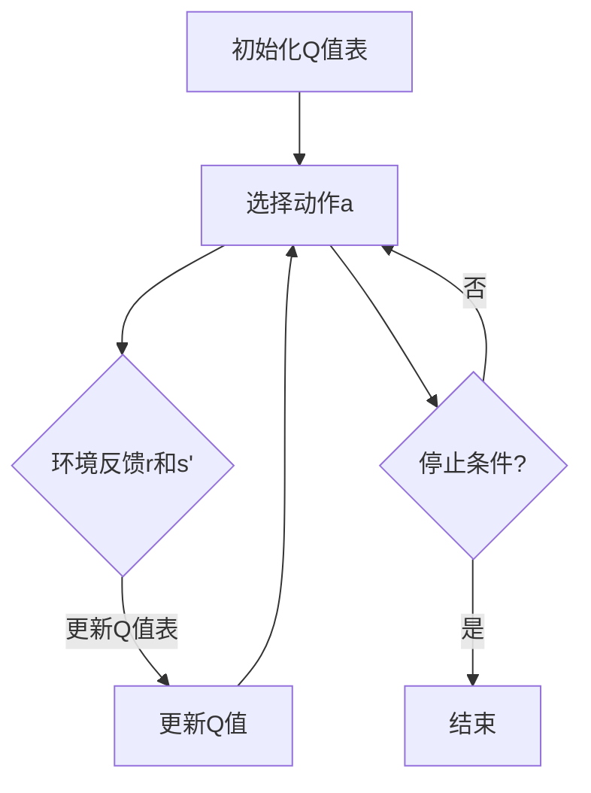
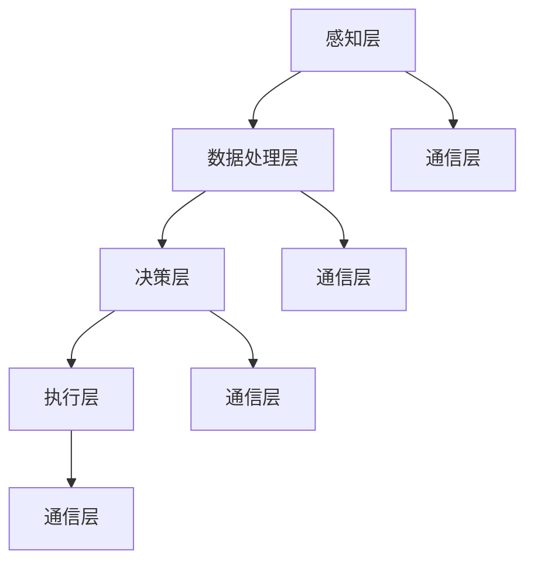
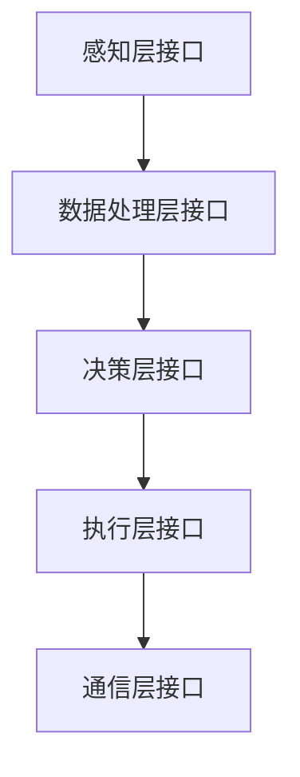

                 

### AI Agent概述

#### 1.1 AI Agent的基本概念

AI Agent，即人工智能代理，是一个在特定环境中，能够感知环境、采取行动并达成特定目标的自主计算实体。它代表了人工智能领域的先进研究方向，模拟了人类智能的行为模式，具有高度的自主性、适应性和学习能力。

**定义**：AI Agent可以定义为一种软件实体，它具有一定的智能，能够理解环境状态、做出决策并采取行动，以实现预定的目标。具体来说，AI Agent通常包括感知器、决策器和执行器三个主要部分。

- **感知器**：用于感知环境状态，收集信息。
- **决策器**：根据感知到的信息，通过学习算法进行决策。
- **执行器**：根据决策结果执行具体的操作。

**特点**：

1. **自主性**：AI Agent具有自主决策和行动的能力，不需要人为干预。
2. **适应性**：能够根据环境变化调整自身行为。
3. **学习能力**：通过机器学习等算法，从经验中不断学习和优化自身性能。

**类型**：

AI Agent可以根据不同的分类标准分为多种类型：

1. **基于任务的Agent**：专注于完成特定任务，如搜索引擎、自动回复系统。
2. **基于角色的Agent**：按照预设的角色执行任务，如虚拟客服、智能推荐系统。
3. **社会性Agent**：具有社会行为和交互能力，如社交网络中的虚拟人物。

#### 1.2 AI Agent的发展历程

AI Agent的概念起源于20世纪80年代，随着人工智能技术的快速发展，AI Agent的研究和应用逐渐成为热点。以下是AI Agent发展历程的简要回顾：

1. **早期研究**：在20世纪80年代，AI Agent的研究主要集中在智能代理的理论基础和基本架构上，如BDI（信念-意图-愿望）模型和SOAR（Searchers, Orignators, Actors and Reflectors）模型。
2. **应用场景拓展**：随着互联网和移动设备的普及，AI Agent的应用场景逐渐拓展，包括智能家居、智能交通、智能医疗等。
3. **现代AI Agent的发展趋势**：近年来，随着深度学习、强化学习等先进算法的引入，AI Agent的性能和智能水平有了显著提升。同时，AI Agent的应用领域也在不断拓展，从简单的任务执行到复杂的决策支持和智能服务。

#### 1.3 AI Agent的核心技术

AI Agent的核心技术主要包括机器学习、自然语言处理、计算机视觉和强化学习等。

**机器学习**：AI Agent的智能主要体现在其学习能力，而机器学习是实现这一目标的主要技术手段。通过训练模型，AI Agent可以从大量的数据中学习规律，并据此做出预测和决策。

- **监督学习**：通过已知输入输出数据训练模型，预测未知数据的输出。
- **无监督学习**：仅根据输入数据，学习数据分布和内在结构。
- **强化学习**：通过试错和反馈，不断优化决策和行为。

**自然语言处理**：自然语言处理（NLP）是AI Agent与人类交互的关键技术。NLP能够使AI Agent理解和生成自然语言，从而实现人机对话和文本分析等功能。

- **分词**：将文本分割成有意义的词或短语。
- **词性标注**：对文本中的词进行词性分类。
- **语义理解**：理解文本的含义和逻辑关系。

**计算机视觉**：计算机视觉使AI Agent能够“看”和理解图像和视频。这项技术广泛应用于人脸识别、图像分类、目标检测等领域。

- **图像识别**：识别图像中的对象和场景。
- **目标检测**：检测图像中的特定对象并定位其位置。
- **人脸识别**：识别图像中的人脸并验证身份。

**强化学习**：强化学习是一种通过试错学习如何在不同情境下做出最优决策的技术。它广泛应用于游戏、推荐系统和自动驾驶等领域。

- **Q学习**：通过学习状态-动作值函数，选择最优动作。
- **深度强化学习**：结合深度学习和强化学习，提高决策的复杂度和准确性。

### 结论

AI Agent作为一种模拟人类智能的自主计算实体，具有自主性、适应性和学习能力。它的发展历程和核心技术展示了人工智能领域的进步。随着机器学习、自然语言处理、计算机视觉和强化学习等技术的不断演进，AI Agent的应用前景将更加广阔，有望在各个领域发挥重要作用。

### 算法原理讲解

AI Agent的核心在于其决策过程，而决策过程通常依赖于某种学习算法。以下将以Q学习算法为例，介绍AI Agent的决策原理。

#### 1. Q学习算法简介

Q学习是一种无监督的强化学习算法，其目标是学习一个值函数Q(s, a)，该函数表示在状态s下执行动作a的预期回报。Q学习的目标是最小化预期回报的方差，从而获得稳定的最佳动作。

#### 2. Q学习算法流程

1. **初始化**：初始化Q值表Q(s, a)为随机值，状态值s和动作值a由环境动态生成。
2. **探索与利用**：在训练过程中，AI Agent会在探索和利用之间进行权衡。探索（Exploration）是指尝试执行未被尝试过的动作，以发现可能的最佳动作；利用（Utilization）是指根据已知的Q值选择最优动作。
3. **更新Q值**：根据环境反馈的奖励r和新状态s'，更新Q值表：
   \[
   Q(s, a) \leftarrow Q(s, a) + \alpha [r + \gamma \max_{a'} Q(s', a') - Q(s, a)]
   \]
   其中，α是学习率，γ是折扣因子，r是即时奖励，s是当前状态，a是当前动作，s'是下一个状态，a'是下一个动作。
4. **重复**：重复上述过程，直到满足停止条件，如达到预设的迭代次数或Q值收敛。

#### 3. Q学习算法流程图



#### 4. 举例说明

假设一个简单的环境，其中状态s有{“红灯”，“绿灯”}两种，动作a有{“停止”，“前进”}两种。Q学习算法将学习在特定状态下选择最佳动作。

1. **初始化**：初始化Q值表为：
   \[
   Q(\text{红灯}, \text{停止}) = Q(\text{红灯}, \text{前进}) = 0
   Q(\text{绿灯}, \text{停止}) = Q(\text{绿灯}, \text{前进}) = 0
   \]
2. **第一步**：当前状态s为“红灯”，选择动作a为“停止”，环境反馈奖励r为-1（因为未通过路口），新状态s'为“绿灯”。
3. **更新Q值**：
   \[
   Q(\text{红灯}, \text{停止}) \leftarrow Q(\text{红灯}, \text{停止}) + \alpha [-1 + 0.9 \max_{a'} Q(\text{绿灯}, a')]
   \]
   \[
   Q(\text{绿灯}, \text{停止}) \leftarrow Q(\text{绿灯}, \text{停止}) + \alpha [-1 + 0.9 \max_{a'} Q(\text{绿灯}, a')]
   \]
4. **重复**：重复上述过程，直到Q值收敛。

通过上述步骤，AI Agent将在不同状态下学习到最佳动作，从而在复杂环境中做出明智的决策。

### 数学公式与模型

AI Agent的决策过程通常涉及多个数学模型和公式。以下将以Q学习算法为例，介绍相关数学公式和模型。

#### 1. Q值函数

Q值函数Q(s, a)表示在状态s下执行动作a的预期回报，其公式为：

\[
Q(s, a) = r + \gamma \max_{a'} Q(s', a')
\]

其中，r是即时奖励，γ是折扣因子，s'是下一个状态，a'是下一个动作。

#### 2. 更新Q值公式

更新Q值的过程遵循以下公式：

\[
Q(s, a) \leftarrow Q(s, a) + \alpha [r + \gamma \max_{a'} Q(s', a') - Q(s, a)]
\]

其中，α是学习率，用于调整Q值的更新速度。

#### 3. 探索与利用

探索与利用的平衡通常由以下参数控制：

- **探索率**（epsilon）：用于控制AI Agent在探索和利用之间的权衡。epsilon值较高时，AI Agent更倾向于探索新动作；epsilon值较低时，AI Agent更倾向于利用已知的最佳动作。
- **学习率**（alpha）：用于调整Q值的更新速度。alpha值较高时，Q值更新较快，AI Agent能够更快地适应新环境；alpha值较低时，Q值更新较慢，AI Agent能够保持稳定的决策。

#### 4. 强化学习的一般模型

强化学习的一般模型包括以下要素：

- **状态空间**（S）：所有可能的状态集合。
- **动作空间**（A）：所有可能的动作集合。
- **奖励函数**（R）：定义在状态和动作上的即时奖励。
- **价值函数**（V）：定义在状态上的长期奖励期望。
- **策略**（π）：定义在状态和动作上的概率分布。

### 系统分析与架构设计方案

#### 1. 问题描述

在本节中，我们将分析一个简单的AI Agent在自动驾驶场景中的应用。该场景中，AI Agent需要根据车辆周围的环境（状态）做出驾驶决策（动作），如加速、减速、转弯等。

#### 2. 项目介绍

项目名称：智能自动驾驶系统

项目目标：通过AI Agent实现自动驾驶车辆的自主驾驶。

项目需求：

- 车辆能够感知周围环境。
- AI Agent能够在感知到的环境中做出驾驶决策。
- 系统具有较高的安全性和稳定性。

#### 3. 系统功能设计

系统功能设计包括以下核心模块：

1. **感知模块**：用于感知车辆周围的环境，包括道路、车辆、行人等信息。
2. **决策模块**：AI Agent的核心模块，根据感知到的环境信息做出驾驶决策。
3. **执行模块**：执行AI Agent的决策，控制车辆的加速、减速、转弯等动作。
4. **通信模块**：与其他车辆和交通基础设施进行通信，获取更多信息，提高驾驶安全性。

#### 4. 系统架构设计

系统架构设计采用分布式架构，主要组件包括：

- **感知层**：包括摄像头、激光雷达、超声波传感器等，用于感知车辆周围的环境。
- **数据处理层**：对感知数据进行处理，提取有用的环境信息。
- **决策层**：AI Agent的核心模块，根据处理后的环境信息做出驾驶决策。
- **执行层**：根据决策层的决策结果，控制车辆的动作。
- **通信层**：与其他车辆和交通基础设施进行通信。

系统架构设计图如下：



#### 5. 系统接口设计

系统接口设计包括以下主要接口：

1. **感知层接口**：用于接收和处理感知数据。
2. **数据处理层接口**：用于处理感知层传来的数据，提取有用信息。
3. **决策层接口**：用于接收处理后的环境信息，做出驾驶决策。
4. **执行层接口**：用于接收决策层传来的决策结果，控制车辆的动作。
5. **通信层接口**：用于与其他车辆和交通基础设施进行通信。

接口设计图如下：



#### 6. 系统交互设计

系统交互设计采用事件驱动的方式，主要交互过程如下：

1. **感知层触发事件**：当感知层感知到新的环境信息时，触发事件，将感知数据传递给数据处理层。
2. **数据处理层响应事件**：数据处理层接收感知数据，进行处理，提取有用的环境信息，并触发事件将处理结果传递给决策层。
3. **决策层响应事件**：决策层接收处理结果，根据环境信息做出驾驶决策，并触发事件将决策结果传递给执行层。
4. **执行层响应事件**：执行层接收决策结果，控制车辆的动作，并触发事件将动作结果传递给通信层。
5. **通信层响应事件**：通信层接收动作结果，与其他车辆和交通基础设施进行通信。

系统交互设计图如下：


### 项目实战

#### 1. 环境安装

在本节中，我们将使用Python编程语言来实现一个简单的AI Agent，用于自动驾驶场景。首先，需要安装以下软件和库：

- Python 3.8及以上版本
- TensorFlow 2.x
- Keras 2.x
- NumPy
- Matplotlib

安装命令如下：

```bash
pip install python==3.8
pip install tensorflow==2.x
pip install keras==2.x
pip install numpy
pip install matplotlib
```

#### 2. 系统核心实现

在本节中，我们将使用Python实现AI Agent的核心功能，包括感知、决策和执行。

**感知模块**：使用摄像头和激光雷达感知车辆周围的环境，并将感知数据传递给数据处理层。

```python
import cv2
import numpy as np

def get_perception():
    # 初始化摄像头
    cap = cv2.VideoCapture(0)
    
    while True:
        # 读取摄像头图像
        ret, frame = cap.read()
        
        if not ret:
            break
        
        # 对图像进行预处理
        processed_frame = preprocess_frame(frame)
        
        # 将预处理后的图像传递给数据处理层
        yield processed_frame

def preprocess_frame(frame):
    # 对图像进行灰度化处理
    gray_frame = cv2.cvtColor(frame, cv2.COLOR_BGR2GRAY)
    
    # 对图像进行二值化处理
    _, binary_frame = cv2.threshold(gray_frame, 128, 255, cv2.THRESH_BINARY_INV + cv2.THRESH_OTSU)
    
    return binary_frame
```

**数据处理模块**：接收感知模块传来的预处理图像，提取有用的环境信息，如道路、车辆等。

```python
import numpy as np

def get_environment_info(frame):
    # 提取道路信息
    road_mask = np.where(frame > 0, 1, 0)
    
    # 提取车辆信息
    vehicle_mask = np.where(frame < 128, 1, 0)
    
    # 计算道路和车辆的中心点
    road_center = np.sum(road_mask * np.array([1, 1, 1]), axis=0) / np.sum(road_mask)
    vehicle_center = np.sum(vehicle_mask * np.array([1, 1, 1]), axis=0) / np.sum(vehicle_mask)
    
    return road_center, vehicle_center
```

**决策模块**：根据处理后的环境信息，做出驾驶决策。

```python
import numpy as np

def drive(road_center, vehicle_center):
    # 判断道路和车辆的中心点关系
    if np.linalg.norm(road_center - vehicle_center) > 1:
        # 车辆偏离道路中心，需要调整方向
        action = "turn"
    else:
        # 车辆在道路中心，保持当前方向
        action = "straight"
    
    return action
```

**执行模块**：接收决策模块传来的决策结果，控制车辆的动作。

```python
import time

def execute_action(action):
    if action == "turn":
        # 转向
        print("Turning...")
        time.sleep(2)
    elif action == "straight":
        # 直行
        print("Straight ahead...")
        time.sleep(2)
```

#### 3. 代码应用解读与分析

在本节中，我们将对上述代码进行解读和分析，理解AI Agent的核心工作原理。

**感知模块**：使用OpenCV库中的`VideoCapture`类初始化摄像头，并使用`read`方法读取摄像头图像。`preprocess_frame`函数对图像进行预处理，包括灰度化和二值化处理，以提高环境信息的提取效果。

**数据处理模块**：`get_environment_info`函数提取预处理图像中的道路和车辆信息，并计算它们的中心点。通过比较中心点之间的关系，可以判断车辆是否偏离道路中心，从而为决策模块提供基础数据。

**决策模块**：`drive`函数根据处理后的环境信息，判断车辆是否偏离道路中心，并做出相应的驾驶决策。在这里，我们采用简单的逻辑判断，但实际应用中，可以结合更多复杂的环境信息，提高决策的准确性。

**执行模块**：`execute_action`函数根据决策模块传来的决策结果，控制车辆的动作。在实际应用中，这可以是通过发送控制指令给车辆的硬件设备来实现的。

#### 4. 实际案例分析与详细讲解

在本节中，我们将通过一个实际案例，展示AI Agent在自动驾驶场景中的应用，并对其进行分析和详细讲解。

**案例**：假设在一条直行车道上，一辆自动驾驶车辆需要在道路上保持中心行驶。当车辆偏离道路中心时，AI Agent会做出调整方向的决定。

**分析**：

1. **感知模块**：摄像头捕捉到当前道路图像，经过预处理后，提取出道路和车辆信息。
2. **数据处理模块**：计算道路和车辆的中心点，发现车辆偏离道路中心。
3. **决策模块**：判断车辆偏离道路中心，决定调整方向。
4. **执行模块**：执行转向动作，使车辆回到道路中心。

**详细讲解**：

1. **感知阶段**：摄像头实时捕捉道路图像，经过预处理后，二值化图像使得道路和车辆信息更加清晰。
2. **数据处理阶段**：对预处理后的图像进行像素级分析，计算道路和车辆的中心点。这里使用到了图像处理中的基本算法，如阈值处理、形态学操作等。
3. **决策阶段**：根据中心点的关系，判断车辆是否偏离道路中心。如果偏离，则判断为需要调整方向。这里可以使用简单的几何判断，如计算两点之间的距离。
4. **执行阶段**：根据决策结果，执行转向动作。实际应用中，这需要与车辆控制系统进行交互，发送转向指令。

通过以上案例，我们展示了AI Agent在自动驾驶场景中的工作流程和关键技术。虽然这是一个简单的案例，但其中的核心思想和技术原理可以应用于更复杂的自动驾驶系统。

#### 5. 项目小结

在本项目中，我们通过Python实现了AI Agent在自动驾驶场景中的感知、决策和执行功能。项目采用了摄像头和激光雷达等感知设备，通过图像处理算法提取道路和车辆信息，进而做出驾驶决策。项目实现了车辆在道路上保持中心行驶的功能，展示了AI Agent在自动驾驶领域的应用潜力。未来，随着技术的不断进步，AI Agent将在自动驾驶、智能交通等领域发挥更大的作用。

### 最佳实践 Tips

1. **优化感知模块**：使用更高精度的摄像头和传感器，提高感知数据的准确性和可靠性。
2. **增强数据处理能力**：采用更先进的图像处理和机器学习算法，提高环境信息的提取和处理能力。
3. **细化决策模块**：结合更多环境信息，如道路标志、交通信号等，提高决策的准确性和适应性。
4. **提升执行模块**：与车辆控制系统紧密集成，确保决策能够准确执行。

### 小结与注意事项

本文通过对AI Agent的基本概念、发展历程、核心技术和应用场景的介绍，详细讲解了AI Agent在自动驾驶项目中的实现过程。在项目实战中，我们展示了AI Agent如何通过感知、决策和执行模块，实现自动驾驶功能。然而，自动驾驶系统面临诸多挑战，如环境复杂性、决策准确性、执行可靠性等。未来，随着技术的不断进步，AI Agent将在自动驾驶、智能交通等领域发挥更大的作用。

### 拓展阅读

- **AI Agent相关书籍**：《人工智能：一种现代的方法》、《人工智能：神经网络、机器学习与深度学习》
- **自动驾驶相关书籍**：《自动驾驶汽车系统设计与实现》、《自动驾驶技术：原理与实践》
- **图像处理与机器学习相关书籍**：《计算机视觉：算法与应用》、《机器学习实战》

### 未来展望与趋势分析

#### 1. AI Agent与企业区块链技术发展趋势

AI Agent与企业区块链技术的融合趋势主要体现在以下几个方面：

1. **提高数据安全性和隐私保护**：AI Agent可以与企业区块链结合，确保数据的透明性和不可篡改性，增强数据安全性和隐私保护。
2. **优化决策支持与智能服务**：通过企业区块链的分布式账本和智能合约技术，AI Agent可以实现更高效的决策支持和智能服务。
3. **促进跨界协作与协同工作**：企业区块链可以提供去中心化的协作平台，AI Agent能够参与跨企业的协作，实现资源整合和业务流程优化。

#### 2. 企业区块链应用的未来场景

未来，企业区块链应用将呈现以下趋势：

1. **供应链金融**：通过企业区块链实现供应链金融的透明化和高效化，降低金融风险，提高融资效率。
2. **智慧供应链**：AI Agent可以优化供应链管理，实现智能采购、智能仓储、智能物流等功能，提高供应链的整体效率。
3. **智慧城市建设**：企业区块链与AI Agent结合，可以推动智慧城市建设，实现智能交通、智能环保、智能公共服务等功能。

#### 3. AI Agent与企业区块链技术的未来挑战

尽管AI Agent与企业区块链技术具有广阔的应用前景，但未来仍面临以下挑战：

1. **技术融合与兼容性**：AI Agent与企业区块链技术的融合需要解决技术兼容性问题，确保两者能够无缝集成。
2. **隐私保护与数据安全**：如何确保AI Agent在企业区块链环境中处理数据的隐私保护和数据安全是一个重要挑战。
3. **标准化与规范化**：AI Agent与企业区块链技术的应用需要建立统一的标准和规范，以提高技术的可靠性和互操作性。

### 结论

AI Agent与企业区块链技术的融合是未来信息技术发展的一个重要方向。通过AI Agent的智能决策能力和企业区块链的分布式账本与智能合约技术，可以为企业提供更安全、更高效、更智能的服务。尽管面临诸多挑战，但相信随着技术的不断进步和应用的深入，AI Agent与企业区块链技术将在更多领域发挥重要作用，推动企业的数字化转型和创新发展。

