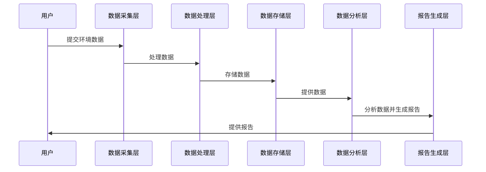

                 

### 引言

#### 1.1 书籍背景

可持续发展已经成为全球共识，企业作为经济活动的重要参与者，承担着推动可持续发展的重任。联合国制定的“可持续发展目标”（Sustainable Development Goals，简称SDGs）旨在解决全球贫困、不平等和气候变化等问题，涵盖经济、社会和环境三大领域。企业通过设定和实现可持续发展目标，不仅有助于提升企业形象，还能提高运营效率、降低风险、创造更多商业机会。

然而，实现可持续发展目标面临着诸多挑战。首先，数据收集与处理难度较大，涉及多个部门的数据需要整合与标准化。其次，传统的报告方式往往难以反映真实的可持续发展状况，缺乏实时性和准确性。此外，企业内部缺乏专业的可持续发展人才，导致目标设定和追踪的效率低下。

为了解决这些问题，人工智能（AI）代理应运而生。AI代理是一种能够自主执行任务、与环境互动并具备一定智能的软件实体。它们可以自动化地收集和处理数据，实时监控和评估企业的可持续发展状况，提供决策支持，帮助企业更有效地实现可持续发展目标。

本书旨在探讨AI代理在企业可持续发展目标追踪与报告中的应用。通过系统性地介绍AI代理的基本概念、工作原理、实现方法以及具体应用案例，本书旨在为企业提供一套可行的解决方案，助力企业实现可持续发展目标。

#### 1.2 本书结构安排

本书分为五个部分，共五章节，具体结构安排如下：

**第一部分：AI代理基础**

- 第2章：AI代理概述
  - 内容：介绍AI代理的定义、分类、工作原理、组成与架构以及应用领域。

**第二部分：企业可持续发展目标追踪与报告**

- 第3章：企业可持续发展目标的设定与追踪
  - 内容：探讨企业可持续发展目标的设定、AI代理在目标追踪中的应用以及报告编制。

- 第4章：AI代理技术实现概述
  - 内容：介绍AI代理的开发工具与框架、开发流程、部署与维护。

**第三部分：技术实现**

- 第5章：AI代理在企业可持续发展目标追踪与报告中的应用
  - 内容：通过具体案例，展示AI代理在企业可持续发展目标追踪与报告中的实际应用。

**第四部分：最佳实践与展望**

- 第6章：AI代理在企业可持续发展目标追踪与报告中的应用最佳实践
  - 内容：总结最佳实践，探讨AI代理在企业可持续发展中的未来发展趋势。

**第五部分：总结与展望**

- 第7章：总结与展望
  - 内容：对本书进行总结，展望AI代理在企业可持续发展中的应用前景。

#### 1.2.1 阅读指南

本书适合从事企业可持续发展工作的专业人士、企业管理者以及关注人工智能技术应用的读者。读者可通过以下步骤进行阅读：

1. **通读全书**：先通读全书，了解AI代理在企业可持续发展中的应用框架。
2. **深入研读**：对感兴趣的部分进行深入研读，理解AI代理的工作原理和应用方法。
3. **实践应用**：结合实际工作场景，尝试应用书中提到的最佳实践。
4. **持续学习**：关注AI代理和可持续发展领域的最新动态，持续学习。

通过本书的学习，读者将能够掌握AI代理在企业可持续发展目标追踪与报告中的应用方法，为企业的可持续发展提供有力支持。同时，本书也旨在推动AI技术在可持续发展领域的创新与应用，共同构建美好未来。

### 第二部分: AI代理基础

#### 第2章: AI代理概述

##### 2.1 AI代理的定义与分类

AI代理（Artificial Intelligence Agent）是一种计算机系统，具备一定的智能，能够自主地感知环境、理解任务，并采取行动以实现特定目标。AI代理的定义可以从多个角度进行理解：

- **基于自主性**：AI代理具有自主性，能够独立执行任务，而不需要人工干预。
- **基于智能性**：AI代理具备智能，能够理解任务要求、感知环境变化，并作出相应决策。
- **基于交互性**：AI代理能够与环境进行交互，获取信息并作出反应。

AI代理的分类可以基于不同的标准：

- **按任务类型分**：AI代理可以分为反应式Agent、计划式Agent、社交Agent和自主学习Agent。
  - **反应式Agent**：仅根据当前感知的环境信息做出反应，不保留历史状态信息。
  - **计划式Agent**：具备记忆能力，可以根据过去的经验预测未来，并制定行动计划。
  - **社交Agent**：能够与其他Agent进行交互，协同完成任务。
  - **自主学习Agent**：具备学习能力，可以通过学习不断优化自身行为。

- **按功能分**：AI代理可以分为感知Agent、决策Agent、执行Agent。
  - **感知Agent**：负责感知环境，获取外部信息。
  - **决策Agent**：根据感知信息，选择最佳行动方案。
  - **执行Agent**：负责执行决策，将行动付诸实施。

- **按应用领域分**：AI代理可以应用于多个领域，如电子商务与客户服务、智能家居与物联网、健康医疗与辅助、企业可持续发展等。

AI代理的核心特性包括：

- **自主性**：能够独立执行任务，无需人工干预。
- **智能性**：具备理解任务、感知环境变化并作出决策的能力。
- **适应性**：能够根据环境变化调整自身行为。
- **协作性**：能够与其他Agent协同工作，共同完成任务。

##### 2.2 AI代理的工作原理

AI代理的工作原理可以概括为感知、理解和行动三个阶段：

1. **感知阶段**：
   - **感知环境**：AI代理通过传感器或其他方式获取环境信息，如文本、图像、语音等。
   - **数据处理**：对获取的信息进行预处理，如去噪、归一化等。

2. **理解阶段**：
   - **任务理解**：AI代理分析任务要求，确定目标。
   - **情境理解**：理解当前所处的环境状态，识别关键信息。

3. **行动阶段**：
   - **决策**：基于任务理解和情境理解，AI代理选择最佳行动方案。
   - **执行**：执行决策，采取具体行动。

整个工作过程是一个闭环，AI代理通过不断感知、理解和行动，实现目标的逐步逼近。

##### 2.3 AI代理的组成与架构

AI代理通常由多个组件组成，各组件协同工作，实现代理的自主性和智能性。以下是常见的AI代理组件及其功能：

- **感知模块**：负责获取环境信息，如文本、图像、语音等。
- **知识库**：存储关于环境、任务和策略的知识，供代理决策时参考。
- **推理模块**：基于知识库和感知信息，进行逻辑推理和决策。
- **行动模块**：执行决策，采取具体行动。
- **学习模块**：通过学习不断优化代理的行为，提高智能水平。

AI代理的架构设计需要考虑以下几个要素：

- **模块化**：各组件独立开发，便于维护和升级。
- **分布式**：多个Agent可以协同工作，提高任务处理的效率。
- **灵活性**：代理能够根据环境变化调整自身结构和行为。
- **可扩展性**：支持添加新组件或功能，以适应不同应用场景。

##### 2.4 AI代理的应用领域

AI代理在多个领域展现出巨大的应用潜力，以下是一些典型应用场景：

- **电子商务与客户服务**：AI代理可以提供智能客服、推荐系统等服务，提升用户体验，提高销售转化率。
- **智能家居与物联网**：AI代理可以监控家庭设备运行状态，提供自动化控制，提高生活便利性。
- **健康医疗与辅助**：AI代理可以辅助医生进行诊断、预测病情，提高医疗服务质量。
- **企业可持续发展**：AI代理可以追踪和报告企业可持续发展目标，提供决策支持，助力企业实现可持续发展。

通过在不同领域的应用，AI代理正在改变我们的生活和工作方式，推动社会进步。

##### 2.5 本章小结

本章介绍了AI代理的定义、分类、工作原理、组成与架构以及应用领域。AI代理作为一种具备自主性、智能性和适应性的计算机系统，正在逐步渗透到各个领域，发挥重要作用。理解AI代理的基本概念和工作原理，是深入探讨其在企业可持续发展目标追踪与报告中的应用的前提。在接下来的章节中，我们将进一步探讨AI代理在企业可持续发展中的应用细节。

### 第三部分: 企业可持续发展目标追踪与报告

#### 第3章: 企业可持续发展目标的设定与追踪

企业可持续发展目标的设定与追踪是实现企业可持续发展战略的关键环节。通过科学的设定和有效的追踪，企业可以确保各项目标的顺利实现，从而在长期内保持竞争优势并实现可持续发展。

##### 3.1 可持续发展目标的设定

可持续发展目标的设定需要遵循以下原则：

- **整体性**：目标设定应涵盖经济、社会和环境三大领域，确保企业发展的全面性。
- **科学性**：目标设定应基于科学的研究和数据支持，确保目标的可行性和科学性。
- **可测量性**：目标应具有可测量的指标，以便于追踪和评估目标的实现情况。
- **挑战性**：目标应具有一定的挑战性，激发员工的积极性和创造力。

联合国制定的“可持续发展目标”（SDGs）为全球企业提供了参考框架。SDGs包括17个目标，涉及消除贫困、消除不平等、气候变化应对、环境保护等多个方面。企业可以根据自身的实际情况，选取相关的目标，并结合自身的核心业务，设定具体的可持续发展目标。

以下是一个企业设定可持续发展目标的示例：

- **经济目标**：提高运营效率，降低成本，实现业务的可持续发展。
- **社会目标**：提高员工福利，促进员工职业发展，实现社会责任。
- **环境目标**：减少碳排放，提高能源利用效率，实现绿色生产。

在设定可持续发展目标时，企业需要考虑以下几个关键指标：

- **经济效益**：包括利润、成本、市场份额等。
- **社会效益**：包括员工满意度、客户满意度、社会责任履行等。
- **环境效益**：包括碳排放量、能源消耗、废弃物处理等。

##### 3.2 AI代理在目标追踪中的应用

AI代理在企业可持续发展目标追踪中的应用具有重要意义。通过AI代理，企业可以实现目标追踪的自动化、智能化，提高追踪的效率和准确性。

1. **数据采集与处理**

AI代理可以通过多种方式采集数据，如传感器、网络数据、企业内部系统等。采集到的数据需要进行预处理，包括去噪、清洗、归一化等，以确保数据的质量和一致性。

2. **数据分析与可视化**

AI代理可以对采集到的数据进行分析，识别关键趋势和异常情况。通过数据可视化技术，可以将分析结果以图表、仪表盘等形式呈现，使企业能够直观地了解目标的实现情况。

3. **预测与决策支持**

基于历史数据和实时数据，AI代理可以进行预测分析，预测未来目标的实现情况。同时，AI代理还可以基于预测结果提供决策支持，帮助企业制定更科学的策略和调整目标。

4. **自动追踪与报告**

AI代理可以自动追踪企业各项可持续发展目标的实现情况，生成详细的报告。报告内容包括目标的完成度、关键指标的走势、存在的问题等，为企业提供全面的决策依据。

##### 3.3 AI代理在报告编制中的应用

报告编制是可持续发展目标追踪的重要组成部分。通过AI代理，企业可以大幅提高报告编制的效率和质量。

1. **报告编制流程**

AI代理可以自动化报告编制的流程，包括数据收集、数据分析、报告生成等。通过标准化流程，确保报告内容的准确性和一致性。

2. **报告内容生成**

AI代理可以根据采集到的数据和分析结果，自动生成报告内容。报告内容应包括目标完成度、关键指标走势、存在的问题、改进建议等。

3. **报告格式与发布**

AI代理可以根据企业的需求，自定义报告的格式和风格。报告可以通过多种方式发布，如电子邮件、企业内部系统、公共网站等。

##### 3.4 案例研究：AI代理在XX企业的应用

为了更好地理解AI代理在企业可持续发展目标追踪与报告中的应用，以下是一个实际案例。

**案例背景**：

XX企业是一家大型制造企业，致力于实现可持续发展目标。企业设定了多项可持续发展目标，包括降低碳排放、提高能源利用效率、减少废弃物产生等。

**应用过程**：

1. **数据采集**：

   AI代理通过传感器和企业内部系统，采集了大量的环境数据，如能源消耗、碳排放、废弃物产量等。

2. **数据处理与分析**：

   AI代理对采集到的数据进行了预处理和分析，识别了关键趋势和异常情况。通过数据可视化技术，企业可以直观地了解各项目标的实现情况。

3. **预测与决策支持**：

   基于历史数据和实时数据，AI代理进行了预测分析，预测了未来目标的实现情况。同时，AI代理提供了决策支持，帮助企业制定更科学的策略和调整目标。

4. **报告编制与发布**：

   AI代理自动生成了详细的可持续发展报告，内容包括目标完成度、关键指标走势、存在的问题、改进建议等。报告通过企业内部系统发布，供企业管理层参考。

**应用效果评估**：

通过AI代理的应用，XX企业实现了可持续发展目标的自动化追踪与报告，提高了数据分析和决策的效率。以下是对应用效果的评估：

- **数据准确性**：AI代理的自动数据采集和处理，确保了数据的准确性和一致性。
- **分析效率**：AI代理的数据分析功能，使企业能够快速识别关键趋势和异常情况。
- **决策支持**：AI代理的预测分析与决策支持，帮助企业制定了更科学的策略和调整了目标。
- **报告质量**：AI代理自动生成的报告，内容全面、格式规范，提高了报告的质量。

**案例小结**：

通过AI代理的应用，XX企业实现了可持续发展目标的自动化追踪与报告，提高了数据分析和决策的效率，为企业的可持续发展提供了有力支持。这一案例表明，AI代理在企业可持续发展目标追踪与报告中的应用具有显著优势，值得其他企业借鉴。

##### 3.5 本章小结

本章介绍了企业可持续发展目标的设定与追踪，以及AI代理在目标追踪与报告中的应用。通过科学的设定和有效的追踪，企业可以实现可持续发展目标，提高运营效率、降低风险、创造商业机会。AI代理的应用，使企业可持续发展目标的追踪与报告更加自动化、智能化，提高了工作效率和决策质量。在接下来的章节中，我们将进一步探讨AI代理在企业可持续发展目标追踪与报告中的技术实现。

### 第四部分: 技术实现

#### 第4章: AI代理技术实现概述

AI代理在企业可持续发展目标追踪与报告中的应用，离不开先进的技术支持。本章将概述AI代理技术实现的关键方面，包括开发工具与框架、开发流程、部署与维护。

##### 4.1 AI代理开发工具与框架

AI代理的开发工具和框架是实现AI功能的重要基础。以下是一些常见的开发工具和框架：

1. **开发工具**：
   - **Python**：Python是一种广泛使用的编程语言，具有丰富的库和框架，适合开发AI代理。
   - **R**：R是一种专门用于统计分析和数据可视化的语言，适用于数据分析和预测模型。
   - **TensorFlow**：TensorFlow是谷歌开发的开源机器学习框架，支持各种深度学习模型的构建和训练。
   - **PyTorch**：PyTorch是另一种流行的深度学习框架，具有灵活的动态计算图，便于模型开发和调试。

2. **框架**：
   - **Kubernetes**：Kubernetes是一种开源容器编排平台，用于部署和管理容器化的应用，适合部署分布式AI代理系统。
   - **Apache Flink**：Apache Flink是一种流处理框架，支持实时数据流处理，适用于实时数据分析和预测。
   - **Docker**：Docker是一种容器化技术，用于打包、交付和运行应用，便于部署和管理AI代理。
   - **Kafka**：Kafka是一种分布式消息队列系统，用于处理大规模数据流，适用于数据采集和传输。

##### 4.2 AI代理开发流程

AI代理的开发流程包括需求分析、系统设计、系统实现和系统测试等阶段，以下为详细说明：

1. **需求分析**：
   - **确定目标**：明确AI代理需要实现的功能和目标，如数据采集、分析、预测、报告等。
   - **需求文档**：编写需求文档，详细描述AI代理的需求和功能。

2. **系统设计**：
   - **架构设计**：设计AI代理的架构，包括感知模块、知识库、推理模块、行动模块和学习模块等。
   - **模块划分**：根据功能需求，将AI代理划分为多个模块，便于开发和维护。

3. **系统实现**：
   - **编码实现**：根据系统设计，编写代码实现各模块功能。
   - **集成测试**：将各模块集成起来，进行功能测试，确保系统整体运行正常。

4. **系统测试**：
   - **单元测试**：对每个模块进行单元测试，确保模块功能的正确性。
   - **集成测试**：对整个系统进行集成测试，确保各模块之间的协同工作。
   - **性能测试**：对系统进行性能测试，评估系统的响应速度和处理能力。

##### 4.3 AI代理部署与维护

AI代理的部署与维护是确保其稳定运行的关键环节。以下为详细说明：

1. **部署**：
   - **容器化部署**：使用Docker等容器化技术，将AI代理打包成容器，便于部署和管理。
   - **分布式部署**：使用Kubernetes等分布式部署框架，将AI代理部署在多个节点上，实现负载均衡和高可用性。

2. **维护**：
   - **监控与告警**：使用Prometheus、Grafana等监控工具，实时监控AI代理的运行状态，并设置告警机制。
   - **日志管理**：使用ELK（Elasticsearch、Logstash、Kibana）等日志管理工具，收集和存储AI代理的日志，便于问题追踪和分析。
   - **更新与升级**：定期更新AI代理的代码和依赖库，修复已知问题和提高性能。

##### 4.4 本章小结

本章介绍了AI代理技术实现的关键方面，包括开发工具与框架、开发流程和部署与维护。通过这些技术手段，企业可以有效地开发和部署AI代理，实现可持续发展目标的自动化追踪与报告。在接下来的章节中，我们将通过具体案例，展示AI代理在企业可持续发展目标追踪与报告中的实际应用。

### 第五部分: 最佳实践与展望

#### 第5章: AI代理在企业可持续发展目标追踪与报告中的应用最佳实践

通过前面的章节，我们已经了解了AI代理在企业可持续发展目标追踪与报告中的应用原理和技术实现方法。在本章中，我们将结合实际案例，分享一些最佳实践，并展望AI代理在可持续发展领域的未来发展。

##### 5.1 数据驱动的可持续发展目标设定

一个有效的可持续发展目标设定过程应该基于详尽的数据分析和科学的预测。以下是数据驱动的可持续发展目标设定的一些最佳实践：

1. **数据收集与整合**：
   - **多渠道数据**：从内部业务系统、外部供应商、客户反馈等多渠道收集数据。
   - **数据整合**：将不同来源的数据进行整合，建立统一的数据仓库，确保数据的一致性和完整性。

2. **数据分析**：
   - **趋势分析**：分析历史数据，识别业务和环境的趋势，为目标的设定提供依据。
   - **预测分析**：利用机器学习模型，预测未来可能的发展方向和趋势，帮助设定具有挑战性的目标。

3. **目标设定**：
   - **SMART原则**：设定具体（Specific）、可衡量（Measurable）、可实现（Achievable）、相关（Relevant）和有时限（Time-bound）的目标。
   - **指标细化**：将宏观目标细化为可量化的关键绩效指标（KPIs），如碳排放量减少百分比、能源效率提升比例等。

##### 5.2 AI代理在目标追踪中的应用

在目标追踪过程中，AI代理可以提供自动化、智能化的支持，以下是最佳实践：

1. **实时数据监控**：
   - **传感器网络**：部署传感器网络，实时采集环境数据，如能耗、碳排放等。
   - **实时数据处理**：使用流处理技术，如Apache Flink，对实时数据进行分析和处理。

2. **异常检测与预警**：
   - **异常检测模型**：训练机器学习模型，识别数据中的异常值和异常模式。
   - **实时预警**：当检测到异常时，自动触发预警机制，通知相关人员采取行动。

3. **数据可视化**：
   - **仪表盘**：使用数据可视化工具，如Kibana、Tableau，创建实时仪表盘，直观展示数据趋势和异常情况。

##### 5.3 AI代理在报告编制中的应用

报告编制是可持续发展目标追踪的重要组成部分，AI代理可以大幅提高报告编制的效率和准确性。以下是报告编制的最佳实践：

1. **自动化报告生成**：
   - **模板化报告**：建立标准化的报告模板，确保报告格式的一致性。
   - **自动化生成**：基于数据和分析结果，AI代理可以自动填充报告内容，生成详细的报告。

2. **动态报告更新**：
   - **实时更新**：报告内容应随着数据和分析结果的变化而动态更新。
   - **版本控制**：建立报告版本控制机制，确保报告的完整性和可追溯性。

3. **多样化发布方式**：
   - **在线发布**：通过企业内部网站或公共平台，发布电子版报告。
   - **纸质版**：对于需要纸质版报告的场景，提供打印服务。

##### 5.4 AI代理在企业可持续发展中的应用前景

随着AI技术的不断发展，AI代理在企业可持续发展中的应用前景十分广阔。以下是AI代理在可持续发展领域的一些潜在发展方向：

1. **智能化决策支持**：
   - **预测与优化**：通过深度学习模型，实现更精准的预测和优化，为企业提供智能化决策支持。
   - **情景分析**：模拟不同可持续发展情景，帮助企业评估不同策略的效果。

2. **绿色供应链管理**：
   - **供应链优化**：通过AI代理优化供应链，降低能源消耗和碳排放。
   - **供应商管理**：评估供应商的可持续性表现，选择更环保的供应商。

3. **员工参与与激励**：
   - **员工赋能**：通过AI代理提供个性化的可持续发展培训和学习资源，提高员工的参与度。
   - **绩效评估**：将可持续发展目标纳入员工绩效评估体系，激励员工为实现企业目标贡献力量。

##### 5.5 本章小结

本章分享了AI代理在企业可持续发展目标追踪与报告中的应用最佳实践，并展望了其未来发展。通过数据驱动的目标设定、实时数据监控、自动化报告生成等技术手段，AI代理能够为企业提供高效、智能的可持续发展支持。随着AI技术的不断进步，AI代理在可持续发展中的应用将更加深入和广泛，为构建美好未来贡献力量。

### 总结与展望

本书系统地介绍了AI代理在企业可持续发展目标追踪与报告中的应用。通过详细探讨AI代理的基本概念、工作原理、技术实现方法以及具体应用案例，我们深刻认识到AI代理在提升企业可持续发展能力方面的重要作用。

首先，AI代理作为一种具备自主性、智能性和适应性的计算机系统，能够自动化、智能化地追踪和报告企业可持续发展目标，提高数据分析和决策的效率。这不仅有助于企业更好地实现可持续发展目标，还能提高运营效率、降低成本、创造更多商业机会。

其次，本书通过实际案例，展示了AI代理在企业可持续发展目标追踪与报告中的具体应用，包括数据采集与处理、目标追踪、报告编制等多个环节。这些应用案例验证了AI代理的可行性和有效性，为其他企业提供了有益的借鉴。

未来，随着AI技术的不断发展，AI代理在企业可持续发展中的应用前景将更加广阔。一方面，AI代理可以进一步优化目标设定和追踪流程，提高目标的准确性和可执行性；另一方面，AI代理还可以在绿色供应链管理、员工参与与激励等方面发挥更大作用。

然而，AI代理在企业可持续发展中的应用也面临一些挑战。首先，数据质量和数据安全是关键问题，需要企业建立完善的数据管理体系。其次，AI代理的技术实现需要不断迭代和优化，以满足企业不断变化的需求。

总之，AI代理在企业可持续发展目标追踪与报告中的应用具有重要的现实意义和广阔的发展前景。通过持续的研究和探索，我们有望推动AI代理技术的进步，为企业的可持续发展提供更加有力支持。同时，我们期待与各界同仁共同携手，共同构建美好未来。

### 附录

本附录包括本书中涉及的关键术语解释、核心概念对比表格、算法原理与公式讲解、系统分析与架构设计方案、项目实战与代码解读等内容，旨在为读者提供更深入的参考资料。

#### 关键术语解释

1. **AI代理（Artificial Intelligence Agent）**：一种具备自主性、智能性和适应性的计算机系统，能够感知环境、理解任务并采取行动以实现特定目标。
2. **可持续发展目标（Sustainable Development Goals, SDGs）**：联合国制定的17个全球性目标，旨在解决全球贫困、不平等和气候变化等问题。
3. **关键绩效指标（Key Performance Indicators, KPIs）**：用于衡量企业绩效的重要指标，如碳排放量、能源消耗、员工满意度等。
4. **深度学习（Deep Learning）**：一种基于多层神经网络的学习方法，能够自动从大量数据中提取特征，进行高级任务处理。

#### 核心概念对比表格

| 核心概念 | 定义 | 关联属性 | 对比表格 |
| --- | --- | --- | --- |
| 反应式Agent | 基于当前感知环境信息做出反应，不保留历史状态信息。 | **自主性**、**反应性** | - 与计划式Agent对比：反应式Agent不预测未来，仅对当前环境做出反应。 |
| 计划式Agent | 具备记忆能力，可以根据过去的经验预测未来，并制定行动计划。 | **自主性**、**计划性**、**记忆能力** | - 与反应式Agent对比：计划式Agent考虑历史信息，制定长期计划。 |
| 感知Agent | 负责获取环境信息，如文本、图像、语音等。 | **感知能力**、**数据收集** | - 与决策Agent对比：感知Agent专注于信息获取，不涉及决策。 |
| 决策Agent | 根据感知信息，选择最佳行动方案。 | **决策能力**、**推理能力** | - 与执行Agent对比：决策Agent负责制定行动方案，不执行具体行动。 |
| 可持续发展目标（SDGs） | 联合国制定的17个全球性目标，涵盖经济、社会和环境三大领域。 | **全球性**、**综合性**、**可衡量性** | - 与企业可持续发展目标对比：SDGs是宏观目标，企业可持续发展目标是具体实施目标。 |

#### 算法原理与公式讲解

以下是一个简单的基于K-means算法的数据聚类过程：

1. **初始化**：随机选择K个初始聚类中心。
2. **分配**：将每个数据点分配到最近的聚类中心。
3. **更新**：计算每个聚类中心的新位置，作为所有分配到该中心的数据点的平均值。
4. **迭代**：重复步骤2和步骤3，直到聚类中心不再变化或达到预设的迭代次数。

**K-means算法公式：**

$$
\text{centroids}_{\text{new}} = \frac{1}{N_k} \sum_{x \in S_k} x
$$

其中，$centroids_{\text{new}}$是新的聚类中心，$N_k$是分配到第k个聚类中心的数据点个数，$x$是数据点。

**解释**：该公式计算每个聚类中心的新位置，作为所有分配到该中心的数据点的平均值。通过不断迭代，数据点会逐渐收敛到稳定的聚类中心。

#### 系统分析与架构设计方案

以下是一个企业可持续发展目标追踪与报告系统的分析框架：

1. **问题场景介绍**：
   - 企业希望实现对可持续发展目标的自动追踪与报告。
   - 需要实时收集和处理各种环境数据，如能源消耗、碳排放等。
   - 需要提供实时数据分析与可视化，帮助管理层做出决策。

2. **系统功能设计**：
   - **数据采集模块**：负责收集各种环境数据，如传感器数据、企业内部系统数据等。
   - **数据处理模块**：对采集到的数据进行预处理、清洗和转换。
   - **数据分析模块**：基于预处理后的数据，进行数据分析和预测。
   - **报告生成模块**：根据数据分析结果，生成详细的可持续发展报告。

3. **系统架构设计**：
   - **数据采集层**：使用传感器网络和企业内部系统，实时采集各种环境数据。
   - **数据处理层**：使用流处理框架，如Apache Flink，对数据进行实时处理。
   - **数据存储层**：使用关系数据库和NoSQL数据库，存储处理后的数据。
   - **数据分析层**：使用机器学习算法，对数据进行分析和预测。
   - **报告生成层**：使用数据可视化工具，如Kibana和Tableau，生成实时报告。

4. **系统接口设计和系统交互**：

**Mermaid序列图：**



**解释**：该序列图展示了系统中的主要组件和它们之间的交互流程。

#### 项目实战与代码解读

以下是一个简单的Python代码示例，用于实现基于K-means算法的数据聚类：

```python
from sklearn.cluster import KMeans
import numpy as np

# 示例数据
data = np.array([[1, 2], [1, 4], [1, 0],
                 [10, 2], [10, 4], [10, 0]])

# 初始化K-means模型
kmeans = KMeans(n_clusters=2, random_state=0).fit(data)

# 输出聚类结果
print("聚类中心：", kmeans.cluster_centers_)
print("数据点分配：", kmeans.labels_)

# 预测新数据点
new_data = np.array([[0, 0], [12, 3]])
print("新数据点聚类结果：", kmeans.predict(new_data))
```

**代码解读**：
1. 导入相关库。
2. 初始化示例数据。
3. 使用K-means模型进行聚类，并输出聚类中心。
4. 输出数据点的聚类结果。
5. 对新数据点进行聚类预测。

#### 最佳实践 tips

1. **数据质量管理**：确保数据的质量和一致性，是AI代理有效运作的基础。
2. **算法选择与优化**：根据具体应用场景，选择合适的算法，并进行持续优化。
3. **系统集成与测试**：在部署AI代理前，进行全面的系统集成与测试，确保系统的稳定性和可靠性。

#### 小结

本书通过深入探讨AI代理在企业可持续发展目标追踪与报告中的应用，为读者提供了全面的理论指导和实践案例。希望本书能够激发读者对AI代理在可持续发展领域应用的思考，推动更多企业实现可持续发展目标。

#### 注意事项

1. AI代理在数据处理和应用过程中，需要严格遵守数据安全和隐私保护的相关法律法规。
2. AI代理的实现和部署，需要考虑企业内部的技术支持和维护能力。

#### 拓展阅读

- **《机器学习实战》**：由Peter Harrington著，详细介绍了机器学习的基本概念和实践方法。
- **《深度学习》**：由Ian Goodfellow、Yoshua Bengio和Aaron Courville著，全面介绍了深度学习的基础理论和应用技术。
- **《可持续发展的企业战略》**：由John Elkington著，探讨了企业如何在可持续发展中发挥重要作用。

### 作者信息

作者：AI天才研究院/AI Genius Institute & 禅与计算机程序设计艺术 /Zen And The Art of Computer Programming

感谢您阅读本书，希望本书能够为您的可持续发展工作提供有益的参考。祝您在AI代理的应用实践中取得成功！

