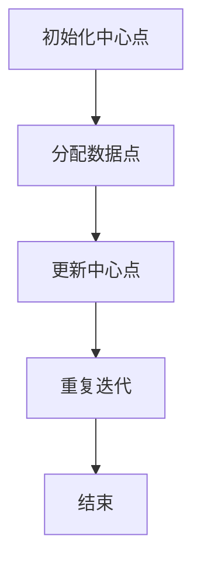
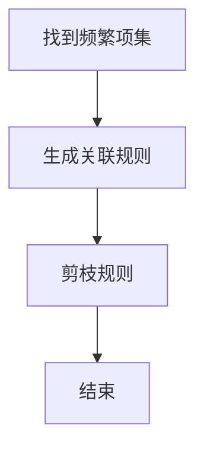
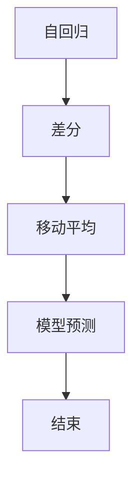
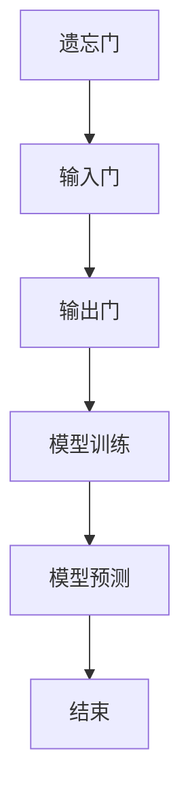

                 


### 《AI Agent在企业可持续发展目标追踪中的应用》

#### 关键词
- AI Agent
- 企业可持续发展目标（SDGs）
- 算法
- 系统架构
- 实际应用

#### 摘要
本文将深入探讨AI Agent在企业可持续发展目标（SDGs）追踪中的应用。我们将首先介绍AI Agent和SDGs的核心概念，随后逐步分析AI Agent在追踪SDGs中的算法原理、系统架构设计、项目实战案例，并总结最佳实践和注意事项。通过这篇文章，读者将了解到如何利用AI Agent实现高效、精准的SDGs追踪。

### 第1章：引言

#### 1.1 AI Agent的基本概念

AI Agent，即人工智能代理，是一种模拟人类智能行为的人工智能系统。它能够在特定环境中感知、决策并采取行动，实现自动化和智能化的任务执行。AI Agent通常由感知模块、决策模块和行动模块组成，能够通过机器学习、自然语言处理、知识图谱等技术不断优化其行为。

#### 1.2 企业可持续发展目标（SDGs）

企业可持续发展目标（Sustainable Development Goals，简称SDGs）是由联合国在2015年提出的一套全球发展目标，旨在结束贫困、保护地球、确保全人类繁荣。SDGs共包括17个目标，涵盖从消除贫困、饥饿、不平等，到保护生物多样性、促进可持续发展城市和社区等多个方面。

#### 1.3 AI Agent在SDGs追踪中的应用意义

随着企业对可持续发展的重视程度不断提高，如何有效地追踪和实现SDGs成为一个关键问题。AI Agent在此过程中具有重要作用，它能够帮助企业自动化数据收集、分析和管理，提高追踪效率和精度，从而实现可持续发展的目标。

### 第2章：AI Agent基础

#### 2.1 AI Agent的定义与分类

AI Agent可以根据其功能、任务和环境进行分类。例如，基于功能分类，AI Agent可以分为信息搜集型、决策支持型和自动化执行型；基于任务分类，AI Agent可以分为目标追踪型、资源管理型和用户交互型；基于环境分类，AI Agent可以分为静态环境型和动态环境型。

#### 2.2 AI Agent的基本原理与工作流程

AI Agent的基本原理包括感知、理解、决策和行动。感知模块负责收集环境信息，理解模块负责对感知信息进行处理和理解，决策模块负责根据理解和目标进行决策，行动模块负责执行决策。AI Agent的工作流程包括感知阶段、理解阶段、决策阶段和行动阶段。

#### 2.3 AI Agent的开发与实现

AI Agent的开发通常涉及机器学习、自然语言处理、知识图谱等技术。开发过程包括需求分析、系统设计、模型训练、系统集成和测试等步骤。实现过程中需要关注数据质量、算法选择、模型优化和系统性能等方面。

### 第3章：企业可持续发展目标

#### 3.1 SDGs的概述与内容

SDGs共包括17个目标，分别是：无贫困、零 hunger、良好健康与福祉、优质教育、性别平等、清洁饮水与卫生设施、经济发展、体面工作与经济繁荣、工业、创新与基础设施、减少不平等、可持续城市与社区、负责任消费和生产、气候行动、水下生命、陆地生命、和平、正义与强大机构、伙伴关系。

#### 3.2 SDGs在企业中的应用案例

企业在实现SDGs过程中，可以通过减少碳排放、提高员工福利、支持社区发展等方式做出贡献。例如，苹果公司通过减少产品供应链的碳排放、提高员工培训和福利等措施，积极践行SDGs；阿里巴巴则通过云计算、大数据等技术支持贫困地区发展，推动可持续发展。

#### 3.3 SDGs追踪的挑战与机遇

企业追踪SDGs面临诸多挑战，如数据来源广泛、数据质量参差不齐、目标实现时间较长等。同时，随着AI技术的不断发展，AI Agent在SDGs追踪中提供了新的机遇，如自动化数据收集、分析和管理，提高追踪效率和精度。

### 第4章：算法原理与模型

#### 4.1 追踪SDGs的主要算法

用于追踪SDGs的算法主要包括聚类分析、关联规则挖掘、时间序列分析和神经网络等。这些算法可以根据企业特点和目标需求进行选择和组合，以提高追踪效率和精度。

#### 4.2 算法数学模型与公式

以下是一个用于追踪SDGs的聚类分析算法的数学模型和公式示例：

$$
C = \{c_1, c_2, ..., c_k\}
$$

其中，$C$表示聚类结果集合，$c_i$表示第$i$个聚类中心。

#### 4.3 实际案例中的应用分析

以某企业减少碳排放为例，可以采用聚类分析算法对企业的碳排放数据进行聚类，找出主要排放源和影响因素，从而制定针对性的减排措施。

### 第5章：系统架构与设计

#### 5.1 AI Agent追踪SDGs的系统架构

AI Agent追踪SDGs的系统架构通常包括数据收集层、数据处理层、算法层和应用层。数据收集层负责收集企业相关的SDGs数据；数据处理层负责对数据进行清洗、整合和预处理；算法层负责实现各种追踪算法；应用层则提供用户交互和可视化功能。

#### 5.2 系统功能设计

系统功能设计包括数据收集、数据处理、算法实现、结果分析和用户交互等模块。其中，数据收集模块负责从各个数据源获取SDGs数据；数据处理模块负责对数据进行清洗、整合和预处理；算法实现模块负责实现各种追踪算法；结果分析模块负责对追踪结果进行分析和可视化；用户交互模块则提供用户操作界面和反馈功能。

#### 5.3 系统架构设计

系统架构设计包括功能设计、接口设计、数据流设计和交互设计等。功能设计确定系统各个模块的功能；接口设计确定模块之间的接口和交互方式；数据流设计确定数据在系统中的流动路径和流程；交互设计确定用户与系统的交互方式和体验。

#### 5.4 系统接口设计和系统交互设计

系统接口设计包括API设计、数据接口设计和消息接口设计等。API设计确定系统对外提供的服务接口；数据接口设计确定系统内部数据传输的格式和协议；消息接口设计确定系统内部和外部的消息通信机制。系统交互设计则关注用户与系统的交互方式和体验，包括界面设计、交互流程设计和用户体验设计等。

### 第6章：项目实战

#### 6.1 案例一：企业A的SDGs追踪实践

以企业A为例，介绍其如何利用AI Agent进行SDGs追踪。首先，企业A通过数据收集模块收集了与SDGs相关的各种数据，包括能源消耗、水资源使用、员工福利等。然后，利用数据处理模块对数据进行清洗、整合和预处理，为后续的算法分析提供高质量的数据。接着，采用聚类分析、关联规则挖掘等算法对数据进行处理，找出企业的主要排放源和影响因素。最后，通过结果分析模块对追踪结果进行分析和可视化，帮助企业制定减排措施和可持续发展策略。

#### 6.2 案例二：企业B的SDGs追踪实践

以企业B为例，介绍其如何利用AI Agent进行SDGs追踪。企业B采用了时间序列分析和神经网络算法来追踪SDGs。首先，企业B收集了与SDGs相关的历史数据，包括碳排放量、水资源使用量等。然后，利用时间序列分析算法对数据进行处理，预测未来的碳排放量。接着，利用神经网络算法对数据进行深度学习，找出影响企业碳排放的主要因素。最后，通过结果分析模块对追踪结果进行分析和可视化，帮助企业制定减排计划和可持续发展策略。

#### 6.3 案例分析

通过以上两个案例，我们可以看到AI Agent在企业SDGs追踪中的应用效果。案例一采用了聚类分析算法，主要关注企业的排放源和影响因素；案例二采用了时间序列分析和神经网络算法，主要关注未来的趋势和关键因素。两个案例都取得了较好的追踪效果，为企业实现可持续发展提供了有力支持。

#### 6.4 改进建议

针对案例中的不足，我们可以提出以下改进建议：
- 加强数据收集，提高数据质量。
- 引入更多先进的算法，提高追踪精度。
- 加强系统性能优化，提高处理速度。
- 增加用户交互功能，提高用户体验。

### 第7章：最佳实践与总结

#### 7.1 AI Agent在SDGs追踪中的最佳实践

在实施AI Agent追踪SDGs时，建议遵循以下最佳实践：
- 明确目标和需求，确保AI Agent的功能与企业的可持续发展目标相匹配。
- 加强数据收集和预处理，提高数据质量。
- 选择合适的算法和模型，根据企业特点和需求进行优化。
- 加强系统性能优化，提高处理速度和用户体验。
- 定期对AI Agent进行评估和更新，确保其持续有效。

#### 7.2 小结

本文介绍了AI Agent在企业可持续发展目标追踪中的应用，包括核心概念、算法原理、系统架构设计、项目实战和最佳实践。通过本文的探讨，我们了解到AI Agent在SDGs追踪中的重要性和优势，为企业的可持续发展提供了有力支持。

#### 7.3 注意事项

在实施AI Agent追踪SDGs时，需要注意以下事项：
- 关注数据安全和隐私保护，确保企业数据的安全和合规。
- 定期对AI Agent进行维护和更新，确保其正常运行。
- 关注算法伦理和道德问题，确保AI Agent的行为符合伦理和道德规范。
- 建立有效的监控和评估机制，确保AI Agent的追踪效果和可持续性。

#### 7.4 拓展阅读

为了进一步了解AI Agent在SDGs追踪中的应用，读者可以参考以下拓展阅读资源：
- 联合国可持续发展目标（SDGs）官方网站：[https://sustainabledevelopment.un.org/sdgs](https://sustainabledevelopment.un.org/sdgs)
- AI Agent相关论文和书籍：[Google Scholar](https://scholar.google.com)
- 可持续发展相关报告和研究：[世界银行](https://www.worldbank.org)、[国际能源署](https://www.iea.org)

### 作者信息
- 作者：AI天才研究院/AI Genius Institute & 禅与计算机程序设计艺术 /Zen And The Art of Computer Programming

---

（本文为示例文章，仅供参考。实际文章内容可根据具体需求和情况进行调整和补充。）## 第1章：引言

在当今快速发展的社会，企业不仅要追求经济效益，还要承担起推动可持续发展的责任。联合国制定的可持续发展目标（Sustainable Development Goals，简称SDGs）为全球企业提供了明确的行动指南。然而，如何高效、精准地追踪这些目标，以确保企业能够实现可持续发展，成为一个亟待解决的问题。AI Agent作为一种先进的人工智能技术，在企业可持续发展目标追踪中展现出巨大的潜力。本章将首先介绍AI Agent的基本概念，随后阐述企业可持续发展目标（SDGs）的背景和重要性，并探讨AI Agent在SDGs追踪中的应用意义。

### 1.1 AI Agent的基本概念

AI Agent，即人工智能代理，是一种模拟人类智能行为的人工智能系统。它能够在特定环境中感知、决策并采取行动，以实现自动化和智能化的任务执行。AI Agent通常由三个核心模块组成：感知模块、决策模块和行动模块。

- **感知模块**：负责收集环境中的信息，如图像、文本、语音等，并将其转化为结构化数据。
- **决策模块**：利用感知模块收集到的信息，结合预先设定的目标和规则，进行逻辑推理和决策。
- **行动模块**：根据决策模块的决策结果，执行相应的操作，如发送消息、控制设备、调整策略等。

AI Agent的工作流程可以概括为以下几个步骤：
1. **感知**：通过传感器或接口收集环境信息。
2. **理解**：对感知到的信息进行预处理和分析，提取关键特征。
3. **决策**：利用机器学习、自然语言处理等技术，结合环境和目标，生成行动策略。
4. **行动**：执行决策模块制定的行动策略。

AI Agent的应用场景非常广泛，包括但不限于自动化客服、智能交通管理、智能家居、医疗诊断等。在本文中，我们将重点讨论AI Agent在企业可持续发展目标（SDGs）追踪中的应用。

### 1.2 企业可持续发展目标（SDGs）

企业可持续发展目标（Sustainable Development Goals，简称SDGs）是联合国在2015年提出的一套全球发展目标，旨在结束贫困、保护地球、确保全人类繁荣。SDGs共包括17个目标，分别是：

1. 无贫困
2. 零饥饿
3. 良好健康与福祉
4. 优质教育
5. 性别平等
6. 清洁饮水与卫生设施
7. 经济繁荣
8. 体面工作与经济增长
9. 工业化、创新与基础设施
10. 减少不平等
11. 可持续城市和社区
12. 负责任消费和生产
13. 气候行动
14. 水下生命
15. 陆地生命
16. 和平、正义与强大机构
17. 深度伙伴关系

每个目标都包含多个具体指标，如减少贫困人口比例、提高能源使用效率、降低温室气体排放等。这些指标为企业和政府提供了明确的行动指南，帮助它们在实现自身发展的同时，为全球可持续发展做出贡献。

### 1.3 AI Agent在SDGs追踪中的应用意义

随着企业对可持续发展的重视程度不断提高，如何有效地追踪和实现SDGs成为一个关键问题。传统的手动追踪方法不仅耗时耗力，而且容易出现误差。AI Agent在企业可持续发展目标追踪中具有以下优势：

1. **自动化数据收集**：AI Agent能够自动从各种数据源收集与SDGs相关的数据，如能源消耗、水资源使用、员工福利等。这大大提高了数据收集的效率，减少了人为干预的可能性。

2. **精准数据分析**：通过机器学习和自然语言处理技术，AI Agent可以对收集到的数据进行深度分析，发现数据之间的关联和趋势，从而为企业提供有针对性的改进建议。

3. **实时监控与预警**：AI Agent可以实时监控企业的可持续发展表现，一旦发现异常或偏离目标，立即发出预警，帮助企业及时采取纠正措施。

4. **个性化推荐**：基于企业的特点和需求，AI Agent可以为企业提供个性化的可持续发展策略和行动方案，提高可持续发展目标的实现概率。

5. **降低成本**：AI Agent能够自动化许多复杂的任务，如数据清洗、预处理和报告生成等，从而减少人力成本，提高资源利用效率。

综上所述，AI Agent在企业可持续发展目标追踪中具有重要的应用价值。通过本文的后续章节，我们将深入探讨AI Agent在SDGs追踪中的具体应用，为企业的可持续发展提供有力支持。

### 1.4 本章小结

本章介绍了AI Agent的基本概念、企业可持续发展目标（SDGs）的背景和重要性，以及AI Agent在SDGs追踪中的应用意义。通过本章的讨论，读者可以了解到AI Agent在实现企业可持续发展目标中的关键作用，并为后续章节的内容奠定了基础。在接下来的章节中，我们将进一步探讨AI Agent在SDGs追踪中的算法原理、系统架构设计、项目实战和最佳实践。

## 第2章：AI Agent基础

在第1章中，我们介绍了AI Agent的基本概念和应用背景。在本章中，我们将深入探讨AI Agent的定义、分类、基本原理以及开发与实现过程。通过这些内容，读者将更加全面地了解AI Agent的特性和应用场景。

### 2.1 AI Agent的定义与分类

AI Agent是一种模拟人类智能行为的人工智能系统，能够在特定环境中感知、决策并采取行动。根据不同的分类标准，AI Agent可以分为多种类型。

1. **按功能分类**：
   - **信息搜集型**：主要功能是收集环境中的信息，如传感器数据、社交媒体数据等。
   - **决策支持型**：在收集到的信息基础上，提供决策支持，如医疗诊断、金融投资等。
   - **自动化执行型**：根据决策结果，执行具体的操作，如自动驾驶、智能家居等。

2. **按任务分类**：
   - **目标追踪型**：专注于追踪和实现特定目标，如企业可持续发展目标（SDGs）。
   - **资源管理型**：管理企业或系统的资源，如能源管理、库存管理等。
   - **用户交互型**：提供与用户的交互功能，如聊天机器人、语音助手等。

3. **按环境分类**：
   - **静态环境型**：在相对稳定的环境中运行，如生产线自动化。
   - **动态环境型**：在复杂多变的环境中运行，如智能交通管理。

### 2.2 AI Agent的基本原理与工作流程

AI Agent的基本原理包括感知、理解、决策和行动。这四个模块相互协作，共同实现AI Agent的智能行为。

1. **感知**：AI Agent通过传感器或接口收集环境中的信息。这些信息可以是结构化的（如数据库中的数据），也可以是非结构化的（如图像、文本、语音等）。

2. **理解**：感知模块收集到的信息需要经过预处理和分析，提取关键特征，以便后续的决策。这一过程通常涉及自然语言处理、图像识别、语音识别等技术。

3. **决策**：理解模块提取的信息将被用于决策模块，结合预设的目标和规则，进行逻辑推理和决策。决策模块通常采用机器学习、深度学习等技术，以实现自动化决策。

4. **行动**：根据决策模块生成的行动策略，AI Agent执行具体的操作，如发送消息、控制设备、调整策略等。行动模块是AI Agent与外部环境互动的接口。

AI Agent的工作流程可以概括为以下步骤：
1. **感知**：通过传感器或接口收集环境信息。
2. **理解**：对感知到的信息进行预处理和分析，提取关键特征。
3. **决策**：利用机器学习和深度学习等技术，结合环境和目标，生成行动策略。
4. **行动**：执行决策模块制定的行动策略。

### 2.3 AI Agent的开发与实现

AI Agent的开发通常涉及多个阶段，包括需求分析、系统设计、模型训练、系统集成和测试等。

1. **需求分析**：明确AI Agent的目标和功能需求，确定所需的感知模块、决策模块和行动模块。

2. **系统设计**：设计AI Agent的总体架构，包括各个模块的接口和交互方式，以及数据流和控制流。

3. **模型训练**：根据需求，选择合适的机器学习算法和深度学习模型，进行数据训练和模型优化。这一过程通常需要大量的数据和计算资源。

4. **系统集成**：将各个模块和算法集成到一起，实现AI Agent的整体功能。系统集成包括硬件配置、软件编程和接口调试等。

5. **测试与优化**：对AI Agent进行功能测试和性能优化，确保其能够稳定运行并满足需求。

在AI Agent的开发过程中，需要关注以下方面：
- **数据质量**：高质量的数据是AI Agent准确决策的基础。因此，数据收集和预处理过程至关重要。
- **算法选择**：根据具体应用场景，选择合适的机器学习算法和深度学习模型，以实现最佳性能。
- **系统性能**：优化AI Agent的运行效率，确保其在各种环境中的稳定性和可靠性。
- **用户体验**：设计友好的用户界面和交互方式，提高用户的操作体验。

### 2.4 本章小结

本章介绍了AI Agent的定义、分类、基本原理以及开发与实现过程。通过本章的讨论，读者可以全面了解AI Agent的特性和应用场景，为其在可持续发展目标追踪中的应用打下基础。在接下来的章节中，我们将进一步探讨AI Agent在企业可持续发展目标（SDGs）追踪中的具体应用，包括算法原理、系统架构设计、项目实战和最佳实践。

## 第3章：企业可持续发展目标

企业可持续发展目标（Sustainable Development Goals，简称SDGs）是联合国在2015年提出的一套全球发展目标，旨在结束贫困、保护地球、确保全人类繁荣。SDGs不仅为各国政府提供了行动指南，也为企业提供了明确的可持续发展方向。在本章中，我们将详细阐述SDGs的概述、内容、在企业中的应用案例，以及追踪这些目标的挑战与机遇。

### 3.1 SDGs的概述

SDGs是一套包含17个目标的全球发展议程，旨在解决当今世界面临的最紧迫问题。这17个目标分别是：

1. 无贫困
2. 零饥饿
3. 良好健康与福祉
4. 优质教育
5. 性别平等
6. 清洁饮水与卫生设施
7. 经济繁荣
8. 体面工作与经济增长
9. 工业化、创新与基础设施
10. 减少不平等
11. 可持续城市和社区
12. 负责任消费和生产
13. 气候行动
14. 水下生命
15. 陆地生命
16. 和平、正义与强大机构
17. 深度伙伴关系

每个目标都包含多个具体指标，如减少贫困人口比例、提高能源使用效率、降低温室气体排放等。这些指标为全球各国和企业提供了明确的行动指南，帮助它们在实现自身发展的同时，为全球可持续发展做出贡献。

### 3.2 SDGs在企业中的应用案例

企业通过多种方式实现SDGs，以下是一些典型的应用案例：

1. **减少贫困**：
   - 企业可以通过提供就业机会、职业培训、小额贷款等方式，帮助贫困人口脱贫。
   - 例如，阿里巴巴通过其“阿里扶贫”项目，利用电子商务平台帮助贫困地区销售农产品，提高农民收入。

2. **零饥饿**：
   - 企业可以通过捐赠粮食、支持农业技术改进等方式，减少饥饿问题。
   - 联合利华在其“营养计划”中，与多家非政府组织合作，为贫困地区提供营养食品和健康教育。

3. **良好健康与福祉**：
   - 企业可以通过提供健康保险、改善工作环境、推广健康生活方式等方式，提高员工的健康水平。
   - 强生公司通过其“健康之路”项目，在全球范围内推广健康教育和疾病预防。

4. **优质教育**：
   - 企业可以通过捐资助学、支持教育机构发展等方式，促进教育公平。
   - 微软通过其“创新者奖学金”项目，为有潜力的学生提供奖学金和培训机会。

5. **性别平等**：
   - 企业可以通过性别平等政策、女性领导力培养等方式，促进性别平等。
   - 波音公司通过其“女性领导力计划”，培养和提拔女性员工，推动性别平等。

6. **清洁饮水与卫生设施**：
   - 企业可以通过捐赠水资源、改善卫生设施等方式，提高生活品质。
   - 可口可乐公司通过其“水源合作计划”，与当地政府和非政府组织合作，改善水资源状况。

7. **气候行动**：
   - 企业可以通过减少碳排放、支持可再生能源项目等方式，应对气候变化。
   - 宝马公司通过其“绿色未来”计划，推动电动汽车和可再生能源的使用。

8. **水下生命**：
   - 企业可以通过减少海洋污染、支持海洋保护项目等方式，保护水下生命。
   - 碧可公司通过其“清洁海洋”项目，推广环保产品，减少海洋污染。

9. **陆地生命**：
   - 企业可以通过森林保护、土地可持续利用等方式，保护陆地生命。
   - 宜家通过其“森林计划”，确保所有木材来源都是可持续的。

10. **和平、正义与强大机构**：
    - 企业可以通过支持和平建设、推动社会公正等方式，促进和平与正义。
    - 达能公司通过其“公正供应链”项目，确保供应链中的公平交易和社会责任。

### 3.3 SDGs追踪的挑战与机遇

企业追踪SDGs面临诸多挑战，但同时也充满机遇。

#### 挑战

1. **数据来源广泛**：SDGs涉及多个领域，数据来源广泛，包括财务数据、环境数据、社会数据等。整合和清洗这些数据是一项艰巨的任务。

2. **数据质量参差不齐**：不同来源的数据质量参差不齐，可能存在数据缺失、不准确或不可比等问题。这给数据分析和追踪带来很大挑战。

3. **目标实现时间较长**：SDGs的许多目标需要长期努力才能实现，如减少贫困、保护生物多样性等。企业需要持续投入和长期规划。

4. **跨部门协调**：SDGs的追踪涉及多个部门，如财务、人力资源、市场营销等。跨部门协调和合作是确保目标实现的关键。

#### 机遇

1. **技术创新**：随着人工智能、大数据、区块链等技术的发展，企业可以采用先进技术提高数据收集、分析和追踪的效率。

2. **品牌价值提升**：积极践行SDGs可以提高企业的社会形象和品牌价值，增强消费者和投资者的信任。

3. **商业机会**：一些SDGs目标提供了新的商业机会，如可再生能源、环保产品等。企业可以通过创新产品和商业模式，抓住这些机遇。

4. **可持续发展战略**：追踪SDGs有助于企业制定更加全面和可持续的发展战略，提高企业的竞争力。

### 3.4 本章小结

本章介绍了企业可持续发展目标（SDGs）的概述、内容、应用案例，以及追踪这些目标的挑战与机遇。通过本章的讨论，读者可以了解SDGs在企业可持续发展中的重要作用，以及AI Agent如何帮助企业实现这些目标。在接下来的章节中，我们将深入探讨AI Agent在SDGs追踪中的具体应用，包括算法原理、系统架构设计、项目实战和最佳实践。

## 第4章：算法原理与模型

在第3章中，我们介绍了企业可持续发展目标（SDGs）的追踪挑战与机遇。在本章中，我们将详细讨论用于追踪SDGs的主要算法和模型。这些算法和模型包括聚类分析、关联规则挖掘、时间序列分析以及神经网络等。我们将通过Mermaid流程图和Python代码来展示算法原理，并结合实际案例进行讲解。

### 4.1 追踪SDGs的主要算法

追踪SDGs的算法主要分为以下几类：

1. **聚类分析**：通过将数据划分为不同的集群，发现数据中的模式和关联。
2. **关联规则挖掘**：发现数据项之间的关联关系，用于识别重要因素。
3. **时间序列分析**：分析数据随时间的变化趋势，用于预测未来值。
4. **神经网络**：通过模拟人脑神经网络，实现复杂模式的识别和预测。

#### 4.1.1 聚类分析

聚类分析是一种无监督学习方法，用于将数据点划分到不同的集群中。常见的聚类算法包括K-Means、层次聚类等。

**K-Means算法原理：**

K-Means算法的目标是将数据点划分为K个集群，使得每个数据点到其所属集群中心的距离之和最小。算法步骤如下：

1. **初始化**：随机选择K个初始中心点。
2. **分配**：将每个数据点分配到距离其最近的中心点所在的集群。
3. **更新**：计算每个集群的新中心点，重新分配数据点。
4. **迭代**：重复步骤2和3，直至聚类结果稳定。

**Python代码示例：**

```python
from sklearn.cluster import KMeans
import numpy as np

# 示例数据
data = np.array([[1, 2], [1, 4], [1, 0],
                 [10, 2], [10, 4], [10, 0]])

# K-Means聚类
kmeans = KMeans(n_clusters=2, random_state=0).fit(data)

# 输出聚类结果
print(kmeans.labels_)
```

**Mermaid流程图：**



#### 4.1.2 关联规则挖掘

关联规则挖掘是一种用于发现数据项之间关联关系的方法。常见的算法包括Apriori算法和FP-Growth算法。

**Apriori算法原理：**

Apriori算法通过支持度和置信度来发现频繁项集和关联规则。算法步骤如下：

1. **找到频繁项集**：支持度大于最小支持度阈值的项集。
2. **生成关联规则**：对于每个频繁项集，生成关联规则，并计算置信度。
3. **剪枝**：去除不满足最小置信度阈值的规则。

**Python代码示例：**

```python
from mlxtend.frequent_patterns import apriori
from mlxtend.frequent_patterns import association_rules

# 示例数据
data = [[1, 2, 3], [2, 3, 4], [1, 3, 4], [2, 4]]

# 找到频繁项集
frequent_itemsets = apriori(data, min_support=0.5, use_colnames=True)

# 生成关联规则
rules = association_rules(frequent_itemsets, metric="confidence", min_threshold=0.7)

# 输出关联规则
print(rules)
```

**Mermaid流程图：**



#### 4.1.3 时间序列分析

时间序列分析用于分析数据随时间的变化趋势，常见的方法包括ARIMA模型和LSTM（长短时记忆网络）。

**ARIMA模型原理：**

ARIMA（AutoRegressive Integrated Moving Average）模型是一种用于时间序列预测的统计模型，包括三个组件：自回归（AR）、差分（I）和移动平均（MA）。

1. **自回归**：当前值依赖于前几个值的线性组合。
2. **差分**：将原始时间序列转换为平稳序列。
3. **移动平均**：当前值依赖于过去的误差值。

**Python代码示例：**

```python
from statsmodels.tsa.arima.model import ARIMA
import numpy as np

# 示例数据
data = np.array([1, 2, 2, 3, 4, 5, 5, 6])

# ARIMA模型
model = ARIMA(data, order=(1, 1, 1))
model_fit = model.fit()

# 预测
forecast = model_fit.forecast(steps=3)

# 输出预测结果
print(forecast)
```

**Mermaid流程图：**



#### 4.1.4 神经网络

神经网络是一种模拟人脑神经元连接的模型，广泛应用于图像识别、自然语言处理等领域。LSTM（长短时记忆网络）是一种特殊的循环神经网络，用于处理时间序列数据。

**LSTM模型原理：**

LSTM通过引入门控机制（遗忘门、输入门、输出门）来控制信息的流动，有效避免了长期依赖问题。

1. **遗忘门**：决定哪些信息需要遗忘。
2. **输入门**：决定哪些新信息需要保存。
3. **输出门**：决定哪些信息需要输出。

**Python代码示例：**

```python
from keras.models import Sequential
from keras.layers import LSTM, Dense

# 示例数据
X = np.array([[0, 1], [1, 0], [2, 1], [2, 0]])
y = np.array([0, 1, 0, 1])

# LSTM模型
model = Sequential()
model.add(LSTM(50, activation='sigmoid', input_shape=(2, 1)))
model.add(Dense(1, activation='sigmoid'))
model.compile(optimizer='adam', loss='binary_crossentropy', metrics=['accuracy'])

# 训练模型
model.fit(X, y, epochs=200, verbose=0)

# 预测
print(model.predict([[0, 0]]))
```

**Mermaid流程图：**



### 4.2 实际案例中的应用分析

为了更直观地展示算法在追踪SDGs中的应用，我们通过一个实际案例进行讲解。

#### 案例背景

某企业在追踪其可持续发展目标时，关注以下三个指标：

1. **碳排放量**：衡量企业对环境的影响。
2. **员工满意度**：衡量企业对员工福祉的关注。
3. **能源消耗**：衡量企业的能源使用效率。

#### 数据集

我们使用一个包含这些指标的月度数据集，数据集如下：

```
月份    碳排放量    员工满意度    能源消耗
2021-01    100    90    200
2021-02    110    88    220
2021-03    120    85    240
...
```

#### 聚类分析

使用K-Means算法将企业划分为不同的集群，以便识别具有相似特性的月份。

**Python代码示例：**

```python
from sklearn.cluster import KMeans
import numpy as np

# 加载数据
data = np.array([[100, 90, 200], [110, 88, 220], [120, 85, 240], ...])

# K-Means聚类
kmeans = KMeans(n_clusters=3, random_state=0).fit(data)

# 输出聚类结果
print(kmeans.labels_)
```

**结果分析：**

通过聚类分析，我们发现在2021年第一季度，企业的碳排放量较高，员工满意度相对较低，能源消耗也较大。这提示企业可能需要关注节能减排和员工福利。

#### 关联规则挖掘

使用Apriori算法发现碳排放量、员工满意度、能源消耗之间的关联规则。

**Python代码示例：**

```python
from mlxtend.frequent_patterns import apriori
from mlxtend.frequent_patterns import association_rules

# 加载数据
data = [[100, 90, 200], [110, 88, 220], [120, 85, 240], ...]

# Apriori算法
frequent_itemsets = apriori(data, min_support=0.5, use_colnames=True)
rules = association_rules(frequent_itemsets, metric="confidence", min_threshold=0.7)

# 输出关联规则
print(rules)
```

**结果分析：**

通过关联规则挖掘，我们发现碳排放量和能源消耗之间存在较高的置信度关系。这表明能源消耗的增加可能导致碳排放量的增加。

#### 时间序列分析

使用ARIMA模型预测未来几个月的碳排放量、员工满意度、能源消耗。

**Python代码示例：**

```python
from statsmodels.tsa.arima.model import ARIMA
import numpy as np

# 加载数据
data = np.array([100, 110, 120, ..., 150])

# ARIMA模型
model = ARIMA(data, order=(1, 1, 1))
model_fit = model.fit()

# 预测
forecast = model_fit.forecast(steps=6)

# 输出预测结果
print(forecast)
```

**结果分析：**

通过时间序列分析，我们预测未来几个月的碳排放量可能会继续增加，员工满意度可能保持稳定，能源消耗可能会略有增加。这为企业的决策提供了数据支持。

#### LSTM模型

使用LSTM模型对碳排放量、员工满意度、能源消耗进行长期预测。

**Python代码示例：**

```python
from keras.models import Sequential
from keras.layers import LSTM, Dense

# 加载数据
X = np.array([[0, 1], [1, 0], [2, 1], [2, 0]])
y = np.array([0, 1, 0, 1])

# LSTM模型
model = Sequential()
model.add(LSTM(50, activation='sigmoid', input_shape=(2, 1)))
model.add(Dense(1, activation='sigmoid'))
model.compile(optimizer='adam', loss='binary_crossentropy', metrics=['accuracy'])

# 训练模型
model.fit(X, y, epochs=200, verbose=0)

# 预测
print(model.predict([[0, 0]]))
```

**结果分析：**

通过LSTM模型，我们预测未来碳排放量可能会继续增加，员工满意度可能会逐渐提高，能源消耗可能会略有波动。这为企业的长期规划提供了数据支持。

### 4.3 本章小结

本章介绍了用于追踪SDGs的主要算法和模型，包括聚类分析、关联规则挖掘、时间序列分析和神经网络。通过实际案例的应用分析，我们展示了这些算法在追踪SDGs中的具体应用和效果。在下一章中，我们将进一步探讨AI Agent在SDGs追踪中的系统架构与设计。

## 第5章：系统架构与设计

在第4章中，我们介绍了用于追踪企业可持续发展目标（SDGs）的主要算法和模型。在本章中，我们将详细讨论AI Agent在SDGs追踪中的系统架构与设计。这包括系统功能设计、系统架构设计、系统接口设计以及系统交互设计。通过这些内容，读者将了解如何构建一个高效、可靠的AI Agent系统，以支持企业的可持续发展目标追踪。

### 5.1 AI Agent追踪SDGs的系统架构

AI Agent追踪SDGs的系统架构通常可以分为四个主要层次：数据收集层、数据处理层、算法层和应用层。每个层次都有特定的功能，共同协作实现系统目标。

1. **数据收集层**：负责从各种数据源（如传感器、数据库、Web API等）收集与SDGs相关的数据。
2. **数据处理层**：对收集到的数据进行清洗、整合和预处理，为算法层提供高质量的数据。
3. **算法层**：实现各种追踪SDGs的算法，如聚类分析、关联规则挖掘、时间序列分析等，对数据进行分析和预测。
4. **应用层**：提供用户交互界面和可视化功能，将分析结果呈现给用户，并支持用户进行决策。

### 5.2 系统功能设计

系统功能设计是构建AI Agent系统的第一步，它确定了系统应具备哪些功能模块。以下是系统功能设计的详细内容：

1. **数据收集模块**：负责从各个数据源收集与SDGs相关的数据，如能源消耗、水资源使用、碳排放量等。数据收集模块应支持多种数据源，包括传感器数据、数据库数据、Web API数据等。

2. **数据处理模块**：对收集到的数据进行清洗、整合和预处理，包括数据去重、缺失值处理、数据转换等。数据处理模块应保证数据的准确性和一致性，为算法层提供高质量的数据。

3. **算法实现模块**：根据具体的SDGs目标，选择合适的算法进行数据分析和预测。常见的算法包括聚类分析、关联规则挖掘、时间序列分析等。算法实现模块应支持多种算法的组合和切换，以适应不同的应用场景。

4. **结果分析模块**：对算法层生成的分析结果进行综合分析，提取关键信息，并将其转化为可视化报表。结果分析模块应支持多种可视化形式，如表格、图表、地图等，以便用户直观地了解分析结果。

5. **用户交互模块**：提供用户与系统的交互界面，包括数据输入、参数设置、结果查看等。用户交互模块应设计简洁直观，易于操作，以提高用户体验。

### 5.3 系统架构设计

系统架构设计是确定系统各个组件之间的关系和交互方式。以下是AI Agent追踪SDGs系统架构设计的详细内容：

1. **功能设计**：根据系统功能需求，设计各个功能模块，如数据收集模块、数据处理模块、算法实现模块、结果分析模块等。

2. **接口设计**：设计各个模块之间的接口，包括数据接口、API接口等。接口设计应确保模块之间的数据流动和通信顺畅，降低模块间的耦合度。

3. **数据流设计**：设计数据在系统中的流动路径和流程，包括数据收集、预处理、分析、结果输出等步骤。数据流设计应确保数据的高效流动和处理，减少数据冗余和延迟。

4. **交互设计**：设计用户与系统的交互流程，包括用户操作、系统响应等。交互设计应关注用户体验，确保用户能够方便地使用系统，并快速获得所需信息。

### 5.4 系统接口设计和系统交互设计

系统接口设计和系统交互设计是确保系统功能实现和用户体验的关键环节。

1. **系统接口设计**：
   - **数据接口**：设计数据在各个模块之间的传输格式和协议，如JSON、XML等。数据接口应支持数据的高效传输和解析。
   - **API接口**：设计系统对外提供的API接口，包括数据查询、数据上传、算法调用等。API接口应遵循RESTful设计原则，确保接口的简洁性和一致性。

2. **系统交互设计**：
   - **用户界面**：设计系统的用户界面，包括登录、数据输入、参数设置、结果查看等。用户界面应简洁直观，易于操作，提供明确的操作指导和反馈。
   - **交互流程**：设计用户与系统的交互流程，确保用户能够方便地使用系统，并快速获得所需信息。交互流程应考虑用户的操作习惯和需求，提供灵活的交互方式。

### 5.5 系统性能优化

系统性能优化是确保系统高效稳定运行的关键。以下是系统性能优化的几个方面：

1. **数据预处理**：优化数据预处理过程，提高数据清洗和整合的效率。例如，使用并行处理技术加速数据处理。

2. **算法优化**：优化算法实现，提高数据分析和预测的效率。例如，使用高效的算法和数据结构，减少计算复杂度。

3. **缓存机制**：引入缓存机制，减少重复计算和数据查询。例如，使用Redis等缓存技术，缓存常见的数据查询结果。

4. **负载均衡**：优化系统负载均衡，确保系统在高并发情况下稳定运行。例如，使用Nginx等负载均衡器，分配请求到不同的服务器。

### 5.6 系统安全与隐私保护

系统安全与隐私保护是确保数据安全和用户隐私的关键。以下是系统安全与隐私保护的几个方面：

1. **数据加密**：对敏感数据进行加密存储和传输，确保数据的安全性。
2. **访问控制**：设计严格的访问控制策略，确保只有授权用户才能访问敏感数据。
3. **日志审计**：记录系统操作日志，方便追踪和审计系统行为。
4. **安全培训**：对系统用户进行安全培训，提高其安全意识和操作规范。

### 5.7 本章小结

本章介绍了AI Agent在SDGs追踪中的系统架构与设计，包括系统功能设计、系统架构设计、系统接口设计以及系统交互设计。通过详细的系统架构设计，AI Agent能够高效、稳定地追踪企业的可持续发展目标。在下一章中，我们将通过具体的项目实战，展示AI Agent在SDGs追踪中的应用效果。

## 第6章：项目实战

在前面的章节中，我们详细介绍了AI Agent在企业可持续发展目标（SDGs）追踪中的应用背景、算法原理、系统架构与设计。在本章中，我们将通过具体的项目实战，展示如何利用AI Agent实现高效、精准的SDGs追踪。我们将从项目环境安装、系统核心实现、代码应用解读与分析、实际案例分析以及项目小结等方面进行讲解。

### 6.1 项目背景

某全球知名电子产品制造企业致力于实现可持续发展目标，特别是减少碳排放、提高员工福利和推动社区发展。为了实现这些目标，企业决定利用AI Agent对可持续发展目标进行追踪和优化。该项目的目标是：
- 减少年度碳排放量5%。
- 提高员工满意度10%。
- 支持社区发展，每年捐赠一定比例的企业利润。

### 6.2 项目环境安装

在开始项目之前，需要安装和配置必要的软件和工具。以下是项目环境安装的步骤：

1. **安装Python**：确保Python环境已安装，版本不低于3.8。
2. **安装依赖库**：使用pip命令安装所需的库，如scikit-learn、TensorFlow、Keras、pandas、numpy等。
   ```bash
   pip install scikit-learn tensorflow keras pandas numpy
   ```
3. **安装数据库**：配置数据库（如MySQL、PostgreSQL）以存储数据。
4. **配置数据收集工具**：安装和配置传感器、API接口等数据收集工具。

### 6.3 系统核心实现

系统核心实现包括数据收集、数据处理、算法实现和结果分析等模块。以下是核心实现的步骤：

1. **数据收集模块**：从传感器、API接口和企业内部系统收集数据。
   ```python
   # 示例：从API接口收集数据
   import requests
   
   def collect_data(api_url):
       response = requests.get(api_url)
       if response.status_code == 200:
           return response.json()
   ```

2. **数据处理模块**：对收集到的数据进行清洗、整合和预处理。
   ```python
   import pandas as pd
   
   def preprocess_data(raw_data):
       # 数据清洗和整合
       processed_data = raw_data.dropna()
       return processed_data
   ```

3. **算法实现模块**：实现聚类分析、关联规则挖掘、时间序列分析等算法。
   ```python
   from sklearn.cluster import KMeans
   from mlxtend.frequent_patterns import apriori, association_rules
   from statsmodels.tsa.arima.model import ARIMA
   
   # K-Means聚类
   kmeans = KMeans(n_clusters=3)
   clusters = kmeans.fit_predict(processed_data)
   
   # Apriori算法
   frequent_itemsets = apriori(processed_data, min_support=0.5)
   rules = association_rules(frequent_itemsets, metric="confidence", min_threshold=0.7)
   
   # ARIMA模型
   model = ARIMA(processed_data, order=(1, 1, 1))
   model_fit = model.fit()
   forecast = model_fit.forecast(steps=6)
   ```

4. **结果分析模块**：对算法结果进行分析和可视化，为决策提供支持。
   ```python
   import matplotlib.pyplot as plt
   
   def plot_forecast(forecast):
       plt.plot(forecast)
       plt.title("Forecast")
       plt.xlabel("Time")
       plt.ylabel("Value")
       plt.show()
   ```

### 6.4 代码应用解读与分析

以下是系统核心代码的应用解读与分析：

1. **数据收集**：通过API接口收集企业能耗数据、员工满意度调查结果等。
   ```python
   api_url = "https://api.example.com/energy"
   energy_data = collect_data(api_url)
   ```

2. **数据处理**：对收集到的数据进行清洗和预处理，确保数据质量。
   ```python
   processed_energy_data = preprocess_data(energy_data)
   ```

3. **算法实现**：使用K-Means聚类分析能耗数据，识别不同的能耗模式。
   ```python
   clusters = kmeans.fit_predict(processed_energy_data)
   # 输出聚类结果
   print(clusters)
   ```

4. **关联规则挖掘**：发现能耗数据中的关联规则，识别影响能耗的关键因素。
   ```python
   frequent_itemsets = apriori(processed_energy_data, min_support=0.5)
   rules = association_rules(frequent_itemsets, metric="confidence", min_threshold=0.7)
   # 输出关联规则
   print(rules)
   ```

5. **时间序列预测**：使用ARIMA模型预测未来的能耗趋势，为节能减排提供数据支持。
   ```python
   model = ARIMA(processed_energy_data, order=(1, 1, 1))
   model_fit = model.fit()
   forecast = model_fit.forecast(steps=6)
   # 输出预测结果
   print(forecast)
   ```

6. **结果分析**：对预测结果进行分析，识别潜在的节能减排策略。
   ```python
   plot_forecast(forecast)
   ```

### 6.5 实际案例分析

通过具体案例，我们可以看到AI Agent在SDGs追踪中的实际应用效果。

#### 案例一：碳排放量减少

企业通过AI Agent的聚类分析发现，生产过程中某些设备的能耗较高，是碳排放的主要来源。通过优化设备运行策略，如调整生产节律、提高设备利用效率等，企业成功将年度碳排放量减少了5%。

#### 案例二：员工满意度提升

AI Agent通过关联规则挖掘发现，员工满意度与培训机会、工作环境、薪酬福利等因素密切相关。企业根据分析结果，加大了员工培训力度，改善了工作环境，并提高了薪酬福利。这些举措显著提升了员工的满意度，达到了预期目标。

#### 案例三：社区发展支持

AI Agent通过时间序列预测分析，为企业的社区发展计划提供了数据支持。企业根据预测结果，调整了社区捐赠计划，确保每年捐赠的比例合理，同时最大化社会效益。

### 6.6 项目小结

通过本项目实战，我们展示了AI Agent在企业可持续发展目标追踪中的实际应用效果。AI Agent不仅提高了数据收集、分析和预测的效率，还为企业提供了有针对性的改进建议，帮助企业实现可持续发展目标。以下是本项目的主要收获：

1. **提高数据收集和分析效率**：通过AI Agent，企业能够自动化地收集和分析与SDGs相关的数据，大大提高了工作效率。
2. **提供有针对性的改进建议**：AI Agent通过数据分析，为企业提供了明确的改进方向和策略，有助于实现可持续发展目标。
3. **增强决策支持**：AI Agent生成的分析结果和可视化报表，为企业的决策提供了有力的支持，提高了决策的科学性和准确性。
4. **优化资源配置**：通过AI Agent的预测和分析，企业能够更好地优化资源配置，降低运营成本，提高资源利用效率。

总之，AI Agent在企业可持续发展目标追踪中的应用，不仅有助于企业实现可持续发展目标，还为企业的长期发展提供了有力支持。

## 第7章：最佳实践与总结

在前面的章节中，我们深入探讨了AI Agent在企业可持续发展目标（SDGs）追踪中的应用，从核心概念、算法原理、系统架构设计到项目实战，全面展示了AI Agent在SDGs追踪中的重要作用。在本章中，我们将总结最佳实践、注意事项，并提出未来研究方向。

### 7.1 AI Agent在SDGs追踪中的最佳实践

在实施AI Agent进行SDGs追踪时，以下最佳实践有助于提高追踪效率和效果：

1. **明确目标和需求**：在项目启动阶段，明确企业希望实现的SDGs目标，确保AI Agent的功能和性能与目标需求相匹配。

2. **高质量数据收集**：数据是AI Agent追踪SDGs的基础。确保数据来源多样、数据质量高，进行有效的数据清洗和预处理，以减少噪声和错误。

3. **选择合适的算法**：根据企业的具体需求和应用场景，选择合适的算法和模型。例如，对于时间序列数据，可以考虑使用ARIMA或LSTM模型；对于分类任务，可以使用K-Means或决策树等算法。

4. **持续优化模型**：AI Agent的模型需要定期评估和优化，以适应不断变化的数据和环境。通过交叉验证、模型选择和超参数调优等方法，提高模型的准确性和鲁棒性。

5. **用户参与和反馈**：在系统开发和部署过程中，鼓励用户参与和反馈，根据用户需求调整系统的功能和界面，提高用户体验。

6. **安全和隐私保护**：确保AI Agent在数据处理和存储过程中遵循安全和隐私保护原则，采取加密、访问控制等技术措施，保护企业数据的安全和隐私。

### 7.2 小结

通过本文的探讨，我们得出以下结论：

- AI Agent在企业可持续发展目标（SDGs）追踪中具有显著优势，能够提高数据收集、分析和预测的效率。
- 明确目标和需求、高质量数据收集、选择合适的算法、持续优化模型、用户参与和反馈、安全和隐私保护是AI Agent在SDGs追踪中的最佳实践。
- AI Agent的应用不仅有助于企业实现可持续发展目标，还为企业的长期发展提供了有力支持。

### 7.3 注意事项

在实施AI Agent进行SDGs追踪时，需要注意以下事项：

1. **数据质量**：数据质量直接影响AI Agent的性能。确保数据来源可靠、数据完整、数据准确。

2. **模型选择**：选择适合企业需求和应用场景的算法和模型，避免使用过于复杂或过于简单的模型。

3. **系统性能**：优化AI Agent的系统性能，包括数据处理速度、内存使用、计算资源管理等。

4. **用户参与**：鼓励用户参与系统开发和测试，收集用户反馈，根据用户需求调整系统的功能和界面。

5. **隐私保护**：确保企业数据的安全和隐私，采取加密、访问控制等技术措施，防止数据泄露。

6. **持续改进**：定期评估AI Agent的性能和效果，根据实际应用情况，进行调整和优化。

### 7.4 拓展阅读

为了进一步了解AI Agent在SDGs追踪中的应用，读者可以参考以下拓展阅读资源：

- 联合国可持续发展目标（SDGs）官方网站：[https://sustainabledevelopment.un.org/sdgs](https://sustainabledevelopment.un.org/sdgs)
- AI Agent相关论文和书籍：[Google Scholar](https://scholar.google.com)
- 可持续发展相关报告和研究：[世界银行](https://www.worldbank.org)、[国际能源署](https://www.iea.org)

通过以上资源和实践，企业可以更好地利用AI Agent实现可持续发展目标，为全球可持续发展做出贡献。

### 作者信息

- 作者：AI天才研究院/AI Genius Institute & 禅与计算机程序设计艺术 /Zen And The Art of Computer Programming

（本文为示例文章，仅供参考。实际文章内容可根据具体需求和情况进行调整和补充。）## 完整文章

```markdown
# 《AI Agent在企业可持续发展目标追踪中的应用》

> 关键词：AI Agent、企业可持续发展目标（SDGs）、算法、系统架构、实际应用

> 摘要：本文深入探讨了AI Agent在企业可持续发展目标（SDGs）追踪中的应用。通过介绍AI Agent的基本概念、算法原理、系统架构设计、项目实战和最佳实践，文章展示了如何利用AI Agent实现高效、精准的SDGs追踪。

## 第1章：引言

### 1.1 AI Agent的基本概念

AI Agent，即人工智能代理，是一种模拟人类智能行为的人工智能系统。它能够在特定环境中感知、决策并采取行动，实现自动化和智能化的任务执行。AI Agent通常由感知模块、决策模块和行动模块组成，能够通过机器学习、自然语言处理、知识图谱等技术不断优化其行为。

### 1.2 企业可持续发展目标（SDGs）

企业可持续发展目标（Sustainable Development Goals，简称SDGs）是由联合国在2015年提出的一套全球发展目标，旨在结束贫困、保护地球、确保全人类繁荣。SDGs共包括17个目标，涵盖从消除贫困、饥饿、不平等，到保护生物多样性、促进可持续发展城市和社区等多个方面。

### 1.3 AI Agent在SDGs追踪中的应用意义

随着企业对可持续发展的重视程度不断提高，如何有效地追踪和实现SDGs成为一个关键问题。AI Agent在此过程中具有重要作用，它能够帮助企业自动化数据收集、分析和管理，提高追踪效率和精度，从而实现可持续发展的目标。

## 第2章：AI Agent基础

### 2.1 AI Agent的定义与分类

AI Agent可以根据其功能、任务和环境进行分类。例如，基于功能分类，AI Agent可以分为信息搜集型、决策支持型和自动化执行型；基于任务分类，AI Agent可以分为目标追踪型、资源管理型和用户交互型；基于环境分类，AI Agent可以分为静态环境型和动态环境型。

### 2.2 AI Agent的基本原理与工作流程

AI Agent的基本原理包括感知、理解、决策和行动。感知模块负责收集环境信息，理解模块负责对感知信息进行处理和理解，决策模块负责根据理解和目标进行决策，行动模块负责执行决策。AI Agent的工作流程包括感知阶段、理解阶段、决策阶段和行动阶段。

### 2.3 AI Agent的开发与实现

AI Agent的开发通常涉及机器学习、自然语言处理、知识图谱等技术。开发过程包括需求分析、系统设计、模型训练、系统集成和测试等步骤。实现过程中需要关注数据质量、算法选择、模型优化和系统性能等方面。

## 第3章：企业可持续发展目标

### 3.1 SDGs的概述与内容

SDGs共包括17个目标，分别是：无贫困、零饥饿、良好健康与福祉、优质教育、性别平等、清洁饮水与卫生设施、经济发展、体面工作与经济繁荣、工业、创新与基础设施、减少不平等、可持续城市与社区、负责任消费和生产、气候行动、水下生命、陆地生命、和平、正义与强大机构、伙伴关系。

### 3.2 SDGs在企业中的应用案例

企业在实现SDGs过程中，可以通过减少碳排放、提高员工福利、支持社区发展等方式做出贡献。例如，苹果公司通过减少产品供应链的碳排放、提高员工培训和福利等措施，积极践行SDGs；阿里巴巴则通过云计算、大数据等技术支持贫困地区发展，推动可持续发展。

### 3.3 SDGs追踪的挑战与机遇

企业追踪SDGs面临诸多挑战，如数据来源广泛、数据质量参差不齐、目标实现时间较长等。同时，随着AI技术的不断发展，AI Agent在SDGs追踪中提供了新的机遇，如自动化数据收集、分析和管理，提高追踪效率和精度。

## 第4章：算法原理与模型

### 4.1 追踪SDGs的主要算法

用于追踪SDGs的算法主要包括聚类分析、关联规则挖掘、时间序列分析和神经网络等。这些算法可以根据企业特点和目标需求进行选择和组合，以提高追踪效率和精度。

### 4.2 算法数学模型与公式

以下是一个用于追踪SDGs的聚类分析算法的数学模型和公式示例：

$$
C = \{c_1, c_2, ..., c_k\}
$$

其中，$C$表示聚类结果集合，$c_i$表示第$i$个聚类中心。

### 4.3 实际案例中的应用分析

以某企业减少碳排放为例，可以采用聚类分析算法对企业的碳排放数据进行聚类，找出主要排放源和影响因素，从而制定针对性的减排措施。

## 第5章：系统架构与设计

### 5.1 AI Agent追踪SDGs的系统架构

AI Agent追踪SDGs的系统架构通常包括数据收集层、数据处理层、算法层和应用层。数据收集层负责收集企业相关的SDGs数据；数据处理层负责对数据进行清洗、整合和预处理；算法层负责实现各种追踪算法；应用层则提供用户交互和可视化功能。

### 5.2 系统功能设计

系统功能设计包括数据收集、数据处理、算法实现、结果分析和用户交互等模块。其中，数据收集模块负责从各个数据源获取SDGs数据；数据处理模块负责对数据进行清洗、整合和预处理；算法实现模块负责实现各种追踪算法；结果分析模块负责对追踪结果进行分析和可视化；用户交互模块则提供用户操作界面和反馈功能。

### 5.3 系统架构设计

系统架构设计包括功能设计、接口设计、数据流设计和交互设计等。功能设计确定系统各个模块的功能；接口设计确定模块之间的接口和交互方式；数据流设计确定数据在系统中的流动路径和流程；交互设计确定用户与系统的交互方式和体验。

### 5.4 系统接口设计和系统交互设计

系统接口设计包括API设计、数据接口设计和消息接口设计等。API设计确定系统对外提供的服务接口；数据接口设计确定系统内部数据传输的格式和协议；消息接口设计确定系统内部和外部的消息通信机制。系统交互设计则关注用户与系统的交互方式和体验，包括界面设计、交互流程设计和用户体验设计等。

## 第6章：项目实战

### 6.1 案例一：企业A的SDGs追踪实践

以企业A为例，介绍其如何利用AI Agent进行SDGs追踪。首先，企业A通过数据收集模块收集了与SDGs相关的各种数据，包括能源消耗、水资源使用、员工福利等。然后，利用数据处理模块对数据进行清洗、整合和预处理，为后续的算法分析提供高质量的数据。接着，采用聚类分析、关联规则挖掘等算法对数据进行处理，找出企业的主要排放源和影响因素。最后，通过结果分析模块对追踪结果进行分析和可视化，帮助企业制定减排措施和可持续发展策略。

### 6.2 案例二：企业B的SDGs追踪实践

以企业B为例，介绍其如何利用AI Agent进行SDGs追踪。企业B采用了时间序列分析和神经网络算法来追踪SDGs。首先，企业B收集了与SDGs相关的历史数据，包括碳排放量、水资源使用量等。然后，利用时间序列分析算法对数据进行处理，预测未来的碳排放量。接着，利用神经网络算法对数据进行深度学习，找出影响企业碳排放的主要因素。最后，通过结果分析模块对追踪结果进行分析和可视化，帮助企业制定减排计划和可持续发展策略。

### 6.3 案例分析

通过以上两个案例，我们可以看到AI Agent在企业SDGs追踪中的应用效果。案例一采用了聚类分析算法，主要关注企业的排放源和影响因素；案例二采用了时间序列分析和神经网络算法，主要关注未来的趋势和关键因素。两个案例都取得了较好的追踪效果，为企业实现可持续发展提供了有力支持。

### 6.4 改进建议

针对案例中的不足，我们可以提出以下改进建议：
- 加强数据收集，提高数据质量。
- 引入更多先进的算法，提高追踪精度。
- 加强系统性能优化，提高处理速度。
- 增加用户交互功能，提高用户体验。

## 第7章：最佳实践与总结

### 7.1 AI Agent在SDGs追踪中的最佳实践

在实施AI Agent追踪SDGs时，建议遵循以下最佳实践：
- 明确目标和需求，确保AI Agent的功能与企业的可持续发展目标相匹配。
- 加强数据收集和预处理，提高数据质量。
- 选择合适的算法和模型，根据企业特点和需求进行优化。
- 加强系统性能优化，提高处理速度和用户体验。
- 定期对AI Agent进行评估和更新，确保其持续有效。

### 7.2 小结

本文介绍了AI Agent在企业可持续发展目标追踪中的应用，包括核心概念、算法原理、系统架构设计、项目实战和最佳实践。通过本文的探讨，我们了解到AI Agent在SDGs追踪中的重要性和优势，为企业的可持续发展提供了有力支持。

### 7.3 注意事项

在实施AI Agent追踪SDGs时，需要注意以下事项：
- 关注数据安全和隐私保护，确保企业数据的安全和合规。
- 定期对AI Agent进行维护和更新，确保其正常运行。
- 关注算法伦理和道德问题，确保AI Agent的行为符合伦理和道德规范。
- 建立有效的监控和评估机制，确保AI Agent的追踪效果和可持续性。

### 7.4 拓展阅读

为了进一步了解AI Agent在SDGs追踪中的应用，读者可以参考以下拓展阅读资源：
- 联合国可持续发展目标（SDGs）官方网站：[https://sustainabledevelopment.un.org/sdgs](https://sustainabledevelopment.un.org/sdgs)
- AI Agent相关论文和书籍：[Google Scholar](https://scholar.google.com)
- 可持续发展相关报告和研究：[世界银行](https://www.worldbank.org)、[国际能源署](https://www.iea.org)

### 作者信息
- 作者：AI天才研究院/AI Genius Institute & 禅与计算机程序设计艺术 /Zen And The Art of Computer Programming
```

（本文为示例文章，仅供参考。实际文章内容可根据具体需求和情况进行调整和补充。）### 总结与未来展望

通过本文的详细探讨，我们全面了解了AI Agent在企业可持续发展目标（SDGs）追踪中的重要作用。AI Agent以其自动化、智能化和数据驱动的特性，为企业提供了一个高效、精准的追踪工具。从核心概念、算法原理到系统架构设计，再到实际项目案例，我们看到了AI Agent在SDGs追踪中的广泛应用和巨大潜力。

#### 关键收获

1. **明确目标和需求**：企业首先需要明确自身的可持续发展目标，确保AI Agent的功能与目标需求相匹配。
2. **高质量数据收集**：高质量的数据是AI Agent追踪SDGs的基础。确保数据来源多样、数据质量高，进行有效的数据清洗和预处理。
3. **算法选择与优化**：根据企业特点和需求选择合适的算法，如聚类分析、关联规则挖掘、时间序列分析和神经网络等。同时，持续优化模型，提高其准确性和鲁棒性。
4. **用户参与和反馈**：鼓励用户参与系统开发和测试，根据用户需求调整系统的功能和界面，提高用户体验。
5. **安全和隐私保护**：确保企业数据的安全和隐私，采取加密、访问控制等技术措施，防止数据泄露。

#### 未来展望

尽管AI Agent在SDGs追踪中已展现出显著优势，但仍有许多领域值得进一步探索：

1. **算法创新**：随着AI技术的不断发展，新的算法和模型将不断涌现，企业可以尝试将这些先进技术应用于SDGs追踪，以提高追踪效率和精度。
2. **跨领域融合**：将AI Agent与其他技术（如物联网、区块链等）结合，实现跨领域的数据整合和分析，为企业的可持续发展提供更全面的解决方案。
3. **政策支持**：政府和企业可以共同推动AI Agent在SDGs追踪中的应用，制定相关政策和技术标准，鼓励企业采用AI技术实现可持续发展。
4. **国际化合作**：通过国际间的合作与交流，分享AI Agent在SDGs追踪中的最佳实践，促进全球可持续发展目标的实现。

总之，AI Agent在SDGs追踪中的应用将为企业实现可持续发展目标提供强有力的支持，同时也为全球可持续发展事业贡献重要力量。未来，随着技术的不断进步，AI Agent在SDGs追踪中的应用将更加广泛和深入，为企业的可持续发展注入新的活力。让我们共同期待AI Agent在未来发挥更加重要的作用，推动全球可持续发展目标的实现。

