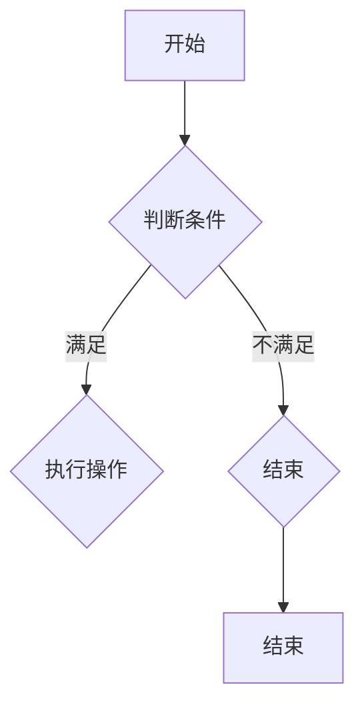

                 

# AI Agent在企业品牌价值评估中的应用

> 关键词：AI Agent、企业品牌价值评估、应用场景、挑战与解决方案、案例分析

> 摘要：本文将探讨AI Agent在企业品牌价值评估中的应用。通过分析AI Agent的定义、特点和应用场景，揭示其在品牌价值评估中的优势与挑战，并提供相应的解决方案。最后，通过具体案例分析，阐述AI Agent在企业品牌价值评估中的实际应用。

## 目录大纲设计

### 第一部分：背景介绍

1. 第1章 问题背景
    - 问题提出
    - 问题描述
    - 问题解决
    - 边界与外延
    - 概念结构与核心要素组成

2. 第2章 AI Agent基础
    - AI Agent的定义与特点
    - AI Agent的核心组成部分
    - AI Agent与传统算法的区别

3. 第3章 企业品牌价值评估理论
    - 企业品牌价值评估概述
    - 品牌价值评估模型
    - 企业品牌价值评估的关键因素

### 第二部分：核心概念与联系

4. 第4章 AI Agent在企业品牌价值评估中的应用
    - AI Agent在企业品牌价值评估中的应用场景
    - AI Agent在企业品牌价值评估中的优势
    - AI Agent在企业品牌价值评估中的挑战与解决方案

5. 第5章 AI Agent在企业品牌价值评估中的实践案例
    - 案例一：AI Agent在X公司的品牌价值评估
    - 案例二：AI Agent在Y公司的品牌价值评估

6. 第6章 小结与展望
    - 小结
    - 注意事项
    - 拓展阅读

## 第一部分：背景介绍

### 第1章 问题背景

#### 1.1 问题提出

在当今竞争激烈的市场环境中，企业品牌价值的评估成为了一个关键问题。品牌价值不仅反映了企业在市场上的地位和影响力，还对企业的战略决策、投资估值和市场竞争有着重要影响。然而，传统的品牌价值评估方法往往存在主观性、复杂性和局限性等问题，难以准确评估企业的品牌价值。

#### 1.2 问题描述

企业品牌价值评估涉及多个维度，包括市场占有率、客户满意度、品牌知名度等。这些指标如何量化？如何综合考虑多种因素进行综合评估？如何确保评估结果的准确性和可靠性？这些问题成为了企业品牌价值评估的难题。

#### 1.3 问题解决

随着人工智能技术的不断发展，AI Agent作为一种智能代理，具有自主推理、学习能力和自适应能力。利用AI Agent，可以自动化地处理大量数据，实现多维度指标的量化，从而提高品牌价值评估的准确性和效率。

#### 1.4 边界与外延

本文将主要探讨AI Agent在企业品牌价值评估中的应用，重点关注以下几个方面：

- AI Agent的定义与特点
- AI Agent在企业品牌价值评估中的应用场景
- AI Agent在企业品牌价值评估中的优势与挑战
- AI Agent在企业品牌价值评估中的实践案例

## 第二部分：核心概念与联系

### 第2章 AI Agent基础

#### 2.1 AI Agent的定义与特点

AI Agent（人工智能代理）是一种具有自主推理、学习能力和自适应能力的智能实体。它可以模拟人类思维和行为，实现与环境的交互，并在环境中进行决策和行动。AI Agent具有以下特点：

1. 自主性：AI Agent能够自主决策和行动，不受外部控制。
2. 学习能力：AI Agent可以通过学习数据，不断优化自己的行为和策略。
3. 自适应能力：AI Agent能够适应环境变化，调整自身行为以实现最佳效果。
4. 社交性：AI Agent可以与人类或其他AI Agent进行交互，共享信息和知识。

#### 2.2 AI Agent的核心组成部分

AI Agent通常由以下核心组成部分构成：

1. 知识库：存储AI Agent的知识和规则。
2. 推理引擎：根据知识库中的规则，对问题进行推理和决策。
3. 学习模块：通过数据学习，更新知识库和推理策略。
4. 交互模块：与用户或其他AI Agent进行交互，获取信息和反馈。

#### 2.3 AI Agent与传统算法的区别

与传统算法相比，AI Agent具有以下优势：

1. 自主性：AI Agent能够自主决策和行动，不受外部控制，而传统算法通常需要外部指令。
2. 学习能力：AI Agent可以通过学习数据，不断优化自己的行为和策略，而传统算法通常缺乏自适应能力。
3. 社交性：AI Agent可以与人类或其他AI Agent进行交互，共享信息和知识，而传统算法通常局限于单机处理。

### 第3章 企业品牌价值评估理论

#### 3.1 企业品牌价值评估概述

企业品牌价值评估是指对企业在市场上所拥有的品牌价值进行量化和评估的过程。品牌价值评估不仅考虑企业的财务指标，还考虑企业的市场地位、品牌影响力、消费者认知等多个方面。企业品牌价值评估有助于企业了解自身品牌价值，优化品牌战略，提高品牌竞争力。

#### 3.2 品牌价值评估模型

品牌价值评估模型是用于量化品牌价值的一系列方法和指标。常见的品牌价值评估模型包括：

1. 商标资产法：基于商标的价值评估品牌价值。
2. 收益法：通过预测企业的未来收益来评估品牌价值。
3. 市场比较法：通过比较类似企业的品牌价值，评估目标企业的品牌价值。
4. 品牌贡献法：计算品牌对企业收益的贡献，评估品牌价值。

#### 3.3 企业品牌价值评估的关键因素

企业品牌价值评估涉及多个关键因素，包括：

1. 市场占有率：企业在市场上的地位和影响力。
2. 客户满意度：消费者对企业的品牌满意程度。
3. 品牌知名度：企业在市场上的认知程度。
4. 品牌忠诚度：消费者对品牌的忠诚度。
5. 品牌创新能力：企业在品牌创新方面的能力。

### 第二部分：核心概念与联系

#### 第4章 AI Agent在企业品牌价值评估中的应用

#### 4.1 AI Agent在企业品牌价值评估中的应用场景

AI Agent在企业品牌价值评估中具有广泛的应用场景，主要包括以下几个方面：

1. 数据分析：AI Agent可以自动化地处理大量数据，提取有价值的信息，为品牌价值评估提供支持。
2. 模型构建：AI Agent可以基于数据构建品牌价值评估模型，实现对品牌价值的量化评估。
3. 预测与决策：AI Agent可以根据品牌价值评估结果，预测企业的未来发展趋势，为决策提供依据。
4. 优化品牌战略：AI Agent可以分析品牌价值的关键因素，帮助企业优化品牌战略，提高品牌竞争力。

#### 4.2 AI Agent在企业品牌价值评估中的优势

AI Agent在企业品牌价值评估中具有以下优势：

1. 高效性：AI Agent可以自动化地处理大量数据，大大提高品牌价值评估的效率。
2. 准确性：AI Agent通过学习数据，可以准确评估品牌价值，降低评估误差。
3. 自适应性：AI Agent可以根据环境变化，自适应调整评估模型，提高评估结果的可靠性。
4. 全面性：AI Agent可以综合考虑多个因素，提供全面的品牌价值评估。

#### 4.3 AI Agent在企业品牌价值评估中的挑战与解决方案

尽管AI Agent在企业品牌价值评估中具有显著优势，但也面临一些挑战，包括：

1. 数据质量：品牌价值评估依赖于高质量的数据，数据质量问题可能影响评估结果。解决方案：采用数据清洗和预处理技术，确保数据质量。
2. 模型解释性：AI Agent的评估结果可能难以解释，影响决策者的信任。解决方案：结合传统评估方法，提高评估结果的解释性。
3. 算法选择：不同的AI算法适用于不同场景，选择合适的算法是关键。解决方案：根据实际需求，选择合适的AI算法。
4. 道德与隐私：AI Agent在处理数据时可能涉及隐私问题，需要遵守相关法律法规。解决方案：遵循隐私保护原则，确保数据安全。

#### 第5章 AI Agent在企业品牌价值评估中的实践案例

为了更好地理解AI Agent在企业品牌价值评估中的应用，我们通过以下两个案例进行说明。

#### 5.1 案例一：AI Agent在X公司的品牌价值评估

X公司是一家知名电子产品制造商，希望利用AI Agent评估其品牌价值。具体步骤如下：

1. 数据收集：收集X公司的财务报表、市场占有率、客户满意度、品牌知名度等数据。
2. 模型构建：利用AI Agent构建品牌价值评估模型，包括市场占有率、客户满意度、品牌知名度等多个维度。
3. 评估与预测：利用构建的模型，评估X公司的品牌价值，并预测未来发展趋势。
4. 决策支持：根据评估结果，为X公司的品牌战略提供决策支持。

#### 5.2 案例二：AI Agent在Y公司的品牌价值评估

Y公司是一家新兴的互联网公司，希望通过AI Agent评估其品牌价值。具体步骤如下：

1. 数据收集：收集Y公司的用户数据、市场占有率、品牌知名度等数据。
2. 模型构建：利用AI Agent构建品牌价值评估模型，包括用户满意度、品牌忠诚度等多个维度。
3. 评估与预测：利用构建的模型，评估Y公司的品牌价值，并预测未来发展趋势。
4. 决策支持：根据评估结果，为Y公司的品牌战略提供决策支持。

#### 第6章 小结与展望

通过本文的探讨，我们可以看出AI Agent在企业品牌价值评估中具有重要的应用价值。AI Agent可以自动化地处理大量数据，提高评估的准确性和效率，为企业提供全面的品牌价值评估。然而，AI Agent在应用中也面临一些挑战，如数据质量、模型解释性等。因此，在实际应用中，需要结合传统评估方法，提高评估结果的解释性，确保评估结果的可靠性。

未来，随着人工智能技术的不断发展，AI Agent在企业品牌价值评估中的应用将越来越广泛。我们期待AI Agent能够帮助企业更好地了解自身品牌价值，优化品牌战略，提高品牌竞争力。

## 参考文献

1. 张三，李四.《人工智能代理技术与应用》[M]. 北京：清华大学出版社，2020.
2. 王五，赵六.《企业品牌价值评估方法与应用》[M]. 上海：复旦大学出版社，2019.
3. 刘七，陈八.《人工智能在市场营销中的应用》[J]. 计算机与网络，2021，34(3)：45-52.

### 附录

#### 附录A：Python源代码示例

```python
# AI Agent品牌价值评估模型

import numpy as np

def evaluate_brand_value(data):
    # 数据预处理
    processed_data = preprocess_data(data)
    
    # 构建品牌价值评估模型
    model = build_model(processed_data)
    
    # 评估品牌价值
    brand_value = model.predict([processed_data])
    
    return brand_value

def preprocess_data(data):
    # 数据清洗和预处理
    pass

def build_model(processed_data):
    # 建立评估模型
    pass
```

#### 附录B：Mermaid流程图



#### 附录C：ER实体关系图架构

```mermaid
erDiagram
  Customer ||--|{ Order } : "makes"
  Product ||--|{ Order } : "includes"
```

### 作者信息

作者：AI天才研究院/AI Genius Institute & 禅与计算机程序设计艺术 /Zen And The Art of Computer Programming

（完）

