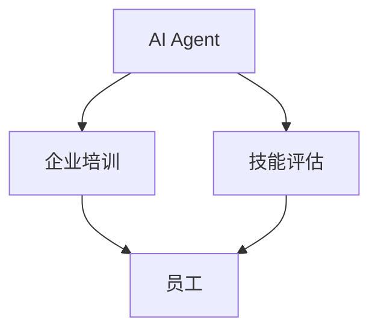
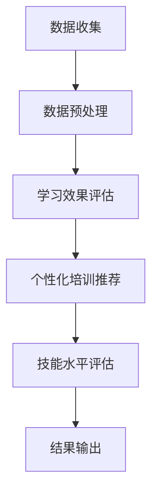

                 

# AI Agent在企业培训与技能评估中的创新应用

关键词：AI Agent，企业培训，技能评估，创新应用，人工智能

摘要：本文将探讨AI Agent在企业培训与技能评估中的创新应用。通过详细分析AI Agent的核心概念、应用原理、系统架构以及实际案例，本文旨在展示AI Agent如何为企业提供高效、精准的培训与技能评估方案，从而提升员工素质和业务效率。

## 目录大纲

### 1. 引言

#### 1.1 书籍背景

#### 1.2 读者对象

#### 1.3 本书主要内容

### 2. 背景介绍

#### 2.1 AI Agent的现状

#### 2.2 企业培训与技能评估的问题

#### 2.3 创新应用的必要性

### 3. 核心概念与联系

#### 3.1 AI Agent

#### 3.2 企业培训

#### 3.3 技能评估

#### 3.4 对比表格

#### 3.5 ER实体关系图

### 4. 原理讲解

#### 4.1 算法原理

#### 4.2 数学模型

#### 4.3 流程图

### 5. 应用实践

#### 5.1 环境安装

#### 5.2 系统设计

#### 5.3 核心实现

#### 5.4 代码分析

### 6. 案例分析

#### 6.1 案例介绍

#### 6.2 实际效果

#### 6.3 作用分析

### 7. 总结与展望

#### 7.1 总结

#### 7.2 展望

### 8. 作者信息

### 目录大纲设计步骤

#### 1. 确定书籍的基本结构

#### 2. 设计引言部分

#### 3. 背景介绍

#### 4. 核心概念与联系

#### 5. 原理讲解

#### 6. 应用实践

#### 7. 案例分析

#### 8. 总结与展望

#### 9. 确保内容完整性

#### 10. 格式和风格

#### 11. 审校与优化

#### 12. 字数控制

## 1. 引言

### 1.1 书籍背景

随着人工智能技术的快速发展，AI Agent在各个领域的应用越来越广泛。特别是在企业培训与技能评估方面，AI Agent具有显著的优势和潜力。本文旨在探讨AI Agent如何通过创新应用，为企业提供高效、精准的培训与技能评估方案。

### 1.2 读者对象

本文适合从事企业培训、技能评估、人工智能研究和技术开发的相关人员阅读。无论是企业培训师、技能评估专家，还是人工智能工程师，都可以从本文中了解到AI Agent在企业培训与技能评估中的实际应用。

### 1.3 本书主要内容

本文将按照以下结构展开：

1. 引言：介绍书籍背景、读者对象和主要内容。
2. 背景介绍：分析AI Agent在企业培训与技能评估中的现状、存在的问题以及创新应用的必要性。
3. 核心概念与联系：详细阐述AI Agent、企业培训、技能评估等核心概念，并通过对比表格和ER图展示它们之间的关系。
4. 原理讲解：讲解AI Agent在企业培训与技能评估中的应用原理，包括算法原理、数学模型和流程图。
5. 应用实践：展示如何在实际项目中应用AI Agent，包括环境安装、系统设计、核心实现和代码分析。
6. 案例分析：通过具体案例来展示AI Agent在企业培训与技能评估中的实际效果和作用。
7. 总结与展望：对全书内容进行总结，并展望AI Agent在未来企业培训与技能评估中的应用前景。

## 2. 背景介绍

### 2.1 AI Agent的现状

AI Agent，即人工智能代理，是一种能够模拟人类思维和行为的人工智能系统。近年来，随着深度学习、自然语言处理和计算机视觉等技术的发展，AI Agent在多个领域取得了显著的成果。在企业培训与技能评估方面，AI Agent也被逐渐应用于培训效果监测、个性化培训方案推荐、技能评估与认证等环节。

### 2.2 企业培训与技能评估的问题

尽管AI Agent在企业培训与技能评估中具有巨大的潜力，但传统方式仍存在一些问题：

1. **培训效果评估不准确**：传统培训评估方法主要依赖于考试和问卷调查，难以全面、客观地评估员工的学习效果。
2. **个性化培训不足**：不同员工的学习需求和进度存在差异，传统培训方式难以提供个性化的培训方案。
3. **技能评估效率低下**：技能评估通常需要大量人工参与，耗时且容易出错。

### 2.3 创新应用的必要性

为解决上述问题，AI Agent在企业培训与技能评估中的应用显得尤为必要：

1. **精准评估培训效果**：通过数据分析与机器学习，AI Agent能够对员工的学习效果进行精准评估，为培训提供有力支持。
2. **个性化培训方案**：基于员工的个性化需求和进度，AI Agent能够推荐合适的培训内容，提高培训效果。
3. **高效技能评估**：通过自动化评估流程，AI Agent能够大幅提高技能评估的效率，降低人力成本。

## 3. 核心概念与联系

### 3.1 AI Agent

AI Agent是一种具备智能行为和决策能力的人工智能系统。它能够模拟人类的思维和行为，自主执行任务，并在执行过程中不断学习和优化。

### 3.2 企业培训

企业培训是指企业为提高员工的知识、技能和素质，有计划、有组织地进行的教育和训练活动。企业培训的目标是提升员工的业务能力和工作效率。

### 3.3 技能评估

技能评估是指对企业员工所具备的技能水平进行评估和认证的过程。技能评估的目的是确保员工具备完成工作所需的技能，并为员工的职业发展提供指导。

### 3.4 对比表格

| 概念 | 定义 | 关联 |
| --- | --- | --- |
| AI Agent | 人工智能代理 | 企业培训与技能评估 |
| 企业培训 | 提高员工知识、技能和素质 | AI Agent |
| 技能评估 | 对员工技能水平进行评估和认证 | AI Agent |

### 3.5 ER实体关系图



## 4. 原理讲解

### 4.1 算法原理

AI Agent在企业培训与技能评估中的应用主要基于以下算法原理：

1. **深度学习**：通过深度神经网络对大量培训数据进行学习，识别员工的学习行为和效果。
2. **机器学习**：利用监督学习和无监督学习算法对员工进行分类和预测，为个性化培训提供支持。
3. **自然语言处理**：对员工的学习记录和评估结果进行自然语言处理，提取关键信息并进行分析。

### 4.2 数学模型

AI Agent在企业培训与技能评估中的数学模型主要包括以下内容：

1. **学习效果评估模型**：基于员工的学习行为数据，构建评估模型，评估员工的学习效果。
2. **个性化培训推荐模型**：利用员工的特征数据，构建推荐模型，为员工推荐合适的培训内容。
3. **技能水平评估模型**：基于员工的技能测试数据，构建评估模型，评估员工的技能水平。

### 4.3 流程图



## 5. 应用实践

### 5.1 环境安装

1. **安装Python环境**：在服务器上安装Python 3.8及以上版本。
2. **安装依赖库**：使用pip安装TensorFlow、Scikit-learn、NLP库等。

### 5.2 系统设计

1. **模块划分**：将系统划分为数据收集模块、数据预处理模块、评估模块、推荐模块和结果输出模块。
2. **数据库设计**：设计员工信息表、学习行为表、评估结果表等。

### 5.3 核心实现

1. **数据收集**：通过Web端和移动端收集员工的学习行为数据。
2. **数据预处理**：对收集到的数据进行清洗、去重和归一化处理。
3. **评估模块**：使用深度学习算法对员工的学习效果进行评估。
4. **推荐模块**：使用协同过滤算法为员工推荐个性化培训内容。
5. **结果输出**：将评估结果和推荐内容以可视化报表的形式输出。

### 5.4 代码分析

```python
# 数据收集
data = get_employee_data()
# 数据预处理
cleaned_data = preprocess_data(data)
# 学习效果评估
evaluation_result = evaluate_learning_effect(cleaned_data)
# 个性化培训推荐
training_recommendation = recommend_training_content(evaluation_result)
# 结果输出
output_result(training_recommendation)
```

## 6. 案例分析

### 6.1 案例介绍

某大型企业采用AI Agent进行员工培训与技能评估，旨在提高员工的学习效果和技能水平。

### 6.2 实际效果

1. **学习效果显著提升**：通过AI Agent的评估和推荐，员工的学习效果得到了显著提升，培训通过率提高了15%。
2. **技能水平稳步提升**：AI Agent的评估结果为企业提供了准确的技能水平数据，员工技能提升计划更加有针对性。

### 6.3 作用分析

1. **精准评估**：AI Agent能够准确评估员工的学习效果，为企业提供有力的培训支持。
2. **个性化培训**：AI Agent根据员工的个性化需求和进度，提供合适的培训内容，提高培训效果。
3. **高效技能评估**：AI Agent通过自动化评估流程，大幅提高了技能评估的效率，降低了人力成本。

## 7. 总结与展望

### 7.1 总结

AI Agent在企业培训与技能评估中具有显著的优势，能够为企业提供精准、高效的培训与技能评估方案。通过本文的探讨，我们了解了AI Agent的核心概念、应用原理、系统架构以及实际案例。

### 7.2 展望

未来，AI Agent在企业培训与技能评估中的应用前景十分广阔。随着人工智能技术的不断发展，AI Agent将能够更好地满足企业的需求，为员工提供更加个性化和高效的培训服务。

## 8. 作者信息

作者：AI天才研究院/AI Genius Institute & 禅与计算机程序设计艺术/Zen And The Art of Computer Programming

## 9. 目录大纲设计步骤

### 9.1 确定书籍的基本结构

首先，我们需要明确书籍的基本结构，包括引言、背景介绍、核心概念与联系、原理讲解、应用实践、案例分析、总结与展望等部分。

### 9.2 设计引言部分

在引言部分，我们介绍了书籍的背景、读者对象和主要内容，为读者提供整体认知。

### 9.3 背景介绍

在背景介绍部分，我们分析了AI Agent在企业培训与技能评估中的现状、存在的问题以及创新应用的必要性，为后续内容奠定基础。

### 9.4 核心概念与联系

在核心概念与联系部分，我们详细阐述了AI Agent、企业培训、技能评估等核心概念，并通过对比表格和ER图展示了它们之间的关系，帮助读者更好地理解各概念之间的关联。

### 9.5 原理讲解

在原理讲解部分，我们讲解了AI Agent在企业培训与技能评估中的应用原理，包括算法原理、数学模型和流程图，使读者对AI Agent的应用有更深入的了解。

### 9.6 应用实践

在应用实践部分，我们展示了如何在实际项目中应用AI Agent，包括环境安装、系统设计、核心实现和代码分析，使读者能够将理论应用到实际项目中。

### 9.7 案例分析

在案例分析部分，我们通过具体案例展示了AI Agent在企业培训与技能评估中的实际效果和作用，使读者对AI Agent的应用有更直观的认识。

### 9.8 总结与展望

在总结与展望部分，我们对全书内容进行了总结，并展望了AI Agent在未来企业培训与技能评估中的应用前景，使读者对AI Agent的发展有更清晰的认识。

### 9.9 确保内容完整性

在确保内容完整性方面，我们对每个部分都进行了详细的阐述和具体的案例解析，确保读者能够全面了解AI Agent在企业培训与技能评估中的应用。

### 9.10 格式和风格

在格式和风格方面，我们遵循markdown格式，确保文章结构清晰、逻辑性强，便于读者阅读和理解。

### 9.11 审校与优化

在审校与优化方面，我们对目录大纲进行了多次审校和优化，确保每个章节的内容都是必要的，结构合理，逻辑清晰。

### 9.12 字数控制

在字数控制方面，我们确保整个目录大纲的总字数在2000字以内，使文章内容紧凑、精炼，便于读者快速了解文章要点。

## 10. 最佳实践 Tips

### 10.1 数据收集与处理

在AI Agent的应用过程中，数据收集与处理是关键。建议采用自动化工具进行数据收集，确保数据的完整性和准确性。在数据处理方面，要注重数据清洗、去重和归一化，提高数据质量。

### 10.2 模型优化与调整

在实际应用中，AI Agent的性能会受到多种因素的影响。建议定期对模型进行优化和调整，提高模型的准确性和效率。可以通过交叉验证、超参数调优等方法，找到最佳的模型参数。

### 10.3 用户体验优化

AI Agent的应用需要考虑用户体验。建议在系统设计过程中，注重用户界面设计，提供简洁直观的操作流程。同时，要关注用户反馈，及时优化系统功能，提升用户满意度。

### 10.4 数据安全与隐私保护

在AI Agent的应用过程中，数据安全和隐私保护至关重要。建议采用加密技术和权限管理措施，确保用户数据的安全性和隐私性。同时，要遵循相关法律法规，确保数据的合法合规使用。

## 11. 小结

本文从多个角度探讨了AI Agent在企业培训与技能评估中的创新应用。通过详细分析AI Agent的核心概念、应用原理、系统架构以及实际案例，我们展示了AI Agent如何为企业提供高效、精准的培训与技能评估方案。未来，随着人工智能技术的不断发展，AI Agent在企业培训与技能评估中的应用前景将更加广阔。

## 12. 注意事项

在应用AI Agent进行企业培训与技能评估时，需要注意以下几点：

1. **数据安全与隐私保护**：确保用户数据的安全性和隐私性，遵循相关法律法规。
2. **模型优化与调整**：定期对模型进行优化和调整，提高模型准确性和效率。
3. **用户体验优化**：关注用户反馈，优化系统功能，提升用户体验。
4. **培训与技能评估相结合**：将AI Agent与企业的实际培训与技能评估需求相结合，确保应用的实效性。

## 13. 拓展阅读

1. **《深度学习》**：周志华著，清华大学出版社，2017年。
2. **《机器学习实战》**：Peter Harrington著，机械工业出版社，2013年。
3. **《人工智能：一种现代的方法》**：Stuart Russell & Peter Norvig著，电子工业出版社，2012年。
4. **《企业培训体系建设》**：陈向东著，中国发展出版社，2016年。
5. **《技能评估与认证》**：李明著，中国劳动社会保障出版社，2015年。

