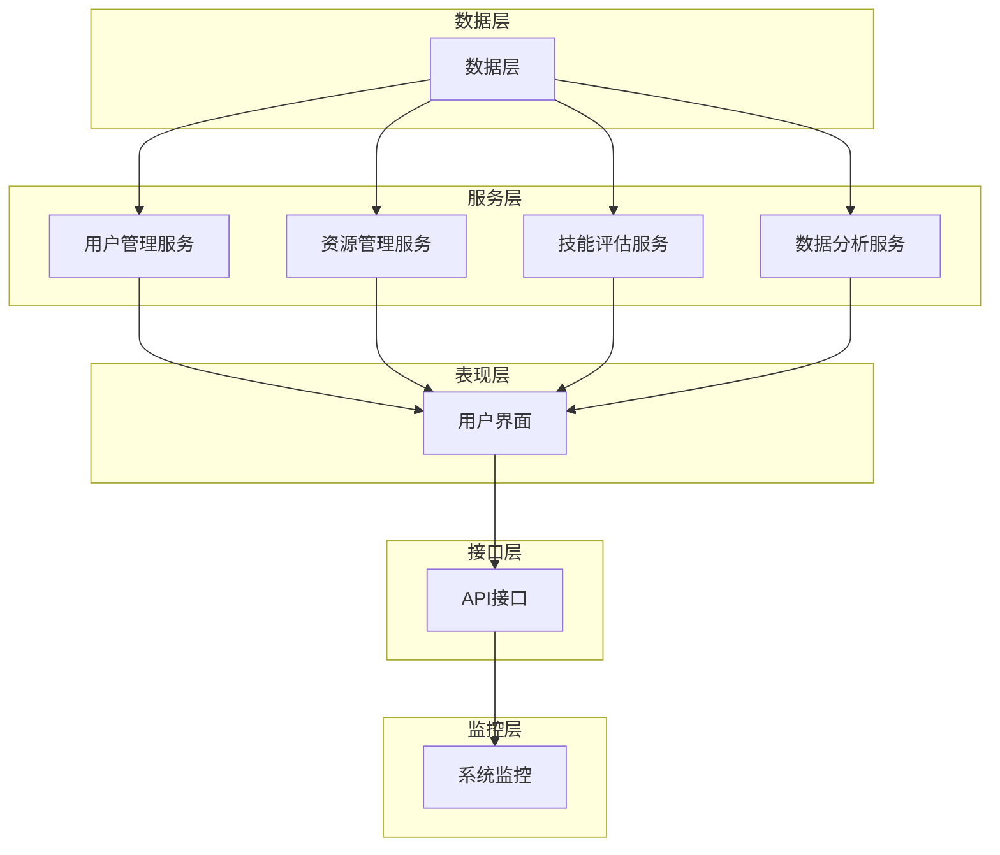
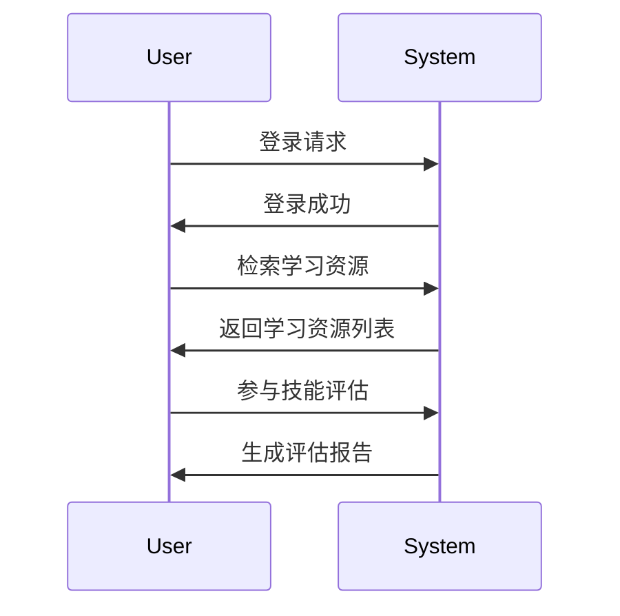

                 

# AI Agent在企业培训与技能评估中的应用

## 关键词
- AI Agent
- 企业培训
- 技能评估
- 个性化学习
- 数据分析

## 摘要
随着人工智能技术的快速发展，AI Agent作为一种智能化的虚拟实体，正逐渐在各个领域发挥作用。本文将探讨AI Agent在企业培训与技能评估中的应用，通过深入分析AI Agent的核心概念、工作原理、实际案例，揭示其在提升培训效果和技能评估准确性的潜力。本文还将讨论设计、实现和应用AI Agent的注意事项，以及未来发展的方向。

## 目录

### 引言

#### AI Agent的定义与背景

#### 企业培训与技能评估的重要性

#### 本文的目的与结构

### AI Agent的核心概念与工作原理

#### AI Agent的基本概念

#### AI Agent的工作原理

#### AI Agent的技术架构

### AI Agent在个性化学习中的应用

#### 个性化学习的需求与挑战

#### AI Agent在个性化学习中的角色

#### 实现个性化学习的算法原理

### AI Agent在技能评估中的应用

#### 技能评估的需求与挑战

#### AI Agent在技能评估中的角色

#### 技能评估的算法原理

### 案例研究

#### 案例一：企业培训中的应用

#### 案例二：技能评估中的应用

### 设计与实现AI Agent的系统架构

#### 系统架构的设计原则

#### 系统功能设计

#### 系统架构设计

#### 系统接口设计

#### 系统交互流程

### 项目实战

#### 环境安装与配置

#### 系统核心实现

#### 代码应用解读

#### 案例分析

### 最佳实践与注意事项

#### 最佳实践

#### 注意事项

#### 拓展阅读

### 结论

#### AI Agent在培训与技能评估中的应用前景

#### 未来发展方向

#### 对企业和员工的启示

### 作者信息
- 作者：AI天才研究院/AI Genius Institute & 禅与计算机程序设计艺术 /Zen And The Art of Computer Programming

## 引言

随着信息技术的飞速发展，人工智能（AI）已经成为改变各行各业的强大力量。其中，AI Agent作为一种智能化的虚拟实体，正逐渐在各个领域展现其独特的价值。AI Agent，即人工智能代理，是一种能够模拟人类智能行为，完成特定任务的自动化系统。在企业培训与技能评估中，AI Agent的应用不仅能够提高培训的效果，还能够更准确地评估员工的技能水平，为企业的长期发展提供有力支持。

### AI Agent的定义与背景

AI Agent的定义可以从多个角度来理解。首先，它是一种具有自主性和智能性的软件实体，能够通过感知环境、理解问题和制定策略来完成任务。其次，AI Agent是一种基于机器学习、自然语言处理、计算机视觉等人工智能技术的综合应用，能够模仿人类的思维方式进行决策和行动。

AI Agent的发展可以追溯到20世纪80年代，当时的计算机科学家开始探索如何让计算机模拟人类的思维过程。随着人工智能技术的不断进步，AI Agent逐渐从理论研究走向实际应用。尤其是在大数据、云计算和物联网的推动下，AI Agent的应用范围和效果得到了显著提升。

### 企业培训与技能评估的重要性

企业培训与技能评估是企业运营和发展的重要环节。有效的培训可以提高员工的职业素养和技能水平，从而提高企业的生产效率和竞争力。而准确的技能评估可以帮助企业了解员工的实际能力，为人才管理和职业发展提供科学依据。

然而，传统的企业培训与技能评估方法存在一些问题。首先，培训内容的个性化程度较低，难以满足不同员工的学习需求。其次，技能评估的方法较为单一，无法全面反映员工的技能水平。这些问题在一定程度上限制了企业培训与技能评估的效果。

### 本文的目的与结构

本文旨在探讨AI Agent在企业培训与技能评估中的应用，通过深入分析AI Agent的核心概念、工作原理、实际案例，揭示其在提升培训效果和技能评估准确性的潜力。本文的结构如下：

1. **AI Agent的核心概念与工作原理**：介绍AI Agent的定义、基本概念和工作原理，包括其技术架构。

2. **AI Agent在个性化学习中的应用**：探讨AI Agent在个性化学习中的需求与挑战，以及其实际应用场景和算法原理。

3. **AI Agent在技能评估中的应用**：分析AI Agent在技能评估中的需求与挑战，以及其应用方法和算法原理。

4. **案例研究**：通过实际案例研究，展示AI Agent在企业和学校中的应用效果。

5. **设计与实现AI Agent的系统架构**：介绍AI Agent系统架构的设计原则、功能设计、架构设计、接口设计和交互流程。

6. **项目实战**：介绍一个具体的AI Agent项目，包括环境安装、系统实现、代码解析和案例分析。

7. **最佳实践与注意事项**：总结AI Agent应用的实践经验，提供最佳实践和建议。

8. **结论**：总结本文的研究成果，探讨AI Agent在培训与技能评估中的应用前景。

## AI Agent的核心概念与工作原理

### AI Agent的基本概念

AI Agent是一种能够模拟人类智能行为，具备自主决策和执行能力的虚拟实体。它通过感知环境、理解问题和制定策略来实现特定任务。AI Agent的核心特点包括自主性、智能性和适应性。

- **自主性**：AI Agent能够在没有人类直接干预的情况下，独立地完成任务。这意味着AI Agent具有自我管理和自我决策的能力。
- **智能性**：AI Agent能够通过学习、推理和规划来完成任务。它利用人工智能技术，如机器学习、自然语言处理和计算机视觉等，模拟人类的思维过程。
- **适应性**：AI Agent能够根据环境变化和任务需求调整其行为和策略。它通过不断学习和优化，提高任务完成的效率和质量。

### AI Agent的工作原理

AI Agent的工作原理可以分为以下几个步骤：

1. **感知**：AI Agent通过传感器（如摄像头、麦克风、传感器等）收集环境信息。这些信息可以是文本、图像、声音等。
2. **理解**：AI Agent利用自然语言处理、计算机视觉等技术对感知到的信息进行分析和理解。这一步骤包括信息的分类、识别和理解其含义。
3. **决策**：AI Agent根据理解的结果，通过推理和规划制定行动策略。这一步骤涉及到决策算法和策略优化。
4. **执行**：AI Agent根据决策策略执行具体的任务。这一步骤可能涉及多个步骤，如发送指令、控制机器人等。
5. **反馈**：AI Agent在执行任务后，收集执行结果，并将其反馈给系统。这一步骤用于评估任务完成的效果，并调整后续的行动策略。

### AI Agent的技术架构

AI Agent的技术架构通常包括以下几个关键组件：

1. **感知组件**：负责收集和预处理感知数据，如图像、声音、文本等。
2. **理解组件**：负责对感知数据进行分析和理解，如使用自然语言处理技术进行文本分析，使用计算机视觉技术进行图像识别。
3. **决策组件**：负责根据理解和感知数据制定行动策略，如使用机器学习算法进行决策。
4. **执行组件**：负责执行具体的任务，如控制机器人、发送指令等。
5. **反馈组件**：负责收集任务执行结果，并将其反馈给系统，用于进一步优化和调整。

通过这些组件的协同工作，AI Agent能够实现高度自动化和智能化的任务执行，为企业培训与技能评估提供有力支持。

## AI Agent在个性化学习中的应用

### 个性化学习的需求与挑战

在当今快速变化的工作环境中，企业对员工的培训需求日益多样化。员工需要不断更新知识和技能，以适应新的工作要求。因此，个性化学习成为了一种重要的培训模式。个性化学习旨在根据每个员工的学习需求、学习习惯和能力，提供定制化的学习内容和方式。

#### 需求

1. **个性化学习内容**：员工需要根据其工作角色和职业发展需求，获取与其职业相关的知识和技能。
2. **灵活的学习方式**：员工的学习方式应该多样化，包括线上学习、线下培训、实践操作等。
3. **持续的学习反馈**：员工需要及时获取学习效果和反馈，以便调整学习策略。

#### 挑战

1. **学习资源管理**：企业需要管理大量的学习资源，如视频、文档、课程等，以确保员工能够方便地获取所需的学习内容。
2. **个性化学习推荐**：如何根据员工的学习习惯和能力，推荐适合其个人发展的学习内容，是一个技术难题。
3. **学习效果评估**：如何准确地评估员工的学习效果，以及如何将学习效果与员工的职业发展相挂钩，也是一个重要的挑战。

### AI Agent在个性化学习中的角色

AI Agent在个性化学习中扮演了关键角色，它能够通过以下方式提升培训效果：

1. **学习需求分析**：AI Agent可以通过分析员工的学习历史和行为数据，了解其学习需求和偏好。
2. **个性化内容推荐**：AI Agent可以根据员工的学习需求和学习偏好，推荐适合其个人发展的学习内容和方式。
3. **学习路径规划**：AI Agent可以根据员工的学习进度和能力，规划个性化的学习路径，确保员工能够高效地完成学习任务。
4. **学习效果评估**：AI Agent可以实时监控员工的学习效果，并提供个性化的学习反馈，帮助员工调整学习策略。

### 实现个性化学习的算法原理

AI Agent在实现个性化学习中主要依赖于以下几种算法：

1. **协同过滤**：协同过滤是一种常用的推荐算法，它通过分析用户的历史行为和偏好，为用户推荐相似的内容。在个性化学习中，协同过滤可以用于推荐与员工职业发展相关的学习资源。
   
   算法原理：
   - 用户-物品评分矩阵：构建用户-物品评分矩阵，其中用户表示员工，物品表示学习资源。
   - 相似度计算：计算员工之间的相似度，如基于用户评分的余弦相似度或基于用户历史行为的Jaccard相似度。
   - 推荐生成：根据员工之间的相似度和学习资源的评分，为员工推荐相似的学习资源。

2. **基于内容的推荐**：基于内容的推荐算法通过分析学习资源的特征，为员工推荐具有相似特征的学习资源。

   算法原理：
   - 学习资源特征提取：从学习资源中提取特征，如文本的词汇、图像的像素等。
   - 相似度计算：计算学习资源之间的相似度，如基于文本相似度的TF-IDF计算或基于图像相似度的余弦相似度计算。
   - 推荐生成：根据学习资源之间的相似度，为员工推荐具有相似特征的学习资源。

3. **学习路径规划算法**：学习路径规划算法通过分析员工的学习进度和能力，规划个性化的学习路径。

   算法原理：
   - 学习进度监控：实时监控员工的学习进度，如已完成课程的数量、学习时间等。
   - 能力评估：通过考试、测验等方式评估员工的学习能力，如分数、正确率等。
   - 路径规划：根据学习进度和能力评估结果，规划个性化的学习路径，包括学习资源的顺序、难度等。

通过这些算法的协同作用，AI Agent能够为员工提供个性化的学习体验，提高培训效果。

## AI Agent在技能评估中的应用

### 技能评估的需求与挑战

技能评估是企业人力资源管理和员工职业发展的重要环节。准确的技能评估可以帮助企业了解员工的实际能力，为人才选拔、培训和发展提供科学依据。然而，传统的技能评估方法存在一些局限性，无法满足现代企业的需求。

#### 需求

1. **准确性**：技能评估需要准确反映员工的实际能力，确保评估结果的公正性和可靠性。
2. **全面性**：技能评估需要涵盖员工的各个方面技能，包括专业能力、沟通能力、团队合作能力等。
3. **实时性**：技能评估需要实时反映员工的能力变化，以便及时调整培训和发展策略。

#### 挑战

1. **评估方法单一**：传统的技能评估方法主要依赖于面试、笔试和考试，难以全面反映员工的实际能力。
2. **评估过程主观**：传统的技能评估过程容易受到评估者主观因素的影响，导致评估结果不够客观。
3. **评估数据缺失**：传统的技能评估方法难以收集到员工的实时工作数据，导致评估结果缺乏依据。

### AI Agent在技能评估中的角色

AI Agent在技能评估中发挥着重要作用，它能够通过以下方式提升评估的准确性和全面性：

1. **数据分析**：AI Agent可以利用大数据分析技术，收集和处理员工的实时工作数据，如绩效数据、项目完成情况等，从而提供更加准确的评估结果。
2. **自动化评估**：AI Agent可以通过自然语言处理和计算机视觉等技术，自动化评估员工的技能水平，减少评估过程的主观性。
3. **实时监控**：AI Agent可以实时监控员工的工作过程，记录其行为和表现，为技能评估提供实时数据支持。
4. **个性化推荐**：AI Agent可以根据评估结果，为员工提供个性化的培训和发展建议，帮助员工提升技能。

### 技能评估的算法原理

AI Agent在技能评估中主要依赖于以下几种算法：

1. **机器学习算法**：机器学习算法可以用于分析员工的工作数据，识别其技能水平和能力趋势。常用的算法包括决策树、随机森林、支持向量机等。

   算法原理：
   - 数据收集：收集员工的绩效数据、项目完成情况等。
   - 特征提取：从数据中提取关键特征，如项目完成时间、错误率等。
   - 模型训练：使用训练数据训练机器学习模型，如决策树模型或支持向量机模型。
   - 评估预测：使用训练好的模型对员工进行技能评估，预测其技能水平和能力趋势。

2. **自然语言处理算法**：自然语言处理算法可以用于分析员工的文本资料，如工作日志、报告等，提取关键信息和技能点。

   算法原理：
   - 文本预处理：对文本进行分词、去噪等预处理操作。
   - 词频分析：计算文本中关键词的频率，识别技能点。
   - 文本分类：使用文本分类算法，如朴素贝叶斯、卷积神经网络等，对文本进行分类，确定技能类别。

3. **计算机视觉算法**：计算机视觉算法可以用于分析员工的视频资料，如工作演示、面试视频等，评估其表现和技能水平。

   算法原理：
   - 视频预处理：对视频进行降噪、去抖动等预处理操作。
   - 视频分割：将视频分割成帧，提取关键帧。
   - 行为识别：使用行为识别算法，如深度学习模型，识别员工的行为和表现。
   - 评估预测：根据视频内容和行为识别结果，评估员工的技能水平和能力。

通过这些算法的协同作用，AI Agent能够提供全面、准确、实时的技能评估结果，帮助企业更好地管理和培养人才。

## 案例研究

### 案例一：企业培训中的应用

#### 背景介绍

某大型跨国公司为了提高员工的职业技能和竞争力，决定引入AI Agent进行企业培训。公司拥有一支多样化的员工队伍，分布在不同的部门和地区。传统的培训方式由于时间和地域的限制，难以满足所有员工的需求。因此，公司希望利用AI Agent提供个性化的培训解决方案。

#### 应用场景

1. **个性化学习推荐**：AI Agent根据员工的学习历史、工作需求和职业发展目标，推荐适合其个人发展的学习资源和课程。

2. **学习路径规划**：AI Agent根据员工的学习进度和能力，规划个性化的学习路径，确保员工能够高效地完成学习任务。

3. **学习效果评估**：AI Agent实时监控员工的学习进度和效果，并提供个性化的学习反馈，帮助员工调整学习策略。

#### 应用效果

1. **提高培训效果**：通过个性化学习推荐和学习路径规划，员工能够更加高效地学习，学习效果显著提高。

2. **提升员工满意度**：AI Agent提供的个性化培训方案，使员工感受到公司对其职业发展的关注和重视，提升了员工的工作满意度和忠诚度。

3. **优化人力资源配置**：通过AI Agent的实时监控和反馈，公司能够更好地了解员工的学习情况和技能水平，优化人力资源的配置和分配。

### 案例二：技能评估中的应用

#### 背景介绍

某IT公司为了提升员工的技术能力和项目执行力，决定引入AI Agent进行技能评估。公司拥有一支技术精湛的团队，但由于项目需求的不断变化，对员工的技术能力和适应能力提出了更高的要求。因此，公司希望通过AI Agent对员工进行全面的技能评估，以优化团队结构和项目执行效果。

#### 应用场景

1. **技能数据分析**：AI Agent收集员工的绩效数据、项目完成情况等，分析其技能水平和能力趋势。

2. **自动化评估**：AI Agent通过自然语言处理和计算机视觉等技术，自动化评估员工的技能水平。

3. **实时监控**：AI Agent实时监控员工的工作过程，记录其行为和表现，为技能评估提供实时数据支持。

4. **个性化推荐**：AI Agent根据评估结果，为员工提供个性化的培训和发展建议，帮助员工提升技能。

#### 应用效果

1. **提升技能评估准确性**：通过自动化评估和实时监控，AI Agent能够提供更加准确和全面的技能评估结果，减少评估过程的主观性。

2. **优化团队结构**：通过技能评估结果，公司能够更好地了解员工的技能水平，优化团队结构和项目分配，提高项目执行效率。

3. **提升员工职业发展**：AI Agent提供的个性化培训和发展建议，帮助员工不断提升技能，实现职业发展目标。

通过这些案例研究，可以看出AI Agent在企业培训与技能评估中的应用取得了显著的成果。AI Agent不仅提高了培训效果和评估准确性，还优化了人力资源管理和项目执行效果，为企业的发展提供了有力支持。

## 设计与实现AI Agent的系统架构

### 系统架构的设计原则

在设计与实现AI Agent的系统架构时，需要遵循以下几个关键原则：

1. **模块化设计**：系统应具有清晰的模块划分，每个模块负责特定的功能，便于系统的维护和扩展。
2. **可扩展性**：系统应具备良好的扩展性，能够根据企业需求的变化，灵活地增加或修改功能模块。
3. **高可靠性**：系统应确保数据的安全性和稳定性，采用冗余设计和备份策略，防止数据丢失和系统故障。
4. **用户友好性**：系统应提供直观易用的用户界面，确保员工能够轻松上手使用，提高系统的普及率和使用效果。
5. **可定制化**：系统应支持个性化的配置和定制，满足不同企业和员工的特定需求。

### 系统功能设计

AI Agent的系统功能设计包括以下几个关键模块：

1. **用户管理模块**：负责用户的注册、登录、权限管理和个人信息管理，确保系统的安全性。
2. **学习资源管理模块**：负责管理学习资源，包括课程、视频、文档等，并提供资源的检索和推荐功能。
3. **技能评估模块**：负责对员工的技能进行自动化评估，提供评估报告和个性化培训建议。
4. **数据分析模块**：负责收集、存储和分析员工的学习数据和工作数据，为系统提供决策支持。
5. **系统管理模块**：负责系统的配置、监控和维护，确保系统的正常运行。

### 系统架构设计

AI Agent的系统架构设计采用分层架构，主要包括以下几个层次：

1. **数据层**：负责数据的存储和管理，包括用户数据、学习数据、评估数据和日志数据等。
2. **服务层**：负责系统的核心功能实现，包括用户管理、资源管理、评估分析和数据挖掘等。
3. **表现层**：负责用户界面的设计和实现，提供用户友好的交互界面。
4. **接口层**：负责与其他系统集成，提供API接口，方便第三方系统调用。

### 系统接口设计

系统接口设计包括以下关键接口：

1. **用户接口**：提供用户注册、登录、查看学习资源、参与评估等功能。
2. **资源接口**：提供学习资源的检索、推荐和下载等功能。
3. **评估接口**：提供技能评估数据的收集、分析和报告生成等功能。
4. **数据接口**：提供数据上传、下载和共享等功能，便于数据的分析和挖掘。
5. **监控接口**：提供系统监控和告警功能，确保系统的稳定运行。

### 系统交互流程

AI Agent的系统交互流程主要包括以下几个步骤：

1. **用户登录**：用户通过用户接口登录系统，获取权限。
2. **学习资源检索**：用户通过用户接口检索学习资源，系统通过资源接口返回匹配的学习资源。
3. **学习资源推荐**：系统通过数据分析模块，根据用户的学习历史和偏好，推荐适合的学习资源。
4. **技能评估**：用户参与技能评估，系统通过评估接口收集评估数据，生成评估报告。
5. **反馈与优化**：系统根据用户的学习反馈和评估结果，优化推荐策略和评估模型，提高系统的准确性。

通过上述设计与实现，AI Agent能够为企业提供个性化学习、技能评估和数据分析等全面的功能，为企业培训与技能管理提供有力支持。

### 系统分析与架构设计方案

#### 问题场景介绍

随着企业对员工培训的重视程度不断提升，传统的培训方式已无法满足企业对个性化学习、实时反馈和高效评估的需求。为了解决这些问题，企业需要引入一种智能化的培训与评估系统，能够根据员工的学习习惯和能力，提供个性化的培训内容和评估服务。

#### 项目介绍

本系统旨在设计并实现一个基于AI Agent的企业培训与技能评估系统，通过AI Agent的技术优势，提高培训效果和评估准确性。系统将包括用户管理、学习资源管理、技能评估和数据分析等功能模块。

#### 系统功能设计

1. **用户管理模块**：负责用户的注册、登录、权限管理和个人信息管理。
2. **学习资源管理模块**：负责管理学习资源，包括课程、视频、文档等，并提供资源的检索和推荐功能。
3. **技能评估模块**：负责对员工的技能进行自动化评估，提供评估报告和个性化培训建议。
4. **数据分析模块**：负责收集、存储和分析员工的学习数据和工作数据，为系统提供决策支持。
5. **系统管理模块**：负责系统的配置、监控和维护，确保系统的正常运行。

#### 系统架构设计

系统架构采用分层架构，主要包括以下层次：

1. **数据层**：负责数据的存储和管理，包括用户数据、学习数据、评估数据和日志数据等。
2. **服务层**：负责系统的核心功能实现，包括用户管理、资源管理、评估分析和数据挖掘等。
3. **表现层**：负责用户界面的设计和实现，提供用户友好的交互界面。
4. **接口层**：负责与其他系统集成，提供API接口，方便第三方系统调用。

#### 系统接口设计

系统接口设计包括以下关键接口：

1. **用户接口**：提供用户注册、登录、查看学习资源、参与评估等功能。
2. **资源接口**：提供学习资源的检索、推荐和下载等功能。
3. **评估接口**：提供技能评估数据的收集、分析和报告生成等功能。
4. **数据接口**：提供数据上传、下载和共享等功能，便于数据的分析和挖掘。
5. **监控接口**：提供系统监控和告警功能，确保系统的稳定运行。

#### 系统交互流程

1. **用户登录**：用户通过用户接口登录系统，获取权限。
2. **学习资源检索**：用户通过用户接口检索学习资源，系统通过资源接口返回匹配的学习资源。
3. **学习资源推荐**：系统通过数据分析模块，根据用户的学习历史和偏好，推荐适合的学习资源。
4. **技能评估**：用户参与技能评估，系统通过评估接口收集评估数据，生成评估报告。
5. **反馈与优化**：系统根据用户的学习反馈和评估结果，优化推荐策略和评估模型，提高系统的准确性。

#### 类图

```mermaid
classDiagram
    UserManagement <<interface>>
        +register()
        +login()
        +updateInfo()

    ResourceManagement <<interface>>
        +searchResources()
        +recommendResources()
        +downloadResource()

    SkillAssessment <<interface>>
        +evaluateSkills()
        +generateReport()

    DataAnalysis <<interface>>
        +collectData()
        +analyzeData()
        +optimizeModels()

    SystemManagement <<interface>>
        +configure()
        +monitor()
        +maintenance()

    UserManagement <|-- User
    ResourceManagement <|-- Resource
    SkillAssessment <|-- Skill
    DataAnalysis <|-- Data
    SystemManagement <|-- System
```

#### 架构图



#### 序列图



通过上述系统分析与架构设计方案，企业能够实现高效、智能的培训与评估过程，提高员工的学习效果和技能水平，助力企业的长期发展。

## 项目实战

### 环境安装与配置

在开始项目实战之前，我们需要搭建一个适合开发和测试的环境。以下是一系列步骤，用于安装和配置必要的软件和工具。

#### 1. 安装Python环境

Python是一种广泛使用的编程语言，许多AI和机器学习库都是用Python开发的。首先，确保你的计算机上安装了Python环境。如果尚未安装，可以通过以下命令从Python官方网站下载并安装：

```bash
curl -O https://www.python.org/ftp/python/3.8.10/Python-3.8.10.tgz
tar xzf Python-3.8.10.tgz
cd Python-3.8.10
./configure
make
sudo make altinstall
```

安装完成后，验证Python版本：

```bash
python --version
```

#### 2. 安装依赖库

为了开发AI Agent，我们需要安装一些常用的库，如NumPy、Pandas、Scikit-learn等。可以使用pip命令安装这些库：

```bash
pip install numpy pandas scikit-learn
```

#### 3. 安装数据库

AI Agent需要数据库来存储用户信息、学习资源和评估数据。这里我们选择PostgreSQL作为数据库。首先，从PostgreSQL官方网站下载并安装：

```bash
sudo apt-get update
sudo apt-get install postgresql postgresql-contrib
```

启动PostgreSQL服务：

```bash
sudo systemctl start postgresql
```

配置PostgreSQL数据库，允许本地连接：

```bash
sudo su postgres
psql
CREATE DATABASE ai_agent;
CREATE USER ai_agent WITH PASSWORD 'password';
GRANT ALL PRIVILEGES ON DATABASE ai_agent TO ai_agent;
```

退出PostgreSQL客户端：

```sql
\q
```

#### 4. 安装其他工具

除了Python和数据库，我们还需要安装一些开发工具，如IDE（如PyCharm）、版本控制工具（如Git）和文档生成工具（如Sphinx）。这些工具可以通过包管理器安装：

```bash
sudo apt-get install python3-pip python3-dev build-essential
pip3 install pycharm git python-docx
```

### 系统核心实现

在环境搭建完成后，我们将开始实现AI Agent的核心功能。以下是系统核心实现的步骤：

#### 1. 用户管理模块

用户管理模块负责用户的注册、登录、权限管理和个人信息管理。以下是一个简单的用户管理模块的实现：

```python
# user_management.py

class UserManager:
    def __init__(self, db_connection):
        self.db_connection = db_connection

    def register(self, username, password, email):
        cursor = self.db_connection.cursor()
        cursor.execute("INSERT INTO users (username, password, email) VALUES (%s, %s, %s)", (username, password, email))
        self.db_connection.commit()
        cursor.close()

    def login(self, username, password):
        cursor = self.db_connection.cursor()
        cursor.execute("SELECT * FROM users WHERE username = %s AND password = %s", (username, password))
        user = cursor.fetchone()
        cursor.close()
        return user

    def update_info(self, user_id, new_email, new_password):
        cursor = self.db_connection.cursor()
        cursor.execute("UPDATE users SET email = %s, password = %s WHERE id = %s", (new_email, new_password, user_id))
        self.db_connection.commit()
        cursor.close()
```

#### 2. 学习资源管理模块

学习资源管理模块负责管理学习资源，包括课程、视频、文档等，并提供资源的检索和推荐功能。以下是一个简单的学习资源管理模块的实现：

```python
# resource_management.py

class ResourceManager:
    def __init__(self, db_connection):
        self.db_connection = db_connection

    def add_resource(self, resource_name, resource_type, resource_url):
        cursor = self.db_connection.cursor()
        cursor.execute("INSERT INTO resources (name, type, url) VALUES (%s, %s, %s)", (resource_name, resource_type, resource_url))
        self.db_connection.commit()
        cursor.close()

    def search_resources(self, keyword):
        cursor = self.db_connection.cursor()
        cursor.execute("SELECT * FROM resources WHERE name LIKE %s OR type LIKE %s", ('%' + keyword + '%', '%' + keyword + '%'))
        resources = cursor.fetchall()
        cursor.close()
        return resources

    def recommend_resources(self, user_id):
        # 简单的推荐算法：根据用户已学习资源推荐相似资源
        cursor = self.db_connection.cursor()
        cursor.execute("SELECT * FROM user_resources WHERE user_id = %s", (user_id,))
        user_resources = cursor.fetchall()
        resource_ids = [resource['resource_id'] for resource in user_resources]
        cursor.execute("SELECT * FROM resources WHERE id NOT IN (%s)", ','.join(map(str, resource_ids)))
        recommended_resources = cursor.fetchall()
        cursor.close()
        return recommended_resources
```

#### 3. 技能评估模块

技能评估模块负责对员工的技能进行自动化评估，提供评估报告和个性化培训建议。以下是一个简单的技能评估模块的实现：

```python
# skill_assessment.py

class SkillAssessment:
    def __init__(self, db_connection):
        self.db_connection = db_connection

    def evaluate_skills(self, user_id):
        # 假设已训练好技能评估模型
        model = load_model('skill_evaluation_model.pkl')
        cursor = self.db_connection.cursor()
        cursor.execute("SELECT * FROM user_resources WHERE user_id = %s", (user_id,))
        user_resources = cursor.fetchall()
        resource_data = [resource['data'] for resource in user_resources]
        user_skills = model.predict(resource_data)
        cursor.close()
        return user_skills

    def generate_report(self, user_id, skills):
        # 生成技能评估报告
        report = f"User ID: {user_id}\nSkills: {skills}\n"
        return report
```

#### 4. 数据分析模块

数据分析模块负责收集、存储和分析员工的学习数据和工作数据，为系统提供决策支持。以下是一个简单的数据分析模块的实现：

```python
# data_analysis.py

class DataAnalysis:
    def __init__(self, db_connection):
        self.db_connection = db_connection

    def collect_data(self, user_id):
        # 收集用户的学习数据
        cursor = self.db_connection.cursor()
        cursor.execute("SELECT * FROM user_resources WHERE user_id = %s", (user_id,))
        user_resources = cursor.fetchall()
        data = {'resource_id': [], 'score': []}
        for resource in user_resources:
            data['resource_id'].append(resource['id'])
            data['score'].append(resource['score'])
        cursor.close()
        return data

    def analyze_data(self, data):
        # 简单的数据分析：计算平均分
        total_score = sum(data['score'])
        average_score = total_score / len(data['score'])
        return average_score

    def optimize_models(self):
        # 优化模型
        # 这里可以使用机器学习算法优化模型，如使用Scikit-learn的交叉验证和网格搜索
        pass
```

### 代码应用解读

上述代码涵盖了用户管理、学习资源管理、技能评估和数据分析等核心功能模块。以下是对这些模块的简要解读：

1. **用户管理模块**：通过数据库操作实现用户的注册、登录和更新信息功能。确保用户数据的安全性和完整性。

2. **学习资源管理模块**：提供资源的添加、搜索和推荐功能。通过简单的推荐算法实现个性化资源推荐。

3. **技能评估模块**：利用预训练的模型对用户的技能进行评估，并生成评估报告。实际应用中，技能评估可能涉及复杂的机器学习算法。

4. **数据分析模块**：收集用户的学习数据，进行简单的数据分析，为系统优化提供数据支持。

### 实际案例分析和详细讲解剖析

假设我们有一个企业，希望利用AI Agent系统提升员工的学习效果和技能水平。以下是一个实际案例的分析和讲解：

#### 案例背景

企业拥有一支技术团队，团队成员分布在不同的项目组。为了提升团队的整体技能水平，企业决定引入AI Agent系统进行培训与评估。

#### 案例步骤

1. **员工注册与登录**：团队成员通过注册和登录系统，获取个人账号。

2. **学习资源检索与推荐**：AI Agent根据团队成员的学习历史和职业发展需求，推荐适合的学习资源。例如，对于一位前端工程师，AI Agent可能会推荐JavaScript和React框架相关的课程。

3. **参与技能评估**：团队成员完成学习资源后，参与技能评估。AI Agent根据学习数据和工作表现，生成评估报告。报告显示该工程师在前端开发领域的技能得分为85分。

4. **个性化培训建议**：基于评估报告，AI Agent为该工程师提供个性化培训建议，如推荐参加高级React编程课程和实战项目。

5. **反馈与优化**：工程师根据培训建议，完成相关课程和项目，再次参与技能评估。评估结果显示技能得分提升至90分。AI Agent根据反馈数据，优化推荐算法和评估模型，提高系统的准确性。

#### 案例分析和讲解

通过上述案例，可以看出AI Agent系统在企业培训与技能评估中的应用效果显著。以下是案例的具体分析：

1. **个性化学习**：AI Agent根据团队成员的学习历史和需求，提供个性化的学习资源推荐，提高学习效果。

2. **实时评估**：AI Agent利用实时数据，对团队成员的技能进行评估，确保评估的准确性。

3. **培训建议**：基于评估报告，AI Agent提供个性化的培训建议，帮助团队成员不断提升技能。

4. **系统优化**：通过用户反馈，AI Agent不断优化推荐算法和评估模型，提高系统的准确性和可靠性。

### 项目小结

通过实际案例的分析，我们可以看到AI Agent系统在提升企业员工学习效果和技能水平方面的显著优势。以下是对项目的总结：

1. **提高学习效果**：AI Agent通过个性化学习推荐和实时评估，提高员工的学习效果。

2. **优化培训管理**：AI Agent系统简化了培训管理流程，提高培训管理的效率和准确性。

3. **提升员工满意度**：AI Agent提供的个性化培训建议和实时反馈，提升了员工的学习积极性和满意度。

4. **降低培训成本**：AI Agent系统通过自动化和智能化，降低企业培训的成本。

未来，随着人工智能技术的进一步发展，AI Agent在企业和教育领域的应用前景将更加广阔。通过不断优化和扩展AI Agent的功能，企业将能够更好地提升员工的技能水平，实现可持续发展。

## 最佳实践与注意事项

### 最佳实践

1. **数据质量管理**：确保数据的质量和准确性，进行数据清洗和预处理，以提高AI Agent的评估和推荐效果。
2. **持续优化算法**：根据用户反馈和评估结果，持续优化AI Agent的算法和模型，提高系统的性能和用户体验。
3. **用户隐私保护**：严格遵循数据保护法规，保护用户的隐私数据，确保数据安全和用户信任。
4. **系统稳定性**：定期进行系统维护和升级，确保系统的稳定性和可靠性，降低故障率。

### 注意事项

1. **合理设定评估标准**：确保评估标准合理，避免评估结果过于主观或过于严格，影响员工的工作积极性。
2. **避免过度依赖AI**：虽然AI Agent提供了有效的评估和推荐功能，但不应完全依赖AI，仍需结合人力资源管理的专业知识和经验。
3. **注意用户隐私**：在数据收集和处理过程中，严格保护用户的隐私，避免泄露敏感信息。
4. **定期培训员工**：确保员工了解和掌握AI Agent的使用方法和功能，提高系统的使用效果。

### 拓展阅读

1. **《人工智能：一种现代的方法》**：这是一本经典的人工智能教材，详细介绍了人工智能的基本概念、算法和技术。
2. **《深度学习》**：由Ian Goodfellow等作者编写的深度学习教材，全面介绍了深度学习的理论、算法和实战应用。
3. **《企业培训与技能评估》**：一本关于企业培训与技能评估的实践指南，提供了丰富的案例和实用建议。

## 结论

AI Agent在企业培训与技能评估中的应用具有显著的优势。通过个性化学习推荐和实时评估，AI Agent能够提高员工的学习效果和技能水平，优化培训管理流程。然而，AI Agent的应用也面临一些挑战，如数据质量、算法优化和用户隐私保护等。未来，随着人工智能技术的不断发展，AI Agent在企业和教育领域的应用前景将更加广阔。企业应不断优化和扩展AI Agent的功能，充分利用其优势，提升员工的技能水平和企业竞争力。

### 作者信息

- 作者：AI天才研究院/AI Genius Institute & 禅与计算机程序设计艺术 /Zen And The Art of Computer Programming

