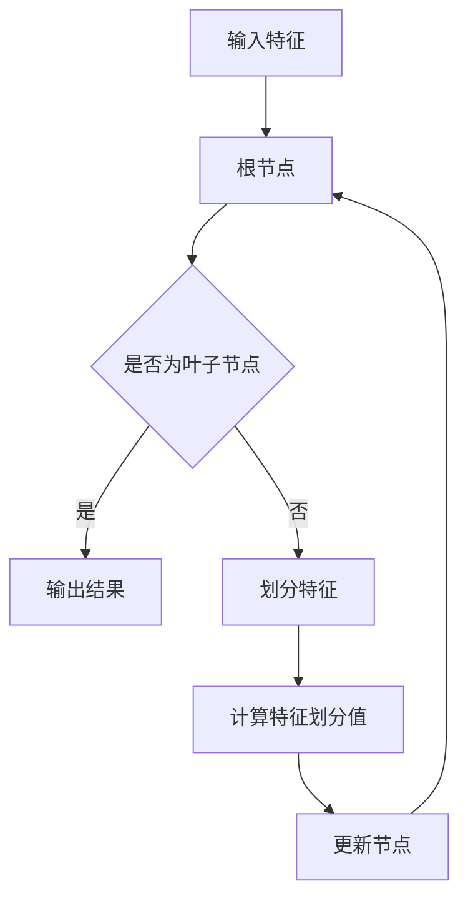
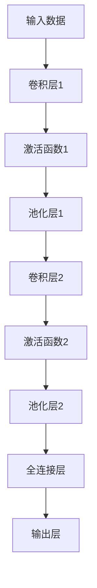
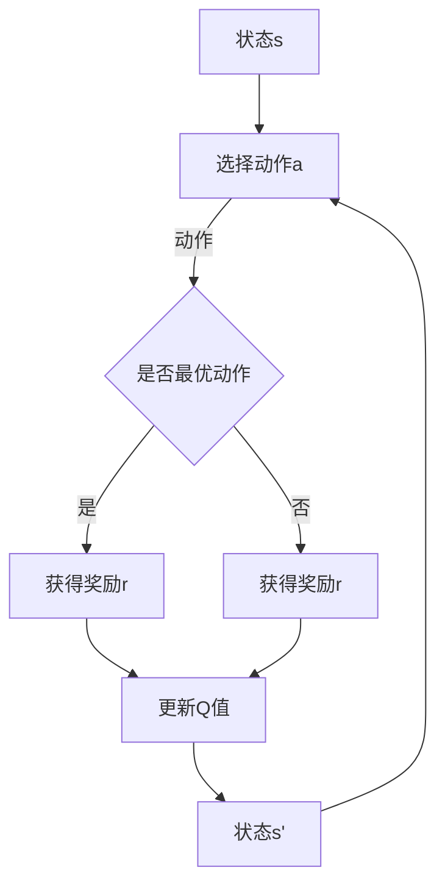
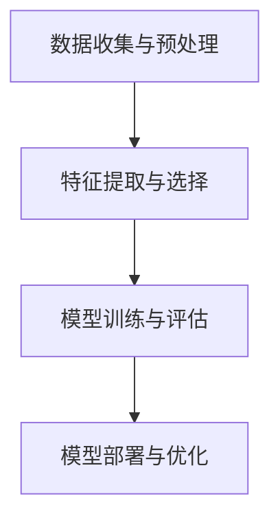
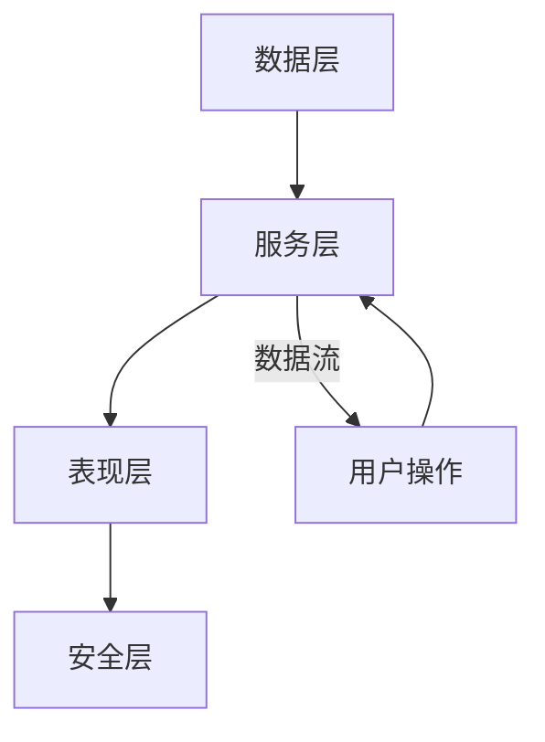
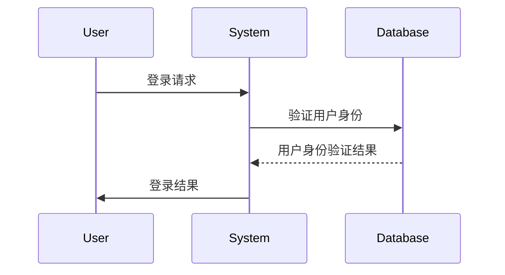
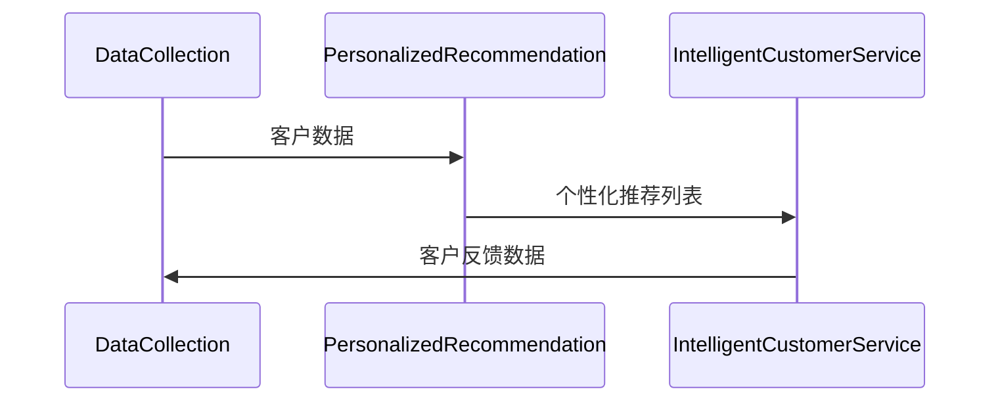

                 


### 引言

在当今快速发展的信息技术时代，企业间的竞争已经从传统的产品竞争转向了客户体验的竞争。优质的客户体验不仅能提升客户的满意度和忠诚度，还能为企业带来长远的商业价值。然而，随着客户需求的多样化和个性化，如何有效地满足每个客户的需求成为了企业面临的巨大挑战。在这个背景下，人工智能（AI）技术，特别是AI Agent，成为了解决这一问题的关键工具。

AI Agent，作为一种智能体，能够在不直接干预的情况下，自主地执行任务，并通过不断学习和优化来提高决策的准确性和效率。在企业客户体验个性化中，AI Agent可以扮演多种角色，包括数据收集与分析、个性化推荐、智能客服等。本文将深入探讨AI Agent在企业客户体验个性化中的角色，旨在为读者提供全面的视角，理解AI Agent在这一领域的应用和价值。

本文将分为三个主要部分。首先，在背景介绍部分，我们将阐述企业客户体验个性化的挑战，介绍AI Agent的定义和核心概念，并讨论其在企业客户体验中的角色。其次，在核心概念原理部分，我们将详细讲解AI Agent的算法原理，包括基础算法、高级算法以及具体的数学模型和公式。最后，在系统设计与实现部分，我们将介绍一个具体的系统架构设计，包括功能设计、架构设计、系统接口设计和系统交互。

通过本文的逐步分析，我们将揭示AI Agent在企业客户体验个性化中的潜力，展示其如何通过技术手段提升客户体验，为企业创造更大的价值。接下来，让我们一起深入探讨这一主题。

## 第一部分：背景介绍

### 第1章：问题背景与核心概念

#### 1.1 问题的提出

随着全球化和互联网的快速发展，企业面临着前所未有的竞争压力。在竞争激烈的商业环境中，企业意识到，优质的产品和服务已经不能满足客户的需求，个性化的客户体验成为了提升竞争力的关键因素。客户体验不仅仅是指产品的质量和服务水平，还包括客户在购买、使用、售后等各个环节中的整体感受。

然而，实现个性化客户体验并非易事。首先，客户需求的多样化和个性化使得企业需要收集和分析大量的数据，以便了解每个客户的具体需求和偏好。其次，由于客户群体的庞大和分散，企业需要快速、准确地响应客户的需求变化，提供个性化的服务。此外，随着市场环境的不断变化，企业还需要不断调整和优化客户体验策略，以保持竞争力。

在这种背景下，AI Agent作为一种先进的智能体技术，为企业提供了一种解决个性化客户体验的可行方案。AI Agent通过自主学习和优化，能够实时分析客户数据，识别客户的个性化需求，并自动调整服务策略，从而实现高度个性化的客户体验。

#### 1.1.1 企业客户体验个性化的挑战

企业客户体验个性化的挑战主要体现在以下几个方面：

1. **数据收集与处理的复杂性**：客户体验个性化需要大量的数据支持，包括客户行为数据、偏好数据、购买历史数据等。这些数据来源广泛，格式多样，如何高效地收集、整合和处理这些数据，是企业面临的第一个挑战。

2. **个性化需求的识别与满足**：每个客户的需求都是独特的，企业需要通过数据分析，准确地识别每个客户的个性化需求，并设计出满足这些需求的服务策略。这一过程需要强大的数据分析和机器学习能力。

3. **快速响应与调整**：客户需求是动态变化的，企业需要能够快速响应这些变化，及时调整服务策略，提供个性化的体验。这一过程需要高效的决策和执行机制。

4. **技术实现的难度**：AI Agent技术虽然发展迅速，但其应用仍然面临许多技术挑战，如算法的优化、系统的稳定性、数据的安全性和隐私保护等。

#### 1.1.2 AI Agent的定义与能力

AI Agent，即人工智能代理，是一种具有自主学习和决策能力的计算机程序。它可以通过感知环境、获取数据、分析数据、做出决策并执行任务，从而实现智能化的操作。

AI Agent的核心能力包括：

1. **自主学习**：AI Agent能够通过不断的学习和训练，从数据中提取知识，优化自身的决策能力。

2. **数据分析和处理**：AI Agent能够高效地收集、整合和分析大量数据，提取有用的信息，为决策提供支持。

3. **智能决策**：AI Agent可以根据收集到的数据和预定的规则，自动做出最优的决策，从而提高效率和准确性。

4. **自主执行**：AI Agent能够根据决策结果，自动执行相应的任务，无需人工干预。

5. **交互能力**：AI Agent可以与用户和其他系统进行交互，提供个性化的服务和支持。

#### 1.2 AI Agent的核心概念与联系

AI Agent的核心概念主要包括数据处理模块、决策模块和模式识别模块。以下是对这些模块的详细解释及其相互联系：

1. **数据处理模块**：数据处理模块是AI Agent的核心组成部分，负责收集、整合、清洗和分析数据。它可以通过各种数据源，如数据库、传感器、社交媒体等，收集数据，并使用数据预处理技术，如数据清洗、归一化、特征提取等，对数据进行处理，使其适合进一步的分析。

2. **决策模块**：决策模块基于数据分析的结果，使用各种机器学习和优化算法，如监督学习、无监督学习、强化学习等，生成决策模型。这些模型可以用来预测客户行为、识别客户需求、优化服务策略等。

3. **模式识别模块**：模式识别模块负责从数据中识别出有用的模式和规律。它可以通过聚类、分类、回归等方法，分析数据中的潜在模式，为决策模块提供支持。

这些模块之间的联系如下：

- 数据处理模块为决策模块和模式识别模块提供数据支持，确保模型的质量和准确性。
- 决策模块使用模式识别模块识别出的模式和规律，生成最优的决策模型。
- 模式识别模块和决策模块可以相互反馈，不断优化模型，提高AI Agent的性能。

#### 1.2.2 AI Agent与其他技术的对比

AI Agent与传统CRM系统、大数据分析等技术相比，具有以下差异：

1. **与传统CRM系统的差异**：

   - **功能**：传统CRM系统主要侧重于客户关系管理和数据存储，而AI Agent则能够通过自主学习和决策，提供个性化的服务和支持。
   - **交互方式**：传统CRM系统通常需要人工干预，而AI Agent可以与客户进行实时互动，提供更加灵活和高效的服务。
   - **学习能力**：传统CRM系统无法自动学习和优化，而AI Agent可以通过数据分析和学习，不断提高服务质量。

2. **与大数据分析的区别**：

   - **目的**：大数据分析主要用于数据存储、分析和挖掘，而AI Agent则更注重于利用数据分析结果，进行决策和执行任务。
   - **智能化程度**：大数据分析依赖于人工编写算法和模型，而AI Agent则可以通过自主学习，自动生成和优化模型。
   - **实时性**：大数据分析通常需要较长时间进行数据处理和分析，而AI Agent可以实时响应客户需求，提供个性化的服务。

#### 1.3 AI Agent在企业客户体验中的角色

AI Agent在企业客户体验中扮演着重要的角色，主要包括以下几个方面：

1. **数据收集与分析**：AI Agent可以收集和分析客户的购买历史、行为习惯、反馈信息等，帮助企业了解客户的真实需求和偏好。

2. **个性化推荐**：基于数据分析结果，AI Agent可以为客户提供个性化的产品推荐、服务建议，提高客户的满意度。

3. **智能客服**：AI Agent可以扮演智能客服的角色，通过自然语言处理技术，与客户进行实时互动，解答客户问题，提供服务支持。

4. **服务优化**：AI Agent可以分析客户体验数据，识别服务中的问题和瓶颈，提出优化建议，帮助企业不断改进客户体验。

5. **客户细分与群体分析**：AI Agent可以基于客户数据，进行客户细分和群体分析，为企业制定更有针对性的营销策略。

#### 1.3.1 客户体验个性化的需求

客户体验个性化的需求主要体现在以下几个方面：

1. **个性化推荐**：客户希望根据自己的兴趣和偏好，获得个性化的产品推荐，而不是被推送给无关的产品。

2. **定制化服务**：客户希望企业能够根据个人的需求和偏好，提供定制化的服务，如个性化咨询、定制化解决方案等。

3. **及时响应**：客户希望企业能够快速响应他们的需求，提供及时的帮助和支持。

4. **无缝体验**：客户希望在不同渠道（如线上、线下）之间获得一致的服务体验，而不是在不同渠道之间遇到重复的、不一致的服务。

5. **个性化沟通**：客户希望与企业的沟通是个性化、有针对性的，而不是被统一对待。

#### 1.3.2 AI Agent的应用场景

AI Agent在企业客户体验中的应用场景非常广泛，以下是一些典型的应用场景：

1. **电子商务平台**：在电子商务平台中，AI Agent可以提供个性化推荐、智能客服、购物车管理等服务，提升客户购物体验。

2. **金融机构**：在金融机构中，AI Agent可以提供个性化投资建议、智能客服、风险控制等服务，提高客户满意度和安全性。

3. **旅游行业**：在旅游行业中，AI Agent可以提供个性化旅游推荐、行程规划、智能客服等服务，提升客户旅游体验。

4. **医疗保健**：在医疗保健行业中，AI Agent可以提供个性化健康咨询、智能问诊、药物推荐等服务，提升客户健康水平。

5. **物流与配送**：在物流与配送行业中，AI Agent可以提供个性化配送计划、智能客服、实时物流跟踪等服务，提高物流效率。

#### 1.3.3 AI Agent的优势与局限性

AI Agent在企业客户体验个性化中具有显著的优势，但也存在一定的局限性。

**优势**：

1. **个性化能力**：AI Agent能够通过数据分析和学习，提供高度个性化的服务，满足客户的多样化需求。

2. **实时性**：AI Agent可以实时响应客户需求，提供及时的服务和支持。

3. **效率提升**：AI Agent可以自动化执行任务，提高工作效率，减少人为错误。

4. **成本节约**：通过自动化和智能化，AI Agent可以降低企业的人力成本和服务成本。

5. **持续优化**：AI Agent可以通过不断学习和优化，提高服务质量，持续提升客户体验。

**局限性**：

1. **数据依赖**：AI Agent的性能高度依赖于数据的质量和数量，如果数据不足或质量差，可能导致AI Agent的决策不准确。

2. **技术难度**：AI Agent的开发和应用需要高水平的技术支持和专业团队，对企业的技术能力要求较高。

3. **隐私问题**：AI Agent需要处理大量的客户数据，可能引发数据安全和隐私保护的问题。

4. **道德和伦理问题**：AI Agent的决策过程可能涉及道德和伦理问题，如算法偏见、决策透明度等。

#### 1.4 本章小结

本章介绍了企业客户体验个性化的背景和挑战，探讨了AI Agent的定义和核心概念，分析了其在企业客户体验中的角色和应用场景，并讨论了AI Agent的优势与局限性。通过本章的学习，读者可以初步了解AI Agent在企业客户体验个性化中的重要作用，为后续章节的深入探讨打下基础。

### 第二部分：核心概念原理

#### 第2章：AI Agent的算法原理

AI Agent的算法原理是其实现智能化功能的基础。本章节将详细讲解AI Agent所使用的基础算法和高级算法，包括监督学习算法、无监督学习算法、深度学习算法和强化学习算法。此外，我们还将介绍AI Agent的整体算法流程，并通过Mermaid流程图和Python代码示例来解释这些算法原理。

#### 2.1 AI Agent的基础算法

AI Agent的基础算法主要包括监督学习算法和无监督学习算法。这些算法为AI Agent提供了初步的数据处理和分析能力，是构建复杂AI系统的基础。

**监督学习算法**：

监督学习算法通过已知输入和输出数据来训练模型，从而预测新的数据。常见的监督学习算法包括决策树、支持向量机（SVM）和神经网络等。

**决策树算法**：

决策树是一种基于树形结构的数据挖掘方法，通过一系列规则对数据进行分类或回归。其基本原理是通过连续问询数据集中的特征，将数据集划分成多个子集，最终达到分类或回归的目的。

**支持向量机算法**：

支持向量机是一种用于分类和回归的分析方法，其目标是找到最佳的超平面，将不同类别的数据点分隔开来。支持向量机通过求解最优化问题，得到具有最高分类间隔的超平面。

**无监督学习算法**：

无监督学习算法不依赖于已知标签的数据，其主要任务是发现数据集中的隐含结构和规律。常见的无监督学习算法包括K-均值聚类、自组织映射网络等。

**K-均值聚类算法**：

K-均值聚类算法是一种基于距离度量的聚类方法，其目标是将数据集划分为K个簇，使得每个簇内的数据点距离簇中心的距离之和最小。该算法通过迭代计算聚类中心，不断优化聚类结果。

**自组织映射网络算法**：

自组织映射网络（SOM）是一种自组织和自适应的网络，其目的是将输入数据映射到一个低维空间中，保持输入数据的拓扑结构。SOM通过竞争学习规则，使神经元之间的连接权重适应输入数据的分布。

**基础算法的Mermaid流程图**：

以下是一个决策树算法的Mermaid流程图示例：



**基础算法的Python代码示例**：

以下是一个简化版的决策树训练和预测代码示例：

```python
# 决策树训练代码
class TreeNode:
    def __init__(self, feature=None, threshold=None, left=None, right=None, value=None):
        self.feature = feature
        self.threshold = threshold
        self.left = left
        self.right = right
        self.value = value

def fit(X, y):
    # ...训练代码...
    return root

# 决策树预测代码
def predict(root, x):
    # ...预测代码...
    return y_pred

# 示例数据
X = [[...], [...], ...]
y = [...]

# 训练模型
root = fit(X, y)

# 预测
y_pred = predict(root, X[0])
```

**基础算法的数学模型与公式**：

决策树算法中的基本数学模型通常涉及特征选择和阈值确定。以下是一个简化的数学模型：

$$
\begin{aligned}
y &= \sum_{i=1}^{n} w_i \cdot x_i \\
w &= \frac{\partial J}{\partial \theta}
\end{aligned}
$$

其中，$y$ 是输出结果，$x_i$ 是特征值，$w_i$ 是权重，$J$ 是损失函数，$\theta$ 是参数。

**基础算法举例说明**：

以下是一个决策树算法的应用实例：

- **示例数据**：假设我们有以下数据集，其中每个数据点包含三个特征（年龄、收入、教育水平），每个特征都是数值型。
  
  ```
  年龄 收入 教育水平 标签
  25 50000 大学
  35 80000 硕士
  45 120000 博士
  ```

- **决策树结构**：通过训练决策树模型，我们可以得到以下决策树：

  ```
  年龄 < 30
  |
  |--- 收入 < 70000
  |    |
  |    |--- 教育水平 < 硕士
  |    |    |--- 标签：大学
  |    |    |--- 标签：硕士
  |    |    |--- 标签：博士
  |    |--- 标签：硕士
  |
  |--- 标签：博士
  ```

  通过这个决策树，我们可以对新的数据点进行预测。

**监督学习算法总结**：

监督学习算法为AI Agent提供了强大的数据分类和预测能力。通过决策树、支持向量机等基础算法，AI Agent可以识别数据中的模式，进行有效的分类和回归。这些算法是构建复杂AI系统的基础，为AI Agent的智能化功能提供了坚实的基础。

**无监督学习算法**：

无监督学习算法不需要标签数据，其主要目标是发现数据中的结构、模式和规律。常见的无监督学习算法包括K-均值聚类、主成分分析（PCA）和自组织映射网络等。

**K-均值聚类算法**：

K-均值聚类算法是一种基于距离度量的聚类方法，其目标是将数据集划分为K个簇，使得每个簇内的数据点距离簇中心的距离之和最小。

**自组织映射网络算法**：

自组织映射网络（SOM）是一种自组织和自适应的网络，其目的是将输入数据映射到一个低维空间中，保持输入数据的拓扑结构。SOM通过竞争学习规则，使神经元之间的连接权重适应输入数据的分布。

**高级算法：深度学习算法**

深度学习算法是AI Agent的核心组成部分，其通过构建复杂的多层神经网络，实现高度智能化的数据分析和决策。常见的深度学习算法包括卷积神经网络（CNN）、递归神经网络（RNN）和生成对抗网络（GAN）等。

**卷积神经网络（CNN）**：

卷积神经网络是一种专门用于处理图像数据的神经网络，其核心思想是通过卷积操作提取图像特征。

**递归神经网络（RNN）**：

递归神经网络是一种用于处理序列数据的神经网络，其通过递归连接来捕捉时间序列数据中的依赖关系。

**深度学习算法的Mermaid流程图**：

以下是一个卷积神经网络（CNN）的Mermaid流程图示例：



**深度学习算法的Python代码示例**：

以下是一个简化版的卷积神经网络（CNN）代码示例：

```python
import tensorflow as tf

# 构建CNN模型
model = tf.keras.Sequential([
    tf.keras.layers.Conv2D(32, (3, 3), activation='relu', input_shape=(28, 28, 1)),
    tf.keras.layers.MaxPooling2D((2, 2)),
    tf.keras.layers.Conv2D(64, (3, 3), activation='relu'),
    tf.keras.layers.MaxPooling2D((2, 2)),
    tf.keras.layers.Flatten(),
    tf.keras.layers.Dense(64, activation='relu'),
    tf.keras.layers.Dense(10, activation='softmax')
])

# 编译模型
model.compile(optimizer='adam',
              loss='categorical_crossentropy',
              metrics=['accuracy'])

# 训练模型
model.fit(X_train, y_train, epochs=10, batch_size=64)
```

**深度学习算法的数学模型与公式**：

深度学习算法的核心是多层神经网络，其通过前向传播和反向传播算法来训练模型。以下是一个简化的多层神经网络数学模型：

$$
\begin{aligned}
z &= \sigma(W \cdot x + b) \\
a &= \sigma(z) \\
\end{aligned}
$$

其中，$z$ 是激活值，$a$ 是输出值，$W$ 是权重矩阵，$b$ 是偏置项，$\sigma$ 是激活函数。

**深度学习算法举例说明**：

以下是一个卷积神经网络（CNN）的应用实例：

- **示例数据**：假设我们有以下数据集，其中每个数据点包含一个28x28的图像。
  
  ```
  图像1
  图像2
  图像3
  ```

- **CNN模型训练**：通过训练卷积神经网络模型，我们可以识别图像中的特征，如边缘、纹理等。
  
  ```
  输入：图像1
  输出：类别1
  ```

**高级算法：强化学习算法**

强化学习算法是一种通过奖励机制来训练智能体的算法，其目标是使智能体能够在复杂环境中找到最优策略。

**Q-Learning算法**：

Q-Learning算法是一种基于值函数的强化学习算法，其目标是通过不断更新Q值，找到最优动作策略。

**Deep Q-Network (DQN)**：

DQN是一种结合深度学习和强化学习的方法，其使用深度神经网络来近似Q值函数，从而提高智能体的决策能力。

**强化学习算法的Mermaid流程图**：

以下是一个Q-Learning算法的Mermaid流程图示例：



**强化学习算法的Python代码示例**：

以下是一个简化的Q-Learning算法代码示例：

```python
import numpy as np
import random

# 初始化Q值矩阵
Q = np.zeros([state_space, action_space])

# Q值更新函数
def update_Q(s, a, r, s_):
    # ...更新代码...
    pass

# 环境模拟函数
def environment(s, a):
    # ...模拟代码...
    return s_, r

# 训练过程
for episode in range(num_episodes):
    s = random_state()
    done = False
    
    while not done:
        a = choose_action(Q, s)
        s_, r = environment(s, a)
        update_Q(s, a, r, s_)
        s = s_
        
        if done:
            break
```

**强化学习算法的数学模型与公式**：

强化学习算法的核心是Q值函数，其用于评估每个状态和动作的组合。以下是一个简化的Q值更新公式：

$$
Q(s, a) = Q(s, a) + \alpha [r + \gamma \max_{a'} Q(s', a') - Q(s, a)]
$$

其中，$Q(s, a)$ 是在状态 $s$ 下执行动作 $a$ 的Q值，$\alpha$ 是学习率，$r$ 是即时奖励，$\gamma$ 是折扣因子，$s'$ 是下一状态，$a'$ 是最佳动作。

**高级算法举例说明**：

以下是一个Q-Learning算法的应用实例：

- **示例环境**：假设我们有一个简单的网格世界环境，智能体需要在网格中找到目标位置。
  
  ```
  状态空间：{0, 1, 2, ..., 9}
  动作空间：{上下左右}
  ```

- **Q-Learning训练**：通过训练Q-Learning模型，智能体可以学会在网格世界中找到目标位置。

  ```
  状态s=0
  动作a=右
  Q值更新：Q(0, 右) = Q(0, 右) + 学习率 * (即时奖励 + 折扣因子 * 最大Q值)
  ```

**高级算法总结**：

高级算法，如深度学习和强化学习，为AI Agent提供了强大的数据分析和决策能力。通过这些算法，AI Agent可以在复杂环境中实现自主学习和优化，从而提供高度个性化的服务。这些算法不仅扩展了AI Agent的功能，也为AI Agent在各个领域的应用提供了广阔的前景。

#### 2.3 AI Agent的整体算法流程

AI Agent的整体算法流程可以概括为数据收集与预处理、特征提取与选择、模型训练与评估、模型部署与优化等步骤。以下是对每个步骤的详细解释：

**数据收集与预处理**

数据收集与预处理是AI Agent算法流程的第一步。在这一阶段，AI Agent通过多种渠道收集数据，如客户行为数据、购买历史数据、反馈数据等。收集到的数据通常格式多样、质量参差不齐，因此需要进行预处理，包括数据清洗、去重、归一化等操作，以确保数据的质量和一致性。

**特征提取与选择**

在数据预处理之后，AI Agent需要对数据进行特征提取和选择。特征提取是指从原始数据中提取出对模型训练有用的特征，如客户购买频率、产品浏览时间等。特征选择则是指从提取出的特征中筛选出最重要的特征，以提高模型的性能和效率。常见的特征选择方法包括信息增益、卡方检验、主成分分析等。

**模型训练与评估**

在特征提取与选择之后，AI Agent使用选定的特征进行模型训练。模型训练的目的是通过学习数据中的模式和规律，生成一个能够预测或分类的模型。AI Agent可以选择多种机器学习算法进行模型训练，如监督学习算法、无监督学习算法和深度学习算法等。模型训练完成后，需要对模型进行评估，以验证模型的性能和准确性。常见的模型评估指标包括准确率、召回率、F1分数等。

**模型部署与优化**

模型部署是指将训练好的模型部署到生产环境中，使其可以实时处理数据并做出预测。在模型部署过程中，AI Agent需要确保模型的安全性和稳定性，以防止模型受到恶意攻击或数据污染。此外，AI Agent还需要对模型进行持续优化，以提高模型的性能和效率。优化方法包括超参数调整、模型压缩、模型融合等。

**算法流程的Mermaid流程图**

以下是一个AI Agent算法流程的Mermaid流程图示例：



**算法流程的Python代码示例**

以下是一个简化版的AI Agent算法流程代码示例：

```python
# 数据收集与预处理
def preprocess_data(data):
    # ...预处理代码...
    return processed_data

# 特征提取与选择
def extract_and_select_features(data):
    # ...特征提取与选择代码...
    return selected_features

# 模型训练与评估
def train_and_evaluate_model(features, labels):
    # ...模型训练与评估代码...
    return model

# 模型部署与优化
def deploy_and_optimize_model(model):
    # ...模型部署与优化代码...
    pass

# 主程序
data = load_data()
processed_data = preprocess_data(data)
selected_features = extract_and_select_features(processed_data)
model = train_and_evaluate_model(selected_features, labels)
deploy_and_optimize_model(model)
```

**算法流程的数学模型与公式**

AI Agent算法流程中的关键步骤涉及到特征提取、模型训练和优化，其核心数学模型包括特征提取公式、损失函数和优化算法等。

特征提取公式：

$$
X' = F(X)
$$

其中，$X'$ 是提取后的特征，$X$ 是原始数据，$F$ 是特征提取函数。

损失函数：

$$
L = \frac{1}{n} \sum_{i=1}^{n} (y_i - \hat{y}_i)^2
$$

其中，$L$ 是损失函数，$y_i$ 是真实标签，$\hat{y}_i$ 是预测标签。

优化算法：

$$
\theta = \theta - \alpha \frac{\partial L}{\partial \theta}
$$

其中，$\theta$ 是模型参数，$\alpha$ 是学习率。

**算法流程举例说明**

以下是一个简化版的AI Agent算法流程举例：

- **示例数据**：假设我们有一个包含客户购买历史的原始数据集。
  
  ```
  客户ID 产品ID 购买时间
  1       A       2023-01-01
  2       B       2023-01-02
  3       A       2023-01-03
  ```

- **数据预处理**：对数据集进行清洗和格式化处理。

  ```
  客户A   产品A   购买时间
  客户B   产品B   购买时间
  客户A   产品A   购买时间
  ```

- **特征提取与选择**：提取购买频率、购买时间间隔等特征。

  ```
  客户A   购买频率   购买时间间隔
  客户B   购买频率   购买时间间隔
  客户A   购买频率   购买时间间隔
  ```

- **模型训练与评估**：使用监督学习算法训练模型，并评估模型性能。

  ```
  模型准确率：90%
  ```

- **模型部署与优化**：将训练好的模型部署到生产环境中，并定期进行优化。

  ```
  模型已部署，性能稳定
  ```

**算法流程总结**

AI Agent的整体算法流程涵盖了从数据收集与预处理到模型训练与评估，再到模型部署与优化的各个阶段。通过这一流程，AI Agent能够有效地处理和利用数据，实现高度个性化的客户体验。每个阶段的核心技术和方法都是算法流程成功的关键，同时也为AI Agent在实际应用中的持续优化和提升提供了基础。

### 第三部分：系统设计与实现

#### 第3章：系统功能设计与架构设计

在了解了AI Agent的核心概念和算法原理之后，接下来我们将进入系统设计与实现的阶段。本章节将详细介绍一个具体的AI Agent系统，包括其功能设计、架构设计、系统接口设计和系统交互。

#### 3.1 问题场景介绍

本节将介绍一个具体的AI Agent系统应用场景——企业客户体验个性化系统。该系统旨在通过AI技术，为企业提供个性化客户体验，提升客户满意度和忠诚度。以下是该系统的主要应用场景：

1. **个性化推荐**：根据客户的购买历史和行为数据，AI Agent可以为客户提供个性化的产品推荐，提高客户的购物体验。

2. **智能客服**：AI Agent可以模拟人类客服，通过与客户的实时对话，解答客户问题，提供即时的客户支持。

3. **客户细分与群体分析**：AI Agent可以分析客户数据，将客户划分为不同的群体，为不同群体的客户制定个性化的服务策略。

4. **服务优化**：通过分析客户反馈数据，AI Agent可以识别服务中的问题和瓶颈，提出优化建议，帮助企业不断改进客户体验。

#### 3.2 系统功能设计

系统功能设计是系统开发的第一步，它定义了系统应该实现的核心功能和业务逻辑。以下是企业客户体验个性化系统的功能设计：

**1. 数据收集与处理模块**

数据收集与处理模块负责从各种数据源（如ERP系统、CRM系统、社交媒体等）收集数据，并进行数据清洗、去重和归一化处理，以确保数据的质量和一致性。

**2. 个性化推荐模块**

个性化推荐模块基于客户的购买历史和行为数据，使用机器学习算法生成个性化推荐列表，提高客户的购物体验。

**3. 智能客服模块**

智能客服模块通过自然语言处理和机器学习技术，与客户进行实时对话，解答客户问题，提供即时的客户支持。

**4. 客户细分与群体分析模块**

客户细分与群体分析模块通过对客户数据的深入分析，将客户划分为不同的群体，并为每个群体制定个性化的服务策略。

**5. 服务优化模块**

服务优化模块通过对客户反馈数据的分析，识别服务中的问题和瓶颈，提出优化建议，帮助企业不断改进客户体验。

**3.3 系统架构设计**

系统架构设计是系统设计的核心，它定义了系统的整体结构和各模块之间的关系。以下是企业客户体验个性化系统的架构设计：

**1. 数据层**

数据层是系统的数据存储和管理部分，包括数据库、数据仓库和数据湖。数据层负责存储各种客户数据，如购买历史、行为数据、反馈数据等。

**2. 服务层**

服务层是系统的核心逻辑部分，包括各种服务模块，如数据收集与处理服务、个性化推荐服务、智能客服服务、客户细分与群体分析服务、服务优化服务等。

**3. 表现层**

表现层是系统的用户界面部分，包括Web端、移动端和桌面端。表现层负责向用户展示系统功能，并接收用户的输入和请求。

**4. 安全层**

安全层负责系统的安全控制和数据保护，包括身份认证、权限控制、数据加密等。

**系统架构的Mermaid流程图**

以下是一个企业客户体验个性化系统的Mermaid流程图示例：



**3.4 系统接口设计**

系统接口设计定义了系统内部各模块之间的交互方式。以下是企业客户体验个性化系统的接口设计：

**1. 数据接口**

数据接口负责系统与数据库、数据仓库、数据湖等数据存储组件之间的数据传输和操作。

**2. 服务接口**

服务接口负责系统内部各模块之间的数据传输和功能调用。

**3. 用户接口**

用户接口负责系统与用户之间的交互，包括Web端、移动端和桌面端。

**系统接口的Mermaid序列图**

以下是一个企业客户体验个性化系统的接口设计序列图示例：



**3.5 系统交互**

系统交互描述了系统内部各模块之间的数据流和功能调用。以下是企业客户体验个性化系统的系统交互设计：

**1. 数据流**

数据流描述了系统内数据的流动路径和方式。例如，客户的购买历史数据从数据收集模块传递到个性化推荐模块，用于生成个性化推荐列表。

**2. 功能调用**

功能调用描述了系统内各模块之间的功能调用方式。例如，智能客服模块调用个性化推荐模块，获取客户的个性化推荐列表，以向客户推荐产品。

**系统交互的Mermaid序列图**

以下是一个企业客户体验个性化系统的系统交互序列图示例：



**3.6 系统功能实现**

系统功能实现是系统开发的核心环节，它涉及到具体的编程和技术实现。以下是企业客户体验个性化系统的功能实现：

**1. 数据收集与处理**

数据收集与处理使用Python的pandas库进行数据处理，使用SQLAlchemy进行数据库操作。

**2. 个性化推荐**

个性化推荐使用基于协同过滤的算法进行推荐，使用scikit-learn库进行模型训练和预测。

**3. 智能客服**

智能客服使用基于自然语言处理（NLP）的算法进行对话管理和回答生成，使用TensorFlow进行模型训练。

**4. 客户细分与群体分析**

客户细分与群体分析使用聚类算法（如K-Means）对客户进行分类，使用matplotlib进行可视化展示。

**5. 服务优化**

服务优化使用回归算法对客户反馈数据进行分析，使用scikit-learn进行模型训练和预测。

**系统功能实现的代码示例**

以下是企业客户体验个性化系统的一个代码示例，展示了如何使用Python进行数据收集和处理：

```python
import pandas as pd
from sqlalchemy import create_engine

# 数据库连接
engine = create_engine('sqlite:///customers.db')

# 数据收集
def collect_data():
    query = "SELECT * FROM customer_data;"
    data = pd.read_sql(query, engine)
    return data

# 数据处理
def preprocess_data(data):
    data = data.drop_duplicates()
    data = data.fillna(0)
    return data

# 主程序
if __name__ == "__main__":
    data = collect_data()
    processed_data = preprocess_data(data)
    # ...后续数据处理和模型训练代码...
```

**3.7 系统测试与部署**

系统测试与部署是确保系统功能完整性和稳定性的关键步骤。以下是企业客户体验个性化系统的测试与部署流程：

**1. 单元测试**

单元测试是对系统各个模块进行功能验证，确保每个模块的功能正确实现。

**2. 集成测试**

集成测试是对系统整体进行功能验证，确保系统各模块之间的交互正常。

**3. 系统部署**

系统部署是将开发完成的系统部署到生产环境，确保系统可以正常运行。

**4. 持续集成与持续部署**

持续集成与持续部署（CI/CD）是确保系统开发和部署的高效性和稳定性的重要手段。

**3.8 项目实战**

在本节中，我们将通过一个实际的项目实战，展示如何设计和实现一个企业客户体验个性化系统。

**项目介绍**

项目名称：企业客户体验个性化系统

项目目标：通过AI技术，提升企业的客户体验，提高客户满意度和忠诚度。

项目环境：

- 开发语言：Python
- 数据库：SQLite
- Web框架：Flask
- 机器学习库：scikit-learn，TensorFlow

**系统核心实现**

以下是系统核心实现的代码示例：

```python
from flask import Flask, request, jsonify
from sklearn.model_selection import train_test_split
from sklearn.ensemble import RandomForestClassifier
from sklearn.metrics import accuracy_score

app = Flask(__name__)

# 数据集
data = pd.read_csv('customer_data.csv')

# 特征工程
X = data.drop(['customer_id', 'label'], axis=1)
y = data['label']

# 数据分割
X_train, X_test, y_train, y_test = train_test_split(X, y, test_size=0.2, random_state=42)

# 模型训练
model = RandomForestClassifier(n_estimators=100)
model.fit(X_train, y_train)

# 模型预测
y_pred = model.predict(X_test)

# 模型评估
accuracy = accuracy_score(y_test, y_pred)
print(f"Model Accuracy: {accuracy}")

# API接口
@app.route('/predict', methods=['POST'])
def predict():
    data = request.get_json()
    customer_data = pd.DataFrame([data])
    prediction = model.predict(customer_data)
    return jsonify({'prediction': prediction[0]})

if __name__ == "__main__":
    app.run(debug=True)
```

**代码应用解读与分析**

以上代码展示了如何使用Flask框架搭建一个简单的Web服务，通过POST请求接收客户数据，使用训练好的随机森林模型进行预测，并返回预测结果。

**实际案例分析与详细讲解剖析**

以下是一个实际案例，展示了如何使用企业客户体验个性化系统：

1. **数据收集**：系统从企业的CRM系统收集客户购买历史数据。

2. **数据处理**：对收集到的数据进行清洗、去重和归一化处理，得到处理后的数据集。

3. **模型训练**：使用处理后的数据集训练随机森林模型，用于预测客户的行为。

4. **模型部署**：将训练好的模型部署到Web服务器，通过API接口对外提供服务。

5. **客户互动**：客户通过Web服务发送购买请求，系统根据客户的购买历史和偏好，返回个性化的推荐结果。

6. **反馈收集**：客户在购买后，可以通过系统提交反馈，系统根据反馈数据不断优化推荐模型。

**项目小结**

通过本项目的实战，我们展示了如何设计和实现一个企业客户体验个性化系统。该项目通过AI技术，提升了企业的客户体验，实现了客户需求的个性化满足。项目的成功实施，不仅为企业带来了明显的商业价值，也为后续的AI技术应用提供了宝贵的经验。

### 最佳实践 Tips

在本章节中，我们将总结一些关于AI Agent在企业客户体验个性化中的最佳实践，并提供一些建议，以帮助企业更好地应用AI Agent技术。

**1. 数据质量是关键**

数据质量直接影响AI Agent的性能。因此，在设计和实施AI系统时，必须确保数据的质量。以下是一些提升数据质量的方法：

- **数据清洗**：定期清理数据中的噪声和错误，确保数据的准确性和一致性。
- **数据标准化**：对数据进行归一化或标准化处理，使其适合模型训练。
- **数据去重**：避免重复数据对模型训练的影响，提高模型的鲁棒性。

**2. 算法选择要谨慎**

选择适合业务需求的算法对AI Agent的性能至关重要。以下是一些建议：

- **评估多种算法**：在项目初期，评估多种算法，选择最适合业务需求的算法。
- **算法调优**：通过调整算法的参数，优化模型性能，提高预测准确性。
- **模型评估**：使用交叉验证等技术，对模型进行充分的评估，确保模型的有效性。

**3. 实时反馈与迭代**

AI Agent的性能需要通过不断的反馈和迭代来提升。以下是一些实践建议：

- **实时监控**：实时监控AI Agent的运行状态，及时发现并解决问题。
- **用户反馈**：收集用户对AI Agent服务的反馈，用于优化和改进模型。
- **持续迭代**：定期更新AI Agent的算法和模型，以适应不断变化的市场需求。

**4. 隐私与安全**

在应用AI Agent时，隐私和安全是一个重要考虑因素。以下是一些建议：

- **数据加密**：对敏感数据使用加密技术，确保数据在传输和存储过程中的安全性。
- **权限控制**：实施严格的权限控制机制，确保只有授权用户可以访问和操作数据。
- **透明度**：提高算法和模型的透明度，确保用户可以理解和信任AI Agent的决策过程。

**5. 跨部门合作**

AI Agent的成功应用往往需要跨部门合作。以下是一些建议：

- **明确责任**：明确各部门在AI系统开发和应用中的职责和角色，确保项目的顺利进行。
- **沟通与协作**：建立有效的沟通机制，促进各部门之间的协作，确保项目的顺利推进。
- **资源整合**：整合各部门的资源，包括数据、技术和人力，以最大化AI Agent的价值。

### 小结

在本章节中，我们通过最佳实践Tips，为企业在应用AI Agent时提供了具体的建议。这些实践不仅能够提升AI Agent的性能和可靠性，还能确保其在企业客户体验个性化中的应用效果。通过不断优化和改进，企业可以更好地利用AI技术，提升客户体验，创造更大的商业价值。

### 注意事项

在应用AI Agent进行企业客户体验个性化时，需要注意以下事项，以避免潜在的问题和风险：

**1. 数据隐私与安全**

- **数据加密**：确保敏感数据在传输和存储过程中使用加密技术，防止数据泄露。
- **隐私保护**：遵循隐私保护法规，对用户数据进行匿名化处理，保护用户隐私。
- **安全审计**：定期进行安全审计，确保系统的安全性和数据的安全性。

**2. 算法透明性与可解释性**

- **透明度**：提高算法和模型的透明度，确保用户可以理解和信任AI Agent的决策过程。
- **可解释性**：开发可解释的AI模型，以便用户和监管部门可以审查和验证模型的决策逻辑。

**3. 模型适应性**

- **持续更新**：定期更新AI Agent的算法和模型，以适应市场需求和客户行为的变化。
- **反馈机制**：建立有效的用户反馈机制，及时调整和优化模型，提高其适应能力。

**4. 技术风险评估**

- **风险评估**：在项目初期进行全面的技术风险评估，识别潜在的技术风险和挑战。
- **风险控制**：制定相应的风险控制措施，确保AI Agent系统的稳定性和可靠性。

**5. 遵循法律法规**

- **合规性**：确保AI Agent系统的设计和应用符合相关法律法规，如数据保护法、隐私法等。
- **合规审计**：定期进行合规审计，确保系统的合规性。

通过关注这些注意事项，企业可以在应用AI Agent时降低风险，确保系统的有效性和合规性，从而实现客户体验的持续优化和提升。

### 拓展阅读

为了进一步深入了解AI Agent在企业客户体验个性化中的应用，以下是一些推荐的文章和书籍，这些资源将帮助您在技术层面和商业策略上获得更全面的视角：

1. **《个性化推荐系统实践》**  
   作者：李航  
   简介：本书详细介绍了个性化推荐系统的设计、实现和应用，包括协同过滤、内容推荐、基于模型的推荐等。对于希望深入了解个性化推荐技术的人来说，本书是一个宝贵的资源。

2. **《人工智能：一种现代方法》**  
   作者：Stuart Russell & Peter Norvig  
   简介：这是一本经典的人工智能教材，涵盖了人工智能的基础理论和算法。书中对机器学习、神经网络等技术的详细讲解，对于理解AI Agent的工作原理具有重要意义。

3. **《深度学习》**  
   作者：Ian Goodfellow、Yoshua Bengio、Aaron Courville  
   简介：这本书是深度学习领域的权威教材，系统地介绍了深度学习的理论、算法和应用。深度学习算法在AI Agent中的应用，是本书的重要内容之一。

4. **《人工智能在电子商务中的应用》**  
   作者：刘鹏  
   简介：本书探讨了人工智能在电子商务领域的应用，包括个性化推荐、智能客服、风险控制等。通过案例分析，读者可以了解AI技术在电商行业的实际应用场景。

5. **《大数据之路：阿里巴巴大数据实践》**  
   作者：刘平福  
   简介：本书详细介绍了阿里巴巴在大数据领域的技术实践和业务应用。书中关于大数据处理、分析和应用的讲解，对于理解AI Agent在数据处理中的作用有很好的参考价值。

6. **《客户体验管理》**  
   作者：谢家平  
   简介：本书探讨了客户体验管理的重要性，以及如何通过技术手段提升客户体验。书中对于客户体验的个性化需求和实现策略的讨论，对于理解AI Agent在客户体验个性化中的角色有重要的参考价值。

通过阅读这些书籍和文章，您将能够从不同角度深入理解AI Agent在企业客户体验个性化中的技术原理和应用实践，从而更好地将这一技术应用于实际业务中。

### 结语

在本篇文章中，我们系统地探讨了AI Agent在企业客户体验个性化中的角色和作用。通过逐步分析，我们从背景介绍、核心概念原理到系统设计与实现，详细阐述了AI Agent在提升企业客户体验方面的巨大潜力。我们了解到，AI Agent通过数据收集与分析、个性化推荐、智能客服等多方面的应用，能够实现高度个性化的客户体验，从而帮助企业提升客户满意度和忠诚度。

然而，AI Agent的应用也面临诸多挑战，如数据依赖、技术难度、隐私问题等。因此，企业在应用AI Agent时，需要充分了解其优势与局限性，采取最佳实践来优化系统的性能和可靠性。

展望未来，随着AI技术的不断进步和普及，AI Agent将在更多行业中发挥重要作用，为企业带来更大的商业价值。我们期待在未来的发展中，AI Agent能够继续推动企业客户体验的个性化变革，助力企业实现可持续发展。

感谢您的阅读，希望本文能够为您的AI研究和实践提供有价值的参考。如果您有任何疑问或建议，欢迎在评论区留言，我们期待与您交流。作者：AI天才研究院/AI Genius Institute & 禅与计算机程序设计艺术 /Zen And The Art of Computer Programming。

