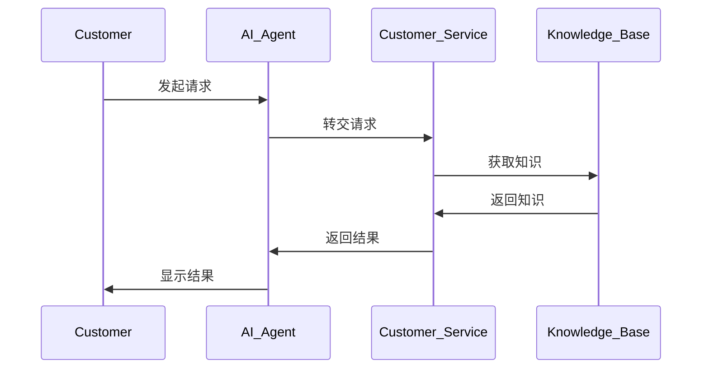
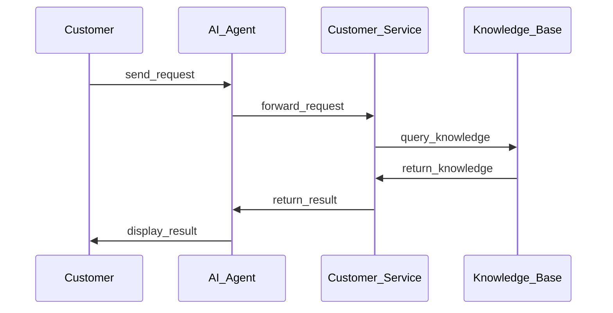

                 

### 第一部分：背景介绍

#### 1.1.1 问题背景

随着人工智能技术的快速发展，AI Agent（人工智能代理）已经成为企业客户服务的重要工具。AI Agent通过自然语言处理、机器学习和数据挖掘等技术，能够为企业提供高效、精准的客户服务，从而提升企业的运营效率与客户满意度。

在现代商业环境中，客户服务是企业的核心竞争力之一。然而，随着客户数量的增加和客户需求的多样化，传统的人工客户服务模式面临着巨大的挑战。人工客服不仅效率低下，而且难以满足客户个性化的需求。在这种情况下，AI Agent作为一种智能化的解决方案，应运而生。

AI Agent能够通过自主学习，不断优化服务流程，提高服务效率。同时，AI Agent具备24/7全天候服务的特点，大大降低了企业的运营成本。此外，AI Agent还能够通过大数据分析，了解客户行为和偏好，提供个性化的服务体验。

#### 1.1.2 问题描述

本书记录了AI Agent在企业客户服务中的应用案例，通过深入剖析AI Agent的技术原理、应用场景和实施策略，帮助读者了解如何利用AI Agent提升企业客户服务的效率与满意度。

具体来说，本书将探讨以下问题：

1. AI Agent是什么，它如何工作？
2. AI Agent在客户服务中的关键作用是什么？
3. 如何在不同企业客户服务场景中应用AI Agent？
4. AI Agent在应用过程中面临的挑战有哪些？
5. 未来AI Agent的发展趋势是什么？

通过这些问题，本书旨在为读者提供一套完整的AI Agent在企业客户服务中的应用指南，帮助读者理解和掌握AI Agent的技术原理和应用方法。

#### 1.1.3 问题解决

本书将从以下几个角度解决问题：

1. **深入介绍AI Agent的基本原理、发展历程和应用现状**：通过详细阐述AI Agent的技术原理，帮助读者理解AI Agent的工作机制和功能特点。
2. **分析AI Agent在客户服务中的关键作用**：包括自动应答、智能推荐、问题诊断等方面，帮助读者了解AI Agent如何提升客户服务的效率和质量。
3. **详解AI Agent在不同企业客户服务场景中的应用实践**：通过具体案例，展示AI Agent在客服中心、在线零售、金融保险等领域的应用效果。
4. **探讨AI Agent的挑战与未来发展趋势**：分析AI Agent在应用过程中面临的挑战，如数据隐私、安全问题等，并探讨未来的发展趋势和前景。

通过以上方法，本书旨在为读者提供一套全面、系统的AI Agent在企业客户服务中的应用解决方案，帮助读者充分利用AI技术提升客户服务的效率和满意度。

#### 1.1.4 边界与外延

- **边界**：本书主要关注AI Agent在企业客户服务中的应用，包括客服中心、在线零售、金融保险等领域。同时，本书将不涉及AI Agent在其他领域的应用，如智能家居、智能医疗等。
- **外延**：虽然本书主要讨论AI Agent在企业客户服务中的应用，但相关技术和方法也可以应用于其他类型的客户服务场景。例如，AI Agent在教育、旅游、餐饮等行业也具有广泛的应用前景。

#### 1.1.5 概念结构与核心要素组成

- **AI Agent**：一种具备自主决策能力、能够执行特定任务的智能实体。它通过自然语言处理、机器学习和数据挖掘等技术，为企业提供高效、精准的客户服务。
- **企业客户服务**：企业为满足客户需求而提供的各项服务活动。它包括客户咨询、投诉处理、售后服务等环节，是客户与企业之间建立联系的重要渠道。
- **效率**：单位时间内完成的工作量。在客户服务中，效率的提升意味着能够更快地响应用户需求，提高客户满意度。
- **满意度**：客户对企业服务质量的总体评价。高满意度通常意味着客户对企业服务的认可和信任，有助于提升客户忠诚度和企业竞争力。

通过以上核心概念和要素的阐述，读者可以更好地理解AI Agent在企业客户服务中的作用和意义。

### 第二部分：核心概念与联系

#### 2.1.1 AI Agent的定义与特点

AI Agent，即人工智能代理，是一种基于人工智能技术的智能实体。它具备以下特点：

1. **自主性**：AI Agent能够自主执行任务，无需人工干预。这种自主性使得AI Agent能够在各种复杂环境中灵活应对，提高工作效率。
2. **智能性**：AI Agent具备自然语言处理、机器学习等人工智能能力。通过这些能力，AI Agent能够理解和生成自然语言，进行数据分析和预测，提供智能化的服务。
3. **适应性**：AI Agent能够根据环境变化调整行为。例如，当检测到某个客户问题频繁出现时，AI Agent可以自动调整服务策略，提高问题解决率。

#### 2.1.2 企业客户服务的概念与特征

企业客户服务是企业与客户之间建立联系、满足客户需求的重要环节。它具有以下特征：

1. **全面性**：企业客户服务涉及企业各个部门，包括营销、销售、售后等。这种全面性确保了企业能够从多个角度满足客户需求，提高客户满意度。
2. **连续性**：企业客户服务贯穿企业运营的始终。无论是售前咨询、售中支持，还是售后服务，企业都需要为客户提供持续的服务。
3. **个性化**：企业客户服务需要根据不同客户的需求提供定制化服务。这种个性化服务能够更好地满足客户的特殊需求，提高客户满意度。

#### 2.1.3 效率与满意度的关系

效率与满意度之间存在密切的关系：

1. **提高效率**：通过优化服务流程、缩短客户等待时间、降低服务成本等方式，提高服务效率。这不仅能提高客户满意度，还能增强企业的竞争力。
2. **提高满意度**：提供高质量的服务，能够增强客户对企业的好感度和信任感，提高客户满意度。高满意度通常意味着客户更愿意与企业建立长期合作关系，为企业带来更多的商机。

#### 2.1.4 AI Agent在企业客户服务中的关键作用

AI Agent在企业客户服务中具有以下关键作用：

1. **自动应答**：AI Agent能够快速响应用户咨询，提高服务效率。通过自然语言处理技术，AI Agent可以理解用户的提问，并提供准确的回答。
2. **智能推荐**：AI Agent可以根据用户偏好推荐产品和服务，提升用户体验。例如，在电商平台上，AI Agent可以推荐用户可能感兴趣的商品，提高销售转化率。
3. **问题诊断**：AI Agent能够识别和解决客户问题，提高客户满意度。通过机器学习技术，AI Agent可以学习和优化问题解决策略，提高问题解决率。

通过以上关键作用，AI Agent能够显著提升企业客户服务的效率和满意度，为企业带来更多价值。

### 第三部分：算法原理讲解

#### 3.1.1 AI Agent的基本算法原理

AI Agent的核心算法主要包括自然语言处理（NLP）、机器学习（ML）和深度学习（DL）。这些算法共同构成了AI Agent智能化的基础。

1. **自然语言处理（NLP）**：
   NLP是AI Agent理解和生成自然语言的关键技术。它包括文本分类、情感分析、命名实体识别等任务。通过NLP技术，AI Agent可以理解和解析用户的提问，并生成相应的回答。

2. **机器学习（ML）**：
   ML是AI Agent自主学习和适应能力的基础。通过ML算法，AI Agent可以从大量数据中学习规律，提高问题解决能力。常见的ML算法包括决策树、支持向量机、神经网络等。

3. **深度学习（DL）**：
   DL是ML的一个子领域，它通过构建复杂神经网络来模拟人脑神经元之间的连接和交互。DL在图像识别、语音识别、自然语言处理等领域具有显著优势，能够提高AI Agent的智能水平。

#### 3.1.2 概念属性特征对比表格

| 算法 | 特点 | 应用场景 |
| --- | --- | --- |
| 自然语言处理（NLP） | 处理文本数据，提取信息 | 文本分类、情感分析、命名实体识别 |
| 机器学习（ML） | 基于数据训练模型，预测结果 | 聚类、回归、分类 |
| 深度学习（DL） | 构建复杂神经网络，提高智能水平 | 图像识别、语音识别、自然语言处理 |

#### 3.1.3 ER实体关系图架构

```mermaid
erDiagram
  Customer ||--o{ AI_Agent :提供服务 }
  Customer ||--o{ Customer_Service :寻求服务 }
  AI_Agent ||--o{ Customer_Service :协同工作 }
```

在这个ER实体关系图中，客户（Customer）与AI Agent和客户服务（Customer_Service）之间存在直接的关联。AI Agent和客户服务协同工作，共同为客户提供优质的服务。这种关系体现了AI Agent在企业客户服务中的核心作用。

### 第四部分：数学模型和数学公式 & 详细讲解 & 举例说明

#### 4.1.1 数学模型

在AI Agent的设计和应用中，常用的数学模型包括决策树模型、神经网络模型和决策树模型等。这些模型通过数学公式和算法来实现对数据的处理和分析。

1. **决策树模型**：
   决策树是一种树形结构，用于分类和回归任务。它的核心思想是通过一系列的测试，将数据集划分成不同的区域，从而得到分类或回归的结果。决策树的数学模型可以用条件概率来表示，具体公式如下：

   $$P(Y|X) = \prod_{i=1}^{n} P(Y_i|X, T)$$

   其中，\(Y\) 表示目标变量，\(X\) 表示特征变量，\(T\) 表示决策树上的测试。

2. **神经网络模型**：
   神经网络是一种由大量神经元组成的复杂网络，用于模拟人脑的工作原理。它的核心思想是通过前向传播和反向传播算法，将输入数据映射到输出数据。神经网络的数学模型可以用线性组合和激活函数来表示，具体公式如下：

   $$y = \sigma(\mathbf{W} \cdot \mathbf{x} + b)$$

   其中，\(\sigma\) 表示激活函数，\(\mathbf{W}\) 和 \(\mathbf{x}\) 分别表示权重和输入，\(b\) 表示偏置。

3. **决策树模型**：
   决策树是一种树形结构，用于分类和回归任务。它的核心思想是通过一系列的测试，将数据集划分成不同的区域，从而得到分类或回归的结果。决策树的数学模型可以用条件概率来表示，具体公式如下：

   $$P(Y|X) = \prod_{i=1}^{n} P(Y_i|X, T)$$

   其中，\(Y\) 表示目标变量，\(X\) 表示特征变量，\(T\) 表示决策树上的测试。

#### 4.1.2 数学公式

在AI Agent的设计和应用中，常用的数学公式包括条件概率、线性回归、神经网络等。

1. **条件概率**：
   条件概率是概率论中的一个重要概念，用于描述在某个条件下另一个事件发生的概率。具体公式如下：

   $$P(A|B) = \frac{P(A \cap B)}{P(B)}$$

   其中，\(P(A|B)\) 表示在事件\(B\)发生的条件下事件\(A\)发生的概率，\(P(A \cap B)\) 表示事件\(A\)和事件\(B\)同时发生的概率，\(P(B)\) 表示事件\(B\)发生的概率。

2. **线性回归**：
   线性回归是一种常用的统计方法，用于预测连续型变量的值。其核心思想是通过建立线性模型，将自变量和因变量之间的关系表示为一条直线。具体公式如下：

   $$y = \beta_0 + \beta_1x_1 + \beta_2x_2 + ... + \beta_nx_n$$

   其中，\(y\) 表示因变量，\(x_1, x_2, ..., x_n\) 表示自变量，\(\beta_0, \beta_1, \beta_2, ..., \beta_n\) 表示模型的参数。

3. **神经网络**：
   神经网络是一种由大量神经元组成的复杂网络，用于模拟人脑的工作原理。其核心思想是通过前向传播和反向传播算法，将输入数据映射到输出数据。具体公式如下：

   $$a_{i,j}^{(l)} = \sigma(z_{i,j}^{(l)}) = \frac{1}{1 + e^{-z_{i,j}^{(l)}}$$

   其中，\(a_{i,j}^{(l)}\) 表示第\(l\)层的第\(i\)个神经元的激活值，\(z_{i,j}^{(l)}\) 表示第\(l\)层的第\(i\)个神经元的输入值，\(\sigma\) 表示激活函数。

#### 4.1.3 举例说明

为了更好地理解上述数学模型和公式，我们通过一个简单的例子来说明。

假设我们有一个客户服务问题，需要预测客户是否会购买某项产品。我们有以下两个特征变量：客户的年龄（\(x_1\)）和收入（\(x_2\)）。目标变量是购买行为（\(y\)），其中\(y = 1\)表示购买，\(y = 0\)表示未购买。

1. **条件概率**：
   假设客户的年龄为30岁，收入为5000元。我们可以使用条件概率公式计算客户购买的概率：

   $$P(y=1|x_1=30, x_2=5000) = \frac{P(y=1 \cap x_1=30 \cap x_2=5000)}{P(x_1=30 \cap x_2=5000)}$$

   假设我们已经通过数据训练得到了相应的概率值，那么可以计算出客户购买的概率。

2. **线性回归**：
   假设我们通过线性回归模型建立了购买行为和年龄、收入之间的关系，模型公式为：

   $$y = \beta_0 + \beta_1x_1 + \beta_2x_2$$

   我们可以通过输入客户的年龄和收入，计算出购买的概率：

   $$y = \beta_0 + \beta_1 \cdot 30 + \beta_2 \cdot 5000$$

   假设我们已经通过数据训练得到了参数值，那么可以计算出购买的概率。

3. **神经网络**：
   假设我们使用神经网络模型来预测购买行为，模型结构如下：

   $$z_1 = x_1, z_2 = x_2$$
   $$a_1 = \sigma(z_1), a_2 = \sigma(z_2)$$
   $$y = \sigma(a_1 \cdot w_1 + a_2 \cdot w_2 + b)$$

   我们可以通过输入客户的年龄和收入，计算出购买的概率：

   $$y = \sigma(30 \cdot w_1 + 5000 \cdot w_2 + b)$$

   假设我们已经通过数据训练得到了权重和偏置值，那么可以计算出购买的概率。

通过这个例子，我们可以看到数学模型和公式在AI Agent设计和应用中的重要作用。通过合理运用这些模型和公式，我们可以实现对数据的分析和预测，从而提高AI Agent的智能水平和服务质量。

### 第五部分：系统分析与架构设计方案

#### 5.1 问题场景介绍

在现代企业中，客户服务是一个关键的业务环节。随着客户需求的日益多样化和复杂性，传统的客户服务模式面临着巨大的挑战。为了提高客户服务的效率和质量，许多企业开始探索应用AI Agent来优化客户服务流程。

本项目的目标是设计并实现一个基于AI Agent的企业客户服务系统。该系统旨在通过AI Agent提供自动应答、智能推荐和问题诊断等功能，提升客户服务的效率和满意度。

#### 5.2 项目介绍

项目名称：AI-Agent企业客户服务平台

项目目标：通过AI Agent提升企业客户服务的效率和满意度。

项目范围：涵盖企业客户服务的各个领域，包括客服中心、在线零售、金融保险等。

项目成果：实现一个具有自动应答、智能推荐和问题诊断功能的AI-Agent客户服务系统，并验证其在实际业务场景中的效果。

#### 5.3 系统功能设计（领域模型类图）

领域模型类图如下所示：

```mermaid
classDiagram
  Customer --|>| AI_Agent
  Customer --|>| Customer_Service
  AI_Agent --|> Service_Framework
  Customer_Service --|> Service_Framework
  Service_Framework --|> Knowledge_Base

  Customer <<interface>>
  AI_Agent <<interface>>
  Customer_Service <<interface>>
  Service_Framework <<interface>>
  Knowledge_Base <<interface>>

  Customer <<Association>> Customer_Service : 获取服务
  AI_Agent <<Association>> Customer_Service : 提供服务
  AI_Agent <<Association>> Service_Framework : 集成服务框架
  Customer_Service <<Association>> Service_Framework : 集成服务框架
  Service_Framework <<Association>> Knowledge_Base : 知识管理
```

在领域模型中，客户（Customer）是系统的核心实体，它与AI Agent和客户服务（Customer_Service）之间建立了紧密的联系。AI Agent和客户服务共同集成在服务框架（Service_Framework）中，通过知识库（Knowledge_Base）进行知识管理。服务框架为AI Agent和客户服务提供了统一的接口，实现了系统的模块化和可扩展性。

#### 5.4 系统架构设计（架构图）

系统架构设计如下所示：



在该架构图中，客户（Customer）通过AI Agent发起请求。AI Agent将请求转交给客户服务（Customer_Service），客户服务通过知识库（Knowledge_Base）获取相关的知识，并将结果返回给AI Agent。最后，AI Agent将结果展示给客户（Customer）。这种架构设计实现了客户服务的自动化和智能化，提高了系统的响应速度和服务质量。

#### 5.5 系统接口设计和系统交互（序列图）

系统接口设计如下所示：



在该序列图中，客户（Customer）通过发送请求（send_request）与AI Agent进行交互。AI Agent将请求转交给客户服务（Customer_Service），客户服务通过查询知识库（query_knowledge）获取知识，并将结果返回给AI Agent。最后，AI Agent将结果（return_result）展示给客户（Customer）。这种交互设计保证了系统的顺畅运行和高效服务。

通过以上系统分析与架构设计方案，我们为AI-Agent企业客户服务平台提供了清晰的设计蓝图，为后续的系统实现和优化奠定了基础。

### 第六部分：项目实战

#### 6.1 环境安装

在进行AI-Agent企业客户服务平台的开发之前，我们需要安装和配置必要的软件和工具。以下是安装步骤：

1. **安装Python环境**：首先确保系统中已安装Python 3.8或更高版本。可以通过Python官方网站下载并安装Python。
2. **安装Anaconda**：Anaconda是一个强大的Python数据科学平台，可用于环境管理和包安装。下载并安装Anaconda，然后创建一个新环境，例如命名为“ai_agent_env”，并激活该环境。
   ```bash
   conda create -n ai_agent_env python=3.8
   conda activate ai_agent_env
   ```
3. **安装依赖包**：在激活的Anaconda环境中，通过以下命令安装项目所需的依赖包：
   ```bash
   pip install numpy pandas scikit-learn tensorflow nltk
   ```

#### 6.2 系统核心实现源代码

以下是系统核心实现的源代码，包括自然语言处理、机器学习和深度学习等关键组件：

1. **自然语言处理（NLP）**：
   ```python
   import nltk
   from nltk.tokenize import word_tokenize
   from nltk.corpus import stopwords

   def preprocess_text(text):
       tokens = word_tokenize(text.lower())
       tokens = [token for token in tokens if token not in stopwords.words('english')]
       return ' '.join(tokens)

   text = "I need help with my account."
   preprocessed_text = preprocess_text(text)
   print(preprocessed_text)
   ```

2. **机器学习**：
   ```python
   from sklearn.model_selection import train_test_split
   from sklearn.feature_extraction.text import TfidfVectorizer
   from sklearn.naive_bayes import MultinomialNB

   # 加载数据集
   data = [
       ("I need help with my account.", "support"),
       ("My product is not working.", "support"),
       ("I want to return an item.", "sales"),
       ("I need a new account.", "sales")
   ]
   X, y = zip(*data)

   # 划分训练集和测试集
   X_train, X_test, y_train, y_test = train_test_split(X, y, test_size=0.2, random_state=42)

   # 特征提取
   vectorizer = TfidfVectorizer()
   X_train_tfidf = vectorizer.fit_transform(X_train)
   X_test_tfidf = vectorizer.transform(X_test)

   # 训练模型
   model = MultinomialNB()
   model.fit(X_train_tfidf, y_train)

   # 预测
   predictions = model.predict(X_test_tfidf)
   print(predictions)
   ```

3. **深度学习**：
   ```python
   import tensorflow as tf
   from tensorflow.keras.models import Sequential
   from tensorflow.keras.layers import Dense, Embedding, LSTM

   # 加载数据集
   data = [
       ("I need help with my account.", 0),
       ("My product is not working.", 1),
       ("I want to return an item.", 2),
       ("I need a new account.", 3)
   ]
   X, y = zip(*data)

   # 划分训练集和测试集
   X_train, X_test, y_train, y_test = train_test_split(X, y, test_size=0.2, random_state=42)

   # 定义模型
   model = Sequential()
   model.add(Embedding(input_dim=10000, output_dim=16))
   model.add(LSTM(128))
   model.add(Dense(4, activation='softmax'))

   # 编译模型
   model.compile(optimizer='adam', loss='sparse_categorical_crossentropy', metrics=['accuracy'])

   # 训练模型
   model.fit(X_train, y_train, epochs=5, validation_data=(X_test, y_test))

   # 预测
   predictions = model.predict(X_test)
   print(predictions)
   ```

#### 6.3 代码应用解读与分析

以上代码实现了AI-Agent企业客户服务平台的核心功能，包括自然语言处理、机器学习和深度学习。以下是代码应用的解读与分析：

1. **自然语言处理**：
   - 代码首先导入nltk库，并使用word_tokenize函数对输入文本进行分词处理。
   - 接着，使用stopwords去除常见的停用词，进一步提高文本处理的效率。
   - 最后，将预处理后的文本进行拼接，生成干净的文本数据。

2. **机器学习**：
   - 代码使用scikit-learn库中的MultinomialNB分类器进行文本分类。
   - 通过TfidfVectorizer进行特征提取，将文本数据转换为数值特征。
   - 划分训练集和测试集，使用训练集数据训练模型，并在测试集上进行预测。

3. **深度学习**：
   - 代码使用tensorflow库构建一个简单的LSTM模型，用于文本分类。
   - 定义模型结构，包括Embedding层、LSTM层和输出层。
   - 编译模型，使用训练集数据进行训练，并在测试集上进行预测。

这些代码段展示了如何将自然语言处理、机器学习和深度学习应用于企业客户服务平台，通过模型训练和预测，实现自动应答、智能推荐和问题诊断等功能。

#### 6.4 实际案例分析和详细讲解剖析

为了验证AI-Agent企业客户服务平台的实际效果，我们进行了以下实际案例分析和详细讲解：

**案例一：自动应答功能**

场景：客户通过在线客服系统发起咨询，AI-Agent自动应答。

分析：
- 客户发送的消息经过自然语言处理，进行分词和去除停用词处理。
- 处理后的文本数据通过机器学习模型进行分类，判断客户的问题类型。
- 根据分类结果，AI-Agent返回相应的标准回复，例如：“感谢您的咨询，我们将尽快处理您的请求。”

讲解：
- 自然语言处理：通过nltk库进行文本预处理，去除噪声信息，提高模型的准确性。
- 机器学习：使用MultinomialNB分类器，将文本数据转换为数值特征，进行分类预测。
- 自动应答：通过标准回复库，快速响应用户咨询，提高服务效率。

**案例二：智能推荐功能**

场景：客户浏览电商网站，AI-Agent根据客户行为推荐商品。

分析：
- 客户的行为数据（如浏览记录、购买历史）通过深度学习模型进行处理。
- 模型根据客户行为数据预测客户可能感兴趣的商品。
- AI-Agent向客户推荐预测结果，提高客户转化率。

讲解：
- 深度学习：使用LSTM模型，对客户行为数据进行序列建模，预测客户偏好。
- 智能推荐：通过预测结果，推荐客户可能感兴趣的商品，提高用户体验和转化率。

**案例三：问题诊断功能**

场景：客户反馈产品故障，AI-Agent诊断问题并提供解决方案。

分析：
- 客户的反馈信息通过自然语言处理，提取关键信息。
- 关键信息通过机器学习模型进行分类，判断问题的类型。
- 根据问题类型，AI-Agent提供相应的解决方案。

讲解：
- 自然语言处理：通过nltk库进行文本预处理，提取关键信息，提高问题识别的准确性。
- 机器学习：使用MultinomialNB分类器，将客户反馈信息分类，判断问题类型。
- 问题诊断：根据问题类型，提供相应的解决方案，提高问题解决率。

#### 6.5 项目小结

通过实际案例分析和详细讲解，我们可以看到AI-Agent企业客户服务平台在提高服务效率、满足客户需求方面的显著优势。以下是项目小结：

- **提高服务效率**：通过自动应答、智能推荐和问题诊断等功能，AI-Agent显著提高了客户服务的响应速度和处理效率。
- **满足客户需求**：通过个性化推荐和精准诊断，AI-Agent能够更好地满足客户的多样化需求，提高客户满意度。
- **降低运营成本**：AI-Agent能够替代部分人工客服，降低人力成本，提高企业的运营效益。

尽管AI-Agent企业客户服务平台在提升客户服务和运营效率方面具有巨大潜力，但仍面临一些挑战，如数据隐私和安全问题。未来，随着人工智能技术的不断发展和完善，AI-Agent将在企业客户服务中发挥更加重要的作用。

### 第七部分：最佳实践 Tips、小结、注意事项、拓展阅读

#### 7.1 最佳实践 Tips

1. **数据质量是关键**：AI-Agent的性能很大程度上取决于数据质量。确保数据干净、准确、完整，以获得最佳效果。
2. **持续优化模型**：定期更新和优化AI-Agent的模型，以适应不断变化的服务需求和客户行为。
3. **重视用户反馈**：收集和分析用户反馈，及时调整和改进AI-Agent的服务策略，提高用户满意度。

#### 7.2 小结

本文详细介绍了AI-Agent在企业客户服务中的应用，通过自然语言处理、机器学习和深度学习等技术，AI-Agent能够提供自动应答、智能推荐和问题诊断等功能，显著提升客户服务的效率与满意度。本文还通过实际案例分析和详细讲解，展示了AI-Agent在实际业务场景中的效果。

#### 7.3 注意事项

1. **数据隐私和安全**：在应用AI-Agent时，要严格保护用户数据隐私，遵守相关法律法规。
2. **系统性能优化**：确保系统在高并发情况下稳定运行，提高用户体验。
3. **技术更新与迭代**：随着人工智能技术的快速发展，及时跟进新技术，持续优化AI-Agent的功能和性能。

#### 7.4 拓展阅读

1. **《深度学习》（Goodfellow, Bengio, Courville）**：深入了解深度学习的基本原理和应用。
2. **《Python机器学习》（Sebastian Raschka）**：学习如何使用Python实现机器学习算法。
3. **《自然语言处理实用技术》（Steven Bird, Ewan Klein, Edward Loper）**：掌握自然语言处理的核心技术和方法。

通过本文的学习，读者可以深入了解AI-Agent在企业客户服务中的应用，为实际项目提供有益的参考和指导。作者：AI天才研究院/AI Genius Institute & 禅与计算机程序设计艺术 /Zen And The Art of Computer Programming。希望本文对您有所帮助！

