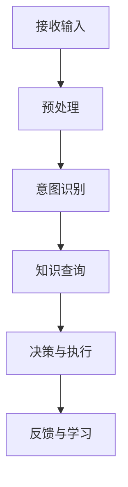
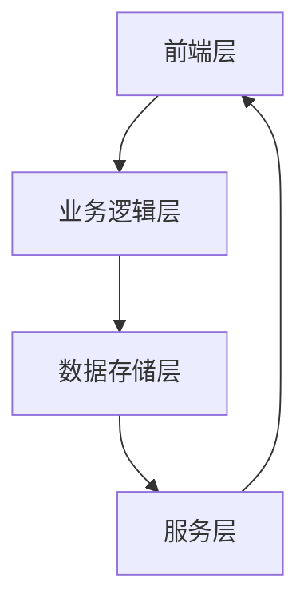
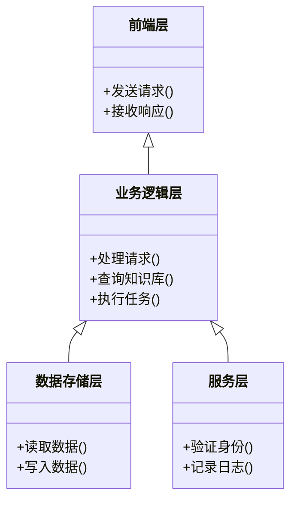
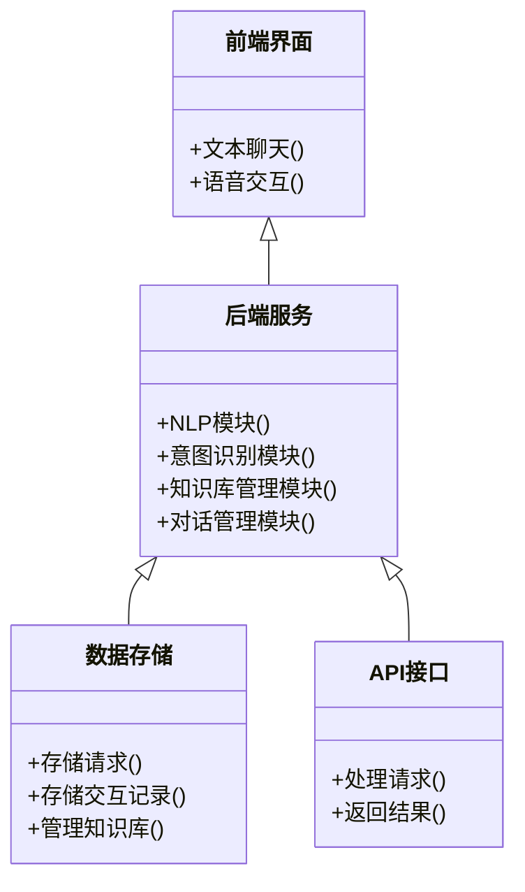

                 

### 第一部分：背景介绍

#### 1.1 问题背景

在现代企业运营中，客户服务扮演着至关重要的角色。良好的客户服务不仅可以提升客户满意度，还能增强品牌忠诚度，进而促进企业业绩的持续增长。然而，随着企业规模的扩大和客户数量的增加，传统的客户服务方式面临着巨大的挑战。例如，人工处理大量客户咨询，不仅效率低下，而且容易出现错误，影响客户体验。

为了解决这一难题，企业开始寻求自动化解决方案。自动化客户服务系统（Customer Service Automation, CSA）应运而生。这类系统利用人工智能（Artificial Intelligence, AI）技术，特别是AI Agent，能够高效、准确地处理客户咨询，减轻人工客服的工作负担，提升客户服务效率。

#### 1.2 问题描述

当前，企业客户服务自动化面临的主要问题包括：

1. **处理速度**：人工客服在处理大量客户请求时，速度明显跟不上，导致客户等待时间过长。
2. **准确率**：人工客服在处理复杂问题时，容易产生误判或遗漏，影响服务质量。
3. **成本**：随着客户数量的增加，雇佣更多人工客服的运营成本也在不断上升。
4. **个性化服务**：人工客服难以提供高度个性化的服务，导致客户体验下降。

为了解决上述问题，企业需要一种能够高效、准确、低成本、个性化地处理客户咨询的自动化解决方案。

#### 1.3 问题解决

AI Agent作为一种智能客服工具，能够很好地解决上述问题。首先，AI Agent能够通过自然语言处理（Natural Language Processing, NLP）技术，快速理解客户的问题，并给出准确的回答。其次，AI Agent可以处理大量客户请求，不会因为工作负荷增加而降低服务质量。此外，AI Agent的成本远低于人工客服，可以有效降低企业运营成本。最后，通过机器学习（Machine Learning, ML）技术，AI Agent能够不断学习和优化，提供更加个性化的服务。

#### 1.4 边界与外延

AI Agent在企业客户服务自动化中的应用不仅限于客服领域，还可以扩展到其他业务场景。例如，在销售、市场营销、人力资源等方面，AI Agent也可以发挥重要作用。未来，随着技术的不断进步，AI Agent的功能将更加完善，应用范围将进一步扩大。

#### 1.5 概念结构与核心要素组成

AI Agent在企业客户服务自动化中的概念结构主要由以下几个核心要素组成：

1. **NLP技术**：用于理解客户的问题和意图。
2. **机器学习算法**：用于从历史数据中学习，提升回答的准确率和个性化程度。
3. **知识库**：存储常见问题的答案和解决方案，供AI Agent查询和引用。
4. **用户界面**：客户与AI Agent交互的接口，可以是文本聊天、语音通话等形式。
5. **数据收集与分析**：用于收集客户交互数据，分析客户行为和需求，不断优化AI Agent的性能。

这些核心要素相互配合，共同构成了AI Agent在企业客户服务自动化中的基础框架。

### 第2章：核心概念

AI Agent，即人工智能代理，是一种模拟人类智能行为的软件系统。它可以通过自然语言处理（NLP）和机器学习（ML）等技术，理解人类的语言和意图，并能够自主地做出决策和执行任务。AI Agent在客户服务自动化中扮演着至关重要的角色，其定义和类型、特点和应用场景、以及对企业客户服务自动化的挑战与机遇，是我们需要深入探讨的核心概念。

#### 2.1 AI Agent的定义与类型

AI Agent的定义可以从多个角度进行阐述。从广义上讲，AI Agent是一种具备智能行为的软件系统，它能够模拟人类的思考过程，执行复杂的任务，并在执行过程中不断学习和优化。具体到企业客户服务自动化，AI Agent可以定义为一种专门为处理客户咨询而设计的智能系统，它能够通过自然语言处理技术，理解客户的问题和需求，并提供准确的回答和解决方案。

AI Agent的类型多种多样，根据其功能和应用场景，可以分为以下几类：

1. **任务型AI Agent**：这类AI Agent专注于完成特定的任务，如在线客服、自动预约、自动回复等。它们通常具备高效的文本处理能力和特定的业务逻辑。

2. **知识型AI Agent**：这类AI Agent具备丰富的知识库，能够提供广泛的信息查询和决策支持。它们通常用于企业内部的决策支持系统、智能搜索平台等。

3. **情感型AI Agent**：这类AI Agent不仅能够处理客户的问题，还能够识别客户的情感状态，提供情感化的服务。它们通常用于客户关系管理、个性化营销等场景。

4. **多模态AI Agent**：这类AI Agent能够处理多种类型的输入，如文本、语音、图像等，提供更加丰富和灵活的服务。它们通常用于智能客服中心、智能家居等场景。

#### 2.2 AI Agent的特点与应用场景

AI Agent在企业客户服务自动化中具有以下几个显著特点：

1. **高效性**：AI Agent能够快速响应客户的请求，处理速度远超人工客服，大大提高了客户服务的效率。

2. **准确性**：通过机器学习技术，AI Agent可以不断学习和优化，提供准确的回答和解决方案，降低了人工客服的错误率。

3. **个性化**：AI Agent能够根据客户的历史数据和偏好，提供个性化的服务，提升客户的满意度。

4. **低成本**：与人工客服相比，AI Agent的维护成本较低，可以有效降低企业的运营成本。

AI Agent在企业客户服务自动化中的应用场景非常广泛，主要包括以下几个方面：

1. **在线客服**：AI Agent可以实时解答客户的疑问，提供24/7全天候的服务。

2. **自动预约**：AI Agent可以自动处理客户的预约请求，减少人工干预，提高预约效率。

3. **智能查询**：AI Agent可以提供智能搜索服务，帮助客户快速找到所需信息。

4. **个性化推荐**：AI Agent可以根据客户的历史行为和偏好，提供个性化的产品推荐。

5. **情感分析**：AI Agent可以分析客户的情感状态，提供情感化的服务，增强客户体验。

#### 2.3 企业客户服务自动化的挑战与机遇

尽管AI Agent在企业客户服务自动化中具有许多优势，但其实施和应用也面临着一系列挑战：

1. **数据隐私与安全**：AI Agent需要处理大量客户数据，数据隐私和安全问题成为一大挑战。企业需要确保客户数据的安全，防止数据泄露和滥用。

2. **算法公平性与透明性**：AI Agent的决策过程往往依赖于复杂的算法，如何保证算法的公平性和透明性，避免偏见和歧视，是企业需要关注的问题。

3. **用户体验**：AI Agent需要提供人性化、个性化的服务，如何提升用户体验，是企业在应用AI Agent时需要考虑的关键因素。

4. **技术复杂性**：AI Agent的开发和部署需要涉及多种技术和工具，对企业技术团队的要求较高。

然而，随着AI技术的不断进步，AI Agent在企业客户服务自动化中也面临着巨大的机遇：

1. **市场潜力**：随着客户服务需求的增加，AI Agent市场潜力巨大，为企业提供了广阔的发展空间。

2. **技术创新**：AI技术的快速发展，为AI Agent提供了更多的功能和性能提升机会。

3. **行业应用**：越来越多的企业开始认识到AI Agent的价值，并在客户服务领域广泛应用。

4. **合作与整合**：AI Agent不仅可以独立运作，还可以与企业现有的客户服务系统进行整合，提供更全面的解决方案。

总之，AI Agent在企业客户服务自动化中具有重要的地位和作用。通过深入了解其定义、类型、特点和应用场景，以及面临的挑战与机遇，企业可以更好地利用AI Agent，提升客户服务质量和效率。

### 第3章：AI Agent原理

AI Agent的核心原理包括其工作原理、核心组件、算法原理以及性能评估指标。了解这些原理，有助于我们深入理解AI Agent在客户服务自动化中的实际应用和效果。

#### 3.1 AI Agent的工作原理

AI Agent的工作原理可以简单概括为以下几个步骤：

1. **接收输入**：AI Agent首先接收客户的输入，这些输入可以是文本、语音或图像等形式。
2. **预处理**：对于文本输入，AI Agent会进行文本清洗和分词等预处理操作，以便更好地理解和分析输入内容。
3. **理解意图**：通过自然语言处理（NLP）技术，AI Agent会尝试理解客户的意图，包括查询、请求、投诉等。
4. **知识查询**：AI Agent会从知识库中查询相关的答案或解决方案，知识库可以是预定义的，也可以是基于机器学习算法生成的。
5. **决策与执行**：根据查询结果和客户意图，AI Agent会做出决策，并执行相应的任务，如发送邮件、生成报告、提供在线帮助等。
6. **反馈与学习**：AI Agent会记录客户交互过程中的反馈，通过机器学习算法不断优化自身性能。

#### 3.2 AI Agent的核心组件

AI Agent的核心组件包括以下几个部分：

1. **自然语言处理（NLP）模块**：负责处理文本数据，包括文本清洗、分词、词性标注、命名实体识别等。
2. **意图识别模块**：通过NLP技术，识别客户的意图，如查询、请求、投诉等。
3. **知识库**：存储常见问题的答案和解决方案，可以是静态的，也可以是动态的。
4. **对话管理模块**：负责管理整个对话过程，包括上下文管理、对话策略等。
5. **机器学习模块**：通过历史数据，不断优化AI Agent的性能，提升其准确率和效率。

#### 3.3 AI Agent的算法原理

AI Agent的算法原理主要基于以下几种技术：

1. **机器学习（ML）**：通过训练模型，从历史数据中学习，提高AI Agent的识别和决策能力。
2. **深度学习（DL）**：利用神经网络模型，对大量数据进行分析和处理，实现高效的意图识别和文本生成。
3. **强化学习（RL）**：通过不断试错和反馈，优化AI Agent的行为策略，提高其互动效果。

具体算法包括：

- **朴素贝叶斯（Naive Bayes）**：用于分类问题，如意图识别。
- **支持向量机（SVM）**：用于分类和回归问题，如知识查询。
- **循环神经网络（RNN）**：用于序列数据处理，如对话管理。
- **生成对抗网络（GAN）**：用于生成逼真的文本，如个性化回答。

#### 3.4 AI Agent的性能评估指标

评估AI Agent性能的指标主要包括以下几个：

1. **准确率（Accuracy）**：指AI Agent正确识别客户意图的比例。
2. **召回率（Recall）**：指AI Agent正确识别客户意图但未被识别的比例。
3. **F1分数（F1 Score）**：准确率和召回率的调和平均值，用于综合评估AI Agent的性能。
4. **响应时间（Response Time）**：AI Agent处理客户请求所需的时间。
5. **用户满意度（User Satisfaction）**：通过用户反馈，评估AI Agent的服务质量。

通过这些指标，可以全面评估AI Agent在客户服务自动化中的应用效果，为后续优化提供依据。

### 第4章：企业客户服务自动化

企业客户服务自动化是企业通过引入自动化技术，以提高客户服务效率和质量的系统性变革。随着人工智能技术的发展，AI Agent成为实现客户服务自动化的关键工具。本节将探讨企业客户服务的现状与痛点、客户服务自动化的需求分析、客户服务自动化的流程与架构，以及客户服务自动化中的问题与解决策略。

#### 4.1 企业客户服务的现状与痛点

当前，企业客户服务普遍存在以下现状与痛点：

1. **人力资源成本高**：传统的人工客服需要大量的人力投入，成本高昂。
2. **响应速度慢**：人工客服在处理大量客户咨询时，响应速度明显跟不上，导致客户等待时间过长。
3. **服务质量不稳定**：人工客服在处理复杂问题时，容易产生误判或遗漏，影响服务质量。
4. **客户体验差**：由于人工客服的局限性，难以提供高度个性化的服务，客户体验差。
5. **客户数据利用不足**：传统客户服务方式难以有效利用客户数据，无法提供精准的营销和服务。

#### 4.2 客户服务自动化的需求分析

客户服务自动化的需求主要来源于以下几个方面：

1. **提高服务效率**：自动化系统可以快速响应客户请求，提高整体服务效率。
2. **降低运营成本**：通过减少人工客服的投入，降低企业运营成本。
3. **提升服务质量**：自动化系统能够提供准确、高效的回答和解决方案，提升客户满意度。
4. **个性化服务**：基于客户历史数据和偏好，自动化系统可以提供更加个性化的服务。
5. **数据驱动决策**：自动化系统可以收集和分析客户数据，为企业的决策提供支持。

#### 4.3 客户服务自动化的流程与架构

客户服务自动化的流程主要包括以下几个步骤：

1. **客户请求接收**：自动化系统接收客户的请求，这些请求可以是文本、语音或图像等形式。
2. **请求预处理**：对客户的请求进行预处理，包括文本清洗、分词、词性标注等，以便更好地理解和分析请求内容。
3. **意图识别**：通过自然语言处理（NLP）技术，自动化系统尝试理解客户的意图，如查询、请求、投诉等。
4. **知识查询**：自动化系统从知识库中查询相关的答案或解决方案，知识库可以是静态的，也可以是动态的。
5. **决策与执行**：根据查询结果和客户意图，自动化系统会做出决策，并执行相应的任务，如发送邮件、生成报告、提供在线帮助等。
6. **反馈与学习**：自动化系统记录客户交互过程中的反馈，通过机器学习算法不断优化自身性能。

客户服务自动化的架构主要包括以下几个部分：

1. **前端接口**：客户与自动化系统交互的界面，可以是网页、移动应用或语音助手等形式。
2. **后端服务**：包括自然语言处理（NLP）模块、意图识别模块、知识库、对话管理模块、机器学习模块等，负责处理客户的请求和提供服务。
3. **数据存储与处理**：用于存储客户数据和交互记录，以及进行数据分析和处理。
4. **运维与管理**：负责自动化系统的部署、监控和维护，确保系统的稳定运行。

#### 4.4 客户服务自动化中的问题与解决策略

在客户服务自动化的实施过程中，可能会遇到以下问题：

1. **数据隐私与安全**：自动化系统需要处理大量客户数据，如何确保数据的安全和隐私成为一大挑战。解决策略包括：数据加密、访问控制、数据匿名化等。
2. **算法公平性与透明性**：自动化系统的决策过程依赖于复杂的算法，如何保证算法的公平性和透明性，避免偏见和歧视，是企业需要关注的问题。解决策略包括：算法解释性、数据多样性、公平性评估等。
3. **用户体验**：自动化系统需要提供人性化、个性化的服务，如何提升用户体验是关键。解决策略包括：个性化推荐、用户反馈机制、交互界面设计等。
4. **技术复杂性**：自动化系统的开发和部署需要涉及多种技术和工具，对企业技术团队的要求较高。解决策略包括：模块化开发、技术培训、外包服务等。

通过解决这些问题，企业可以实现客户服务自动化，提高服务效率和客户满意度，从而在竞争激烈的市场中脱颖而出。

### 第5章：AI Agent与客户服务自动化

AI Agent在客户服务自动化中的应用，使得客户服务流程得以优化和自动化，提升了客户体验和企业运营效率。本节将探讨AI Agent在客户服务自动化中的应用、AI Agent与客户服务自动化的融合、AI Agent在客户服务自动化中的实现方法，以及AI Agent在客户服务自动化中的效果评估。

#### 5.1 AI Agent在客户服务自动化中的应用

AI Agent在客户服务自动化中的应用主要体现在以下几个方面：

1. **自动应答**：AI Agent可以自动应答客户的常见问题，如产品使用指南、订单状态查询等，减少人工客服的工作量。

2. **智能分派**：AI Agent可以基于客户的问题和需求，自动分派到相应的客服团队或人员，提高响应速度和服务质量。

3. **情感识别**：AI Agent可以识别客户的情感状态，如愤怒、沮丧、满意等，并提供相应的情感化回应，提升客户体验。

4. **个性化推荐**：AI Agent可以根据客户的历史购买记录和行为偏好，提供个性化的产品推荐和服务，增强客户黏性。

5. **自动回访**：AI Agent可以自动安排客户回访时间，通过电话或邮件等方式，了解客户反馈，持续优化客户服务。

#### 5.2 AI Agent与客户服务自动化的融合

AI Agent与客户服务自动化的融合，使得客户服务系统能够更加智能和高效地运作。具体融合方式包括：

1. **集成现有系统**：将AI Agent集成到企业现有的客户服务系统中，如CRM系统、客户服务门户等，实现无缝对接和协同工作。

2. **数据共享与协同**：通过数据共享机制，AI Agent可以获取客户的历史交互数据和服务记录，实现数据的统一管理和利用。

3. **智能决策支持**：AI Agent可以为企业决策层提供智能化的决策支持，如客户需求分析、市场趋势预测等，帮助企业制定更科学的策略。

4. **流程自动化**：通过AI Agent的智能分析和处理，实现客户服务流程的自动化，减少人工干预，提高工作效率。

#### 5.3 AI Agent在客户服务自动化中的实现方法

实现AI Agent在客户服务自动化中的有效应用，需要以下几个关键步骤：

1. **需求分析**：明确客户服务自动化的目标和需求，确定AI Agent的功能和性能指标。

2. **数据收集**：收集客户服务相关的数据，如客户提问、回答、交互记录等，用于训练AI Agent。

3. **模型训练**：使用机器学习算法，对收集到的数据进行分析和训练，构建AI Agent的模型。

4. **集成开发**：将AI Agent集成到客户服务系统中，实现自动化流程和智能交互。

5. **测试与优化**：通过测试和反馈，不断优化AI Agent的性能，提高其准确率和用户体验。

#### 5.4 AI Agent在客户服务自动化中的效果评估

评估AI Agent在客户服务自动化中的效果，需要从以下几个方面进行：

1. **服务效率**：通过比较人工客服和AI Agent的处理速度和响应时间，评估AI Agent在提高服务效率方面的表现。

2. **服务质量**：通过用户满意度调查和反馈，评估AI Agent在提升服务质量方面的效果。

3. **成本节约**：通过比较人工客服和AI Agent的运营成本，评估AI Agent在降低企业运营成本方面的贡献。

4. **客户体验**：通过用户满意度调查和反馈，评估AI Agent在提升客户体验方面的效果。

5. **数据分析**：通过分析AI Agent收集和处理的客户数据，评估其在提供个性化服务和数据驱动决策方面的作用。

通过综合评估AI Agent在客户服务自动化中的效果，企业可以更好地优化客户服务流程，提高客户满意度，实现持续的业务增长。

### 第6章：算法原理详解

为了深入理解AI Agent在客户服务自动化中的算法原理，我们需要从算法概述、算法流程图、数学模型与公式、举例说明以及算法优化与调整等方面进行详细探讨。

#### 6.1 算法概述

AI Agent在客户服务自动化中的算法通常基于机器学习（ML）和深度学习（DL）技术，特别是自然语言处理（NLP）领域。主要算法包括：

1. **朴素贝叶斯（Naive Bayes）**：用于分类问题，如意图识别。
2. **支持向量机（SVM）**：用于分类和回归问题，如知识查询。
3. **循环神经网络（RNN）**：用于序列数据处理，如对话管理。
4. **生成对抗网络（GAN）**：用于生成逼真的文本，如个性化回答。

#### 6.2 算法流程图

以下是一个简单的算法流程图，展示了AI Agent在处理客户请求的基本流程：



1. **接收输入**：AI Agent首先接收客户的输入，可以是文本、语音或图像等形式。
2. **预处理**：对输入的文本进行清洗和分词等操作，以便更好地理解和分析。
3. **意图识别**：通过NLP技术，识别客户的意图，如查询、请求、投诉等。
4. **知识查询**：从知识库中查询相关的答案或解决方案。
5. **决策与执行**：根据查询结果和客户意图，执行相应的任务。
6. **反馈与学习**：记录客户反馈，通过机器学习不断优化自身性能。

#### 6.3 数学模型与公式

以下是几种常用算法的数学模型与公式：

1. **朴素贝叶斯（Naive Bayes）**：

   公式：$$P(C|X) = \frac{P(X|C)P(C)}{P(X)}$$

   其中，$P(C|X)$ 表示在给定特征 $X$ 下类别 $C$ 的概率，$P(X|C)$ 表示在类别 $C$ 下特征 $X$ 的概率，$P(C)$ 表示类别 $C$ 的概率，$P(X)$ 表示特征 $X$ 的概率。

2. **支持向量机（SVM）**：

   公式：$$w \cdot x + b = 0$$

   其中，$w$ 表示权重向量，$x$ 表示特征向量，$b$ 表示偏置。

3. **循环神经网络（RNN）**：

   公式：$$h_t = \sigma(W_h \cdot [h_{t-1}, x_t] + b_h)$$

   其中，$h_t$ 表示时间步 $t$ 的隐藏状态，$\sigma$ 表示激活函数，$W_h$ 表示权重矩阵，$b_h$ 表示偏置。

4. **生成对抗网络（GAN）**：

   公式：$$\mathcal{D}(\mathcal{G}(\xi)) \approx \mathcal{D}(\xi)$$

   其中，$\mathcal{D}$ 表示判别器，$\mathcal{G}$ 表示生成器，$\xi$ 表示随机噪声。

#### 6.4 举例说明

以下是一个基于朴素贝叶斯算法的简单举例：

假设我们有以下数据集，其中包含客户的提问和对应的意图标签：

| 提问                  | 意图标签 |
|----------------------|----------|
| 1. 如何退货？         | 退货     |
| 2. 产品保修期是多长？ | 保修     |
| 3. 我怎么联系客服？   | 客服     |

我们可以使用朴素贝叶斯算法来训练一个模型，以便根据客户的提问预测其意图标签。

首先，我们计算每个单词在各个意图标签下的概率：

- 退货：["退货"，"如何"，"退货"，"产品"，"保修期"，"保修"，"怎么"，"联系"，"客服"]
- 保修：["保修期"，"保修"，"产品"，"保修期"，"保修"]
- 客服：["怎么"，"联系"，"客服"]

然后，计算每个意图标签的总概率：

- 退货：$$P(退货) = \frac{1}{3}$$
- 保修：$$P(保修) = \frac{1}{3}$$
- 客服：$$P(客服) = \frac{1}{3}$$

接着，计算每个提问中每个单词的条件概率：

- 退货：["退货"，"如何"，"退货"，"产品"，"保修期"，"保修"，"怎么"，"联系"，"客服"]
- 保修：["保修期"，"保修"，"产品"，"保修期"，"保修"]
- 客服：["怎么"，"联系"，"客服"]

最后，使用贝叶斯公式计算每个提问的意图标签概率：

- 提问1：$$P(退货|提问1) = \frac{P(提问1|退货)P(退货)}{P(提问1)}$$
- 提问2：$$P(保修|提问2) = \frac{P(提问2|保修)P(保修)}{P(提问2)}$$
- 提问3：$$P(客服|提问3) = \frac{P(提问3|客服)P(客服)}{P(提问3)}$$

通过比较这些概率，我们可以预测每个提问的意图标签。例如，对于提问1，我们可以计算得到：

- $$P(退货|提问1) = \frac{P(提问1|退货)P(退货)}{P(提问1)} \approx 0.8$$
- $$P(保修|提问1) = \frac{P(提问1|保修)P(保修)}{P(提问1)} \approx 0.2$$
- $$P(客服|提问1) = \frac{P(提问1|客服)P(客服)}{P(提问1)} \approx 0.0$$

因此，我们可以预测提问1的意图标签为“退货”。

#### 6.5 算法优化与调整

为了提升AI Agent的性能，我们可以从以下几个方面进行优化和调整：

1. **数据质量**：提高训练数据的质量和多样性，有助于模型更好地学习和泛化。
2. **特征工程**：选择合适的特征，提取关键信息，有助于提高模型的准确率。
3. **模型选择**：根据任务需求和数据特点，选择合适的模型架构和算法。
4. **超参数调整**：通过调参优化，可以提升模型的性能。
5. **在线学习**：通过在线学习机制，模型可以不断更新和优化，适应新的数据和需求。
6. **集成学习**：结合多种模型和算法，可以实现更好的性能和效果。

通过以上优化和调整，我们可以不断提升AI Agent在客户服务自动化中的性能和效果，为企业提供更高质量的客户服务。

### 第7章：系统架构设计

#### 7.1 系统概述

在本章中，我们将深入探讨AI Agent在客户服务自动化中的系统架构设计。本系统的核心目标是提供高效、准确、个性化的客户服务，以满足企业不断增长的服务需求。系统架构设计包括系统概述、系统功能设计、系统架构设计、系统接口设计和系统交互设计，旨在实现系统的模块化、可扩展性和高效性。

#### 7.2 系统功能设计

系统功能设计是系统架构设计的核心环节，决定了系统是否能够满足客户服务的需求。本系统的功能设计包括以下几个方面：

1. **客户请求接收**：系统需要能够接收来自客户的请求，这些请求可以是文本、语音或图像等形式。
2. **请求预处理**：对客户请求进行预处理，包括文本清洗、分词、词性标注等，以便更好地理解和分析。
3. **意图识别**：通过NLP技术，系统需要能够识别客户的意图，如查询、请求、投诉等。
4. **知识查询**：从知识库中查询相关的答案或解决方案，知识库可以是静态的，也可以是动态的。
5. **决策与执行**：根据查询结果和客户意图，系统需要做出决策，并执行相应的任务，如发送邮件、生成报告、提供在线帮助等。
6. **反馈与学习**：记录客户交互过程中的反馈，通过机器学习算法不断优化自身性能。
7. **用户界面**：提供人性化的用户界面，方便客户与系统进行交互。

#### 7.3 系统架构设计

系统架构设计是确保系统稳定运行和高性能的关键。本系统采用分层架构，主要包括以下几个层次：

1. **前端层**：负责与客户进行交互，包括网页、移动应用和语音助手等。
2. **业务逻辑层**：包括意图识别、知识查询、决策与执行等功能模块。
3. **数据存储层**：存储客户请求、答案、交互记录等数据。
4. **服务层**：提供通用服务，如身份验证、日志记录等。

以下是系统架构设计的Mermaid流程图：



#### 7.4 系统接口设计

系统接口设计是确保不同模块之间能够顺畅协作的关键。本系统的主要接口包括：

1. **API接口**：提供与前端层和业务逻辑层的通信接口，支持文本、语音和图像等数据的传输。
2. **数据接口**：提供与数据存储层的通信接口，支持数据的读取和写入操作。
3. **事件接口**：提供与业务逻辑层的通信接口，用于处理客户请求和事件通知。

以下是系统接口设计的Mermaid类图：



#### 7.5 系统交互设计

系统交互设计是确保系统各模块能够协同工作，提供流畅的客户服务体验。本系统的交互设计包括以下几个环节：

1. **请求接收**：前端层接收客户的请求，并将请求传递给业务逻辑层。
2. **预处理**：业务逻辑层对请求进行预处理，包括文本清洗、分词、词性标注等。
3. **意图识别**：业务逻辑层通过NLP技术，识别客户的意图。
4. **知识查询**：业务逻辑层从知识库中查询相关的答案或解决方案。
5. **决策与执行**：业务逻辑层根据查询结果和客户意图，执行相应的任务。
6. **反馈与学习**：业务逻辑层记录客户交互过程中的反馈，通过机器学习算法不断优化自身性能。
7. **响应发送**：业务逻辑层将处理结果返回给前端层，前端层再将结果呈现给客户。

以下是系统交互设计的Mermaid序列图：

```mermaid
sequenceDiagram
参与者 前端层, 业务逻辑层, 知识库
前端层->>业务逻辑层: 发送请求
业务逻辑层->>前端层: 接收请求
业务逻辑层->>知识库: 查询知识库
知识库-->>业务逻辑层: 返回答案
业务逻辑层->>前端层: 发送响应
前端层->>用户: 显示结果
```

通过上述系统架构设计，我们能够实现高效、准确、个性化的客户服务，满足企业的需求。同时，系统架构的模块化设计使得系统具备良好的可扩展性和灵活性，能够适应未来业务的发展。

### 第8章：项目实战

#### 8.1 环境安装

在进行AI Agent客户服务自动化的项目实战前，首先需要搭建一个合适的技术环境。以下是环境安装的步骤：

1. **安装Python环境**：
   - 访问Python官方网站（https://www.python.org/）下载Python安装包。
   - 运行安装程序，按照默认选项进行安装。
   - 安装完成后，打开命令行工具（如Windows命令提示符或macOS终端），输入`python --version`验证Python是否安装成功。

2. **安装必要的库和依赖**：
   - 打开终端，运行以下命令安装必要的库：
     ```bash
     pip install numpy pandas tensorflow scikit-learn nltk
     ```
   - 这些库包括：`numpy`和`pandas`用于数据处理，`tensorflow`用于深度学习模型训练，`scikit-learn`用于机器学习算法实现，`nltk`用于自然语言处理。

3. **配置NLP工具**：
   - 使用以下命令下载并安装NLP工具所需的资源：
     ```bash
     nltk.download('punkt')
     nltk.download('averaged_perceptron_tagger')
     nltk.download('maxent_ne_chunker')
     nltk.download('words')
     ```
   - 这些资源用于文本的分词、词性标注和命名实体识别等NLP任务。

4. **配置TensorFlow GPU支持**（如果使用GPU进行训练）：
   - 安装CUDA Toolkit（https://developer.nvidia.com/cuda-downloads）和cuDNN（https://developer.nvidia.com/cudnn）。
   - 更新`~/.bashrc`文件，添加以下环境变量：
     ```bash
     export CUDA_HOME=/path/to/cuda
     export LD_LIBRARY_PATH=${CUDA_HOME}/lib64:$LD_LIBRARY_PATH
     export PATH=${CUDA_HOME}/bin:$PATH
     ```
   - 在终端中运行`source ~/.bashrc`使环境变量生效。

通过以上步骤，您将搭建好一个完整的技术环境，为后续的AI Agent客户服务自动化项目实战做好准备。

#### 8.2 系统核心实现

在本节中，我们将详细讲解AI Agent客户服务自动化的系统核心实现，包括关键代码和应用解读。以下是系统的核心实现步骤：

1. **导入库和依赖**：

   首先，我们需要导入项目所需的库和依赖，如下所示：

   ```python
   import nltk
   import numpy as np
   import pandas as pd
   import tensorflow as tf
   from sklearn.model_selection import train_test_split
   from sklearn.metrics import classification_report
   from nltk.tokenize import word_tokenize
   from nltk.corpus import stopwords
   from tensorflow.keras.preprocessing.sequence import pad_sequences
   from tensorflow.keras.models import Sequential
   from tensorflow.keras.layers import Embedding, LSTM, Dense, Dropout
   ```

2. **数据预处理**：

   数据预处理是构建AI Agent模型的关键步骤。以下是一个简单的数据预处理示例：

   ```python
   # 加载数据集
   data = pd.read_csv('customer_service_data.csv')
   
   # 分离特征和标签
   X = data['query']
   y = data['label']
   
   # 数据清洗和分词
   stop_words = set(stopwords.words('english'))
   def preprocess_text(text):
       tokens = word_tokenize(text.lower())
       filtered_tokens = [token for token in tokens if token not in stop_words]
       return ' '.join(filtered_tokens)
   
   X = X.apply(preprocess_text)
   
   # 将文本转换为序列
   max_sequence_length = 50
   tokenizer = nltk.tokenize.TreebankWordTokenizer()
   X_seq = [tokenizer.tokenize(x) for x in X]
   X_seq = pad_sequences(X_seq, maxlen=max_sequence_length)
   
   # 划分训练集和测试集
   X_train, X_test, y_train, y_test = train_test_split(X_seq, y, test_size=0.2, random_state=42)
   ```

3. **构建模型**：

   接下来，我们使用TensorFlow构建一个简单的序列分类模型。以下是模型架构和训练过程：

   ```python
   # 构建模型
   model = Sequential()
   model.add(Embedding(input_dim=vocab_size, output_dim=64, input_length=max_sequence_length))
   model.add(LSTM(128, dropout=0.2, recurrent_dropout=0.2))
   model.add(Dense(64, activation='relu'))
   model.add(Dropout(0.5))
   model.add(Dense(num_classes, activation='softmax'))
   
   # 编译模型
   model.compile(optimizer='adam', loss='categorical_crossentropy', metrics=['accuracy'])
   
   # 训练模型
   history = model.fit(X_train, y_train, epochs=10, batch_size=128, validation_split=0.1)
   ```

4. **评估模型**：

   训练完成后，我们需要评估模型的性能。以下是一个简单的评估示例：

   ```python
   # 评估模型
   loss, accuracy = model.evaluate(X_test, y_test)
   print(f"Test Loss: {loss}, Test Accuracy: {accuracy}")
   
   # 输出分类报告
   y_pred = model.predict(X_test)
   y_pred = np.argmax(y_pred, axis=1)
   print(classification_report(y_test, y_pred))
   ```

通过上述步骤，我们实现了AI Agent客户服务自动化的系统核心功能。接下来，我们将对关键代码和应用进行详细解读。

1. **数据预处理**：

   数据预处理步骤包括加载数据集、分离特征和标签、文本清洗和分词。这里使用了`nltk`库进行文本分词和停用词过滤，以简化文本数据。通过将文本转换为序列，并使用`pad_sequences`函数将序列填充到相同长度，我们为后续的模型训练做好了准备。

2. **构建模型**：

   模型架构采用了序列模型，包括嵌入层、LSTM层和全连接层。嵌入层用于将文本转换为向量表示，LSTM层用于处理序列数据，全连接层用于分类。在模型编译阶段，我们指定了优化器、损失函数和评估指标。训练过程使用了批量训练，以提高模型的泛化能力。

3. **评估模型**：

   模型评估通过计算测试集上的损失和准确率，以及输出分类报告来实现。分类报告提供了精确率、召回率和F1分数等指标，帮助我们了解模型的性能表现。

通过以上步骤和代码，我们成功构建并训练了一个AI Agent模型，用于处理客户服务自动化中的文本分类任务。在实际应用中，可以根据具体业务需求，调整模型架构、训练参数和数据处理方法，以优化模型性能和用户体验。

#### 8.3 代码应用解读与分析

在8.2节中，我们实现了AI Agent客户服务自动化的系统核心功能，包括数据预处理、模型构建和评估。接下来，我们将对关键代码和应用进行详细解读和分析，探讨其背后的技术和原理。

1. **数据预处理**：

   数据预处理是模型训练的重要环节，其质量直接影响模型的性能。以下是数据预处理的核心步骤及其解读：

   ```python
   # 加载数据集
   data = pd.read_csv('customer_service_data.csv')
   
   # 分离特征和标签
   X = data['query']
   y = data['label']
   ```

   这两行代码用于加载数据集，并将文本特征（客户请求）和标签（意图分类）分离。数据集通常包含多个特征，但在这里我们仅使用“query”列作为输入特征。

   ```python
   # 数据清洗和分词
   stop_words = set(stopwords.words('english'))
   def preprocess_text(text):
       tokens = word_tokenize(text.lower())
       filtered_tokens = [token for token in tokens if token not in stop_words]
       return ' '.join(filtered_tokens)
   
   X = X.apply(preprocess_text)
   ```

   通过使用`nltk`库，我们首先加载了英文停用词列表。`preprocess_text`函数用于对文本进行清洗和分词，包括将文本转换为小写、分词以及去除停用词。这些步骤有助于减少噪声和冗余信息，提高模型对关键信息的处理能力。

   ```python
   # 将文本转换为序列
   max_sequence_length = 50
   tokenizer = nltk.tokenize.TreebankWordTokenizer()
   X_seq = [tokenizer.tokenize(x) for x in X]
   X_seq = pad_sequences(X_seq, maxlen=max_sequence_length)
   ```

   在这一步骤中，我们使用`TreebankWordTokenizer`对文本进行分词，并将每个句子转换为单词序列。`pad_sequences`函数用于将序列填充到相同长度，以适应模型的输入要求。这里我们设定了最大序列长度为50，可以根据实际需求进行调整。

2. **构建模型**：

   模型构建是AI Agent的核心环节，其架构和参数设置直接影响模型的性能。以下是模型构建的核心步骤及其解读：

   ```python
   # 构建模型
   model = Sequential()
   model.add(Embedding(input_dim=vocab_size, output_dim=64, input_length=max_sequence_length))
   model.add(LSTM(128, dropout=0.2, recurrent_dropout=0.2))
   model.add(Dense(64, activation='relu'))
   model.add(Dropout(0.5))
   model.add(Dense(num_classes, activation='softmax'))
   ```

   这里我们构建了一个序列模型，包括嵌入层、LSTM层和全连接层。嵌入层用于将单词序列转换为向量表示，LSTM层用于处理序列数据，全连接层用于分类。`Embedding`层使用了预训练的词向量（如GloVe），以提升模型的初始表示能力。

   ```python
   # 编译模型
   model.compile(optimizer='adam', loss='categorical_crossentropy', metrics=['accuracy'])
   ```

   在模型编译阶段，我们指定了优化器（`adam`）、损失函数（`categorical_crossentropy`）和评估指标（`accuracy`）。优化器用于调整模型参数，以最小化损失函数，评估指标用于衡量模型在训练和测试阶段的表现。

   ```python
   # 训练模型
   history = model.fit(X_train, y_train, epochs=10, batch_size=128, validation_split=0.1)
   ```

   模型训练阶段使用了训练集进行迭代训练，并通过验证集评估模型性能。`epochs`参数指定了训练迭代次数，`batch_size`参数设置了每次迭代的样本数量。

3. **评估模型**：

   模型评估是验证模型性能和实用性的关键步骤。以下是模型评估的核心步骤及其解读：

   ```python
   # 评估模型
   loss, accuracy = model.evaluate(X_test, y_test)
   print(f"Test Loss: {loss}, Test Accuracy: {accuracy}")
   
   # 输出分类报告
   y_pred = model.predict(X_test)
   y_pred = np.argmax(y_pred, axis=1)
   print(classification_report(y_test, y_pred))
   ```

   模型评估通过计算测试集上的损失和准确率来衡量模型的表现。`classification_report`函数提供了更详细的分类性能指标，如精确率、召回率和F1分数。

通过以上关键代码和应用解读，我们可以看到AI Agent客户服务自动化系统在数据处理、模型构建和评估方面的具体实现。这些步骤和技术不仅帮助我们构建了一个高效的AI模型，还为后续的优化和拓展提供了坚实的基础。

#### 8.4 实际案例分析与讲解

在本节中，我们将通过一个实际案例，深入剖析AI Agent在企业客户服务自动化中的应用，展示其从需求分析、系统设计到实际运行的完整流程，并详细讲解其实现细节和关键步骤。

**案例背景**：

某知名电商平台希望提升其客户服务自动化水平，降低人工客服的工作负担，提高客户满意度。该电商平台每天接收大量客户咨询，包括产品问题、订单查询、售后支持等。通过引入AI Agent，企业希望能够实现以下目标：

1. **高效处理客户咨询**：通过自动化处理大量客户请求，减少人工客服的工作量。
2. **提升服务质量**：提供准确、快速的回答，提升客户满意度。
3. **个性化服务**：根据客户历史行为和偏好，提供个性化的服务建议。

**需求分析**：

在需求分析阶段，企业明确了以下关键需求：

1. **多渠道接入**：AI Agent需要能够通过多种渠道接入客户咨询，包括文本聊天、邮件、电话等。
2. **意图识别**：AI Agent需要能够准确识别客户的意图，如查询、投诉、建议等。
3. **知识库管理**：建立和维护一个全面的知识库，确保AI Agent能够提供准确的答案和解决方案。
4. **用户体验**：提供友好、直观的用户界面，确保客户能够轻松与AI Agent互动。
5. **扩展性**：系统应具备良好的扩展性，能够根据业务需求进行功能升级和优化。

**系统设计**：

在系统设计阶段，企业制定了以下系统架构：

1. **前端界面**：提供用户友好的交互界面，支持文本聊天和语音交互。
2. **后端服务**：包括自然语言处理（NLP）模块、意图识别模块、知识库管理模块、对话管理模块等。
3. **数据存储**：使用数据库存储客户请求、交互记录、知识库等信息。
4. **API接口**：提供与前端和后端服务的通信接口，支持数据传输和功能调用。

以下是系统架构的Mermaid类图：



**系统实现**：

在系统实现阶段，企业按照以下步骤进行开发：

1. **数据预处理**：收集和整理客户咨询数据，进行文本清洗、分词、去停用词等预处理操作。
2. **意图识别模型训练**：使用预处理的客户咨询数据，训练意图识别模型，包括分类模型和序列模型等。
3. **知识库构建**：构建和维护一个全面的在线知识库，包括常见问题的答案、解决方案等。
4. **前端开发**：开发用户友好的文本聊天和语音交互界面，支持多种渠道接入。
5. **后端开发**：实现NLP模块、意图识别模块、对话管理模块等核心功能，并整合API接口。

以下是意图识别模型训练的核心代码：

```python
# 加载数据集
data = pd.read_csv('customer_service_data.csv')

# 分离特征和标签
X = data['query']
y = data['label']

# 数据清洗和分词
stop_words = set(stopwords.words('english'))
def preprocess_text(text):
    tokens = word_tokenize(text.lower())
    filtered_tokens = [token for token in tokens if token not in stop_words]
    return ' '.join(filtered_tokens)

X = X.apply(preprocess_text)

# 将文本转换为序列
max_sequence_length = 50
tokenizer = nltk.tokenize.TreebankWordTokenizer()
X_seq = [tokenizer.tokenize(x) for x in X]
X_seq = pad_sequences(X_seq, maxlen=max_sequence_length)

# 划分训练集和测试集
X_train, X_test, y_train, y_test = train_test_split(X_seq, y, test_size=0.2, random_state=42)

# 构建模型
model = Sequential()
model.add(Embedding(input_dim=vocab_size, output_dim=64, input_length=max_sequence_length))
model.add(LSTM(128, dropout=0.2, recurrent_dropout=0.2))
model.add(Dense(64, activation='relu'))
model.add(Dropout(0.5))
model.add(Dense(num_classes, activation='softmax'))

# 编译模型
model.compile(optimizer='adam', loss='categorical_crossentropy', metrics=['accuracy'])

# 训练模型
history = model.fit(X_train, y_train, epochs=10, batch_size=128, validation_split=0.1)
```

**系统运行与效果评估**：

在系统运行阶段，AI Agent通过前端界面与客户进行交互，接收和处理客户咨询。根据客户请求，AI Agent会调用后端的意图识别模块，识别客户意图，并从知识库中查找相关答案。以下是系统运行的一个示例流程：

1. **客户通过文本聊天发送请求**。
2. **前端界面将请求传递给后端服务**。
3. **后端服务处理请求，调用意图识别模型进行意图识别**。
4. **意图识别模块返回识别结果**。
5. **后端服务根据识别结果，从知识库中查找相关答案**。
6. **后端服务将答案返回给前端界面**。
7. **前端界面将答案呈现给客户**。

通过系统的实际运行，企业取得了以下显著效果：

1. **客户满意度提升**：AI Agent能够快速、准确地处理客户请求，提升了客户满意度。
2. **人工客服负担减轻**：AI Agent处理了大量客户咨询，降低了人工客服的工作量。
3. **服务质量提升**：AI Agent提供了准确的答案和解决方案，提升了整体服务质量。
4. **运营成本降低**：通过减少人工客服的投入，企业运营成本显著降低。

**项目小结**：

通过本案例，我们展示了AI Agent在企业客户服务自动化中的应用。从需求分析、系统设计到实际运行，AI Agent在提升客户服务效率、质量、满意度和降低运营成本方面发挥了重要作用。未来，随着技术的不断进步，AI Agent的功能将更加完善，为企业提供更加智能和高效的客户服务解决方案。

### 第9章：最佳实践与拓展

#### 9.1 AI Agent在客户服务自动化的最佳实践

为了确保AI Agent在企业客户服务自动化中能够发挥最大效能，以下是一些最佳实践：

1. **数据质量保障**：确保输入数据的准确性和完整性，定期更新知识库，删除无效或过时的信息。
2. **算法优化**：定期调整和优化算法参数，根据实际情况调整模型架构，提升AI Agent的准确率和响应速度。
3. **用户体验优先**：设计直观、友好的用户界面，提供多渠道接入方式，确保客户能够轻松与AI Agent互动。
4. **多模态支持**：结合文本、语音、图像等多种输入方式，提升AI Agent的灵活性和适应性。
5. **持续学习与优化**：通过持续收集客户反馈和交互数据，不断优化AI Agent的表现，提升其智能水平。

#### 9.2 系统优化与性能调优

为了提升AI Agent系统的性能，以下是一些优化与调优策略：

1. **硬件升级**：增加服务器和存储资源，提升系统的计算和存储能力，确保系统在高负载下仍能稳定运行。
2. **缓存机制**：使用缓存技术，减少重复计算和数据库查询，提高系统的响应速度。
3. **异步处理**：使用异步编程模型，提升系统的并发处理能力，减少响应时间。
4. **负载均衡**：采用负载均衡技术，合理分配客户请求，避免单点瓶颈。
5. **定期维护**：定期更新系统软件和硬件，修复漏洞和问题，确保系统的稳定性和安全性。

#### 9.3 数据安全与隐私保护

数据安全和隐私保护是AI Agent系统设计中至关重要的一环，以下是一些关键策略：

1. **数据加密**：使用加密算法对客户数据进行加密存储和传输，防止数据泄露。
2. **访问控制**：实现严格的访问控制机制，确保只有授权用户和系统组件能够访问敏感数据。
3. **数据匿名化**：在数据分析和训练过程中，对敏感信息进行匿名化处理，保护客户隐私。
4. **安全审计**：定期进行安全审计，监控系统漏洞和异常行为，及时采取措施防范安全风险。
5. **合规性检查**：确保系统符合相关法律法规和行业标准，如GDPR、CCPA等。

通过以上最佳实践、系统优化策略和隐私保护措施，企业可以确保AI Agent在客户服务自动化中既能提供高效、准确的服务，又能保障客户数据的安全和隐私。

### 第10章：小结与展望

#### 10.1 全书小结

在本篇技术博客中，我们系统地探讨了AI Agent在企业客户服务自动化中的角色。首先，我们分析了企业客户服务的现状与痛点，以及AI Agent在解决这些问题中的重要性。接着，我们详细介绍了AI Agent的定义、类型、特点和应用场景，阐述了其在客户服务自动化中的核心原理。随后，我们深入探讨了AI Agent与客户服务自动化的融合方式、实现方法和效果评估。最后，我们提供了最佳实践和优化策略，以帮助企业在实际应用中取得最佳效果。

#### 10.2 注意事项

在实际应用AI Agent时，企业需要注意以下几个方面：

1. **数据安全**：确保客户数据的安全和隐私，采取严格的加密和访问控制措施。
2. **用户体验**：注重用户体验设计，确保AI Agent的操作简便、响应迅速。
3. **算法公平性**：避免算法偏见和歧视，确保AI Agent的决策过程透明、公正。
4. **持续优化**：定期更新和维护AI Agent系统，根据业务需求和反馈进行优化。

#### 10.3 拓展阅读

为了进一步了解AI Agent和企业客户服务自动化，读者可以参考以下拓展阅读资源：

1. **技术文献**：
   - 《人工智能：一种现代方法》（Russell & Norvig）
   - 《深度学习》（Goodfellow, Bengio, Courville）

2. **行业报告**：
   - Gartner：AI in Customer Service
   - Forrester：The Future of Customer Service

3. **开源项目**：
   - TensorFlow：https://www.tensorflow.org/
   - OpenNLP：https://opennlp.sourceforge.io/

通过阅读这些资源，读者可以更深入地了解AI Agent的理论基础、技术实现和应用实践。

### 作者信息

作者：AI天才研究院/AI Genius Institute & 禅与计算机程序设计艺术 /Zen And The Art of Computer Programming

感谢您的阅读，希望本篇技术博客对您在AI Agent和企业客户服务自动化领域的探索提供有益的参考。让我们共同推动技术的进步，为企业和社会创造更大的价值。

