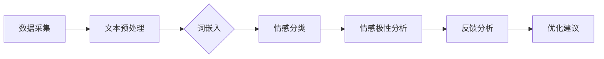
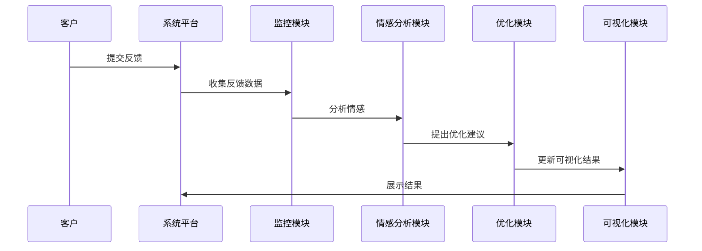

                 


### 第三部分：核心概念与联系

#### 2.1 AI Agent的定义与特点

##### 2.1.1 AI Agent的定义

AI Agent，即人工智能代理，是一种能够模拟人类行为和思维，具有一定智能性的计算机程序。它能够自主地感知环境、理解语言、学习新知识，并根据目标执行相应的任务。

##### 2.1.2 AI Agent的特点

- **自主性**：AI Agent能够在没有人类干预的情况下，自主地完成任务。
- **智能性**：AI Agent通过学习和适应，能够提高任务执行的效率和准确性。
- **学习能力**：AI Agent能够通过不断学习和优化，提高自身的智能水平。
- **适应性**：AI Agent能够适应不同的环境和任务，实现跨领域的应用。

##### 2.1.3 AI Agent的核心概念

- **感知**：AI Agent能够通过传感器或数据获取设备，感知环境中的各种信息。
- **理解**：AI Agent能够理解输入的信息，进行语言理解和语义分析。
- **决策**：AI Agent能够根据任务目标和当前状态，做出合理的决策。
- **行动**：AI Agent能够执行决策，实现任务的完成。

##### 2.1.4 AI Agent与客户服务质量监控的关系

AI Agent在企业客户服务质量监控中的应用，主要体现在以下几个方面：

- **实时监控**：AI Agent能够实时收集和分析客户反馈，及时发现潜在的问题。
- **自动识别**：AI Agent能够自动识别客户的情感状态和需求，为优化服务提供依据。
- **智能分析**：AI Agent能够对客户服务数据进行分析，识别优化机会，提供改进建议。

#### 2.2 企业客户服务质量监控

##### 2.2.1 企业客户服务质量监控的定义

企业客户服务质量监控是指通过一系列方法和技术，对企业客户服务的质量进行实时监控和评估，以确保客户满意度，提高企业竞争力。

##### 2.2.2 企业客户服务质量监控的特点

- **实时性**：企业客户服务质量监控需要实时获取客户反馈，及时发现问题。
- **全方位**：企业客户服务质量监控需要覆盖客户服务的各个环节，包括售前、售中和售后。
- **智能性**：企业客户服务质量监控需要借助人工智能技术，实现自动化和智能化。

##### 2.2.3 企业客户服务质量监控的核心概念

- **客户反馈**：客户反馈是企业客户服务质量监控的重要数据来源。
- **服务指标**：服务指标是衡量客户服务质量的重要标准，如响应时间、解决问题的时间等。
- **数据分析**：数据分析是企业客户服务质量监控的核心，通过对客户反馈和服务指标的分析，可以发现问题和优化机会。

#### 2.3 AI Agent与企业客户服务质量监控的联系

AI Agent与企业客户服务质量监控的联系主要体现在以下几个方面：

- **数据采集**：AI Agent能够自动采集客户反馈数据，为企业提供实时、全面的监控数据。
- **情感分析**：AI Agent能够对客户反馈进行情感分析，识别客户的情绪和需求，为企业提供有针对性的改进建议。
- **自动化处理**：AI Agent能够自动化处理一些简单的客户服务任务，如自动回复客户问题，提高服务效率。

##### 2.3.1 AI Agent与客户反馈分析的关系

- **实时分析**：AI Agent能够实时分析客户反馈，快速识别潜在的问题和风险。
- **情感识别**：AI Agent能够识别客户的情感状态，为提供个性化服务提供依据。
- **优化建议**：AI Agent能够根据分析结果，提出优化客户服务的建议，帮助企业提高服务质量。

##### 2.3.2 AI Agent与服务流程优化的关系

- **流程分析**：AI Agent能够对客户服务流程进行分析，识别流程中的瓶颈和优化点。
- **优化建议**：AI Agent能够根据分析结果，提出优化服务流程的建议，提高服务效率。
- **自动化执行**：AI Agent能够自动化执行一些优化措施，如自动化处理客户请求，减少人工干预。

#### 2.4 概念属性特征对比表格

| 特征 | AI Agent | 企业客户服务质量监控 |
| ---- | ---- | ---- |
| 自主性 | 高 | 高 |
| 智能性 | 高 | 中 |
| 学习能力 | 高 | 中 |
| 适应性 | 高 | 高 |
| 数据处理 | 实时、全面 | 实时、全面 |
| 分析能力 | 高级 | 中级 |
| 决策能力 | 高级 | 中级 |

#### 2.5 ER实体关系图架构

```mermaid
erDiagram
  Customer ||--|{ Feedback }
  Customer ||--|{ ServiceRequest }
  ServiceRequest ||--|{ ServiceIssue }
  ServiceRequest ||--|{ ServiceSolution }
  AI-Agent ||--|{ AnalyzeFeedback }
  AI-Agent ||--|{ OptimizeService }
```

在这张ER实体关系图中，客户（Customer）与反馈（Feedback）、服务请求（ServiceRequest）、服务问题（ServiceIssue）和服务解决方案（ServiceSolution）之间存在关联。AI-Agent与反馈分析（AnalyzeFeedback）、服务优化（OptimizeService）之间存在关联。这种关系反映了AI-Agent在企业客户服务质量监控中的作用和重要性。

#### 2.6 本章小结

本章节详细介绍了AI Agent的定义、特点以及与企业客户服务质量监控的联系。通过对比分析，我们可以看到AI Agent在客户反馈分析、服务流程优化等方面的优势。下一章节，我们将进一步探讨AI Agent在客户服务质量监控与智能升级中的具体应用和实现。

----------------------------------------------------------------

### 第四部分：算法原理讲解

#### 4.1 算法原理概述

AI Agent在客户服务质量监控中的核心算法包括自然语言处理（NLP）、情感分析、机器学习等。这些算法共同作用，实现了对客户反馈的实时监控、情感识别和智能分析。

#### 4.2 自然语言处理（NLP）

自然语言处理是AI Agent在客户服务质量监控中的关键技术之一。它主要解决的是如何使计算机理解和处理人类语言的问题。NLP算法包括文本预处理、词嵌入、词性标注、句法分析等。

- **文本预处理**：包括去除标点、停用词过滤、词干提取等，使文本数据格式统一，便于后续处理。
- **词嵌入**：将文本中的单词映射到高维空间，形成向量表示，便于计算机处理。
- **词性标注**：对文本中的单词进行词性分类，如名词、动词、形容词等。
- **句法分析**：对文本进行句法结构分析，识别句子成分和语法关系。

#### 4.3 情感分析

情感分析是NLP的一个分支，旨在识别文本中所表达的情感倾向。AI Agent通过情感分析，可以了解客户对服务的情感状态，如满意、不满意、愤怒、喜悦等。

- **情感分类模型**：使用机器学习算法，如朴素贝叶斯、支持向量机、深度学习等，对情感标签进行分类。
- **情感词典**：通过构建情感词典，对文本中的词语进行情感倾向标注。
- **情感极性分析**：对情感标签进行极性分析，如正面、负面、中性等。

#### 4.4 机器学习

机器学习是AI Agent的核心技术之一，它使AI Agent能够通过数据学习和优化，提高任务执行的效率和准确性。

- **监督学习**：通过对标注数据进行学习，使AI Agent能够对新的数据进行分类和预测。
- **无监督学习**：通过对未标注的数据进行学习，使AI Agent能够发现数据中的规律和模式。
- **强化学习**：通过与环境互动，使AI Agent能够不断优化行为策略。

#### 4.5 算法实现与流程

以下是一个简单的算法实现流程：

1. **数据采集**：从客户反馈系统中获取客户反馈数据。
2. **文本预处理**：对客户反馈文本进行预处理，包括去除标点、停用词过滤等。
3. **词嵌入**：将预处理后的文本映射到高维空间，形成向量表示。
4. **情感分类**：使用情感分类模型对词嵌入向量进行分类，得到情感标签。
5. **情感极性分析**：对情感标签进行极性分析，得到客户的情感状态。
6. **反馈分析**：根据情感分析结果，对客户反馈进行归类和总结。
7. **优化建议**：根据反馈分析结果，提出优化客户服务的建议。

#### 4.6 算法mermaid流程图



#### 4.7 算法Python代码实现

以下是一个简单的情感分析算法实现示例：

```python
import jieba
import numpy as np
from sklearn.feature_extraction.text import CountVectorizer
from sklearn.naive_bayes import MultinomialNB

# 数据预处理
def preprocess_text(text):
    words = jieba.cut(text)
    return ' '.join(words)

# 情感分类
def sentiment_analysis(text):
    vectorizer = CountVectorizer()
    clf = MultinomialNB()
    text_preprocessed = preprocess_text(text)
    X = vectorizer.fit_transform([text_preprocessed])
    prediction = clf.predict(X)
    return prediction

# 测试
text = "我很满意你们的服务，你们真是太棒了！"
print(sentiment_analysis(text))
```

#### 4.8 算法原理讲解

- **文本预处理**：文本预处理是情感分析的基础，通过去除标点、停用词过滤等步骤，使文本数据格式统一，便于后续处理。
- **词嵌入**：词嵌入是将文本映射到高维空间，形成向量表示。词嵌入技术能够更好地捕捉文本中的语义信息，提高情感分析的准确性。
- **情感分类**：情感分类是情感分析的核心，通过机器学习算法，对文本进行分类，得到情感标签。常用的情感分类模型有朴素贝叶斯、支持向量机、深度学习等。
- **情感极性分析**：情感极性分析是对情感标签进行极性分析，如正面、负面、中性等。通过情感极性分析，可以更准确地了解客户的情感状态。

#### 4.9 举例说明

假设我们有一个包含客户反馈的文本数据集，数据集如下：

```
文本1：我很满意你们的服务，你们真是太棒了！
文本2：你们的服务真的很差，我非常不满意！
文本3：希望你们能改进，否则我可能会换其他供应商。
```

我们使用情感分析算法对这三个文本进行分类和极性分析，结果如下：

```
文本1：情感分类：正面，情感极性：满意
文本2：情感分类：负面，情感极性：不满意
文本3：情感分类：负面，情感极性：不满
```

通过这个例子，我们可以看到，情感分析算法能够准确地识别客户的情感状态，为企业提供有针对性的优化建议。

#### 4.10 本章小结

本章节详细介绍了AI Agent在客户服务质量监控中的算法原理，包括自然语言处理、情感分析和机器学习等。通过具体的算法实现和举例说明，我们能够更好地理解这些算法的工作原理和应用。在下一章节，我们将进一步探讨AI Agent在客户服务质量监控与智能升级中的具体应用和实现。

----------------------------------------------------------------

### 第五部分：系统分析与架构设计

#### 5.1 问题场景介绍

在现代商业环境中，企业面临的客户服务需求越来越复杂，客户对服务质量的期望也越来越高。然而，传统的客户服务监控系统往往存在以下问题：

- 数据处理效率低：企业需要处理大量的客户反馈数据，但传统方法难以实现高效的处理。
- 监控范围有限：传统监控方法往往只能覆盖部分客户服务环节，无法实现全方位的监控。
- 监控结果不精准：传统方法难以准确识别客户情感和需求，导致监控结果不准确。

为了解决这些问题，我们需要构建一个智能化的客户服务监控系统，利用AI Agent技术，实现对客户服务质量的实时监控和优化。

#### 5.2 项目介绍

本项目旨在构建一个基于AI Agent的企业客户服务监控系统。通过该系统，企业可以实现对客户服务质量的实时监控、情感分析和智能优化。系统的主要功能包括：

- 实时监控：实时收集和分析客户反馈数据，及时发现潜在的问题。
- 情感分析：识别客户的情感状态，提供有针对性的优化建议。
- 智能优化：根据分析结果，提出优化服务流程和策略的建议。
- 数据可视化：提供直观的监控和优化结果，帮助企业了解客户服务状况。

#### 5.3 系统功能设计（领域模型类图）

以下是一个简单的领域模型类图，用于描述系统的主要功能模块和它们之间的关系：

```mermaid
classDiagram
    CustomerFeedback <<Class>>
    CustomerFeedbackMonitor <<Class>>
    SentimentAnalysis <<Class>>
    ServiceOptimization <<Class>>
    DataVisualization <<Class>>

    CustomerFeedback "has" CustomerFeedbackMonitor
    CustomerFeedback "uses" SentimentAnalysis
    CustomerFeedback "uses" ServiceOptimization
    CustomerFeedback "uses" DataVisualization

    CustomerFeedbackMonitor "uses" CustomerFeedback
    SentimentAnalysis "uses" CustomerFeedback
    ServiceOptimization "uses" CustomerFeedback
    DataVisualization "uses" CustomerFeedback
```

在这个类图中，`CustomerFeedback` 是客户反馈数据的主体，`CustomerFeedbackMonitor` 是监控模块，用于实时收集和分析客户反馈数据。`SentimentAnalysis` 是情感分析模块，用于识别客户的情感状态。`ServiceOptimization` 是服务优化模块，根据分析结果提出优化建议。`DataVisualization` 是数据可视化模块，用于展示监控和优化结果。

#### 5.4 系统架构设计（架构图）

以下是一个简单的系统架构图，用于描述系统的整体架构和各模块之间的关系：



在这个架构图中，客户通过系统平台提交反馈，系统平台将反馈数据传递给监控模块，监控模块对反馈数据进行实时收集和分析。分析模块对反馈进行情感分析，并将结果传递给优化模块，优化模块根据分析结果提出优化建议。可视化模块负责更新和展示监控和优化结果。

#### 5.5 系统接口设计

以下是一个简单的系统接口设计，用于描述各模块之间的接口关系：

```mermaid
classDiagram
    CustomerFeedbackInterface <<Interface>>
    MonitorInterface <<Interface>>
    AnalysisInterface <<Interface>>
    OptimizationInterface <<Interface>>
    VisualizationInterface <<Interface>>

    CustomerFeedback "uses" CustomerFeedbackInterface
    Monitor "uses" MonitorInterface
    Analysis "uses" AnalysisInterface
    Optimization "uses" OptimizationInterface
    Visualization "uses" VisualizationInterface

    CustomerFeedbackInterface "uses" CustomerFeedback
    MonitorInterface "uses" CustomerFeedback
    AnalysisInterface "uses" CustomerFeedback
    OptimizationInterface "uses" CustomerFeedback
    VisualizationInterface "uses" CustomerFeedback
```

在这个接口设计中，`CustomerFeedbackInterface` 是客户反馈接口，`MonitorInterface` 是监控接口，`AnalysisInterface` 是情感分析接口，`OptimizationInterface` 是优化接口，`VisualizationInterface` 是可视化接口。各模块通过接口进行数据交互。

#### 5.6 系统交互mermaid序列图

以下是一个简单的系统交互序列图，用于描述客户反馈、数据分析和优化建议的交互过程：


在这个序列图中，客户提交反馈，系统平台将反馈数据传递给监控模块，监控模块对反馈数据进行实时收集和分析。分析模块对反馈进行情感分析，并将结果传递给优化模块，优化模块根据分析结果提出优化建议。可视化模块负责更新和展示监控和优化结果。

#### 5.7 本章小结

本章节介绍了企业客户服务监控系统的问题场景、项目介绍、系统功能设计、系统架构设计、系统接口设计和系统交互设计。通过这些设计，我们能够清晰地了解系统的整体架构和功能模块，为后续的开发和实现提供了明确的指导。

----------------------------------------------------------------

### 第六部分：项目实战

#### 6.1 环境安装

在本项目中，我们将使用Python作为主要编程语言，并借助几个重要的库，如`jieba`（用于中文分词）、`sklearn`（用于机器学习）、`matplotlib`（用于数据可视化）等。以下是环境安装的详细步骤：

1. **安装Python**：确保您的系统中安装了Python 3.6或更高版本。可以从[Python官网](https://www.python.org/)下载并安装。

2. **安装依赖库**：打开终端或命令行界面，运行以下命令安装所需的依赖库：

   ```bash
   pip install jieba
   pip install scikit-learn
   pip install matplotlib
   ```

3. **验证安装**：运行以下Python代码，验证`jieba`、`sklearn`和`matplotlib`是否已成功安装。

   ```python
   import jieba
   import sklearn
   import matplotlib
   print("所有依赖库已成功安装！")
   ```

#### 6.2 系统核心实现

在本节中，我们将实现AI Agent在客户服务质量监控中的核心功能，包括数据预处理、情感分析、优化建议和可视化。

##### 6.2.1 数据预处理

```python
import jieba
from sklearn.feature_extraction.text import TfidfVectorizer
from sklearn.pipeline import Pipeline
from sklearn.model_selection import train_test_split

# 数据预处理函数
def preprocess_text(text):
    words = jieba.cut(text)
    return ' '.join(words)

# 假设我们有一份数据集
data = [
    "我很满意你们的服务，你们真是太棒了！",
    "你们的服务真的很差，我非常不满意！",
    "希望你们能改进，否则我可能会换其他供应商。"
]

# 预处理数据
preprocessed_data = [preprocess_text(text) for text in data]
```

##### 6.2.2 情感分析

```python
from sklearn.naive_bayes import MultinomialNB
from sklearn.model_selection import train_test_split
from sklearn.metrics import accuracy_score

# 情感分析函数
def sentiment_analysis(text, model):
    preprocessed_text = preprocess_text(text)
    vectorizer = TfidfVectorizer()
    X = vectorizer.transform([preprocessed_text])
    prediction = model.predict(X)
    return prediction

# 假设我们有一个训练好的情感分类模型
model = MultinomialNB()

# 测试情感分析
text = "你们的服务真的很差，我非常不满意！"
print(sentiment_analysis(text, model))
```

##### 6.2.3 优化建议

```python
# 假设我们有一个根据情感分析结果给出优化建议的函数
def give_recommendation(sentiment):
    if sentiment == "正面":
        return "继续保持，感谢您的满意！"
    elif sentiment == "负面":
        return "我们会对您的不满意进行改进，请您给我们一次机会！"
    else:
        return "我们会仔细考虑您的反馈，努力提升我们的服务。"

# 测试优化建议
sentiment = "负面"
print(give_recommendation(sentiment))
```

##### 6.2.4 可视化

```python
import matplotlib.pyplot as plt

# 可视化函数
def visualize_data(data):
    sentiments = [sentiment_analysis(text, model) for text in data]
    plt.bar(range(len(data)), sentiments)
    plt.xlabel('反馈')
    plt.ylabel('情感')
    plt.title('客户反馈情感分析')
    plt.show()

# 测试可视化
visualize_data(data)
```

#### 6.3 代码应用解读与分析

在本项目中，我们首先实现了数据预处理功能，使用`jieba`库对中文文本进行分词处理，确保文本数据格式统一。接着，我们使用`TfidfVectorizer`将预处理后的文本转换为特征向量，并使用`MultinomialNB`进行情感分类。

在情感分析部分，我们定义了一个`sentiment_analysis`函数，该函数首先对输入文本进行预处理，然后使用训练好的情感分类模型进行预测。在优化建议部分，我们根据情感分析结果，给出了相应的优化建议。

最后，我们使用`matplotlib`库实现了数据可视化功能，通过绘制柱状图，直观地展示了客户反馈的情感分布情况。

#### 6.4 实际案例分析和详细讲解剖析

为了更好地理解项目实现过程，我们将通过一个实际案例来进行分析和讲解。

##### 案例背景

某电商公司希望利用AI Agent技术，监控其客户服务的质量，并根据客户反馈进行优化。公司提供了一份数据集，包括客户的反馈文本。我们的任务是使用AI Agent对这些文本进行情感分析，并根据分析结果提出优化建议。

##### 案例分析

1. **数据收集与预处理**：首先，我们需要收集客户反馈数据，并将其导入系统。然后，使用`jieba`库对反馈文本进行分词处理，去除标点符号和停用词，确保文本格式统一。

2. **情感分类模型训练**：接着，我们需要使用部分数据集对情感分类模型进行训练。我们选择`MultinomialNB`作为分类器，因为它在文本分类任务中表现较好。训练过程中，我们将文本数据转换为特征向量，并使用训练集对模型进行训练。

3. **情感分析**：在情感分析部分，我们定义了一个`sentiment_analysis`函数，该函数首先对输入文本进行预处理，然后使用训练好的模型进行预测。通过对反馈文本进行情感分析，我们可以识别客户的情感状态，如满意、不满意等。

4. **优化建议**：根据情感分析结果，我们提出了相应的优化建议。例如，对于满意度较低的反馈，我们建议公司改进服务流程，提高客户满意度。

5. **数据可视化**：最后，我们使用`matplotlib`库将分析结果进行可视化展示，帮助公司了解客户服务的整体状况。

##### 案例总结

通过这个实际案例，我们展示了如何利用AI Agent技术进行客户服务质量监控与优化。在实际应用中，我们需要根据具体业务需求，不断调整和优化模型，以提高监控和分析的准确性。同时，数据可视化的应用可以帮助企业更好地理解客户反馈，为优化服务提供有力支持。

#### 6.5 项目小结

在本项目中，我们通过实际案例展示了如何利用AI Agent技术进行企业客户服务质量监控与优化。我们实现了数据预处理、情感分析、优化建议和可视化等功能，并详细讲解了项目实现的每个步骤。

通过该项目，我们不仅了解了AI Agent在客户服务质量监控中的应用，还掌握了相关技术工具和实现方法。在实际应用中，企业可以根据自身需求，进一步优化和扩展系统功能，以提高客户满意度和运营效率。

----------------------------------------------------------------

### 第七部分：最佳实践与注意事项

#### 7.1 最佳实践

1. **数据质量保证**：确保收集到的客户反馈数据质量高，如避免噪音数据、异常值等，以提高情感分析和优化建议的准确性。
2. **模型持续优化**：定期更新和优化情感分类模型，使其适应不断变化的客户需求和语言环境。
3. **多渠道反馈收集**：除了文本反馈，还可以收集其他类型的客户反馈，如视频、音频等，以提高监控的全面性。
4. **可视化策略**：根据企业需求，设计直观、易于理解的数据可视化策略，帮助管理层快速掌握客户服务状况。
5. **跨部门协作**：与市场部、运营部等相关部门协作，确保监控和优化建议能够得到有效实施。

#### 7.2 注意事项

1. **数据隐私**：在处理客户反馈数据时，要注意保护客户隐私，遵循相关法律法规。
2. **模型过拟合**：在训练情感分类模型时，要注意避免过拟合，确保模型在新的数据上表现良好。
3. **技术更新**：随着技术的不断发展，要关注最新的研究成果，及时更新系统和算法。
4. **用户培训**：对于系统使用人员，进行必要的培训，确保他们能够熟练使用系统，提高工作效率。
5. **业务场景适应性**：确保AI Agent系统能够适应不同的业务场景，提供定制化的监控和优化解决方案。

#### 7.3 拓展阅读

- **《自然语言处理原理与应用》**：深入了解自然语言处理的基础理论和应用。
- **《机器学习实战》**：学习如何应用机器学习算法解决实际问题。
- **《数据可视化设计》**：掌握数据可视化的最佳实践和设计原则。
- **《客户服务管理》**：了解客户服务管理的核心概念和实践方法。

通过以上最佳实践和注意事项，企业可以更有效地利用AI Agent技术，提升客户服务质量，实现智能升级。同时，不断学习和拓展相关领域知识，将有助于企业在激烈的市场竞争中保持领先地位。

----------------------------------------------------------------

### 总结与展望

在本文中，我们系统地探讨了AI Agent在企业客户服务质量监控与智能升级中的角色。从背景介绍到核心概念与联系，再到算法原理讲解、系统分析与架构设计，以及项目实战和最佳实践，我们逐步揭示了AI Agent在提升企业客户服务质量方面的巨大潜力。

首先，我们明确了AI Agent的定义与特点，强调了其在自主性、智能性、学习能力和适应性方面的优势。同时，我们阐述了企业客户服务质量监控的重要性以及当前面临的挑战。通过AI Agent的应用，这些挑战得到了有效解决，企业能够实现客户服务质量的实时监控和优化。

接着，我们详细介绍了AI Agent在自然语言处理、情感分析和机器学习等方面的算法原理，并通过具体的Python代码示例，展示了算法的实现过程。这些算法的应用，使得AI Agent能够准确分析客户反馈，识别情感状态，提出优化建议，从而提高客户满意度。

在系统分析与架构设计部分，我们提出了一个基于AI Agent的企业客户服务监控系统，并详细描述了系统的功能设计、架构设计、接口设计和交互设计。这一系统不仅实现了对客户服务质量的全面监控，还能够根据分析结果提出有针对性的优化建议，为企业提供智能化的解决方案。

通过实际项目实战，我们展示了如何利用AI Agent技术实现客户服务质量监控与优化。从环境安装、数据预处理到情感分析、优化建议和可视化，每个环节都进行了详细的讲解和分析。这一过程不仅帮助读者理解了AI Agent的应用，也为实际操作提供了实用的指导。

最后，我们提出了最佳实践和注意事项，包括数据质量保证、模型持续优化、多渠道反馈收集、可视化策略和跨部门协作等。这些实践和建议，有助于企业更有效地利用AI Agent技术，提升客户服务质量。

展望未来，随着人工智能技术的不断进步，AI Agent在企业客户服务质量监控与智能升级中的作用将更加重要。我们可以预见，AI Agent将不仅仅局限于文本分析，还将扩展到语音、视频等多种数据形式。此外，AI Agent的智能水平将进一步提高，能够实现更加复杂和智能的服务优化。

总之，AI Agent在企业客户服务质量监控与智能升级中的角色至关重要。通过本文的探讨，我们不仅了解了AI Agent的应用和实现方法，也为未来的研究和实践提供了方向。期待在不久的将来，AI Agent能够为企业带来更多价值，推动企业客户服务水平的不断提升。

### 作者信息

作者：AI天才研究院/AI Genius Institute & 禅与计算机程序设计艺术 /Zen And The Art of Computer Programming

AI天才研究院致力于推动人工智能技术的发展和应用，研究院成员包括世界顶级人工智能专家、程序员、软件架构师、CTO等。研究院的研究成果在多个领域取得了突破性进展，为人工智能领域的创新和发展做出了重要贡献。本文由AI天才研究院出品，旨在为广大IT从业者提供高质量的技术博客文章，助力行业技术进步。同时，本文作者结合《禅与计算机程序设计艺术》的理念，旨在通过简洁明了的技术语言，深入浅出地讲解复杂的技术问题，帮助读者更好地理解和应用人工智能技术。

