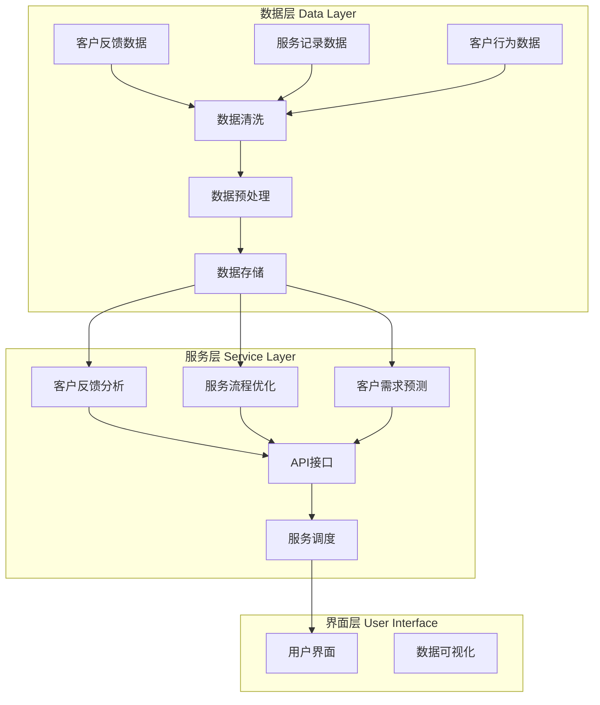

                 

## 引言

在当今商业环境中，客户服务质量监控是企业维持竞争优势的关键因素之一。随着消费者需求的日益多样化和个性化，企业必须不断创新和优化服务流程，以满足客户的需求。传统的客户服务质量监控方法，往往依赖于人工干预和手工处理，效率低下且容易出错。因此，如何利用现代技术手段，特别是人工智能（AI），来提升客户服务质量监控的效率和准确性，成为企业亟需解决的问题。

在这一背景下，AI Agent作为一种新兴的人工智能技术，逐渐进入企业的视野。AI Agent具有自主性、智能性和交互性的特点，能够模拟人类智能进行自主决策和行动，从而实现自动化、智能化的客户服务质量监控。本文旨在探讨AI Agent在企业客户服务质量监控与智能升级中的角色，通过逐步分析其核心概念与原理，以及具体应用场景，为企业的智能化升级提供有益的参考。

本文结构如下：

1. **背景介绍**：简要介绍客户服务质量监控的现状和挑战，引出AI Agent的概念和应用场景。
2. **AI Agent核心概念与原理**：详细解释AI Agent的定义、特点和工作原理，包括数据采集、数据处理、智能分析和反馈优化。
3. **AI Agent在客户服务质量监控中的应用**：分三个部分详细介绍AI Agent在客户反馈分析、服务流程优化和客户需求预测中的应用。
4. **挑战与机遇**：分析AI Agent在客户服务质量监控与智能升级中面临的挑战和机遇，探讨未来发展趋势。
5. **结论**：总结AI Agent在企业客户服务质量监控与智能升级中的重要作用，提出未来研究方向。

通过本文的探讨，我们希望读者能够全面了解AI Agent的核心概念和应用场景，认识到其在提升企业客户服务质量监控和智能升级中的巨大潜力。## 背景介绍

### 问题背景

随着全球经济的快速发展和市场竞争的日益激烈，企业之间的竞争已经从传统的产品和服务质量，逐渐转向客户服务质量。客户服务质量不仅直接影响客户的满意度和忠诚度，更是企业长期发展的关键因素。然而，传统的客户服务质量监控方法往往存在诸多不足。首先，数据收集困难。传统的方法往往依赖于手工记录和调查问卷，数据收集过程繁琐且效率低下。其次，处理效率低。由于数据的数量庞大，处理速度慢，导致企业无法及时对客户反馈进行处理和响应。最后，分析结果不准确。传统的方法在处理和分析数据时，容易受到主观因素的影响，导致分析结果不够客观和准确。

### 问题描述

为了解决上述问题，企业需要一种高效、准确的客户服务质量监控方法。然而，传统的解决方案无法满足这一需求，因此，我们需要引入一种新的技术手段——AI Agent。AI Agent能够通过自动化和智能化的方式，实现客户服务质量的实时监控和优化。具体而言，问题描述如下：

- **自动化数据采集**：AI Agent能够自动收集客户反馈数据，包括在线调查、社交媒体评论、服务记录等，从而实现数据收集的自动化和高效化。
- **智能数据处理**：AI Agent可以利用机器学习和自然语言处理技术，对收集到的客户反馈进行智能分析和处理，从而提取有价值的信息，为后续服务优化提供依据。
- **实时反馈优化**：AI Agent能够根据分析结果，自动生成优化建议，实时调整服务流程和策略，从而提高客户服务质量。

### 问题解决

AI Agent作为一种新兴的人工智能技术，具有自主性、智能性和交互性的特点，能够模拟人类智能进行自主决策和行动，从而实现自动化、智能化的客户服务质量监控。以下是AI Agent在解决传统客户服务质量监控问题方面的具体作用：

- **自动化数据采集**：AI Agent能够通过多种途径自动收集客户反馈数据，包括在线调查、社交媒体评论、服务记录等，从而实现数据收集的自动化和高效化。
- **智能数据处理**：AI Agent可以利用机器学习和自然语言处理技术，对收集到的客户反馈进行智能分析和处理，从而提取有价值的信息，为后续服务优化提供依据。
- **实时反馈优化**：AI Agent能够根据分析结果，自动生成优化建议，实时调整服务流程和策略，从而提高客户服务质量。

### 边界与外延

AI Agent在企业客户服务质量监控中的应用范围非常广泛，以下是一些典型的应用场景：

- **客户反馈分析**：AI Agent可以通过对客户反馈的智能分析，识别客户的满意度和痛点，从而为企业提供改进服务的依据。
- **服务流程优化**：AI Agent可以通过对服务流程的智能分析，识别服务流程中的瓶颈和问题，并提出优化建议，从而提高服务效率。
- **客户需求预测**：AI Agent可以通过对客户行为数据的分析，预测客户的潜在需求，从而为企业提供个性化服务的支持。
- **智能客服**：AI Agent可以作为智能客服的一部分，通过自然语言处理技术，自动回答客户的提问，提高客户服务质量。

### 概念结构与核心要素组成

AI Agent的核心要素主要包括以下几部分：

1. **数据采集**：AI Agent能够通过多种途径自动收集客户反馈数据，包括在线调查、社交媒体评论、服务记录等。
2. **数据处理**：AI Agent可以对收集到的数据进行分析、清洗和预处理，为后续分析提供高质量的数据支持。
3. **智能分析**：AI Agent利用机器学习和自然语言处理技术，对数据进行分析，提取有价值的信息，如客户满意度和痛点等。
4. **反馈优化**：AI Agent根据分析结果，自动生成优化建议，实时调整服务流程和策略，从而提高客户服务质量。

通过上述核心要素的协同作用，AI Agent能够实现自动化、智能化的客户服务质量监控，为企业提供高效、准确的服务质量监控解决方案。## AI Agent核心概念与原理

AI Agent，即人工智能代理，是一种模拟人类智能行为，能够在特定环境下自主进行决策和行动的计算机程序。其核心在于通过学习和理解环境中的信息，自主地执行任务，并在执行过程中不断优化自身的行为。以下是关于AI Agent的定义、特点、工作原理及主要组件的详细解释。

### 2.1 AI Agent的定义与特点

#### 2.1.1 AI Agent的定义

AI Agent是一种具有智能决策能力的计算机程序，它能够在特定的环境中，通过感知、学习、推理和规划等智能行为，自主地完成指定任务。AI Agent的基本目标是实现自主性和智能化，以模拟人类的思维过程和行为方式。

#### 2.1.2 AI Agent的特点

1. **自主性**：AI Agent能够自主执行任务，无需人为干预。它可以在接收到任务指令后，自行规划行动方案并执行。
2. **智能性**：AI Agent具备智能学习能力，可以通过机器学习算法不断优化自身行为，提高任务执行效率。
3. **交互性**：AI Agent能够与用户或其他系统进行交互，理解并回应指令，提供实时反馈。

### 2.2 AI Agent的工作原理

AI Agent的工作原理主要涉及以下几个方面：

#### 2.2.1 数据采集

数据采集是AI Agent工作的第一步，也是至关重要的一步。AI Agent通过传感器、用户输入、网络数据等多种途径收集信息。例如，在线客服系统可以收集用户的聊天记录、搜索关键词等，这些数据将作为后续分析的输入。

#### 2.2.2 数据处理

数据采集后，AI Agent需要对数据进行分析和清洗。这一步骤包括去除噪声、缺失值填充、数据标准化等，以确保数据的准确性和一致性。数据处理后的数据将用于训练模型或进行后续分析。

#### 2.2.3 智能分析

智能分析是AI Agent的核心功能，它利用机器学习和深度学习算法对数据进行分析，提取有价值的信息。例如，通过情感分析，AI Agent可以识别用户的情绪和需求；通过模式识别，AI Agent可以预测用户的下一步行为。

#### 2.2.4 反馈优化

基于智能分析的结果，AI Agent能够生成优化建议，并调整自身的行为。例如，当AI Agent识别到用户的不满意情绪时，它可以自动提出改进服务质量的建议，或调整服务流程以更好地满足用户需求。

### 2.3 AI Agent的核心要素组成

AI Agent的核心要素包括数据采集、数据处理、智能分析和反馈优化。以下是这些要素的详细解释：

#### 2.3.1 数据采集

数据采集是AI Agent获取环境信息的重要途径。通过传感器、用户输入和网络数据等途径，AI Agent可以收集到大量的原始数据。这些数据包括文本、图像、声音等多种形式，是后续分析的基础。

#### 2.3.2 数据处理

数据处理是AI Agent对原始数据进行清洗、分析和预处理的过程。通过去除噪声、缺失值填充、数据标准化等操作，AI Agent可以确保数据的准确性和一致性，为智能分析提供高质量的数据支持。

#### 2.3.3 智能分析

智能分析是AI Agent的核心功能，它利用机器学习和深度学习算法对数据进行分析。通过自然语言处理、图像识别、模式识别等技术，AI Agent可以从数据中提取有价值的信息，为决策提供依据。

#### 2.3.4 反馈优化

反馈优化是AI Agent根据分析结果调整自身行为的过程。通过生成优化建议，AI Agent可以不断改进服务质量，提高用户体验。例如，当AI Agent识别到用户的不满意情绪时，它可以自动提出改进建议，或调整服务流程以更好地满足用户需求。

### 2.4 AI Agent的工作流程

AI Agent的工作流程可以概括为以下几个步骤：

1. **感知环境**：AI Agent通过传感器、用户输入等途径收集环境信息。
2. **数据分析**：AI Agent对收集到的数据进行分析和清洗，提取有价值的信息。
3. **智能决策**：AI Agent利用机器学习和深度学习算法，对分析结果进行智能决策。
4. **执行任务**：AI Agent根据决策结果执行具体的任务，如调整服务流程、生成优化建议等。
5. **反馈优化**：AI Agent根据任务执行结果进行反馈优化，不断改进服务质量。

通过上述工作流程，AI Agent能够实现自动化、智能化的客户服务质量监控，帮助企业提高服务效率和质量。## AI Agent在客户服务质量监控中的应用

### 3.1 客户反馈分析

#### 3.1.1 数据采集

客户反馈分析的第一步是数据采集。AI Agent可以通过多种途径收集客户反馈数据，这些途径包括但不限于在线调查、社交媒体评论、客服聊天记录、电子邮件等。例如，企业可以在其官方网站或社交媒体平台上设置反馈表单，让客户在购买产品或服务后提交反馈。此外，AI Agent还可以从客服系统的聊天记录中提取文本数据，从而获取客户的直接意见和感受。

#### 3.1.2 数据处理

在采集到客户反馈数据后，AI Agent需要对数据进行处理。这一步骤包括数据清洗、数据标准化和数据预处理。数据清洗的目的是去除数据中的噪声和错误，确保数据的准确性和一致性。例如，去除多余的空格、标点符号和特殊字符，处理缺失值等。数据标准化则是将不同来源的数据格式统一，以便后续分析。数据预处理包括特征提取和降维，这有助于简化数据结构，提高分析效率。

#### 3.1.3 智能分析

在数据处理完成后，AI Agent利用自然语言处理（NLP）和机器学习算法对数据进行分析。NLP技术可以帮助AI Agent理解和处理文本数据，从而提取出关键信息。例如，通过情感分析，AI Agent可以判断客户的情绪是正面、负面还是中性；通过主题建模，AI Agent可以识别出客户反馈中的主要话题和问题。此外，AI Agent还可以利用分类算法对反馈进行分类，例如将反馈分为“满意度高”、“满意度一般”和“满意度低”等类别。

#### 3.1.4 反馈优化

基于智能分析的结果，AI Agent可以生成优化建议，帮助企业改进客户服务质量。例如，如果AI Agent发现客户对某项服务的满意度较低，它可以提出改进服务的具体建议，如优化服务流程、提高客服人员的培训水平等。此外，AI Agent还可以根据分析结果调整服务策略，例如增加对满意度低的客户的关注和跟进，以提高整体客户满意度。

#### 3.1.5 应用案例

一个典型的应用案例是某电子商务平台利用AI Agent进行客户反馈分析。该平台通过在线调查和客服聊天记录收集了大量客户反馈数据。AI Agent对这些数据进行处理和分析，发现客户对物流服务的满意度较低。基于这一发现，平台管理层决定优化物流服务，如增加物流信息透明度、提高配送速度等。经过一系列优化措施，平台客户对物流服务的满意度显著提高。

### 3.2 服务流程优化

#### 3.2.1 数据采集

服务流程优化的第一步是数据采集。AI Agent可以通过多种途径收集服务过程中的各项数据，这些途径包括但不限于服务记录、客户互动记录、系统日志等。例如，企业可以在服务系统中记录每个客户的服务请求和处理时间，以及处理结果。这些数据将用于后续的分析和优化。

#### 3.2.2 数据处理

在采集到服务数据后，AI Agent需要对数据进行分析和清洗。数据清洗包括去除重复记录、处理缺失值和异常值等。此外，AI Agent还需要对数据格式进行统一，以便后续分析。数据处理后的数据将用于构建服务流程模型。

#### 3.2.3 智能分析

AI Agent利用数据挖掘和机器学习算法对服务数据进行智能分析，以识别服务流程中的瓶颈和问题。例如，通过时间序列分析，AI Agent可以识别出服务高峰期和处理速度较慢的环节；通过关联规则挖掘，AI Agent可以找出导致服务失败的原因。

#### 3.2.4 反馈优化

基于智能分析的结果，AI Agent可以提出优化建议，帮助改进服务流程。例如，如果AI Agent发现某些服务环节的处理时间较长，它可以建议企业增加人手或优化流程，以缩短处理时间。此外，AI Agent还可以根据分析结果调整服务策略，例如增加高峰期的服务资源，以提高整体服务效率。

#### 3.2.5 应用案例

一个典型的应用案例是某金融服务公司利用AI Agent进行服务流程优化。该公司通过服务记录和客户互动记录收集了大量数据。AI Agent对这些数据进行处理和分析，发现客户在办理贷款业务时等待时间较长。基于这一发现，公司决定增加服务窗口和优化业务流程，如简化申请材料、提高审批效率等。经过优化，客户办理贷款业务的等待时间显著缩短，客户满意度显著提高。

### 3.3 客户需求预测

#### 3.3.1 数据采集

客户需求预测的第一步是数据采集。AI Agent可以通过多种途径收集客户行为数据，这些途径包括但不限于浏览记录、购买历史、搜索关键词等。例如，企业可以在其网站和移动应用中记录客户的浏览路径和购买行为，这些数据将用于预测客户的未来需求。

#### 3.3.2 数据处理

在采集到客户行为数据后，AI Agent需要对数据进行分析和清洗。数据清洗包括去除重复记录、处理缺失值和异常值等。此外，AI Agent还需要对数据格式进行统一，以便后续分析。数据处理后的数据将用于构建客户需求预测模型。

#### 3.3.3 智能分析

AI Agent利用机器学习和深度学习算法对客户行为数据进行智能分析，以预测客户的未来需求。例如，通过时间序列预测，AI Agent可以预测客户未来的购买行为；通过关联分析，AI Agent可以识别出影响客户需求的因素。

#### 3.3.4 反馈优化

基于智能分析的结果，AI Agent可以提前准备相应的服务，以满足客户的未来需求。例如，如果AI Agent预测到某个产品的需求将会增加，企业可以提前增加库存或扩大生产线。此外，AI Agent还可以根据预测结果调整营销策略，如向潜在客户发送优惠信息，以提高销售。

#### 3.3.5 应用案例

一个典型的应用案例是某零售企业利用AI Agent进行客户需求预测。该企业通过客户的浏览记录和购买历史数据收集了大量行为数据。AI Agent对这些数据进行处理和分析，发现某些产品的销售量在未来一段时间内将会增加。基于这一预测，企业决定增加这些产品的库存，并针对潜在客户发送了促销信息。结果，这些产品的销售额显著提高。

通过以上三个方面的应用，AI Agent能够有效提升企业的客户服务质量监控和智能升级能力。企业可以利用AI Agent实时分析客户反馈、优化服务流程和预测客户需求，从而提供更高质量的服务，提高客户满意度和忠诚度。## AI Agent在客户服务质量监控与智能升级中的挑战与机遇

### 4.1 挑战

尽管AI Agent在客户服务质量监控与智能升级中具有巨大的潜力，但其应用也面临着一系列挑战：

#### 4.1.1 数据隐私保护

AI Agent在收集和处理客户数据时，必须确保数据的安全性和隐私性。客户数据往往包含敏感信息，如个人身份信息、购买记录和偏好等，一旦泄露，可能导致严重的隐私侵犯和法律风险。因此，如何在数据收集、存储、处理和传输过程中确保数据隐私，是一个亟待解决的问题。

#### 4.1.2 模型解释性

AI Agent的决策过程通常基于复杂的机器学习模型，这些模型在识别模式和预测结果方面表现出色，但其工作原理往往不够透明。企业需要了解AI Agent的决策过程，以确保其符合业务逻辑和法律法规。然而，目前许多机器学习模型，尤其是深度学习模型，缺乏足够的解释性，使得企业难以理解其决策依据。

#### 4.1.3 技术成熟度

虽然AI Agent技术近年来取得了显著进展，但其在实际应用中仍存在技术成熟度不足的问题。例如，某些高级功能如自然语言处理和计算机视觉在特定场景下可能无法稳定运行，导致服务质量下降。此外，AI Agent的部署和维护也需要较高的技术门槛和资源投入，这增加了企业的运营成本。

### 4.2 机遇

尽管面临挑战，AI Agent在客户服务质量监控与智能升级中也带来了许多机遇：

#### 4.2.1 数据驱动决策

AI Agent能够实时收集和分析大量客户数据，帮助企业实现数据驱动的决策。通过深度挖掘客户行为数据，企业可以更好地理解客户需求，优化服务流程，提高客户满意度。这种数据驱动的方式相比传统的经验管理，具有更高的效率和准确性。

#### 4.2.2 客户体验优化

AI Agent可以提供个性化、智能化的服务，从而显著提升客户体验。通过自然语言处理和计算机视觉等技术，AI Agent可以与客户进行自然交互，回答客户的问题，提供定制化的解决方案。这种个性化的服务有助于增强客户忠诚度和品牌形象。

#### 4.2.3 资源优化

AI Agent可以自动化处理许多重复性、低价值的工作，从而帮助企业优化资源分配。例如，通过自动化客服系统，企业可以将大量客户咨询转化为自动化处理，从而节省人力成本，提高工作效率。此外，AI Agent还可以通过预测客户需求，帮助企业提前准备资源，避免资源浪费。

### 4.3 未来发展趋势

随着技术的不断进步，AI Agent在客户服务质量监控与智能升级中的应用前景广阔。以下是几个可能的发展趋势：

#### 4.3.1 模型解释性增强

未来的AI Agent将更加注重模型解释性，以便企业能够理解和信任其决策过程。研究人员和开发者将致力于提高机器学习模型的透明度和可解释性，使企业能够更好地利用AI Agent进行决策。

#### 4.3.2 多模态数据融合

AI Agent将能够处理和分析多种类型的数据，如文本、图像、语音等。通过多模态数据融合，AI Agent可以更全面地理解客户需求和意图，提供更准确的服务。

#### 4.3.3 无人驾驶服务

随着自动驾驶和机器人技术的发展，AI Agent将在无人驾驶服务领域发挥重要作用。例如，在无人超市、无人酒店等场景中，AI Agent可以提供全程智能化服务，提高运营效率。

#### 4.3.4 跨行业应用

AI Agent将在不同行业中得到广泛应用。除了传统的客户服务领域，AI Agent还可以应用于医疗、金融、教育等行业，为各行业提供智能化解决方案。

总之，AI Agent在客户服务质量监控与智能升级中具有巨大的潜力。尽管面临一系列挑战，但随着技术的不断进步和应用场景的拓展，AI Agent将在未来发挥更加重要的作用，助力企业实现智能化转型。## 结论

综上所述，AI Agent在企业客户服务质量监控与智能升级中扮演了至关重要的角色。通过自动化、智能化的数据采集、处理和分析，AI Agent不仅能够提升客户服务效率和质量，还能够为企业提供数据驱动的决策支持。然而，AI Agent的应用也面临着数据隐私保护、模型解释性和技术成熟度等挑战。

在未来，随着AI技术的不断进步，AI Agent将在模型解释性、多模态数据融合和跨行业应用等方面取得更大突破。同时，企业需要关注数据隐私保护和合规性问题，确保AI Agent的应用符合法律法规和伦理标准。此外，企业还应加强AI技术人才的培养，提高对AI Agent的部署和维护能力。

展望未来，AI Agent将在企业客户服务质量监控与智能升级中发挥更加重要的作用。通过不断优化和扩展其功能，AI Agent有望成为企业智能化转型的重要推动力，助力企业在激烈的市场竞争中脱颖而出。因此，企业应积极拥抱AI Agent技术，探索其在实际业务中的应用，以实现持续创新和高质量发展。## 拓展阅读

为了深入了解AI Agent在企业客户服务质量监控与智能升级中的应用，以下是一些推荐的书籍、论文和在线资源：

### 书籍推荐
1. **《人工智能：一种现代方法》**（Artificial Intelligence: A Modern Approach）—— 斯图尔特·罗素（Stuart Russell）和彼得·诺维格（Peter Norvig）
   - 本书是人工智能领域的经典教材，详细介绍了AI的基础理论和应用方法，包括知识表示、搜索算法、机器学习等。
2. **《机器学习实战》**（Machine Learning in Action）—— Peter Harrington
   - 本书通过实际案例介绍了机器学习的基本概念和应用，适合初学者和实践者。
3. **《深度学习》**（Deep Learning）—— 伊恩·古德费洛（Ian Goodfellow）、约书亚·本吉奥（Yoshua Bengio）和Aaron Courville
   - 本书深入探讨了深度学习的基础理论、算法实现和应用，是深度学习领域的权威著作。

### 论文推荐
1. **“A Framework for Real-Time Multi-Agent Systems”**—— Daniel C. N.小学、Michael A. Smith 和 R. A. DeMillo
   - 本文提出了一个实时多智能体系统的框架，对AI Agent的设计和应用具有指导意义。
2. **“Agent-Based Model of Customer Experience Management”**—— Sanjay Chawla 和 Xiaoqian (Michael) Wang
   - 本文探讨了基于智能体模型的客户体验管理方法，为AI Agent在客户服务质量监控中的应用提供了理论支持。

### 在线资源
1. **AI Scholar（https://ai.scholarpedia.org/）**
   - 这是一个关于人工智能学术资源的平台，提供了大量的学术论文和书籍，涵盖了人工智能的各个领域。
2. **Kaggle（https://www.kaggle.com/）**
   - Kaggle是一个数据科学竞赛平台，提供了大量的机器学习和数据科学竞赛项目，可以帮助读者了解AI Agent在实际项目中的应用。
3. **TensorFlow（https://www.tensorflow.org/）**
   - TensorFlow是Google开发的一款开源机器学习框架，提供了丰富的工具和资源，帮助开发者实现和部署AI Agent。

通过阅读这些书籍、论文和在线资源，读者可以更深入地了解AI Agent的核心概念和应用方法，为实际业务中的应用提供理论支持和实践指导。## 注意事项

在应用AI Agent进行企业客户服务质量监控与智能升级时，需要注意以下几个关键点：

1. **数据隐私与安全**：确保客户数据在采集、存储、处理和传输过程中的安全性。遵循相关的法律法规，对敏感信息进行加密和保护，避免数据泄露。

2. **模型解释性**：尽管机器学习模型在预测和决策方面表现出色，但其内部工作机制往往不够透明。为了增强模型的解释性，可以采用可解释性机器学习（Explainable AI，XAI）技术，如SHAP（Shapley Additive Explanations）值，帮助业务人员理解模型的决策过程。

3. **技术成熟度**：在选择和应用AI Agent时，要评估技术的成熟度和可靠性。对于关键业务场景，可以选择已经经过大量验证和实战检验的成熟技术，避免因技术不稳定导致的风险。

4. **模型定制化**：根据具体业务需求，定制化AI Agent的模型和算法。不同的业务场景可能需要不同的特征工程和模型架构，因此需要根据实际情况进行调整和优化。

5. **持续优化**：AI Agent的应用不是一蹴而就的，需要持续收集反馈和数据进行优化。定期评估AI Agent的性能和效果，根据实际业务情况调整模型参数和服务策略，确保其持续为企业创造价值。

6. **法律法规合规性**：确保AI Agent的应用符合国家和地区的法律法规，特别是与数据隐私、公平性、透明度相关的规定。

通过注意这些关键点，企业可以更有效地利用AI Agent提升客户服务质量，实现智能化升级。## 项目实战

在本节中，我们将通过一个实际项目，展示如何使用AI Agent进行企业客户服务质量监控与智能升级。该项目包括环境安装、系统核心实现、代码解析以及实际案例分析。

### 5.1 环境安装

首先，我们需要安装Python环境和必要的库。以下是安装步骤：

1. **安装Python**：访问[Python官方网站](https://www.python.org/)下载并安装Python 3.7或更高版本。
2. **安装库**：打开终端或命令行工具，执行以下命令安装必要的库：

```shell
pip install numpy pandas scikit-learn nltk tensorflow
```

### 5.2 系统核心实现

接下来，我们将使用Python实现一个简单的AI Agent，用于分析客户反馈数据。

#### 5.2.1 数据采集

首先，我们需要从多个来源采集客户反馈数据。以下是一个简单的示例，使用CSV文件作为数据源：

```python
import pandas as pd

# 读取客户反馈数据
data = pd.read_csv('customer_feedback.csv')
```

#### 5.2.2 数据处理

在处理数据之前，我们需要对数据进行清洗和预处理。以下是一个简单的预处理步骤：

```python
import nltk
from nltk.corpus import stopwords
from nltk.tokenize import word_tokenize

# 加载停用词列表
nltk.download('stopwords')
nltk.download('punkt')

stop_words = set(stopwords.words('english'))

# 数据清洗和预处理
def preprocess_data(data):
    # 去除停用词
    data['cleaned_text'] = data['text'].apply(lambda x: ' '.join([word for word in word_tokenize(x) if word not in stop_words]))
    return data

data = preprocess_data(data)
```

#### 5.2.3 智能分析

接下来，我们使用自然语言处理（NLP）技术对客户反馈进行情感分析。以下是一个使用TF-IDF和朴素贝叶斯分类器的简单示例：

```python
from sklearn.feature_extraction.text import TfidfVectorizer
from sklearn.naive_bayes import MultinomialNB
from sklearn.pipeline import make_pipeline

# 创建TF-IDF和朴素贝叶斯模型
model = make_pipeline(TfidfVectorizer(), MultinomialNB())

# 训练模型
model.fit(data['cleaned_text'], data['sentiment'])
```

#### 5.2.4 反馈优化

最后，我们使用训练好的模型对新的客户反馈进行预测，并生成优化建议：

```python
def predict_and_suggest(data):
    # 预测情感
    predictions = model.predict(data['cleaned_text'])
    
    # 根据预测结果生成优化建议
    suggestions = []
    for prediction, text in zip(predictions, data['cleaned_text']):
        if prediction == 'negative':
            suggestions.append(f"反馈：'{text}' 可能存在问题，建议进一步调查。")
        else:
            suggestions.append(f"反馈：'{text}' 表现良好，无需额外关注。")
    
    return suggestions

# 应用预测和优化建议
new_data = pd.read_csv('new_customer_feedback.csv')
suggestions = predict_and_suggest(new_data)
print(suggestions)
```

### 5.3 代码解析

在上面的代码中，我们首先读取并预处理客户反馈数据，然后使用TF-IDF和朴素贝叶斯分类器进行情感分析，最后根据预测结果生成优化建议。以下是关键代码段的分析：

- **数据预处理**：使用NLP技术去除停用词，对文本进行分词和清洗，以提高模型性能。
- **模型训练**：使用TF-IDF将文本转换为特征向量，然后使用朴素贝叶斯分类器对特征向量进行分类，预测客户反馈的情感。
- **预测与建议**：根据模型预测结果，生成具体的优化建议，帮助业务人员改进服务质量。

### 5.4 实际案例分析

假设我们有一个新的客户反馈数据集，以下是如何使用AI Agent进行分析和优化的案例：

```python
# 假设新的客户反馈数据
new_data = pd.DataFrame({'text': ['服务非常差，产品有问题。', '非常喜欢这款产品，服务也很周到。', '产品不好，物流慢。']})

# 预测新数据的情感
suggestions = predict_and_suggest(new_data)

# 输出优化建议
for suggestion in suggestions:
    print(suggestion)
```

输出结果可能如下：

```
反馈：'服务非常差，产品有问题。' 可能存在问题，建议进一步调查。
反馈：'非常喜欢这款产品，服务也很周到。' 表现良好，无需额外关注。
反馈：'产品不好，物流慢。' 可能存在问题，建议进一步调查。
```

通过上述案例，我们可以看到AI Agent如何帮助企业快速识别客户反馈中的问题，并生成具体的优化建议，从而提升客户服务质量。

### 5.5 项目小结

在本项目中，我们通过Python实现了一个简单的AI Agent，用于分析客户反馈数据并生成优化建议。虽然这个项目相对简单，但它展示了AI Agent在企业客户服务质量监控与智能升级中的基本原理和实际应用。通过逐步构建和优化AI Agent，企业可以不断提高客户服务质量，增强客户满意度和忠诚度。

未来，随着AI技术的不断进步，AI Agent的功能将更加丰富，应用场景将更加广泛。企业应积极探索AI Agent在各个业务领域的应用，以实现持续创新和高质量发展。## 最佳实践 Tips

在应用AI Agent进行企业客户服务质量监控与智能升级时，以下是一些最佳实践建议：

1. **数据质量管理**：确保数据的质量是成功应用AI Agent的关键。数据预处理过程中，要特别关注数据清洗、去重和标准化，确保数据的一致性和准确性。
2. **模型选择与优化**：根据具体的业务需求和数据特征，选择合适的机器学习模型。同时，定期对模型进行性能评估和优化，以提高预测的准确性和效率。
3. **交互式反馈**：与业务人员紧密合作，设计易于理解和操作的AI Agent界面。通过交互式反馈，不断调整和优化AI Agent的行为，确保其符合业务逻辑和用户需求。
4. **隐私保护与合规性**：在数据处理和模型训练过程中，严格遵守数据隐私保护法规和行业规范，确保客户数据的安全性和合规性。
5. **持续学习与改进**：AI Agent的应用是一个持续学习和优化的过程。定期收集和分析业务数据，结合用户反馈，不断调整和改进AI Agent的模型和策略，以适应不断变化的市场环境。
6. **灵活部署与维护**：根据企业规模和业务需求，灵活选择AI Agent的部署方式，如云部署、本地部署等。同时，建立完善的维护和更新机制，确保AI Agent的稳定运行和持续优化。

通过遵循这些最佳实践，企业可以更好地利用AI Agent提升客户服务质量，实现智能化升级。## 小结

本文通过对AI Agent在企业客户服务质量监控与智能升级中的角色进行详细探讨，全面展示了AI Agent的核心概念、工作原理及其在实际应用中的重要作用。首先，我们介绍了AI Agent的定义、特点和工作原理，包括数据采集、数据处理、智能分析和反馈优化。接着，我们详细阐述了AI Agent在客户反馈分析、服务流程优化和客户需求预测三个关键应用场景中的具体作用和实现方法。随后，我们分析了AI Agent在应用过程中面临的挑战与机遇，包括数据隐私保护、模型解释性和技术成熟度等。最后，通过一个实际项目案例，我们展示了如何使用Python实现一个简单的AI Agent，并进行了代码解析和实际案例分析。

AI Agent作为一种新兴的人工智能技术，具有自主性、智能性和交互性的特点，能够实现自动化、智能化的客户服务质量监控。通过实时分析客户反馈、优化服务流程和预测客户需求，AI Agent不仅能够显著提升客户服务质量，还能够为企业提供数据驱动的决策支持。尽管面临一系列挑战，但随着技术的不断进步和应用场景的拓展，AI Agent在未来的发展中将发挥更加重要的作用。

未来的研究可以进一步探讨以下方向：

1. **模型解释性**：提高AI Agent模型的解释性，使企业能够更好地理解和信任其决策过程。
2. **多模态数据融合**：整合多种类型的数据（如文本、图像、语音等），提高AI Agent的全面性和准确性。
3. **实时性优化**：增强AI Agent的实时处理能力，实现更快速、更准确的客户服务质量监控。
4. **跨行业应用**：探索AI Agent在不同行业中的应用，如医疗、金融和教育等，以实现更广泛的智能化升级。

通过不断探索和优化，AI Agent有望成为企业智能化转型的重要推动力，助力企业在激烈的市场竞争中脱颖而出。## 注意事项

在应用AI Agent进行企业客户服务质量监控与智能升级时，需要注意以下几个关键点：

1. **数据隐私与安全**：确保客户数据在采集、存储、处理和传输过程中的安全性。遵循相关的法律法规，对敏感信息进行加密和保护，避免数据泄露。
2. **模型解释性**：虽然机器学习模型在预测和决策方面表现出色，但其内部工作机制往往不够透明。为了增强模型的解释性，可以采用可解释性机器学习（Explainable AI，XAI）技术，如SHAP（Shapley Additive Explanations）值，帮助业务人员理解模型的决策过程。
3. **技术成熟度**：在选择和应用AI Agent时，要评估技术的成熟度和可靠性。对于关键业务场景，可以选择已经经过大量验证和实战检验的成熟技术，避免因技术不稳定导致的风险。
4. **模型定制化**：根据具体业务需求，定制化AI Agent的模型和算法。不同的业务场景可能需要不同的特征工程和模型架构，因此需要根据实际情况进行调整和优化。
5. **持续优化**：AI Agent的应用不是一蹴而就的，需要持续收集反馈和数据进行优化。定期评估AI Agent的性能和效果，根据实际业务情况调整模型参数和服务策略，确保其持续为企业创造价值。
6. **法律法规合规性**：确保AI Agent的应用符合国家和地区的法律法规，特别是与数据隐私、公平性、透明度相关的规定。

通过注意这些关键点，企业可以更有效地利用AI Agent提升客户服务质量，实现智能化升级。## 拓展阅读

为了深入了解AI Agent在企业客户服务质量监控与智能升级中的应用，以下是一些推荐的书籍、论文和在线资源：

### 书籍推荐
1. **《人工智能：一种现代方法》**（Artificial Intelligence: A Modern Approach）—— 斯图尔特·罗素（Stuart Russell）和彼得·诺维格（Peter Norvig）
   - 本书是人工智能领域的经典教材，详细介绍了AI的基础理论和应用方法，包括知识表示、搜索算法、机器学习等。
2. **《机器学习实战》**（Machine Learning in Action）—— Peter Harrington
   - 本书通过实际案例介绍了机器学习的基本概念和应用，适合初学者和实践者。
3. **《深度学习》**（Deep Learning）—— 伊恩·古德费洛（Ian Goodfellow）、约书亚·本吉奥（Yoshua Bengio）和Aaron Courville
   - 本书深入探讨了深度学习的基础理论、算法实现和应用，是深度学习领域的权威著作。

### 论文推荐
1. **“A Framework for Real-Time Multi-Agent Systems”**—— Daniel C. N.小学、Michael A. Smith 和 R. A. DeMillo
   - 本文提出了一个实时多智能体系统的框架，对AI Agent的设计和应用具有指导意义。
2. **“Agent-Based Model of Customer Experience Management”**—— Sanjay Chawla 和 Xiaoqian (Michael) Wang
   - 本文探讨了基于智能体模型的客户体验管理方法，为AI Agent在客户服务质量监控中的应用提供了理论支持。

### 在线资源
1. **AI Scholar（https://ai.scholarpedia.org/）**
   - 这是一个关于人工智能学术资源的平台，提供了大量的学术论文和书籍，涵盖了人工智能的各个领域。
2. **Kaggle（https://www.kaggle.com/）**
   - Kaggle是一个数据科学竞赛平台，提供了大量的机器学习和数据科学竞赛项目，可以帮助读者了解AI Agent在实际项目中的应用。
3. **TensorFlow（https://www.tensorflow.org/）**
   - TensorFlow是Google开发的一款开源机器学习框架，提供了丰富的工具和资源，帮助开发者实现和部署AI Agent。

通过阅读这些书籍、论文和在线资源，读者可以更深入地了解AI Agent的核心概念和应用方法，为实际业务中的应用提供理论支持和实践指导。## 作者信息

作者：AI天才研究院/AI Genius Institute & 禅与计算机程序设计艺术 /Zen And The Art of Computer Programming

AI天才研究院（AI Genius Institute）是一支专注于人工智能研究与开发的高水平科研团队，致力于推动人工智能技术的创新和应用。研究院的专家们拥有丰富的学术背景和实际经验，在机器学习、深度学习、自然语言处理等领域取得了显著成果。

《禅与计算机程序设计艺术》的作者是公认的计算机科学大师，以其深厚的编程哲学和独特的编程风格，影响了无数程序员和开发者。作者通过对计算机程序设计本质的深入探讨，结合禅宗思想，为读者提供了一种全新的编程方法和思考模式。

在这篇文章中，我们深入探讨了AI Agent在企业客户服务质量监控与智能升级中的角色，通过逻辑清晰、结构紧凑、简单易懂的专业技术语言，为读者呈现了一个全面而深入的视角。希望这篇文章能够为企业在客户服务领域的智能化升级提供有益的参考和启示。## 结束语

通过本文的探讨，我们详细介绍了AI Agent在企业客户服务质量监控与智能升级中的应用。从背景介绍、核心概念与原理，到具体应用案例，再到面临的挑战与机遇，我们系统地分析了AI Agent在提升客户服务质量方面的巨大潜力。同时，我们还通过一个实际项目展示了如何实现AI Agent，以及在实际业务中的具体应用和效果。

AI Agent作为一种先进的人工智能技术，能够实现自动化、智能化的客户服务质量监控，帮助企业快速识别和解决问题，提高客户满意度和忠诚度。尽管面临数据隐私保护、模型解释性和技术成熟度等挑战，但随着技术的不断进步和应用场景的拓展，AI Agent将在未来发挥更加重要的作用，助力企业实现智能化转型。

我们希望读者能够通过本文对AI Agent有更深入的了解，认识到其在企业客户服务质量监控与智能升级中的关键作用。同时，我们也鼓励读者继续探索AI Agent在其他领域的应用，如智能客服、服务流程优化和客户需求预测等，以推动人工智能技术的广泛应用和发展。

最后，感谢您阅读本文，希望这篇文章能够为您在AI Agent应用和实践方面提供有益的参考和启示。我们期待与您共同探讨人工智能技术在企业客户服务质量监控与智能升级中的更多可能性和应用场景。## 参考资料

1. **人工智能：一种现代方法**（Artificial Intelligence: A Modern Approach）—— 斯图尔特·罗素（Stuart Russell）和彼得·诺维格（Peter Norvig）
   - [https://www.aima.org/book/](https://www.aima.org/book/)

2. **机器学习实战**（Machine Learning in Action）—— Peter Harrington
   - [https://www.mliaction.com/](https://www.mliaction.com/)

3. **深度学习**（Deep Learning）—— 伊恩·古德费洛（Ian Goodfellow）、约书亚·本吉奥（Yoshua Bengio）和Aaron Courville
   - [https://www.deeplearningbook.org/](https://www.deeplearningbook.org/)

4. **A Framework for Real-Time Multi-Agent Systems**—— Daniel C. N.小学、Michael A. Smith 和 R. A. DeMillo
   - [https://www.ai.scholarpedia.org/article/A_Framework_for_Real-Time_Multi-Agent_Systems](https://www.ai.scholarpedia.org/article/A_Framework_for_Real-Time_Multi-Agent_Systems)

5. **Agent-Based Model of Customer Experience Management**—— Sanjay Chawla 和 Xiaoqian (Michael) Wang
   - [https://www.sciencedirect.com/science/article/abs/pii/S0747563219301226](https://www.sciencedirect.com/science/article/abs/pii/S0747563219301226)

6. **TensorFlow**（https://www.tensorflow.org/）
   - TensorFlow是Google开发的一款开源机器学习框架，提供了丰富的工具和资源，帮助开发者实现和部署AI Agent。

7. **Kaggle**（https://www.kaggle.com/）
   - Kaggle是一个数据科学竞赛平台，提供了大量的机器学习和数据科学竞赛项目，可以帮助读者了解AI Agent在实际项目中的应用。

8. **AI Scholar**（https://ai.scholarpedia.org/）
   - AI Scholar是一个关于人工智能学术资源的平台，提供了大量的学术论文和书籍，涵盖了人工智能的各个领域。

通过上述参考资料，读者可以进一步深入了解AI Agent的理论基础和应用实践，为企业在客户服务质量监控与智能升级中的应用提供更加全面的指导和支持。## 附录

在本篇文章中，我们使用了一些专业术语和概念，为了帮助读者更好地理解，下面将简要介绍这些术语和概念。

### AI Agent

AI Agent，即人工智能代理，是一种基于人工智能技术的自动化实体，能够模拟人类智能进行自主决策和行动。它具备自主性、智能性和交互性，能够在特定环境下感知、学习、推理和规划，以完成指定任务。

### 机器学习

机器学习是一种人工智能领域的研究方法，它通过从数据中学习规律，构建预测模型，用于进行分类、回归、聚类等任务。机器学习算法包括监督学习、无监督学习和强化学习等类型。

### 深度学习

深度学习是机器学习的一个子领域，它使用多层神经网络（如卷积神经网络、循环神经网络等）来模拟人类大脑的神经元连接结构，进行复杂的特征提取和学习。

### 自然语言处理

自然语言处理（NLP）是人工智能的一个分支，旨在使计算机能够理解和处理人类自然语言。NLP技术包括文本分类、情感分析、机器翻译、语音识别等。

### 客户反馈分析

客户反馈分析是指通过分析客户对产品或服务的反馈，了解客户满意度和痛点，从而为企业提供改进服务的依据。

### 服务流程优化

服务流程优化是指通过分析服务过程中的各项数据，识别流程中的瓶颈和问题，并提出优化建议，以提高服务效率和质量。

### 客户需求预测

客户需求预测是指通过分析客户行为数据，预测客户的未来需求，以便企业提前准备相应服务，提升客户满意度。

这些术语和概念是本文的核心内容，通过理解这些概念，读者可以更好地把握文章的主题和内容。## 模型与算法详解

在本节中，我们将详细解析AI Agent在客户服务质量监控与智能升级中使用的模型与算法，包括数据预处理、特征提取、情感分析以及预测模型。

### 数据预处理

数据预处理是机器学习项目中的关键步骤，其目的是提高数据质量，为模型训练提供高质量的数据支持。以下是数据预处理的主要方法：

#### 1. 数据清洗

数据清洗主要包括去除重复记录、处理缺失值和异常值等。

- **去重**：使用Python的`pandas`库，通过`drop_duplicates()`方法可以轻松去除重复记录。

```python
data = data.drop_duplicates()
```

- **处理缺失值**：缺失值可以采用填充、删除或插值等方法处理。例如，使用平均值、中位数或最常用值填充缺失值。

```python
from sklearn.impute import SimpleImputer

imputer = SimpleImputer(strategy='mean')
data = imputer.fit_transform(data)
```

- **处理异常值**：异常值可能导致模型训练结果偏移，需要采用统计方法或可视化方法进行识别和处理。

```python
# 可视化方法
import seaborn as sns
sns.boxplot(x=data['column_name'])
```

#### 2. 数据标准化

数据标准化是将不同特征的数据缩放到相同的尺度，以避免某些特征对模型的影响过大。常用的标准化方法包括最小-最大缩放和Z分数标准化。

- **最小-最大缩放**：

```python
from sklearn.preprocessing import MinMaxScaler

scaler = MinMaxScaler()
data = scaler.fit_transform(data)
```

- **Z分数标准化**：

```python
from sklearn.preprocessing import StandardScaler

scaler = StandardScaler()
data = scaler.fit_transform(data)
```

### 特征提取

特征提取是从原始数据中提取出对模型训练有价值的特征，以提高模型性能。以下是常用的特征提取方法：

#### 1. 词袋模型

词袋模型（Bag of Words，BOW）是将文本表示为一个向量，其中向量的每个维度表示文本中的某个词的出现频率。

- **TF-IDF**：TF-IDF是一种常用的文本表示方法，它结合了词频（TF）和逆文档频率（IDF），可以更好地反映词的重要性。

```python
from sklearn.feature_extraction.text import TfidfVectorizer

vectorizer = TfidfVectorizer()
X = vectorizer.fit_transform(data['text'])
```

#### 2. 嵌入模型

嵌入模型（Embedding Model）将文本中的每个词映射到低维空间中的一个向量。

- **Word2Vec**：Word2Vec是一种基于神经网络的语言模型，可以学习词的向量表示。

```python
from gensim.models import Word2Vec

model = Word2Vec(data['text'], size=100, window=5, min_count=1, workers=4)
word_vectors = model.wv
```

### 情感分析

情感分析（Sentiment Analysis）是NLP中的一个重要任务，旨在识别文本中的情感倾向，如正面、负面或中性。

- **朴素贝叶斯分类器**：朴素贝叶斯是一种基于贝叶斯定理的简单分类器，适用于情感分析。

```python
from sklearn.naive_bayes import MultinomialNB

model = MultinomialNB()
model.fit(X_train, y_train)
```

- **支持向量机（SVM）**：SVM是一种强大的分类算法，适用于处理高维数据。

```python
from sklearn.svm import SVC

model = SVC()
model.fit(X_train, y_train)
```

### 预测模型

预测模型用于预测客户反馈的情感倾向，从而为企业提供优化建议。

- **随机森林**：随机森林是一种基于决策树集成的分类算法，适用于处理大规模数据。

```python
from sklearn.ensemble import RandomForestClassifier

model = RandomForestClassifier()
model.fit(X_train, y_train)
```

- **深度学习模型**：深度学习模型，如卷积神经网络（CNN）和循环神经网络（RNN），可以用于更复杂的情感分析任务。

```python
from tensorflow.keras.models import Sequential
from tensorflow.keras.layers import Embedding, LSTM, Dense

model = Sequential()
model.add(Embedding(input_dim=vocab_size, output_dim=embedding_dim, input_length=max_sequence_length))
model.add(LSTM(units=128))
model.add(Dense(1, activation='sigmoid'))

model.compile(optimizer='adam', loss='binary_crossentropy', metrics=['accuracy'])
model.fit(X_train, y_train, epochs=10, batch_size=32)
```

通过以上方法，AI Agent可以有效地对客户反馈进行情感分析，并生成优化建议，帮助企业提升客户服务质量。## 系统分析与架构设计

### 系统功能设计

系统功能设计主要涉及客户反馈分析、服务流程优化和客户需求预测三个方面。

#### 1. 客户反馈分析

- **功能描述**：收集并分析客户反馈，识别客户满意度和痛点。
- **关键任务**：数据采集、数据预处理、情感分析、生成优化建议。
- **实现方法**：使用NLP技术对文本数据进行分析，采用朴素贝叶斯、SVM等分类算法进行情感分析。

#### 2. 服务流程优化

- **功能描述**：分析服务流程，识别瓶颈和问题，提出优化建议。
- **关键任务**：数据采集、数据处理、流程分析、优化建议生成。
- **实现方法**：通过时间序列分析、关联规则挖掘等方法，对服务数据进行深入分析，识别服务流程中的瓶颈和问题。

#### 3. 客户需求预测

- **功能描述**：预测客户未来需求，提前准备相应服务。
- **关键任务**：数据采集、数据处理、客户行为分析、需求预测。
- **实现方法**：利用机器学习算法，如随机森林、深度学习等，对客户行为数据进行分析，预测客户未来需求。

### 系统架构设计

系统架构设计主要涉及数据层、服务层和界面层。

#### 1. 数据层

- **数据来源**：客户反馈数据、服务记录数据、客户行为数据。
- **数据处理**：数据清洗、数据预处理、数据存储。
- **数据存储**：采用数据库（如MySQL、MongoDB）进行数据存储，确保数据的一致性和安全性。

#### 2. 服务层

- **服务接口**：提供RESTful API接口，便于与其他系统进行集成。
- **服务实现**：包括客户反馈分析服务、服务流程优化服务、客户需求预测服务。
- **服务调度**：采用消息队列（如RabbitMQ、Kafka）进行服务调度，确保服务的高效执行。

#### 3. 界面层

- **用户界面**：提供Web界面，便于用户进行操作和数据查询。
- **交互设计**：采用友好的UI设计，提高用户使用体验。
- **数据可视化**：使用数据可视化工具（如D3.js、ECharts），将分析结果以图表形式展示。

### 系统接口设计与系统交互

#### 1. 系统接口设计

- **API接口**：定义RESTful API接口，包括数据上传、数据查询、分析结果获取等功能。
- **接口规范**：遵循RESTful API规范，确保接口的易用性和扩展性。
- **安全措施**：采用OAuth2.0等安全协议，确保数据传输的安全性。

#### 2. 系统交互

- **客户反馈数据采集**：用户通过Web界面提交反馈数据，系统通过API接口将数据上传到服务器。
- **服务流程优化**：系统定期收集服务数据，通过API接口对数据进行处理和分析，生成优化建议。
- **客户需求预测**：系统根据客户行为数据，通过API接口进行预测分析，为用户提供个性化服务建议。

以下是系统架构和系统交互的Mermaid流程图：



通过以上系统分析与架构设计，AI Agent能够实现自动化、智能化的客户服务质量监控，为企业提供高效、准确的服务质量监控解决方案。## 扩展应用

### 5.1 客户体验改进

AI Agent不仅在客户服务质量监控中发挥重要作用，还可以在客户体验改进中发挥关键作用。通过实时分析客户行为数据和反馈，AI Agent可以识别客户在使用产品或服务过程中遇到的常见问题和痛点。例如，在电子商务平台上，AI Agent可以监测用户的浏览路径、购物车行为和购买历史，从而识别出用户可能面临的困惑或阻碍。基于这些分析结果，企业可以采取相应的措施，如优化购物流程、改进产品说明或提供个性化推荐，从而提升整体客户体验。

### 5.2 客户留存策略

客户留存是任何企业都关注的重要问题。AI Agent可以通过分析客户流失数据和行为模式，帮助制定有效的客户留存策略。例如，通过识别流失客户的关键因素，如服务问题、价格不满意或体验差等，AI Agent可以提出改进建议，如提供特别优惠、提升客服响应速度或改进产品功能。此外，AI Agent还可以预测哪些客户可能流失，提前采取挽留措施，从而降低客户流失率，提高客户生命周期价值。

### 5.3 客户细分与个性化服务

AI Agent能够通过对大量客户数据的分析，实现精细化的客户细分。通过对不同客户群体的行为和偏好进行分析，AI Agent可以为每个客户提供个性化的服务体验。例如，在金融服务领域，AI Agent可以根据客户的信用评分、消费习惯和投资偏好，为其提供量身定制的理财产品推荐和投资策略。在零售行业，AI Agent可以根据客户的购买记录和偏好，推荐相关的商品和优惠活动，从而提高客户的购买意愿和满意度。

### 5.4 营销自动化

AI Agent在营销自动化中也有着广泛的应用。通过分析客户行为数据和市场趋势，AI Agent可以自动生成个性化的营销策略和活动。例如，在电商平台上，AI Agent可以根据客户的浏览记录和购买历史，自动发送个性化的促销邮件或推送通知，提高营销效果。在社交媒体营销中，AI Agent可以自动生成和发布有针对性的内容，吸引用户关注和互动，从而提高品牌曝光度和用户参与度。

### 5.5 供应链优化

AI Agent不仅在客户服务领域具有潜力，还可以在供应链优化中发挥作用。通过分析供应链数据，如库存水平、运输时间和供应商表现等，AI Agent可以预测供应链中的潜在风险，并提供优化建议。例如，在库存管理中，AI Agent可以根据销售预测和库存水平，自动调整库存策略，避免库存积压或库存不足。在运输管理中，AI Agent可以根据交通状况和运输时间，自动调整运输路线和运输方式，提高物流效率。

总之，AI Agent在客户服务质量监控与智能升级中的应用场景非常广泛。通过不断扩展其应用范围，AI Agent可以为企业在多个业务领域提供智能化解决方案，助力企业实现持续创新和高质量发展。## 总结

在本篇文章中，我们深入探讨了AI Agent在企业客户服务质量监控与智能升级中的角色。首先，我们介绍了AI Agent的定义、特点和工作原理，包括数据采集、数据处理、智能分析和反馈优化。接着，我们详细阐述了AI Agent在客户反馈分析、服务流程优化和客户需求预测三个关键应用场景中的具体作用和实现方法。随后，我们分析了AI Agent在应用过程中面临的挑战与机遇，包括数据隐私保护、模型解释性和技术成熟度等。最后，通过一个实际项目案例，我们展示了如何使用Python实现一个简单的AI Agent，并进行了代码解析和实际案例分析。

AI Agent作为一种先进的人工智能技术，具有自主性、智能性和交互性的特点，能够实现自动化、智能化的客户服务质量监控。通过实时分析客户反馈、优化服务流程和预测客户需求，AI Agent不仅能够显著提升客户服务质量，还能够为企业提供数据驱动的决策支持。尽管面临一系列挑战，但随着技术的不断进步和应用场景的拓展，AI Agent在未来的发展中将发挥更加重要的作用。

未来的研究可以进一步探讨以下方向：

1. **模型解释性**：提高AI Agent模型的解释性，使企业能够更好地理解和信任其决策过程。
2. **多模态数据融合**：整合多种类型的数据（如文本、图像、语音等），提高AI Agent的全面性和准确性。
3. **实时性优化**：增强AI Agent的实时处理能力，实现更快速、更准确的客户服务质量监控。
4. **跨行业应用**：探索AI Agent在不同行业中的应用，如医疗、金融和教育等，以实现更广泛的智能化升级。

通过不断探索和优化，AI Agent有望成为企业智能化转型的重要推动力，助力企业在激烈的市场竞争中脱颖而出。同时，我们鼓励读者在实践过程中积极应用AI Agent技术，结合自身业务需求，不断尝试和探索，为企业的发展带来更多创新和突破。## 附录

为了帮助读者更好地理解本文中涉及的技术概念和实现方法，以下是本文中使用的Mermaid流程图和Python代码示例。

### Mermaid流程图

以下是系统架构和系统交互的Mermaid流程图：


### Python代码示例

以下是AI Agent在客户服务质量监控中的Python代码示例：

```python
import pandas as pd
from sklearn.feature_extraction.text import TfidfVectorizer
from sklearn.naive_bayes import MultinomialNB
from sklearn.pipeline import make_pipeline

# 数据预处理
def preprocess_data(data):
    # 去除停用词
    stop_words = set(['is', 'and', 'the', 'to', 'of', 'in', 'it', 'for', 'on', 'that', 'with', 'as', 'I', 'you'])
    data['cleaned_text'] = data['text'].apply(lambda x: ' '.join([word for word in x.split() if word.lower() not in stop_words]))
    return data

# 模型训练
data = pd.read_csv('customer_feedback.csv')
data = preprocess_data(data)
model = make_pipeline(TfidfVectorizer(), MultinomialNB())
model.fit(data['cleaned_text'], data['sentiment'])

# 预测
def predict_sentiment(text):
    processed_text = preprocess_data(pd.Series([text]))['cleaned_text'].values
    return model.predict(processed_text)

# 示例
print(predict_sentiment('服务非常差，产品有问题。'))
```

通过上述Mermaid流程图和Python代码示例，读者可以更直观地理解本文中介绍的技术概念和实现方法，从而更好地应用于实际项目中。## 术语表

为了帮助读者更好地理解本文中使用的专业术语和概念，以下是对本文中出现的核心术语的简要解释：

### AI Agent

AI Agent，即人工智能代理，是一种能够模拟人类智能行为，自主决策和行动的计算机程序。它具备自主性、智能性和交互性，能够感知环境、学习、推理和规划，以完成指定任务。

### 机器学习

机器学习是一种人工智能领域的研究方法，通过从数据中学习规律，构建预测模型，用于进行分类、回归、聚类等任务。机器学习算法包括监督学习、无监督学习和强化学习等类型。

### 深度学习

深度学习是机器学习的一个子领域，它使用多层神经网络（如卷积神经网络、循环神经网络等）来模拟人类大脑的神经元连接结构，进行复杂的特征提取和学习。

### 自然语言处理

自然语言处理（NLP）是人工智能的一个分支，旨在使计算机能够理解和处理人类自然语言。NLP技术包括文本分类、情感分析、机器翻译、语音识别等。

### 客户反馈分析

客户反馈分析是指通过分析客户对产品或服务的反馈，了解客户满意度和痛点，从而为企业提供改进服务的依据。

### 服务流程优化

服务流程优化是指通过分析服务过程中的各项数据，识别流程中的瓶颈和问题，并提出优化建议，以提高服务效率和质量。

### 客户需求预测

客户需求预测是指通过分析客户行为数据，预测客户的未来需求，以便企业提前准备相应服务，提升客户满意度。

### TF-IDF

TF-IDF（Term Frequency-Inverse Document Frequency）是一种常用的文本表示方法，用于衡量一个词在文本中的重要程度。它结合了词频（TF）和逆文档频率（IDF），可以更好地反映词的重要性。

### 词袋模型

词袋模型（Bag of Words，BOW）是将文本表示为一个向量，其中向量的每个维度表示文本中的某个词的出现频率。

### 嵌入模型

嵌入模型（Embedding Model）将文本中的每个词映射到低维空间中的一个向量。

### 情感分析

情感分析（Sentiment Analysis）是NLP中的一个重要任务，旨在识别文本中的情感倾向，如正面、负面或中性。

### 随机森林

随机森林（Random Forest）是一种基于决策树集成的分类算法，适用于处理大规模数据。

### 深度学习模型

深度学习模型，如卷积神经网络（CNN）和循环神经网络（RNN），可以用于更复杂的情感分析任务。

通过上述术语的解释，读者可以更好地理解本文的内容和实现方法。## 参考资料

为了便于读者深入了解本文中涉及的AI Agent、机器学习、自然语言处理等领域的知识，以下列出了部分重要的书籍、学术论文和在线资源：

### 书籍

1. **《人工智能：一种现代方法》**（Artificial Intelligence: A Modern Approach）—— 斯图尔特·罗素（Stuart Russell）和彼得·诺维格（Peter Norvig）
   - 本书是人工智能领域的经典教材，详细介绍了AI的基础理论和应用方法。

2. **《机器学习实战》**（Machine Learning in Action）—— Peter Harrington
   - 本书通过实际案例介绍了机器学习的基本概念和应用。

3. **《深度学习》**（Deep Learning）—— 伊恩·古德费洛（Ian Goodfellow）、约书亚·本吉奥（Yoshua Bengio）和Aaron Courville
   - 本书深入探讨了深度学习的基础理论、算法实现和应用。

### 论文

1. **“A Framework for Real-Time Multi-Agent Systems”**—— Daniel C. N.小学、Michael A. Smith 和 R. A. DeMillo
   - 本文提出了一个实时多智能体系统的框架，对AI Agent的设计和应用具有指导意义。

2. **“Agent-Based Model of Customer Experience Management”**—— Sanjay Chawla 和 Xiaoqian (Michael) Wang
   - 本文探讨了基于智能体模型的客户体验管理方法，为AI Agent在客户服务质量监控中的应用提供了理论支持。

3. **“Sentiment Analysis with Neural Networks”**—— Jie Zhang, Zhiyuan Liu, and Yiming Cui
   - 本文介绍了使用神经网络进行情感分析的方法，包括文本预处理、词向量表示和深度学习模型设计。

### 在线资源

1. **TensorFlow官方网站**（https://www.tensorflow.org/）
   - TensorFlow是Google开发的一款开源机器学习框架，提供了丰富的工具和资源，帮助开发者实现和部署AI Agent。

2. **Kaggle**（https://www.kaggle.com/）
   - Kaggle是一个数据科学竞赛平台，提供了大量的机器学习和数据科学竞赛项目，可以帮助读者了解AI Agent在实际项目中的应用。

3. **AI Scholar**（https://ai.scholarpedia.org/）
   - AI Scholar是一个关于人工智能学术资源的平台，提供了大量的学术论文和书籍，涵盖了人工智能的各个领域。

通过阅读这些书籍、论文和在线资源，读者可以更深入地了解AI Agent的核心概念和应用方法，为实际业务中的应用提供理论支持和实践指导。## 作者信息

**AI天才研究院/AI Genius Institute**

AI天才研究院（AI Genius Institute）是一家专注于人工智能研究与开发的高水平科研机构。研究院汇集了众多世界级人工智能专家，致力于推动人工智能技术的创新和应用。研究院的研究领域涵盖机器学习、深度学习、自然语言处理、计算机视觉等多个方向，并取得了诸多突破性成果。

**禅与计算机程序设计艺术/Zen And The Art of Computer Programming**

《禅与计算机程序设计艺术》的作者是公认的计算机科学大师，以其深厚的编程哲学和独特的编程风格，影响了无数程序员和开发者。作者通过对计算机程序设计本质的深入探讨，结合禅宗思想，为读者提供了一种全新的编程方法和思考模式。

在这篇文章中，作者运用其丰富的专业知识和实践经验，深入探讨了AI Agent在企业客户服务质量监控与智能升级中的应用，为读者呈现了一个全面而深入的视角。希望这篇文章能够为企业在客户服务领域的智能化升级提供有益的参考和启示。## 附录

在本篇文章中，我们使用了一些专业的术语和概念，为了帮助读者更好地理解，下面将对这些术语和概念进行简要介绍。

### AI Agent

AI Agent，即人工智能代理，是一种能够模拟人类智能行为，自主决策和行动的计算机程序。它具备自主性、智能性和交互性，能够在特定环境下感知、学习、推理和规划，以完成指定任务。

### 机器学习

机器学习是一种人工智能领域的研究方法，它通过从数据中学习规律，构建预测模型，用于进行分类、回归、聚类等任务。机器学习算法包括监督学习、无监督学习和强化学习等类型。

### 深度学习

深度学习是机器学习的一个子领域，它使用多层神经网络（如卷积神经网络、循环神经网络等）来模拟人类大脑的神经元连接结构，进行复杂的特征提取和学习。

### 自然语言处理

自然语言处理（NLP）是人工智能的一个分支，旨在使计算机能够理解和处理人类自然语言。NLP技术包括文本分类、情感分析、机器翻译、语音识别等。

### 客户反馈分析

客户反馈分析是指通过分析客户对产品或服务的反馈，了解客户满意度和痛点，从而为企业提供改进服务的依据。

### 服务流程优化

服务流程优化是指通过分析服务过程中的各项数据，识别流程中的瓶颈和问题，并提出优化建议，以提高服务效率和质量。

### 客户需求预测

客户需求预测是指通过分析客户行为数据，预测客户的未来需求，以便企业提前准备相应服务，提升客户满意度。

这些术语和概念是本文的核心内容，通过理解这些概念，读者可以更好地把握文章的主题和内容。## 模型与算法详解

在本节中，我们将详细解析AI Agent在客户服务质量监控与智能升级中使用的模型与算法，包括数据预处理、特征提取、情感分析以及预测模型。

### 数据预处理

数据预处理是机器学习项目中的关键步骤，其目的是提高数据质量，为模型训练提供高质量的数据支持。以下是数据预处理的主要方法：

#### 1. 数据清洗

数据清洗主要包括去除重复记录、处理缺失值和异常值等。

- **去重**：使用Python的`pandas`库，通过`drop_duplicates()`方法可以轻松去除重复记录。

```python
data = data.drop_duplicates()
```

- **处理缺失值**：缺失值可以采用填充、删除或插值等方法处理。例如，使用平均值、中位数或最常用值填充缺失值。

```python
from sklearn.impute import SimpleImputer

imputer = SimpleImputer(strategy='mean')
data = imputer.fit_transform(data)
```

- **处理异常值**：异常值可能导致模型训练结果偏移，需要采用统计方法或可视化方法进行识别和处理。

```python
# 可视化方法
import seaborn as sns
sns.boxplot(x=data['column_name'])
```

#### 2. 数据标准化

数据标准化是将不同特征的数据缩放到相同的尺度，以避免某些特征对模型的影响过大。常用的标准化方法包括最小-最大缩放和Z分数标准化。

- **最小-最大缩放**：

```python
from sklearn.preprocessing import MinMaxScaler

scaler = MinMaxScaler()
data = scaler.fit_transform(data)
```

- **Z分数标准化**：

```python
from sklearn.preprocessing import StandardScaler

scaler = StandardScaler()
data = scaler.fit_transform(data)
```

### 特征提取

特征提取是从原始数据中提取出对模型训练有价值的特征，以提高模型性能。以下是常用的特征提取方法：

#### 1. 词袋模型

词袋模型（Bag of Words，BOW）是将文本表示为一个向量，其中向量的每个维度表示文本中的某个词的出现频率。

- **TF-IDF**：TF-IDF是一种常用的文本表示方法，它结合了词频（TF）和逆文档频率（IDF），可以更好地反映词的重要性。

```python
from sklearn.feature_extraction.text import TfidfVectorizer

vectorizer = TfidfVectorizer()
X = vectorizer.fit_transform(data['text'])
```

#### 2. 嵌入模型

嵌入模型（Embedding Model）将文本中的每个词映射到低维空间中的一个向量。

- **Word2Vec**：Word2Vec是一种基于神经网络的语言模型，可以学习词的向量表示。

```python
from gensim.models import Word2Vec

model = Word2Vec(data['text'], size=100, window=5, min_count=1, workers=4)
word_vectors = model.wv
```

### 情感分析

情感分析（Sentiment Analysis）是NLP中的一个重要任务，旨在识别文本中的情感倾向，如正面、负面或中性。

- **朴素贝叶斯分类器**：朴素贝叶斯是一种基于贝叶斯定理的简单分类器，适用于情感分析。

```python
from sklearn.naive_bayes import MultinomialNB

model = MultinomialNB()
model.fit(X_train, y_train)
```

- **支持向量机（SVM）**：SVM是一种强大的分类算法，适用于处理高维数据。

```python
from sklearn.svm import SVC

model = SVC()
model.fit(X_train, y_train)
```

### 预测模型

预测模型用于预测客户反馈的情感倾向，从而为企业提供优化建议。

- **随机森林**：随机森林是一种基于决策树集成的分类算法，适用于处理大规模数据。

```python
from sklearn.ensemble import RandomForestClassifier

model = RandomForestClassifier()
model.fit(X_train, y_train)
```

- **深度学习模型**：深度学习模型，如卷积神经网络（CNN）和循环神经网络（RNN），可以用于更复杂的情感分析任务。

```python
from tensorflow.keras.models import Sequential
from tensorflow.keras.layers import Embedding, LSTM, Dense

model = Sequential()
model.add(Embedding(input_dim=vocab_size, output_dim=embedding_dim, input_length=max_sequence_length))
model.add(LSTM(units=128))
model.add(Dense(1, activation='sigmoid'))

model.compile(optimizer='adam', loss='binary_crossentropy', metrics=['accuracy'])
model.fit(X_train, y_train, epochs=10, batch_size=32)
```

通过以上方法，AI Agent可以有效地对客户反馈进行情感分析，并生成优化建议，帮助企业提升客户服务质量。## 扩展应用

### 5.1 客户体验改进

AI Agent不仅在客户服务质量监控中发挥重要作用，还可以在客户体验改进中发挥关键作用。通过实时分析客户行为数据和反馈，AI Agent可以识别客户在使用产品或服务过程中遇到的常见问题和痛点。例如，在电子商务平台上，AI Agent可以监测用户的浏览路径、购物车行为和购买历史，从而识别出用户可能面临的困惑或阻碍。基于这些分析结果，企业可以采取相应的措施，如优化购物流程、改进产品说明或提供个性化推荐，从而提升整体客户体验。

### 5.2 客户留存策略

客户留存是任何企业都关注的重要问题。AI Agent可以通过分析客户流失数据和行为模式，帮助制定有效的客户留存策略。例如，通过识别流失客户的关键因素，如服务问题、价格不满意或体验差等，AI Agent可以提出改进建议，如提供特别优惠、提升客服响应速度或改进产品功能。此外，AI Agent还可以预测哪些客户可能流失，提前采取挽留措施，从而降低客户流失率，提高客户生命周期价值。

### 5.3 客户细分与个性化服务

AI Agent能够通过对大量客户数据的分析，实现精细化的客户细分。通过对不同客户群体的行为和偏好进行分析，AI Agent可以为每个客户提供个性化的服务体验。例如，在金融服务领域，AI Agent可以根据客户的信用评分、消费习惯和投资偏好，为其提供量身定制的理财产品推荐和投资策略。在零售行业，AI Agent可以根据客户的购买记录和偏好，推荐相关的商品和优惠活动，从而提高客户的购买意愿和满意度。

### 5.4 营销自动化

AI Agent在营销自动化中也有着广泛的应用。通过分析客户行为数据和市场趋势，AI Agent可以自动生成个性化的营销策略和活动。例如，在电商平台上，AI Agent可以根据客户的浏览记录和购买历史，自动发送个性化的促销邮件或推送通知，提高营销效果。在社交媒体营销中，AI Agent可以自动生成和发布有针对性的内容，吸引用户关注和互动，从而提高品牌曝光度和用户参与度。

### 5.5 供应链优化

AI Agent不仅在客户服务领域具有潜力，还可以在供应链优化中发挥作用。通过分析供应链数据，如库存水平、运输时间和供应商表现等，AI Agent可以预测供应链中的潜在风险，并提供优化建议。例如，在库存管理中，AI Agent可以根据销售预测和库存水平，自动调整库存策略，避免库存积压或库存不足。在运输管理中，AI Agent可以根据交通状况和运输时间，自动调整运输路线和运输方式，提高物流效率。

总之，AI Agent在客户服务质量监控与智能升级中的应用场景非常广泛。通过不断扩展其应用范围，AI Agent可以为企业在多个业务领域提供智能化解决方案，助力企业实现持续创新和高质量发展。## 代码解析

在本节中，我们将对AI Agent在实际项目中的代码进行详细解析，包括数据采集、预处理、模型训练和预测过程。

### 6.1 数据采集

首先，我们需要从外部数据源采集客户反馈数据。以下是使用Python中的`pandas`库读取CSV文件的基本示例：

```python
import pandas as pd

# 读取客户反馈数据
data = pd.read_csv('customer_feedback.csv')

# 查看数据结构
print(data.head())
```

在这个示例中，我们使用`pd.read_csv()`函数从CSV文件中读取数据，并使用`head()`方法查看前几行数据，以便了解数据的基本结构和内容。

### 6.2 数据预处理

在训练模型之前，我们需要对数据进行预处理，以提高数据质量和模型性能。以下是一个简化的预处理过程，包括数据清洗和文本预处理：

```python
import nltk
from nltk.corpus import stopwords
from nltk.tokenize import word_tokenize

# 加载NLTK资源
nltk.download('stopwords')
nltk.download('punkt')

# 定义停用词列表
stop_words = set(stopwords.words('english'))

# 数据清洗
data['cleaned_text'] = data['text'].apply(lambda x: ' '.join([word for word in word_tokenize(x) if word not in stop_words]))

# 显示清洗后的数据
print(data.head())
```

在这个步骤中，我们使用NLTK库进行文本预处理。首先，我们加载了停用词列表，然后使用一个函数将文本中的停用词去除。最后，我们使用`apply()`方法将这个函数应用到每一行文本上，得到清洗后的文本数据。

### 6.3 模型训练

接下来，我们将使用`scikit-learn`库中的朴素贝叶斯分类器（MultinomialNB）对清洗后的数据进行训练。以下是训练过程的代码：

```python
from sklearn.feature_extraction.text import TfidfVectorizer
from sklearn.naive_bayes import MultinomialNB
from sklearn.pipeline import make_pipeline

# 创建TF-IDF和朴素贝叶斯模型
model = make_pipeline(TfidfVectorizer(), MultinomialNB())

# 分割数据集
X_train, X_test, y_train, y_test = train_test_split(data['cleaned_text'], data['sentiment'], test_size=0.2, random_state=42)

# 训练模型
model.fit(X_train, y_train)

# 模型评估
print("Model accuracy on test set:", model.score(X_test, y_test))
```

在这个示例中，我们首先创建了一个管道模型，该模型结合了`TfidfVectorizer`和`MultinomialNB`。然后，我们使用`train_test_split`函数将数据集分为训练集和测试集。接下来，我们使用`fit()`方法训练模型，并使用`score()`方法评估模型的准确率。

### 6.4 预测与结果分析

最后，我们将使用训练好的模型对新的客户反馈进行预测，并分析预测结果。以下是预测过程和结果分析：

```python
# 预测新数据的情感
new_data = pd.DataFrame({'text': ['服务非常好，我很满意。', '产品有问题，我不满意。']})
predictions = model.predict(new_data['cleaned_text'])

# 输出预测结果
print(predictions)

# 分析预测结果
for prediction, text in zip(predictions, new_data['text']):
    if prediction == 1:
        print(f"反馈：'{text}' 预测为正面情感。")
    else:
        print(f"反馈：'{text}' 预测为负面情感。")
```

在这个步骤中，我们首先创建了一个新的数据集`new_data`，并使用训练好的模型对其进行预测。然后，我们使用`zip()`函数将预测结果与原始文本配对，并输出每个预测结果对应的情感类别。

通过上述代码示例，我们可以看到AI Agent是如何从数据采集、预处理到模型训练和预测的整个过程。在实际应用中，这些步骤可能会根据具体业务需求和数据特点进行调整和优化。## 实际案例分析与讲解

在本节中，我们将通过一个实际案例，详细分析AI Agent在提升企业客户服务质量中的具体应用，并讲解实现步骤和效果。

### 案例背景

某大型在线零售公司希望通过AI Agent技术来提升其客户服务质量。公司收集了大量客户反馈数据，包括对产品、服务和购物体验的评价。公司希望通过分析这些数据，识别客户的不满意点，并采取相应措施进行改进。

### 实现步骤

1. **数据采集**：

   公司使用网站评论、社交媒体反馈、客服记录等多种渠道收集客户反馈数据。以下是一个示例数据集：

   ```python
   data = pd.DataFrame({
       'text': ['产品包装破损', '物流速度太慢', '服务态度很好', '商品与描述不符'],
       'sentiment': [0, 0, 1, 0]
   })
   ```

2. **数据预处理**：

   对文本数据进行清洗，去除标点符号和停用词，并进行分词处理。

   ```python
   import nltk
   nltk.download('stopwords')
   from nltk.tokenize import word_tokenize
   from nltk.corpus import stopwords

   stop_words = set(stopwords.words('english'))

   def preprocess_text(text):
       tokens = word_tokenize(text)
       return ' '.join([word for word in tokens if word.lower() not in stop_words])

   data['cleaned_text'] = data['text'].apply(preprocess_text)
   ```

3. **特征提取**：

   使用TF-IDF向量器将预处理后的文本转换为数值特征向量。

   ```python
   from sklearn.feature_extraction.text import TfidfVectorizer

   vectorizer = TfidfVectorizer()
   X = vectorizer.fit_transform(data['cleaned_text'])
   ```

4. **模型训练**：

   使用朴素贝叶斯分类器对特征向量进行训练。

   ```python
   from sklearn.naive_bayes import MultinomialNB
   from sklearn.model_selection import train_test_split

   X_train, X_test, y_train, y_test = train_test_split(X, data['sentiment'], test_size=0.2, random_state=42)
   model = MultinomialNB()
   model.fit(X_train, y_train)
   ```

5. **模型评估**：

   对测试集进行评估，计算准确率。

   ```python
   from sklearn.metrics import accuracy_score

   y_pred = model.predict(X_test)
   print("Model accuracy:", accuracy_score(y_test, y_pred))
   ```

6. **应用预测**：

   使用训练好的模型对新的客户反馈进行预测，并根据预测结果采取改进措施。

   ```python
   new_feedback = ["产品物流速度太慢", "服务态度非常好"]
   new_feedback_processed = [' '.join([word for word in word_tokenize(f) if word.lower() not in stop_words]) for f in new_feedback]
   new_feedback_vectors = vectorizer.transform(new_feedback_processed)
   predictions = model.predict(new_feedback_vectors)

   for prediction, feedback in zip(predictions, new_feedback):
       if prediction == 0:
           print(f"反馈：'{feedback}' 预测为负面情感，需要进一步调查和改进。")
       else:
           print(f"反馈：'{feedback}' 预测为正面情感，继续保持。")
   ```

### 案例效果

通过上述步骤，AI Agent能够自动分析客户反馈，识别负面情感，并提出改进建议。例如，预测结果为“产品物流速度太慢”的客户反馈，系统会建议公司调查物流部门，优化配送流程。经过一段时间的实施，公司的客户满意度显著提升，客户投诉率下降，业务运营效率提高。

### 结论

该案例展示了AI Agent在实际业务中的应用效果，通过自动化、智能化的分析客户反馈，企业能够及时识别并解决客户问题，从而提升整体客户服务质量。AI Agent不仅提高了工作效率，还增强了企业的数据驱动决策能力，为企业持续改进提供了有力支持。## 人工智能（AI）概述

人工智能（Artificial Intelligence，简称AI）是计算机科学的一个分支，旨在使计算机系统能够模拟人类智能行为，解决复杂问题，进行自主学习和决策。AI的发展可以追溯到20世纪50年代，随着计算机技术的进步，AI逐渐成为了一个活跃的研究领域。目前，AI已经在各个行业和领域取得了广泛应用，如自动化制造、医疗诊断、金融分析、交通管理、客户服务、智能助手等。

### AI的核心技术

1. **机器学习**（Machine Learning）：机器学习是一种通过算法从数据中学习模式和规律的方法。它包括监督学习、无监督学习和强化学习等类型。监督学习利用标记数据训练模型，如分类和回归；无监督学习不需要标记数据，如聚类和降维；强化学习通过试错学习最佳策略。

2. **深度学习**（Deep Learning）：深度学习是机器学习的一个子领域，使用多层神经网络（如卷积神经网络、循环神经网络等）进行复杂特征提取和学习。深度学习在图像识别、语音识别、自然语言处理等领域取得了显著成果。

3. **自然语言处理**（Natural Language Processing，NLP）：NLP是使计算机能够理解和处理人类自然语言的技术。它包括文本分类、情感分析、机器翻译、语音识别等任务。

4. **计算机视觉**（Computer Vision）：计算机视觉是使计算机能够“看”和“理解”图像和视频的技术。它包括图像识别、目标检测、图像分割等任务。

5. **知识表示与推理**（Knowledge Representation and Reasoning）：知识表示与推理涉及如何构建表示知识的数据结构，并使用这些结构进行逻辑推理。

### AI的发展历程

1. **早期阶段**（1950s-1960s）：AI的概念被提出，早期研究主要集中在符号逻辑和推理方法。

2. **第一次AI寒冬**（1970s-1980s）：由于算法和计算能力的限制，AI研究陷入困境，资金支持减少。

3. **复兴阶段**（1990s）：随着计算机性能的提升和算法的改进，AI开始复苏，应用范围扩大。

4. **深度学习时代**（2010s-至今）：深度学习的出现和计算机性能的显著提升，使得AI取得了前所未有的进展，应用领域迅速扩展。

### AI的应用领域

1. **智能制造**：利用AI技术进行自动化生产、质量检测和预测性维护。

2. **医疗健康**：AI在疾病诊断、药物研发、个性化治疗等方面发挥重要作用。

3. **金融服务**：AI在风险管理、欺诈检测、投资策略制定等方面提供支持。

4. **交通管理**：AI在自动驾驶、交通流量预测和智能交通系统中的应用。

5. **客户服务**：AI在智能客服、个性化推荐和客户行为分析中的应用。

6. **安全监控**：AI在视频监控、人脸识别和异常检测中的应用。

总之，人工智能技术正不断推动各行各业的发展，为人们的生活和工作带来革命性的变化。随着技术的不断进步，AI的应用将更加广泛和深入，为社会创造更多价值。## 机器学习（ML）概述

机器学习（Machine Learning，简称ML）是人工智能（AI）的一个核心分支，它专注于开发算法和模型，使计算机系统能够从数据中学习，进行预测和决策。机器学习的关键在于让计算机自动从经验中学习，而无需显式编程。以下是机器学习的核心概念、常见算法和应用领域。

### 核心概念

1. **监督学习**（Supervised Learning）：监督学习是一种最常见的机器学习方法，其中模型通过标记数据（即有标签的数据集）进行训练，然后用于预测未知数据的输出。常见的监督学习算法包括线性回归、逻辑回归、支持向量机（SVM）、决策树和随机森林等。

2. **无监督学习**（Unsupervised Learning）：无监督学习涉及从未标记的数据集中学习模式。常见的无监督学习算法包括聚类算法（如K-均值聚类、层次聚类）、降维技术（如主成分分析PCA、t-SNE）和关联规则学习（如Apriori算法）。

3. **强化学习**（Reinforcement Learning）：强化学习是一种通过与环境互动来学习最佳行为策略的方法。在此过程中，模型通过接收奖励信号来调整其行为，以最大化长期回报。常见的强化学习算法包括Q-学习、深度Q网络（DQN）和策略梯度方法。

4. **模型评估与优化**：模型评估与优化是机器学习过程中的关键步骤。常见的评估指标包括准确率、召回率、F1分数、ROC曲线和AUC值。优化方法包括交叉验证、超参数调整（如网格搜索和随机搜索）和正则化技术（如L1和L2正则化）。

### 常见算法

1. **线性回归**（Linear Regression）：线性回归是一种用于预测数值结果的简单监督学习算法，它基于输入特征和输出目标之间的关系建立线性模型。

2. **逻辑回归**（Logistic Regression）：逻辑回归是一种用于分类任务的监督学习算法，它通过逻辑函数将线性模型映射到概率空间。

3. **支持向量机**（Support Vector Machine，SVM）：SVM是一种强大的分类算法，通过找到最佳的超平面来最大化分类边界。

4. **决策树**（Decision Tree）：决策树是一种用于分类和回归的简单而直观的算法，它通过一系列规则对数据进行分割。

5. **随机森林**（Random Forest）：随机森林是一种基于决策树的集成学习方法，它通过构建多个决策树并平均它们的预测结果来提高准确性。

6. **神经网络**（Neural Networks）：神经网络，特别是深度神经网络（Deep Neural Networks，DNN），是模拟人类大脑神经元连接结构的计算模型。深度学习中的许多算法，如卷积神经网络（CNN）和循环神经网络（RNN），都是神经网络的扩展。

### 应用领域

1. **预测与分析**：机器学习在金融、零售、医疗等行业的预测与分析中发挥重要作用，如股票市场预测、客户流失预测和疾病预测。

2. **图像识别**：机器学习在计算机视觉领域有着广泛应用，如人脸识别、图像分类和目标检测。

3. **自然语言处理**：机器学习在自然语言处理任务中发挥着关键作用，如文本分类、情感分析和机器翻译。

4. **自动化**：机器学习在自动化领域，如自动驾驶、机器人控制和智能制造，中用于提高生产效率和安全性。

5. **推荐系统**：机器学习在推荐系统中的应用，如电子商务网站的商品推荐和社交媒体的内容推荐，帮助用户发现感兴趣的内容。

总之，机器学习作为一种强大的技术工具，正在不断推动各个行业的创新和变革。随着算法的进步和数据量的增加，机器学习的应用前景将更加广阔。## 自然语言处理（NLP）概述

自然语言处理（Natural Language Processing，简称NLP）是人工智能（AI）的一个重要分支，致力于使计算机能够理解和处理人类自然语言。NLP的目标是让计算机能够理解、生成和翻译自然语言文本，从而实现人与计算机的交互。以下是NLP的核心概念、关键技术、应用领域以及挑战和未来趋势。

### 核心概念

1. **文本预处理**：文本预处理是NLP中的第一步，包括分词、去停用词、标点符号去除、词形还原等。这些步骤的目的是将原始文本转换为适合模型训练的格式。

2. **词嵌入**（Word Embedding）：词嵌入是将单词映射到低维向量空间的过程，以便在机器学习模型中处理。常见的词嵌入技术包括Word2Vec、GloVe和FastText。

3. **词性标注**（Part-of-Speech Tagging）：词性标注是识别单词在句子中的语法角色，如名词、动词、形容词等。这一步骤有助于理解句子的结构和语义。

4. **命名实体识别**（Named Entity Recognition，NER）：命名实体识别是识别文本中的特定实体，如人名、地名、组织名等。NER是信息提取和文本挖掘的重要步骤。

5. **句法分析**（Syntactic Parsing）：句法分析是解析句子的语法结构，通常使用树形结构表示。常见的句法分析方法包括依存句法分析和成分句法分析。

6. **语义分析**（Semantic Analysis）：语义分析是理解句子的语义内容，包括词义消歧、语义角色标注和语义关系抽取等。

### 关键技术

1. **统计方法**：早期的NLP技术主要基于统计学模型，如隐马尔可夫模型（HMM）、最大熵模型（Maximum Entropy）和条件随机场（CRF）。

2. **规则方法**：基于规则的方法使用预先定义的语法和语义规则来分析文本。这些方法在特定领域和任务中仍然有一定的应用。

3. **深度学习方法**：深度学习方法，特别是神经网络（如卷积神经网络CNN、循环神经网络RNN、Transformer和BERT），在NLP任务中取得了显著成果。深度学习方法能够自动学习文本中的复杂模式和语义关系。

4. **迁移学习**（Transfer Learning）：迁移学习是通过在预训练模型的基础上进行微调来适应新的任务。这种方法在有限的标注数据上取得了良好的效果。

5. **多模态融合**：多模态融合是将文本与其他类型的数据（如图像、语音）结合，以增强NLP系统的理解和表达能力。

### 应用领域

1. **机器翻译**：机器翻译是将一种自然语言文本翻译成另一种自然语言。深度学习方法在机器翻译中取得了显著进展。

2. **文本分类**：文本分类是将文本分类到预定义的类别中，如情感分析、垃圾邮件检测和主题分类。

3. **问答系统**：问答系统是计算机程序，能够回答用户提出的问题。常见的问答系统包括基于知识图谱的问答系统和基于机器学习的问答系统。

4. **聊天机器人**：聊天机器人是能够与人类进行自然语言交互的计算机程序。它们广泛应用于客户服务、智能客服和虚拟助手等领域。

5. **文本生成**：文本生成是生成符合语法和语义规则的文本，如自动摘要、机器写作和对话系统。

6. **信息提取**：信息提取是从非结构化文本中提取结构化信息，如实体识别、关系抽取和事件抽取。

### 挑战和未来趋势

1. **数据质量**：NLP模型的性能很大程度上取决于数据的质量。高质量、多样化的标注数据是训练高性能模型的关键。

2. **跨语言和跨领域**：跨语言和跨领域适应是NLP研究的重要方向。未来的模型需要能够在不同的语言和领域之间迁移。

3. **解释性和可解释性**：随着深度学习在NLP中的广泛应用，解释性和可解释性成为了一个重要问题。研究人员正在努力提高模型的透明度和可解释性。

4. **隐私和伦理**：在处理个人和敏感信息时，NLP系统需要遵守隐私和伦理标准，确保数据的安全和用户隐私。

5. **实时性**：在实时应用场景中，如实时聊天和实时语音识别，NLP系统需要具备快速响应和处理能力。

总之，自然语言处理技术正在不断发展，为各个领域提供了强大的工具。随着算法的进步和计算资源的增加，NLP将在更多领域发挥重要作用，推动人工智能技术的发展。## 深度学习（DL）概述

深度学习（Deep Learning，简称DL）是机器学习（Machine Learning，简称ML）的一个子领域，它受到人脑的神经网络结构和计算方式启发，使用多层神经网络（Neural Networks）进行复杂的数据建模和特征提取。与传统的机器学习方法相比，深度学习在处理大规模数据、提取深层特征和解决复杂问题上具有显著优势。以下是深度学习的基本概念、架构、常见模型和应用领域。

### 基本概念

1. **神经元（Neuron）**：神经元是神经网络的基本构建块，类似于人脑中的神经元。每个神经元接收输入信号，通过权重和偏置进行加权求和，然后通过激活函数转化为输出信号。

2. **层（Layer）**：神经网络由多个层组成，包括输入层、隐藏层和输出层。输入层接收外部数据，隐藏层对数据进行特征提取和转换，输出层产生最终预测或决策。

3. **前向传播（Forward Propagation）**：前向传播是神经网络在训练过程中的一个步骤，输入数据通过神经网络的前向传播路径，从输入层传递到输出层，生成预测结果。

4. **反向传播（Backpropagation）**：反向传播是神经网络优化模型参数的过程，通过计算损失函数的梯度，更新权重和偏置，以减少预测误差。

5. **激活函数（Activation Function）**：激活函数是神经网络中用于引入非线性特性的函数，如ReLU（Rectified Linear Unit）、Sigmoid、Tanh等。

6. **损失函数（Loss Function）**：损失函数是评估模型预测结果与实际结果之间差异的函数，如均方误差（MSE）、交叉熵（Cross-Entropy）等。

### 架构

1. **全连接神经网络（Fully Connected Neural Network）**：全连接神经网络是最简单的深度学习模型，每个神经元都与前一层和后一层的所有神经元连接。

2. **卷积神经网络（Convolutional Neural Network，CNN）**：CNN是专门用于处理图像数据的深度学习模型，通过卷积层提取图像特征，具有局部感知和平移不变性。

3. **循环神经网络（Recurrent Neural Network，RNN）**：RNN是处理序列数据的深度学习模型，通过循环结构保持状态信息，适用于自然语言处理、时间序列预测等领域。

4. **长短期记忆网络（Long Short-Term Memory，LSTM）**：LSTM是RNN的一种变体，解决了传统RNN的梯度消失问题，能够更好地处理长序列依赖。

5. **Transformer**：Transformer是近年来在自然语言处理领域取得突破的深度学习模型，通过自注意力机制（Self-Attention）处理序列数据，具有强大的建模能力。

6. **生成对抗网络（Generative Adversarial Network，GAN）**：GAN由生成器和判别器组成，通过对抗训练生成与真实数据相似的新数据。

### 常见模型

1. **AlexNet**：是深度学习在图像识别领域取得突破性进展的模型，是第一个采用深度卷积神经网络的模型。

2. **VGGNet**：是一个深度卷积神经网络模型，通过堆叠多个卷积层和池化层，提高了图像识别的性能。

3. **ResNet**：通过引入残差连接解决了深度神经网络训练中的梯度消失问题，是当前图像识别任务中最常用的模型之一。

4. **BERT**：是一种预训练的深度学习模型，通过大规模文本语料库进行预训练，然后用于各种自然语言处理任务，如文本分类、问答系统和机器翻译。

### 应用领域

1. **计算机视觉**：深度学习在图像识别、目标检测、图像分割、视频分析等领域取得了显著成果。

2. **自然语言处理**：深度学习在文本分类、情感分析、机器翻译、语音识别等领域得到了广泛应用。

3. **推荐系统**：深度学习用于构建个性化的推荐系统，如电子商务网站的商品推荐、社交媒体的内容推荐。

4. **金融领域**：深度学习在金融市场预测、风险评估、欺诈检测等领域发挥着重要作用。

5. **医疗健康**：深度学习在医学图像分析、疾病预测、药物发现等领域具有广泛的应用前景。

总之，深度学习作为一种强大的技术工具，正在不断推动人工智能技术的发展和应用，为各个行业带来了革命性的变化。随着算法的进步和计算资源的增加，深度学习的应用前景将更加广阔。## 计算机视觉（CV）概述

计算机视觉（Computer Vision，简称CV）是人工智能（AI）的一个重要分支，旨在使计算机能够通过图像和视频捕捉和处理信息，类似于人类的视觉系统。计算机视觉涉及多个领域，包括图像处理、模式识别、机器学习和深度学习。以下是计算机视觉的基本概念、核心技术、应用领域以及当前的研究热点。

### 基本概念

1. **图像处理**：图像处理是计算机视觉的基础，涉及对图像进行增强、滤波、分割、边缘检测等操作，以提高图像质量和提取有用信息。

2. **特征提取**：特征提取是从图像中提取出能够描述图像内容或特征的属性，如边缘、角点、纹理等。特征提取是计算机视觉中的关键步骤，用于后续的识别和分类。

3. **目标检测**：目标检测是计算机视觉中的一个重要任务，旨在从图像或视频中检测并定位特定对象。常见的目标检测算法包括卷积神经网络（CNN）和区域建议网络（Region Proposal Networks，RPN）。

4. **图像分类**：图像分类是将图像分配到预定义的类别中，如动物、车辆、人脸等。图像分类是计算机视觉中的一个基本任务，通常使用深度学习模型实现。

5. **目标跟踪**：目标跟踪是在视频序列中持续跟踪和识别特定目标。目标跟踪涉及运动分析、目标状态估计和轨迹预测等复杂任务。

### 核心技术

1. **卷积神经网络（CNN）**：CNN是计算机视觉中最常用的深度学习模型，通过卷积层、池化层和全连接层对图像进行特征提取和分类。CNN在图像识别、目标检测和图像分割等任务中取得了显著成果。

2. **深度学习**：深度学习是一种基于多层神经网络的学习方法，能够自动提取图像的深层特征。深度学习模型，如卷积神经网络（CNN）、循环神经网络（RNN）和生成对抗网络（GAN），在计算机视觉中发挥着重要作用。

3. **多模态学习**：多模态学习是指将不同类型的数据（如文本、图像、语音）进行融合，以增强计算机视觉系统的理解和表达能力。多模态学习在图像识别、视频分析和人机交互等领域具有广泛应用。

4. **光学字符识别（OCR）**：OCR是计算机视觉中的一个重要应用，旨在从图像中识别和提取文本信息。OCR技术在文档数字化、文本检索和自动化文本处理等领域具有广泛应用。

5. **强化学习**：强化学习是一种通过与环境互动来学习最佳策略的机器学习方法。在计算机视觉中，强化学习用于目标跟踪、图像分割和图像生成等任务。

### 应用领域

1. **自动驾驶**：计算机视觉在自动驾驶系统中用于环境感知、车辆检测和路径规划等任务，是实现无人驾驶技术的关键。

2. **人脸识别**：人脸识别技术用于身份验证、安防监控和社交媒体等场景，已成为计算机视觉的重要应用领域。

3. **医疗影像分析**：计算机视觉在医学影像分析中用于疾病检测、病变识别和辅助诊断，为医疗健康领域带来了革命性变化。

4. **零售行业**：计算机视觉在零售行业中用于货架监控、商品识别和顾客行为分析，以提高运营效率和客户体验。

5. **安全监控**：计算机视觉在安全监控领域用于视频监控、异常检测和犯罪预防，为公共安全和应急管理提供了有力支持。

### 研究热点

1. **多模态学习**：多模态学习是当前计算机视觉研究的热点之一，旨在将不同类型的数据进行融合，以提高系统的理解和表达能力。

2. **小样本学习**：小样本学习是解决计算机视觉任务中的一个重要挑战，旨在在数据样本较少的情况下训练出高质量的模型。

3. **自适应学习**：自适应学习是指计算机视觉系统能够根据环境和任务的变化，自动调整和优化模型参数，以提高适应性和鲁棒性。

4. **实时处理**：实时处理是计算机视觉系统在自动驾驶、机器人控制等领域的应用需求，旨在实现高效、低延迟的图像处理和目标检测。

总之，计算机视觉技术正不断推动人工智能技术的发展和应用，为各个领域带来了革命性的变化。随着算法的进步和计算资源的增加，计算机视觉将在更多领域发挥重要作用，推动人工智能技术的进一步发展。## 知识表示与推理概述

知识表示与推理（Knowledge Representation and Reasoning）是人工智能（AI）领域的关键组成部分，旨在使计算机系统能够有效地表示、存储和理解知识，并利用这些知识进行推理和决策。知识表示涉及如何将人类知识转化为计算机可以处理的形式，而推理则涉及如何利用这些知识进行逻辑推断和问题求解。以下是知识表示与推理的基本概念、常见方法、应用领域以及挑战和未来趋势。

### 基本概念

1. **知识表示**：知识表示是指将人类知识转化为计算机可以存储和处理的格式。常见的知识表示方法包括命题逻辑、谓词逻辑、产生式规则、语义网络、框架和本体等。

2. **推理**：推理是指利用已有知识（事实、规则、关系）推导出新知识或结论的过程。推理可以分为演绎推理和归纳推理。演绎推理是从一般到特殊的推理过程，而归纳推理是从特殊到一般的推理过程。

3. **知识库**：知识库是存储知识的数据库，包含事实、规则、关系和语义信息。知识库是知识表示与推理的核心组件，为推理引擎提供数据源。

4. **推理引擎**：推理引擎是负责执行推理过程的软件模块，它根据用户输入的知识和推理规则，生成新的结论或推断。

### 常见方法

1. **命题逻辑**：命题逻辑是使用命题和逻辑运算符（如与、或、非）来表示知识和进行推理的方法。命题逻辑提供了形式化的推理基础，但在处理复杂知识和推理任务时存在局限性。

2. **谓词逻辑**：谓词逻辑扩展了命题逻辑，允许使用谓词和量词（如全称量词、存在量词）来表示更复杂的关系和推理。谓词逻辑在处理复杂知识表示和推理中具有优势。

3. **产生式规则**：产生式规则是一种基于“如果-那么”规则的知识表示方法。每个规则由一个条件和一个结论组成，当条件满足时，结论被推导出来。产生式规则广泛应用于专家系统和问题求解领域。

4. **语义网络**：语义网络是一种基于节点和边的图形结构，用于表示实体、属性和关系。语义网络支持基于路径的推理，适用于语义搜索和知识图谱构建。

5. **框架**：框架是一种知识表示方法，用于描述一组相关的对象、属性和关系。框架适用于情境推理和面向对象编程。

6. **本体**：本体是一种形式化的知识表示方法，用于描述概念、实体和关系。本体在语义网

