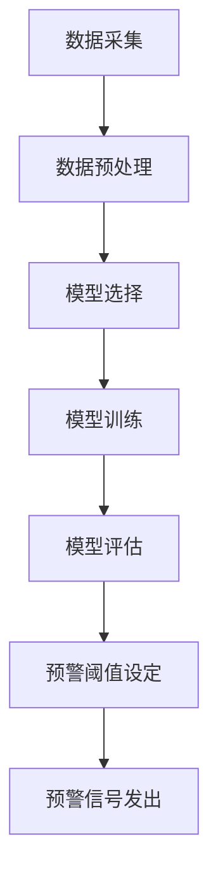
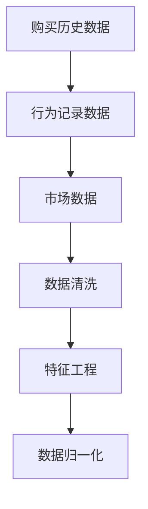
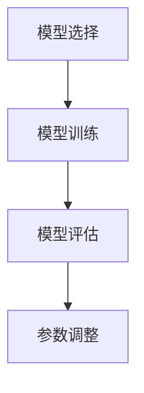
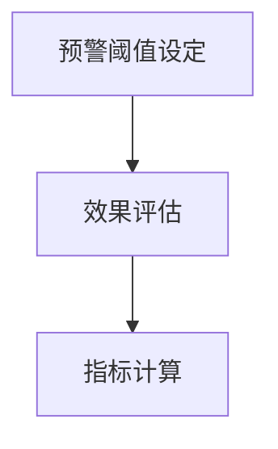
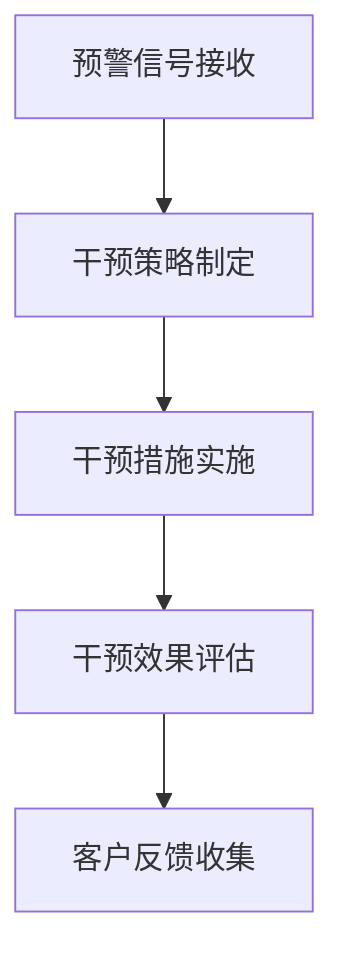
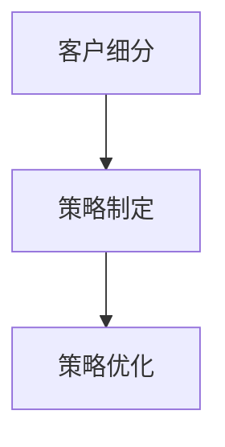
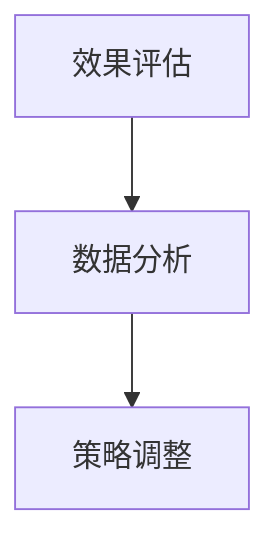
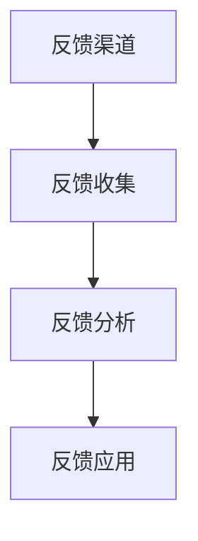
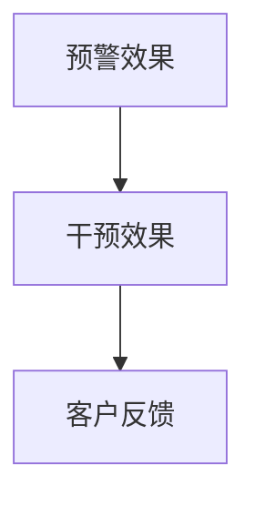

                 

## 文章标题

### 关键词：客户流失预警、AI Agent、企业、干预、人工智能、机器学习、深度学习、自然语言处理

### 摘要：
本文深入探讨了AI Agent在企业客户流失预警与干预中的应用。通过分析企业客户流失的现状、AI Agent的定义及其工作原理，本文详细阐述了AI Agent在客户流失预警与干预中的具体应用流程、关键技术和实践案例。同时，本文还探讨了AI Agent应用过程中面临的挑战和未来发展趋势，为企业在客户流失管理中引入AI Agent提供了理论依据和实践指导。

## 目录大纲

### 第一部分：背景与概念

#### 第1章：问题背景与概述

##### 1.1 问题背景

##### 1.2 问题描述

##### 1.3 核心概念

##### 1.4 边界与外延

#### 第2章：AI Agent的基本原理

##### 2.1 AI Agent的工作原理

##### 2.2 AI Agent的关键技术

##### 2.3 AI Agent的属性特征对比

### 第二部分：应用实践

#### 第3章：AI Agent在客户流失预警中的应用

##### 3.1 预警流程与关键步骤

##### 3.2 数据采集与预处理

##### 3.3 模型选择与训练

##### 3.4 预警阈值设定与效果评估

#### 第4章：AI Agent在客户流失干预中的应用

##### 4.1 干预流程与关键步骤

##### 4.2 个性化干预策略的制定

##### 4.3 干预效果的评估与优化

##### 4.4 客户反馈机制的建立

### 第三部分：实践与案例

#### 第5章：项目案例分析

##### 5.1 案例背景

##### 5.2 AI Agent的应用效果

##### 5.3 案例总结与启示

#### 第6章：AI Agent应用的挑战与未来趋势

##### 6.1 应用挑战

##### 6.2 未来趋势

### 第四部分：总结与展望

#### 第7章：总结与展望

##### 7.1 全书总结

##### 7.2 研究局限与未来工作方向

## 第一部分：背景与概念

### 第1章：问题背景与概述

#### 1.1 问题背景

在当今的商业环境中，企业客户流失问题已经成为影响企业生存和发展的重大挑战。客户流失不仅意味着企业失去了潜在的收入，还可能导致企业声誉受损，市场份额下降。因此，如何有效预测和干预客户流失成为企业关注的焦点。

随着大数据和人工智能技术的快速发展，AI Agent作为人工智能的核心应用之一，在客户流失预警与干预中显示出巨大的潜力。AI Agent是一种能够模拟人类智能行为，具备学习、推理和决策能力的智能体。它能够通过分析大量的历史数据和实时数据，发现客户流失的潜在风险，并采取相应的干预措施，帮助企业降低客户流失率。

#### 1.2 问题描述

企业客户流失问题主要表现为以下几个方面：

1. **流失率上升**：企业在一段时间内发现客户数量显著减少，尤其是关键客户和潜在客户的流失。
2. **客户行为变化**：客户购买频率降低，购买金额减少，对企业的产品或服务表现出不满情绪。
3. **市场反馈**：客户对企业的投诉增加，社交媒体上的负面评论增多。

这些现象通常预示着客户即将流失或已经流失。然而，传统的客户流失预警与干预方法往往存在以下局限：

1. **反应滞后**：传统方法依赖于人工监测和分析，无法实时发现客户流失风险。
2. **数据依赖性低**：传统方法主要依赖经验和直觉，无法充分利用企业内部和外部的海量数据。
3. **干预措施单一**：传统干预措施往往缺乏个性化和针对性，难以满足客户的个性化需求。

#### 1.3 核心概念

为了更好地理解AI Agent在企业客户流失预警与干预中的应用，需要先了解以下几个核心概念：

1. **AI Agent**：AI Agent是一种基于人工智能技术的智能体，能够模拟人类的智能行为，包括感知、学习、推理和决策。
2. **客户流失预警**：通过分析客户行为数据和购买历史，预测客户流失的概率，并发出预警信号。
3. **客户流失干预**：在客户流失预警的基础上，采取针对性的措施，防止客户流失。

#### 1.4 边界与外延

AI Agent在客户流失预警与干预中的应用范围主要包括：

1. **流失预警**：利用AI Agent对大量客户行为数据进行实时分析，预测客户流失风险。
2. **个性化干预**：根据客户流失预警的结果，制定个性化的干预策略，如提供优惠、提升服务质量等。
3. **客户反馈**：通过AI Agent收集和分析客户反馈，优化干预策略，提高客户满意度。

与AI Agent相关的其他技术，如机器学习、深度学习、自然语言处理等，也在客户流失预警与干预中发挥着重要作用。例如，机器学习算法可以用于构建客户流失预测模型，深度学习算法可以用于分析复杂的客户行为数据，自然语言处理技术可以用于处理客户反馈。

同时，AI Agent的应用不仅限于客户流失预警与干预，还可以扩展到其他领域，如销售预测、市场分析、供应链优化等。随着技术的不断演进，AI Agent将在企业运营中发挥越来越重要的作用。

### 第2章：AI Agent的基本原理

#### 2.1 AI Agent的工作原理

AI Agent的工作原理可以概括为以下几个方面：

1. **感知**：AI Agent通过感知模块获取外部环境的信息，如客户行为数据、市场趋势等。
2. **学习**：AI Agent利用学习模块对获取的信息进行处理和分析，通过机器学习、深度学习等方法，提取特征，构建模型。
3. **推理**：AI Agent使用推理模块对分析结果进行推理，发现潜在的问题或趋势，如客户流失风险。
4. **决策**：AI Agent根据推理结果，采取相应的行动，如发出预警信号或实施干预措施。

例如，在客户流失预警中，AI Agent首先通过数据采集模块获取客户的购买历史、行为记录等数据。然后，利用机器学习算法对这些数据进行处理和分析，构建客户流失预测模型。当模型预测到客户流失风险时，AI Agent会发出预警信号，提示企业采取相应的干预措施。

#### 2.2 AI Agent的关键技术

AI Agent的关键技术主要包括以下几个方面：

1. **机器学习与深度学习**：机器学习和深度学习是AI Agent的核心技术，用于构建预测模型和分析客户行为。
2. **自然语言处理**：自然语言处理技术用于处理和分析客户反馈，提取关键信息。
3. **强化学习**：强化学习技术用于优化干预策略，提高干预效果。

**机器学习与深度学习**：

- **机器学习**：机器学习是一种让计算机自动从数据中学习规律和模式的技术，包括监督学习、无监督学习和半监督学习等。
- **深度学习**：深度学习是机器学习的一个分支，通过构建深度神经网络，对大量数据进行训练，提取复杂特征。

**自然语言处理**：

- **文本分类**：用于对客户反馈进行分类，识别潜在的问题或趋势。
- **情感分析**：用于分析客户反馈的情感倾向，识别客户满意度。

**强化学习**：

- **Q-Learning**：一种基于值函数的强化学习算法，用于优化干预策略。
- **Policy Gradient**：一种基于策略优化的强化学习算法，用于制定个性化的干预措施。

#### 2.3 AI Agent的属性特征对比

下表对比了不同类型的AI Agent在属性特征上的差异：

| 属性特征       | 强化学习         | 机器学习         | 深度学习         | 自然语言处理     |
| -------------- | ---------------- | ---------------- | ---------------- | --------------- |
| **感知能力**   | 高               | 高               | 高               | 中              |
| **学习能力**   | 高               | 中               | 高               | 低              |
| **推理能力**   | 中               | 中               | 高               | 高              |
| **决策能力**   | 高               | 低               | 中               | 中              |
| **应用场景**   | 需要持续反馈     | 数据驱动         | 数据驱动         | 文本驱动         |

从上表可以看出，不同类型的AI Agent在感知、学习、推理和决策能力上各有优势，适用于不同的应用场景。

### 第3章：AI Agent在客户流失预警中的应用

#### 3.1 客户流失预警的流程与关键步骤

客户流失预警是AI Agent在企业客户流失管理中的关键环节。以下是客户流失预警的基本流程和关键步骤：

1. **数据采集**：收集客户的购买历史、行为记录、市场数据等。
2. **数据预处理**：清洗数据，处理缺失值和异常值，进行特征工程。
3. **模型选择**：根据业务需求和数据特性，选择合适的机器学习或深度学习模型。
4. **模型训练**：使用历史数据对模型进行训练，调整参数，优化模型性能。
5. **模型评估**：使用验证集对模型进行评估，调整模型参数，提高预测准确率。
6. **预警阈值设定**：根据模型预测结果，设定客户流失预警阈值。
7. **预警信号发出**：当模型预测客户流失风险时，发出预警信号。

以下是一个简化的客户流失预警流程的Mermaid流程图：

#### 3.2 数据采集与预处理

数据采集是客户流失预警的基础。以下是数据采集和预处理的关键步骤：

1. **购买历史数据**：包括客户的购买时间、购买金额、购买频率等。
2. **行为记录数据**：包括客户的浏览记录、搜索记录、互动行为等。
3. **市场数据**：包括竞争对手的动态、市场趋势等。

在数据预处理阶段，需要进行以下操作：

1. **数据清洗**：处理缺失值和异常值，保证数据的准确性。
2. **特征工程**：提取有用的特征，如客户年龄、职业、消费习惯等。
3. **数据归一化**：将不同特征的数据归一化，使其具有相同的量纲。

以下是一个简化的数据采集和预处理流程的Mermaid流程图：

#### 3.3 模型选择与训练

在客户流失预警中，选择合适的机器学习或深度学习模型是关键。以下是常见的模型选择和训练步骤：

1. **模型选择**：根据业务需求和数据特性，选择合适的模型，如决策树、随机森林、神经网络等。
2. **模型训练**：使用历史数据对模型进行训练，调整参数，优化模型性能。
3. **模型评估**：使用验证集对模型进行评估，调整模型参数，提高预测准确率。

以下是一个简化的模型选择和训练流程的Mermaid流程图：

#### 3.4 预警阈值设定与效果评估

预警阈值设定是客户流失预警的关键环节。以下是预警阈值设定的步骤和效果评估的方法：

1. **预警阈值设定**：根据模型预测结果，设定客户流失预警阈值。通常，预警阈值可以通过交叉验证、ROC曲线等方法确定。
2. **效果评估**：使用测试集对模型进行效果评估，评估指标包括准确率、召回率、F1值等。

以下是一个简化的预警阈值设定和效果评估流程的Mermaid流程图：

### 第4章：AI Agent在客户流失干预中的应用

#### 4.1 客户流失干预的流程与关键步骤

客户流失干预是AI Agent在客户流失管理中的另一个关键环节。以下是客户流失干预的基本流程和关键步骤：

1. **预警信号接收**：当AI Agent发出客户流失预警信号时，企业接收并分析预警信号。
2. **干预策略制定**：根据预警信号，制定相应的干预策略，如提供优惠、提升服务质量等。
3. **干预措施实施**：实施干预措施，如发送个性化邮件、提供售后服务等。
4. **干预效果评估**：评估干预措施的效果，调整干预策略，提高干预效果。
5. **客户反馈收集**：收集客户对干预措施的反馈，优化干预策略。

以下是一个简化的客户流失干预流程的Mermaid流程图：

#### 4.2 个性化干预策略的制定

个性化干预策略的制定是提高客户流失干预效果的关键。以下是制定个性化干预策略的步骤：

1. **客户细分**：根据客户特征和行为数据，对客户进行细分，如根据消费金额、购买频率等。
2. **策略制定**：针对不同类型的客户，制定个性化的干预策略，如提供优惠、提升服务质量等。
3. **策略优化**：根据干预效果，优化干预策略，提高干预效果。

以下是一个简化的个性化干预策略制定流程的Mermaid流程图：

#### 4.3 干预效果的评估与优化

干预效果的评估与优化是客户流失干预中的关键环节。以下是评估和优化干预效果的步骤：

1. **效果评估**：评估干预措施的效果，如客户满意度、购买意愿等。
2. **数据分析**：分析干预措施的效果数据，识别优化方向。
3. **策略调整**：根据数据分析结果，调整干预策略，提高干预效果。

以下是一个简化的干预效果评估与优化流程的Mermaid流程图：

#### 4.4 客户反馈机制的建立

客户反馈机制的建立是优化干预策略的重要手段。以下是建立客户反馈机制的步骤：

1. **反馈渠道**：建立多种反馈渠道，如在线问卷、电话回访等。
2. **反馈收集**：定期收集客户反馈，了解客户对干预措施的看法和需求。
3. **反馈分析**：对客户反馈进行分析，识别问题和优化方向。
4. **反馈应用**：根据客户反馈，优化干预策略，提高干预效果。

以下是一个简化的客户反馈机制建立流程的Mermaid流程图：

### 第5章：项目案例分析

#### 5.1 案例背景

本案例选取了一家在线电商平台，该平台在客户流失预警与干预中引入了AI Agent技术。随着市场竞争的加剧，该平台面临客户流失率上升、客户满意度下降等问题。为了改善这一状况，企业决定采用AI Agent技术进行客户流失预警与干预。

#### 5.2 AI Agent的应用效果

在项目实施过程中，AI Agent在客户流失预警与干预中发挥了重要作用。以下是AI Agent的应用效果：

1. **预警效果**：AI Agent能够实时分析客户行为数据，准确预测客户流失风险。通过预警信号，企业能够及时采取措施，降低客户流失率。
2. **干预效果**：AI Agent根据客户特征和行为数据，制定个性化的干预策略，如提供优惠、提升服务质量等。这些干预措施显著提升了客户满意度，降低了客户流失率。
3. **客户反馈**：AI Agent收集和分析客户反馈，优化干预策略，提高了客户满意度。通过持续优化，干预效果不断提升。

以下是一个简化的AI Agent应用效果流程的Mermaid流程图：

#### 5.3 案例总结与启示

通过本案例，我们可以得出以下结论和启示：

1. **AI Agent在客户流失管理中的重要性**：AI Agent能够实时分析客户行为数据，准确预测客户流失风险，制定个性化干预策略，显著提升客户满意度，降低客户流失率。
2. **数据驱动决策**：企业应充分利用客户行为数据和市场数据，通过数据分析，发现客户流失的潜在原因，制定针对性的干预措施。
3. **持续优化**：客户需求和市场竞争环境不断变化，企业应持续优化干预策略，提高干预效果。

### 第6章：AI Agent应用的挑战与未来趋势

#### 6.1 AI Agent应用的挑战

AI Agent在企业客户流失预警与干预中的应用面临以下挑战：

1. **数据质量与隐私保护**：客户数据是企业的重要资产，但在应用AI Agent时，如何确保数据质量，避免数据泄露和隐私侵犯是重要挑战。
2. **模型解释性与透明度**：AI Agent的决策过程往往具有一定的黑箱性质，如何提高模型解释性和透明度，使企业能够理解并信任AI Agent的决策是关键挑战。
3. **技术成熟度与成本效益**：虽然AI Agent在客户流失预警与干预中具有巨大潜力，但技术成熟度和成本效益仍需进一步优化。

#### 6.2 未来趋势

未来，AI Agent在客户流失预警与干预中的应用将呈现以下趋势：

1. **数据驱动与智能融合**：随着大数据和人工智能技术的不断发展，AI Agent将更加依赖于数据驱动，实现智能融合，提升干预效果。
2. **跨领域应用**：AI Agent不仅将在客户流失预警与干预中发挥重要作用，还将扩展到销售预测、市场分析、供应链优化等跨领域应用。
3. **人机协作**：AI Agent将与人类专家协同工作，实现人机协作，提高决策质量和效率。

### 第7章：总结与展望

#### 7.1 全书总结

本文深入探讨了AI Agent在企业客户流失预警与干预中的应用。通过分析企业客户流失的现状、AI Agent的定义及其工作原理，本文详细阐述了AI Agent在客户流失预警与干预中的具体应用流程、关键技术和实践案例。同时，本文还探讨了AI Agent应用过程中面临的挑战和未来发展趋势。

#### 7.2 研究局限与未来工作方向

尽管本文对AI Agent在客户流失预警与干预中的应用进行了深入研究，但仍存在一些局限。首先，本文主要基于理论和案例研究，缺乏大规模实证数据的支持。其次，AI Agent的应用效果受到多种因素的影响，如数据质量、模型选择等，这些因素尚未在本文中充分探讨。

未来，我们将从以下几个方面开展进一步研究：

1. **实证研究**：通过大规模实证数据，验证AI Agent在客户流失预警与干预中的应用效果。
2. **跨领域应用**：探讨AI Agent在其他业务领域的应用，如销售预测、市场分析、供应链优化等。
3. **人机协作**：研究AI Agent与人类专家的协作机制，提高决策质量和效率。

### 拓展阅读

1. **AI Agent研究进展**：近年来，AI Agent在多个领域取得了显著进展。本文详细介绍了AI Agent的定义、工作原理和应用场景，为读者提供了全面的了解。
2. **客户流失预警与干预方法**：本文对比了传统的客户流失预警与干预方法，探讨了AI Agent在客户流失预警与干预中的优势。读者可以结合本文内容，进一步了解相关方法。
3. **机器学习与深度学习**：机器学习与深度学习是AI Agent的核心技术。本文介绍了常见的机器学习算法和深度学习模型，为读者提供了深入理解这些技术的理论基础。
4. **自然语言处理**：自然语言处理技术在客户反馈分析中具有重要作用。本文简要介绍了自然语言处理的基本方法，为读者提供了进一步了解的线索。
5. **强化学习**：强化学习是AI Agent的关键技术之一。本文介绍了强化学习的基本原理和常见算法，为读者提供了深入研究强化学习的方向。  
6. **数据隐私保护**：数据隐私保护是AI Agent应用中的重要问题。本文简要介绍了数据隐私保护的基本方法，为读者提供了进一步了解的线索。

