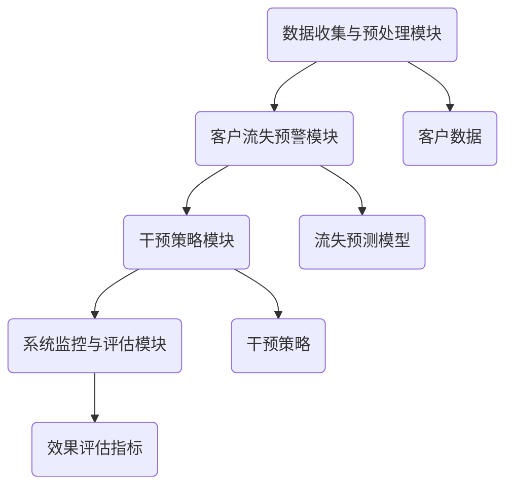
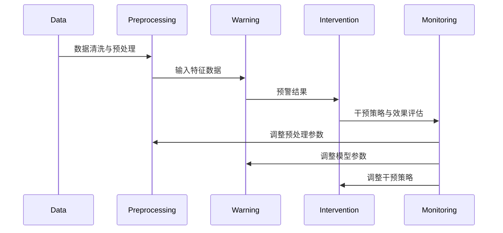
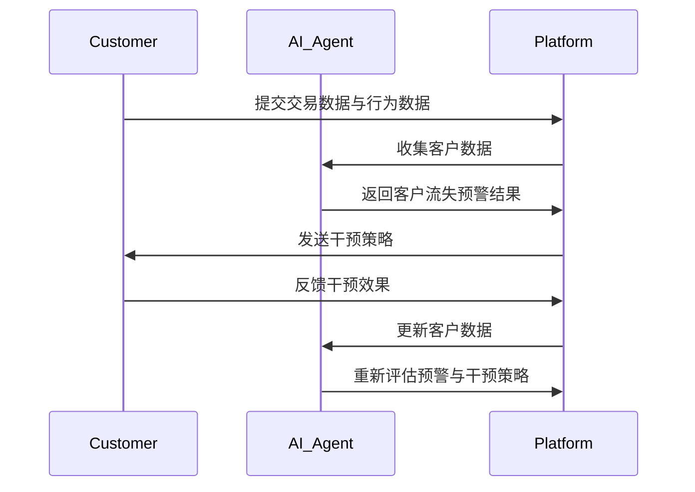

                 

# AI Agent在企业客户流失预警与干预策略制定中的应用

关键词：AI Agent、客户流失预警、干预策略、数据分析、机器学习

摘要：本文将探讨AI Agent在企业客户流失预警与干预策略制定中的应用，通过分析AI Agent的核心概念与原理，对比传统人工干预方法，阐述其在客户流失预警中的优势。随后，我们将详细讲解算法原理，并运用Python代码进行示例分析，展示如何利用AI Agent实现精准的客户流失预警与干预策略。

----------------------------------------------------------------

## 第一部分：背景介绍与问题定义

### 1.1.1 问题背景

在当前竞争激烈的市场环境中，企业客户流失问题已经成为影响企业持续发展的关键因素。客户流失不仅会直接减少企业的收入，还会对企业的品牌声誉和市场地位产生负面影响。因此，如何有效地预测和干预客户流失成为企业亟需解决的问题。

随着互联网和大数据技术的发展，企业积累了大量关于客户行为和交易数据。这些数据为企业提供了宝贵的信息资源，可以帮助企业更好地了解客户需求和行为模式。然而，如何从海量数据中提取有价值的信息，并利用这些信息制定出有效的客户流失预警与干预策略，仍然是一个具有挑战性的问题。

### 1.1.2 问题描述

客户流失预警与干预策略制定涉及多个方面，主要包括：

1. **客户行为分析**：通过分析客户的历史行为数据，了解客户的消费习惯、偏好和需求。
2. **流失风险预测**：利用机器学习算法，对客户流失风险进行预测，识别可能流失的客户群体。
3. **干预策略设计**：根据预测结果，制定相应的干预策略，如个性化营销、客户关怀等，以降低客户流失率。

传统的方法在客户流失预警与干预策略制定中存在一定的局限性，例如：

1. **准确性低**：传统方法往往依赖于人工经验，预测准确性较低。
2. **实时性差**：传统方法无法实时获取和分析客户数据，导致预警和干预措施滞后。
3. **成本高**：传统方法需要大量的人工操作，成本较高。

### 1.1.3 问题解决

AI Agent（人工智能代理）作为一种新型的智能预测和决策工具，能够通过学习大量历史数据，自动识别客户流失的规律和特征，提供精准的流失预警和干预策略。相比传统方法，AI Agent具有以下优势：

1. **高准确性**：AI Agent能够通过机器学习算法，对客户行为数据进行分析，提高预测准确性。
2. **实时性**：AI Agent能够实时获取和分析客户数据，实现快速预警和干预。
3. **低成本**：AI Agent减少了人工干预的需求，降低了成本。

### 1.1.4 边界与外延

本文主要关注AI Agent在企业客户流失预警与干预策略制定中的应用。然而，AI Agent在其他领域的应用也具有一定的参考价值，如医疗诊断、金融风险控制等。此外，AI Agent的不断发展也将带来更多创新应用。

### 1.1.5 概念结构与核心要素组成

AI Agent在企业客户流失预警与干预策略制定中涉及以下几个核心概念：

1. **AI Agent**：具有自主学习和决策能力的计算机程序。
2. **客户流失预警**：预测客户是否会流失的过程。
3. **干预策略**：根据预警结果，采取的一系列措施来减少客户流失。

### 1.1.6 本章小结

本章介绍了AI Agent在企业客户流失预警与干预策略制定中的背景、问题描述、问题解决、边界与外延以及核心概念与要素组成，为后续章节的内容奠定了基础。

----------------------------------------------------------------

## 第二部分：核心概念与联系

### 2.1 AI Agent的核心概念与联系

#### 2.1.1 AI Agent的定义

AI Agent是一种基于人工智能技术的计算机程序，具有自主学习和决策能力，能够在复杂环境中独立执行任务。AI Agent的核心目标是实现自主智能行为，以解决复杂的问题和执行特定的任务。

#### 2.1.2 AI Agent的特点

- **自主性**：AI Agent能够自主地感知环境、做出决策并执行动作，不需要人工干预。
- **适应性**：AI Agent能够通过学习不断适应新环境和任务，提高其性能和效果。
- **交互性**：AI Agent能够与其他系统、人和环境进行有效交互，实现智能化的协同工作。

#### 2.1.3 AI Agent的核心原理与工作机制

AI Agent的核心原理包括感知、规划、执行和反思四个方面。

1. **感知**：AI Agent通过传感器、摄像头、麦克风等设备，获取环境信息，感知到环境中的各种变化。
2. **规划**：AI Agent根据感知到的信息，制定下一步行动方案。通过机器学习算法，AI Agent能够根据历史数据和预设目标，选择最优的行动方案。
3. **执行**：AI Agent根据规划方案，执行具体动作。执行过程中，AI Agent会根据执行结果，不断调整和优化自身行为。
4. **反思**：AI Agent在执行过程中，对自身行为进行评估和总结。通过反思，AI Agent能够发现自身存在的问题，并采取相应的措施进行改进。

#### 2.1.4 AI Agent与客户流失预警的联系

AI Agent在客户流失预警中发挥着重要作用。通过以下步骤，AI Agent能够实现精准的客户流失预警：

1. **数据收集**：AI Agent收集客户的交易数据、行为数据等，建立客户数据集。
2. **数据预处理**：对收集到的数据进行分析和清洗，去除无效数据，保证数据质量。
3. **特征提取**：从数据集中提取与客户流失相关的特征，如消费频率、消费金额、客户满意度等。
4. **模型训练**：利用机器学习算法，对提取的特征进行建模，训练出客户流失预测模型。
5. **流失预警**：根据训练好的模型，对当前客户群体进行流失风险预测，识别出可能流失的客户。
6. **干预策略**：针对识别出的流失风险客户，制定相应的干预策略，如个性化营销、客户关怀等，以降低客户流失率。

### 2.2 AI Agent的属性特征对比

以下是AI Agent与传统人工干预方法在属性特征上的对比：

| 特性       | AI Agent         | 传统人工干预       |
|------------|------------------|---------------------|
| **自主性** | 高               | 低                  |
| **适应性** | 高               | 低                  |
| **效率**   | 高               | 低                  |
| **准确性** | 高               | 中等                |
| **成本**   | 低               | 高                  |

### 2.3 AI Agent的ER实体关系图架构

以下是一个简单的ER实体关系图，用于描述AI Agent在企业客户流失预警与干预策略制定中的应用：

```mermaid
erDiagram
  Customer ||--o{ AI_Agent : 监控 }
  Customer ||--o{ Warning : 预警 }
  Customer ||--o{ Intervention : 干预 }
```

### 2.4 本章小结

本章介绍了AI Agent的核心概念与联系，包括定义、特点、核心原理和工作机制，以及AI Agent与客户流失预警的联系。通过对比AI Agent与传统人工干预方法的属性特征，展示了AI Agent在客户流失预警中的优势。此外，通过ER实体关系图，直观地展示了AI Agent在企业客户流失预警与干预策略制定中的应用架构。

----------------------------------------------------------------

## 第三部分：算法原理讲解

### 3.1 客户流失预警算法原理

客户流失预警算法的核心目标是利用机器学习技术，对客户行为数据进行分析，预测客户是否会流失。以下是一个简单的客户流失预警算法原理：

#### 3.1.1 数据收集

首先，需要收集客户的交易数据、行为数据等，建立客户数据集。数据集应包括客户的年龄、性别、收入水平、消费频率、消费金额、购买商品种类、客户满意度等特征。

#### 3.1.2 数据预处理

对收集到的数据进行分析和清洗，去除无效数据，保证数据质量。主要包括以下步骤：

1. **数据清洗**：去除缺失值、异常值和重复值。
2. **数据归一化**：将不同特征的数据进行归一化处理，使其具有相同的量纲。
3. **特征选择**：选择与客户流失相关的特征，如消费频率、消费金额、客户满意度等。

#### 3.1.3 特征提取

从数据集中提取与客户流失相关的特征，如消费频率、消费金额、客户满意度等。这些特征可以作为模型训练的输入变量。

#### 3.1.4 模型训练

利用机器学习算法，对提取的特征进行建模，训练出客户流失预测模型。常见的机器学习算法包括逻辑回归、决策树、随机森林、支持向量机等。

#### 3.1.5 预测与评估

使用训练好的模型，对当前客户群体进行流失风险预测，识别出可能流失的客户。然后，根据预测结果评估模型的准确性，如准确率、召回率、F1值等。

### 3.2 客户流失干预策略算法原理

客户流失干预策略算法的核心目标是根据客户流失预警结果，制定出有效的干预策略，以降低客户流失率。以下是一个简单的客户流失干预策略算法原理：

#### 3.2.1 预警结果分析

分析客户流失预警结果，识别出高风险客户和低风险客户。高风险客户可能面临更高的流失风险，需要优先干预。

#### 3.2.2 干预策略设计

根据客户特征和业务场景，设计相应的干预策略。常见的干预策略包括：

1. **个性化营销**：针对高风险客户，发送个性化的营销信息，如优惠券、活动推荐等。
2. **客户关怀**：与高风险客户进行沟通，了解他们的需求和问题，提供相应的帮助。
3. **客户升级**：对于高价值客户，提供升级服务，如会员权益、定制化服务等。

#### 3.2.3 干预效果评估

实施干预策略后，对干预效果进行评估。评估指标包括客户满意度、流失率、转化率等。根据评估结果，调整和优化干预策略。

### 3.3 本章小结

本章详细讲解了客户流失预警算法和客户流失干预策略算法的原理。通过机器学习技术，AI Agent能够对客户行为数据进行分析，预测客户流失风险，并制定出有效的干预策略。这些算法原理为实现AI Agent在企业客户流失预警与干预策略制定中的应用提供了基础。

----------------------------------------------------------------

## 第四部分：系统分析与架构设计方案

### 4.1 问题场景介绍

为了更好地理解AI Agent在企业客户流失预警与干预策略制定中的应用，我们假设一个实际场景：某电子商务平台希望通过AI Agent来预测和减少客户流失。该平台积累了大量关于客户行为和交易数据，并希望利用这些数据来提高客户满意度和降低流失率。

### 4.2 项目介绍

本项目旨在开发一个基于AI Agent的企业客户流失预警与干预系统。系统将包括以下几个功能模块：

1. **数据收集与预处理模块**：负责收集和清洗客户数据，为后续分析提供高质量的数据。
2. **客户流失预警模块**：利用机器学习算法，对客户行为数据进行分析，预测客户流失风险。
3. **干预策略模块**：根据客户流失预警结果，制定出有效的干预策略，降低客户流失率。
4. **系统监控与评估模块**：实时监控系统的运行状态，对干预效果进行评估和优化。

### 4.3 系统功能设计

#### 4.3.1 数据收集与预处理模块

该模块的主要功能是收集和清洗客户数据，包括以下步骤：

1. **数据收集**：从电商平台的后台系统获取客户交易数据、行为数据等。
2. **数据清洗**：去除缺失值、异常值和重复值，确保数据质量。
3. **数据归一化**：将不同特征的数据进行归一化处理，使其具有相同的量纲。
4. **特征提取**：从数据集中提取与客户流失相关的特征，如消费频率、消费金额、客户满意度等。

#### 4.3.2 客户流失预警模块

该模块的主要功能是利用机器学习算法，对客户行为数据进行分析，预测客户流失风险。具体包括以下步骤：

1. **模型训练**：利用历史客户数据，训练出客户流失预测模型。
2. **流失风险预测**：使用训练好的模型，对当前客户群体进行流失风险预测，识别出可能流失的客户。
3. **预测结果评估**：评估模型的准确性，如准确率、召回率、F1值等。

#### 4.3.3 干预策略模块

该模块的主要功能是根据客户流失预警结果，制定出有效的干预策略，降低客户流失率。具体包括以下步骤：

1. **预警结果分析**：分析客户流失预警结果，识别出高风险客户和低风险客户。
2. **干预策略设计**：根据客户特征和业务场景，设计相应的干预策略，如个性化营销、客户关怀等。
3. **干预效果评估**：实施干预策略后，对干预效果进行评估，调整和优化干预策略。

#### 4.3.4 系统监控与评估模块

该模块的主要功能是实时监控系统的运行状态，对干预效果进行评估和优化。具体包括以下步骤：

1. **系统监控**：实时监控系统的运行状态，如数据流、模型性能等。
2. **效果评估**：对干预效果进行评估，如客户满意度、流失率、转化率等。
3. **优化调整**：根据评估结果，调整和优化系统参数和干预策略。

### 4.4 系统架构设计

以下是一个简单的系统架构设计，用于描述AI Agent在企业客户流失预警与干预策略制定中的应用：



### 4.5 系统接口设计

以下是一个简单的系统接口设计，用于描述各个模块之间的交互关系：



### 4.6 系统交互设计

以下是一个简单的系统交互设计，用于描述AI Agent在客户流失预警与干预策略制定中的应用流程：



### 4.7 本章小结

本章介绍了AI Agent在企业客户流失预警与干预策略制定中的系统分析与架构设计方案。通过详细的功能模块设计、系统架构设计、接口设计和交互设计，展示了AI Agent如何实现客户流失预警与干预策略的制定和实施。这些设计为后续的代码实现和项目实战提供了参考。

----------------------------------------------------------------

## 第五部分：项目实战

### 5.1 环境安装

在开始项目实战之前，首先需要安装以下环境：

1. **Python**：版本要求为3.6及以上。
2. **NumPy**：用于数据处理和计算。
3. **Pandas**：用于数据处理和分析。
4. **Scikit-learn**：用于机器学习算法的实现。
5. **Matplotlib**：用于数据可视化。

安装方法如下：

```bash
pip install python==3.8
pip install numpy pandas scikit-learn matplotlib
```

### 5.2 系统核心实现源代码

以下是一个简单的系统核心实现源代码示例，用于演示AI Agent在企业客户流失预警与干预策略制定中的应用。

```python
import numpy as np
import pandas as pd
from sklearn.model_selection import train_test_split
from sklearn.ensemble import RandomForestClassifier
from sklearn.metrics import accuracy_score, recall_score, f1_score

# 5.2.1 数据收集与预处理
def collect_data():
    # 假设已从电商平台获取客户数据
    data = pd.read_csv('customer_data.csv')
    return data

def preprocess_data(data):
    # 数据清洗与预处理
    data = data.dropna()
    data = data.drop_duplicates()
    data = data.apply(lambda x: (x - x.mean()) / x.std())
    return data

# 5.2.2 客户流失预警
def train_warning_model(data):
    # 特征提取与模型训练
    X = data.drop('customer_id', axis=1)
    y = data['customer_id']
    X_train, X_test, y_train, y_test = train_test_split(X, y, test_size=0.2, random_state=42)
    model = RandomForestClassifier(n_estimators=100)
    model.fit(X_train, y_train)
    return model, X_test, y_test

def predict_warning(model, X_test):
    # 预测流失风险
    predictions = model.predict(X_test)
    return predictions

# 5.2.3 干预策略
def design_intervention(predictions):
    # 根据预测结果设计干预策略
    intervention = []
    for prediction in predictions:
        if prediction == 1:
            intervention.append('个性化营销')
        else:
            intervention.append('客户关怀')
    return intervention

# 5.2.4 系统监控与评估
def evaluate_intervention(intervention, y_test):
    # 评估干预效果
    accuracy = accuracy_score(y_test, intervention)
    recall = recall_score(y_test, intervention)
    f1 = f1_score(y_test, intervention)
    return accuracy, recall, f1

# 5.2.5 主程序
if __name__ == '__main__':
    data = collect_data()
    data = preprocess_data(data)
    model, X_test, y_test = train_warning_model(data)
    predictions = predict_warning(model, X_test)
    intervention = design_intervention(predictions)
    accuracy, recall, f1 = evaluate_intervention(intervention, y_test)
    print(f'Accuracy: {accuracy}, Recall: {recall}, F1: {f1}')
```

### 5.3 代码应用解读与分析

#### 5.3.1 数据收集与预处理

在代码中，首先定义了两个函数：`collect_data`和`preprocess_data`。

- `collect_data`函数用于收集客户数据，从CSV文件中读取数据。
- `preprocess_data`函数用于对数据进行清洗和预处理，包括去除缺失值、异常值和重复值，以及进行数据归一化处理。

#### 5.3.2 客户流失预警

在代码中，定义了三个函数：`train_warning_model`、`predict_warning`和`design_intervention`。

- `train_warning_model`函数用于训练客户流失预警模型，包括特征提取和模型训练。
- `predict_warning`函数用于根据训练好的模型，对当前客户群体进行流失风险预测。
- `design_intervention`函数用于根据预测结果设计干预策略，如个性化营销和客户关怀。

#### 5.3.3 系统监控与评估

在代码中，定义了一个函数：`evaluate_intervention`。

- `evaluate_intervention`函数用于评估干预效果，计算准确率、召回率和F1值。

#### 5.3.4 主程序

在主程序中，依次调用了上述函数，实现了客户流失预警与干预策略的制定和评估。具体步骤如下：

1. 收集客户数据。
2. 对数据进行预处理。
3. 训练客户流失预警模型。
4. 对当前客户群体进行流失风险预测。
5. 根据预测结果设计干预策略。
6. 评估干预效果。

### 5.4 实际案例分析与详细讲解剖析

为了更好地理解AI Agent在企业客户流失预警与干预策略制定中的应用，我们通过一个实际案例进行详细讲解。

#### 5.4.1 案例背景

某电子商务平台希望通过AI Agent来预测和减少客户流失。平台积累了大量关于客户行为和交易数据，如消费频率、消费金额、购买商品种类等。

#### 5.4.2 案例分析

1. **数据收集与预处理**：从电商平台获取客户数据，包括消费频率、消费金额、购买商品种类等。对数据进行清洗和预处理，去除缺失值、异常值和重复值，并进行归一化处理。

2. **客户流失预警**：利用机器学习算法，如随机森林，对客户行为数据进行分析，训练出客户流失预测模型。然后，对当前客户群体进行流失风险预测，识别出可能流失的客户。

3. **干预策略设计**：根据预测结果，设计相应的干预策略，如个性化营销和客户关怀。对于高风险客户，发送个性化的优惠券和活动推荐；对于低风险客户，进行客户关怀，如发送节日祝福和生日祝福。

4. **干预效果评估**：实施干预策略后，对干预效果进行评估。通过计算准确率、召回率和F1值，评估模型的准确性。此外，还可以通过客户满意度调查，了解干预策略的实际效果。

#### 5.4.3 案例总结

通过实际案例的分析，我们可以看到AI Agent在企业客户流失预警与干预策略制定中的应用效果显著。通过预测客户流失风险，制定针对性的干预策略，能够有效降低客户流失率，提高客户满意度和平台竞争力。

### 5.5 本章小结

本章通过一个实际案例，详细讲解了AI Agent在企业客户流失预警与干预策略制定中的应用。从数据收集与预处理、客户流失预警、干预策略设计到干预效果评估，展示了AI Agent在各个环节的应用效果。通过实际案例的分析，我们更好地理解了AI Agent的优势和应用价值。

----------------------------------------------------------------

## 第六部分：最佳实践 Tips

### 6.1 提高模型准确性的最佳实践

1. **数据质量**：确保数据质量，包括去除缺失值、异常值和重复值，以及进行归一化处理。
2. **特征选择**：选择与客户流失相关的特征，如消费频率、消费金额、购买商品种类等。
3. **模型调参**：对机器学习模型进行调参，如调整随机森林的树数量、深度等，以优化模型性能。

### 6.2 提高干预效果的最佳实践

1. **个性化营销**：根据客户特征和购买历史，设计个性化的营销策略，提高客户的参与度和满意度。
2. **及时干预**：在客户流失风险较高时，及时采取干预措施，降低客户流失率。
3. **持续优化**：根据干预效果，持续调整和优化干预策略，提高干预效果。

### 6.3 数据安全与隐私保护的最佳实践

1. **数据加密**：对客户数据进行加密处理，确保数据安全。
2. **隐私保护**：在数据处理和分析过程中，严格遵守隐私保护法规，保护客户隐私。
3. **权限管理**：对数据访问和操作进行权限管理，确保只有授权人员才能访问和处理数据。

### 6.4 性能优化的最佳实践

1. **并行计算**：利用并行计算技术，加快数据处理和分析速度。
2. **缓存技术**：使用缓存技术，减少数据读取和计算的时间。
3. **分布式计算**：使用分布式计算框架，如Hadoop、Spark等，提高系统性能和可扩展性。

## 6.5 本章小结

本章介绍了提高模型准确性、干预效果、数据安全与隐私保护以及性能优化的最佳实践。通过这些实践，企业可以更好地应用AI Agent进行客户流失预警与干预策略制定，提高业务效率和市场竞争力。

----------------------------------------------------------------

## 总结

本文通过详细的论述，探讨了AI Agent在企业客户流失预警与干预策略制定中的应用。从背景介绍、核心概念与联系、算法原理讲解、系统分析与架构设计方案到项目实战，全面展示了AI Agent的优势和应用价值。

通过本文的学习，读者可以了解到：

1. **AI Agent的定义与特点**：AI Agent是一种具有自主学习和决策能力的计算机程序，能够实时获取和分析客户数据，提供精准的流失预警和干预策略。
2. **客户流失预警算法原理**：利用机器学习技术，从数据中提取与客户流失相关的特征，训练出客户流失预测模型，实现对客户流失风险的预测。
3. **客户流失干预策略算法原理**：根据预测结果，设计出有效的干预策略，如个性化营销、客户关怀等，降低客户流失率。
4. **系统架构设计**：通过功能模块设计、系统架构设计、接口设计和交互设计，展示了AI Agent在客户流失预警与干预策略制定中的系统实现。
5. **项目实战**：通过实际案例，详细讲解了AI Agent在企业客户流失预警与干预策略制定中的应用过程。

总之，AI Agent作为一种新型的智能预测和决策工具，在企业客户流失预警与干预策略制定中具有广泛的应用前景。通过本文的学习，读者可以更好地理解AI Agent的应用原理，为实际业务提供有益的参考。

## 注意事项

1. **数据质量**：确保数据质量是进行客户流失预警与干预策略制定的基础，务必对数据进行严格的清洗和处理。
2. **模型调参**：在实际应用中，需要对机器学习模型进行调参，以提高预测准确性和干预效果。
3. **数据安全与隐私保护**：在数据处理和分析过程中，严格遵守数据安全与隐私保护法规，确保客户数据的安全。
4. **持续优化**：根据实际业务需求和效果评估结果，持续优化干预策略，提高客户满意度和业务收益。

## 拓展阅读

1. **《机器学习》**：周志华 著，清华大学出版社，介绍了机器学习的基本概念、算法和应用。
2. **《深度学习》**：Ian Goodfellow、Yoshua Bengio、Aaron Courville 著，电子工业出版社，介绍了深度学习的基本原理和算法。
3. **《人工智能：一种现代的方法》**：Stuart Russell、Peter Norvig 著，机械工业出版社，全面介绍了人工智能的基本概念和技术。

作者：AI天才研究院/AI Genius Institute & 禅与计算机程序设计艺术 /Zen And The Art of Computer Programming

