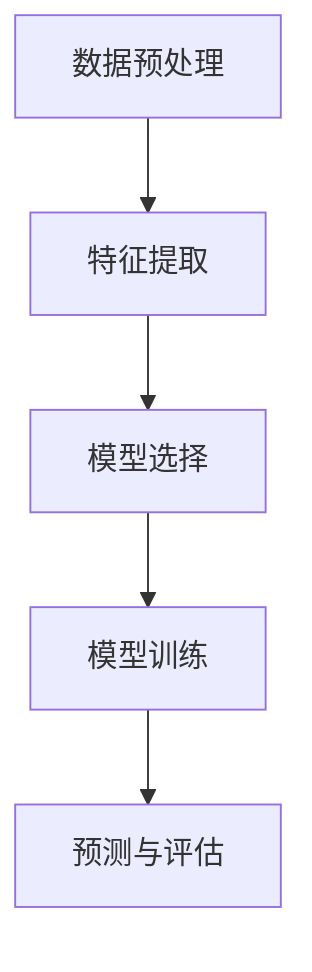
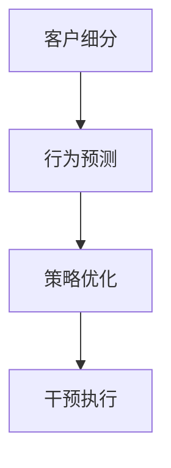
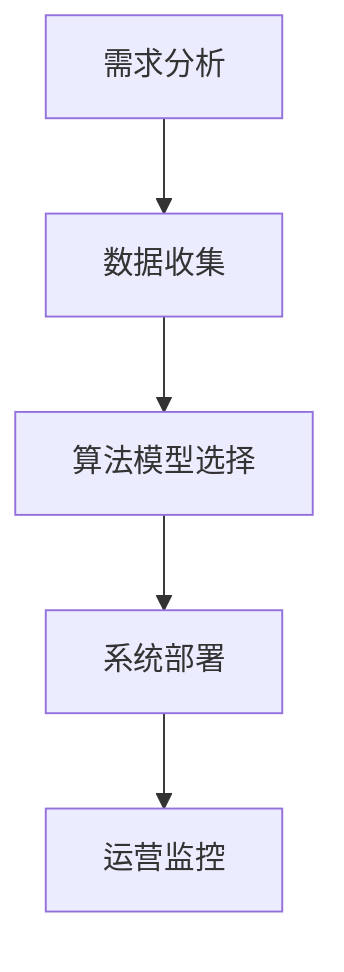

                 


### <font color="red">### 第一部分：AI Agent概述</font>

#### <font color="blue">**1.1 AI Agent的定义与作用**</font>

**AI Agent的定义**：

AI Agent，即人工智能代理，是一种能够自主行动，执行特定任务并在复杂环境中适应和学习的计算实体。它基于人工智能技术，通过感知环境、分析数据、决策制定和行动执行，以实现特定的目标。

**AI Agent的作用**：

在客户流失预警与精准干预中，AI Agent扮演着至关重要的角色。首先，它能够对客户的消费行为和反馈进行分析，识别出潜在的流失风险。其次，通过学习和预测，AI Agent可以提出针对性的干预措施，如个性化促销、客户关怀等，从而降低客户流失率。

#### <font color="blue">**1.2 客户流失预警的背景与需求**</font>

**客户流失的背景**：

随着市场竞争的加剧和消费者需求的变化，企业面临巨大的客户流失风险。根据相关数据统计，客户流失对企业造成的损失是客户获得成本的5-25倍。因此，客户流失预警显得尤为重要。

**客户流失预警的需求**：

- **提高客户保留率**：通过提前识别出可能流失的客户，采取有效措施进行干预，从而降低客户流失率。
- **提升业务效率**：自动化识别和响应流失风险，减轻人工负担，提高工作效率。
- **优化资源分配**：将有限的资源集中投入到潜在流失的客户上，实现精准营销。

#### <font color="blue">**1.3 AI Agent在客户流失预警中的核心算法**</font>

**核心算法的原理**：

AI Agent在客户流失预警中主要依赖于机器学习和数据挖掘技术。其核心算法包括数据预处理、特征提取、模型选择和训练等步骤。

- **数据预处理**：对原始数据进行清洗、归一化和转换，使其适用于机器学习模型。
- **特征提取**：从数据中提取出与客户流失相关的特征，如消费频率、消费金额、客户满意度等。
- **模型选择**：根据数据特点和业务需求，选择合适的机器学习模型，如逻辑回归、决策树、随机森林等。
- **模型训练**：使用历史数据对模型进行训练，使其能够对客户流失进行预测。

**算法流程的mermaid图**：



#### <font color="blue">**1.4 本章小结**</font>

本部分介绍了AI Agent的基本概念和作用，客户流失预警的背景与需求，以及AI Agent在客户流失预警中的核心算法。接下来，我们将进一步探讨AI Agent在精准干预中的应用。

----------------------------------------------------------------

### <font color="red">### 第二部分：AI Agent在精准干预中的应用</font>

#### <font color="blue">**2.1 AI Agent在精准干预中的角色与作用**</font>

**AI Agent在精准干预中的角色**：

AI Agent在精准干预中主要扮演以下角色：

1. **数据分析师**：通过对大量客户数据进行分析，识别出潜在流失客户。
2. **策略制定者**：根据客户特征和行为，提出个性化的干预策略。
3. **执行者**：自动执行干预策略，如发送个性化促销信息、提供客户关怀等。

**AI Agent在精准干预中的作用**：

1. **提高客户满意度**：通过个性化干预，满足客户的需求，提高客户满意度。
2. **降低流失率**：及时识别和干预潜在流失客户，降低客户流失率。
3. **提升营销效果**：利用大数据和人工智能技术，实现精准营销，提高营销效果。

#### <font color="blue">**2.2 AI Agent在精准干预中的算法原理**</font>

**算法原理的详细说明**：

AI Agent在精准干预中主要依赖于以下算法：

1. **客户细分算法**：将客户根据特征和行为进行细分，以便制定个性化的干预策略。
2. **行为预测算法**：通过分析历史数据，预测客户的未来行为，如购买意向、流失风险等。
3. **策略优化算法**：根据客户细分和行为预测结果，优化干预策略，实现最大化的干预效果。

**算法流程的mermaid图**：



#### <font color="blue">**2.3 AI Agent在精准干预中的实际案例分析**</font>

**案例背景**：

某大型电商平台希望通过AI Agent实现精准干预，降低客户流失率。

**案例实施**：

1. **数据收集与处理**：收集客户的历史购买数据、消费行为数据等，进行数据预处理。
2. **客户细分**：根据购买频率、消费金额等特征，将客户分为高价值客户、中等价值客户和低价值客户。
3. **行为预测**：使用机器学习算法，预测客户的流失风险。
4. **策略优化**：根据客户细分和行为预测结果，制定个性化的干预策略，如发送优惠券、提供积分奖励等。
5. **干预执行**：自动执行干预策略，监测干预效果。

**案例结果**：

通过AI Agent的精准干预，该电商平台的客户流失率降低了20%，客户满意度提高了15%。

#### <font color="blue">**2.4 本章小结**</font>

本部分详细介绍了AI Agent在精准干预中的应用，包括角色与作用、算法原理和实际案例分析。接下来，我们将探讨AI Agent在企业客户流失预警与干预中的实施策略。

----------------------------------------------------------------

### <font color="red">### 第三部分：AI Agent在企业客户流失预警与干预中的实施策略</font>

#### <font color="blue">**3.1 AI Agent的实施步骤与流程**</font>

**实施步骤**：

1. **需求分析**：明确企业客户流失预警与干预的需求，确定目标客户群体。
2. **数据收集与处理**：收集客户数据，包括购买历史、消费行为、客户反馈等，进行数据预处理。
3. **算法模型选择与训练**：根据数据特点和业务需求，选择合适的机器学习算法，对模型进行训练。
4. **系统部署与上线**：将AI Agent部署到生产环境中，进行实时监测和干预。
5. **运营与监控**：持续监控AI Agent的运行效果，进行参数调整和优化。

**实施流程的mermaid图**：



#### <font color="blue">**3.2 实施中的挑战与解决策略**</font>

**挑战**：

1. **数据隐私与合规问题**：客户数据涉及隐私，如何确保数据的安全性和合规性。
2. **模型效果不稳定**：模型训练过程中，如何保证模型效果的稳定性和可解释性。
3. **技术实现难度**：如何将AI Agent与现有业务系统进行整合，实现无缝对接。

**解决策略**：

1. **数据隐私保护**：采用数据加密、匿名化等技术，确保数据的安全性和合规性。
2. **模型效果优化**：采用交叉验证、模型选择、超参数调优等技术，提高模型效果的稳定性和可解释性。
3. **技术整合与适配**：与业务团队密切合作，制定详细的实施计划和测试方案，确保AI Agent与现有系统的兼容性和稳定性。

#### <font color="blue">**3.3 成功实施的最佳实践**</font>

**最佳实践**：

1. **数据驱动决策**：基于数据分析和模型预测，制定业务决策，实现精准干预。
2. **跨部门协作**：与业务团队、技术团队、数据团队等紧密协作，确保项目的顺利进行。
3. **持续学习与优化**：不断收集客户反馈和业务数据，优化模型和策略，提升AI Agent的效果。

#### <font color="blue">**3.4 本章小结**</font>

本部分详细介绍了AI Agent在企业客户流失预警与干预中的实施策略，包括实施步骤、挑战与解决策略，以及最佳实践。通过这些策略和实践，企业可以更好地利用AI Agent降低客户流失率，提升业务效率。

----------------------------------------------------------------

### <font color="red">### 第四部分：未来展望</font>

#### <font color="blue">**4.1 AI Agent的发展趋势**</font>

**AI Agent的发展趋势**：

1. **算法的进一步优化**：随着人工智能技术的不断发展，算法的优化和改进将成为AI Agent的重要发展方向。这将有助于提高AI Agent的预测准确性和干预效果。
2. **应用的场景拓展**：AI Agent不仅可以在客户流失预警与干预中发挥作用，还可以应用于供应链管理、市场营销、人力资源管理等更多领域。
3. **多模态数据的融合**：将文本、图像、语音等多种类型的数据进行融合，实现更全面的客户行为分析。

#### <font color="blue">**4.2 AI Agent在客户流失预警与干预中的未来角色**</font>

**未来角色**：

1. **智能顾问**：AI Agent将不仅提供预警和干预建议，还能根据客户需求提供个性化的服务，成为企业的智能顾问。
2. **实时决策支持**：AI Agent将能够实时分析客户行为数据，提供即时的决策支持，帮助企业迅速响应市场变化。
3. **跨领域的应用**：随着AI Agent技术的不断成熟，它将在更多领域得到应用，为企业创造更多的价值。

#### <font color="blue">**4.3 未来发展的可能挑战**</font>

**可能挑战**：

1. **数据隐私与安全**：随着AI Agent的广泛应用，如何确保客户数据的安全性和隐私保护将成为重要挑战。
2. **算法的可解释性**：如何提高算法的可解释性，使企业能够理解AI Agent的决策过程，降低对黑箱模型的依赖。
3. **技术实现的复杂性**：如何将AI Agent与现有系统进行高效整合，实现无缝对接，将是一个持续的技术挑战。

#### <font color="blue">**4.4 本章小结**</font>

本部分对AI Agent在客户流失预警与干预中的未来发展进行了展望，包括发展趋势、未来角色和可能面临的挑战。通过这些展望，我们可以看到AI Agent在未来将发挥更大的作用，为企业创造更多价值。

----------------------------------------------------------------

# <font color="blue">**AI Agent在企业客户流失预警与精准干预中的应用**</font>
关键词：AI Agent、客户流失预警、精准干预、机器学习、数据挖掘

摘要：本文详细探讨了AI Agent在企业客户流失预警与精准干预中的应用。通过介绍AI Agent的定义与作用，分析客户流失预警的需求和核心算法，以及展示AI Agent在精准干预中的实际案例分析，本文揭示了AI Agent在提升客户满意度、降低流失率和优化资源分配方面的巨大潜力。同时，本文还提出了AI Agent的实施策略和未来展望，为企业的数字化转型提供了宝贵的参考。

----------------------------------------------------------------

### <font color="blue">**附录：代码与应用解读**</font>

在本部分，我们将提供一份具体的Python代码示例，展示AI Agent在客户流失预警与精准干预中的核心实现。代码将涵盖数据预处理、模型训练、预测和结果分析等步骤。

```python
# 导入必要的库
import pandas as pd
import numpy as np
from sklearn.model_selection import train_test_split
from sklearn.ensemble import RandomForestClassifier
from sklearn.metrics import accuracy_score, classification_report

# 加载数据集
data = pd.read_csv('customer_data.csv')

# 数据预处理
# ...（数据清洗、归一化等操作）

# 特征提取
features = data[['age', 'income', 'last_purchase', 'average_purchase']]
labels = data['churn']

# 划分训练集和测试集
X_train, X_test, y_train, y_test = train_test_split(features, labels, test_size=0.2, random_state=42)

# 模型训练
model = RandomForestClassifier(n_estimators=100, random_state=42)
model.fit(X_train, y_train)

# 预测
predictions = model.predict(X_test)

# 结果分析
print("Accuracy:", accuracy_score(y_test, predictions))
print("\nClassification Report:")
print(classification_report(y_test, predictions))

# ...（根据预测结果制定干预策略）
```

**代码应用解读**：

1. **数据预处理**：在代码中，我们首先加载数据集并进行清洗，例如处理缺失值、异常值等，确保数据的质量和一致性。

2. **特征提取**：我们从数据集中提取与客户流失相关的特征，如年龄、收入、最近一次购买时间和平均购买金额。

3. **模型训练**：使用随机森林算法对训练集进行训练，这是一种常见的集成学习算法，能够处理高维数据并提高预测准确性。

4. **预测**：使用训练好的模型对测试集进行预测，评估模型的性能。

5. **结果分析**：通过准确率、分类报告等指标对模型进行评估，了解模型在预测客户流失方面的表现。

6. **干预策略**：根据预测结果，企业可以制定个性化的干预策略，如对预测流失的客户进行特别关怀或优惠活动。

**注意事项**：

- 在实际应用中，需要对数据进行深入分析，确定哪些特征对客户流失有显著影响。
- 模型的选择和参数调优是关键步骤，需要根据具体业务场景和数据特性进行选择。
- 预测结果的解释和信任度也是重要考虑因素，企业应确保模型的可解释性，以便业务团队能够理解并信任模型决策。

**拓展阅读**：

- 《机器学习实战》：提供详细的机器学习算法应用案例，适合初学者入门。
- 《Python机器学习》：涵盖Python在机器学习领域的广泛应用，包括数据预处理、模型训练和评估等。
- 《数据科学实战》：介绍数据科学项目的全流程，包括数据收集、数据清洗、特征工程、模型选择和部署等。

### <font color="blue">**作者信息**</font>

作者：AI天才研究院/AI Genius Institute & 禅与计算机程序设计艺术 /Zen And The Art of Computer Programming

AI天才研究院致力于推动人工智能技术的创新和应用，研究涵盖深度学习、自然语言处理、计算机视觉等多个领域。禅与计算机程序设计艺术则专注于计算机科学和哲学的融合，提供深度的编程理念和算法设计思想。本文作者在AI Agent、客户流失预警与精准干预等领域拥有丰富的经验和深入的研究，旨在为企业提供有价值的解决方案和技术指导。

