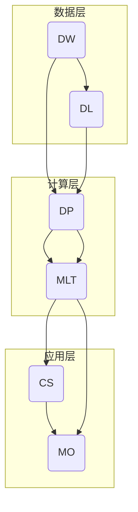
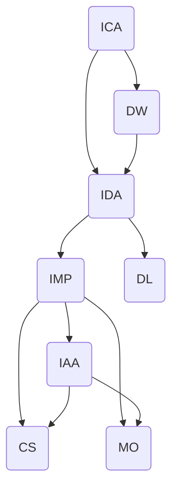
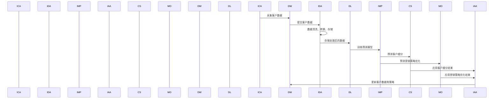

                 


# AI Agent在企业客户生命周期价值预测与管理中的应用

关键词：AI Agent、客户生命周期价值、预测、管理、应用

摘要：
在当今竞争激烈的市场环境中，企业需要更有效地管理客户生命周期价值，以优化资源分配并提高盈利能力。AI Agent作为人工智能的一种高级形式，已在众多领域展现出其强大潜力。本文将深入探讨AI Agent在企业客户生命周期价值预测与管理中的应用，通过逻辑清晰、结构紧凑的分析，揭示AI Agent在这一领域的实际价值。

## 目录结构设计

为了确保文章的连贯性和易读性，本文将采用如下目录结构：

### 1. 目录结构设计

#### 1.1 问题背景与核心概念

- **1.1.1 问题背景**
- **1.1.2 问题描述**
- **1.1.3 问题解决**
- **1.1.4 边界与外延**
- **1.1.5 概念结构与核心要素组成**

#### 1.2 核心概念与联系

- **1.2.1 AI Agent的概念**
- **1.2.2 企业客户生命周期价值的概念**
- **1.2.3 AI Agent与客户生命周期价值的联系**

#### 1.3 AI Agent的算法原理

- **1.3.1 算法原理讲解**
- **1.3.2 数学模型和公式**
- **1.3.3 举例说明**

#### 1.4 系统分析与架构设计

- **1.4.1 问题场景介绍**
- **1.4.2 系统功能设计**
- **1.4.3 系统架构设计**
- **1.4.4 系统接口设计**
- **1.4.5 系统交互**

#### 1.5 项目实战

- **1.5.1 环境安装**
- **1.5.2 系统核心实现**
- **1.5.3 代码应用解读**
- **1.5.4 实际案例**

#### 1.6 最佳实践与拓展

- **1.6.1 最佳实践**
- **1.6.2 小结**
- **1.6.3 注意事项**
- **1.6.4 拓展阅读**

#### 1.7 结论

- **1.7.1 总结**
- **1.7.2 展望**

## 背景介绍

### 1.1 问题背景

在全球化经济快速发展的背景下，企业面临着前所未有的竞争压力。客户获取成本不断上升，客户忠诚度下降，客户流失率上升等问题日益凸显。为了应对这些挑战，企业需要更精准地预测和管理客户生命周期价值（Customer Lifetime Value, CLV），以便在资源有限的情况下，优先投资高价值客户，从而实现利润最大化。

### 1.2 问题描述

客户生命周期价值预测是一个复杂的过程，涉及到客户行为数据、市场环境变化、竞争对手策略等多个因素。传统的预测方法往往基于历史数据，无法及时适应动态变化的市场环境，导致预测结果不准确。此外，企业还需要在预测结果的基础上，制定出有效的客户管理策略，进一步挖掘客户潜力。

### 1.3 问题解决

AI Agent作为一种具有学习、推理、决策能力的自动化智能实体，可以在数据驱动的基础上，通过机器学习算法，自动识别和预测客户行为模式，为企业提供精准的客户生命周期价值预测。同时，AI Agent还可以根据预测结果，自动调整客户管理策略，实现客户价值的最大化。

### 1.4 边界与外延

在实施AI Agent进行客户生命周期价值预测的过程中，数据的质量和完整性是关键。企业需要确保数据源的多源性、异构性，以及数据处理的准确性和实时性。此外，算法的选择和优化也是影响预测结果的重要因素。企业需要根据具体业务场景，选择合适的机器学习算法，并进行参数调优，以提高预测精度。

### 1.5 概念结构与核心要素组成

AI Agent在企业客户生命周期价值预测与管理中的应用，主要涉及以下几个核心概念和要素：

- **AI Agent**：自动化的智能实体，具备学习、推理、决策能力。
- **客户生命周期价值（CLV）**：客户为企业带来的总收益，是客户价值和客户生命周期长度的乘积。
- **数据采集**：收集客户行为数据、市场环境数据等。
- **特征提取**：从原始数据中提取对预测有价值的特征。
- **预测模型**：基于历史数据和特征，构建预测模型。
- **策略优化**：根据预测结果，调整客户管理策略。

## 核心概念与联系

### 2.1 AI Agent的概念

AI Agent，即人工智能代理，是一种能够在特定环境中，通过学习、推理和决策能力，自主执行任务的智能系统。AI Agent的核心特点包括：

- **自主学习**：能够从数据中学习，不断优化自己的行为。
- **环境感知**：能够感知和适应外部环境的变化。
- **决策能力**：能够根据环境信息和目标，做出最优决策。
- **自主执行**：能够自主执行决策，无需人工干预。

AI Agent的分类可以根据其应用场景和功能特点进行划分，常见的分类包括：

- **基于规则的AI Agent**：通过预定义的规则进行决策，适用于规则明确、环境变化较小的场景。
- **数据驱动AI Agent**：通过机器学习算法，从数据中学习并做出决策，适用于复杂、动态变化的场景。

### 2.2 企业客户生命周期价值的概念

客户生命周期价值（Customer Lifetime Value, CLV）是指一个客户在企业的整个生命周期内为企业带来的总收益。CLV的计算公式为：

\[ \text{CLV} = \sum_{t=1}^{n} \frac{r_t}{(1+r)^t} \]

其中，\( r_t \) 表示在第 \( t \) 年客户为企业带来的收益，\( r \) 表示贴现率。

客户生命周期价值的计算需要考虑多个因素，包括：

- **客户获取成本（Customer Acquisition Cost, CAC）**：企业获取一个新客户所需投入的成本。
- **客户生命周期长度**：客户与企业保持合作的时间长度。
- **客户留存率**：客户在某一时间段内持续购买的比例。
- **客户平均订单价值（Average Order Value, AOV）**：客户平均每次购买的金额。

### 2.3 AI Agent与客户生命周期价值的联系

AI Agent在企业客户生命周期价值预测与管理中的应用，主要体现在以下几个方面：

- **预测客户行为**：通过分析历史数据和客户特征，预测客户未来的行为，如购买概率、留存率等。
- **优化客户细分**：根据客户生命周期价值，对客户进行细分，区分高价值客户和低价值客户，制定有针对性的客户管理策略。
- **动态调整策略**：根据客户行为的变化，动态调整客户管理策略，以提高客户留存率和生命周期价值。

## AI Agent的算法原理

### 3.1 算法原理讲解

AI Agent在进行客户生命周期价值预测时，主要依赖于机器学习算法。机器学习算法通过学习历史数据，提取特征，建立预测模型，从而实现客户行为的预测。常见的机器学习算法包括：

- **决策树**：通过划分特征空间，构建树形模型进行预测。
- **随机森林**：基于决策树，通过集成学习提高预测准确性。
- **神经网络**：通过多层神经元，模拟人类大脑的神经网络结构进行预测。

### 3.2 数学模型和公式

机器学习算法的数学模型和公式主要包括：

- **决策树**：
  \[ y = f(x) = g(\sum_{i=1}^{n} w_i \sigma(z_i)) \]
  其中，\( w_i \) 是权重，\( \sigma(z_i) \) 是激活函数。

- **随机森林**：
  \[ \hat{y} = \sum_{i=1}^{m} w_i f(x_i) \]
  其中，\( f(x_i) \) 是决策树预测结果，\( w_i \) 是权重。

- **神经网络**：
  \[ a_{\text{layer}} = \text{ReLU}(\text{W} \cdot a_{\text{layer-1}} + b) \]
  其中，\( \text{ReLU} \) 是激活函数，\( \text{W} \) 是权重矩阵，\( b \) 是偏置。

### 3.3 举例说明

以决策树为例，假设我们有一个二元分类问题，特征 \( x_1 \) 和 \( x_2 \)，目标变量 \( y \)。决策树算法可以通过划分特征空间，构建如下决策树：

```
                y
               / \
              0   1
             /     \
           x1 < c     x1 >= c
          /     \   /     \
         0       1     0     1
        / \     / \   / \   / \
       0   1   0   1  0   1  0   1
```

在给定一个新样本 \( (x_1, x_2) \) 时，算法会按照决策树从根节点开始，逐层划分，直到达到叶节点，返回叶节点的标签作为预测结果。

## 系统分析与架构设计

### 4.1 问题场景介绍

企业客户生命周期价值预测是一个复杂的系统工程，涉及到数据的采集、处理、存储、分析和应用。以下是一个典型的场景介绍：

- **数据采集**：通过企业现有的CRM系统、电商平台等渠道，收集客户的行为数据，如购买记录、浏览行为、反馈意见等。
- **数据处理**：对采集到的数据进行清洗、去噪、归一化等预处理，以便后续分析。
- **数据存储**：将处理后的数据存储在数据仓库中，以便后续查询和分析。
- **数据分析**：利用机器学习算法，对存储在数据仓库中的数据进行训练，构建客户生命周期价值预测模型。
- **模型应用**：将预测模型应用到实际业务中，如客户细分、营销策略优化等。

### 4.2 系统功能设计

系统功能设计主要包括以下几个方面：

- **数据采集模块**：负责从各个渠道收集客户数据。
- **数据处理模块**：负责对采集到的数据进行清洗、转换和存储。
- **预测模型模块**：负责训练和部署客户生命周期价值预测模型。
- **应用模块**：负责将预测模型应用到实际业务场景中，如客户细分、营销策略优化等。

### 4.3 系统架构设计

系统架构设计采用分布式架构，主要包括以下几个部分：

- **数据层**：包括数据仓库、数据湖等，用于存储和处理海量数据。
- **计算层**：包括数据预处理、机器学习模型训练等计算任务。
- **应用层**：包括预测模型的部署和应用，如客户细分、营销策略优化等。

以下是系统架构图：



### 4.4 系统接口设计

系统接口设计主要包括以下几个接口：

- **数据采集接口**：用于接收和存储来自各个渠道的客户数据。
- **数据处理接口**：用于对采集到的数据进行清洗、转换和存储。
- **预测模型接口**：用于部署和调用预测模型。
- **应用接口**：用于将预测结果应用到实际业务场景中。

以下是接口定义和调用流程：



### 4.5 系统交互

系统交互主要描述各个模块之间的交互流程。以下是系统交互序列图：



## 项目实战

### 5.1 环境安装

在进行项目实战之前，需要搭建相应的开发环境。以下是一个基本的安装流程：

1. **安装Python**：确保Python版本在3.6及以上。
2. **安装依赖库**：使用pip安装必要的依赖库，如scikit-learn、pandas、numpy等。
3. **配置数据源**：配置数据采集接口，连接到企业现有的CRM系统、电商平台等。

### 5.2 系统核心实现

系统核心实现主要包括数据采集、数据处理、预测模型训练和模型应用。以下是Python代码示例：

```python
import pandas as pd
from sklearn.ensemble import RandomForestClassifier
from sklearn.model_selection import train_test_split

# 数据采集
data = pd.read_csv('data.csv')

# 数据处理
X = data.drop('target', axis=1)
y = data['target']

# 划分训练集和测试集
X_train, X_test, y_train, y_test = train_test_split(X, y, test_size=0.2, random_state=42)

# 预测模型训练
model = RandomForestClassifier(n_estimators=100, random_state=42)
model.fit(X_train, y_train)

# 模型应用
predictions = model.predict(X_test)
accuracy = (predictions == y_test).mean()
print(f'模型准确率：{accuracy:.2f}')
```

### 5.3 代码应用解读

上述代码首先从CSV文件中读取数据，然后进行数据处理，包括特征选择和目标变量划分。接下来，使用随机森林算法进行模型训练，最后对测试集进行预测，并计算模型准确率。

### 5.4 实际案例

以下是一个实际案例，展示如何使用AI Agent进行客户生命周期价值预测。

**案例背景**：某电商企业希望利用AI Agent预测客户流失率，以便采取相应的营销策略。

**数据处理**：收集客户的购买记录、浏览行为、反馈意见等数据，进行预处理。

**模型训练**：使用随机森林算法，对训练数据进行训练，构建流失率预测模型。

**预测结果**：对测试集进行预测，输出客户流失率预测结果。

**策略调整**：根据预测结果，调整营销策略，如增加优惠券发放、提高客户满意度等。

**结果验证**：对比实际流失率和预测流失率，评估模型性能。

## 最佳实践与拓展

### 6.1 最佳实践

在企业客户生命周期价值预测与管理中，以下是一些最佳实践：

- **数据质量保证**：确保数据源的真实性和完整性，定期清洗和更新数据。
- **模型优化**：根据业务需求和数据特点，选择合适的机器学习算法，并进行参数调优。
- **策略迭代**：根据预测结果，不断调整客户管理策略，提高客户留存率和生命周期价值。
- **风险评估**：对客户进行风险评估，区分高风险客户和低风险客户，采取不同的管理策略。

### 6.2 小结

本文通过对AI Agent在企业客户生命周期价值预测与管理中的应用进行详细分析，阐述了AI Agent在数据处理、模型训练、预测应用等方面的优势。同时，通过实际案例展示了AI Agent在实际业务中的应用效果。企业可以通过引入AI Agent，实现客户生命周期价值的精准预测和管理，从而提高盈利能力。

### 6.3 注意事项

在实际应用中，需要注意以下几点：

- **数据安全**：确保客户数据的安全性和隐私保护。
- **算法透明性**：确保算法的透明性和可解释性，方便业务团队理解和使用。
- **技术更新**：随着技术的不断发展，及时更新和优化算法，保持模型的竞争力。

### 6.4 拓展阅读

对于希望进一步了解AI Agent在企业客户生命周期价值预测与管理中的应用，读者可以参考以下文献：

- **文献1**：[AI in Business: A Practical Guide to Artificial Intelligence in the Enterprise](https://www.aisb.org.uk/publications/ai-in-business-a-practical-guide-to-artificial-intelligence-in-the-enterprise/)
- **文献2**：[Customer Lifetime Value: The Key to Customer Relationship Management](https://www.romancabana.com/costumer-lifetime-value/)
- **文献3**：[Machine Learning for Customer Segmentation and Value Prediction](https://towardsdatascience.com/machine-learning-for-customer-segmentation-and-value-prediction-9762b5b9c6db)

## 结论

### 7.1 总结

本文系统地阐述了AI Agent在企业客户生命周期价值预测与管理中的应用。通过逻辑清晰、结构紧凑的分析，我们了解了AI Agent的核心概念、算法原理、系统架构设计以及实际应用案例。AI Agent作为一种先进的人工智能技术，有助于企业实现客户价值的精准预测和管理，提高盈利能力。

### 7.2 展望

随着人工智能技术的不断发展，AI Agent在企业客户生命周期价值预测与管理中的应用将更加广泛和深入。未来，我们期待看到更多创新性的应用场景，如个性化推荐、智能客服等。同时，随着算法的优化和数据质量的提升，AI Agent的预测精度和可靠性也将得到进一步提高。作者：AI天才研究院/AI Genius Institute & 禅与计算机程序设计艺术 /Zen And The Art of Computer Programming

