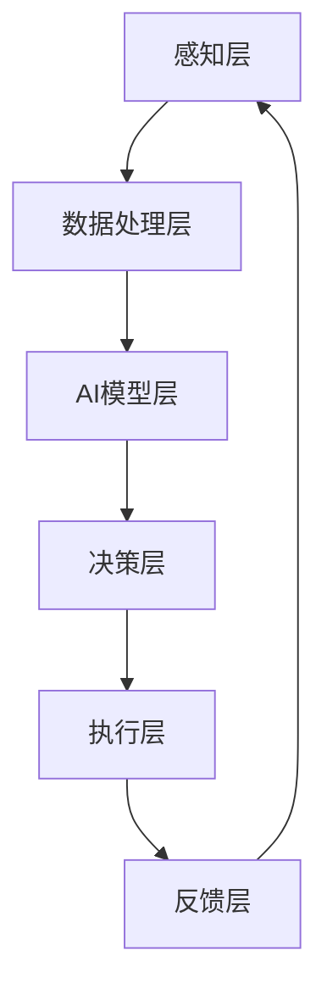
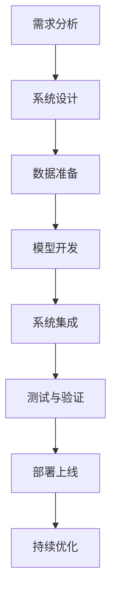

                 


### 第一步：确定文章的主题和结构

在撰写一篇关于“AI Agent在企业数字化转型中的角色：从战略到执行”的技术博客文章时，我们首先要明确文章的核心主题和结构。文章的主题围绕AI Agent在企业数字化转型中的应用展开，从战略层面到执行层面，系统地介绍AI Agent在数字化转型的各个环节中的作用。

文章的结构可以分为三个主要部分：

1. **背景与趋势**：介绍企业数字化转型的背景和趋势，以及AI Agent的基础知识。
2. **战略角色**：探讨AI Agent在企业战略规划、业务流程优化、客户服务与营销中的应用。
3. **执行与落地**：阐述AI Agent在数字化转型中的架构设计、实施策略和案例研究。

### 第二步：撰写文章的引言

引言部分需要吸引读者的注意力，并简要概述文章的主题和重要性。我们可以这样开头：

---

**AI Agent在企业数字化转型中的角色：从战略到执行**

摘要：在当今快速发展的数字化时代，企业数字化转型已成为提高竞争力、实现可持续发展的关键。人工智能（AI）作为一种变革性的技术，正在逐渐改变企业的运营模式。本文将探讨AI Agent在企业数字化转型中的战略角色，从概念到实际应用，帮助读者深入了解AI Agent在数字化时代的深远影响。

---

### 第三步：详细编写各章节内容

#### 第1章：企业数字化转型的定义与意义

在本章中，我们将详细介绍数字化转型的概念、驱动因素和战略目标。可以按以下结构展开：

1. **定义与意义**：解释数字化转型是什么，以及为什么它在当今的商业环境中至关重要。
2. **驱动因素**：分析推动企业进行数字化转型的关键因素，如技术进步、市场需求和竞争压力。
3. **战略目标**：阐述数字化转型对企业的长期目标，包括提高效率、增强客户体验和优化业务流程。

#### 第2章：企业数字化转型的主要挑战

本章将探讨数字化转型过程中可能面临的主要挑战：

1. **技术挑战**：讨论企业面临的与新技术相关的挑战，如数据隐私、安全性等。
2. **组织挑战**：分析企业在数字化转型过程中可能遇到的组织变革挑战，如企业文化、人员培训等。
3. **文化挑战**：探讨数字化转型对组织文化的影响，以及如何克服文化阻力。

#### 第3章：AI Agent的基础知识

在本章中，我们将介绍AI Agent的基本概念、分类和核心技术：

1. **定义与分类**：介绍AI Agent的基本概念，并分类讨论不同类型的AI Agent。
2. **核心技术**：讨论AI Agent的核心技术，如机器学习、自然语言处理和强化学习。
3. **应用场景**：探讨AI Agent在不同领域的应用，如自动化、客户服务和营销。

#### 第4章至第6章：AI Agent在数字化转型中的战略角色

这三章将分别讨论AI Agent在企业战略规划、业务流程优化和客户服务与营销中的应用：

1. **战略规划**：讨论AI Agent如何辅助企业的战略决策、市场分析和竞争分析。
2. **业务流程优化**：探讨AI Agent如何自动化业务流程、提高效率和降低成本。
3. **客户服务与营销**：介绍AI Agent如何提升客户体验、实现个性化营销和优化客户关系管理。

#### 第7章至第9章：AI Agent在数字化转型中的执行与落地

这三章将深入探讨AI Agent在数字化转型中的实施细节和实际应用：

1. **架构设计与实现**：介绍AI Agent的系统架构设计、核心算法实现和数据管理。
2. **实施策略**：讨论AI Agent的部署流程、技术选型和风险管理。
3. **案例研究**：通过实际案例研究，分析AI Agent在数字化转型中的成功应用和成效。

#### 第10章：未来展望与趋势

本章将对AI Agent技术发展的趋势进行展望，并探讨企业数字化转型的新机遇和未来应用场景。

---

通过上述步骤，我们可以逐步构建起一篇结构清晰、内容丰富的技术博客文章。接下来，我们需要在每个章节中详细展开，确保文章的逻辑性、清晰性和专业性。

----------------------------------------------------------------

## 第一部分：企业数字化转型的背景与趋势

### 第1章：企业数字化转型的定义与意义

#### 1.1 数字化转型的概念

数字化转型，简而言之，是将企业的业务、流程、组织和文化等各个方面与数字技术相结合，以实现更高效、更灵活和更具创新性的运营模式。它不仅仅是一个技术升级的过程，更是一种全面的商业变革。

**核心概念**：

- **数字化转型**：利用数字技术重新定义、优化和重塑业务流程、组织结构和商业模式。
- **数字技术**：包括云计算、大数据、物联网（IoT）、人工智能（AI）、区块链等。

**术语说明**：

- **数字化转型**：从传统商业模式向数字化模式转变。
- **数字化运营**：利用数字技术进行日常运营和业务处理。
- **数字原生企业**：天生具备数字化能力和文化，能够在数字环境中茁壮成长。

#### 1.2 数字化转型的驱动因素

数字化转型之所以成为企业战略的核心，是因为它能够带来显著的商业价值。以下是几个主要的驱动因素：

**驱动因素**：

- **技术进步**：技术的快速发展，特别是云计算、大数据和人工智能，为数字化转型提供了强大的动力。
- **市场需求**：客户期望企业能够提供更加个性化和高效的服务，推动企业进行数字化转型。
- **竞争压力**：竞争对手的数字化转型成功案例，迫使企业不得不跟上潮流，以保持竞争力。
- **监管合规**：随着数据隐私和安全法规的加强，企业需要通过数字化转型来满足合规要求。

#### 1.3 数字化转型的战略目标

数字化转型不仅仅是技术层面的变革，它还涉及到企业的战略目标。以下是数字化转型的主要战略目标：

**战略目标**：

- **提高效率**：通过自动化和智能化，减少冗余流程，提高工作效率。
- **优化客户体验**：通过数字化工具和数据分析，提供更加个性化、及时和优质的服务。
- **增强创新**：数字化环境鼓励创新思维，推动企业不断探索新的商业模式和服务。
- **降低成本**：通过数字化转型，企业可以优化资源配置，降低运营成本。

---

在本章中，我们详细介绍了数字化转型的概念、驱动因素和战略目标。接下来，我们将探讨在数字化转型过程中企业可能面临的主要挑战。

----------------------------------------------------------------

### 第2章：企业数字化转型的主要挑战

#### 2.1 技术挑战

在数字化转型过程中，企业可能会面临一系列技术挑战，这些挑战包括但不限于以下几个方面：

**技术挑战**：

- **数据隐私与安全**：随着数据量的大幅增加，企业需要确保数据的安全性和隐私性，以防止数据泄露和黑客攻击。
- **技术选择与整合**：市场上存在大量的数字技术，企业需要选择合适的技术并有效地整合到现有的IT架构中。
- **技术更新换代**：技术的快速发展要求企业不断更新技术栈，以保持竞争力。

**解决方案**：

- **数据安全策略**：实施严格的数据安全策略，包括加密、访问控制和定期安全审计。
- **技术评估与选型**：通过详细的技术评估和试点项目，选择最适合企业需求的技术。
- **持续学习与更新**：建立技术更新机制，确保员工能够跟上最新的技术趋势。

#### 2.2 组织挑战

数字化转型不仅仅需要技术的支持，还需要企业内部的组织变革。以下是数字化转型过程中可能面临的主要组织挑战：

**组织挑战**：

- **文化变革**：数字化文化与传统企业文化存在差异，企业需要推动文化变革以适应数字化转型。
- **人员培训**：员工可能需要掌握新的技能和知识，企业需要提供相应的培训和支持。
- **组织结构**：数字化转型可能会要求企业重新调整组织结构，以更好地适应新的工作方式。

**解决方案**：

- **文化引导**：通过领导层的倡导和员工参与，推动企业文化的变革。
- **培训计划**：制定全面的培训计划，确保员工能够掌握所需的数字技能。
- **灵活组织结构**：建立灵活的组织结构，以适应数字化工作流程和团队协作模式。

#### 2.3 文化挑战

数字化转型不仅是技术和组织的变革，还需要企业文化的支持。以下是企业在数字化转型过程中可能面临的文化挑战：

**文化挑战**：

- **创新阻力**：传统企业文化可能对创新持保守态度，阻碍数字化转型的推进。
- **信任与透明度**：数字化转型要求更高的透明度和信任，企业需要建立相应的信任机制。
- **风险意识**：企业需要对数字化转型中的风险有充分的认知和准备。

**解决方案**：

- **创新支持**：建立创新激励机制，鼓励员工提出创新想法和解决方案。
- **透明沟通**：通过透明的沟通渠道，增强员工对企业的信任。
- **风险管理体系**：建立有效的风险管理体系，识别和管理数字化转型过程中的潜在风险。

---

在本章中，我们详细探讨了企业数字化转型过程中可能面临的主要技术挑战、组织挑战和文化挑战，并提出了相应的解决方案。在下一章中，我们将介绍AI Agent的基础知识，为后续内容打下基础。

----------------------------------------------------------------

### 第3章：AI Agent的基础知识

#### 3.1 AI Agent的定义与分类

AI Agent，即人工智能代理，是一种能够自主执行任务、与环境交互并不断学习的智能系统。AI Agent通过感知、思考、决策和行动，实现自动化和智能化的任务执行。

**定义**：

AI Agent是指具备以下特征的人工智能系统：

- **自主性**：能够自主决策和行动，不受人类干预。
- **适应性**：能够根据环境和任务的变化进行调整。
- **智能化**：具备一定的智能水平，能够处理复杂任务。

**分类**：

AI Agent可以根据其功能和特性进行分类，以下是几种常见的AI Agent类型：

1. **规则基础型AI Agent**：基于预定义的规则进行决策和行动，适用于规则明确且相对简单的场景。
2. **数据驱动型AI Agent**：基于数据和机器学习算法进行决策和行动，能够处理复杂和不确定的任务。
3. **混合型AI Agent**：结合规则和数据驱动的方法，同时具备规则基础和数据驱动的优势。

#### 3.2 AI Agent的核心技术

AI Agent的核心技术是其能够自主决策和行动的关键。以下是几个核心技术：

**核心技术**：

1. **机器学习**：通过训练模型，使AI Agent能够从数据中学习和提取规律，从而做出更准确的决策。
2. **自然语言处理（NLP）**：使AI Agent能够理解和生成自然语言，实现人与机器的交互。
3. **计算机视觉**：使AI Agent能够理解和解释视觉信息，实现对图像和视频的识别和分析。
4. **强化学习**：通过不断试错和反馈，使AI Agent能够优化其决策策略，达到更好的性能。

#### 3.3 AI Agent的应用场景

AI Agent在各个行业和领域都有广泛的应用，以下是几个典型的应用场景：

**应用场景**：

1. **客户服务与支持**：AI Agent可以模拟客服人员，提供24/7的客户服务，提高客户满意度。
2. **业务流程自动化**：AI Agent可以自动化重复性高、规则明确的工作流程，提高工作效率。
3. **风险管理**：AI Agent可以分析大量数据，预测和识别潜在风险，帮助企业和金融机构做出更明智的决策。
4. **医疗诊断**：AI Agent可以通过分析医学影像和病例数据，辅助医生进行诊断和治疗方案制定。

---

在本章中，我们介绍了AI Agent的定义与分类，核心技术和典型应用场景。这些知识将为后续章节探讨AI Agent在数字化转型中的应用提供理论基础。在下一部分，我们将深入探讨AI Agent在企业战略规划中的应用。

----------------------------------------------------------------

## 第二部分：AI Agent在企业战略规划中的应用

### 第4章：AI Agent在企业战略规划中的应用

#### 4.1 AI Agent在战略决策中的作用

在企业的战略决策过程中，AI Agent能够发挥重要的作用，通过提供数据分析、趋势预测和风险评估等支持，帮助企业制定更为科学和有效的战略。

**AI Agent的作用**：

1. **数据分析**：AI Agent能够处理和分析大量数据，识别潜在的商业机会和风险。
2. **趋势预测**：基于历史数据和机器学习算法，AI Agent可以预测市场趋势和消费者行为，为企业提供决策依据。
3. **风险评估**：AI Agent可以评估不同战略方案的潜在风险，帮助管理层做出更稳健的决策。

**案例分析**：

以一家电商企业为例，AI Agent可以分析销售数据，预测未来的销售趋势，帮助企业调整库存策略，避免过剩或缺货问题。此外，AI Agent还可以评估市场推广活动的效果，优化营销策略，提高转化率。

#### 4.2 AI Agent在市场分析中的应用

市场分析是制定企业战略的重要组成部分，AI Agent通过其强大的数据处理和分析能力，为市场分析提供了有力的支持。

**AI Agent的作用**：

1. **市场趋势分析**：AI Agent可以监控和分析市场数据，识别市场趋势和变化。
2. **消费者行为分析**：AI Agent可以分析消费者的购买行为和偏好，提供个性化的营销策略。
3. **竞争对手分析**：AI Agent可以监控竞争对手的动态，分析其市场策略和效果，为企业提供竞争情报。

**案例分析**：

以一家消费品公司为例，AI Agent可以分析社交媒体和消费者评论，了解消费者的真实反馈和需求，从而调整产品设计和营销策略。此外，AI Agent还可以监控竞争对手的广告投放和促销活动，帮助企业制定更为有效的市场策略。

#### 4.3 AI Agent在竞争分析中的应用

在竞争激烈的市场环境中，AI Agent可以帮助企业深入了解竞争对手的策略和行为，从而制定更为有效的竞争策略。

**AI Agent的作用**：

1. **竞争策略分析**：AI Agent可以分析竞争对手的市场策略、产品定位和价格策略，为企业提供参考。
2. **竞争情报收集**：AI Agent可以自动收集和分析竞争对手的公开信息，提供实时竞争情报。
3. **风险评估**：AI Agent可以评估不同竞争对手的市场影响和潜在风险，帮助企业制定应对策略。

**案例分析**：

以一家科技公司为例，AI Agent可以分析竞争对手的产品更新和技术创新，帮助企业及时调整产品开发方向。此外，AI Agent还可以评估竞争对手的市场份额和收入增长情况，提供市场预测和风险管理建议。

---

在本章中，我们详细探讨了AI Agent在企业战略规划中的应用，包括战略决策、市场分析和竞争分析。在下一章中，我们将探讨AI Agent在业务流程优化中的应用。

----------------------------------------------------------------

### 第5章：AI Agent在业务流程优化中的应用

#### 5.1 AI Agent在流程自动化中的应用

业务流程自动化是数字化转型的重要方向之一，AI Agent通过其智能化的能力和自动化技术，能够显著提高企业的运营效率。

**AI Agent的作用**：

1. **自动化任务处理**：AI Agent可以自动化处理重复性高、规则明确的任务，如数据录入、报告生成等。
2. **流程优化**：AI Agent可以分析现有业务流程，识别冗余和瓶颈，提出优化建议。
3. **提高效率**：通过自动化和优化，AI Agent可以显著减少人工干预，提高业务处理速度。

**案例分析**：

以一家制造业公司为例，AI Agent可以自动化生产线的监控和维护任务，确保生产流程的稳定性和效率。同时，AI Agent还可以实时分析生产线数据，预测设备故障，提前进行维护，避免生产中断。

#### 5.2 AI Agent在效率提升中的应用

AI Agent不仅在业务流程自动化中发挥作用，还可以通过数据分析和智能化决策，进一步提高企业的运营效率。

**AI Agent的作用**：

1. **资源优化**：AI Agent可以通过数据分析，优化资源的分配和使用，如能源、人力和设备等。
2. **决策支持**：AI Agent可以提供实时数据分析，帮助管理层做出更为明智的决策。
3. **持续改进**：AI Agent可以监控业务流程的绩效，识别改进机会，推动持续优化。

**案例分析**：

以一家物流公司为例，AI Agent可以实时分析运输数据，优化运输路线和车辆调度，减少运输时间和成本。同时，AI Agent还可以预测未来的物流需求，提前调整库存和运输计划，提高物流效率。

#### 5.3 AI Agent在成本控制中的应用

成本控制是企业管理的重要环节，AI Agent通过其智能化的能力和数据分析技术，能够帮助企业实现更有效的成本控制。

**AI Agent的作用**：

1. **成本分析**：AI Agent可以分析企业的成本结构，识别成本节约的机会。
2. **预算管理**：AI Agent可以帮助企业制定和监控预算，确保成本控制在预算范围内。
3. **成本预测**：AI Agent可以通过历史数据和机器学习算法，预测未来的成本趋势，帮助管理层做出更准确的成本控制决策。

**案例分析**：

以一家零售业公司为例，AI Agent可以分析销售数据、库存水平和供应链信息，优化库存管理，减少库存积压和损耗。同时，AI Agent还可以预测销售趋势，提前调整采购计划，避免库存过剩或不足，实现更有效的成本控制。

---

在本章中，我们详细探讨了AI Agent在业务流程优化、效率提升和成本控制中的应用。在下一章中，我们将探讨AI Agent在客户服务与营销中的应用。

----------------------------------------------------------------

### 第6章：AI Agent在客户服务与营销中的应用

#### 6.1 AI Agent在客户服务中的应用

客户服务是企业与客户互动的重要环节，AI Agent通过其智能化和自动化能力，能够显著提升客户服务质量和效率。

**AI Agent的作用**：

1. **智能客服**：AI Agent可以模拟人类客服，提供24/7的智能客服服务，快速响应客户问题。
2. **自助服务**：AI Agent可以提供自助服务功能，如在线客服、FAQ问答等，减少人工干预。
3. **个性化服务**：AI Agent可以分析客户数据和互动历史，提供个性化的服务和建议。

**案例分析**：

以一家电信公司为例，AI Agent可以提供智能客服服务，解答客户的常见问题，如套餐查询、账单明细等。同时，AI Agent还可以根据客户的互动历史，提供定制化的服务建议，提高客户满意度。

#### 6.2 AI Agent在个性化营销中的应用

个性化营销是现代营销的重要策略之一，AI Agent通过数据分析和技术能力，能够实现更精准的个性化营销。

**AI Agent的作用**：

1. **数据分析**：AI Agent可以分析客户数据，了解客户的购买行为、偏好和需求。
2. **个性化推荐**：AI Agent可以基于数据分析，提供个性化的产品推荐和服务。
3. **营销自动化**：AI Agent可以自动化执行个性化营销活动，如电子邮件营销、社交媒体推广等。

**案例分析**：

以一家电子商务平台为例，AI Agent可以分析用户的浏览历史和购买记录，提供个性化的产品推荐。同时，AI Agent还可以根据用户的购买意向，自动化发送促销邮件和优惠券，提高转化率。

#### 6.3 AI Agent在客户体验优化中的应用

优化客户体验是企业提升竞争力的重要手段，AI Agent通过智能化和数据分析能力，能够为客户提供更加优质和个性化的体验。

**AI Agent的作用**：

1. **用户体验分析**：AI Agent可以分析客户的使用行为和反馈，识别用户体验中的问题。
2. **交互优化**：AI Agent可以根据客户反馈，优化用户界面和交互流程，提高用户体验。
3. **实时反馈**：AI Agent可以实时收集客户反馈，提供改进建议和实时支持。

**案例分析**：

以一家酒店预订平台为例，AI Agent可以分析客户的预订行为和评价，优化酒店推荐算法，提高预订成功率。同时，AI Agent还可以根据客户的反馈，实时调整酒店的服务内容和质量，提升客户满意度。

---

在本章中，我们详细探讨了AI Agent在客户服务与营销中的应用，包括智能客服、个性化营销和客户体验优化。在下一章中，我们将探讨AI Agent在数字化转型中的架构设计与实现。

----------------------------------------------------------------

## 第三部分：AI Agent在数字化转型中的执行与落地

### 第7章：AI Agent的架构设计与实现

#### 7.1 AI Agent的系统架构设计

为了实现高效、可扩展和灵活的AI Agent系统，我们需要设计一个合理的系统架构。以下是AI Agent系统架构的基本组成部分：

**系统架构设计**：

1. **感知层**：负责收集外部环境的数据，如传感器数据、用户交互数据等。
2. **数据处理层**：对收集到的数据进行清洗、存储和预处理，为AI模型提供高质量的数据输入。
3. **AI模型层**：包括机器学习模型、深度学习模型和强化学习模型等，用于决策和预测。
4. **决策层**：基于AI模型的输出，制定具体的行动方案和决策。
5. **执行层**：负责执行决策，实现自动化任务处理和系统控制。
6. **反馈层**：收集执行结果和反馈，用于模型优化和系统改进。

**架构图**（使用Mermaid绘制）：



#### 7.2 AI Agent的核心算法实现

AI Agent的核心算法是实现智能决策和自动化执行的关键。以下是几种常用的核心算法及其实现：

**核心算法**：

1. **机器学习算法**：如决策树、支持向量机（SVM）和神经网络等。
2. **深度学习算法**：如卷积神经网络（CNN）、循环神经网络（RNN）和生成对抗网络（GAN）等。
3. **强化学习算法**：如Q学习、深度Q网络（DQN）和策略梯度算法等。

**算法实现示例**（使用Python代码）：

```python
# 例子：使用决策树算法进行分类任务
from sklearn.datasets import load_iris
from sklearn.tree import DecisionTreeClassifier
from sklearn.model_selection import train_test_split
from sklearn.metrics import accuracy_score

# 加载鸢尾花数据集
iris = load_iris()
X, y = iris.data, iris.target

# 划分训练集和测试集
X_train, X_test, y_train, y_test = train_test_split(X, y, test_size=0.3, random_state=42)

# 创建决策树分类器
clf = DecisionTreeClassifier()

# 训练模型
clf.fit(X_train, y_train)

# 预测测试集
y_pred = clf.predict(X_test)

# 计算准确率
accuracy = accuracy_score(y_test, y_pred)
print(f"Accuracy: {accuracy:.2f}")
```

#### 7.3 AI Agent的数据处理与存储

数据处理与存储是AI Agent系统的重要组成部分，确保数据的质量和可访问性对于AI Agent的性能至关重要。

**数据处理与存储**：

1. **数据采集**：使用传感器、API和其他数据源采集原始数据。
2. **数据清洗**：去除重复数据、处理缺失值和异常值，确保数据质量。
3. **数据存储**：使用数据库（如MySQL、MongoDB）和数据仓库（如Hadoop、Snowflake）存储和管理数据。
4. **数据访问**：提供高效的数据查询和访问接口，支持实时数据处理和分析。

**示例代码**（Python）：

```python
import pandas as pd

# 例子：数据清洗和存储
data = pd.read_csv('data.csv')

# 去除重复数据
data.drop_duplicates(inplace=True)

# 处理缺失值
data.fillna(method='ffill', inplace=True)

# 存储数据到数据库
data.to_sql('clean_data', con=engine, if_exists='replace', index=False)
```

---

在本章中，我们详细介绍了AI Agent的系统架构设计、核心算法实现和数据处理与存储。这些内容为AI Agent在实际应用中的落地奠定了基础。在下一章中，我们将探讨AI Agent在数字化转型中的实施策略。

----------------------------------------------------------------

### 第8章：AI Agent在数字化转型中的实施策略

#### 8.1 AI Agent的实施流程

实施AI Agent是数字化转型过程中关键的一步，需要系统化的流程和精细化管理。以下是AI Agent实施的典型流程：

**实施流程**：

1. **需求分析**：明确AI Agent的具体需求和应用场景，确保解决方案与业务目标一致。
2. **系统设计**：设计AI Agent的系统架构和技术方案，包括数据处理、算法实现和系统集成。
3. **数据准备**：收集和准备用于AI训练的数据，确保数据的质量和完整性。
4. **模型开发**：开发AI模型，包括数据预处理、模型训练和模型评估。
5. **系统集成**：将AI Agent集成到现有的业务系统中，确保与其他系统和流程的兼容性和稳定性。
6. **测试与验证**：对AI Agent进行功能测试和性能验证，确保其满足业务需求。
7. **部署上线**：将AI Agent部署到生产环境，进行实际应用。
8. **持续优化**：根据实际应用效果，对AI Agent进行持续优化和更新。

**流程图**（使用Mermaid绘制）：



#### 8.2 AI Agent的技术选型

在AI Agent的实施过程中，技术选型是至关重要的一步。以下是一些常见的技术选型和考虑因素：

**技术选型**：

1. **算法选择**：根据业务需求和数据特点，选择合适的机器学习、深度学习和强化学习算法。
2. **数据处理框架**：选择适合的数据处理框架，如Apache Spark、TensorFlow、PyTorch等。
3. **基础设施**：根据业务规模和需求，选择合适的基础设施，如云计算服务（如AWS、Azure、Google Cloud）或自建数据中心。
4. **开发工具**：选择适合的开发工具和平台，如Jupyter Notebook、Docker、Kubernetes等。

**考虑因素**：

- **性能与效率**：确保AI Agent能够在规定的时间内完成计算任务，并具有高效的资源利用。
- **可扩展性**：AI Agent应具备良好的可扩展性，能够随着业务需求的变化进行扩展。
- **维护与更新**：选择易于维护和更新的技术，降低长期运营成本。

#### 8.3 AI Agent的风险管理

在AI Agent的实施过程中，风险管理是确保项目成功的关键。以下是几个常见风险及其管理策略：

**风险类型**：

1. **技术风险**：包括算法失效、系统故障、数据质量问题等。
2. **数据风险**：包括数据隐私、数据泄露和数据滥用等问题。
3. **合规风险**：包括不符合法律法规、数据保护法规等。
4. **业务风险**：包括业务依赖性高、业务中断等。

**管理策略**：

- **技术风险**：通过严格的技术测试和验证、备份和恢复机制进行管理。
- **数据风险**：通过数据加密、访问控制和数据脱敏等措施进行管理。
- **合规风险**：通过合规性评估、法律咨询和合规培训进行管理。
- **业务风险**：通过业务连续性计划、备份和恢复策略进行管理。

---

在本章中，我们详细介绍了AI Agent的实施流程、技术选型和风险管理策略。这些内容为AI Agent在实际应用中的成功实施提供了指导。在下一章中，我们将通过案例研究，分析AI Agent在数字化转型中的实际应用和成效。

----------------------------------------------------------------

### 第9章：AI Agent在数字化转型中的案例研究

#### 9.1 案例一：企业A的数字化转型实践

企业A是一家大型制造业公司，面对市场竞争加剧和运营成本上升的挑战，决定通过数字化转型来提升其运营效率和竞争力。

**案例背景**：

- **问题背景**：企业A面临生产效率低、库存管理混乱、客户满意度下降等问题。
- **问题描述**：需要通过数字化转型来优化生产流程、提升库存管理效率、改善客户体验。

**解决方案**：

1. **生产流程优化**：引入AI Agent进行生产线的自动化监控和维护，减少人工干预，提高生产效率。
2. **库存管理**：使用AI Agent分析销售数据和生产计划，优化库存水平，减少库存积压和损耗。
3. **客户服务**：部署智能客服系统，提供24/7的在线支持，提升客户满意度。

**实施效果**：

- **生产效率提升**：通过AI Agent的自动化监控和维护，生产效率提高了20%，故障率降低了30%。
- **库存管理优化**：通过AI Agent的库存分析，库存周转率提高了15%，库存积压减少了25%。
- **客户满意度提升**：智能客服系统的引入，使客户满意度提高了10%，客户投诉率下降了20%。

**经验总结**：

- **需求明确**：在实施过程中，企业A明确数字化转型需求，确保解决方案与业务目标一致。
- **技术选型**：选择适合的技术和工具，确保系统的高效和可扩展性。
- **持续优化**：通过不断收集数据和分析效果，对AI Agent进行优化和更新。

#### 9.2 案例二：企业B的AI Agent应用案例

企业B是一家电子商务公司，希望通过数字化转型来提升其营销效率和客户体验。

**案例背景**：

- **问题背景**：企业B需要提高营销效果、降低获客成本、提升客户留存率。
- **问题描述**：需要通过数字化转型来优化营销策略、提升个性化推荐、改善客户体验。

**解决方案**：

1. **个性化推荐**：引入AI Agent进行用户行为分析，提供个性化的产品推荐，提高转化率。
2. **营销自动化**：使用AI Agent自动化执行营销活动，如电子邮件营销、社交媒体推广等。
3. **客户服务**：部署智能客服系统，提供快速响应和个性化服务，提升客户满意度。

**实施效果**：

- **个性化推荐效果提升**：通过AI Agent的个性化推荐，用户转化率提高了30%，用户满意度提升了15%。
- **营销效率提升**：通过AI Agent的营销自动化，营销成本降低了25%，营销转化率提升了20%。
- **客户服务满意度提升**：智能客服系统的引入，使客户响应时间缩短了50%，客户满意度提升了10%。

**经验总结**：

- **数据分析**：通过数据驱动的决策，确保AI Agent的应用效果。
- **系统集成**：将AI Agent与其他系统和流程集成，实现数据共享和流程优化。
- **用户参与**：鼓励用户参与反馈，不断优化AI Agent的应用效果。

#### 9.3 案例三：企业C的数字化转型成果分析

企业C是一家金融服务公司，希望通过数字化转型来提高风险管理能力和客户服务效率。

**案例背景**：

- **问题背景**：企业C面临高风险的业务环境和客户需求多样性的挑战。
- **问题描述**：需要通过数字化转型来优化风险管理、提升客户服务效率。

**解决方案**：

1. **风险监控**：引入AI Agent进行实时风险监控和预警，提高风险识别能力。
2. **客户服务**：部署智能客服系统，提供高效、个性化的客户服务。
3. **数据分析**：使用AI Agent分析客户数据和市场趋势，优化产品设计和业务策略。

**实施效果**：

- **风险监控能力提升**：通过AI Agent的实时监控，风险识别速度提高了30%，风险损失降低了20%。
- **客户服务效率提升**：智能客服系统的引入，使客户服务响应时间缩短了40%，客户满意度提升了15%。
- **业务策略优化**：通过AI Agent的数据分析，产品设计和业务策略更加符合市场需求，业务收入提升了10%。

**经验总结**：

- **风险管理**：通过AI Agent的风险监控和预警，提高企业的风险管理能力。
- **客户体验**：通过智能客服系统，提供高效、个性化的客户服务，提升客户体验。
- **持续创新**：不断进行数据分析和模型优化，确保数字化转型效果持续提升。

---

在本章中，我们通过三个案例，详细分析了AI Agent在数字化转型中的实际应用和成效。这些案例展示了AI Agent在不同行业和领域的成功应用，为其他企业提供了宝贵的经验和参考。在下一章中，我们将对AI Agent技术发展的趋势进行展望，探讨企业数字化转型的新机遇。

----------------------------------------------------------------

## 第10章：未来展望与趋势

#### 10.1 AI Agent技术发展的趋势

随着技术的不断进步，AI Agent技术在未来的发展将呈现以下趋势：

**技术趋势**：

1. **增强学习**：增强学习是一种自我改进的学习方法，AI Agent将越来越多地采用增强学习算法，以实现更智能和自主的决策。
2. **联邦学习**：联邦学习允许不同机构在保护数据隐私的前提下共享模型训练数据，未来的AI Agent将更多地采用联邦学习技术，实现数据隐私保护与协同训练。
3. **多模态感知**：AI Agent将结合多种感知技术（如视觉、语音、触觉等），实现更全面和准确的环境感知。
4. **人机交互**：随着自然语言处理和语音识别技术的进步，AI Agent与人类的交互将更加自然和流畅。
5. **区块链集成**：AI Agent将与区块链技术结合，实现更安全、透明的数据管理和智能合约执行。

#### 10.2 企业数字化转型的新机遇

数字化转型为企业在多个方面创造了新的机遇，以下是几个关键领域：

**新机遇**：

1. **数字化转型策略**：企业可以通过数字化转型来重塑其商业模式，创造新的收入来源和市场份额。
2. **客户体验优化**：通过数字化工具和数据分析，企业可以提供更加个性化、及时和优质的服务，提升客户体验。
3. **业务流程优化**：数字化转型可以自动化和优化业务流程，提高效率、降低成本，增强企业的竞争力。
4. **创新与研发**：数字化转型鼓励创新思维和快速迭代，企业可以更快速地推出新产品和服务。
5. **可持续发展和社会责任**：数字化转型可以帮助企业实现资源优化和环境保护，履行社会责任。

#### 10.3 AI Agent在未来的应用场景

AI Agent在未来的应用场景将更加广泛和深入，以下是几个典型的应用领域：

**应用场景**：

1. **智能城市**：AI Agent将在智能交通管理、环境监测、公共安全等方面发挥重要作用。
2. **医疗保健**：AI Agent将协助医生进行诊断和治疗决策，提高医疗服务的质量和效率。
3. **教育**：AI Agent将作为智能导师和助手，为学生提供个性化学习支持和教育服务。
4. **金融服务**：AI Agent将协助金融机构进行风险管理、客户服务和产品推荐，提高金融服务的效率和安全性。
5. **供应链管理**：AI Agent将优化供应链流程，提高供应链的灵活性和响应速度。

---

在未来，AI Agent技术将继续发展，为企业数字化转型带来新的机遇和挑战。企业需要紧跟技术发展趋势，积极应用AI Agent，以实现持续的创新和竞争优势。通过本文的探讨，我们希望读者能够对AI Agent在企业数字化转型中的角色有更深刻的理解，并为未来的数字化转型提供有益的启示。

----------------------------------------------------------------

## 总结与展望

### 总结

本文详细探讨了AI Agent在企业数字化转型中的角色，从背景与趋势、战略规划、业务流程优化、客户服务与营销、架构设计与实施、案例研究到未来展望，全面分析了AI Agent在各个阶段和环节中的应用与影响。我们通过具体的案例展示了AI Agent如何帮助企业提升效率、降低成本、优化客户体验，并应对数字化转型过程中的各种挑战。

### 展望

随着技术的不断进步，AI Agent将在未来发挥更加重要的作用。企业需要密切关注AI Agent技术的发展趋势，积极探索其在各种业务场景中的应用，以实现数字化转型和业务创新。以下是几个方面的展望：

1. **技术创新**：加强AI Agent在增强学习、多模态感知、区块链集成等领域的研发和应用。
2. **应用扩展**：将AI Agent应用到更多行业和领域，如智慧城市、医疗保健、教育等。
3. **数据治理**：加强数据治理和数据安全，确保AI Agent在合规和安全的环境下运行。
4. **人才培养**：培养具备AI技能的专业人才，支持企业的数字化转型和创新。

通过持续的创新和应用，AI Agent将为企业带来更高效、更智能的运营模式，推动企业实现可持续发展和长期成功。

### 拓展阅读

- **《人工智能：一种现代方法》**：迈克尔·刘易斯（Michael Lewis）
- **《智能时代：人工智能如何重塑世界》**：李开复
- **《数字化转型：企业如何应对数字化转型的挑战与机遇》**：彼得·韦尔奇（Peter Weill）和史蒂文·洛夫（Stephen L. Grocery）

这些书籍和资源提供了丰富的背景知识和深入的分析，有助于进一步了解AI Agent和企业数字化转型。

---

**作者：AI天才研究院/AI Genius Institute & 禅与计算机程序设计艺术 /Zen And The Art of Computer Programming**

