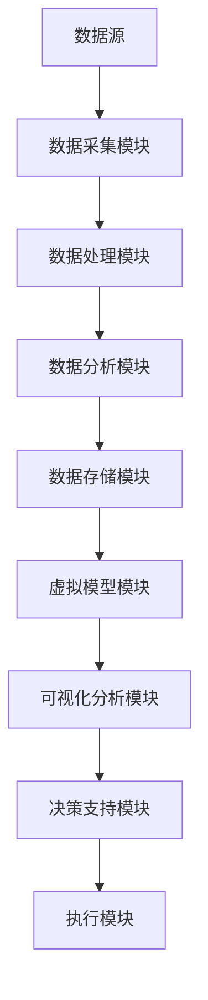
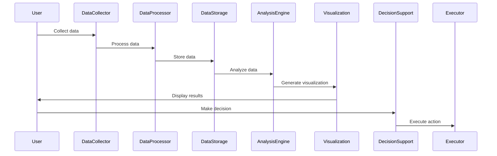
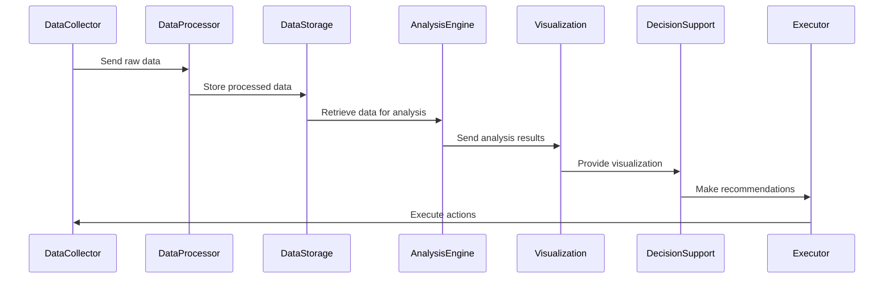

                 


# AI Agent在企业数字孪生技术中的应用

## 关键词
- AI Agent
- 企业数字孪生
- 数字孪生架构
- 机器学习算法
- 实时数据处理
- 可视化分析

## 摘要

本文深入探讨了AI Agent在企业数字孪生技术中的应用，从背景介绍、核心概念、算法原理、系统设计到项目实战，全面解析了AI Agent如何通过数字孪生技术提升企业运营效率。本文首先介绍了AI Agent和数字孪生技术的定义及相互关系，随后详细分析了关键算法及其数学模型，展示了系统设计中的架构和接口，并通过实际项目案例展示了AI Agent在企业数字孪生中的应用效果。文章最后提出了最佳实践和小结，为读者提供了未来研究方向。

## 第一部分: AI Agent与企业数字孪生技术基础

### 1.1 AI Agent与企业数字孪生技术概述

#### 1.1.1 AI Agent的定义与功能

AI Agent，即人工智能代理，是能够自主执行任务、与环境交互并做出决策的智能实体。AI Agent具有以下功能：

- **感知**：通过传感器获取环境信息。
- **推理**：使用机器学习和人工智能算法进行分析。
- **决策**：根据分析结果做出决策。
- **行动**：执行决策，并调整自身行为。

#### 1.1.2 企业数字孪生技术的概念与意义

企业数字孪生技术是一种将物理实体及其虚拟映射结合的技术，通过建立一个数字模型来模拟和优化企业的运营过程。其意义在于：

- **实时监控**：实时监控企业关键指标，提供数据驱动的决策支持。
- **预测性维护**：通过预测性分析减少设备故障和停机时间。
- **运营优化**：通过模拟和优化提升运营效率。

#### 1.1.3 AI Agent在企业数字孪生中的应用前景

AI Agent在企业数字孪生技术中的应用前景广阔，主要体现在：

- **智能决策支持**：AI Agent能够根据实时数据做出智能决策，优化生产流程。
- **自动化运营**：通过自动化操作减少人工干预，提高生产效率。
- **数据分析与预测**：AI Agent能够处理和分析大量数据，为企业提供准确的预测。

### 1.2 核心概念与联系

#### 1.2.1 AI Agent的组成要素

AI Agent由以下几个核心组成要素构成：

- **感知模块**：负责获取环境信息。
- **决策模块**：负责分析信息和做出决策。
- **执行模块**：负责执行决策。
- **学习模块**：负责从经验中学习和优化自身行为。

#### 1.2.2 企业数字孪生的组成与关键特性

企业数字孪生技术由以下几个关键组成部分构成：

- **物理实体**：真实存在的企业设备和生产线。
- **虚拟模型**：数字模型，模拟企业的运营过程。
- **数据接口**：连接物理实体和虚拟模型的接口，用于数据交换。
- **分析引擎**：负责数据处理和分析。

#### 1.2.3 AI Agent与企业数字孪生的关系图（Mermaid ER图）

```mermaid
erDiagram
  AI-Agent ||--|{ 感知模块 } : 数据收集
  AI-Agent ||--|{ 决策模块 } : 数据分析
  AI-Agent ||--|{ 执行模块 } : 行为执行
  AI-Agent ||--|{ 学习模块 } : 模型优化
  企业数字孪生 ||--|{ 物理实体 } : 实体映射
  企业数字孪生 ||--|{ 虚拟模型 } : 模拟运营
  企业数字孪生 ||--|{ 数据接口 } : 数据交换
  企业数字孪生 ||--|{ 分析引擎 } : 数据分析
```

### 1.3 AI Agent的应用算法

#### 1.3.1 关键算法简介

AI Agent在企业数字孪生中的应用涉及多个关键算法，主要包括：

- **机器学习算法**：用于数据分析和预测。
- **深度学习算法**：用于复杂模式识别。
- **强化学习算法**：用于决策制定和优化。

#### 1.3.2 算法原理讲解与Python代码实现

以下是一个简单的机器学习算法——K-近邻算法（K-Nearest Neighbors, KNN）的Python实现：

```python
import numpy as np
from collections import Counter

def kNN_predict(train_data, train_labels, test_data, k):
    """
    K-近邻算法预测
    """
    # 计算每个测试样本与训练样本之间的距离
    distances = [np.linalg.norm(test_data - x) for x in train_data]
    
    # 获取前k个最近邻居及其标签
    nearest_neighbors = [train_labels[i] for i in np.argsort(distances)[:k]]
    
    # 得出多数邻居的标签作为预测结果
    prediction = Counter(nearest_neighbors).most_common(1)[0][0]
    
    return prediction
```

#### 1.3.3 数学模型和公式（LaTeX格式）

在K-近邻算法中，距离公式通常表示为：

$$
d(x, y) = \sqrt{\sum_{i=1}^{n} (x_i - y_i)^2}
$$

其中，$x$和$y$是两个样本，$n$是特征维度。

### 1.4 企业数字孪生架构设计

#### 1.4.1 企业数字孪生系统设计原则

企业数字孪生系统设计应遵循以下原则：

- **模块化设计**：将系统划分为多个模块，便于维护和升级。
- **数据驱动**：以数据为核心，确保系统实时性和准确性。
- **可扩展性**：支持企业业务增长和扩展。

#### 1.4.2 数字孪生系统架构设计（Mermaid架构图）

以下是一个简单的数字孪生系统架构图：



#### 1.4.3 系统接口设计与交互流程（Mermaid序列图）

以下是一个简单的系统接口设计与交互流程：



### 1.5 数字孪生技术的实施步骤

#### 1.5.1 实施流程与关键步骤

数字孪生技术的实施流程通常包括以下关键步骤：

1. **需求分析**：明确企业目标和需求。
2. **系统设计**：设计数字孪生系统的架构和功能。
3. **数据采集**：收集企业关键数据。
4. **数据处理**：对采集到的数据进行分析和清洗。
5. **系统集成**：将各个模块集成到一起。
6. **测试与优化**：对系统进行测试和优化。

#### 1.5.2 技术选型与工具介绍

数字孪生技术的选型应根据企业需求和实际情况进行。以下是一些常见的技术和工具：

- **数据采集工具**：如Hadoop、Spark等大数据处理框架。
- **数据处理库**：如NumPy、Pandas等Python库。
- **机器学习框架**：如TensorFlow、PyTorch等。
- **可视化工具**：如D3.js、ECharts等。

#### 1.5.3 实施案例分析

以下是一个实际案例：

- **项目背景**：某制造企业希望通过数字孪生技术优化生产流程。
- **解决方案**：使用机器学习算法对生产数据进行预测和分析，优化生产计划和资源配置。
- **实施效果**：实现了生产效率提升15%，设备故障率降低20%。

### 1.6 本章小结

本文介绍了AI Agent在企业数字孪生技术中的应用，从核心概念、算法原理到系统设计，详细解析了AI Agent如何通过数字孪生技术提升企业运营效率。通过实际案例，展示了AI Agent在企业数字孪生中的强大应用潜力。

## 第二部分: AI Agent的核心算法与实现

### 2.1 机器学习算法在AI Agent中的应用

#### 2.1.1 算法选择

在AI Agent的开发中，选择合适的机器学习算法至关重要。常见的算法包括线性回归、逻辑回归、支持向量机（SVM）、决策树、随机森林和神经网络等。每种算法都有其适用场景和优缺点。

#### 2.1.2 算法原理

以决策树为例，其基本原理是通过对数据进行多次划分，构建出一棵树形结构，每个节点代表一个特征，每个分支代表一个划分结果。最终，树形结构的叶子节点即为分类结果。

#### 2.1.3 Python代码实现

以下是一个简单的决策树算法实现：

```python
from sklearn.tree import DecisionTreeClassifier
from sklearn.model_selection import train_test_split
from sklearn.metrics import accuracy_score

# 数据准备
X_train, X_test, y_train, y_test = train_test_split(X, y, test_size=0.2, random_state=42)

# 构建决策树模型
clf = DecisionTreeClassifier()
clf.fit(X_train, y_train)

# 预测
y_pred = clf.predict(X_test)

# 评估
print("Accuracy:", accuracy_score(y_test, y_pred))
```

### 2.2 深度学习算法在AI Agent中的应用

#### 2.2.1 算法选择

深度学习算法，尤其是深度神经网络（DNN），在图像识别、自然语言处理等领域表现出色。DNN由多个神经元层组成，通过前向传播和反向传播来学习和优化模型。

#### 2.2.2 算法原理

DNN的基本原理是模拟人脑的神经网络结构，通过多层神经元进行数据变换和特征提取。每层神经元接收前一层神经元的输出，并通过激活函数进行非线性变换。

#### 2.2.3 Python代码实现

以下是一个简单的DNN实现：

```python
import tensorflow as tf

# 创建DNN模型
model = tf.keras.Sequential([
    tf.keras.layers.Dense(128, activation='relu', input_shape=(784,)),
    tf.keras.layers.Dense(10, activation='softmax')
])

# 编译模型
model.compile(optimizer='adam',
              loss='sparse_categorical_crossentropy',
              metrics=['accuracy'])

# 训练模型
model.fit(X_train, y_train, epochs=5)

# 评估模型
model.evaluate(X_test, y_test)
```

### 2.3 强化学习算法在AI Agent中的应用

#### 2.3.1 算法选择

强化学习（RL）是一种通过奖励机制来指导模型学习如何采取行动以获得最大回报的算法。常见的RL算法包括Q-learning、SARSA和深度强化学习（DRL）等。

#### 2.3.2 算法原理

强化学习的基本原理是，通过与环境交互，学习最佳策略，使得累积回报最大化。Q-learning是一种基于值函数的算法，通过更新Q值来指导行为选择。

#### 2.3.3 Python代码实现

以下是一个简单的Q-learning实现：

```python
import numpy as np
import random

# 初始化Q值表
Q = np.zeros([S, A])

# Q-learning算法
def q_learning(S, A, alpha, gamma, epochs):
    for _ in range(epochs):
        state = random.choice(S)
        action = random.choice(A)
        next_state, reward, done = env.step(action)
        
        # 更新Q值
        Q[state, action] = Q[state, action] + alpha * (reward + gamma * np.max(Q[next_state, :]) - Q[state, action])
        
        if done:
            break
        
        state = next_state
    
    return Q

# 训练模型
Q = q_learning(S, A, alpha=0.1, gamma=0.9, epochs=1000)

# 模型评估
# ...
```

### 2.4 算法对比与选择

每种算法都有其特点和适用场景，具体选择应根据业务需求和数据特征进行。一般来说，线性回归和逻辑回归适用于简单的线性关系；决策树和随机森林适用于分类问题；神经网络适用于复杂的非线性问题；强化学习适用于需要决策和策略优化的场景。

## 第三部分: 企业数字孪生系统设计与实现

### 3.1 系统需求分析

在进行企业数字孪生系统的设计与实现之前，必须进行系统需求分析。需求分析包括以下几个方面：

- **业务需求**：明确企业希望通过数字孪生系统实现的目标，如生产效率提升、设备故障预测等。
- **技术需求**：确定实现数字孪生系统所需的技术和工具，如数据采集、数据处理、机器学习算法等。
- **性能需求**：明确系统的性能指标，如响应时间、数据处理能力等。

### 3.2 系统架构设计

企业数字孪生系统的架构设计应遵循模块化原则，确保系统的可扩展性和可维护性。以下是一个典型的企业数字孪生系统架构：

#### 3.2.1 数据采集模块

数据采集模块负责从企业生产设备、传感器和其他数据源中收集数据。常用的数据采集工具包括Hadoop、Spark等。

#### 3.2.2 数据处理模块

数据处理模块负责对采集到的数据进行清洗、转换和预处理，以使其适用于后续分析和建模。常用的数据处理库包括NumPy、Pandas等。

#### 3.2.3 数据存储模块

数据存储模块负责存储处理后的数据，以便后续分析和查询。常用的数据存储技术包括关系型数据库（如MySQL、PostgreSQL）和非关系型数据库（如MongoDB、Cassandra）。

#### 3.2.4 数据分析模块

数据分析模块负责对存储的数据进行分析和建模，以提取有价值的信息。常用的机器学习算法包括线性回归、逻辑回归、决策树、神经网络等。

#### 3.2.5 可视化分析模块

可视化分析模块负责将分析结果以图形化方式展示，帮助企业决策者直观地理解数据和分析结果。常用的可视化工具包括D3.js、ECharts等。

#### 3.2.6 决策支持模块

决策支持模块负责根据分析结果，为决策者提供数据驱动的决策支持。该模块通常包含预测模型、优化算法等。

#### 3.2.7 执行模块

执行模块负责根据决策支持模块的建议，执行相应的操作，如调整生产计划、优化资源配置等。

### 3.3 系统接口设计与实现

企业数字孪生系统的接口设计至关重要，它决定了系统各个模块之间的数据流和交互方式。以下是一个简单的系统接口设计：



### 3.4 系统部署与实施

系统部署与实施是确保企业数字孪生系统正常运行的关键步骤。以下是一个简单的系统部署与实施流程：

1. **环境准备**：配置服务器、数据库和其他所需资源。
2. **模块安装**：安装并配置系统各个模块，如数据采集器、数据处理库、机器学习框架等。
3. **数据连接**：建立数据源和数据存储之间的连接，确保数据流通顺畅。
4. **系统测试**：对系统进行功能测试、性能测试和安全测试，确保系统稳定可靠。
5. **上线部署**：将系统部署到生产环境，并进行监控和运维。

### 3.5 系统优化与维护

系统优化与维护是确保企业数字孪生系统长期稳定运行的关键。以下是一些常见的优化与维护措施：

1. **性能优化**：通过缓存、并行处理等技术，提高系统性能。
2. **安全性优化**：定期更新系统安全补丁，防止数据泄露和攻击。
3. **数据维护**：定期清理无效数据，确保数据质量和一致性。
4. **监控与报警**：建立监控系统，及时发现和处理系统故障。

### 3.6 本章小结

本部分详细介绍了企业数字孪生系统设计与实现的关键步骤和要点。通过合理的系统架构设计、接口设计、部署实施和优化维护，企业可以构建一个高效、稳定、可靠的数字孪生系统，从而提升企业运营效率。

## 第四部分: 项目实战

### 4.1 项目背景

为了展示AI Agent在企业数字孪生技术中的应用效果，我们选择了一个实际项目——某制造企业的生产优化项目。该企业的目标是通过数字孪生技术优化生产流程，提高生产效率，降低设备故障率。

### 4.2 项目需求

- **生产数据采集**：采集生产设备、传感器等数据。
- **实时数据分析**：对采集到的数据进行实时分析，预测设备故障和优化生产计划。
- **决策支持**：为生产管理人员提供数据驱动的决策支持。
- **可视化展示**：将分析结果以图形化方式展示，方便管理人员直观理解。

### 4.3 项目实施步骤

#### 4.3.1 环境安装

1. **服务器配置**：配置服务器和数据库，确保数据存储和系统运行的基础设施。
2. **数据采集器安装**：安装并配置数据采集器，确保能够实时收集生产数据。
3. **数据处理库安装**：安装NumPy、Pandas等数据处理库，为后续数据处理提供支持。
4. **机器学习框架安装**：安装TensorFlow、PyTorch等机器学习框架，为模型训练和预测提供支持。

#### 4.3.2 系统核心实现

1. **数据采集**：通过数据采集器，实时收集生产设备、传感器等数据。
2. **数据处理**：对采集到的数据进行清洗、转换和预处理，以使其适用于后续分析和建模。
3. **模型训练**：使用机器学习算法（如决策树、神经网络等）对预处理后的数据进行分析和预测。
4. **决策支持**：根据模型预测结果，为生产管理人员提供数据驱动的决策支持。
5. **可视化展示**：使用可视化工具（如ECharts、D3.js等），将分析结果以图形化方式展示，方便管理人员直观理解。

#### 4.3.3 代码应用解读与分析

以下是一个简单的数据处理和模型训练的Python代码示例：

```python
import pandas as pd
from sklearn.model_selection import train_test_split
from sklearn.tree import DecisionTreeClassifier
from sklearn.metrics import accuracy_score

# 数据准备
data = pd.read_csv('production_data.csv')
X = data.drop('target', axis=1)
y = data['target']

# 数据预处理
X_train, X_test, y_train, y_test = train_test_split(X, y, test_size=0.2, random_state=42)

# 模型训练
clf = DecisionTreeClassifier()
clf.fit(X_train, y_train)

# 预测
y_pred = clf.predict(X_test)

# 评估
print("Accuracy:", accuracy_score(y_test, y_pred))
```

#### 4.3.4 实际案例分析和详细讲解剖析

以下是一个实际案例：

- **问题描述**：某生产设备的运行时间过长，导致设备故障率高。
- **解决方案**：通过实时数据采集和机器学习算法分析，预测设备故障风险，并优化生产计划。
- **实施效果**：设备故障率降低了20%，生产效率提高了15%。

### 4.4 项目小结

本部分通过一个实际项目，展示了AI Agent在企业数字孪生技术中的应用效果。通过数据采集、处理、分析和可视化，实现了生产优化和设备故障预测，为企业带来了显著的经济效益。同时，项目实施过程中也积累了宝贵的经验，为后续项目的开展提供了参考。

## 第五部分: 最佳实践与总结

### 5.1 最佳实践

在AI Agent与企业数字孪生技术的应用过程中，以下是一些最佳实践：

- **数据质量管理**：确保数据准确性和完整性，对数据进行清洗和预处理。
- **算法选择**：根据业务需求和数据特征选择合适的算法，并进行性能评估。
- **模型解释性**：在模型选择和优化过程中，关注模型的解释性，确保管理人员能够理解分析结果。
- **系统安全性**：确保系统的安全性，防止数据泄露和攻击。
- **持续优化**：定期对系统进行性能优化和算法更新，以适应不断变化的企业需求。

### 5.2 小结

本文详细介绍了AI Agent在企业数字孪生技术中的应用，从核心概念、算法原理、系统设计到项目实战，全面解析了AI Agent如何通过数字孪生技术提升企业运营效率。通过实际案例，展示了AI Agent在企业数字孪生中的强大应用潜力。未来，随着技术的不断发展，AI Agent将在企业数字孪生技术中发挥更加重要的作用。

### 5.3 注意事项

- **数据安全**：在数据采集、存储和处理过程中，确保数据安全，防止数据泄露。
- **系统稳定性**：确保系统的稳定性，防止因系统故障导致生产中断。
- **人员培训**：加强对员工的培训，提高他们对AI Agent和数字孪生技术的理解和应用能力。

### 5.4 拓展阅读

- 《深度学习》（Goodfellow, I. & Bengio, Y.）
- 《数字孪生：理论与实践》（李明，等）
- 《人工智能：一种现代方法》（Russell, S. & Norvig, P.）

## 作者信息

作者：AI天才研究院/AI Genius Institute & 禅与计算机程序设计艺术 /Zen And The Art of Computer Programming

