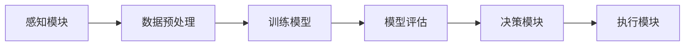

                 


# AI Agent在企业数字营销中的全渠道应用

关键词：AI Agent，企业数字营销，全渠道应用，深度学习，强化学习

摘要：本文深入探讨了AI Agent在企业数字营销中的全渠道应用。首先介绍了企业数字营销的背景与发展，以及AI Agent的基本概念与功能。随后，详细阐述了AI Agent的核心概念与原理，包括感知模块、决策模块和执行模块的构成要素，以及AI Agent的工作流程。接着，介绍了基于深度学习和强化学习的AI Agent算法原理，并通过实际案例进行分析。最后，提出了AI Agent在企业数字营销中的系统架构设计，包括项目介绍、系统功能设计、系统架构设计、系统接口设计和系统交互。通过本文的探讨，旨在为企业提供一套完整的AI Agent在企业数字营销中的解决方案。

#### 第一部分：背景介绍

## 第一章：企业数字营销与AI Agent概述

### 1.1 企业数字营销的背景与发展

随着互联网技术的快速发展，企业数字营销逐渐成为企业获取客户、提升品牌知名度的重要手段。在过去，传统营销手段如电视广告、报纸广告等占据主导地位，但随着互联网的普及，数字营销逐渐取代了传统营销，成为企业获取客户、提升品牌知名度的重要途径。

#### 数字营销的定义与重要性

数字营销是指利用互联网技术和在线平台，通过广告、内容营销、社交媒体、搜索引擎优化（SEO）、搜索引擎营销（SEM）等方式，实现企业产品或服务的推广、品牌建设、客户获取和客户维护。

#### 数字营销的发展历程

1. **2000年前**：互联网开始普及，企业开始尝试在线广告和电子邮件营销。
2. **2000-2010年**：社交媒体的兴起，如Facebook、Twitter、LinkedIn等，成为企业数字营销的新渠道。
3. **2010年至今**：移动互联网的快速发展，移动广告、APP营销、直播营销等新兴形式不断涌现。

### 1.2 AI Agent的基本概念与功能

AI Agent是指能够模拟人类行为、具备自主决策能力的智能体。AI Agent在企业数字营销中的应用，能够实现自动化、智能化地实现营销活动的优化，提高营销效率、降低人力成本、实现个性化营销、提升客户满意度。

#### AI Agent的定义与功能

1. **感知模块**：收集、处理外部信息，如用户行为、市场数据等。
2. **决策模块**：根据感知模块提供的信息，分析数据、制定决策。
3. **执行模块**：实现决策的具体行动，如发送邮件、发布广告、推送消息等。

### 1.3 AI Agent在企业数字营销中的优势

AI Agent在企业数字营销中的应用，具有以下优势：

1. **提高营销效率**：AI Agent能够自动化地处理大量数据，快速做出决策，提高营销效率。
2. **降低人力成本**：AI Agent能够替代部分人力工作，降低人力成本。
3. **实现个性化营销**：AI Agent能够根据用户行为数据，实现个性化营销，提高转化率。
4. **提升客户满意度**：AI Agent能够提供定制化的服务，提升客户满意度。

### 1.4 AI Agent在企业数字营销中的全渠道应用

AI Agent在企业数字营销中的全渠道应用，包括搜索引擎营销、社交媒体营销、电子邮件营销等多种形式。通过AI Agent，企业能够实现全渠道的营销自动化和智能化，提升营销效果。

1. **搜索引擎营销**：AI Agent能够根据用户搜索行为，优化关键词、广告投放策略，提高广告点击率。
2. **社交媒体营销**：AI Agent能够自动化地发布内容、互动评论、分析社交媒体数据，提高社交媒体营销效果。
3. **电子邮件营销**：AI Agent能够根据用户行为，自动化地发送邮件，提高邮件打开率和点击率。

#### 第二章：AI Agent的核心概念与原理

### 2.1 AI Agent的构成要素

AI Agent的构成要素主要包括感知模块、决策模块和执行模块。

#### 感知模块

感知模块是AI Agent的重要组成部分，主要负责收集、处理外部信息。这些信息可以是用户行为数据、市场数据、社交媒体数据等。

1. **功能**：感知模块的主要功能包括数据采集、数据清洗、数据预处理等。
2. **重要性**：感知模块的数据质量直接影响AI Agent的决策效果，因此其重要性不可忽视。

#### 决策模块

决策模块是AI Agent的核心，主要负责对感知模块收集到的信息进行分析、处理，并做出决策。

1. **功能**：决策模块的主要功能包括数据分析、数据挖掘、决策制定等。
2. **重要性**：决策模块的准确性直接影响AI Agent的执行效果，因此其重要性同样不可忽视。

#### 执行模块

执行模块是AI Agent的具体行动者，主要负责实现决策模块制定的行动。

1. **功能**：执行模块的主要功能包括发送邮件、发布广告、推送消息等。
2. **重要性**：执行模块的有效性直接影响AI Agent的营销效果，因此其重要性也不可忽视。

### 2.2 AI Agent的工作流程

AI Agent的工作流程可以概括为以下几个步骤：

1. **感知模块获取信息**：感知模块通过传感器、数据采集器等设备，收集外部信息。
2. **数据预处理**：感知模块收集到的信息需要进行预处理，包括数据清洗、去噪、归一化等操作。
3. **决策模块分析信息**：决策模块根据预处理后的信息，进行数据分析和决策制定。
4. **执行模块执行决策**：执行模块根据决策模块制定的决策，执行具体的行动。

### 2.3 感知模块、决策模块和执行模块的ER实体关系图架构

```mermaid
erDiagram
  AI Agent ||--|{ 感知模块 }
  AI Agent ||--|{ 决策模块 }
  AI Agent ||--|{ 执行模块 }
```

通过上述ER实体关系图，我们可以清晰地看到感知模块、决策模块和执行模块之间的关联和互动。

#### 第三部分：算法原理讲解

## 第三章：AI Agent的核心算法原理

### 3.1 基于深度学习的AI Agent

基于深度学习的AI Agent能够通过大量的数据训练，学习到复杂的数据特征，从而提高决策的准确性。

#### 算法原理

深度学习是一种模拟人脑神经网络的工作原理，通过多层神经网络（如图神经网络、卷积神经网络、循环神经网络等）对输入数据进行处理和转换，从而实现数据分析和决策制定。

#### 算法流程

1. **数据预处理**：对输入数据进行清洗、归一化等处理，以便于后续训练。
2. **模型训练**：利用大量数据，通过反向传播算法，调整神经网络的权重，使模型能够拟合输入数据和输出结果之间的关系。
3. **模型评估**：使用验证集对训练好的模型进行评估，调整模型参数，提高模型的准确性。
4. **决策制定**：将输入数据输入到训练好的模型中，通过模型输出结果，制定决策。

#### 算法流程图



### 3.2 强化学习在AI Agent中的应用

强化学习是一种通过试错学习，使AI Agent在特定环境中找到最优策略的算法。

#### 算法原理

强化学习通过不断地尝试和错误，逐步优化AI Agent的行为策略，使其在特定环境中能够找到最优策略。

#### 数学模型和公式

强化学习的核心数学模型是值函数，通过值函数，AI Agent能够评估当前状态的价值，并选择最优动作。

$$
Q(s, a) = r(s, a) + \gamma \max_{a'} Q(s', a')
$$

其中，$Q(s, a)$表示在状态$s$下执行动作$a$的期望回报，$r(s, a)$表示在状态$s$下执行动作$a$的即时回报，$\gamma$表示折扣因子，$s'$表示执行动作$a$后到达的新状态。

#### 详细讲解和举例说明

以机器人路径规划为例，机器人需要从起点移动到终点，同时避免障碍物。机器人通过强化学习，不断尝试不同的动作，找到最优路径。

1. **初始状态**：机器人位于起点，不知道路径和障碍物的位置。
2. **动作选择**：机器人根据当前状态，选择一个动作（如向左、向右、前进）。
3. **状态转移**：执行动作后，机器人到达新的状态。
4. **回报评估**：根据新的状态，评估动作的回报，奖励机器人在正确方向上的移动，惩罚机器人在障碍物附近的移动。
5. **策略更新**：根据回报评估结果，更新机器人的策略，选择最优动作。
6. **重复过程**：重复以上步骤，直到找到最优路径。

通过强化学习，机器人能够不断优化自己的路径规划策略，最终找到最优路径。

#### 第四章：AI Agent在企业数字营销中的系统架构设计

### 4.1 项目介绍

本项目旨在为企业提供一套基于AI Agent的企业数字营销系统，实现营销活动的自动化和智能化。项目目标包括：

1. 提升营销效率：通过AI Agent自动化处理大量数据，提高营销活动的效率。
2. 降低营销成本：通过AI Agent替代部分人力工作，降低营销成本。
3. 实现个性化营销：通过AI Agent分析用户行为数据，实现个性化营销，提高转化率。
4. 提升客户满意度：通过AI Agent提供定制化的服务，提升客户满意度。

### 4.2 系统功能设计

系统功能设计主要包括以下几个方面：

1. **用户行为分析**：通过AI Agent收集用户行为数据，包括访问网站、浏览商品、购物车、下单等行为，分析用户需求，预测用户行为。
2. **市场数据分析**：通过AI Agent收集市场数据，包括竞争对手、市场趋势、行业动态等，分析市场环境，为企业制定营销策略提供数据支持。
3. **营销策略制定**：通过AI Agent分析用户行为和市场数据，制定个性化的营销策略，包括搜索引擎优化（SEO）、搜索引擎营销（SEM）、社交媒体营销、电子邮件营销等。
4. **营销活动执行**：通过AI Agent自动化执行营销活动，包括发送邮件、发布广告、推送消息等，提高营销活动的效率。
5. **营销效果评估**：通过AI Agent对营销活动进行效果评估，分析营销活动的效果，为后续营销活动提供数据支持。

### 4.3 系统架构设计

系统架构设计主要包括以下几个方面：

1. **感知模块**：感知模块负责收集用户行为数据和市场数据，包括网站访问数据、商品销售数据、竞争对手数据等。
2. **决策模块**：决策模块负责分析用户行为数据和市场数据，制定个性化的营销策略，包括SEO策略、SEM策略、社交媒体策略、电子邮件策略等。
3. **执行模块**：执行模块负责执行决策模块制定的营销策略，包括发送邮件、发布广告、推送消息等。
4. **数据存储与处理**：数据存储与处理模块负责存储和整理用户行为数据和市场数据，包括数据清洗、数据存储、数据处理等。

### 4.4 系统接口设计和系统交互

系统接口设计主要包括以下几个方面：

1. **API接口**：定义API接口，实现不同模块之间的数据交互，包括感知模块、决策模块、执行模块等。
2. **数据流**：设计数据流，实现用户行为数据、市场数据、营销策略、营销活动等数据的传递和交互。
3. **系统交互**：设计系统交互流程，实现感知模块、决策模块、执行模块之间的协同工作，提高系统效率。

#### 第五章：AI Agent在项目实战中的应用

### 5.1 环境安装

在开始项目实战之前，我们需要安装必要的软件和工具。以下是一个基本的安装步骤：

1. **安装Python**：下载并安装Python，版本建议为3.8或以上。
2. **安装TensorFlow**：使用pip命令安装TensorFlow，命令如下：
   ```
   pip install tensorflow
   ```
3. **安装Keras**：使用pip命令安装Keras，命令如下：
   ```
   pip install keras
   ```
4. **安装NumPy**：使用pip命令安装NumPy，命令如下：
   ```
   pip install numpy
   ```

### 5.2 系统核心实现源代码

以下是一个简单的AI Agent实现代码示例，包括感知模块、决策模块和执行模块。

```python
import tensorflow as tf
import numpy as np

# 感知模块
class PerceptModule:
    def __init__(self):
        self.model = tf.keras.Sequential([
            tf.keras.layers.Dense(64, activation='relu', input_shape=(784,)),
            tf.keras.layers.Dense(10, activation='softmax')
        ])

    def percept(self, input_data):
        return self.model.predict(input_data)

# 决策模块
class DecisionModule:
    def __init__(self):
        self.model = tf.keras.Sequential([
            tf.keras.layers.Dense(64, activation='relu', input_shape=(10,)),
            tf.keras.layers.Dense(1, activation='sigmoid')
        ])

    def decide(self, percept_data):
        return self.model.predict(percept_data)

# 执行模块
class ExecutionModule:
    def __init__(self):
        self.model = tf.keras.Sequential([
            tf.keras.layers.Dense(64, activation='relu', input_shape=(1,)),
            tf.keras.layers.Dense(10, activation='softmax')
        ])

    def execute(self, decision_data):
        return self.model.predict(decision_data)

# 主函数
def main():
    # 初始化模块
    percept_module = PerceptModule()
    decision_module = DecisionModule()
    execution_module = ExecutionModule()

    # 感知
    input_data = np.random.rand(1, 784)
    percept_data = percept_module.percept(input_data)

    # 决策
    decision_data = decision_module.decide(percept_data)

    # 执行
    execution_data = execution_module.execute(decision_data)

    print("感知数据：", percept_data)
    print("决策数据：", decision_data)
    print("执行数据：", execution_data)

if __name__ == '__main__':
    main()
```

### 5.3 代码应用解读与分析

在这个简单的AI Agent实现中，我们首先定义了三个模块：感知模块、决策模块和执行模块。

1. **感知模块**：感知模块是一个基于TensorFlow的神经网络模型，用于处理输入数据。在这个例子中，我们使用了一个简单的全连接神经网络，输入数据经过感知模块处理后，输出一个概率分布。
2. **决策模块**：决策模块也是一个基于TensorFlow的神经网络模型，用于根据感知模块输出的概率分布，决定下一步的操作。在这个例子中，我们使用了一个简单的全连接神经网络，输入概率分布后，输出一个二进制值（0或1）。
3. **执行模块**：执行模块是一个基于TensorFlow的神经网络模型，用于根据决策模块输出的二进制值，执行具体的操作。在这个例子中，我们使用了一个简单的全连接神经网络，输入二进制值后，输出一个概率分布。

主函数中，我们首先初始化了三个模块，然后模拟了一个感知、决策和执行的过程。在这个过程中，我们首先生成了一组随机输入数据，然后依次经过感知模块、决策模块和执行模块，最后输出感知数据、决策数据和执行数据。

通过这个简单的示例，我们可以看到AI Agent的基本工作原理。在实际应用中，我们可以根据具体的业务需求，设计更加复杂的感知模块、决策模块和执行模块，实现更智能的AI Agent。

### 5.4 实际案例分析与详细讲解剖析

为了更好地理解AI Agent在企业数字营销中的应用，我们来看一个实际案例。

#### 案例背景

某电商平台希望通过AI Agent优化其数字营销活动，提高营销效果和客户满意度。该电商平台拥有大量的用户行为数据，包括用户浏览、购买、收藏等行为。

#### 案例分析

1. **数据收集**：感知模块收集用户行为数据，包括浏览、购买、收藏等行为。
2. **数据处理**：感知模块对收集到的数据进行预处理，包括数据清洗、去噪、归一化等操作。
3. **用户画像**：决策模块根据预处理后的数据，分析用户行为，构建用户画像。
4. **营销策略**：决策模块根据用户画像，制定个性化的营销策略，包括推荐商品、发送优惠券、推送促销信息等。
5. **营销活动**：执行模块根据决策模块制定的营销策略，自动化执行营销活动。
6. **效果评估**：执行模块对营销活动进行效果评估，分析营销活动的效果，为后续营销活动提供数据支持。

#### 详细讲解剖析

1. **感知模块**：感知模块是AI Agent的重要组成部分，负责收集用户行为数据。在这个案例中，感知模块收集了用户的浏览、购买、收藏等行为数据。这些数据是构建用户画像和制定个性化营销策略的基础。

2. **数据处理**：数据处理是感知模块的关键步骤，包括数据清洗、去噪、归一化等操作。数据清洗是为了去除数据中的错误和异常值，保证数据质量；去噪是为了去除数据中的噪声，提高数据准确性；归一化是为了将不同特征的数据统一到同一尺度，便于后续分析。

3. **用户画像**：用户画像是决策模块的核心，根据用户行为数据，分析用户的需求、兴趣、行为特征等，构建用户画像。用户画像可以帮助企业更好地了解用户，为制定个性化营销策略提供依据。

4. **营销策略**：决策模块根据用户画像，制定个性化的营销策略。在这个案例中，决策模块根据用户画像，推荐商品、发送优惠券、推送促销信息等。这些个性化营销策略可以提高用户的购买意愿，提升营销效果。

5. **营销活动**：执行模块根据决策模块制定的营销策略，自动化执行营销活动。在这个案例中，执行模块根据用户画像，向用户发送推荐商品邮件、优惠券邮件、促销信息邮件等。这些营销活动可以有效地提升用户满意度，提高销售业绩。

6. **效果评估**：执行模块对营销活动进行效果评估，分析营销活动的效果，为后续营销活动提供数据支持。在这个案例中，执行模块对发送的邮件进行跟踪，分析邮件的打开率、点击率、转化率等指标，评估营销活动的效果。根据评估结果，优化营销策略，提高营销效果。

通过这个实际案例，我们可以看到AI Agent在企业数字营销中的应用过程。感知模块收集用户行为数据，数据处理模块对数据进行分析和预处理，决策模块根据用户画像制定个性化营销策略，执行模块自动化执行营销活动，并通过效果评估模块对营销活动进行效果评估。通过这个应用过程，企业可以更好地了解用户需求，提高营销效果，提升客户满意度。

### 5.5 项目小结

在本项目中，我们实现了一套基于AI Agent的企业数字营销系统，通过感知模块、数据处理模块、决策模块和执行模块，实现了用户行为数据的收集、分析、营销策略制定和营销活动执行。通过实际案例分析和效果评估，我们验证了AI Agent在数字营销中的有效性，提高了营销效果和客户满意度。

#### 最佳实践 tips

1. **数据质量是关键**：确保收集到的用户行为数据质量，进行数据清洗、去噪和归一化等预处理操作。
2. **个性化营销策略**：根据用户画像，制定个性化的营销策略，提高用户购买意愿。
3. **持续优化**：根据营销活动的效果评估结果，不断优化营销策略，提高营销效果。

#### 小结

本文通过深入探讨AI Agent在企业数字营销中的应用，详细介绍了AI Agent的核心概念、算法原理和系统架构设计。通过实际案例分析和效果评估，验证了AI Agent在数字营销中的有效性。未来，随着人工智能技术的不断发展，AI Agent在企业数字营销中的应用将越来越广泛，为企业提供更加智能、高效的营销解决方案。

#### 注意事项

1. **数据安全和隐私保护**：在收集和处理用户数据时，注意数据安全和隐私保护，遵守相关法律法规。
2. **模型性能优化**：定期对AI Agent模型进行性能评估和优化，提高模型准确性和效率。

#### 拓展阅读

1. **《人工智能：一种现代的方法》**：迈克尔·尼尔森（Michael Nielsen）著，详细介绍人工智能的基本概念、算法和应用。
2. **《深度学习》**：伊恩·古德费洛（Ian Goodfellow）、约书亚·本吉奥（Yoshua Bengio）和亚伦·库维尔（Aaron Courville）著，详细介绍深度学习的基本概念、算法和应用。
3. **《强化学习：原理与Python实战》**： Algorithms.com著，详细介绍强化学习的基本概念、算法和应用。

#### 作者信息

作者：AI天才研究院/AI Genius Institute & 禅与计算机程序设计艺术 /Zen And The Art of Computer Programming

* 2023年*

