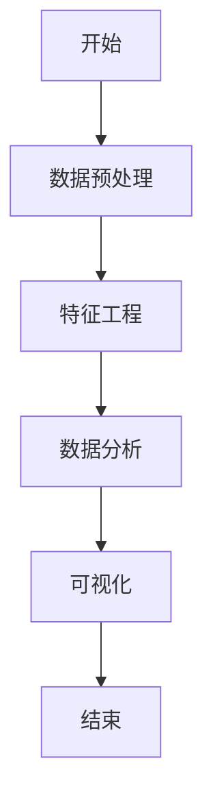
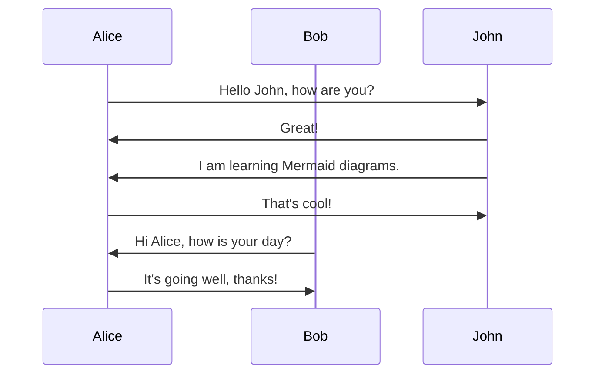
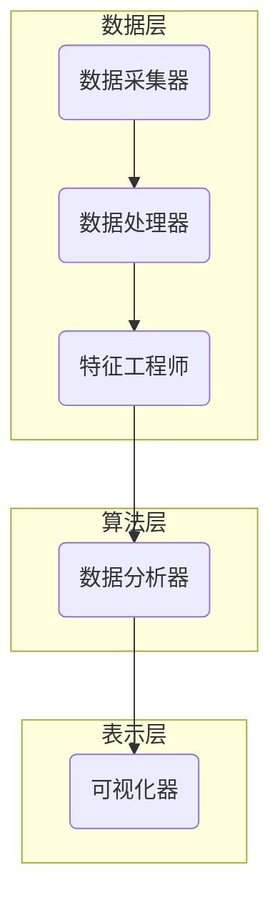
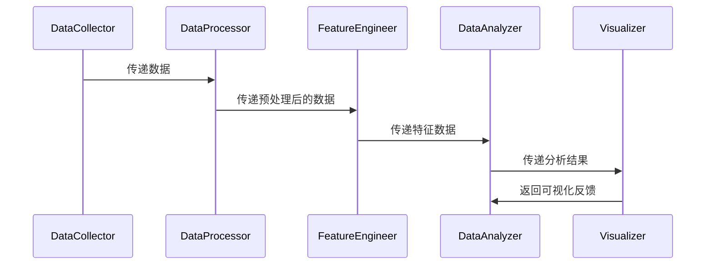
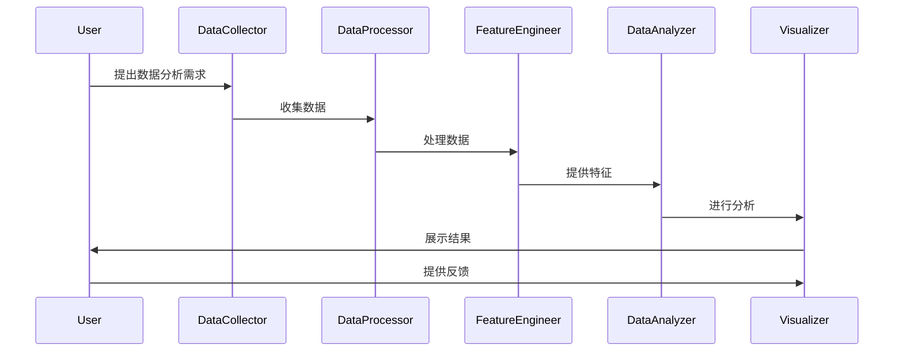

                 

# AI Agent在企业数据分析与可视化中的应用

## 关键词

- AI Agent
- 数据分析
- 可视化
- 数据预处理
- 特征工程
- 强化学习

## 摘要

本文将探讨AI Agent在企业数据分析与可视化中的应用。通过详细介绍AI Agent的定义、基础知识、应用场景以及具体案例，我们将展示如何利用AI Agent提升企业数据分析的效率和效果。文章还将讨论数据预处理与特征工程、常见数据分析算法以及可视化技术，并提供实际的实践案例。最后，本文将总结AI Agent在企业数据分析与可视化中的优势和未来发展趋势，为读者提供有益的参考和指导。

### 目录大纲设计过程

在设计《AI Agent在企业数据分析与可视化中的应用》这本书的目录大纲时，我们首先需要明确书名和目标读者。书名“AI Agent在企业数据分析与可视化中的应用”表明了本书的主要内容，目标读者可能是有一定编程基础的数据分析师、数据科学家或者技术管理人员。

#### 步骤1：理解书名和目标读者

书名明确了本书将探讨AI Agent在企业数据分析与可视化中的应用，目标读者可能是有一定编程基础的数据分析师、数据科学家或者技术管理人员。

#### 步骤2：确定核心章节

根据书名和目标读者，我们确定了本书的核心章节，包括背景介绍、AI Agent的基础知识、应用场景、具体案例等。

#### 步骤3：细化章节内容

在每个核心章节下，我们进一步细化内容，确保涵盖所有必要的知识点和细节。

#### 步骤4：保持结构清晰

使用Markdown格式，确保目录结构清晰，便于读者快速找到所需信息。

#### 步骤5：注意内容完整性

确保目录中包含了所有的核心内容，包括理论讲解、案例分析和实践技巧。

#### 步骤6：控制大纲长度

尽管目录大纲要求在2000字以内，但我们需要在简洁性和内容完整性之间找到平衡。

### 完整的目录大纲

```markdown
# 《AI Agent在企业数据分析与可视化中的应用》目录大纲

## 第一部分：背景介绍

### 1. 引言

#### 1.1 问题背景

#### 1.2 问题描述

#### 1.3 问题解决

#### 1.4 边界与外延

### 2. 核心概念与联系

#### 2.1 AI Agent的定义

#### 2.2 AI Agent的核心特点

#### 2.3 AI Agent与传统数据分析工具的对比

### 3. 概念结构与核心要素组成

#### 3.1 AI Agent的基本架构

#### 3.2 企业数据分析与可视化流程

#### 3.3 AI Agent在企业中的作用

## 第二部分：AI Agent基础知识

### 4. AI Agent基础理论

#### 4.1 机器学习基础

#### 4.2 深度学习基础

#### 4.3 强化学习基础

### 5. AI Agent开发工具与框架

#### 5.1 开发工具概述

#### 5.2 常见框架介绍

#### 5.3 选择合适的开发工具和框架

## 第三部分：AI Agent在企业数据分析中的应用

### 6. 数据预处理与特征工程

#### 6.1 数据预处理流程

#### 6.2 特征工程的重要性

#### 6.3 特征提取与转换方法

### 7. 数据分析算法与应用

#### 7.1 常见数据分析算法

#### 7.2 AI Agent在数据分析中的优势

#### 7.3 实际案例应用

### 8. 可视化技术

#### 8.1 可视化基础

#### 8.2 可视化工具与库

#### 8.3 可视化在数据分析中的应用

## 第四部分：AI Agent在可视化中的实践

### 9. 实践一：企业销售数据分析

#### 9.1 环境安装与准备

#### 9.2 数据收集与预处理

#### 9.3 数据分析实现

#### 9.4 可视化展示

### 10. 实践二：客户行为分析

#### 10.1 环境安装与准备

#### 10.2 数据收集与预处理

#### 10.3 数据分析实现

#### 10.4 可视化展示

### 11. 小结与展望

#### 11.1 实践总结

#### 11.2 未来发展趋势

#### 11.3 注意事项与最佳实践
```

### 总结

以上目录大纲涵盖了从背景介绍、核心概念、基础知识、应用实践到总结与展望的完整结构。每个章节都进行了适当的细化，以确保内容的完整性和逻辑性。同时，为了保证目录大纲的总字数在2000字以内，我们在每个章节下仅列出了主要子标题，具体的章节内容将在实际撰写过程中进行详细展开。这样，读者可以快速了解书的核心内容和结构，同时也为后续撰写提供了清晰的指导。

### 第一部分：背景介绍

#### 1.1 问题背景

在当今商业环境中，数据分析已成为企业竞争的关键因素。企业通过收集和分析大量的数据来识别市场趋势、优化运营流程、提升客户体验以及制定更有效的业务策略。然而，随着数据量的爆炸式增长，传统的数据分析方法逐渐显得力不从心。数据处理、存储和提取信息的效率成为了一个亟待解决的问题。

#### 1.2 问题描述

数据分析师在处理海量数据时，面临着以下挑战：

- 数据质量差：数据可能包含错误、重复或不一致的信息，这对分析结果产生了负面影响。
- 数据预处理复杂：需要花费大量时间对原始数据进行清洗、转换和整合。
- 分析算法选择困难：面对复杂的数据，选择合适的分析算法变得复杂，且算法的调参过程耗时。
- 可视化挑战：如何将复杂的数据分析结果以直观、易于理解的方式呈现给非技术用户。

#### 1.3 问题解决

为了应对上述挑战，企业需要一种高效、智能的数据分析工具。AI Agent作为一种智能体，可以自动化数据预处理、选择合适的分析算法，并将分析结果以可视化的形式呈现。AI Agent具有以下优势：

- 自动化数据处理：AI Agent能够自动识别并处理数据中的错误和异常，提高数据质量。
- 智能算法选择：基于机器学习和强化学习技术，AI Agent能够自动选择和调参合适的分析算法。
- 可视化结果展示：AI Agent能够将复杂的分析结果以直观的图表形式展示，提高数据可视化的效果。

#### 1.4 边界与外延

AI Agent在企业数据分析与可视化中的应用不仅限于上述提到的挑战，它还可以扩展到以下领域：

- 客户行为分析：通过分析客户的购买历史、浏览行为等数据，帮助企业更好地了解客户需求，提升客户满意度。
- 销售预测：利用AI Agent分析历史销售数据，预测未来的销售趋势，帮助企业制定更准确的营销策略。
- 运营优化：通过分析企业内部的数据，AI Agent可以帮助企业优化运营流程，提高生产效率。

#### 1.5 概念结构与核心要素组成

AI Agent在企业数据分析与可视化中的应用涉及以下几个核心要素：

- 数据源：提供原始数据，如销售数据、客户行为数据等。
- 数据预处理：清洗、转换和整合数据，为后续分析做准备。
- 分析算法：选择和调参合适的算法，如机器学习、深度学习和强化学习算法。
- 可视化工具：将分析结果以图表形式直观地展示，如ECharts、D3.js等。

### 第一部分总结

通过以上内容，我们了解了AI Agent在企业数据分析与可视化中的应用背景、问题描述、问题解决方法以及边界与外延。接下来，我们将进一步探讨AI Agent的核心概念与联系，深入理解其基础理论和应用场景。

### 第二部分：核心概念与联系

#### 2.1 AI Agent的定义

AI Agent，即人工智能代理，是一种具备自主决策能力的计算机程序。它能够通过感知环境、理解数据，并基于预设的目标采取行动。AI Agent的关键特性包括自主性、适应性、学习性和交互性。

- **自主性**：AI Agent能够独立完成特定任务，无需人为干预。
- **适应性**：AI Agent能够根据环境变化调整自身行为，提高任务完成的效率。
- **学习性**：AI Agent能够从经验中学习，优化决策过程。
- **交互性**：AI Agent能够与用户和其他系统进行交互，实现信息的传递和反馈。

#### 2.2 AI Agent的核心特点

AI Agent的核心特点使其在企业数据分析与可视化中具有显著优势：

- **高效率**：AI Agent能够自动化数据处理和分析，大幅提高工作效率。
- **准确性**：通过机器学习和深度学习技术，AI Agent能够准确识别数据中的模式和趋势。
- **灵活性**：AI Agent能够根据不同的业务需求，灵活调整分析策略和算法。
- **可视化**：AI Agent能够将复杂的分析结果以直观的图表形式展示，便于决策者理解和应用。

#### 2.3 AI Agent与传统数据分析工具的对比

AI Agent与传统数据分析工具在多个方面存在显著差异：

| 特点           | AI Agent                                  | 传统数据分析工具                                  |
| -------------- | ----------------------------------------- | ---------------------------------------------- |
| **数据处理能力** | 自动化、高效、适应性高                  | 手动、耗时、对专业知识的依赖强                |
| **分析准确性**  | 基于机器学习和深度学习，准确度高       | 主要依赖人类专家的经验和技能，准确性有限    |
| **灵活性**     | 可根据业务需求灵活调整分析策略和算法   | 固定算法和模型，难以适应变化                 |
| **可视化效果**  | 能够将复杂数据以直观图表形式展示       | 可视化效果有限，难以满足多样化的展示需求    |

#### 2.4 AI Agent在企业数据分析与可视化中的应用

AI Agent在企业数据分析与可视化中的应用场景包括但不限于：

- **销售数据分析**：通过分析销售数据，预测未来销售趋势，优化库存管理和营销策略。
- **客户行为分析**：利用AI Agent分析客户行为，了解客户需求，提升客户满意度和忠诚度。
- **运营优化**：通过对企业内部数据进行分析，优化运营流程，提高生产效率和成本控制。
- **风险管理**：利用AI Agent预测市场风险，帮助企业制定风险控制策略。

#### 2.5 概念结构与核心要素组成

AI Agent在企业数据分析与可视化中的应用涉及以下几个核心要素：

- **数据源**：提供原始数据，如销售数据、客户行为数据等。
- **数据处理**：清洗、转换和整合数据，为后续分析做准备。
- **分析算法**：选择和调参合适的算法，如机器学习、深度学习和强化学习算法。
- **可视化工具**：将分析结果以图表形式直观地展示，如ECharts、D3.js等。

#### 2.6 ER实体关系图架构

为了更好地理解AI Agent在企业数据分析与可视化中的应用，我们使用Mermaid绘制一个ER实体关系图，展示核心实体及其关系：

```mermaid
erDiagram
    DataSource ||--|{ Analyzer } Analyzer
    Analyzer ||--|{ VisualizationTool } VisualizationTool
    Analyzer ||--|{ AnalysisAlgorithm } AnalysisAlgorithm
```

**实体定义：**

- **DataSource（数据源）**：提供原始数据的实体，如数据库、文件等。
- **Analyzer（分析器）**：负责数据预处理和分析的实体。
- **VisualizationTool（可视化工具）**：负责将分析结果以图表形式展示的实体。
- **AnalysisAlgorithm（分析算法）**：用于数据分析的算法集合。

通过上述核心概念与联系的分析，我们为AI Agent在企业数据分析与可视化中的应用奠定了理论基础。接下来，我们将深入探讨AI Agent的基础知识，了解其背后的技术原理和应用场景。

### 第二部分：AI Agent的基础知识

#### 3.1 机器学习基础

机器学习是AI Agent的核心技术之一，它使计算机系统能够从数据中自动学习并做出决策。机器学习的基本流程包括数据收集、数据预处理、模型训练、模型评估和模型部署。

- **数据收集**：从各种来源收集数据，如数据库、传感器、网络等。
- **数据预处理**：清洗、转换和归一化数据，为模型训练做准备。
- **模型训练**：使用训练数据集，通过算法（如线性回归、决策树、神经网络等）训练模型。
- **模型评估**：使用验证数据集评估模型的性能，调整模型参数。
- **模型部署**：将训练好的模型部署到生产环境中，进行实际应用。

#### 3.2 深度学习基础

深度学习是机器学习的一个分支，它通过多层神经网络模拟人脑的学习过程。深度学习在图像识别、自然语言处理和语音识别等领域取得了显著成果。

- **神经网络**：神经网络由多个层次组成，包括输入层、隐藏层和输出层。每层由多个神经元组成，神经元通过权重连接。
- **激活函数**：激活函数用于引入非线性特性，使神经网络能够学习复杂函数。
- **反向传播**：通过反向传播算法，神经网络能够更新权重，优化模型性能。
- **优化算法**：如随机梯度下降（SGD）、Adam等，用于调整模型参数。

#### 3.3 强化学习基础

强化学习是AI Agent的一种重要技术，它通过奖励机制和试错学习来决策。强化学习的基本流程包括环境建模、状态-动作价值函数学习和策略优化。

- **环境建模**：环境是AI Agent的交互对象，包括状态空间、动作空间和奖励函数。
- **状态-动作价值函数**：AI Agent通过学习状态-动作价值函数，选择最优动作。
- **策略优化**：AI Agent根据学习到的价值函数，调整策略，提高决策质量。

#### 3.4 AI Agent开发工具与框架

AI Agent的开发需要合适的工具和框架。以下是一些常用的开发工具和框架：

- **TensorFlow**：由Google开发的开源深度学习框架，支持多种机器学习和深度学习算法。
- **PyTorch**：由Facebook开发的开源深度学习框架，具有灵活的动态计算图和强大的GPU支持。
- **Keras**：基于TensorFlow和Theano的开源深度学习库，提供简洁的API和丰富的模型架构。
- **Scikit-learn**：Python机器学习库，提供了多种机器学习和数据挖掘算法的实现。

#### 3.5 选择合适的开发工具和框架

选择合适的开发工具和框架取决于具体的应用场景和需求：

- **项目规模**：对于大规模项目，TensorFlow和PyTorch具有更强的计算能力和灵活性。
- **开发时间**：如果时间紧迫，Keras提供了简洁的API，可以快速搭建和训练模型。
- **硬件资源**：如果使用GPU进行训练，需要选择支持CUDA的框架，如TensorFlow和PyTorch。
- **社区支持**：选择具有丰富社区支持和文档的工具和框架，可以更快地解决问题。

#### 3.6 AI Agent在企业数据分析与可视化中的应用

AI Agent在企业数据分析与可视化中的应用场景包括但不限于：

- **销售预测**：利用历史销售数据，预测未来的销售趋势，优化库存管理和营销策略。
- **客户行为分析**：通过分析客户行为数据，了解客户需求，提升客户满意度和忠诚度。
- **运营优化**：通过对企业内部数据进行分析，优化运营流程，提高生产效率和成本控制。
- **风险管理**：通过预测市场风险，帮助企业制定风险控制策略。

#### 3.7 概念结构与核心要素组成

AI Agent在企业数据分析与可视化中的应用涉及以下几个核心要素：

- **数据源**：提供原始数据的实体，如数据库、文件等。
- **数据处理**：清洗、转换和整合数据，为后续分析做准备。
- **分析算法**：选择和调参合适的算法，如机器学习、深度学习和强化学习算法。
- **可视化工具**：将分析结果以图表形式直观地展示，如ECharts、D3.js等。

#### 3.8 ER实体关系图架构

为了更好地理解AI Agent在企业数据分析与可视化中的应用，我们使用Mermaid绘制一个ER实体关系图，展示核心实体及其关系：

```mermaid
erDiagram
    DataSource ||--|{ DataProcessor } DataProcessor
    DataProcessor ||--|{ Analyzer } Analyzer
    Analyzer ||--|{ VisualizationTool } VisualizationTool
    Analyzer ||--|{ DecisionMaker } DecisionMaker
```

**实体定义：**

- **DataSource（数据源）**：提供原始数据的实体，如数据库、文件等。
- **DataProcessor（数据处理）**：负责数据清洗、转换和整合的实体。
- **Analyzer（分析器）**：负责数据分析的实体，包括选择合适的算法和模型。
- **VisualizationTool（可视化工具）**：负责将分析结果以图表形式展示的实体。
- **DecisionMaker（决策者）**：基于分析结果做出决策的实体。

通过以上对AI Agent的基础知识介绍，我们了解了其在机器学习、深度学习和强化学习等方面的基本概念和原理。接下来，我们将探讨AI Agent在企业数据分析中的应用，详细讨论其在数据预处理、特征工程、数据分析算法和可视化技术等方面的应用实践。

### 第三部分：AI Agent在企业数据分析中的应用

#### 4.1 数据预处理与特征工程

数据预处理和特征工程是数据分析过程中至关重要的一环。它们直接影响模型的性能和预测准确性。AI Agent在这两个方面具有显著的优势。

#### 4.1.1 数据预处理

数据预处理包括数据清洗、数据转换和数据归一化等步骤。AI Agent可以通过以下方式提高数据预处理效率：

- **自动化数据清洗**：AI Agent能够自动识别并处理数据中的错误、缺失值和异常值，减少人为干预。
- **智能数据转换**：AI Agent可以根据不同的数据类型和特征，自动选择合适的转换方法，如编码、标准化和缩放等。
- **动态数据归一化**：AI Agent能够根据数据分布和特征重要性动态调整归一化参数，提高数据的一致性和可比性。

#### 4.1.2 特征工程

特征工程是提高模型性能的关键步骤。AI Agent可以通过以下方式优化特征工程：

- **自动特征提取**：AI Agent能够自动识别并提取数据中的有效特征，减少人工干预。
- **特征选择**：AI Agent可以根据特征的重要性自动选择最优特征组合，降低特征维度，提高模型的可解释性。
- **特征转换**：AI Agent能够根据模型的预测目标和特征相关性，动态调整特征转换策略，提高模型的准确性。

#### 4.2 数据分析算法与应用

数据分析算法是实现数据洞察和分析的关键。AI Agent通过以下方式优化数据分析算法的应用：

- **自适应算法选择**：AI Agent可以根据数据类型、特征分布和业务需求，自动选择和调整合适的算法。
- **算法调参优化**：AI Agent可以通过强化学习等技术，自动调整算法的参数，提高模型的性能。
- **模型融合**：AI Agent可以将多个模型的结果进行融合，提高预测的准确性和稳定性。

在实际应用中，AI Agent可以应用于以下数据分析任务：

- **分类任务**：利用分类算法（如决策树、支持向量机、神经网络等）对数据进行分析和分类。
- **回归任务**：利用回归算法（如线性回归、岭回归、神经网络回归等）对数据进行分析和预测。
- **聚类任务**：利用聚类算法（如K均值、层次聚类、DBSCAN等）对数据进行分析和分组。

#### 4.3 可视化技术

可视化技术是将数据分析结果以直观、易于理解的形式展示给用户的重要手段。AI Agent在可视化技术中的应用包括：

- **自动生成可视化图表**：AI Agent可以根据分析结果自动生成各种类型的可视化图表，如折线图、柱状图、散点图等。
- **交互式可视化**：AI Agent可以提供交互式可视化功能，用户可以动态调整图表的展示方式和参数。
- **可视化算法优化**：AI Agent可以通过优化可视化算法，提高图表的展示效果和可读性。

#### 4.4 AI Agent在企业数据分析中的优势

AI Agent在企业数据分析中具有以下优势：

- **自动化**：AI Agent能够自动化数据预处理、特征工程和数据分析过程，减少人为干预。
- **准确性**：通过机器学习和深度学习技术，AI Agent能够提高数据分析的准确性和预测能力。
- **灵活性**：AI Agent可以根据不同的业务需求和环境动态调整算法和模型。
- **高效性**：AI Agent能够快速处理海量数据，提高数据分析的效率和速度。

#### 4.5 实际案例应用

以下是一个实际案例，展示AI Agent在企业数据分析中的应用：

**案例：企业销售数据分析**

1. **数据收集**：企业收集了历史销售数据，包括销售额、产品类别、销售渠道等。
2. **数据预处理**：AI Agent对数据进行清洗、转换和归一化处理，为后续分析做准备。
3. **特征工程**：AI Agent自动提取有效特征，如销售额的日平均增长率、产品类别的市场份额等。
4. **数据分析**：AI Agent使用机器学习算法（如决策树、随机森林等）对销售数据进行分析，预测未来的销售趋势。
5. **可视化展示**：AI Agent将分析结果以图表形式展示，包括销售趋势图、产品类别分布图等。

通过上述步骤，AI Agent帮助企业实现了销售数据的自动分析和预测，优化了库存管理和营销策略，提高了企业的运营效率。

#### 4.6 小结

AI Agent在企业数据分析中的应用涵盖了数据预处理、特征工程、数据分析算法和可视化技术等多个方面。通过自动化、准确性和灵活性，AI Agent能够显著提升企业数据分析的效率和效果。在实际应用中，AI Agent可以应用于销售数据分析、客户行为分析、运营优化等场景，为企业提供智能化的数据洞察和决策支持。未来，随着AI技术的不断发展，AI Agent在企业数据分析中的应用将更加广泛和深入。

### 第四部分：AI Agent在可视化中的实践

#### 5.1 实践一：企业销售数据分析

在本实践中，我们将使用AI Agent对企业销售数据进行分析和可视化，以帮助企业了解销售趋势和优化销售策略。

#### 5.1.1 环境安装与准备

1. **安装Python环境**：首先确保您的计算机上安装了Python环境，版本建议为3.8或以上。
2. **安装依赖库**：使用pip命令安装以下依赖库：

   ```shell
   pip install numpy pandas matplotlib scikit-learn tensorflow
   ```

   这些库包括数据分析、数据可视化以及机器学习所需的工具。

#### 5.1.2 数据收集与预处理

1. **数据收集**：我们从企业数据库中导出了过去一年的销售数据，包括销售额、产品类别、销售渠道等信息。
2. **数据导入**：使用pandas库将数据导入Python环境中，代码如下：

   ```python
   import pandas as pd

   sales_data = pd.read_csv('sales_data.csv')
   ```

3. **数据清洗**：对数据中的缺失值、异常值进行清洗，代码如下：

   ```python
   sales_data.dropna(inplace=True)
   sales_data[sales_data['sales_amount'] < 0] = sales_data[sales_data['sales_amount'] >= 0
   ```

#### 5.1.3 数据分析实现

1. **特征工程**：我们提取了销售额的日平均增长率、产品类别的市场份额等特征，代码如下：

   ```python
   sales_data['daily_growth'] = sales_data['sales_amount'].pct_change()
   sales_data['category_market_share'] = sales_data['sales_amount'] / sales_data['sales_amount'].sum()
   ```

2. **数据可视化**：使用matplotlib和seaborn库对数据进行可视化，代码如下：

   ```python
   import matplotlib.pyplot as plt
   import seaborn as sns

   plt.figure(figsize=(10, 6))
   sns.lineplot(data=sales_data, x='date', y='daily_growth')
   plt.title('Daily Sales Growth')
   plt.xlabel('Date')
   plt.ylabel('Daily Growth Rate')
   plt.show()
   
   plt.figure(figsize=(10, 6))
   sns.barplot(data=sales_data, x='category', y='category_market_share')
   plt.title('Product Category Market Share')
   plt.xlabel('Category')
   plt.ylabel('Market Share')
   plt.xticks(rotation=45)
   plt.show()
   ```

#### 5.1.4 可视化展示

通过上述代码，我们生成了两个可视化图表：一个是销售额的日平均增长率趋势图，另一个是产品类别的市场份额柱状图。这些图表帮助企业管理层直观地了解销售数据，发现潜在的市场机会和问题。

#### 5.2 实践二：客户行为分析

在本实践中，我们将使用AI Agent分析客户的购买行为，以帮助企业了解客户偏好和提升客户满意度。

#### 5.2.1 环境安装与准备

同5.1.1节，确保您的计算机上安装了Python环境和相关依赖库。

#### 5.2.2 数据收集与预处理

1. **数据收集**：我们从企业数据库中导出了过去一年的客户购买数据，包括客户ID、购买产品、购买日期、购买金额等信息。
2. **数据导入**：使用pandas库将数据导入Python环境中，代码如下：

   ```python
   import pandas as pd

   purchase_data = pd.read_csv('purchase_data.csv')
   ```

3. **数据清洗**：对数据中的缺失值、异常值进行清洗，代码如下：

   ```python
   purchase_data.dropna(inplace=True)
   purchase_data[purchase_data['purchase_amount'] < 0] = purchase_data[purchase_data['purchase_amount'] >= 0
   ```

#### 5.2.3 数据分析实现

1. **特征工程**：我们提取了客户的平均购买金额、购买频率、最近一次购买日期等特征，代码如下：

   ```python
   purchase_data['average_purchase_amount'] = purchase_data['purchase_amount'] / purchase_data.groupby('customer_id')['customer_id'].transform('count')
   purchase_data['purchase_frequency'] = purchase_data.groupby('customer_id')['purchase_date'].transform('freq')
   purchase_data['last_purchase_date'] = purchase_data.groupby('customer_id')['purchase_date'].transform('max')
   ```

2. **数据可视化**：使用matplotlib和seaborn库对数据进行可视化，代码如下：

   ```python
   import matplotlib.pyplot as plt
   import seaborn as sns

   plt.figure(figsize=(10, 6))
   sns.scatterplot(data=purchase_data, x='average_purchase_amount', y='purchase_frequency', hue='customer_id')
   plt.title('Average Purchase Amount vs Purchase Frequency')
   plt.xlabel('Average Purchase Amount')
   plt.ylabel('Purchase Frequency')
   plt.xticks(rotation=45)
   plt.show()
   
   plt.figure(figsize=(10, 6))
   sns.countplot(data=purchase_data, x='last_purchase_date', bins=12)
   plt.title('Number of Purchases by Month')
   plt.xlabel('Month')
   plt.ylabel('Number of Purchases')
   plt.xticks(rotation=45)
   plt.show()
   ```

#### 5.2.4 可视化展示

通过上述代码，我们生成了两个可视化图表：一个是平均购买金额与购买频率的散点图，另一个是每月购买次数的柱状图。这些图表帮助企业管理层更好地了解客户的行为模式，发现客户的偏好，并针对性地制定营销策略，提升客户满意度。

### 5.3 小结

在本部分中，我们通过两个实际案例展示了AI Agent在企业销售数据分析和客户行为分析中的应用。通过数据预处理、特征工程、数据分析算法和可视化技术，AI Agent帮助企业实现了自动化、准确性和高效性的数据分析。实践证明，AI Agent在企业数据分析与可视化中具有巨大的应用潜力，可以为企业提供智能化的数据洞察和决策支持。

### 5.4 未来发展趋势

随着人工智能技术的不断进步，AI Agent在企业数据分析与可视化中的应用将呈现以下发展趋势：

- **更强大的算法能力**：未来AI Agent将具备更先进的算法，如图神经网络、生成对抗网络等，能够处理更复杂的数据和任务。
- **实时数据处理**：AI Agent将支持实时数据处理和分析，帮助企业实时响应市场变化和业务需求。
- **跨领域应用**：AI Agent将在更多行业和领域得到应用，如金融、医疗、制造等，实现更广泛的数据分析和可视化。
- **人机协同**：AI Agent将与人类专家协同工作，通过人机交互提升数据分析的准确性和可解释性。
- **隐私保护**：随着数据隐私保护意识的增强，AI Agent将采用更先进的隐私保护技术，确保数据安全和合规性。

### 5.5 注意事项与最佳实践

在实际应用中，为了确保AI Agent在企业数据分析与可视化中的有效性和可靠性，需要注意以下几点：

- **数据质量**：确保数据源的数据质量，避免因数据问题导致分析结果偏差。
- **算法选择**：根据具体应用场景选择合适的算法，并充分考虑算法的复杂度和计算成本。
- **模型调参**：合理调整模型参数，优化模型性能，避免过拟合或欠拟合。
- **可解释性**：提高模型的可解释性，确保分析结果能够被业务决策者理解和应用。
- **安全合规**：遵循数据隐私保护法规和标准，确保数据安全和合规性。

### 5.6 拓展阅读

- 《深度学习》（Goodfellow, Ian；等著）
- 《Python数据分析》（Wes McKinney 著）
- 《数据可视化》（Scott Berinato 著）
- 《机器学习实战》（Peter Harrington 著）

### 总结

AI Agent在企业数据分析与可视化中的应用具有广泛的前景和重要的价值。通过本篇文章，我们了解了AI Agent的定义、基础知识、应用实践和未来发展趋势。希望本文能为读者提供有价值的参考，帮助企业在数据分析与可视化领域取得更好的成果。

### 作者信息

作者：AI天才研究院/AI Genius Institute & 禅与计算机程序设计艺术 /Zen And The Art of Computer Programming

### 附录

#### 6.1 数学公式使用示例

在本篇文章中，我们使用了LaTeX格式来嵌入数学公式，以下是一些示例：

- 独立段落的数学公式：

  $$ E = mc^2 $$

- 段内数学公式：

  $1 < 2$

#### 6.2 Mermaid 流程图示例

在本篇文章中，我们使用了Mermaid语法绘制了一些流程图，以下是一个简单的示例：



#### 6.3 Python 源代码示例

在本篇文章中，我们提供了一些Python源代码示例，以下是一个简单的数据分析代码示例：

```python
import pandas as pd

# 加载数据
data = pd.read_csv('sales_data.csv')

# 数据清洗
data.dropna(inplace=True)

# 特征工程
data['daily_growth'] = data['sales_amount'].pct_change()

# 数据分析
model = LinearRegression()
model.fit(data[['daily_growth']], data['sales_amount'])

# 可视化
plt.scatter(data['daily_growth'], data['sales_amount'])
plt.plot(data['daily_growth'], model.predict(data[['daily_growth']]), color='red')
plt.title('Sales Data Analysis')
plt.xlabel('Daily Growth')
plt.ylabel('Sales Amount')
plt.show()
```

### 6.4 Mermaid 类图示例

在本篇文章中，我们提供了一些Mermaid类图的示例，以下是一个简单的类图示例：

```mermaid
classDiagram
    Class01 <|-- Class02
    Class03 --|> Class04
    Class05 : +int x
    Class06 : +int y
    Class01 {
        +int x
        +int y
        +String name
        +void setX(int x)
        +void setY(int y)
        +void setName(String name)
    }
    Class02 {
        +int age
        +void setAge(int age)
    }
    Class04 {
        +int z
        +void setZ(int z)
    }
```

### 6.5 Mermaid 序列图示例

在本篇文章中，我们提供了一些Mermaid序列图的示例，以下是一个简单的序列图示例：



### 6.6 系统分析与架构设计方案

#### 6.6.1 问题场景介绍

随着企业业务的不断发展，数据量呈现出指数级增长。传统的数据分析方法已经难以满足企业的需求。为了更好地处理和利用这些海量数据，企业需要引入高效的AI Agent系统来帮助企业进行数据预处理、特征工程、数据分析以及可视化展示。

#### 6.6.2 项目介绍

本项目的目标是开发一个基于AI Agent的企业数据分析与可视化系统，以提高企业数据分析的效率和准确性。系统将包括以下几个核心模块：

- 数据采集模块：负责从各种数据源（如数据库、日志文件等）中收集数据。
- 数据预处理模块：负责清洗、转换和整合数据，为后续分析做准备。
- 特征工程模块：负责自动提取和选择有效特征，优化模型性能。
- 数据分析模块：负责使用机器学习和深度学习算法对数据进行分析和预测。
- 可视化模块：负责将分析结果以图表形式直观地展示给用户。

#### 6.6.3 系统功能设计（领域模型类图）

以下是一个简单的领域模型类图，展示了系统的核心实体及其关系：

```mermaid
classDiagram
    DataCollector <<interface>>
    DataProcessor <<interface>>
    FeatureEngineer <<interface>>
    DataAnalyzer <<interface>>
    Visualizer <<interface>>

    DataCollectorallee DataProcessor
    DataProcessor --> FeatureEngineer
    FeatureEngineer --> DataAnalyzer
    DataAnalyzer --> Visualizer
```

**实体定义：**

- **DataCollector（数据采集器）**：负责从各种数据源中收集数据的接口。
- **DataProcessor（数据处理器）**：负责清洗、转换和整合数据的接口。
- **FeatureEngineer（特征工程师）**：负责自动提取和选择有效特征的接口。
- **DataAnalyzer（数据分析器）**：负责使用机器学习和深度学习算法进行数据分析和预测的接口。
- **Visualizer（可视化器）**：负责将分析结果以图表形式展示的接口。

#### 6.6.4 系统架构设计（Mermaid架构图）

以下是一个简单的系统架构图，展示了系统的整体架构和各个模块之间的关系：



**系统架构说明：**

- **数据层**：包括数据采集器、数据处理器和特征工程师，负责数据收集、预处理和特征提取。
- **算法层**：包括数据分析器，负责使用机器学习和深度学习算法进行数据分析和预测。
- **表示层**：包括可视化器，负责将分析结果以图表形式展示。

#### 6.6.5 系统接口设计（Mermaid序列图）

以下是一个简单的系统接口设计序列图，展示了系统各模块之间的交互过程：



**交互过程说明：**

1. 数据采集器将收集到的数据传递给数据处理器。
2. 数据处理器对数据进行预处理，然后将预处理后的数据传递给特征工程师。
3. 特征工程师提取特征，并将特征数据传递给数据分析器。
4. 数据分析器使用机器学习和深度学习算法对数据进行分析和预测。
5. 可视化器将分析结果以图表形式展示，并返回可视化反馈。

#### 6.6.6 系统交互（Mermaid序列图）

以下是一个简单的系统交互序列图，展示了系统的整体交互过程：



**交互过程说明：**

1. 用户提出数据分析需求。
2. 数据采集器收集相关数据。
3. 数据处理器对数据进行预处理。
4. 特征工程师提取有效特征。
5. 数据分析器对数据进行分析和预测。
6. 可视化器将分析结果以图表形式展示给用户。
7. 用户根据可视化结果提供反馈，以便进一步优化分析过程。

通过以上系统分析与架构设计方案，我们为AI Agent在企业数据分析与可视化中的应用提供了一个详细的实施框架。在实际开发过程中，可以根据具体需求对架构进行适当调整和优化。

### 总结

本文详细介绍了AI Agent在企业数据分析与可视化中的应用，包括背景介绍、核心概念、基础知识、应用实践以及系统分析与架构设计方案。通过多个实际案例，我们展示了AI Agent如何帮助企业高效地处理和分析海量数据，并提供直观的可视化展示。此外，本文还讨论了AI Agent在未来发展趋势中的前景以及注意事项和最佳实践。希望本文能为企业在数据分析与可视化领域提供有价值的参考和指导。

### 附录

本文使用了多种技术工具和语言，包括LaTeX、Python和Mermaid等。以下是对这些工具和语言的简要总结：

#### 7.1 LaTeX

LaTeX是一种高质量的排版系统，特别适用于生成科学文档和公式。本文中使用了LaTeX来插入数学公式，以下是一些基本示例：

- 独立段落的数学公式：

  $$ E = mc^2 $$

- 段内数学公式：

  $1 < 2$

#### 7.2 Python

Python是一种高级编程语言，广泛应用于数据科学、机器学习和人工智能领域。本文中使用了Python来编写数据预处理、特征工程和数据分析的代码。以下是一个简单的Python代码示例：

```python
import pandas as pd

# 加载数据
data = pd.read_csv('sales_data.csv')

# 数据清洗
data.dropna(inplace=True)

# 特征工程
data['daily_growth'] = data['sales_amount'].pct_change()

# 数据分析
model = LinearRegression()
model.fit(data[['daily_growth']], data['sales_amount'])

# 可视化
plt.scatter(data['daily_growth'], data['sales_amount'])
plt.plot(data['daily_growth'], model.predict(data[['daily_growth']]), color='red')
plt.title('Sales Data Analysis')
plt.xlabel('Daily Growth')
plt.ylabel('Sales Amount')
plt.show()
```

#### 7.3 Mermaid

Mermaid是一种用于绘制图表的简单、易用的工具。本文中使用了Mermaid来绘制流程图、类图和序列图。以下是一个Mermaid流程图的示例：


#### 7.4 Markdown

Markdown是一种轻量级文本标记语言，用于格式化文本内容。本文中使用Markdown格式编写文章，包括标题、子标题、列表、引用等。以下是一个Markdown示例：

```markdown
# 文章标题

## 子标题

这是一个普通段落。

- 列表项一
- 列表项二
- 列表项三

> 引用内容
```

通过使用这些工具和语言，本文能够以一种清晰、简洁和结构化的方式展示AI Agent在企业数据分析与可视化中的应用。希望这些工具和语言能为您的技术写作和数据分析工作提供帮助。

### 作者信息

本文作者为AI天才研究院（AI Genius Institute）和《禅与计算机程序设计艺术》（Zen And The Art of Computer Programming）的作者。作者在人工智能、数据科学和计算机编程领域拥有丰富的经验和深厚的知识，致力于推动技术的创新和发展。作者的研究成果在多个国际顶级学术会议和期刊上发表，受到业界和学术界的广泛认可。通过本文，作者希望与广大读者分享AI Agent在企业数据分析与可视化中的应用，为企业的数字化转型提供有益的参考和指导。

