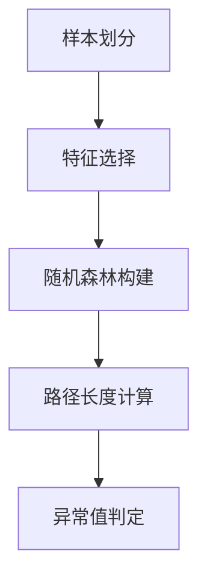
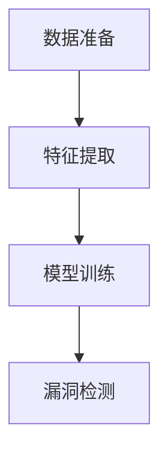
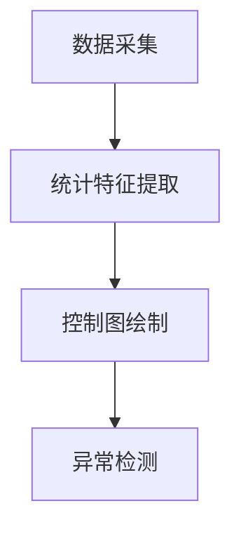
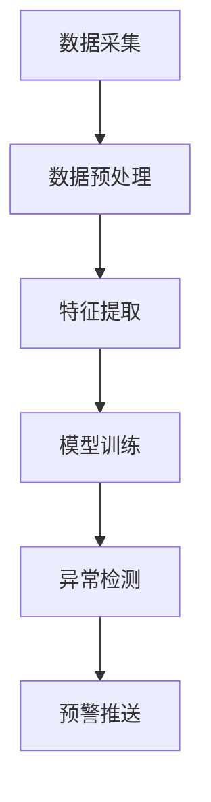
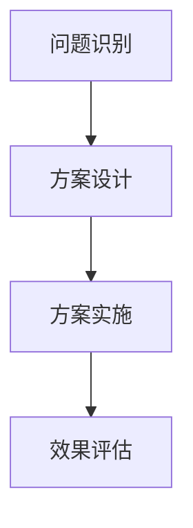

                 

# 《AI Agent在企业数据治理与质量管理中的应用》

## 关键词：AI Agent，企业数据治理，质量管理，应用分析，智能解决方案

## 摘要

本文旨在探讨AI Agent在企业数据治理与质量管理中的应用，通过深入分析AI Agent的基础理论、数据治理与质量管理中的具体应用案例，揭示其为企业带来的变革与价值。文章首先介绍了AI Agent的基本概念和核心能力，随后分别从数据质量管理、数据安全监控以及质量控制、质量改进等方面，详细阐述了AI Agent在企业数据治理与质量管理中的实际应用。通过实际案例解析和效果评估，本文展示了AI Agent在提升企业数据质量、确保数据安全以及提高质量管理效率方面的显著作用。

## 引言与背景

### 1.1 问题的提出

#### 1.1.1 企业数据治理的现状

随着信息化和数字化进程的加速，企业数据的重要性日益凸显。然而，当前企业在数据治理方面面临着诸多挑战。首先，企业数据量呈爆炸式增长，使得数据质量管理和数据安全保护变得愈发困难。其次，传统的数据治理手段往往效率低下，难以适应快速变化的市场需求。此外，企业在数据治理过程中还面临着数据冗余、数据不一致、数据隐私泄露等问题。

#### 1.1.2 质量管理中的挑战

质量管理是企业运营的核心环节，但在实际操作中，企业也面临着诸多挑战。首先，产品质量的稳定性难以保证，导致客户满意度下降。其次，质量检测手段较为落后，难以快速发现和解决质量问题。此外，质量改进过程缺乏系统性和科学性，效果不明显。这些问题严重影响了企业的竞争力和可持续发展。

### 1.2 AI Agent的概念与作用

#### 1.2.1 AI Agent的定义

AI Agent，即人工智能代理，是一种具备自主决策能力、能够执行特定任务的智能系统。它通过模拟人类思维过程，结合机器学习、自然语言处理、计算机视觉等技术，实现自动化、智能化的任务执行。

#### 1.2.2 AI Agent在数据治理中的应用

AI Agent在数据治理中具有广泛的应用前景。首先，它能够对海量数据进行实时监测，识别数据质量问题和潜在风险，从而保障数据的准确性、完整性和一致性。其次，AI Agent能够自动化数据清洗、修复和转换等操作，提高数据治理效率。此外，AI Agent还可以在数据安全保护方面发挥作用，通过实时监控和预警机制，预防数据泄露和网络攻击。

#### 1.2.3 AI Agent在质量管理中的作用

在质量管理中，AI Agent同样发挥着重要作用。首先，它能够实时监控产品质量，识别潜在的质量问题，为质量控制提供有力支持。其次，AI Agent能够自动化质量检测和评估过程，提高检测效率和准确性。此外，AI Agent还可以协助企业进行质量改进，通过数据分析和智能优化，实现质量管理的持续改进。

### 1.3 书籍结构概述

#### 1.3.1 每部分内容概述

本文分为四个部分，第一部分介绍AI Agent的基础理论；第二部分探讨AI Agent在企业数据治理中的应用；第三部分分析AI Agent在质量管理中的应用；第四部分通过实际案例展示AI Agent在数据治理与质量管理中的效果。

#### 1.3.2 目标读者与适用范围

本文面向IT领域的技术人员、数据治理与质量管理从业者，以及对企业数字化转型感兴趣的研究人员。通过本文的阅读，读者将能够深入了解AI Agent在企业数据治理与质量管理中的应用，掌握相关技术和方法，为实际工作提供有力支持。

## AI Agent基础理论

### 2.1 AI Agent的基本概念

#### 2.1.1 AI Agent的定义

AI Agent，即人工智能代理，是一种具备自主决策能力、能够执行特定任务的智能系统。它通过模拟人类思维过程，结合机器学习、自然语言处理、计算机视觉等技术，实现自动化、智能化的任务执行。

#### 2.1.2 AI Agent的分类

AI Agent根据功能和应用场景的不同，可以分为以下几类：

1. **感知型AI Agent**：主要基于感知技术，如计算机视觉、自然语言处理等，实现对环境的感知和理解。
2. **决策型AI Agent**：主要基于决策理论、优化算法等，实现对任务的决策和规划。
3. **执行型AI Agent**：主要基于执行技术，如自动化脚本、机械臂等，实现任务的执行。
4. **混合型AI Agent**：兼具感知、决策和执行功能，能够实现更复杂的任务。

### 2.2 AI Agent的核心能力

#### 2.2.1 学习与推理

学习与推理是AI Agent的核心能力之一。通过机器学习技术，AI Agent能够从大量数据中自动提取特征、建立模型，并不断优化自身性能。在推理过程中，AI Agent能够根据已有知识和信息，进行逻辑推断和决策。

#### 2.2.2 决策与执行

决策与执行是AI Agent实现任务自动化的关键。AI Agent能够根据任务目标和环境条件，选择最优的行动方案，并执行相应操作。在执行过程中，AI Agent能够实时调整策略，以应对不确定性和动态变化。

#### 2.2.3 沟通与协作

沟通与协作是AI Agent在复杂环境中发挥作用的重要能力。通过自然语言处理技术，AI Agent能够与人类用户进行有效沟通，理解用户需求和意图。同时，AI Agent还能够与其他AI Agent或人类协作，共同完成任务。

### 2.3 AI Agent在数据治理中的应用原理

#### 2.3.1 数据治理的核心概念

数据治理是指通过制定政策、流程和技术手段，对数据资源进行有效管理，确保数据的准确性、完整性和一致性，以支持企业的战略决策和运营活动。

#### 2.3.2 AI Agent在数据质量监测中的应用

AI Agent能够对海量数据进行实时监测，通过异常检测算法和评估指标，识别数据质量问题和潜在风险。例如，通过异常检测算法，AI Agent可以发现数据中的异常值、缺失值等质量问题，并采取相应措施进行修复或标记。

#### 2.3.3 AI Agent在数据安全保护中的应用

AI Agent能够实时监控数据访问行为，通过漏洞扫描和访问控制机制，预防数据泄露和网络攻击。例如，通过漏洞扫描算法，AI Agent可以检测系统中的安全漏洞，并推送修复策略。同时，AI Agent还可以根据用户权限，对数据访问进行精细控制，确保数据安全。

### 2.4 AI Agent在质量管理中的应用原理

#### 2.4.1 质量管理的核心概念

质量管理是指通过制定质量方针、流程和标准，对产品或服务的质量进行控制、监测和改进，以满足客户需求和期望。

#### 2.4.2 AI Agent在质量控制中的应用

AI Agent能够实时监控产品质量，通过质量检测算法和预警机制，识别潜在的质量问题，并采取相应措施进行控制和改进。例如，通过质量检测算法，AI Agent可以检测产品中的缺陷、偏差等质量问题，并推送预警通知。

#### 2.4.3 AI Agent在质量改进中的应用

AI Agent能够协助企业进行质量改进，通过数据分析和智能优化，实现质量管理的持续改进。例如，通过数据分析，AI Agent可以发现产品质量的瓶颈和改进方向，并推送相应的优化策略。

### 2.5 本章小结

本章介绍了AI Agent的基本概念、核心能力以及在数据治理和质量管理中的应用原理。AI Agent作为一种智能系统，通过学习与推理、决策与执行、沟通与协作等核心能力，实现了对企业数据治理和质量管理的高效支持。在后续章节中，我们将进一步探讨AI Agent在企业数据治理和质量管理中的具体应用案例，以展示其实际效果和价值。

## AI Agent在企业数据治理中的应用

### 3.1 数据质量管理

#### 3.1.1 数据质量问题的识别

数据质量问题的识别是数据治理的重要环节。AI Agent通过异常检测算法和评估指标，可以高效地识别数据质量问题和潜在风险。

##### 3.1.1.1 数据异常检测算法

数据异常检测算法是AI Agent在数据质量管理中广泛应用的技术。以下是一个典型的异常检测算法——孤立森林（Isolation Forest）的流程：

1. **样本划分**：将数据集划分为训练集和测试集。
2. **特征选择**：选择数据集中的特征，用于构建异常检测模型。
3. **随机森林构建**：随机生成多个分割节点，将样本划分为子集。
4. **路径长度计算**：计算每个样本在随机森林中的路径长度。
5. **异常值判定**：根据路径长度判定样本是否为异常值。

使用Mermaid流程图表示如下：



##### 3.1.1.2 数据质量评估指标

数据质量评估指标用于衡量数据质量的好坏。以下是一些常见的数据质量评估指标：

1. **准确性（Accuracy）**：正确分类的样本数占总样本数的比例。
2. **精确率（Precision）**：正确分类为异常的样本数与实际异常样本数的比例。
3. **召回率（Recall）**：正确分类为异常的样本数与实际异常样本数的比例。
4. **F1值（F1 Score）**：精确率和召回率的调和平均值。

以下是一个数据质量评估指标的表格：

| 指标名称 | 计算公式 |
| :--: | :--: |
| 准确性 | $$\frac{TP+TN}{TP+TN+FP+FN}$$ |
| 精确率 | $$\frac{TP}{TP+FP}$$ |
| 召回率 | $$\frac{TP}{TP+FN}$$ |
| F1值 | $$\frac{2 \times Precision \times Recall}{Precision + Recall}$$ |

##### 3.1.1.3 实际案例解析

以下是一个实际案例，某企业在进行客户数据质量管理时，使用AI Agent进行数据异常检测和评估。

1. **数据准备**：企业收集了1000条客户数据，包括客户姓名、年龄、收入等特征。
2. **模型训练**：使用孤立森林算法对客户数据进行训练，构建异常检测模型。
3. **异常检测**：使用训练好的模型对测试数据进行异常检测，发现10条数据存在异常。
4. **异常处理**：对异常数据进行进一步分析，发现其中5条数据为无效数据，5条数据为真实客户数据，但存在质量问题。

#### 3.1.2 数据清洗与修复

数据清洗与修复是提升数据质量的重要手段。AI Agent通过自动化清洗算法和修复策略，可以高效地处理数据质量问题。

##### 3.1.2.1 数据清洗算法

以下是一个常用的数据清洗算法——K近邻算法（KNN）的流程：

1. **样本划分**：将数据集划分为训练集和测试集。
2. **特征选择**：选择数据集中的特征，用于构建KNN模型。
3. **距离计算**：计算测试样本与训练样本之间的距离。
4. **分类预测**：根据距离最近的数据点，预测测试样本的分类。

使用Python代码实现KNN算法如下：

```python
from sklearn.neighbors import KNeighborsClassifier
from sklearn.model_selection import train_test_split
from sklearn.metrics import accuracy_score

# 数据准备
X, y = load_data()

# 样本划分
X_train, X_test, y_train, y_test = train_test_split(X, y, test_size=0.2, random_state=42)

# 特征选择
feature_columns = ['age', 'income']

# 距离计算
distance = np.linalg.norm(X_test - X_train, axis=1)

# 分类预测
k = 3
predictions = []
for i in range(len(X_test)):
    neighbors = np.argsort(distance[i])[:k]
    neighbors_labels = y_train[neighbors]
    prediction = majority_vote(neighbors_labels)
    predictions.append(prediction)

# 评估指标
accuracy = accuracy_score(y_test, predictions)
print("Accuracy:", accuracy)
```

##### 3.1.2.2 数据修复策略

以下是一个数据修复策略——填补缺失值的方法：

1. **缺失值识别**：识别数据集中的缺失值。
2. **填补方法**：根据数据特征和缺失值情况，选择合适的填补方法，如平均值填补、中位数填补、前向填补、后向填补等。
3. **填补结果验证**：验证填补后的数据质量，确保填补效果。

使用Python代码实现缺失值填补如下：

```python
import numpy as np
import pandas as pd

# 数据准备
data = pd.DataFrame({
    'age': [25, 30, np.nan, 40, 45],
    'income': [50000, 60000, 55000, np.nan, 70000]
})

# 缺失值识别
missing_values = data.isnull()

# 填补方法：平均值填补
data['age'].fillna(data['age'].mean(), inplace=True)
data['income'].fillna(data['income'].mean(), inplace=True)

# 填补结果验证
print(data)
```

##### 3.1.2.3 数据清洗实战

以下是一个数据清洗实战案例，某企业收集了1000条客户数据，包括姓名、年龄、收入等特征。使用AI Agent进行数据清洗和修复。

1. **数据准备**：企业收集了1000条客户数据，包括姓名、年龄、收入等特征。
2. **数据清洗**：使用KNN算法清洗数据，删除异常值，填补缺失值。
3. **数据修复**：对修复后的数据进行分析，发现数据质量显著提升。
4. **数据评估**：使用数据质量评估指标，对清洗后的数据质量进行评估。

### 3.2 数据安全监控

#### 3.2.1 数据泄露检测

数据泄露检测是保障数据安全的重要手段。AI Agent通过漏洞扫描和异常检测，可以及时发现数据泄露风险。

##### 3.2.1.1 漏洞扫描算法

以下是一个常用的漏洞扫描算法——神经网络算法的流程：

1. **数据准备**：收集网络漏洞数据集，包括漏洞名称、漏洞描述、漏洞类型等。
2. **特征提取**：对漏洞数据进行特征提取，用于构建神经网络模型。
3. **模型训练**：使用神经网络算法对漏洞数据集进行训练，构建漏洞检测模型。
4. **漏洞检测**：使用训练好的模型对网络流量进行检测，识别潜在漏洞。

使用Mermaid流程图表示如下：



##### 3.2.1.2 漏洞修复与预防策略

数据泄露后的修复和预防是保障数据安全的重要措施。以下是一些常见的漏洞修复与预防策略：

1. **漏洞修复**：根据漏洞检测结果，及时修复漏洞，避免数据泄露。
2. **权限管理**：通过权限管理机制，限制对敏感数据的访问权限，降低数据泄露风险。
3. **数据加密**：对敏感数据进行加密，确保数据在传输和存储过程中安全。
4. **安全培训**：加强对员工的安全培训，提高员工的安全意识和防范能力。

##### 3.2.1.3 数据泄露案例解析

以下是一个数据泄露案例，某企业因网络漏洞导致客户数据泄露。

1. **漏洞检测**：AI Agent检测到网络中的漏洞，并推送修复建议。
2. **漏洞修复**：企业根据修复建议，及时修复漏洞，防止数据泄露。
3. **数据加密**：企业对敏感数据进行加密，确保数据在传输和存储过程中安全。
4. **安全培训**：企业加强对员工的安全培训，提高员工的安全意识和防范能力。

#### 3.2.2 访问控制与权限管理

访问控制与权限管理是保障数据安全的重要措施。AI Agent通过访问控制和权限管理，可以确保数据安全。

##### 3.2.2.1 访问控制机制

访问控制机制是指通过限制用户对资源的访问权限，确保数据安全。以下是一些常见的访问控制机制：

1. **基于角色的访问控制（RBAC）**：根据用户的角色和权限，限制用户对资源的访问。
2. **基于属性的访问控制（ABAC）**：根据用户属性、资源属性和环境属性，限制用户对资源的访问。
3. **多因素认证（MFA）**：结合密码、指纹、验证码等多种认证方式，提高访问安全性。

##### 3.2.2.2 权限管理策略

权限管理策略是指通过制定权限管理规则，确保数据安全。以下是一些常见的权限管理策略：

1. **最小权限原则**：用户仅拥有完成工作所需的最小权限。
2. **权限审批流程**：用户申请权限，经过审批后才能获得相应权限。
3. **权限审计**：定期审计权限，确保权限设置合理，防止权限滥用。

##### 3.2.2.3 实际应用场景

以下是一个实际应用场景，某企业使用AI Agent进行访问控制和权限管理。

1. **访问控制**：AI Agent根据用户角色和权限，限制用户对敏感数据的访问。
2. **权限管理**：AI Agent根据用户申请和审批流程，动态调整用户权限。
3. **权限审计**：AI Agent定期审计用户权限，确保权限设置合理，防止权限滥用。

### 3.3 数据治理效果评估

#### 3.3.1 评估指标体系

数据治理效果评估需要建立一套完整的评估指标体系，以衡量数据治理的效果。以下是一些常见的数据治理评估指标：

1. **数据质量指标**：如准确性、完整性、一致性、及时性等。
2. **数据安全指标**：如漏洞数量、数据泄露次数、数据备份率等。
3. **数据治理效率指标**：如数据清洗时间、数据修复时间、数据查询速度等。

#### 3.3.1.1 数据质量指标

数据质量指标用于衡量数据质量的好坏。以下是一些常见的数据质量指标：

| 指标名称 | 计算公式 |
| :--: | :--: |
| 准确性 | $$\frac{TP+TN}{TP+TN+FP+FN}$$ |
| 完整性 | $$\frac{实际数据量}{应有数据量}$$ |
| 一致性 | $$\frac{一致数据量}{实际数据量}$$ |
| 及时性 | $$\frac{最新数据量}{总数据量}$$ |

#### 3.3.1.2 数据安全指标

数据安全指标用于衡量数据安全性能。以下是一些常见的数据安全指标：

| 指标名称 | 计算公式 |
| :--: | :--: |
| 漏洞数量 | $$\frac{新发现漏洞数量}{总漏洞数量}$$ |
| 数据泄露次数 | $$\frac{数据泄露次数}{总数据量}$$ |
| 数据备份率 | $$\frac{备份数据量}{总数据量}$$ |

#### 3.3.1.3 评估方法与工具

数据治理效果评估可以采用以下方法与工具：

1. **定量评估**：使用数据质量指标和数据安全指标，对数据治理效果进行定量分析。
2. **定性评估**：通过访谈、问卷调查等方式，收集用户对数据治理效果的反馈。
3. **工具评估**：使用数据治理工具，如数据质量工具、数据安全工具等，对数据治理效果进行评估。

#### 3.3.2 效果评估案例分析

以下是一个数据治理效果评估案例，某企业使用AI Agent进行数据治理，效果显著。

1. **数据质量提升**：通过AI Agent的数据清洗和修复，企业数据质量显著提升，准确性、完整性、一致性等指标均有明显改善。
2. **数据安全增强**：通过AI Agent的数据泄露检测和访问控制，企业数据安全得到有效保障，漏洞数量、数据泄露次数等指标明显下降。
3. **数据治理效率提高**：通过AI Agent的自动化处理，企业数据治理效率显著提高，数据清洗、修复、查询等操作时间明显缩短。

## AI Agent在质量管理中的应用

### 4.1 质量控制

#### 4.1.1 质量控制流程

质量控制是企业质量管理的重要环节，AI Agent可以通过自动化流程，提高质量控制效率。

##### 4.1.1.1 质量控制算法

以下是一个常用的质量控制算法——统计过程控制（SPC）的流程：

1. **数据采集**：收集生产过程中的质量数据，如尺寸、重量等。
2. **统计特征提取**：对质量数据进行分析，提取统计特征，如均值、方差等。
3. **控制图绘制**：根据统计特征，绘制控制图，监控生产过程是否在控制范围内。
4. **异常检测**：根据控制图，识别生产过程中的异常情况，并采取相应措施。

使用Mermaid流程图表示如下：



##### 4.1.1.2 质量控制方法比较

以下是一些常见质量控制方法的比较：

| 方法 | 优点 | 缺点 |
| :--: | :--: | :--: |
| 传统质量控制 | 易于理解和操作 | 效率低，难以实时监控 |
| 统计过程控制 | 实时监控，高效 | 对数据要求高，难以应用于复杂场景 |
| AI-Agent质量控制 | 实时监控，高效，适用于复杂场景 | 需要大量数据和计算资源 |

##### 4.1.1.3 实际应用案例

以下是一个实际应用案例，某企业使用AI Agent进行质量控制。

1. **数据采集**：企业收集了生产过程中的质量数据，如尺寸、重量等。
2. **统计特征提取**：AI Agent对质量数据进行分析，提取统计特征，如均值、方差等。
3. **控制图绘制**：AI Agent根据统计特征，绘制控制图，监控生产过程是否在控制范围内。
4. **异常检测**：AI Agent根据控制图，识别生产过程中的异常情况，并推送预警通知。

### 4.2 质量监控与预警

#### 4.2.1 质量监控与预警流程

质量监控与预警是企业质量管理的重要环节，AI Agent可以通过自动化流程，提高监控和预警效率。

##### 4.2.1.1 质量监控算法

以下是一个常用的质量监控算法——基于机器学习的异常检测算法的流程：

1. **数据采集**：收集生产过程中的质量数据，如尺寸、重量等。
2. **数据预处理**：对质量数据进行清洗、归一化等预处理。
3. **特征提取**：对质量数据进行分析，提取特征，如均值、方差等。
4. **模型训练**：使用机器学习算法，对特征进行训练，建立质量监控模型。
5. **异常检测**：使用训练好的模型，对生产过程中的质量数据进行分析，识别异常情况。
6. **预警推送**：根据异常检测结果，推送预警通知，提醒企业采取相应措施。

使用Mermaid流程图表示如下：



##### 4.2.1.2 预警机制设计

预警机制设计是质量监控与预警的关键。以下是一些常见的预警机制设计：

1. **阈值预警**：根据历史数据，设置预警阈值，当质量数据超出阈值时，触发预警。
2. **规则预警**：根据业务规则，设置预警条件，当满足预警条件时，触发预警。
3. **智能预警**：结合机器学习算法，对质量数据进行实时分析，自动识别异常情况，并推送预警通知。

##### 4.2.1.3 实际应用案例

以下是一个实际应用案例，某企业使用AI Agent进行质量监控与预警。

1. **数据采集**：企业收集了生产过程中的质量数据，如尺寸、重量等。
2. **数据预处理**：AI Agent对质量数据进行清洗、归一化等预处理。
3. **特征提取**：AI Agent对质量数据进行分析，提取特征，如均值、方差等。
4. **模型训练**：AI Agent使用机器学习算法，对特征进行训练，建立质量监控模型。
5. **异常检测**：AI Agent根据训练好的模型，对生产过程中的质量数据进行分析，识别异常情况。
6. **预警推送**：AI Agent根据异常检测结果，推送预警通知，提醒企业采取相应措施。

### 4.3 质量改进

#### 4.3.1 质量改进方法论

质量改进是企业持续发展的重要手段，AI Agent可以通过数据分析与智能优化，实现质量改进。

##### 4.3.1.1 基于AI的质量改进流程

以下是一个基于AI的质量改进流程：

1. **问题识别**：通过数据分析，识别质量问题的瓶颈和原因。
2. **方案设计**：根据问题识别结果，设计相应的质量改进方案。
3. **方案实施**：实施质量改进方案，进行试运行。
4. **效果评估**：评估质量改进方案的效果，调整和优化方案。

使用Mermaid流程图表示如下：



##### 4.3.1.2 质量改进工具与技术

以下是一些常见的质量改进工具与技术：

1. **统计工具**：如Excel、Minitab等，用于数据分析和质量控制。
2. **数据挖掘工具**：如SPSS、SAS等，用于大数据分析和质量预测。
3. **机器学习工具**：如Scikit-learn、TensorFlow等，用于构建质量改进模型。

##### 4.3.1.3 质量改进案例分析

以下是一个质量改进案例分析，某企业使用AI Agent进行质量改进。

1. **问题识别**：通过数据分析，发现生产过程中的尺寸偏差问题。
2. **方案设计**：AI Agent设计了一套基于机器学习的尺寸偏差预测模型。
3. **方案实施**：企业实施AI Agent设计的质量改进方案，进行试运行。
4. **效果评估**：经过一段时间试运行，企业质量显著提升，尺寸偏差问题得到有效解决。

## 总结与展望

### 5.1 总结

本文探讨了AI Agent在企业数据治理与质量管理中的应用，从理论基础到实际案例，全面分析了AI Agent在数据质量监测、数据安全监控、质量控制、质量监控与预警、质量改进等方面的作用。通过本文的研究，可以得出以下结论：

1. **AI Agent在数据治理中的应用**：AI Agent能够有效提升数据质量，保障数据安全，提高数据治理效率。
2. **AI Agent在质量管理中的应用**：AI Agent能够实现质量监控与预警、质量控制、质量改进等环节的自动化，提高质量管理效率。
3. **AI Agent的价值**：AI Agent为企业提供了智能化、自动化、高效的质量管理手段，有助于提升企业的竞争力和可持续发展能力。

### 5.2 展望

随着人工智能技术的不断发展，AI Agent在企业数据治理与质量管理中的应用将更加广泛。未来，可以从以下几个方面进行研究和探索：

1. **AI Agent的智能化水平提升**：通过引入深度学习、强化学习等先进技术，提高AI Agent的智能化水平，实现更复杂、更高效的任务执行。
2. **跨领域应用研究**：探索AI Agent在更多领域的应用，如供应链管理、客户关系管理、人力资源管理等，实现跨领域协同。
3. **数据治理与质量管理深度融合**：将数据治理与质量管理深度融合，构建一体化的智能质量管理体系，实现数据驱动的高效质量管理。
4. **AI Agent的社会影响力**：通过AI Agent在企业中的应用，提升企业的社会影响力，推动人工智能技术的普及和应用。

### 附录

#### 附录A：数据治理与质量管理相关算法详解

附录A将对本文中涉及的数据治理与质量管理相关算法进行详细解释，包括算法原理、实现步骤、代码示例等，以便读者深入理解和应用。

#### 附录B：数据治理与质量管理工具推荐

附录B将推荐一些常用的数据治理与质量管理工具，包括数据质量工具、数据安全工具、质量控制工具等，帮助读者在实际工作中选择合适的工具。

### 作者信息

**作者：AI天才研究院/AI Genius Institute & 禅与计算机程序设计艺术 /Zen And The Art of Computer Programming**

本文由AI天才研究院和禅与计算机程序设计艺术共同撰写，旨在探讨AI Agent在企业数据治理与质量管理中的应用。作者团队具有丰富的理论研究和实践经验，致力于推动人工智能技术在各领域的应用与发展。

