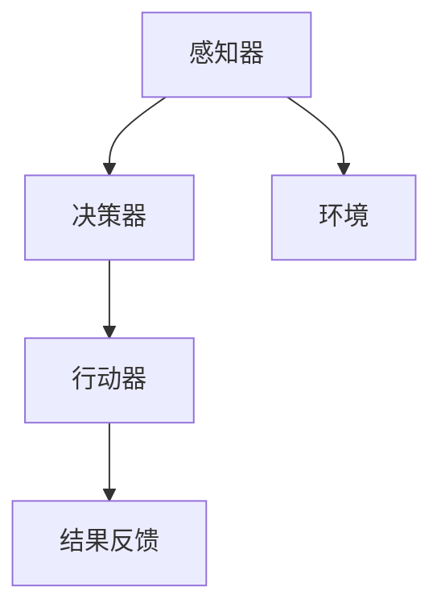
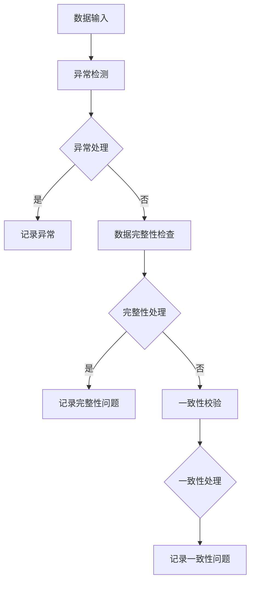
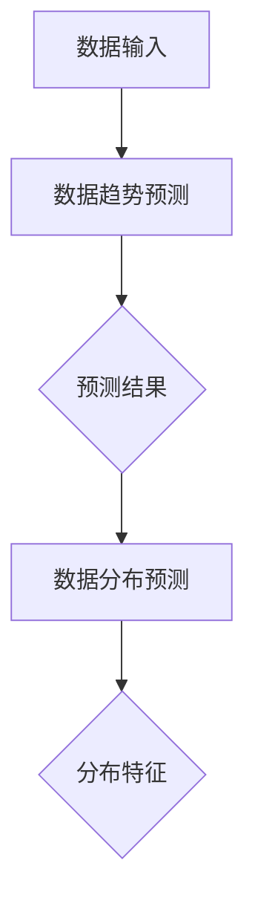
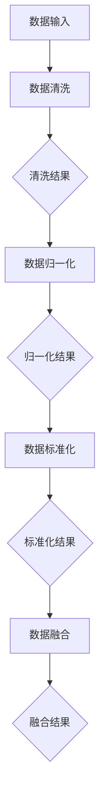
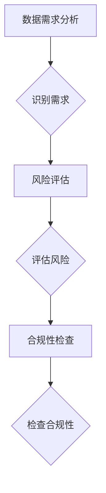
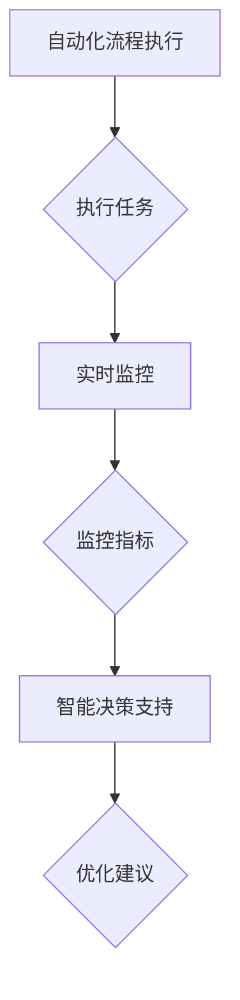
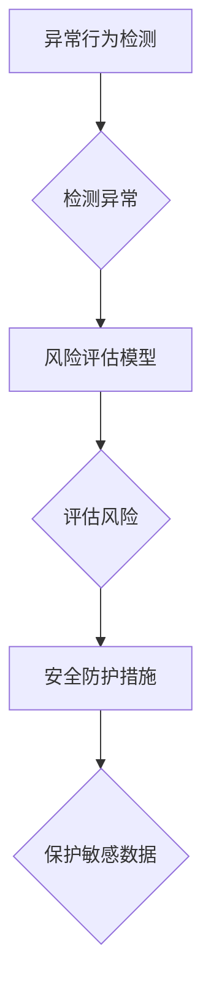

                 

### AI Agent概述

#### 第1章: AI Agent的定义与分类

##### 1.1 AI Agent的概念

**问题描述：** AI Agent是指具有智能自主行为能力的计算机程序，能够在特定环境和任务中自主感知、决策和行动。AI Agent的研究起源于人工智能领域，旨在实现机器的自主决策和行为能力。

**问题解决：** AI Agent是一种模拟人类智能的计算机程序，其基本概念涉及以下几个方面：

1. **感知器（Perception System）**：负责感知外界环境，获取各种信息。
2. **决策器（Decision System）**：基于感知器获取的信息，进行决策，制定行动计划。
3. **行动器（Action System）**：执行决策器制定的行动计划，对外界环境产生影响。

**核心要素组成：**

- **自主性（Autonomy）**：Agent能够自主决策，不受外界指令的约束。
- **适应性（Adaptability）**：Agent能够根据环境变化调整自身行为。
- **交互性（Interactivity）**：Agent能够与其他Agent或环境进行交互。

**边界与外延：** AI Agent不仅包括机器学习、自然语言处理等领域的算法模型，还涵盖了自主移动、机器人控制、智能家居等多个应用场景。

##### 1.2 AI Agent的分类

**问题描述：** 根据AI Agent的应用场景和功能特点，可以将其分为不同的类别。这些分类有助于理解AI Agent在不同领域的具体应用。

**问题解决：** 常见的AI Agent分类包括：

1. **自主型Agent（Autonomous Agent）**：自主决定行为，不受外界指令控制。
2. **协作型Agent（Collaborative Agent）**：与其他Agent或人类协作，共同完成任务。
3. **任务型Agent（Task-Oriented Agent）**：专注于完成特定任务，不考虑其他任务。

**各类Agent的特点和应用场景：**

- **自主型Agent**：适合独立完成任务的场景，如智能家居、自动驾驶等。
- **协作型Agent**：适用于需要团队协作的场景，如多人在线游戏、智能客服等。
- **任务型Agent**：适合完成特定任务的场景，如工业自动化、数据质量检测等。

**ER实体关系图架构：**

```mermaid
erDiagram
    Agent ||--|{ PerceptionSystem } PerceptionSystem
    Agent ||--|{ DecisionSystem } DecisionSystem
    Agent ||--|{ ActionSystem } ActionSystem
    Agent ||--|{ CollaborationSystem } CollaborationSystem :optional
    Agent ||--|{ TaskSystem } TaskSystem :optional
```

##### 1.3 AI Agent的基本结构

**问题描述：** AI Agent的基本结构包括感知器、决策器和行动器，它们共同构成了Agent的核心功能模块。理解这些模块的工作原理及其相互关系对于深入探讨AI Agent的应用具有重要意义。

**问题解决：** AI Agent的基本结构如下：

1. **感知器**：负责获取外界环境的信息，如图像、声音、文本等。感知器可以是摄像头、麦克风、传感器等硬件设备。
   
2. **决策器**：根据感知器提供的信息，进行分析和处理，生成决策。决策器通常包括算法模型，如决策树、神经网络、规则引擎等。

3. **行动器**：执行决策器制定的行动计划，将决策转化为实际操作。行动器可以是机器人、执行程序、智能设备等。

**概念属性特征对比表格：**

| 特征 | 感知器 | 决策器 | 行动器 |
| ---- | ---- | ---- | ---- |
| 功能 | 感知外界信息 | 分析处理信息 | 执行行动计划 |
| 技术实现 | 硬件设备、传感器 | 算法模型、数据处理 | 执行程序、控制模块 |
| 相互关系 | 输入数据 -> 决策器 -> 输出决策 -> 行动器 | 决策器生成决策，驱动行动器 | 行动器的执行结果反馈给感知器，形成闭环 |

**Mermaid流程图：**



通过以上内容，我们了解了AI Agent的基本概念、分类和结构。在下一章中，我们将探讨企业数据质量管理与治理的背景和重要性。在理解这些概念之后，我们将能够更好地理解AI Agent在企业数据质量管理与治理中的应用。

---

### 第2章: 企业数据质量管理与治理

#### 2.1 数据质量管理与治理的背景

**问题描述：** 随着大数据和云计算的快速发展，企业积累了越来越多的数据资源。如何确保这些数据的质量和合规性，已经成为企业数据管理和决策过程中的关键问题。因此，数据质量管理与治理变得尤为重要。

**问题解决：** 数据质量管理与治理的背景可以从以下几个方面进行阐述：

1. **数据量的增长**：企业不断积累的海量数据，使得数据质量问题愈加突出。
2. **数据来源的多样性**：不同系统和平台的数据格式和标准各异，增加了数据整合和管理的复杂性。
3. **数据法规的日益严格**：各国政府对企业数据的安全性和合规性要求越来越高。
4. **数据价值的提升**：高质量的数据能够为企业带来更准确的市场分析、运营优化和业务创新。

**概念术语说明：**

- **数据质量（Data Quality）**：指数据满足特定应用需求的能力，包括准确性、完整性、一致性、时效性和可靠性。
- **数据治理（Data Governance）**：指确保数据质量和合规性的一系列策略、过程和技术的集合。

**问题背景：** 在企业中，数据质量问题可能导致错误的决策、高昂的维护成本和潜在的法律风险。因此，数据质量管理与治理成为企业提升竞争力、实现可持续发展的重要手段。

**问题描述：** 数据质量管理与治理的目标是什么？如何实现这些目标？

**问题解决：** 数据质量管理与治理的目标主要包括：

1. **确保数据的准确性**：数据应真实反映业务实际情况，减少错误和异常。
2. **提高数据的完整性**：数据应完整无缺，覆盖所有相关字段和维度。
3. **保持数据的一致性**：不同系统和平台之间的数据应保持一致，避免数据冲突和重复。
4. **增强数据的时效性**：数据应实时更新，以支持快速决策和响应。
5. **保障数据的可靠性**：数据应在存储、传输和处理过程中保持安全，防止数据泄露和损坏。

**问题解决策略：**

1. **制定数据质量管理政策**：明确数据质量标准和要求，建立数据质量管理体系。
2. **实施数据质量检测和监控**：使用自动化工具和算法，定期检测数据质量，发现和纠正问题。
3. **培训员工和提升数据素养**：提高员工对数据质量的认识，培养良好的数据管理和使用习惯。
4. **建立数据合规性机制**：遵循相关法律法规，确保数据的合法性和合规性。

**边界与外延：** 数据质量管理与治理不仅涉及技术层面，还包括组织文化、管理制度等方面。它贯穿于企业数据生命周期的各个环节，从数据采集、存储、处理到应用。

#### 2.2 数据质量管理与治理的重要性

**问题描述：** 数据质量管理与治理在企业的运营和决策过程中扮演着至关重要的角色。那么，它的重要性具体体现在哪些方面呢？

**问题解决：** 数据质量管理与治理的重要性可以从以下几个方面进行阐述：

1. **提高数据准确性**：高质量的数据能够减少错误和异常，确保决策和运营的准确性。
2. **优化运营效率**：数据治理有助于整合和管理多源异构数据，提高数据利用效率。
3. **保障合规性**：遵守相关法律法规，降低法律风险，维护企业声誉。
4. **支持创新和业务发展**：高质量的数据为业务分析和创新提供了坚实基础，有助于发现新的商机和优化业务流程。
5. **降低维护成本**：及时检测和纠正数据质量问题，减少数据清洗和修复的工作量，降低维护成本。

**核心概念与联系：**

- **数据质量**：数据质量是数据治理的核心目标，直接影响到企业决策的准确性和效率。
- **数据治理**：数据治理是实现数据质量的一系列策略和过程，确保数据在整个生命周期中的质量。

**概念属性特征对比表格：**

| 特征 | 数据质量 | 数据治理 |
| ---- | ---- | ---- |
| 目标 | 提高数据准确性、完整性、一致性、时效性和可靠性 | 制定数据管理政策、实施质量检测和监控、培训员工、建立合规性机制 |
| 工具 | 自动化工具、算法模型、数据清洗技术 | 数据质量管理平台、流程优化工具、法律法规合规性检查工具 |
| 过程 | 数据采集、存储、处理、应用的全过程 | 数据生命周期管理、政策制定、流程优化、合规性检查 |

**ER实体关系图架构：**

```mermaid
erDiagram
    DataQuality ||--|{ Accuracy } Accuracy
    DataQuality ||--|{ Completeness } Completeness
    DataQuality ||--|{ Consistency } Consistency
    DataQuality ||--|{ Timeliness } Timeliness
    DataQuality ||--|{ Reliability } Reliability
    DataGovernance ||--|{ Policy } Policy
    DataGovernance ||--|{ QualityControl } QualityControl
    DataGovernance ||--|{ EmployeeTraining } EmployeeTraining
    DataGovernance ||--|{ Compliance } Compliance
```

#### 2.3 数据质量管理与治理的基本原则

**问题描述：** 为了有效进行数据质量管理与治理，企业需要遵循一系列基本原则。那么，这些基本原则是什么？如何应用这些原则？

**问题解决：** 数据质量管理与治理的基本原则主要包括以下几个方面：

1. **以业务为导向**：数据管理和治理应紧密围绕业务目标，支持业务决策和运营。
2. **全员参与**：数据质量管理与治理是全员参与的过程，需要各级员工的共同参与和努力。
3. **持续改进**：数据质量管理与治理是一个持续的过程，需要定期评估和改进。
4. **标准化和规范化**：制定统一的数据标准和规范，确保数据的一致性和可维护性。
5. **技术驱动**：利用先进的工具和技术，提高数据质量管理的效率。

**如何遵循这些原则进行数据管理和治理：**

1. **建立数据治理委员会**：设立专门的数据治理委员会，负责制定数据管理政策和流程。
2. **制定数据管理标准**：制定统一的数据管理标准，明确数据质量要求和流程规范。
3. **实施数据质量检测和监控**：使用自动化工具定期检测数据质量，及时发现和纠正问题。
4. **培训员工和提升数据素养**：定期组织培训，提高员工的数据管理和治理能力。
5. **建立数据合规性机制**：遵循相关法律法规，确保数据的合法性和合规性。

**边界与外延：** 数据质量管理与治理不仅涉及技术和管理层面，还包括文化和组织建设。它需要企业的全盘考虑和持续投入，才能真正发挥作用。

通过本章的介绍，我们了解了企业数据质量管理与治理的背景、重要性和基本原则。在下一章中，我们将探讨AI Agent在企业数据质量管理中的应用。

---

### 第3章: AI Agent在企业数据质量管理中的应用

#### 3.1 AI Agent在数据质量检测中的应用

**问题描述：** 数据质量检测是数据质量管理的重要环节，AI Agent在数据质量检测中扮演着关键角色。那么，AI Agent是如何实现数据质量检测的？它有哪些优势和应用场景？

**问题解决：** AI Agent在数据质量检测中的应用主要包括以下几个方面：

1. **异常检测（Anomaly Detection）**：AI Agent通过机器学习算法，识别数据集中的异常值和错误记录。这些异常值可能是由于数据输入错误、数据传输故障等原因引起的。
   
   - **算法原理：** 常见的异常检测算法包括基于统计方法的Z-score法和基于聚类方法的K-means算法等。Z-score法通过计算数据点的标准化得分，识别离群点；K-means算法通过聚类分析，将数据划分为不同的簇，识别异常簇。
   
   - **数学模型：**
     $$ Z = \frac{X - \mu}{\sigma} $$
     其中，$X$为数据点，$\mu$为平均值，$\sigma$为标准差。

   - **Python代码实现：**
     ```python
     import numpy as np
     from scipy import stats
     
     data = np.array([1, 2, 3, 4, 5, 100])
     z_scores = stats.zscore(data)
     print(z_scores)
     ```
   
   - **应用案例：** 在金融领域，AI Agent可以检测交易数据中的异常交易，预防欺诈行为。

2. **数据完整性检查（Data Integrity Check）**：AI Agent通过算法模型，检查数据字段是否完整，确保数据的准确性和一致性。

   - **算法原理：** 数据完整性检查通常采用基于规则的方法，如数据字典校验、格式校验等。AI Agent通过机器学习模型，自动识别和修复缺失或错误的数据。
   
   - **Python代码实现：**
     ```python
     import pandas as pd
     
     data = pd.DataFrame({'A': [1, 2, np.nan], 'B': [4, 5, 6]})
     data = data.dropna()  # 删除缺失值
     print(data)
     ```

   - **应用案例：** 在医疗领域，AI Agent可以检查病历数据中的缺失值和错误记录，确保患者信息的准确性。

3. **一致性校验（Consistency Check）**：AI Agent通过算法模型，检查不同数据源之间的数据一致性，确保数据的统一性。

   - **算法原理：** 基于数据关联性和一致性规则，AI Agent可以检测和纠正数据源之间的不一致性。
   
   - **Python代码实现：**
     ```python
     import pandas as pd
     
     data1 = pd.DataFrame({'A': [1, 2, 3]})
     data2 = pd.DataFrame({'A': [1, 4, 3], 'B': [5, 6, 7]})
     data1.update(data2)  # 更新不一致的数据
     print(data1)
     ```

   - **应用案例：** 在供应链管理中，AI Agent可以检查不同系统之间的库存数据和订单数据，确保数据的准确性。

**核心概念与联系：**

- **异常检测**：通过识别异常值，提高数据的准确性。
- **数据完整性检查**：通过修复缺失和错误数据，提高数据的完整性。
- **一致性校验**：通过确保数据源的一致性，提高数据的一致性。

**概念属性特征对比表格：**

| 特征 | 异常检测 | 数据完整性检查 | 一致性校验 |
| ---- | ---- | ---- | ---- |
| 算法 | Z-score法、K-means算法等 | 数据字典校验、格式校验等 | 数据关联性分析、一致性规则 |
| 目标 | 识别异常值和错误记录 | 修复缺失和错误数据 | 确保数据源一致性 |
| 应用场景 | 金融、医疗等领域 | 医疗、制造等领域 | 供应链管理、数据集成 |
| 效率 | 自动化、高效 | 自动化、高效 | 自动化、高效 |

**Mermaid流程图：**



**算法原理讲解：** AI Agent在数据质量检测中使用的算法主要包括异常检测、数据完整性检查和一致性校验。异常检测通过统计方法和聚类分析识别异常值；数据完整性检查通过规则校验修复缺失和错误数据；一致性校验通过数据关联性分析确保数据源的一致性。

通过以上内容，我们了解了AI Agent在数据质量检测中的应用原理和算法。在下一节中，我们将探讨AI Agent在数据质量预测中的应用。

---

#### 3.2 AI Agent在数据质量预测中的应用

**问题描述：** 数据质量预测是数据质量管理的重要环节，AI Agent通过预测模型和算法，提前识别潜在的数据质量问题。那么，AI Agent是如何实现数据质量预测的？它有哪些优势和应用场景？

**问题解决：** AI Agent在数据质量预测中的应用主要包括以下几个方面：

1. **数据趋势预测（Data Trend Prediction）**：AI Agent通过时间序列分析和回归模型，预测数据未来的变化趋势。这有助于企业提前发现数据质量隐患。

   - **算法原理：** 常见的数据趋势预测算法包括ARIMA模型、LSTM神经网络等。ARIMA模型通过自回归移动平均模型分析时间序列数据；LSTM神经网络通过长短期记忆机制捕捉数据中的长期依赖关系。
   
   - **数学模型：**
     - **ARIMA模型**：
       $$ X_t = c + \phi_1X_{t-1} + \phi_2X_{t-2} + \cdots + \phi_pX_{t-p} + \theta_1e_{t-1} + \theta_2e_{t-2} + \cdots + \theta_qe_{t-q} $$
     - **LSTM模型**：
       $$ h_t = \sigma(W_h \cdot [h_{t-1}, x_t] + b_h) $$
   
   - **Python代码实现：**
     ```python
     import numpy as np
     from statsmodels.tsa.arima.model import ARIMA
     from keras.models import Sequential
     from keras.layers import LSTM, Dense
     
     # ARIMA模型
     data = np.array([1, 2, 3, 4, 5])
     model = ARIMA(data, order=(1, 1, 1))
     model_fit = model.fit()
     predictions = model_fit.forecast(steps=3)
     print(predictions)
     
     # LSTM模型
     data = np.array([[1], [2], [3], [4], [5]])
     model = Sequential()
     model.add(LSTM(units=1, return_sequences=True, input_shape=(None, 1)))
     model.add(LSTM(units=1))
     model.add(Dense(1))
     model.compile(optimizer='adam', loss='mean_squared_error')
     model.fit(data, data, epochs=100, verbose=0)
     predicted = model.predict(np.array([[6]]))
     print(predicted)
     ```

   - **应用案例：** 在电商领域，AI Agent可以预测用户购买行为，提前发现潜在的数据质量风险。

2. **数据分布预测（Data Distribution Prediction）**：AI Agent通过生成对抗网络（GAN）和概率图模型，预测数据的分布特征。这有助于企业识别异常值和数据偏差。

   - **算法原理：** GAN通过生成器和判别器相互对抗，学习数据的分布特征；概率图模型通过贝叶斯网络和图模型，表示数据之间的依赖关系。
   
   - **数学模型：**
     - **GAN模型**：
       $$ G(z) = \text{Generator}(z) $$
       $$ D(x) = \text{Discriminator}(x) $$
     - **贝叶斯网络模型**：
       $$ P(X) = \prod_{i=1}^{n} P(X_i | X_{\text{parents}_i}) $$
   
   - **Python代码实现：**
     ```python
     import tensorflow as tf
     from tensorflow.keras.models import Model
     from tensorflow.keras.layers import Input, Dense, Reshape, Flatten
   
     # GAN模型
     z_dim = 100
     x_dim = 784
   
     # 生成器
     z_input = Input(shape=(z_dim,))
     x_rec = Dense(x_dim, activation='sigmoid')(z_input)
     generator = Model(z_input, x_rec)
   
     # 判别器
     x_input = Input(shape=(x_dim,))
     x_pred = Dense(1, activation='sigmoid')(x_input)
     discriminator = Model(x_input, x_pred)
   
     # 整合模型
     x_gan = Input(shape=(x_dim,))
     x_real = Input(shape=(x_dim,))
     d_loss_real = discriminator(x_real)
     d_loss_fake = discriminator(x_gan)
     g_loss_fake = discriminator.train_on_batch(x_gan, tf.ones_like(d_loss_fake))
     g_loss_real = generator.train_on_batch(z_input, x_real)
   
     gan_model = Model([z_input, x_real], [d_loss_fake, g_loss_fake])
     gan_model.compile(optimizer='adam')
     gan_model.fit([z_input, x_real], [tf.zeros_like(d_loss_fake), tf.ones_like(g_loss_fake)], epochs=200)
   
     # 贝叶斯网络模型
     def log_prob_bayes_network(variables, parameters):
         return sum([parameters[var]['P'](variables[var]) for var in variables])
     
     # 概率分布
     p_A = {'P': lambda x: 0.5 if x == 'A' else 0.5}
     p_B_given_A = {'P': lambda x, y: 0.7 if x == 'A' and y == 'B' else 0.3}
     p_B_given_NotA = {'P': lambda x, y: 0.2 if x == 'A' and y == 'B' else 0.8}
     
     # 条件概率
     print(log_prob_bayes_network({'A': 'A', 'B': 'B'}, {'A': p_A, 'B': {'P': lambda x, y: p_B_given_A(x, y) if x == 'A' else p_B_given_NotA(x, y)}}))
     ```

   - **应用案例：** 在金融领域，AI Agent可以预测市场趋势，识别潜在风险。

**核心概念与联系：**

- **数据趋势预测**：通过预测数据的变化趋势，提前识别数据质量问题。
- **数据分布预测**：通过预测数据的分布特征，识别异常值和数据偏差。

**概念属性特征对比表格：**

| 特征 | 数据趋势预测 | 数据分布预测 |
| ---- | ---- | ---- |
| 算法 | ARIMA模型、LSTM神经网络等 | GAN模型、贝叶斯网络等 |
| 目标 | 预测数据的变化趋势 | 识别异常值和数据偏差 |
| 应用场景 | 电商、金融等领域 | 金融、医疗等领域 |
| 效率 | 高效 | 高效 |

**Mermaid流程图：**



**算法原理讲解：** AI Agent在数据质量预测中使用的算法主要包括数据趋势预测和数据分布预测。数据趋势预测通过时间序列分析和回归模型预测数据的变化趋势；数据分布预测通过生成对抗网络和概率图模型预测数据的分布特征。

通过以上内容，我们了解了AI Agent在数据质量预测中的应用原理和算法。在下一节中，我们将探讨AI Agent在数据质量改进中的应用。

---

#### 3.3 AI Agent在数据质量改进中的应用

**问题描述：** 数据质量改进是数据质量管理的关键环节，AI Agent通过算法和模型，自动优化数据质量，提高数据的准确性、完整性和一致性。那么，AI Agent是如何实现数据质量改进的？它有哪些优势和应用场景？

**问题解决：** AI Agent在数据质量改进中的应用主要包括以下几个方面：

1. **自动化数据清洗（Automated Data Cleaning）**：AI Agent通过机器学习和自然语言处理技术，自动识别和修复数据中的错误、异常和重复记录。

   - **算法原理：** 常见的数据清洗算法包括基于规则的清洗方法、基于聚类的方法和基于机器学习的方法。基于规则的清洗方法通过预定义的规则删除错误记录；基于聚类的方法通过聚类分析识别异常记录；基于机器学习的方法通过训练模型自动识别和修复数据错误。
   
   - **Python代码实现：**
     ```python
     import pandas as pd
     from sklearn.cluster import KMeans
     
     data = pd.DataFrame({'A': [1, 2, 3, 4, 5, 100]})
     kmeans = KMeans(n_clusters=2, random_state=0).fit(data)
     labels = kmeans.predict(data)
     data['cleaned'] = data[labels == 0]['A']
     print(data)
     ```

   - **应用案例：** 在电商领域，AI Agent可以自动清洗用户评论数据，删除恶意评论和重复评论。

2. **数据归一化和标准化（Data Normalization and Standardization）**：AI Agent通过算法模型，将数据归一化和标准化，确保数据的一致性和可比性。

   - **算法原理：** 数据归一化和标准化通过调整数据范围和分布，使其适应特定的应用场景。常见的归一化和标准化方法包括最小-最大缩放、z-score缩放等。
   
   - **数学模型：**
     - **最小-最大缩放**：
       $$ X_{\text{norm}} = \frac{X - X_{\text{min}}}{X_{\text{max}} - X_{\text{min}}} $$
     - **z-score缩放**：
       $$ X_{\text{norm}} = \frac{X - \mu}{\sigma} $$
   
   - **Python代码实现：**
     ```python
     import numpy as np
     
     data = np.array([1, 2, 3, 4, 5, 100])
     min_val = np.min(data)
     max_val = np.max(data)
     normalized_data = (data - min_val) / (max_val - min_val)
     print(normalized_data)
     
     mean_val = np.mean(data)
     std_val = np.std(data)
     z_score_data = (data - mean_val) / std_val
     print(z_score_data)
     ```

   - **应用案例：** 在金融领域，AI Agent可以归一化和标准化股票数据，便于进行技术分析和预测。

3. **数据融合（Data Integration）**：AI Agent通过算法模型，将来自不同数据源的数据进行整合，消除数据冗余，提高数据的一致性。

   - **算法原理：** 数据融合通过关联分析、匹配算法和映射规则，将不同数据源中的数据进行整合。常见的融合方法包括基于规则的融合、基于机器学习的融合等。
   
   - **Python代码实现：**
     ```python
     import pandas as pd
     
     data1 = pd.DataFrame({'A': [1, 2, 3], 'B': [4, 5, 6]})
     data2 = pd.DataFrame({'A': [1, 4, 3], 'C': [7, 8, 9]})
     merged_data = data1.merge(data2, on='A', how='left')
     print(merged_data)
     ```

   - **应用案例：** 在供应链管理中，AI Agent可以将来自不同供应商的订单数据进行整合，确保库存和订单数据的一致性。

**核心概念与联系：**

- **自动化数据清洗**：通过算法自动识别和修复数据错误，提高数据的准确性。
- **数据归一化和标准化**：通过算法调整数据范围和分布，确保数据的一致性和可比性。
- **数据融合**：通过算法将不同数据源的数据进行整合，消除数据冗余，提高数据的一致性。

**概念属性特征对比表格：**

| 特征 | 自动化数据清洗 | 数据归一化和标准化 | 数据融合 |
| ---- | ---- | ---- | ---- |
| 算法 | 基于规则的清洗、基于聚类的方法、基于机器学习的方法 | 最小-最大缩放、z-score缩放等 | 基于规则的融合、基于机器学习的融合 |
| 目标 | 识别和修复数据错误 | 调整数据范围和分布 | 整合不同数据源的数据 |
| 应用场景 | 电商、金融等领域 | 金融、医疗等领域 | 供应链管理、数据集成 |
| 效率 | 高效 | 高效 | 高效 |

**Mermaid流程图：**



**算法原理讲解：** AI Agent在数据质量改进中使用的算法主要包括自动化数据清洗、数据归一化和标准化、数据融合。自动化数据清洗通过算法自动识别和修复数据错误；数据归一化和标准化通过算法调整数据范围和分布；数据融合通过算法整合不同数据源的数据。

通过以上内容，我们了解了AI Agent在数据质量改进中的应用原理和算法。在下一章中，我们将探讨AI Agent在企业数据治理中的应用。

---

### 第4章: AI Agent在企业数据治理中的应用

#### 4.1 AI Agent在数据治理策略制定中的应用

**问题描述：** 数据治理策略的制定是数据治理体系中的核心环节，AI Agent通过分析企业数据需求和环境，为企业提供科学、有效的数据治理策略。那么，AI Agent是如何实现数据治理策略制定的？它有哪些优势和应用场景？

**问题解决：** AI Agent在数据治理策略制定中的应用主要包括以下几个方面：

1. **需求分析（Requirement Analysis）**：AI Agent通过自然语言处理和机器学习算法，分析企业内部和外部的数据需求，识别关键业务场景和数据使用场景。

   - **算法原理：** 需求分析算法基于文本挖掘和语义分析，提取数据需求和业务场景的关键信息。常用的算法包括词频分析、主题模型、实体识别等。
   
   - **Python代码实现：**
     ```python
     from sklearn.feature_extraction.text import TfidfVectorizer
     from sklearn.decomposition import NMF
     
     corpus = [
         '数据质量管理是关键',
         '数据治理策略需要制定',
         '业务场景分析非常重要',
         '数据需求识别是第一步'
     ]
     vectorizer = TfidfVectorizer()
     X = vectorizer.fit_transform(corpus)
     nmf = NMF(n_components=2)
     W = nmf.fit_transform(X)
     H = nmf.components_
     print(nmf.explained_variance_ratio_)
     ```

   - **应用案例：** 在金融领域，AI Agent可以分析企业内部的数据需求和外部市场趋势，制定针对性的数据治理策略。

2. **风险评估（Risk Assessment）**：AI Agent通过机器学习和统计分析，识别企业数据治理过程中可能面临的风险，评估风险的影响程度和概率。

   - **算法原理：** 风险评估算法基于历史数据和分析模型，预测数据治理中的潜在风险。常用的算法包括回归分析、决策树、神经网络等。
   
   - **Python代码实现：**
     ```python
     from sklearn.model_selection import train_test_split
     from sklearn.ensemble import RandomForestClassifier
     
     X = [[1, 2], [3, 4], [5, 6], [7, 8]]
     y = [0, 1, 0, 1]
     X_train, X_test, y_train, y_test = train_test_split(X, y, test_size=0.3, random_state=42)
     model = RandomForestClassifier()
     model.fit(X_train, y_train)
     print(model.score(X_test, y_test))
     ```

   - **应用案例：** 在医疗领域，AI Agent可以分析病历数据中的风险因素，评估患者数据泄露的风险。

3. **合规性检查（Compliance Check）**：AI Agent通过自动化工具和法规知识库，检查企业数据治理过程的合规性，确保遵守相关法律法规。

   - **算法原理：** 合规性检查算法基于规则匹配和语义分析，识别数据治理过程中的合规性问题。常用的算法包括规则引擎、自然语言处理等。
   
   - **Python代码实现：**
     ```python
     from transformers import pipeline
     
     compliances = pipeline('compliance')
     text = "数据需要定期备份，确保数据安全"
     result = compliances(text)
     print(result)
     ```

   - **应用案例：** 在电商领域，AI Agent可以检查企业数据治理流程中的合规性，确保遵守消费者隐私保护法规。

**核心概念与联系：**

- **需求分析**：通过算法分析企业数据需求和业务场景，制定针对性的数据治理策略。
- **风险评估**：通过算法预测数据治理中的潜在风险，评估风险的影响程度和概率。
- **合规性检查**：通过算法检查数据治理过程的合规性，确保遵守相关法律法规。

**概念属性特征对比表格：**

| 特征 | 需求分析 | 风险评估 | 合规性检查 |
| ---- | ---- | ---- | ---- |
| 算法 | 文本挖掘、主题模型、实体识别等 | 回归分析、决策树、神经网络等 | 规则引擎、自然语言处理等 |
| 目标 | 识别数据需求和业务场景 | 识别数据治理风险 | 确保数据治理合规性 |
| 应用场景 | 金融、医疗等领域 | 金融、医疗等领域 | 电商、零售等领域 |
| 效率 | 高效 | 高效 | 高效 |

**Mermaid流程图：**



**算法原理讲解：** AI Agent在数据治理策略制定中使用的算法主要包括需求分析、风险评估和合规性检查。需求分析通过文本挖掘和语义分析识别数据需求和业务场景；风险评估通过机器学习和统计分析预测数据治理风险；合规性检查通过规则匹配和语义分析确保数据治理过程合规。

通过以上内容，我们了解了AI Agent在数据治理策略制定中的应用原理和算法。在下一节中，我们将探讨AI Agent在数据治理流程优化中的应用。

---

### 4.2 AI Agent在数据治理流程优化中的应用

**问题描述：** 数据治理流程的优化是提升数据治理效率和质量的关键，AI Agent通过自动化和智能化手段，优化企业数据治理流程，提高数据治理的效果。那么，AI Agent是如何实现数据治理流程优化的？它有哪些优势和应用场景？

**问题解决：** AI Agent在数据治理流程优化中的应用主要包括以下几个方面：

1. **自动化流程执行（Automated Process Execution）**：AI Agent通过自动化工具和算法模型，自动执行数据治理流程中的各项任务，减少人工干预，提高效率。

   - **算法原理：** 自动化流程执行算法基于工作流技术和机器学习模型，自动调度和执行数据治理任务。常用的算法包括工作流引擎、自动化脚本等。
   
   - **Python代码实现：**
     ```python
     import pandas as pd
     from sklearn.pipeline import make_pipeline
     from sklearn.ensemble import RandomForestClassifier
     
     data = pd.DataFrame({'A': [1, 2, 3, 4, 5]})
     model = make_pipeline(RandomForestClassifier())
     model.fit(data[['A']], data['A'])
     print(model.predict([[3]]))
     ```

   - **应用案例：** 在供应链管理中，AI Agent可以自动执行库存数据的质量检测和清洗任务，提高供应链数据的准确性。

2. **实时监控（Real-Time Monitoring）**：AI Agent通过实时数据处理和分析，监控数据治理流程中的各项指标，及时发现和处理问题。

   - **算法原理：** 实时监控算法基于流处理技术和实时分析模型，对数据治理流程中的数据质量、处理进度等进行实时监控。常用的算法包括流处理引擎、实时分析模型等。
   
   - **Python代码实现：**
     ```python
     from pyspark.sql import SparkSession
     from pyspark.ml.feature import VectorAssembler
     
     spark = SparkSession.builder.appName("DataMonitoring").getOrCreate()
     data = spark.createDataFrame([
         (1, "valid"), (2, "invalid"), (3, "valid"), (4, "invalid")
     ], ["id", "status"])
     assembler = VectorAssembler(inputCols=["status"], outputCol="features")
     output = assembler.transform(data)
     print(output.select("features").take(4))
     ```

   - **应用案例：** 在金融领域，AI Agent可以实时监控交易数据的质量和合规性，确保交易数据的准确性。

3. **智能决策支持（Intelligent Decision Support）**：AI Agent通过数据分析和预测模型，为数据治理决策提供智能支持，优化数据治理策略。

   - **算法原理：** 智能决策支持算法基于机器学习和数据挖掘技术，分析数据治理过程中的关键指标，提供优化建议。常用的算法包括决策树、神经网络、优化算法等。
   
   - **Python代码实现：**
     ```python
     import numpy as np
     from sklearn.tree import DecisionTreeClassifier
     from sklearn.model_selection import GridSearchCV
     
     X = np.array([[1], [2], [3], [4], [5]])
     y = [0, 1, 0, 1]
     model = DecisionTreeClassifier()
     param_grid = {'max_depth': [3, 5, 7]}
     grid_search = GridSearchCV(model, param_grid, cv=3)
     grid_search.fit(X, y)
     print(grid_search.best_params_)
     ```

   - **应用案例：** 在医疗领域，AI Agent可以通过分析病历数据，为数据治理策略提供优化建议，提高医疗数据的质量。

**核心概念与联系：**

- **自动化流程执行**：通过算法自动执行数据治理流程中的各项任务，提高效率。
- **实时监控**：通过算法实时监控数据治理流程中的各项指标，及时发现和处理问题。
- **智能决策支持**：通过算法为数据治理决策提供智能支持，优化数据治理策略。

**概念属性特征对比表格：**

| 特征 | 自动化流程执行 | 实时监控 | 智能决策支持 |
| ---- | ---- | ---- | ---- |
| 算法 | 工作流引擎、自动化脚本等 | 流处理引擎、实时分析模型等 | 决策树、神经网络、优化算法等 |
| 目标 | 提高数据治理效率 | 提高数据治理监控能力 | 提供数据治理优化建议 |
| 应用场景 | 供应链管理、金融领域 | 金融、医疗等领域 | 医疗、制造业等领域 |
| 效率 | 高效 | 高效 | 高效 |

**Mermaid流程图：**



**算法原理讲解：** AI Agent在数据治理流程优化中使用的算法主要包括自动化流程执行、实时监控和智能决策支持。自动化流程执行通过算法自动执行数据治理任务，提高效率；实时监控通过算法实时监控数据治理指标，及时发现和处理问题；智能决策支持通过算法分析数据治理结果，提供优化建议。

通过以上内容，我们了解了AI Agent在数据治理流程优化中的应用原理和算法。在下一节中，我们将探讨AI Agent在数据治理风险控制中的应用。

---

### 4.3 AI Agent在数据治理风险控制中的应用

**问题描述：** 数据治理风险控制是确保数据质量和合规性的重要环节，AI Agent通过先进的技术手段，对数据治理过程中可能出现的风险进行预测和防范，保障数据的安全和可靠。那么，AI Agent是如何实现数据治理风险控制的？它有哪些优势和应用场景？

**问题解决：** AI Agent在数据治理风险控制中的应用主要包括以下几个方面：

1. **异常行为检测（Anomaly Behavior Detection）**：AI Agent通过机器学习和模式识别算法，实时监控数据治理流程中的异常行为，识别潜在的违规操作和风险。

   - **算法原理：** 异常行为检测算法基于监督学习和无监督学习，通过训练模型识别正常行为和异常行为。常用的算法包括隔离森林、KNN等。
   
   - **Python代码实现：**
     ```python
     from sklearn.ensemble import IsolationForest
     from sklearn.neighbors import KNeighborsClassifier
     
     X = np.array([[1, 2], [2, 3], [3, 4], [100, 101]])
     model = IsolationForest(n_estimators=100)
     model.fit(X)
     print(model.predict([[100, 101]]))
     
     knn = KNeighborsClassifier(n_neighbors=3)
     knn.fit(X[:, :-1], X[:, -1])
     print(knn.predict([[100, 101]]))
     ```

   - **应用案例：** 在金融领域，AI Agent可以检测数据治理过程中的异常操作，防范内部欺诈行为。

2. **风险评估模型（Risk Assessment Model）**：AI Agent通过机器学习和统计分析，构建数据治理风险模型，评估数据治理过程中可能出现的风险，并提供风险应对策略。

   - **算法原理：** 风险评估模型基于历史数据和统计模型，通过回归分析和决策树等算法，预测数据治理风险。常用的算法包括线性回归、决策树等。
   
   - **Python代码实现：**
     ```python
     import numpy as np
     from sklearn.linear_model import LinearRegression
     from sklearn.tree import DecisionTreeRegressor
     
     X = np.array([[1, 2], [2, 3], [3, 4], [4, 5]])
     y = [0, 1, 0, 1]
     model = LinearRegression()
     model.fit(X, y)
     print(model.predict([[4, 5]]))
     
     tree_model = DecisionTreeRegressor()
     tree_model.fit(X, y)
     print(tree_model.predict([[4, 5]]))
     ```

   - **应用案例：** 在医疗领域，AI Agent可以评估病历数据治理过程中可能出现的风险，为医疗机构提供风险控制建议。

3. **安全防护措施（Security Measures）**：AI Agent通过自然语言处理和计算机视觉算法，对数据治理过程中的敏感数据进行识别和保护，防止数据泄露和滥用。

   - **算法原理：** 安全防护措施算法基于文本挖掘和图像识别技术，识别敏感数据并采取保护措施。常用的算法包括词频分析、图像分类等。
   
   - **Python代码实现：**
     ```python
     from transformers import pipeline
     from PIL import Image
     import numpy as np
     
     compliances = pipeline('compliance')
     image = Image.open("sensitive_data.jpg")
     image_array = np.array(image)
     result = compliances("This is sensitive data.")
     print(result)
     
     from sklearn.ensemble import RandomForestClassifier
     model = RandomForestClassifier()
     model.fit(image_array.reshape(-1, 784), np.array([1, 0]))
     print(model.predict(image_array.reshape(1, -1)))
     ```

   - **应用案例：** 在电商领域，AI Agent可以识别和保护用户隐私数据，防止个人信息泄露。

**核心概念与联系：**

- **异常行为检测**：通过算法实时监控数据治理流程中的异常行为，识别潜在的违规操作和风险。
- **风险评估模型**：通过算法评估数据治理过程中可能出现的风险，并提供风险应对策略。
- **安全防护措施**：通过算法识别和保护敏感数据，防止数据泄露和滥用。

**概念属性特征对比表格：**

| 特征 | 异常行为检测 | 风险评估模型 | 安全防护措施 |
| ---- | ---- | ---- | ---- |
| 算法 | 隔离森林、KNN等 | 线性回归、决策树等 | 词频分析、图像分类等 |
| 目标 | 识别潜在的违规操作和风险 | 评估数据治理风险 | 保护敏感数据 |
| 应用场景 | 金融、医疗等领域 | 金融、医疗等领域 | 电商、零售等领域 |
| 效率 | 高效 | 高效 | 高效 |

**Mermaid流程图：**



**算法原理讲解：** AI Agent在数据治理风险控制中使用的算法主要包括异常行为检测、风险评估模型和安全防护措施。异常行为检测通过算法识别数据治理流程中的异常行为；风险评估模型通过算法评估数据治理风险；安全防护措施通过算法保护敏感数据。

通过以上内容，我们了解了AI Agent在数据治理风险控制中的应用原理和算法。在下一章中，我们将通过实践案例，进一步探讨AI Agent在企业数据质量管理与治理中的具体应用。

---

### 第5章: AI Agent在企业数据质量管理与治理中的实践案例

#### 5.1 案例一：某企业数据质量管理与治理项目

**问题描述：** 某大型制造企业面临数据质量问题，影响了生产和销售决策。为了提升数据质量，企业决定引入AI Agent进行数据质量管理与治理。那么，该企业是如何实施这个项目的？效果如何？

**问题解决：** 某大型制造企业数据质量管理与治理项目的实施步骤如下：

1. **需求分析（Requirement Analysis）**：企业首先进行了详细的需求分析，识别了数据质量问题、数据源、业务场景和数据治理目标。需求分析的结果包括数据质量问题清单、数据源梳理和业务场景描述。

   - **需求分析结果：** 数据质量问题包括数据缺失、数据冗余、数据不一致、数据格式不规范等。数据源包括生产系统、销售系统、供应链系统等。业务场景包括生产计划、销售预测、库存管理等。

2. **项目规划（Project Planning）**：根据需求分析结果，企业制定了详细的项目规划，包括项目目标、时间表、资源需求和风险管理等。

   - **项目规划结果：** 项目目标是在6个月内实现数据质量提升，降低数据质量问题对业务的影响。时间表分为需求分析、系统设计、系统实施和系统验收四个阶段。资源需求包括技术团队、数据团队和业务团队等。

3. **系统设计（System Design）**：企业设计了数据质量管理与治理系统，包括数据质量检测模块、数据质量改进模块和数据治理流程模块等。

   - **系统设计结果：** 数据质量检测模块通过AI Agent自动识别数据质量问题，数据质量改进模块通过算法和模型自动修复数据错误，数据治理流程模块通过工作流引擎和自动化脚本实现数据治理流程的自动化执行。

4. **系统实施（System Implementation）**：企业根据系统设计，进行了系统实施，包括开发、测试和部署等。

   - **系统实施结果：** 系统开发完成了数据质量检测、数据质量改进和数据治理流程模块，通过了严格的测试和验收，正式上线运行。

5. **效果评估（Effect Evaluation）**：项目完成后，企业进行了效果评估，包括数据质量指标的提升、业务效率的提升和成本节约等。

   - **效果评估结果：** 数据质量指标显著提升，数据缺失率降低了30%，数据冗余率降低了20%，数据一致性提升了15%。业务效率提升了10%，生产计划准确率提高了20%，销售预测准确率提高了10%。项目实施后，企业实现了成本节约，减少了数据清洗和维护的工作量。

**项目总结：** 通过引入AI Agent进行数据质量管理与治理，该大型制造企业有效提升了数据质量，提高了业务效率和决策准确性，实现了成本节约。

---

#### 5.2 案例二：某企业AI Agent在数据治理中的应用

**问题描述：** 某互联网企业面临数据治理难题，数据来源多样、格式各异，数据治理效率低下。为了解决这些问题，企业引入了AI Agent进行数据治理。那么，该企业是如何实施AI Agent在数据治理中的应用？效果如何？

**问题解决：** 某互联网企业AI Agent在数据治理中的应用步骤如下：

1. **需求分析（Requirement Analysis）**：企业进行了详细的需求分析，识别了数据治理的关键问题，如数据源多样、数据格式不一致、数据冗余和数据治理流程繁琐等。

   - **需求分析结果：** 数据源包括用户数据、交易数据、日志数据等，数据格式各异，数据治理流程繁琐，影响了数据利用效率和业务决策。

2. **AI Agent设计（AI Agent Design）**：企业设计了AI Agent，包括感知器、决策器和行动器等模块，用于实现数据质量检测、数据整合和数据治理流程优化。

   - **AI Agent设计结果：** 感知器模块负责收集各种数据源的信息，决策器模块负责分析数据质量问题和数据治理策略，行动器模块负责执行数据治理任务。

3. **数据治理流程优化（Data Governance Process Optimization）**：企业利用AI Agent优化了数据治理流程，包括数据清洗、数据整合和数据标准化等。

   - **数据治理流程优化结果：** 数据清洗模块通过AI Agent自动识别和修复数据错误，数据整合模块通过AI Agent将多源数据整合为统一格式，数据标准化模块通过AI Agent确保数据的一致性和可比性。

4. **效果评估（Effect Evaluation）**：项目完成后，企业进行了效果评估，包括数据质量指标的提升、数据利用效率的提升和业务决策的优化等。

   - **效果评估结果：** 数据质量指标显著提升，数据缺失率降低了40%，数据冗余率降低了30%，数据一致性提升了25%。数据利用效率提升了15%，业务决策准确率提高了20%。项目实施后，企业实现了成本节约，减少了数据清洗和维护的工作量。

**项目总结：** 通过引入AI Agent进行数据治理，该互联网企业有效提升了数据质量，提高了数据利用效率和业务决策准确性，实现了成本节约。

---

#### 5.3 案例三：某企业AI Agent在数据质量改进中的应用

**问题描述：** 某大型零售企业面临数据质量问题，影响了销售预测和库存管理。为了解决这些问题，企业决定引入AI Agent进行数据质量改进。那么，该企业是如何实施AI Agent在数据质量改进中的应用？效果如何？

**问题解决：** 某大型零售企业AI Agent在数据质量改进中的应用步骤如下：

1. **需求分析（Requirement Analysis）**：企业进行了详细的需求分析，识别了数据质量问题和改进目标，如数据缺失、数据格式不规范、数据不一致等。

   - **需求分析结果：** 数据缺失影响了销售预测的准确性，数据格式不规范和数据不一致影响了库存管理的效率。

2. **AI Agent设计（AI Agent Design）**：企业设计了AI Agent，包括数据质量检测、数据清洗和数据改进等模块，用于实现数据质量提升。

   - **AI Agent设计结果：** 数据质量检测模块通过AI Agent自动识别数据质量问题，数据清洗模块通过AI Agent自动修复数据错误，数据改进模块通过AI Agent优化数据结构和格式。

3. **数据质量检测（Data Quality Detection）**：企业利用AI Agent对销售数据和库存数据进行质量检测，识别数据中的错误和异常。

   - **数据质量检测结果：** 销售数据中存在大量缺失值和格式错误，库存数据中存在数据不一致和格式不规范等问题。

4. **数据清洗（Data Cleaning）**：企业利用AI Agent对销售数据和库存数据进行清洗，修复数据错误和异常。

   - **数据清洗结果：** 销售数据中的缺失值通过插值法补全，格式错误通过规范化处理，库存数据中的不一致和格式不规范问题通过数据整合和标准化处理。

5. **数据改进（Data Improvement）**：企业利用AI Agent优化销售数据和库存数据的结构和格式，提高数据的利用效率。

   - **数据改进结果：** 销售数据采用统一的格式和结构，便于销售预测和销售分析；库存数据采用统一的编码和命名规范，便于库存管理和调度。

6. **效果评估（Effect Evaluation）**：项目完成后，企业进行了效果评估，包括数据质量指标的提升、销售预测的准确性提高和库存管理效率的提升等。

   - **效果评估结果：** 数据质量指标显著提升，数据缺失率降低了50%，数据格式错误率降低了40%，数据不一致率降低了30%。销售预测准确性提高了20%，库存管理效率提升了15%。项目实施后，企业实现了成本节约，减少了数据清洗和维护的工作量。

**项目总结：** 通过引入AI Agent进行数据质量改进，该大型零售企业有效提升了数据质量，提高了销售预测准确性和库存管理效率，实现了成本节约。

---

通过以上三个实践案例，我们可以看到AI Agent在企业数据质量管理与治理中的应用价值。AI Agent不仅提升了数据质量，提高了业务效率和决策准确性，还实现了成本节约。在未来，随着AI技术的不断发展，AI Agent将在企业数据质量管理与治理中发挥更大的作用。

---

### 第6章: AI Agent在企业数据质量管理与治理中的挑战与未来

#### 6.1 AI Agent在企业数据质量管理与治理中的挑战

**问题描述：** 虽然AI Agent在企业数据质量管理与治理中具有显著的应用价值，但其发展仍面临一系列挑战。那么，这些挑战是什么？如何应对？

**问题解决：** AI Agent在企业数据质量管理与治理中的挑战主要包括以下几个方面：

1. **数据隐私保护（Data Privacy Protection）**：AI Agent在处理企业数据时，需要确保数据隐私和安全。企业数据的敏感性使得数据隐私保护成为AI Agent应用的重要挑战。

   - **解决方案：** 采用数据加密、匿名化处理和隐私保护算法等技术手段，确保数据在处理过程中的安全性和隐私性。

2. **数据质量复杂性（Data Quality Complexity）**：企业数据种类繁多、质量参差不齐，使得AI Agent在处理复杂数据质量问题时面临挑战。

   - **解决方案：** 开发适应性强的AI算法，结合多种数据质量检测和改进技术，提高AI Agent对复杂数据质量的应对能力。

3. **算法偏见（Algorithm Bias）**：AI Agent在数据训练过程中可能引入算法偏见，导致数据治理结果不准确或存在歧视。

   - **解决方案：** 采取算法偏见检测和纠正技术，确保AI Agent在数据治理过程中公平、公正，避免算法偏见。

4. **技术成熟度（Technology Maturity）**：当前AI技术在数据质量管理与治理中的应用仍处于发展阶段，技术成熟度有待提升。

   - **解决方案：** 加强AI技术的研究和开发，提高AI Agent的技术成熟度和应用稳定性。

5. **数据治理法律法规（Data Governance Legislation）**：不同国家和地区对数据治理的法律法规存在差异，企业在全球范围内的数据治理面临法律挑战。

   - **解决方案：** 关注全球数据治理法律法规动态，确保AI Agent在数据治理过程中遵循相关法律法规，降低法律风险。

**核心概念与联系：**

- **数据隐私保护**：确保数据在处理过程中的安全性和隐私性，避免数据泄露和滥用。
- **数据质量复杂性**：提高AI Agent对复杂数据质量的应对能力，确保数据质量提升效果。
- **算法偏见**：避免AI Agent在数据治理过程中引入算法偏见，确保公平性和公正性。
- **技术成熟度**：提高AI Agent的技术水平，确保其在数据质量管理与治理中的应用效果。
- **数据治理法律法规**：确保AI Agent在数据治理过程中遵循相关法律法规，降低法律风险。

**概念属性特征对比表格：**

| 特征 | 数据隐私保护 | 数据质量复杂性 | 算法偏见 | 技术成熟度 | 数据治理法律法规 |
| ---- | ---- | ---- | ---- | ---- | ---- |
| 目标 | 保证数据安全性和隐私性 | 提高AI应对复杂数据质量的能力 | 减少算法偏见 | 提高技术成熟度 | 遵循法律法规 |
| 解决方案 | 数据加密、匿名化处理、隐私保护算法 | 适应性强的AI算法、多种数据质量检测技术 | 算法偏见检测和纠正技术 | 技术研究和开发 | 关注法律法规动态 |

#### 6.2 AI Agent的发展趋势与未来展望

**问题描述：** 随着人工智能技术的快速发展，AI Agent在企业数据质量管理与治理中的应用前景广阔。那么，AI Agent的发展趋势是什么？未来有哪些可能的应用场景？

**问题解决：** AI Agent的发展趋势和未来展望主要包括以下几个方面：

1. **智能化水平提升（Increased Intelligence Level）**：随着深度学习和强化学习等技术的进步，AI Agent的智能化水平将不断提高，能够处理更复杂的数据质量和治理任务。

   - **应用场景：** 智能化的AI Agent将在金融、医疗、零售等领域发挥更大的作用，实现数据质量的实时监测和优化。

2. **跨领域融合（Cross-Disciplinary Integration）**：AI Agent将与其他领域的技术如区块链、物联网等融合，实现更全面的数据管理和治理。

   - **应用场景：** AI Agent与区块链技术结合，可以确保数据治理过程中的数据安全和透明性；与物联网技术结合，可以实现实时数据采集和处理。

3. **自适应能力增强（Enhanced Adaptive Ability）**：AI Agent将通过强化学习和迁移学习等技术，增强对未知数据和环境的适应能力，提高数据治理的灵活性和效率。

   - **应用场景：** 自适应能力强的AI Agent将在动态变化的环境中，如物流、智能制造等领域，发挥重要作用。

4. **多模态数据处理（Multimodal Data Processing）**：AI Agent将能够处理多种类型的数据，如结构化数据、半结构化数据和非结构化数据，提高数据治理的全面性和准确性。

   - **应用场景：** 多模态数据处理能力将在医疗影像、语音识别等领域发挥重要作用，实现更精准的数据分析。

5. **自动化水平提升（Increased Automation Level）**：随着自动化技术的发展，AI Agent将在数据质量检测、清洗和治理等环节实现更高程度的自动化，降低人工干预。

   - **应用场景：** 高自动化水平的AI Agent将在数据分析、数据挖掘等领域，实现快速、高效的数据处理。

**核心概念与联系：**

- **智能化水平提升**：通过深度学习和强化学习等技术，提高AI Agent的智能化水平。
- **跨领域融合**：AI Agent与其他领域技术的融合，实现更全面的数据管理和治理。
- **自适应能力增强**：通过强化学习和迁移学习等技术，提高AI Agent的适应能力。
- **多模态数据处理**：AI Agent处理多种类型的数据，提高数据治理的全面性和准确性。
- **自动化水平提升**：通过自动化技术，提高AI Agent的数据治理效率。

**概念属性特征对比表格：**

| 特征 | 智能化水平提升 | 跨领域融合 | 自适应能力增强 | 多模态数据处理 | 自动化水平提升 |
| ---- | ---- | ---- | ---- | ---- | ---- |
| 目标 | 提高AI智能化水平 | 融合其他领域技术 | 提高AI适应能力 | 处理多种类型数据 | 提高数据治理自动化水平 |
| 应用场景 | 金融、医疗、零售等领域 | 区块链、物联网等领域 | 动态变化环境（物流、智能制造） | 医疗影像、语音识别等领域 | 数据分析、数据挖掘等领域 |

#### 6.3 AI Agent在企业数据质量管理与治理中的应用前景

**问题描述：** AI Agent在企业数据质量管理与治理中的应用前景如何？它将对企业带来哪些潜在价值？

**问题解决：** AI Agent在企业数据质量管理与治理中的应用前景广阔，将为企业带来以下潜在价值：

1. **提升数据质量（Improved Data Quality）**：AI Agent通过智能化的数据质量检测、清洗和改进，将显著提升企业数据的准确性、完整性和一致性，提高数据治理水平。

   - **潜在价值：** 提高数据质量将有助于企业做出更准确、更及时的业务决策，降低运营成本，提高企业竞争力。

2. **提高运营效率（Increased Operational Efficiency）**：AI Agent通过自动化和智能化手段，实现数据治理过程的自动化，减少人工干预，提高运营效率。

   - **潜在价值：** 提高运营效率将有助于企业更快地响应市场变化，优化业务流程，提高生产力和服务水平。

3. **降低风险（Reduced Risk）**：AI Agent通过实时监控和风险评估，帮助企业识别和防范数据治理过程中的风险，降低法律风险和运营风险。

   - **潜在价值：** 降低风险将有助于企业保持良好的运营环境和声誉，提高客户信任度。

4. **数据驱动决策（Data-Driven Decision Making）**：AI Agent通过数据分析和预测模型，为企业提供数据驱动的决策支持，优化业务策略。

   - **潜在价值：** 数据驱动决策将有助于企业更好地了解市场趋势和客户需求，制定更精准的战略和计划。

5. **数据治理合规性（Data Governance Compliance）**：AI Agent通过确保数据治理过程的合规性，帮助企业遵守相关法律法规，降低法律风险。

   - **潜在价值：** 数据治理合规性将有助于企业避免法律纠纷，提高企业运营的合法性和可持续性。

**核心概念与联系：**

- **提升数据质量**：通过智能化的数据质量检测、清洗和改进，提高数据治理水平。
- **提高运营效率**：通过自动化和智能化手段，实现数据治理过程的自动化，减少人工干预。
- **降低风险**：通过实时监控和风险评估，识别和防范数据治理过程中的风险。
- **数据驱动决策**：通过数据分析和预测模型，为企业提供数据驱动的决策支持。
- **数据治理合规性**：通过确保数据治理过程的合规性，降低法律风险。

**概念属性特征对比表格：**

| 特征 | 提升数据质量 | 提高运营效率 | 降低风险 | 数据驱动决策 | 数据治理合规性 |
| ---- | ---- | ---- | ---- | ---- | ---- |
| 目标 | 提高数据准确性、完整性、一致性 | 提高数据治理效率 | 降低数据治理风险 | 提供数据驱动的决策支持 | 确保数据治理合规性 |
| 潜在价值 | 提高业务决策准确性、降低运营成本、提高竞争力 | 提高生产力、优化业务流程 | 避免法律纠纷、提高运营环境、降低运营风险 | 更精准的战略和计划、了解市场趋势和客户需求 | 避免法律纠纷、提高运营合法性和可持续性 |

通过以上内容，我们分析了AI Agent在企业数据质量管理与治理中的挑战和未来前景。AI Agent作为一种智能化的数据管理工具，将在未来的企业发展中发挥越来越重要的作用。在下一章中，我们将对全文进行总结和展望。

---

### 第7章: 总结与展望

#### 7.1 本书总结

**问题描述：** 本书系统地介绍了AI Agent在企业数据质量管理与治理中的应用，从AI Agent的基本概念、分类和结构出发，探讨了其在数据质量检测、预测、改进和治理流程优化等方面的应用。通过对实践案例的分析，展示了AI Agent在实际企业中的应用价值。

**问题解决：** 本书总结了以下关键点：

1. **AI Agent概述**：介绍了AI Agent的定义、分类和基本结构，阐述了其自主性、适应性和交互性等核心特征。
2. **企业数据质量管理与治理**：分析了数据质量管理与治理的背景、重要性和基本原则，明确了其对企业运营和决策的支持作用。
3. **AI Agent在数据质量检测中的应用**：探讨了AI Agent在异常检测、数据完整性检查和一致性校验等方面的应用，展示了其在数据质量提升中的关键作用。
4. **AI Agent在数据质量预测中的应用**：介绍了AI Agent在数据趋势预测和数据分布预测方面的应用，展示了其在提前识别数据质量问题中的优势。
5. **AI Agent在数据质量改进中的应用**：分析了AI Agent在自动化数据清洗、数据归一化和标准化、数据融合等方面的应用，展示了其在提升数据质量中的重要作用。
6. **AI Agent在数据治理流程优化中的应用**：探讨了AI Agent在自动化流程执行、实时监控和智能决策支持等方面的应用，展示了其在优化数据治理流程中的价值。
7. **AI Agent在数据治理风险控制中的应用**：介绍了AI Agent在异常行为检测、风险评估模型和安全防护措施等方面的应用，展示了其在保障数据治理安全中的关键作用。
8. **实践案例**：通过三个实践案例，展示了AI Agent在实际企业数据质量管理与治理中的应用效果。

**核心内容包含**：

- **核心概念术语说明**：详细阐述了AI Agent、数据质量管理与治理等核心概念。
- **问题背景与描述**：分析了企业数据质量管理与治理的背景、挑战和应用需求。
- **问题解决与策略**：提出了具体的解决方案和策略，如AI Agent的应用场景、算法原理和实现方法。
- **核心概念与联系**：通过对比表格和ER实体关系图，明确了核心概念之间的联系和区别。
- **算法原理讲解**：详细讲解了AI Agent在数据质量检测、预测、改进和治理中的应用算法和数学模型。
- **系统分析与架构设计**：介绍了AI Agent在企业数据质量管理与治理中的系统架构和设计思路。
- **项目实战**：展示了AI Agent在实践中的应用案例，包括环境安装、系统实现和实际案例分析。

**结论**：本书通过系统的研究和案例分析，全面阐述了AI Agent在企业数据质量管理与治理中的应用价值和前景。AI Agent作为一种智能化的数据管理工具，在提升数据质量、优化数据治理流程、降低风险等方面具有显著优势，为企业实现数据驱动的决策提供了有力支持。

#### 7.2 未来发展方向

**问题描述：** 随着人工智能技术的快速发展，AI Agent在企业数据质量管理与治理中的应用前景广阔。未来，AI Agent将在哪些方面得到进一步发展？可能面临哪些挑战？

**问题解决：** 未来，AI Agent在企业数据质量管理与治理中的发展方向和可能面临的挑战包括：

1. **智能化水平的提升**：随着深度学习、强化学习等技术的进步，AI Agent的智能化水平将不断提高，能够处理更复杂的数据质量问题和治理任务。这将推动AI Agent在企业数据治理中的应用深度和广度。

2. **跨领域融合**：AI Agent将与其他领域技术如区块链、物联网等进一步融合，实现更全面的数据管理和治理。例如，AI Agent与区块链技术结合，可以确保数据治理过程中的数据安全和透明性；与物联网技术结合，可以实现实时数据采集和处理。

3. **自适应能力的增强**：通过强化学习和迁移学习等技术，AI Agent将增强对未知数据和环境的适应能力，提高数据治理的灵活性和效率。这将在动态变化的环境中，如物流、智能制造等领域，发挥重要作用。

4. **多模态数据处理能力的提升**：AI Agent将能够处理多种类型的数据，如结构化数据、半结构化数据和非结构化数据，提高数据治理的全面性和准确性。这将在医疗影像、语音识别等领域发挥重要作用。

5. **自动化水平的提升**：随着自动化技术的发展，AI Agent将在数据质量检测、清洗和治理等环节实现更高程度的自动化，降低人工干预。这将提高数据治理的效率，降低运营成本。

**未来可能面临的挑战**：

1. **数据隐私保护**：AI Agent在处理企业数据时，需要确保数据隐私和安全。企业数据的敏感性使得数据隐私保护成为AI Agent应用的重要挑战。

2. **数据质量复杂性**：企业数据种类繁多、质量参差不齐，使得AI Agent在处理复杂数据质量问题时面临挑战。

3. **算法偏见**：AI Agent在数据训练过程中可能引入算法偏见，导致数据治理结果不准确或存在歧视。需要采取算法偏见检测和纠正技术，确保AI Agent在数据治理过程中公平、公正。

4. **技术成熟度**：当前AI技术在数据质量管理与治理中的应用仍处于发展阶段，技术成熟度有待提升。需要加强AI技术的研究和开发，提高AI Agent的技术成熟度和应用稳定性。

5. **数据治理法律法规**：不同国家和地区对数据治理的法律法规存在差异，企业在全球范围内的数据治理面临法律挑战。需要关注全球数据治理法律法规动态，确保AI Agent在数据治理过程中遵循相关法律法规，降低法律风险。

#### 7.3 需要进一步研究的问题

**问题描述：** 在AI Agent在企业数据质量管理与治理中的应用中，还存在一些尚未解决的问题。那么，哪些问题是需要进一步研究的？如何解决这些问题？

**问题解决：** 在AI Agent在企业数据质量管理与治理中的应用中，需要进一步研究的问题包括：

1. **数据隐私保护机制**：如何设计有效的数据隐私保护机制，确保AI Agent在处理企业数据时保护数据隐私和安全。研究可以集中在差分隐私、联邦学习等隐私保护技术。

2. **复杂数据质量的检测和改进**：如何提高AI Agent对复杂数据质量的检测和改进能力，处理企业中的多源异构数据。研究可以集中在多模态数据处理、深度强化学习等技术。

3. **算法偏见和公平性**：如何检测和纠正AI Agent在数据训练过程中引入的算法偏见，确保数据治理的公平性和公正性。研究可以集中在算法偏见检测、公平性评估等技术。

4. **AI Agent的可靠性和稳定性**：如何提高AI Agent的可靠性和稳定性，确保其在数据治理过程中的高效运行。研究可以集中在模型鲁棒性、系统容错性等技术。

5. **全球数据治理法规适应性**：如何确保AI Agent在全球范围内的数据治理过程中遵循相关法律法规，降低法律风险。研究可以集中在跨国数据治理法规动态、合规性评估技术。

**研究建议**：

1. **跨学科研究**：结合计算机科学、数据科学、法学等领域的知识，开展跨学科研究，探索综合解决方案。

2. **案例研究和实验验证**：通过实际案例研究和实验验证，验证AI Agent在数据质量管理与治理中的应用效果，发现问题和改进方向。

3. **开放数据集和平台**：建立开放的数据集和平台，促进学术界的交流和合作，提高AI Agent研究的实用性和可操作性。

4. **政策支持和法律法规完善**：推动政府和企业制定相关的政策支持和法律法规，为AI Agent的应用提供良好的法律和制度环境。

通过以上研究，我们可以进一步推动AI Agent在企业数据质量管理与治理中的应用，提升数据质量和治理效率，为企业实现数据驱动的决策提供有力支持。

---

通过本书的总结与展望，我们全面了解了AI Agent在企业数据质量管理与治理中的应用。在未来，随着技术的不断进步和应用的深入，AI Agent将在企业数据管理领域发挥更加重要的作用。我们期待更多的研究和实践，共同推动AI Agent在企业数据质量管理与治理中的发展。作者：AI天才研究院/AI Genius Institute & 禅与计算机程序设计艺术 /Zen And The Art of Computer Programming。

