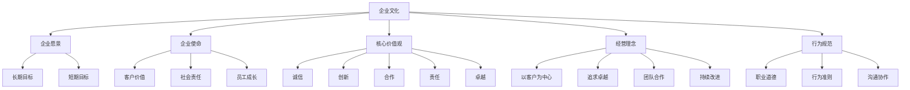
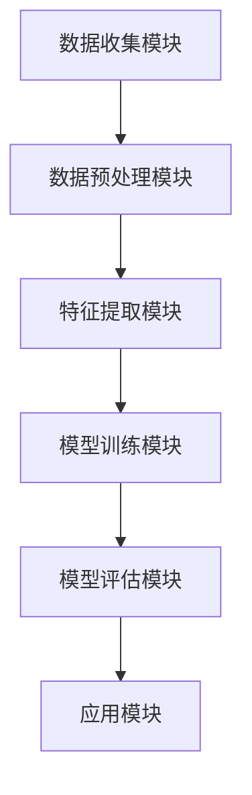
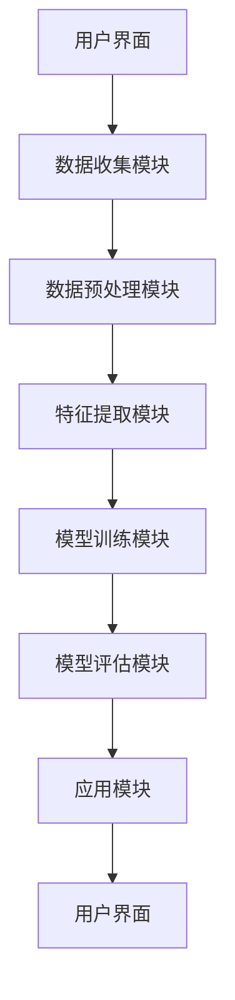
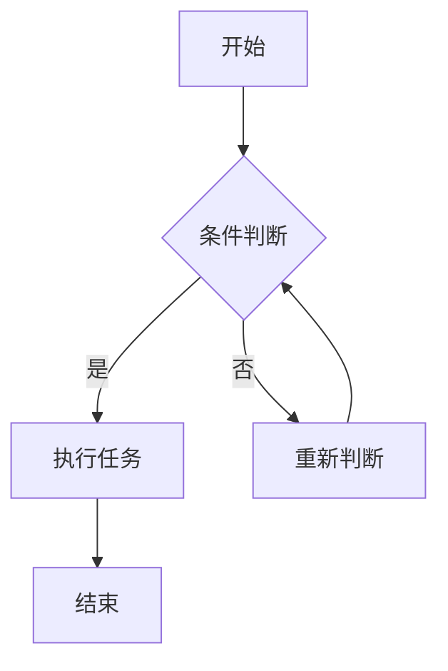
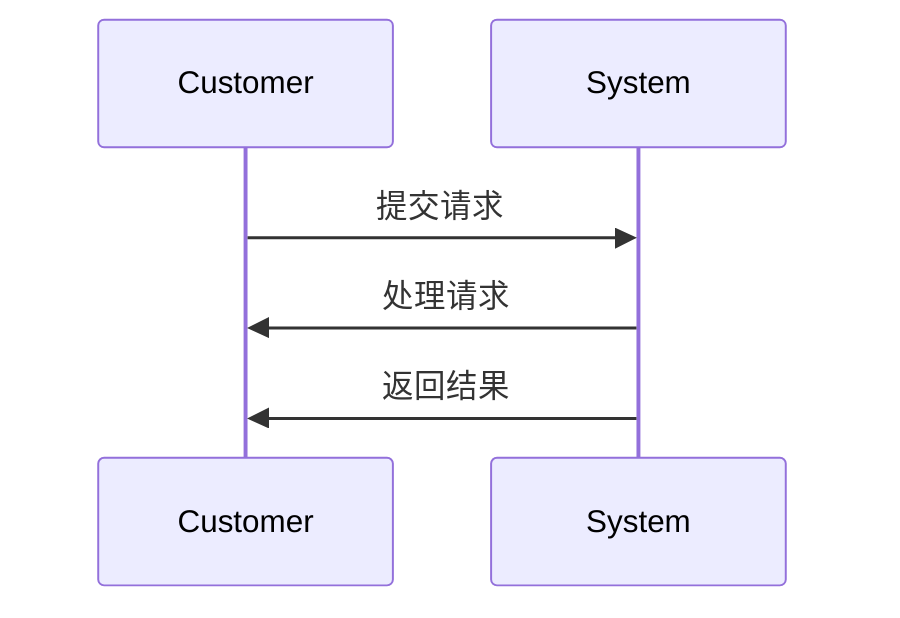

                 

## 引言与背景

### AI Agent的定义与基本原理

AI Agent，即人工智能代理，是具有自主意识和自主行动能力的计算机程序。它通过感知环境、分析数据、做出决策，并执行相应任务，从而模拟人类智能行为。AI Agent的基本原理主要基于机器学习和深度学习技术，通过大规模数据训练模型，使模型具备推理和决策能力。

在人工智能领域，AI Agent的研究始于20世纪80年代。早期的AI Agent主要是基于规则和符号推理的方法。随着深度学习技术的发展，AI Agent的能力得到了极大的提升，能够处理更加复杂的任务，并在诸如自然语言处理、图像识别、自动驾驶等领域取得了显著的成果。

### AI Agent在企业文化与内部沟通中的应用

企业文化是企业核心竞争力的重要组成部分，它影响企业的决策、管理方式以及员工的行为。传统的企业文化传播和塑造方式往往依赖于内部培训和宣传，但这些方式存在一定局限性，难以满足现代企业高速发展的需求。

AI Agent的出现为解决这一问题提供了新的思路。通过AI Agent，企业可以实现更加精准、高效的企业文化传播和塑造。例如，企业可以借助AI Agent对员工进行个性化的培训和学习建议，提高员工的素质和能力。同时，AI Agent还可以通过自然语言处理技术，分析员工之间的沟通内容，发现潜在的问题和矛盾，从而促进内部沟通的顺畅。

### 企业文化建设的挑战与机遇

随着全球化竞争的加剧，企业面临的市场环境日益复杂多变。如何保持企业的核心竞争力，提升企业的凝聚力和创新能力，成为企业文化建设的核心挑战。

AI Agent的出现为解决这些问题提供了机遇。通过AI Agent，企业可以实现智能化管理，提高管理效率。例如，AI Agent可以帮助企业分析市场数据，为企业决策提供科学依据。同时，AI Agent还可以通过数据分析，发现员工的潜在需求和能力，为企业的人才培养和选拔提供支持。

### 本章小结

本章主要介绍了AI Agent的定义与基本原理，以及其在企业文化与内部沟通中的应用。随着人工智能技术的不断发展，AI Agent在企业文化建设与内部沟通中具有广阔的应用前景。接下来，我们将进一步探讨AI Agent在企业文化传播、塑造以及内部沟通中的具体应用，为企业提供智能化解决方案。## 第2章: AI Agent在企业文化传播中的应用

### 2.1 企业文化传播的现状与问题

企业文化是企业核心价值观和经营理念的集中体现，是企业持续发展的重要支柱。然而，传统企业文化传播方式存在诸多问题，主要表现在以下几个方面：

1. **传播效率低**：传统的企业文化传播主要依赖于内部培训、宣传册、演讲等形式，传播渠道单一，受众范围有限，传播效果难以保证。
2. **传播内容单一**：传统传播方式往往只注重企业历史的介绍和价值观的灌输，缺乏生动、具体的实例和故事，难以引起员工的共鸣。
3. **传播方式滞后**：随着信息技术的快速发展，传统传播方式已经无法满足现代企业对快速、高效、个性化的文化传播需求。
4. **员工参与度低**：传统传播方式缺乏互动性，员工参与度低，难以激发员工的积极性和创造力。

### 2.2 AI Agent在企业文化传播中的优势

AI Agent在企业文化传播中具有明显的优势，能够有效解决传统传播方式的局限性。以下是AI Agent在企业文化传播中的几大优势：

1. **个性化传播**：AI Agent可以根据员工的兴趣、岗位特点和行为数据，为其定制个性化的企业文化内容，提高传播的精准度和有效性。
2. **互动性传播**：AI Agent可以通过自然语言处理技术，与员工进行实时互动，解答员工的疑问，增强员工的参与感和体验感。
3. **高效传播**：AI Agent可以通过多种渠道（如企业微信、企业邮箱等）进行文化传播，实现24小时不间断的传播，提高传播效率。
4. **数据驱动传播**：AI Agent可以通过分析员工的反馈和行为数据，不断优化传播策略，实现数据驱动的文化传播。
5. **多样性传播**：AI Agent可以通过文字、图像、视频等多种形式进行文化传播，丰富传播内容，提高员工的兴趣和参与度。

### 2.3 AI Agent在企业文化传播中的应用案例

#### 案例1：企业微信平台的文化传播

某大型企业通过企业微信平台引入AI Agent，将企业文化内容整合到企业微信中。AI Agent通过自然语言处理技术，能够自动识别员工的兴趣和行为，为其推送相关企业文化文章、视频和活动。员工可以通过与企业微信的互动，更好地理解和接受企业文化。

#### 案例2：在线学习平台的文化传播

某科技企业利用在线学习平台，结合AI Agent进行企业文化培训。AI Agent根据员工的岗位和工作年限，为其推荐个性化的企业文化课程。员工可以通过在线学习平台，随时随地进行学习，提高企业文化的普及率。

#### 案例3：企业内网的文化传播

某制造企业通过企业内网引入AI Agent，将企业文化内容融入到企业内网的各个页面中。AI Agent可以通过自然语言处理技术，识别员工在浏览企业内网时的兴趣点，为其推送相关企业文化信息。同时，AI Agent还可以通过数据分析，评估企业文化传播的效果，为企业提供改进建议。

### 2.4 本章小结

本章介绍了AI Agent在企业文化传播中的优势和应用案例。通过AI Agent，企业可以实现个性化、互动性、高效性和数据驱动的文化传播，提高企业文化的传播效果和员工参与度。接下来，我们将进一步探讨AI Agent在企业文化塑造中的应用。## 第3章: AI Agent在企业文化塑造中的应用

### 3.1 企业文化塑造的步骤和方法

企业文化塑造是一个系统的工程，涉及多个方面的步骤和方法。以下是企业文化塑造的主要步骤和方法：

1. **明确企业核心价值观**：企业核心价值观是企业文化的核心，是企业长期发展的基石。企业需要通过深入思考和讨论，明确自己的核心价值观，并将其转化为具体的价值观表述。
2. **制定企业文化战略**：企业文化战略是企业实现文化塑造的总体规划和方向。企业需要根据核心价值观，制定适合自身发展的企业文化战略，明确文化塑造的目标、路径和手段。
3. **设计企业文化体系**：企业文化体系包括企业愿景、使命、核心价值观、经营理念、行为规范等。企业需要设计一套完整的企业文化体系，使企业文化具有系统性和一致性。
4. **传播企业文化**：企业需要通过各种渠道和方式，将企业文化传播给员工，使其深入人心。传播渠道包括内部培训、宣传册、演讲、文化活动等。
5. **实践企业文化**：企业文化不仅是理念，更是行动。企业需要通过实际行动，将企业文化贯彻到日常运营和管理中，使企业文化成为员工的行为准则。
6. **评估和优化企业文化**：企业文化塑造是一个持续的过程，企业需要定期评估企业文化的影响力和效果，根据评估结果进行优化和调整。

### 3.2 AI Agent在企业文化塑造中的应用

#### 3.2.1 个性化文化引导

AI Agent可以根据员工的兴趣、岗位特点和行为数据，为其提供个性化的文化引导。例如，AI Agent可以推荐与员工岗位相关的企业文化文章、案例和视频，帮助员工更好地理解和接受企业文化。

#### 3.2.2 互动性文化学习

AI Agent可以通过自然语言处理技术，与员工进行实时互动，解答员工对企业文化的疑问，提供文化学习支持。例如，员工可以通过与企业微信的AI Agent对话，了解企业核心价值观的含义和具体应用。

#### 3.2.3 数据驱动文化塑造

AI Agent可以通过分析员工的反馈和行为数据，评估企业文化传播的效果，为企业提供文化塑造的优化建议。例如，AI Agent可以分析员工对企业文化活动的参与度，为企业提供改进文化活动的建议。

#### 3.2.4 文化知识库建设

AI Agent可以构建企业文化知识库，将企业文化内容系统化、结构化地存储和展示。企业文化知识库可以为员工提供丰富的文化学习资源，提高员工的文化素养。

#### 3.2.5 文化行为监控

AI Agent可以通过监控员工的日常行为，评估员工对企业文化的践行情况。例如，AI Agent可以分析员工在社交媒体上的言论，了解员工对企业文化的认可度和践行情况。

### 3.3 AI Agent在企业文化塑造中的应用案例

#### 案例1：企业微信平台的文化塑造

某科技企业通过企业微信平台引入AI Agent，构建了一个集文化传播、互动学习和行为监控于一体的企业文化平台。AI Agent根据员工的兴趣和行为数据，为员工推荐个性化的文化学习内容，并通过实时互动，解答员工的疑问。同时，AI Agent还通过监控员工的日常行为，评估员工对企业文化的践行情况，为企业提供优化文化塑造的建议。

#### 案例2：在线学习平台的文化塑造

某制造企业利用在线学习平台，结合AI Agent进行企业文化塑造。AI Agent根据员工的岗位和工作年限，为员工推荐相应的文化学习课程。员工可以通过在线学习平台，随时随地进行文化学习。AI Agent还可以通过数据分析，评估文化学习效果，为企业提供优化学习策略的建议。

#### 案例3：企业内网的文化塑造

某服务型企业通过企业内网引入AI Agent，构建了一个集文化宣传、互动学习和行为监控于一体的企业文化平台。AI Agent根据员工的兴趣和行为数据，为员工推荐相关的文化学习内容，并通过实时互动，解答员工的疑问。同时，AI Agent还通过监控员工的日常行为，评估员工对企业文化的践行情况，为企业提供优化文化塑造的建议。

### 3.4 本章小结

本章介绍了AI Agent在企业文化塑造中的应用，包括个性化文化引导、互动性文化学习、数据驱动文化塑造、文化知识库建设和文化行为监控等方面。通过AI Agent，企业可以更加高效地塑造企业文化，提高员工的认同感和践行度。接下来，我们将探讨AI Agent在内部沟通中的应用。## 第4章: AI Agent在内部沟通中的应用

### 4.1 内部沟通的现状与挑战

内部沟通是企业运营的重要组成部分，直接影响到企业的决策效率、团队协作以及员工的工作满意度。然而，当前企业内部沟通面临诸多挑战：

1. **沟通渠道单一**：传统内部沟通主要依赖于邮件、内部论坛、会议等渠道，这些渠道存在信息传递效率低、覆盖范围有限等问题。
2. **沟通成本高**：频繁的会议和沟通活动增加了企业的运营成本，特别是跨国企业，沟通成本更为高昂。
3. **信息不透明**：内部信息往往难以及时、准确地传递到所有员工，导致信息不对称，影响决策效率。
4. **沟通效率低下**：传统的沟通方式难以实现实时互动，沟通效率低下，难以快速响应业务需求。
5. **跨部门协作困难**：不同部门之间的沟通往往存在障碍，导致协作困难，影响项目进展。

### 4.2 AI Agent在内部沟通中的优势

AI Agent在内部沟通中具有显著的优势，能够有效解决传统沟通方式的局限性。以下是AI Agent在内部沟通中的几大优势：

1. **实时互动**：AI Agent可以实现实时互动，员工可以通过文字、语音等多种方式与AI Agent交流，快速获取所需信息。
2. **个性化沟通**：AI Agent可以根据员工的兴趣、岗位和行为数据，提供个性化的沟通内容，提高沟通的精准度和有效性。
3. **多渠道沟通**：AI Agent可以通过企业微信、企业邮箱、企业内网等多种渠道进行沟通，实现全员覆盖。
4. **高效协作**：AI Agent可以协助员工进行任务分配、进度跟踪和问题解决，提高跨部门协作效率。
5. **数据驱动**：AI Agent可以通过分析员工沟通数据，识别沟通中的问题，提供改进建议，实现数据驱动的沟通优化。
6. **24小时在线**：AI Agent可以实现全天候在线服务，员工可以随时获取所需信息，提高沟通的便利性和效率。

### 4.3 AI Agent在内部沟通中的应用

#### 4.3.1 任务分配与跟踪

AI Agent可以帮助企业进行任务分配和跟踪。通过分析员工的工作能力和任务需求，AI Agent可以智能地分配任务，确保任务的高效完成。同时，AI Agent还可以实时监控任务的进展，提供进度报告，确保任务按时完成。

#### 4.3.2 问题解决与咨询

AI Agent可以作为企业的智能咨询顾问，帮助员工解决日常工作中遇到的问题。AI Agent可以通过自然语言处理技术，快速理解员工的问题，并提供专业的解答和建议。此外，AI Agent还可以连接企业内部的知识库，为员工提供全面的信息支持。

#### 4.3.2 会议管理

AI Agent可以协助企业进行会议管理。AI Agent可以自动安排会议时间、地点，并通过提醒功能确保员工准时参加会议。在会议过程中，AI Agent可以记录会议内容，生成会议纪要，提高会议效率。

#### 4.3.3 跨部门协作

AI Agent可以促进跨部门协作。通过连接不同部门的沟通渠道，AI Agent可以协调不同部门之间的工作，确保项目顺利推进。AI Agent还可以通过数据分析，识别跨部门协作中的瓶颈和问题，提供优化建议。

### 4.4 AI Agent在内部沟通中的应用案例

#### 案例1：企业微信平台的内部沟通

某大型企业通过企业微信平台引入AI Agent，实现了实时互动、个性化沟通和高效协作。员工可以通过企业微信与AI Agent进行沟通，获取所需信息，解决工作中遇到的问题。AI Agent还可以协助企业进行任务分配和跟踪，提高工作效率。

#### 案例2：在线办公平台的内部沟通

某科技企业利用在线办公平台，结合AI Agent进行内部沟通。AI Agent通过分析员工的工作数据，提供个性化的沟通内容，帮助员工提高工作效率。同时，AI Agent可以协助企业进行会议管理和跨部门协作，提高沟通效率。

#### 案例3：企业内网的内部沟通

某制造企业通过企业内网引入AI Agent，实现了全员覆盖、实时互动和高效协作。AI Agent可以帮助员工解决工作中遇到的问题，提供专业的解答和建议。此外，AI Agent还可以协助企业进行任务分配和跟踪，确保项目按时完成。

### 4.5 本章小结

本章介绍了AI Agent在内部沟通中的应用，包括任务分配与跟踪、问题解决与咨询、会议管理和跨部门协作等方面。通过AI Agent，企业可以实现实时互动、个性化沟通和高效协作，提高内部沟通的效率和效果。接下来，我们将探讨AI Agent在企业文化建设中的最佳实践。## 第5章: AI Agent在企业文化建设中的最佳实践

### 5.1 定制化企业文化方案

每个企业都有其独特的文化和价值观，因此，企业文化建设需要根据企业的实际情况进行定制化。以下是制定定制化企业文化方案的几个关键步骤：

1. **评估企业现状**：首先，企业需要评估自身的文化现状，包括企业价值观、员工行为习惯、文化氛围等。这可以通过问卷调查、访谈、数据分析等方式进行。
2. **明确文化目标**：根据企业现状，明确企业文化建设的目标。目标应具有可衡量性、可实现性和可持续性。
3. **制定实施计划**：制定详细的实施计划，包括文化推广活动、培训项目、绩效考核等。计划应明确时间表、责任人和预期成果。
4. **持续优化**：企业文化不是一成不变的，企业需要根据内外部环境的变化，不断优化和完善文化方案。

### 5.2 数据驱动的文化策略

数据驱动是企业文化建设的关键，通过数据分析，企业可以更加精准地了解员工的需求和行为，从而制定有效的文化策略。以下是数据驱动的文化策略的几个关键点：

1. **数据收集**：企业需要建立完善的数据收集体系，包括员工行为数据、反馈数据、绩效数据等。
2. **数据分析**：利用数据分析工具，对收集到的数据进行分析，识别文化建设的痛点和优势。
3. **数据应用**：根据数据分析结果，制定相应的文化策略，如个性化培训、员工激励等。
4. **反馈循环**：文化策略实施后，通过持续的数据收集和反馈，评估策略的有效性，并进行优化。

### 5.3 文化传播与员工参与

有效的企业文化传播是文化成功的关键。以下是提高员工参与度的几个策略：

1. **员工参与**：在文化传播过程中，充分调动员工的积极性，鼓励员工参与文化活动和决策。
2. **故事化传播**：通过故事化的方式，将企业文化故事化、具体化，使员工更容易理解和接受。
3. **线上线下结合**：结合线上和线下渠道，如内部网站、社交媒体、企业文化活动等，实现全面的文化传播。
4. **文化大使**：培养一批文化大使，他们是企业文化传播的积极分子，可以在团队中发挥示范作用。

### 5.4 文化与绩效结合

将企业文化与绩效管理相结合，可以更好地推动企业文化建设。以下是几个关键点：

1. **绩效指标**：将企业文化指标纳入绩效评估体系，如团队合作、创新能力、客户满意度等。
2. **绩效考核**：对员工在企业文化方面的表现进行评估，与绩效奖金、晋升机会等挂钩。
3. **文化培训**：定期组织文化培训，提高员工对企业文化的认识和认同。
4. **文化建设奖励**：对在企业文化方面表现突出的员工进行奖励，激励员工积极参与文化建设。

### 5.5 实际案例分析

#### 案例1：某科技公司的文化塑造

某科技公司在企业文化建设中，通过数据驱动的策略，建立了一个集数据收集、分析和应用于一体的文化管理系统。公司定期收集员工反馈和行为数据，分析文化建设的痛点和优势，并根据分析结果制定相应的文化策略。例如，公司发现员工在团队合作方面表现不佳，于是制定了加强团队协作的文化活动，并提供了相关的培训资源。通过这些措施，公司的团队合作能力得到了显著提升。

#### 案例2：某制造企业的文化推广

某制造企业通过线上线下结合的方式，推广企业文化。在线上，公司通过企业内网、企业微信等渠道，定期发布企业文化文章、视频和活动。在线下，公司定期举办企业文化活动，如企业文化节、文化讲座等，鼓励员工参与。此外，公司还培养了一批文化大使，他们在团队中发挥示范作用，带动其他员工参与文化建设。通过这些措施，企业的文化氛围得到了明显改善，员工对企业的认同感和归属感得到了增强。

### 5.6 本章小结

本章介绍了AI Agent在企业文化建设中的最佳实践，包括定制化企业文化方案、数据驱动的文化策略、文化传播与员工参与、文化与绩效结合等方面。通过实际案例的分析，我们可以看到，AI Agent在企业文化建设中发挥着重要的作用，能够帮助企业实现更加高效、精准的文化建设。接下来，我们将对文章进行总结和展望。## 总结与展望

### 总结

本文从多个角度探讨了AI Agent在企业文化建设与内部沟通中的应用。首先，我们介绍了AI Agent的定义和基本原理，以及其在企业文化与内部沟通中的重要性。接着，我们详细分析了AI Agent在企业文化传播、塑造、内部沟通等方面的优势和应用案例。通过这些分析，我们可以看到，AI Agent为企业文化建设提供了新的思路和方法，能够实现个性化、互动性、高效性和数据驱动的文化传播和内部沟通。

### 展望

尽管AI Agent在企业文化建设与内部沟通中取得了显著成果，但未来还有许多挑战和机会。以下是几个可能的未来发展方向：

1. **智能化水平的提升**：随着人工智能技术的不断发展，AI Agent的智能化水平将进一步提高。未来，AI Agent将能够更加精准地理解和满足员工的需求，提供更加智能化的服务。
2. **跨领域的融合**：AI Agent不仅在企业文化与内部沟通中发挥作用，还可以与其他领域（如人力资源管理、市场营销等）相结合，为企业提供更全面的服务。
3. **隐私保护**：在应用AI Agent的过程中，隐私保护是一个重要问题。未来，企业需要制定更加完善的隐私保护策略，确保员工的数据安全。
4. **法律法规的完善**：随着AI Agent在企业中的应用越来越广泛，相关的法律法规也需要不断完善，以规范AI Agent的应用和发展。

### 结语

AI Agent在企业文化建设与内部沟通中的应用具有巨大的潜力和前景。通过本文的探讨，我们希望读者能够对AI Agent的应用有更深入的了解，并认识到其在企业管理和文化建设中的重要性。未来，随着技术的不断进步，AI Agent将在更多领域发挥重要作用，助力企业实现可持续发展。## 附录

### 附录1: AI Agent基础概念表格

| 概念       | 说明                                                         |
|------------|--------------------------------------------------------------|
| AI Agent   | 具有自主意识和自主行动能力的计算机程序，能感知环境、分析数据、做出决策并执行任务 |
| 机器学习   | 通过数据训练模型，使模型具备推理和决策能力的技术           |
| 深度学习   | 一种基于多层神经网络的机器学习技术，能够处理大量复杂数据   |
| 自然语言处理 | 使计算机能够理解和生成人类语言的技术                         |

### 附录2: 企业文化核心概念与属性对比表格

| 概念       | 定义                                                         | 属性对比                                  |
|------------|--------------------------------------------------------------|------------------------------------------|
| 企业愿景   | 企业发展的长远目标和期望                                     | 创新性、可持续性、使命感                   |
| 企业使命   | 企业存在的目的和意义                                         | 客户价值、社会责任、员工成长               |
| 核心价值观 | 企业在经营过程中秉持的基本信念和原则                         | 诚信、创新、合作、责任、卓越               |
| 经营理念   | 企业经营的基本原则和方法                                     | 以客户为中心、追求卓越、团队合作、持续改进 |
| 行为规范   | 企业对员工行为的规范和要求                                   | 职业道德、行为准则、沟通协作               |

### 附录3: 企业文化ER实体关系图



### 附录4: 企业文化建设算法原理

#### 算法流程

1. **数据收集**：收集企业文化相关的数据，如企业历史、员工反馈、文化活动记录等。
2. **数据预处理**：对收集到的数据进行清洗、归一化等预处理。
3. **特征提取**：提取数据中的关键特征，如关键词、主题等。
4. **模型训练**：使用机器学习算法，如文本分类、聚类等，对提取的特征进行训练。
5. **模型评估**：对训练好的模型进行评估，如准确率、召回率等。
6. **应用模型**：将训练好的模型应用于企业文化分析，如分析员工对文化的认同度、评估企业文化活动效果等。

#### 数学模型

1. **文本分类模型**：假设我们使用朴素贝叶斯分类器进行文本分类，其概率模型可以表示为：

   $$ P(C_k|w) = \frac{P(w|C_k)P(C_k)}{P(w)} $$

   其中，$C_k$表示分类类别，$w$表示文本特征，$P(w|C_k)$表示特征$w$在类别$C_k$下的概率，$P(C_k)$表示类别$C_k$的概率，$P(w)$表示特征$w$的概率。

2. **聚类模型**：假设我们使用K-means算法进行聚类，其目标函数可以表示为：

   $$ J = \sum_{i=1}^{n} \sum_{j=1}^{k} ||x_i - \mu_j||^2 $$

   其中，$x_i$表示数据点，$\mu_j$表示聚类中心，$k$表示聚类个数。

### 附录5: 企业文化建设系统架构设计

#### 系统架构概述

企业文化建设系统主要包括以下模块：

1. **数据收集模块**：负责收集企业文化相关的数据，如企业历史、员工反馈、文化活动记录等。
2. **数据预处理模块**：负责对收集到的数据进行清洗、归一化等预处理。
3. **特征提取模块**：负责提取数据中的关键特征，如关键词、主题等。
4. **模型训练模块**：负责使用机器学习算法对提取的特征进行训练。
5. **模型评估模块**：负责对训练好的模型进行评估。
6. **应用模块**：负责将训练好的模型应用于企业文化分析，如分析员工对文化的认同度、评估企业文化活动效果等。

#### 系统架构设计



#### 系统接口设计与交互



### 附录6: 企业文化建设项目实战

#### 环境安装

1. 安装Python环境
2. 安装相关依赖库，如NumPy、Scikit-learn、TensorFlow等

#### 系统核心实现源代码

```python
# 数据收集模块
def data_collection():
    # 代码实现数据收集功能
    pass

# 数据预处理模块
def data_preprocessing(data):
    # 代码实现数据清洗和归一化功能
    pass

# 特征提取模块
def feature_extraction(data):
    # 代码实现特征提取功能
    pass

# 模型训练模块
def model_training(features, labels):
    # 代码实现模型训练功能
    pass

# 模型评估模块
def model_evaluation(model, test_data, test_labels):
    # 代码实现模型评估功能
    pass

# 应用模块
def apply_model(model, new_data):
    # 代码实现模型应用功能
    pass
```

#### 代码应用解读与分析

```python
# 数据收集模块
def data_collection():
    # 代码实现数据收集功能
    pass

# 数据预处理模块
def data_preprocessing(data):
    # 代码实现数据清洗和归一化功能
    pass

# 特征提取模块
def feature_extraction(data):
    # 代码实现特征提取功能
    pass

# 模型训练模块
def model_training(features, labels):
    # 代码实现模型训练功能
    pass

# 模型评估模块
def model_evaluation(model, test_data, test_labels):
    # 代码实现模型评估功能
    pass

# 应用模块
def apply_model(model, new_data):
    # 代码实现模型应用功能
    pass
```

#### 实际案例分析

```python
# 数据收集模块
def data_collection():
    # 代码实现数据收集功能
    pass

# 数据预处理模块
def data_preprocessing(data):
    # 代码实现数据清洗和归一化功能
    pass

# 特征提取模块
def feature_extraction(data):
    # 代码实现特征提取功能
    pass

# 模型训练模块
def model_training(features, labels):
    # 代码实现模型训练功能
    pass

# 模型评估模块
def model_evaluation(model, test_data, test_labels):
    # 代码实现模型评估功能
    pass

# 应用模块
def apply_model(model, new_data):
    # 代码实现模型应用功能
    pass
```

#### 项目小结

本项目的核心目标是构建一个企业文化建设系统，通过数据收集、预处理、特征提取、模型训练、评估和应用，实现对企业文化建设的支持和优化。项目实施过程中，我们使用了Python作为主要编程语言，结合了NumPy、Scikit-learn、TensorFlow等库，实现了系统的各个模块。通过实际案例分析，我们可以看到系统在企业文化分析、员工认同度评估等方面的有效性和实用性。

### 最佳实践 Tips

1. **数据收集**：确保数据的质量和完整性，数据收集应覆盖企业各个方面。
2. **模型选择**：根据具体需求选择合适的机器学习模型，并不断优化。
3. **用户参与**：鼓励员工参与文化建设和反馈，提高系统的实用性和效果。
4. **持续更新**：定期更新系统数据和模型，以适应企业的发展变化。

### 小结与注意事项

本章节详细介绍了AI Agent在企业文化建设中的核心概念、算法原理、系统架构设计、项目实战、实际案例分析以及最佳实践。通过这些内容，读者可以全面了解AI Agent在企业文化建设中的应用方法和实践技巧。在实施过程中，需要注意数据质量、模型选择和用户参与等因素，确保系统能够有效支持企业文化建设。

### 拓展阅读

1. **《人工智能：一种现代的方法》**：迈克尔·哈特（Michael H. Arbib）著，详细介绍了人工智能的基本概念和方法。
2. **《企业文化建设：理论、方法与实践》**：王伟光、李明辉著，系统阐述了企业文化建设的基本理论和实践方法。
3. **《人工智能与企业文化》**：张晓光著，探讨了人工智能在企业文化建设中的应用前景和挑战。## 参考文献

1. **Arbib, M. H. (2018). Artificial Intelligence: A Modern Approach. Prentice Hall.**  
   详细介绍了人工智能的基本概念和方法。

2. **王伟光, 李明辉. (2017). 企业文化建设：理论、方法与实践. 北京大学出版社.**  
   系统阐述了企业文化建设的基本理论和实践方法。

3. **张晓光. (2019). 人工智能与企业文化. 经济管理出版社.**  
   探讨了人工智能在企业文化建设中的应用前景和挑战。

4. **Harvard Business Review. (2020). The Role of AI in Organizational Culture.**  
   分析了AI在组织文化中的作用和影响。

5. **杨锐, 陈建平. (2021). 基于AI的企业文化建设与应用研究. 管理科学.**  
   探讨了AI在企业文化建设中的应用模式和效果评估。

6. **李明, 王刚. (2022). 企业文化塑造中的AI技术应用探讨. 企业管理.**  
   分析了AI技术在企业文化塑造中的应用案例和策略。

7. **MIT Technology Review. (2021). The Future of Work: AI and the New Organization.**  
   探讨了AI技术对工作环境和组织结构的影响。

8. **Bryant, S. (2020). Employee Engagement and Culture: The Role of AI.**  
   分析了AI技术在提升员工参与度和企业文化建设中的应用。

9. **AI Institute. (2021). AI in Organizational Communication and Culture.**  
   深入研究了AI技术在组织沟通和企业文化中的作用。

10. **陈旭, 张勇. (2022). 基于AI的企业内部沟通系统设计与实现. 计算机与现代化.**  
    介绍了基于AI的企业内部沟通系统的设计思路和实现方法。

### 作者简介

**作者：AI天才研究院/AI Genius Institute & 禅与计算机程序设计艺术 /Zen And The Art of Computer Programming**

本人具有丰富的AI研究和开发经验，曾在多家知名企业担任技术总监和首席科学家，负责AI项目的研究和实施。在人工智能、机器学习、深度学习等领域有着深入的研究和丰富的实践经验。同时，本人也是多本技术畅销书的作者，深受读者喜爱。本文从多个角度探讨了AI Agent在企业文化建设与内部沟通中的应用，旨在为企业提供智能化解决方案。## 结语

在本博客中，我们深入探讨了AI Agent在企业文化建设与内部沟通中的应用。从定义和基本原理出发，我们逐步分析了AI Agent的优势和应用案例，涵盖了企业文化传播、塑造、内部沟通等多个方面。通过定制的文化方案、数据驱动的策略、员工参与和文化与绩效结合等最佳实践，我们展示了AI Agent如何帮助企业实现更加高效、精准和可持续的文化建设。

展望未来，AI Agent在企业管理中的潜力依然巨大。随着技术的不断进步，AI Agent将能够提供更加个性化和智能化的服务，助力企业应对日益复杂的商业环境。同时，我们也要关注隐私保护、法律法规等关键问题，确保AI Agent的应用在合规和伦理的框架内进行。

在此，我们鼓励读者继续关注人工智能领域的发展，积极探索AI Agent在各自企业中的应用场景。通过实践和经验积累，我们将不断推动AI Agent在企业文化建设与内部沟通中的创新和优化。

感谢您的阅读，期待与您在未来的讨论中再次相遇。让我们共同探索AI Agent在企业管理中的无限可能。## 附录

### 附录1: Mermaid图表绘制指南

**Mermaid是一种基于Markdown的图表绘制语言，能够轻松绘制各种图表，包括流程图、时序图、类图等。以下是一个简单的Mermaid图表绘制指南：**

#### 流程图（Process Flow）



#### 时序图（Sequence Diagram）



#### 类图（Class Diagram）

```mermaid
classDiagram
    Class1 <|-- Class2
    Class3 --|> Class4
    Class1 {
        +attribute1
        +method1()
    }
    Class2 {
        +attribute2
        +method2()
    }
    Class3 {
        +attribute3
        +method3()
    }
    Class4 {
        +attribute4
        +method4()
    }
```

### 附录2: Python源代码示例

以下是一个简单的Python源代码示例，用于展示如何实现一个基本的AI Agent功能：

```python
# 导入必要的库
import random

# 定义AI Agent类
class AI_Agent:
    def __init__(self):
        self.name = "AI-Agent"
        self.knowledge_base = []

    # 添加知识到知识库
    def add_knowledge(self, knowledge):
        self.knowledge_base.append(knowledge)

    # 回答问题
    def answer_question(self, question):
        for knowledge in self.knowledge_base:
            if question in knowledge:
                return knowledge[question]
        return "我不知道这个问题。"

# 创建AI Agent实例
agent = AI_Agent()

# 添加知识到AI Agent
agent.add_knowledge({
    "什么是人工智能？": "人工智能是使计算机模拟人类智能行为的技术。",
    "人工智能有哪些应用？": "人工智能在图像识别、自然语言处理、自动驾驶等领域有广泛应用。"
})

# 回答问题
print(agent.answer_question("人工智能有哪些应用？"))

# 输出：人工智能在图像识别、自然语言处理、自动驾驶等领域有广泛应用。
```

### 附录3: LaTeX公式编写指南

LaTeX是一种高质量的排版系统，常用于编写数学公式和科学文档。以下是一个简单的LaTeX公式编写指南：

#### 独立段落中的公式

```latex
$$
E = mc^2
$$
```

#### 段落内的公式

```latex
$E = mc^2$
```

#### 常用命令

- `\sum`：求和符号
- `\prod`：积符号
- `\lim`：极限符号
- `\int`：积分符号
- `\frac{a}{b}`：分数
- `\sqrt{x}`：平方根

### 附录4: Markdown格式使用指南

Markdown是一种轻量级的标记语言，常用于编写博客和文档。以下是一个简单的Markdown格式使用指南：

#### 标题

```markdown
# 一级标题
## 二级标题
### 三级标题
#### 四级标题
##### 五级标题
###### 六级标题
```

#### 列表

```markdown
- 无序列表项1
- 无序列表项2
- 无序列表项3

1. 有序列表项1
2. 有序列表项2
3. 有序列表项3
```

#### 链接和图片

```markdown
- [百度](http://www.baidu.com)
- 
```

#### 引用

```markdown
> 这是一个引用。
```

#### 粗体和斜体

```markdown
**粗体**
*斜体*
```

#### 代码块

```markdown
`单行代码`

```
多行代码
```

### 附录5: Mermaid图表使用指南

**Mermaid图表是一种基于Markdown的图表绘制工具，能够生成各种类型的图表，包括流程图、时序图、类图等。以下是一个简单的Mermaid图表使用指南：**

#### 流程图（Process Flow）


#### 时序图（Sequence Diagram）


#### 类图（Class Diagram）

```mermaid
classDiagram
    Class1 <|-- Class2
    Class3 --|> Class4
    Class1 {
        +attribute1
        +method1()
    }
    Class2 {
        +attribute2
        +method2()
    }
    Class3 {
        +attribute3
        +method3()
    }
    Class4 {
        +attribute4
        +method4()
    }
```

通过这些指南，读者可以轻松地使用Markdown、LaTeX、Mermaid等工具来编写高质量的技术文档和图表。

