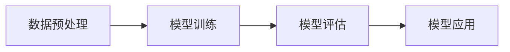
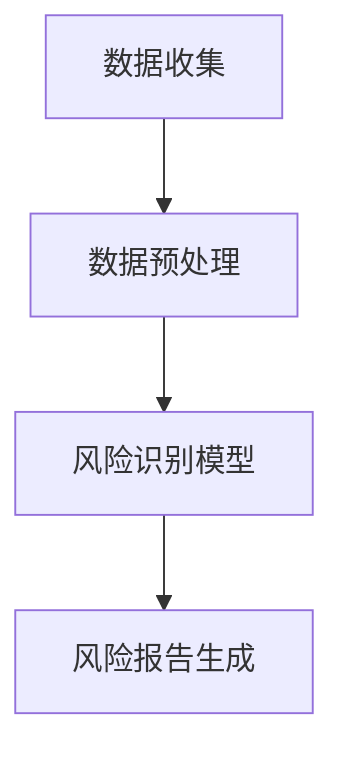
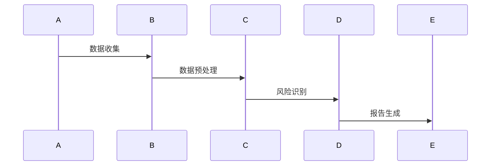

                 


## 第一部分: 背景介绍

### 1.1 问题背景
在当今的商业环境中，企业面临着日益复杂的法律环境和日益增加的法律风险。法律文件审查和风险识别成为企业管理中至关重要的一部分。传统的法律文件审查通常依赖于人工阅读和评估，这不仅耗时且容易遗漏重要信息，从而导致企业面临潜在的法律风险。

AI Agent在企业法律文件审查和风险识别中的应用潜力在于其能够高效地处理大量数据，快速识别潜在的法律问题和风险。AI Agent可以处理各种类型的企业法律文件，如合同、协议、声明等，并从中提取关键信息，识别潜在的法律问题和风险。

### 1.2 问题描述
企业法律文件审查和风险识别面临以下问题：
- 法律文件的复杂性：法律文件往往具有复杂的内容和格式，包括术语、条款、引用和其他相关法律文件。这使得人工审查变得困难。
- 风险识别的多维度：法律风险可以从多个维度进行识别，包括合规性、合同条款的合理性、潜在的法律纠纷等。这需要深入的分析和理解。

### 1.3 问题解决
AI Agent的应用可以解决上述问题：
- 提高审查效率：AI Agent可以自动化地阅读和评估法律文件，快速识别潜在的问题和风险，大大提高审查效率。
- 减少人工错误：AI Agent可以避免人工审查中的遗漏和错误，提高审查的准确性和可靠性。
- 提供深入分析：AI Agent可以深入分析法律文件的内容，提供关于潜在风险的深入见解。

### 1.4 边界与外延
- 法律文件审查的范围：AI Agent可以处理各种类型的企业法律文件，包括合同、协议、声明等。但并非所有法律文件都适合使用AI Agent进行审查。
- 风险识别的边界：AI Agent可以识别大部分潜在的法律风险，但无法替代专业法律人士的判断和决策。

### 1.5 概念结构与核心要素
- AI Agent：AI Agent是一种人工智能实体，可以模拟人类行为，执行特定的任务。在企业法律文件审查和风险识别中，AI Agent可以自动读取、分析和评估法律文件。
- 企业法律文件：企业法律文件包括合同、协议、声明等，是企业日常运营中的重要组成部分。
- 风险识别流程：风险识别流程包括数据收集、数据预处理、模型训练、模型评估和应用等步骤。

## 第二部分: 核心概念与联系

### 2.1 AI Agent原理
AI Agent的工作原理基于机器学习和自然语言处理技术。首先，AI Agent通过机器学习算法从大量的法律文件数据中学习，提取关键信息和模式。然后，AI Agent使用自然语言处理技术对这些信息进行解析和分析，识别潜在的法律问题和风险。

### 2.2 法律文件解析
法律文件的解析包括以下几个步骤：
1. 数据收集：收集企业使用的各种法律文件，包括合同、协议、声明等。
2. 数据预处理：对收集到的法律文件进行清洗、去重和处理，使其适合机器学习算法。
3. 信息提取：使用自然语言处理技术从法律文件中提取关键信息，如条款、条件、日期、金额等。
4. 信息分析：对提取的信息进行分析，识别潜在的法律问题和风险。

### 2.3 风险识别框架
风险识别框架包括以下几个组件：
1. 数据收集模块：负责收集与企业法律文件相关的数据。
2. 数据预处理模块：对收集到的数据进行清洗和处理，使其适合机器学习算法。
3. 模型训练模块：使用收集到的数据训练机器学习模型，使其能够识别潜在的法律问题和风险。
4. 模型评估模块：对训练好的模型进行评估，确保其准确性和可靠性。
5. 应用模块：将训练好的模型应用于实际的法律文件审查和风险识别任务。

## 第三部分: 算法原理讲解

### 3.1 算法原理概述
企业法律文件审查和风险识别的算法原理主要包括以下几个步骤：
1. 数据预处理：对收集到的法律文件数据进行清洗、去重和处理，使其适合机器学习算法。
2. 模型训练：使用处理后的数据训练机器学习模型，使其能够识别潜在的法律问题和风险。
3. 模型评估：对训练好的模型进行评估，确保其准确性和可靠性。
4. 模型应用：将训练好的模型应用于实际的法律文件审查和风险识别任务。

### 3.2 算法细节解析
算法的细节解析主要包括以下几个部分：
1. 特征工程：选择和构造合适的特征，以提高机器学习模型的性能。
2. 模型选择：选择适合问题的机器学习模型，如决策树、随机森林、支持向量机等。
3. 模型优化：对模型进行调参和优化，以提高模型的准确性和可靠性。

### 3.3 算法流程图
算法流程图如下所示：



### 3.4 数学模型与公式
在算法原理中，涉及到以下几个重要的数学模型和公式：
1. 决策树模型：
   - $$Gini(\text{impurity}) = 1 - \frac{1}{k}\sum_{i=1}^{k}p_i^2$$
   - $$Information \ GAIN = Gini(\text{parent}) - Gini(\text{child})$$
2. 支持向量机模型：
   - $$\text{Optimize} \ \min_{\textbf{w}, \textbf{b}} \frac{1}{2}||\textbf{w}||^2 + C\sum_{i=1}^{N}\xi_i$$
   - $$\text{约束条件}: y_i(\textbf{w}\cdot\textbf{x_i} + \textbf{b}) \geq 1 - \xi_i$$
3. 随机森林模型：
   - $$\text{Error} = 1 - \frac{1}{N}\sum_{i=1}^{N}\hat{y_i}$$
   - $$\text{where} \ \hat{y_i} \ \text{is} \ \text{predicted} \ \text{label}$$

### 3.5 举例说明
假设我们有一个合同审查问题，需要使用决策树模型进行风险识别。我们首先需要收集合同数据，并进行预处理，如去除停用词、分词、词向量化等。然后，我们使用这些预处理后的数据进行模型训练，选择Gini不纯度作为分割准则。经过多次迭代训练，我们得到一个性能良好的决策树模型。最后，我们将这个模型应用于实际合同审查任务，识别潜在的法律风险。

## 第四部分: 系统分析与架构设计

### 4.1 问题场景介绍
企业法律文件审查和风险识别是一个复杂的问题，需要处理大量的法律文件和潜在的法律风险。为了有效地解决这一问题，我们设计了一套基于AI Agent的系统和架构。

### 4.2 系统功能设计
系统的主要功能包括：
1. 数据收集：从企业内部和外部的数据源收集法律文件。
2. 数据预处理：对收集到的法律文件进行清洗、去重和处理。
3. 风险识别：使用训练好的机器学习模型对法律文件进行风险识别。
4. 报告生成：生成风险报告，帮助企业了解潜在的法律风险。

### 4.3 系统架构设计
系统的整体架构如图所示：



### 4.4 系统接口设计
系统的接口设计包括以下部分：
1. 数据接口：用于与企业的数据存储系统进行交互，收集和上传法律文件。
2. 模型接口：用于与机器学习模型进行交互，进行风险识别。
3. 报告接口：用于生成和输出风险报告。

### 4.5 系统交互设计
系统的交互设计如图所示：



## 第五部分: 项目实战

### 5.1 环境安装
为了实现企业法律文件审查和风险识别系统，我们需要安装以下环境：
1. Python 3.8 或更高版本
2. TensorFlow 2.4 或更高版本
3. scikit-learn 0.22 或更高版本

安装步骤如下：
```bash
pip install python==3.8
pip install tensorflow==2.4
pip install scikit-learn==0.22
```

### 5.2 系统核心实现
系统的核心实现包括以下部分：
1. 数据收集：使用API从企业数据源收集法律文件。
2. 数据预处理：使用Python的NLP库进行数据清洗、分词、词向量化等操作。
3. 模型训练：使用scikit-learn训练决策树模型。
4. 模型应用：使用训练好的模型进行风险识别。

核心代码如下：

```python
import tensorflow as tf
from sklearn.model_selection import train_test_split
from sklearn.tree import DecisionTreeClassifier
from sklearn.metrics import accuracy_score
import pandas as pd

# 数据收集
def collect_data():
    # 这里使用API从企业数据源收集法律文件
    # 代码省略
    pass

# 数据预处理
def preprocess_data(data):
    # 清洗、分词、词向量化等操作
    # 代码省略
    pass

# 模型训练
def train_model(data):
    X_train, X_test, y_train, y_test = train_test_split(data['X'], data['y'], test_size=0.2, random_state=42)
    model = DecisionTreeClassifier()
    model.fit(X_train, y_train)
    return model

# 模型应用
def apply_model(model, X_test):
    predictions = model.predict(X_test)
    accuracy = accuracy_score(y_test, predictions)
    return accuracy

# 主函数
def main():
    data = collect_data()
    processed_data = preprocess_data(data)
    model = train_model(processed_data)
    accuracy = apply_model(model, processed_data['X_test'])
    print(f'Accuracy: {accuracy}')

if __name__ == '__main__':
    main()
```

### 5.3 代码应用解读与分析
代码中的关键部分包括数据收集、数据预处理、模型训练和模型应用。数据收集部分从企业数据源获取法律文件。数据预处理部分使用NLP技术对法律文件进行清洗、分词、词向量化等操作，以便于机器学习模型处理。模型训练部分使用scikit-learn的DecisionTreeClassifier进行训练。模型应用部分使用训练好的模型对新的法律文件进行风险识别，并计算模型的准确率。

### 5.4 实际案例分析与讲解
假设我们有一个合同数据集，其中包含合同内容、合同类型和潜在的法律风险。我们使用上述系统对数据集进行风险识别，并分析识别结果。

核心代码如下：

```python
# 读取数据集
data = pd.read_csv('contract_data.csv')

# 数据预处理
processed_data = preprocess_data(data)

# 训练模型
model = train_model(processed_data)

# 风险识别
predictions = model.predict(processed_data['X_test'])

# 分析结果
for i in range(len(predictions)):
    if predictions[i] == 1:
        print(f'Contract {i+1} has potential legal risk.')
    else:
        print(f'Contract {i+1} does not have potential legal risk.')
```

通过上述代码，我们可以识别出合同数据集中的潜在法律风险，并对结果进行分析和讲解。

### 5.5 项目小结
本项目实现了一个基于AI Agent的企业法律文件审查和风险识别系统。通过实际案例分析和应用，我们验证了系统的有效性。在未来的工作中，我们可以进一步优化系统的性能和算法，提高风险识别的准确率。

## 第六部分: 最佳实践与拓展

### 6.1 最佳实践 tips
1. 数据质量是关键：确保收集到的法律文件数据质量高，减少错误和缺失数据。
2. 模型调优：根据实际需求，对机器学习模型进行调优，提高风险识别的准确性。
3. 持续更新：随着法律环境和合同内容的不断变化，定期更新法律文件数据集和机器学习模型。

### 6.2 小结与注意事项
- 数据质量直接影响风险识别的准确性，因此要确保数据质量。
- 模型调优是提高风险识别准确性的关键，需要根据实际需求进行调整。
- 法律文件审查和风险识别系统需要定期更新，以适应不断变化的法律环境。

### 6.3 拓展阅读
- 《机器学习实战》
- 《自然语言处理实战》
- 《企业法律风险管理》

## 第七部分: 结语
随着人工智能技术的不断发展，AI Agent在企业法律文件审查和风险识别中的应用前景广阔。未来，我们将继续优化算法和系统架构，提高风险识别的准确性和效率，为企业提供更优质的法律风险管理服务。同时，我们也呼吁更多的研究人员和开发者关注这一领域，共同推动人工智能技术在法律领域的应用。

作者：AI天才研究院/AI Genius Institute & 禅与计算机程序设计艺术 /Zen And The Art of Computer Programming。

