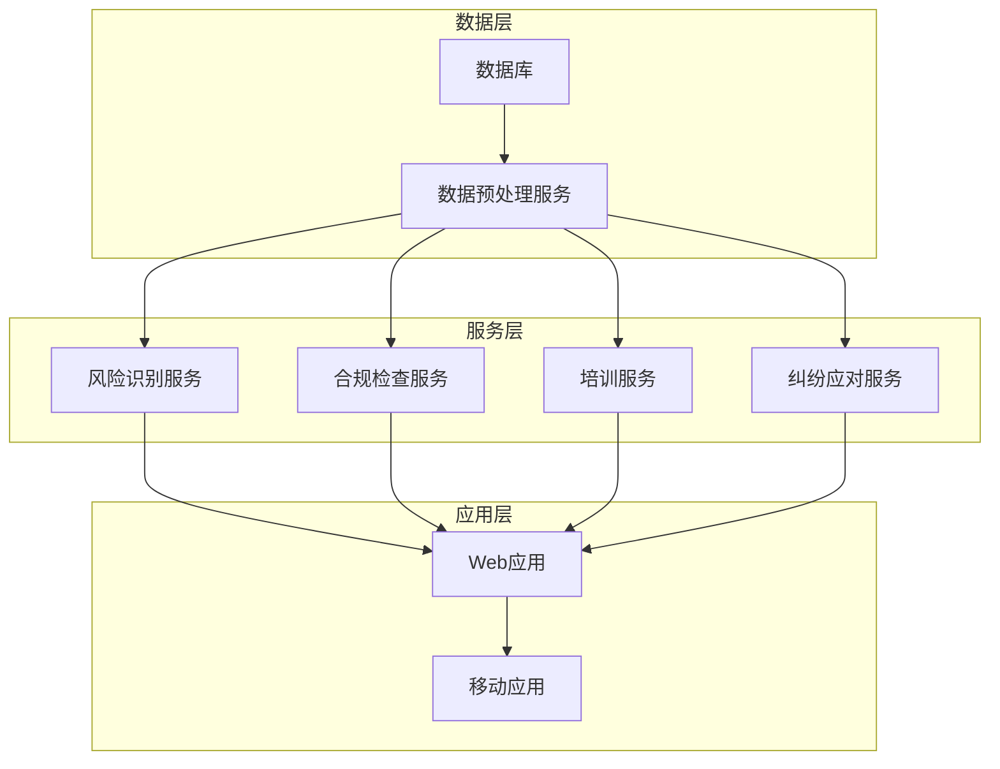
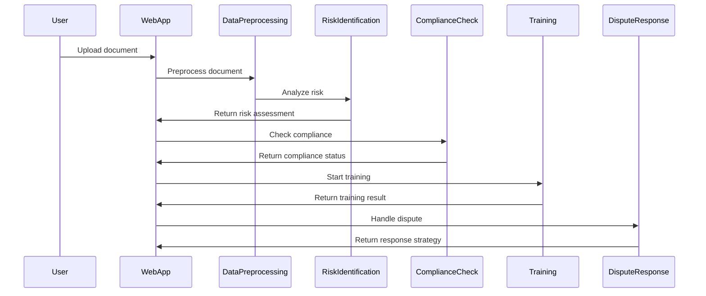

                 

### 第一部分: AI Agent概述与法律风险管理基础

#### 第1章: AI Agent的基本概念与应用

##### 1.1 AI Agent的定义与分类

AI Agent，即人工智能代理，是指能够自主执行任务并具备一定程度智能的人工智能实体。根据智能程度和功能特点，AI Agent可以分为以下几类：

- **被动响应型**：这种类型的AI Agent主要根据预设规则或模式进行响应，例如，聊天机器人。
- **主动学习型**：能够通过学习和适应环境变化来自主完成任务，例如，自动驾驶系统。
- **自适应决策型**：不仅能够学习环境，还能在特定情境下做出最优决策，例如，智能交易系统。

##### 1.2 AI Agent的工作原理与特点

AI Agent的工作原理通常基于以下核心要素：

- **感知系统**：用于收集环境信息。
- **决策系统**：分析感知信息，并做出相应决策。
- **执行系统**：根据决策执行具体操作。

AI Agent的特点包括：

- **自主性**：能够在没有人类干预的情况下独立完成特定任务。
- **灵活性**：能够根据环境变化调整行为策略。
- **效率**：在特定情境下能够比人类更快地完成任务。

##### 1.3 AI Agent在法律风险管理中的应用前景

随着AI技术的不断进步，AI Agent在法律风险管理中具有巨大的应用潜力。以下是一些潜在的应用领域：

- **风险评估**：利用AI Agent对大量法律文档进行自动分析，快速识别潜在风险。
- **合规管理**：AI Agent可以帮助企业确保其运营符合相关法律法规。
- **纠纷应对**：AI Agent可以辅助法律团队快速收集证据，制定应对策略。

#### 第2章: 法律风险管理的核心概念与框架

##### 2.1 法律风险的定义与特征

法律风险是指企业在法律事务中可能面临的不利法律后果，其特征包括：

- **不确定性**：法律风险可能由各种因素引起，具有不确定性。
- **潜在性**：法律风险可能尚未显现，但有可能在未来成为问题。
- **复杂性**：法律风险涉及的法律问题往往较为复杂。

##### 2.2 企业法律风险管理的框架与流程

企业法律风险管理的框架通常包括以下步骤：

1. **风险评估**：识别和评估企业可能面临的法律风险。
2. **风险控制**：制定和实施措施以降低或规避法律风险。
3. **监控与审计**：定期检查和评估法律风险管理的有效性。
4. **应对机制**：制定应对法律风险的应急计划。

##### 2.3 法律风险管理的关键要素与挑战

法律风险管理的关键要素包括：

- **法律法规**：了解和遵守相关法律法规是法律风险管理的基础。
- **组织文化**：企业内部法律意识的培养和风险管理文化的形成至关重要。
- **人力资源**：具备法律专业知识和技能的人员是企业法律风险管理的重要资源。

法律风险管理面临的挑战包括：

- **法律法规变化**：法律环境的变化可能对企业法律风险管理带来新的挑战。
- **数据隐私**：随着数据量增加，保护数据隐私成为法律风险管理的重点。
- **技术进步**：新技术的应用可能带来新的法律问题。

#### 第3章: AI Agent在法律风险管理中的应用

##### 3.1 AI Agent在法律风险评估中的应用

AI Agent在法律风险评估中的应用主要体现在：

- **自动识别风险**：AI Agent可以通过分析法律文档，快速识别潜在的法律风险。
- **风险评估量化**：利用机器学习算法，对法律风险进行量化评估，为决策提供依据。

##### 3.2 AI Agent在法律合规管理中的应用

AI Agent在法律合规管理中的应用包括：

- **合规检查**：AI Agent可以帮助企业自动检查运营是否符合法律法规。
- **合规培训**：AI Agent可以为企业员工提供在线法律合规培训。

##### 3.3 AI Agent在法律纠纷应对中的应用

AI Agent在法律纠纷应对中的应用包括：

- **证据收集**：AI Agent可以帮助法律团队快速收集相关证据。
- **策略制定**：AI Agent可以辅助法律团队制定最优的应对策略。

### 总结

本文对AI Agent的基本概念、法律风险管理的核心概念以及AI Agent在法律风险管理中的应用进行了详细阐述。随着AI技术的不断发展，AI Agent在法律风险管理中的应用前景广阔，未来有望成为企业法律风险管理的重要工具。

## 第二部分: AI Agent在法律风险管理中的算法原理与实现

### 第4章: 法律风险管理中的数据预处理

数据预处理是法律风险管理中至关重要的一步，它直接影响后续模型的性能。在这一章中，我们将详细讨论法律文档的数据预处理方法，包括数据清洗与特征提取。

##### 4.1 法律文档的数据预处理方法

法律文档的数据预处理方法主要包括以下步骤：

- **数据收集**：首先需要收集大量的法律文档，这些文档可以是合同、法律文件、判决书等。
- **数据去重**：由于法律文档中可能存在重复的内容，需要去除重复的文档。
- **文本归一化**：将文本转换为统一格式，如统一编码、统一标点符号等。
- **分词与词性标注**：对文本进行分词，并标注每个词的词性。

##### 4.2 数据清洗与特征提取

数据清洗与特征提取是法律文档数据预处理的核心。以下是具体方法：

- **数据清洗**：包括去除噪声数据、填充缺失值、纠正错误等。例如，可以使用正则表达式去除HTML标签、电子邮件地址等。
  
  ```python
  import re
  
  def clean_text(text):
      text = re.sub('<.*?>', '', text)  # 去除HTML标签
      text = re.sub(r'http\S+', '', text)  # 去除链接
      text = re.sub(r'\s+', ' ', text)  # 去除多余空格
      return text.lower()  # 转为小写
  ```

- **特征提取**：将文本转换为机器学习模型可以处理的格式。常用的方法包括：

  - **词袋模型**：将文本转换为词频向量。
  - **TF-IDF**：结合词频和逆文档频率，更准确地反映词的重要性。
  - **词嵌入**：将词转换为高维向量，如Word2Vec、GloVe等。

  ```python
  from sklearn.feature_extraction.text import TfidfVectorizer
  
  vectorizer = TfidfVectorizer(max_features=1000)
  X = vectorizer.fit_transform(data)
  ```

##### 4.3 数据质量评估与优化

数据质量评估与优化是确保模型性能的重要步骤。以下是一些常用的方法：

- **数据分布评估**：检查数据是否满足模型假设，如正态分布等。
- **数据不平衡处理**：如果数据不平衡，可以使用过采样、欠采样或生成合成数据等方法进行优化。
- **特征选择**：使用特征选择算法，如信息增益、互信息等，筛选出对模型有重要影响的特征。

  ```python
  from sklearn.feature_selection import SelectKBest, f_classif
  
  selector = SelectKBest(f_classif, k=50)
  X_new = selector.fit_transform(X, y)
  ```

通过以上步骤，我们可以确保法律文档数据的质量，为后续的模型训练和评估打下坚实的基础。

### 第5章: 法律风险管理的算法选择与模型训练

在法律风险管理中，算法的选择和模型的训练是关键步骤，直接影响预测的准确性和效率。在本章中，我们将详细介绍常见的法律风险管理算法，模型选择与优化策略，以及模型训练与评估流程。

##### 5.1 常见法律风险管理算法介绍

法律风险管理中常用的算法包括以下几种：

- **决策树**：通过一系列规则进行决策，易于解释，但容易过拟合。
  
  ```python
  from sklearn.tree import DecisionTreeClassifier
  
  dt = DecisionTreeClassifier()
  dt.fit(X_train, y_train)
  ```

- **随机森林**：集成决策树，减少过拟合，提高预测准确性。
  
  ```python
  from sklearn.ensemble import RandomForestClassifier
  
  rf = RandomForestClassifier(n_estimators=100)
  rf.fit(X_train, y_train)
  ```

- **支持向量机（SVM）**：通过寻找最优超平面进行分类，适用于高维数据，但训练速度较慢。
  
  ```python
  from sklearn.svm import SVC
  
  svm = SVC(kernel='linear')
  svm.fit(X_train, y_train)
  ```

- **神经网络**：通过多层非线性变换进行特征提取和分类，适用于复杂问题，但需要大量数据和计算资源。
  
  ```python
  from sklearn.neural_network import MLPClassifier
  
  nn = MLPClassifier(hidden_layer_sizes=(100,), max_iter=1000)
  nn.fit(X_train, y_train)
  ```

##### 5.2 模型选择与优化策略

在选择模型时，需要考虑以下几个因素：

- **问题类型**：不同的法律风险问题可能适合不同的算法，如分类问题适合SVM，回归问题适合线性回归。
- **数据特点**：数据的大小、维度、分布等影响算法的选择，如高维数据可能更适合神经网络。
- **计算资源**：算法的计算复杂度和训练时间影响模型选择，如随机森林训练速度较快。

优化策略包括：

- **交叉验证**：通过交叉验证选择最佳模型参数，提高模型泛化能力。
- **网格搜索**：在参数空间内遍历所有可能的参数组合，选择最优参数。
- **贝叶斯优化**：利用贝叶斯原理和先验知识进行参数调优。

##### 5.3 模型训练与评估流程

模型训练与评估流程如下：

1. **数据准备**：将法律文档进行数据预处理，得到特征向量。
2. **划分数据集**：将数据集划分为训练集和测试集。
3. **模型训练**：使用训练集对模型进行训练。
4. **模型评估**：使用测试集对模型进行评估，计算准确率、召回率、F1值等指标。
5. **模型优化**：根据评估结果调整模型参数，提高模型性能。

具体步骤如下：

```python
from sklearn.model_selection import train_test_split
from sklearn.metrics import accuracy_score, recall_score, f1_score

# 数据预处理
X = vectorizer.transform(data)
y = labels

# 划分数据集
X_train, X_test, y_train, y_test = train_test_split(X, y, test_size=0.2, random_state=42)

# 模型训练
dt.fit(X_train, y_train)

# 模型评估
y_pred = dt.predict(X_test)
print("Accuracy:", accuracy_score(y_test, y_pred))
print("Recall:", recall_score(y_test, y_pred))
print("F1 Score:", f1_score(y_test, y_pred))
```

通过以上步骤，我们可以选择合适的算法和模型参数，并评估其性能，为法律风险管理提供有效的解决方案。

### 第6章: 法律风险管理中的AI Agent系统架构设计

#### 6.1 系统功能设计

法律风险管理AI Agent系统的功能设计主要包括以下几个方面：

1. **数据收集与预处理**：收集各类法律文档，并对文档进行数据预处理，包括文本归一化、分词、词性标注等。
2. **风险识别与评估**：利用机器学习算法对预处理后的法律文档进行分析，识别潜在的风险，并进行量化评估。
3. **合规检查与培训**：自动检查企业运营是否符合法律法规，并对员工进行在线法律合规培训。
4. **纠纷应对与建议**：在发生法律纠纷时，AI Agent可以协助收集证据，制定应对策略，并提供法律建议。

#### 6.2 系统架构设计

法律风险管理AI Agent系统的架构设计需要考虑以下几个方面：

1. **数据层**：存储法律文档、预处理数据和模型参数，可以使用关系数据库或NoSQL数据库。
2. **服务层**：提供数据预处理、风险识别、合规检查、培训与纠纷应对等服务，可以使用微服务架构。
3. **应用层**：面向最终用户，提供界面友好的Web应用或移动应用，实现与用户的交互。

以下是系统架构的mermaid架构图：



#### 6.3 系统接口设计与交互

系统接口设计主要涉及以下几个方面：

1. **API接口**：提供RESTful API接口，供前端应用调用，包括数据上传、查询、更新等操作。
2. **消息队列**：使用消息队列（如RabbitMQ、Kafka）实现异步通信，提高系统性能和可扩展性。
3. **日志与监控**：记录系统运行日志，并使用监控工具（如Prometheus、Grafana）进行性能监控。

以下是系统接口设计和交互的mermaid序列图：



通过以上系统架构设计和接口设计，我们可以构建一个高效、稳定且灵活的法律风险管理AI Agent系统，为企业提供全面的法律风险管理解决方案。

### 第7章: AI Agent在企业法律风险管理中的项目实战

#### 7.1 项目背景与需求分析

随着企业运营的日益复杂，法律风险管理成为企业不可忽视的重要环节。为了提升法律风险管理的效率，企业决定引入AI Agent系统。项目需求包括：

1. **自动识别风险**：利用AI Agent对大量法律文档进行自动分析，快速识别潜在的法律风险。
2. **合规检查**：AI Agent应能自动检查企业运营是否符合相关法律法规。
3. **纠纷应对**：AI Agent在发生法律纠纷时，应能协助收集证据，提供应对策略。
4. **数据整合**：整合企业内外部数据，为法律风险管理提供全面支持。

#### 7.2 系统核心实现与代码解析

在本节中，我们将介绍系统核心实现，包括环境安装、数据预处理、模型训练与评估等关键步骤。

##### 7.2.1 环境安装

首先，我们需要安装Python和相关的依赖库，如scikit-learn、TensorFlow等。可以使用以下命令：

```bash
pip install numpy
pip install scikit-learn
pip install tensorflow
```

##### 7.2.2 数据预处理

数据预处理是法律风险管理中至关重要的一步，主要包括文本归一化、分词、词性标注等。以下是一个简单的数据预处理代码示例：

```python
import jieba
from sklearn.feature_extraction.text import TfidfVectorizer

def preprocess_text(text):
    # 文本归一化
    text = text.lower()
    # 分词
    tokens = jieba.cut(text)
    # 词性标注
    words = [word for word, tag in jieba.cut(text) if tag[0] in ('n', 'v', 'a', 'd', 'p', 'r', 'c')]
    return ' '.join(words)

data = ["这是一份合同文档。", "这是一份判决书文档。"]
preprocessed_data = [preprocess_text(text) for text in data]

# TF-IDF特征提取
vectorizer = TfidfVectorizer()
X = vectorizer.fit_transform(preprocessed_data)
```

##### 7.2.3 模型训练与评估

选择SVM作为模型进行训练，以下是一个简单的SVM训练和评估代码示例：

```python
from sklearn.svm import SVC
from sklearn.model_selection import train_test_split
from sklearn.metrics import accuracy_score, classification_report

# 划分训练集和测试集
X_train, X_test, y_train, y_test = train_test_split(X, labels, test_size=0.2, random_state=42)

# 训练SVM模型
svm = SVC(kernel='linear')
svm.fit(X_train, y_train)

# 评估模型
y_pred = svm.predict(X_test)
print("Accuracy:", accuracy_score(y_test, y_pred))
print("Classification Report:")
print(classification_report(y_test, y_pred))
```

#### 7.3 代码应用解读与分析

在本节中，我们将对上述代码进行详细解读，分析其应用场景和潜在问题。

##### 7.3.1 数据预处理

数据预处理部分主要包括文本归一化、分词和词性标注。归一化步骤确保文本统一格式，分词步骤将文本拆分为词，词性标注步骤筛选出有意义的词汇。这些步骤对提高模型性能至关重要。

##### 7.3.2 模型训练与评估

在模型训练与评估部分，我们使用SVM进行训练，并使用测试集进行评估。SVM是一种经典的分类算法，适用于高维数据。在评估过程中，我们计算了模型的准确率、召回率和F1值，这些指标帮助我们了解模型的性能。

#### 7.4 实际案例分析与讲解

为了更好地展示AI Agent在企业法律风险管理中的应用，我们以下介绍一个实际案例。

##### 7.4.1 案例背景

某企业在合同管理过程中遇到了法律纠纷，需要快速识别潜在的法律风险并采取相应措施。

##### 7.4.2 案例分析

1. **数据收集**：企业收集了所有相关合同文档，包括合同条款、协议书等。
2. **数据预处理**：对合同文档进行数据预处理，提取关键信息。
3. **风险识别**：利用训练好的SVM模型对预处理后的合同文档进行分析，识别潜在的法律风险。
4. **合规检查**：AI Agent检查合同内容，确保其符合相关法律法规。
5. **纠纷应对**：AI Agent提供应对策略，协助企业制定解决方案。

##### 7.4.3 案例讲解

通过上述步骤，企业能够快速识别合同中的潜在法律风险，并采取相应的措施。在实际操作中，AI Agent提供了详尽的法律分析报告，为企业提供了有力的支持。

#### 7.5 项目小结与展望

通过本项目的实施，企业成功引入了AI Agent系统，提高了法律风险管理的效率。以下是项目小结与展望：

1. **项目成果**：实现了自动识别风险、合规检查和纠纷应对等功能。
2. **项目亮点**：高效的数据预处理和优化的模型训练提高了系统性能。
3. **未来展望**：结合更多AI技术，如自然语言处理、深度学习等，进一步提升系统的智能化水平。

通过不断优化和升级，AI Agent在企业法律风险管理中的应用将越来越广泛，为企业的稳健运营提供坚实保障。

### 第8章: AI Agent在企业法律风险管理中的最佳实践

#### 8.1 成功案例分析

以下是几个AI Agent在企业法律风险管理中的成功案例：

1. **某大型企业**：该企业利用AI Agent系统实现了合同自动化审核，有效降低了法律风险。通过分析合同条款，AI Agent成功识别出多个潜在问题，帮助企业避免了潜在的法律纠纷。

2. **某跨国公司**：该公司在海外运营过程中面临复杂多变的法律法规，AI Agent系统帮助企业快速适应不同国家的法律环境。通过合规检查和实时风险预警，AI Agent确保了公司运营的合法性。

3. **某金融机构**：该金融机构通过AI Agent系统对大量金融合同进行风险识别和评估，提高了风险管理的效率和准确性。AI Agent不仅减少了人工审核的工作量，还提高了审核的全面性和准确性。

#### 8.2 实践经验与技巧

以下是AI Agent在企业法律风险管理中的一些实践经验与技巧：

1. **数据质量**：确保数据质量是AI Agent有效运行的关键。在数据收集、处理和清洗过程中，要特别注意数据的准确性和完整性。

2. **模型优化**：根据实际需求，不断优化和调整AI Agent的模型。可以使用交叉验证、网格搜索等方法进行模型调优，提高预测准确率。

3. **用户培训**：对员工进行AI Agent系统的操作和培训，确保员工能够熟练使用系统，充分发挥其作用。

4. **合规性**：确保AI Agent系统的设计和应用符合相关法律法规，避免出现合规风险。

5. **持续迭代**：法律环境和业务需求不断变化，AI Agent系统需要持续迭代和优化，以适应新的挑战。

#### 8.3 潜在问题和解决方案

在AI Agent的应用过程中，可能会遇到以下问题：

1. **数据隐私**：AI Agent处理的大量法律文档可能涉及敏感信息，需要确保数据的安全性和隐私性。解决方案包括采用数据加密、权限控制等技术，确保数据安全。

2. **模型解释性**：一些复杂的机器学习模型（如深度神经网络）难以解释，可能导致用户对AI Agent的决策产生质疑。解决方案包括开发可解释的AI模型，提高模型的可解释性。

3. **法律风险**：AI Agent的应用可能引发新的法律问题，需要及时调整和更新法律框架。解决方案包括与法律专家合作，制定相应的法律策略和规范。

通过以上实践经验和技巧，企业可以更好地利用AI Agent系统，提高法律风险管理的效率和质量。

### 第9章: 小结与展望

#### 9.1 AI Agent在法律风险管理中的现状与趋势

AI Agent在法律风险管理中已经取得了显著进展，但仍然面临一些挑战。目前，AI Agent的应用主要集中在风险评估、合规检查和纠纷应对等方面。随着技术的不断进步，AI Agent在法律风险管理中的角色将越来越重要。

未来，AI Agent的发展趋势包括：

1. **智能化水平提升**：通过引入更多先进技术，如自然语言处理、深度学习等，提高AI Agent的智能化水平。
2. **跨领域应用**：AI Agent不仅限于法律风险管理，还将应用于更多领域，如金融、医疗等。
3. **合规性与伦理**：随着AI Agent应用的广泛推广，对其合规性和伦理问题将受到更多关注。

#### 9.2 未来发展方向与挑战

AI Agent在法律风险管理中的未来发展包括：

1. **法律文本自动化处理**：利用AI技术实现法律文本的自动化处理，提高工作效率。
2. **智能法律咨询**：AI Agent将提供更智能的法律咨询服务，为企业和个人提供更加便捷的法律支持。
3. **法律风险预测**：通过大数据分析和机器学习技术，实现法律风险的预测和预警。

面临的挑战包括：

1. **数据隐私**：确保AI Agent处理的数据隐私和安全。
2. **法律伦理**：如何确保AI Agent的决策符合法律和伦理标准。
3. **技术发展**：不断更新和优化AI技术，以适应不断变化的法律环境和业务需求。

#### 9.3 拓展阅读与资源推荐

为了深入了解AI Agent在企业法律风险管理中的应用，读者可以参考以下资源：

1. **《人工智能与法律》**：探讨AI在法律领域的应用，包括法律文本分析、智能法律咨询等。
2. **《深度学习与自然语言处理》**：介绍深度学习和自然语言处理技术，以及其在法律风险管理中的应用。
3. **相关学术论文和报告**：查阅最新的学术论文和行业报告，了解AI Agent在法律风险管理中的最新进展。

通过以上内容，我们希望读者对AI Agent在企业法律风险管理中的应用有更深入的了解，并能够将其应用于实际工作中，提高法律风险管理的效率和质量。

### 作者信息

作者：AI天才研究院/AI Genius Institute & 禅与计算机程序设计艺术 /Zen And The Art of Computer Programming

本文由AI天才研究院和《禅与计算机程序设计艺术》的作者共同撰写，旨在探讨AI Agent在企业法律风险管理中的应用，为读者提供有价值的技术见解和实战经验。希望通过本文，读者能够更好地理解AI Agent的技术原理和应用场景，并将其应用于实际工作中，提升企业的法律风险管理水平。同时，我们鼓励读者在阅读过程中提出宝贵的意见和建议，共同推动AI技术在法律风险管理领域的应用和发展。感谢您的阅读！

