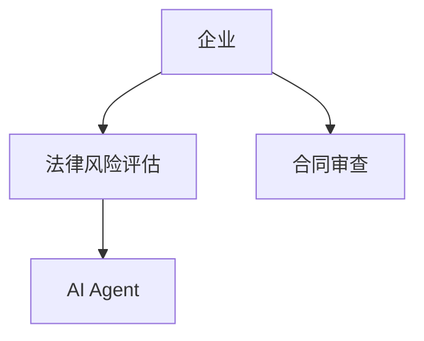

                 

### AI Agent在企业法律风险评估与合同审查中的应用

#### 关键词：
- AI Agent
- 企业法律风险评估
- 合同审查
- 人工智能应用

#### 摘要：
本文深入探讨AI Agent在企业法律风险评估与合同审查中的应用。我们将从背景介绍、核心概念与联系、算法原理、系统分析与架构设计、项目实战以及最佳实践等方面，详细解析AI Agent如何帮助企业提升法律事务的效率和准确性。

### 第一部分：背景介绍

#### 1. 问题背景

随着人工智能（AI）技术的快速发展，AI Agent作为一种智能化的计算机程序，已经逐渐渗透到各个领域，包括企业法律风险评估与合同审查。法律事务复杂性高、信息量大，传统的手工处理方式不仅效率低下，还容易出错。因此，将AI Agent引入企业法律风险评估与合同审查，有望大幅提升工作效率和准确性。

#### 2. 问题描述

企业法律风险评估与合同审查是企业运营中不可或缺的环节。法律风险评估涉及企业面临的各种法律风险，如合同纠纷、知识产权侵犯、合规问题等。合同审查则需要对合同内容进行细致的审查，确保合同条款的合法性和合规性。然而，这些任务通常需要大量的人工处理，不仅耗时耗力，而且容易出现错误。

#### 3. 问题解决

为了解决上述问题，我们可以借助AI Agent技术。AI Agent能够通过自然语言处理（NLP）、机器学习（ML）、深度学习（DL）等技术手段，自动识别和分类法律风险，快速评估风险概率和影响，同时自动审查合同内容，识别潜在的风险点。这使得AI Agent在企业法律风险评估与合同审查中具有显著的优势。

#### 4. 边界与外延

本文主要探讨AI Agent在企业法律风险评估与合同审查中的应用，但不限于这些领域。AI Agent在法律领域的潜在应用还包括知识产权保护、企业合规管理等。此外，本文将介绍相关的技术原理、系统架构、实际案例分析，为企业提供一套完整、可操作的解决方案。

#### 5. 概念结构与核心要素组成

核心概念：
- AI Agent：具备自主学习、决策能力的计算机程序。
- 企业法律风险评估：对企业法律风险进行识别、评估和控制的过程。
- 合同审查：对合同内容进行审查，确保合同合法、有效、合规。

核心要素：
- 技术原理：自然语言处理、机器学习、深度学习等。
- 系统架构：数据收集与处理、模型训练与部署、应用场景实践。
- 实际案例分析：不同行业、不同场景下的AI Agent应用案例。

### 第二部分：核心概念与联系

#### 1. AI Agent的定义与特点

AI Agent，即人工智能代理，是一种能够模拟人类智能行为的计算机程序。它具有以下特点：

- **智能性**：AI Agent能够通过学习和推理，解决复杂问题。
- **自主性**：AI Agent可以自主执行任务，无需人工干预。
- **适应性**：AI Agent能够适应新的环境和数据。
- **协作性**：AI Agent能够与其他AI Agent或人类协作完成复杂任务。

#### 2. 企业法律风险评估与合同审查的核心概念

- **企业法律风险评估**：这是对企业面临的法律风险进行识别、评估和控制的过程。它包括风险的识别、评估、控制三个阶段。
- **合同审查**：合同审查是对合同条款的合法性、有效性、合规性进行细致检查的过程。它涉及合同文本的理解、分析、比较等环节。

#### 3. AI Agent与企业法律风险评估与合同审查的联系

AI Agent在企业法律风险评估与合同审查中的应用，主要体现在以下几个方面：

- **自动识别和分类法律风险**：通过自然语言处理技术，AI Agent可以自动识别和分类企业面临的法律风险，提高风险评估的效率。
- **快速评估风险概率和影响**：利用机器学习算法，AI Agent可以快速评估风险的概率和影响，为企业管理层提供决策支持。
- **自动审查合同内容**：AI Agent可以利用自然语言处理技术，自动审查合同内容，识别潜在的风险点，减少人工错误。

#### 4. 概念属性特征对比表格

| 概念       | 特征1       | 特征2       | 特征3       |
| ---------- | ---------- | ---------- | ---------- |
| AI Agent   | 智能性     | 自主性     | 适应性     |
| 法律风险评估 | 风险识别   | 风险评估   | 风险控制   |
| 合同审查   | 合法性     | 有效性     | 合规性     |

#### 5. ER实体关系图架构

### 第1章：AI Agent在企业法律风险评估与合同审查中的应用概述

#### 1.1 AI Agent在企业法律风险评估中的应用

##### 1.1.1 AI Agent在法律风险评估中的作用

AI Agent在企业法律风险评估中扮演着至关重要的角色。它主要通过以下两个方面发挥作用：

1. **自动识别和分类法律风险**

   - **自然语言处理技术**：AI Agent利用自然语言处理技术，可以自动识别和分类企业面临的各种法律风险，如合同纠纷、知识产权侵犯、合规问题等。

   - **数据挖掘与统计分析**：通过分析企业历史数据，AI Agent可以识别出潜在的法律风险，并进行分类。

2. **快速评估风险概率和影响**

   - **机器学习算法**：AI Agent可以利用机器学习算法，快速评估法律风险的概率和影响。例如，通过训练模型，AI Agent可以预测合同纠纷发生的可能性，以及对企业的影响程度。

##### 1.1.2 AI Agent在法律风险评估中的优势

1. **提高工作效率**

   - AI Agent可以处理大量数据，自动识别和分类法律风险，大大提高工作效率。

   - AI Agent可以24小时不间断工作，无需休息，从而保证法律风险评估的连续性和稳定性。

2. **提高准确性**

   - 通过机器学习和深度学习技术，AI Agent可以提高风险评估的准确性。

   - AI Agent可以通过不断学习和适应，逐步提高对法律风险的识别和评估能力。

##### 1.1.3 AI Agent在法律风险评估中的挑战

1. **数据质量和准确性**

   - 法律风险评估需要高质量的数据，否则会影响评估结果的准确性。

   - AI Agent的准确性依赖于训练数据的数量和质量，因此需要保证数据的质量和多样性。

2. **法律规则的适应性**

   - 法律规则不断变化，AI Agent需要不断更新和适应。

   - AI Agent需要能够快速响应法律环境的变化，以适应新的法律规则和条款。

#### 1.2 AI Agent在合同审查中的应用

##### 1.2.1 AI Agent在合同审查中的作用

1. **自动审查合同内容**

   - **自然语言处理技术**：AI Agent可以利用自然语言处理技术，自动审查合同内容，识别潜在的风险点，如条款不明确、权利义务不对等。

   - **语义分析**：通过语义分析，AI Agent可以理解合同条款的真正含义，从而更好地识别风险。

2. **识别合同条款的合规性**

   - **法律知识库**：AI Agent可以利用内置的法律知识库，识别合同条款的合规性，如是否符合相关法律法规的要求。

   - **比对分析**：AI Agent可以将合同条款与法律标准进行比对，快速识别潜在的法律风险。

##### 1.2.2 AI Agent在合同审查中的优势

1. **减少人工错误**

   - 合同审查通常涉及大量文本，人工审查容易出错。AI Agent可以自动识别和纠正错误，减少人工错误。

2. **提高审查速度**

   - AI Agent可以快速审查大量合同，提高审查速度，缩短审查周期。

3. **增强合规性**

   - AI Agent可以确保合同条款的合规性，减少因合同问题导致的法律纠纷。

##### 1.2.3 AI Agent在合同审查中的挑战

1. **文本理解难度**

   - 合同文本通常较为复杂，AI Agent需要能够准确理解合同条款的含义。

   - 合同文本中可能存在模糊性、歧义性，这给AI Agent的理解带来挑战。

2. **法律环境变化**

   - 法律环境不断变化，AI Agent需要能够快速适应新的法律环境和条款。

   - AI Agent需要定期更新法律知识库，以适应最新的法律变化。

### 总结

AI Agent在企业法律风险评估与合同审查中的应用，为企业提供了一种高效、准确的解决方案。通过AI Agent，企业可以更好地识别和管理法律风险，提高合同审查的效率和准确性。然而，AI Agent的应用也面临着一些挑战，如数据质量和准确性、法律规则的适应性等。只有克服这些挑战，才能充分发挥AI Agent的潜力，为企业带来真正的价值。在接下来的章节中，我们将进一步探讨AI Agent的技术原理、系统架构和实际应用案例。

