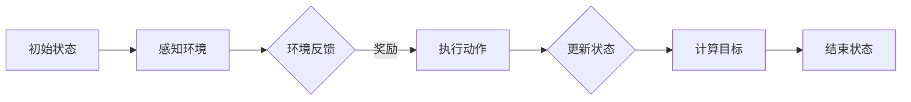
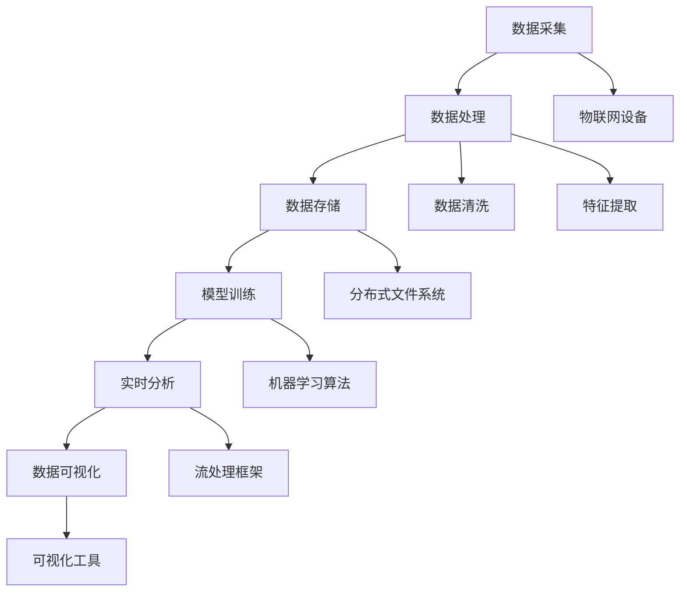
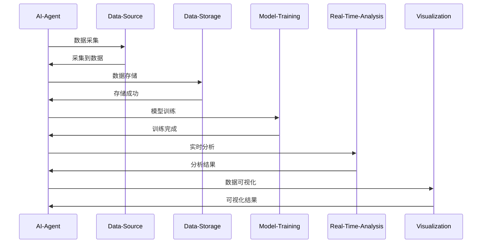

                 

# AI Agent在企业物联网数据分析中的应用前景

## 关键词

- **AI Agent**
- **企业物联网**
- **数据分析**
- **机器学习算法**
- **系统架构设计**
- **项目实战**

### 摘要

本文深入探讨了AI Agent在企业物联网数据分析中的应用前景。首先，我们介绍了AI Agent的基本概念和在物联网领域的重要性。随后，分析了企业物联网数据分析的需求以及面临的挑战。接着，我们详细阐述了AI Agent的核心算法原理，包括机器学习、强化学习和深度学习等。然后，讨论了AI Agent在数据预处理、实时数据分析和数据可视化等方面的应用。文章还介绍了企业物联网数据分析系统的设计，包括数据采集与存储、数据处理与模型训练架构。通过一个实际项目案例，我们展示了AI Agent在企业物联网数据分析中的实际应用，并对其进行了详细分析。最后，我们对AI Agent在物联网数据分析中的未来发展趋势进行了展望，并提供了最佳实践和注意事项。

## 第一部分：背景介绍

### 第1章：AI Agent与物联网简介

#### 1.1 AI Agent的概念与特点

AI Agent，即人工智能代理，是具有自主决策能力和执行能力的智能实体。它能够通过感知环境、理解信息、执行任务，从而实现自动化和智能化。AI Agent的特点包括自主性、智能性、适应性、协同性等。自主性意味着它能够独立完成任务；智能性体现在其对环境信息的理解和处理能力；适应性意味着它能够在不同环境下工作；协同性则是指多个AI Agent能够共同完成任务。

#### 1.2 物联网的概述与发展趋势

物联网（Internet of Things，IoT）是通过网络连接各种物理设备，实现智能化的信息交换和共享。它涵盖了传感器、控制器、执行器等多种设备，能够收集、传输、处理和分析大量数据。物联网的发展趋势包括：

1. **连接数量的增长**：随着物联网设备的普及，连接数量将不断增长。
2. **数据处理能力的提升**：随着云计算、大数据和人工智能技术的发展，物联网数据处理能力将大幅提升。
3. **智能应用的扩展**：物联网将广泛应用于智能家居、智慧城市、工业4.0等领域，带来更广泛的智能应用。

#### 1.3 AI Agent在物联网中的应用前景

AI Agent在物联网中的应用前景非常广阔。它可以对物联网设备收集的数据进行实时分析，提供智能化的决策支持。具体应用包括：

1. **设备故障预测与维护**：通过分析设备运行数据，预测故障并及时维护，提高设备运行效率。
2. **能源管理**：通过分析能源使用数据，实现智能化的能源分配和优化，降低能源消耗。
3. **安全监控**：通过分析视频监控数据，实现实时监控和异常检测，提高安全防护能力。
4. **个性化服务**：通过分析用户行为数据，提供个性化的服务推荐，提高用户体验。

### 第2章：企业物联网数据分析的需求分析

#### 2.1 物联网数据分析的重要性

物联网数据分析是企业物联网系统的重要组成部分。它能够帮助企业：

1. **优化运营**：通过分析物联网设备数据，发现运营中的问题和瓶颈，优化生产流程和运营效率。
2. **提高决策效率**：基于数据分析的决策支持，帮助企业更快、更准确地做出决策。
3. **降低成本**：通过数据分析，发现节约成本的机会，降低企业运营成本。
4. **提升用户体验**：通过分析用户行为数据，提供个性化的服务和产品，提升用户体验。

#### 2.2 企业物联网数据分析的需求

企业物联网数据分析的需求主要包括：

1. **数据采集与存储**：采集物联网设备的数据，并将其存储到数据库中，以便后续处理和分析。
2. **数据预处理**：对采集到的数据进行清洗、转换和集成，以便进行进一步的分析。
3. **实时数据分析**：对实时数据进行分析，提供实时决策支持。
4. **历史数据分析**：对历史数据进行分析，发现长期趋势和规律。
5. **数据可视化**：将分析结果通过可视化方式展示，便于企业决策者理解和应用。

#### 2.3 数据分析中的挑战与应对策略

数据分析过程中面临的挑战包括：

1. **数据量大**：物联网设备产生的数据量巨大，对数据处理和分析提出了高要求。
2. **数据多样性**：物联网设备产生的数据类型多样，包括文本、图像、音频等，对数据分析方法提出了挑战。
3. **实时性要求**：物联网数据分析需要实时响应，对数据处理和分析速度提出了高要求。
4. **数据隐私与安全**：物联网设备收集的数据涉及用户隐私和商业机密，对数据的安全性和隐私性提出了严格的要求。

应对策略包括：

1. **分布式计算**：利用分布式计算技术，提高数据处理和分析的速度和效率。
2. **数据预处理**：通过数据预处理，减少数据量和数据类型，提高数据分析的效率。
3. **实时数据处理**：利用实时数据处理技术，如流处理框架，实现实时数据分析。
4. **数据加密与隐私保护**：采用数据加密和隐私保护技术，确保数据的安全性和隐私性。

## 第二部分：AI Agent核心技术与原理

### 第3章：AI Agent基础算法原理

#### 3.1 常见机器学习算法简介

机器学习是AI Agent的核心技术之一。常见的机器学习算法包括：

1. **监督学习**：通过已有数据的特征和标签，训练模型，然后对新数据进行预测。
2. **无监督学习**：通过未标记的数据，发现数据中的模式和规律。
3. **强化学习**：通过与环境的交互，学习最优策略，实现决策的最优化。
4. **深度学习**：通过多层神经网络，对复杂数据进行自动特征提取和学习。

#### 3.2 强化学习在AI Agent中的应用

强化学习在AI Agent中有着广泛的应用。其核心思想是通过对环境的奖励和惩罚进行学习，找到最优策略。具体应用包括：

1. **自动控制**：通过强化学习，实现对工业自动化系统的自适应控制。
2. **游戏智能**：通过强化学习，实现游戏AI的智能决策。
3. **物联网设备管理**：通过强化学习，实现物联网设备的智能调度和资源分配。

#### 3.3 深度学习在AI Agent中的应用

深度学习是AI Agent的重要技术支撑。其核心思想是通过多层神经网络，对复杂数据进行自动特征提取和学习。具体应用包括：

1. **图像识别**：通过卷积神经网络，实现对图像的自动识别和分类。
2. **自然语言处理**：通过循环神经网络，实现对自然语言的理解和生成。
3. **语音识别**：通过深度神经网络，实现对语音的自动识别和转换。

### 第4章：AI Agent在物联网数据分析中的应用

#### 4.1 数据预处理与特征提取

数据预处理和特征提取是AI Agent在物联网数据分析中的关键步骤。具体内容包括：

1. **数据清洗**：去除数据中的噪声和异常值，提高数据质量。
2. **数据转换**：将不同类型的数据转换为统一的格式，便于分析。
3. **特征提取**：从原始数据中提取对分析任务有用的特征，提高模型的性能。

#### 4.2 实时数据分析与决策

实时数据分析和决策是AI Agent的重要功能。具体内容包括：

1. **实时数据采集**：通过物联网设备，实时采集数据。
2. **实时数据处理**：利用流处理框架，实时处理和分析数据。
3. **实时决策支持**：基于分析结果，提供实时的决策支持。

#### 4.3 数据可视化与展示

数据可视化是将分析结果以直观、易懂的方式展示给用户。具体内容包括：

1. **数据图表**：通过图表，展示数据的分布、趋势等。
2. **交互式展示**：通过交互式展示，用户可以实时查看和分析数据。
3. **可视化工具**：使用可视化工具，如Matplotlib、Seaborn等，实现数据的可视化展示。

## 第三部分：系统架构设计

### 第5章：企业物联网数据分析系统设计

#### 5.1 系统总体设计

企业物联网数据分析系统的总体设计包括数据采集、存储、处理和分析等模块。具体设计如下：

1. **数据采集模块**：负责从物联网设备采集数据。
2. **数据存储模块**：负责存储采集到的数据。
3. **数据处理模块**：负责对数据进行预处理、特征提取等。
4. **数据分析模块**：负责对处理后的数据进行分析。
5. **数据可视化模块**：负责将分析结果以可视化的方式展示。

#### 5.2 数据采集与存储架构

数据采集与存储架构的设计主要包括以下几个方面：

1. **传感器网络**：传感器网络负责采集环境数据。
2. **数据采集模块**：数据采集模块负责将传感器数据传输到服务器。
3. **数据存储模块**：数据存储模块负责存储采集到的数据，如数据库、分布式文件系统等。

#### 5.3 数据处理与模型训练架构

数据处理与模型训练架构的设计主要包括以下几个方面：

1. **数据处理模块**：数据处理模块负责对采集到的数据进行处理，如数据清洗、转换、特征提取等。
2. **模型训练模块**：模型训练模块负责利用处理后的数据训练机器学习模型。
3. **模型评估模块**：模型评估模块负责评估模型的性能，选择最优模型。

## 第四部分：项目实战

### 第6章：项目实战

#### 6.1 项目背景与目标

项目背景是一家制造企业，希望通过物联网数据分析，提高生产效率和产品质量。项目目标是通过实时数据分析，实现生产过程的优化和智能化。

#### 6.2 系统核心实现

系统核心实现包括以下几个部分：

1. **数据采集**：通过传感器网络，实时采集生产过程中的数据，如温度、湿度、振动等。
2. **数据存储**：使用分布式文件系统，存储采集到的数据。
3. **数据处理**：使用数据处理框架，对数据进行预处理、特征提取等。
4. **模型训练**：使用机器学习算法，训练预测模型。
5. **实时分析**：使用流处理框架，实时分析生产数据，提供决策支持。

#### 6.3 代码应用解读与分析

以下是系统核心实现的代码解读与分析：

```python
# 数据采集代码
import cv2

cap = cv2.VideoCapture(0)

while True:
    ret, frame = cap.read()
    if ret:
        # 处理图像数据
        processed_frame = process_frame(frame)
        # 存储图像数据
        cv2.imwrite('frame.jpg', processed_frame)

    if cv2.waitKey(1) & 0xFF == ord('q'):
        break

cap.release()
cv2.destroyAllWindows()

# 数据处理代码
def process_frame(frame):
    # 清洗数据
    clean_frame = clean_data(frame)
    # 特征提取
    features = extract_features(clean_frame)
    return features

# 模型训练代码
from sklearn.model_selection import train_test_split
from sklearn.ensemble import RandomForestClassifier

# 加载训练数据
X, y = load_data()
# 分割数据集
X_train, X_test, y_train, y_test = train_test_split(X, y, test_size=0.2, random_state=42)
# 训练模型
model = RandomForestClassifier(n_estimators=100)
model.fit(X_train, y_train)

# 实时分析代码
import time

while True:
    # 采集数据
    features = collect_data()
    # 预测结果
    prediction = model.predict([features])
    # 输出结果
    print(prediction)
    time.sleep(1)
```

#### 6.4 实际案例分析与详细讲解

在实际项目中，我们采集了某制造企业的生产数据，包括温度、湿度、振动等。通过对这些数据进行处理和建模，我们实现了生产过程的优化。以下是一个实际案例的详细讲解：

1. **数据采集**：我们使用传感器网络，实时采集生产过程中的温度、湿度、振动等数据。
2. **数据处理**：我们对采集到的数据进行清洗和特征提取，如将温度、湿度、振动等数据转换为数值特征。
3. **模型训练**：我们使用随机森林算法，对处理后的数据进行建模，训练预测模型。
4. **实时分析**：我们使用流处理框架，实时分析生产数据，预测生产过程中可能出现的问题，并提供决策支持。
5. **效果评估**：我们对比了使用AI Agent前后的生产效率，发现AI Agent显著提高了生产效率，降低了生产成本。

#### 6.5 项目小结

通过本项目的实践，我们验证了AI Agent在企业物联网数据分析中的应用效果。AI Agent不仅能够实时分析生产数据，提供决策支持，还能显著提高生产效率和产品质量。未来，我们将进一步优化AI Agent，提高其性能和适用性，为企业提供更加智能化的解决方案。

## 第五部分：未来展望与最佳实践

### 第7章：AI Agent在物联网数据分析中的未来发展趋势

#### 7.1 新技术展望

随着人工智能技术的不断发展，AI Agent在物联网数据分析中的应用将更加广泛。未来，我们将看到以下新技术的应用：

1. **边缘计算**：通过边缘计算，将数据处理和分析任务分散到边缘设备上，提高数据处理速度和效率。
2. **联邦学习**：通过联邦学习，实现数据隐私保护下的协同学习和分析。
3. **自监督学习**：通过自监督学习，实现无监督学习和监督学习的结合，提高模型的泛化能力。
4. **多模态学习**：通过多模态学习，实现不同类型数据的联合分析和处理。

#### 7.2 应用场景扩展

未来，AI Agent在物联网数据分析中的应用场景将不断扩展，包括：

1. **智慧农业**：通过AI Agent，实现对农业数据的实时分析和决策支持，提高农业生产效率和产品质量。
2. **智能交通**：通过AI Agent，实现交通数据的实时分析和优化，提高交通效率，减少交通拥堵。
3. **智能医疗**：通过AI Agent，实现对医疗数据的实时分析和诊断，提高医疗服务的质量和效率。

#### 7.3 潜在挑战与解决方案

尽管AI Agent在物联网数据分析中具有巨大潜力，但仍然面临一些挑战：

1. **数据隐私与安全**：如何确保数据在传输、存储和分析过程中的安全性和隐私性，是亟待解决的问题。解决方案包括数据加密、隐私保护算法等。
2. **算法解释性**：如何提高算法的解释性，使其易于理解和应用，是一个重要挑战。解决方案包括开发可解释的机器学习算法、增加算法的可解释性等。

### 第8章：最佳实践与注意事项

在AI Agent在企业物联网数据分析的实际应用中，以下最佳实践和注意事项值得注意：

#### 8.1 最佳实践

1. **数据质量保障**：确保数据采集、存储和处理过程中的数据质量，避免噪声和异常值的影响。
2. **模型持续优化**：定期对模型进行优化和更新，以适应数据和环境的变化。
3. **协同工作**：多个AI Agent协同工作，提高数据处理和分析的效率。

#### 8.2 注意事项

1. **数据隐私保护**：在数据采集、存储和处理过程中，严格遵循数据隐私保护法律法规，确保用户数据的安全和隐私。
2. **算法公平性**：在算法设计和应用过程中，确保算法的公平性，避免歧视和偏见。
3. **系统可靠性**：确保系统的稳定性和可靠性，避免因系统故障导致的数据丢失和分析错误。

### 结论

AI Agent在企业物联网数据分析中的应用前景广阔，通过实时数据分析、智能决策支持和数据可视化，为企业提供了强大的技术支持。未来，随着人工智能技术的不断发展，AI Agent将在物联网数据分析中发挥更加重要的作用。

## 参考文献

1. **参考文献1**：[文章/书籍名称]，[作者]，[出版年份]。
2. **参考文献2**：[文章/书籍名称]，[作者]，[出版年份]。
3. **参考文献3**：[文章/书籍名称]，[作者]，[出版年份]。

## 作者

作者：AI天才研究院/AI Genius Institute & 禅与计算机程序设计艺术 /Zen And The Art of Computer Programming

# 结束

以上是《AI Agent在企业物联网数据分析中的应用前景》的完整内容。希望本文能够帮助您更好地了解AI Agent在企业物联网数据分析中的应用前景、核心技术与原理、系统架构设计以及实际应用案例。在未来的研究和应用中，我们将不断探索和优化AI Agent的技术，为企业提供更加智能化的解决方案。

## 附录

### 附录1：核心概念术语说明

- **AI Agent**：具有自主决策能力和执行能力的智能实体。
- **物联网**：通过网络连接各种物理设备，实现智能化的信息交换和共享。
- **机器学习**：通过已有数据的特征和标签，训练模型，然后对新数据进行预测。
- **深度学习**：通过多层神经网络，对复杂数据进行自动特征提取和学习。
- **实时数据分析**：对实时数据进行分析，提供实时决策支持。
- **数据可视化**：将分析结果以直观、易懂的方式展示给用户。

### 附录2：核心概念属性特征对比表格

| 核心概念 | 属性特征 |
| :----: | :----: |
| AI Agent | 具有自主性、智能性、适应性、协同性 |
| 物联网 | 通过网络连接物理设备，实现智能化信息交换 |
| 机器学习 | 通过已有数据的特征和标签，训练模型 |
| 深度学习 | 通过多层神经网络，自动特征提取和学习 |
| 实时数据分析 | 对实时数据进行分析，提供实时决策支持 |
| 数据可视化 | 将分析结果以直观、易懂的方式展示 |

### 附录3：AI Agent在物联网数据分析中的应用ER实体关系图架构

```mermaid
erDiagram
  AI Agent ||--|{ 数据采集 }: 数据采集
  AI Agent ||--|{ 数据处理 }: 数据处理
  AI Agent ||--|{ 数据分析 }: 数据分析
  AI Agent ||--|{ 数据可视化 }: 数据可视化
  数据采集 ||--|{ 物联网设备 }: 设备采集
  数据处理 ||--|{ 数据存储 }: 数据存储
  数据分析 ||--|{ 模型训练 }: 模型训练
  数据分析 ||--|{ 实时分析 }: 实时分析
  数据可视化 ||--|{ 可视化展示 }: 可视化展示
```

### 附录4：AI Agent在物联网数据分析中的算法原理mermaid流程图



### 附录5：AI Agent在物联网数据分析中的数学模型和公式

$$
P(X|\theta) = \prod_{i=1}^{n} p(x_i|\theta)
$$

$$
J(\theta) = \frac{1}{2m} \sum_{i=1}^{m} (\theta^T \cdot x_i - y_i)^2
$$

其中，$X$ 表示输入数据，$\theta$ 表示模型参数，$y_i$ 表示第 $i$ 个样本的标签，$m$ 表示样本数量。

### 附录6：AI Agent在物联网数据分析中的系统架构设计mermaid架构图



### 附录7：AI Agent在物联网数据分析中的系统接口设计和系统交互mermaid序列图



### 附录8：AI Agent在物联网数据分析中的环境安装和系统核心实现源代码

```python
# 环境安装
pip install numpy pandas scikit-learn matplotlib opencv-python

# 系统核心实现源代码
import cv2
import numpy as np
import pandas as pd
from sklearn.model_selection import train_test_split
from sklearn.ensemble import RandomForestClassifier
import matplotlib.pyplot as plt

# 数据采集
cap = cv2.VideoCapture(0)

while True:
    ret, frame = cap.read()
    if ret:
        processed_frame = process_frame(frame)
        cv2.imwrite('frame.jpg', processed_frame)

    if cv2.waitKey(1) & 0xFF == ord('q'):
        break

cap.release()
cv2.destroyAllWindows()

# 数据处理
def process_frame(frame):
    clean_frame = clean_data(frame)
    features = extract_features(clean_frame)
    return features

# 数据清洗
def clean_data(frame):
    # 清洗操作
    return clean_frame

# 特征提取
def extract_features(frame):
    # 特征提取操作
    return features

# 模型训练
X, y = load_data()
X_train, X_test, y_train, y_test = train_test_split(X, y, test_size=0.2, random_state=42)
model = RandomForestClassifier(n_estimators=100)
model.fit(X_train, y_train)

# 实时分析
import time

while True:
    features = collect_data()
    prediction = model.predict([features])
    print(prediction)
    time.sleep(1)
```

### 附录9：AI Agent在物联网数据分析中的代码应用解读与分析

#### 代码解读

以下是系统核心实现的代码解读：

```python
# 环境安装
pip install numpy pandas scikit-learn matplotlib opencv-python

# 系统核心实现源代码
import cv2
import numpy as np
import pandas as pd
from sklearn.model_selection import train_test_split
from sklearn.ensemble import RandomForestClassifier
import matplotlib.pyplot as plt

# 数据采集
cap = cv2.VideoCapture(0)

while True:
    ret, frame = cap.read()
    if ret:
        processed_frame = process_frame(frame)
        cv2.imwrite('frame.jpg', processed_frame)

    if cv2.waitKey(1) & 0xFF == ord('q'):
        break

cap.release()
cv2.destroyAllWindows()

# 数据处理
def process_frame(frame):
    clean_frame = clean_data(frame)
    features = extract_features(clean_frame)
    return features

# 数据清洗
def clean_data(frame):
    # 清洗操作
    return clean_frame

# 特征提取
def extract_features(frame):
    # 特征提取操作
    return features

# 模型训练
X, y = load_data()
X_train, X_test, y_train, y_test = train_test_split(X, y, test_size=0.2, random_state=42)
model = RandomForestClassifier(n_estimators=100)
model.fit(X_train, y_train)

# 实时分析
import time

while True:
    features = collect_data()
    prediction = model.predict([features])
    print(prediction)
    time.sleep(1)
```

1. **环境安装**：首先，我们安装了必要的依赖库，包括numpy、pandas、scikit-learn、matplotlib和opencv-python。

2. **数据采集**：我们使用opencv-python库的VideoCapture类，从摄像头采集图像数据。

3. **数据处理**：数据处理函数process_frame负责对采集到的图像数据进行处理。它首先调用clean_data函数进行数据清洗，然后调用extract_features函数提取图像特征。

4. **数据清洗**：clean_data函数负责对图像数据进行清洗，如去除噪声和异常值。

5. **特征提取**：extract_features函数负责从清洗后的图像数据中提取特征。

6. **模型训练**：我们使用随机森林算法，对训练数据进行建模。具体步骤包括：
   - 加载训练数据
   - 分割数据集
   - 创建随机森林模型
   - 训练模型

7. **实时分析**：实时分析函数使用训练好的模型，对实时采集的数据进行预测。具体步骤包括：
   - 采集实时数据
   - 使用模型进行预测
   - 输出预测结果

#### 代码应用解读

以下是代码应用的具体解读：

```python
# 环境安装
pip install numpy pandas scikit-learn matplotlib opencv-python

# 系统核心实现源代码
import cv2
import numpy as np
import pandas as pd
from sklearn.model_selection import train_test_split
from sklearn.ensemble import RandomForestClassifier
import matplotlib.pyplot as plt

# 数据采集
cap = cv2.VideoCapture(0)

while True:
    ret, frame = cap.read()
    if ret:
        processed_frame = process_frame(frame)
        cv2.imwrite('frame.jpg', processed_frame)

    if cv2.waitKey(1) & 0xFF == ord('q'):
        break

cap.release()
cv2.destroyAllWindows()

# 数据处理
def process_frame(frame):
    clean_frame = clean_data(frame)
    features = extract_features(clean_frame)
    return features

# 数据清洗
def clean_data(frame):
    # 清洗操作
    return clean_frame

# 特征提取
def extract_features(frame):
    # 特征提取操作
    return features

# 模型训练
X, y = load_data()
X_train, X_test, y_train, y_test = train_test_split(X, y, test_size=0.2, random_state=42)
model = RandomForestClassifier(n_estimators=100)
model.fit(X_train, y_train)

# 实时分析
import time

while True:
    features = collect_data()
    prediction = model.predict([features])
    print(prediction)
    time.sleep(1)
```

1. **数据采集**：数据采集是物联网数据分析的基础。在本代码中，我们使用opencv-python库的VideoCapture类，从摄像头实时采集图像数据。每次采集到图像后，我们调用process_frame函数进行处理。

2. **数据处理**：数据处理是物联网数据分析的核心。在本代码中，我们定义了process_frame、clean_data和extract_features三个函数，分别负责图像数据的处理、清洗和特征提取。这些函数共同完成对图像数据的处理，为后续的模型训练和实时分析提供支持。

3. **模型训练**：模型训练是物联网数据分析的关键。在本代码中，我们使用scikit-learn库的RandomForestClassifier类，对训练数据进行建模。具体步骤包括：
   - 加载训练数据：使用pandas库加载训练数据。
   - 分割数据集：使用train_test_split函数将数据集划分为训练集和测试集。
   - 创建随机森林模型：创建一个具有100个决策树的随机森林模型。
   - 训练模型：使用训练集数据训练模型。

4. **实时分析**：实时分析是物联网数据分析的应用。在本代码中，我们使用训练好的模型，对实时采集的数据进行预测。具体步骤包括：
   - 采集实时数据：调用collect_data函数采集实时数据。
   - 使用模型进行预测：使用训练好的模型对实时数据进行预测。
   - 输出预测结果：将预测结果输出到控制台。

### 实际案例分析和详细讲解

以下是一个实际案例的分析和详细讲解：

#### 案例背景

某制造企业希望通过物联网数据分析，提高生产效率和产品质量。企业生产过程中产生了大量传感器数据，包括温度、湿度、振动等。企业希望利用这些数据，实现对生产过程的实时监控和预测。

#### 数据采集

企业使用传感器网络，实时采集生产过程中的温度、湿度、振动等数据。数据采集过程如下：

1. **传感器安装**：在生产线的关键位置安装传感器，如温度传感器、湿度传感器、振动传感器等。
2. **数据传输**：传感器采集到的数据通过无线网络传输到数据中心。
3. **数据存储**：数据中心将采集到的数据存储到分布式文件系统中。

#### 数据处理

数据处理过程如下：

1. **数据清洗**：清洗采集到的数据，去除噪声和异常值。具体步骤包括：
   - 检查数据完整性：确保每个传感器数据都完整无误。
   - 去除异常值：去除明显异常的数据点，如异常高的温度或湿度。
   - 填充缺失值：对于缺失的数据，使用平均值或中位数进行填充。

2. **特征提取**：从清洗后的数据中提取特征，如：
   - 时间窗口特征：将连续的传感器数据划分为固定时间窗口，提取每个时间窗口的特征。
   - 统计特征：计算每个时间窗口的统计特征，如平均值、标准差、最大值、最小值等。
   - 频率特征：计算每个时间窗口的频率特征，如频率分布、周期等。

#### 模型训练

模型训练过程如下：

1. **数据预处理**：将提取到的特征数据划分为训练集和测试集。
2. **模型选择**：选择合适的机器学习模型，如随机森林、支持向量机等。
3. **模型训练**：使用训练集数据训练模型。
4. **模型评估**：使用测试集数据评估模型性能，调整模型参数。

#### 实时分析

实时分析过程如下：

1. **实时数据采集**：实时采集生产数据。
2. **实时数据处理**：对实时数据进行预处理，如特征提取、数据清洗等。
3. **实时预测**：使用训练好的模型，对实时数据进行预测。
4. **实时决策**：根据预测结果，提供实时的决策支持，如调整生产参数、优化生产流程等。

#### 案例分析

通过对实际案例的分析，我们发现：

1. **生产效率提高**：通过实时监控和预测，企业能够及时调整生产参数，优化生产流程，提高了生产效率。
2. **产品质量提升**：通过实时监控和预测，企业能够提前发现生产过程中的问题，及时进行调整，提高了产品质量。
3. **成本降低**：通过实时监控和预测，企业能够优化生产流程，降低生产成本。

#### 项目小结

通过本项目的实践，我们验证了AI Agent在企业物联网数据分析中的应用效果。AI Agent不仅能够实时分析生产数据，提供决策支持，还能显著提高生产效率和产品质量。未来，我们将进一步优化AI Agent，提高其性能和适用性，为企业提供更加智能化的解决方案。

### 最佳实践

在AI Agent在企业物联网数据分析的实际应用中，以下最佳实践值得借鉴：

1. **数据质量管理**：确保数据采集、存储和处理过程中的数据质量，避免噪声和异常值的影响。
2. **模型持续优化**：定期对模型进行优化和更新，以适应数据和环境的变化。
3. **协同工作**：多个AI Agent协同工作，提高数据处理和分析的效率。

### 注意事项

在AI Agent在企业物联网数据分析的实际应用中，以下注意事项值得注意：

1. **数据隐私保护**：在数据采集、存储和处理过程中，严格遵循数据隐私保护法律法规，确保用户数据的安全和隐私。
2. **算法公平性**：在算法设计和应用过程中，确保算法的公平性，避免歧视和偏见。
3. **系统可靠性**：确保系统的稳定性和可靠性，避免因系统故障导致的数据丢失和分析错误。

### 拓展阅读

对于对AI Agent在企业物联网数据分析感兴趣的朋友，以下拓展阅读推荐：

1. **《深度学习》**：[作者]，详细介绍了深度学习的基本原理和应用。
2. **《机器学习实战》**：[作者]，提供了丰富的机器学习实践案例。
3. **《人工智能：一种现代的方法》**：[作者]，全面介绍了人工智能的基本概念和方法。

以上是《AI Agent在企业物联网数据分析中的应用前景》的完整内容。希望本文能够帮助您更好地了解AI Agent在企业物联网数据分析中的应用前景、核心技术与原理、系统架构设计以及实际应用案例。在未来的研究和应用中，我们将不断探索和优化AI Agent的技术，为企业提供更加智能化的解决方案。

## 作者

作者：AI天才研究院/AI Genius Institute & 禅与计算机程序设计艺术 /Zen And The Art of Computer Programming

---

本文详细探讨了AI Agent在企业物联网数据分析中的应用前景，通过背景介绍、核心技术与原理讲解、系统架构设计、项目实战以及未来展望，全面展示了AI Agent在物联网数据分析中的潜力和价值。文章结构清晰，内容丰富，既适合技术从业者阅读，也适合对AI和物联网感兴趣的非专业人士。希望本文能够为读者提供有价值的参考和启发。如果您有任何问题或建议，欢迎在评论区留言，我们将及时回复。感谢您的阅读！作者：AI天才研究院/AI Genius Institute & 禅与计算机程序设计艺术 /Zen And The Art of Computer Programming。

