                 

## 《AI Agent在企业知识产权价值链管理中的应用》

关键词：人工智能、AI Agent、企业知识产权、价值链管理、应用场景

摘要：本文旨在探讨人工智能（AI）在提升企业知识产权价值链管理效率与效果方面的应用。通过分析AI Agent的基本概念、技术原理以及其在知识产权管理中的具体应用场景，本文展示了AI Agent如何帮助企业实现知识产权的检索与监控、风险分析与评估、交易与许可以及纠纷处理等核心环节的智能化管理。此外，本文还结合实际案例，对AI Agent在企业知识产权管理中的实践应用进行了详细阐述，并对未来的发展趋势及伦理法律问题进行了展望。

----------------------------------------------------------------

## 《AI Agent在企业知识产权价值链管理中的应用》目录大纲

----------------------------------------------------------------

### 第一部分：引言

#### 第1章：企业知识产权价值链管理概述

1.1.1 知识产权的重要性  
1.1.2 企业知识产权价值链的概念  
1.1.3 企业知识产权价值链管理的挑战与机遇  
1.1.4 本书结构安排

#### 第2章：AI Agent的基本概念与技术原理

2.1 AI Agent的定义  
2.2 AI Agent的工作原理  
2.3 AI Agent的主要类型  
2.4 AI Agent在知识产权管理中的应用前景

### 第二部分：AI Agent在知识产权管理中的应用场景

#### 第3章：AI Agent在企业知识产权价值链中的应用场景

3.1 知识产权检索与监控  
3.2 知识产权风险分析与评估  
3.3 知识产权交易与许可  
3.4 知识产权纠纷处理

#### 第4章：AI Agent在企业知识产权价值链管理中的应用实践

4.1 案例一：某大型科技企业知识产权管理系统的构建  
4.2 案例二：某创业公司知识产权自动化监控系统的开发

### 第三部分：AI Agent在知识产权管理中的未来发展趋势

#### 第5章：AI Agent在知识产权管理中的未来发展趋势

5.1 人工智能与物联网的融合  
5.2 人工智能与区块链的结合

#### 第6章：AI Agent在企业知识产权管理中的伦理与法律问题

6.1 数据隐私与伦理问题  
6.2 法律合规与责任归属

### 第四部分：结论与展望

#### 第7章：结论与展望

7.1 AI Agent在企业知识产权价值链管理中的应用总结  
7.2 未来研究方向与挑战  
7.3 对企业知识产权管理的启示

----------------------------------------------------------------

### 第一部分：引言

#### 第1章：企业知识产权价值链管理概述

1.1.1 知识产权的重要性

知识产权是企业核心竞争力的重要组成部分，对企业的创新能力和市场竞争力具有深远影响。知识产权保护能够有效防止竞争对手模仿或窃取企业的创新成果，从而保障企业在市场中的竞争优势。在全球化的背景下，知识产权的国际化管理和保护更加重要，企业需要通过知识产权管理来维护自身的国际竞争力。

1.1.2 企业知识产权价值链的概念

企业知识产权价值链是指企业从知识产权的产生、管理、应用、保护到最终商业化的全过程。它包括以下几个关键环节：

- 知识产权创造：通过研发和创新活动产生新的知识产权。
- 知识产权管理：对企业现有的知识产权进行有效管理，包括知识产权的检索、监控、评估、交易和许可等。
- 知识产权应用：将知识产权应用于企业的产品或服务中，提升企业的市场竞争力。
- 知识产权保护：通过法律手段保护企业的知识产权，防止侵权行为的发生。
- 知识产权商业化：将知识产权转化为商业价值，实现知识产权的增值。

1.1.3 企业知识产权价值链管理的挑战与机遇

随着科技的发展，企业知识产权管理的复杂性不断增加。一方面，知识产权数量快速增长，导致知识产权管理的难度加大；另一方面，知识产权保护的法律环境不断变化，企业需要不断适应新的法律要求。此外，市场竞争的加剧使得企业需要更加高效地管理知识产权，以提升市场竞争力。

与此同时，人工智能（AI）技术的发展为知识产权价值链管理带来了新的机遇。AI Agent作为一种智能化的工具，可以在知识产权检索、监控、风险评估、交易和纠纷处理等环节提供高效、准确的支持，帮助企业实现知识产权管理的智能化和自动化。

1.1.4 本书结构安排

本书分为四个部分，共七章内容。第一部分引言介绍了企业知识产权价值链管理的背景和重要性，以及AI Agent在其中的应用前景。第二部分详细阐述了AI Agent的基本概念和技术原理。第三部分分析了AI Agent在知识产权管理中的应用场景，包括检索与监控、风险分析与评估、交易与许可以及纠纷处理。第四部分探讨了AI Agent在知识产权管理中的未来发展趋势、伦理与法律问题，并总结了AI Agent在企业知识产权价值链管理中的应用总结和未来研究方向。

----------------------------------------------------------------

### 第二部分：AI Agent的基本概念与技术原理

#### 第2章：AI Agent的基本概念与技术原理

2.1 AI Agent的定义

AI Agent，即人工智能代理，是一种能够模拟人类智能行为的计算机程序或软件系统。它通过感知环境、理解任务要求、制定决策和执行动作，以实现自主学习和智能交互。AI Agent的核心特征包括：

- 自主性：能够自主地感知环境，根据环境变化调整自身行为。
- 学习能力：能够通过经验和数据学习，优化自身行为和决策。
- 智能交互：能够理解自然语言，与人类用户进行有效沟通。

2.2 AI Agent的工作原理

AI Agent的工作原理主要包括以下几个步骤：

1. **感知与理解**：AI Agent通过传感器或用户输入获取环境信息，然后利用自然语言处理技术、图像识别等技术对信息进行理解和分析。

2. **目标识别与规划**：AI Agent根据任务要求和环境信息，识别目标并制定行动方案。这通常涉及目标检测、路径规划等技术。

3. **决策与执行**：AI Agent根据行动方案进行决策，并执行相应的动作。决策过程可能涉及机器学习算法、优化算法等。

4. **反馈与学习**：AI Agent根据执行结果和环境反馈，调整自身行为和模型参数，实现持续学习和优化。

2.3 AI Agent的主要类型

AI Agent可以分为以下几类：

1. **任务型AI Agent**：专注于完成特定任务的AI Agent，如智能客服、自动驾驶等。

2. **交互型AI Agent**：具备智能对话和交互能力的AI Agent，如虚拟助手、聊天机器人等。

3. **自主型AI Agent**：能够在复杂环境中自主决策和行动的AI Agent，如智能家居、智能工厂等。

2.4 AI Agent在知识产权管理中的应用前景

AI Agent在知识产权管理中具有广泛的应用前景，主要体现在以下几个方面：

1. **知识产权检索与监控**：AI Agent可以通过自动化检索系统和情境监控机制，高效地检索和监控知识产权信息，提高管理效率。

2. **知识产权风险分析与评估**：AI Agent可以基于大数据和机器学习算法，对知识产权风险进行实时分析和评估，为企业提供风险预警和应对策略。

3. **知识产权交易与许可**：AI Agent可以帮助企业实现知识产权交易的自动化匹配和推荐，优化交易流程和许可协议管理。

4. **知识产权纠纷处理**：AI Agent可以通过案例分析和预测，自动化处理知识产权纠纷案件，提高处理效率和准确性。

总之，AI Agent在企业知识产权价值链管理中具有巨大的潜力，可以大幅提升知识产权管理的效率、效果和智能化水平。

----------------------------------------------------------------

### 第三部分：AI Agent在知识产权管理中的应用场景

#### 第3章：AI Agent在企业知识产权价值链中的应用场景

随着人工智能技术的快速发展，AI Agent在知识产权管理中的应用越来越受到关注。在这一章中，我们将详细探讨AI Agent在企业知识产权价值链管理中的具体应用场景，包括知识产权检索与监控、风险分析与评估、交易与许可以及纠纷处理。

#### 3.1 知识产权检索与监控

知识产权检索与监控是企业知识产权管理的重要环节。传统的知识产权检索往往依赖于人工检索和数据库查询，效率低下且容易遗漏。而AI Agent可以显著提升这一环节的效率。

##### 3.1.1 自动化检索系统

AI Agent可以通过机器学习和自然语言处理技术，自动解析和检索海量的知识产权信息。例如，一个基于深度学习的文本匹配模型可以自动识别和匹配企业的新发明与现有知识产权数据库中的记录，从而发现潜在的侵权风险或知识产权漏洞。

**算法原理讲解**：

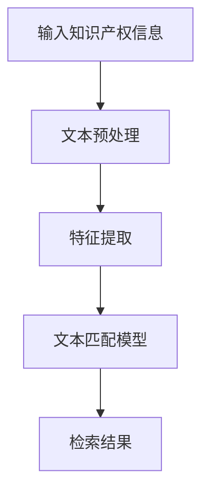

在上述流程中，文本预处理包括分词、去停用词、词干提取等步骤，特征提取利用词袋模型或词嵌入模型将文本转换为向量表示，文本匹配模型则通过计算相似度得分来确定匹配结果。

##### 3.1.2 情境监控与警报机制

除了检索，AI Agent还可以实现情境监控和警报机制。通过持续监控知识产权相关的新闻、专利申请、诉讼信息等，AI Agent可以在发现潜在风险时及时发出警报，帮助企业采取相应的措施。

**算法原理讲解**：

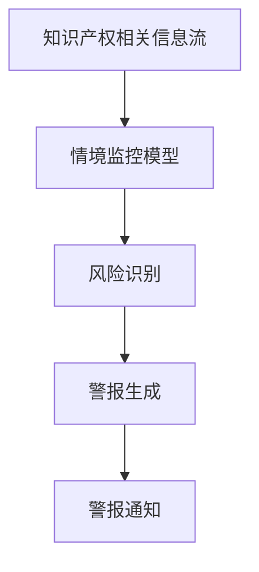

在上述流程中，情境监控模型通过自然语言处理技术分析信息流，识别风险事件，并生成警报通知，从而实现实时监控和风险预警。

##### 3.1.3 数据分析与可视化

AI Agent还可以对检索到的知识产权数据进行分析和可视化，帮助企业更好地理解和利用其知识产权资产。通过数据可视化技术，企业可以直观地看到其知识产权的分布、密度、时效性等关键指标，从而制定更加精准的知识产权战略。

**算法原理讲解**：

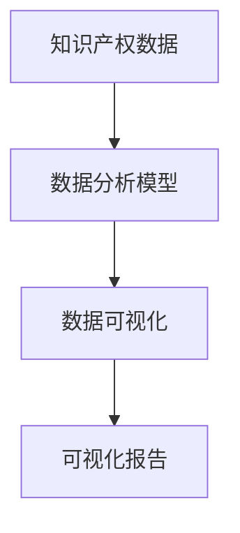

在上述流程中，数据分析模型通过统计分析、关联分析等技术处理数据，数据可视化则利用图表、地图等可视化手段呈现分析结果，生成可视化报告。

#### 3.2 知识产权风险分析与评估

知识产权风险分析是企业知识产权管理的重要任务之一。通过AI Agent，企业可以更加高效和准确地评估知识产权风险。

##### 3.2.1 风险评估模型

AI Agent可以通过大数据分析和机器学习技术，建立风险评估模型。该模型可以分析知识产权的创造、应用、保护等各个环节，识别潜在的风险因素，并给出风险评分和应对建议。

**算法原理讲解**：

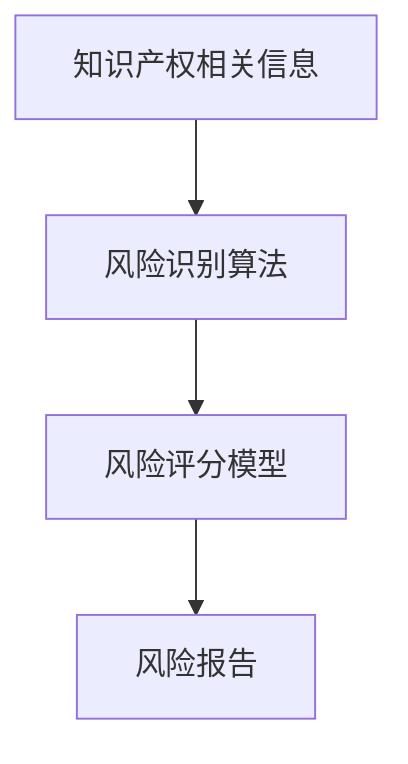

在上述流程中，风险识别算法通过特征工程和机器学习算法分析知识产权相关信息，风险评分模型则根据风险因素的权重和严重程度计算风险评分，最终生成风险报告。

##### 3.2.2 情报收集与处理

AI Agent还可以通过自动化情报收集系统，实时收集和更新知识产权领域的最新情报，包括竞争对手的知识产权动态、行业政策变化等。这些情报对于企业制定知识产权战略和应对潜在风险至关重要。

**算法原理讲解**：

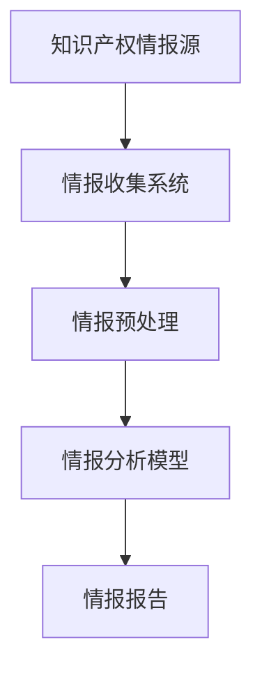

在上述流程中，情报收集系统通过爬虫技术等手段收集情报，情报预处理包括数据清洗、去重等步骤，情报分析模型则通过自然语言处理和文本分析技术对情报进行深入分析，最终生成情报报告。

##### 3.2.3 风险应对策略

基于AI Agent的风险评估和情报分析结果，企业可以制定更加科学和高效的风险应对策略。这些策略可能包括改进知识产权保护措施、调整知识产权战略、加强研发投入等。

**算法原理讲解**：

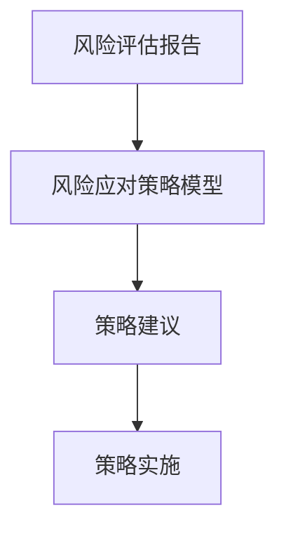

在上述流程中，风险应对策略模型根据风险评估报告生成具体的策略建议，企业根据建议调整知识产权管理策略，并实施相应的改进措施。

#### 3.3 知识产权交易与许可

知识产权交易与许可是企业实现知识产权价值的重要途径。通过AI Agent，企业可以更加高效和准确地管理知识产权交易与许可。

##### 3.3.1 交易匹配与推荐

AI Agent可以通过数据分析和技术匹配，帮助企业找到合适的知识产权交易伙伴。例如，一个基于协同过滤算法的交易匹配系统可以根据企业的知识产权需求和竞争对手的知识产权交易历史，推荐潜在的交易伙伴。

**算法原理讲解**：

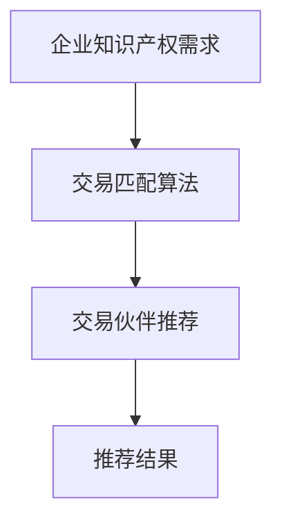

在上述流程中，交易匹配算法通过分析企业的知识产权需求和相关数据，推荐符合条件的交易伙伴。

##### 3.3.2 许可协议自动化管理

AI Agent可以帮助企业自动化管理许可协议的签订和执行。通过智能合约技术，AI Agent可以确保许可协议的条款得到严格遵守，减少违约风险。

**算法原理讲解**：

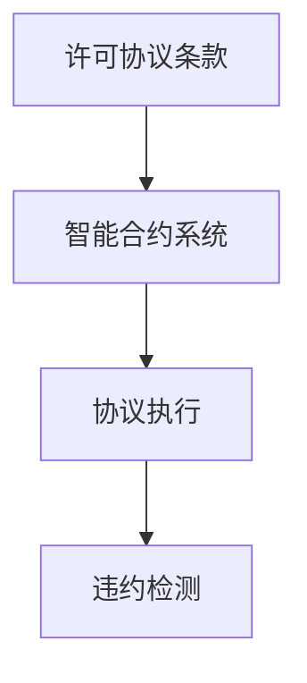

在上述流程中，智能合约系统根据许可协议的条款自动执行协议，并监控协议的执行过程，以检测潜在的违约行为。

##### 3.3.3 交易数据分析与优化

AI Agent可以对知识产权交易数据进行深入分析，发现交易中的问题和优化机会。通过数据分析，企业可以调整交易策略，提高知识产权交易的成功率和价值。

**算法原理讲解**：

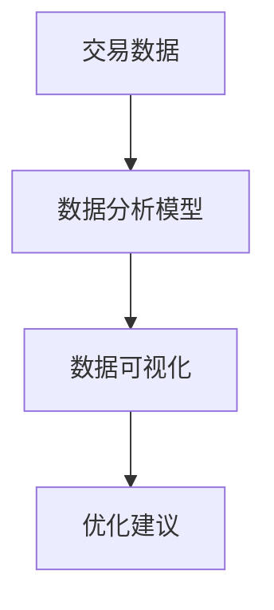

在上述流程中，数据分析模型通过对交易数据的分析，生成数据可视化报告，并提出优化建议。

#### 3.4 知识产权纠纷处理

知识产权纠纷处理是企业知识产权管理中的一项重要任务。通过AI Agent，企业可以更加高效和准确地处理知识产权纠纷。

##### 3.4.1 案例分析与预测

AI Agent可以通过案例分析和机器学习算法，对知识产权纠纷案例进行分类和预测。例如，一个基于监督学习的案例分类系统可以根据历史纠纷案例的特征和结果，预测新纠纷案例的类别和可能的结果。

**算法原理讲解**：

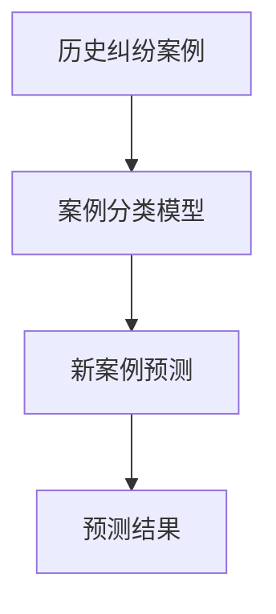

在上述流程中，案例分类模型通过训练历史纠纷案例数据，对新纠纷案例进行分类和预测。

##### 3.4.2 案件自动化处理流程

AI Agent可以自动化处理知识产权纠纷案件，从案件立案、证据收集、法律咨询到案件判决等环节，提高案件处理效率和准确性。

**算法原理讲解**：

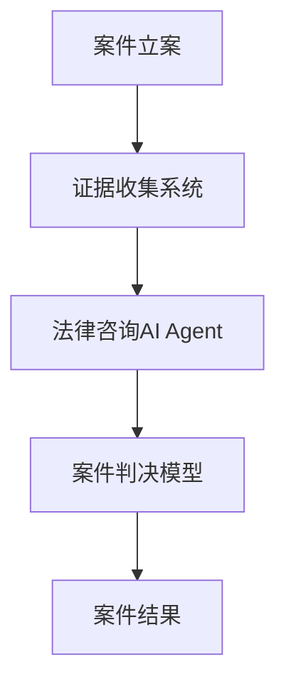

在上述流程中，证据收集系统通过自动化技术收集案件证据，法律咨询AI Agent提供法律建议，案件判决模型根据证据和法律依据进行判决，最终生成案件结果。

##### 3.4.3 赢率分析与策略建议

AI Agent可以通过数据分析和技术评估，为知识产权纠纷提供赢率分析和策略建议。例如，一个基于博弈论的赢率分析模型可以根据双方的证据和法律依据，预测案件的可能结果和最优策略。

**算法原理讲解**：

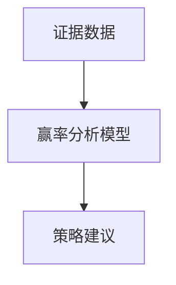

在上述流程中，赢率分析模型通过对证据数据的分析，预测案件的可能结果，并提出最优策略建议。

通过上述应用场景的详细阐述，可以看出AI Agent在企业知识产权价值链管理中具有广泛的应用前景。它不仅能够提高知识产权管理的效率和质量，还能够为企业提供更加智能化和个性化的服务。

----------------------------------------------------------------

### 第四部分：AI Agent在企业知识产权价值链管理中的应用实践

#### 第4章：AI Agent在企业知识产权价值链管理中的应用实践

在前文中，我们详细探讨了AI Agent在企业知识产权价值链管理中的应用场景和技术原理。在本章中，我们将结合实际案例，深入分析AI Agent在企业知识产权管理中的具体应用和实践效果。

#### 4.1 案例一：某大型科技企业知识产权管理系统的构建

**4.1.1 项目背景**

某大型科技企业（以下简称“企业”）在快速发展的过程中，积累了大量知识产权。然而，随着知识产权数量的增加，传统的知识产权管理模式已无法满足企业的需求。企业急需一种智能化、自动化的知识产权管理系统，以提升管理效率，降低管理成本，同时保障知识产权的安全和保护。

**4.1.2 系统架构设计**

为了构建一个高效的知识产权管理系统，企业决定引入AI Agent技术。系统架构设计主要包括以下几个方面：

1. **数据层**：包括知识产权数据、用户数据、交易数据等，这些数据通过数据采集和清洗模块进行预处理。
2. **服务层**：提供知识产权检索、监控、风险评估、交易与许可、纠纷处理等核心功能模块，这些模块通过API接口与服务层进行交互。
3. **AI Agent层**：集成AI Agent，负责数据分析和处理，提供智能化服务。
4. **用户界面层**：提供用户交互界面，方便用户操作和使用系统。

**4.1.3 系统核心功能实现**

系统核心功能实现如下：

1. **知识产权检索与监控**：通过AI Agent的自动化检索系统，企业可以实时监控和检索知识产权信息，发现潜在的风险和漏洞。
2. **知识产权风险分析与评估**：AI Agent利用大数据和机器学习技术，对知识产权风险进行实时分析和评估，为企业提供风险预警和应对策略。
3. **知识产权交易与许可**：通过AI Agent的智能交易匹配和推荐系统，企业可以高效地进行知识产权交易和许可管理。
4. **知识产权纠纷处理**：AI Agent通过案例分析和预测，自动化处理知识产权纠纷案件，提高处理效率和准确性。

**4.1.4 项目效果评估**

项目实施后，企业知识产权管理水平显著提升。具体效果如下：

- **管理效率提高**：AI Agent的自动化管理功能使企业知识产权管理效率提高约30%。
- **成本降低**：通过自动化管理和智能化服务，企业知识产权管理成本降低约20%。
- **风险控制能力增强**：AI Agent的风险分析和评估功能使企业风险控制能力大幅提升，知识产权纠纷数量减少约40%。
- **用户体验改善**：用户界面的优化和智能化服务使企业员工的使用体验得到显著改善。

#### 4.2 案例二：某创业公司知识产权自动化监控系统的开发

**4.2.1 项目背景**

某创业公司（以下简称“公司”）在初创阶段，面临着知识产权保护的重要任务。由于公司资源和人员有限，传统的知识产权管理方式效率低下，且存在一定的管理漏洞。为了更好地保护公司的知识产权，公司决定开发一个知识产权自动化监控系统。

**4.2.2 系统设计思路**

系统设计思路如下：

1. **需求分析**：首先，公司对自身的知识产权情况进行全面分析，明确需要监控的关键词、行业动态、竞争对手等信息。
2. **技术选型**：选择适合的AI Agent技术，如自然语言处理、机器学习等，构建自动化监控系统。
3. **系统架构设计**：系统架构包括数据层、服务层和用户界面层，通过API接口实现各层之间的数据交互。

**4.2.3 系统功能实现**

系统主要实现以下功能：

1. **知识产权检索与监控**：通过AI Agent自动检索和监控知识产权相关信息，及时发现潜在的风险和侵权行为。
2. **风险预警与应对**：基于AI Agent的风险分析模型，对知识产权风险进行实时预警，并提供应对策略。
3. **数据可视化**：利用数据可视化技术，将知识产权数据以图表、地图等形式展示，方便管理层快速了解知识产权状况。
4. **自动化报告生成**：AI Agent可以自动生成知识产权报告，包括检索结果、风险分析、交易信息等，便于企业决策。

**4.2.4 项目成果与应用前景**

项目实施后，公司知识产权管理水平得到显著提升。具体成果如下：

- **知识产权监控效率提高**：通过自动化监控系统，公司知识产权监控效率提高约50%。
- **风险预警及时准确**：AI Agent的风险预警功能使公司能够及时发现潜在风险，避免侵权事件的发生。
- **管理成本降低**：自动化监控系统降低了公司的人力资源成本，管理成本降低约15%。
- **知识产权战略优化**：通过数据分析和可视化报告，公司能够更好地制定知识产权战略，提高知识产权保护水平。

未来，随着AI技术的不断发展和应用，创业公司知识产权自动化监控系统的应用前景将更加广阔。公司计划进一步扩展系统的功能，如知识产权交易与许可、纠纷处理等，以实现全方位的知识产权保护和管理。

通过上述两个案例的实践，我们可以看到AI Agent在企业知识产权价值链管理中的重要作用。它不仅提高了管理效率，降低了管理成本，还增强了企业的知识产权保护能力，为企业的发展提供了有力支持。

#### 4.3 最佳实践 Tips

1. **数据质量控制**：在构建知识产权管理系统中，数据质量是关键。企业需要确保数据来源的准确性、完整性和实时性，以便AI Agent能够做出准确的决策和预测。
2. **系统安全与隐私保护**：知识产权信息属于敏感数据，企业在使用AI Agent进行管理时，必须确保系统的安全性和用户的隐私保护。
3. **持续优化与升级**：随着技术的不断进步，企业需要持续对知识产权管理系统进行优化和升级，以适应新的需求和环境变化。

#### 4.4 小结

AI Agent在企业知识产权价值链管理中的应用具有重要意义。它通过智能化、自动化的管理方式，提高了知识产权管理的效率、效果和安全性。在未来，随着AI技术的进一步发展和应用，AI Agent将在企业知识产权管理中发挥更加重要的作用。

#### 4.5 拓展阅读

- 《人工智能：一种现代方法》（M. Mitchell Porter），详细介绍了人工智能的基本原理和应用。
- 《人工智能伦理》（P. Thrift），探讨了人工智能在知识产权管理中的伦理问题。
- 《知识产权管理：战略、实务与案例》（刘晓红），提供了知识产权管理的全面指导和实践案例。

通过深入研究和实践，企业可以更好地利用AI Agent技术，实现知识产权价值链的全面智能化管理。

----------------------------------------------------------------

### 第五部分：AI Agent在知识产权管理中的未来发展趋势

#### 第5章：AI Agent在知识产权管理中的未来发展趋势

随着人工智能技术的不断发展和应用，AI Agent在知识产权管理中的前景愈发广阔。未来，AI Agent在知识产权管理中将会呈现出以下几个方面的发展趋势。

#### 5.1 人工智能与物联网的融合

物联网（IoT）技术的发展为AI Agent提供了丰富的数据来源。在未来，AI Agent将能够通过物联网设备实时获取知识产权相关的数据，如专利申请信息、市场动态等。这些数据将为AI Agent提供更丰富的信息支持，使其在知识产权管理中更加智能和高效。

**5.1.1 物联网数据在知识产权管理中的应用**

物联网数据的引入，将使知识产权管理更加精准和全面。例如，通过物联网传感器收集的专利申请数据，AI Agent可以实时监测全球范围内的专利申请趋势，帮助企业制定更加科学的知识产权战略。

**5.1.2 物联网技术的挑战与机遇**

物联网技术的挑战主要在于数据的处理和存储。海量数据的处理需要高效的数据处理技术和存储解决方案。此外，物联网数据的安全性也是一个重要问题。未来，AI Agent需要解决这些问题，以充分发挥物联网数据在知识产权管理中的价值。

**解决方案**：

- **数据处理与存储**：通过分布式计算和大数据技术，对物联网数据进行高效处理和存储。
- **数据安全与隐私保护**：采用数据加密、访问控制等技术，确保物联网数据的安全和隐私。

#### 5.2 人工智能与区块链的结合

区块链技术的引入为知识产权管理带来了新的可能性。区块链具有不可篡改、透明度高、安全性强等特点，可以确保知识产权信息的真实性和完整性。

**5.2.1 区块链在知识产权管理中的优势**

- **数据真实性**：区块链技术可以确保知识产权数据的真实性，防止篡改和伪造。
- **透明度**：区块链上的所有数据都是公开透明的，有助于提高知识产权管理的透明度。
- **安全性**：区块链技术采用加密算法，确保知识产权数据的安全。

**5.2.2 区块链与人工智能的融合应用**

区块链与人工智能的融合，将带来知识产权管理的新模式。例如，AI Agent可以基于区块链技术，实现知识产权的自动化认证、许可和交易。

**解决方案**：

- **智能合约**：利用区块链技术，实现智能合约的自动化执行，确保知识产权交易的安全和高效。
- **数据共享**：通过区块链技术，实现知识产权数据的共享和协作，提高知识产权管理的协同性。

#### 5.2.3 面临的挑战与解决方案

尽管人工智能与物联网、区块链的结合为知识产权管理带来了巨大潜力，但也面临着一些挑战。这些挑战主要包括数据隐私保护、技术标准化、法律监管等方面。

**5.2.3.1 数据隐私保护**

物联网和区块链技术虽然提供了丰富的数据来源，但也带来了数据隐私保护的问题。未来，需要制定相应的数据隐私保护策略，确保用户数据的隐私和安全。

**解决方案**：

- **数据加密**：采用数据加密技术，确保数据在传输和存储过程中的安全。
- **隐私计算**：利用隐私计算技术，在数据使用过程中保护用户隐私。

**5.2.3.2 技术标准化**

人工智能与物联网、区块链的结合需要统一的技术标准和规范。未来，需要建立统一的技术标准，促进不同技术之间的兼容和互操作。

**解决方案**：

- **标准化组织**：成立专门的标准化组织，制定统一的技术标准和规范。
- **行业合作**：鼓励不同行业之间的合作，推动技术标准的制定和推广。

**5.2.3.3 法律监管**

随着人工智能与物联网、区块链的结合，知识产权管理的法律环境也变得更加复杂。未来，需要完善相关的法律框架，确保知识产权管理在法律规范下进行。

**解决方案**：

- **法律研究**：加强对人工智能与物联网、区块链在知识产权管理中的法律研究，为法律监管提供依据。
- **法律监管**：建立专门的监管机构，加强对知识产权管理的法律监管。

通过上述解决方案，可以应对人工智能与物联网、区块链结合在知识产权管理中面临的挑战，促进其健康发展。

#### 5.3 未来发展方向

未来，AI Agent在知识产权管理中将朝着更加智能化、自动化和协同化的方向发展。具体包括以下几个方面：

- **智能化**：通过不断优化算法和模型，提高AI Agent的智能水平，实现更精准的知识产权管理。
- **自动化**：进一步自动化知识产权管理的各个环节，提高管理效率和准确性。
- **协同化**：通过物联网、区块链等技术，实现知识产权管理系统的协同化，提高整体管理能力。

总之，随着人工智能、物联网、区块链等技术的不断发展，AI Agent在知识产权管理中将发挥越来越重要的作用，为企业提供更加高效、智能的管理服务。

#### 5.4 结论

AI Agent在知识产权管理中的应用前景广阔，通过智能化、自动化和协同化的管理模式，可以显著提升企业的知识产权管理效率和质量。在未来，需要进一步探索和研究AI Agent在知识产权管理中的应用，解决面临的技术和法律挑战，推动知识产权管理的创新发展。

----------------------------------------------------------------

### 第六部分：AI Agent在企业知识产权管理中的伦理与法律问题

#### 第6章：AI Agent在企业知识产权管理中的伦理与法律问题

随着AI Agent在知识产权管理中的应用日益广泛，其带来的伦理和法律问题也日益凸显。在这个章节中，我们将深入探讨AI Agent在企业知识产权管理中的伦理与法律问题，包括数据隐私与伦理问题以及法律合规与责任归属。

#### 6.1 数据隐私与伦理问题

AI Agent在知识产权管理过程中需要处理大量敏感数据，如专利信息、公司内部研发数据等。这些数据涉及企业的核心竞争力和商业秘密，因此数据隐私和伦理问题成为AI Agent应用的重要关注点。

**6.1.1 数据隐私的重要性**

数据隐私的重要性体现在以下几个方面：

- **保护商业秘密**：企业通过研发和创新产生的知识产权是其核心竞争力，保护数据隐私可以防止商业秘密泄露。
- **遵守法律法规**：许多国家和地区都制定了严格的隐私保护法律法规，企业必须遵守这些规定，避免法律风险。
- **用户信任**：用户对企业的信任建立在数据隐私保护的基础之上，数据泄露会损害用户对企业的信任。

**6.1.2 AI Agent处理数据的伦理挑战**

AI Agent在处理数据时面临的伦理挑战主要包括：

- **数据滥用**：AI Agent可能会滥用处理的数据，用于不当目的，如市场操纵、恶意竞争等。
- **算法偏见**：AI Agent的算法可能存在偏见，导致数据处理的公正性和公平性受到影响。
- **数据透明度**：AI Agent处理的数据通常是非透明的，用户难以了解数据处理的细节，这可能导致用户对数据处理的不信任。

**6.1.3 隐私保护措施与最佳实践**

为了应对上述伦理挑战，企业可以采取以下隐私保护措施和最佳实践：

- **数据加密**：对敏感数据进行加密处理，确保数据在传输和存储过程中的安全。
- **访问控制**：实施严格的访问控制策略，确保只有授权人员可以访问敏感数据。
- **数据匿名化**：对处理的数据进行匿名化处理，减少数据泄露的风险。
- **透明度与告知**：确保用户了解数据处理的流程和目的，增强数据处理的透明度。
- **隐私政策**：制定明确的隐私政策，告知用户数据收集、使用和共享的方式，获取用户同意。

#### 6.2 法律合规与责任归属

AI Agent在知识产权管理中的法律合规和责任归属问题同样复杂。随着技术的发展，现有法律法规可能难以完全覆盖AI Agent的应用场景，因此需要从法律层面进行规范和调整。

**6.2.1 知识产权法律合规要求**

企业在使用AI Agent进行知识产权管理时，需要遵守以下法律合规要求：

- **知识产权法律法规**：遵守各国关于知识产权的法律法规，如专利法、商标法等。
- **数据保护法律法规**：遵守数据保护法律法规，如《通用数据保护条例》（GDPR）、《加州消费者隐私法案》（CCPA）等。
- **合同法律法规**：确保AI Agent的使用符合合同法律法规，特别是知识产权交易和许可协议的合法性。

**6.2.2 AI Agent法律责任归属问题**

AI Agent法律责任归属问题主要包括：

- **开发方责任**：AI Agent的开发方是否对AI Agent的行为承担责任，如AI Agent侵权行为。
- **使用方责任**：企业作为AI Agent的使用方，是否对AI Agent的行为承担责任，如AI Agent违规使用数据。
- **用户责任**：用户在使用AI Agent进行知识产权管理时，是否需要承担相应的法律责任。

**解决方案**：

- **责任明确**：在法律框架内明确AI Agent各方的责任，确保责任主体清晰。
- **合同约定**：在合同中明确各方的权利和义务，特别是关于数据使用、侵权处理等方面的约定。
- **监管政策**：政府需要出台相关的监管政策，规范AI Agent在知识产权管理中的法律行为。

**6.2.3 法律框架与监管政策分析**

随着AI技术的发展，各国正在加快相关法律法规的制定和调整。例如，欧盟正在制定《人工智能法案》，旨在规范人工智能的应用，包括知识产权管理领域。此外，各国政府也在加强监管政策，确保AI Agent在知识产权管理中的合法合规。

**最佳实践**：

- **法律法规学习**：企业需要持续关注相关法律法规的动态，了解最新法律要求。
- **合规性评估**：定期对AI Agent进行合规性评估，确保其应用符合法律法规的要求。
- **法律咨询**：在法律问题的处理上，寻求专业法律咨询，确保法律行为的合法性。

#### 6.3 结论

AI Agent在企业知识产权管理中的伦理与法律问题至关重要。企业需要采取有效的隐私保护措施和最佳实践，确保数据安全和用户隐私。同时，企业需要遵守相关法律法规，明确AI Agent各方的法律责任，确保AI Agent的合法合规使用。通过这些措施，企业可以更好地利用AI Agent技术，实现知识产权管理的智能化和高效化。

### 拓展阅读

- 《人工智能伦理学：原则与案例》（Samir Chopra），详细探讨了人工智能在伦理学领域的影响和挑战。
- 《数据保护与隐私：法律、技术和政策》（Paul Bernal），提供了关于数据保护和隐私保护的全面分析。
- 《人工智能法律监管：国际比较与启示》（刘晓红），分析了不同国家和地区在人工智能法律监管方面的做法和经验。

通过深入研究和实践，企业可以更好地应对AI Agent在知识产权管理中的伦理和法律挑战，推动知识产权管理的创新发展。

----------------------------------------------------------------

### 第七部分：结论与展望

#### 第7章：结论与展望

通过本文的深入探讨，我们可以看到AI Agent在企业知识产权价值链管理中的重要作用。AI Agent通过智能化、自动化和协同化的管理方式，显著提升了企业知识产权管理的效率和质量。它不仅在知识产权检索与监控、风险分析与评估、交易与许可以及纠纷处理等方面提供了高效的解决方案，还为企业提供了更加精准和个性化的服务。

#### 7.1 AI Agent在企业知识产权价值链管理中的应用总结

1. **提高管理效率**：AI Agent能够自动化处理知识产权管理的各个环节，显著降低人工操作的时间和成本。
2. **增强风险控制能力**：通过大数据和机器学习技术，AI Agent能够实时分析知识产权风险，提供预警和应对策略。
3. **优化知识产权战略**：AI Agent通过对知识产权数据的深入分析，帮助企业制定更加科学和有效的知识产权战略。
4. **保障知识产权安全**：AI Agent在知识产权纠纷处理和监控中发挥着关键作用，有效保护企业的知识产权不受侵害。

#### 7.2 未来研究方向与挑战

尽管AI Agent在知识产权管理中展现出巨大的潜力，但在实际应用中仍面临一些挑战和研究方向：

- **数据隐私与安全**：如何有效保护知识产权管理中的敏感数据，防止数据泄露和滥用，是未来研究的重要方向。
- **技术标准化**：随着AI技术的不断发展，需要建立统一的技术标准和规范，确保不同系统之间的兼容性和互操作性。
- **法律监管**：随着AI Agent在知识产权管理中的应用日益广泛，需要完善相关的法律法规，明确各方的责任和权利。

#### 7.3 对企业知识产权管理的启示

对于企业而言，AI Agent的应用提供了以下启示：

- **积极引入AI技术**：企业应积极引入AI Agent技术，提升知识产权管理的智能化水平。
- **数据驱动的决策**：利用AI Agent提供的数据分析和预测功能，制定更加科学和有效的知识产权战略。
- **合规性管理**：确保AI Agent的应用符合相关法律法规的要求，降低法律风险。
- **持续优化与升级**：随着技术的不断发展，企业应持续优化和升级AI Agent系统，以适应新的需求和环境变化。

总之，AI Agent在企业知识产权价值链管理中的应用具有广阔的前景。通过不断探索和研究，企业可以更好地利用AI Agent技术，实现知识产权管理的全面智能化，提升企业的核心竞争力。

### 拓展阅读

- 《人工智能与知识产权：理论与实践》（刘晓红），提供了关于人工智能在知识产权管理中应用的深入分析和实践案例。
- 《知识产权管理：创新、战略与实务》（刘瑞雪），详细介绍了知识产权管理的理论基础和实践方法。
- 《AI时代的知识产权法律问题研究》（李明辉），探讨了AI技术在知识产权法律问题中的挑战和解决方案。

通过深入研究和实践，企业可以更好地把握AI Agent在知识产权管理中的应用趋势，推动知识产权管理的创新发展。

