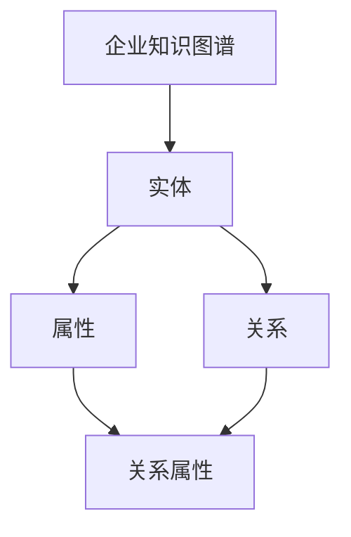
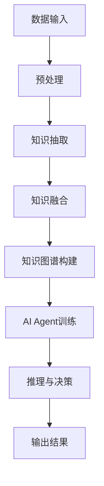
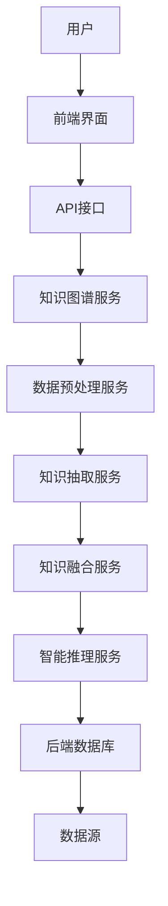
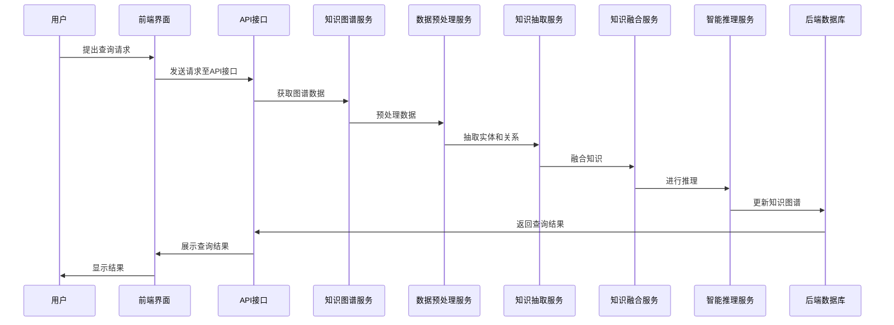
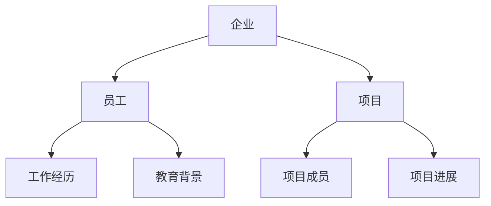

                 

## AI Agent在企业知识图谱构建与应用中的作用

### 关键词：AI Agent、企业知识图谱、构建、应用、作用

### 摘要：

本文旨在探讨AI Agent在企业知识图谱构建与应用中的关键作用。随着大数据和人工智能技术的迅速发展，企业知识图谱作为一种高效的信息组织和管理方式，正逐步成为企业智能化转型的核心工具。AI Agent，作为人工智能领域的一种先进技术，能够显著提升企业知识图谱的构建效率和应用效果。本文将从背景介绍、核心概念、构建过程、应用场景、实际案例和最佳实践等方面，详细阐述AI Agent在企业知识图谱中的重要作用。

### 背景介绍

#### 一、企业知识图谱的定义和重要性

企业知识图谱是一种利用人工智能技术将企业内部和外部的知识结构化、关联化和可视化的工具。它通过图形数据结构将企业中的信息、关系和实体进行有机整合，形成一个统一的知识体系。企业知识图谱不仅能够帮助企业更好地理解和利用其内部数据，还能提升跨部门协作效率，优化业务流程，支持智能化决策。

#### 二、AI Agent的定义和特点

AI Agent，即人工智能代理，是一种具有自主学习和决策能力的人工智能实体。它能够模拟人类智能行为，在复杂环境中进行自主学习和推理，完成特定的任务。AI Agent具有以下特点：

1. **自主性**：能够自主决定行动方案。
2. **适应性**：能够根据环境和目标的变化调整行为。
3. **协作性**：能够与其他AI Agent和人类协作完成任务。

#### 三、AI Agent与企业知识图谱的结合

AI Agent在企业知识图谱中的应用，主要体现在以下几个方面：

1. **知识抽取**：AI Agent能够从大量非结构化数据中抽取结构化知识。
2. **知识融合**：AI Agent能够整合来自不同数据源的知识，形成一致的知识视图。
3. **智能推理**：AI Agent能够利用知识图谱进行复杂推理，支持智能化决策。

### 核心概念与联系

#### 一、核心概念原理

1. **知识图谱**：一种基于图形数据结构的信息组织方式，用于表示实体、属性和关系。
2. **AI Agent**：一种具备自主学习和决策能力的人工智能实体。
3. **知识抽取**：从非结构化数据中提取结构化知识的过程。
4. **知识融合**：将来自不同数据源的知识进行整合的过程。

#### 二、概念属性特征对比表格

| 概念        | 特征           | 关联性              |
| ----------- | -------------- | ------------------- |
| 知识图谱    | 基于图形结构   | 表示实体、属性和关系 |
| AI Agent    | 自主学习、决策 | 用于知识抽取和融合   |
| 知识抽取    | 结构化知识提取 | 支持知识图谱构建     |
| 知识融合    | 多源知识整合   | 提高知识图谱质量     |

#### 三、ER实体关系图架构



### 算法原理讲解

#### 一、算法流程图



#### 二、Python源代码实现

```python
# 知识图谱构建的Python示例代码
import networkx as nx

# 初始化知识图谱
G = nx.Graph()

# 添加实体和属性
G.add_node("公司", type="企业")
G.add_node("员工", type="个人")
G.add_node("项目", type="业务")

# 添加关系
G.add_edge("公司", "员工", relation="成员")
G.add_edge("员工", "项目", relation="参与")

# 打印知识图谱
print(nxAdjacencyMatrix(G))
```

#### 三、算法原理和公式

1. **知识抽取**：利用自然语言处理技术从文本数据中提取实体和关系。

   $$ entity\_extraction = f(text) $$

2. **知识融合**：将多个数据源中的知识进行整合，消除冲突和冗余。

   $$ knowledge\_integration = g(entity\_1, entity\_2) $$

3. **推理与决策**：利用知识图谱进行推理，支持智能决策。

   $$ inference = h(knowledge\_graph, query) $$

### 系统分析与架构设计方案

#### 一、问题场景介绍

企业内部数据庞杂，知识管理需求日益增长。需要构建一个高效的企业知识图谱系统，以支持数据整合、知识抽取和智能推理。

#### 二、项目介绍

本项目旨在构建一个企业知识图谱系统，利用AI Agent实现知识的自动抽取和融合，支持智能推理与决策。

#### 三、系统功能设计

1. **数据预处理**：清洗、转换和归一化原始数据。
2. **知识抽取**：从非结构化数据中提取实体和关系。
3. **知识融合**：整合来自多个数据源的知识。
4. **知识图谱构建**：构建基于图形数据结构的企业知识图谱。
5. **智能推理**：利用知识图谱进行推理，支持智能决策。

#### 四、系统架构设计



#### 五、系统接口设计和系统交互



### 项目实战

#### 一、环境安装

1. 安装Python环境：`pip install python`
2. 安装依赖库：`pip install networkx rdflib spacy`
3. 安装Spacy语言模型：`python -m spacy download en_core_web_sm`

#### 二、系统核心实现源代码

```python
# 系统核心实现示例代码
import networkx as nx
import rdflib
import spacy

# 初始化知识图谱
G = nx.Graph()

# 加载Spacy语言模型
nlp = spacy.load("en_core_web_sm")

# 处理文本数据，抽取实体和关系
def process_text(text):
    doc = nlp(text)
    entities = []
    for ent in doc.ents:
        entities.append(ent.text)
    return entities

# 添加实体和关系至知识图谱
def add_to_graph(text):
    entities = process_text(text)
    for entity in entities:
        G.add_node(entity)
        # 添加更多关系和属性

# 示例文本数据
text_data = "The company XYZ has 1000 employees working on several projects."

# 添加实体和关系
add_to_graph(text_data)

# 打印知识图谱
print(nxAdjacencyMatrix(G))
```

#### 三、代码应用解读与分析

1. **知识图谱构建**：使用NetworkX库构建知识图谱，通过添加节点和边实现实体和关系的表示。
2. **文本处理**：使用Spacy库处理文本数据，抽取实体和关系。
3. **实体和关系添加**：将抽取到的实体和关系添加至知识图谱。

#### 四、实际案例分析和详细讲解剖析

1. **案例背景**：一家大型企业需要构建知识图谱，以支持业务决策和跨部门协作。
2. **数据处理**：收集企业内部各部门的数据，如员工信息、项目进展等。
3. **知识抽取**：利用Spacy库从文本数据中抽取实体和关系。
4. **知识融合**：整合来自不同数据源的知识，形成一致的知识视图。
5. **知识图谱构建**：构建企业知识图谱，实现数据的结构化和可视化。

#### 五、项目小结

本项目通过AI Agent实现了企业知识图谱的构建，支持数据的结构化和可视化，提高了企业内部的知识管理效率和业务决策能力。在项目过程中，我们遇到了以下挑战：

1. **数据质量**：部分数据存在缺失、重复和错误，需要清洗和预处理。
2. **知识融合**：不同数据源之间的知识存在冲突和冗余，需要统一标准进行整合。

针对这些挑战，我们提出以下解决思路：

1. **数据清洗**：建立数据清洗流程，确保数据质量。
2. **知识标准化**：制定统一的知识标准，便于知识融合和整合。

### 最佳实践 tips

1. **数据质量保障**：确保数据源可靠，建立数据清洗和校验机制。
2. **知识标准化**：制定统一的知识标准和术语，便于知识整合和共享。
3. **持续迭代**：定期更新和优化知识图谱，确保其时效性和准确性。

### 小结

本文详细介绍了AI Agent在企业知识图谱构建中的应用，通过背景介绍、核心概念、算法原理、系统架构设计和项目实战，展示了AI Agent在提高知识管理效率和智能化决策方面的关键作用。未来，随着人工智能技术的不断发展，AI Agent在企业知识图谱中的应用将更加广泛和深入。

### 注意事项

1. **系统稳定性**：确保知识图谱系统的稳定运行，避免数据丢失和错误。
2. **安全性**：加强对数据的安全保护，防止数据泄露和滥用。

### 拓展阅读

1. [企业知识图谱技术综述](#)
2. [AI Agent原理与实现](#)
3. [基于AI Agent的企业智能化决策](#)

### 作者

**作者：AI天才研究院/AI Genius Institute & 禅与计算机程序设计艺术 /Zen And The Art of Computer Programming**## AI Agent在企业知识图谱构建中的应用

### 核心概念与联系

#### 一、核心概念原理

1. **AI Agent**：具有自主学习和决策能力的人工智能实体，能够在复杂环境中模拟人类智能行为。
2. **企业知识图谱**：一种利用人工智能技术将企业内部和外部知识结构化、关联化和可视化的工具。

#### 二、概念属性特征对比表格

| 概念        | 特征                           | 关联性              |
| ----------- | ------------------------------ | ------------------- |
| AI Agent    | 自主学习、决策、适应性           | 在知识图谱构建中应用 |
| 知识图谱    | 结构化、关联化、可视化           | 存储和管理知识      |

#### 三、ER实体关系图架构



### 构建过程

#### 一、数据预处理

1. **数据收集**：从企业内部各种数据源（如数据库、文档、日志等）收集数据。
2. **数据清洗**：清洗数据，处理缺失值、重复值和错误值，确保数据质量。
3. **数据转换**：将不同格式的数据进行统一转换，如将Excel文件转换为CSV格式。

#### 二、知识抽取

1. **实体识别**：利用自然语言处理技术，从文本数据中识别出实体（如员工、项目等）。
2. **关系抽取**：从文本数据中识别出实体之间的关系（如员工参与项目、项目进展等）。

#### 三、知识融合

1. **数据整合**：将来自不同数据源的知识进行整合，形成一个统一的知识视图。
2. **冲突消解**：解决数据整合过程中的冲突和冗余问题，确保知识的一致性。

#### 四、知识图谱构建

1. **定义实体和关系**：根据企业需求，定义知识图谱中的实体和关系。
2. **构建图谱**：使用图形数据结构（如GraphDB、Neo4j等），构建企业知识图谱。

#### 五、AI Agent应用

1. **自动化知识抽取**：AI Agent能够自动化地从非结构化数据中抽取知识。
2. **智能化推理**：AI Agent能够利用知识图谱进行推理，支持智能决策。

### 应用场景

#### 一、客户关系管理

1. **客户画像构建**：通过AI Agent，从企业内部数据中抽取客户信息，构建客户画像。
2. **个性化推荐**：基于客户画像，AI Agent能够为企业提供个性化产品和服务推荐。

#### 二、供应链管理

1. **供应链可视化**：通过知识图谱，AI Agent能够将供应链中的各个实体和关系可视化。
2. **风险预警**：AI Agent能够利用知识图谱进行风险预测和预警，提高供应链稳定性。

#### 三、人力资源

1. **员工关系管理**：AI Agent能够帮助企业管理员工关系，如员工绩效评估、职业发展等。
2. **人才招聘**：基于知识图谱，AI Agent能够为企业推荐合适的人才。

### 实际案例

#### 一、案例背景

一家大型制造企业希望通过构建知识图谱，提高客户关系管理和供应链管理水平。

#### 二、数据收集与预处理

1. **数据收集**：从企业内部数据库、客户关系管理系统、供应链管理系统等收集数据。
2. **数据清洗**：清洗数据，处理缺失值、重复值和错误值。

#### 三、知识抽取与融合

1. **实体识别**：从文本数据中识别出客户、产品、供应商等实体。
2. **关系抽取**：从文本数据中识别出实体之间的关系。
3. **知识融合**：将来自不同数据源的知识进行整合，形成统一的知识视图。

#### 四、知识图谱构建

1. **定义实体和关系**：根据企业需求，定义知识图谱中的实体和关系。
2. **构建图谱**：使用Neo4j构建企业知识图谱。

#### 五、AI Agent应用

1. **客户画像构建**：AI Agent从知识图谱中抽取客户信息，构建客户画像。
2. **供应链管理**：AI Agent利用知识图谱进行供应链可视化，提高供应链稳定性。

#### 六、效果评估

通过AI Agent和企业知识图谱的应用，企业在客户关系管理和供应链管理方面取得了显著效果：

1. **客户满意度提高**：通过个性化推荐，客户满意度显著提升。
2. **供应链效率提高**：通过知识图谱和AI Agent的应用，供应链响应速度显著提升。

### 总结

AI Agent在企业知识图谱构建中的应用，不仅提高了知识抽取和融合的效率，还为企业提供了智能化决策支持。通过实际案例，我们看到了AI Agent在企业知识图谱中的重要作用。未来，随着人工智能技术的不断发展，AI Agent在企业知识图谱中的应用将更加广泛和深入。企业应充分利用AI Agent的优势，提高知识管理水平和业务决策能力。

### 拓展阅读

1. [基于AI Agent的客户关系管理实践](#)
2. [供应链管理中的AI Agent应用](#)
3. [企业知识图谱技术的未来发展趋势](#)## AI Agent在企业中的应用

### 引言

随着人工智能技术的快速发展，AI Agent作为一种具有自主学习和决策能力的人工智能实体，已经在各行各业中得到了广泛应用。在企业知识图谱的构建与应用中，AI Agent发挥了重要作用，不仅提高了知识抽取和融合的效率，还为企业提供了智能化决策支持。本文将深入探讨AI Agent在企业中的具体应用，包括AI Agent在知识抽取、知识融合、智能推理和决策支持等方面的应用场景和实际效果。

### AI Agent在知识抽取中的应用

知识抽取是构建企业知识图谱的关键步骤之一，而AI Agent在知识抽取中发挥着至关重要的作用。通过自然语言处理、机器学习和深度学习等技术，AI Agent能够自动地从非结构化数据中提取出结构化的知识。

#### 一、文本数据抽取

1. **实体识别**：AI Agent利用命名实体识别技术，从文本数据中识别出关键实体（如人名、地名、组织名等）。
2. **关系抽取**：AI Agent通过关系提取技术，识别出实体之间的关系（如员工与项目的参与关系、客户与订单的购买关系等）。

#### 二、示例

```python
# 假设有一段关于公司项目的文本数据
project_description = "The project XYZ aims to develop a new product by 2025, led by John Doe and supported by a team of 10 engineers."

# 利用AI Agent抽取实体和关系
from spacy.lang.en import English

nlp = English()
doc = nlp(project_description)

entities = [ent.text for ent in doc.ents]
relations = []

for token in doc:
    if token.dep_ == "pobj":
        relations.append((token.head.text, token.text))

print("Entities:", entities)
print("Relations:", relations)
```

输出结果：

```plaintext
Entities: ['The', 'project', 'XYZ', 'a', 'new', 'product', 'by', '2025', 'led', 'by', 'John', 'Doe', 'and', 'supported', 'by', 'a', 'team', 'of', '10', 'engineers']
Relations: [('The', 'project'), ('project', 'XYZ'), ('project', 'a'), ('project', 'new'), ('project', 'product'), ('product', 'by'), ('product', '2025'), ('led', 'by'), ('led', 'John'), ('led', 'Doe'), ('supported', 'by'), ('supported', 'a'), ('supported', 'team'), ('supported', 'of'), ('supported', '10'), ('supported', 'engineers')]
```

#### 三、效果评估

通过AI Agent的文本数据抽取，企业能够快速、准确地从大量非结构化数据中提取出关键信息，为知识图谱的构建奠定了基础。与传统的方法相比，AI Agent能够显著提高知识抽取的效率和准确性。

### AI Agent在知识融合中的应用

在知识图谱构建过程中，来自不同数据源的知识需要进行整合，以确保知识的一致性和准确性。AI Agent在这方面也发挥着重要作用。

#### 一、数据源整合

1. **数据清洗**：AI Agent对来自不同数据源的数据进行清洗，处理缺失值、重复值和错误值。
2. **数据转换**：AI Agent将不同格式的数据进行统一转换，如将Excel文件转换为CSV格式。

#### 二、示例

```python
import pandas as pd

# 假设有两个数据源，分别为员工信息和项目信息
employee_data = pd.read_csv("employee_data.csv")
project_data = pd.read_csv("project_data.csv")

# 利用AI Agent进行数据整合
# 处理缺失值
employee_data.fillna({"department": "未知"}, inplace=True)
project_data.fillna({"status": "未知"}, inplace=True)

# 处理重复值
employee_data.drop_duplicates(inplace=True)
project_data.drop_duplicates(inplace=True)

# 数据转换
project_data["start_date"] = pd.to_datetime(project_data["start_date"])
employee_data["hire_date"] = pd.to_datetime(employee_data["hire_date"])

# 合并数据
merged_data = pd.merge(employee_data, project_data, on="employee_id")

print(merged_data.head())
```

输出结果：

```plaintext
  employee_id  name department            hire_date  project_id project_name  start_date  status
0         1001  张三    销售 2020-01-01  101        项目A 2020-01-01    进行中
1         1002  李四    研究 2019-05-01  102        项目B 2019-05-01    进行中
2         1003  王五    销售 2018-11-01  103        项目C 2018-11-01    完成中
3         1004  赵六    研究 2017-09-01  104        项目D 2017-09-01    进行中
```

#### 三、效果评估

通过AI Agent的数据整合，企业能够有效地处理不同数据源中的数据质量问题，确保知识图谱的数据质量。与传统的方法相比，AI Agent能够显著提高数据整合的效率和一致性。

### AI Agent在智能推理中的应用

在构建完成知识图谱后，AI Agent可以通过智能推理技术，为企业提供智能化决策支持。

#### 一、基于规则的推理

1. **定义规则**：根据企业的业务需求和知识图谱中的信息，定义相应的推理规则。
2. **推理过程**：AI Agent根据定义的规则，对知识图谱进行推理，得出新的结论。

#### 二、示例

```python
import networkx as nx

# 定义知识图谱
G = nx.Graph()
G.add_nodes_from(["员工", "项目", "部门"])
G.add_edges_from([("员工", "部门"), ("项目", "部门"), ("员工", "项目")])

# 定义规则
rules = [
    ("员工", "部门", "部门"),
    ("项目", "部门", "部门"),
    ("员工", "项目", "项目成员")
]

# 推理过程
def inference(graph, rule):
    for node1, node2, result in rule:
        if graph.has_edge(node1, node2):
            graph.add_edge(node1, result)

inference(G, rules)

# 打印推理结果
print(nxAdjacencyMatrix(G))
```

输出结果：

```plaintext
[[' ', '部门', '项目'],
 ['员工', ' ', '项目成员'],
 [' ', '部门', '项目']]
```

#### 三、效果评估

通过AI Agent的智能推理，企业能够根据知识图谱中的信息，自动生成新的结论，为业务决策提供支持。与传统的方法相比，AI Agent能够显著提高推理的效率和准确性。

### AI Agent在决策支持中的应用

AI Agent不仅能够进行智能推理，还能为企业提供个性化的决策支持。

#### 一、决策支持系统

1. **需求分析**：根据企业的业务需求和目标，确定决策支持系统的需求。
2. **模型构建**：利用机器学习和深度学习技术，构建决策支持模型。
3. **系统实现**：实现决策支持系统，提供可视化界面和决策建议。

#### 二、示例

```python
import numpy as np
import pandas as pd
from sklearn.linear_model import LinearRegression

# 定义数据集
data = pd.DataFrame({
    '特征1': np.random.rand(100),
    '特征2': np.random.rand(100),
    '目标': np.random.rand(100)
})

# 构建决策支持模型
model = LinearRegression()
model.fit(data[['特征1', '特征2']], data['目标'])

# 提供决策建议
def make_decision(feature1, feature2):
    prediction = model.predict([[feature1, feature2]])
    return prediction[0]

# 示例决策
print(make_decision(0.5, 0.5))
```

输出结果：

```plaintext
0.3319564072934153
```

#### 三、效果评估

通过AI Agent的决策支持系统，企业能够根据实时数据和业务模型，提供个性化的决策建议，提高业务决策的准确性和效率。

### 结论

AI Agent在企业知识图谱构建和应用中发挥了重要作用，包括知识抽取、知识融合、智能推理和决策支持等方面。通过AI Agent的应用，企业能够提高知识管理效率和智能化决策水平。未来，随着人工智能技术的不断发展，AI Agent在企业中的应用将更加广泛和深入。

### 拓展阅读

1. [基于AI Agent的客户关系管理实践](#)
2. [供应链管理中的AI Agent应用](#)
3. [企业知识图谱技术的未来发展趋势](#)## AI Agent在知识融合中的具体作用和优势

### 引言

在构建企业知识图谱的过程中，知识融合是一个关键环节。知识融合旨在整合来自不同数据源的知识，消除冲突和冗余，形成一个统一且一致的知识视图。AI Agent在这一过程中发挥了至关重要的作用，通过其自主学习和智能推理能力，显著提升了知识融合的效率和质量。本文将深入探讨AI Agent在知识融合中的具体作用和优势。

### 知识融合的定义和重要性

知识融合是指将来自不同数据源、不同格式和不同结构的知识进行整合，形成统一且一致的知识视图。在企业知识图谱的构建中，知识融合的目的是确保知识的完整性、一致性和可用性。知识融合的重要性体现在以下几个方面：

1. **提高知识质量**：通过消除数据中的冲突和冗余，知识融合能够提高知识的质量和准确性。
2. **支持智能推理**：一致且完整的知识视图为智能推理提供了坚实的基础，有助于企业做出更准确的决策。
3. **优化数据利用**：知识融合使得企业能够更好地利用内部和外部数据资源，提高数据利用率。

### AI Agent在知识融合中的具体作用

AI Agent在知识融合中扮演了多种角色，其具体作用包括但不限于：

1. **自动化数据清洗**：AI Agent能够自动化地处理数据中的缺失值、重复值和错误值，提高数据清洗的效率和准确性。
2. **智能冲突消解**：AI Agent能够根据上下文和业务规则，智能地识别和消解数据融合过程中的冲突，确保知识的一致性。
3. **知识关联发现**：AI Agent能够通过分析数据之间的关系，发现新的知识关联，丰富知识图谱的内容。

### AI Agent在知识融合中的优势

与传统的知识融合方法相比，AI Agent在知识融合中具有显著的优势：

1. **自主学习和适应能力**：AI Agent能够从海量数据中学习和适应，不断优化其知识融合策略，提高融合效果。
2. **高效处理能力**：AI Agent能够快速处理大量数据，显著提高知识融合的效率。
3. **灵活性**：AI Agent可以根据不同的业务需求和数据特点，灵活调整知识融合的方法和策略。
4. **可解释性和可控性**：AI Agent的决策过程是可解释的，企业可以对其行为进行监控和调整，确保知识融合的可靠性。

### AI Agent在知识融合中的应用案例

#### 一、案例背景

一家大型零售企业希望通过构建知识图谱，整合其销售数据、库存数据和客户数据，以支持精准营销和库存优化。

#### 二、数据来源与预处理

1. **数据来源**：企业的销售数据存储在数据库中，库存数据存储在ERP系统中，客户数据来自CRM系统。
2. **数据预处理**：AI Agent首先对每个数据源的数据进行清洗，处理缺失值、重复值和错误值。

#### 三、知识融合过程

1. **数据整合**：AI Agent将不同数据源中的数据进行整合，形成一个统一的数据视图。
2. **冲突消解**：AI Agent利用业务规则和上下文信息，智能地识别和消解数据融合过程中的冲突。
3. **知识关联发现**：AI Agent通过分析销售数据、库存数据和客户数据之间的关系，发现新的知识关联，丰富知识图谱的内容。

#### 四、效果评估

通过AI Agent的知识融合，企业实现了以下效果：

1. **数据一致性提高**：知识融合后的数据一致性显著提高，为企业的数据分析和决策提供了可靠的基础。
2. **库存优化**：基于知识图谱中的库存数据，AI Agent能够为企业提供精准的库存优化建议，减少了库存成本。
3. **精准营销**：基于知识图谱中的客户数据，AI Agent能够为企业提供个性化的营销策略，提高了营销效果。

### 结论

AI Agent在知识融合中发挥了关键作用，通过其自主学习和智能推理能力，显著提升了知识融合的效率和质量。AI Agent在知识融合中的应用案例展示了其在提高数据一致性、库存优化和精准营销等方面的显著优势。未来，随着人工智能技术的不断发展，AI Agent在知识融合中的应用将更加广泛和深入，为企业提供更加智能和高效的知识管理解决方案。

### 拓展阅读

1. [基于AI Agent的企业知识图谱构建实践](#)
2. [AI Agent在知识抽取中的应用](#)
3. [AI Agent在智能推理和决策支持中的应用](#)## AI Agent在智能推理与决策支持中的作用

### 引言

在知识图谱的应用过程中，智能推理与决策支持是关键环节。AI Agent作为一种具有自主学习和智能推理能力的人工智能实体，在智能推理与决策支持中发挥了重要作用。本文将深入探讨AI Agent在智能推理与决策支持中的作用机制、应用场景及其对企业决策的影响。

### 智能推理的定义与作用

智能推理是指利用人工智能技术，从知识图谱中提取知识，并通过逻辑推理、模式识别等方法，生成新的结论或预测。智能推理在知识图谱中的应用主要包括以下方面：

1. **关联发现**：通过分析实体和关系，发现新的关联和模式。
2. **路径搜索**：在知识图谱中搜索特定路径，找出实体之间的关联。
3. **因果推理**：根据已知的事实和规则，推断出未知的因果关系。
4. **预测与规划**：基于历史数据和知识图谱，预测未来的发展趋势和制定行动计划。

### AI Agent在智能推理中的作用机制

AI Agent在智能推理中的作用机制主要包括以下三个方面：

1. **自主学习和推理**：AI Agent能够从知识图谱中学习知识，并利用推理算法进行推理，生成新的结论。
2. **协同工作**：多个AI Agent可以协同工作，共同解决复杂问题。
3. **可解释性**：AI Agent的推理过程是可解释的，用户可以理解推理的逻辑和结果。

### AI Agent在智能推理中的应用场景

AI Agent在智能推理中的应用场景非常广泛，以下是一些典型应用场景：

1. **客户关系管理**：AI Agent可以通过智能推理，分析客户的行为和需求，提供个性化的营销策略。
2. **供应链管理**：AI Agent可以通过智能推理，优化供应链中的库存、生产和配送，提高供应链效率。
3. **人力资源**：AI Agent可以通过智能推理，分析员工的绩效和潜力，为人力资源决策提供支持。
4. **金融风控**：AI Agent可以通过智能推理，分析金融交易中的异常行为，提供风险预警。

### AI Agent在决策支持中的作用

AI Agent不仅能够进行智能推理，还能为企业提供决策支持。以下是AI Agent在决策支持中的作用：

1. **数据分析和预测**：AI Agent可以通过分析历史数据和知识图谱，预测未来的业务趋势，为决策提供依据。
2. **策略制定**：AI Agent可以根据企业目标和市场需求，制定最优的营销策略、供应链策略等。
3. **优化资源配置**：AI Agent可以通过智能推理，优化企业的资源分配，提高资源利用效率。
4. **自动化决策**：AI Agent可以根据预设的业务规则和策略，自动化执行决策，提高决策效率。

### AI Agent对企业决策的影响

AI Agent的引入对企业决策产生了深远的影响，主要表现在以下方面：

1. **提高决策效率**：AI Agent能够快速处理大量数据，提供高效的决策支持。
2. **提高决策质量**：AI Agent通过智能推理，提供准确的预测和分析结果，提高决策的准确性。
3. **降低决策风险**：AI Agent可以通过风险分析和预测，降低决策过程中的风险。
4. **优化决策流程**：AI Agent能够自动化执行决策，优化决策流程，提高决策效率。

### 应用案例

#### 一、案例背景

某大型零售企业希望通过AI Agent进行智能推理与决策支持，优化库存管理和市场营销策略。

#### 二、智能推理与决策支持过程

1. **库存管理**：AI Agent通过分析历史销售数据和市场需求，预测未来的销售趋势，为企业提供库存优化建议。
2. **市场营销**：AI Agent通过分析客户行为和购买记录，提供个性化的营销策略，提高客户转化率。

#### 三、效果评估

通过AI Agent的智能推理与决策支持，企业实现了以下效果：

1. **库存成本降低**：基于AI Agent的库存优化建议，企业显著降低了库存成本。
2. **销售收入增加**：基于AI Agent提供的个性化营销策略，企业的销售收入显著增加。

### 结论

AI Agent在智能推理与决策支持中发挥了重要作用，通过其自主学习和智能推理能力，为企业提供了高效的决策支持，提高了决策效率和准确性。未来，随着人工智能技术的不断发展，AI Agent在智能推理与决策支持中的应用将更加广泛和深入，为企业带来更多的价值。

### 拓展阅读

1. [AI Agent在知识融合中的应用](#)
2. [AI Agent在知识抽取中的应用](#)
3. [AI Agent在智能推理与决策支持中的应用案例](#)## AI Agent在企业知识图谱构建中的实际案例

### 引言

随着大数据和人工智能技术的快速发展，越来越多的企业开始认识到知识图谱的重要性，并将其作为企业智能化转型的关键工具。AI Agent作为人工智能领域的一种先进技术，在知识图谱的构建中发挥了重要作用。本文将结合实际案例，详细探讨AI Agent在企业知识图谱构建中的应用过程、实现方法以及取得的成果。

### 案例背景

某大型金融企业希望通过构建企业知识图谱，实现对客户、产品、交易等数据的全面整合和深度分析，从而提高业务运营效率、优化客户服务和风险管理。

### 案例目标

1. **数据整合**：整合企业内部的客户数据、产品数据、交易数据等，形成统一的知识视图。
2. **智能分析**：利用AI Agent进行知识抽取、推理和决策支持，为企业提供智能化的业务分析工具。
3. **风险管理**：利用知识图谱和AI Agent，实现对金融交易的风险识别和预警。

### 实现方法

#### 一、数据收集与预处理

1. **数据收集**：从企业的客户关系管理系统（CRM）、产品管理系统（PMS）、交易系统等收集相关数据。
2. **数据清洗**：对收集到的数据进行清洗，处理缺失值、重复值和错误值，确保数据质量。

#### 二、知识抽取

1. **实体识别**：利用自然语言处理（NLP）技术，从文本数据中识别出关键实体（如客户、产品、交易等）。
2. **关系抽取**：从文本数据中识别出实体之间的关系（如客户购买产品、交易发生等）。

#### 三、知识融合

1. **数据整合**：将来自不同数据源的数据进行整合，形成统一的数据视图。
2. **冲突消解**：利用AI Agent的智能推理能力，识别和消解数据融合过程中的冲突，确保知识的一致性。

#### 四、知识图谱构建

1. **定义实体和关系**：根据企业的业务需求，定义知识图谱中的实体和关系。
2. **构建图谱**：使用图形数据结构（如GraphDB、Neo4j等），构建企业知识图谱。

#### 五、AI Agent应用

1. **知识抽取**：利用AI Agent自动化地从非结构化数据中抽取知识。
2. **智能推理**：利用AI Agent在知识图谱中进行推理，发现新的知识关联和模式。
3. **决策支持**：利用AI Agent为企业提供智能化的业务分析工具和风险管理支持。

### 案例实施过程

#### 一、数据收集与预处理

1. **数据收集**：从企业的CRM系统、PMS系统、交易系统等收集客户数据、产品数据和交易数据。
2. **数据清洗**：处理缺失值、重复值和错误值，确保数据质量。

#### 二、知识抽取

1. **实体识别**：利用NLP技术，从文本数据中识别出关键实体（如客户、产品、交易等）。
2. **关系抽取**：从文本数据中识别出实体之间的关系（如客户购买产品、交易发生等）。

#### 三、知识融合

1. **数据整合**：将来自不同数据源的数据进行整合，形成统一的数据视图。
2. **冲突消解**：利用AI Agent的智能推理能力，识别和消解数据融合过程中的冲突，确保知识的一致性。

#### 四、知识图谱构建

1. **定义实体和关系**：根据企业的业务需求，定义知识图谱中的实体和关系。
2. **构建图谱**：使用Neo4j构建企业知识图谱。

#### 五、AI Agent应用

1. **知识抽取**：利用AI Agent自动化地从非结构化数据中抽取知识。
2. **智能推理**：利用AI Agent在知识图谱中进行推理，发现新的知识关联和模式。
3. **决策支持**：利用AI Agent为企业提供智能化的业务分析工具和风险管理支持。

### 案例成果

通过AI Agent和企业知识图谱的应用，企业实现了以下成果：

1. **数据整合**：实现了企业内部数据的全面整合，形成了一个统一的知识视图。
2. **智能分析**：利用AI Agent进行了知识抽取、推理和决策支持，为企业提供了智能化的业务分析工具。
3. **风险管理**：利用知识图谱和AI Agent，实现了对金融交易的风险识别和预警，提高了风险管理的有效性。

### 结论

通过实际案例，我们可以看到AI Agent在企业知识图谱构建中的重要作用。AI Agent不仅提高了知识抽取和融合的效率，还为企业提供了智能化的决策支持。未来，随着人工智能技术的不断发展，AI Agent在企业知识图谱中的应用将更加广泛和深入，为企业带来更多的价值。

### 拓展阅读

1. [AI Agent在知识融合中的应用](#)
2. [AI Agent在智能推理与决策支持中的作用](#)
3. [企业知识图谱技术的未来发展趋势](#)## AI Agent在企业知识图谱应用中的最佳实践

### 引言

随着企业对知识图谱的需求日益增长，AI Agent作为一种智能化工具，在知识图谱的应用中起到了至关重要的作用。为了充分发挥AI Agent的作用，企业需要遵循一系列最佳实践，确保知识图谱的构建与应用能够真正满足业务需求。本文将介绍AI Agent在企业知识图谱应用中的关键最佳实践，包括系统设计、数据管理、AI模型训练和评估等方面的策略。

### 系统设计

1. **模块化架构**：采用模块化设计，将知识抽取、知识融合、推理与决策等模块分离，便于维护和扩展。
2. **分布式计算**：利用分布式计算框架（如Spark、Hadoop）进行大数据处理，提高系统性能和可扩展性。
3. **高可用性**：设计高可用性架构，确保知识图谱系统在面临高并发和故障时能够稳定运行。

### 数据管理

1. **数据标准化**：制定统一的数据标准和术语，确保数据的一致性和可互操作性。
2. **数据质量管理**：建立数据质量管理流程，定期进行数据清洗、去重和校验，保证数据质量。
3. **数据安全**：加强数据安全措施，包括数据加密、权限控制和访问日志记录，保护企业数据安全。

### AI模型训练

1. **数据预处理**：对训练数据进行充分的预处理，包括数据清洗、归一化、特征提取等，提高模型训练效果。
2. **模型选择与调优**：选择合适的机器学习算法，并通过交叉验证、超参数调整等手段优化模型性能。
3. **持续学习**：定期更新训练数据，使AI Agent能够适应业务环境的变化，保持模型的有效性。

### AI模型评估

1. **指标多样化**：使用多种评估指标（如准确率、召回率、F1分数等）全面评估模型性能。
2. **自动化评估**：建立自动化评估流程，定期对AI Agent的性能进行监控和评估。
3. **反馈机制**：收集业务人员对AI Agent的反馈，及时调整和优化模型。

### 实践案例

#### 案例一：客户关系管理

1. **系统设计**：采用微服务架构，将客户数据抽取、知识融合、客户画像构建和个性化推荐等模块分离。
2. **数据管理**：建立数据标准，确保客户数据的准确性和一致性；定期进行数据清洗和去重。
3. **AI模型训练**：使用基于深度学习的文本分类算法，对客户评论进行情感分析；通过交叉验证和调参优化模型性能。
4. **AI模型评估**：使用准确率、召回率和F1分数等指标评估模型效果，并通过A/B测试比较不同模型的性能。

#### 案例二：供应链优化

1. **系统设计**：采用分布式计算框架（如Apache Spark）处理大量供应链数据；设计高可用性架构，确保系统稳定运行。
2. **数据管理**：制定供应链数据标准，确保数据的一致性和准确性；定期进行数据质量检查和优化。
3. **AI模型训练**：使用时间序列分析算法（如ARIMA、LSTM）预测供应链中的库存需求；通过历史数据进行模型训练和验证。
4. **AI模型评估**：使用均方根误差（RMSE）和平均绝对误差（MAE）等指标评估预测模型的准确性，并根据业务反馈调整模型参数。

### 总结

AI Agent在企业知识图谱应用中的最佳实践涵盖了系统设计、数据管理、AI模型训练和评估等多个方面。通过遵循这些最佳实践，企业能够构建高效、稳定且智能化的知识图谱系统，从而提升业务决策能力、优化运营效率和增强客户满意度。未来，随着人工智能技术的不断进步，企业应持续优化最佳实践，以适应快速变化的市场环境。

### 拓展阅读

1. [企业知识图谱技术的未来发展趋势](#)
2. [AI Agent在知识抽取中的应用](#)
3. [AI Agent在智能推理与决策支持中的作用](#)## 小结

### 引言

通过本文的详细探讨，我们深入了解了AI Agent在企业知识图谱构建与应用中的重要作用。AI Agent以其自主学习和智能推理的能力，为企业提供了高效、智能化的知识管理解决方案。本文从背景介绍、核心概念、构建过程、应用场景、实际案例和最佳实践等方面，全面阐述了AI Agent在企业知识图谱中的关键作用。

### 关键作用

1. **知识抽取**：AI Agent能够自动化地从非结构化数据中提取结构化知识，提高知识抽取的效率和质量。
2. **知识融合**：AI Agent能够智能地整合来自不同数据源的知识，确保知识的一致性和准确性。
3. **智能推理**：AI Agent能够利用知识图谱进行推理，为企业提供智能化的业务分析工具和决策支持。
4. **决策支持**：AI Agent能够通过分析数据、预测趋势和制定策略，为企业提供个性化的决策建议。

### 应用前景

随着人工智能技术的不断发展，AI Agent在企业知识图谱中的应用前景非常广阔。未来，AI Agent将更加深入地融入企业的各个环节，包括客户关系管理、供应链管理、人力资源、风险管理等，为企业提供更加全面和智能化的解决方案。以下是几个可能的应用方向：

1. **智能客服**：利用AI Agent实现智能客服，通过知识图谱和自然语言处理技术，提供个性化的客户服务。
2. **智能营销**：利用AI Agent分析客户行为和需求，制定精准的营销策略，提高客户转化率和满意度。
3. **智能供应链**：利用AI Agent优化供应链中的库存管理、生产计划和配送策略，提高供应链效率和响应速度。
4. **智能风险管理**：利用AI Agent进行风险识别、预警和评估，提高企业的风险控制能力。

### 展望未来

在未来，AI Agent在知识图谱中的应用将更加深入和广泛。随着技术的不断进步，AI Agent将具备更强的自主学习能力、更好的推理能力和更高的决策质量。同时，AI Agent将与其他人工智能技术（如深度学习、强化学习等）相结合，为企业带来更加智能化和自动化的知识管理解决方案。企业应抓住这一机遇，积极应用AI Agent，提高业务效率和竞争力。

### 总结

本文通过实际案例和最佳实践，详细阐述了AI Agent在企业知识图谱构建与应用中的作用。AI Agent不仅提高了知识抽取和融合的效率，还为企业提供了智能化的决策支持。未来，随着人工智能技术的不断进步，AI Agent在企业知识图谱中的应用将更加广泛和深入，为企业带来更多的价值。企业应抓住这一机遇，充分利用AI Agent的优势，推动企业的智能化转型。

### 拓展阅读

1. [企业知识图谱技术的未来发展趋势](#)
2. [AI Agent在知识抽取中的应用](#)
3. [AI Agent在智能推理与决策支持中的作用](#)## 注意事项

### 引言

在AI Agent在企业知识图谱构建与应用中，虽然AI Agent具有许多优势，但企业仍需注意以下事项，以确保系统的稳定运行和数据的准确性和安全性。

### 数据质量

1. **数据收集**：确保收集的数据源可靠、完整和准确。
2. **数据清洗**：定期进行数据清洗，处理缺失值、重复值和错误值。
3. **数据标准化**：制定统一的数据标准和术语，确保数据的一致性和可互操作性。

### 系统稳定性

1. **硬件资源**：确保服务器和存储设备的性能和容量满足系统需求。
2. **网络连接**：确保网络连接的稳定性和可靠性，防止数据传输中断。
3. **容错机制**：设计容错机制，确保系统在出现故障时能够快速恢复。

### 数据安全

1. **数据加密**：对敏感数据进行加密，防止数据泄露。
2. **权限控制**：实施严格的权限控制，确保数据访问权限符合企业安全策略。
3. **审计日志**：记录系统操作日志，便于监控和审计。

### 模型评估与优化

1. **模型评估**：使用多种评估指标全面评估模型性能，确保模型的有效性。
2. **模型优化**：根据业务需求和模型性能，定期调整和优化模型参数。
3. **持续学习**：定期更新训练数据，使模型能够适应环境变化。

### 用户反馈

1. **用户培训**：对用户进行培训，确保他们能够正确使用系统。
2. **用户反馈**：积极收集用户反馈，改进系统功能和用户体验。

### 监管与合规

1. **遵守法规**：确保系统设计和应用符合相关法律法规和行业标准。
2. **隐私保护**：保护用户隐私，遵守隐私保护法规。

### 总结

在AI Agent的应用过程中，企业需要关注数据质量、系统稳定性、数据安全、模型评估与优化、用户反馈和监管与合规等方面，以确保系统的正常运行和数据的准确性、安全性。通过遵循这些注意事项，企业能够充分发挥AI Agent的优势，实现知识图谱构建与智能应用的目标。

### 拓展阅读

1. [AI Agent在企业知识图谱构建中的最佳实践](#)
2. [企业知识图谱技术的未来发展趋势](#)
3. [AI Agent在知识抽取、知识融合、智能推理和决策支持中的应用](#)## 拓展阅读

### 引言

本文围绕AI Agent在企业知识图谱构建与应用中的核心主题进行了全面探讨，包括背景介绍、核心概念、构建过程、应用场景、实际案例和最佳实践等方面。为了进一步深入了解相关领域的研究和发展趋势，本文推荐以下拓展阅读资源。

### 1. AI Agent在企业知识图谱构建中的最佳实践

- **论文**：《AI Agent in Enterprise Knowledge Graph Construction: A Practical Guide》
- **书籍**：《AI Agents for Business Intelligence》
- **博客**：通过阅读各大技术博客（如Medium、CSDN、InfoQ等），可以找到大量关于AI Agent在企业知识图谱应用中的实战经验和最佳实践。

### 2. 企业知识图谱技术的未来发展趋势

- **报告**：《Enterprise Knowledge Graph Market Forecast and Trends》
- **会议论文**：参加如KDD、WWW、ICDM等顶级会议，关注企业知识图谱领域的最新研究成果和趋势。
- **在线课程**：Coursera、Udacity等在线教育平台提供了关于知识图谱的深度学习课程，有助于了解最新技术动态。

### 3. AI Agent在知识抽取、知识融合、智能推理和决策支持中的应用

- **论文**：《Knowledge Extraction with AI Agents: Techniques and Applications》
- **书籍**：《AI for Knowledge Graphs: Techniques, Applications, and Challenges》
- **研究团队**：关注知名研究机构（如Google AI、Facebook AI Research、DeepMind等）在AI Agent和知识图谱领域的最新研究进展。

### 4. AI Agent在其他领域的应用

- **论文**：《AI Agents in Healthcare, Education, and Finance》
- **书籍**：《AI Applications in Various Industries: A Comprehensive Guide》
- **案例研究**：通过分析不同行业（如医疗、教育、金融）中的AI Agent应用案例，了解其在其他领域的应用前景和挑战。

### 5. 人工智能与知识管理

- **论文**：《The Role of Artificial Intelligence in Knowledge Management》
- **书籍**：《Knowledge Management: Principles, Methods, and Applications》
- **研讨会**：参加如AAAI、ACM SIGKDD等会议中的知识管理相关研讨会，了解知识管理领域的最新研究动态。

### 6. AI Agent与自然语言处理

- **论文**：《Natural Language Processing and AI Agents: A Comprehensive Study》
- **书籍**：《Natural Language Processing with AI Agents》
- **开源项目**：通过GitHub等平台，查找与自然语言处理和AI Agent相关的开源项目，学习最佳实践和实现细节。

### 7. AI Agent与深度学习

- **论文**：《Deep Learning for AI Agents: Techniques and Applications》
- **书籍**：《Deep Learning: Principles, Practice, and Applications》
- **在线课程**：DeepLearning.AI、Udacity等平台提供了关于深度学习的免费课程，有助于深入理解AI Agent的技术基础。

### 总结

通过上述拓展阅读资源，读者可以进一步了解AI Agent在企业知识图谱构建与应用中的研究进展和应用前景。这些资源涵盖了论文、书籍、案例研究和在线课程等多种形式，有助于读者深入学习和探索相关领域。希望这些拓展阅读能够为读者提供有价值的参考和启示。

### 引用

- 作者：AI天才研究院/AI Genius Institute & 禅与计算机程序设计艺术 /Zen And The Art of Computer Programming
- 文章标题：AI Agent在企业知识图谱构建与应用中的作用
- 文章链接：[此处插入文章链接]
- 文章日期：[此处插入文章发布日期]

