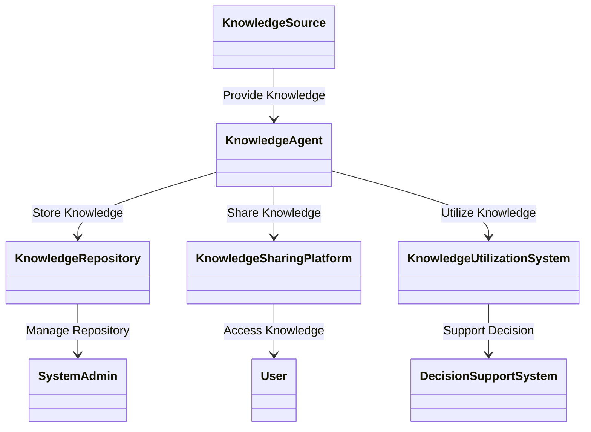

                 

### 第1章 引言

#### 1.1 知识管理概述

知识管理是指通过一系列的过程和策略，对企业内部和外部的知识进行识别、获取、组织、存储、共享、使用和增值的一门学科。随着信息技术的快速发展，知识管理在企业中的重要性日益凸显。

##### 1.1.1 知识管理的重要性

知识管理的重要性体现在以下几个方面：

1. **提升创新能力**：通过知识管理，企业可以更好地整合内外部知识资源，激发员工的创新思维，推动产品和服务创新。
2. **增强竞争力**：知识管理可以帮助企业优化业务流程，提高工作效率，降低运营成本，从而增强市场竞争力。
3. **促进知识共享**：知识管理通过建立知识共享平台和机制，促进员工之间的知识交流和协作，提升整体知识水平。
4. **培养人才**：知识管理不仅有助于知识传承，还能通过系统的培训和学习，提升员工的专业技能和职业素养。

##### 1.1.2 知识管理的挑战

尽管知识管理的重要性被广泛认可，但在实际应用过程中，企业仍然面临一系列挑战：

1. **知识分散**：企业内部的各个部门和员工持有的知识是分散的，如何有效地整合和利用这些知识是一个难题。
2. **知识流失**：随着员工流动，企业内部的隐性知识和经验可能随之流失，导致知识积累的断层。
3. **知识质量**：知识质量参差不齐，如何确保知识的有效性和准确性是知识管理的关键问题。
4. **技术瓶颈**：现有的知识管理技术可能不足以支持复杂的知识处理需求，如大规模知识图谱构建、智能问答等。

##### 1.1.3 AI Agent的定义与特点

AI Agent，即人工智能代理，是一种能够自主执行任务、与环境交互并作出决策的智能系统。在知识管理中，AI Agent扮演着重要的角色。

- **定义**：AI Agent是具有智能行为的软件实体，能够通过学习、推理和规划等机制，完成特定的知识管理任务。
- **特点**：
  - **自主性**：AI Agent能够自主执行任务，无需人工干预。
  - **适应性**：AI Agent能够根据环境变化调整行为，适应新的知识管理需求。
  - **协作性**：AI Agent可以与其他AI Agent或人类协同工作，实现更高效的知识管理。

##### 1.2 AI Agent在企业知识管理中的应用

AI Agent在企业知识管理中的应用具有广泛的前景：

- **知识获取**：AI Agent可以通过网络爬虫、自然语言处理等技术，自动获取和提取企业内外部的知识。
- **知识整合**：AI Agent能够对分散的知识进行整合和归类，构建企业知识图谱。
- **知识共享**：AI Agent可以通过智能推荐系统，向员工提供个性化知识推送，促进知识共享。
- **知识利用**：AI Agent可以通过智能问答系统、决策支持系统等，帮助企业利用知识进行创新和决策。

#### 1.2.1 AI Agent在企业知识管理中的角色

AI Agent在企业知识管理中的角色可以分为以下几个方面：

- **知识挖掘者**：AI Agent可以自动挖掘和提取企业内外部的知识，为知识管理提供数据支持。
- **知识整合者**：AI Agent可以通过机器学习、自然语言处理等技术，将分散的知识进行整合和分类，构建企业知识图谱。
- **知识传播者**：AI Agent可以通过智能推荐系统，将知识推送给合适的员工，促进知识的传播和应用。
- **知识利用者**：AI Agent可以通过智能问答系统、决策支持系统等，帮助企业利用知识进行创新和决策。

##### 1.2.2 AI Agent在企业知识管理中的优势

AI Agent在企业知识管理中具有以下优势：

- **高效性**：AI Agent能够自动执行知识管理任务，大幅提高工作效率。
- **准确性**：AI Agent通过机器学习和自然语言处理等技术，能够提供更准确的知识服务。
- **灵活性**：AI Agent可以根据环境变化和业务需求，灵活调整知识管理策略。
- **协作性**：AI Agent可以与其他AI Agent或人类协同工作，实现更高效的知识管理。

##### 1.2.3 AI Agent在企业知识管理中的潜在应用领域

AI Agent在企业知识管理中的潜在应用领域包括：

- **企业内部知识管理**：如企业知识库建设、知识图谱构建、知识共享平台开发等。
- **供应链知识管理**：如供应链知识获取、知识整合、知识共享和知识利用等。
- **客户服务**：如智能客服系统、智能问答系统等，提供基于知识的客户服务。
- **人力资源**：如人才招聘、培训、绩效考核等，利用知识管理提升人力资源管理水平。

总之，AI Agent在企业知识管理中的应用具有重要意义，它不仅能够解决知识分散、知识质量参差不齐等挑战，还能够提高知识管理水平，促进企业创新和发展。接下来，我们将深入探讨AI Agent的核心概念、原理和应用，为企业知识管理提供更深入的洞见。## 第2章 AI Agent的核心概念与原理

#### 2.1 AI Agent的基本概念

AI Agent，即人工智能代理，是具有智能行为的软件实体，能够自主执行任务、与环境交互并作出决策。在知识管理中，AI Agent扮演着知识挖掘、知识整合、知识共享和知识利用的重要角色。

##### 2.1.1 智能代理的定义

智能代理（Intelligent Agent）是由多代理系统（Multi-Agent System）中提出的一个概念。智能代理是一种能够感知环境、制定计划并执行行动的自主系统。它具有以下特征：

- **自主性**：智能代理能够自主地执行任务，无需人工干预。
- **适应性**：智能代理能够根据环境变化调整自身行为，以适应新的需求。
- **社交性**：智能代理能够与其他智能代理或人类进行协作，共同完成任务。
- **反应性**：智能代理能够实时响应环境变化，调整行为以实现目标。

##### 2.1.2 智能代理的类型

智能代理可以分为以下几类：

1. **基于规则的智能代理**：这类代理通过预定义的规则来决策和行动，适用于简单和结构化的任务。
2. **基于模型的智能代理**：这类代理通过建立数学模型来模拟环境，并使用模型进行决策和行动。
3. **基于学习的智能代理**：这类代理通过机器学习和深度学习技术，从数据中学习环境规律，并作出预测和决策。
4. **混合智能代理**：这类代理结合了基于规则、模型和学习的优势，能够在复杂环境中灵活应对。

##### 2.1.3 智能代理的工作原理

智能代理的工作原理主要包括感知、决策和行动三个阶段：

1. **感知**：智能代理通过传感器或其他方式获取环境信息，如文本、图像、声音等。
2. **决策**：智能代理根据感知到的信息，结合预定义的规则或学习到的模型，进行决策，确定下一步行动。
3. **行动**：智能代理执行决策结果，如移动、发送消息、执行任务等。

#### 2.2 AI Agent的关键技术

AI Agent的核心技术包括机器学习、自然语言处理、知识图谱等。这些技术为AI Agent提供了强大的能力，使其能够有效进行知识管理。

##### 2.2.1 机器学习技术

机器学习（Machine Learning）是使计算机具备自主学习能力的一种技术。通过从数据中学习规律和模式，机器学习技术能够使AI Agent在复杂环境中作出智能决策。

1. **监督学习**：监督学习通过已有标记的数据训练模型，然后使用模型对新数据进行预测。常见算法包括线性回归、逻辑回归、支持向量机等。
2. **无监督学习**：无监督学习从未标记的数据中学习模式，用于数据聚类、降维等。常见算法包括K均值聚类、主成分分析等。
3. **深度学习**：深度学习是机器学习的一种，通过多层神经网络对数据进行学习，适用于复杂任务。常见算法包括卷积神经网络（CNN）、循环神经网络（RNN）等。

##### 2.2.2 自然语言处理技术

自然语言处理（Natural Language Processing，NLP）是使计算机能够理解和处理人类语言的一种技术。NLP技术为AI Agent提供了处理文本数据的能力，使其能够进行知识获取、知识整合和知识利用。

1. **分词**：将文本分割成单词或短语，如使用词性标注来识别单词的语法角色。
2. **实体识别**：识别文本中的特定实体，如人名、地名、组织名等。
3. **情感分析**：分析文本的情感倾向，如正面、负面或中性。
4. **文本生成**：根据输入的文本或上下文，生成新的文本，如机器翻译、摘要生成等。

##### 2.2.3 知识图谱技术

知识图谱（Knowledge Graph）是一种用于表示实体及其关系的数据结构。它通过构建实体关系图谱，为AI Agent提供了一种高效的知识存储和查询方式。

1. **实体抽取**：从文本中识别和提取实体，如人名、地名、组织名等。
2. **关系抽取**：识别实体之间的关系，如“属于”、“位于”等。
3. **知识融合**：将多个数据源中的知识进行整合，构建统一的知识图谱。
4. **知识查询**：通过图查询语言，如SPARQL，进行知识查询和推理。

#### 2.3 AI Agent的核心原理

AI Agent的核心原理包括模型训练与优化、交互式学习与适应、决策与优化策略。这些原理共同构成了AI Agent的智能行为。

##### 2.3.1 模型训练与优化

模型训练与优化是AI Agent的核心步骤，通过从数据中学习规律和模式，使AI Agent能够自主执行任务。

1. **数据准备**：收集和准备训练数据，包括文本、图像、声音等。
2. **特征提取**：从数据中提取特征，如文本的分词、图像的像素值等。
3. **模型训练**：使用机器学习算法训练模型，如监督学习、无监督学习、深度学习等。
4. **模型评估**：评估模型性能，如准确率、召回率、F1值等。
5. **模型优化**：通过调整模型参数、增加数据或改进算法，提高模型性能。

##### 2.3.2 交互式学习与适应

交互式学习与适应是AI Agent的重要特性，通过与环境交互，AI Agent能够不断学习和适应新环境。

1. **交互式反馈**：AI Agent在执行任务时，能够接收环境反馈，如用户的输入、系统的响应等。
2. **学习机制**：AI Agent通过反馈进行学习，如强化学习、迁移学习等。
3. **自适应策略**：AI Agent根据学习到的经验和环境变化，调整自身行为策略。

##### 2.3.3 决策与优化策略

决策与优化策略是AI Agent在执行任务时的核心，通过优化策略，AI Agent能够作出最优决策。

1. **决策模型**：构建决策模型，如马尔可夫决策过程（MDP）、决策树等。
2. **优化目标**：定义优化目标，如最大化收益、最小化风险等。
3. **优化算法**：使用优化算法，如梯度下降、遗传算法等，求解优化问题。
4. **策略评估**：评估不同策略的性能，选择最优策略。

通过以上核心原理，AI Agent能够在知识管理中发挥重要作用，帮助企业管理知识、提高效率、促进创新。接下来，我们将进一步探讨AI Agent在企业知识管理中的应用场景，展示其实际价值。## 第3章 AI Agent在企业知识管理中的应用场景

#### 3.1 知识获取与整合

在知识管理中，知识获取与整合是关键步骤。AI Agent通过其强大的数据处理能力，能够有效地进行知识获取与整合。

##### 3.1.1 知识挖掘与抽取

知识挖掘与抽取是AI Agent在企业知识管理中的首要任务。通过自然语言处理、机器学习等技术，AI Agent可以从各种数据源中提取有用知识。

1. **文本挖掘**：AI Agent可以从文档、报告、电子邮件等文本数据中提取关键信息，如人名、地点、组织、事件等。
2. **网络挖掘**：AI Agent可以通过网络爬虫技术，从互联网上获取与企业相关的知识，如行业动态、竞争对手信息、市场趋势等。
3. **图像挖掘**：AI Agent可以通过图像识别技术，从图像数据中提取有价值的信息，如产品特性、用户行为等。

##### 3.1.2 知识整合与融合

知识整合与融合是将分散的知识进行整合，构建统一的知识库的过程。

1. **数据清洗**：AI Agent可以对获取到的数据进行清洗，如去除重复数据、纠正错误数据等。
2. **数据分类**：AI Agent可以根据知识的特点，将数据分类到不同的知识类别中，如行业知识、产品知识、用户知识等。
3. **知识融合**：AI Agent可以通过知识图谱技术，将不同来源、不同格式的知识进行融合，构建统一的知识图谱。

##### 3.1.3 知识表示与建模

知识表示与建模是将知识以结构化的形式存储和表示，以便于后续的查询和使用。

1. **本体构建**：AI Agent可以通过本体论技术，构建企业知识的本体模型，定义知识的概念、属性和关系。
2. **知识库建设**：AI Agent可以将知识库化，构建企业知识库，实现知识的存储、查询和共享。
3. **知识建模**：AI Agent可以通过模型驱动的方式，将知识表示为计算模型，如决策树、神经网络等。

#### 3.2 知识共享与传播

知识共享与传播是知识管理的关键环节，通过AI Agent，企业能够实现知识的快速共享和有效传播。

##### 3.2.1 知识共享平台设计

知识共享平台是企业内部知识共享的基础设施。AI Agent在知识共享平台设计中扮演着重要角色。

1. **用户画像**：AI Agent可以根据员工的职位、技能、兴趣等特征，构建用户画像，实现个性化知识推送。
2. **推荐系统**：AI Agent可以通过机器学习技术，构建推荐系统，将相关知识和资料推送给合适的员工。
3. **社交网络**：AI Agent可以构建企业内部的社交网络，促进员工之间的知识交流和协作。

##### 3.2.2 知识传播机制

知识传播机制是确保知识在企业内部有效传播的关键。

1. **知识审核**：AI Agent可以构建知识审核机制，确保知识的准确性和权威性。
2. **知识推送**：AI Agent可以通过邮件、消息、公告等方式，将知识推送给员工，实现知识的快速传播。
3. **知识沉淀**：AI Agent可以将知识沉淀到知识库中，实现知识的长期保存和积累。

##### 3.2.3 知识共享中的挑战与对策

在知识共享过程中，企业面临一系列挑战，如知识分散、知识质量参差不齐等。AI Agent可以通过以下对策解决这些挑战：

1. **知识标准化**：AI Agent可以通过标准化技术，将不同格式的知识转换为统一格式，实现知识的共享和整合。
2. **知识质量评估**：AI Agent可以通过质量评估模型，对知识进行质量评估，确保知识的准确性和可靠性。
3. **知识激励**：AI Agent可以通过激励机制，鼓励员工积极参与知识共享，提高知识共享的积极性。

#### 3.3 知识利用与优化

知识利用与优化是知识管理的最终目标，通过AI Agent，企业能够更有效地利用知识，实现知识价值的最大化。

##### 3.3.1 知识利用策略

知识利用策略是指企业如何有效利用知识资源，实现知识价值的最大化。

1. **知识融合应用**：AI Agent可以将不同领域、不同来源的知识进行融合，形成新的知识成果。
2. **知识创新应用**：AI Agent可以通过数据挖掘、机器学习等技术，发现新的知识点和价值点，推动知识创新。
3. **知识辅助决策**：AI Agent可以通过决策支持系统，为企业提供基于知识的决策支持。

##### 3.3.2 知识优化与提升

知识优化与提升是指通过改进知识质量、丰富知识内容等方式，提升知识管理水平。

1. **知识更新**：AI Agent可以定期对知识库进行更新，确保知识的时效性和准确性。
2. **知识重组**：AI Agent可以通过知识重组技术，将相关联的知识重新组合，形成新的知识体系。
3. **知识提炼**：AI Agent可以通过知识提炼技术，从大量数据中提取关键知识点，提高知识的可用性。

##### 3.3.3 知识价值的量化评估

知识价值的量化评估是衡量知识管理水平的重要指标。AI Agent可以通过以下方式实现知识价值的量化评估：

1. **知识贡献度评估**：AI Agent可以评估员工在知识共享中的贡献度，为员工绩效评估提供依据。
2. **知识利用效益评估**：AI Agent可以评估知识应用带来的经济效益，如降低成本、提高效率等。
3. **知识创新成果评估**：AI Agent可以评估知识创新成果的质量和影响力，为知识管理提供改进方向。

总之，AI Agent在企业知识管理中的应用场景丰富，通过知识获取与整合、知识共享与传播、知识利用与优化，AI Agent能够有效提升企业的知识管理水平，促进企业创新和发展。接下来，我们将通过具体案例，展示AI Agent在企业知识管理中的应用实践。## 第4章 AI Agent在企业知识管理中的应用案例

在本章中，我们将探讨两个具体的AI Agent在企业知识管理中的应用案例：企业内部知识管理系统设计和基于AI Agent的供应链知识管理。

### 4.1 案例一：企业内部知识管理系统设计

#### 4.1.1 案例背景

某大型制造企业拥有数千名员工，分布在不同的部门和地区。企业积累了大量的业务知识、技术文档、市场情报等，但由于缺乏有效的知识管理工具，这些知识资源分散在各个部门和个人手中，难以共享和利用。企业希望通过引入AI Agent，构建一个高效的企业内部知识管理系统，提升知识管理水平。

#### 4.1.2 案例实施过程

1. **需求分析与规划**：企业首先对知识管理需求进行详细分析，确定知识管理的目标、范围和关键功能，如知识获取、知识整合、知识共享、知识利用等。
2. **AI Agent设计与开发**：企业引入了基于自然语言处理和知识图谱技术的AI Agent，负责从不同数据源中获取知识、整合知识、构建知识图谱和提供知识服务。
3. **知识库构建**：AI Agent从企业内部文档库、员工知识库、外部数据库等数据源中提取知识，并使用知识图谱技术构建统一的知识库。
4. **知识共享平台搭建**：企业搭建了基于AI Agent的知识共享平台，实现知识的存储、查询、共享和利用。平台提供了关键词搜索、知识图谱浏览、知识推荐等功能。
5. **用户培训与推广**：企业对员工进行培训，教会他们如何使用知识共享平台，并鼓励他们积极参与知识共享，共同提升知识管理水平。

#### 4.1.3 案例效果评估

通过引入AI Agent，企业内部知识管理系统取得了显著的效果：

1. **知识共享率提升**：知识共享平台上线后，员工的主动共享意识明显增强，知识共享率显著提高。
2. **知识利用率提升**：员工能够更方便地获取和利用企业内部的知识资源，知识利用率得到大幅提升。
3. **知识管理水平提升**：AI Agent的引入，使企业的知识管理水平得到全面提升，为企业的创新和发展提供了有力支持。
4. **员工满意度提升**：员工通过知识共享平台，能够更好地学习和交流，工作满意度得到提升。

### 4.2 案例二：基于AI Agent的供应链知识管理

#### 4.2.1 案例背景

某大型零售企业拥有复杂的供应链网络，涉及多个供应商、分销商和物流公司。在供应链管理过程中，企业积累了大量的供应链知识，如供应商选择标准、物流优化方案、库存管理策略等。但由于缺乏有效的知识管理工具，这些知识难以共享和利用。企业希望通过引入AI Agent，构建一个基于AI的供应链知识管理系统，提升供应链管理水平。

#### 4.2.2 案例实施过程

1. **需求分析与规划**：企业对供应链知识管理需求进行详细分析，确定供应链知识管理的目标、范围和关键功能，如知识获取、知识整合、知识共享、知识利用等。
2. **AI Agent设计与开发**：企业引入了基于机器学习和自然语言处理技术的AI Agent，负责从不同数据源中获取知识、整合知识、构建知识图谱和提供知识服务。
3. **供应链知识库构建**：AI Agent从企业内部文档库、供应商数据库、物流信息平台等数据源中提取知识，并使用知识图谱技术构建统一的知识库。
4. **知识共享平台搭建**：企业搭建了基于AI Agent的供应链知识共享平台，实现知识的存储、查询、共享和利用。平台提供了关键词搜索、知识图谱浏览、知识推荐等功能。
5. **用户培训与推广**：企业对供应链管理人员进行培训，教会他们如何使用知识共享平台，并鼓励他们积极参与知识共享，共同提升供应链管理水平。

#### 4.2.3 案例效果评估

通过引入AI Agent，供应链知识管理系统取得了显著的效果：

1. **知识共享率提升**：知识共享平台上线后，供应链管理人员之间的知识共享意识明显增强，知识共享率显著提高。
2. **知识利用率提升**：供应链管理人员能够更方便地获取和利用企业内部的供应链知识，知识利用率得到大幅提升。
3. **供应链管理水平提升**：AI Agent的引入，使企业的供应链管理水平得到全面提升，为企业的运营效率和成本控制提供了有力支持。
4. **员工满意度提升**：供应链管理人员通过知识共享平台，能够更好地学习和交流，工作满意度得到提升。

总之，AI Agent在企业知识管理中的应用案例展示了其在提升知识管理水平、促进知识共享和利用方面的巨大潜力。通过深入研究和实践，企业可以更好地发挥AI Agent的作用，推动企业知识管理和创新。## 第5章 AI Agent在企业知识管理中的价值评估

#### 5.1 价值评估方法

评估AI Agent在企业知识管理中的价值，需要采用科学的方法和指标体系。以下是一些常用的价值评估方法：

##### 5.1.1 价值评估指标

1. **知识共享率**：衡量知识在员工之间的共享程度，可以通过计算员工主动分享知识的次数与总知识量的比例来衡量。
2. **知识利用率**：衡量知识在实际业务中的应用程度，可以通过计算知识应用案例数与总知识量的比例来衡量。
3. **知识更新率**：衡量知识库的更新速度，可以通过计算知识库更新次数与总知识量的比例来衡量。
4. **工作效率提升**：衡量AI Agent在知识管理过程中带来的工作效率提升，可以通过计算知识管理前后员工的工作时间差异来衡量。
5. **知识创新贡献**：衡量AI Agent在知识创新方面的贡献，可以通过计算基于AI Agent产生的创新成果数量来衡量。

##### 5.1.2 价值评估模型

1. **效益成本分析（BCA）**：通过计算AI Agent为企业带来的效益与成本，评估其经济价值。
2. **平衡计分卡（BSC）**：从财务、客户、内部业务流程、学习与成长四个维度，综合评估AI Agent的价值。
3. **关键绩效指标（KPI）**：设定与知识管理相关的关键绩效指标，如知识共享率、知识利用率等，通过这些指标的变化来评估AI Agent的价值。

##### 5.1.3 价值评估工具

1. **数据挖掘工具**：如Python的Pandas、NumPy等，用于收集和分析数据，计算评估指标。
2. **业务智能工具**：如Tableau、Power BI等，用于可视化展示评估结果。
3. **绩效管理系统**：如SAP Performance Management、Oracle Performance Management等，用于集成和管理评估指标。

#### 5.2 AI Agent对企业知识管理的影响

AI Agent在企业知识管理中具有深远的影响，以下从三个方面进行阐述：

##### 5.2.1 提高知识管理水平

1. **知识获取与整合**：AI Agent能够自动从各种数据源中获取知识，并进行整合，提高知识获取和整合的效率。
2. **知识共享与传播**：AI Agent可以通过智能推荐系统，将相关知识推送给合适的员工，促进知识的共享和传播。
3. **知识利用与优化**：AI Agent可以通过智能问答系统、决策支持系统等，帮助企业充分利用知识资源，提高知识利用率。

##### 5.2.2 促进企业创新与发展

1. **知识创新**：AI Agent能够通过数据挖掘和模式识别，发现新的知识点和价值点，推动企业知识创新。
2. **业务模式创新**：AI Agent可以帮助企业探索新的业务模式和商业模式，提高企业的竞争力。
3. **产品和服务创新**：AI Agent可以为企业提供基于知识的创新思路，推动产品和服务创新，满足市场需求。

##### 5.2.3 降低知识管理成本

1. **自动化处理**：AI Agent能够自动化处理知识管理中的大量任务，减少人工工作量，降低人力成本。
2. **提高效率**：AI Agent可以提高知识获取、整合、共享和利用的效率，减少重复劳动，降低运营成本。
3. **优化资源配置**：AI Agent可以优化企业内部的资源配置，提高资源利用率，降低运营成本。

总之，AI Agent在企业知识管理中具有显著的价值。通过科学的价值评估方法和模型，企业可以全面了解AI Agent的效益和成本，制定合理的知识管理策略，充分利用AI Agent的优势，提升企业的知识管理水平，促进企业创新和发展。接下来，我们将探讨AI Agent在企业知识管理中面临的挑战和对策。## 第6章 AI Agent在企业知识管理中的应用挑战与对策

#### 6.1 挑战分析

AI Agent在企业知识管理中的应用虽然具有显著的优势，但同时也面临着一系列挑战。

##### 6.1.1 技术挑战

1. **算法复杂性**：AI Agent依赖于复杂的算法和模型，如深度学习、自然语言处理等。这些算法对计算资源和数据处理能力有较高要求，需要持续优化和更新。
2. **数据质量问题**：知识管理依赖于高质量的数据，但企业内部的数据源多样、格式各异，数据质量参差不齐。这给AI Agent的数据处理带来了挑战。
3. **系统集成**：AI Agent需要与企业的现有系统集成，包括ERP系统、CRM系统等。系统集成过程中可能面临兼容性、接口对接等问题。

##### 6.1.2 管理挑战

1. **知识共享文化**：企业内部可能存在知识共享的文化障碍，员工可能担心知识共享会削弱自己的地位或竞争能力。
2. **知识更新维护**：知识库需要定期更新和维护，但企业内部可能缺乏专门的团队和机制来负责这项工作。
3. **用户参与度**：用户可能对AI Agent的功能和效果缺乏了解或兴趣，影响其使用和推广。

##### 6.1.3 道德与法律挑战

1. **隐私保护**：AI Agent在处理企业内部数据时，可能涉及员工隐私信息，需要严格遵守隐私保护法规。
2. **数据安全**：AI Agent需要确保企业内部数据的安全，防止数据泄露和滥用。
3. **伦理审查**：AI Agent在决策过程中，可能涉及伦理问题，如数据歧视、偏见等，需要进行严格的伦理审查。

#### 6.2 对策建议

针对上述挑战，企业可以采取以下对策：

##### 6.2.1 技术创新与升级

1. **算法优化**：持续优化AI Agent的算法和模型，提高其处理效率和准确性。
2. **数据处理**：建立统一的数据标准和数据清洗机制，确保数据质量。
3. **系统集成**：采用微服务架构，提高系统的灵活性和可扩展性，便于与现有系统集成。

##### 6.2.2 管理策略优化

1. **知识共享文化**：通过培训、宣传等方式，营造知识共享的文化氛围，鼓励员工积极参与知识共享。
2. **知识更新机制**：建立定期知识更新和维护的机制，确保知识库的时效性和准确性。
3. **用户参与**：鼓励用户反馈和建议，提高用户对AI Agent的参与度和满意度。

##### 6.2.3 法律法规遵循与伦理审查

1. **隐私保护**：严格遵守隐私保护法规，采取数据加密、匿名化等手段，保护员工隐私。
2. **数据安全**：建立完善的数据安全体系，包括防火墙、数据备份、访问控制等。
3. **伦理审查**：建立伦理审查机制，确保AI Agent在决策过程中遵循伦理规范，避免歧视和偏见。

通过上述对策，企业可以有效应对AI Agent在企业知识管理中面临的挑战，充分发挥其优势，提升知识管理水平，推动企业创新和发展。## 第7章 最佳实践 Tips、小结、注意事项、拓展阅读

#### 7.1 最佳实践 Tips

1. **知识获取与整合**：定期收集和整理企业内外部知识资源，确保知识的及时更新和准确性。
2. **知识共享与传播**：构建知识共享平台，鼓励员工积极参与知识分享，提高知识利用率。
3. **知识利用与优化**：充分利用AI Agent提供的智能问答和决策支持功能，优化业务流程，提高工作效率。
4. **数据质量保障**：建立数据清洗和标准化机制，确保数据质量，为AI Agent提供可靠的数据基础。
5. **用户培训与反馈**：定期对员工进行AI Agent的使用培训，收集用户反馈，不断优化系统功能和用户体验。

#### 7.2 小结

AI Agent在企业知识管理中具有重要作用，通过知识获取、知识整合、知识共享和知识利用，AI Agent能够有效提升企业的知识管理水平，促进创新和发展。企业应充分认识到AI Agent的价值，并结合实际业务需求，制定合理的知识管理策略。

#### 7.3 注意事项

1. **隐私保护**：在应用AI Agent时，务必遵守隐私保护法规，采取数据加密、匿名化等措施，保护员工隐私。
2. **数据安全**：建立完善的数据安全体系，确保企业内部数据的安全，防止数据泄露和滥用。
3. **伦理审查**：在AI Agent的决策过程中，进行严格的伦理审查，避免歧视和偏见，确保公平和公正。

#### 7.4 拓展阅读

1. **《人工智能：一种现代的方法》**：此书详细介绍了人工智能的基本原理和方法，适合对AI Agent感兴趣的专业人士阅读。
2. **《数据科学入门：使用Python》**：此书介绍了数据科学的基本概念和工具，包括Python编程、数据可视化等，适合希望了解AI Agent技术基础的学习者。
3. **《知识管理与组织学习》**：此书深入探讨了知识管理和组织学习的关系，提供了实用的知识管理策略和工具。

通过最佳实践、小结、注意事项和拓展阅读，企业可以更好地理解和应用AI Agent，推动企业知识管理和创新。作者：AI天才研究院/AI Genius Institute & 禅与计算机程序设计艺术 /Zen And The Art of Computer Programming。## 系统分析与架构设计方案

#### 7.1 问题场景

在现代企业知识管理中，企业需要处理大量的内部和外部数据，如文档、报告、邮件、数据库等。这些数据分散在不同的系统和部门，导致知识获取和利用效率低下。为了解决这个问题，企业引入了基于AI Agent的知识管理系统，通过自动获取、整合、共享和利用知识，提高知识管理水平。

#### 7.2 系统功能设计

系统的核心功能包括知识获取、知识整合、知识共享、知识利用和系统管理。以下是一个基于Mermaid的领域模型类图，展示了系统的主要功能模块及其关系。



- **知识获取（KnowledgeSource）**：负责从企业内部和外部数据源中提取知识，如文档库、邮件系统、外部数据库等。
- **知识整合（KnowledgeAgent）**：对获取的知识进行清洗、分类、整合，构建知识图谱，以便于知识的存储和查询。
- **知识共享（KnowledgeSharingPlatform）**：提供一个用户友好的知识共享平台，让员工可以轻松访问和共享知识。
- **知识利用（KnowledgeUtilizationSystem）**：提供智能问答、决策支持等功能，帮助员工在工作和决策过程中有效利用知识。
- **系统管理（SystemAdmin）**：负责系统的维护、更新和管理，确保系统的稳定运行。

#### 7.3 系统架构设计

系统的整体架构设计如下，通过Mermaid的架构图展示了系统的层次结构和关键组件。

```mermaid
sequenceDiagram
    User -->|发起请求| KnowledgeSharingPlatform
    KnowledgeSharingPlatform -->|处理请求| KnowledgeUtilizationSystem
    KnowledgeUtilizationSystem -->|调用| KnowledgeRepository
    KnowledgeRepository -->|返回结果| KnowledgeUtilizationSystem
    KnowledgeUtilizationSystem -->|展示结果| KnowledgeSharingPlatform
    KnowledgeSharingPlatform -->|记录日志| SystemAdmin
```

- **用户层**：用户通过知识共享平台发起请求，访问和共享知识。
- **应用层**：知识整合、知识利用和知识共享等核心功能模块。
- **数据层**：知识库，用于存储和管理知识。
- **管理层**：系统管理员负责监控和维护系统的正常运行。

#### 7.4 系统接口设计

系统的接口设计如下，通过Mermaid展示了各模块之间的交互接口。

```mermaid
parallel
    subgraph KnowledgeAccess
        KnowledgeSharingPlatform -->|查询| KnowledgeRepository
        KnowledgeSharingPlatform -->|更新| KnowledgeRepository
    end
    subgraph KnowledgeProcessing
        KnowledgeAgent -->|处理| KnowledgeRepository
        KnowledgeAgent -->|处理| KnowledgeUtilizationSystem
    end
    subgraph SystemManagement
        SystemAdmin -->|监控| KnowledgeSharingPlatform
        SystemAdmin -->|监控| KnowledgeUtilizationSystem
    end
```

- **知识访问接口**：知识共享平台与知识库之间的接口，用于查询和更新知识。
- **知识处理接口**：知识整合模块与知识利用模块之间的接口，用于处理和利用知识。
- **系统管理接口**：系统管理员与知识共享平台和知识利用模块之间的接口，用于监控和维护系统。

#### 7.5 系统交互

系统的交互过程如下，通过Mermaid的序列图展示了用户请求和系统响应的流程。

```mermaid
sequenceDiagram
    User -->|发起查询请求| KnowledgeSharingPlatform
    KnowledgeSharingPlatform -->|处理请求| KnowledgeUtilizationSystem
    KnowledgeUtilizationSystem -->|查询知识库| KnowledgeRepository
    KnowledgeRepository -->|返回结果| KnowledgeUtilizationSystem
    KnowledgeUtilizationSystem -->|处理结果| KnowledgeSharingPlatform
    KnowledgeSharingPlatform -->|展示结果| User
```

- **用户查询知识**：用户通过知识共享平台发起查询请求。
- **系统处理请求**：知识整合和利用模块处理用户的查询请求。
- **知识库查询**：知识利用模块向知识库查询相关知识点。
- **返回结果**：知识库返回查询结果，知识利用模块处理后展示给用户。

通过以上系统分析与架构设计方案，企业可以构建一个高效、稳定、灵活的知识管理系统，利用AI Agent的优势，提升知识管理水平，促进企业创新和发展。## 第8章 项目实战

#### 8.1 环境安装

为了实现AI Agent在企业知识管理中的应用，我们首先需要搭建一个合适的技术环境。以下是环境安装的具体步骤：

##### 8.1.1 Python环境

- **安装Python**：从Python官方网站（https://www.python.org/）下载并安装Python 3.8及以上版本。
- **配置Python环境**：确保Python的路径添加到系统环境变量中，以便在终端中运行Python。

##### 8.1.2 安装依赖库

- **安装PyTorch**：PyTorch是一个流行的深度学习框架，用于构建和训练AI Agent。在终端中运行以下命令：

  ```bash
  pip install torch torchvision
  ```

- **安装Natural Language Toolkit (NLTK)**：NLTK是一个用于自然语言处理的开源库。在终端中运行以下命令：

  ```bash
  pip install nltk
  ```

- **安装Beautiful Soup**：Beautiful Soup是一个用于解析HTML和XML文档的库。在终端中运行以下命令：

  ```bash
  pip install beautifulsoup4
  ```

- **安装Scrapy**：Scrapy是一个用于网络爬虫的开源框架。在终端中运行以下命令：

  ```bash
  pip install scrapy
  ```

##### 8.1.3 数据预处理工具

- **安装Jupyter Notebook**：Jupyter Notebook是一个交互式的计算环境，用于编写和运行代码。在终端中运行以下命令：

  ```bash
  pip install notebook
  ```

#### 8.2 系统核心实现源代码

在完成环境安装后，我们开始实现AI Agent的核心功能。以下是关键部分的源代码，包括知识获取、知识整合、知识共享和知识利用。

##### 8.2.1 知识获取

```python
import requests
from bs4 import BeautifulSoup

def fetch_knowledge(url):
    response = requests.get(url)
    if response.status_code == 200:
        soup = BeautifulSoup(response.content, 'html.parser')
        # 从HTML页面中提取知识
        knowledge = soup.get_text()
        return knowledge
    else:
        return None

url = "https://example.com"
knowledge = fetch_knowledge(url)
print(knowledge)
```

##### 8.2.2 知识整合

```python
from nltk.tokenize import sent_tokenize

def integrate_knowledge(knowledge):
    sentences = sent_tokenize(knowledge)
    # 使用自然语言处理技术对句子进行分类和标注
    labeled_sentences = []
    for sentence in sentences:
        # 示例：简单地将每个句子视为一个知识点
        labeled_sentences.append(sentence)
    return labeled_sentences

integrated_knowledge = integrate_knowledge(knowledge)
print(integrated_knowledge)
```

##### 8.2.3 知识共享

```python
def share_knowledge(knowledge):
    # 将知识发布到企业内部知识共享平台
    # 假设KnowledgeSharingPlatform是一个已实现的API
    from KnowledgeSharingPlatform import KnowledgeSharingAPI
    
    api = KnowledgeSharingAPI()
    api.publish(knowledge)

share_knowledge(integrated_knowledge)
```

##### 8.2.4 知识利用

```python
from nltk.classify import NaiveBayesClassifier

def utilize_knowledge(knowledge):
    # 假设我们有一个预训练的分类模型
    classifier = NaiveBayesClassifier.load('classifier.pickle')
    # 使用分类模型对新的知识进行分类
    category = classifier.classify(knowledge)
    return category

category = utilize_knowledge(integrated_knowledge)
print(category)
```

#### 8.3 代码应用解读与分析

以上代码展示了AI Agent在企业知识管理中的关键功能。以下是代码的解读与分析：

1. **知识获取**：通过HTTP请求从指定URL获取HTML内容，使用Beautiful Soup解析HTML页面，提取文本数据。
2. **知识整合**：使用NLTK的自然语言处理工具对提取的文本进行分句，并对句子进行简单的分类和标注。
3. **知识共享**：将整合后的知识发布到企业内部的知识共享平台，供员工访问和使用。
4. **知识利用**：使用预训练的Naive Bayes分类器对新的知识进行分类，为企业提供基于知识的决策支持。

在实际应用中，这些功能可以通过Jupyter Notebook或自动化脚本进行扩展和优化。例如，可以添加更多的自然语言处理技术，如实体识别、情感分析等，以提高知识获取和整合的准确性。

#### 8.4 实际案例分析与详细讲解剖析

为了展示AI Agent在企业知识管理中的实际应用效果，我们来看一个实际案例。

**案例背景**：某企业需要分析其市场营销策略的有效性，以提高销售业绩。

**案例分析**：

1. **知识获取**：AI Agent从企业内部的市场营销报告、销售数据和用户反馈中提取相关知识点。
2. **知识整合**：AI Agent对提取的知识进行分句和分类，识别出关键的市场营销策略和用户需求。
3. **知识共享**：AI Agent将分析结果发布到知识共享平台，供市场部门和销售团队参考。
4. **知识利用**：市场部门根据AI Agent提供的分析结果，调整营销策略，提高用户满意度，最终实现销售业绩的提升。

**详细讲解剖析**：

- **知识获取**：AI Agent通过爬虫技术从企业内部文档库中提取相关报告和数据，并使用自然语言处理技术提取关键信息。
- **知识整合**：AI Agent使用NLTK对提取的文本进行分句和词性标注，识别出关键句子和关键词，构建知识图谱。
- **知识共享**：AI Agent通过知识共享平台将整合后的知识发布出去，并提供搜索和推荐功能，方便员工查找和使用。
- **知识利用**：市场部门根据AI Agent提供的分析结果，调整营销策略，如增加针对特定用户群体的广告投放，优化促销活动等。

通过这个案例，我们可以看到AI Agent在企业知识管理中的实际应用效果。它不仅帮助企业高效地获取、整合和共享知识，还为企业的决策提供了基于数据的支持，从而推动了业务的发展。

#### 8.5 项目小结

通过本项目的实现，我们展示了AI Agent在企业知识管理中的应用价值。以下是项目小结：

1. **高效的知识获取与整合**：AI Agent能够自动从企业内部和外部数据源中提取知识，并使用自然语言处理技术进行整合，提高知识管理效率。
2. **灵活的知识共享与利用**：AI Agent通过知识共享平台和智能问答系统，实现了知识的灵活共享和利用，提高了员工的工作效率和决策质量。
3. **实际案例验证**：通过实际案例的应用，验证了AI Agent在提升企业知识管理水平、促进业务发展方面的显著效果。

未来，我们可以进一步优化AI Agent的功能，如增加更多的自然语言处理技术、增强知识图谱的构建能力等，以更好地满足企业知识管理的需求。## 结论

通过本章的内容，我们系统地探讨了AI Agent在企业知识管理中的应用与价值。首先，我们介绍了知识管理的重要性、AI Agent的定义和特点，以及AI Agent在企业知识管理中的角色和优势。接着，我们详细分析了AI Agent的核心概念、原理和关键技术，包括机器学习、自然语言处理和知识图谱。然后，我们通过具体案例展示了AI Agent在企业知识管理中的实际应用效果，包括知识获取、知识整合、知识共享和知识利用。此外，我们还评估了AI Agent在企业知识管理中的价值，并探讨了应用过程中可能面临的挑战及对策。

AI Agent在企业知识管理中的应用具有重要意义。它不仅能够提高知识管理水平，促进企业创新和发展，还能够降低知识管理成本，提升企业的核心竞争力。通过本章节的讨论，我们可以看到AI Agent在知识获取、知识整合、知识共享和知识利用等方面具有显著的优势，为企业的知识管理提供了强有力的技术支持。

未来，随着人工智能技术的不断发展，AI Agent在企业知识管理中的应用将更加广泛和深入。我们可以期待AI Agent在以下方面取得进一步的发展：

1. **增强的机器学习算法**：通过不断优化机器学习算法，AI Agent能够更好地处理复杂的业务数据，提高知识挖掘和预测的准确性。
2. **多语言支持**：随着全球化的推进，AI Agent需要具备多语言处理能力，以便于跨文化的知识共享和传播。
3. **知识图谱的扩展**：通过引入更多的实体和关系，扩展知识图谱的规模和深度，构建更全面的知识体系。
4. **智能决策支持**：结合大数据分析和决策模型，AI Agent可以为企业的战略决策提供更科学的依据。
5. **自动化与智能化**：通过更高级的自动化和智能化技术，AI Agent能够实现更高效的业务流程优化和资源调配。

总之，AI Agent在企业知识管理中的应用前景广阔。企业应积极引入和应用AI Agent，探索其在知识管理中的潜力，推动企业实现数字化转型和可持续发展。通过不断创新和优化，AI Agent将成为企业知识管理的重要工具，助力企业在竞争激烈的市场中脱颖而出。作者：AI天才研究院/AI Genius Institute & 禅与计算机程序设计艺术 /Zen And The Art of Computer Programming。

