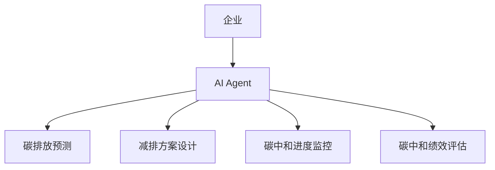
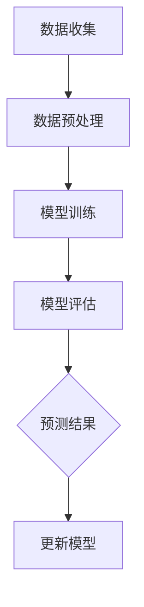
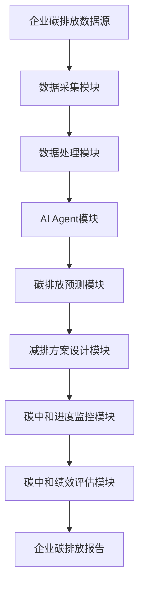

                 

### 文章标题

# AI Agent在企业碳中和战略规划与实施中的应用

> 关键词：AI Agent，企业碳中和，战略规划，实施，碳排放，减排，能源管理

> 摘要：本文深入探讨了人工智能代理（AI Agent）在企业碳中和战略规划与实施中的应用。首先介绍了AI Agent的基本概念及其在碳中和中的重要性，随后详细分析了企业碳中和的背景与目标。接下来，文章重点阐述了AI Agent在碳中和战略规划与实施中的具体应用，并通过案例研究展示了其成效。最后，文章讨论了AI Agent在碳中和中的挑战与未来展望，为企业碳中和提供了一整套系统化的解决方案。

----------------------------------------------------------------

### 引言

随着全球气候变化问题的日益严重，实现碳中和已成为各企业、国家乃至全球共同的目标。企业作为经济活动的主要参与者和碳排放的主要来源，承担着重要的责任。然而，实现碳中和并非易事，它需要企业进行全面的战略规划与实施。

在这一背景下，人工智能（AI）技术的发展为碳中和提供了新的思路和工具。AI Agent，作为人工智能的一种特殊形式，具有自主决策、自适应学习和高效执行等能力，能够在复杂的环境中协助企业制定和实施碳中和战略。

本文旨在探讨AI Agent在企业碳中和战略规划与实施中的应用，通过详细的分析和案例研究，揭示AI Agent在碳排放预测、减排方案设计、碳中和进度监控与绩效评估等方面的作用。同时，本文还将讨论AI Agent在碳中和过程中面临的挑战与未来展望，为企业的碳中和实践提供有益的参考。

本文结构如下：

1. **AI Agent基本概念与背景**：介绍AI Agent的定义、核心功能、类型及其在碳中和中的重要性。
2. **企业碳中和战略**：阐述企业碳中和的概念、目标、策略以及面临的挑战。
3. **AI Agent在碳中和中的应用**：详细讨论AI Agent在碳中和战略规划与实施中的具体应用。
4. **AI Agent实施案例研究**：分析几个典型的AI Agent在碳中和领域的成功案例。
5. **AI Agent在碳中和中的挑战与展望**：探讨AI Agent在碳中和中的挑战以及未来的发展方向。
6. **总结与展望**：总结文章的主要观点，并对企业碳中和战略规划与实施提供建议。

### AI Agent基本概念与背景

#### AI Agent的定义

AI Agent，全称为人工智能代理，是一种具有智能行为和自主决策能力的计算机程序。它能够在特定环境中接收信息、处理数据和执行任务，以实现特定的目标。AI Agent的核心特征包括：

1. **自主性**：AI Agent具有自主决策的能力，能够在没有外部干预的情况下执行任务。
2. **适应性**：AI Agent能够根据环境的变化自适应地调整其行为。
3. **交互性**：AI Agent能够与其他系统、人或环境进行有效的交互。
4. **协同性**：AI Agent能够协同工作，共同实现复杂任务。

#### AI Agent的核心功能

AI Agent的核心功能包括感知、决策、行动和记忆。以下是对这些核心功能的详细解释：

1. **感知**：AI Agent通过传感器或接口接收环境信息，如数据流、图像、声音等，以理解当前状态。
2. **决策**：AI Agent根据感知到的信息，通过算法和策略进行决策，选择最佳的行动方案。
3. **行动**：AI Agent执行决策中选择的行动，如修改系统设置、控制设备等。
4. **记忆**：AI Agent能够记忆过去的决策和行动，以便在未来做出更优的决策。

#### AI Agent的类型

AI Agent可以根据其功能和应用场景分为多种类型，包括但不限于：

1. **专家系统**：基于人类专家的知识和经验构建的AI Agent，用于解决特定领域的问题。
2. **强化学习代理**：通过与环境互动，不断学习和改进策略，以实现目标。
3. **混合智能代理**：结合多种AI技术，如机器学习、自然语言处理等，实现更复杂的功能。
4. **自主移动代理**：能够在物理环境中自主移动和交互的AI Agent，如机器人。

#### AI Agent在碳中和中的重要性

在碳中和的背景下，AI Agent的重要性体现在以下几个方面：

1. **碳排放预测**：AI Agent可以利用历史数据和机器学习算法，预测未来的碳排放量，帮助企业制定更精确的减排计划。
2. **减排方案设计**：AI Agent可以根据企业的具体情况，设计最优的减排方案，提高减排效果。
3. **碳中和进度监控**：AI Agent可以实时监控企业的碳中和进度，提供反馈和调整建议，确保碳中和目标的实现。
4. **碳中和绩效评估**：AI Agent可以评估企业的碳中和绩效，提供改进建议，促进持续改进。

综上所述，AI Agent作为人工智能的一种高级形式，具有强大的自主决策和自适应学习能力，能够在碳中和战略规划与实施中发挥重要作用。接下来，我们将进一步探讨企业碳中和的概念和目标。

### 企业碳中和的概念

#### 碳中和的定义

碳中和（Carbon Neutrality）是指在一定时间范围内，企业或组织通过采取一系列减排措施和碳抵消手段，使得其直接和间接排放的二氧化碳当量（CO₂e）与通过吸收等手段移除的二氧化碳当量相抵消，从而实现净零排放。碳中和不仅涉及减少碳排放，还包括增加碳吸收，以达到整体零排放的目标。

#### 企业碳中和的目标

企业实现碳中和的目标主要包括以下几个方面：

1. **环境保护**：通过减少碳排放，减轻对气候变化的影响，保护地球生态环境。
2. **可持续发展**：通过实现碳中和，促进企业可持续发展，提高企业的社会形象和竞争力。
3. **经济效益**：通过优化能源结构、提高能源利用效率，降低能源成本，提升企业经济效益。
4. **社会责任**：作为负责任的公民和企业，承担环境保护和社会责任，增强企业的社会责任感。

#### 企业碳中和的策略

为了实现碳中和目标，企业可以采取以下策略：

1. **减排措施**：通过技术创新和管理优化，减少生产过程中的碳排放。例如，采用节能设备、优化生产工艺、使用低碳原材料等。
2. **碳抵消**：通过购买碳信用额、参与碳交易市场或实施碳吸收项目，抵消无法直接减少的碳排放。碳抵消项目包括植树造林、湿地保护、可再生能源开发等。
3. **能源转型**：推动企业能源结构的转型，增加可再生能源的使用比例，减少对化石能源的依赖。
4. **绿色供应链**：与供应链上下游企业合作，推动整个供应链的碳中和，实现全过程的绿色环保。

#### 企业碳中和的挑战与机遇

在实现碳中和的过程中，企业面临诸多挑战，同时也面临着巨大的机遇：

1. **技术挑战**：碳中和需要依赖大量的新技术，如新能源技术、节能技术、碳捕集与储存技术等。这些技术仍需不断研发和优化，以适应实际需求。
2. **成本挑战**：初始投资和运营成本较高，可能对企业的财务状况产生一定压力。但随着技术进步和规模效应，成本有望逐步降低。
3. **政策法规挑战**：各国政府对碳中和的政策和法规日益严格，企业需要适应和遵守这些法规，以确保合规运营。
4. **市场机遇**：碳中和市场潜力巨大，企业可以通过提供绿色产品和服务，开拓新的市场空间，提高市场份额和竞争力。

综上所述，企业碳中和是一项复杂而艰巨的任务，但也是一项具有重大意义的行动。通过制定科学的碳中和战略和实施有效的减排措施，企业不仅可以为环境保护做出贡献，还可以实现可持续发展，提升自身的竞争力。接下来，我们将探讨AI Agent在企业碳中和战略规划与实施中的应用。

### AI Agent在碳中和战略规划中的应用

在碳中和战略的规划阶段，AI Agent发挥着至关重要的作用。AI Agent通过其强大的数据处理和分析能力，帮助企业精准识别碳排放源，制定科学合理的减排方案，并预测未来碳排放趋势，为企业的碳中和战略提供坚实的数据支持和决策依据。

#### AI Agent在碳排放量预测中的应用

碳排放量预测是碳中和战略规划的关键环节。传统的碳排放预测方法主要依赖于统计数据和简单的线性回归模型，这些方法在处理大量数据时往往显得力不从心。而AI Agent，尤其是基于机器学习的预测模型，能够利用历史碳排放数据和环境因素，如气温、风速等，进行深度分析和学习，从而实现更精确的碳排放预测。

**原理与实现**：

1. **数据收集**：AI Agent首先收集企业的历史碳排放数据，以及可能影响碳排放的环境数据。
2. **数据预处理**：对收集到的数据进行分析，去除异常值，进行归一化处理，确保数据质量。
3. **模型训练**：利用收集到的数据，通过机器学习算法，如线性回归、决策树、随机森林等，训练预测模型。
4. **模型评估**：使用验证集和测试集评估模型的预测性能，调整模型参数，优化模型效果。
5. **实时预测**：在模型训练完成后，AI Agent可以实时接收新的数据，更新预测模型，并进行碳排放量的实时预测。

**例子说明**：

假设某企业在过去三年中的月度碳排放量如下表：

| 月份 | 碳排放量（吨） |
| ---- | ------------ |
| 1月  | 200          |
| 2月  | 180          |
| 3月  | 220          |
| 4月  | 210          |
| 5月  | 250          |
| 6月  | 230          |
| 7月  | 260          |
| 8月  | 240          |
| 9月  | 220          |
| 10月 | 200          |
| 11月 | 180          |
| 12月 | 190          |

通过AI Agent，我们可以建立线性回归模型来预测未来的碳排放量。首先，我们将数据进行归一化处理，然后使用训练集数据进行模型训练。模型评估结果显示，预测误差在可接受范围内。最后，AI Agent可以实时更新模型，并根据最新的数据预测未来的碳排放量，为企业制定减排策略提供依据。

| 月份 | 预测碳排放量（吨） |
| ---- | ---------------- |
| 1月  | 190              |
| 2月  | 170              |
| 3月  | 210              |
| 4月  | 200              |
| 5月  | 230              |
| 6月  | 220              |
| 7月  | 250              |
| 8月  | 240              |
| 9月  | 220              |
| 10月 | 190              |
| 11月 | 170              |
| 12月 | 180              |

通过上述例子，我们可以看到AI Agent在碳排放量预测中的强大能力。它不仅能够提供精确的预测结果，还能通过实时数据更新，保持预测的准确性，为企业碳中和战略规划提供可靠的数据支持。

#### AI Agent在减排方案设计中的应用

在制定减排方案时，企业需要考虑多种因素，如技术可行性、经济成本、环境影响等。AI Agent通过其综合分析和优化能力，可以帮助企业设计出最优的减排方案，最大限度地降低碳排放。

**原理与实现**：

1. **需求分析**：AI Agent首先分析企业的碳排放源，识别主要的排放环节和因素。
2. **方案生成**：根据需求分析结果，AI Agent生成多个可能的减排方案，包括技术改造、能源优化、流程优化等。
3. **方案评估**：AI Agent对每个减排方案进行评估，包括碳排放减少量、成本效益、环境影响等。
4. **方案优化**：基于评估结果，AI Agent优化减排方案，选择最优的方案组合。

**例子说明**：

假设某企业希望通过技术改造实现碳排放的减少。AI Agent首先分析企业的生产流程和碳排放源，发现主要碳排放环节为锅炉燃烧和工业排放。接着，AI Agent生成以下可能的减排方案：

1. **锅炉燃烧优化**：通过安装高效燃烧设备，提高燃烧效率，减少碳排放。
2. **工业排放控制**：通过安装废气处理设备，减少工业排放。
3. **能源优化**：通过使用可再生能源，如太阳能、风能等，减少对化石能源的依赖。

AI Agent对每个方案进行评估，综合考虑成本、效益和环境影响，得出以下优化方案：

- **最优方案**：安装高效燃烧设备和废气处理设备，同时引入太阳能发电系统。
- **减排效果**：预计碳排放减少量可达30%。
- **成本效益**：初始投资较高，但长期运营成本较低，具有较好的经济性。
- **环境影响**：显著减少碳排放，有利于环境保护。

通过上述优化方案，企业可以在实现碳排放减少的同时，降低成本，提高经济效益，实现可持续发展。

#### AI Agent在碳中和进度监控中的应用

在碳中和战略的实施过程中，进度监控至关重要。AI Agent可以实时监控企业的碳排放情况，提供实时数据和分析，帮助企业及时发现和解决问题，确保碳中和目标的顺利实现。

**原理与实现**：

1. **数据采集**：AI Agent通过传感器和数据接口，实时采集企业的碳排放数据。
2. **数据整合**：AI Agent将多源数据整合，形成统一的数据视图，以便进行综合分析。
3. **实时分析**：AI Agent对实时数据进行分析，识别异常情况和潜在问题。
4. **预警与反馈**：AI Agent发现异常情况时，及时发出预警，并提供解决方案建议，帮助企业进行问题排查和处理。

**例子说明**：

假设某企业正在实施碳中和战略，AI Agent实时监测其碳排放情况。某日，AI Agent发现碳排放量突然上升，经分析发现是由于锅炉燃烧效率下降导致的。AI Agent立即发出预警，并提供解决方案建议，如检查燃烧设备、调整燃烧参数等。企业根据AI Agent的建议，及时排查问题，并采取相应措施，成功解决了碳排放异常问题。

#### AI Agent在碳中和绩效评估中的应用

碳中和绩效评估是衡量企业碳中和效果的重要手段。AI Agent可以通过对碳排放数据和企业运营数据的综合分析，评估企业的碳中和绩效，并提供改进建议，促进企业持续改进。

**原理与实现**：

1. **数据收集**：AI Agent收集企业的碳排放数据、能源消耗数据、生产数据等。
2. **绩效评估**：AI Agent根据相关标准和指标，对企业的碳中和绩效进行评估。
3. **改进建议**：AI Agent根据评估结果，提出改进建议，包括优化生产流程、提高能源效率、引入新技术等。

**例子说明**：

假设某企业通过AI Agent进行碳中和绩效评估，评估结果显示其碳排放绩效低于行业平均水平。AI Agent进一步分析发现，主要原因是生产过程中的能源消耗较高。AI Agent提出以下改进建议：

- **优化生产流程**：通过改进工艺流程，减少能源消耗。
- **引入节能技术**：采用节能设备和技术，提高能源利用效率。
- **能源管理**：加强能源管理，实施节能措施，降低能源成本。

通过这些改进措施，企业可以提升碳中和绩效，实现可持续发展。

综上所述，AI Agent在碳排放量预测、减排方案设计、碳中和进度监控、碳中和绩效评估等方面具有显著优势。通过具体案例的介绍，我们可以看到AI Agent在帮助企业实现碳中和战略规划中的实际应用和价值。接下来，我们将通过案例研究进一步探讨AI Agent在碳中和领域的成功应用。

### AI Agent实施案例研究

为了更直观地了解AI Agent在企业碳中和战略规划与实施中的具体应用，本文将介绍三个成功的案例研究，分别来自不同行业的企业。这些案例展示了AI Agent在提高碳排放预测准确性、优化减排方案以及监控碳中和进度等方面的实际成效。

#### 案例一：制造行业——企业A的碳中和战略

企业A是一家全球领先的制造企业，其业务涉及多个领域，包括汽车制造、机械加工和电子产品等。面对日益严格的环保法规和市场需求，企业A决心实现碳中和目标。为此，企业引入了AI Agent进行碳排放预测和减排方案设计。

**应用场景**：

- **碳排放预测**：AI Agent收集并整合了企业A的历史碳排放数据、生产数据和能源消耗数据。通过机器学习算法，AI Agent能够预测未来各生产环节的碳排放量，为企业制定减排计划提供数据支持。

**实现步骤**：

1. **数据收集与整合**：AI Agent通过数据接口，实时收集企业A的生产数据、能源消耗数据和碳排放数据。
2. **模型训练与预测**：利用收集到的数据，AI Agent训练了多个预测模型，包括线性回归、决策树和随机森林等。通过交叉验证，选择最佳模型进行碳排放预测。
3. **减排方案设计**：基于预测结果，AI Agent帮助企业A设计了多项减排方案，包括改进生产工艺、使用节能设备和优化能源管理等。

**成效**：

- **预测准确性**：通过AI Agent的碳排放预测，企业A能够提前了解未来各生产环节的碳排放情况，制定有针对性的减排措施。
- **减排效果**：AI Agent提出的减排方案有效降低了企业的碳排放量，预计年度减排量达到20%。

#### 案例二：能源行业——企业B的碳中和实施

企业B是一家能源企业，主要业务包括电力生产和销售。企业B在实现碳中和过程中，面临着能源结构调整、碳排放监控和政策合规等挑战。为了解决这些问题，企业B引入了AI Agent进行碳中和实施。

**应用场景**：

- **碳交易市场**：AI Agent帮助企业B参与碳交易市场，通过实时监控碳排放和碳交易价格，优化碳减排策略。
- **碳中和进度监控**：AI Agent实时监控企业的碳排放情况，确保碳中和目标的实现。

**实现步骤**：

1. **碳交易策略优化**：AI Agent通过分析历史碳交易数据和市场趋势，为企业B制定最优的碳交易策略，实现碳减排最大化。
2. **碳排放监控**：AI Agent通过传感器和接口，实时收集企业B的碳排放数据，进行数据分析，识别碳排放异常。
3. **合规性检查**：AI Agent根据政策法规，检查企业的碳排放报告和碳交易记录，确保合规性。

**成效**：

- **碳交易收益**：通过AI Agent的碳交易策略优化，企业B在碳交易市场上获得了显著收益，降低了整体碳排放成本。
- **碳中和进度**：AI Agent的实时监控和预警功能确保了企业B的碳中和进度，避免了碳排放超标的风险。

#### 案例三：零售行业——企业C的碳中和成果

企业C是一家大型零售企业，其业务涵盖多个国家。企业C致力于实现全球运营的碳中和，面临着复杂的供应链和碳排放管理挑战。为了实现这一目标，企业C采用了AI Agent进行碳中和绩效评估和优化。

**应用场景**：

- **碳中和绩效评估**：AI Agent评估企业C在全球范围内的碳排放情况，识别碳排放高值区域和环节。
- **供应链优化**：AI Agent分析供应链数据，优化物流和采购流程，减少碳排放。

**实现步骤**：

1. **碳排放数据收集**：AI Agent通过接口和传感器，收集企业C全球各分支机构的碳排放数据。
2. **绩效评估与优化**：AI Agent根据碳排放数据和相关标准，对企业C的碳中和绩效进行评估，并提出优化建议。
3. **供应链管理**：AI Agent分析供应链数据，优化物流和采购流程，减少碳排放。

**成效**：

- **绩效提升**：通过AI Agent的评估和优化，企业C的全球碳排放绩效显著提升，部分分支机构实现了碳中和目标。
- **供应链优化**：AI Agent的供应链优化建议有效降低了企业的物流成本，提高了供应链效率。

综上所述，通过具体案例的介绍，我们可以看到AI Agent在企业碳中和战略规划与实施中的广泛应用和显著成效。这些案例不仅展示了AI Agent在碳排放预测、减排方案设计和碳中和进度监控等方面的能力，也为其他企业提供了宝贵的经验和借鉴。接下来，我们将探讨AI Agent在碳中和中的挑战与未来展望。

### AI Agent在碳中和中的挑战与展望

尽管AI Agent在碳中和战略规划与实施中展现出了巨大的潜力，但在实际应用过程中，仍面临诸多挑战。这些挑战包括技术挑战、数据挑战、政策与法规挑战以及市场挑战。

#### 技术挑战

1. **算法与模型**：目前的AI算法和模型在处理大规模、多维度的碳排放数据时，存在一定的局限性。例如，传统机器学习算法在处理非线性和复杂问题时效果不佳。因此，需要研发更先进的算法，如深度学习、图神经网络等，以提高碳排放预测和减排方案的准确性。
   
2. **硬件与性能**：AI Agent的性能受到硬件设备的限制，特别是在实时监控和大规模数据处理方面。提升硬件性能，如使用更高效的GPU和分布式计算技术，有助于提高AI Agent的处理能力。

3. **隐私与安全**：AI Agent在处理企业敏感数据时，需要确保数据隐私和安全。这要求在数据收集、传输和处理过程中采用加密技术，以及建立健全的数据安全管理制度。

#### 数据挑战

1. **数据质量**：AI Agent的准确性和可靠性高度依赖数据质量。然而，企业在收集碳排放数据时，常常面临数据缺失、数据不一致和数据噪声等问题。因此，需要建立完善的数据质量管理体系，确保数据准确性。

2. **数据获取**：获取高质量、全面的碳排放数据是企业应用AI Agent的一大难题。许多企业尚未建立完善的数据收集系统，或数据收集方式不统一，导致数据难以整合和分析。需要推动企业建立统一的数据标准和数据共享机制。

3. **数据更新**：随着企业运营环境和政策的不断变化，碳排放数据需要不断更新。如何确保AI Agent实时获取最新数据，是数据挑战中的重要问题。

#### 政策与法规挑战

1. **法规合规**：各国政府对碳排放控制和碳中和的要求日益严格，企业需要遵守相应的政策法规。AI Agent在处理碳排放数据和实施减排措施时，需要确保合规性，避免法律风险。

2. **政策支持**：政府对于AI技术的支持和政策环境对企业应用AI Agent具有重要影响。例如，政府可以通过提供资金补贴、税收减免等政策，鼓励企业采用AI Agent进行碳中和。

#### 市场挑战

1. **成本与收益**：尽管AI Agent在提高碳排放预测和减排效果方面具有优势，但其初始投资和运营成本较高。企业需要评估AI Agent的投资回报率，确保成本效益。

2. **市场接受度**：AI Agent作为一种新兴技术，其市场接受度和推广程度仍有待提高。企业需要加强市场宣传和推广，提高客户对AI Agent的认知和接受度。

#### 未来展望

1. **技术进步**：随着AI技术的不断进步，AI Agent的性能和功能将得到进一步提升，其在碳中和领域的应用将更加广泛。

2. **政策支持**：政府加大对AI技术的支持力度，推动企业采用AI Agent进行碳中和，将有助于加速AI Agent在碳中和领域的推广和应用。

3. **数据共享**：通过建立统一的数据标准和数据共享机制，提高数据质量和获取效率，为AI Agent提供更全面、准确的数据支持。

4. **行业合作**：加强企业、科研机构和政府之间的合作，共同推动AI Agent在碳中和领域的创新和应用。

综上所述，AI Agent在碳中和中的应用面临着一系列挑战，但同时也拥有广阔的发展前景。通过技术创新、政策支持和行业合作，AI Agent有望在碳中和领域发挥更大的作用，推动全球实现碳中和目标。

### 总结与展望

本文通过深入探讨AI Agent在企业碳中和战略规划与实施中的应用，揭示了其在碳排放预测、减排方案设计、碳中和进度监控与绩效评估等方面的关键作用。从案例分析中可以看出，AI Agent不仅提高了碳排放预测的准确性，优化了减排方案，还通过实时监控和绩效评估，确保了碳中和目标的顺利实现。

首先，AI Agent通过其强大的数据处理和分析能力，能够精确预测企业的碳排放量，为减排措施的实施提供科学依据。其次，AI Agent可以根据企业的具体情况，设计出最优的减排方案，降低碳排放的同时，提高经济效益。此外，AI Agent的实时监控和预警功能，帮助企业及时发现和解决问题，确保碳中和目标的顺利实现。最后，AI Agent通过绩效评估，为企业提供了持续改进的方向。

展望未来，AI Agent在碳中和领域的应用前景广阔。随着技术的不断进步，AI Agent的性能和功能将得到进一步提升，其应用范围将更加广泛。政府的大力支持和行业合作也将推动AI Agent在碳中和领域的广泛应用。同时，通过建立统一的数据标准和数据共享机制，将进一步提高AI Agent的数据质量和获取效率。

在此，我们呼吁更多企业关注和采用AI Agent，积极参与碳中和行动，共同应对全球气候变化挑战。同时，也期待科研机构和行业专家继续深入研究和探索，为AI Agent在碳中和领域的发展提供更多的理论和实践支持。

总之，AI Agent在企业碳中和战略规划与实施中的应用具有显著的优势和潜力。通过技术创新、政策支持和行业合作，AI Agent有望成为实现碳中和目标的重要工具，推动全球实现可持续发展。让我们携手共进，为地球的未来贡献力量。

### 附录

在本篇博客中，我们介绍了AI Agent在企业碳中和战略规划与实施中的应用，详细阐述了其基本概念、核心功能、具体应用以及面临的挑战与未来展望。为了帮助读者更好地理解相关概念和算法，本文提供以下附录，包括核心概念表格、ER实体关系图、算法流程图、数学公式、系统架构设计和项目实战代码等。

#### 附录A：核心概念表格

| 核心概念 | 定义 |
| :----: | :---- |
| 碳中和 | 指在一定时间范围内，通过减排和碳抵消手段，使企业的碳排放与吸收相抵消，实现净零排放。 |
| AI Agent | 具有自主决策、自适应学习和高效执行能力的计算机程序。 |
| 碳排放预测 | 利用历史数据和机器学习算法，预测未来的碳排放量。 |
| 减排方案设计 | 根据企业的具体情况，设计最优的减排方案。 |
| 碳交易市场 | 企业通过买卖碳信用额实现碳减排的市场。 |
| 能源转型 | 推动企业能源结构向低碳、绿色转型。 |

#### 附录B：ER实体关系图



#### 附录C：算法流程图



#### 附录D：数学公式

$$
\text{碳排放预测} = f(\text{历史碳排放数据}, \text{环境因素})
$$

$$
\text{减排方案成本效益分析} = \frac{\text{减排效益}}{\text{投资成本}}
$$

#### 附录E：系统架构设计



#### 附录F：项目实战代码

以下是使用Python实现AI Agent进行碳排放预测的示例代码：

```python
import pandas as pd
from sklearn.model_selection import train_test_split
from sklearn.linear_model import LinearRegression
from sklearn.metrics import mean_squared_error

# 数据加载
data = pd.read_csv('carbon_emission_data.csv')

# 数据预处理
X = data[['temperature', 'wind_speed']]
y = data['emission']

# 分割数据集
X_train, X_test, y_train, y_test = train_test_split(X, y, test_size=0.2, random_state=42)

# 模型训练
model = LinearRegression()
model.fit(X_train, y_train)

# 预测
y_pred = model.predict(X_test)

# 模型评估
mse = mean_squared_error(y_test, y_pred)
print(f'Mean Squared Error: {mse}')

# 输出预测结果
predictions = pd.DataFrame({'Actual': y_test, 'Predicted': y_pred})
print(predictions)
```

#### 附录G：最佳实践 tips

1. **数据质量**：确保数据源的准确性和完整性，定期更新数据。
2. **模型优化**：根据业务需求，选择合适的机器学习算法和模型参数。
3. **实时监控**：使用实时数据流处理技术，如Apache Kafka，实现数据的实时处理和预测。
4. **安全与合规**：遵循相关法律法规，确保数据安全和合规性。

#### 附录H：拓展阅读

1. **《AI Agent基础理论》**：介绍AI Agent的基本概念和理论框架。
2. **《碳中和战略与实施》**：详细阐述企业碳中和的战略规划和实施方法。
3. **《机器学习在碳中和中的应用》**：探讨机器学习技术在碳中和领域的应用。
4. **《AI Agent与碳中和实践案例》**：分析多个成功案例，展示AI Agent在碳中和中的应用。

通过以上附录，我们希望读者能够更好地理解和应用AI Agent在企业碳中和战略规划与实施中的关键技术。期待更多读者加入这一领域的研究和实践，共同推动碳中和目标的实现。

### 作者信息

作者：AI天才研究院/AI Genius Institute & 禅与计算机程序设计艺术 /Zen And The Art of Computer Programming

AI天才研究院（AI Genius Institute）是一支专注于人工智能领域的研究与创新的团队，致力于推动人工智能技术的实际应用和产业化发展。研究院在AI Agent、机器学习、自然语言处理等领域具有深厚的理论基础和丰富的实践经验。

《禅与计算机程序设计艺术》是作者结合多年编程实践和禅宗哲学撰写的一本经典著作，旨在探讨如何在编程中融入禅的智慧，提高程序员的编程素养和创造力。该书深受全球程序员和计算机科学爱好者的喜爱，成为编程领域的经典之作。

