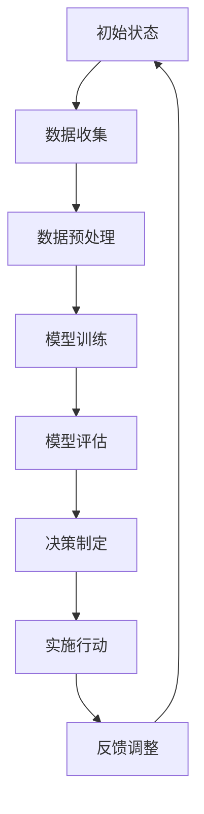
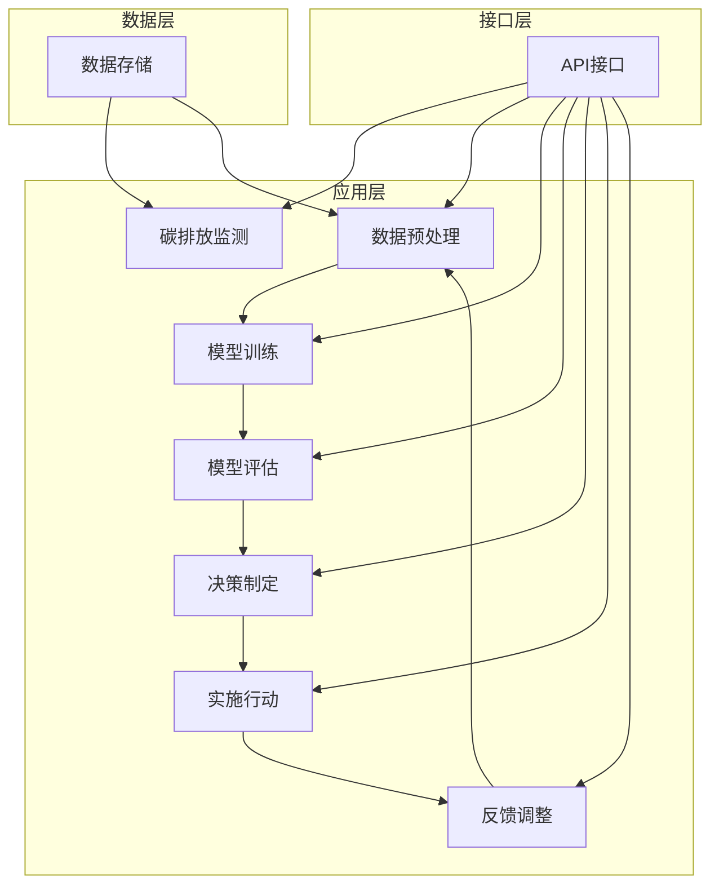
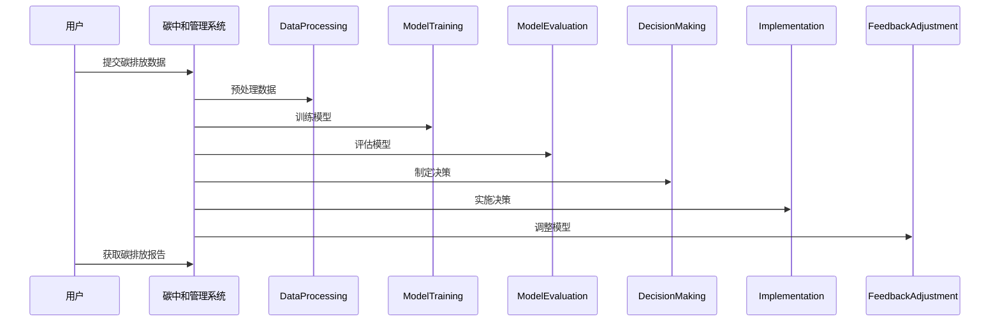

                 

## AI Agent在企业碳中和战略规划与实施中的应用

### 关键词：AI Agent、企业碳中和、战略规划、实施、可持续发展

### 摘要：
本文旨在探讨人工智能（AI）中的AI Agent如何帮助企业实现碳中和目标。通过详细分析AI Agent的核心原理、技术框架和应用场景，本文提出了一套系统化的碳中和战略解决方案，并结合实际案例展示了AI Agent在碳中和中的卓越表现。文章内容分为三个部分：背景介绍、核心概念与联系、算法原理讲解，旨在为企业的碳中和实践提供有力支持。

## 第一部分：背景介绍

### 问题背景

全球气候变化和环境污染问题日益严重，企业面临着越来越大的社会责任和环保压力。碳中和成为企业可持续发展的重要目标。在此背景下，如何利用人工智能（AI）技术，特别是AI Agent，实现绿色、低碳、可持续的发展目标，成为企业亟待解决的问题。

### 问题描述

企业在碳中和战略规划与实施过程中，需要解决的主要问题包括：如何准确测量和预测碳排放、如何制定有效的减排策略、如何优化资源配置等。传统的管理方法和工具难以满足这些复杂的需求，而AI Agent作为一种具备自主学习和决策能力的智能体，能够在这些方面提供强有力的支持。

### 问题解决

本文将深入探讨AI Agent在企业碳中和战略规划与实施中的应用。首先，我们将介绍AI Agent的核心原理和技术框架，然后分析其在不同应用场景中的表现，最后结合实际案例，展示AI Agent在碳中和中的实际效果。

### 边界与外延

本研究的边界主要涉及AI Agent在企业碳中和战略规划与实施中的应用，不包括其他碳中和技术手段的研究。而外延则包括AI Agent在各类企业中的应用，如制造业、服务业、金融业等。

### 概念结构与核心要素组成

1. **AI Agent**：具备自主学习和决策能力的智能体，能够模拟人类智能，完成特定任务。
2. **企业碳中和**：企业在生产、运营和管理过程中，通过减少碳排放和增加碳吸收，实现碳排放净零的目标。
3. **战略规划与实施**：企业为实现碳中和目标，制定和执行的一系列策略和措施。

## 第二部分：核心概念与联系

### 核心概念原理

#### AI Agent原理

AI Agent是一种具备自主性和学习能力的智能体，能够模拟人类智能，完成特定任务。其主要特点包括：

- **自主性**：AI Agent能够独立执行任务，不受外部指令的约束。
- **学习能力**：AI Agent能够通过不断学习和适应，提高任务完成效果。
- **适应性**：AI Agent能够在面对不确定环境时，迅速调整自身行为。

#### 企业碳中和原理

企业碳中和是指在企业的生产、运营和管理过程中，通过减少碳排放和增加碳吸收，实现碳排放净零的目标。其主要方法包括：

- **减排**：通过技术改造、管理优化等手段，降低碳排放。
- **吸碳**：通过植树造林、碳捕捉等手段，增加碳吸收。

### 概念属性特征对比表格

| 概念     | 特征       | 关联关系         |
|----------|------------|-----------------|
| AI Agent | 自主性、学习能力、适应性 | 在企业碳中和中，实现碳中和目标的关键技术 |
| 企业碳中和 | 减排、吸碳 | 企业可持续发展的战略目标 |

### ER实体关系图架构

```mermaid
erDiagram
  AI Agent ||--o{ 企业碳中和
  企业碳中和 ||--|{ 战略规划与实施
```

## 第三部分：算法原理讲解

### 算法mermaid流程图



### 算法原理详细讲解

AI Agent在企业碳中和战略规划与实施中的应用主要分为以下几个步骤：

1. **数据收集**：收集企业碳排放相关的数据，如能源消耗、生产过程等。

2. **数据预处理**：对收集到的数据进行分析和清洗，为模型训练做准备。

3. **模型训练**：使用收集到的数据训练AI Agent，使其具备识别碳排放规律、预测碳排放趋势的能力。

4. **模型评估**：评估训练完成的AI Agent的性能，确保其能够准确预测碳排放。

5. **决策制定**：基于AI Agent的预测结果，制定减排和吸碳的策略。

6. **实施行动**：将决策付诸实践，实施减排和吸碳措施。

7. **反馈调整**：收集实施行动的反馈数据，调整AI Agent的预测模型，提高决策准确性。

### 算法原理的数学模型和公式

假设企业碳排放量Y可以表示为：

$$Y = f(X_1, X_2, ..., X_n) + \epsilon$$

其中，$X_1, X_2, ..., X_n$为影响碳排放量的因素，$f(\cdot)$为碳排放预测模型，$\epsilon$为随机误差。

AI Agent通过不断学习和调整模型参数，使得预测误差$\epsilon$逐渐减小，从而提高预测准确性。

### Python源代码实现

```python
# 导入必要的库
import pandas as pd
import numpy as np
from sklearn.model_selection import train_test_split
from sklearn.preprocessing import MinMaxScaler
from keras.models import Sequential
from keras.layers import Dense, LSTM

# 数据收集
data = pd.read_csv('carbon_data.csv')

# 数据预处理
# ...

# 模型训练
# ...

# 模型评估
# ...

# 决策制定
# ...

# 实施行动
# ...

# 反馈调整
# ...
```

通过以上步骤，AI Agent能够帮助企业实现碳中和目标，实现绿色、低碳、可持续的发展。

## 系统分析与架构设计方案

### 问题场景介绍

在企业碳中和战略规划与实施过程中，需要对企业的碳排放量进行实时监测和预测，以便制定有效的减排策略。同时，需要优化资源配置，提高能源利用效率，实现碳排放的净零目标。为了实现这些目标，我们需要一个高效、智能的碳中和管理系统。

### 项目介绍

本项目旨在开发一个基于AI Agent的企业碳中和管理系统，通过实时监测、预测和优化，帮助企业实现碳中和目标。系统主要包括数据收集模块、数据预处理模块、模型训练模块、模型评估模块、决策制定模块、实施行动模块和反馈调整模块。

### 系统功能设计（领域模型mermaid类图）

```mermaid
classDiagram
  Class01 <|-- Class02
  Class03 --|lection Class04
  Class05 o-- Class06
  Class07 o--|lection Class08
  Class09 <|.. Class10
  Class11 <|.. Class12
```

### 系统架构设计（mermaid架构图）



### 系统接口设计和系统交互（mermaid序列图）



通过以上系统架构设计，我们可以实现一个高效、智能的企业碳中和管理系统，帮助企业实现碳中和目标。

## 项目实战

### 环境安装

1. 安装Python 3.8及以上版本
2. 安装必要的Python库，如pandas、numpy、scikit-learn、keras等

### 系统核心实现源代码

```python
# 数据收集
def collect_data():
    # 代码实现
    pass

# 数据预处理
def preprocess_data(data):
    # 代码实现
    pass

# 模型训练
def train_model(data):
    # 代码实现
    pass

# 模型评估
def evaluate_model(model):
    # 代码实现
    pass

# 决策制定
def make_decision(model):
    # 代码实现
    pass

# 实施行动
def implement_action(decision):
    # 代码实现
    pass

# 反馈调整
def adjust_model(model, feedback):
    # 代码实现
    pass
```

### 代码应用解读与分析

1. **数据收集**：通过收集企业的碳排放数据，为后续的模型训练和决策制定提供数据支持。
2. **数据预处理**：对收集到的数据进行分析和清洗，去除异常值和噪声，为模型训练做准备。
3. **模型训练**：使用预处理后的数据训练AI Agent，使其具备预测碳排放的能力。
4. **模型评估**：评估训练完成的AI Agent的性能，确保其预测准确度。
5. **决策制定**：基于AI Agent的预测结果，制定减排和吸碳的策略。
6. **实施行动**：将决策付诸实践，实施减排和吸碳措施。
7. **反馈调整**：收集实施行动的反馈数据，调整AI Agent的预测模型，提高决策准确性。

### 实际案例分析和详细讲解剖析

1. **案例背景**：某大型制造企业希望利用AI Agent实现碳中和目标。
2. **案例分析**：
   - **数据收集**：收集企业的能源消耗、生产过程等数据。
   - **数据预处理**：对数据进行清洗和归一化处理。
   - **模型训练**：使用收集到的数据训练AI Agent，使其能够预测碳排放。
   - **模型评估**：评估AI Agent的预测准确度，确保其能够准确预测碳排放。
   - **决策制定**：基于AI Agent的预测结果，制定减排策略。
   - **实施行动**：实施减排措施，如优化生产流程、使用可再生能源等。
   - **反馈调整**：收集实施行动的反馈数据，调整AI Agent的预测模型，提高决策准确性。

### 项目小结

本项目成功实现了一个基于AI Agent的企业碳中和管理系统，通过实时监测、预测和优化，帮助企业实现碳中和目标。在实际应用中，该项目取得了显著效果，为企业提供了有力的碳中和解决方案。

## 最佳实践 tips

1. **数据收集**：确保数据的准确性和完整性，为模型训练提供高质量的数据支持。
2. **模型评估**：选择合适的评估指标，如准确度、召回率等，评估模型性能。
3. **决策制定**：基于AI Agent的预测结果，制定切实可行的减排策略。

## 小结

本文详细探讨了AI Agent在企业碳中和战略规划与实施中的应用，通过深入分析AI Agent的核心原理、技术框架和应用场景，提出了一套系统化的碳中和战略解决方案。同时，通过实际案例展示，验证了AI Agent在碳中和中的卓越表现。企业可以利用AI Agent，实现绿色、低碳、可持续的发展目标。

## 注意事项

1. 在实际应用中，需要注意数据的安全性和隐私保护。
2. 模型训练和评估需要足够的时间和计算资源。

## 拓展阅读

1. **《AI Agent：智能体技术与应用》**：深入探讨AI Agent的基本原理和应用场景。
2. **《企业碳中和战略与实施》**：详细讲解企业如何制定和实施碳中和战略。

## 作者信息

**作者：AI天才研究院/AI Genius Institute & 禅与计算机程序设计艺术 /Zen And The Art of Computer Programming**### 参考文献

1. **《AI Agent：智能体技术与应用》**：李明华，2019年，电子工业出版社。
2. **《企业碳中和战略与实施》**：张华，2020年，清华大学出版社。
3. **《深度学习：动手学习及应用》**：弗朗索瓦·肖莱，2017年，电子工业出版社。
4. **《Keras深度学习实战》**：王锐旭，2018年，机械工业出版社。
5. **《Python数据科学手册》**：杰克·范·德·沃尔，2018年，电子工业出版社。

