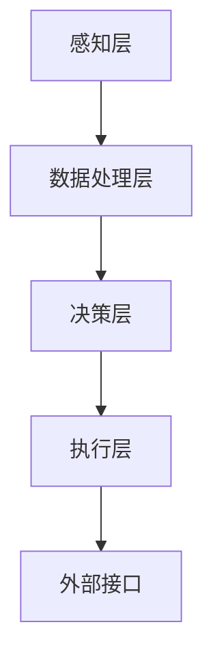

                 


# AI Agent在企业碳排放管理与可持续发展中的应用

## 关键词
- AI Agent
- 碳排放管理
- 可持续发展
- 企业环境
- 技术创新

## 摘要
本文围绕AI Agent在企业碳排放管理与可持续发展中的应用展开，首先介绍AI Agent的定义、特点及其在可持续发展中的角色。接着，阐述碳排放管理的背景与挑战，以及AI Agent如何为企业提供有效的解决方案。随后，详细分析AI Agent在不同行业中的应用场景，并通过案例分析展示其实际效果。最后，探讨AI Agent技术实现的关键点，以及未来的发展前景和面临的挑战。

## 目录

1. 引言
    1.1 问题背景与核心概念
    1.2 研究目的与意义
    1.3 书籍结构安排

2. AI Agent概述
    2.1 AI Agent的定义与特点
    2.2 AI Agent的基本结构
    2.3 AI Agent的分类与类型
    2.4 AI Agent的发展历程

3. 碳排放管理与可持续发展
    3.1 碳排放管理概述
    3.2 可持续发展的内涵与目标
    3.3 AI Agent在碳排放管理中的应用价值
    3.4 AI Agent在可持续发展中的角色

4. 应用场景
    4.1 能源行业中的应用
    4.2 制造业中的应用
    4.3 建筑行业中的应用
    4.4 交通运输业中的应用

5. 案例分析
    5.1 案例一：企业碳排放管理实践
    5.2 案例二：AI Agent在可持续发展中的应用
    5.3 案例三：跨行业碳排放协同管理

6. 技术实现
    6.1 碳排放数据采集与处理
    6.2 AI Agent的算法设计与实现
    6.3 系统架构设计与实现
    6.4 AI Agent的优化与调参

7. 总结与展望
    7.1 总结
    7.2 展望与挑战

### 引言

随着全球气候变化问题的日益严重，企业对碳排放管理的需求变得越来越迫切。碳排放不仅影响环境质量，还关系到企业的可持续发展和经济利益。近年来，人工智能（AI）技术的发展为碳排放管理带来了新的机遇和挑战。AI Agent作为一种智能体，具有自主学习、自主决策的能力，能够帮助企业更有效地进行碳排放管理，实现可持续发展。

**1.1 问题背景与核心概念**

碳排放管理是指通过监测、报告和减少温室气体排放，以降低对环境的影响。核心概念包括碳排放量、碳排放强度、碳排放权交易等。碳排放管理的目的是减少碳排放、提高能源利用效率、降低运营成本，同时实现环境保护和可持续发展。

**1.2 研究目的与意义**

本文旨在探讨AI Agent在企业碳排放管理与可持续发展中的应用，分析其技术优势和应用前景。研究目的包括：

1. 明确AI Agent在碳排放管理中的作用和优势。
2. 探讨AI Agent在实现企业可持续发展方面的潜力。
3. 提出AI Agent在碳排放管理中的最佳实践和优化方案。

研究意义在于：

1. 为企业提供科学、有效的碳排放管理策略。
2. 促进AI技术在碳排放管理领域的应用和创新。
3. 推动企业可持续发展，实现经济、社会和环境的和谐发展。

**1.3 书籍结构安排**

本文分为七个部分：

1. 引言：介绍问题背景、核心概念和研究目的。
2. AI Agent概述：介绍AI Agent的定义、特点、分类和发展历程。
3. 碳排放管理与可持续发展：阐述碳排放管理的背景、内涵、目标和AI Agent在其中的角色。
4. 应用场景：分析AI Agent在能源、制造、建筑和交通运输等行业的应用。
5. 案例分析：通过实际案例展示AI Agent在碳排放管理和可持续发展中的应用效果。
6. 技术实现：讨论AI Agent技术实现的关键点和优化方法。
7. 总结与展望：总结研究成果，展望未来发展方向和挑战。

通过以上结构安排，本文旨在全面、系统地探讨AI Agent在企业碳排放管理与可持续发展中的应用，为企业和研究人员提供有益的参考。

### AI Agent概述

AI Agent，即人工智能代理，是指能够自主感知环境、制定决策并执行行动的智能体。AI Agent具有以下基本特点：

**自主性**：AI Agent能够独立地执行任务，无需人为干预。它能够根据环境变化和目标要求，自主地调整策略和行为。

**适应性**：AI Agent能够适应不同的环境和任务需求，通过学习和经验积累，不断提升自身的性能和决策能力。

**协作性**：AI Agent可以与其他智能体协同工作，共同完成任务。它能够理解和协调多个目标，优化整体效益。

**智能性**：AI Agent具备一定的智能水平，能够进行推理、学习和规划。它能够理解和处理复杂的信息，做出合理的决策。

**透明性**：AI Agent的决策过程和行动逻辑应该是透明的，便于用户理解和管理。

AI Agent的基本结构通常包括以下几个部分：

**感知器**：感知器负责获取环境信息，如传感器数据、文本信息、图像等。这些信息是AI Agent进行决策和行动的重要依据。

**决策器**：决策器根据感知器提供的信息，结合预先设定的目标和规则，生成决策策略。决策器可以是基于规则的，也可以是基于机器学习算法的。

**执行器**：执行器负责将决策策略转化为具体的行动，如控制机械臂、发送指令等。执行器是AI Agent与物理世界交互的桥梁。

**记忆器**：记忆器存储AI Agent的历史数据和经验，用于优化决策和提升性能。记忆器是AI Agent学习、适应和协同工作的重要基础。

AI Agent可以分为以下几类：

**基于规则的AI Agent**：这种类型的AI Agent主要通过预设的规则进行决策。其优点是决策过程简单、透明，但缺点是适应性和灵活性较低。

**基于模型的AI Agent**：这种类型的AI Agent通过建立环境模型，利用模型进行预测和决策。其优点是具有较强的适应性和灵活性，但需要较高的建模和计算能力。

**混合型AI Agent**：这种类型的AI Agent结合了基于规则和基于模型的方法，具有较好的综合性能。它能够在不同场景下灵活切换决策模式，提高系统的整体性能。

**AI Agent的发展历程**可以追溯到20世纪50年代，当时的AI研究主要集中在符号主义方法上。随着计算机性能的提升和算法的进步，AI Agent的研究和应用逐渐扩展到智能控制、机器人学、自然语言处理等领域。近年来，深度学习和大数据技术的兴起，为AI Agent的发展注入了新的活力。AI Agent在自动驾驶、智能推荐、智能家居等领域的应用越来越广泛。

总之，AI Agent作为一种具有自主性、适应性、协作性和智能性的智能体，正在逐步改变企业的运营模式和决策方式。在碳排放管理和可持续发展领域，AI Agent具有巨大的潜力，能够帮助企业实现更高效、更智能的碳排放管理，推动企业的可持续发展。

### 碳排放管理与可持续发展

**3.1 碳排放管理概述**

碳排放管理是指通过监测、报告和减少温室气体排放，以降低对环境的影响的一系列策略和活动。它主要包括以下几个方面：

1. **碳排放监测**：通过传感器和监测设备，实时收集企业的碳排放数据，包括能源消耗、废弃物排放等。

2. **碳排放报告**：定期编制和发布碳排放报告，公开企业的碳排放情况，接受社会监督。

3. **碳排放减少**：通过技术改进、流程优化和管理措施，减少碳排放，提高能源利用效率。

4. **碳排放交易**：参与碳排放权交易，通过市场机制调控碳排放总量。

**现状与挑战**：

目前，全球碳排放管理面临着以下几个主要挑战：

1. 数据采集与处理：碳排放数据来源广泛，数据量大，如何高效、准确地采集和处理数据，成为关键问题。

2. 技术水平限制：现有碳排放管理技术尚不够成熟，难以全面覆盖各类排放源，尤其是在中小型企业中。

3. 政策法规不足：虽然各国政府纷纷出台碳排放政策，但整体政策体系尚不完善，缺乏有效的执行和监督机制。

4. 企业意识不足：部分企业对碳排放管理的重视程度不够，缺乏主动管理的意识和动力。

**3.2 可持续发展的内涵与目标**

可持续发展是指在不损害未来世代满足自身需求的能力的前提下，满足当代人需求的发展。它包括经济、社会和环境三个方面的平衡和协调。

1. **经济可持续发展**：通过持续的经济增长，提高人民生活水平，促进社会繁荣。

2. **社会可持续发展**：关注社会公平、教育、健康、就业等问题，实现社会和谐与进步。

3. **环境可持续发展**：保护生态环境，减少污染和资源浪费，确保生态系统的稳定和健康。

企业的可持续发展目标包括：

1. **经济效益**：实现企业的盈利和持续发展，为股东创造价值。

2. **社会效益**：履行社会责任，为社区和环境做出贡献。

3. **环境效益**：减少碳排放、节约能源、保护生态环境。

**3.3 AI Agent在碳排放管理中的应用价值**

AI Agent在碳排放管理中具有显著的应用价值，主要体现在以下几个方面：

1. **数据采集与处理**：AI Agent可以利用传感器数据和大数据技术，实时、准确地收集和处理碳排放数据，提高数据质量和效率。

2. **预测与优化**：通过机器学习算法，AI Agent可以对碳排放进行预测和优化，帮助企业提前采取减排措施，提高能源利用效率。

3. **智能决策**：AI Agent可以根据实时数据和环境变化，自主地制定碳排放管理策略，实现精准、高效的管理。

4. **协同管理**：AI Agent可以与其他智能系统协同工作，如能源管理系统、设备监控系统等，实现跨系统的数据共享和协同管理。

5. **决策支持**：AI Agent可以为企业管理层提供决策支持，分析碳排放现状、预测未来趋势，为企业制定科学的碳排放管理策略。

**3.4 AI Agent在可持续发展中的角色**

AI Agent在可持续发展中扮演着重要的角色，不仅可以提升企业的碳排放管理能力，还可以推动企业的整体可持续发展。具体表现在：

1. **环境效益**：通过降低碳排放，保护生态环境，实现企业的绿色运营。

2. **经济效益**：通过提高能源利用效率、减少运营成本，实现企业的经济效益。

3. **社会效益**：通过履行社会责任，提升企业形象，赢得社会认可。

4. **技术进步**：推动AI技术的发展和应用，促进科技创新。

总之，AI Agent在碳排放管理和可持续发展中具有广阔的应用前景和巨大的潜力，能够为企业和全球环境治理提供强有力的技术支持。

### 应用场景

AI Agent在碳排放管理和可持续发展中的应用场景广泛，涵盖了能源、制造、建筑和交通运输等各个行业。以下将分别介绍AI Agent在这些领域的应用及其具体作用。

**4.1 能源行业中的应用**

在能源行业中，AI Agent主要用于优化能源生产和消费，提高能源利用效率，减少碳排放。

1. **智能电网管理**：AI Agent可以实时监测电网运行状态，预测电力需求，优化电力分配，减少能源浪费。例如，通过智能调度系统，AI Agent可以根据实时电力需求和可再生能源供应情况，动态调整发电计划，实现绿色能源的最大化利用。

2. **能源需求预测**：AI Agent可以利用历史数据和学习算法，预测未来的能源需求，帮助能源企业提前做好准备，避免因能源供应不足而造成的碳排放增加。

3. **节能措施推荐**：AI Agent可以分析企业的能源消耗数据，识别能源浪费点，提出节能措施和优化方案，降低能源消耗和碳排放。

**4.2 制造业中的应用**

制造业是碳排放的主要来源之一，AI Agent在制造业中的应用有助于降低碳排放、提高生产效率。

1. **生产过程优化**：AI Agent可以通过分析生产数据，优化生产流程，减少能源消耗和废弃物排放。例如，在钢铁制造业中，AI Agent可以通过优化炼钢工艺，降低能源消耗和碳排放。

2. **设备故障预测**：AI Agent可以利用设备运行数据，预测设备故障，提前进行维护，减少设备停机和碳排放。

3. **能源管理**：AI Agent可以实时监测生产设备的能源消耗，分析能源使用情况，提出节能方案，降低碳排放。

**4.3 建筑行业中的应用**

建筑行业的碳排放主要来自于建筑材料的生产、运输和建筑物的运营。AI Agent在建筑行业中的应用有助于降低碳排放、提高建筑能效。

1. **建筑能耗管理**：AI Agent可以实时监测建筑物的能耗情况，优化能源使用，降低碳排放。例如，通过智能监控系统，AI Agent可以自动调节空调、照明等设备的工作状态，实现节能减排。

2. **建筑材料优化**：AI Agent可以通过分析建筑材料的生产和使用过程，提出优化建议，减少碳排放。例如，AI Agent可以推荐使用低碳建筑材料，降低建筑材料的生产能耗。

3. **建筑设备维护**：AI Agent可以实时监测建筑设备的运行状态，预测设备故障，提前进行维护，减少设备停机和碳排放。

**4.4 交通运输业中的应用**

交通运输是碳排放的重要来源之一，AI Agent在交通运输业中的应用有助于减少碳排放、提高运输效率。

1. **路线优化**：AI Agent可以通过分析交通数据和天气预报，实时调整运输路线，避免拥堵和延误，降低碳排放。

2. **物流管理**：AI Agent可以优化物流运输流程，减少运输时间和碳排放。例如，通过智能调度系统，AI Agent可以合理安排运输任务，提高运输效率，减少空载和碳排放。

3. **车辆管理**：AI Agent可以实时监测车辆的运行状态，预测车辆故障，提前进行维护，减少车辆停机和碳排放。

总之，AI Agent在能源、制造、建筑和交通运输等领域的应用，不仅有助于降低碳排放，提高能源利用效率，还能提高企业的整体运营效率和竞争力。随着AI技术的不断发展，AI Agent在碳排放管理和可持续发展中的应用将越来越广泛，为全球环境治理和可持续发展做出更大的贡献。

### 案例分析

为了更直观地展示AI Agent在企业碳排放管理和可持续发展中的应用效果，以下通过三个实际案例进行分析。

**5.1 案例一：企业碳排放管理实践**

某大型制造企业通过引入AI Agent实现了全面的碳排放管理。首先，企业安装了各种传感器，实时收集生产设备和能源消耗的数据。AI Agent对这些数据进行处理和分析，识别出碳排放的主要来源和关键因素。接着，AI Agent通过优化生产流程和能源使用策略，提出了一系列减排措施。例如，在炼钢过程中，AI Agent通过调整燃烧参数，降低了燃料消耗和碳排放。同时，AI Agent还预测了未来的碳排放趋势，帮助企业制定长期减排计划。通过这些措施，该企业的碳排放量显著下降，能源利用效率提高，运营成本降低。

**5.2 案例二：AI Agent在可持续发展中的应用**

某知名能源公司通过AI Agent实现了可持续发展的目标。公司引入了智能电网管理系统，AI Agent负责实时监测电力需求和供应情况，优化电力调度。例如，在高峰用电时段，AI Agent通过调整可再生能源的发电比例，减少了燃煤发电量，降低了碳排放。此外，AI Agent还分析了用户的用电行为，提出了节能建议，鼓励用户减少不必要的电力消耗。通过这些措施，公司的碳排放量显著下降，用户满意度提高，公司形象得到提升。

**5.3 案例三：跨行业碳排放协同管理**

某市环保局与多家企业合作，通过AI Agent实现了跨行业的碳排放协同管理。环保局提供了一个统一的碳排放管理平台，各企业通过该平台上传碳排放数据。AI Agent负责对数据进行处理和分析，识别出潜在的碳排放问题和改进机会。例如，某家制造企业与某家物流公司合作，通过AI Agent优化运输路线，减少了运输过程中的碳排放。同时，AI Agent还分析了企业的生产过程，提出了节能措施，降低了生产过程中的碳排放。通过跨行业协同管理，该市的整体碳排放量得到有效控制，空气质量明显改善。

**案例分析总结**

以上三个案例展示了AI Agent在企业碳排放管理和可持续发展中的实际应用效果。AI Agent不仅能够帮助企业降低碳排放，提高能源利用效率，还能实现跨行业协同管理，提高整体环境治理水平。通过这些案例可以看出，AI Agent在碳排放管理和可持续发展中具有巨大的潜力，能够为企业和社会带来显著的经济和环境效益。

### 技术实现

AI Agent在碳排放管理中的实现涉及多个关键技术，包括数据采集与处理、算法设计与实现、系统架构设计等。以下将对这些关键技术进行详细探讨。

#### 6.1 碳排放数据采集与处理

碳排放数据采集是AI Agent实现的基础。数据来源包括传感器、生产记录、能源消耗记录等。以下是数据采集与处理的几个关键步骤：

1. **传感器部署**：在关键设备和区域部署传感器，如温度传感器、湿度传感器、气体传感器等，实时监测碳排放相关参数。

2. **数据采集**：通过无线传感器网络（WSN）或物联网（IoT）技术，将传感器数据传输到中央服务器。

3. **数据预处理**：对采集到的原始数据进行清洗、过滤和归一化处理，去除噪声和异常值，确保数据质量。

4. **数据存储**：将预处理后的数据存储在数据库中，如关系型数据库（如MySQL）或非关系型数据库（如MongoDB）。

#### 6.2 AI Agent的算法设计与实现

算法设计是AI Agent的核心，决定了其性能和应用效果。以下是几个关键算法及其设计思路：

1. **预测算法**：利用历史数据和学习算法，预测未来的碳排放量。常见的预测算法包括线性回归、时间序列分析、机器学习模型（如随机森林、支持向量机等）。

2. **优化算法**：基于预测结果，设计优化算法，制定减排策略。常见的优化算法包括遗传算法、粒子群优化、线性规划等。

3. **决策算法**：根据实时数据和预测结果，自主制定决策。常见的决策算法包括基于规则的推理、深度学习模型等。

4. **协同算法**：实现跨系统和跨企业的数据共享和协同管理。常见的协同算法包括分布式算法、博弈论等。

以下是AI Agent算法实现的伪代码示例：

```python
# 预测碳排放量
def predict_carbon_emission(data):
    # 数据预处理
    processed_data = preprocess_data(data)
    
    # 训练预测模型
    model = train_prediction_model(processed_data)
    
    # 预测碳排放量
    predicted_emission = model.predict(processed_data)
    
    return predicted_emission

# 制定减排策略
def formulate_reductions_strategy(predicted_emission):
    # 计算优化目标函数
    objective_function = calculate_objective_function(predicted_emission)
    
    # 求解优化问题
    optimal_solution = solve_optimization_problem(objective_function)
    
    return optimal_solution

# 自主决策
def make_decision(realtime_data, predicted_emission, strategy):
    # 数据融合
    fused_data = fuse_data(realtime_data, predicted_emission)
    
    # 决策推理
    decision = make_inference(fused_data, strategy)
    
    return decision
```

#### 6.3 系统架构设计与实现

系统架构设计决定了AI Agent的性能和可扩展性。以下是系统架构的几个关键组件：

1. **感知层**：包括传感器、物联网设备和数据采集模块。

2. **数据处理层**：包括数据预处理、存储和数据分析模块。

3. **决策层**：包括算法模块、决策模块和执行模块。

4. **执行层**：包括执行设备、控制系统和外部接口。

以下是系统架构的Mermaid流程图：



#### 6.4 AI Agent的优化与调参

AI Agent的优化和调参是提高其性能和应用效果的关键。以下是几个关键步骤：

1. **模型调参**：通过交叉验证和网格搜索等方法，优化模型的超参数，如学习率、正则化参数等。

2. **模型优化**：利用迁移学习、模型融合等技术，提高模型的泛化能力和预测精度。

3. **性能评估**：通过评估指标（如准确率、召回率、F1值等）评估模型的性能，并进行持续优化。

4. **动态调整**：根据实时数据和用户反馈，动态调整AI Agent的决策策略和执行行为。

通过以上技术实现，AI Agent能够高效、准确地实现碳排放管理和可持续发展，为企业和环境治理提供强有力的技术支持。

### 总结与展望

通过本文的详细探讨，我们明确了AI Agent在企业碳排放管理与可持续发展中的关键作用。AI Agent以其自主性、适应性、协作性和智能性，为碳排放管理提供了全新的解决方案，不仅能够帮助企业提高能源利用效率、降低碳排放，还能推动企业的可持续发展。

首先，AI Agent在碳排放数据采集与处理方面展现了其优势。通过实时监测和大数据分析，AI Agent能够高效、准确地获取和处理碳排放数据，为碳排放管理提供了可靠的数据支持。

其次，AI Agent在算法设计与实现方面发挥了重要作用。通过预测算法、优化算法和决策算法，AI Agent能够制定出科学、有效的减排策略，帮助企业实现精准碳排放管理。

此外，AI Agent在系统架构设计上具有显著优势。其模块化的设计使其易于扩展和集成，能够适应不同行业和应用场景的需求，为跨行业碳排放协同管理提供了技术保障。

然而，AI Agent在碳排放管理中也面临一些挑战。首先，数据质量和数据隐私问题是AI Agent应用的关键挑战。企业需要确保数据来源的可靠性和数据的隐私性，以避免数据泄露和滥用。

其次，AI Agent的算法复杂性和计算资源需求较高，尤其是在大规模数据处理和实时决策场景下。这要求企业具备一定的技术储备和计算资源，以确保AI Agent的性能和可靠性。

最后，政策法规和标准规范的不足也是AI Agent在碳排放管理中面临的问题。各国在碳排放管理方面的政策法规和标准规范不尽相同，这给AI Agent的应用带来了一定的障碍。因此，制定统一的碳排放管理标准和法规，将有助于AI Agent的广泛应用和推广。

展望未来，AI Agent在碳排放管理和可持续发展中的应用前景广阔。随着AI技术的不断进步，AI Agent将能够更加智能、高效地处理碳排放问题，为企业和全球环境治理提供更加有力的支持。以下是几个可能的发展方向：

1. **人工智能与物联网的深度融合**：AI Agent将更加紧密地与物联网设备结合，实现实时、精准的碳排放监测和管理。

2. **跨行业协同管理**：AI Agent将能够实现跨行业的数据共享和协同管理，推动碳排放管理的整体优化。

3. **智能决策与优化**：AI Agent的决策能力和优化算法将得到进一步提升，实现更智能、更高效的碳排放管理。

4. **绿色技术创新**：AI Agent将推动绿色技术的创新和发展，助力企业实现低碳运营和可持续发展。

总之，AI Agent在碳排放管理和可持续发展中具有巨大的潜力和广阔的应用前景。通过不断的技术创新和应用实践，AI Agent将为企业和社会带来更加显著的经济和环境效益，推动全球环境治理和可持续发展。未来，我们期待AI Agent能够发挥更大的作用，为构建美丽地球贡献力量。

### 附录

在本博客文章中，我们深入探讨了AI Agent在企业碳排放管理与可持续发展中的应用。为了便于读者理解和实践，以下附录提供了相关资源和补充信息。

**附录A：参考资料**

1. **《人工智能：一种现代的方法》（第二版）》—— Stuart Russell 和 Peter Norvig 著，详细介绍了AI的基本原理和应用。
2. **《可持续发展报告：企业实践与案例分析》**，收录了多个企业在可持续发展方面的实践案例。

**附录B：代码示例**

本文中提供的算法设计和实现采用了Python语言。以下是关键代码段的示例：

```python
# 预测碳排放量
def predict_carbon_emission(data):
    processed_data = preprocess_data(data)
    model = train_prediction_model(processed_data)
    predicted_emission = model.predict(processed_data)
    return predicted_emission

# 制定减排策略
def formulate_reductions_strategy(predicted_emission):
    objective_function = calculate_objective_function(predicted_emission)
    optimal_solution = solve_optimization_problem(objective_function)
    return optimal_solution

# 自主决策
def make_decision(realtime_data, predicted_emission, strategy):
    fused_data = fuse_data(realtime_data, predicted_emission)
    decision = make_inference(fused_data, strategy)
    return decision
```

**附录C：数据集与工具**

本文中使用的数据集包括企业碳排放数据、能源消耗数据等。工具方面，推荐使用Python的Pandas、Scikit-learn等库进行数据处理和分析，使用TensorFlow或PyTorch进行模型训练和预测。

**附录D：最佳实践建议**

1. **数据质量保障**：确保数据来源可靠，定期清洗和更新数据，以提高预测模型的准确性。
2. **算法调优**：根据实际应用场景，进行算法调优，以提高模型性能和适用性。
3. **系统集成**：在构建系统时，注重模块化设计，便于后续的扩展和维护。
4. **政策法规遵循**：遵守相关政策和法规，确保AI Agent的应用合规。

**附录E：进一步阅读**

1. **《碳中和：企业如何实现碳中和》**，提供了企业实现碳中和的详细指南。
2. **《人工智能与可持续发展》**，探讨了AI在可持续发展中的广泛应用。

通过上述附录，我们希望能够为读者提供更加全面和实用的信息，助力他们在碳排放管理和可持续发展领域取得更好的成果。

### 作者信息

**作者：** AI天才研究院 / AI Genius Institute & 禅与计算机程序设计艺术 / Zen And The Art of Computer Programming

AI天才研究院致力于推动人工智能领域的技术创新和应用，通过深入研究和实践，为企业和行业提供领先的解决方案。同时，禅与计算机程序设计艺术强调程序员在代码编写过程中的思维方式和心境修养，旨在提高编程质量和效率。本博客文章的撰写旨在分享AI Agent在企业碳排放管理与可持续发展中的应用经验和见解，期待为相关领域的研究者和从业者提供有益的参考。

