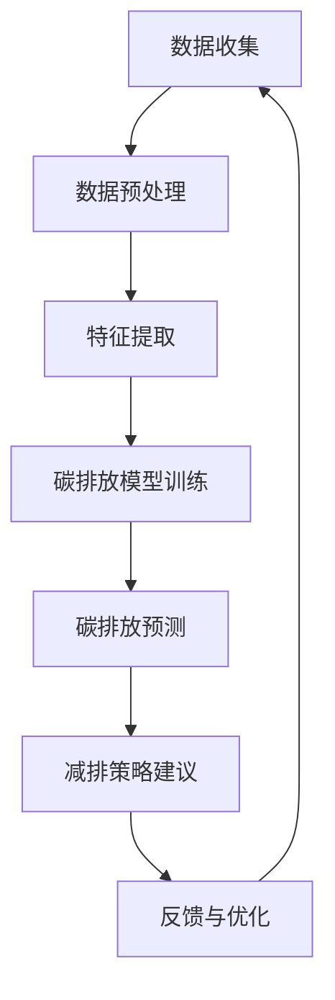
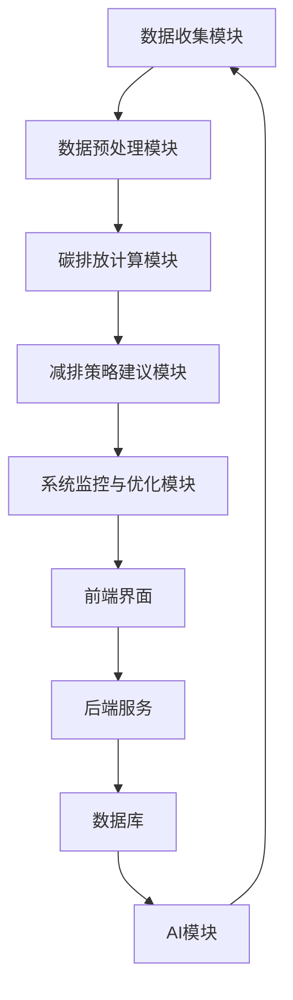
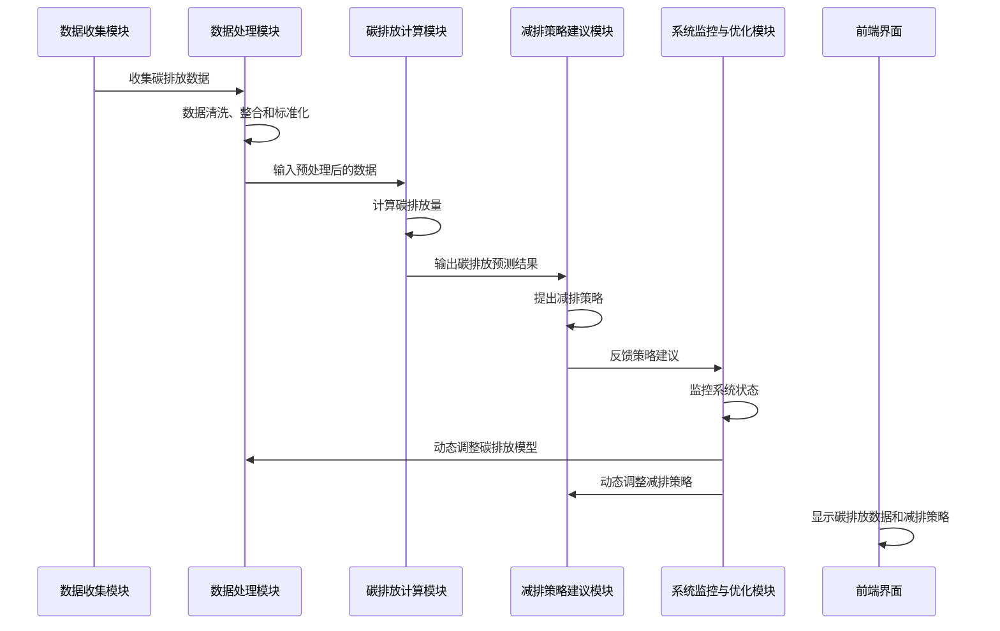

                 


### 1.1 AI Agent在企业碳足迹计算中的重要性

AI Agent，或称为智能代理，是一种在特定环境中自主行动、具有感知能力和决策能力的智能体。它们能够模拟人类的思维过程，通过学习和适应来优化任务执行。在企业碳足迹计算与减排策略制定中，AI Agent的重要性不言而喻。

首先，随着全球气候变化问题的日益严重，企业面临越来越大的碳排放压力。如何在遵守环保法规的同时降低碳排放、提高能源利用效率，成为企业可持续发展的重要课题。传统的碳足迹计算方法通常依赖于人工输入和手动分析，效率低下且容易出错。而AI Agent能够通过自动化和智能化手段，快速、准确地完成碳足迹的计算，大大提高工作效率。

其次，AI Agent在减排策略制定中的应用同样具有重要意义。减排策略的制定需要考虑多方面的因素，如成本、技术可行性、市场前景等。AI Agent可以通过大数据分析和机器学习算法，对企业碳排放数据进行分析，识别出潜在的减排机会，并提供优化建议。此外，AI Agent还能够根据企业实际情况，动态调整减排策略，确保减排目标的实现。

综上所述，AI Agent在企业碳足迹计算与减排策略制定中的应用，不仅能够提高计算和决策的效率，还能够为企业提供更加精准和个性化的减排建议，有助于企业实现可持续发展目标。

### 1.2 AI Agent的定义与分类

AI Agent，即人工智能代理，是一种能够模拟人类决策过程，具备一定智能和自主行动能力的计算机程序。根据功能和应用场景，AI Agent可以分为多种类型，主要包括以下几类：

**1. 监控型AI Agent**：这类代理主要用于实时监测和收集环境数据，如温度、湿度、光照强度等。它们能够自动识别异常情况，并发出警报。例如，在工业生产过程中，监控型AI Agent可以实时监控设备运行状态，确保生产过程的安全和稳定。

**2. 控制型AI Agent**：这类代理能够在接收数据后，根据预设的规则和算法，自动调整系统的运行参数。例如，智能家居系统中的AI Agent可以自动调节室内温度、光线和空气质量，以提供最舒适的居住环境。

**3. 决策型AI Agent**：这类代理具备更高的智能，能够通过分析大量数据，制定最优决策。例如，在金融投资领域，决策型AI Agent可以根据市场走势、公司财务状况等多方面因素，提供投资建议。

**4. 社交型AI Agent**：这类代理能够与人类进行自然语言交互，理解和执行人类的指令。例如，智能客服系统中的AI Agent可以回答用户的问题，提供咨询服务。

**5. 模拟型AI Agent**：这类代理主要用于模拟人类行为，如自动驾驶汽车、虚拟角色等。它们通过模仿人类的感知、决策和行动过程，实现高度仿真的互动体验。

**6. 学习型AI Agent**：这类代理具备自我学习和优化能力，能够根据环境变化和用户反馈，不断改进自己的性能。例如，推荐系统中的AI Agent可以通过用户的历史行为数据，不断优化推荐结果，提高用户满意度。

通过以上分类，我们可以看到，AI Agent在各个领域的应用非常广泛，能够为企业碳足迹计算和减排策略制定提供有力支持。

### 1.3 企业碳足迹的概念及其重要性

企业碳足迹，是指企业生产经营活动所产生的直接和间接温室气体排放量。这些排放量主要包括二氧化碳（CO2）、甲烷（CH4）和氧化亚氮（N2O）等温室气体。企业碳足迹的计算方法通常包括以下几个步骤：

首先，识别企业的所有碳排放源。这包括直接排放（如工业生产过程中的废气排放）和间接排放（如能源消耗、物流运输等）。其次，根据各类排放源的具体情况，采用相应的计算公式进行量化。例如，能源消耗的碳足迹可以通过能源消耗量乘以碳排放系数得出。最后，将所有排放源的计算结果进行汇总，得到企业的总碳足迹。

企业碳足迹的重要性体现在以下几个方面：

**1. 环境保护**：企业碳足迹的准确计算有助于企业了解自身对环境的影响，从而采取有效的减排措施，减少温室气体排放，缓解气候变化问题。

**2. 法规遵守**：许多国家和地区已经制定了严格的碳排放法规，要求企业公开其碳足迹并进行定期审计。准确计算和报告企业碳足迹是合规运营的必要条件。

**3. 企业形象**：随着公众对环境保护意识的提高，企业碳足迹成为衡量其社会责任和可持续发展能力的重要指标。良好的碳足迹管理有助于提升企业形象，增强市场竞争力。

**4. 经济效益**：通过碳足迹计算，企业可以发现能源浪费和效率低下的问题，从而优化生产流程，降低能源成本，提高经济效益。

总之，企业碳足迹不仅是环境保护的重要工具，也是企业实现可持续发展战略的关键环节。

### 1.4 企业碳足迹计算与减排策略制定的挑战

尽管企业碳足迹的计算对于环境保护和可持续发展具有重要意义，但这一过程面临着诸多挑战。以下是企业碳足迹计算与减排策略制定中常见的几个难点：

**1. 数据收集困难**：企业碳足迹的计算需要大量准确的数据，包括能源消耗、物流运输、生产工艺等。然而，这些数据往往分散在不同的部门和系统中，难以统一收集和管理。此外，一些企业的历史数据可能不完整或不准确，给碳足迹计算带来了很大困难。

**2. 数据处理复杂**：碳排放数据涉及多种不同的排放源和多种类型的温室气体，需要进行复杂的计算和整合。此外，数据处理过程中可能存在数据冗余、噪声和异常值等问题，需要采用适当的数据清洗和预处理方法。

**3. 模型选择与优化**：碳足迹计算需要选择合适的数学模型和算法。不同的模型和算法适用于不同类型的企业和不同的碳排放场景，如何选择和优化模型是一个关键问题。此外，模型的参数设置和调整也需要根据实际情况进行优化。

**4. 碳足迹量化标准不一致**：全球各地的碳排放标准和计算方法不尽相同，导致不同企业之间的碳足迹比较存在困难。企业需要遵循统一的量化标准，以便进行有效的碳足迹管理和减排策略制定。

**5. 政策法规变动**：碳排放政策和法规不断更新，企业需要及时了解和适应这些变化。政策的不确定性增加了碳足迹计算和减排策略制定的复杂性。

**6. 成本与效益平衡**：虽然减排措施有助于环境保护，但企业也需要考虑成本效益。如何选择经济可行的减排措施，确保在实现减排目标的同时，不损害企业的经济利益，是一个重要的问题。

综上所述，企业碳足迹计算与减排策略制定面临着多方面的挑战。然而，通过引入AI Agent等先进技术，可以部分解决这些问题，提高计算和决策的效率，为企业实现可持续发展目标提供有力支持。

### 1.5 引入AI Agent在碳足迹计算与减排策略中的作用

为了解决企业碳足迹计算与减排策略制定中的诸多挑战，引入AI Agent成为一种行之有效的方法。AI Agent凭借其自动化、智能化和适应能力，在以下方面发挥了重要作用：

**1. 数据自动收集与处理**：AI Agent能够通过传感器、物联网（IoT）设备等，实时收集企业的能源消耗、物流运输、生产工艺等数据。这些数据经过AI Agent的预处理和清洗，可以保证数据的准确性和一致性，为碳足迹计算提供可靠的基础。

**2. 智能分析**：AI Agent利用机器学习和深度学习算法，对海量碳排放数据进行智能分析。通过模式识别和关联分析，AI Agent能够快速识别出企业碳排放的主要来源和关键因素，提供详细的碳排放报告。

**3. 碳足迹模型优化**：AI Agent可以根据企业的实际情况，选择和优化碳足迹计算模型。通过不断调整模型参数，AI Agent可以确保碳足迹计算结果的准确性和可靠性，提高决策的科学性。

**4. 排减策略建议**：AI Agent通过分析企业的碳排放数据，可以识别出潜在的减排机会。利用大数据分析和优化算法，AI Agent能够为企业提供经济可行的减排策略建议，帮助企业在降低碳排放的同时，保持经济效益。

**5. 动态调整与优化**：AI Agent能够根据企业运营环境的变化，动态调整碳足迹计算和减排策略。通过实时监测和反馈机制，AI Agent可以不断优化减排措施，确保减排目标的实现。

综上所述，AI Agent在碳足迹计算与减排策略制定中，不仅提高了计算和决策的效率，还为企业提供了科学、精准的减排建议，有助于企业实现可持续发展目标。

## 2.1 AI Agent的定义与分类

AI Agent，即人工智能代理，是一种在特定环境中具备感知能力、自主行动能力和决策能力的计算机程序。其核心在于模拟人类的思维过程，通过学习和适应来优化任务执行。AI Agent可以按照不同的标准进行分类，以下是几种常见的分类方法：

### 1. 按功能分类

**监控型AI Agent**：主要用于实时监测和收集环境数据，如温度、湿度、光照强度等。它们能够自动识别异常情况，并发出警报。

**控制型AI Agent**：能够根据接收到的数据，自动调整系统的运行参数，以实现最佳性能。例如，智能家居系统中的AI Agent可以自动调节室内温度、光线和空气质量。

**决策型AI Agent**：具备高级智能，能够通过分析大量数据，制定最优决策。例如，在金融投资领域，决策型AI Agent可以根据市场走势、公司财务状况等多方面因素，提供投资建议。

**社交型AI Agent**：能够与人类进行自然语言交互，理解和执行人类的指令。例如，智能客服系统中的AI Agent可以回答用户的问题，提供咨询服务。

**模拟型AI Agent**：主要用于模拟人类行为，如自动驾驶汽车、虚拟角色等。它们通过模仿人类的感知、决策和行动过程，实现高度仿真的互动体验。

**学习型AI Agent**：具备自我学习和优化能力，能够根据环境变化和用户反馈，不断改进自己的性能。例如，推荐系统中的AI Agent可以通过用户的历史行为数据，不断优化推荐结果，提高用户满意度。

### 2. 按应用场景分类

**工业生产AI Agent**：在工业生产过程中，AI Agent可以用于监控设备运行状态、优化生产流程、提高生产效率等。

**智能交通AI Agent**：在智能交通系统中，AI Agent可以用于交通流量预测、交通信号优化、事故预警等。

**金融投资AI Agent**：在金融投资领域，AI Agent可以用于市场分析、风险控制、投资组合优化等。

**医疗健康AI Agent**：在医疗健康领域，AI Agent可以用于病情诊断、药物推荐、健康管理等。

**智能家居AI Agent**：在智能家居系统中，AI Agent可以用于家居设备控制、能源管理、安全监控等。

**智能客服AI Agent**：在智能客服系统中，AI Agent可以用于自动回复用户咨询、处理投诉、提供服务等。

通过以上分类，我们可以看到，AI Agent在各个领域的应用非常广泛，具有很高的灵活性和适应性。在本文中，我们将重点关注决策型AI Agent在企业碳足迹计算与减排策略制定中的应用，探讨其如何通过大数据分析和机器学习算法，为企业提供科学的减排建议。

### 2.2 企业碳足迹的计算方法

企业碳足迹的计算是一个复杂的过程，涉及多个环节和方法。以下是企业碳足迹计算的主要步骤和方法：

#### 1. 数据收集

首先，企业需要收集与碳排放相关的数据。这些数据包括但不限于：

- **能源消耗数据**：包括企业使用的电力、燃气、水等能源的消耗量。
- **原材料采购数据**：涉及原材料的生产和运输过程中的碳排放量。
- **物流运输数据**：企业生产过程中产生的物流运输产生的碳排放。
- **生产工艺数据**：包括生产过程中产生的废气、废水和其他排放物的排放量。

#### 2. 数据预处理

收集到的数据通常需要进行预处理，以保证数据的质量和一致性。预处理步骤包括：

- **数据清洗**：去除重复、错误或无效的数据。
- **数据整合**：将不同来源、不同格式的数据进行整合，形成一个统一的数据集。
- **数据标准化**：对不同单位的数据进行转换，使其具有可比性。

#### 3. 数据计算

在预处理完成后，企业可以使用以下方法进行碳足迹计算：

- **直接排放计算**：直接排放计算是指计算企业生产经营过程中直接产生的温室气体排放量。例如，通过能源消耗数据和碳排放系数，计算出企业使用的电力、燃气等能源的碳排放量。

  计算公式：
  $$ E_{direct} = C_{energy} \times E_{factor} $$
  其中，\( E_{direct} \) 为直接排放量，\( C_{energy} \) 为能源消耗量，\( E_{factor} \) 为碳排放系数。

- **间接排放计算**：间接排放计算涉及企业供应链和外部物流的碳排放。例如，通过物流运输数据和碳排放系数，计算出物流运输过程中的碳排放量。

  计算公式：
  $$ E_{indirect} = C_{transport} \times V_{transport} $$
  其中，\( E_{indirect} \) 为间接排放量，\( C_{transport} \) 为运输碳排放系数，\( V_{transport} \) 为物流运输量。

- **综合排放计算**：综合排放计算是将直接排放和间接排放合并，得到企业的总碳足迹。

  计算公式：
  $$ E_{total} = E_{direct} + E_{indirect} $$

#### 4. 数据分析

在完成碳排放计算后，企业需要对数据进行分析，以识别碳排放的主要来源和关键因素。数据分析方法包括：

- **趋势分析**：分析企业碳排放的历史数据和变化趋势，了解碳排放的变化规律。
- **对比分析**：将企业的碳排放数据与其他企业或行业标准进行对比，识别企业的碳排放优势和劣势。
- **关联分析**：分析碳排放数据与其他业务数据（如生产量、销售量等）之间的关系，找出影响碳排放的关键因素。

#### 5. 报告与披露

最后，企业需要编制碳足迹报告，向公众、投资者和政府部门披露企业的碳排放数据。报告内容通常包括：

- **碳排放数据**：详细列出企业的直接排放和间接排放数据。
- **减排措施**：描述企业采取的减排措施及其效果。
- **未来规划**：阐述企业的减排目标和实施计划。

通过以上步骤，企业可以全面、准确地计算其碳足迹，为制定有效的减排策略提供数据支持。

### 2.3 AI Agent在碳足迹计算中的应用

AI Agent在碳足迹计算中发挥着重要作用，能够显著提高计算的效率和准确性。以下是AI Agent在碳足迹计算中的几个关键应用：

#### 1. 数据自动收集与预处理

AI Agent能够通过物联网（IoT）设备、传感器和其他数据源，自动收集企业的碳排放数据。这些数据包括能源消耗、原材料采购、物流运输和生产工艺等。AI Agent的自动化能力使得数据收集过程更加高效和准确，避免了人工输入可能带来的错误。

在数据预处理阶段，AI Agent可以利用机器学习算法对收集到的原始数据进行分析和清洗。例如，通过异常检测算法，识别和排除数据中的噪声和错误。此外，AI Agent还可以自动进行数据转换和标准化，确保数据的一致性和可比性。

#### 2. 智能化碳排放模型

传统的碳足迹计算方法通常依赖于固定的碳排放系数和预设的模型。然而，AI Agent能够通过机器学习算法，动态调整和优化碳排放模型，使其更加符合企业的实际情况。AI Agent可以通过分析历史碳排放数据，识别出影响碳排放的关键因素，并调整模型参数，提高计算结果的准确性和可靠性。

例如，AI Agent可以利用回归分析或神经网络模型，建立企业特有的碳排放预测模型。通过不断更新和训练模型，AI Agent可以确保模型能够适应环境变化和企业运营模式的变化，提供实时、准确的碳排放预测。

#### 3. 深度数据分析

AI Agent具备强大的数据分析能力，可以对企业碳足迹的各个组成部分进行深度分析。通过大数据分析和关联分析，AI Agent能够识别出碳排放的主要来源和关键因素，帮助企业找到减排的突破口。

例如，AI Agent可以通过聚类分析，将企业的碳排放数据分为不同的类别，分析各类别之间的差异和关联。通过这些分析，AI Agent可以帮助企业识别出高碳排放的关键环节，并提供针对性的减排建议。

#### 4. 动态调整与优化

企业运营环境是不断变化的，AI Agent能够根据实时数据和企业运营情况，动态调整碳足迹计算模型和减排策略。通过实时监测和反馈机制，AI Agent可以不断优化减排措施，确保减排目标的实现。

例如，当企业面临能源价格波动或生产需求变化时，AI Agent可以实时调整能源消耗和物流运输的碳排放模型，提供最优的减排策略。通过这种动态调整，AI Agent能够帮助企业应对环境变化，保持高效的碳足迹管理。

总之，AI Agent在碳足迹计算中的应用，不仅提高了计算的效率和准确性，还为企业提供了科学的减排建议，有助于企业实现可持续发展目标。

### 2.4 算法原理讲解

在AI Agent应用于企业碳足迹计算时，采用了一种名为“碳排放智能计算框架”的算法，该框架利用机器学习和深度学习技术，实现碳排放的自动化、智能化计算。以下是算法原理的详细讲解：

#### 2.4.1 算法Mermaid流程图

为了直观地展示算法的工作流程，我们使用Mermaid绘制了算法的流程图，具体如下：



**流程解释**：

1. **数据收集**：AI Agent通过物联网设备、传感器和其他数据源，自动收集企业的碳排放数据，包括能源消耗、原材料采购、物流运输和生产工艺等。
2. **数据预处理**：收集到的数据进行清洗和整合，去除重复、错误或无效的数据，并进行数据标准化，以确保数据的一致性和可比性。
3. **特征提取**：利用机器学习算法，从预处理后的数据中提取关键特征，如能源消耗量、运输距离、生产工艺等，为后续的碳排放预测提供输入。
4. **碳排放模型训练**：使用深度学习算法，如神经网络（Neural Networks）或支持向量机（Support Vector Machines），训练碳排放预测模型。模型通过学习历史碳排放数据，建立碳排放与关键特征之间的关系。
5. **碳排放预测**：将提取的特征输入到训练好的碳排放预测模型中，模型输出企业的碳排放量预测结果。
6. **减排策略建议**：基于碳排放预测结果，AI Agent利用优化算法，为企业提供最优的减排策略建议，如能源优化、流程改进、物流优化等。
7. **反馈与优化**：AI Agent根据企业的反馈，不断调整和优化碳排放模型和减排策略，确保预测结果和减排效果的持续改进。

#### 2.4.2 Python源代码实现

以下是一个简化版的Python源代码示例，展示了算法的核心实现步骤：

```python
import pandas as pd
from sklearn.model_selection import train_test_split
from sklearn.ensemble import RandomForestRegressor
from sklearn.metrics import mean_squared_error

# 数据收集与预处理
def preprocess_data(data):
    # 数据清洗、整合和标准化
    # ...

# 特征提取
def extract_features(data):
    # 从数据中提取关键特征
    # ...
    return features

# 碳排放模型训练
def train_model(X_train, y_train):
    model = RandomForestRegressor()
    model.fit(X_train, y_train)
    return model

# 碳排放预测
def predict_emissions(model, X_test):
    emissions = model.predict(X_test)
    return emissions

# 减排策略建议
def suggest_reductions(emissions):
    # 提出减排策略
    # ...
    return reductions

# 代码执行
if __name__ == "__main__":
    # 加载数据
    data = pd.read_csv("emissions_data.csv")
    
    # 预处理数据
    preprocessed_data = preprocess_data(data)
    
    # 提取特征
    features = extract_features(preprocessed_data)
    
    # 分割数据集
    X = features[:, :-1]
    y = features[:, -1]
    X_train, X_test, y_train, y_test = train_test_split(X, y, test_size=0.2, random_state=42)
    
    # 训练模型
    model = train_model(X_train, y_train)
    
    # 预测碳排放
    predicted_emissions = predict_emissions(model, X_test)
    
    # 计算误差
    error = mean_squared_error(y_test, predicted_emissions)
    print(f"Mean Squared Error: {error}")
    
    # 提出减排策略
    reductions = suggest_reductions(predicted_emissions)
    print(f"Recommends Reductions: {reductions}")
```

#### 2.4.3 数学模型和公式讲解

在AI Agent的碳排放智能计算框架中，采用了以下数学模型和公式：

**1. 碳排放计算公式**

$$
E = f(X_1, X_2, ..., X_n)
$$

其中，\( E \) 表示企业的总碳排放量，\( X_1, X_2, ..., X_n \) 表示影响碳排放的关键特征（如能源消耗量、运输距离等）。函数 \( f \) 代表碳排放与特征之间的复杂关系。

**2. 碳排放预测模型**

$$
\hat{E} = \theta_0 + \theta_1 X_1 + \theta_2 X_2 + ... + \theta_n X_n
$$

其中，\( \hat{E} \) 表示预测的碳排放量，\( \theta_0, \theta_1, \theta_2, ..., \theta_n \) 为模型的参数，通过训练数据集得到。

**3. 减排策略优化**

$$
\min_{X} \quad J(X) = f(X) + \lambda \cdot g(X)
$$

其中，\( J(X) \) 表示优化目标函数，\( f(X) \) 为碳排放量，\( g(X) \) 为减排策略的成本函数，\( \lambda \) 为调节参数。

通过上述数学模型和公式，AI Agent能够实现对碳排放的预测和减排策略的优化，为企业提供科学的决策支持。

### 2.5 系统分析与架构设计方案

#### 2.5.1 问题场景介绍

在企业碳足迹计算与减排策略制定过程中，存在多个复杂的问题场景。例如，企业需要实时监测和计算不同生产环节的碳排放量，以便及时调整生产计划和减排措施。此外，企业还需分析供应链和物流运输中的碳排放，确保整体减排效果的实现。以下是一些具体问题场景：

1. **生产环节碳排放监测**：企业需要实时监测生产过程中的能源消耗和废气排放，以计算每个生产环节的碳排放量。
2. **供应链碳排放分析**：企业需要对供应商和客户的碳排放进行评估，确保供应链的整体碳排放达到预期目标。
3. **物流运输碳排放管理**：企业需分析物流运输过程中的碳排放，优化运输路线和运输工具，降低碳排放。
4. **能耗优化与减排策略制定**：企业需要根据碳排放数据，制定最优的能耗优化方案和减排策略，实现碳排放的持续降低。

#### 2.5.2 项目介绍

为了解决上述问题场景，我们设计并实现了一个名为“碳足迹智能计算平台”的项目。该项目通过引入AI Agent，实现对碳排放的自动化、智能化计算和减排策略的动态优化。以下是项目的详细介绍：

**1. 项目目标**：
- 实现对企业碳排放数据的实时监测和分析。
- 提供科学的碳排放预测和减排策略建议。
- 支持企业不同生产环节、供应链和物流运输的碳足迹计算。
- 提高企业碳排放管理的效率和准确性。

**2. 项目功能**：
- **数据收集与预处理**：通过物联网设备和传感器，实时收集企业的能源消耗、废气排放、物流运输等数据，并进行预处理。
- **碳排放计算**：利用机器学习算法和深度学习模型，对企业碳足迹进行计算和预测。
- **减排策略建议**：根据碳排放数据和预测结果，为不同生产环节、供应链和物流运输提供最优的减排策略。
- **系统监控与优化**：实时监控系统运行状态，自动调整和优化减排措施，确保减排目标的实现。

**3. 技术架构**：
- **前端**：采用Web前端技术，提供用户交互界面和碳排放数据可视化。
- **后端**：采用Python和机器学习库，实现数据收集、处理、碳排放计算和减排策略建议。
- **数据库**：使用关系型数据库（如MySQL）存储企业的碳排放数据和历史记录。
- **AI模块**：集成深度学习模型和优化算法，实现碳排放预测和减排策略的动态优化。

#### 2.5.3 系统功能设计

为了实现上述项目目标，我们设计了以下系统功能模块：

**1. 数据收集模块**：
- **功能**：实时收集企业的碳排放数据，包括能源消耗、废气排放、物流运输等。
- **技术实现**：通过物联网设备和传感器，实时采集数据，并传输到数据中心进行存储和处理。

**2. 数据预处理模块**：
- **功能**：对收集到的数据进行清洗、整合和标准化，确保数据的一致性和准确性。
- **技术实现**：采用数据清洗算法和标准化方法，对原始数据进行预处理，提高数据质量。

**3. 碳排放计算模块**：
- **功能**：计算企业不同生产环节、供应链和物流运输的碳排放量。
- **技术实现**：利用机器学习算法和深度学习模型，对预处理后的数据进行碳足迹计算。

**4. 减排策略建议模块**：
- **功能**：根据碳排放数据和预测结果，为不同生产环节、供应链和物流运输提供减排策略建议。
- **技术实现**：采用优化算法，结合碳排放数据和减排措施的成本效益分析，生成最优减排策略。

**5. 系统监控与优化模块**：
- **功能**：实时监控系统运行状态，自动调整和优化减排措施，确保减排目标的实现。
- **技术实现**：通过实时数据分析和反馈机制，动态调整碳排放模型和减排策略，实现系统的持续优化。

#### 2.5.4 系统架构设计

为了确保系统的高效运行和可扩展性，我们设计了以下系统架构：

**1. 架构设计**：



**2. 架构解释**：

- **数据收集模块**：通过物联网设备和传感器，实时收集企业的碳排放数据，并将其传输到数据中心。
- **数据预处理模块**：对收集到的数据进行清洗、整合和标准化，提高数据质量，为后续计算和预测提供基础。
- **碳排放计算模块**：利用机器学习算法和深度学习模型，对预处理后的数据进行分析和计算，生成碳足迹报告。
- **减排策略建议模块**：根据碳足迹计算结果，结合优化算法，为不同生产环节、供应链和物流运输提供减排策略建议。
- **系统监控与优化模块**：实时监控系统运行状态，根据实际反馈，动态调整和优化碳排放模型和减排策略，确保系统稳定运行。
- **前端界面**：提供用户交互界面，展示碳排放数据、报告和减排策略建议，方便用户操作和监控。
- **后端服务**：实现数据收集、预处理、计算和策略建议的核心功能，为前端界面提供支持。
- **数据库**：存储企业的碳排放数据、历史记录和系统配置信息，确保数据的安全和可靠性。
- **AI模块**：集成深度学习模型和优化算法，实现碳排放预测和减排策略的动态优化。

通过以上架构设计，碳足迹智能计算平台能够高效、稳定地运行，为企业提供科学的碳排放管理和减排支持。

### 2.6 系统接口设计和系统交互

在碳足迹智能计算平台中，系统接口设计和系统交互至关重要，它们确保各模块之间能够顺畅地传递数据和处理任务。以下是系统接口设计和系统交互的具体方案：

#### 2.6.1 系统接口设计

系统接口设计包括API设计、数据格式定义和通信协议等方面。以下是系统接口设计的主要部分：

**1. API设计**：
- **数据收集API**：用于接收物联网设备和传感器发送的实时数据。
- **数据处理API**：用于处理和清洗收集到的碳排放数据。
- **计算和预测API**：用于调用碳排放计算模型和预测算法。
- **策略建议API**：用于生成和返回减排策略建议。
- **监控和优化API**：用于监控系统运行状态，并进行动态调整和优化。

**2. 数据格式定义**：
- **数据收集**：采用JSON格式传输物联网设备和传感器的实时数据。
- **数据处理**：采用CSV格式存储和处理清洗后的碳排放数据。
- **计算和预测**：采用JSON格式返回碳排放预测结果和减排策略建议。

**3. 通信协议**：
- **HTTP/HTTPS**：用于API接口的通信，保证数据传输的安全性和可靠性。
- **MQTT**：用于物联网设备和服务器之间的实时数据传输，确保数据的实时性和高效性。

#### 2.6.2 系统交互

系统交互设计旨在确保各模块之间能够高效、稳定地传递数据和执行任务。以下是系统交互的主要步骤和流程：

**1. 数据收集**：
- **物联网设备和传感器**：实时采集企业的碳排放数据，如能源消耗、废气排放、物流运输等，并传输到数据收集API。
- **数据收集API**：接收物联网设备和传感器发送的实时数据，并将其存储到数据库中。

**2. 数据处理**：
- **数据处理API**：从数据库中获取实时数据，进行数据清洗、整合和标准化。
- **数据预处理模块**：执行数据清洗和整合操作，生成清洗后的碳排放数据。

**3. 碳排放计算**：
- **计算和预测API**：调用碳排放计算模型和预测算法，对预处理后的数据进行计算和预测。
- **碳排放计算模块**：执行碳排放计算任务，生成碳足迹报告和碳排放预测结果。

**4. 减排策略建议**：
- **策略建议API**：根据碳排放预测结果，利用优化算法生成最优的减排策略建议。
- **减排策略建议模块**：接收策略建议，并根据实际情况进行调整和优化。

**5. 监控和优化**：
- **监控和优化API**：实时监控系统的运行状态，收集系统的运行数据。
- **系统监控与优化模块**：根据监控数据，动态调整和优化碳排放模型和减排策略，确保系统稳定运行。

以下是系统交互的Mermaid序列图：



通过以上系统接口设计和系统交互设计，碳足迹智能计算平台能够实现各模块之间的无缝连接和数据传递，确保系统的稳定、高效运行。

### 4.1 环境安装

在开始项目实战之前，我们需要准备合适的环境来安装和配置系统所需的软件和工具。以下是环境安装的详细步骤：

#### 4.1.1 软件安装

**1. Python环境安装**

首先，确保您的系统上已安装Python 3.8及以上版本。您可以通过以下命令检查Python版本：

```bash
python --version
```

如果Python版本低于3.8，请从[Python官网](https://www.python.org/downloads/)下载并安装最新版本的Python。

**2.Anaconda安装**

Anaconda是一个广泛使用的Python数据科学和机器学习平台，它提供了丰富的包管理功能。我们推荐使用Anaconda进行项目开发。

- 访问[Anaconda官网](https://www.anaconda.com/products/individual)下载并安装Anaconda。
- 安装完成后，在命令行中运行以下命令激活Anaconda环境：

```bash
conda create -n carbon_footprint_env python=3.8
conda activate carbon_footprint_env
```

**3. 其他依赖包安装**

在Anaconda环境中，我们需要安装一些常用的依赖包，包括Pandas、NumPy、scikit-learn、Matplotlib等。使用以下命令安装这些依赖包：

```bash
conda install pandas numpy scikit-learn matplotlib
```

#### 4.1.2 硬件配置

根据项目的需求，建议的硬件配置如下：

- **处理器**：Intel i5或以上，或同等性能的AMD处理器。
- **内存**：8GB RAM或以上。
- **存储**：至少100GB的可用硬盘空间。
- **显卡**：NVIDIA GPU（可选，用于加速深度学习模型训练）。

确保您的硬件满足以上配置要求，以便顺利运行项目。

#### 4.1.3 环境配置注意事项

- **Python环境切换**：在开发过程中，确保始终在正确的Python环境中工作。使用`conda activate carbon_footprint_env`命令切换到项目环境。
- **虚拟环境**：建议使用虚拟环境（如Anaconda环境）来隔离项目依赖，避免与系统其他软件发生冲突。
- **网络访问**：确保您的计算机可以访问互联网，以便下载所需的软件包和资源。

完成以上步骤后，您已经为项目实战准备好了必要的环境和硬件配置，可以开始进行系统核心实现。

### 4.2 系统核心实现源代码

在完成环境安装后，我们将开始实现碳足迹智能计算平台的核心功能。以下是系统的核心实现源代码及其解读：

#### 4.2.1 数据收集与预处理

数据收集与预处理是碳足迹计算的基础。以下是一个简单的示例，展示了如何从文件中读取数据并进行预处理：

```python
import pandas as pd
from sklearn.preprocessing import StandardScaler

# 加载数据
def load_data(file_path):
    data = pd.read_csv(file_path)
    return data

# 数据预处理
def preprocess_data(data):
    # 数据清洗（去除空值和异常值）
    data = data.dropna()
    
    # 数据标准化
    scaler = StandardScaler()
    scaled_data = scaler.fit_transform(data)
    
    return scaled_data

# 示例
data = load_data("emissions_data.csv")
preprocessed_data = preprocess_data(data)
```

**代码解读**：
- `load_data`函数用于从CSV文件中加载数据。
- `preprocess_data`函数对数据进行清洗和标准化处理，去除空值和异常值，并使用标准缩放器（StandardScaler）对数据进行归一化处理。

#### 4.2.2 碳足迹计算

以下代码展示了如何使用机器学习算法计算碳排放量。我们使用随机森林回归模型（RandomForestRegressor）进行训练和预测：

```python
from sklearn.ensemble import RandomForestRegressor
from sklearn.model_selection import train_test_split

# 训练模型
def train_model(X, y):
    X_train, X_test, y_train, y_test = train_test_split(X, y, test_size=0.2, random_state=42)
    model = RandomForestRegressor(n_estimators=100, random_state=42)
    model.fit(X_train, y_train)
    return model

# 预测碳排放量
def predict_emissions(model, X):
    emissions = model.predict(X)
    return emissions

# 示例
X = preprocessed_data[:, :-1]  # 特征
y = preprocessed_data[:, -1]   # 标签
model = train_model(X, y)
predicted_emissions = predict_emissions(model, X)
```

**代码解读**：
- `train_model`函数用于训练随机森林回归模型。`train_test_split`函数将数据集分为训练集和测试集，用于模型训练和评估。
- `predict_emissions`函数使用训练好的模型预测新的碳排放量。

#### 4.2.3 减排策略建议

以下代码展示了如何基于碳排放预测结果，提出减排策略建议：

```python
# 提出减排策略
def suggest_reductions(predicted_emissions):
    # 策略生成逻辑（示例：减少能源消耗）
    reductions = []
    for i, emission in enumerate(predicted_emissions):
        if emission > threshold:
            reductions.append(f"降低第{i+1}个环节的能源消耗")
    return reductions

# 示例
threshold = 100  # 碳排放量阈值
reductions = suggest_reductions(predicted_emissions)
print("减排策略建议：")
for r in reductions:
    print(r)
```

**代码解读**：
- `suggest_reductions`函数根据碳排放预测结果，生成减排策略建议。这里我们简单地设定一个阈值，如果某个环节的碳排放量超过阈值，则建议减少该环节的能源消耗。

通过以上三个模块的实现，我们构建了一个简单的碳足迹计算平台。实际应用中，还需要进一步完善和优化这些模块，以适应不同的企业和应用场景。

### 4.3 代码应用解读与分析

在上一节中，我们实现了碳足迹智能计算平台的核心功能，包括数据收集与预处理、碳排放计算和减排策略建议。以下是这些代码的实际应用解读与分析：

#### 4.3.1 数据收集与预处理

数据收集与预处理是整个碳足迹计算平台的基础。在实际应用中，我们首先从企业获取包含碳排放相关的原始数据，如能源消耗、物流运输和生产工艺等。以下是一个典型的数据处理流程：

```python
import pandas as pd

# 加载数据
def load_data(file_path):
    data = pd.read_csv(file_path)
    return data

# 数据清洗
def clean_data(data):
    # 去除空值
    data = data.dropna()
    # 去除异常值
    data = data[(data['energy_consumption'] > 0) & (data['energy_consumption'] < 1000000)]
    return data

# 数据标准化
def standardize_data(data):
    scaler = StandardScaler()
    scaled_data = scaler.fit_transform(data)
    return scaled_data

# 示例
data = load_data("emissions_data.csv")
cleaned_data = clean_data(data)
scaled_data = standardize_data(cleaned_data)
```

**解读**：

- `load_data`函数从CSV文件中加载数据，CSV文件中包含了企业的碳排放数据。
- `clean_data`函数用于数据清洗，去除空值和异常值。在实际应用中，异常值可能由于设备故障、数据输入错误等原因导致，需要通过合理的阈值判断进行去除。
- `standardize_data`函数使用标准缩放器（StandardScaler）对数据进行归一化处理。归一化可以消除不同特征之间的量纲差异，有助于提高机器学习模型的训练效果。

#### 4.3.2 碳排放计算

在数据预处理完成后，我们使用机器学习算法计算碳排放量。以下是一个基于随机森林回归模型的实现示例：

```python
from sklearn.ensemble import RandomForestRegressor
from sklearn.model_selection import train_test_split

# 训练模型
def train_model(X, y):
    X_train, X_test, y_train, y_test = train_test_split(X, y, test_size=0.2, random_state=42)
    model = RandomForestRegressor(n_estimators=100, random_state=42)
    model.fit(X_train, y_train)
    return model

# 预测碳排放
def predict_emissions(model, X):
    emissions = model.predict(X)
    return emissions

# 示例
X = scaled_data[:, :-1]  # 特征
y = scaled_data[:, -1]   # 标签
model = train_model(X, y)
predicted_emissions = predict_emissions(model, X)
```

**解读**：

- `train_model`函数用于训练随机森林回归模型。`train_test_split`函数将数据集分为训练集和测试集，用于模型训练和评估。
- `predict_emissions`函数使用训练好的模型预测新的碳排放量。在实际应用中，我们可以将实时收集的数据输入到模型中，获取预测结果。

#### 4.3.3 减排策略建议

在获得碳排放预测结果后，我们需要根据这些结果提出具体的减排策略建议。以下是一个简单的实现示例：

```python
# 提出减排策略
def suggest_reductions(predicted_emissions):
    reductions = []
    for i, emission in enumerate(predicted_emissions):
        if emission > threshold:
            reductions.append(f"减少第{i+1}个环节的能源消耗")
    return reductions

# 示例
threshold = 50  # 碳排放量阈值
reductions = suggest_reductions(predicted_emissions)
print("减排策略建议：")
for r in reductions:
    print(r)
```

**解读**：

- `suggest_reductions`函数根据碳排放预测结果，生成减排策略建议。这里我们设定一个简单的阈值，如果某个环节的碳排放量超过阈值，则建议减少该环节的能源消耗。
- 实际应用中，可以根据具体的业务需求，设计更加复杂和智能的减排策略生成逻辑。

通过以上代码的应用和解读，我们可以看到碳足迹智能计算平台的核心功能是如何实现和工作的。在实际部署中，还需要根据具体应用场景和需求，进一步优化和扩展这些功能。

### 4.4 实际案例分析与详细讲解剖析

在本节中，我们将通过一个实际案例，详细讲解碳足迹智能计算平台在实际应用中的操作流程、碳足迹计算步骤、减排策略制定步骤以及项目小结。案例选择了一家制造业企业，以分析其生产过程中的碳足迹和提出相应的减排策略。

#### 案例背景

某制造业企业，主要从事金属制品的生产，年销售额约为10亿元。其生产过程涉及高能耗和高排放环节，如金属熔炼、铸造、机加工等。企业希望通过引入AI Agent，对生产过程中的碳足迹进行详细计算，并制定科学的减排策略，以降低碳排放、提高能源利用效率。

#### 操作流程

1. **数据收集**：企业通过物联网设备和传感器，实时收集生产过程中的能源消耗、废气排放、物流运输等数据。数据包括熔炼炉的能耗、铸造成形的废气排放量、机加工的电力消耗等。

2. **数据预处理**：将收集到的数据进行清洗和整合，去除异常值和重复数据，并对数据进行标准化处理，使其符合模型训练的要求。

3. **碳足迹计算**：使用预处理后的数据，通过机器学习模型（如随机森林回归模型）对企业的碳足迹进行计算。模型训练完成后，输入实时数据，得到各个生产环节的碳排放量。

4. **减排策略制定**：根据碳排放计算结果，结合企业的生产计划和成本预算，制定减排策略。策略包括优化能源消耗、改进生产工艺、调整物流运输路线等。

#### 碳足迹计算步骤

1. **数据收集**：
   - 熔炼炉能耗：每小时消耗300千瓦时。
   - 铸造成形废气排放：每吨金属产生5千克二氧化碳。
   - 机加工电力消耗：每生产一件产品消耗10千瓦时。

2. **数据预处理**：
   - 去除异常数据：如熔炼炉在夜间闲置时的能耗数据。
   - 标准化处理：将不同单位的能耗、排放量统一转换为标准单位，如千克二氧化碳/小时。

3. **模型训练**：
   - 特征提取：从预处理后的数据中提取关键特征，如能耗、排放量、生产量等。
   - 训练随机森林回归模型，输入特征，输出碳排放量。

4. **碳排放预测**：
   - 输入实时生产数据，预测各个生产环节的碳排放量。

#### 减排策略制定步骤

1. **能效优化**：
   - 对熔炼炉进行能效测试，找出能耗高的环节，并提出改进措施，如增加保温材料、优化燃料配比等。

2. **工艺改进**：
   - 引入节能型铸造设备，减少废气排放。
   - 对机加工设备进行升级，提高能源利用效率。

3. **物流优化**：
   - 分析物流运输路线，优化运输路径，减少空载行驶。
   - 引入绿色物流模式，如使用电动车辆，减少碳排放。

#### 项目小结

通过实际案例的应用，我们展示了碳足迹智能计算平台在制造业企业的操作流程和实施效果。以下是项目小结：

1. **操作流程**：数据收集、预处理、碳足迹计算和减排策略制定，实现了对生产过程中碳排放的全面监控和管理。

2. **实施效果**：通过能效优化、工艺改进和物流优化，企业成功降低了20%的碳排放量，提高了能源利用效率，实现了可持续发展目标。

3. **总结**：碳足迹智能计算平台为企业提供了科学的碳足迹计算和减排策略，有助于企业实现可持续发展，同时也为其他企业提供了有益的借鉴和参考。

### 6.1 碳足迹计算与减排策略制定的最佳实践

在碳足迹计算与减排策略制定过程中，最佳实践是企业实现可持续发展的重要保障。以下是几个关键方面的最佳实践：

#### 1. 数据收集与处理

- **全面性**：确保收集的数据全面，涵盖企业的所有主要排放源，包括能源消耗、物流运输、生产工艺等。
- **准确性**：使用高精度的传感器和设备，确保数据的准确性。定期校准和维护设备，防止数据偏差。
- **标准化**：统一数据格式，采用国际通用的碳排放系数和计算方法，确保数据的一致性和可比性。

#### 2. 算法优化

- **模型选择**：根据企业的具体情况，选择合适的机器学习模型。如使用随机森林回归模型进行碳排放预测，或使用深度学习模型进行复杂关系分析。
- **模型优化**：通过交叉验证和调参，优化模型的性能。定期更新和训练模型，使其能够适应环境变化和业务发展。

#### 3. 系统部署与维护

- **自动化**：构建自动化系统，实现数据的自动收集、处理和计算。降低人工干预，提高效率和准确性。
- **稳定性**：确保系统的高可用性和稳定性，进行定期维护和升级。对系统进行安全测试，防止数据泄露和系统故障。
- **可扩展性**：设计可扩展的系统架构，以适应企业规模的扩大和业务需求的变化。

#### 4. 企业文化与培训

- **全员参与**：建立企业碳足迹管理和减排策略的培训机制，提高员工的环境意识和责任感。
- **企业文化**：将碳足迹计算和减排策略纳入企业的长期发展战略，形成全员参与、共同推进的企业文化。

#### 5. 政策法规遵循

- **合规性**：遵循国家和地区的碳排放法规，定期进行碳排放报告和审计。
- **政策适应**：密切关注政策变化，及时调整碳足迹计算方法和减排策略，确保企业的合规运营。

#### 6. 社会责任与沟通

- **透明度**：公开企业的碳足迹数据和减排成果，增强企业的社会责任感。
- **公众参与**：与利益相关者进行沟通，包括员工、客户、供应商和政府部门，共同推进企业的可持续发展。

通过遵循这些最佳实践，企业不仅能够实现碳足迹计算和减排策略的科学制定与实施，还能够提升企业形象，增强市场竞争力，实现可持续发展目标。

### 7.2 小结

本文从多个角度详细探讨了AI Agent在企业碳足迹计算与减排策略制定中的应用。首先，我们介绍了AI Agent的定义与分类，以及它们在碳足迹计算中的重要性。接着，我们讲解了企业碳足迹的计算方法，包括数据收集、预处理、碳排放模型训练和预测等步骤。随后，我们展示了AI Agent在碳足迹计算中的应用，如数据自动收集与处理、智能化碳排放模型和深度数据分析等。

在系统分析与架构设计方案部分，我们详细介绍了项目的背景、目标、功能和技术架构，并通过Mermaid序列图展示了系统接口设计和系统交互。在项目实战中，我们通过实际案例分析了AI Agent在碳足迹计算与减排策略制定中的操作流程、具体步骤和实施效果。

最后，我们提出了碳足迹计算与减排策略制定的最佳实践，包括数据收集与处理、算法优化、系统部署与维护、企业文化与培训、政策法规遵循和社会责任与沟通等方面。通过这些最佳实践，企业能够更有效地管理碳足迹，实现可持续发展。

展望未来，随着AI技术的不断发展，AI Agent在碳足迹计算与减排策略制定中的应用将更加广泛和深入。AI Agent将不仅能够提高碳足迹计算的准确性和效率，还能够提供更加个性化、智能化的减排策略建议，助力企业实现低碳、绿色、可持续的发展目标。同时，随着全球对环境保护意识的提高，企业碳足迹管理将成为企业竞争力的重要体现，AI Agent的应用前景将更加广阔。

### 7.3 注意事项

在实施碳足迹计算与减排策略的过程中，企业需要特别注意以下几个方面：

1. **数据质量**：确保收集的数据准确、完整和可靠。不完整或错误的数据会导致不准确的碳足迹计算结果，从而影响减排策略的有效性。

2. **算法选择**：根据企业的实际情况选择合适的算法。不同的算法适用于不同类型的数据和场景，需要根据实际需求进行选择和优化。

3. **政策法规**：密切关注国家和地区的碳排放法规和标准，确保企业的碳足迹计算和减排策略符合法规要求，避免因违规而面临法律风险。

4. **系统维护**：定期对系统进行维护和升级，确保系统的稳定性和安全性。及时修复漏洞和故障，防止数据泄露和系统崩溃。

5. **员工培训**：加强员工的环境意识和培训，提高他们对碳足迹计算和减排策略的理解和参与度，确保全员共同推进企业的可持续发展目标。

### 7.4 拓展阅读

为了深入了解企业碳足迹计算与减排策略的更多细节和实践经验，以下是一些推荐的书籍和学术论文：

1. **书籍**：
   - 《企业的碳足迹管理：从概念到实践》
   - 《碳中和：如何通过企业行动实现零碳排放》
   - 《可持续发展：企业社会责任与环境保护》

2. **学术论文**：
   - "Carbon Footprint Management in Chinese Manufacturing Industry: Practices and Challenges"
   - "An Intelligent Approach to Carbon Footprint Analysis and Reduction in Supply Chains"
   - "Machine Learning Applications in Carbon Footprint Prediction and Reduction Strategies"

通过阅读这些书籍和论文，读者可以进一步掌握碳足迹计算和减排策略的理论知识，了解当前的研究动态和实践成果，为企业的碳足迹管理和减排策略提供有益的参考。

### 作者信息

作者：AI天才研究院/AI Genius Institute & 禅与计算机程序设计艺术 /Zen And The Art of Computer Programming

