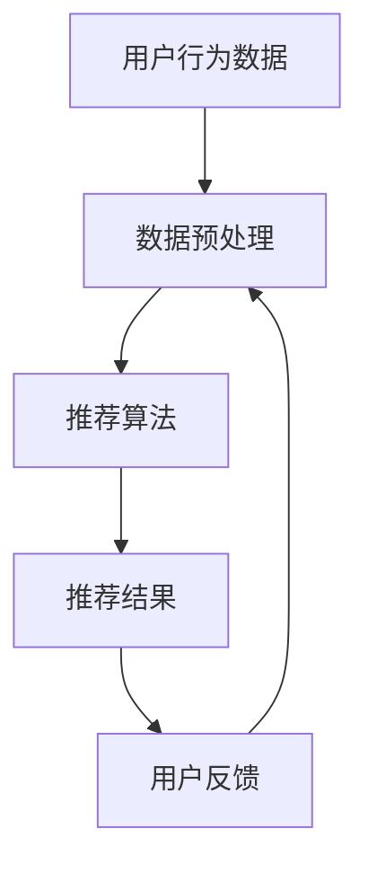
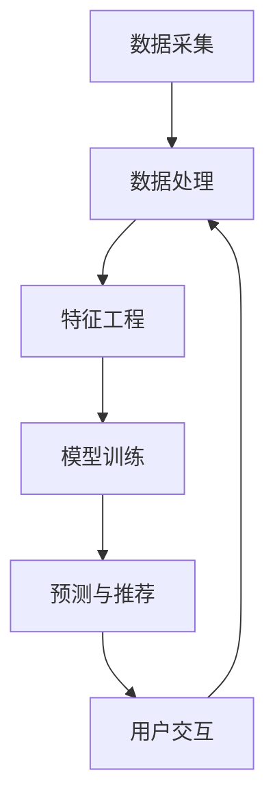
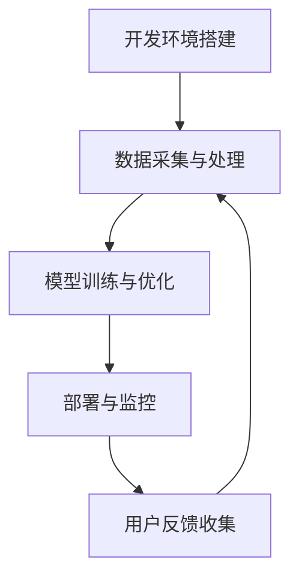

                 


## # AI Agent 在企业精准营销与个性化推荐中的深度应用

> 关键词：人工智能，AI Agent，精准营销，个性化推荐，深度学习，推荐系统

摘要：随着大数据和人工智能技术的快速发展，AI Agent 已成为企业精准营销和个性化推荐的重要工具。本文首先介绍了AI Agent 的核心概念和其在企业中的应用场景，随后详细探讨了AI Agent 在精准营销和个性化推荐中的实际应用，以及其背后的系统架构与实现。通过案例分析，本文揭示了AI Agent 的潜力及其对企业营销的深远影响。最后，本文总结了最佳实践，并展望了未来的发展趋势。

## # 背景与概述

### # 1. 人工智能与营销推荐概述

随着互联网和移动互联网的普及，大数据和人工智能技术迅速发展，为企业的营销策略带来了前所未有的变革。人工智能（AI）以其强大的数据处理和分析能力，正在深刻地改变着营销和推荐系统的运作方式。

在营销领域，人工智能主要通过数据分析和机器学习算法，帮助企业更好地理解客户需求，实现精准营销。通过分析大量的用户数据，AI 可以识别出潜在客户，预测客户行为，从而为企业提供个性化的营销方案。

个性化推荐系统则是利用人工智能技术，根据用户的兴趣和行为，为其推荐最相关的内容或商品。这种推荐方式不仅提高了用户体验，也大大提升了企业的销售额。

### # 2. 企业精准营销的挑战与机遇

随着市场竞争的加剧，企业面临着越来越多的挑战：

- **数据爆炸性增长**：企业积累了海量的用户数据，但如何有效地利用这些数据成为一大难题。
- **客户需求多变**：消费者需求日益多样化，如何快速响应并满足这些需求成为关键。
- **竞争压力**：竞争对手也在积极采用新技术，如何保持竞争优势成为企业急需解决的问题。

与此同时，人工智能为这些挑战提供了新的机遇：

- **精准营销**：通过AI技术，企业可以更准确地了解客户需求，实现个性化的营销策略。
- **高效决策**：AI可以帮助企业从海量数据中快速提取有价值的信息，为决策提供支持。
- **降低成本**：AI技术可以自动化许多营销任务，降低人力成本。

## # AI Agent 基础知识

### # 1. AI Agent 核心概念与原理

AI Agent，即人工智能代理，是一种基于人工智能技术的自主系统，它可以模拟人类思维过程，具备学习、推理、决策和交互能力。AI Agent 通常由以下几部分组成：

- **感知模块**：负责获取外部环境的信息，如文本、图像、声音等。
- **知识库**：存储AI Agent 的知识，包括事实、规则和先验知识。
- **推理模块**：利用知识库中的信息进行逻辑推理，以解决问题或做出决策。
- **决策模块**：基于推理结果，选择最优的行动策略。
- **行动模块**：执行决策，与外部环境进行交互。

### # 2. AI Agent 技术发展与应用现状

AI Agent 技术的发展可以追溯到20世纪50年代，随着计算机科学和人工智能技术的不断进步，AI Agent 逐渐从理论走向实际应用。目前，AI Agent 在许多领域已经取得了显著的成果：

- **智能家居**：通过感知模块获取家庭环境信息，AI Agent 可以自动化控制家电，提高生活质量。
- **虚拟助手**：如Siri、Alexa等，它们可以回答用户的问题，执行简单的任务。
- **智能制造**：AI Agent 可以在生产线中自主监控设备状态，进行故障诊断和预测维护。

在营销领域，AI Agent 被广泛应用于：

- **个性化推荐**：通过分析用户行为数据，AI Agent 可以推荐用户可能感兴趣的商品或内容。
- **客户服务**：AI Agent 可以通过聊天机器人提供24/7的客户服务，提高客户满意度。
- **市场调研**：AI Agent 可以自动收集和分析市场数据，为营销策略提供支持。

## # 精准营销中的 AI Agent 应用

### # 1. 数据采集与处理

在精准营销中，数据是核心。AI Agent 的第一个任务是高效地采集和处理数据。这包括：

- **用户行为数据**：如浏览历史、购买记录、点击率等。
- **社交媒体数据**：如微博、微信、Instagram等平台上的用户互动数据。
- **市场数据**：如行业趋势、竞争对手信息等。

数据采集后，AI Agent 需要对其进行清洗、去重和标准化处理，以便后续的分析和应用。

### # 2. 客户行为分析与预测

通过对采集到的数据进行分析，AI Agent 可以了解客户的行为习惯和偏好。这包括：

- **用户画像**：基于用户行为数据，构建用户画像，了解用户的兴趣爱好、购买能力等。
- **行为预测**：利用机器学习算法，预测用户未来的行为，如购买倾向、流失风险等。

这种行为分析不仅有助于企业制定个性化的营销策略，还可以优化广告投放，提高营销效果。

### # 3. 精准营销策略

基于客户行为分析和预测，AI Agent 可以帮助制定以下精准营销策略：

- **个性化广告**：根据用户的兴趣和行为，投放个性化的广告。
- **精准促销**：针对高价值客户，提供个性化的促销活动。
- **客户留存**：通过分析客户流失风险，提供针对性的客户留存策略。

这些策略不仅提高了营销效果，还大大降低了营销成本。

## # 个性化推荐中的 AI Agent 应用

### # 1. 推荐算法原理与实现

个性化推荐的核心在于如何根据用户的行为和偏好，为其推荐最相关的内容或商品。常用的推荐算法包括：

- **协同过滤**：通过分析用户之间的相似性，推荐用户可能喜欢的商品。
- **基于内容的推荐**：通过分析商品的内容特征，推荐用户可能感兴趣的商品。
- **混合推荐**：结合协同过滤和基于内容的推荐，提供更准确的推荐结果。

以下是一个简单的协同过滤算法的Python代码示例：

```python
class CollaborativeFiltering:
    def __init__(self, similarity_threshold=0.5):
        self.similarity_threshold = similarity_threshold

    def train(self, ratings):
        self.user_item_similarity = self.compute_similarity(ratings)

    def compute_similarity(self, ratings):
        # 计算用户之间的相似性
        pass

    def recommend(self, user_id, candidate_items, k=5):
        # 根据用户之间的相似性，为用户推荐商品
        pass
```

### # 2. 推荐系统设计与优化

个性化推荐系统的设计需要考虑以下几个方面：

- **数据预处理**：对用户行为数据进行清洗、去重和标准化处理。
- **推荐算法选择**：根据业务需求和数据特点，选择合适的推荐算法。
- **推荐结果评估**：通过评估指标（如准确率、召回率、覆盖率等）评估推荐系统的性能。
- **系统优化**：根据评估结果，不断优化推荐算法和系统架构，提高推荐效果。

以下是一个简单的推荐系统架构图：



### # 3. 个性化推荐应用

个性化推荐在多个领域都有广泛应用，如电商、媒体、社交网络等。以下是一个电商平台的个性化推荐应用案例：

- **商品推荐**：根据用户的历史购买记录和浏览行为，为用户推荐可能感兴趣的商品。
- **内容推荐**：根据用户的兴趣爱好，为用户推荐相关的内容，如文章、视频等。
- **广告推荐**：根据用户的兴趣和行为，为用户推荐最相关的广告。

这些个性化推荐应用不仅提高了用户的满意度，也大大提升了企业的销售额。

## # AI Agent 的系统架构与实现

### # 1. 系统架构设计

AI Agent 的系统架构通常包括以下几个核心模块：

- **数据采集模块**：负责从不同的数据源（如数据库、API等）采集数据。
- **数据处理模块**：负责对采集到的数据进行清洗、去重、标准化等处理。
- **特征工程模块**：负责提取数据中的关键特征，为后续的算法训练提供支持。
- **模型训练模块**：负责使用机器学习算法训练模型，包括监督学习、无监督学习和强化学习等。
- **预测与推荐模块**：基于训练好的模型，为用户提供个性化的预测和推荐。
- **用户交互模块**：负责与用户进行交互，收集用户反馈，优化推荐效果。

以下是一个简单的AI Agent 系统架构图：



### # 2. 系统实现与部署

系统实现与部署包括以下几个方面：

- **开发环境搭建**：搭建开发环境，包括代码仓库、开发工具、测试环境等。
- **数据采集与处理**：编写数据采集和处理脚本，确保数据的质量和一致性。
- **模型训练与优化**：使用机器学习框架（如TensorFlow、PyTorch等）进行模型训练和优化。
- **部署与监控**：将训练好的模型部署到生产环境，并监控系统的运行状态和性能。
- **用户反馈收集**：收集用户反馈，用于模型优化和系统改进。

以下是一个简单的AI Agent 系统实现流程：



## # 实际案例剖析

### # 1. 案例背景

某大型电商平台希望通过引入AI Agent，提高用户满意度，增加销售额。具体需求包括：

- **个性化商品推荐**：根据用户的浏览历史和购买记录，为用户推荐最相关的商品。
- **精准营销活动**：为高价值客户推送个性化的促销活动。
- **客户服务**：通过聊天机器人提供24/7的客户服务。

### # 2. 系统设计与实现

系统架构设计如下：

- **数据采集模块**：通过API从电商平台的数据仓库中采集用户行为数据，包括浏览历史、购买记录、评论等。
- **数据处理模块**：对采集到的数据进行分析和清洗，提取关键特征，如用户ID、商品ID、评分、浏览时间等。
- **特征工程模块**：根据业务需求，对特征进行编码、标准化等处理，以便后续的模型训练。
- **模型训练模块**：使用TensorFlow框架，训练用户行为预测模型和个性化推荐模型。
- **预测与推荐模块**：基于训练好的模型，实时为用户推荐商品和推送促销活动。
- **用户交互模块**：通过聊天机器人与用户进行交互，收集用户反馈，用于模型优化。

### # 3. 项目小结

通过该项目，电商平台取得了以下成果：

- **用户满意度显著提升**：个性化推荐和精准营销活动提高了用户的购物体验，用户满意度显著提升。
- **销售额大幅增长**：个性化推荐和精准营销活动促进了用户的购买行为，销售额大幅增长。
- **客户服务效率提高**：聊天机器人提供了高效的客户服务，客户问题解决率提高，服务效率提升。

### # 4. 案例分析

该案例的成功主要归因于以下几个方面：

- **数据驱动**：通过全面的数据采集和处理，为模型训练提供了丰富的数据支持，确保了推荐和营销策略的准确性。
- **技术先进**：采用TensorFlow等先进的机器学习框架，提高了模型训练和优化的效率。
- **用户导向**：始终关注用户需求，通过个性化推荐和精准营销，提高了用户的购物体验和满意度。
- **持续优化**：不断收集用户反馈，优化推荐和营销策略，确保系统的持续改进。

## # 最佳实践与未来展望

### # 1. 最佳实践

在实际应用中，以下最佳实践有助于确保AI Agent 在企业精准营销和个性化推荐中的有效应用：

- **数据质量优先**：确保数据的质量和一致性，是成功的关键。
- **模型持续优化**：定期收集用户反馈，优化模型参数和算法，提高推荐和预测的准确性。
- **用户体验至上**：始终关注用户需求，设计个性化的推荐和营销策略，提高用户满意度。
- **技术持续创新**：紧跟技术发展趋势，采用先进的算法和技术，保持竞争优势。

### # 2. 未来展望

未来，AI Agent 在企业精准营销和个性化推荐中的应用有望实现以下发展趋势：

- **智能化水平提升**：随着人工智能技术的不断进步，AI Agent 的智能化水平将大幅提升，能够更好地理解用户需求和提供个性化服务。
- **跨平台整合**：实现不同平台之间的数据整合和推荐协同，提供更加统一的用户体验。
- **隐私保护**：在保护用户隐私的前提下，充分利用用户数据，提高推荐和营销效果。
- **人工智能伦理**：关注人工智能伦理问题，确保AI Agent 的决策和推荐公平、透明。

### # 3. 注意事项

在实际应用中，以下注意事项有助于避免潜在的问题：

- **数据安全**：确保用户数据的安全，防止数据泄露和滥用。
- **算法偏见**：避免算法偏见，确保推荐和营销策略的公平性。
- **法律法规**：遵守相关法律法规，确保企业的合规运营。

### # 4. 拓展阅读

- **推荐系统经典书籍**：《推荐系统实践》、《Recommender Systems Handbook》
- **机器学习相关资源**：《深度学习》、《Python机器学习》
- **数据科学社区**：Kaggle、DataCamp、Coursera

## # 结论

AI Agent 在企业精准营销与个性化推荐中的应用，正引领着营销和推荐系统的变革。通过深入分析用户行为，AI Agent 为企业提供了精准的营销策略和个性化的推荐服务，不仅提高了用户满意度，也显著提升了企业的销售额。随着人工智能技术的不断发展，AI Agent 的应用前景将更加广阔，为企业创造更大的价值。

