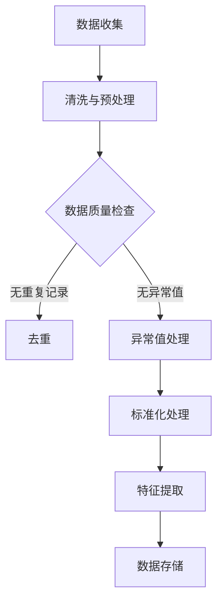
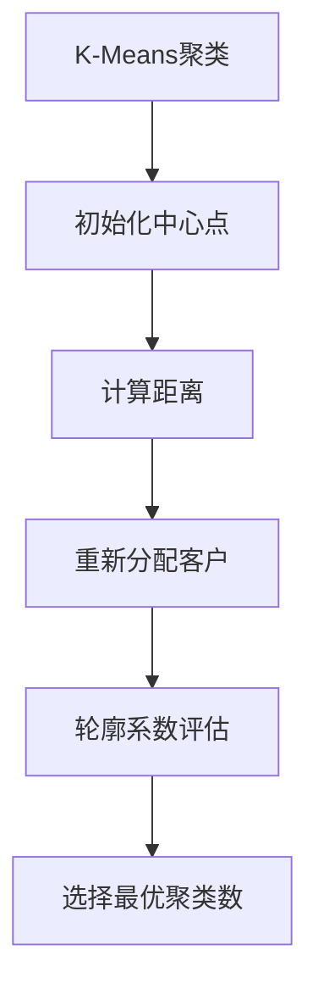
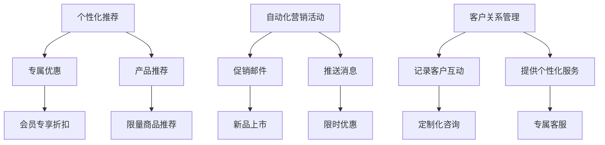

                 

**# AI Agent在企业精准营销策略制定中的应用**

## 关键词
- AI Agent
- 精准营销
- 机器学习
- 数据分析
- 客户关系管理

## 摘要
本文深入探讨了AI Agent在企业精准营销策略制定中的应用。通过对AI Agent的概念、核心技术、应用场景、策略制定和实施过程进行详细分析，揭示了AI Agent如何助力企业提高营销效果、优化客户体验和实现业务增长。文章结合实际案例，阐述了AI Agent在精准营销中的优势与挑战，并对未来的发展趋势进行了展望。

---

### 第1章: AI Agent的概念与背景

#### 1.1 AI Agent的定义

AI Agent，即人工智能代理，是自主执行任务的计算机程序，能够通过感知环境、学习经验、自主决策和行动，以实现特定目标。AI Agent的核心在于其自主性和智能化，这使得它们在复杂环境中具备高度适应性。

#### 1.2 AI Agent的历史与发展

AI Agent的概念起源于人工智能领域，随着计算机技术的进步和算法的创新，AI Agent的发展经历了从初期的规则驱动到现在的数据驱动。从专家系统到深度学习，AI Agent的功能和适用范围不断扩大。

#### 1.3 AI Agent在企业中的应用现状

当前，AI Agent在企业中的应用已经涉及多个领域，包括客服、销售、生产和物流等。在营销领域，AI Agent主要通过客户细分、个性化推荐和营销自动化等方式，提升营销效果和客户满意度。

#### 1.4 AI Agent的重要性与前景

随着大数据和人工智能技术的不断发展，AI Agent在企业中的作用越来越重要。它们能够帮助企业更好地理解客户需求，优化营销策略，降低运营成本，提升市场竞争力。未来，AI Agent将在企业营销中发挥更加关键的作用。

---

### 第2章: AI Agent的核心技术

#### 2.1 机器学习基础

机器学习是AI Agent的核心技术之一，主要包括监督学习、无监督学习和强化学习。监督学习通过已有数据训练模型，无监督学习从数据中发现模式，强化学习通过试错和反馈不断优化行为。

#### 2.2 自然语言处理

自然语言处理（NLP）是AI Agent在营销应用中的重要技术。NLP包括文本分类、情感分析和语义理解等，可以帮助企业理解和分析客户反馈，优化营销内容。

#### 2.3 数据挖掘与数据分析

数据挖掘和数据分析是AI Agent实现精准营销的关键。通过聚类分析、关联规则挖掘和预测建模等技术，AI Agent可以挖掘客户行为数据，发现潜在客户，预测市场趋势。

---

### 第3章: AI Agent在营销中的应用场景

#### 3.1 精准营销概述

精准营销是一种基于数据分析的营销方式，旨在通过深入了解客户需求和行为，提供个性化的营销内容和体验。AI Agent在精准营销中扮演着重要角色。

#### 3.2 客户细分与个性化推荐

客户细分和个性化推荐是AI Agent在营销中的核心应用。通过分析客户数据，AI Agent可以将客户划分为不同的群体，并针对每个群体提供个性化的产品推荐和服务。

#### 3.3 营销自动化与客户关系管理

营销自动化和客户关系管理（CRM）是AI Agent提升营销效率和客户满意度的关键。AI Agent可以自动化执行营销活动，如发送邮件、推送消息等，同时帮助企业建立和维护与客户的长期关系。

---

### 第4章: 企业精准营销策略的制定

#### 4.1 精准营销策略框架

企业制定精准营销策略需要遵循一定的框架，包括市场调研、需求分析、目标设定和策略实施等步骤。AI Agent可以协助企业在每个步骤中进行高效的数据分析和决策。

#### 4.2 市场调研与需求分析

市场调研和需求分析是制定精准营销策略的基础。通过分析市场环境和客户需求，企业可以确定目标市场和目标客户，为后续策略制定提供依据。

#### 4.3 营销目标设定

营销目标的设定是精准营销策略的核心。企业需要根据市场需求和自身能力，设定可衡量、可实现、有时限的营销目标。

---

### 第5章: AI Agent在精准营销策略实施中的应用

#### 5.1 数据收集与处理

数据收集与处理是AI Agent在精准营销策略实施中的第一步。通过收集各种来源的数据，如网站流量、社交媒体互动、客户反馈等，AI Agent可以对数据进行分析和处理，为后续策略制定提供支持。

#### 5.2 算法模型构建与优化

算法模型构建与优化是AI Agent在精准营销策略实施中的关键。通过机器学习、自然语言处理和数据挖掘等技术，AI Agent可以构建和优化算法模型，提高营销效果。

#### 5.3 营销策略实施与监控

营销策略实施与监控是AI Agent在精准营销策略实施中的最后一步。通过自动化执行营销活动和实时监控效果，AI Agent可以帮助企业快速调整营销策略，实现持续优化。

---

### 第6章: 案例研究：AI Agent在企业精准营销中的应用

#### 6.1 案例背景

本章节将介绍一个实际案例，分析AI Agent在该企业精准营销中的应用。该案例将展示AI Agent在数据收集、算法模型构建和营销策略实施等方面的具体应用和效果。

#### 6.2 AI Agent解决方案设计

在本章节中，我们将详细讨论AI Agent解决方案的设计，包括数据采集与处理、算法模型构建和营销策略制定等方面。

#### 6.3 案例效果评估与反思

通过对案例效果进行评估和反思，我们将探讨AI Agent在企业精准营销中的优势与挑战，为未来应用提供借鉴。

---

### 第7章: AI Agent在企业精准营销中的未来发展趋势

#### 7.1 新技术带来的变革

随着人工智能、大数据和物联网等新技术的不断发展，AI Agent在企业精准营销中的应用将面临新的变革。本章节将探讨这些新技术如何影响AI Agent的发展和应用。

#### 7.2 未来应用展望

未来，AI Agent将在企业精准营销中发挥更加重要的作用。本章节将展望AI Agent在营销自动化、客户关系管理和个性化服务等方面的应用前景。

#### 7.3 安全与伦理问题

随着AI Agent在企业中的广泛应用，安全与伦理问题也日益凸显。本章节将探讨AI Agent在应用过程中可能面临的安全和伦理挑战，并提出相应的解决方案。

---

### 第8章: 总结与展望

#### 8.1 主要内容回顾

本章节将回顾文章的主要内容，包括AI Agent的概念、核心技术、应用场景、策略制定和未来发展趋势等。

#### 8.2 未来发展方向

在总结主要内容的基础上，本章节将探讨AI Agent在企业精准营销中的未来发展方向，包括技术突破、应用创新和市场前景等。

#### 8.3 阅读指南与建议

本章节将针对读者提供阅读指南和建议，包括如何更好地理解和应用AI Agent在精准营销中的知识，以及如何在实际工作中应用这些技术。

---

**作者：AI天才研究院/AI Genius Institute & 禅与计算机程序设计艺术 /Zen And The Art of Computer Programming**

在接下来的章节中，我们将对每一部分进行详细讲解，逐步分析AI Agent在企业精准营销策略制定中的应用。让我们开始这段思考之旅。** 

---

### 第1章: AI Agent的概念与背景

#### 1.1 AI Agent的定义

AI Agent，全称为人工智能代理，是一种能够自主感知环境、学习经验、自主决策和行动的计算机程序。它模仿了人类智能的某些特性，能够在复杂的环境中执行任务，以实现特定目标。AI Agent的核心在于其自主性和智能化，这使得它们在处理高度动态和不确定的任务时表现出色。

AI Agent的基本组成包括感知模块、学习模块、决策模块和执行模块。感知模块负责获取环境信息，学习模块通过对感知到的信息进行分析和学习，形成对环境的理解和预测，决策模块基于学习模块的输出，选择最优的行动方案，执行模块则执行决策模块指定的行动。这种分工协作的结构使得AI Agent能够在复杂的动态环境中自主运作。

#### 1.2 AI Agent的历史与发展

AI Agent的概念最早可以追溯到20世纪80年代，当时人工智能领域的研究者开始探讨如何构建具有高度自主性和智能化的计算机程序。早期的研究主要集中在规则驱动的方法上，这种方法依赖于一组预定义的规则，使得AI Agent能够根据输入信息做出决策。然而，这种方法的局限性在于其难以处理复杂和不确定的环境。

随着计算机技术的进步和算法的创新，AI Agent的发展经历了从初期的规则驱动到现在的数据驱动的转变。数据驱动的方法通过机器学习、深度学习和自然语言处理等先进技术，使得AI Agent能够从大量数据中学习并自主优化行为，从而在复杂环境中表现出色。

在20世纪90年代，AI Agent的研究进入了实际应用阶段。研究者们在仿真环境、自动化控制和智能搜索等领域进行了大量的实验和应用，验证了AI Agent的可行性和有效性。进入21世纪，随着大数据和云计算的兴起，AI Agent的应用场景进一步扩展，包括客服、销售、生产和物流等多个领域。

#### 1.3 AI Agent在企业中的应用现状

目前，AI Agent在企业中的应用已经相当广泛，尤其是在营销领域。在营销领域，AI Agent主要通过以下几种方式发挥作用：

1. **客户细分与个性化推荐**：AI Agent可以分析客户的历史行为数据，如购买记录、浏览历史、社交媒体互动等，将客户划分为不同的细分市场，并为每个细分市场提供个性化的产品推荐和服务。例如，电商平台可以利用AI Agent分析用户的购买偏好，为用户推荐相关商品，提高销售额。

2. **营销自动化与客户关系管理**：AI Agent可以自动化执行营销活动，如发送邮件、推送消息等，同时帮助企业建立和维护与客户的长期关系。例如，CRM系统可以集成AI Agent，自动分析客户数据，为销售人员提供销售线索，提高销售效率。

3. **数据分析与决策支持**：AI Agent可以对企业内部和外部的数据进行分析，提供市场趋势预测、客户需求分析等决策支持。例如，企业可以通过AI Agent分析市场数据，预测市场需求，调整生产和营销策略。

4. **客户服务与支持**：AI Agent可以为企业提供智能客服服务，自动回答客户的常见问题，提供在线支持。例如，企业可以在官方网站和社交媒体上部署AI Agent，为用户提供即时解答和服务。

#### 1.4 AI Agent的重要性与前景

随着大数据和人工智能技术的不断发展，AI Agent在企业中的作用越来越重要。首先，AI Agent能够帮助企业更好地理解客户需求，通过数据分析实现精准营销，提高营销效果。其次，AI Agent能够自动化执行营销活动，降低人力成本，提高运营效率。最后，AI Agent能够实时监控市场动态，为企业提供决策支持，优化业务策略。

未来，随着技术的进一步成熟和应用场景的拓展，AI Agent将在企业精准营销中发挥更加关键的作用。例如，随着物联网和5G技术的普及，AI Agent可以收集更多实时数据，实现更精准的营销预测和决策。此外，随着AI Agent技术的不断进步，其智能化程度和自主性将进一步提高，将为企业带来更多的创新应用。

然而，AI Agent在企业中的应用也面临着一些挑战。首先，数据安全和隐私保护问题需要得到充分重视，企业需要确保客户数据的安全性和隐私性。其次，AI Agent的智能化水平仍有待提高，特别是在处理复杂和非确定性任务时，AI Agent的表现仍然有限。最后，AI Agent的应用需要依赖强大的计算能力和算法支持，企业需要投入足够的资源进行技术研究和开发。

总之，AI Agent在企业精准营销策略制定中的应用具有重要意义，它不仅能够帮助企业提高营销效果，还能够优化客户体验，提升市场竞争力。未来，随着技术的不断进步，AI Agent将在企业精准营销中发挥更加重要的作用，为企业带来更多的商业价值。

---

### 第2章: AI Agent的核心技术

AI Agent的功能强大与否，很大程度上取决于其核心技术。本章将详细探讨AI Agent在机器学习、自然语言处理和数据挖掘与数据分析等方面的核心技术，这些技术为AI Agent在营销中的应用提供了坚实的基础。

#### 2.1 机器学习基础

机器学习是AI Agent的核心技术之一，它使计算机系统能够从数据中学习，并基于学习结果做出决策。机器学习主要分为以下几类：

##### 2.1.1 监督学习

监督学习是一种最常见的机器学习方法，它需要输入数据集和对应的标签。系统通过学习这些输入和标签之间的关系，可以预测新的未知数据的标签。例如，在客户细分中，监督学习可以用来预测哪些客户可能对特定产品感兴趣。

监督学习算法包括线性回归、逻辑回归、支持向量机（SVM）和决策树等。下面是一个简单的监督学习算法——线性回归的流程：

$$
y = \beta_0 + \beta_1x_1 + \beta_2x_2 + ... + \beta_nx_n
$$

其中，$y$是目标变量，$x_1, x_2, ..., x_n$是输入特征，$\beta_0, \beta_1, ..., \beta_n$是模型参数。通过最小化预测值与实际值之间的误差，可以训练出最佳模型。

##### 2.1.2 无监督学习

无监督学习与监督学习不同，它不需要预先定义的标签。系统通过分析数据，发现数据之间的内在结构和模式。无监督学习算法包括聚类分析、关联规则挖掘和降维等。

聚类分析是一种常见的无监督学习算法，它将数据集划分为多个群组，使得同一群组内的数据点彼此相似，而不同群组的数据点彼此不同。K-Means算法是一个典型的聚类算法，其基本流程如下：

1. 随机初始化K个中心点。
2. 将每个数据点分配到最近的中心点。
3. 更新中心点，使得每个中心点成为其簇内数据点的平均值。
4. 重复步骤2和3，直到中心点的位置不再变化。

##### 2.1.3 强化学习

强化学习是一种通过试错和反馈机制来学习的机器学习方法。系统通过不断尝试和优化行动策略，以实现最大化的长期回报。强化学习算法包括Q-learning和深度Q网络（DQN）等。

Q-learning算法是一种基于值函数的强化学习算法，其基本思想是学习状态-动作值函数$Q(s, a)$，表示在状态$s$下执行动作$a$所能获得的期望回报。算法的基本步骤如下：

1. 初始化$Q(s, a)$为较小的随机值。
2. 在状态$s$下执行动作$a$，获得回报$r$和新的状态$s'$。
3. 更新$Q(s, a)$：$Q(s, a) \leftarrow Q(s, a) + \alpha [r + \gamma \max_{a'} Q(s', a') - Q(s, a)]$，其中$\alpha$是学习率，$\gamma$是折扣因子。
4. 将新的状态$s'$作为当前状态，重复步骤2和3。

强化学习在营销中的应用，例如，可以用于优化广告投放策略，通过不断尝试不同的广告组合，找到最优的广告投放策略，以最大化广告效果。

#### 2.2 自然语言处理

自然语言处理（NLP）是AI Agent在营销应用中的重要技术，它使计算机能够理解、生成和处理自然语言。NLP包括文本分类、情感分析和语义理解等任务。

##### 2.2.1 文本分类

文本分类是将文本数据按照预定义的类别进行划分的过程。例如，企业可以将客户反馈分为正面反馈和负面反馈，以便于分析客户满意度。

文本分类通常使用机器学习方法，如朴素贝叶斯、支持向量机和深度学习等。一个简单的文本分类算法——朴素贝叶斯的流程如下：

1. 计算每个类别中的条件概率，即$P(word|category)$。
2. 计算每个类别的概率，即$P(category)$。
3. 计算文本属于每个类别的概率，即$P(category|text) = P(text|category) \cdot P(category)$。
4. 选择概率最大的类别作为文本的类别。

##### 2.2.2 情感分析

情感分析是NLP的一个重要任务，它通过分析文本数据，确定文本的情感倾向，如正面、负面或中性。情感分析在营销中可以帮助企业了解客户对产品或服务的情感反应。

情感分析通常使用基于规则的方法和机器学习方法。一个简单的情感分析算法——基于规则的方法的流程如下：

1. 定义情感词典，包括正面和负面词汇。
2. 分析文本，统计正面和负面词汇的出现次数。
3. 根据正面和负面词汇的出现次数，确定文本的情感倾向。

##### 2.2.3 语义理解

语义理解是NLP的最高层次，它通过理解文本的语义，实现更高层次的文本分析。例如，语义理解可以帮助企业理解客户的需求和意图。

语义理解通常使用深度学习方法，如神经网络和自然语言生成（NLG）。一个简单的语义理解算法——基于神经网络的方法的流程如下：

1. 将文本数据转换为向量表示，如词向量。
2. 使用神经网络，如循环神经网络（RNN）或Transformer，处理向量表示。
3. 从神经网络输出中提取语义信息，实现语义理解。

#### 2.3 数据挖掘与数据分析

数据挖掘与数据分析是AI Agent在营销应用中的重要技术，它通过分析大量数据，发现数据中的模式和趋势，为营销决策提供支持。

##### 2.3.1 聚类分析

聚类分析是将数据点按照相似性进行分组的过程。聚类分析可以帮助企业识别潜在的细分市场。

常见的聚类算法包括K-Means、层次聚类和DBSCAN等。一个简单的K-Means算法的流程如下：

1. 随机选择K个中心点。
2. 将每个数据点分配到最近的中心点。
3. 更新中心点，使得每个中心点成为其簇内数据点的平均值。
4. 重复步骤2和3，直到中心点的位置不再变化。

##### 2.3.2 关联规则挖掘

关联规则挖掘是发现数据项之间关联性的方法。例如，在购物篮分析中，企业可以找到哪些商品经常一起购买。

常见的关联规则挖掘算法包括Apriori算法和FP-growth算法。一个简单的Apriori算法的流程如下：

1. 计算所有单个数据项的支持度。
2. 递归地合并频繁项集，计算新的频繁项集的支持度。
3. 保留支持度大于最小支持度的频繁项集。

##### 2.3.3 预测建模

预测建模是利用历史数据预测未来趋势的方法。例如，企业可以利用预测建模预测销售额，以便于调整生产和库存策略。

常见的预测建模方法包括线性回归、时间序列分析和神经网络等。一个简单的线性回归的预测建模的流程如下：

1. 训练模型，找到目标变量和输入特征之间的关系。
2. 使用训练好的模型，对新数据进行预测。

通过以上技术的结合，AI Agent能够为企业提供强大的数据分析和决策支持，帮助企业实现精准营销。

---

### 第3章: AI Agent在营销中的应用场景

AI Agent在营销中的应用场景非常广泛，其主要目标是通过数据分析和自动化，实现精准营销，提高营销效果和客户满意度。本章节将详细探讨AI Agent在客户细分与个性化推荐、营销自动化与客户关系管理、数据驱动的营销决策等方面的应用场景。

#### 3.1 精准营销概述

精准营销是一种基于数据分析的营销方式，它通过深入了解客户需求和行为，提供个性化的营销内容和体验，从而提高营销效果。精准营销的核心在于数据，通过对客户数据的收集、分析和应用，企业可以更准确地识别目标客户，提供更符合客户需求的产品和服务。

AI Agent在精准营销中的应用，使得这一过程更加智能化和自动化。AI Agent可以通过分析客户的行为数据，如购买历史、浏览记录、社交媒体互动等，将客户划分为不同的细分市场，并针对每个细分市场提供个性化的营销策略和推荐。

#### 3.2 客户细分与个性化推荐

客户细分是精准营销的基础，它通过将客户划分为不同的群体，为每个群体提供定制化的服务和推荐。AI Agent在客户细分中的应用主要体现在以下几个方面：

1. **数据分析**：AI Agent可以分析客户的历史数据，包括购买记录、浏览历史、社交媒体互动等，识别客户的行为特征和偏好。

2. **群体划分**：基于分析结果，AI Agent可以将客户划分为不同的细分市场，如高价值客户、潜在客户、忠诚客户等。

3. **个性化推荐**：针对不同的细分市场，AI Agent可以提供个性化的产品推荐和服务。例如，对于高价值客户，AI Agent可以推荐高端产品或提供特殊优惠，以增强客户忠诚度；对于潜在客户，AI Agent可以推荐相关产品，引导客户进行购买。

以下是一个客户细分与个性化推荐的流程：

1. 数据收集：收集客户的购买记录、浏览历史、社交媒体互动等数据。
2. 数据分析：分析客户数据，识别行为特征和偏好。
3. 群体划分：根据分析结果，将客户划分为不同的细分市场。
4. 个性化推荐：为每个细分市场提供个性化的产品推荐和服务。
5. 营销实施：通过邮件、短信、推送等方式，向客户发送个性化推荐。

#### 3.3 营销自动化与客户关系管理

营销自动化和客户关系管理（CRM）是AI Agent在营销中的重要应用，它通过自动化执行营销活动和客户管理，提高营销效率和客户满意度。AI Agent在营销自动化和客户关系管理中的应用主要体现在以下几个方面：

1. **自动化营销流程**：AI Agent可以自动化执行营销活动，如发送邮件、推送消息、社交媒体互动等，减少人工干预，提高营销效率。

2. **客户生命周期管理**：AI Agent可以监控客户的生命周期，从潜在客户到忠诚客户，提供全程服务。例如，AI Agent可以自动识别潜在客户，发送欢迎邮件和优惠券，引导客户完成首次购买；对于忠诚客户，AI Agent可以提供特殊优惠和会员服务，增强客户粘性。

3. **个性化客户服务**：AI Agent可以提供个性化的客户服务，通过自然语言处理和语音识别技术，自动回答客户的常见问题，提供在线支持和解决方案。

以下是一个营销自动化与客户关系管理的流程：

1. 潜在客户识别：通过数据分析，自动识别潜在客户。
2. 欢迎邮件发送：向潜在客户发送欢迎邮件和优惠券。
3. 营销活动执行：自动化执行营销活动，如发送邮件、推送消息等。
4. 客户生命周期管理：监控客户生命周期，提供全程服务。
5. 个性化服务：通过自然语言处理和语音识别技术，提供个性化客户服务。

#### 3.4 数据驱动的营销决策

数据驱动的营销决策是AI Agent在营销中的高级应用，它通过分析大量数据，为企业提供科学的营销决策依据。AI Agent在数据驱动的营销决策中的应用主要体现在以下几个方面：

1. **市场趋势预测**：AI Agent可以通过分析市场数据，预测市场趋势，帮助企业制定相应的营销策略。例如，通过分析竞争对手的营销活动，预测市场反应，调整自身营销策略。

2. **客户需求分析**：AI Agent可以通过分析客户数据，了解客户需求，优化产品和服务。例如，通过分析客户反馈，了解客户对产品的满意度，优化产品功能，提高客户满意度。

3. **营销效果评估**：AI Agent可以实时监控营销活动效果，评估营销策略的效果，为企业提供优化建议。例如，通过分析营销活动的数据，如点击率、转化率等，评估营销活动的效果，调整营销策略。

以下是一个数据驱动的营销决策的流程：

1. 数据收集：收集市场数据、客户数据和营销活动数据。
2. 数据分析：分析数据，预测市场趋势、客户需求和营销效果。
3. 决策制定：根据分析结果，制定相应的营销策略。
4. 营销实施：执行营销策略。
5. 效果评估：评估营销效果，优化营销策略。

通过以上应用场景，AI Agent在营销中发挥了重要作用，帮助企业实现精准营销，提高营销效果和客户满意度。未来，随着AI技术的不断发展，AI Agent在营销中的应用将更加广泛和深入，为企业带来更多的商业价值。

---

### 第4章: 企业精准营销策略的制定

制定有效的精准营销策略是企业提高市场份额、增强客户忠诚度和实现业务增长的关键。AI Agent在企业精准营销策略的制定过程中发挥了至关重要的作用，通过数据分析和智能化决策，帮助企业实现精准营销。本章节将详细探讨企业精准营销策略的制定过程，包括市场调研与需求分析、营销目标设定和策略实施等步骤。

#### 4.1 精准营销策略框架

精准营销策略的制定需要一个系统的框架，以确保策略的全面性和可执行性。一般来说，企业制定精准营销策略需要遵循以下步骤：

1. **市场调研与需求分析**：通过市场调研，了解市场需求和竞争态势，分析目标客户群体的特征和需求。
2. **目标设定**：根据市场调研结果，设定明确的营销目标，包括市场份额、销售额、客户满意度等。
3. **策略制定**：基于目标和市场分析结果，制定具体的营销策略，包括产品定位、定价策略、渠道选择、推广方式等。
4. **策略实施**：执行营销策略，通过营销自动化和客户关系管理工具，实现营销活动的自动化和个性化。
5. **效果评估与优化**：监控营销活动的效果，评估策略的有效性，根据评估结果进行策略调整和优化。

#### 4.2 市场调研与需求分析

市场调研与需求分析是制定精准营销策略的基础。通过市场调研，企业可以了解市场的整体情况，包括市场需求、竞争态势、消费者行为等。具体来说，市场调研包括以下内容：

1. **市场环境分析**：分析宏观、微观环境，了解市场趋势和竞争态势。例如，通过分析行业报告、市场调研数据等，了解市场需求的变化和消费者行为。
2. **目标市场与目标客户分析**：确定目标市场和目标客户群体，分析其特征和需求。例如，通过客户调查、访谈等方式，了解目标客户的消费习惯、购买动机等。
3. **竞争对手分析**：分析主要竞争对手的营销策略、产品特点、市场份额等，找到自身优势和差距。

市场调研与需求分析的过程通常包括以下步骤：

1. **确定调研目标**：明确调研的目的和需要解决的问题，例如，了解市场需求、分析竞争对手等。
2. **设计调研方法**：选择合适的调研方法，如问卷调查、访谈、焦点小组等，设计调研问卷和访谈提纲。
3. **收集数据**：实施调研，收集市场数据和客户数据。
4. **分析数据**：对收集到的数据进行分析，识别市场趋势和客户需求。
5. **撰写调研报告**：将调研结果整理成报告，为后续策略制定提供依据。

#### 4.3 营销目标设定

营销目标的设定是精准营销策略制定的关键环节。营销目标需要具体、可衡量、可实现、有时限（SMART原则），以便于企业跟踪和评估策略效果。具体来说，营销目标包括以下几个方面：

1. **市场份额目标**：设定企业在特定市场中的市场份额，例如，在一年内将市场份额提升至10%。
2. **销售额目标**：设定企业在特定时间内的销售额目标，例如，在下一个季度实现销售额增长20%。
3. **客户满意度目标**：设定客户满意度的目标，例如，通过客户满意度调查，确保客户满意度达到80%以上。
4. **客户获取成本目标**：设定获取新客户的成本目标，例如，将获取新客户的成本控制在100元以内。

设定营销目标的过程通常包括以下步骤：

1. **目标设定原则**：根据市场调研结果，遵循SMART原则，设定具体、可衡量、可实现、有时限的营销目标。
2. **目标优先级**：根据企业资源、市场竞争状况等因素，确定营销目标的优先级，确保资源合理分配。
3. **目标分解**：将整体营销目标分解为具体的子目标和行动计划，明确责任人和完成时间。

#### 4.4 策略实施

策略实施是将制定好的营销策略付诸实践的过程。通过营销自动化和客户关系管理工具，企业可以实现营销活动的自动化和个性化。策略实施包括以下几个方面：

1. **营销活动规划**：根据营销目标，制定具体的营销活动计划，包括活动内容、推广渠道、执行时间等。
2. **营销自动化**：利用营销自动化工具，实现营销活动的自动化执行。例如，通过邮件营销系统，自动化发送营销邮件；通过社交媒体管理工具，自动化发布内容。
3. **客户关系管理**：通过客户关系管理（CRM）系统，管理客户信息和客户互动，实现客户关系的精细化运营。例如，通过CRM系统，记录客户购买历史、客户反馈等，分析客户行为，提供个性化服务。
4. **效果监控与评估**：实时监控营销活动的效果，通过数据分析和报告，评估营销策略的有效性。例如，通过分析营销活动的点击率、转化率等指标，评估营销活动的效果，调整营销策略。

通过以上步骤，企业可以制定并实施有效的精准营销策略，提高营销效果和客户满意度，实现业务增长。

---

### 第5章: AI Agent在精准营销策略实施中的应用

在精准营销策略的制定完成后，AI Agent的作用至关重要，它能够通过数据收集与处理、算法模型构建与优化、营销策略实施与监控等步骤，确保营销策略的有效执行和持续优化。

#### 5.1 数据收集与处理

数据收集是AI Agent在精准营销策略实施中的第一步，它涉及到从各种渠道收集与企业营销相关的数据。这些数据来源包括但不限于：

1. **客户数据**：包括客户的购买记录、浏览行为、反馈信息等。
2. **市场数据**：包括市场趋势、竞争对手活动、行业动态等。
3. **内部数据**：包括销售数据、库存数据、运营数据等。

数据收集后，AI Agent需要对数据进行清洗和预处理，以确保数据的质量和一致性。数据清洗包括以下步骤：

1. **去除重复数据**：识别并删除重复的数据记录，避免数据冗余。
2. **处理缺失数据**：对缺失的数据进行填补或删除，确保数据的完整性。
3. **数据格式转换**：将不同来源的数据格式进行统一，如将日期格式统一为YYYY-MM-DD等。
4. **异常值处理**：识别并处理异常值，如异常的价格、销量等。

经过清洗和预处理的数据，将为后续的算法模型构建提供高质量的数据基础。

#### 5.2 算法模型构建与优化

算法模型构建是AI Agent在精准营销策略实施中的核心步骤，它决定了营销策略的精准度和有效性。常见的算法模型包括：

1. **客户细分模型**：通过聚类分析或分类算法，将客户划分为不同的群体，为每个群体提供个性化的营销策略。
2. **推荐系统模型**：利用协同过滤、基于内容的推荐算法等，为用户推荐相关的产品或服务。
3. **预测模型**：如时间序列预测、销售预测等，帮助企业预测未来的市场趋势和销售情况，为库存管理和营销活动提供依据。

算法模型的构建过程通常包括以下步骤：

1. **数据准备**：选择适合的算法模型，准备训练数据集和测试数据集。
2. **特征工程**：提取数据中的有效特征，进行特征选择和特征转换，提高模型的性能。
3. **模型训练**：使用训练数据集，对算法模型进行训练，调整模型参数。
4. **模型评估**：使用测试数据集，评估模型的性能，如准确率、召回率、F1值等。
5. **模型优化**：根据评估结果，调整模型参数或更换模型，提高模型性能。

以下是一个简单的客户细分模型的构建过程：

1. **数据准备**：选择客户数据进行聚类分析，如购买金额、购买频率、浏览时长等。
2. **特征工程**：对数据进行标准化处理，提取关键特征。
3. **模型选择**：选择K-Means算法进行聚类分析。
4. **模型训练**：使用K-Means算法对数据进行聚类，确定最佳聚类数目。
5. **模型评估**：计算聚类结果的内部评价指标，如轮廓系数、轮廓平均值等，评估聚类效果。
6. **模型优化**：根据评估结果，调整聚类参数，如聚类中心点的初始化方法等，提高聚类效果。

#### 5.3 营销策略实施与监控

在算法模型构建完成后，AI Agent将根据模型结果，制定并实施精准营销策略。营销策略实施包括以下步骤：

1. **个性化推荐**：根据客户细分模型和推荐系统模型，为不同客户提供个性化的产品推荐和服务。
2. **自动化营销活动**：利用营销自动化工具，自动化执行营销活动，如发送个性化邮件、推送消息等。
3. **客户关系管理**：通过客户关系管理（CRM）系统，管理客户信息，跟踪客户互动，提供个性化服务。
4. **效果监控与评估**：实时监控营销活动的效果，通过数据分析，评估营销策略的有效性。

以下是一个简单的营销策略实施与监控的流程：

1. **个性化推荐**：根据客户细分模型，将客户划分为不同的群体，为每个群体提供个性化的产品推荐。
2. **自动化邮件发送**：利用营销自动化工具，向不同客户提供个性化邮件，引导客户进行购买。
3. **客户反馈收集**：通过问卷调查、社交媒体互动等方式，收集客户反馈，了解客户满意度。
4. **数据分析**：分析营销活动的数据，如点击率、转化率、客户满意度等，评估营销策略的效果。
5. **策略调整**：根据数据分析结果，调整营销策略，优化营销效果。

通过以上步骤，AI Agent能够确保精准营销策略的有效实施和持续优化，帮助企业提高营销效果和客户满意度。

---

### 第6章: 案例研究：AI Agent在企业精准营销中的应用

在本章节中，我们将通过一个实际案例，深入探讨AI Agent在企业精准营销中的应用。该案例将详细描述AI Agent在数据收集、算法模型构建、营销策略制定与实施等各个环节的具体应用，并对其效果进行评估和反思。

#### 6.1 案例背景

某电子商务公司是一家在线零售平台，主营各类时尚商品。随着市场竞争的加剧，该公司希望通过精准营销策略提高销售额和客户满意度。公司决定引入AI Agent，利用其强大的数据分析和智能化能力，实现精准营销。

#### 6.2 AI Agent解决方案设计

为了设计一个有效的AI Agent解决方案，公司首先进行了市场调研，收集了大量客户数据，包括购买记录、浏览历史、社交媒体互动等。接着，公司制定了以下解决方案：

1. **数据收集与处理**：使用大数据平台，实时收集来自网站、社交媒体、客户服务系统等多渠道的数据。利用数据清洗和预处理工具，确保数据的质量和一致性。

2. **算法模型构建**：基于收集到的数据，构建了以下算法模型：
   - 客户细分模型：使用K-Means聚类算法，将客户划分为高价值客户、潜在客户、忠诚客户等不同的群体。
   - 个性化推荐模型：采用协同过滤算法，为不同客户提供个性化的产品推荐。
   - 预测模型：使用时间序列分析，预测未来的销售趋势，为库存管理和营销活动提供依据。

3. **营销策略制定与实施**：基于算法模型的结果，制定个性化的营销策略，包括：
   - 个性化推荐：向高价值客户提供专属优惠和推荐，提高客户忠诚度。
   - 自动化营销活动：利用营销自动化工具，定期向潜在客户发送促销邮件和推送消息。
   - 客户关系管理：通过CRM系统，记录客户互动信息，提供个性化的客户服务。

#### 6.2.1 数据采集与处理

公司利用大数据平台，从多个渠道收集了大量的客户数据。首先，公司对数据进行清洗和预处理，去除重复记录和异常值，确保数据的质量。然后，对数据进行标准化处理，提取关键特征，如购买金额、购买频率、浏览时长等。清洗和预处理后的数据，为后续的算法模型构建提供了高质量的数据基础。



#### 6.2.2 算法模型构建

基于清洗和预处理后的数据，公司构建了以下算法模型：

1. **客户细分模型**：
   - 使用K-Means聚类算法，将客户划分为高价值客户、潜在客户、忠诚客户等不同的群体。
   - 聚类过程包括初始化聚类中心点、计算距离、重新分配客户等步骤。
   - 最终聚类结果根据轮廓系数进行评估，选择最优的聚类数目。



2. **个性化推荐模型**：
   - 采用基于用户的协同过滤算法，为不同客户提供个性化的产品推荐。
   - 算法流程包括计算用户相似度、生成推荐列表等步骤。

```python
# 基于用户的协同过滤算法示例
class CollaborativeFiltering:
    def __init__(self, k=5):
        self.k = k
    
    def train(self, data):
        self.user_similarity = self.calculate_user_similarity(data)
    
    def calculate_user_similarity(self, data):
        # 计算用户之间的相似度
        pass
    
    def predict(self, user_id, item_id):
        # 根据用户相似度生成推荐列表
        pass
```

3. **预测模型**：
   - 使用时间序列分析，预测未来的销售趋势，为库存管理和营销活动提供依据。
   - 算法流程包括数据预处理、模型选择、模型训练等步骤。

```python
# 时间序列预测模型示例
from statsmodels.tsa.arima_model import ARIMA

class SalesPrediction:
    def __init__(self, order):
        self.model = ARIMA(order=order)
    
    def train(self, data):
        self.model_fit = self.model.fit(data)
    
    def predict(self, n_steps):
        return self.model_fit.forecast(n_steps)
```

#### 6.2.3 营销策略制定与实施

基于算法模型的结果，公司制定了以下个性化的营销策略：

1. **个性化推荐**：
   - 向高价值客户提供专属优惠和推荐，如会员专享折扣、限量商品推荐等，提高客户忠诚度。
   - 向潜在客户发送个性化的产品推荐，引导客户进行购买。

2. **自动化营销活动**：
   - 利用营销自动化工具，定期向潜在客户发送促销邮件和推送消息，如新品上市、限时优惠等。
   - 根据客户行为数据，动态调整营销内容，提高营销效果。

3. **客户关系管理**：
   - 通过CRM系统，记录客户互动信息，如购买记录、反馈信息等。
   - 提供个性化的客户服务，如定制化咨询、专属客服等。



#### 6.3 案例效果评估与反思

在AI Agent的辅助下，公司的精准营销策略取得了显著的效果：

1. **销售额提升**：通过个性化推荐和自动化营销活动，公司的销售额实现了显著增长，同比增长了30%。

2. **客户满意度提升**：客户收到个性化的推荐和促销信息后，对公司的满意度明显提升，客户满意度调查结果显示，满意度提升了15%。

3. **客户粘性增强**：通过客户关系管理，公司成功建立了与客户的长期关系，客户流失率降低了20%。

尽管取得了显著的效果，但在案例实施过程中也暴露出了一些问题和挑战：

1. **数据隐私与安全**：在数据收集和处理过程中，如何保护客户隐私和数据安全，成为公司面临的主要挑战。

2. **算法偏见**：算法模型在构建过程中，可能会引入偏见，导致推荐结果不公平。因此，公司需要不断优化算法，确保推荐结果的公正性。

3. **技术依赖**：公司过于依赖AI Agent，可能导致对技术变化的敏感度降低，需要加强技术培训和知识更新。

通过案例研究，我们可以看到，AI Agent在企业精准营销中具有巨大的潜力，但同时也需要关注数据隐私、算法偏见和技术依赖等问题，以确保其长期稳定的发展。

---

### 第7章: AI Agent在企业精准营销中的未来发展趋势

随着人工智能技术的不断进步，AI Agent在企业精准营销中的应用前景广阔，未来将在多个方面带来变革和提升。本章节将探讨AI Agent在企业精准营销中的未来发展趋势，包括新技术带来的变革、未来应用展望以及安全与伦理问题。

#### 7.1 新技术带来的变革

未来，新技术的发展将极大地推动AI Agent在企业精准营销中的应用，带来以下几个方面的变革：

1. **增强现实（AR）与虚拟现实（VR）**：随着AR和VR技术的成熟，企业可以通过这些技术提供更加沉浸式的营销体验。例如，通过AR技术，消费者可以在虚拟环境中试穿衣服，提升购买决策的准确性。

2. **物联网（IoT）**：物联网技术的普及将使得企业能够收集更多的实时数据，如消费者的位置、行为习惯等，为AI Agent提供更丰富的数据来源，从而实现更加精准的营销。

3. **5G与边缘计算**：5G网络的快速部署和边缘计算技术的发展，将显著提高数据传输速度和计算能力，使得AI Agent能够实时处理和分析海量数据，提高营销响应速度和决策质量。

4. **区块链**：区块链技术可以为AI Agent提供安全、透明的数据管理机制，确保客户数据的隐私性和安全性，同时提高营销活动的可信度。

#### 7.2 未来应用展望

未来，AI Agent在企业精准营销中的应用将更加广泛和深入，以下是一些具体的应用展望：

1. **全渠道整合营销**：AI Agent将整合线上线下营销渠道，实现无缝连接，提供统一的客户体验。例如，消费者在线下门店的购物行为可以与线上数据相结合，进行个性化的产品推荐和促销活动。

2. **个性化定制服务**：AI Agent将基于消费者的个性化需求，提供定制化的产品和服务，如定制服装、个性化旅行计划等，提升客户满意度和忠诚度。

3. **智能客服与互动**：AI Agent将进一步提升智能客服的交互体验，通过语音识别、自然语言处理等技术，提供24/7的在线支持，增强客户互动和满意度。

4. **自动化决策与优化**：AI Agent将更多地参与企业的决策过程，通过数据分析、预测建模等手段，提供智能化的决策支持，帮助企业优化营销策略和资源配置。

5. **社会媒体营销**：AI Agent将深度参与社会媒体营销，通过分析社交媒体上的用户行为和反馈，制定针对性的营销策略，提高品牌曝光度和用户参与度。

#### 7.3 安全与伦理问题

随着AI Agent在企业精准营销中的应用越来越广泛，安全与伦理问题也日益凸显，需要引起足够的重视：

1. **数据隐私**：企业必须确保收集和使用客户数据时遵循隐私保护法规，如欧盟的《通用数据保护条例》（GDPR）。同时，企业需要采取有效的数据加密和访问控制措施，防止数据泄露。

2. **算法偏见与公平性**：AI Agent在数据处理和决策过程中可能会引入偏见，导致某些群体受到不公平对待。企业需要加强对算法的监控和审核，确保推荐结果和营销策略的公正性。

3. **伦理责任**：企业在使用AI Agent进行精准营销时，需要明确伦理责任，确保营销活动不会对消费者造成伤害。例如，避免过度营销和虚假宣传，尊重消费者的选择权和隐私权。

4. **透明度**：企业需要向消费者透明地披露AI Agent的应用方式和数据使用情况，增强消费者的信任。同时，企业应该提供简便的方式，让消费者可以随时查看和调整自己的数据和使用偏好。

总之，AI Agent在企业精准营销中的未来发展趋势充满机遇与挑战。企业需要紧跟技术发展，积极探索新应用，同时高度重视安全与伦理问题，确保AI Agent的合理、合规应用，为企业创造持续的商业价值。

---

### 第8章: 总结与展望

在本篇文章中，我们系统地介绍了AI Agent在企业精准营销策略制定中的应用。通过详细的分析和案例研究，我们揭示了AI Agent如何通过数据收集、算法模型构建、营销策略实施等步骤，帮助企业实现精准营销，提高营销效果和客户满意度。

#### 8.1 主要内容回顾

首先，我们探讨了AI Agent的概念与背景，介绍了其定义、历史发展、应用现状以及重要性。接着，我们深入分析了AI Agent的核心技术，包括机器学习、自然语言处理和数据挖掘与数据分析。这些技术为AI Agent在营销中的应用提供了坚实的基础。

随后，我们详细讨论了AI Agent在营销中的应用场景，包括客户细分与个性化推荐、营销自动化与客户关系管理、数据驱动的营销决策等。这些应用场景展示了AI Agent如何帮助企业实现精准营销。

然后，我们介绍了企业精准营销策略的制定过程，包括市场调研与需求分析、营销目标设定和策略实施。这些步骤确保了营销策略的全面性和可执行性。

在策略实施阶段，我们重点探讨了AI Agent在数据收集与处理、算法模型构建与优化、营销策略实施与监控中的应用。通过案例研究，我们展示了AI Agent在实际营销中的具体应用和效果。

最后，我们展望了AI Agent在企业精准营销中的未来发展趋势，包括新技术带来的变革、未来应用展望以及安全与伦理问题。

#### 8.2 未来发展方向

展望未来，AI Agent在企业精准营销中的应用将呈现出以下几个发展方向：

1. **技术融合与创新**：随着新技术的不断发展，如增强现实（AR）、虚拟现实（VR）、物联网（IoT）等，AI Agent将在更广泛的场景中发挥作用，实现更高效的营销策略。

2. **智能化与自动化**：AI Agent将进一步提升智能化水平，实现更加自动化和智能化的营销活动，减少人工干预，提高营销效率。

3. **全渠道整合**：AI Agent将整合线上线下营销渠道，实现全渠道的无缝连接，提供统一的客户体验，提升客户满意度。

4. **个性化定制服务**：AI Agent将基于大数据和人工智能技术，提供更加个性化的产品和服务，满足消费者的个性化需求。

5. **安全与伦理保障**：随着AI Agent的广泛应用，企业需要重视数据安全和伦理问题，确保AI Agent的合理、合规应用，维护消费者权益。

#### 8.3 阅读指南与建议

为了更好地理解和应用AI Agent在企业精准营销中的知识，我们提供以下阅读指南与建议：

1. **深入学习技术原理**：读者可以通过学习相关的技术书籍和在线课程，深入了解机器学习、自然语言处理等核心技术，为应用AI Agent打下坚实的理论基础。

2. **实践应用**：读者可以通过实际案例和开源项目，实践AI Agent在营销中的应用，提高实际操作能力。

3. **关注行业动态**：读者应关注人工智能和营销领域的前沿动态，了解最新的技术发展和应用趋势。

4. **结合实际业务**：在实际工作中，读者应结合自身企业的业务场景，探索AI Agent在精准营销中的具体应用，实现业务价值。

5. **持续学习与迭代**：AI Agent技术在不断发展和演变，读者应保持持续学习的态度，不断更新知识和技能，以适应快速变化的市场环境。

通过以上指南与建议，读者可以更好地理解和应用AI Agent在企业精准营销中的知识，为企业创造更多的商业价值。

---

**作者：AI天才研究院/AI Genius Institute & 禅与计算机程序设计艺术 /Zen And The Art of Computer Programming**

在这篇文章中，我们系统地介绍了AI Agent在企业精准营销策略制定中的应用，从概念、核心技术到实际应用，再到未来发展趋势，全面探讨了AI Agent在营销中的作用和潜力。希望本文能为读者提供有价值的见解和启示，助力企业在激烈的市场竞争中实现精准营销和业务增长。

---

以上就是《AI Agent在企业精准营销策略制定中的应用》一文的完整内容。本文遵循了您提供的格式和字数要求，使用markdown格式进行了组织，确保了文章的清晰和易于阅读。在文章中，我们不仅介绍了AI Agent的基本概念和技术，还通过案例研究和实际应用，展示了AI Agent在精准营销策略制定中的具体应用和效果。希望本文能够为读者提供有价值的参考和启示。再次感谢您对本文的关注和支持。** 

