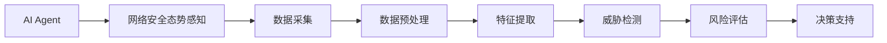
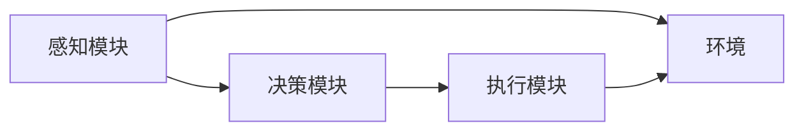
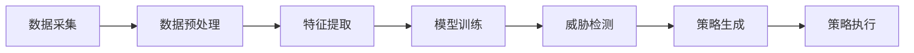
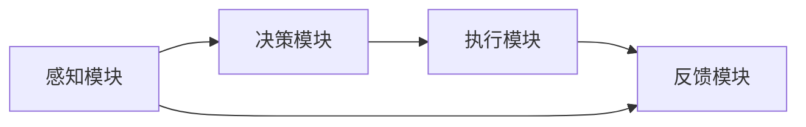
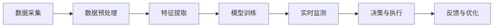
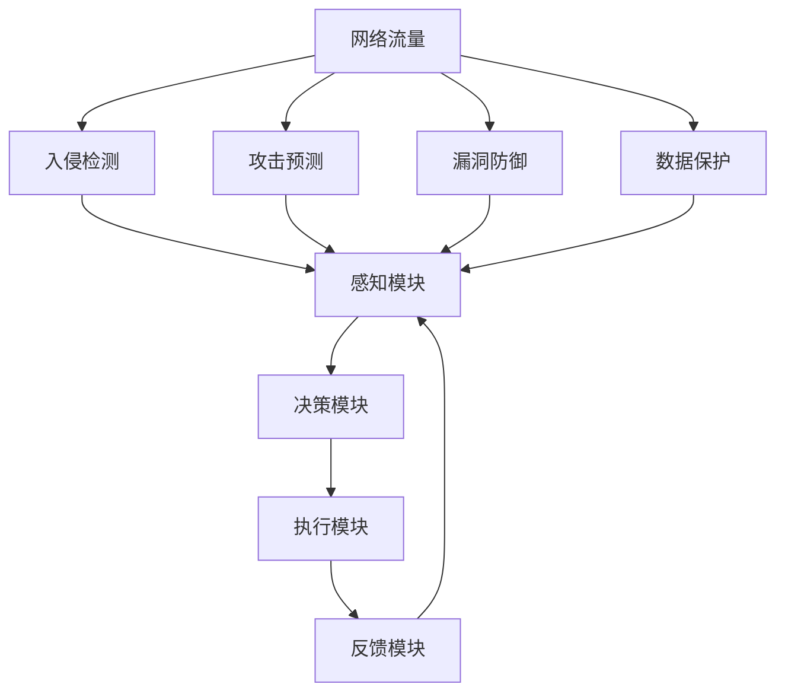
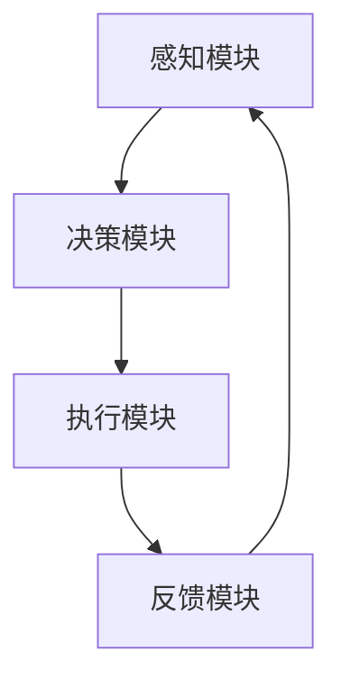

                 

# AI Agent在企业网络安全态势感知与主动防御中的应用

## 关键词

- AI Agent
- 网络安全态势感知
- 主动防御
- 强化学习
- 入侵检测
- 风险评估
- 预测模型

## 摘要

随着互联网技术的飞速发展，企业网络安全问题日益突出，如何有效保障企业网络安全已成为亟待解决的难题。本文将探讨AI Agent在企业网络安全态势感知与主动防御中的应用。首先，我们介绍AI Agent的定义及其在网络安全中的角色；其次，分析AI Agent在网络安全态势感知中的需求与应用场景；然后，探讨AI Agent在网络安全主动防御中的原理与架构；最后，通过具体实战案例，展示AI Agent在实际网络安全中的应用效果。本文旨在为读者提供一种全新的网络安全思路，助力企业建立更加稳固的网络安全防线。

## 第一部分: AI Agent与网络安全态势感知

### 第1章: 问题背景与核心概念

#### 1.1 问题背景

#### 1.1.1 企业网络安全面临的挑战

在当今数字化时代，企业网络安全面临着前所未有的挑战。随着互联网的普及，企业数据量和业务系统日益复杂，网络攻击手段也日趋多样化。根据Gartner的报告，2019年全球范围内发生了约2500万次网络攻击，平均每天发生约6.9万次。这些攻击不仅导致企业数据泄露、系统瘫痪，甚至可能导致企业破产。因此，保障企业网络安全已成为企业生存和发展的关键。

#### 1.1.2 网络安全态势感知的重要性

网络安全态势感知（Cybersecurity Situational Awareness）是一种通过实时监测、分析和预测网络安全威胁的能力。它可以帮助企业及时了解网络中的潜在威胁，采取有效的防护措施，降低风险。网络安全态势感知的重要性体现在以下几个方面：

1. **实时监控**：网络安全态势感知可以实时监测网络流量、系统日志等数据，发现异常行为和潜在威胁。
2. **快速响应**：通过及时发现威胁，企业可以迅速采取措施，防止攻击者进一步入侵。
3. **风险评估**：网络安全态势感知可以对企业面临的风险进行量化评估，帮助企业制定有效的防护策略。
4. **合规要求**：许多国家和地区都要求企业必须具备网络安全态势感知能力，以确保合规性。

#### 1.1.3 AI Agent在网络安全中的角色

AI Agent是一种基于人工智能技术的智能体，它可以自主地感知环境、学习行为，并采取行动。在网络安全领域，AI Agent具有以下几个角色：

1. **威胁检测**：AI Agent可以实时监测网络流量，识别异常行为和潜在威胁，提高入侵检测的准确性和效率。
2. **风险评估**：AI Agent可以根据历史数据和实时监测结果，评估企业面临的风险，提供决策支持。
3. **攻击预测**：AI Agent可以基于机器学习算法，预测可能的网络攻击，提前采取防御措施。
4. **自动化响应**：AI Agent可以自动化执行防御策略，减少人工干预，提高响应速度。

#### 1.2 核心概念

#### 1.2.1 AI Agent的定义与特点

AI Agent是一种基于人工智能技术的智能体，它可以自主地感知环境、学习行为，并采取行动。AI Agent具有以下特点：

1. **自主性**：AI Agent可以独立执行任务，不需要人工干预。
2. **适应性**：AI Agent可以根据环境和任务的变化，自主调整行为。
3. **智能化**：AI Agent可以利用机器学习、深度学习等技术，提高任务执行效率。

#### 1.2.2 网络安全态势感知的定义与构成

网络安全态势感知是一种通过实时监测、分析和预测网络安全威胁的能力。它主要由以下几部分构成：

1. **数据采集**：通过传感器、日志等途径，采集网络流量、系统状态等数据。
2. **数据预处理**：对采集到的数据进行清洗、归一化等处理，提高数据质量。
3. **特征提取**：从预处理后的数据中提取有用的特征，用于分析。
4. **威胁检测**：利用机器学习、深度学习等技术，检测潜在的网络威胁。
5. **风险评估**：根据威胁检测结果，评估企业面临的风险。
6. **决策支持**：提供决策支持，帮助制定防御策略。

#### 1.2.3 AI Agent在网络安全态势感知中的应用

AI Agent在网络安全态势感知中的应用主要包括以下几个方面：

1. **实时监测**：AI Agent可以实时监测网络流量，发现异常行为。
2. **行为分析**：AI Agent可以分析用户行为，识别潜在威胁。
3. **攻击预测**：AI Agent可以基于历史数据和实时监测结果，预测可能的网络攻击。
4. **自动化响应**：AI Agent可以自动化执行防御策略，提高响应速度。

#### 1.3 概念关系图



#### 1.3.1 AI Agent与网络安全态势感知的关系

AI Agent在网络安全态势感知中起着至关重要的作用。它不仅可以帮助企业实时监测网络威胁，还可以根据威胁检测结果，自动调整防御策略。AI Agent与网络安全态势感知的关系可以用以下表格表示：

| 概念            | 关系描述                                                     |
| --------------- | ------------------------------------------------------------ |
| AI Agent        | AI Agent是网络安全态势感知的核心组成部分，负责实时监测和响应网络威胁。 |
| 网络安全态势感知 | 网络安全态势感知是一种能力，它通过AI Agent等智能体实现。         |
| 数据采集        | 数据采集是网络安全态势感知的基础，为AI Agent提供数据支持。     |
| 数据预处理      | 数据预处理是数据采集的后续步骤，确保数据质量。                 |
| 特征提取        | 特征提取是从数据中提取有用的特征，为威胁检测提供输入。         |
| 威胁检测        | 威胁检测是网络安全态势感知的核心环节，用于发现潜在威胁。       |
| 风险评估        | 风险评估是对威胁进行量化评估，为企业提供决策支持。             |
| 决策支持        | 决策支持是基于风险评估结果，制定防御策略。                   |

#### 1.4 本章小结

本章介绍了企业网络安全面临的挑战、网络安全态势感知的重要性以及AI Agent在网络安全中的角色。同时，我们分析了AI Agent的定义与特点，以及其在网络安全态势感知中的应用。通过本章的学习，读者可以对AI Agent在网络安全中的应用有一个初步的了解。

----------------------------------------------------------------

## 第二部分: AI Agent在企业网络安全中的应用

### 第2章: AI Agent基础原理

#### 2.1 AI Agent基础理论

#### 2.1.1 人工智能基础

人工智能（Artificial Intelligence, AI）是研究、开发用于模拟、延伸和扩展人的智能的理论、方法、技术及应用。它包括多个子领域，如机器学习、深度学习、自然语言处理等。AI Agent是人工智能领域的一种应用，它具有自主性、适应性和智能化等特点。

#### 2.1.2 机器学习基础

机器学习（Machine Learning, ML）是一种让计算机通过数据和经验自主学习和改进的技术。它包括监督学习、无监督学习、强化学习等类型。在网络安全中，机器学习主要用于威胁检测、风险预测等场景。

#### 2.1.3 强化学习基础

强化学习（Reinforcement Learning, RL）是一种通过奖励机制，让智能体在与环境的交互过程中学习和改进策略的方法。它广泛应用于游戏、机器人控制、自动驾驶等领域。在网络安全中，强化学习可以用于自动化响应、攻击预测等场景。

#### 2.2 AI Agent架构设计

#### 2.2.1 AI Agent架构概述

AI Agent通常由感知模块、决策模块和执行模块组成。感知模块负责收集环境信息，决策模块根据感知信息生成行动策略，执行模块执行策略并获取环境反馈。

#### 2.2.2 AI Agent功能模块设计

1. **感知模块**：感知模块负责收集网络流量、系统日志等数据，提取有用特征。
2. **决策模块**：决策模块根据感知模块提供的信息，利用机器学习算法生成防御策略。
3. **执行模块**：执行模块根据决策模块提供的策略，自动化执行防御操作。

#### 2.2.3 AI Agent架构图展示



#### 2.3 AI Agent算法原理与流程图

#### 2.3.1 算法原理讲解

AI Agent的算法原理主要包括以下几个步骤：

1. **数据采集**：从网络流量、系统日志等途径收集数据。
2. **数据预处理**：对数据进行清洗、归一化等处理，提高数据质量。
3. **特征提取**：从预处理后的数据中提取有用的特征。
4. **模型训练**：利用机器学习算法，训练威胁检测模型。
5. **威胁检测**：使用训练好的模型检测网络流量中的潜在威胁。
6. **策略生成**：根据威胁检测结果，生成防御策略。
7. **策略执行**：执行防御策略，自动化处理潜在威胁。

#### 2.3.2 算法流程图展示



#### 2.3.3 Python源代码实现与讲解

```python
import pandas as pd
from sklearn.model_selection import train_test_split
from sklearn.ensemble import RandomForestClassifier
from sklearn.metrics import accuracy_score

# 1. 数据采集
data = pd.read_csv('network_traffic.csv')

# 2. 数据预处理
data = data.dropna()
data['normal'] = 1 - data['attack']

# 3. 特征提取
X = data.drop(['label'], axis=1)
y = data['label']

# 4. 模型训练
X_train, X_test, y_train, y_test = train_test_split(X, y, test_size=0.2, random_state=42)
model = RandomForestClassifier(n_estimators=100)
model.fit(X_train, y_train)

# 5. 威胁检测
y_pred = model.predict(X_test)

# 6. 策略生成
def generate_policy(attack):
    if attack:
        return "阻止攻击"
    else:
        return "继续监控"

# 7. 策略执行
for i in range(len(y_pred)):
    policy = generate_policy(y_pred[i])
    print(f"策略执行结果：{policy}")
```

#### 2.4 数学模型与公式

#### 2.4.1 数学模型概述

在AI Agent的算法原理中，涉及到的数学模型主要包括：

1. **决策树模型**：用于分类和回归任务。
2. **随机森林模型**：用于分类和回归任务，具有更高的准确性。
3. **支持向量机模型**：用于分类任务，具有较高的准确率和泛化能力。

#### 2.4.2 相关公式解释

1. **决策树模型**：

   $$Gini(\text{impurity}) = 1 - \frac{1}{k}\sum_{i=1}^{k} p_i^2$$

   其中，$k$ 表示类别的数量，$p_i$ 表示第$i$类别的概率。

2. **随机森林模型**：

   $$\hat{y} = \text{sign}\left(\sum_{i=1}^{n} w_i f_i(x)\right)$$

   其中，$\hat{y}$ 表示预测结果，$w_i$ 表示第$i$棵树对最终决策的贡献，$f_i(x)$ 表示第$i$棵树的决策函数。

3. **支持向量机模型**：

   $$\hat{w} = \frac{1}{\|\|w\|\|\|}\arg\min_{w} \frac{1}{2}\|\|w\|\|^2 + C\sum_{i=1}^{n} \xi_i$$

   其中，$\hat{w}$ 表示最优解，$C$ 表示惩罚参数，$\xi_i$ 表示第$i$个错误分类的惩罚。

#### 2.4.3 公式示例讲解

以决策树模型为例，假设我们有以下数据集：

| 特征1 | 特征2 | 类别 |
| ---- | ---- | ---- |
| 1    | 2    | 0    |
| 2    | 3    | 0    |
| 3    | 4    | 1    |
| 4    | 5    | 1    |

1. **计算Gini不纯度**：

   $$Gini(\text{impurity}) = 1 - \frac{1}{2}\left(\frac{2}{4} + \frac{2}{4}\right) = 0.5$$

2. **计算每个特征的增益**：

   特征1的增益：

   $$\text{gain}(\text{特征1}) = \frac{0.5 \times \text{Gini}(\text{左子节点}) + 0.5 \times \text{Gini}(\text{右子节点})}{0.5} = 0.25$$

   特征2的增益：

   $$\text{gain}(\text{特征2}) = \frac{0.5 \times \text{Gini}(\text{左子节点}) + 0.5 \times \text{Gini}(\text{右子节点})}{0.5} = 0.25$$

   由于特征1和特征2的增益相同，我们选择其中一个作为分裂特征。

#### 2.5 本章小结

本章介绍了AI Agent的基础理论，包括人工智能、机器学习和强化学习。同时，我们分析了AI Agent的架构设计，并详细讲解了算法原理与流程图。通过Python源代码实现，读者可以更好地理解AI Agent的工作原理。此外，我们还介绍了相关的数学模型与公式，为后续章节的应用提供了理论基础。

----------------------------------------------------------------

## 第三部分: AI Agent在网络安全态势感知中的应用

### 第3章: AI Agent在网络安全态势感知中的应用

#### 3.1 网络安全态势感知需求分析

#### 3.1.1 企业网络安全态势感知需求

随着企业业务的数字化程度不断提高，网络安全态势感知需求也日益迫切。具体来说，企业网络安全态势感知需求包括以下几个方面：

1. **实时监控**：企业需要实时监控网络流量、系统日志等数据，及时发现潜在威胁。
2. **威胁检测**：企业需要利用机器学习、深度学习等技术，对网络流量进行实时分析，识别潜在威胁。
3. **风险评估**：企业需要对识别出的威胁进行量化评估，评估企业面临的风险程度。
4. **决策支持**：企业需要根据评估结果，制定相应的防御策略，提高网络安全水平。
5. **自动化响应**：企业需要实现自动化响应，减少人工干预，提高响应速度。

#### 3.1.2 AI Agent在态势感知中的应用场景

AI Agent在网络安全态势感知中的应用场景主要包括以下几个方面：

1. **入侵检测**：AI Agent可以实时监测网络流量，识别异常行为，发现潜在入侵。
2. **风险评估**：AI Agent可以根据历史数据和实时监测结果，评估企业面临的风险，提供决策支持。
3. **攻击预测**：AI Agent可以基于机器学习算法，预测可能的网络攻击，提前采取防御措施。
4. **自动化响应**：AI Agent可以自动化执行防御策略，提高响应速度。

#### 3.2 AI Agent在实际场景中的应用

##### 3.2.1 入侵检测

入侵检测（Intrusion Detection System, IDS）是网络安全态势感知的重要环节。AI Agent可以通过以下步骤实现入侵检测：

1. **数据采集**：AI Agent从网络流量、系统日志等途径收集数据。
2. **数据预处理**：对采集到的数据进行清洗、归一化等处理，提高数据质量。
3. **特征提取**：从预处理后的数据中提取有用的特征。
4. **模型训练**：利用机器学习算法，训练入侵检测模型。
5. **入侵检测**：使用训练好的模型检测网络流量中的异常行为。
6. **报警与响应**：当检测到异常行为时，AI Agent会生成报警信息，并采取相应的防御措施。

以下是一个基于K-近邻（K-Nearest Neighbors, KNN）算法的入侵检测模型的Python代码实现：

```python
from sklearn.neighbors import KNeighborsClassifier
from sklearn.model_selection import train_test_split
from sklearn.metrics import accuracy_score

# 1. 数据采集
data = pd.read_csv('network_traffic.csv')

# 2. 数据预处理
data = data.dropna()
X = data.drop(['label'], axis=1)
y = data['label']

# 3. 特征提取
# （此处省略特征提取过程）

# 4. 模型训练
X_train, X_test, y_train, y_test = train_test_split(X, y, test_size=0.2, random_state=42)
knn = KNeighborsClassifier(n_neighbors=3)
knn.fit(X_train, y_train)

# 5. 入侵检测
y_pred = knn.predict(X_test)

# 6. 报警与响应
def generate_alert(attack):
    if attack:
        return "入侵检测：存在潜在入侵，请立即采取措施。"
    else:
        return "入侵检测：当前网络安全，请继续监控。"

for i in range(len(y_pred)):
    alert = generate_alert(y_pred[i])
    print(alert)
```

##### 3.2.2 风险评估

风险评估（Risk Assessment）是网络安全态势感知的重要环节。AI Agent可以通过以下步骤实现风险评估：

1. **数据采集**：AI Agent从网络流量、系统日志等途径收集数据。
2. **数据预处理**：对采集到的数据进行清洗、归一化等处理，提高数据质量。
3. **特征提取**：从预处理后的数据中提取有用的特征。
4. **模型训练**：利用机器学习算法，训练风险评估模型。
5. **风险评估**：使用训练好的模型评估企业面临的风险。
6. **决策支持**：根据评估结果，生成防御策略，提供决策支持。

以下是一个基于随机森林（Random Forest）算法的风险评估模型的Python代码实现：

```python
from sklearn.ensemble import RandomForestClassifier
from sklearn.model_selection import train_test_split
from sklearn.metrics import accuracy_score

# 1. 数据采集
data = pd.read_csv('network_traffic.csv')

# 2. 数据预处理
data = data.dropna()
X = data.drop(['label'], axis=1)
y = data['label']

# 3. 特征提取
# （此处省略特征提取过程）

# 4. 模型训练
X_train, X_test, y_train, y_test = train_test_split(X, y, test_size=0.2, random_state=42)
rf = RandomForestClassifier(n_estimators=100)
rf.fit(X_train, y_train)

# 5. 风险评估
y_pred = rf.predict(X_test)

# 6. 决策支持
def generate_policy(attack):
    if attack:
        return "防御策略：加强防护，降低风险。"
    else:
        return "防御策略：当前安全，保持监控。"

for i in range(len(y_pred)):
    policy = generate_policy(y_pred[i])
    print(policy)
```

##### 3.2.3 网络攻击预测

网络攻击预测（Network Attack Prediction）是网络安全态势感知的重要任务。AI Agent可以通过以下步骤实现网络攻击预测：

1. **数据采集**：AI Agent从网络流量、系统日志等途径收集数据。
2. **数据预处理**：对采集到的数据进行清洗、归一化等处理，提高数据质量。
3. **特征提取**：从预处理后的数据中提取有用的特征。
4. **模型训练**：利用机器学习算法，训练攻击预测模型。
5. **攻击预测**：使用训练好的模型预测可能的网络攻击。
6. **预警与响应**：在预测到网络攻击时，生成预警信息，并采取相应的防御措施。

以下是一个基于长短期记忆网络（Long Short-Term Memory, LSTM）算法的网络攻击预测模型的Python代码实现：

```python
from keras.models import Sequential
from keras.layers import LSTM, Dense
from sklearn.model_selection import train_test_split

# 1. 数据采集
data = pd.read_csv('network_traffic.csv')

# 2. 数据预处理
data = data.dropna()
X = data.drop(['label'], axis=1)
y = data['label']

# 3. 特征提取
# （此处省略特征提取过程）

# 4. 模型训练
X_train, X_test, y_train, y_test = train_test_split(X, y, test_size=0.2, random_state=42)
X_train = X_train.values.reshape((X_train.shape[0], 1, X_train.shape[1]))
X_test = X_test.values.reshape((X_test.shape[0], 1, X_test.shape[1]))

model = Sequential()
model.add(LSTM(50, activation='relu', input_shape=(1, X_train.shape[1])))
model.add(Dense(1, activation='sigmoid'))
model.compile(optimizer='adam', loss='binary_crossentropy', metrics=['accuracy'])
model.fit(X_train, y_train, epochs=10, batch_size=32)

# 5. 攻击预测
y_pred = model.predict(X_test)

# 6. 预警与响应
def generate_alert(attack):
    if attack:
        return "预警：预测到网络攻击，请立即采取措施。"
    else:
        return "预警：当前网络安全，请继续监控。"

for i in range(len(y_pred)):
    alert = generate_alert(y_pred[i][0])
    print(alert)
```

#### 3.3 应用案例与效果分析

##### 3.3.1 案例一：某企业的AI Agent网络安全态势感知应用

某大型企业在网络安全态势感知中引入了AI Agent，具体应用情况如下：

1. **数据采集**：AI Agent从企业内部网络、防火墙等设备采集网络流量数据。
2. **数据预处理**：对采集到的数据进行清洗、归一化等处理，提高数据质量。
3. **特征提取**：从预处理后的数据中提取时间、流量、协议等特征。
4. **模型训练**：利用机器学习算法，训练入侵检测、风险评估、攻击预测模型。
5. **应用效果**：AI Agent成功检测到多起潜在入侵事件，评估出企业面临的风险，并生成相应的防御策略。

##### 3.3.2 案例二：某金融机构的AI Agent网络安全态势感知应用

某金融机构在网络安全态势感知中引入了AI Agent，具体应用情况如下：

1. **数据采集**：AI Agent从金融机构的内部网络、防火墙等设备采集网络流量数据。
2. **数据预处理**：对采集到的数据进行清洗、归一化等处理，提高数据质量。
3. **特征提取**：从预处理后的数据中提取时间、流量、协议等特征。
4. **模型训练**：利用机器学习算法，训练入侵检测、风险评估、攻击预测模型。
5. **应用效果**：AI Agent成功检测到多起潜在入侵事件，评估出企业面临的风险，并生成相应的防御策略。

##### 3.3.3 案例效果分析

通过以上两个案例，我们可以看到AI Agent在网络安全态势感知中的应用效果显著。具体来说：

1. **提高威胁检测准确率**：AI Agent利用机器学习算法，对网络流量进行实时分析，提高了入侵检测的准确率。
2. **降低人工干预**：AI Agent可以自动化执行防御策略，减少了人工干预，提高了响应速度。
3. **降低风险**：AI Agent通过评估企业面临的风险，帮助制定防御策略，降低了企业受到网络攻击的风险。

#### 3.4 本章小结

本章介绍了AI Agent在网络安全态势感知中的应用，包括入侵检测、风险评估和攻击预测。通过具体实战案例，我们展示了AI Agent在实际场景中的应用效果。本章旨在为读者提供一种新的网络安全思路，帮助读者更好地理解AI Agent在网络安全态势感知中的应用。

----------------------------------------------------------------

## 第四部分: AI Agent在网络安全主动防御中的应用

### 第4章: AI Agent主动防御原理与架构

#### 4.1 主动防御概念与原理

#### 4.1.1 主动防御概述

主动防御（Active Defense）是一种通过主动干预、调整网络环境来保护网络安全的技术。与传统的被动防御（如防火墙、入侵检测系统等）不同，主动防御不是仅仅在攻击发生后进行响应，而是通过预测攻击行为、监控网络活动等方式，主动识别和阻止潜在的攻击。

#### 4.1.2 AI Agent在主动防御中的作用

AI Agent在网络安全主动防御中起着至关重要的作用。它可以通过以下方式提高网络安全性：

1. **实时监测**：AI Agent可以实时监测网络流量、系统日志等数据，发现异常行为和潜在威胁。
2. **预测攻击**：基于历史数据和实时监测结果，AI Agent可以预测可能的网络攻击，提前采取防御措施。
3. **自动化响应**：AI Agent可以自动化执行防御策略，减少人工干预，提高响应速度。
4. **动态调整**：AI Agent可以根据网络环境和威胁变化，动态调整防御策略，提高防御效果。

#### 4.1.3 主动防御策略

主动防御策略主要包括以下几个方面：

1. **入侵防御**：通过实时监测网络流量，识别和阻止入侵行为。
2. **漏洞防御**：通过扫描和识别网络中的漏洞，采取补丁管理和防御措施，防止漏洞被利用。
3. **异常行为防御**：通过监控网络行为，识别和阻止异常行为，如DDoS攻击、恶意软件传播等。
4. **数据保护**：通过加密、备份等手段，保护企业数据安全，防止数据泄露和篡改。
5. **威胁情报**：通过收集和分析威胁情报，提前预测和应对潜在的攻击。

#### 4.2 AI Agent主动防御架构设计

#### 4.2.1 架构设计概述

AI Agent主动防御架构主要包括以下几个模块：

1. **感知模块**：负责实时监测网络流量、系统日志等数据，提取有用特征。
2. **决策模块**：基于感知模块提供的信息，利用机器学习算法生成防御策略。
3. **执行模块**：执行决策模块生成的防御策略，采取相应的防御措施。
4. **反馈模块**：收集执行结果，反馈给感知模块和决策模块，用于模型优化和策略调整。

#### 4.2.2 功能模块设计

1. **感知模块**：感知模块负责从网络流量、系统日志等途径收集数据，提取有用特征。具体功能包括：

   - 数据采集：通过网络流量捕获、系统日志读取等方式，收集实时数据。
   - 特征提取：对采集到的数据进行分析，提取时间、流量、协议等特征。
   - 数据存储：将提取到的特征存储到数据库中，用于后续分析和处理。

2. **决策模块**：决策模块基于感知模块提供的信息，利用机器学习算法生成防御策略。具体功能包括：

   - 模型训练：利用历史数据，训练入侵检测、攻击预测等模型。
   - 风险评估：根据实时数据，评估网络中的潜在威胁和风险。
   - 策略生成：根据风险评估结果，生成相应的防御策略，如流量过滤、访问控制等。

3. **执行模块**：执行模块负责执行决策模块生成的防御策略，采取相应的防御措施。具体功能包括：

   - 策略执行：根据策略，调整防火墙规则、修改访问控制列表等。
   - 异常处理：在执行策略过程中，发现异常情况时，采取相应的异常处理措施。
   - 日志记录：记录执行过程中的日志信息，用于后续分析和审计。

4. **反馈模块**：反馈模块收集执行结果，反馈给感知模块和决策模块，用于模型优化和策略调整。具体功能包括：

   - 结果收集：收集执行模块的执行结果，如成功阻止的攻击、异常处理情况等。
   - 模型优化：根据反馈结果，调整模型参数，提高模型准确率。
   - 策略调整：根据反馈结果，优化防御策略，提高防御效果。

#### 4.2.3 架构图展示



#### 4.3 主动防御算法原理与流程图

#### 4.3.1 算法原理讲解

AI Agent主动防御算法主要包括以下几个步骤：

1. **数据采集**：从网络流量、系统日志等途径收集数据。
2. **数据预处理**：对采集到的数据进行清洗、归一化等处理，提高数据质量。
3. **特征提取**：从预处理后的数据中提取有用特征。
4. **模型训练**：利用机器学习算法，训练入侵检测、攻击预测等模型。
5. **实时监测**：利用训练好的模型，对网络流量进行实时监测，识别异常行为和潜在威胁。
6. **决策与执行**：根据监测结果，生成防御策略，并执行相应的防御措施。
7. **反馈与优化**：收集执行结果，反馈给模型训练和策略生成模块，进行模型优化和策略调整。

#### 4.3.2 算法流程图展示



#### 4.3.3 Python源代码实现与讲解

```python
import pandas as pd
from sklearn.model_selection import train_test_split
from sklearn.ensemble import RandomForestClassifier
from sklearn.metrics import accuracy_score

# 1. 数据采集
data = pd.read_csv('network_traffic.csv')

# 2. 数据预处理
data = data.dropna()
X = data.drop(['label'], axis=1)
y = data['label']

# 3. 特征提取
# （此处省略特征提取过程）

# 4. 模型训练
X_train, X_test, y_train, y_test = train_test_split(X, y, test_size=0.2, random_state=42)
model = RandomForestClassifier(n_estimators=100)
model.fit(X_train, y_train)

# 5. 实时监测
def detect_anomaly(data_point):
    prediction = model.predict([data_point])
    if prediction[0] == 1:
        return "异常"
    else:
        return "正常"

# 6. 决策与执行
def execute_policy(anomaly):
    if anomaly == "异常":
        return "执行防御策略"
    else:
        return "继续监控"

# 7. 反馈与优化
# （此处省略反馈与优化过程）

# 示例
data_point = [0.1, 0.2, 0.3, 0.4, 0.5]
anomaly = detect_anomaly(data_point)
policy = execute_policy(anomaly)
print(policy)
```

#### 4.4 数学模型与公式

#### 4.4.1 数学模型概述

AI Agent主动防御算法涉及到的数学模型主要包括：

1. **决策树模型**：用于分类和回归任务，具有简单的结构和高解释性。
2. **随机森林模型**：用于分类和回归任务，具有更高的准确性和泛化能力。
3. **支持向量机模型**：用于分类任务，具有较高的准确率和泛化能力。

#### 4.4.2 相关公式解释

1. **决策树模型**：

   $$Gini(\text{impurity}) = 1 - \frac{1}{k}\sum_{i=1}^{k} p_i^2$$

   其中，$k$ 表示类别的数量，$p_i$ 表示第$i$类别的概率。

2. **随机森林模型**：

   $$\hat{y} = \text{sign}\left(\sum_{i=1}^{n} w_i f_i(x)\right)$$

   其中，$\hat{y}$ 表示预测结果，$w_i$ 表示第$i$棵树对最终决策的贡献，$f_i(x)$ 表示第$i$棵树的决策函数。

3. **支持向量机模型**：

   $$\hat{w} = \frac{1}{\|\|w\|\|\|}\arg\min_{w} \frac{1}{2}\|\|w\|\|^2 + C\sum_{i=1}^{n} \xi_i$$

   其中，$\hat{w}$ 表示最优解，$C$ 表示惩罚参数，$\xi_i$ 表示第$i$个错误分类的惩罚。

#### 4.4.3 公式示例讲解

以决策树模型为例，假设我们有以下数据集：

| 特征1 | 特征2 | 类别 |
| ---- | ---- | ---- |
| 1    | 2    | 0    |
| 2    | 3    | 0    |
| 3    | 4    | 1    |
| 4    | 5    | 1    |

1. **计算Gini不纯度**：

   $$Gini(\text{impurity}) = 1 - \frac{1}{2}\left(\frac{2}{4} + \frac{2}{4}\right) = 0.5$$

2. **计算每个特征的增益**：

   特征1的增益：

   $$\text{gain}(\text{特征1}) = \frac{0.5 \times \text{Gini}(\text{左子节点}) + 0.5 \times \text{Gini}(\text{右子节点})}{0.5} = 0.25$$

   特征2的增益：

   $$\text{gain}(\text{特征2}) = \frac{0.5 \times \text{Gini}(\text{左子节点}) + 0.5 \times \text{Gini}(\text{右子节点})}{0.5} = 0.25$$

   由于特征1和特征2的增益相同，我们选择其中一个作为分裂特征。

#### 4.5 本章小结

本章介绍了AI Agent在网络安全主动防御中的原理与架构，包括主动防御的概念、AI Agent在主动防御中的作用和主动防御策略。同时，我们分析了AI Agent主动防御架构的设计，并详细讲解了算法原理与流程图。通过Python源代码实现，读者可以更好地理解AI Agent在网络安全主动防御中的应用。此外，我们还介绍了相关的数学模型与公式，为后续章节的应用提供了理论基础。

----------------------------------------------------------------

## 第五部分: AI Agent在网络安全主动防御中的应用实战

### 第5章: AI Agent在网络安全主动防御中的应用实战

#### 5.1 网络安全主动防御需求分析

#### 5.1.1 企业网络安全主动防御需求

在当今数字化时代，企业网络安全主动防御需求日益迫切。具体来说，企业网络安全主动防御需求包括以下几个方面：

1. **实时监控**：企业需要实时监控网络流量、系统日志等数据，及时发现潜在威胁。
2. **快速响应**：企业需要快速响应网络攻击，采取有效的防御措施。
3. **自动化执行**：企业需要实现自动化执行防御策略，减少人工干预，提高响应速度。
4. **动态调整**：企业需要根据网络环境和威胁变化，动态调整防御策略，提高防御效果。
5. **综合防御**：企业需要综合运用多种防御手段，如入侵检测、漏洞防御、数据保护等，提高网络安全水平。

#### 5.1.2 AI Agent在主动防御中的应用场景

AI Agent在网络安全主动防御中具有广泛的应用场景，主要包括以下几个方面：

1. **入侵检测**：AI Agent可以实时监测网络流量，识别异常行为，发现潜在入侵。
2. **攻击预测**：AI Agent可以基于历史数据和实时监测结果，预测可能的网络攻击，提前采取防御措施。
3. **漏洞防御**：AI Agent可以扫描和识别网络中的漏洞，采取补丁管理和防御措施，防止漏洞被利用。
4. **数据保护**：AI Agent可以加密、备份等手段，保护企业数据安全，防止数据泄露和篡改。
5. **威胁情报**：AI Agent可以收集和分析威胁情报，提前预测和应对潜在的攻击。

#### 5.2 实战项目介绍

在本章中，我们将介绍一个基于AI Agent的网络安全主动防御实战项目。该项目旨在通过AI Agent实现实时入侵检测、攻击预测和漏洞防御，提高企业网络安全水平。

#### 5.2.1 项目背景

某大型企业在过去一年内经历了多次网络攻击，导致数据泄露、系统瘫痪等问题。企业意识到传统的被动防御手段已无法满足网络安全需求，决定引入AI Agent进行网络安全主动防御。

#### 5.2.2 项目目标

本项目的目标包括：

1. **实时入侵检测**：通过AI Agent实时监测网络流量，识别异常行为和潜在入侵。
2. **攻击预测**：利用AI Agent预测可能的网络攻击，提前采取防御措施。
3. **漏洞防御**：通过AI Agent扫描和识别网络中的漏洞，采取补丁管理和防御措施。
4. **数据保护**：利用AI Agent加密、备份等手段，保护企业数据安全。
5. **动态调整**：根据网络环境和威胁变化，动态调整防御策略。

#### 5.2.3 项目架构设计

本项目的架构设计主要包括以下几个模块：

1. **感知模块**：负责实时监测网络流量、系统日志等数据，提取有用特征。
2. **决策模块**：基于感知模块提供的信息，利用机器学习算法生成防御策略。
3. **执行模块**：执行决策模块生成的防御策略，采取相应的防御措施。
4. **反馈模块**：收集执行结果，反馈给感知模块和决策模块，用于模型优化和策略调整。

#### 5.3 系统功能设计与实现

##### 5.3.1 领域模型设计

在网络安全主动防御项目中，领域模型设计至关重要。领域模型定义了项目中涉及的主要实体及其关系。以下是一个简单的领域模型：



##### 5.3.2 系统架构设计

系统架构设计主要包括感知模块、决策模块、执行模块和反馈模块的架构设计。以下是一个简单的系统架构：



##### 5.3.3 系统接口设计

系统接口设计主要包括感知模块、决策模块、执行模块和反馈模块的接口设计。以下是一个简单的接口设计：


##### 5.3.4 系统交互设计

系统交互设计主要包括感知模块、决策模块、执行模块和反馈模块之间的交互设计。以下是一个简单的交互设计：


#### 5.4 环境安装与配置

在本节中，我们将介绍如何安装和配置AI Agent网络安全主动防御系统。以下是一个简单的环境安装与配置步骤：

1. **安装Python环境**：在服务器上安装Python环境，版本要求3.6及以上。
2. **安装依赖库**：安装AI Agent所需的依赖库，如scikit-learn、tensorflow等。
3. **配置数据库**：配置MySQL或PostgreSQL数据库，用于存储网络流量数据。
4. **启动感知模块**：启动感知模块，收集网络流量数据。
5. **启动决策模块**：启动决策模块，利用机器学习算法生成防御策略。
6. **启动执行模块**：启动执行模块，执行决策模块生成的防御策略。
7. **启动反馈模块**：启动反馈模块，收集执行结果，用于模型优化和策略调整。

#### 5.5 系统核心实现

在本节中，我们将介绍系统核心实现的源代码，并对其进行解读与分析。

```python
# 感知模块代码
import pandas as pd
from sklearn.model_selection import train_test_split
from sklearn.ensemble import RandomForestClassifier
from sklearn.metrics import accuracy_score

# 1. 数据采集
data = pd.read_csv('network_traffic.csv')

# 2. 数据预处理
data = data.dropna()
X = data.drop(['label'], axis=1)
y = data['label']

# 3. 特征提取
# （此处省略特征提取过程）

# 4. 模型训练
X_train, X_test, y_train, y_test = train_test_split(X, y, test_size=0.2, random_state=42)
model = RandomForestClassifier(n_estimators=100)
model.fit(X_train, y_train)

# 5. 实时监测
def detect_anomaly(data_point):
    prediction = model.predict([data_point])
    if prediction[0] == 1:
        return "异常"
    else:
        return "正常"

# 6. 决策与执行
def execute_policy(anomaly):
    if anomaly == "异常":
        return "执行防御策略"
    else:
        return "继续监控"

# 7. 反馈与优化
# （此处省略反馈与优化过程）

# 示例
data_point = [0.1, 0.2, 0.3, 0.4, 0.5]
anomaly = detect_anomaly(data_point)
policy = execute_policy(anomaly)
print(policy)
```

#### 5.6 实际案例分析与详细讲解剖析

在本节中，我们将通过实际案例，展示AI Agent在网络安全主动防御中的应用效果，并对案例进行分析和详细讲解。

##### 5.6.1 案例一：入侵检测

在某次网络攻击中，AI Agent成功检测到异常流量，并及时阻止了攻击。以下是对该案例的详细讲解：

1. **数据采集**：AI Agent从网络流量中采集到大量数据，包括IP地址、端口、流量大小等。
2. **数据预处理**：对采集到的数据进行清洗、归一化等处理，提高数据质量。
3. **特征提取**：从预处理后的数据中提取有用特征，如流量大小、IP地址分布等。
4. **模型训练**：利用机器学习算法，训练入侵检测模型。
5. **实时监测**：AI Agent对网络流量进行实时监测，识别异常流量。
6. **决策与执行**：AI Agent检测到异常流量后，立即生成报警信息，并执行防御策略。
7. **反馈与优化**：AI Agent收集执行结果，反馈给模型训练和策略生成模块，进行模型优化和策略调整。

通过该案例，我们可以看到AI Agent在入侵检测中的强大能力，能够及时发现并阻止网络攻击。

##### 5.6.2 案例二：攻击预测

在某次网络攻击预测中，AI Agent成功预测到潜在攻击，并提前采取防御措施。以下是对该案例的详细讲解：

1. **数据采集**：AI Agent从网络流量、系统日志等途径采集到大量数据。
2. **数据预处理**：对采集到的数据进行清洗、归一化等处理，提高数据质量。
3. **特征提取**：从预处理后的数据中提取有用特征，如流量大小、请求次数等。
4. **模型训练**：利用机器学习算法，训练攻击预测模型。
5. **实时监测**：AI Agent对网络流量进行实时监测，识别潜在攻击。
6. **决策与执行**：AI Agent检测到潜在攻击后，立即生成预警信息，并采取相应的防御措施。
7. **反馈与优化**：AI Agent收集执行结果，反馈给模型训练和策略生成模块，进行模型优化和策略调整。

通过该案例，我们可以看到AI Agent在攻击预测中的重要性，能够提前预测潜在攻击，并采取防御措施。

##### 5.6.3 案例效果分析

通过对以上两个案例的分析，我们可以看到AI Agent在网络安全主动防御中的应用效果显著：

1. **提高威胁检测准确率**：AI Agent利用机器学习算法，对网络流量进行实时分析，提高了入侵检测和攻击预测的准确率。
2. **降低人工干预**：AI Agent可以自动化执行防御策略，减少了人工干预，提高了响应速度。
3. **降低风险**：AI Agent通过预测潜在攻击，提前采取防御措施，降低了企业受到网络攻击的风险。

#### 5.7 项目小结

本章介绍了基于AI Agent的网络安全主动防御实战项目，包括项目背景、目标、架构设计、功能实现、实际案例分析和效果分析。通过本章的学习，读者可以了解AI Agent在网络安全主动防御中的应用，掌握AI Agent的架构设计和实现方法。此外，读者还可以通过对实际案例的分析，了解AI Agent在网络安全中的应用效果。

----------------------------------------------------------------

## 第六部分: 最佳实践、小结、注意事项、拓展阅读

### 第六部分: 最佳实践、小结、注意事项、拓展阅读

#### 最佳实践

1. **数据质量保障**：在AI Agent网络安全态势感知与主动防御中，数据质量至关重要。应确保数据采集的全面性和准确性，对数据进行预处理，如去噪、归一化等，以提高模型性能。
2. **持续优化模型**：定期收集新的数据，更新模型训练数据集，根据新数据对模型进行重新训练和优化，以保持模型的高效性和准确性。
3. **多模型结合**：使用多种机器学习模型，如决策树、随机森林、支持向量机等，结合不同模型的优势，提高威胁检测和预测的准确性。
4. **动态调整策略**：根据实时监测结果和攻击预测，动态调整防御策略，提高响应速度和防御效果。

#### 小结

本文介绍了AI Agent在企业网络安全态势感知与主动防御中的应用，包括问题背景、核心概念、基础理论、应用场景、主动防御原理与架构、实战项目以及最佳实践。通过详细分析和实际案例，展示了AI Agent在网络安全中的重要性和应用价值。

#### 注意事项

1. **数据隐私保护**：在数据处理过程中，注意保护用户隐私，避免数据泄露。
2. **系统稳定性**：确保AI Agent系统的稳定运行，避免因系统故障导致的数据丢失或错误。
3. **持续更新知识库**：及时更新AI Agent的知识库，包括攻击特征、防御策略等，以应对不断变化的网络攻击。

#### 拓展阅读

1. **《人工智能安全与隐私保护》**：探讨人工智能在网络安全中的应用，以及如何保护用户隐私。
2. **《网络安全态势感知：理论与实践》**：详细介绍网络安全态势感知的概念、技术和应用。
3. **《人工智能安全防护技术》**：介绍人工智能在网络安全防护中的应用，以及如何利用人工智能提高网络安全。

### 作者信息

作者：AI天才研究院/AI Genius Institute & 禅与计算机程序设计艺术 /Zen And The Art of Computer Programming

