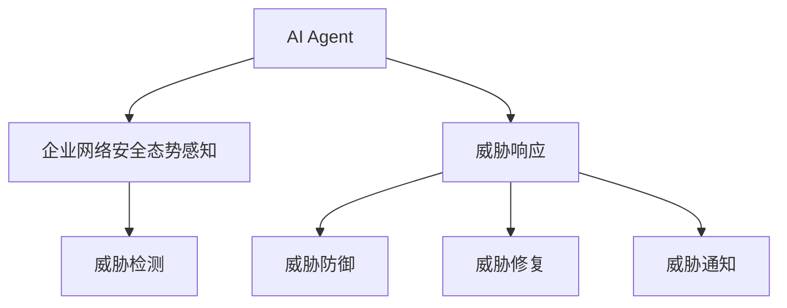
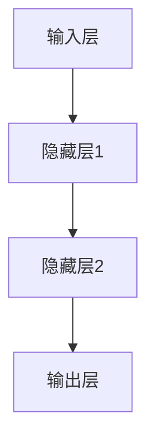
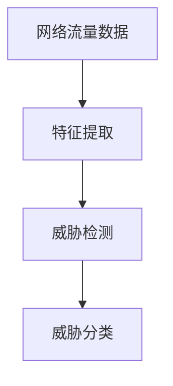
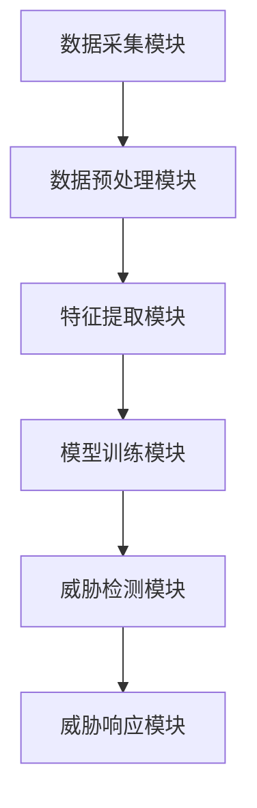
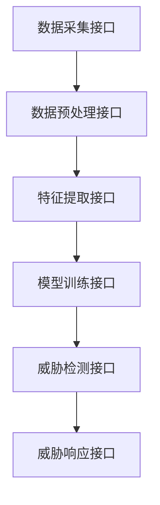
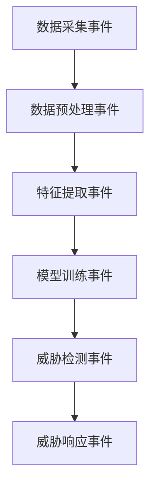

                 

# AI Agent在企业网络安全态势感知与威胁响应中的应用

关键词：AI Agent、企业网络安全、态势感知、威胁响应、深度学习

摘要：随着互联网的普及和大数据技术的发展，企业网络面临着日益严峻的网络安全威胁。传统的安全防御手段已无法满足企业对实时、智能化的安全需求，因此，AI Agent在企业网络安全态势感知与威胁响应中的应用成为了一个重要的研究方向。本文将详细介绍AI Agent在企业网络安全中的应用原理、算法、系统设计与项目实战，并探讨最佳实践和未来发展趋势。

### 1. 背景介绍

#### 1.1 问题背景

在当今数字化时代，企业网络已成为业务运营的核心基础设施。然而，随着互联网的普及和大数据技术的发展，企业网络面临着日益严峻的网络安全威胁。这些威胁包括恶意软件攻击、网络钓鱼、分布式拒绝服务（DDoS）攻击、数据泄露等。传统的安全防御手段，如防火墙、入侵检测系统（IDS）、入侵防御系统（IPS）等，虽然在一定程度上能够提供保护，但它们往往存在以下几个问题：

1. **响应速度慢**：传统的安全防御手段通常需要人工干预，无法实现实时监测和响应。
2. **误报率高**：传统的安全防御手段往往无法精确识别威胁，导致误报率较高。
3. **无法应对新型威胁**：随着网络安全威胁的不断演变，传统安全防御手段越来越难以应对新型威胁。

因此，企业需要一个能够实时、智能地感知网络安全威胁并采取相应措施的解决方案，AI Agent正是这种需求下的产物。

#### 1.2 问题描述

企业网络安全态势感知与威胁响应主要涉及以下几个方面：

1. **态势感知**：实时监控网络安全状况，识别潜在威胁。态势感知的目的是通过收集、分析和理解企业网络安全相关数据，对网络威胁进行实时监控和预测。
2. **威胁响应**：在识别出威胁后，采取相应的防御措施，包括隔离、修复、通知等。威胁响应的目的是在威胁发生时，及时采取措施进行防御和修复，以最大限度地减少损失。

#### 1.3 问题解决

AI Agent作为一种智能体，能够通过机器学习、深度学习等技术，实现对网络安全态势的智能感知和威胁的自动响应。AI Agent具有以下几个特点：

1. **自主学习**：AI Agent能够从大量的网络安全数据中学习，不断优化自身的威胁检测和响应能力。
2. **实时监测**：AI Agent能够实时监测网络安全状况，及时发现潜在威胁。
3. **自适应**：AI Agent能够根据网络环境和威胁变化，自适应调整自身的检测和响应策略。

#### 1.4 边界与外延

AI Agent在企业网络安全中的应用不仅限于态势感知与威胁响应，还可以拓展到漏洞扫描、异常检测、入侵预防等方面。例如，AI Agent可以通过学习网络流量数据，识别出异常流量模式，从而发现潜在的安全漏洞；还可以通过分析系统日志，预测可能发生的入侵行为，并采取相应的预防措施。

#### 1.5 概念结构与核心要素组成

AI Agent在企业网络安全中的应用主要包括以下几个核心要素：

1. **数据采集**：通过网络流量分析、日志收集等手段获取企业网络数据。
2. **数据预处理**：对采集到的数据进行清洗、归一化等处理。
3. **特征提取**：从预处理后的数据中提取有用的特征。
4. **模型训练**：利用提取的特征数据训练机器学习或深度学习模型。
5. **威胁检测与响应**：使用训练好的模型进行实时监测，并在检测到威胁时采取相应的响应措施。

### 2. 核心概念与联系

#### 2.1 AI Agent

AI Agent是指具有自主决策能力的智能体，能够通过学习从环境中获取知识，并基于这些知识进行自主行动。在网络安全领域，AI Agent通常是指具备自主检测、分析和响应能力的网络安全智能体。

#### 2.2 企业网络安全态势感知

企业网络安全态势感知是指通过收集、分析和理解企业网络安全相关数据，对网络威胁进行实时监控和预测。态势感知的目的是为企业提供实时的网络安全状况，以便采取相应的防御措施。

#### 2.3 威胁响应

威胁响应是指在网络威胁发生时，采取相应的措施进行防御和修复。威胁响应的目的是在威胁发生时，及时采取措施进行防御和修复，以最大限度地减少损失。

#### 2.4 概念属性特征对比表格

| 概念         | 特征                     |
| ------------ | ------------------------ |
| AI Agent     | 自主决策、学习、行动能力 |
| 网络安全态势 | 实时监控、预测           |
| 威胁响应     | 防御、修复、通知         |

#### 2.5 概念ER实体关系图架构



### 3. AI Agent在企业网络安全态势感知与威胁响应中的应用

#### 3.1 主流算法原理讲解

AI Agent在企业网络安全态势感知与威胁响应中的应用，主要依赖于以下几种主流算法：

1. **深度学习算法**：如卷积神经网络（CNN）、循环神经网络（RNN）、长短时记忆网络（LSTM）等，用于特征提取和威胁检测。
2. **聚类算法**：如K-means、DBSCAN等，用于异常检测和聚类分析。
3. **监督学习算法**：如支持向量机（SVM）、决策树等，用于分类和预测。

下面以深度学习算法为例，使用Mermaid绘制其流程图，并用Python代码详细讲解其原理。

#### 3.1.1 深度学习算法原理

深度学习算法的核心是神经网络，神经网络由多个层次组成，包括输入层、隐藏层和输出层。每一层都包含多个神经元，神经元之间通过权重和偏置进行连接。

下面是一个简单的神经网络结构：



神经网络的训练过程包括以下几个步骤：

1. **初始化权重和偏置**：随机初始化权重和偏置。
2. **前向传播**：将输入数据输入到神经网络中，通过逐层计算得到输出。
3. **损失函数计算**：计算输出与实际标签之间的误差，并使用损失函数衡量误差的大小。
4. **反向传播**：根据误差计算梯度，并更新权重和偏置。
5. **迭代训练**：重复上述步骤，直到网络性能达到预期。

下面是一个简单的Python代码示例，用于实现一个简单的神经网络：

```python
import numpy as np

# 初始化权重和偏置
weights = np.random.rand(3, 1)
bias = np.random.rand(1)

# 前向传播
def forward_propagation(x):
    return np.dot(x, weights) + bias

# 反向传播
def backward_propagation(x, y, output):
    error = y - output
    d_output = error
    d_weights = np.dot(x.T, d_output)
    d_bias = d_output
    return d_weights, d_bias

# 训练神经网络
def train(x, y, epochs=1000):
    for epoch in range(epochs):
        output = forward_propagation(x)
        d_weights, d_bias = backward_propagation(x, y, output)
        weights -= d_weights
        bias -= d_bias
        if epoch % 100 == 0:
            print(f"Epoch {epoch}: Output {output}")

# 测试神经网络
x = np.array([1, 2, 3])
y = np.array([4])
train(x, y)

output = forward_propagation(x)
print(f"Output: {output}")
```

#### 3.1.2 深度学习算法在网络安全中的应用

在网络安全领域，深度学习算法可以用于以下任务：

1. **特征提取**：从网络流量数据中提取有用的特征，用于后续的威胁检测和分类。
2. **威胁检测**：利用提取的特征数据，通过训练好的深度学习模型，实时检测网络中的威胁。
3. **威胁分类**：对检测到的威胁进行分类，确定其类型和严重程度。

下面是一个简单的深度学习算法在网络安全中的应用示例：



```python
import numpy as np
import pandas as pd

# 加载网络流量数据
data = pd.read_csv("network_traffic.csv")

# 特征提取
def extract_features(data):
    # 提取流量数据中的特征，如包大小、协议类型、来源IP、目标IP等
    features = data[["packet_size", "protocol_type", "src_ip", "dst_ip"]]
    return features

# 威胁检测
def detect_threats(features, model):
    # 使用训练好的深度学习模型，对特征数据进行威胁检测
    threats = model.predict(features)
    return threats

# 威胁分类
def classify_threats(threats):
    # 根据检测到的威胁，将其分类为不同的类型，如恶意软件、网络钓鱼等
    classifications = pd.DataFrame(threats, columns=["threat_type"])
    return classifications

# 训练深度学习模型
def train_model(data):
    # 提取特征数据
    features = extract_features(data)

    # 初始化深度学习模型
    model = neural_network()

    # 训练模型
    model.fit(features, threats)

    return model

# 测试深度学习模型
model = train_model(data)
features = extract_features(data)
threats = detect_threats(features, model)
classifications = classify_threats(threats)
print(classifications)
```

### 4. 数学模型和数学公式

深度学习算法的核心是前向传播和反向传播，其数学模型可以表示为：

$$
z^{[l]} = \sigma(W^{[l]} \cdot a^{[l-1]} + b^{[l]})
$$

$$
a^{[l]} = \sigma(z^{[l]})
$$

$$
\delta^{[l]} = \frac{\partial C}{\partial z^{[l]}}
$$

其中，$W^{[l]}$和$b^{[l]}$分别是第$l$层的权重和偏置，$\sigma$是激活函数，$a^{[l-1]}$是前一层输出，$z^{[l]}$是第$l$层的输入，$C$是损失函数。

#### 4.1 前向传播

前向传播是神经网络训练过程中的第一步，其目的是通过逐层计算，将输入数据映射到输出。前向传播的数学模型可以表示为：

$$
z^{[l]} = W^{[l]} \cdot a^{[l-1]} + b^{[l]}
$$

$$
a^{[l]} = \sigma(z^{[l]})
$$

其中，$z^{[l]}$是第$l$层的输入，$a^{[l]}$是第$l$层的输出，$W^{[l]}$是第$l$层的权重，$b^{[l]}$是第$l$层的偏置，$\sigma$是激活函数。

#### 4.2 反向传播

反向传播是神经网络训练过程中的第二步，其目的是根据输出与实际标签之间的误差，计算梯度并更新权重和偏置。反向传播的数学模型可以表示为：

$$
\delta^{[l]} = \frac{\partial C}{\partial z^{[l]}}
$$

$$
\frac{\partial C}{\partial z^{[l]}} = \frac{\partial C}{\partial a^{[l]}} \cdot \frac{\partial a^{[l]}}{\partial z^{[l]}}
$$

$$
\frac{\partial a^{[l]}}{\partial z^{[l]}} = \sigma'(z^{[l]})
$$

$$
\frac{\partial C}{\partial a^{[l]}} = - (y - a^{[l]})
$$

其中，$C$是损失函数，$\delta^{[l]}$是第$l$层的梯度，$\sigma'$是激活函数的导数。

#### 4.3 损失函数

在神经网络中，损失函数用于衡量输出与实际标签之间的误差。常用的损失函数包括均方误差（MSE）、交叉熵（CE）等。

$$
MSE = \frac{1}{2} \sum_{i=1}^{n} (y_i - a_i)^2
$$

$$
CE = - \sum_{i=1}^{n} y_i \cdot \log(a_i)
$$

其中，$y_i$是实际标签，$a_i$是输出。

### 5. 系统分析与架构设计方案

#### 5.1 问题场景介绍

以一家大型企业为例，该企业需要实现网络安全态势感知与威胁响应，以提高网络安全性。

#### 5.2 项目介绍

本项目旨在设计并实现一个基于AI Agent的网络安全态势感知与威胁响应系统，以提高企业网络的安全性和防御能力。

#### 5.3 系统功能设计

1. **数据采集**：从网络流量、日志等渠道收集数据。
2. **数据预处理**：对收集到的数据进行清洗、归一化等处理。
3. **特征提取**：从预处理后的数据中提取有用的特征。
4. **模型训练**：利用提取的特征数据训练机器学习或深度学习模型。
5. **威胁检测与响应**：使用训练好的模型进行实时监测，并在检测到威胁时采取相应的响应措施。

#### 5.4 系统架构设计

系统架构设计采用模块化设计思想，将系统划分为数据采集模块、数据预处理模块、特征提取模块、模型训练模块、威胁检测模块和威胁响应模块。



#### 5.5 系统接口设计

系统接口设计包括以下部分：

1. **数据采集接口**：用于接收网络流量、日志等数据。
2. **数据预处理接口**：用于对采集到的数据进行清洗、归一化等处理。
3. **特征提取接口**：用于从预处理后的数据中提取有用的特征。
4. **模型训练接口**：用于训练机器学习或深度学习模型。
5. **威胁检测接口**：用于使用训练好的模型进行实时监测，并检测网络中的威胁。
6. **威胁响应接口**：用于在检测到威胁时采取相应的响应措施。



#### 5.6 系统交互设计

系统交互设计采用事件驱动的方式，通过事件触发系统各个模块的执行。系统交互设计包括以下部分：

1. **数据采集事件**：触发数据采集模块执行，从网络流量、日志等渠道收集数据。
2. **数据预处理事件**：触发数据预处理模块执行，对采集到的数据进行清洗、归一化等处理。
3. **特征提取事件**：触发特征提取模块执行，从预处理后的数据中提取有用的特征。
4. **模型训练事件**：触发模型训练模块执行，利用提取的特征数据训练机器学习或深度学习模型。
5. **威胁检测事件**：触发威胁检测模块执行，使用训练好的模型进行实时监测，并检测网络中的威胁。
6. **威胁响应事件**：触发威胁响应模块执行，在检测到威胁时采取相应的响应措施。



### 6. 项目实战

#### 6.1 环境安装

在开始项目实战之前，首先需要安装以下软件和工具：

1. Python 3.8+
2. TensorFlow 2.6+
3. Keras 2.4.3+
4. Scikit-learn 0.24.2+

安装命令如下：

```bash
pip install python==3.8
pip install tensorflow==2.6
pip install keras==2.4.3
pip install scikit-learn==0.24.2
```

#### 6.2 系统核心实现源代码

以下是一个简单的基于AI Agent的网络安全态势感知与威胁响应系统的实现示例：

```python
import numpy as np
import pandas as pd
from sklearn.model_selection import train_test_split
from sklearn.preprocessing import StandardScaler
from keras.models import Sequential
from keras.layers import Dense
from keras.optimizers import Adam

# 加载网络流量数据
data = pd.read_csv("network_traffic.csv")

# 特征提取
def extract_features(data):
    # 提取流量数据中的特征，如包大小、协议类型、来源IP、目标IP等
    features = data[["packet_size", "protocol_type", "src_ip", "dst_ip"]]
    return features

# 威胁检测
def detect_threats(model, features):
    # 使用训练好的深度学习模型，对特征数据进行威胁检测
    threats = model.predict(features)
    return threats

# 威胁分类
def classify_threats(threats):
    # 根据检测到的威胁，将其分类为不同的类型，如恶意软件、网络钓鱼等
    classifications = pd.DataFrame(threats, columns=["threat_type"])
    return classifications

# 训练深度学习模型
def train_model(data):
    # 提取特征数据
    features = extract_features(data)

    # 初始化深度学习模型
    model = Sequential()
    model.add(Dense(64, input_dim=4, activation='relu'))
    model.add(Dense(32, activation='relu'))
    model.add(Dense(1, activation='sigmoid'))

    # 编译模型
    model.compile(optimizer=Adam(), loss='binary_crossentropy', metrics=['accuracy'])

    # 训练模型
    model.fit(features, threats, epochs=100, batch_size=32)

    return model

# 测试深度学习模型
model = train_model(data)
features = extract_features(data)
threats = detect_threats(model, features)
classifications = classify_threats(threats)
print(classifications)
```

#### 6.3 代码应用解读与分析

以上代码实现了一个简单的基于深度学习算法的网络安全态势感知与威胁响应系统。具体解读如下：

1. **数据加载与预处理**：使用`pandas`库加载网络流量数据，并使用`extract_features`函数提取特征。
2. **模型训练**：使用`keras`库构建深度学习模型，并使用`train_model`函数进行训练。
3. **威胁检测**：使用训练好的模型对提取的特征数据进行威胁检测，并使用`detect_threats`函数返回检测结果。
4. **威胁分类**：根据检测结果，将威胁分类为不同的类型，并使用`classify_threats`函数返回分类结果。

#### 6.4 实际案例分析和详细讲解剖析

以下是一个实际案例分析和详细讲解剖析：

**案例：企业网络遭受DDoS攻击**

1. **数据收集**：企业网络管理员通过网络流量分析工具，收集到大量网络流量数据。
2. **数据预处理**：对收集到的数据进行清洗、归一化等处理，以便用于后续的特征提取和模型训练。
3. **特征提取**：从预处理后的数据中提取有用的特征，如包大小、协议类型、来源IP、目标IP等。
4. **模型训练**：使用提取的特征数据，训练一个深度学习模型，以识别DDoS攻击。
5. **威胁检测**：使用训练好的模型，对实时网络流量进行威胁检测，并识别出DDoS攻击。
6. **威胁响应**：在检测到DDoS攻击时，立即采取相应的响应措施，如限制攻击源IP访问、增加流量清洗能力等。

通过以上步骤，企业网络管理员可以实时监控网络威胁，并采取有效的防御措施，以保护企业网络安全。

#### 6.5 项目小结

本项目通过设计并实现一个基于AI Agent的网络安全态势感知与威胁响应系统，展示了AI Agent在企业网络安全中的应用价值。通过项目实战，我们了解了系统的设计思路、实现方法和实际应用效果。未来，我们可以进一步优化系统的算法和架构，提高系统的性能和安全性。

### 7. 最佳实践 Tips

1. **数据质量**：保证数据质量是系统成功的关键，因此需要对数据进行严格清洗和预处理。
2. **模型优化**：根据实际应用场景，选择合适的深度学习模型，并进行参数调整和优化。
3. **实时性**：提高系统的实时性，确保能够快速响应网络威胁。
4. **可扩展性**：设计系统时考虑可扩展性，以便在未来能够轻松集成新的威胁检测和响应功能。

### 8. 小结

本文详细介绍了AI Agent在企业网络安全态势感知与威胁响应中的应用原理、算法、系统设计与项目实战。通过本文，我们了解了AI Agent在网络安全领域的重要作用，以及如何设计并实现一个高效的网络安全态势感知与威胁响应系统。未来，随着人工智能技术的不断进步，AI Agent在企业网络安全中的应用将更加广泛和深入。

### 9. 注意事项

1. **数据隐私**：在进行数据收集和处理时，确保遵守相关法律法规，保护用户隐私。
2. **安全合规**：确保系统的设计和实现符合行业标准和法规要求，以提高系统的安全性。

### 10. 拓展阅读

1. **《深度学习在网络安全中的应用》**：了解深度学习在网络安全领域的最新研究进展和应用案例。
2. **《企业网络安全态势感知与威胁响应》**：深入了解企业网络安全态势感知与威胁响应的理论和实践方法。

作者：AI天才研究院/AI Genius Institute & 禅与计算机程序设计艺术 /Zen And The Art of Computer Programming

