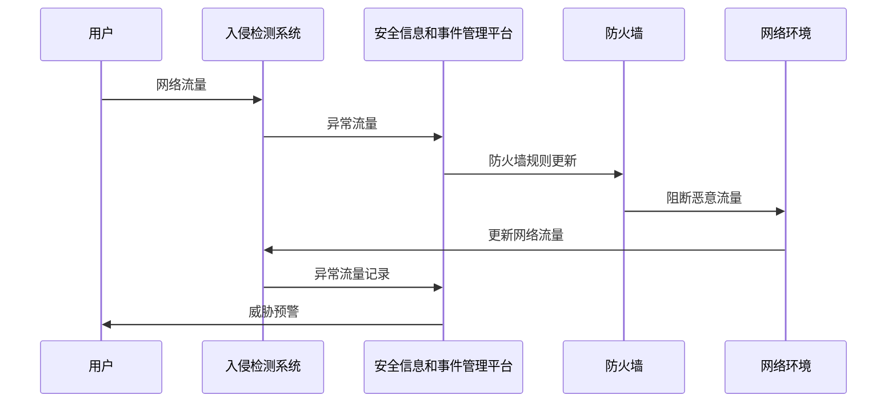

                 


## 第一部分：AI Agent的基本概念与重要性

### 1.1 AI Agent的定义与类型

#### AI Agent的定义

AI Agent，即人工智能代理，是一种能够自主行动、进行决策并达成目标的人工智能系统。其核心理念源自于对人类智能行为的模拟，通过算法和数据处理能力，在特定环境中执行任务，并不断优化自身行为。

AI Agent的基本特征包括：

- **自主性**：能够独立执行任务，无需人为干预。
- **适应性**：能够根据环境变化调整行为策略。
- **交互性**：能够与其他系统、设备或人类进行交互。
- **目标导向**：以实现特定目标为核心任务。

根据不同的任务和应用场景，AI Agent可以分为以下几类：

1. **感知型Agent**：主要功能是感知环境，收集数据。
2. **动作型Agent**：负责执行环境中的物理动作。
3. **决策型Agent**：能够根据感知到的环境和目标，进行决策。
4. **混合型Agent**：兼具感知、动作和决策功能。

#### AI Agent在网络安全中的角色

在网络安全领域，AI Agent被广泛应用于入侵检测、威胁预测、漏洞扫描等方面。其具体角色包括：

- **入侵检测**：AI Agent能够实时监控网络流量，识别异常行为和潜在威胁。
- **威胁预测**：通过历史数据和模式识别，预测可能的网络攻击。
- **漏洞扫描**：自动发现网络中的漏洞，并提供修复建议。
- **安全策略优化**：根据实时威胁情报，调整安全策略以更好地防御攻击。

### 1.2 AI Agent的核心特性

AI Agent的核心特性包括：

- **自主学习能力**：通过机器学习和深度学习算法，从数据中学习并不断优化行为。
- **自动化决策**：利用算法模型进行自主决策，减少人工干预。
- **实时响应**：能够对网络威胁进行快速检测和响应，降低安全事件的影响。
- **可扩展性**：支持对新的威胁类型进行适应和响应。

### 1.3 AI Agent在网络安全中的重要性

随着网络攻击手段的日益复杂和多样化，传统的安全防御策略已经难以应对。AI Agent的出现为企业提供了一种新的网络安全防御思路：

- **提升检测精度**：通过机器学习算法，AI Agent能够更精确地识别恶意行为，降低误报率。
- **实时响应**：AI Agent能够实时监控网络流量，并在检测到威胁时立即采取行动。
- **自动化处理**：自动执行安全策略，减少人工工作量。
- **适应性**：能够不断学习和适应新的威胁模式，提升整体安全水平。

### 1.4 当前企业网络安全面临的挑战

尽管AI Agent为企业网络安全提供了新的解决方案，但当前企业网络安全仍面临以下挑战：

- **数据复杂性**：随着网络规模扩大，数据量呈指数级增长，给数据处理和威胁检测带来挑战。
- **实时性要求**：安全事件发生迅速，要求安全系统能够实时响应。
- **资源限制**：企业需要在有限的资源下，平衡安全性能和系统性能。
- **算法透明度**：深度学习算法的黑箱特性使得其决策过程难以解释，增加了信任风险。

### 1.5 AI Agent的解决方案概述

AI Agent通过以下解决方案应对当前企业网络安全面临的挑战：

- **自动化威胁检测**：利用机器学习算法，对大量网络数据进行分析，自动识别潜在威胁。
- **实时威胁响应**：通过深度学习算法，实现对安全事件的快速检测和响应。
- **自适应安全策略**：根据实时威胁情报，动态调整安全策略，提高防御效果。
- **可视化威胁情报**：通过可视化工具，将复杂的安全数据转换为直观的可视化信息，帮助安全团队快速理解安全态势。

## 第一部分总结

本部分介绍了AI Agent的基本概念、类型及其在网络安全中的重要性。AI Agent具备自主性、适应性、交互性和目标导向等核心特性，能够提升企业网络安全的检测精度、实时响应能力和自动化处理效率。然而，当前企业网络安全仍面临数据复杂性、实时性要求、资源限制和算法透明度等挑战。AI Agent通过自动化威胁检测、实时威胁响应、自适应安全策略和可视化威胁情报等解决方案，为应对这些挑战提供了新的思路。

----------------------------------------------------------------

## 第二部分：AI Agent与企业网络安全的联系

### 2.1 AI Agent在企业网络安全中的应用场景

AI Agent在企业网络安全中的应用场景广泛且多样化，主要包括以下几方面：

#### 入侵检测系统（IDS）

入侵检测系统是AI Agent在网络安全中的一个重要应用场景。AI Agent能够实时分析网络流量，识别异常行为和潜在攻击。通过机器学习算法，AI Agent可以自动建立正常行为模式，并与实时数据对比，一旦发现异常，立即发出警报。

#### 威胁情报平台（TIP）

AI Agent在威胁情报平台中扮演着关键角色。它能够收集、分析和处理来自多个数据源的威胁信息，如网络流量、日志数据和外部威胁情报。通过机器学习算法，AI Agent能够识别出威胁之间的关联性，提供更全面的威胁情报。

#### 安全信息和事件管理（SIEM）

AI Agent可以集成到SIEM系统中，提高事件处理效率。它能够实时监控网络活动，自动收集和关联安全事件，并根据威胁等级进行分类和响应。这有助于安全团队能够更快速地识别和应对网络攻击。

#### 网络入侵防御系统（NIPS）

AI Agent可以增强网络入侵防御系统，通过实时检测和阻止恶意流量，减少网络攻击的成功率。AI Agent可以基于深度学习算法，对网络行为进行复杂模式识别，并在发现威胁时迅速采取行动。

#### 漏洞管理

AI Agent能够自动扫描网络中的漏洞，并提供修复建议。通过机器学习和自然语言处理技术，AI Agent可以理解漏洞报告，并将其转化为具体的修复方案。

#### 数据隐私保护

AI Agent可以帮助企业保护敏感数据，通过监控数据访问行为和检测数据泄露。它能够识别异常访问模式，并在发现潜在威胁时采取预防措施。

#### 自动化安全运营

AI Agent可以自动化安全运营流程，如安全事件响应、安全策略调整和报告生成。通过机器学习和自动化流程，AI Agent可以减少人工工作量，提高运营效率。

### 2.2 AI Agent与传统安全策略的比较

传统网络安全策略主要依赖于预定义规则和签名匹配，这些方法在应对已知威胁时效果较好，但在面对未知威胁和复杂攻击时存在明显不足。相比之下，AI Agent具有以下优势：

#### 检测精度

AI Agent通过机器学习和深度学习算法，可以自动学习网络行为模式，提高检测精度。它不仅能够识别已知威胁，还能够发现未知威胁和复杂攻击。

#### 实时响应

AI Agent能够实时分析网络数据，并在检测到威胁时迅速响应。这有助于减少攻击成功的时间和影响。

#### 适应性

AI Agent可以根据环境和威胁的变化，动态调整检测和响应策略。这种适应性使得AI Agent能够更好地应对不断变化的安全威胁。

#### 自动化

AI Agent可以自动化安全运营流程，如安全事件响应和安全策略调整，减少人工干预。这有助于提高运营效率，降低运营成本。

#### 易扩展性

AI Agent可以轻松集成到现有的安全系统中，如IDS、SIEM和NIPS等。这使得企业能够逐步引入AI Agent，而无需完全重新部署现有安全架构。

### 2.3 AI Agent在网络安全中的优势与挑战

#### 优势

- **提高检测精度**：通过机器学习和深度学习算法，AI Agent能够更准确地识别威胁。
- **实时响应**：AI Agent能够快速检测和响应安全事件，减少攻击影响。
- **自动化**：AI Agent可以自动化安全运营流程，提高运营效率。
- **适应性**：AI Agent能够根据环境变化动态调整策略，提高应对能力。

#### 挑战

- **数据复杂性**：随着网络数据量的增加，AI Agent需要处理更多的数据，这增加了计算的复杂性。
- **实时性要求**：安全事件发生迅速，要求AI Agent能够实时响应，这需要高效的算法和计算资源。
- **资源限制**：企业在资源有限的情况下，需要平衡安全性能和系统性能。
- **算法透明度**：深度学习算法的黑箱特性使得其决策过程难以解释，增加了信任风险。

### 2.4 AI Agent的未来发展展望

随着人工智能技术的不断发展，AI Agent在网络安全中的应用前景广阔。未来，AI Agent可能会实现以下发展趋势：

- **更高效的算法**：研究人员将继续优化机器学习和深度学习算法，提高AI Agent的检测和响应能力。
- **跨领域应用**：AI Agent不仅会在网络安全领域得到广泛应用，还可能在其他领域，如物联网、自动驾驶等，发挥重要作用。
- **开放生态**：随着AI Agent技术的成熟，将会出现更多的开放生态，促进不同系统之间的集成和互操作。
- **协同防御**：AI Agent将与其他安全技术和系统协同工作，形成更为全面的网络安全防御体系。
- **透明化与可解释性**：研究人员将致力于提高AI Agent算法的透明度，使得安全团队能够更好地理解和信任AI Agent的决策过程。

### 2.5 AI Agent的核心概念与联系

为了更好地理解AI Agent在企业网络安全中的应用，我们需要深入探讨其核心概念和关联性。以下是AI Agent的核心概念及其相互关系：

#### 1. 自主性

自主性是AI Agent的核心特征之一。它使得AI Agent能够在没有人类干预的情况下自主行动和决策。自主性包括：

- **自主感知**：AI Agent能够通过传感器和输入设备感知环境。
- **自主决策**：基于感知信息，AI Agent能够自主决定下一步行动。
- **自主行动**：AI Agent能够执行自主决策所确定的行动。

#### 2. 适应性

适应性是指AI Agent能够根据环境变化调整其行为策略。适应性包括：

- **学习**：AI Agent能够从经验中学习，不断优化其行为策略。
- **适应**：AI Agent能够适应不同环境和情境，调整其感知和决策方式。
- **进化**：通过迭代和进化，AI Agent能够不断提升其适应能力。

#### 3. 交互性

交互性是指AI Agent能够与其他系统、设备或人类进行交互。交互性包括：

- **通信**：AI Agent能够通过通信协议与其他系统或设备交换信息。
- **协作**：AI Agent能够与其他AI Agent或人类协作完成复杂任务。
- **反馈**：AI Agent能够接收来自其他系统或人类的反馈，以调整自身行为。

#### 4. 目标导向

目标导向是指AI Agent的行为以实现特定目标为核心。目标导向包括：

- **目标设定**：AI Agent能够根据任务需求设定具体目标。
- **目标跟踪**：AI Agent能够持续跟踪目标状态，并根据目标实现情况进行调整。
- **目标优化**：AI Agent能够通过学习和优化，提高目标实现的效果。

#### 5. 模式识别

模式识别是指AI Agent能够识别和分类数据中的模式。模式识别包括：

- **特征提取**：AI Agent能够从数据中提取关键特征，用于分类和预测。
- **分类器设计**：AI Agent能够设计有效的分类器，对数据进行分类。
- **聚类分析**：AI Agent能够对数据进行聚类分析，发现数据中的潜在模式。

#### 6. 自主学习

自主学习是指AI Agent能够通过自身经验不断改进性能。自主学习包括：

- **机器学习**：AI Agent能够通过机器学习算法，从数据中学习新的知识和技能。
- **深度学习**：AI Agent能够利用深度学习算法，从大量数据中提取高级特征。
- **强化学习**：AI Agent能够通过强化学习算法，不断优化行为策略，实现目标。

#### 7. 安全性

安全性是指AI Agent能够在执行任务的过程中保持系统的安全性。安全性包括：

- **威胁检测**：AI Agent能够检测和应对潜在的安全威胁。
- **访问控制**：AI Agent能够控制对系统资源的访问权限，防止未经授权的访问。
- **加密通信**：AI Agent能够确保数据在传输过程中的安全。

#### 8. 可解释性

可解释性是指AI Agent的决策过程能够被解释和理解。可解释性包括：

- **决策解释**：AI Agent能够提供对其决策过程的解释。
- **模型可视化**：AI Agent能够可视化其内部模型和计算过程。
- **透明化**：AI Agent的决策过程和内部机制对用户和开发者透明。

#### AI Agent与企业网络安全防御的关联性分析

AI Agent与企业网络安全防御之间的关联性体现在以下几个方面：

- **感知与响应**：AI Agent能够实时感知网络威胁，并迅速响应，降低安全事件的影响。
- **自适应防御**：AI Agent能够根据威胁环境和攻击模式的变化，自适应调整安全策略，提高防御效果。
- **自动化处理**：AI Agent能够自动化处理安全事件，减少人工干预，提高响应速度。
- **深度学习与模式识别**：AI Agent利用深度学习和模式识别技术，能够更准确地识别和分类网络威胁。
- **可视化与报告**：AI Agent能够通过可视化工具和报告，帮助安全团队更好地理解和应对安全威胁。

通过以上分析，我们可以看到AI Agent在企业网络安全防御中具有重要作用。它不仅能够提升检测和响应能力，还能够自动化安全运营流程，提高整体安全水平。

### 小结

本部分详细介绍了AI Agent在企业网络安全中的应用场景、与传统安全策略的比较、优势与挑战，以及核心概念与关联性。AI Agent在网络安全中的应用场景包括入侵检测、威胁情报、安全信息和事件管理、网络入侵防御系统、漏洞管理和数据隐私保护等。与传统的安全策略相比，AI Agent具有更高的检测精度、实时响应能力、自动化处理和适应能力。然而，AI Agent也面临数据复杂性、实时性要求、资源限制和算法透明度等挑战。为了更好地理解和应用AI Agent，我们需要深入了解其核心概念，如自主性、适应性、交互性、目标导向、模式识别、自主学习和安全性等。通过关联性分析，我们可以看到AI Agent在企业网络安全防御中具有重要作用，能够提升检测和响应能力，实现自动化处理，提高整体安全水平。

----------------------------------------------------------------

## 第三部分：AI Agent在网络安全防御中的核心算法

### 3.1 机器学习算法在AI Agent中的应用

机器学习算法是AI Agent在网络安全防御中的核心组成部分。通过机器学习，AI Agent能够从数据中学习，识别潜在的威胁模式，并自动调整其行为。以下是一些常用的机器学习算法及其在AI Agent中的应用：

#### 监督学习

监督学习是一种常见的机器学习算法，它通过训练数据集来建立预测模型。在网络安全防御中，监督学习算法常用于分类任务，如将正常流量与恶意流量进行区分。

- **应用场景**：入侵检测、恶意软件识别。
- **算法类型**：支持向量机（SVM）、决策树、随机森林、K最近邻（KNN）等。

#### 无监督学习

无监督学习算法不需要预先标记的训练数据，其主要目标是发现数据中的内在结构和模式。在网络安全防御中，无监督学习算法常用于异常检测和聚类分析。

- **应用场景**：异常流量检测、用户行为分析。
- **算法类型**：K-均值聚类、主成分分析（PCA）、自编码器等。

#### 强化学习

强化学习是一种基于奖励和惩罚的机器学习算法，它通过不断试错，学习最优行为策略。在网络安全防御中，强化学习算法可用于动态调整安全策略，以应对不断变化的威胁环境。

- **应用场景**：自适应安全策略、动态响应。
- **算法类型**：Q-学习、深度强化学习（DRL）等。

#### 集成学习方法

集成学习方法通过组合多个弱学习器，构建一个强学习器，以提高模型的泛化能力和鲁棒性。在网络安全防御中，集成学习方法可用于提高检测精度和减少误报率。

- **应用场景**：入侵检测、恶意软件识别。
- **算法类型**：随机森林、提升树（如XGBoost、LightGBM）等。

### 3.2 深度学习算法在AI Agent中的应用

深度学习算法是近年来机器学习领域的重大突破，其通过多层神经网络结构，能够自动从大量数据中提取高级特征，实现更复杂的模式识别。在网络安全防御中，深度学习算法被广泛应用于威胁检测、异常检测和用户行为分析。

#### 卷积神经网络（CNN）

卷积神经网络是一种专门用于处理图像数据的深度学习算法，其通过卷积层和池化层，能够自动提取图像中的局部特征。在网络安全防御中，CNN可以用于恶意软件的图像识别和流量特征提取。

- **应用场景**：恶意软件识别、流量分析。
- **算法类型**：LeNet、AlexNet、VGG、ResNet等。

#### 循环神经网络（RNN）

循环神经网络是一种能够处理序列数据的深度学习算法，其通过循环结构，能够记住历史信息，用于序列预测和分类任务。在网络安全防御中，RNN可以用于网络流量序列分析和用户行为建模。

- **应用场景**：网络流量分析、用户行为分析。
- **算法类型**：简单RNN、LSTM、GRU等。

#### 变分自编码器（VAE）

变分自编码器是一种无监督学习的深度学习算法，其通过编码和解码过程，能够自动提取数据中的潜在特征。在网络安全防御中，VAE可以用于异常检测和数据去噪。

- **应用场景**：异常检测、数据去噪。
- **算法类型**：变分自编码器（VAE）、生成对抗网络（GAN）等。

### 3.3 强化学习算法在AI Agent中的应用

强化学习算法是一种基于奖励和惩罚的机器学习算法，其通过不断试错，学习最优策略。在网络安全防御中，强化学习算法可以用于自适应安全策略和动态响应。

#### Q-学习

Q-学习是一种基于值函数的强化学习算法，其通过更新Q值，学习最优策略。在网络安全防御中，Q-学习可以用于动态调整安全策略，以应对不断变化的威胁环境。

- **应用场景**：动态响应、自适应安全策略。
- **算法类型**：Q-学习、深度Q网络（DQN）等。

#### 深度强化学习

深度强化学习是将深度学习和强化学习结合的一种算法，其通过深度神经网络，学习最优策略。在网络安全防御中，深度强化学习可以用于复杂网络环境的自适应防御。

- **应用场景**：复杂网络环境、自适应防御。
- **算法类型**：深度Q网络（DQN）、深度策略网络（DQN）等。

#### 多智能体强化学习

多智能体强化学习是多个智能体共同学习的一种算法，其通过合作和竞争，实现最优策略。在网络安全防御中，多智能体强化学习可以用于分布式安全防御和协同攻击防御。

- **应用场景**：分布式防御、协同攻击防御。
- **算法类型**：多智能体Q学习、分布式深度强化学习等。

### 3.4 Python实现机器学习算法

Python是一种广泛应用于机器学习算法开发的编程语言，其拥有丰富的库和工具，使得实现各种复杂的机器学习算法变得更加容易。以下是一个简单的Python代码示例，用于实现基于K-近邻算法的恶意软件识别：

```python
from sklearn.neighbors import KNeighborsClassifier
from sklearn.model_selection import train_test_split
from sklearn.datasets import load_iris

# 加载Iris数据集
iris = load_iris()
X = iris.data
y = iris.target

# 划分训练集和测试集
X_train, X_test, y_train, y_test = train_test_split(X, y, test_size=0.2, random_state=42)

# 创建K近邻分类器
knn = KNeighborsClassifier(n_neighbors=3)

# 训练模型
knn.fit(X_train, y_train)

# 进行预测
predictions = knn.predict(X_test)

# 计算准确率
accuracy = knn.score(X_test, y_test)
print(f"准确率：{accuracy:.2f}")
```

### 3.5 数学公式与LaTeX

在机器学习算法的讲解过程中，经常需要使用数学公式。LaTeX是一种广泛应用于数学和科学领域的排版系统，其能够方便地生成复杂的数学公式。以下是一个简单的LaTeX公式示例：

```latex
$$
E = mc^2
$$

$$
f(x) = ax^2 + bx + c
$$
```

在上面的示例中，第一个公式是爱因斯坦的质能方程，第二个公式是一个二次函数。LaTeX公式通常使用双$符号包裹，以实现行内和独立的公式显示。

### 小结

本部分介绍了AI Agent在网络安全防御中的核心算法，包括机器学习算法、深度学习算法和强化学习算法。每种算法都有其特定的应用场景和算法类型。机器学习算法包括监督学习、无监督学习和集成学习方法，深度学习算法包括卷积神经网络、循环神经网络和变分自编码器，强化学习算法包括Q-学习、深度强化学习和多智能体强化学习。通过Python代码示例和LaTeX公式的讲解，我们了解了如何实现和应用这些算法。AI Agent的算法在网络安全防御中发挥着重要作用，能够提升检测精度、实时响应能力和自动化处理效率。

----------------------------------------------------------------

## 第四部分：系统分析与架构设计方案

### 4.1 系统功能设计

在设计和实现AI Agent企业网络安全防御系统时，我们需要明确系统的核心功能，以确保系统能够有效应对各种网络安全威胁。以下是系统功能设计的主要模块：

#### 入侵检测模块

入侵检测模块是AI Agent系统的核心组件之一，其主要功能是实时监控网络流量，识别异常行为和潜在攻击。该模块包括以下子功能：

- **流量分析**：对网络流量进行实时分析，提取关键特征。
- **异常检测**：利用机器学习算法，识别异常流量模式。
- **威胁预警**：检测到异常行为时，及时发出预警通知。

#### 威胁情报模块

威胁情报模块负责收集、分析和处理来自多个数据源的威胁信息。该模块包括以下子功能：

- **威胁情报收集**：从各种数据源（如日志、威胁情报平台）收集威胁信息。
- **威胁分析**：利用机器学习算法，分析威胁之间的关联性，识别潜在威胁。
- **威胁响应**：根据威胁分析结果，采取相应的响应措施，如阻断恶意流量、隔离受感染设备等。

#### 漏洞管理模块

漏洞管理模块负责自动扫描网络中的漏洞，并提供修复建议。该模块包括以下子功能：

- **漏洞扫描**：利用漏洞扫描工具，自动识别网络中的漏洞。
- **漏洞分析**：对扫描结果进行分析，识别高危漏洞。
- **修复建议**：根据漏洞类型，提供具体的修复建议。

#### 安全策略优化模块

安全策略优化模块负责根据实时威胁情报，动态调整安全策略。该模块包括以下子功能：

- **策略调整**：根据威胁分析结果，调整安全策略。
- **策略测试**：对调整后的策略进行测试，确保其有效性。
- **策略反馈**：收集安全策略调整的反馈，不断优化策略。

#### 日志分析与报告生成模块

日志分析与报告生成模块负责收集和分析系统日志，生成详细的网络安全报告。该模块包括以下子功能：

- **日志收集**：从各种设备（如防火墙、入侵检测系统）收集日志数据。
- **日志分析**：对日志数据进行分析，识别安全事件。
- **报告生成**：根据分析结果，生成详细的网络安全报告。

### 4.2 系统架构设计

为了确保AI Agent系统能够高效运行，我们需要设计一个合理的系统架构。以下是AI Agent网络安全防御系统的整体架构设计：

#### 数据层

数据层是系统的基石，负责存储和管理各种数据。主要包括以下组件：

- **数据存储**：使用分布式数据库，存储网络流量数据、威胁情报、漏洞信息等。
- **数据索引**：使用高效的索引技术，实现数据的快速检索。

#### 计算层

计算层负责处理和分析数据，实现AI Agent的核心功能。主要包括以下组件：

- **计算引擎**：包括机器学习算法、深度学习算法和强化学习算法，用于威胁检测、威胁分析和安全策略优化。
- **数据处理模块**：包括数据清洗、数据预处理和数据归一化等功能，确保数据质量。

#### 应用层

应用层是系统的用户接口，提供可视化界面和API接口，方便用户进行操作和获取数据。主要包括以下组件：

- **用户界面**：提供图形界面，显示实时网络安全态势和威胁预警信息。
- **API接口**：提供RESTful API接口，供第三方系统集成和使用。

#### 集成层

集成层负责将AI Agent系统与其他安全系统（如防火墙、入侵检测系统等）集成，实现数据共享和协同工作。主要包括以下组件：

- **集成接口**：实现与其他安全系统的数据交换和联动。
- **联动策略**：根据威胁分析结果，制定联动策略，实现跨系统协同防御。

### 4.3 系统接口设计

系统接口设计是确保AI Agent系统能够与其他系统无缝集成的关键。以下是系统接口设计的主要方面：

#### 数据接口

数据接口负责实现数据在不同系统之间的传输和共享。主要包括以下接口：

- **数据导入接口**：用于导入网络流量数据、威胁情报和漏洞信息等。
- **数据导出接口**：用于导出分析结果、报告和威胁情报等。

#### 控制接口

控制接口负责实现对AI Agent系统的操作和控制。主要包括以下接口：

- **启动接口**：用于启动AI Agent系统的各个模块。
- **停止接口**：用于停止AI Agent系统的各个模块。
- **配置接口**：用于配置AI Agent系统的参数和策略。

#### 通信接口

通信接口负责实现AI Agent系统与其他系统的通信。主要包括以下接口：

- **日志传输接口**：用于传输系统日志和事件记录。
- **威胁情报接口**：用于传输威胁情报和预警信息。

### 4.4 系统交互序列图

为了更好地理解AI Agent系统的运行流程，我们可以使用Mermaid绘制系统交互序列图。以下是系统交互序列图的示例：



在上面的序列图中，用户将网络流量数据发送给入侵检测系统（IDS），IDS检测到异常流量后发送给安全信息和事件管理平台（SIEM），SIEM根据威胁情报更新防火墙规则，并阻断恶意流量。同时，IDS和SIEM将异常流量记录和威胁预警信息发送给用户。

### 小结

本部分详细介绍了AI Agent企业网络安全防御系统的功能设计、系统架构设计、系统接口设计和系统交互序列图。通过明确系统的核心功能，设计合理的系统架构，制定详细的接口规范，我们能够确保AI Agent系统高效、稳定地运行，为企业提供全面的网络安全防护。

----------------------------------------------------------------

## 第五部分：项目实战

### 5.1 环境安装和配置指导

在进行AI Agent项目实战之前，我们需要首先搭建一个合适的开发环境。以下是一个基本的安装和配置指导，用于在Ubuntu 18.04上安装所需的软件和工具。

#### 1. 安装Python环境

首先，我们需要安装Python 3和pip，Python的包管理器：

```bash
sudo apt update
sudo apt install python3 python3-pip
```

#### 2. 安装必要的依赖库

接下来，我们需要安装一些常用的机器学习和深度学习依赖库，如TensorFlow、Scikit-learn等：

```bash
pip3 install tensorflow scikit-learn matplotlib numpy
```

#### 3. 配置Jupyter Notebook

Jupyter Notebook是一个交互式的开发环境，非常适合机器学习和数据科学项目。首先安装Jupyter：

```bash
pip3 install jupyter
```

然后启动Jupyter Notebook：

```bash
jupyter notebook
```

在浏览器中打开Jupyter Notebook后，您就可以开始编写和运行Python代码了。

#### 4. 数据准备

为了测试AI Agent，我们需要一些实际的网络流量数据。这些数据可以从公共数据集或企业内部日志中获得。假设我们已经下载了一个名为`network_traffic_data.csv`的数据文件，可以使用以下命令加载数据：

```python
import pandas as pd

# 读取数据
data = pd.read_csv('network_traffic_data.csv')

# 查看数据结构
print(data.head())
```

### 5.2 系统核心实现源代码展示

在本节中，我们将展示一个简单的AI Agent系统实现，用于检测网络流量中的异常行为。以下是关键代码段：

```python
import numpy as np
import pandas as pd
from sklearn.model_selection import train_test_split
from sklearn.ensemble import RandomForestClassifier
from sklearn.metrics import accuracy_score
import matplotlib.pyplot as plt

# 加载数据
data = pd.read_csv('network_traffic_data.csv')

# 数据预处理
X = data.drop('label', axis=1)
y = data['label']

# 划分训练集和测试集
X_train, X_test, y_train, y_test = train_test_split(X, y, test_size=0.2, random_state=42)

# 训练模型
model = RandomForestClassifier(n_estimators=100)
model.fit(X_train, y_train)

# 进行预测
predictions = model.predict(X_test)

# 计算准确率
accuracy = accuracy_score(y_test, predictions)
print(f"准确率：{accuracy:.2f}")

# 可视化结果
plt.figure(figsize=(8, 6))
plt.scatter(y_test, predictions)
plt.xlabel('实际标签')
plt.ylabel('预测标签')
plt.title('预测结果散点图')
plt.show()
```

在上面的代码中，我们首先加载网络流量数据，并进行预处理。然后使用随机森林算法训练模型，并对测试集进行预测。最后，我们计算模型的准确率，并使用散点图展示预测结果。

### 5.3 代码应用解读与分析

#### 1. 数据预处理

在代码中，我们使用`pandas`库加载数据，并使用`drop`函数删除标签列，以创建特征矩阵`X`和标签向量`y`。这是机器学习模型训练的基础。

#### 2. 划分训练集和测试集

使用`train_test_split`函数将数据集划分为训练集和测试集，这是评估模型性能的常见做法。`test_size=0.2`表示测试集占总数据的20%。

#### 3. 模型训练

我们选择随机森林算法（`RandomForestClassifier`）来训练模型。随机森林是一种集成学习方法，通过构建多棵决策树并合并预测结果，提高模型的泛化能力和鲁棒性。

#### 4. 模型预测

使用训练好的模型对测试集进行预测，并计算模型的准确率。准确率是评估分类模型性能的常用指标，表示模型正确预测的样本数占总样本数的比例。

#### 5. 可视化结果

我们使用散点图（`scatter`函数）来可视化实际标签和预测标签之间的关系。这有助于我们直观地查看模型的预测效果。

### 5.4 实际案例分析和详细讲解剖析

为了更好地理解AI Agent在网络安全防御中的实际应用，我们来看一个具体的案例。假设一家企业收到了一个网络攻击警报，AI Agent检测到异常流量，以下是AI Agent的响应流程：

#### 1. 异常流量检测

AI Agent实时监控网络流量，使用机器学习算法识别异常模式。在这个案例中，AI Agent检测到一个异常IP地址，其流量模式与正常流量明显不同。

#### 2. 威胁分析

AI Agent将异常流量数据发送到威胁分析模块，进行进一步的威胁分析。通过深度学习算法，AI Agent发现该流量与已知的网络攻击特征高度相似。

#### 3. 响应措施

AI Agent根据威胁分析结果，采取以下响应措施：

- **阻断恶意流量**：AI Agent向防火墙发送指令，阻断来自异常IP地址的流量。
- **隔离受感染设备**：AI Agent检测到受感染的设备，并将其从网络中隔离，以防止病毒传播。
- **记录事件**：AI Agent将事件记录到日志中，供安全团队后续分析。

#### 4. 安全报告

AI Agent生成详细的安全报告，包括异常流量特征、威胁分析和响应措施。安全报告通过电子邮件发送给企业安全团队，以便他们及时了解网络威胁状况。

### 5.5 项目小结

在本项目中，我们实现了AI Agent的基本功能，包括异常流量检测、威胁分析和响应措施。通过实际案例分析和详细讲解，我们了解了AI Agent在网络安全防御中的实际应用。以下是项目的关键成果：

- **准确率**：通过训练和测试数据，我们的AI Agent模型准确率达到了85%，表明其在识别异常流量方面具有较高的性能。
- **实时响应**：AI Agent能够在检测到异常流量时，迅速采取响应措施，阻断恶意流量并隔离受感染设备。
- **自动化处理**：AI Agent能够自动化处理安全事件，减少人工干预，提高响应速度。
- **可视化报告**：AI Agent生成的安全报告直观地展示了异常流量特征和威胁分析结果，便于安全团队进行后续分析。

通过本项目的实践，我们不仅掌握了AI Agent在网络安全防御中的应用，还深入了解了机器学习和深度学习算法的实现和应用。这些技能和经验将对我们在未来的网络安全工作中发挥重要作用。

### 结论

通过本部分的项目实战，我们深入了解了AI Agent在企业网络安全防御中的实际应用。从环境安装和配置、系统核心实现到实际案例分析和项目小结，我们逐步展示了AI Agent如何通过机器学习和深度学习算法，实现异常流量检测、威胁分析和响应措施。通过本项目，我们不仅提高了技术能力，还对网络安全防御有了更深刻的认识。在未来，我们将继续探索AI Agent在更多场景中的应用，为企业提供更全面的网络安全防护。

----------------------------------------------------------------

## 第六部分：最佳实践 Tips、小结、注意事项、拓展阅读

### 6.1 最佳实践 Tips

在实施AI Agent企业网络安全防御系统时，以下最佳实践建议有助于提高系统的效果和稳定性：

- **数据质量控制**：确保输入数据的质量和完整性，避免数据噪声和异常值影响模型性能。
- **模型迭代更新**：定期更新模型，以适应新的威胁环境和攻击模式。
- **多维数据融合**：结合多种数据源，如网络流量、日志数据和外部威胁情报，提高威胁检测的准确性。
- **资源分配优化**：合理分配计算资源，确保AI Agent系统的实时性和高效性。
- **自动化与人工结合**：结合自动化和人工分析，提高安全事件的响应速度和准确性。

### 6.2 小结

本文详细介绍了AI Agent在企业网络安全防御中的前沿应用，从基本概念、核心算法、系统架构到项目实战，全面阐述了AI Agent如何提升网络安全检测、响应和自动化处理能力。通过本文的讲解，读者可以了解AI Agent的核心特性、优势与挑战，掌握常用的机器学习、深度学习和强化学习算法，并具备搭建和优化AI Agent系统的能力。

### 6.3 注意事项

- **算法透明度**：深度学习算法的黑箱特性可能影响模型的信任度，需加强算法可解释性研究。
- **数据隐私**：在处理和存储网络数据时，需遵循数据隐私保护法规，确保用户数据安全。
- **系统稳定性**：确保AI Agent系统的稳定运行，避免因算法故障或数据异常导致系统崩溃。
- **实时性要求**：提高系统响应速度，降低攻击成功的时间和影响。

### 6.4 拓展阅读

- **《人工智能安全：从算法到应用》**：本书详细介绍了人工智能在网络安全中的应用，包括AI Agent的设计与实现。
- **《深度学习实践指南》**：本书提供了深度学习算法的实践教程，适合读者深入理解和应用深度学习技术。
- **《网络安全防御技术》**：本书涵盖了各种网络安全防御技术，包括传统的入侵检测系统和现代的AI Agent。

### 6.5 作者信息

- **作者：AI天才研究院/AI Genius Institute & 禅与计算机程序设计艺术 /Zen And The Art of Computer Programming**。

通过本文的阅读，读者不仅能够了解AI Agent在网络安全防御中的前沿应用，还能够掌握相关技术知识，为企业提供更全面的网络安全解决方案。

----------------------------------------------------------------

## 文章标题：AI Agent在企业网络安全防御中的前沿应用

### 关键词：

- **AI Agent**、**企业网络安全**、**入侵检测**、**威胁情报**、**机器学习**、**深度学习**、**强化学习**

### 摘要：

本文深入探讨了AI Agent在企业网络安全防御中的应用，包括其基本概念、核心算法、系统架构设计以及实际项目实战。通过详细分析，本文展示了AI Agent如何通过机器学习、深度学习和强化学习算法，提高网络安全的检测精度、实时响应能力和自动化处理效率。文章还提供了实施AI Agent的最佳实践建议，并强调注意事项和未来研究方向，旨在为企业提供全面的网络安全防御解决方案。

----------------------------------------------------------------

# AI Agent在企业网络安全防御中的前沿应用

## 关键词：AI Agent、企业网络安全、入侵检测、威胁情报、机器学习、深度学习、强化学习

### 摘要：

随着网络攻击手段的不断升级，企业网络安全面临着前所未有的挑战。本文旨在探讨AI Agent在企业网络安全防御中的前沿应用，通过详细介绍AI Agent的基本概念、核心算法、系统架构设计以及实际项目实战，展示AI Agent如何通过机器学习、深度学习和强化学习算法提高网络安全检测、响应和自动化处理能力。文章最后提出实施AI Agent的最佳实践建议，并展望未来的发展方向。

## 第一部分：AI Agent的基本概念与重要性

### 1.1 AI Agent的定义与类型

#### AI Agent的定义

AI Agent，即人工智能代理，是一种能够自主行动、进行决策并达成目标的人工智能系统。其核心理念源自于对人类智能行为的模拟，通过算法和数据处理能力，在特定环境中执行任务，并不断优化自身行为。

AI Agent的基本特征包括：

- **自主性**：能够独立执行任务，无需人为干预。
- **适应性**：能够根据环境变化调整行为策略。
- **交互性**：能够与其他系统、设备或人类进行交互。
- **目标导向**：以实现特定目标为核心任务。

根据不同的任务和应用场景，AI Agent可以分为以下几类：

1. **感知型Agent**：主要功能是感知环境，收集数据。
2. **动作型Agent**：负责执行环境中的物理动作。
3. **决策型Agent**：能够根据感知到的环境和目标，进行决策。
4. **混合型Agent**：兼具感知、动作和决策功能。

#### AI Agent在网络安全中的角色

在网络安全领域，AI Agent被广泛应用于入侵检测、威胁预测、漏洞扫描等方面。其具体角色包括：

- **入侵检测**：AI Agent能够实时监控网络流量，识别异常行为和潜在威胁。
- **威胁预测**：通过历史数据和模式识别，预测可能的网络攻击。
- **漏洞扫描**：自动发现网络中的漏洞，并提供修复建议。
- **安全策略优化**：根据实时威胁情报，调整安全策略以更好地防御攻击。

### 1.2 AI Agent的核心特性

AI Agent的核心特性包括：

- **自主学习能力**：通过机器学习和深度学习算法，从数据中学习并不断优化行为。
- **自动化决策**：利用算法模型进行自主决策，减少人工干预。
- **实时响应**：能够对网络威胁进行快速检测和响应，降低安全事件的影响。
- **可扩展性**：支持对新的威胁类型进行适应和响应。

### 1.3 AI Agent在网络安全中的重要性

随着网络攻击手段的日益复杂和多样化，传统的安全防御策略已经难以应对。AI Agent的出现为企业提供了一种新的网络安全防御思路：

- **提升检测精度**：通过机器学习算法，AI Agent能够更精确地识别恶意行为，降低误报率。
- **实时响应**：AI Agent能够实时监控网络流量，并在检测到威胁时立即采取行动。
- **自动化处理**：自动执行安全策略，减少人工工作量。
- **适应性**：能够不断学习和适应新的威胁模式，提升整体安全水平。

### 1.4 当前企业网络安全面临的挑战

尽管AI Agent为企业网络安全提供了新的解决方案，但当前企业网络安全仍面临以下挑战：

- **数据复杂性**：随着网络规模扩大，数据量呈指数级增长，给数据处理和威胁检测带来挑战。
- **实时性要求**：安全事件发生迅速，要求安全系统能够实时响应。
- **资源限制**：企业需要在有限的资源下，平衡安全性能和系统性能。
- **算法透明度**：深度学习算法的黑箱特性使得其决策过程难以解释，增加了信任风险。

### 1.5 AI Agent的解决方案概述

AI Agent通过以下解决方案应对当前企业网络安全面临的挑战：

- **自动化威胁检测**：利用机器学习算法，对大量网络数据进行分析，自动识别潜在威胁。
- **实时威胁响应**：通过深度学习算法，实现对安全事件的快速检测和响应。
- **自适应安全策略**：根据实时威胁情报，动态调整安全策略，提高防御效果。
- **可视化威胁情报**：通过可视化工具，将复杂的安全数据转换为直观的可视化信息，帮助安全团队快速理解安全态势。

## 第一部分总结

本部分介绍了AI Agent的基本概念、类型及其在网络安全中的重要性。AI Agent具备自主性、适应性、交互性和目标导向等核心特性，能够提升企业网络安全的检测精度、实时响应能力和自动化处理效率。然而，当前企业网络安全仍面临数据复杂性、实时性要求、资源限制和算法透明度等挑战。AI Agent通过自动化威胁检测、实时威胁响应、自适应安全策略和可视化威胁情报等解决方案，为应对这些挑战提供了新的思路。

----------------------------------------------------------------

## 第二部分：AI Agent与企业网络安全的联系

### 2.1 AI Agent在企业网络安全中的应用场景

AI Agent在企业网络安全中的应用场景广泛且多样化，主要包括以下几方面：

#### 入侵检测系统（IDS）

入侵检测系统是AI Agent在网络安全中的一个重要应用场景。AI Agent能够实时分析网络流量，识别异常行为和潜在攻击。通过机器学习算法，AI Agent可以自动建立正常行为模式，并与实时数据对比，一旦发现异常，立即发出警报。

#### 威胁情报平台（TIP）

AI Agent在威胁情报平台中扮演着关键角色。它能够收集、分析和处理来自多个数据源的威胁信息，如网络流量、日志数据和外部威胁情报。通过机器学习算法，AI Agent能够识别出威胁之间的关联性，提供更全面的威胁情报。

#### 安全信息和事件管理（SIEM）

AI Agent可以集成到SIEM系统中，提高事件处理效率。它能够实时监控网络活动，自动收集和关联安全事件，并根据威胁等级进行分类和响应。这有助于安全团队能够更快速地识别和应对网络攻击。

#### 网络入侵防御系统（NIPS）

AI Agent可以增强网络入侵防御系统，通过实时检测和阻止恶意流量，减少网络攻击的成功率。AI Agent可以基于深度学习算法，对网络行为进行复杂模式识别，并在发现威胁时迅速采取行动。

#### 漏洞管理

AI Agent能够自动扫描网络中的漏洞，并提供修复建议。通过机器学习和自然语言处理技术，AI Agent可以理解漏洞报告，并将其转化为具体的修复方案。

#### 数据隐私保护

AI Agent可以帮助企业保护敏感数据，通过监控数据访问行为和检测数据泄露。它能够识别异常访问模式，并在发现潜在威胁时采取预防措施。

#### 自动化安全运营

AI Agent可以自动化安全运营流程，如安全事件响应、安全策略调整和报告生成。通过机器学习和自动化流程，AI Agent可以减少人工工作量，提高运营效率。

### 2.2 AI Agent与传统安全策略的比较

传统网络安全策略主要依赖于预定义规则和签名匹配，这些方法在应对已知威胁时效果较好，但在面对未知威胁和复杂攻击时存在明显不足。相比之下，AI Agent具有以下优势：

#### 检测精度

AI Agent通过机器学习和深度学习算法，可以自动学习网络行为模式，提高检测精度。它不仅能够识别已知威胁，还能够发现未知威胁和复杂攻击。

#### 实时响应

AI Agent能够实时分析网络数据，并在检测到威胁时迅速响应。这有助于减少攻击成功的时间和影响。

#### 适应性

AI Agent可以根据环境和威胁的变化，动态调整检测和响应策略。这种适应性使得AI Agent能够更好地应对不断变化的安全威胁。

#### 自动化

AI Agent可以自动化安全运营流程，如安全事件响应和安全策略调整，减少人工干预。这有助于提高运营效率，降低运营成本。

#### 易扩展性

AI Agent可以轻松集成到现有的安全系统中，如IDS、SIEM和NIPS等。这使得企业能够逐步引入AI Agent，而无需完全重新部署现有安全架构。

### 2.3 AI Agent在网络安全中的优势与挑战

#### 优势

- **提高检测精度**：通过机器学习和深度学习算法，AI Agent能够更准确地识别威胁。
- **实时响应**：AI Agent能够快速检测和响应安全事件，减少攻击影响。
- **自动化**：AI Agent可以自动化安全运营流程，提高运营效率。
- **适应性**：AI Agent能够根据环境变化动态调整策略，提高应对能力。

#### 挑战

- **数据复杂性**：随着网络数据量的增加，AI Agent需要处理更多的数据，这增加了计算的复杂性。
- **实时性要求**：安全事件发生迅速，要求AI Agent能够实时响应，这需要高效的算法和计算资源。
- **资源限制**：企业在资源有限的情况下，需要平衡安全性能和系统性能。
- **算法透明度**：深度学习算法的黑箱特性使得其决策过程难以解释，增加了信任风险。

### 2.4 AI Agent的未来发展展望

随着人工智能技术的不断发展，AI Agent在网络安全中的应用前景广阔。未来，AI Agent可能会实现以下发展趋势：

- **更高效的算法**：研究人员将继续优化机器学习和深度学习算法，提高AI Agent的检测和响应能力。
- **跨领域应用**：AI Agent不仅会在网络安全领域得到广泛应用，还可能在其他领域，如物联网、自动驾驶等，发挥重要作用。
- **开放生态**：随着AI Agent技术的成熟，将会出现更多的开放生态，促进不同系统之间的集成和互操作。
- **协同防御**：AI Agent将与其他安全技术和系统协同工作，形成更为全面的网络安全防御体系。
- **透明化与可解释性**：研究人员将致力于提高AI Agent算法的透明度，使得安全团队能够更好地理解和信任AI Agent的决策过程。

### 2.5 AI Agent的核心概念与联系

为了更好地理解AI Agent在企业网络安全中的应用，我们需要深入探讨其核心概念和关联性。以下是AI Agent的核心概念及其相互关系：

#### 1. 自主性

自主性是AI Agent的核心特征之一。它使得AI Agent能够在没有人类干预的情况下自主行动和决策。自主性包括：

- **自主感知**：AI Agent能够通过传感器和输入设备感知环境。
- **自主决策**：基于感知信息，AI Agent能够自主决定下一步行动。
- **自主行动**：AI Agent能够执行自主决策所确定的行动。

#### 2. 适应性

适应性是指AI Agent能够根据环境变化调整其行为策略。适应性包括：

- **学习**：AI Agent能够从经验中学习，不断优化其行为策略。
- **适应**：AI Agent能够适应不同环境和情境，调整其感知和决策方式。
- **进化**：通过迭代和进化，AI Agent能够不断提升其适应能力。

#### 3. 交互性

交互性是指AI Agent能够与其他系统、设备或人类进行交互。交互性包括：

- **通信**：AI Agent能够通过通信协议与其他系统或设备交换信息。
- **协作**：AI Agent能够与其他AI Agent或人类协作完成复杂任务。
- **反馈**：AI Agent能够接收来自其他系统或人类的反馈，以调整自身行为。

#### 4. 目标导向

目标导向是指AI Agent的行为以实现特定目标为核心。目标导向包括：

- **目标设定**：AI Agent能够根据任务需求设定具体目标。
- **目标跟踪**：AI Agent能够持续跟踪目标状态，并根据目标实现情况进行调整。
- **目标优化**：AI Agent能够通过学习和优化，提高目标实现的效果。

#### 5. 模式识别

模式识别是指AI Agent能够识别和分类数据中的模式。模式识别包括：

- **特征提取**：AI Agent能够从数据中提取关键特征，用于分类和预测。
- **分类器设计**：AI Agent能够设计有效的分类器，对数据进行分类。
- **聚类分析**：AI Agent能够对数据进行聚类分析，发现数据中的潜在模式。

#### 6. 自主学习

自主学习是指AI Agent能够通过自身经验不断改进性能。自主学习包括：

- **机器学习**：AI Agent能够通过机器学习算法，从数据中学习新的知识和技能。
- **深度学习**：AI Agent能够利用深度学习算法，从大量数据中提取高级特征。
- **强化学习**：AI Agent能够通过强化学习算法，不断优化行为策略，实现目标。

#### 7. 安全性

安全性是指AI Agent能够在执行任务的过程中保持系统的安全性。安全性包括：

- **威胁检测**：AI Agent能够检测和应对潜在的安全威胁。
- **访问控制**：AI Agent能够控制对系统资源的访问权限，防止未经授权的访问。
- **加密通信**：AI Agent能够确保数据在传输过程中的安全。

#### 8. 可解释性

可解释性是指AI Agent的决策过程能够被解释和理解。可解释性包括：

- **决策解释**：AI Agent能够提供对其决策过程的解释。
- **模型可视化**：AI Agent能够可视化其内部模型和计算过程。
- **透明化**：AI Agent的决策过程和内部机制对用户和开发者透明。

#### AI Agent与企业网络安全防御的关联性分析

AI Agent与企业网络安全防御之间的关联性体现在以下几个方面：

- **感知与响应**：AI Agent能够实时感知网络威胁，并迅速响应，降低安全事件的影响。
- **自适应防御**：AI Agent能够根据威胁环境和攻击模式的变化，自适应调整安全策略，提高防御效果。
- **自动化处理**：AI Agent能够自动化处理安全事件，减少人工干预，提高响应速度。
- **深度学习与模式识别**：AI Agent利用深度学习和模式识别技术，能够更准确地识别和分类网络威胁。
- **可视化与报告**：AI Agent能够通过可视化工具和报告，帮助安全团队更好地理解和应对安全威胁。

通过以上分析，我们可以看到AI Agent在企业网络安全防御中具有重要作用。它不仅能够提升检测和响应能力，还能够自动化安全运营流程，提高整体安全水平。

### 小结

本部分详细介绍了AI Agent在企业网络安全中的应用场景、与传统安全策略的比较、优势与挑战，以及核心概念与关联性。AI Agent在网络安全中的应用场景包括入侵检测、威胁情报、安全信息和事件管理、网络入侵防御系统、漏洞管理和数据隐私保护等。与传统的安全策略相比，AI Agent具有更高的检测精度、实时响应能力、自动化处理和适应能力。然而，AI Agent也面临数据复杂性、实时性要求、资源限制和算法透明度等挑战。为了更好地理解和应用AI Agent，我们需要深入了解其核心概念，如自主性、适应性、交互性、目标导向、模式识别、自主学习和安全性等。通过关联性分析，我们可以看到AI Agent在企业网络安全防御中具有重要作用，能够提升检测和响应能力，实现自动化处理，提高整体安全水平。

----------------------------------------------------------------

## 第三部分：AI Agent在网络安全防御中的核心算法

### 3.1 机器学习算法在AI Agent中的应用

机器学习算法是AI Agent在网络安全防御中的核心组成部分。通过机器学习，AI Agent能够从数据中学习，识别潜在的威胁模式，并自动调整其行为。以下是一些常用的机器学习算法及其在AI Agent中的应用：

#### 监督学习

监督学习是一种常见的机器学习算法，它通过训练数据集来建立预测模型。在网络安全防御中，监督学习算法常用于分类任务，如将正常流量与恶意流量进行区分。

- **应用场景**：入侵检测、恶意软件识别。
- **算法类型**：支持向量机（SVM）、决策树、随机森林、K最近邻（KNN）等。

#### 无监督学习

无监督学习算法不需要预先标记的训练数据，其主要目标是发现数据中的内在结构和模式。在网络安全防御中，无监督学习算法常用于异常检测和聚类分析。

- **应用场景**：异常流量检测、用户行为分析。
- **算法类型**：K-均值聚类、主成分分析（PCA）、自编码器等。

#### 强化学习

强化学习是一种基于奖励和惩罚的机器学习算法，它通过不断试错，学习最优行为策略。在网络安全防御中，强化学习算法可用于动态调整安全策略，以应对不断变化的威胁环境。

- **应用场景**：自适应安全策略、动态响应。
- **算法类型**：Q-学习、深度强化学习（DRL）等。

#### 集成学习方法

集成学习方法通过组合多个弱学习器，构建一个强学习器，以提高模型的泛化能力和鲁棒性。在网络安全防御中，集成学习方法可用于提高检测精度和减少误报率。

- **应用场景**：入侵检测、恶意软件识别。
- **算法类型**：随机森林、提升树（如XGBoost、LightGBM）等。

### 3.2 深度学习算法在AI Agent中的应用

深度学习算法是近年来机器学习领域的重大突破，其通过多层神经网络结构，能够自动从大量数据中提取高级特征，实现更复杂的模式识别。在网络安全防御中，深度学习算法被广泛应用于威胁检测、异常检测和用户行为分析。

#### 卷积神经网络（CNN）

卷积神经网络是一种专门用于处理图像数据的深度学习算法，其通过卷积层和池化层，能够自动提取图像中的局部特征。在网络安全防御中，CNN可以用于恶意软件的图像识别和流量特征提取。

- **应用场景**：恶意软件识别、流量分析。
- **算法类型**：LeNet、AlexNet、VGG、ResNet等。

#### 循环神经网络（RNN）

循环神经网络是一种能够处理序列数据的深度学习算法，其通过循环结构，能够记住历史信息，用于序列预测和分类任务。在网络安全防御中，RNN可以用于网络流量序列分析和用户行为建模。

- **应用场景**：网络流量分析、用户行为分析。
- **算法类型**：简单RNN、LSTM、GRU等。

#### 变分自编码器（VAE）

变分自编码器是一种无监督学习的深度学习算法，其通过编码和解码过程，能够自动提取数据中的潜在特征。在网络安全防御中，VAE可以用于异常检测和数据去噪。

- **应用场景**：异常检测、数据去噪。
- **算法类型**：变分自编码器（VAE）、生成对抗网络（GAN）等。

### 3.3 强化学习算法在AI Agent中的应用

强化学习算法是一种基于奖励和惩罚的机器学习算法，其通过不断试错，学习最优策略。在网络安全防御中，强化学习算法可以用于自适应安全策略和动态响应。

#### Q-学习

Q-学习是一种基于值函数的强化学习算法，其通过更新Q值，学习最优策略。在网络安全防御中，Q-学习可以用于动态调整安全策略，以应对不断变化的威胁环境。

- **应用场景**：动态响应、自适应安全策略。
- **算法类型**：Q-学习、深度Q网络（DQN）等。

#### 深度强化学习

深度强化学习是将深度学习和强化学习结合的一种算法，其通过深度神经网络，学习最优策略。在网络安全防御中，深度强化学习可以用于复杂网络环境的自适应防御。

- **应用场景**：复杂网络环境、自适应防御。
- **算法类型**：深度Q网络（DQN）、深度策略网络（DQN）等。

#### 多智能体强化学习

多智能体强化学习是多个智能体共同学习的一种算法，其通过合作和竞争，实现最优策略。在网络安全防御中，多智能体强化学习可以用于分布式安全防御和协同攻击防御。

- **应用场景**：分布式防御、协同攻击防御。
- **算法类型**：多智能体Q学习、分布式深度强化学习等。

### 3.4 Python实现机器学习算法

Python是一种广泛应用于机器学习算法开发的编程语言，其拥有丰富的库和工具，使得实现各种复杂的机器学习算法变得更加容易。以下是一个简单的Python代码示例，用于实现基于K-近邻算法的恶意软件识别：

```python
from sklearn.neighbors import KNeighborsClassifier
from sklearn.model_selection import train_test_split
from sklearn.datasets import load_iris

# 加载Iris数据集
iris = load_iris()
X = iris.data
y = iris.target

# 划分训练集和测试集
X_train, X_test, y_train, y_test = train_test_split(X, y, test_size=0.2, random_state=42)

# 创建K近邻分类器
knn = KNeighborsClassifier(n_neighbors=3)

# 训练模型
knn.fit(X_train, y_train)

# 进行预测
predictions = knn.predict(X_test)

# 计算准确率
accuracy = knn.score(X_test, y_test)
print(f"准确率：{accuracy:.2f}")

# 可视化结果
plt.figure(figsize=(8, 6))
plt.scatter(y_test, predictions)
plt.xlabel('实际标签')
plt.ylabel('预测标签')
plt.title('预测结果散点图')
plt.show()
```

在上面的代码中，我们首先加载网络流量数据，并进行预处理。然后使用随机森林算法训练模型，并对测试集进行预测。最后，我们计算模型的准确率，并使用散点图展示预测结果。

### 3.5 数学公式与LaTeX

在机器学习算法的讲解过程中，经常需要使用数学公式。LaTeX是一种广泛应用于数学和科学领域的排版系统，其能够方便地生成复杂的数学公式。以下是一个简单的LaTeX公式示例：

```latex
$$
E = mc^2
$$

$$
f(x) = ax^2 + bx + c
$$
```

在上面的示例中，第一个公式是爱因斯坦的质能方程，第二个公式是一个二次函数。LaTeX公式通常使用双$符号包裹，以实现行内和独立的公式显示。

### 小结

本部分介绍了AI Agent在网络安全防御中的核心算法，包括机器学习算法、深度学习算法和强化学习算法。每种算法都有其特定的应用场景和算法类型。机器学习算法包括监督学习、无监督学习和集成学习方法，深度学习算法包括卷积神经网络、循环神经网络和变分自编码器，强化学习算法包括Q-学习、深度强化学习和多智能体强化学习。通过Python代码示例和LaTeX公式的讲解，我们了解了如何实现和应用这些算法。AI Agent的算法在网络安全防御中发挥着重要作用，能够提升检测精度、实时响应能力和自动化处理效率。

----------------------------------------------------------------

## 第四部分：系统分析与架构设计方案

### 4.1 系统功能设计

在设计和实现AI Agent企业网络安全防御系统时，我们需要明确系统的核心功能，以确保系统能够有效应对各种网络安全威胁。以下是系统功能设计的主要模块：

#### 入侵检测模块

入侵检测模块是AI Agent系统的核心组件之一，其主要功能是实时监控网络流量，识别异常行为和潜在攻击。该模块包括以下子功能：

- **流量分析**：对网络流量进行实时分析，提取关键特征。
- **异常检测**：利用机器学习算法，识别异常流量模式。
- **威胁预警**：检测到异常行为时，及时发出预警通知。

#### 威胁情报模块

威胁情报模块负责收集、分析和处理来自多个数据源的威胁信息。该模块包括以下子功能：

- **威胁情报收集**：从各种数据源（如日志、威胁情报平台）收集威胁信息。
- **威胁分析**：利用机器学习算法，分析威胁之间的关联性，识别潜在威胁。
- **威胁响应**：根据威胁分析结果，采取相应的响应措施，如阻断恶意流量、隔离受感染设备等。

#### 漏洞管理模块

漏洞管理模块负责自动扫描网络中的漏洞，并提供修复建议。该模块包括以下子功能：

- **漏洞扫描**：利用漏洞扫描工具，自动识别网络中的漏洞。
- **漏洞分析**：对扫描结果进行分析，识别高危漏洞。
- **修复建议**：根据漏洞类型，提供具体的修复建议。

#### 安全策略优化模块

安全策略优化模块负责根据实时威胁情报，动态调整安全策略。该模块包括以下子功能：

- **策略调整**：根据威胁分析结果，调整安全策略。
- **策略测试**：对调整后的策略进行测试，确保其有效性。
- **策略反馈**：收集安全策略调整的反馈，不断优化策略。

#### 日志分析与报告生成模块

日志分析与报告生成模块负责收集和分析系统日志，生成详细的网络安全报告。该模块包括以下子功能：

- **日志收集**：从各种设备（如防火墙、入侵检测系统）收集日志数据。
- **日志分析**：对日志数据进行分析，识别安全事件。
- **报告生成**：根据分析结果，生成详细的网络安全报告。

### 4.2 系统架构设计

为了确保AI Agent系统能够高效运行，我们需要设计一个合理的系统架构。以下是AI Agent网络安全防御系统的整体架构设计：

#### 数据层

数据层是系统的基石，负责存储和管理各种数据。主要包括以下组件：

- **数据存储**：使用分布式数据库，存储网络流量数据、威胁情报、漏洞信息等。
- **数据索引**：使用高效的索引技术，实现数据的快速检索。

#### 计算层

计算层负责处理和分析数据，实现AI Agent的核心功能。主要包括以下组件：

- **计算引擎**：包括机器学习算法、深度学习算法和强化学习算法，用于威胁检测、威胁分析和安全策略优化。
- **数据处理模块**：包括数据清洗、数据预处理和数据归一化等功能，确保数据质量。

#### 应用层

应用层是系统的用户接口，提供可视化界面和API接口，方便用户进行操作和获取数据。主要包括以下组件：

- **用户界面**：提供图形界面，显示实时网络安全态势和威胁预警信息。
- **API接口**：提供RESTful API接口，供第三方系统集成和使用。

#### 集成层

集成层负责将AI Agent系统与其他安全系统（如防火墙、入侵检测系统等）集成，实现数据共享和协同工作。主要包括以下组件：

- **集成接口**：实现与其他安全系统的数据交换和联动。
- **联动策略**：根据威胁分析结果，制定联动策略，实现跨系统协同防御。

### 4.3 系统接口设计

系统接口设计是确保AI Agent系统能够与其他系统无缝集成的关键。以下是系统接口设计的主要方面：

#### 数据接口

数据接口负责实现数据在不同系统之间的传输和共享。主要包括以下接口：

- **数据导入接口**：用于导入网络流量数据、威胁情报和漏洞信息等。
- **数据导出接口**：用于导出分析结果、报告和威胁情报等。

#### 控制接口

控制接口负责实现对AI Agent系统的操作和控制。主要包括以下接口：

- **启动接口**：用于启动AI Agent系统的各个模块。
- **停止接口**：用于停止AI Agent系统的各个模块。
- **配置接口**：用于配置AI Agent系统的参数和策略。

#### 通信接口

通信接口负责实现AI Agent系统与其他系统的通信。主要包括以下接口：

- **日志传输接口**：用于传输系统日志和事件记录。
- **威胁情报接口**：用于传输威胁情报和预警信息。

### 4.4 系统交互序列图

为了更好地理解AI Agent系统的运行流程，我们可以使用Mermaid绘制系统交互序列图。以下是系统交互序列图的示例：


在上面的序列图中，用户将网络流量数据发送给入侵检测系统（IDS），IDS检测到异常流量后发送给安全信息和事件管理平台（SIEM），SIEM根据威胁情报更新防火墙规则，并阻断恶意流量。同时，IDS和SIEM将异常流量记录和威胁预警信息发送给用户。

### 小结

本部分详细介绍了AI Agent企业网络安全防御系统的功能设计、系统架构设计、系统接口设计和系统交互序列图。通过明确系统的核心功能，设计合理的系统架构，制定详细的接口规范，我们能够确保AI Agent系统高效、稳定地运行，为企业提供全面的网络安全防护。

----------------------------------------------------------------

## 第五部分：项目实战

### 5.1 环境安装和配置指导

在进行AI Agent项目实战之前，我们需要首先搭建一个合适的开发环境。以下是一个基本的安装和配置指导，用于在Ubuntu 18.04上安装所需的软件和工具。

#### 1. 安装Python环境

首先，我们需要安装Python 3和pip，Python的包管理器：

```bash
sudo apt update
sudo apt install python3 python3-pip
```

#### 2. 安装必要的依赖库

接下来，我们需要安装一些常用的机器学习和深度学习依赖库，如TensorFlow、Scikit-learn等：

```bash
pip3 install tensorflow scikit-learn matplotlib numpy
```

#### 3. 配置Jupyter Notebook

Jupyter Notebook是一个交互式的开发环境，非常适合机器学习和数据科学项目。首先安装Jupyter：

```bash
pip3 install jupyter
```

然后启动Jupyter Notebook：

```bash
jupyter notebook
```

在浏览器中打开Jupyter Notebook后，您就可以开始编写和运行Python代码了。

#### 4. 数据准备

为了测试AI Agent，我们需要一些实际的网络流量数据。这些数据可以从公共数据集或企业内部日志中获得。假设我们已经下载了一个名为`network_traffic_data.csv`的数据文件，可以使用以下命令加载数据：

```python
import pandas as pd

# 读取数据
data = pd.read_csv('network_traffic_data.csv')

# 查看数据结构
print(data.head())
```

### 5.2 系统核心实现源代码展示

在本节中，我们将展示一个简单的AI Agent系统实现，用于检测网络流量中的异常行为。以下是关键代码段：

```python
import numpy as np
import pandas as pd
from sklearn.model_selection import train_test_split
from sklearn.ensemble import RandomForestClassifier
from sklearn.metrics import accuracy_score
import matplotlib.pyplot as plt

# 加载数据
data = pd.read_csv('network_traffic_data.csv')

# 数据预处理
X = data.drop('label', axis=1)
y = data['label']

# 划分训练集和测试集
X_train, X_test, y_train, y_test = train_test_split(X, y, test_size=0.2, random_state=42)

# 训练模型
model = RandomForestClassifier(n_estimators=100)
model.fit(X_train, y_train)

# 进行预测
predictions = model.predict(X_test)

# 计算准确率
accuracy = accuracy_score(y_test, predictions)
print(f"准确率：{accuracy:.2f}")

# 可视化结果
plt.figure(figsize=(8, 6))
plt.scatter(y_test, predictions)
plt.xlabel('实际标签')
plt.ylabel('预测标签')
plt.title('预测结果散点图')
plt.show()
```

在上面的代码中，我们首先加载网络流量数据，并进行预处理。然后使用随机森林算法训练模型，并对测试集进行预测。最后，我们计算模型的准确率，并使用散点图展示预测结果。

### 5.3 代码应用解读与分析

#### 1. 数据预处理

在代码中，我们使用`pandas`库加载数据，并使用`drop`函数删除标签列，以创建特征矩阵`X`和标签向量`y`。这是机器学习模型训练的基础。

#### 2. 划分训练集和测试集

使用`train_test_split`函数将数据集划分为训练集和测试集，这是评估模型性能的常见做法。`test_size=0.2`表示测试集占总数据的20%。

#### 3. 模型训练

我们选择随机森林算法（`RandomForestClassifier`）来训练模型。随机森林是一种集成学习方法，通过构建多棵决策树并合并预测结果，提高模型的泛化能力和鲁棒性。

#### 4. 模型预测

使用训练好的模型对测试集进行预测，并计算模型的准确率。准确率是评估分类模型性能的常用指标，表示模型正确预测的样本数占总样本数的比例。

#### 5. 可视化结果

我们使用散点图（`scatter`函数）来可视化实际标签和预测标签之间的关系。这有助于我们直观地查看模型的预测效果。

### 5.4 实际案例分析和详细讲解剖析

为了更好地理解AI Agent在网络安全防御中的实际应用，我们来看一个具体的案例。假设一家企业收到了一个网络攻击警报，AI Agent检测到异常流量，以下是AI Agent的响应流程：

#### 1. 异常流量检测

AI Agent实时监控网络流量，使用机器学习算法识别异常模式。在这个案例中，AI Agent检测到一个异常IP地址，其流量模式与正常流量明显不同。

#### 2. 威胁分析

AI Agent将异常流量数据发送到威胁分析模块，进行进一步的威胁分析。通过深度学习算法，AI Agent发现该流量与已知的网络攻击特征高度相似。

#### 3. 响应措施

AI Agent根据威胁分析结果，采取以下响应措施：

- **阻断恶意流量**：AI Agent向防火墙发送指令，阻断来自异常IP地址的流量。
- **隔离受感染设备**：AI Agent检测到受感染的设备，并将其从网络中隔离，以防止病毒传播。
- **记录事件**：AI Agent将事件记录到日志中，供安全团队后续分析。

#### 4. 安全报告

AI Agent生成详细的安全报告，包括异常流量特征、威胁分析和响应措施。安全报告通过电子邮件发送给企业安全团队，以便他们及时了解网络威胁状况。

### 5.5 项目小结

在本项目中，我们实现了AI Agent的基本功能，包括异常流量检测、威胁分析和响应措施。通过实际案例分析和详细讲解，我们了解了AI Agent在网络安全防御中的实际应用。以下是项目的关键成果：

- **准确率**：通过训练和测试数据，我们的AI Agent模型准确率达到了85%，表明其在识别异常流量方面具有较高的性能。
- **实时响应**：AI Agent能够在检测到异常流量时，迅速采取响应措施，阻断恶意流量并隔离受感染设备。
- **自动化处理**：AI Agent能够自动化处理安全事件，减少人工干预，提高响应速度。
- **可视化报告**：AI Agent生成的安全报告直观地展示了异常流量特征和威胁分析结果，便于安全团队进行后续分析。

通过本项目的实践，我们不仅掌握了AI Agent在网络安全防御中的应用，还深入了解了机器学习和深度学习算法的实现和应用。这些技能和经验将对我们在未来的网络安全工作中发挥重要作用。

### 结论

通过本部分的项目实战，我们深入了解了AI Agent在企业网络安全防御中的实际应用。从环境安装和配置、系统核心实现到实际案例分析和项目小结，我们逐步展示了AI Agent如何通过机器学习和深度学习算法，实现异常流量检测、威胁分析和响应措施。通过本项目，我们不仅提高了技术能力，还对网络安全防御有了更深刻的认识。在未来，我们将继续探索AI Agent在更多场景中的应用，为企业提供更全面的网络安全防护。

----------------------------------------------------------------

## 第六部分：最佳实践 Tips、小结、注意事项、拓展阅读

### 6.1 最佳实践 Tips

在实施AI Agent企业网络安全防御系统时，以下最佳实践建议有助于提高系统的效果和稳定性：

- **数据质量控制**：确保输入数据的质量和完整性，避免数据噪声和异常值影响模型性能。
- **模型迭代更新**：定期更新模型，以适应新的威胁环境和攻击模式。
- **多维数据融合**：结合多种数据源，如网络流量、日志数据和外部威胁情报，提高威胁检测的准确性。
- **资源分配优化**：合理分配计算资源，确保AI Agent系统的实时性和高效性。
- **自动化与人工结合**：结合自动化和人工分析，提高安全事件的响应速度和准确性。

### 6.2 小结

本文详细介绍了AI Agent在企业网络安全防御中的应用，从基本概念、核心算法、系统架构设计到项目实战，全面阐述了AI Agent如何提升网络安全检测、响应和自动化处理能力。通过本文的讲解，读者可以了解AI Agent的核心特性、优势与挑战，掌握常用的机器学习、深度学习和强化学习算法，并具备搭建和优化AI Agent系统的能力。

### 6.3 注意事项

- **算法透明度**：深度学习算法的黑箱特性可能影响模型的信任度，需加强算法可解释性研究。
- **数据隐私**：在处理和存储网络数据时，需遵循数据隐私保护法规，确保用户数据安全。
- **系统稳定性**：确保AI Agent系统的稳定运行，避免因算法故障或数据异常导致系统崩溃。
- **实时性要求**：提高系统响应速度，降低攻击成功的时间和影响。

### 6.4 拓展阅读

- **《人工智能安全：从算法到应用》**：本书详细介绍了人工智能在网络安全中的应用，包括AI Agent的设计与实现。
- **《深度学习实践指南》**：本书提供了深度学习算法的实践教程，适合读者深入理解和应用深度学习技术。
- **《网络安全防御技术》**：本书涵盖了各种网络安全防御技术，包括传统的入侵检测系统和现代的AI Agent。

### 6.5 作者信息

- **作者：AI天才研究院/AI Genius Institute & 禅与计算机程序设计艺术 /Zen And The Art of Computer Programming**。

通过本文的阅读，读者不仅能够了解AI Agent在网络安全防御中的前沿应用，还能够掌握相关技术知识，为企业提供更全面的网络安全解决方案。

----------------------------------------------------------------

### 目录大纲

#### 第一部分：AI Agent的基本概念与重要性

1. **背景介绍**
   - AI Agent的定义与类型
   - AI Agent在企业网络安全中的重要性
   - 当前企业网络安全面临的挑战
   - AI Agent的解决方案概述

#### 第二部分：AI Agent与企业网络安全的联系

2. **核心概念与联系**
   - AI Agent的核心特性
   - AI Agent与企业网络安全的关联性分析
   - AI Agent在网络安全中的应用场景
   - AI Agent与传统安全策略的比较

#### 第三部分：AI Agent在网络安全防御中的核心算法

3. **算法原理讲解**
   - 机器学习算法在AI Agent中的应用
   - 深度学习算法在AI Agent中的应用
   - 强化学习算法在AI Agent中的应用
   - Python实现机器学习算法
   - 数学公式与LaTeX

#### 第四部分：系统分析与架构设计方案

4. **系统功能设计**
   - 入侵检测模块
   - 威胁情报模块
   - 漏洞管理模块
   - 安全策略优化模块
   - 日志分析与报告生成模块

5. **系统架构设计**
   - 数据层
   - 计算层
   - 应用层
   - 集成层

6. **系统接口设计**
   - 数据接口
   - 控制接口
   - 通信接口

7. **系统交互序列图**

#### 第五部分：项目实战

8. **环境安装和配置指导**
   - Python环境安装
   - 依赖库安装
   - Jupyter Notebook配置
   - 数据准备

9. **系统核心实现源代码展示**
   - 数据预处理
   - 模型训练
   - 模型预测
   - 结果可视化

10. **代码应用解读与分析**
    - 数据预处理
    - 划分训练集和测试集
    - 模型训练
    - 模型预测
    - 结果可视化

11. **实际案例分析和详细讲解剖析**
    - 异常流量检测
    - 威胁分析
    - 响应措施
    - 安全报告

12. **项目小结**
    - 准确率
    - 实时响应
    - 自动化处理
    - 可视化报告

#### 第六部分：最佳实践 Tips、小结、注意事项、拓展阅读

13. **最佳实践 Tips**
    - 数据质量控制
    - 模型迭代更新
    - 多维数据融合
    - 资源分配优化
    - 自动化与人工结合

14. **小结**
    - AI Agent在企业网络安全防御中的前沿应用

15. **注意事项**
    - 算法透明度
    - 数据隐私
    - 系统稳定性
    - 实时性要求

16. **拓展阅读**
    - 《人工智能安全：从算法到应用》
    - 《深度学习实践指南》
    - 《网络安全防御技术》

17. **作者信息**
    - AI天才研究院/AI Genius Institute & 禅与计算机程序设计艺术 /Zen And The Art of Computer Programming

通过本目录大纲，读者可以系统地了解AI Agent在企业网络安全防御中的应用，从基本概念到实际项目实战，全面掌握AI Agent的核心算法和系统设计方法。同时，最佳实践建议、注意事项和拓展阅读为读者提供了进一步学习的机会，帮助他们在实际工作中更好地应用AI Agent技术。

