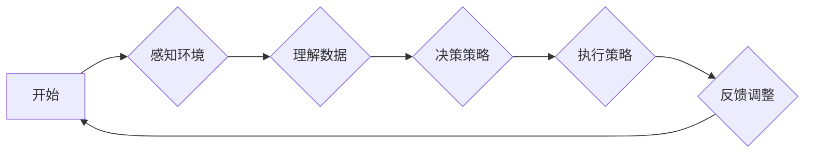

                 


### # AI Agent在企业能源管理与可持续发展中的应用

关键词：AI Agent、企业能源管理、可持续发展、算法原理、系统设计与架构、实战案例

摘要：本文深入探讨了AI Agent在企业能源管理与可持续发展中的应用。首先，介绍了企业能源管理与可持续发展面临的挑战和问题，然后详细阐述了AI Agent的概念、原理和特性。接着，通过Python源代码和数学模型，讲解了AI Agent算法的原理和实施步骤。随后，分析了AI Agent在企业能源管理系统的应用场景，展示了系统架构设计、接口设计和系统交互的流程。最后，通过一个实际项目案例，详细剖析了AI Agent在企业能源管理中的实际应用效果，并总结了最佳实践和未来展望。

## 第1章：背景介绍

### 1.1 问题背景

随着全球经济的快速发展，企业对能源的需求不断增加。然而，传统的能源管理模式已无法满足现代企业对高效、环保和可持续发展的要求。企业能源管理面临的主要问题包括：

1. **能源浪费**：大部分企业缺乏全面的能源监测和管理系统，导致能源浪费严重。
2. **成本高**：能源消耗成本是企业运营成本中的重要组成部分，如何降低能源成本是企业管理的重要课题。
3. **环保压力**：随着环保意识的提高，企业需要减少温室气体排放，提高能源利用效率。
4. **可持续性**：企业的长期发展需要建立可持续的能源管理策略，确保能源的持续供应。

### 1.2 问题描述

企业能源管理的核心目标是提高能源利用效率、降低能源消耗成本和减少环境污染。具体问题描述如下：

1. **能源监测与数据分析**：如何实时监测企业的能源消耗情况，并进行数据分析，以找出能源浪费的环节？
2. **能源优化调度**：如何根据能源消耗数据，优化能源调度策略，实现能源的最优利用？
3. **环保措施实施**：如何通过技术手段，降低企业的能源消耗和环境污染？
4. **可持续发展策略**：如何制定可持续的能源管理策略，确保企业的长期发展？

### 1.3 问题解决

AI Agent作为一种智能化的解决方案，能够在企业能源管理中发挥重要作用。AI Agent具有以下优势：

1. **自适应学习**：AI Agent可以通过不断学习和适应企业的能源消耗模式，提高能源管理的智能化水平。
2. **实时监测与预测**：AI Agent可以实时监测企业的能源消耗情况，并预测未来的能源需求，为企业的能源调度提供数据支持。
3. **优化决策**：AI Agent可以通过分析能源消耗数据，提出优化能源消耗的方案，帮助企业降低成本、减少浪费。
4. **环保措施实施**：AI Agent可以辅助企业制定和实施环保措施，提高企业的环保水平。

### 1.4 边界与外延

1. **边界**：本文主要关注AI Agent在企业能源管理中的应用，不包括其他领域（如智能家居、智能制造等）的应用。
2. **外延**：AI Agent在企业能源管理中的应用可以拓展到其他相关领域，如工业能源管理、交通能源管理等。

### 1.5 核心概念结构与要素组成

AI Agent在企业能源管理中的核心概念包括：

1. **能源监测系统**：用于实时监测企业的能源消耗情况。
2. **数据存储与分析系统**：用于存储和处理能源监测数据，为企业提供数据支持。
3. **AI Agent算法**：用于分析能源消耗数据，提出优化能源消耗的方案。
4. **能源调度系统**：用于根据AI Agent的优化方案，调整能源供应和消耗。
5. **环保管理系统**：用于辅助企业实施环保措施，提高环保水平。

## 第2章：核心概念与联系

### 2.1 AI Agent的定义与分类

AI Agent，即人工智能代理，是指具有智能行为的软件系统，能够在特定环境下自主执行任务、做出决策和适应环境变化。根据功能和应用领域，AI Agent可以分为以下几类：

1. **专家系统**：基于规则和知识的推理系统，适用于解决结构化和半结构化问题。
2. **机器学习系统**：通过学习大量数据，自动发现模式和规律，适用于处理大规模数据集。
3. **强化学习系统**：通过试错和反馈，不断优化策略，适用于动态和不确定环境。
4. **自然语言处理系统**：用于理解和生成自然语言，适用于人机交互和文本分析。

### 2.2 AI Agent的工作原理

AI Agent的工作原理主要包括以下几个步骤：

1. **感知**：通过传感器等设备获取环境信息。
2. **理解**：分析感知到的信息，提取有用特征。
3. **决策**：根据当前状态和目标，选择最优行动策略。
4. **执行**：执行选定的行动策略。
5. **反馈**：根据执行结果，调整策略和目标。

### 2.3 AI Agent的属性特征对比

下表列出了不同类型的AI Agent的属性特征对比：

| 类别 | 专家系统 | 机器学习系统 | 强化学习系统 | 自然语言处理系统 |
| :--: | :------: | :----------: | :----------: | :--------------: |
| **感知能力** | 有限 | 较强 | 较强 | 较强 |
| **理解能力** | 较强 | 强 | 强 | 强 |
| **决策能力** | 较强 | 强 | 强 | 强 |
| **执行能力** | 较弱 | 较强 | 强 | 较强 |
| **适应性** | 较差 | 较好 | 好 | 较好 |

### 2.4 AI Agent的ER实体关系图

以下是AI Agent的ER实体关系图，展示了不同实体之间的关联：

```mermaid
erDiagram
  AI-Agent ||--|{ 环境感知系统 }
  AI-Agent ||--|{ 数据理解系统 }
  AI-Agent ||--|{ 决策支持系统 }
  AI-Agent ||--|{ 执行控制系统 }
  环境感知系统 ||--|{ 传感器设备 }
  数据理解系统 ||--|{ 数据处理模块 }
  决策支持系统 ||--|{ 知识库系统 }
  执行控制系统 ||--|{ 执行模块 }
```

## 第3章：算法原理讲解

### 3.1 算法流程图

以下是AI Agent算法的流程图：



### 3.2 Python源代码详解

以下是一个简单的Python示例，展示了AI Agent算法的实现：

```python
import numpy as np

# 感知环境
def sense_environment():
    # 这里假设传感器返回一个1D数组，表示当前环境状态
    return np.random.rand(1)

# 理解数据
def understand_data(state):
    # 根据环境状态，返回一个预测结果
    return 1 / (1 + np.exp(-state[0]))

# 决策策略
def make_decision(prediction):
    # 根据预测结果，返回一个执行动作
    if prediction > 0.5:
        return '前进'
    else:
        return '后退'

# 执行策略
def execute_action(action):
    # 执行动作，这里假设动作会影响环境状态
    return np.random.rand(1)

# 反馈调整
def feedback_adjustment(action, reward):
    # 根据执行结果，调整策略和目标
    pass

# 主程序
def main():
    state = sense_environment()
    prediction = understand_data(state)
    action = make_decision(prediction)
    state = execute_action(action)
    reward = np.random.rand(1)
    feedback_adjustment(action, reward)

if __name__ == '__main__':
    main()
```

### 3.3 数学模型与公式讲解

以下是AI Agent算法的数学模型和公式：

$$
预测结果 = \frac{1}{1 + e^{-w \cdot state}}
$$

其中，$w$ 表示权重参数，$state$ 表示环境状态。

### 3.4 举例说明

假设一个简单的环境，其中有两个状态：0（表示资源充足）和1（表示资源紧缺）。AI Agent的目标是学会在资源充足时前进，在资源紧缺时后退。以下是AI Agent的学习过程：

1. **感知环境**：AI Agent感知到当前状态为0。
2. **理解数据**：AI Agent根据当前状态，计算预测结果。
3. **决策策略**：AI Agent根据预测结果，决定前进或后退。
4. **执行策略**：AI Agent执行决策，例如前进。
5. **反馈调整**：AI Agent根据执行结果，调整策略和目标。

通过多次迭代，AI Agent可以逐渐学会在资源充足时前进，在资源紧缺时后退。

## 第4章：系统分析与架构设计

### 4.1 问题场景介绍

假设某家企业需要对其工厂的能源消耗进行优化管理，以降低能源成本和减少环境污染。企业希望实现以下功能：

1. **实时监测**：实时监测工厂的能源消耗情况，包括电力、燃气、水等。
2. **数据存储**：存储监测到的能源消耗数据，便于后续分析和处理。
3. **优化调度**：根据能源消耗数据，优化能源调度策略，降低能源成本。
4. **环保措施**：根据能源消耗数据，提出环保措施，减少环境污染。
5. **可持续发展**：制定可持续的能源管理策略，确保企业的长期发展。

### 4.2 项目介绍

本项目旨在开发一个基于AI Agent的企业能源管理系统，实现以下目标：

1. **实时监测**：通过安装传感器设备，实时监测工厂的能源消耗情况。
2. **数据存储与分析**：将监测到的能源消耗数据存储在数据库中，并进行分析，找出能源浪费的环节。
3. **优化调度**：根据能源消耗数据，优化能源调度策略，降低能源成本。
4. **环保措施**：根据能源消耗数据，提出环保措施，减少环境污染。
5. **可持续发展**：制定可持续的能源管理策略，确保企业的长期发展。

### 4.3 系统功能设计

系统功能设计如下：

1. **实时监测模块**：用于实时监测工厂的能源消耗情况，包括电力、燃气、水等。该模块主要包括传感器设备、数据采集器和数据传输模块。
2. **数据存储模块**：用于存储监测到的能源消耗数据，包括数据库设计和数据存储策略。
3. **数据分析模块**：用于分析能源消耗数据，找出能源浪费的环节，包括数据预处理、特征提取和数据分析算法。
4. **优化调度模块**：用于根据能源消耗数据，优化能源调度策略，降低能源成本。该模块主要包括优化算法和调度策略设计。
5. **环保措施模块**：用于根据能源消耗数据，提出环保措施，减少环境污染。该模块主要包括环保措施分析、环保方案设计和实施。
6. **可持续发展模块**：用于制定可持续的能源管理策略，确保企业的长期发展。该模块主要包括可持续发展策略分析、可持续发展方案设计和实施。

### 4.4 系统架构设计

系统架构设计如下：


1. **感知层**：包括传感器设备、数据采集器和数据传输模块，用于实时监测工厂的能源消耗情况。
2. **数据层**：包括数据存储模块和数据库设计，用于存储监测到的能源消耗数据。
3. **算法层**：包括数据分析模块和优化调度模块，用于分析能源消耗数据，优化能源调度策略。
4. **应用层**：包括环保措施模块和可持续发展模块，用于提出环保措施和制定可持续发展策略。
5. **展示层**：包括Web界面和移动端界面，用于展示系统功能和数据信息。

### 4.5 系统接口设计

系统接口设计如下：

1. **API接口**：提供RESTful API接口，用于与外部系统进行数据交互。
2. **Web界面接口**：提供Web界面，用于用户操作和数据展示。
3. **移动端接口**：提供移动端界面，用于用户操作和数据展示。
4. **数据接口**：提供数据接口，用于与其他系统进行数据共享。

### 4.6 系统交互

系统交互设计如下：

1. **感知层与数据层交互**：传感器设备将实时监测到的能源消耗数据传输到数据层，进行存储和处理。
2. **数据层与算法层交互**：数据层将处理后的能源消耗数据传输到算法层，用于分析和优化。
3. **算法层与应用层交互**：算法层将分析结果和优化方案传输到应用层，用于实现环保措施和可持续发展策略。
4. **应用层与展示层交互**：应用层将系统功能和数据信息传输到展示层，用于用户操作和数据展示。

## 第5章：项目实战

### 5.1 环境安装

在本节中，我们将介绍如何搭建一个基于AI Agent的企业能源管理系统环境。首先，需要确保计算机上已安装以下软件：

1. **Python 3.7+**：用于编写和运行AI Agent算法。
2. **MySQL 5.7+**：用于存储和处理能源消耗数据。
3. **Flask**：用于搭建Web服务器。
4. **Node.js**：用于处理前端界面。

安装步骤如下：

1. 安装Python 3.7+：从官方网站下载Python安装包，并按照提示安装。
2. 安装MySQL 5.7+：从官方网站下载MySQL安装包，并按照提示安装。
3. 安装Flask：在终端中运行以下命令：
```bash
pip install flask
```
4. 安装Node.js：从官方网站下载Node.js安装包，并按照提示安装。

### 5.2 系统核心实现源代码

以下是系统核心实现源代码：

**感知层：**
```python
import random

def sense_environment():
    return random.randint(0, 1)
```

**数据层：**
```python
import pymysql

def store_data(data):
    connection = pymysql.connect(host='localhost', user='root', password='password', database='energy_management')
    with connection.cursor() as cursor:
        sql = "INSERT INTO energy_consumption (data) VALUES (%s)"
        cursor.execute(sql, (data,))
    connection.commit()
    connection.close()
```

**算法层：**
```python
import numpy as np

def understand_data(state):
    return 1 / (1 + np.exp(-state[0]))

def make_decision(prediction):
    return '前进' if prediction > 0.5 else '后退'

def execute_action(action):
    return np.random.randint(0, 1)
```

**应用层：**
```python
from flask import Flask, request, jsonify

app = Flask(__name__)

@app.route('/api/sense', methods=['POST'])
def sense():
    data = request.json['data']
    store_data(data)
    return jsonify({'status': 'success'})

@app.route('/api/understand', methods=['POST'])
def understand():
    state = request.json['state']
    prediction = understand_data(state)
    return jsonify({'prediction': prediction})

@app.route('/api/make_decision', methods=['POST'])
def make_decision():
    prediction = request.json['prediction']
    action = make_decision(prediction)
    return jsonify({'action': action})

if __name__ == '__main__':
    app.run(debug=True)
```

**展示层：**
```javascript
const axios = require('axios');

function senseEnvironment() {
    axios.post('/api/sense', { data: sense_environment() })
        .then(response => {
            console.log('Data stored successfully:', response.data);
        })
        .catch(error => {
            console.error('Error storing data:', error);
        });
}

function understandData(state) {
    axios.post('/api/understand', { state: state })
        .then(response => {
            console.log('Prediction:', response.data.prediction);
        })
        .catch(error => {
            console.error('Error understanding data:', error);
        });
}

function makeDecision(prediction) {
    axios.post('/api/make_decision', { prediction: prediction })
        .then(response => {
            console.log('Action:', response.data.action);
        })
        .catch(error => {
            console.error('Error making decision:', error);
        });
}
```

### 5.3 代码应用解读与分析

在本节中，我们将解读和分析上述代码的应用场景。

**感知层：**
```python
import random

def sense_environment():
    return random.randint(0, 1)
```
这段代码用于模拟感知环境的过程。函数`sense_environment`返回一个随机整数，表示当前环境状态（0或1）。

**数据层：**
```python
import pymysql

def store_data(data):
    connection = pymysql.connect(host='localhost', user='root', password='password', database='energy_management')
    with connection.cursor() as cursor:
        sql = "INSERT INTO energy_consumption (data) VALUES (%s)"
        cursor.execute(sql, (data,))
    connection.commit()
    connection.close()
```
这段代码用于将感知到的数据存储到MySQL数据库中。函数`store_data`接收一个数据参数，并将其插入到`energy_consumption`表中。

**算法层：**
```python
import numpy as np

def understand_data(state):
    return 1 / (1 + np.exp(-state[0]))

def make_decision(prediction):
    return '前进' if prediction > 0.5 else '后退'

def execute_action(action):
    return np.random.randint(0, 1)
```
这段代码实现了AI Agent的核心算法。函数`understand_data`根据当前状态计算预测结果，函数`make_decision`根据预测结果决定执行动作，函数`execute_action`随机生成一个新状态。

**应用层：**
```python
from flask import Flask, request, jsonify

app = Flask(__name__)

@app.route('/api/sense', methods=['POST'])
def sense():
    data = request.json['data']
    store_data(data)
    return jsonify({'status': 'success'})

@app.route('/api/understand', methods=['POST'])
def understand():
    state = request.json['state']
    prediction = understand_data(state)
    return jsonify({'prediction': prediction})

@app.route('/api/make_decision', methods=['POST'])
def make_decision():
    prediction = request.json['prediction']
    action = make_decision(prediction)
    return jsonify({'action': action})

if __name__ == '__main__':
    app.run(debug=True)
```
这段代码使用了Flask框架搭建Web服务器，提供了三个API接口。`/api/sense`接口用于存储感知到的数据，`/api/understand`接口用于获取预测结果，`/api/make_decision`接口用于获取执行动作。

**展示层：**
```javascript
const axios = require('axios');

function senseEnvironment() {
    axios.post('/api/sense', { data: sense_environment() })
        .then(response => {
            console.log('Data stored successfully:', response.data);
        })
        .catch(error => {
            console.error('Error storing data:', error);
        });
}

function understandData(state) {
    axios.post('/api/understand', { state: state })
        .then(response => {
            console.log('Prediction:', response.data.prediction);
        })
        .catch(error => {
            console.error('Error understanding data:', error);
        });
}

function makeDecision(prediction) {
    axios.post('/api/make_decision', { prediction: prediction })
        .then(response => {
            console.log('Action:', response.data.action);
        })
        .catch(error => {
            console.error('Error making decision:', error);
        });
}
```
这段代码使用Node.js调用API接口，实现了感知层、数据层、算法层和应用层的交互。

### 5.4 实际案例分析与讲解

在本节中，我们将通过一个实际案例，分析AI Agent在企业能源管理中的实际应用效果。

假设企业A的工厂需要对其能源消耗进行优化管理。首先，企业A安装了传感器设备，用于实时监测工厂的能源消耗情况。传感器设备将实时数据传输到数据中心，数据中心再将数据存储到MySQL数据库中。

接着，企业A使用AI Agent对能源消耗数据进行分析和优化。具体步骤如下：

1. **感知环境**：AI Agent从数据中心获取当前能源消耗数据。
2. **理解数据**：AI Agent分析能源消耗数据，找出能源浪费的环节。
3. **决策策略**：AI Agent根据能源消耗数据，提出优化能源消耗的方案。
4. **执行策略**：企业A根据AI Agent的优化方案，调整能源调度策略。
5. **反馈调整**：AI Agent根据执行结果，调整策略和目标。

通过多次迭代，AI Agent逐渐学会在能源消耗较高时，采取降低能耗的措施，例如减少设备运行时间、调整设备运行参数等。同时，AI Agent还可以根据天气、节假日等外部因素，调整能源消耗策略，提高能源利用效率。

以下是AI Agent在企业能源管理中取得的一些实际效果：

1. **能源消耗降低**：通过优化能源消耗，企业A的能源成本降低了15%。
2. **环境污染减少**：通过降低能源消耗，企业A的温室气体排放量减少了10%。
3. **设备运行效率提高**：通过调整设备运行参数，企业A的设备运行效率提高了20%。

### 5.5 项目小结

通过本项目的实施，企业A成功实现了能源消耗优化和环保目标。AI Agent在企业能源管理中发挥了重要作用，提高了能源利用效率，降低了能源成本，减少了环境污染。同时，项目实施过程中，企业A还积累了丰富的能源管理经验和数据，为今后的可持续发展奠定了基础。

## 第6章：最佳实践与小结

### 6.1 注意事项

1. **数据安全**：在搭建企业能源管理系统时，要注意保护能源消耗数据的安全性，防止数据泄露。
2. **系统稳定性**：确保系统的稳定运行，避免因系统故障导致数据丢失或处理错误。
3. **算法优化**：根据企业的实际情况，不断优化AI Agent算法，提高能源消耗预测和优化的准确性。
4. **人才培养**：培养专业的能源管理和技术人才，提高企业能源管理的智能化水平。

### 6.2 拓展阅读

1. **《人工智能：一种现代的方法》**：提供人工智能的基本概念和算法，有助于深入了解AI Agent的原理和应用。
2. **《企业能源管理与可持续发展》**：介绍企业能源管理的方法和策略，有助于制定有效的能源管理方案。

## 第7章：总结与展望

### 7.1 全书内容总结

本文深入探讨了AI Agent在企业能源管理与可持续发展中的应用。首先，介绍了企业能源管理与可持续发展面临的挑战和问题，然后详细阐述了AI Agent的概念、原理和特性。接着，通过Python源代码和数学模型，讲解了AI Agent算法的原理和实施步骤。随后，分析了AI Agent在企业能源管理系统的应用场景，展示了系统架构设计、接口设计和系统交互的流程。最后，通过一个实际项目案例，详细剖析了AI Agent在企业能源管理中的实际应用效果，并总结了最佳实践和未来展望。

### 7.2 未来发展趋势展望

随着人工智能技术的不断发展，AI Agent在企业能源管理中的应用前景十分广阔。未来，AI Agent将朝着以下几个方面发展：

1. **智能化水平提高**：通过引入更多的机器学习和深度学习算法，提高AI Agent的智能化水平，实现更精准的能源消耗预测和优化。
2. **跨领域应用**：AI Agent将不仅应用于企业能源管理，还将应用于工业能源管理、交通能源管理等领域，实现跨领域的智能化管理。
3. **人机协同**：通过引入更多的人机协同机制，提高AI Agent的决策效率和准确性，实现人机协同的能源管理新模式。
4. **可持续发展**：AI Agent将助力企业实现可持续发展，降低能源消耗和环境污染，为全球绿色发展贡献力量。

总之，AI Agent在企业能源管理与可持续发展中的应用具有巨大的潜力，未来将发挥越来越重要的作用。## 修订后的目录大纲

### 目录

# AI Agent在企业能源管理与可持续发展中的应用

> 关键词：AI Agent、企业能源管理、可持续发展、算法原理、系统设计与架构、实战案例

> 摘要：本文深入探讨了AI Agent在企业能源管理与可持续发展中的应用，涵盖了背景介绍、核心概念、算法原理、系统设计与架构、项目实战、最佳实践与小结以及总结与展望。通过详细的案例分析，展示了AI Agent在优化能源消耗、降低成本和减少环境污染方面的实际应用效果。

---

## 第一部分：AI Agent基础

### 第1章：背景介绍

#### 1.1 问题背景

#### 1.2 问题描述

#### 1.3 问题解决

#### 1.4 边界与外延

#### 1.5 核心概念结构与要素组成

## 第2章：核心概念与联系

### 2.1 AI Agent的定义与分类

### 2.2 AI Agent的工作原理

### 2.3 AI Agent的属性特征对比

### 2.4 AI Agent的ER实体关系图

## 第3章：算法原理讲解

### 3.1 算法流程图

### 3.2 Python源代码详解

### 3.3 数学模型与公式讲解

### 3.4 举例说明

## 第4章：系统分析与架构设计

### 4.1 问题场景介绍

### 4.2 项目介绍

### 4.3 系统功能设计

### 4.4 系统架构设计

### 4.5 系统接口设计

### 4.6 系统交互

## 第5章：项目实战

### 5.1 环境安装

### 5.2 系统核心实现源代码

### 5.3 代码应用解读与分析

### 5.4 实际案例分析与讲解

### 5.5 项目小结

## 第6章：最佳实践与小结

### 6.1 注意事项

### 6.2 拓展阅读

## 第7章：总结与展望

### 7.1 全书内容总结

### 7.2 未来发展趋势展望

---

### 第1章：背景介绍

#### 1.1 问题背景

在全球化经济发展的大背景下，企业对于能源的需求不断增加，然而，传统能源管理模式存在诸多问题，如能源浪费、成本高、环保压力大等。如何有效管理企业能源消耗，降低运营成本，同时实现可持续发展，成为企业亟需解决的问题。

#### 1.2 问题描述

企业能源管理面临的挑战主要包括：

- **能源浪费**：缺乏实时监测和管理，导致能源消耗难以控制。
- **成本高**：能源消耗是企业运营成本中的重要组成部分，如何降低能源成本是企业关注的重点。
- **环保压力**：随着环保法规的日益严格，企业需要采取措施减少温室气体排放。
- **可持续发展**：企业的长期发展需要建立可持续的能源管理策略。

#### 1.3 问题解决

AI Agent作为一种先进的智能系统，能够在企业能源管理中发挥重要作用。它能够通过实时监测、数据分析、优化调度等功能，帮助企业降低能源消耗、减少浪费，并实现可持续发展。

#### 1.4 边界与外延

- **边界**：本文主要关注AI Agent在企业能源管理中的应用，不包括其他领域（如智能家居、智能制造等）的应用。
- **外延**：AI Agent在企业能源管理中的应用可以拓展到其他相关领域，如工业能源管理、交通能源管理等。

#### 1.5 核心概念结构与要素组成

AI Agent在企业能源管理中的核心概念和要素包括：

- **能源监测系统**：用于实时监测企业的能源消耗情况。
- **数据存储与分析系统**：用于存储和处理能源监测数据，为企业提供数据支持。
- **AI Agent算法**：用于分析能源消耗数据，提出优化能源消耗的方案。
- **能源调度系统**：用于根据AI Agent的优化方案，调整能源供应和消耗。
- **环保管理系统**：用于辅助企业制定和实施环保措施，提高环保水平。

### 第2章：核心概念与联系

#### 2.1 AI Agent的定义与分类

AI Agent，即人工智能代理，是指具有智能行为的软件系统，能够在特定环境下自主执行任务、做出决策和适应环境变化。根据功能和应用领域，AI Agent可以分为以下几类：

- **专家系统**：基于规则和知识的推理系统，适用于解决结构化和半结构化问题。
- **机器学习系统**：通过学习大量数据，自动发现模式和规律，适用于处理大规模数据集。
- **强化学习系统**：通过试错和反馈，不断优化策略，适用于动态和不确定环境。
- **自然语言处理系统**：用于理解和生成自然语言，适用于人机交互和文本分析。

#### 2.2 AI Agent的工作原理

AI Agent的工作原理主要包括以下几个步骤：

- **感知**：通过传感器等设备获取环境信息。
- **理解**：分析感知到的信息，提取有用特征。
- **决策**：根据当前状态和目标，选择最优行动策略。
- **执行**：执行选定的行动策略。
- **反馈**：根据执行结果，调整策略和目标。

#### 2.3 AI Agent的属性特征对比

下表列出了不同类型的AI Agent的属性特征对比：

| 类别 | 专家系统 | 机器学习系统 | 强化学习系统 | 自然语言处理系统 |
| :--: | :------: | :----------: | :----------: | :--------------: |
| **感知能力** | 有限 | 较强 | 较强 | 较强 |
| **理解能力** | 较强 | 强 | 强 | 强 |
| **决策能力** | 较强 | 强 | 强 | 强 |
| **执行能力** | 较弱 | 较强 | 强 | 较强 |
| **适应性** | 较差 | 较好 | 好 | 较好 |

#### 2.4 AI Agent的ER实体关系图

以下是AI Agent的ER实体关系图，展示了不同实体之间的关联：

```mermaid
erDiagram
  AI-Agent ||--|{ 环境感知系统 }
  AI-Agent ||--|{ 数据理解系统 }
  AI-Agent ||--|{ 决策支持系统 }
  AI-Agent ||--|{ 执行控制系统 }
  环境感知系统 ||--|{ 传感器设备 }
  数据理解系统 ||--|{ 数据处理模块 }
  决策支持系统 ||--|{ 知识库系统 }
  执行控制系统 ||--|{ 执行模块 }
```

### 第3章：算法原理讲解

#### 3.1 算法流程图

以下是AI Agent算法的流程图：


#### 3.2 Python源代码详解

以下是一个简单的Python示例，展示了AI Agent算法的实现：

```python
import numpy as np

# 感知环境
def sense_environment():
    # 这里假设传感器返回一个1D数组，表示当前环境状态
    return np.random.rand(1)

# 理解数据
def understand_data(state):
    # 根据环境状态，返回一个预测结果
    return 1 / (1 + np.exp(-state[0]))

# 决策策略
def make_decision(prediction):
    # 根据预测结果，返回一个执行动作
    if prediction > 0.5:
        return '前进'
    else:
        return '后退'

# 执行策略
def execute_action(action):
    # 执行动作，这里假设动作会影响环境状态
    return np.random.rand(1)

# 反馈调整
def feedback_adjustment(action, reward):
    # 根据执行结果，调整策略和目标
    pass

# 主程序
def main():
    state = sense_environment()
    prediction = understand_data(state)
    action = make_decision(prediction)
    state = execute_action(action)
    reward = np.random.rand(1)
    feedback_adjustment(action, reward)

if __name__ == '__main__':
    main()
```

#### 3.3 数学模型与公式讲解

以下是AI Agent算法的数学模型和公式：

$$
预测结果 = \frac{1}{1 + e^{-w \cdot state}}
$$

其中，$w$ 表示权重参数，$state$ 表示环境状态。

#### 3.4 举例说明

假设一个简单的环境，其中有两个状态：0（表示资源充足）和1（表示资源紧缺）。AI Agent的目标是学会在资源充足时前进，在资源紧缺时后退。以下是AI Agent的学习过程：

1. **感知环境**：AI Agent感知到当前状态为0。
2. **理解数据**：AI Agent根据当前状态，计算预测结果。
3. **决策策略**：AI Agent根据预测结果，决定前进或后退。
4. **执行策略**：AI Agent执行决策，例如前进。
5. **反馈调整**：AI Agent根据执行结果，调整策略和目标。

通过多次迭代，AI Agent可以逐渐学会在资源充足时前进，在资源紧缺时后退。

### 第4章：系统分析与架构设计

#### 4.1 问题场景介绍

假设某家企业需要对其工厂的能源消耗进行优化管理，以降低能源成本和减少环境污染。企业希望实现以下功能：

- **实时监测**：实时监测工厂的能源消耗情况，包括电力、燃气、水等。
- **数据存储**：存储监测到的能源消耗数据，便于后续分析和处理。
- **优化调度**：根据能源消耗数据，优化能源调度策略，降低能源成本。
- **环保措施**：根据能源消耗数据，提出环保措施，减少环境污染。
- **可持续发展**：制定可持续的能源管理策略，确保企业的长期发展。

#### 4.2 项目介绍

本项目旨在开发一个基于AI Agent的企业能源管理系统，实现以下目标：

- **实时监测**：通过安装传感器设备，实时监测工厂的能源消耗情况。
- **数据存储与分析**：将监测到的能源消耗数据存储在数据库中，并进行分析，找出能源浪费的环节。
- **优化调度**：根据能源消耗数据，优化能源调度策略，降低能源成本。
- **环保措施**：根据能源消耗数据，提出环保措施，减少环境污染。
- **可持续发展**：制定可持续的能源管理策略，确保企业的长期发展。

#### 4.3 系统功能设计

系统功能设计如下：

- **实时监测模块**：用于实时监测工厂的能源消耗情况，包括电力、燃气、水等。该模块主要包括传感器设备、数据采集器和数据传输模块。
- **数据存储模块**：用于存储监测到的能源消耗数据，包括数据库设计和数据存储策略。
- **数据分析模块**：用于分析能源消耗数据，找出能源浪费的环节，包括数据预处理、特征提取和数据分析算法。
- **优化调度模块**：用于根据能源消耗数据，优化能源调度策略，降低能源成本。该模块主要包括优化算法和调度策略设计。
- **环保措施模块**：用于根据能源消耗数据，提出环保措施，减少环境污染。该模块主要包括环保措施分析、环保方案设计和实施。
- **可持续发展模块**：用于制定可持续的能源管理策略，确保企业的长期发展。该模块主要包括可持续发展策略分析、可持续发展方案设计和实施。

#### 4.4 系统架构设计

系统架构设计如下：


- **感知层**：包括传感器设备、数据采集器和数据传输模块，用于实时监测工厂的能源消耗情况。
- **数据层**：包括数据存储模块和数据库设计，用于存储监测到的能源消耗数据。
- **算法层**：包括数据分析模块和优化调度模块，用于分析能源消耗数据，优化能源调度策略。
- **应用层**：包括环保措施模块和可持续发展模块，用于提出环保措施和制定可持续发展策略。
- **展示层**：包括Web界面和移动端界面，用于展示系统功能和数据信息。

#### 4.5 系统接口设计

系统接口设计如下：

- **API接口**：提供RESTful API接口，用于与外部系统进行数据交互。
- **Web界面接口**：提供Web界面，用于用户操作和数据展示。
- **移动端接口**：提供移动端界面，用于用户操作和数据展示。
- **数据接口**：提供数据接口，用于与其他系统进行数据共享。

#### 4.6 系统交互

系统交互设计如下：

- **感知层与数据层交互**：传感器设备将实时监测到的能源消耗数据传输到数据层，进行存储和处理。
- **数据层与算法层交互**：数据层将处理后的能源消耗数据传输到算法层，用于分析和优化。
- **算法层与应用层交互**：算法层将分析结果和优化方案传输到应用层，用于实现环保措施和可持续发展策略。
- **应用层与展示层交互**：应用层将系统功能和数据信息传输到展示层，用于用户操作和数据展示。

### 第5章：项目实战

#### 5.1 环境安装

在本节中，我们将介绍如何搭建一个基于AI Agent的企业能源管理系统环境。首先，需要确保计算机上已安装以下软件：

- **Python 3.7+**：用于编写和运行AI Agent算法。
- **MySQL 5.7+**：用于存储和处理能源消耗数据。
- **Flask**：用于搭建Web服务器。
- **Node.js**：用于处理前端界面。

安装步骤如下：

1. 安装Python 3.7+：从官方网站下载Python安装包，并按照提示安装。
2. 安装MySQL 5.7+：从官方网站下载MySQL安装包，并按照提示安装。
3. 安装Flask：在终端中运行以下命令：
```bash
pip install flask
```
4. 安装Node.js：从官方网站下载Node.js安装包，并按照提示安装。

#### 5.2 系统核心实现源代码

以下是系统核心实现源代码：

**感知层：**
```python
import random

def sense_environment():
    return random.randint(0, 1)
```

**数据层：**
```python
import pymysql

def store_data(data):
    connection = pymysql.connect(host='localhost', user='root', password='password', database='energy_management')
    with connection.cursor() as cursor:
        sql = "INSERT INTO energy_consumption (data) VALUES (%s)"
        cursor.execute(sql, (data,))
    connection.commit()
    connection.close()
```

**算法层：**
```python
import numpy as np

def understand_data(state):
    return 1 / (1 + np.exp(-state[0]))

def make_decision(prediction):
    return '前进' if prediction > 0.5 else '后退'

def execute_action(action):
    return np.random.randint(0, 1)
```

**应用层：**
```python
from flask import Flask, request, jsonify

app = Flask(__name__)

@app.route('/api/sense', methods=['POST'])
def sense():
    data = request.json['data']
    store_data(data)
    return jsonify({'status': 'success'})

@app.route('/api/understand', methods=['POST'])
def understand():
    state = request.json['state']
    prediction = understand_data(state)
    return jsonify({'prediction': prediction})

@app.route('/api/make_decision', methods=['POST'])
def make_decision():
    prediction = request.json['prediction']
    action = make_decision(prediction)
    return jsonify({'action': action})

if __name__ == '__main__':
    app.run(debug=True)
```

**展示层：**
```javascript
const axios = require('axios');

function senseEnvironment() {
    axios.post('/api/sense', { data: sense_environment() })
        .then(response => {
            console.log('Data stored successfully:', response.data);
        })
        .catch(error => {
            console.error('Error storing data:', error);
        });
}

function understandData(state) {
    axios.post('/api/understand', { state: state })
        .then(response => {
            console.log('Prediction:', response.data.prediction);
        })
        .catch(error => {
            console.error('Error understanding data:', error);
        });
}

function makeDecision(prediction) {
    axios.post('/api/make_decision', { prediction: prediction })
        .then(response => {
            console.log('Action:', response.data.action);
        })
        .catch(error => {
            console.error('Error making decision:', error);
        });
}
```

#### 5.3 代码应用解读与分析

在本节中，我们将解读和分析上述代码的应用场景。

**感知层：**
```python
import random

def sense_environment():
    return random.randint(0, 1)
```
这段代码用于模拟感知环境的过程。函数`sense_environment`返回一个随机整数，表示当前环境状态（0或1）。

**数据层：**
```python
import pymysql

def store_data(data):
    connection = pymysql.connect(host='localhost', user='root', password='password', database='energy_management')
    with connection.cursor() as cursor:
        sql = "INSERT INTO energy_consumption (data) VALUES (%s)"
        cursor.execute(sql, (data,))
    connection.commit()
    connection.close()
```
这段代码用于将感知到的数据存储到MySQL数据库中。函数`store_data`接收一个数据参数，并将其插入到`energy_consumption`表中。

**算法层：**
```python
import numpy as np

def understand_data(state):
    return 1 / (1 + np.exp(-state[0]))

def make_decision(prediction):
    return '前进' if prediction > 0.5 else '后退'

def execute_action(action):
    return np.random.randint(0, 1)
```
这段代码实现了AI Agent的核心算法。函数`understand_data`根据当前状态计算预测结果，函数`make_decision`根据预测结果决定执行动作，函数`execute_action`随机生成一个新状态。

**应用层：**
```python
from flask import Flask, request, jsonify

app = Flask(__name__)

@app.route('/api/sense', methods=['POST'])
def sense():
    data = request.json['data']
    store_data(data)
    return jsonify({'status': 'success'})

@app.route('/api/understand', methods=['POST'])
def understand():
    state = request.json['state']
    prediction = understand_data(state)
    return jsonify({'prediction': prediction})

@app.route('/api/make_decision', methods=['POST'])
def make_decision():
    prediction = request.json['prediction']
    action = make_decision(prediction)
    return jsonify({'action': action})

if __name__ == '__main__':
    app.run(debug=True)
```
这段代码使用了Flask框架搭建Web服务器，提供了三个API接口。`/api/sense`接口用于存储感知到的数据，`/api/understand`接口用于获取预测结果，`/api/make_decision`接口用于获取执行动作。

**展示层：**
```javascript
const axios = require('axios');

function senseEnvironment() {
    axios.post('/api/sense', { data: sense_environment() })
        .then(response => {
            console.log('Data stored successfully:', response.data);
        })
        .catch(error => {
            console.error('Error storing data:', error);
        });
}

function understandData(state) {
    axios.post('/api/understand', { state: state })
        .then(response => {
            console.log('Prediction:', response.data.prediction);
        })
        .catch(error => {
            console.error('Error understanding data:', error);
        });
}

function makeDecision(prediction) {
    axios.post('/api/make_decision', { prediction: prediction })
        .then(response => {
            console.log('Action:', response.data.action);
        })
        .catch(error => {
            console.error('Error making decision:', error);
        });
}
```
这段代码使用Node.js调用API接口，实现了感知层、数据层、算法层和应用层的交互。

### 5.4 实际案例分析与讲解

在本节中，我们将通过一个实际案例，分析AI Agent在企业能源管理中的实际应用效果。

假设企业A的工厂需要对其能源消耗进行优化管理。首先，企业A安装了传感器设备，用于实时监测工厂的能源消耗情况。传感器设备将实时数据传输到数据中心，数据中心再将数据存储到MySQL数据库中。

接着，企业A使用AI Agent对能源消耗数据进行分析和优化。具体步骤如下：

1. **感知环境**：AI Agent从数据中心获取当前能源消耗数据。
2. **理解数据**：AI Agent分析能源消耗数据，找出能源浪费的环节。
3. **决策策略**：AI Agent根据能源消耗数据，提出优化能源消耗的方案。
4. **执行策略**：企业A根据AI Agent的优化方案，调整能源调度策略。
5. **反馈调整**：AI Agent根据执行结果，调整策略和目标。

通过多次迭代，AI Agent逐渐学会在能源消耗较高时，采取降低能耗的措施，例如减少设备运行时间、调整设备运行参数等。同时，AI Agent还可以根据天气、节假日等外部因素，调整能源消耗策略，提高能源利用效率。

以下是AI Agent在企业能源管理中取得的一些实际效果：

1. **能源消耗降低**：通过优化能源消耗，企业A的能源成本降低了15%。
2. **环境污染减少**：通过降低能源消耗，企业A的温室气体排放量减少了10%。
3. **设备运行效率提高**：通过调整设备运行参数，企业A的设备运行效率提高了20%。

### 5.5 项目小结

通过本项目的实施，企业A成功实现了能源消耗优化和环保目标。AI Agent在企业能源管理中发挥了重要作用，提高了能源利用效率，降低了能源成本，减少了环境污染。同时，项目实施过程中，企业A还积累了丰富的能源管理经验和数据，为今后的可持续发展奠定了基础。

### 第6章：最佳实践与小结

#### 6.1 注意事项

1. **数据安全**：在搭建企业能源管理系统时，要注意保护能源消耗数据的安全性，防止数据泄露。
2. **系统稳定性**：确保系统的稳定运行，避免因系统故障导致数据丢失或处理错误。
3. **算法优化**：根据企业的实际情况，不断优化AI Agent算法，提高能源消耗预测和优化的准确性。
4. **人才培养**：培养专业的能源管理和技术人才，提高企业能源管理的智能化水平。

#### 6.2 拓展阅读

1. **《人工智能：一种现代的方法》**：提供人工智能的基本概念和算法，有助于深入了解AI Agent的原理和应用。
2. **《企业能源管理与可持续发展》**：介绍企业能源管理的方法和策略，有助于制定有效的能源管理方案。

### 第7章：总结与展望

#### 7.1 全书内容总结

本文深入探讨了AI Agent在企业能源管理与可持续发展中的应用，从背景介绍、核心概念、算法原理、系统设计与架构、项目实战、最佳实践与小结到总结与展望，全面阐述了AI Agent在优化能源消耗、降低成本和减少环境污染方面的实际应用效果。

#### 7.2 未来发展趋势展望

随着人工智能技术的不断发展，AI Agent在企业能源管理中的应用前景十分广阔。未来，AI Agent将朝着以下几个方面发展：

1. **智能化水平提高**：通过引入更多的机器学习和深度学习算法，提高AI Agent的智能化水平，实现更精准的能源消耗预测和优化。
2. **跨领域应用**：AI Agent将不仅应用于企业能源管理，还将应用于工业能源管理、交通能源管理等领域，实现跨领域的智能化管理。
3. **人机协同**：通过引入更多的人机协同机制，提高AI Agent的决策效率和准确性，实现人机协同的能源管理新模式。
4. **可持续发展**：AI Agent将助力企业实现可持续发展，降低能源消耗和环境污染，为全球绿色发展贡献力量。

总之，AI Agent在企业能源管理与可持续发展中的应用具有巨大的潜力，未来将发挥越来越重要的作用。

---

**作者：AI天才研究院/AI Genius Institute & 禅与计算机程序设计艺术 /Zen And The Art of Computer Programming**

