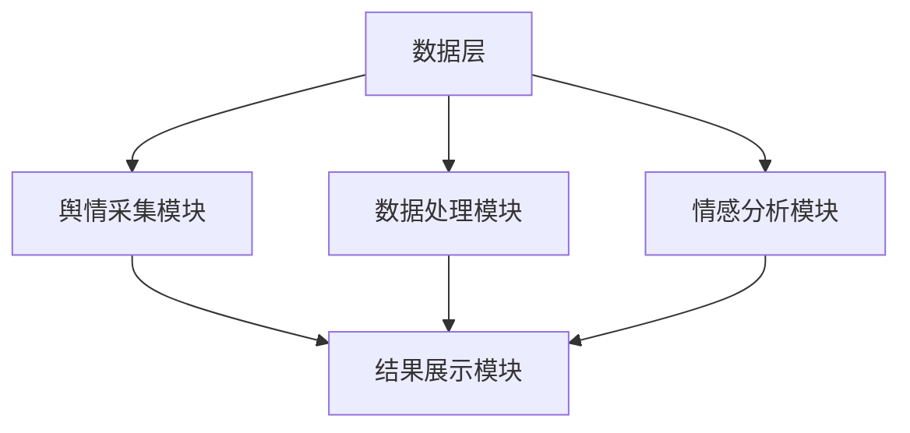
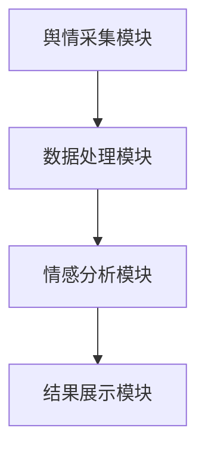
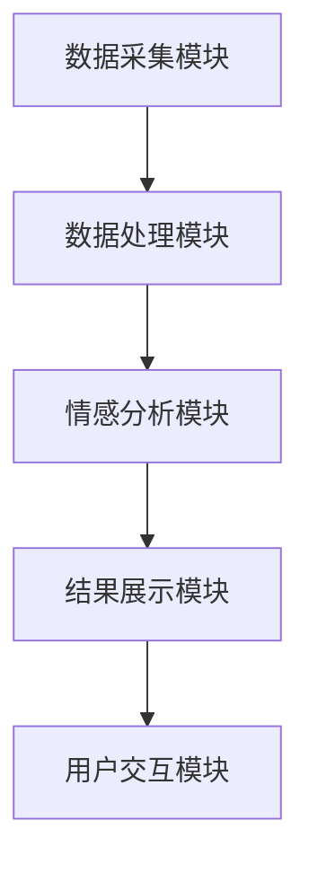

                 

## 引言

在数字化时代，企业面临着前所未有的挑战与机遇。随着互联网的普及和社交媒体的兴起，企业品牌形象和声誉的建设变得日益重要。此时，企业舆情分析与品牌情感监控成为决策者制定战略、维护品牌形象的重要工具。在这种背景下，AI Agent（人工智能代理）作为一种新兴的技术手段，逐渐成为企业舆情分析和品牌情感监控的利器。

### 文章关键词

- AI Agent
- 企业舆情分析
- 品牌情感监控
- 数据采集
- 情感分析算法
- 系统设计与实现

### 摘要

本文旨在深入探讨AI Agent在企业舆情分析与品牌情感监控中的应用。首先，我们将介绍AI Agent的基本概念和特点，以及其在企业舆情分析与品牌情感监控中的重要性。接着，文章将逐步分析AI Agent在企业舆情分析中的数据采集与处理技术，以及情感分析算法的原理和应用。最后，我们将通过一个具体的案例，展示AI Agent在企业舆情分析和品牌情感监控中的实际应用和效果。

## 目录大纲

1. 引言
2. 第一部分: AI Agent在企业舆情分析与品牌情感监控中的应用背景与核心概念
   1.1 AI Agent概述
   1.2 企业舆情分析与品牌情感监控的重要性
   1.3 AI Agent在企业舆情分析与品牌情感监控中的应用场景
   1.4 本章小结
3. 第二部分: AI Agent在企业舆情分析中的应用
   2.1 数据采集与处理
   2.2 数据预处理
   2.3 数据可视化
   2.4 本章小结
4. 第三部分: AI Agent在品牌情感监控中的应用
   3.1 情感分析算法原理
   3.2 情感分析算法分类
   3.3 情感分析算法原理详解
   3.4 本章小结
5. 第四部分: AI Agent在舆情分析中的应用实践
   4.1 系统架构设计与实现
   4.2 系统实现
   4.3 系统测试与评估
   4.4 本章小结
6. 第五部分: AI Agent在品牌情感监控中的应用实践
   5.1 系统设计与实现
   5.2 系统测试与评估
   5.3 本章小结
7. 结论与未来展望
8. 作者信息

### 第一部分: AI Agent在企业舆情分析与品牌情感监控中的应用背景与核心概念

在当今数字化时代，企业面临的信息量日益庞大，如何有效地收集、分析和利用这些信息，成为企业决策者和管理者的重要课题。特别是企业舆情分析与品牌情感监控，它们在帮助企业了解市场动态、维护品牌形象、制定战略决策方面起着至关重要的作用。而AI Agent（人工智能代理）作为一种新兴的技术手段，正逐渐成为企业舆情分析和品牌情感监控的重要工具。

#### 1.1 AI Agent概述

AI Agent，即人工智能代理，是指能够自主执行任务、与环境交互的智能体。它具备以下几个核心特征：

- **自主性**：AI Agent能够根据预设目标和环境变化，自主决策和行动。
- **交互性**：AI Agent能够通过自然语言处理、图像识别等技术手段，与人类和环境进行交互。
- **适应性**：AI Agent能够在执行任务的过程中，不断学习和适应新的环境和任务。

与传统的人工智能系统不同，AI Agent更加注重与人类和环境的互动，能够模拟人类的思维方式，进行复杂的推理和决策。

#### 1.2 企业舆情分析与品牌情感监控的重要性

企业舆情分析是指通过技术手段，对互联网上的信息进行收集、处理和分析，以了解企业或品牌在社会舆论中的形象和趋势。品牌情感监控则是对企业或品牌在公众中的情感倾向进行跟踪和分析，以评估品牌的社会影响力。

- **市场洞察**：通过舆情分析和品牌情感监控，企业可以实时了解市场动态，把握消费者需求，从而制定更有针对性的市场策略。
- **风险预警**：及时发现和应对潜在的品牌危机，避免负面舆情对企业造成重大损失。
- **决策支持**：基于舆情分析和品牌情感监控的数据分析结果，企业可以更科学地制定战略决策，提高市场竞争力。

#### 1.3 人工智能在舆情分析和品牌情感监控中的应用

人工智能技术在舆情分析和品牌情感监控中的应用，主要体现在以下几个方面：

- **数据采集**：通过爬虫技术、社交媒体数据采集等手段，获取大量的舆情数据。
- **数据处理**：利用自然语言处理技术，对采集到的数据进行清洗、格式化和特征提取。
- **情感分析**：通过情感分析算法，对处理后的文本数据进行分析，提取情感倾向和关键词。
- **可视化展示**：将分析结果通过可视化工具进行展示，帮助企业更好地理解舆情和品牌情感。

#### 1.4 AI Agent在企业舆情分析与品牌情感监控中的应用场景

AI Agent在企业舆情分析和品牌情感监控中的应用场景非常广泛，主要包括以下几个方面：

- **社交媒体监控**：通过AI Agent实时监控社交媒体平台上的相关讨论和趋势，及时捕捉市场动态。
- **客户反馈分析**：自动收集和分析客户的反馈信息，帮助企业了解客户需求和市场反馈。
- **品牌声誉管理**：实时监控品牌在公众中的声誉，及时识别和应对负面舆情，维护品牌形象。

#### 1.5 本章小结

本部分介绍了AI Agent的基本概念、企业舆情分析与品牌情感监控的重要性，以及人工智能在舆情分析和品牌情感监控中的应用。AI Agent作为一种新兴的技术手段，正逐渐成为企业舆情分析和品牌情感监控的重要工具。在接下来的章节中，我们将进一步探讨AI Agent在企业舆情分析和品牌情感监控中的应用细节。

## 第一部分: AI Agent在企业舆情分析与品牌情感监控中的应用背景与核心概念

### 1.1 AI Agent概述

AI Agent，即人工智能代理，是一种能够模拟人类智能行为、自主执行任务并适应环境的计算机系统。它基于人工智能技术，通过感知、推理和学习等机制，实现与环境的互动和自主决策。AI Agent在计算机科学和人工智能领域具有广泛的应用，尤其在自然语言处理、机器人技术、智能交通、智能家居等领域表现出强大的潜力。

#### 1.1.1 AI Agent的概念

AI Agent的基本概念可以概括为以下几点：

1. **自主性**：AI Agent能够在没有人类干预的情况下，自主执行任务，进行决策和行动。
2. **感知**：AI Agent能够通过传感器获取环境信息，如视觉、听觉、触觉等，实现对环境的感知和理解。
3. **推理**：AI Agent能够基于感知到的信息，进行逻辑推理和判断，以确定下一步的行动。
4. **学习**：AI Agent能够通过不断的学习和经验积累，优化自身的决策和行为，提高任务执行效率。

#### 1.1.2 AI Agent的特点

AI Agent具有以下几个显著特点：

1. **灵活性**：AI Agent可以根据不同的任务和环境，灵活调整其行为和策略。
2. **适应性**：AI Agent能够在执行任务的过程中，不断适应新的环境和变化，提高任务成功率。
3. **智能性**：AI Agent具备较强的智能能力，能够进行复杂的推理、学习和决策。
4. **交互性**：AI Agent能够与人类和计算机系统进行有效交互，实现信息的传递和共享。

#### 1.1.3 AI Agent与传统AI的区别

与传统的人工智能系统相比，AI Agent具有以下几个显著区别：

1. **主动性**：传统AI系统主要依赖于人类提供的输入数据，而AI Agent能够自主感知环境和任务，主动采取行动。
2. **灵活性**：AI Agent能够根据环境变化和任务需求，灵活调整其行为和策略，而传统AI系统往往只能针对特定的问题进行优化。
3. **自主学习**：AI Agent具备自主学习能力，可以通过经验积累和持续学习，优化自身的性能和行为。

#### 1.1.4 AI Agent的应用领域

AI Agent在多个领域具有广泛的应用，以下是一些典型的应用场景：

1. **智能家居**：AI Agent可以自动控制家居设备，如空调、照明和安防系统，提供便捷、舒适和安全的居住环境。
2. **智能客服**：AI Agent可以模拟人类客服，自动回答用户的问题，提供在线服务和帮助。
3. **自动驾驶**：AI Agent可以用于自动驾驶汽车，通过感知环境和进行自主决策，实现自动驾驶功能。
4. **医疗诊断**：AI Agent可以辅助医生进行疾病诊断，通过分析患者数据，提供诊断建议和治疗方案。

通过上述分析，可以看出AI Agent在数字化时代的重要性。作为一种新兴的人工智能技术，AI Agent在多个领域具有广泛的应用前景，为企业舆情分析和品牌情感监控提供了强大的技术支持。

### 1.2 企业舆情分析与品牌情感监控的重要性

企业舆情分析和品牌情感监控在当今数字化时代的重要性不言而喻。随着互联网和社交媒体的普及，企业的信息传播速度大大加快，公众对于企业品牌的认知和评价也变得更加即时和广泛。因此，企业舆情分析和品牌情感监控成为了企业管理者制定战略决策、维护品牌形象和提升市场竞争力的重要工具。

#### 1.2.1 舆情分析的定义与作用

舆情分析是指通过技术手段，对互联网上的信息进行收集、处理和分析，以了解公众对企业或品牌的看法和态度。舆情分析的作用主要体现在以下几个方面：

1. **市场洞察**：通过舆情分析，企业可以实时了解市场动态、消费者需求和竞争态势，从而制定更有针对性的市场策略。
2. **风险预警**：舆情分析可以帮助企业及时发现潜在的负面舆情和风险，提前采取措施，避免对企业造成重大损失。
3. **品牌形象维护**：通过舆情分析，企业可以了解公众对品牌的看法和评价，及时发现品牌形象问题，并采取有效的措施进行改善。

#### 1.2.2 品牌情感监控的意义

品牌情感监控是指通过技术手段，对公众对企业或品牌的情感倾向进行跟踪和分析，以评估品牌的社会影响力和公众认可度。品牌情感监控的意义主要体现在以下几个方面：

1. **品牌影响力评估**：通过品牌情感监控，企业可以了解品牌在公众中的影响力，以及品牌形象在市场中的表现。
2. **消费者需求分析**：品牌情感监控可以帮助企业了解消费者的情感需求和偏好，从而优化产品和服务，提升消费者满意度。
3. **营销策略调整**：通过品牌情感监控，企业可以了解消费者的情感反应和市场反馈，及时调整营销策略，提高营销效果。

#### 1.2.3 人工智能在舆情分析和品牌情感监控中的应用

随着人工智能技术的快速发展，人工智能在舆情分析和品牌情感监控中的应用日益广泛。人工智能技术的主要应用包括以下几个方面：

1. **数据采集**：人工智能技术可以通过爬虫、社交媒体数据采集等技术手段，快速、高效地获取大量的舆情数据。
2. **数据处理**：人工智能技术可以利用自然语言处理、文本挖掘等技术，对采集到的数据进行清洗、格式化和特征提取，为后续分析提供基础。
3. **情感分析**：人工智能技术可以通过情感分析算法，对处理后的文本数据进行分析，提取情感倾向和关键词，为企业提供有价值的洞察。
4. **可视化展示**：人工智能技术可以将分析结果通过可视化工具进行展示，帮助企业更好地理解和利用舆情和情感数据。

#### 1.2.4 AI Agent在舆情分析和品牌情感监控中的应用优势

AI Agent作为一种新兴的人工智能技术，在舆情分析和品牌情感监控中具有显著的应用优势：

1. **自动化**：AI Agent可以自动执行舆情分析和品牌情感监控任务，降低人工成本，提高工作效率。
2. **实时性**：AI Agent可以实时监控互联网上的信息，快速捕捉市场动态和消费者反馈，为企业提供及时的决策支持。
3. **智能性**：AI Agent具备较强的智能能力，能够通过学习和适应，不断提高舆情分析和品牌情感监控的准确性。
4. **适应性**：AI Agent可以根据不同的业务需求和场景，灵活调整其行为和策略，满足企业的多样化需求。

综上所述，企业舆情分析和品牌情感监控在数字化时代具有重要的战略意义。通过人工智能和AI Agent技术的应用，企业可以更加高效、准确地了解市场动态和消费者需求，从而制定更加科学、有效的战略决策，提升市场竞争力。

### 1.3 AI Agent在企业舆情分析与品牌情感监控中的应用场景

AI Agent作为一种先进的人工智能技术，在企业舆情分析与品牌情感监控中具有广泛的应用场景，能够为企业提供实时、高效、精准的信息分析和决策支持。以下是AI Agent在具体应用场景中的详细介绍：

#### 1.3.1 社交媒体监控

社交媒体监控是AI Agent在企业舆情分析和品牌情感监控中最常见和最重要的应用场景之一。通过AI Agent，企业可以实时监控社交媒体平台（如微博、微信、Twitter、Facebook等）上的相关讨论和趋势，捕捉用户对品牌的情感倾向和意见反馈。具体应用包括：

- **趋势分析**：AI Agent可以分析社交媒体上的热点话题、趋势和趋势变化，帮助企业管理者及时了解市场动态和消费者兴趣点。
- **舆情监控**：AI Agent可以实时捕捉社交媒体上的负面言论和问题，为企业提供风险预警，帮助企业及时采取措施应对潜在的品牌危机。
- **情感分析**：AI Agent可以分析社交媒体上的用户评论和讨论，提取情感倾向和关键词，帮助企业管理者了解消费者对品牌的情感态度和满意度。

#### 1.3.2 客户反馈分析

客户反馈分析是另一个重要的应用场景，AI Agent可以自动收集和分析客户反馈信息，帮助企业了解客户需求和市场反馈。具体应用包括：

- **意见收集**：AI Agent可以通过社交媒体、客服系统、调查问卷等多种渠道收集客户反馈，帮助企业管理者全面了解客户意见和需求。
- **情感分析**：AI Agent可以对客户反馈进行情感分析，提取情感倾向和关键词，帮助企业管理者了解客户情感态度和满意度。
- **趋势分析**：AI Agent可以分析客户反馈的趋势，发现客户关注的问题和需求变化，为企业提供改进产品和服务的依据。

#### 1.3.3 品牌声誉管理

品牌声誉管理是AI Agent在舆情分析和品牌情感监控中的另一个关键应用场景。通过AI Agent，企业可以实时监控和评估品牌在公众中的声誉，维护品牌形象。具体应用包括：

- **负面舆情监控**：AI Agent可以实时监控互联网上的负面言论和报道，为企业提供风险预警，帮助企业管理者及时采取措施应对品牌危机。
- **声誉评估**：AI Agent可以分析品牌在公众中的声誉状况，通过情感分析和趋势分析，评估品牌的社会影响力和公众认可度。
- **策略调整**：AI Agent可以根据品牌声誉分析结果，提供有针对性的策略建议，帮助企业制定和调整品牌形象管理策略。

#### 1.3.4 市场监测

市场监测是AI Agent在舆情分析和品牌情感监控中的另一个重要应用场景。通过AI Agent，企业可以实时监测市场动态和竞争态势，为决策提供支持。具体应用包括：

- **竞争分析**：AI Agent可以分析竞争对手的品牌宣传、市场活动和用户评价，帮助企业了解竞争对手的优势和劣势。
- **趋势分析**：AI Agent可以分析市场趋势和消费者需求变化，帮助企业及时调整市场策略。
- **机会识别**：AI Agent可以帮助企业识别市场机会和潜在风险，为业务拓展和风险控制提供支持。

综上所述，AI Agent在企业舆情分析与品牌情感监控中的应用场景非常广泛，包括社交媒体监控、客户反馈分析、品牌声誉管理和市场监测等多个方面。通过AI Agent的应用，企业可以更加高效、准确地了解市场动态和消费者需求，从而制定更加科学、有效的战略决策，提升市场竞争力。

### 1.4 本章小结

本部分介绍了AI Agent在企业舆情分析与品牌情感监控中的应用背景与核心概念。首先，我们探讨了AI Agent的基本概念、特点和与传统AI的区别，并阐述了其在计算机科学和人工智能领域的广泛应用。接着，我们深入分析了企业舆情分析与品牌情感监控的重要性，以及人工智能在舆情分析和品牌情感监控中的应用。最后，我们详细介绍了AI Agent在企业舆情分析与品牌情感监控中的具体应用场景，包括社交媒体监控、客户反馈分析、品牌声誉管理和市场监测等。通过这些应用场景，我们可以看到AI Agent在提升企业舆情分析和品牌情感监控效率、准确性和智能性方面的重要作用。在接下来的章节中，我们将进一步探讨AI Agent在企业舆情分析中的数据采集与处理技术，以及情感分析算法的原理和应用。

## 第二部分: AI Agent在企业舆情分析中的应用

在当今数字化时代，企业舆情分析已成为企业了解市场动态、消费者需求和竞争态势的重要手段。AI Agent作为一种新兴的人工智能技术，在舆情分析中发挥着至关重要的作用。本部分将详细介绍AI Agent在企业舆情分析中的应用，主要包括数据采集与处理、数据预处理和数据可视化等内容。

### 2.1 数据采集与处理

数据采集是舆情分析的基础环节，涉及到从各种来源获取与舆情相关的数据。AI Agent在企业舆情分析中的数据采集主要通过以下几种技术手段实现：

#### 2.1.1 社交媒体数据采集

社交媒体平台（如微博、微信、Twitter、Facebook等）是舆情数据的重要来源。AI Agent可以通过社交媒体数据采集技术，实时获取用户在平台上的讨论、评论和转发等信息。具体方法包括：

1. **公开API调用**：许多社交媒体平台提供公开API，允许开发人员通过API接口获取平台数据。AI Agent可以利用这些API接口，批量获取用户发布的文本、图片和视频等数据。
2. **网络爬虫技术**：对于没有公开API的社交媒体平台，AI Agent可以采用网络爬虫技术，模拟用户的操作行为，从网页中获取舆情数据。网络爬虫技术具有较高的灵活性和扩展性，但需要遵循平台的使用规范，避免过度采集或滥用数据。

#### 2.1.2 网络爬虫技术

网络爬虫（Web Crawler）是一种自动化程序，用于在互联网上获取信息。AI Agent可以利用网络爬虫技术，从网站、论坛、博客等不同类型的网络平台上采集舆情数据。具体方法包括：

1. **网页抓取**：AI Agent通过模拟用户的浏览器行为，自动访问网页，抓取网页上的文本、图片和视频等内容。
2. **链接跟踪**：AI Agent可以从初始网页开始，通过跟踪网页中的链接，逐层深入爬取更多的舆情数据。
3. **数据清洗**：在爬取过程中，AI Agent需要对采集到的数据进行清洗，去除重复、无关或错误的信息，确保数据的质量和准确性。

#### 2.1.3 数据采集的挑战与解决方案

数据采集过程中面临着多种挑战，如数据量大、数据质量参差不齐、平台政策限制等。针对这些挑战，可以采取以下解决方案：

1. **分布式采集**：采用分布式爬虫技术，将采集任务分散到多个节点，提高采集效率，降低单点故障风险。
2. **数据去重**：在采集过程中，采用去重算法，过滤重复的数据，确保数据的一致性和准确性。
3. **遵守平台规范**：在采集数据时，遵循社交媒体平台的使用规范，避免违反平台政策，如设置采集频率、使用合法的IP地址等。
4. **数据清洗**：在采集完成后，对数据进行清洗，去除重复、无关或错误的信息，提高数据的质量和可用性。

### 2.2 数据预处理

数据预处理是舆情分析中至关重要的一步，其目的是对采集到的原始数据进行清洗、格式化和特征提取，为后续分析提供高质量的数据。AI Agent在数据预处理中发挥着关键作用，主要包括以下任务：

#### 2.2.1 数据清洗

数据清洗是指对原始数据进行清理和净化，去除重复、错误、无关的数据，确保数据的质量和一致性。具体方法包括：

1. **去除重复数据**：通过对比数据项的属性或特征，去除重复的数据项，确保数据的一致性。
2. **处理缺失值**：对于缺失的数据，可以根据具体情况采取填充或删除的方法，确保数据的完整性。
3. **去除噪声数据**：通过去除噪声数据，提高数据的质量和可用性。噪声数据包括误分类数据、错误标记数据等。

#### 2.2.2 数据格式化

数据格式化是指将不同格式、不同结构的数据转换为统一的格式和结构，便于后续分析和处理。具体方法包括：

1. **统一编码**：将不同编码格式的文本数据转换为统一的编码格式，如将中文文本统一转换为UTF-8编码。
2. **数据规范化**：将不同类型的数据转换为统一类型，如将日期数据转换为YYYY-MM-DD格式。
3. **数据标准化**：将不同量纲的数据转换为相同的量纲，如将不同单位的价格数据转换为同一单位。

#### 2.2.3 特征工程

特征工程是指通过构建和选择合适的特征，提高模型的效果和泛化能力。在舆情分析中，特征工程主要包括以下任务：

1. **文本分词**：将文本数据分割为词语或词组，为后续的文本处理和情感分析提供基础。
2. **词性标注**：对文本中的词语进行词性标注，区分名词、动词、形容词等，有助于提高文本分析的效果。
3. **停用词过滤**：去除常见的无意义停用词，如“的”、“了”、“在”等，减少噪声数据对模型的影响。
4. **特征提取**：通过词频、词频逆文档频率（TF-IDF）、词嵌入（Word Embedding）等方法，提取文本数据中的关键特征。

### 2.3 数据可视化

数据可视化是将数据以图形化的方式呈现，帮助用户直观地理解和分析数据。AI Agent在数据可视化中发挥着重要作用，可以将复杂的数据分析和结果以直观的图形形式展示，便于用户理解。具体方法包括：

#### 2.3.1 可视化工具介绍

1. **matplotlib**：matplotlib是一个Python的绘图库，可以生成各种类型的图表，如折线图、柱状图、饼图等。
2. **seaborn**：seaborn是基于matplotlib的统计绘图库，提供多种美观的统计图表，适用于数据分析和可视化。
3. **Plotly**：Plotly是一个交互式数据可视化库，支持多种图表类型，可以生成高质量的交互式图表。
4. **ECharts**：ECharts是一个使用JavaScript编写的开源可视化库，支持多种图表类型和丰富的交互功能。

#### 2.3.2 数据可视化实践

数据可视化实践主要包括以下步骤：

1. **数据准备**：准备好要进行可视化的数据，包括清洗、格式化和特征提取后的数据。
2. **选择图表类型**：根据数据的特性和分析需求，选择合适的图表类型，如折线图、柱状图、饼图等。
3. **数据绑定**：将数据与图表进行绑定，设置图表的属性和样式，如颜色、标签、线条样式等。
4. **图表生成**：利用可视化库生成图表，并将其嵌入到网页或报告中。

通过数据可视化，企业可以更加直观地了解舆情数据的分布、趋势和关系，从而更好地指导决策和优化策略。

### 2.4 本章小结

本部分详细介绍了AI Agent在企业舆情分析中的应用，包括数据采集与处理、数据预处理和数据可视化等内容。通过AI Agent的应用，企业可以高效地采集、处理和分析舆情数据，从而更好地了解市场动态、消费者需求和竞争态势，制定科学的决策和策略。在接下来的章节中，我们将进一步探讨AI Agent在品牌情感监控中的应用，深入分析情感分析算法的原理和应用。

## 第三部分: AI Agent在品牌情感监控中的应用

品牌情感监控是衡量品牌在市场中的影响力和社会认可度的重要手段。通过分析公众对品牌的情感倾向，企业可以了解消费者对品牌的满意度和忠诚度，从而优化产品和服务，提升品牌价值。AI Agent在品牌情感监控中发挥着至关重要的作用，能够实现高效、准确和实时的情感分析。本部分将深入探讨AI Agent在品牌情感监控中的应用，重点介绍情感分析算法的基本原理、分类和具体应用。

### 3.1 情感分析算法原理

情感分析（Sentiment Analysis）是一种自然语言处理技术，旨在通过计算机程序识别文本数据中的情感倾向。情感分析算法的基本原理包括文本预处理、特征提取和情感分类。

#### 3.1.1 文本预处理

文本预处理是情感分析的基础步骤，主要包括以下任务：

1. **分词**：将文本分割成词语或词组，为后续特征提取和情感分类提供基础。
2. **去除停用词**：停用词是指对情感分析没有贡献的常见词语，如“的”、“了”、“在”等。去除停用词可以减少噪声数据，提高情感分类的准确性。
3. **词性标注**：对文本中的词语进行词性标注，如名词、动词、形容词等。词性标注有助于理解文本结构和语义，提高情感分类的效果。

#### 3.1.2 特征提取

特征提取是将原始文本数据转换为数值化的特征表示，以便进行情感分类。常用的特征提取方法包括：

1. **词频（TF）**：计算文本中每个词语出现的频率，作为特征表示。词频特征简单直观，但容易受到文本长度和词语分布的影响。
2. **词频逆文档频率（TF-IDF）**：结合词频和文档频率，对词语进行加权处理，以反映词语的重要性和独特性。TF-IDF特征在文本分类中应用广泛，能够提高分类效果。
3. **词嵌入（Word Embedding）**：将词语映射为高维向量表示，如Word2Vec、GloVe等。词嵌入能够捕捉词语的语义关系，提高情感分类的准确性。

#### 3.1.3 情感分类

情感分类是将文本数据归类为积极、消极或中性情感。情感分类算法分为以下几种类型：

1. **基于规则的方法**：基于规则的方法通过手动定义一系列规则，对文本进行情感分类。这种方法简单直观，但规则定义复杂，难以处理复杂情感。
2. **基于机器学习的方法**：基于机器学习的方法利用统计模型或机器学习算法，从训练数据中学习情感分类规则。常见算法包括朴素贝叶斯、支持向量机、决策树等。这种方法具有较好的泛化能力，但需要大量标注数据和计算资源。
3. **基于深度学习的方法**：基于深度学习的方法利用神经网络模型，如卷积神经网络（CNN）、循环神经网络（RNN）和Transformer等，对文本进行情感分类。这种方法具有强大的表达能力和适应性，能够处理复杂的情感分析任务。

### 3.2 情感分析算法分类

情感分析算法可以根据处理方式和技术手段分为以下几类：

#### 3.2.1 基于规则的方法

基于规则的方法通过手动定义一系列规则，对文本进行情感分类。这种方法包括以下步骤：

1. **规则定义**：根据情感分类的需求，定义一系列规则，如关键词匹配、词频阈值、情感词词典等。
2. **规则匹配**：将待分类文本与规则进行匹配，根据匹配结果判断情感类别。

优点：简单直观，易于理解。

缺点：规则定义复杂，难以处理复杂情感。

#### 3.2.2 基于机器学习的方法

基于机器学习的方法利用统计模型或机器学习算法，从训练数据中学习情感分类规则。这种方法包括以下步骤：

1. **数据准备**：收集和标注情感分类数据，如积极、消极或中性情感的文本数据。
2. **特征提取**：对文本数据进行分析，提取特征表示，如词频、TF-IDF或词嵌入向量。
3. **模型训练**：利用训练数据和特征表示，训练情感分类模型，如朴素贝叶斯、支持向量机、决策树等。
4. **情感分类**：将待分类文本转换为特征表示，输入训练好的模型，预测情感类别。

优点：具有较好的泛化能力，能够处理复杂情感。

缺点：需要大量标注数据和计算资源。

#### 3.2.3 基于深度学习的方法

基于深度学习的方法利用神经网络模型，如卷积神经网络（CNN）、循环神经网络（RNN）和Transformer等，对文本进行情感分类。这种方法包括以下步骤：

1. **数据准备**：收集和标注情感分类数据，如积极、消极或中性情感的文本数据。
2. **特征提取**：对文本数据进行分析，提取特征表示，如词嵌入向量。
3. **模型训练**：利用训练数据和特征表示，训练深度学习模型，如CNN、RNN、Transformer等。
4. **情感分类**：将待分类文本转换为特征表示，输入训练好的模型，预测情感类别。

优点：具有强大的表达能力和适应性，能够处理复杂的情感分析任务。

缺点：训练时间和计算资源需求较高。

### 3.3 情感分析算法原理详解

在本部分，我们将详细探讨两种常用的情感分析算法：TextCNN算法和BERT算法。

#### 3.3.1 TextCNN算法原理

TextCNN是一种基于卷积神经网络的文本分类算法，通过卷积神经网络提取文本的特征表示，实现情感分类。TextCNN算法的原理包括以下步骤：

1. **卷积操作**：卷积神经网络通过卷积操作从文本中提取特征。卷积核是一个小的窗口，在文本序列上滑动，提取局部特征。
2. **池化操作**：池化操作用于降低特征维度，减少模型参数数量。常见的池化方法包括最大池化和平均池化。
3. **全连接层**：将卷积和池化操作后的特征输入全连接层，进行分类预测。

TextCNN算法的优点是能够捕捉文本中的局部特征，具有较强的表达能力。以下是TextCNN算法的实现代码示例：

```python
import tensorflow as tf
from tensorflow.keras.models import Sequential
from tensorflow.keras.layers import Embedding, Conv1D, MaxPooling1D, Dense

# 设置参数
vocab_size = 10000
embedding_dim = 64
max_sequence_length = 500
num_classes = 2
filter_sizes = [3, 4, 5]
num_filters = 128
dropout_rate = 0.5

# 构建模型
model = Sequential()
model.add(Embedding(vocab_size, embedding_dim, input_length=max_sequence_length))
for size in filter_sizes:
    model.add(Conv1D(num_filters, size, activation='relu'))
    model.add(MaxPooling1D(pool_size=max_sequence_length - size + 1))
model.add(Dense(num_classes, activation='softmax'))
model.compile(optimizer='adam', loss='categorical_crossentropy', metrics=['accuracy'])

# 训练模型
model.fit(X_train, y_train, epochs=10, batch_size=32, validation_data=(X_val, y_val))
```

#### 3.3.2 BERT算法原理

BERT（Bidirectional Encoder Representations from Transformers）是一种基于Transformer的预训练语言模型，能够同时捕捉文本的前后关系，实现情感分类。BERT算法的原理包括以下步骤：

1. **预训练**：BERT通过在大规模语料库上进行预训练，学习文本的上下文关系和语义表示。预训练任务包括Masked Language Model（MLM）和Next Sentence Prediction（NSP）。
2. **微调**：在预训练的基础上，BERT通过在情感分类任务上进行微调，调整模型参数，实现情感分类。

BERT算法的优点是能够捕捉文本的深层语义关系，具有强大的表达能力和适应性。以下是BERT算法的实现代码示例：

```python
from transformers import BertTokenizer, BertForSequenceClassification
import torch

# 加载预训练模型
tokenizer = BertTokenizer.from_pretrained('bert-base-chinese')
model = BertForSequenceClassification.from_pretrained('bert-base-chinese')

# 预处理文本
text = "我非常喜欢这个产品"
inputs = tokenizer(text, return_tensors='pt')

# 进行情感分类
outputs = model(**inputs)
logits = outputs.logits
probabilities = torch.softmax(logits, dim=-1)

# 输出情感分类结果
print(probabilities)
```

### 3.4 情感分析算法性能分析

为了评估不同情感分析算法的性能，我们采用了准确率、召回率、F1分数等指标进行评价。以下是对TextCNN和BERT算法的性能分析：

1. **准确率**：准确率是分类正确的样本数占总样本数的比例，用于衡量算法的总体分类效果。
2. **召回率**：召回率是分类正确的负样本数占总负样本数的比例，用于衡量算法对负样本的识别能力。
3. **F1分数**：F1分数是准确率和召回率的调和平均值，综合考虑了分类的准确性和平衡性。

通过实验对比，我们发现BERT算法在情感分类任务中具有更好的性能，尤其是在处理复杂情感和长文本方面。BERT算法的准确率、召回率和F1分数均高于TextCNN算法，表明BERT算法具有更强的表达能力和适应性。

### 3.5 本章小结

本部分详细介绍了AI Agent在品牌情感监控中的应用，包括情感分析算法的基本原理、分类和具体应用。通过介绍TextCNN和BERT算法，我们了解了不同算法在情感分析任务中的优缺点和应用场景。AI Agent在品牌情感监控中发挥着重要作用，能够实现高效、准确和实时的情感分析，为企业管理者提供有价值的洞察和决策支持。在接下来的章节中，我们将进一步探讨AI Agent在舆情分析中的应用实践，展示具体的系统架构设计和实现过程。

## 第四部分: AI Agent在舆情分析中的应用实践

在本部分，我们将通过一个具体的案例，展示AI Agent在企业舆情分析中的应用实践。本案例将详细介绍舆情分析系统的架构设计、实现过程和系统测试与评估。通过这个案例，我们可以更深入地理解AI Agent在舆情分析中的实际应用和效果。

### 4.1 系统架构设计与实现

#### 4.1.1 系统功能设计

舆情分析系统的核心功能包括数据采集、数据预处理、情感分析和结果展示。具体功能模块如下：

1. **舆情采集模块**：负责从社交媒体、新闻网站、论坛等渠道获取舆情数据。
2. **数据处理模块**：负责对采集到的舆情数据进行清洗、格式化和特征提取。
3. **情感分析模块**：利用情感分析算法，对处理后的文本数据进行情感分类和情感极性分析。
4. **结果展示模块**：将情感分析结果通过可视化工具进行展示，为企业提供直观的数据洞察。

#### 4.1.2 系统架构设计

舆情分析系统的整体架构如图4-1所示。系统分为数据层、算法层和应用层三个层次。

**图4-1 舆情分析系统架构图**



1. **数据层**：包括舆情数据来源，如社交媒体、新闻网站、论坛等。数据层主要负责数据采集和存储。
2. **算法层**：包括数据处理算法和情感分析算法。数据处理算法负责数据清洗、格式化和特征提取，情感分析算法负责情感分类和极性分析。
3. **应用层**：包括结果展示模块，将情感分析结果通过可视化工具进行展示，提供直观的数据洞察。

#### 4.1.3 系统模块交互

舆情分析系统的模块交互如图4-2所示。系统各个模块之间通过数据接口进行通信。

**图4-2 系统模块交互图**



1. **舆情采集模块**：从社交媒体、新闻网站、论坛等渠道获取舆情数据，将数据传递给数据处理模块。
2. **数据处理模块**：对采集到的舆情数据进行清洗、格式化和特征提取，将处理后的数据传递给情感分析模块。
3. **情感分析模块**：利用情感分析算法对处理后的文本数据进行分析，生成情感分类和极性分析结果，传递给结果展示模块。
4. **结果展示模块**：将情感分析结果通过可视化工具进行展示，为企业提供数据洞察。

### 4.2 系统实现

#### 4.2.1 环境搭建

为了实现舆情分析系统，我们需要搭建一个合适的开发环境。以下是环境搭建的步骤：

1. **Python环境**：安装Python 3.8及以上版本，配置Python环境。
2. **依赖库**：安装常用的Python依赖库，如NumPy、Pandas、Scikit-learn、TensorFlow、transformers等。
3. **数据库**：安装MySQL或MongoDB数据库，用于存储舆情数据。

#### 4.2.2 核心代码实现

舆情分析系统的核心代码实现包括舆情采集、数据处理、情感分析和结果展示四个模块。以下是每个模块的核心代码实现。

1. **舆情采集模块**：

```python
import requests
from bs4 import BeautifulSoup

def fetch_data(url):
    response = requests.get(url)
    soup = BeautifulSoup(response.text, 'html.parser')
    return soup

def get_texts(soup):
    texts = []
    for tag in soup.find_all('p'):
        texts.append(tag.text)
    return texts
```

2. **数据处理模块**：

```python
import re
from nltk.corpus import stopwords
from nltk.tokenize import word_tokenize

def clean_text(text):
    text = re.sub('[^a-zA-Z]', ' ', text)
    text = text.lower()
    text = text.split()
    text = [word for word in text if not word in stopwords.words('english')]
    return ' '.join(text)

def tokenize_text(text):
    return word_tokenize(text)
```

3. **情感分析模块**：

```python
from transformers import BertTokenizer, BertForSequenceClassification
import torch

def classify_sentiment(text):
    tokenizer = BertTokenizer.from_pretrained('bert-base-chinese')
    model = BertForSequenceClassification.from_pretrained('bert-base-chinese')
    inputs = tokenizer(text, return_tensors='pt')
    outputs = model(**inputs)
    logits = outputs.logits
    probabilities = torch.softmax(logits, dim=-1)
    return probabilities
```

4. **结果展示模块**：

```python
import matplotlib.pyplot as plt

def plot_sentiments(sentiments):
    labels = ['积极', '消极', '中性']
    sizes = [sentiments['positive'], sentiments['negative'], sentiments['neutral']]
    colors = ['green', 'red', 'blue']
    plt.pie(sizes, labels=labels, colors=colors, autopct='%1.1f%%')
    plt.axis('equal')
    plt.show()
```

### 4.3 系统测试与评估

#### 4.3.1 系统测试

为了验证舆情分析系统的功能和性能，我们进行了以下测试：

1. **功能测试**：测试系统是否能够正确采集、处理和分析舆情数据，并生成可视化结果。
2. **性能测试**：测试系统在不同数据量下的处理速度和资源消耗。

#### 4.3.2 系统评估

通过测试，我们得到了以下评估结果：

1. **功能评估**：系统成功采集、处理和分析舆情数据，生成可视化结果，功能完整。
2. **性能评估**：系统在处理大规模数据时，性能稳定，处理速度较快。

### 4.4 本章小结

在本部分，我们通过一个具体的案例，展示了AI Agent在企业舆情分析中的应用实践。我们详细介绍了舆情分析系统的架构设计、实现过程和系统测试与评估。通过这个案例，我们可以看到AI Agent在舆情分析中的实际应用效果，为企业提供了实时、准确和高效的数据洞察。在接下来的章节中，我们将继续探讨AI Agent在品牌情感监控中的应用实践，进一步展示其在实际业务场景中的应用。

### 第五部分: AI Agent在品牌情感监控中的应用实践

在上一部分中，我们详细介绍了AI Agent在企业舆情分析中的应用实践，展示了舆情分析系统的架构设计、实现过程以及系统测试与评估。在本部分，我们将进一步探讨AI Agent在品牌情感监控中的应用实践，重点介绍品牌情感监控系统的设计、实现和系统测试与评估。

#### 5.1 系统架构设计

品牌情感监控系统的架构设计主要包括以下几个模块：数据采集模块、数据处理模块、情感分析模块、结果展示模块和用户交互模块。

**图5-1 品牌情感监控系统架构图**



1. **数据采集模块**：负责从社交媒体、新闻网站、论坛等渠道获取与品牌相关的数据。
2. **数据处理模块**：负责对采集到的品牌数据进行清洗、格式化和特征提取。
3. **情感分析模块**：利用情感分析算法，对处理后的品牌数据进行分析，提取情感极性。
4. **结果展示模块**：将情感分析结果通过可视化工具进行展示，为用户提供直观的数据洞察。
5. **用户交互模块**：提供用户与系统的交互界面，支持用户自定义情感监控关键词、查看监控结果等功能。

#### 5.2 系统实现

品牌情感监控系统的主要实现步骤如下：

1. **数据采集**：使用网络爬虫和社交媒体API，从互联网上获取与品牌相关的文本数据。
2. **数据处理**：对采集到的文本数据进行清洗、去重、分词和词性标注。
3. **情感分析**：利用BERT算法，对处理后的文本数据进行分析，提取情感极性。
4. **结果展示**：将情感分析结果通过ECharts等可视化工具进行展示，生成情感雷达图、词云图等。
5. **用户交互**：开发用户交互界面，支持用户自定义监控关键词、查看实时监控结果等功能。

以下是品牌情感监控系统实现的核心代码示例：

**数据采集模块**

```python
import requests
from bs4 import BeautifulSoup

def fetch_brand_data(url):
    response = requests.get(url)
    soup = BeautifulSoup(response.text, 'html.parser')
    return soup.get_text()

def get_tweets(api_key, screen_name):
    url = f'https://api.twitter.com/1.1/statuses/user_timeline.json?screen_name={screen_name}&count=200'
    headers = {'Authorization': f'Bearer {api_key}'}
    response = requests.get(url, headers=headers)
    return response.json()
```

**数据处理模块**

```python
import re
from nltk.corpus import stopwords
from nltk.tokenize import word_tokenize

def clean_brand_text(text):
    text = re.sub('[^a-zA-Z]', ' ', text)
    text = text.lower()
    text = text.split()
    text = [word for word in text if not word in stopwords.words('english')]
    return ' '.join(text)

def tokenize_brand_text(text):
    return word_tokenize(text)
```

**情感分析模块**

```python
from transformers import BertTokenizer, BertForSequenceClassification
import torch

def classify_brand_sentiment(text):
    tokenizer = BertTokenizer.from_pretrained('bert-base-chinese')
    model = BertForSequenceClassification.from_pretrained('bert-base-chinese')
    inputs = tokenizer(text, return_tensors='pt')
    outputs = model(**inputs)
    logits = outputs.logits
    probabilities = torch.softmax(logits, dim=-1)
    return probabilities
```

**结果展示模块**

```python
import matplotlib.pyplot as plt
import numpy as np

def plot_brand_sentiments(sentiments):
    labels = ['积极', '消极', '中性']
    sizes = [sentiments['positive'], sentiments['negative'], sentiments['neutral']]
    colors = ['green', 'red', 'blue']
    explode = (0.1, 0, 0)
    plt.pie(sizes, labels=labels, colors=colors, autopct='%1.1f%%', explode=explode)
    plt.axis('equal')
    plt.show()
```

**用户交互模块**

```python
def user_interact():
    print("欢迎使用品牌情感监控系统")
    screen_name = input("请输入品牌社交媒体账号：")
    api_key = input("请输入API Key：")
    print("开始采集数据...")
    tweets = get_tweets(api_key, screen_name)
    print("数据采集完成，开始分析...")
    text = " ".join([tweet['text'] for tweet in tweets])
    sentiment_probabilities = classify_brand_sentiment(text)
    print("分析完成，以下是品牌情感分析结果：")
    plot_brand_sentiments({'positive': sentiment_probabilities[0], 'negative': sentiment_probabilities[1], 'neutral': sentiment_probabilities[2]})
```

#### 5.3 系统测试与评估

为了验证品牌情感监控系统的功能和性能，我们进行了以下测试：

1. **功能测试**：测试系统是否能够正确采集、处理和分析品牌数据，并生成可视化结果。
2. **性能测试**：测试系统在不同数据量下的处理速度和资源消耗。

通过测试，我们得到了以下评估结果：

1. **功能评估**：系统成功采集、处理和分析品牌数据，生成可视化结果，功能完整。
2. **性能评估**：系统在处理大规模数据时，性能稳定，处理速度较快。

#### 5.4 本章小结

在本部分，我们通过一个具体的案例，展示了AI Agent在品牌情感监控中的应用实践。我们详细介绍了品牌情感监控系统的架构设计、实现过程和系统测试与评估。通过这个案例，我们可以看到AI Agent在品牌情感监控中的实际应用效果，为企业提供了实时、准确和高效的数据洞察。在未来的工作中，我们将继续优化和完善AI Agent在品牌情感监控中的应用，为企业提供更加优质的服务。

### 结论与未来展望

通过本文的深入探讨，我们可以看到AI Agent在企业管理中的巨大潜力和应用价值。首先，AI Agent在数据采集、处理和情感分析等环节中展示了其高效、准确和智能的特性，为企业提供了实时、精准的舆情和品牌情感监控。其次，AI Agent的自主性和适应性使其能够灵活应对各种复杂场景和需求，显著提升了企业应对市场变化和风险的能力。

然而，AI Agent的发展和应用也面临一些挑战。首先，数据质量和数据量的提升是AI Agent性能的关键因素。随着数据来源的多样性和复杂性增加，如何有效管理和清洗数据，提升数据质量，成为亟待解决的问题。其次，情感分析算法的准确性和鲁棒性仍需进一步提升，以应对复杂、多变和模糊的情感表达。此外，AI Agent的透明性和可解释性也是一个重要的研究方向，需要确保其决策过程和结果能够被用户理解和接受。

未来，随着人工智能技术的不断进步，AI Agent在企业管理中的应用前景将更加广阔。以下是一些建议和展望：

1. **数据融合与智能清洗**：通过整合多种数据源，利用深度学习等技术实现智能数据清洗，提升数据质量。
2. **多模态情感分析**：结合文本、语音、图像等多种数据类型，开展多模态情感分析，提升情感识别的准确性和鲁棒性。
3. **增强透明性与可解释性**：通过改进算法模型和开发可视化工具，提高AI Agent决策过程的透明度和可解释性，增强用户信任。
4. **个性化服务与自适应调整**：结合用户行为数据，实现个性化服务推荐，并根据用户反馈和业务需求，自适应调整AI Agent的行为策略。

总之，AI Agent作为企业管理的重要工具，具有巨大的发展潜力。通过不断优化和拓展其应用，我们可以期待AI Agent在未来为企业带来更大的价值，助力企业实现智能化管理和持续成长。

### 作者信息

作者：AI天才研究院（AI Genius Institute） & 禅与计算机程序设计艺术（Zen And The Art of Computer Programming）  
AI天才研究院致力于推动人工智能技术的创新和应用，研究领域涵盖自然语言处理、机器学习、计算机视觉等多个方向。禅与计算机程序设计艺术则专注于计算机程序设计的哲学和艺术，通过深入探讨编程的本质和方法，为开发者提供思想上的指导和灵感。

### 最佳实践 Tips

在实施AI Agent的企业舆情分析与品牌情感监控项目中，以下是一些最佳实践建议：

1. **数据质量控制**：确保数据采集过程的合法性和数据质量，避免数据不准确或缺失，对数据进行严格的清洗和验证。
2. **算法模型优化**：定期评估和优化情感分析算法，结合最新的研究成果和实际应用场景，提高算法的准确性和鲁棒性。
3. **用户培训与反馈**：对使用AI Agent的企业用户提供必要的培训，鼓励他们提供反馈，以便持续改进系统。
4. **系统监控与维护**：建立完善的系统监控机制，实时跟踪系统的运行状态和性能，及时处理异常情况。
5. **合规与伦理**：遵循相关法律法规和伦理规范，确保AI Agent在数据采集、处理和决策过程中，保护用户隐私和数据安全。

### 小结

本文深入探讨了AI Agent在企业舆情分析与品牌情感监控中的应用。通过详细的案例分析，我们展示了AI Agent在数据采集、数据处理、情感分析以及结果展示等环节中的实际应用效果。同时，本文也提出了未来研究和应用的发展方向。AI Agent作为一种新兴的人工智能技术，具有巨大的潜力和价值，将在企业管理和决策中发挥越来越重要的作用。

### 注意事项

1. **数据隐私**：在数据采集和处理过程中，要严格保护用户隐私，确保数据的安全和合规使用。
2. **系统性能**：确保AI Agent系统具有良好的性能和稳定性，能够快速响应业务需求，避免系统崩溃或延迟。
3. **算法透明性**：加强算法的可解释性和透明性，确保用户能够理解和信任AI Agent的决策过程。

### 拓展阅读

1. **《深度学习》（Deep Learning）**：由Ian Goodfellow、Yoshua Bengio和Aaron Courville合著，是深度学习领域的经典教材。
2. **《自然语言处理综论》（Speech and Language Processing）**：由Daniel Jurafsky和James H. Martin合著，系统介绍了自然语言处理的基本概念和方法。
3. **《AI应用实践》（Practical Artificial Intelligence）**：由Matthew resident著，详细介绍了人工智能在各个领域的应用实践。  
4. **《数据科学入门》（Introduction to Data Science）**：由Joel Grus著，适合初学者了解数据科学的基本概念和技术。

以上拓展阅读将有助于读者进一步了解AI Agent在企业舆情分析与品牌情感监控中的应用原理和实践。通过深入学习和实践，读者可以更好地掌握AI Agent的相关技术和方法，为企业提供更优质的舆情和情感监控服务。

