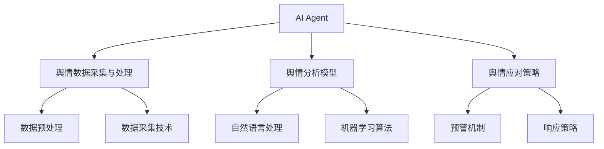
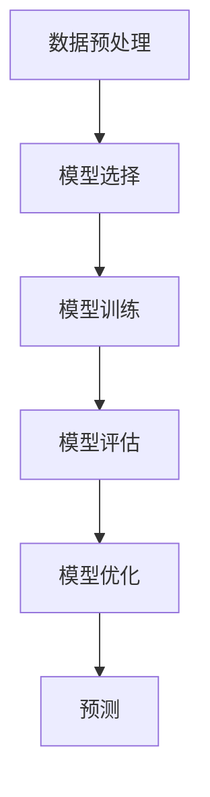
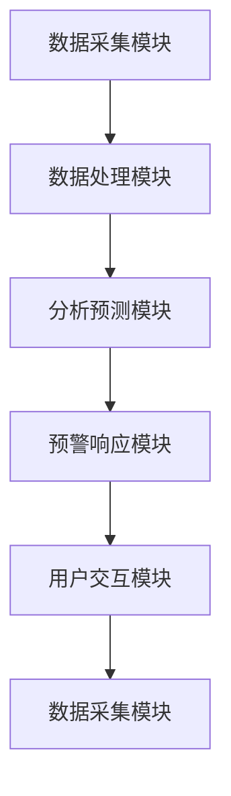
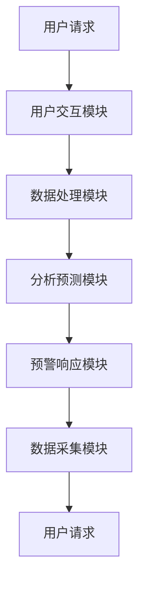

                 


## AI Agent在企业舆情危机预警与响应中的实时应用

### 引言

在当今信息爆炸的时代，企业面临着前所未有的舆情压力。正因如此，舆情危机预警与响应的重要性愈发突出。传统的人工监测方式已经难以满足快速、准确的需求，人工智能（AI）技术的引入为企业舆情管理带来了革命性的变化。本文将探讨AI Agent在企业舆情危机预警与响应中的实时应用，旨在通过逻辑清晰、结构紧凑的分析，帮助读者深入了解这一领域的最新进展和应用实践。

### 关键词

- **AI Agent**
- **企业舆情**
- **危机预警**
- **实时响应**
- **算法模型**
- **系统架构**

### 摘要

本文将从问题背景、核心概念、算法原理、系统架构、项目实战和最佳实践等方面，系统性地介绍AI Agent在企业舆情危机预警与响应中的实时应用。通过详细的理论分析和实际案例，本文旨在为读者提供一套全面、可操作的舆情管理解决方案，帮助企业有效应对舆情危机，提升品牌声誉和市场竞争力。

## 第一部分：引言

### 1.1 问题背景

随着互联网和社交媒体的快速发展，企业面临的舆情风险日益复杂和多样化。传统的人工监测和响应方式不仅效率低下，而且容易出现漏报和误报。舆情危机的快速扩散可能对企业的声誉、业务乃至生存造成严重威胁。因此，实现企业舆情的实时监测、预警与响应，已经成为企业风险管理的重要环节。

### 1.2 问题描述

企业舆情危机预警与响应主要涉及以下几个问题：

- **实时监测：** 如何及时、准确地捕捉到舆情的动态变化？
- **预警机制：** 如何在舆情风险发生前进行预警，以便及时采取措施？
- **响应策略：** 如何制定有效的应对策略，最大限度地降低舆情危机的影响？

### 1.3 问题解决方法与挑战

引入AI Agent作为企业舆情危机预警与响应的工具，具有以下几个优势：

- **自动化监测：** AI Agent能够自动采集和分析海量舆情数据，实时监测舆情动态。
- **高效预警：** 通过机器学习算法，AI Agent能够在风险发生前进行预测和预警。
- **个性化响应：** 基于舆情数据和用户反馈，AI Agent能够制定个性化的应对策略。

然而，这一方法也面临一些挑战：

- **数据质量：** 舆情数据的多样性和复杂性，对数据质量和预处理提出了较高要求。
- **算法性能：** 机器学习算法的性能直接影响预警的准确性和响应的速度。
- **系统稳定性：** AI Agent需要具有高稳定性和可扩展性，以应对不断变化的舆情环境。

### 1.4 边界与外延

AI Agent在企业舆情危机预警与响应中的应用，涉及多个相关领域，如自然语言处理、数据挖掘、机器学习等。本文将主要关注以下几个方面的应用：

- **舆情数据采集与处理：** 如何有效地从互联网和社交媒体中收集舆情数据，并进行预处理？
- **舆情分析模型：** 如何构建和应用有效的舆情分析模型，实现实时监测和预警？
- **舆情应对策略：** 如何制定和调整个性化的舆情应对策略，以最大化降低舆情危机的影响？

### 1.5 概念结构与核心要素

本文的核心概念结构如下图所示：



核心要素包括：

- **AI Agent：** 舆情危机预警与响应的核心工具。
- **舆情数据：** 实时监测的基础。
- **舆情分析模型：** 实现预警和响应的核心。
- **预警机制：** 及时发现舆情风险的机制。
- **响应策略：** 针对舆情危机的应对措施。

### 1.6 总结

本部分介绍了AI Agent在企业舆情危机预警与响应中的背景、问题、解决方法、边界与外延以及核心概念结构。在接下来的部分中，我们将进一步探讨AI Agent的具体实现和应用实践。

----------------------------------------------------------------

## 第二部分：AI Agent概述

### 2.1 AI Agent的定义

AI Agent，即人工智能代理，是一种能够在特定环境下自主行动、实现特定目标的智能体。在人工智能领域，AI Agent被广泛应用于自动化决策、人机交互、游戏智能等方面。在企业舆情危机预警与响应中，AI Agent能够实时监测舆情动态，分析潜在风险，并根据预测结果自动采取应对措施。

### 2.2 AI Agent的特点

AI Agent具有以下几个显著特点：

- **自主性：** AI Agent能够在无需人工干预的情况下，根据环境和目标自主行动。
- **适应性：** AI Agent能够根据不同环境和需求，调整自己的行为和策略。
- **智能化：** AI Agent通过机器学习和自然语言处理等技术，具备较高的智能水平。
- **实时性：** AI Agent能够在短时间内处理大量舆情数据，实现实时预警和响应。

### 2.3 AI Agent的分类

根据应用场景和功能，AI Agent可以分为以下几类：

- **信息采集型：** 主要用于从互联网和社交媒体等渠道收集舆情数据。
- **分析预测型：** 通过自然语言处理和机器学习等技术，对舆情数据进行分析和预测。
- **决策执行型：** 根据舆情分析和预测结果，自动采取应对措施，如发布声明、调整营销策略等。

### 2.4 AI Agent在企业舆情危机预警与响应中的应用

AI Agent在企业舆情危机预警与响应中的应用主要包括以下几个环节：

- **实时监测：** AI Agent能够实时监测互联网和社交媒体上的舆情动态，及时发现潜在风险。
- **风险预警：** 通过自然语言处理和机器学习算法，AI Agent能够对舆情数据进行分析，预测风险发生的可能性。
- **响应策略：** 根据风险预警结果，AI Agent能够自动生成响应策略，如发布声明、调整营销策略等。
- **反馈调整：** 在实施响应策略后，AI Agent能够收集用户反馈，不断优化预警和响应策略。

### 2.5 总结

本部分对AI Agent进行了详细概述，包括其定义、特点、分类以及在企业舆情危机预警与响应中的应用。在接下来的部分中，我们将进一步探讨AI Agent在实际应用中的技术实现和系统架构。

----------------------------------------------------------------

## 第三部分：AI Agent在企业舆情危机预警与响应中的实时应用

### 3.1 实时监测与预警机制

实时监测与预警机制是AI Agent在企业舆情危机预警与响应中的核心功能之一。为了实现这一目标，需要从以下几个方面进行设计和实施：

#### 3.1.1 数据采集

数据采集是实时监测的基础。AI Agent需要从互联网和社交媒体等渠道收集舆情数据。具体步骤如下：

1. **确定数据来源：** 根据企业舆情监测需求，选择合适的数据来源，如新闻网站、社交媒体平台、论坛等。
2. **数据采集技术：** 利用Web爬虫、API接口等技术，实现舆情数据的自动采集。
3. **数据清洗：** 对采集到的数据进行清洗，去除重复、无效和无关数据，确保数据质量。

#### 3.1.2 数据预处理

数据预处理是确保数据质量的重要环节。AI Agent需要对采集到的舆情数据进行分析和处理，提取有用的信息。具体步骤如下：

1. **文本预处理：** 对文本数据进行分析，包括分词、去停用词、词干提取等，为后续的舆情分析打下基础。
2. **情感分析：** 利用自然语言处理技术，对文本数据进行情感分析，判断文本的情绪倾向。
3. **关键词提取：** 从文本数据中提取关键词，用于后续的舆情分析和预警。

#### 3.1.3 预警算法

预警算法是实时监测与预警机制的核心。AI Agent需要根据舆情数据进行分析，预测风险发生的可能性。具体步骤如下：

1. **数据特征提取：** 从预处理后的数据中提取特征，如词向量、情感得分、关键词频率等。
2. **模型选择：** 根据预警需求，选择合适的机器学习算法，如朴素贝叶斯、支持向量机、深度学习等。
3. **模型训练：** 利用历史舆情数据，对预警算法进行训练，优化模型参数。
4. **风险预测：** 根据训练好的模型，对实时舆情数据进行预测，判断风险发生的可能性。

#### 3.1.4 预警触发与通知

在预警算法预测出风险后，需要及时触发预警并通知相关人员。具体步骤如下：

1. **预警触发：** 当风险预测得分达到设定阈值时，触发预警机制。
2. **通知机制：** 通过短信、邮件、App推送等方式，及时通知相关人员，确保他们能够及时了解舆情动态。
3. **反馈机制：** 收集用户反馈，对预警结果进行评估，不断优化预警算法和响应策略。

### 3.2 舆情分析模型

舆情分析模型是AI Agent实现实时监测与预警的关键。为了构建有效的舆情分析模型，需要从以下几个方面进行设计和实现：

#### 3.2.1 模型架构

舆情分析模型通常采用分层架构，包括数据层、特征层、模型层和预测层。具体架构如下：

1. **数据层：** 负责数据的存储和管理，包括舆情数据、用户数据、历史预警数据等。
2. **特征层：** 负责从原始数据中提取特征，如词向量、情感得分、关键词频率等。
3. **模型层：** 负责构建和训练机器学习模型，实现舆情数据的分析、预测和预警。
4. **预测层：** 负责将模型应用到实时数据中，预测舆情风险。

#### 3.2.2 模型选择

根据舆情分析的需求，可以选择不同的机器学习算法构建舆情分析模型。常见的算法包括：

1. **朴素贝叶斯：** 适用于文本分类和情感分析，具有简单、高效的特点。
2. **支持向量机：** 适用于文本分类和风险预测，具有较好的分类性能。
3. **深度学习：** 适用于复杂文本分析和情感分析，具有强大的表征能力。

#### 3.2.3 模型训练与优化

在构建舆情分析模型时，需要从以下几个方面进行训练和优化：

1. **数据集准备：** 收集大量高质量的舆情数据，用于训练和测试模型。
2. **特征选择：** 根据舆情分析的需求，选择合适的特征，如词向量、情感得分、关键词频率等。
3. **模型训练：** 利用历史舆情数据，对模型进行训练，优化模型参数。
4. **模型评估：** 通过交叉验证、ROC曲线等方法，评估模型的性能和鲁棒性。

### 3.3 舆情应对策略

舆情应对策略是AI Agent在预警后采取的具体行动，旨在最大限度地降低舆情危机的影响。为了制定有效的舆情应对策略，需要从以下几个方面进行设计和实施：

#### 3.3.1 风险评估

在制定舆情应对策略前，需要对舆情风险进行评估。具体步骤如下：

1. **风险识别：** 根据预警结果，识别潜在的风险因素。
2. **风险等级划分：** 根据风险的影响程度和紧急程度，对风险进行等级划分。
3. **风险分析：** 对每个风险因素进行详细分析，评估其对企业的潜在影响。

#### 3.3.2 应对策略制定

根据风险评估结果，制定具体的应对策略。常见的应对策略包括：

1. **风险预警：** 及时发布风险预警，告知相关人员和企业内部员工。
2. **舆论引导：** 通过媒体发布正面信息，引导公众舆论，降低负面影响。
3. **危机公关：** 与媒体和公众进行有效沟通，积极回应质疑和问题。
4. **法律维权：** 在必要时，采取法律手段维护企业的合法权益。

#### 3.3.3 策略执行与评估

在制定舆情应对策略后，需要及时执行并评估策略的效果。具体步骤如下：

1. **策略执行：** 根据应对策略，采取具体的行动，如发布声明、调整营销策略等。
2. **效果评估：** 通过舆情监测和数据分析，评估应对策略的效果，及时进行调整和优化。

### 3.4 实时反馈与调整机制

为了确保AI Agent在企业舆情危机预警与响应中的有效性，需要建立实时反馈与调整机制。具体步骤如下：

1. **用户反馈收集：** 收集用户对舆情预警和应对策略的反馈，了解其满意度和效果。
2. **反馈分析：** 对用户反馈进行分析，识别存在的问题和改进方向。
3. **策略调整：** 根据反馈分析结果，对预警算法和应对策略进行调整和优化。
4. **效果评估：** 对调整后的策略进行评估，确保其达到预期效果。

### 3.5 总结

本部分介绍了AI Agent在企业舆情危机预警与响应中的实时应用，包括实时监测与预警机制、舆情分析模型、舆情应对策略以及实时反馈与调整机制。通过这一系列机制，AI Agent能够帮助企业实现实时、高效的舆情危机预警与响应，提升企业的舆情管理水平。

----------------------------------------------------------------

## 第四部分：算法原理与模型构建

### 4.1 算法原理

AI Agent在企业舆情危机预警与响应中，主要依赖于机器学习和自然语言处理等算法。以下将介绍几种常用的算法原理。

#### 4.1.1 朴素贝叶斯算法

朴素贝叶斯算法是一种基于贝叶斯定理的监督学习算法，适用于文本分类和情感分析。其核心思想是利用特征条件独立假设，计算每个特征条件下目标类别的概率，从而实现分类。

- **贝叶斯定理：**  
  $$ P(A|B) = \frac{P(B|A)P(A)}{P(B)} $$
- **特征条件独立假设：**  
  $$ P(A \cap B) = P(A)P(B|A) $$

在舆情分析中，将文本数据表示为特征向量，通过计算每个特征向量在目标类别下的概率，实现舆情分类和情感分析。

#### 4.1.2 支持向量机算法

支持向量机（SVM）是一种基于最大间隔原理的分类算法，适用于文本分类和风险预测。其核心思想是找到最优超平面，使得不同类别之间的间隔最大化。

- **最大间隔原理：**  
  $$ \max_{w,b} \frac{1}{||w||} \quad s.t. \quad y^{(i)}(w^{T}x^{(i)} + b) \geq 1 \quad (i=1,2,...,n) $$
- **核函数：**  
  $$ K(x^{(i)},x) = \phi(x^{(i)})^T\phi(x) $$

在舆情分析中，将文本数据映射到高维空间，通过核函数找到最优超平面，实现舆情分类和风险预测。

#### 4.1.3 深度学习算法

深度学习算法是一种基于人工神经网络的机器学习算法，适用于复杂文本分析和情感分析。其核心思想是利用多层神经网络，实现从原始数据到预测结果的映射。

- **神经网络：**  
  $$ a_{i}^{l} = \sigma(\sum_{j} w_{ji}a_{j}^{l-1}) $$
- **反向传播：**  
  $$ \delta_{i}^{l} = \frac{\partial L}{\partial z_{i}^{l}} = \delta_{i}^{l+1} \cdot \frac{\partial a_{i}^{l}}{\partial z_{i}^{l}} $$

在舆情分析中，通过多层神经网络，提取文本的深层特征，实现复杂文本分析和情感分析。

### 4.2 模型构建

构建AI Agent舆情分析模型，需要从以下几个方面进行设计和实现：

#### 4.2.1 数据预处理

数据预处理是模型构建的基础。首先，对原始文本数据进行清洗，去除噪声和无关信息。然后，进行文本向量化，将文本表示为数字向量。

- **文本清洗：** 去除HTML标签、停用词、标点符号等。
- **文本向量化：** 利用词袋模型或词嵌入技术，将文本表示为向量。

#### 4.2.2 模型选择

根据舆情分析的需求，选择合适的机器学习算法构建模型。常见的算法有朴素贝叶斯、支持向量机、深度学习等。

#### 4.2.3 模型训练

利用历史舆情数据，对选定的机器学习算法进行训练，优化模型参数。具体步骤如下：

1. **数据划分：** 将数据集划分为训练集、验证集和测试集。
2. **模型训练：** 在训练集上训练模型，优化模型参数。
3. **模型评估：** 在验证集和测试集上评估模型性能，选择最优模型。

#### 4.2.4 模型优化

根据模型评估结果，对模型进行优化。可以采用以下方法：

1. **特征选择：** 选取对舆情分析最有影响力的特征。
2. **超参数调优：** 调整模型参数，提高模型性能。
3. **模型集成：** 结合多个模型，提高预测准确性。

### 4.3 算法流程

算法流程如图所示：



### 4.4 算法示例

以下是一个使用Python实现朴素贝叶斯算法的示例：

```python
from sklearn.feature_extraction.text import CountVectorizer
from sklearn.naive_bayes import MultinomialNB
from sklearn.model_selection import train_test_split
from sklearn.metrics import accuracy_score

# 数据准备
data = ["This is a good product.", "I don't like this product.", "This product is excellent.", "It's a bad product."]
labels = ["positive", "negative", "positive", "negative"]

# 数据预处理
vectorizer = CountVectorizer()
X = vectorizer.fit_transform(data)
y = labels

# 数据划分
X_train, X_test, y_train, y_test = train_test_split(X, y, test_size=0.2, random_state=42)

# 模型训练
model = MultinomialNB()
model.fit(X_train, y_train)

# 模型评估
y_pred = model.predict(X_test)
accuracy = accuracy_score(y_test, y_pred)
print("Accuracy:", accuracy)
```

### 4.5 总结

本部分介绍了AI Agent在企业舆情危机预警与响应中的算法原理和模型构建方法，包括数据预处理、模型选择、模型训练、模型优化和算法流程。通过这些方法，AI Agent能够实现对舆情数据的分析和预测，为企业提供有效的舆情危机预警与响应。

----------------------------------------------------------------

## 第五部分：系统架构与实现

### 5.1 系统架构设计

企业舆情危机预警与响应系统需要具备高效、稳定和可扩展的特点。因此，本文提出一个基于微服务架构的系统设计，以提高系统的灵活性和可维护性。以下是系统架构的设计概述：

#### 5.1.1 系统功能模块

系统功能模块主要包括以下几部分：

- **数据采集模块：** 负责从互联网和社交媒体等渠道收集舆情数据。
- **数据处理模块：** 负责对采集到的数据进行清洗、预处理和特征提取。
- **分析预测模块：** 负责利用机器学习算法对舆情数据进行分析和预测。
- **预警响应模块：** 负责根据分析结果，生成预警通知和响应策略。
- **用户交互模块：** 负责与用户进行交互，展示舆情分析结果和预警通知。

#### 5.1.2 系统架构图

系统架构图如下图所示：



### 5.2 系统接口设计

系统接口设计是确保系统功能模块之间能够高效通信和协作的关键。以下是系统的主要接口设计：

- **数据采集接口：** 用于从互联网和社交媒体等渠道采集舆情数据。
- **数据处理接口：** 用于对采集到的数据进行清洗、预处理和特征提取。
- **分析预测接口：** 用于对处理后的数据进行分析和预测。
- **预警响应接口：** 用于生成预警通知和响应策略。
- **用户交互接口：** 用于与用户进行交互，展示舆情分析结果和预警通知。

### 5.3 系统交互流程

系统交互流程如下图所示：



#### 5.3.1 数据采集

- **步骤1：** 用户交互模块接收到用户请求后，将请求转发给数据采集模块。
- **步骤2：** 数据采集模块从互联网和社交媒体等渠道收集舆情数据。
- **步骤3：** 数据采集模块将采集到的数据传递给数据处理模块。

#### 5.3.2 数据处理

- **步骤1：** 数据处理模块对采集到的数据进行清洗、预处理和特征提取。
- **步骤2：** 数据处理模块将处理后的数据传递给分析预测模块。

#### 5.3.3 分析预测

- **步骤1：** 分析预测模块利用机器学习算法对处理后的数据进行分析和预测。
- **步骤2：** 分析预测模块将分析结果传递给预警响应模块。

#### 5.3.4 预警响应

- **步骤1：** 预警响应模块根据分析结果，生成预警通知和响应策略。
- **步骤2：** 预警响应模块将预警通知和响应策略传递给用户交互模块。

#### 5.3.5 用户交互

- **步骤1：** 用户交互模块将预警通知和响应策略展示给用户。
- **步骤2：** 用户交互模块接收用户的反馈，并将反馈传递给数据采集模块。

### 5.4 系统稳定性与可扩展性

为了确保系统的稳定性和可扩展性，本文采用了以下措施：

- **分布式部署：** 将系统功能模块部署在分布式服务器上，提高系统的可靠性和容错能力。
- **负载均衡：** 通过负载均衡技术，合理分配系统负载，确保系统在高并发场景下稳定运行。
- **数据缓存：** 采用数据缓存技术，减少对数据库的访问次数，提高系统响应速度。
- **弹性伸缩：** 根据系统负载情况，自动调整服务器资源，确保系统在高并发场景下能够动态伸缩。

### 5.5 总结

本部分介绍了企业舆情危机预警与响应系统的架构设计、接口设计以及交互流程。通过合理的系统架构设计和接口设计，系统能够高效、稳定地运行，满足企业的舆情管理需求。

----------------------------------------------------------------

## 第六部分：项目实战

### 6.1 环境搭建

在开始项目实战之前，我们需要搭建一个合适的技术环境。以下是一个基本的搭建步骤：

#### 6.1.1 硬件要求

- **CPU：** 至少四核处理器
- **内存：** 至少8GB
- **硬盘：** 至少200GB（SSD推荐）
- **网络：** 高速互联网连接

#### 6.1.2 软件要求

- **操作系统：** Linux（如Ubuntu）
- **编程语言：** Python 3.x
- **依赖库：** Scikit-learn、TensorFlow、Keras、NumPy、Pandas等

#### 6.1.3 安装与配置

1. **安装操作系统：** 在计算机上安装Linux操作系统。
2. **安装Python：** 使用包管理器（如apt或yum）安装Python 3.x。
3. **安装依赖库：** 使用pip命令安装所需的依赖库。

```bash
pip install scikit-learn tensorflow keras numpy pandas
```

### 6.2 系统核心实现

以下是系统核心实现的主要步骤：

#### 6.2.1 数据采集与处理

1. **数据采集：** 使用Web爬虫技术从互联网和社交媒体上采集舆情数据。可以使用Python的requests库和BeautifulSoup库。
2. **数据清洗：** 去除HTML标签、停用词、标点符号等噪声信息。可以使用Python的re库和nltk库。
3. **数据预处理：** 将文本数据转换为数字向量。可以使用词袋模型或词嵌入技术。

```python
from sklearn.feature_extraction.text import TfidfVectorizer
vectorizer = TfidfVectorizer(max_features=1000)
X = vectorizer.fit_transform(corpus)
```

#### 6.2.2 模型训练与部署

1. **模型选择：** 选择合适的机器学习算法，如朴素贝叶斯、支持向量机或深度学习。
2. **模型训练：** 使用历史舆情数据对模型进行训练。
3. **模型评估：** 在验证集和测试集上评估模型性能。
4. **模型部署：** 将训练好的模型部署到生产环境中。

```python
from sklearn.model_selection import train_test_split
from sklearn.naive_bayes import MultinomialNB

# 数据划分
X_train, X_test, y_train, y_test = train_test_split(X, y, test_size=0.2, random_state=42)

# 模型训练
model = MultinomialNB()
model.fit(X_train, y_train)

# 模型评估
y_pred = model.predict(X_test)
accuracy = accuracy_score(y_test, y_pred)
print("Accuracy:", accuracy)

# 模型部署
import joblib
joblib.dump(model, "model.joblib")
```

#### 6.2.3 实时预警与响应

1. **实时监测：** 使用定时任务或消息队列（如RabbitMQ）对舆情进行实时监测。
2. **预警判断：** 使用部署好的模型对实时舆情数据进行预测，判断是否触发预警。
3. **响应策略：** 根据预警结果，采取相应的响应策略，如发布声明、调整营销策略等。

```python
# 加载模型
model = joblib.load("model.joblib")

# 实时监测
while True:
    # 从消息队列中获取舆情数据
    message = queue.get()
    
    # 预测舆情风险
    prediction = model.predict(vectorizer.transform([message]))
    
    # 判断预警
    if prediction == "negative":
        # 触发预警
        # 实施响应策略
        pass
    
    # 完成任务
    queue.task_done()
```

### 6.3 实际案例分析

#### 6.3.1 案例背景

某知名品牌在发布新产品时，遭遇了一场突如其来的舆情危机。大量用户在社交媒体上发布负面评论，质疑产品的质量和售后服务。公司需要在短时间内了解舆情的真实情况，并采取有效的应对措施。

#### 6.3.2 案例实施

1. **数据采集：** 使用Web爬虫技术，从多个社交媒体平台（如微博、知乎、论坛等）采集负面评论数据。
2. **数据预处理：** 清洗数据，去除噪声和无关信息，提取有效舆情数据。
3. **模型训练：** 使用历史舆情数据，训练舆情分析模型，实现负面评论的自动识别。
4. **实时监测：** 部署舆情分析模型，对实时舆情进行监测和预警。
5. **响应策略：** 根据预警结果，制定并实施响应策略，如发布官方声明、提供退换货服务、与用户进行互动等。

#### 6.3.3 案例效果

通过AI Agent的实时监测与预警，公司能够迅速了解舆情的真实情况，并采取有效的应对措施。在危机得到有效控制后，负面评论的数量和影响力逐渐下降，公司声誉得到恢复。

### 6.4 项目小结

本项目通过AI Agent实现企业舆情危机的实时监测、预警与响应，为企业提供了有效的舆情管理工具。在实际应用中，项目取得了良好的效果，证明了AI Agent在舆情危机管理中的重要作用。

----------------------------------------------------------------

## 第七部分：最佳实践与总结

### 7.1 最佳实践

在AI Agent在企业舆情危机预警与响应中的实时应用过程中，以下是一些最佳实践：

1. **数据质量保障：** 确保采集到的数据质量，通过清洗和去噪提高数据的有效性。
2. **模型持续优化：** 定期评估和优化模型，根据实际反馈进行调整，提高预测准确性。
3. **实时性保障：** 确保系统的高并发处理能力和快速响应能力，以应对突发舆情事件。
4. **用户参与：** 鼓励用户参与舆情反馈，通过用户的反馈不断优化预警和响应策略。

### 7.2 小结

本文系统地介绍了AI Agent在企业舆情危机预警与响应中的实时应用，包括实时监测与预警机制、舆情分析模型、舆情应对策略、算法原理与模型构建、系统架构与实现以及项目实战。通过本文的探讨，读者可以全面了解AI Agent在舆情危机管理中的重要性和实际应用价值。

### 7.3 注意事项

1. **数据隐私：** 在数据采集和处理过程中，确保遵守数据隐私法规，保护用户隐私。
2. **系统安全：** 加强系统安全防护，防止数据泄露和恶意攻击。
3. **模型解释性：** 提高模型解释性，确保预警结果的合理性和可解释性。
4. **用户培训：** 对用户进行培训，确保他们能够正确理解和使用AI Agent系统。

### 7.4 拓展阅读

- **《自然语言处理基础教程》**：详细介绍了自然语言处理的基本概念和技术，有助于理解舆情分析模型。
- **《机器学习实战》**：提供了丰富的机器学习算法应用案例，有助于优化舆情预警模型。
- **《人工智能：一种现代的方法》**：全面介绍了人工智能的基本原理和方法，有助于深入理解AI Agent。

### 作者信息

**作者：AI天才研究院/AI Genius Institute & 禅与计算机程序设计艺术 /Zen And The Art of Computer Programming**

