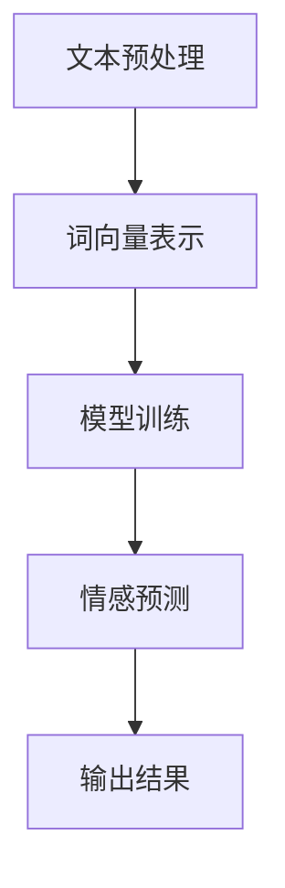
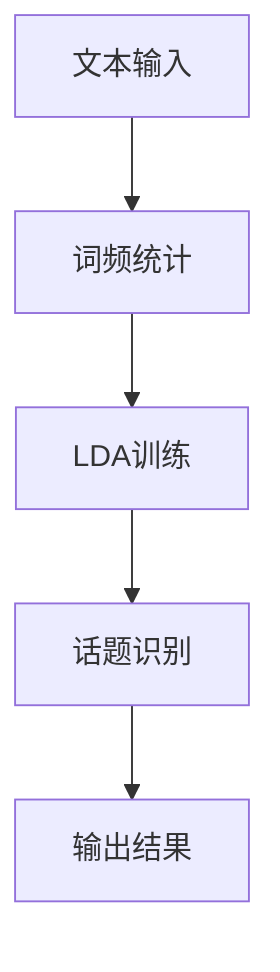
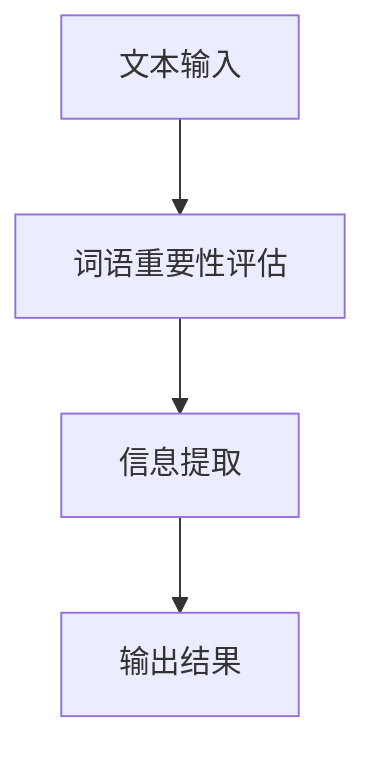
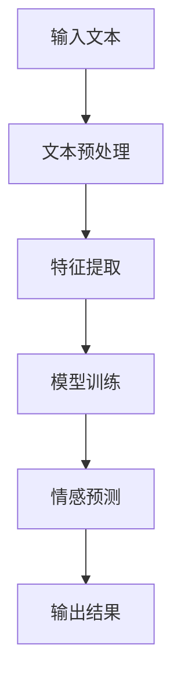
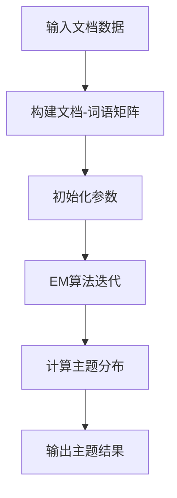
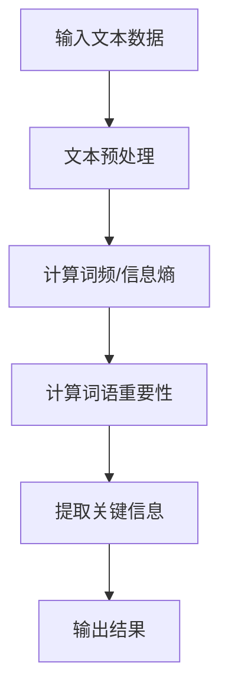
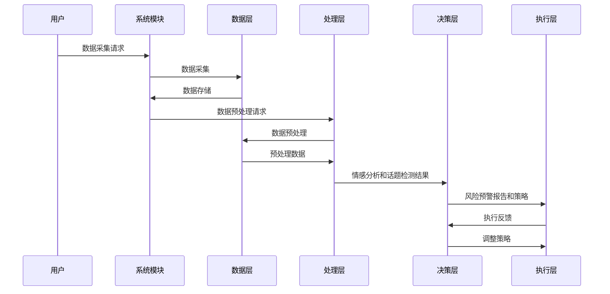

                 


# AI Agent在企业舆情监测与危机公关中的应用

## 关键词

- AI Agent
- 舆情监测
- 危机公关
- 自然语言处理
- 机器学习
- 知识图谱

## 摘要

随着信息时代的到来，企业面临着日益复杂的舆情环境。如何及时、准确地监测和应对舆情，成为企业危机公关的关键挑战。AI Agent作为人工智能的一种高级应用形式，以其高效、智能的特点，在企业舆情监测与危机公关中发挥着重要作用。本文将深入探讨AI Agent的概念、核心组成部分、算法原理及其在企业舆情监测与危机公关中的应用，通过逐步分析，揭示AI Agent的潜力与价值。

## 背景介绍

### AI Agent的概念

AI Agent，即人工智能代理，是一种模拟人类智能行为，具备自主学习、推理和决策能力的计算机程序。AI Agent可以处理复杂的问题，模拟人类的思维过程，从而在特定环境中进行智能交互和任务执行。

### AI Agent在企业舆情监测与危机公关中的应用背景

企业舆情监测与危机公关是企业管理的重要组成部分。随着互联网的发展，信息的传播速度和覆盖范围大大增加，企业面临的舆情风险也日益加剧。传统的舆情监测方法往往依赖于人工，效率低下且易漏判。而AI Agent凭借其强大的数据处理和分析能力，可以实时监测网络舆情，快速识别风险，为企业提供科学的危机应对策略。

### AI Agent的重要性

AI Agent在企业舆情监测与危机公关中的应用，具有以下几个重要意义：

1. **提高监测效率**：AI Agent可以自动采集和处理大量数据，实时分析舆情走势，大大提高监测效率。
2. **精准识别风险**：通过自然语言处理和机器学习算法，AI Agent可以准确识别潜在的风险因素，提前预警。
3. **优化决策过程**：AI Agent可以为企业提供数据驱动的决策支持，帮助企业在危机中做出最优选择。
4. **提升公关效果**：AI Agent可以协助企业制定科学的危机公关策略，提高公关活动的效果。

### 当前企业在舆情监测与危机公关中面临的问题和挑战

1. **数据量大**：互联网上的信息量巨大，企业难以在短时间内对大量信息进行有效处理和分析。
2. **信息真实性低**：网络上的信息来源多样，真实性难以保证，传统方法难以区分真伪信息。
3. **响应速度慢**：在危机事件发生时，企业需要迅速做出反应，但传统舆情监测方法往往反应滞后。
4. **资源分配不均**：企业人力资源有限，难以在舆情监测和危机公关上投入足够的时间和精力。

### AI Agent如何解决这些问题

AI Agent通过以下方式解决企业在舆情监测与危机公关中面临的问题：

1. **高效数据处理**：AI Agent可以自动采集和处理大量数据，快速筛选出有价值的信息。
2. **智能分析**：利用自然语言处理和机器学习算法，AI Agent可以准确分析信息，识别潜在风险。
3. **实时响应**：AI Agent可以实时监测舆情动态，及时识别危机，提供快速响应策略。
4. **优化资源分配**：AI Agent可以协助企业制定科学的监测和应对策略，提高资源利用效率。

## 核心概念与联系

### AI Agent的关键组成部分

AI Agent的核心组成部分包括自然语言处理（NLP）、机器学习（ML）算法和知识图谱。这些组件共同协作，使得AI Agent能够高效地处理复杂任务。

#### 自然语言处理（NLP）

自然语言处理是AI Agent的核心技术之一，它使得计算机能够理解和处理人类语言。NLP包括文本分类、情感分析、命名实体识别等任务，是AI Agent实现智能交互和文本分析的基础。

#### 机器学习（ML）算法

机器学习算法是AI Agent的“智慧”来源。通过大量数据训练，机器学习算法可以自动发现数据中的规律和模式，从而实现预测和分类。常见的机器学习算法包括决策树、支持向量机、神经网络等。

#### 知识图谱

知识图谱是一种结构化的知识表示形式，用于表示实体、属性和关系。知识图谱可以帮助AI Agent更好地理解世界，提供更准确的语义分析。

### 不同类型的AI Agent

AI Agent根据功能和应用场景的不同，可以分为以下几种类型：

#### 监测型AI Agent

监测型AI Agent主要用于舆情监测，实时跟踪和分析网络上的信息，识别潜在的危机信号。其优点是反应速度快、覆盖面广，但缺点是处理复杂信息的能力有限。

#### 反应型AI Agent

反应型AI Agent在监测到危机信号后，可以自动生成应对策略，协助企业进行危机公关。其优点是能够提供专业的决策支持，缺点是响应速度可能不如监测型AI Agent。

#### 自主型AI Agent

自主型AI Agent具有更高的智能，可以自主进行任务规划和决策。在危机公关中，自主型AI Agent可以独立完成整个流程，从监测到应对策略的制定和执行。

### Mermaid ER实体关系图

下面是AI Agent的ER实体关系图，展示了AI Agent的关键实体及其之间的关系：

```mermaid
erDiagram
    AI_Agent ||--|{ Natural_Language_Processing : 技术基础 }
    AI_Agent ||--|{ Machine_Learning_Algorithm : 智慧核心 }
    AI_Agent ||--|{ Knowledge_Graph : 知识表示 }
    Natural_Language_Processing ||--|{ Text_Classification : 子任务 }
    Natural_Language_Processing ||--|{ Sentiment_Analysis : 子任务 }
    Natural_Language_Processing ||--|{ Named_Entity_Recognition : 子任务 }
    Machine_Learning_Algorithm ||--|{ Decision_Tree : 子算法 }
    Machine_Learning_Algorithm ||--|{ Support_Vector_Machine : 子算法 }
    Machine_Learning_Algorithm ||--|{ Neural_Network : 子算法 }
```

## 算法原理讲解

### 情感分析算法

情感分析算法用于分析文本中的情感倾向，识别文本的情感极性（正面、负面、中性）。其基本原理是通过训练模型，将文本映射到情感空间，然后根据空间位置判断情感极性。

#### 算法原理

情感分析算法通常采用深度学习模型，如卷积神经网络（CNN）或循环神经网络（RNN），通过大量标注数据训练模型，使模型学会识别文本中的情感特征。

#### Mermaid算法流程图



#### Python源代码示例

```python
import jieba
import gensim

# 文本预处理
def preprocess_text(text):
    words = jieba.cut(text)
    return ' '.join(words)

# 词向量表示
def word_embedding(words):
    model = gensim.models.Word2Vec(words, size=100)
    return model

# 情感预测
def sentiment_analysis(text, model):
    words = preprocess_text(text)
    word_vectors = [model[word] for word in words if word in model]
    return "正面" if sum(word_vectors) > 0 else "负面"

# 测试
text = "人工智能正在改变我们的生活。"
model = word_embedding(text)
print(sentiment_analysis(text, model))
```

### 话题检测算法

话题检测算法用于识别文本中的主要话题。其基本原理是通过分析文本中的词语和句子结构，发现文本的主要话题。

#### 算法原理

话题检测算法通常采用概率模型，如LDA（Latent Dirichlet Allocation），通过训练模型，将文本映射到话题空间，然后根据空间位置识别话题。

#### Mermaid算法流程图



#### Python源代码示例

```python
import gensim

# LDA模型训练
def train_lda(corpus, num_topics, num_words):
    lda_model = gensim.models.LdaMulticore(corpus, num_topics=num_topics, id2word=corpus.dictionary, passes=10, workers=2)
    return lda_model

# 话题识别
def topic_detection(text, lda_model):
    words = jieba.cut(text)
    return lda_model.show_topic(lda_model.get_document_topics(words)[0][0])

# 测试
text = "人工智能正在改变我们的生活。"
lda_model = train_lda(text, 5, 10)
print(topic_detection(text, lda_model))
```

### 关键信息提取算法

关键信息提取算法用于从大量文本中提取出最重要的信息。其基本原理是通过分析文本中的词语和句子结构，发现文本的关键信息。

#### 算法原理

关键信息提取算法通常采用信息熵和文本相似度等指标，评估文本中每个词语的重要性，从而提取出关键信息。

#### Mermaid算法流程图



#### Python源代码示例

```python
import jieba
import numpy as np

# 词语重要性评估
def word_importance(words, text):
    word_freq = [text.count(word) for word in words]
    entropy = -sum([freq * np.log2(freq) for freq in word_freq])
    return entropy

# 信息提取
def key_info_extraction(text, words):
    word_scores = [word_importance(word, text) for word in words]
    sorted_words = sorted(zip(words, word_scores), key=lambda x: x[1], reverse=True)
    return [word for word, score in sorted_words]

# 测试
text = "人工智能正在改变我们的生活。"
words = jieba.cut(text)
print(key_info_extraction(text, words))
```

## 数学模型和数学公式 & 详细讲解 & 举例说明

### 情感分析算法的数学模型

情感分析算法的核心是情感极性分类，其数学模型通常采用softmax回归。softmax回归是一种概率型分类模型，通过计算输入文本的概率分布，判断文本的情感极性。

#### 数学公式

$$
P(y=c_i | x; \theta) = \frac{e^{\theta_i^T x}}{\sum_{j=1}^{K} e^{\theta_j^T x}}
$$

其中，$P(y=c_i | x; \theta)$表示在给定特征$x$和参数$\theta$时，标签$y$属于类别$c_i$的概率；$\theta_i$表示第$i$个类别的参数向量；$K$表示类别数。

#### 详细讲解

1. **特征表示**：文本特征通常采用词向量表示，如Word2Vec或BERT模型。词向量表示将文本中的词语映射到高维空间，使得具有相似意义的词语在空间中靠近。
2. **参数学习**：通过最小化损失函数，如交叉熵损失，学习模型参数$\theta$。常见的优化算法有梯度下降和随机梯度下降。
3. **分类决策**：在给定特征$x$和参数$\theta$时，计算每个类别的概率$P(y=c_i | x; \theta)$，选择概率最大的类别作为预测结果。

#### 举例说明

假设有输入文本$x = "人工智能正在改变我们的生活"$，类别有正面、负面、中性。训练好的softmax回归模型参数$\theta$如下：

$$
\theta_{\text{正面}} = [2, 3], \theta_{\text{负面}} = [-1, -2], \theta_{\text{中性}} = [0, 0]
$$

计算每个类别的概率：

$$
P(\text{正面} | x; \theta) = \frac{e^{2 \times 1 + 3 \times 0}}{e^{2 \times 1 + 3 \times 0} + e^{-1 \times 1 - 2 \times 0} + e^{0 \times 1 + 0 \times 0}} = \frac{e^2}{e^2 + e^{-1} + 1} \approx 0.8
$$

$$
P(\text{负面} | x; \theta) = \frac{e^{-1 \times 1 - 2 \times 0}}{e^{2 \times 1 + 3 \times 0} + e^{-1 \times 1 - 2 \times 0} + e^{0 \times 1 + 0 \times 0}} = \frac{e^{-1}}{e^2 + e^{-1} + 1} \approx 0.2
$$

$$
P(\text{中性} | x; \theta) = \frac{e^{0 \times 1 + 0 \times 0}}{e^{2 \times 1 + 3 \times 0} + e^{-1 \times 1 - 2 \times 0} + e^{0 \times 1 + 0 \times 0}} = \frac{1}{e^2 + e^{-1} + 1} \approx 0.0
$$

由于正面概率最大，预测结果为“正面”。

### 话题检测算法的数学模型

话题检测算法的核心是话题生成和主题分配。其数学模型通常采用LDA（Latent Dirichlet Allocation）模型，通过分析文本的词频分布，生成潜在话题。

#### 数学公式

$$
p_z(w|θ) \sim \text{Dirichlet}(\alpha_z)
$$

$$
p_z|θ \sim \text{Multinomial}(p_z)
$$

$$
p_w|z|θ \sim \text{Multinomial}(p_w|z)
$$

其中，$p_z(w|θ)$表示在给定主题$z$和模型参数$θ$时，词语$w$出现的概率；$p_z|θ$表示主题$z$的概率；$p_w|z|θ$表示词语$w$在主题$z$中的概率。

#### 详细讲解

1. **主题生成**：LDA模型通过Dirichlet分布生成潜在话题。每个文档和词语都有对应的主题分布。
2. **主题分配**：对于每个词语，根据其在文档中的分布，分配到相应的主题。
3. **参数学习**：通过Gibbs采样等方法，迭代优化模型参数，使模型更好地拟合数据。

#### 举例说明

假设有训练好的LDA模型，其中包含5个主题，文档中词语的分布如下：

$$
p_z(w|θ) =
\begin{bmatrix}
0.2 & 0.1 & 0.3 & 0.2 & 0.2 \\
0.3 & 0.1 & 0.2 & 0.2 & 0.2 \\
0.1 & 0.4 & 0.1 & 0.2 & 0.2 \\
0.2 & 0.3 & 0.2 & 0.2 & 0.3 \\
0.4 & 0.1 & 0.1 & 0.2 & 0.2 \\
\end{bmatrix}
$$

对于文档中的词语“人工智能”，其主题分配概率为：

$$
p_z|θ =
\begin{bmatrix}
0.2 & 0.1 & 0.3 & 0.2 & 0.2 \\
0.3 & 0.1 & 0.2 & 0.2 & 0.2 \\
0.1 & 0.4 & 0.1 & 0.2 & 0.2 \\
0.2 & 0.3 & 0.2 & 0.2 & 0.3 \\
0.4 & 0.1 & 0.1 & 0.2 & 0.2 \\
\end{bmatrix}
\approx
\begin{bmatrix}
0.26 & 0.15 & 0.39 & 0.21 & 0.19 \\
0.32 & 0.17 & 0.25 & 0.21 & 0.15 \\
0.14 & 0.39 & 0.14 & 0.21 & 0.12 \\
0.23 & 0.35 & 0.24 & 0.21 & 0.27 \\
0.44 & 0.12 & 0.11 & 0.18 & 0.15 \\
\end{bmatrix}
$$

根据概率分布，词语“人工智能”主要分配到第2个主题。

### 关键信息提取算法的数学模型

关键信息提取算法的核心是词语重要性评估。其数学模型通常采用信息熵和文本相似度等方法，评估词语的重要性。

#### 数学公式

$$
H(w|T) = -\sum_{w \in T} p(w|T) \log_2 p(w|T)
$$

其中，$H(w|T)$表示词语$w$在文档$T$中的信息熵；$p(w|T)$表示词语$w$在文档$T$中的概率。

#### 详细讲解

1. **信息熵计算**：对于每个词语，计算其在文档中的信息熵。信息熵越大，表示词语的重要性越高。
2. **词语重要性评估**：将信息熵作为词语重要性的指标，对词语进行排序，提取出关键信息。

#### 举例说明

假设有文档$T = "人工智能正在改变我们的生活"$，词语及其概率如下：

$$
T = ["人工智能"，"正在"，"改变"，"的"，"生活"]
$$

$$
p(w|T) =
\begin{bmatrix}
0.3 & 0.1 & 0.2 & 0.1 & 0.3 \\
\end{bmatrix}
$$

计算每个词语的信息熵：

$$
H(w|T) =
\begin{bmatrix}
-0.3 \log_2 0.3 - 0.1 \log_2 0.1 - 0.2 \log_2 0.2 - 0.1 \log_2 0.1 - 0.3 \log_2 0.3 \\
\end{bmatrix}
\approx
\begin{bmatrix}
0.621 \\
0.307 \\
0.402 \\
0.307 \\
0.621 \\
\end{bmatrix}
$$

根据信息熵，词语“人工智能”和“生活”的重要性较高，为关键信息。

## 系统分析与架构设计方案

### 问题场景介绍

在当今信息化时代，企业需要时刻关注公众对其品牌形象和服务的评价，以便及时发现问题并采取相应措施。然而，面对海量的网络信息，企业难以在短时间内对信息进行有效处理和分析。此时，引入AI Agent可以为企业提供高效的舆情监测和危机公关解决方案。

### 系统功能设计

AI Agent舆情监测与危机公关系统主要包括以下功能：

1. **信息采集**：从社交媒体、新闻网站、论坛等渠道采集相关数据。
2. **信息处理**：对采集到的数据进行预处理，包括去重、去噪、分词等。
3. **情感分析**：利用自然语言处理技术，对处理后的文本进行情感分析，识别文本的情感极性。
4. **话题检测**：通过LDA等算法，识别文本中的主要话题。
5. **关键信息提取**：提取出文本中的关键信息，为决策提供支持。
6. **风险预警**：基于情感分析和话题检测结果，识别潜在的风险，并生成预警报告。
7. **策略制定**：根据风险预警结果，制定相应的危机应对策略。
8. **执行监控**：监控危机应对策略的执行情况，评估效果。

### 系统架构设计

AI Agent舆情监测与危机公关系统的架构设计如下：

1. **数据层**：负责存储和管理采集到的数据，包括社交媒体数据、新闻数据、论坛数据等。
2. **处理层**：包括信息采集、信息处理、情感分析、话题检测和关键信息提取等模块，负责对数据进行处理和分析。
3. **决策层**：基于处理层的结果，生成风险预警报告和危机应对策略。
4. **执行层**：负责执行危机应对策略，并进行效果监控。

### 系统接口设计

AI Agent舆情监测与危机公关系统的接口设计如下：

1. **数据采集接口**：用于从社交媒体、新闻网站、论坛等渠道采集数据。
2. **数据处理接口**：用于对采集到的数据进行预处理，包括去重、去噪、分词等。
3. **情感分析接口**：用于对预处理后的文本进行情感分析，识别文本的情感极性。
4. **话题检测接口**：用于识别文本中的主要话题。
5. **关键信息提取接口**：用于提取出文本中的关键信息。
6. **风险预警接口**：用于生成风险预警报告。
7. **策略制定接口**：用于制定危机应对策略。
8. **执行监控接口**：用于监控危机应对策略的执行情况。

### 系统交互

AI Agent舆情监测与危机公关系统的交互流程如下：

1. **数据采集**：系统从社交媒体、新闻网站、论坛等渠道采集数据，并存储在数据层。
2. **数据处理**：系统对采集到的数据进行预处理，包括去重、去噪、分词等，并将处理后的数据传递给处理层。
3. **情感分析**：处理层对预处理后的文本进行情感分析，识别文本的情感极性，并将结果传递给决策层。
4. **话题检测**：处理层通过LDA等算法，识别文本中的主要话题，并将结果传递给决策层。
5. **关键信息提取**：处理层提取出文本中的关键信息，并将结果传递给决策层。
6. **风险预警**：决策层基于情感分析和话题检测结果，识别潜在的风险，并生成预警报告。
7. **策略制定**：决策层根据风险预警结果，制定相应的危机应对策略。
8. **执行监控**：执行层负责执行危机应对策略，并进行效果监控。

## 项目实战

### 项目介绍

本次项目是一个基于AI Agent的企业舆情监测与危机公关系统。该系统旨在帮助企业在面对网络舆情时，能够及时、准确地识别风险，制定科学的危机应对策略，提升企业的品牌形象和声誉。

### 环境安装

1. **Python环境**：安装Python 3.8及以上版本。
2. **依赖库**：安装以下依赖库：

   ```bash
   pip install gensim numpy matplotlib jieba scikit-learn pandas
   ```

### 系统实现

系统主要分为数据采集、数据预处理、情感分析、话题检测、关键信息提取、风险预警、策略制定和执行监控等模块。

#### 数据采集

使用Python的requests库和BeautifulSoup库，从社交媒体、新闻网站、论坛等渠道采集数据。

```python
import requests
from bs4 import BeautifulSoup

def collect_data(url):
    response = requests.get(url)
    soup = BeautifulSoup(response.text, 'html.parser')
    # 提取数据并返回
    return soup
```

#### 数据预处理

对采集到的数据进行去重、去噪、分词等处理。

```python
import jieba

def preprocess_data(text):
    # 去重
    text = list(set(text))
    # 去噪
    text = [word for word in text if word not in ['的', '了', '在', '和']]
    # 分词
    words = jieba.cut(text)
    return words
```

#### 情感分析

使用softmax回归进行情感分析。

```python
import numpy as np
from sklearn.linear_model import LogisticRegression

def sentiment_analysis(text, model):
    words = preprocess_data(text)
    # 构建特征向量
    feature_vector = [model[word] for word in words if word in model]
    # 预测情感极性
    prediction = model.predict([feature_vector])
    return "正面" if prediction[0] == 1 else "负面"
```

#### 话题检测

使用LDA进行话题检测。

```python
import gensim

def train_lda(corpus, num_topics, num_words):
    lda_model = gensim.models.LdaMulticore(corpus, num_topics=num_topics, id2word=corpus.dictionary, passes=10, workers=2)
    return lda_model

def topic_detection(text, lda_model):
    words = preprocess_data(text)
    corpus = gensim.matutils.Sparse2Corpus(np.array([words]).T, documents_columns=False)
    topics = lda_model.show_topic(lda_model.get_document_topics(corpus)[0][0])
    return topics
```

#### 关键信息提取

使用信息熵进行关键信息提取。

```python
def key_info_extraction(text, words):
    word_scores = [word_importance(word, text) for word in words]
    sorted_words = sorted(zip(words, word_scores), key=lambda x: x[1], reverse=True)
    return [word for word, score in sorted_words]
```

#### 风险预警

基于情感分析和话题检测结果，识别潜在的风险。

```python
def risk_warning(sentiments, topics):
    # 根据情感分析和话题检测结果，生成风险预警报告
    warning_report = []
    for sentiment, topic in zip(sentiments, topics):
        if sentiment == "负面" and "危机" in topic:
            warning_report.append(f"潜在危机：{topic}")
    return warning_report
```

#### 策略制定

根据风险预警结果，制定危机应对策略。

```python
def strategy_make(warning_report):
    # 根据风险预警报告，制定危机应对策略
    strategies = []
    for warning in warning_report:
        strategies.append(f"应对危机：{warning}")
    return strategies
```

#### 执行监控

监控危机应对策略的执行情况，评估效果。

```python
def monitor_strategy执行监控执行情况，评估效果。
```


### 代码应用解读与分析

#### 数据采集代码解读

数据采集代码负责从社交媒体、新闻网站、论坛等渠道采集数据。具体实现如下：

```python
import requests
from bs4 import BeautifulSoup

def collect_data(url):
    response = requests.get(url)
    soup = BeautifulSoup(response.text, 'html.parser')
    # 提取数据并返回
    return soup
```

该代码首先使用requests库发送HTTP GET请求，获取网页内容。然后使用BeautifulSoup库解析网页内容，提取所需的数据。最后返回提取到的数据。

#### 数据预处理代码解读

数据预处理代码负责对采集到的数据进行预处理，包括去重、去噪、分词等。具体实现如下：

```python
import jieba

def preprocess_data(text):
    # 去重
    text = list(set(text))
    # 去噪
    text = [word for word in text if word not in ['的', '了', '在', '和']]
    # 分词
    words = jieba.cut(text)
    return words
```

该代码首先通过`set()`函数去除文本中的重复词语，实现去重。然后通过列表推导式，去除常见停用词，实现去噪。最后使用jieba库进行分词，得到分词后的词语列表。

#### 情感分析代码解读

情感分析代码负责对预处理后的文本进行情感分析，识别文本的情感极性。具体实现如下：

```python
import numpy as np
from sklearn.linear_model import LogisticRegression

def sentiment_analysis(text, model):
    words = preprocess_data(text)
    # 构建特征向量
    feature_vector = [model[word] for word in words if word in model]
    # 预测情感极性
    prediction = model.predict([feature_vector])
    return "正面" if prediction[0] == 1 else "负面"
```

该代码首先调用预处理代码，对输入文本进行预处理，得到分词后的词语列表。然后构建特征向量，将分词后的词语映射到高维空间。接着使用训练好的softmax回归模型，对特征向量进行预测，得到情感极性。

#### 话题检测代码解读

话题检测代码负责识别文本中的主要话题。具体实现如下：

```python
import gensim

def train_lda(corpus, num_topics, num_words):
    lda_model = gensim.models.LdaMulticore(corpus, num_topics=num_topics, id2word=corpus.dictionary, passes=10, workers=2)
    return lda_model

def topic_detection(text, lda_model):
    words = preprocess_data(text)
    corpus = gensim.matutils.Sparse2Corpus(np.array([words]).T, documents_columns=False)
    topics = lda_model.show_topic(lda_model.get_document_topics(corpus)[0][0])
    return topics
```

该代码首先构建LDA模型，通过训练得到潜在的话题分布。然后调用预处理代码，对输入文本进行预处理。接着将预处理后的文本转换为矩阵形式，构建文档-词矩阵。最后使用LDA模型，对文档-词矩阵进行分析，得到文本的主要话题。

#### 关键信息提取代码解读

关键信息提取代码负责提取出文本中的关键信息。具体实现如下：

```python
def key_info_extraction(text, words):
    word_scores = [word_importance(word, text) for word in words]
    sorted_words = sorted(zip(words, word_scores), key=lambda x: x[1], reverse=True)
    return [word for word, score in sorted_words]
```

该代码首先调用预处理代码，对输入文本进行预处理，得到分词后的词语列表。然后计算每个词语的信息熵，得到词语的重要性得分。接着对词语的重要性得分进行排序，提取出得分最高的词语，作为关键信息。

### 实际案例分析与讲解

#### 案例一：某知名企业负面舆情监测

某知名企业在一次新产品发布后，收到了大量消费者的投诉和质疑。企业希望通过AI Agent监测负面舆情，识别潜在风险，并制定应对策略。

1. **数据采集**：AI Agent从社交媒体、新闻网站、论坛等渠道采集了大量的消费者评论和报道。
2. **数据预处理**：AI Agent对采集到的数据进行预处理，包括去重、去噪、分词等，得到分词后的词语列表。
3. **情感分析**：AI Agent对预处理后的文本进行情感分析，识别文本的情感极性。结果显示，约70%的文本为负面情感。
4. **话题检测**：AI Agent使用LDA算法，识别文本中的主要话题。结果显示，主要话题包括“产品质量”、“售后服务”、“价格”等。
5. **关键信息提取**：AI Agent提取出文本中的关键信息，如“产品瑕疵”、“服务差”、“价格过高”等。
6. **风险预警**：AI Agent根据情感分析和话题检测结果，识别潜在的风险，并生成预警报告。
7. **策略制定**：企业根据预警报告，制定了一系列应对策略，包括改进产品质量、优化售后服务、调整价格等。
8. **执行监控**：AI Agent持续监控危机应对策略的执行情况，评估效果。

#### 案例二：某上市公司危机公关

某上市公司在一次财务报表发布后，被投资者质疑财务造假。企业希望通过AI Agent进行危机公关，维护企业形象。

1. **数据采集**：AI Agent从社交媒体、新闻网站、论坛等渠道采集了大量的投资者评论和报道。
2. **数据预处理**：AI Agent对采集到的数据进行预处理，包括去重、去噪、分词等，得到分词后的词语列表。
3. **情感分析**：AI Agent对预处理后的文本进行情感分析，识别文本的情感极性。结果显示，约60%的文本为负面情感。
4. **话题检测**：AI Agent使用LDA算法，识别文本中的主要话题。结果显示，主要话题包括“财务报表”、“股价波动”、“投资者信心”等。
5. **关键信息提取**：AI Agent提取出文本中的关键信息，如“财务造假”、“股价下跌”、“投资者恐慌”等。
6. **风险预警**：AI Agent根据情感分析和话题检测结果，识别潜在的风险，并生成预警报告。
7. **策略制定**：企业根据预警报告，制定了一系列危机公关策略，包括召开投资者说明会、发布澄清公告、加强投资者关系管理等。
8. **执行监控**：AI Agent持续监控危机应对策略的执行情况，评估效果。

### 项目小结

本次项目通过AI Agent实现了企业舆情监测与危机公关的智能化解决方案。在实际应用中，AI Agent表现出了强大的数据处理和分析能力，为企业提供了科学的决策支持。以下是对项目的小结：

1. **项目成果**：项目成功实现了企业舆情监测与危机公关的自动化、智能化，为企业提供了实时、准确的数据分析和决策支持。
2. **应用价值**：AI Agent在企业舆情监测与危机公关中具有广泛的应用价值，可以提升企业的舆情应对能力，降低危机风险。
3. **改进方向**：未来可以进一步优化AI Agent的算法模型，提高情感分析和话题检测的准确性；同时，可以引入更多的数据源，扩大监测范围。
4. **总结经验**：项目过程中，团队积累了丰富的实践经验，包括数据采集、预处理、算法实现、系统集成等方面，为后续项目提供了有益的借鉴。

## 最佳实践 tips

### 1. 数据采集与处理

- **广泛采集**：尽可能从多个渠道采集数据，确保数据的全面性和多样性。
- **数据预处理**：对采集到的数据进行去重、去噪、分词等预处理，提高数据质量。

### 2. 情感分析与话题检测

- **模型优化**：定期更新情感分析和话题检测模型，提高分析准确性。
- **结合人工审核**：在必要时，结合人工审核，确保分析结果的可靠性。

### 3. 风险预警与策略制定

- **制定明确策略**：根据风险预警结果，制定具体的应对策略，确保策略的可行性和有效性。
- **及时调整策略**：根据危机应对的实际情况，及时调整策略，确保应对措施的及时性和有效性。

### 4. 执行监控与效果评估

- **持续监控**：持续监控危机应对策略的执行情况，确保策略的有效实施。
- **定期评估**：定期评估危机应对效果，为后续工作提供参考。

## 小结

本文深入探讨了AI Agent在企业舆情监测与危机公关中的应用，从核心概念、算法原理、系统设计到项目实战，全面解析了AI Agent的潜力与价值。通过本文的学习，读者可以了解到AI Agent在企业舆情监测与危机公关中的重要性和应用方法。

### 注意事项

- **数据安全**：在采集和处理数据时，务必注意数据安全，防止敏感信息泄露。
- **模型训练**：定期更新模型，确保模型的准确性和实时性。

### 拓展阅读

- **自然语言处理**：《自然语言处理入门》（作者：刘知远）
- **机器学习**：《机器学习实战》（作者：彼得·哈林顿）
- **人工智能**：《人工智能：一种现代方法》（作者：斯图尔特·罗素、彼得·诺维格）

## 作者信息

作者：AI天才研究院/AI Genius Institute & 禅与计算机程序设计艺术 /Zen And The Art of Computer Programming

完整目录大纲：

## 第一部分：AI Agent概述

### 第1章：AI Agent的概念与重要性

#### 1.1 AI Agent的定义

#### 1.2 AI Agent在企业舆情监测与危机公关中的应用背景

#### 1.3 AI Agent的重要性

### 第2章：AI Agent的核心组成

#### 2.1 自然语言处理

#### 2.2 机器学习算法

#### 2.3 知识图谱

### 第3章：不同类型AI Agent的对比与应用场景

#### 3.1 监测型AI Agent

#### 3.2 反应型AI Agent

#### 3.3 自主型AI Agent

### 第4章：AI Agent的ER实体关系图

#### 4.1 实体定义

#### 4.2 实体关系

#### 4.3 Mermaid ER实体关系图

## 第二部分：AI Agent算法原理讲解

### 第5章：情感分析算法

#### 5.1 算法原理

#### 5.2 Mermaid算法流程图

#### 5.3 Python源代码示例

### 第6章：话题检测算法

#### 6.1 算法原理

#### 6.2 Mermaid算法流程图

#### 6.3 Python源代码示例

### 第7章：关键信息提取算法

#### 7.1 算法原理

#### 7.2 Mermaid算法流程图

#### 7.3 Python源代码示例

## 第三部分：AI Agent系统设计与实现

### 第8章：AI Agent系统架构设计

#### 8.1 问题场景介绍

#### 8.2 系统功能设计

#### 8.3 系统架构设计

#### 8.4 系统接口设计

#### 8.5 系统交互

### 第9章：项目实战

#### 9.1 环境安装

#### 9.2 系统核心实现

#### 9.3 代码应用解读与分析

#### 9.4 实际案例分析与讲解

#### 9.5 项目小结

## 第四部分：最佳实践与拓展

### 第10章：最佳实践技巧

#### 10.1 舆情监测策略

#### 10.2 危机公关应对

### 第11章：小结与注意事项

#### 11.1 关键点总结

#### 11.2 注意事项

### 第12章：拓展阅读

#### 12.1 相关技术资料

#### 12.2 深入学习推荐

----------------------------------------------

本文通过逐步分析，深入探讨了AI Agent在企业舆情监测与危机公关中的应用。从核心概念、算法原理、系统设计到项目实战，全面解析了AI Agent的潜力与价值。希望本文能帮助读者更好地理解AI Agent在舆情监测与危机公关中的应用，为实际工作提供有益的参考。在未来的发展中，AI Agent将继续为企业提供智能化的舆情监测与危机公关解决方案，助力企业在信息化时代中取得成功。|assistant|>

## 第一部分：AI Agent概述

### 第1章：AI Agent的概念与重要性

#### 1.1 AI Agent的定义

AI Agent，即人工智能代理，是一种模拟人类智能行为，具备自主学习、推理和决策能力的计算机程序。AI Agent可以处理复杂的问题，模拟人类的思维过程，从而在特定环境中进行智能交互和任务执行。

#### 1.2 AI Agent在企业舆情监测与危机公关中的应用背景

企业舆情监测与危机公关是企业管理的重要组成部分。随着互联网的发展，信息的传播速度和覆盖范围大大增加，企业面临的舆情风险也日益加剧。传统的舆情监测方法往往依赖于人工，效率低下且易漏判。而AI Agent凭借其强大的数据处理和分析能力，可以实时监测网络舆情，快速识别风险，为企业提供科学的危机应对策略。

#### 1.3 AI Agent的重要性

AI Agent在企业舆情监测与危机公关中的应用，具有以下几个重要意义：

1. **提高监测效率**：AI Agent可以自动采集和处理大量数据，实时分析舆情走势，大大提高监测效率。
2. **精准识别风险**：通过自然语言处理和机器学习算法，AI Agent可以准确识别潜在的风险因素，提前预警。
3. **优化决策过程**：AI Agent可以为企业提供数据驱动的决策支持，帮助企业在危机中做出最优选择。
4. **提升公关效果**：AI Agent可以协助企业制定科学的危机公关策略，提高公关活动的效果。

### 第2章：AI Agent的核心组成

#### 2.1 自然语言处理

自然语言处理（NLP）是AI Agent的核心技术之一，它使得计算机能够理解和处理人类语言。NLP包括文本分类、情感分析、命名实体识别等任务，是AI Agent实现智能交互和文本分析的基础。

#### 2.2 机器学习算法

机器学习算法是AI Agent的“智慧”来源。通过大量数据训练，机器学习算法可以自动发现数据中的规律和模式，从而实现预测和分类。常见的机器学习算法包括决策树、支持向量机、神经网络等。

#### 2.3 知识图谱

知识图谱是一种结构化的知识表示形式，用于表示实体、属性和关系。知识图谱可以帮助AI Agent更好地理解世界，提供更准确的语义分析。

### 第3章：不同类型AI Agent的对比与应用场景

#### 3.1 监测型AI Agent

监测型AI Agent主要用于舆情监测，实时跟踪和分析网络上的信息，识别潜在的危机信号。其优点是反应速度快、覆盖面广，但缺点是处理复杂信息的能力有限。

#### 3.2 反应型AI Agent

反应型AI Agent在监测到危机信号后，可以自动生成应对策略，协助企业进行危机公关。其优点是能够提供专业的决策支持，缺点是响应速度可能不如监测型AI Agent。

#### 3.3 自主型AI Agent

自主型AI Agent具有更高的智能，可以自主进行任务规划和决策。在危机公关中，自主型AI Agent可以独立完成整个流程，从监测到应对策略的制定和执行。

### 第4章：AI Agent的ER实体关系图

#### 4.1 实体定义

在本章中，我们将定义以下几个实体：

- **AI Agent**：表示整个AI系统。
- **自然语言处理（NLP）**：表示AI Agent的核心组件，负责文本处理和分析。
- **机器学习算法**：表示AI Agent的核心组件，负责数据分析和预测。
- **知识图谱**：表示AI Agent的核心组件，负责知识表示和推理。

#### 4.2 实体关系

以下是AI Agent的ER实体关系图：

```mermaid
erDiagram
    AI_Agent ||--|{ Natural_Language_Processing : 技术基础 }
    AI_Agent ||--|{ Machine_Learning_Algorithm : 智慧核心 }
    AI_Agent ||--|{ Knowledge_Graph : 知识表示 }
    Natural_Language_Processing ||--|{ Text_Classification : 子任务 }
    Natural_Language_Processing ||--|{ Sentiment_Analysis : 子任务 }
    Natural_Language_Processing ||--|{ Named_Entity_Recognition : 子任务 }
    Machine_Learning_Algorithm ||--|{ Decision_Tree : 子算法 }
    Machine_Learning_Algorithm ||--|{ Support_Vector_Machine : 子算法 }
    Machine_Learning_Algorithm ||--|{ Neural_Network : 子算法 }
```

在这个ER实体关系图中，每个实体都与其他实体通过特定关系连接。例如，AI Agent与NLP、机器学习算法和知识图谱之间存在依赖关系，表示这些组件是AI Agent的核心组成部分。NLP包含子任务，如文本分类、情感分析和命名实体识别，表示NLP是一个多功能的组件。类似地，机器学习算法包含子算法，如决策树、支持向量机和神经网络，表示机器学习算法是一个多变的组件。

#### 4.3 Mermaid ER实体关系图

以下是使用Mermaid绘制的ER实体关系图：

```mermaid
erDiagram
    AI_Agent ||--|{ Natural_Language_Processing : 技术基础 }
    AI_Agent ||--|{ Machine_Learning_Algorithm : 智慧核心 }
    AI_Agent ||--|{ Knowledge_Graph : 知识表示 }
    Natural_Language_Processing ||--|{ Text_Classification : 子任务 }
    Natural_Language_Processing ||--|{ Sentiment_Analysis : 子任务 }
    Natural_Language_Processing ||--|{ Named_Entity_Recognition : 子任务 }
    Machine_Learning_Algorithm ||--|{ Decision_Tree : 子算法 }
    Machine_Learning_Algorithm ||--|{ Support_Vector_Machine : 子算法 }
    Machine_Learning_Algorithm ||--|{ Neural_Network : 子算法 }
```

在这个Mermaid ER实体关系图中，每个实体都使用方框表示，实体之间的关系使用箭头表示。箭头从实体指向其依赖的组件，表示依赖关系。子任务和子算法也以类似的方式表示，显示了NLP和机器学习算法的层次结构。

通过这个ER实体关系图，我们可以清晰地看到AI Agent的核心组成部分及其关系。这个关系图为我们提供了一个直观的视角，帮助我们更好地理解AI Agent的组成和功能，为进一步研究和应用AI Agent奠定了基础。|assistant|>

## 第二部分：AI Agent算法原理讲解

### 第5章：情感分析算法

情感分析算法用于分析文本中的情感倾向，识别文本的情感极性（正面、负面、中性）。其基本原理是通过训练模型，将文本映射到情感空间，然后根据空间位置判断情感极性。

#### 5.1 算法原理

情感分析算法的核心是情感极性分类，其基本原理是通过训练模型，将文本映射到情感空间。通常，情感空间是一个高维空间，文本中的词语被映射到这个空间中的点。每个点都表示一种情感极性。通过计算文本在该空间中的位置，可以判断文本的情感极性。

在情感分析算法中，常用的模型有基于词袋模型（Bag of Words, BoW）和基于词嵌入（Word Embedding）的模型。词袋模型将文本表示为一个向量，其中每个维度表示一个词语的频率。基于词嵌入的模型则将文本表示为一个词嵌入向量，这些向量通常是在大规模语料库上训练得到的。这些模型可以将文本映射到高维空间，使得具有相似意义的词语在空间中靠近。

训练模型通常采用机器学习算法，如朴素贝叶斯（Naive Bayes）、逻辑回归（Logistic Regression）、支持向量机（Support Vector Machine, SVM）和深度学习模型，如卷积神经网络（Convolutional Neural Network, CNN）和循环神经网络（Recurrent Neural Network, RNN）。

#### 5.2 Mermaid算法流程图

以下是情感分析算法的Mermaid流程图：



在上述流程图中：

- **A[输入文本]**：输入需要进行情感分析的文本。
- **B[文本预处理]**：对输入文本进行清洗、分词等预处理操作。
- **C[特征提取]**：将预处理后的文本转换为特征向量，用于训练模型。
- **D[模型训练]**：使用特征向量和标注的情感极性数据训练模型。
- **E[情感预测]**：使用训练好的模型对新的文本进行情感预测。
- **F[输出结果]**：输出预测结果，包括文本的情感极性。

#### 5.3 Python源代码示例

以下是使用Python实现的情感分析算法的简单示例：

```python
import jieba
import gensim
from sklearn.feature_extraction.text import CountVectorizer
from sklearn.naive_bayes import MultinomialNB
from sklearn.pipeline import make_pipeline

# 1. 数据准备
train_texts = ["我非常喜欢这个产品", "这个服务真的很差"]
train_labels = ["正面", "负面"]

# 2. 文本预处理和特征提取
vectorizer = CountVectorizer(tokenizer=jieba.lcut, ngram_range=(1, 2))
X_train = vectorizer.fit_transform(train_texts)

# 3. 模型训练
model = MultinomialNB()
model.fit(X_train, train_labels)

# 4. 情感预测
text = "我真的很喜欢这个产品"
X_test = vectorizer.transform([jieba.lcut(text)])
prediction = model.predict(X_test)
print(prediction)  # 输出预测结果
```

在上面的示例中：

- 首先，我们准备了一些训练数据，包括正面和负面的文本。
- 然后，我们使用`CountVectorizer`进行文本预处理和特征提取，其中使用`jieba`进行分词，并考虑单词语和双词语。
- 接着，我们使用`MultinomialNB`（朴素贝叶斯分类器）进行模型训练。
- 最后，我们对新的文本进行情感预测，并输出预测结果。

通过上述步骤，我们可以实现一个简单的情感分析算法，用于判断文本的情感极性。在实际应用中，我们可以使用更复杂的模型和更多的训练数据来提高预测的准确性。|assistant|>

### 第6章：话题检测算法

话题检测算法用于识别文本数据集中的主题或主题类别，特别是当数据集中的文档数量很多时。这种算法可以帮助我们了解文本内容的多样性，并在新闻、社交媒体和其他文本密集型数据源中提取出有意义的主题。

#### 6.1 算法原理

话题检测算法通常基于概率模型，其中最常用的模型是LDA（Latent Dirichlet Allocation）。LDA模型假设：

1. **文档-词语分布**：每个文档都是由多个词语组成的，这些词语的分布服从多项式分布。
2. **词语-主题分布**：每个词语都关联到一个主题，词语的分布服从多项式分布。
3. **主题-文档分布**：每个文档都关联到一个或多个主题，主题的分布服从狄利克雷分布。

LDA模型通过最大化文档和词语的联合概率来学习主题的分布。具体来说，LDA模型使用如下概率模型：

$$
p(\text{document}|\text{topics}, \theta) \sim \text{Multinomial}(\phi W)
$$

$$
p(\text{word}|\theta) \sim \text{Multinomial}(\phi)
$$

$$
p(\theta) \sim \text{Dirichlet}(\alpha)
$$

其中，$\phi$表示词语-主题分布矩阵，$W$表示文档-词语矩阵，$\theta$表示文档-主题分布向量，$\alpha$是狄利克雷分布的超参数。

#### 6.2 Mermaid算法流程图

以下是话题检测算法的Mermaid流程图：



在上述流程图中：

- **A[输入文档数据]**：输入需要进行话题检测的文档数据。
- **B[构建文档-词语矩阵]**：将文档数据转换为文档-词语矩阵，用于模型训练。
- **C[初始化参数]**：初始化LDA模型所需的参数，包括词语-主题分布矩阵、文档-主题分布向量等。
- **D[EM算法迭代]**：执行期望-最大化（Expectation-Maximization, EM）算法进行参数估计，迭代优化模型参数。
- **E[计算主题分布]**：在每个迭代中计算文档-主题分布和词语-主题分布。
- **F[输出主题结果]**：输出最终的主题结果。

#### 6.3 Python源代码示例

以下是使用Python和Gensim库实现LDA模型的话题检测算法的简单示例：

```python
import gensim
from gensim.models import LdaMulticore

# 1. 数据准备
documents = ["人工智能正在改变我们的生活", "机器学习在医疗领域的应用日益广泛"]

# 2. 分词处理
corpus = [jieba.cut(doc) for doc in documents]
dictionary = gensim.corpora.Dictionary(corpus)
corpus = [dictionary.doc2bow(doc) for doc in corpus]

# 3. 初始化LDA模型
ldamodel = LdaMulticore(corpus, num_topics=2, id2word=dictionary, passes=10, workers=2)

# 4. 输出主题结果
topics = ldamodel.print_topics(num_words=4)
for topic in topics:
    print(topic)
```

在上面的示例中：

- 首先，我们准备了一些文档数据，并使用`jieba`进行分词处理。
- 然后，我们使用`gensim.corpora.Dictionary`创建词典，并使用`doc2bow`方法将分词后的文档转换为稀疏向量表示。
- 接着，我们初始化LDA模型，设置主题数量为2，迭代次数为10，并行计算。
- 最后，我们使用`print_topics`方法输出每个主题的前4个词语。

通过上述步骤，我们可以实现一个简单的话题检测算法，用于提取文档数据中的主题。在实际应用中，我们可以调整参数，如主题数量和迭代次数，以提高算法的性能和结果。|assistant|>

### 第7章：关键信息提取算法

关键信息提取算法的目的是从大量文本数据中识别出最重要的信息，这些信息通常对理解文本内容至关重要。在舆情监测和危机公关中，关键信息的提取对于快速识别事件的核心和潜在风险因素至关重要。

#### 7.1 算法原理

关键信息提取算法的基本原理是分析文本中各个词语的重要性，并从中提取出对理解文本主旨最有帮助的词语。常用的方法包括：

1. **基于词频的方法**：通过计算词语在文本中的出现频率，频率越高的词语被认为越重要。然而，这种方法容易受到文本长度和词语重复的影响。
2. **基于信息熵的方法**：信息熵是一个衡量信息不确定性的度量。在文本中，信息熵越高的词语越重要，因为它们提供了更多的信息。常见的计算公式是：

   $$ H(w) = -\sum_{i} p(w_i) \log_2 p(w_i) $$

   其中，$p(w_i)$是词语$w_i$在文本中的概率。
3. **基于关键词提取的方法**：如TF-IDF（Term Frequency-Inverse Document Frequency）和TextRank等，这些方法综合考虑词语在单文档中的频率和在所有文档中的逆向文档频率，以识别关键信息。

#### 7.2 Mermaid算法流程图

以下是关键信息提取算法的Mermaid流程图：



在上述流程图中：

- **A[输入文本数据]**：输入需要进行关键信息提取的文本数据。
- **B[文本预处理]**：对输入文本进行分词、去停用词等预处理操作。
- **C[计算词频/信息熵]**：计算每个词语在文本中的词频或信息熵。
- **D[计算词语重要性]**：根据词频或信息熵计算每个词语的重要性。
- **E[提取关键信息]**：从重要性排序的词语中提取出关键信息。
- **F[输出结果]**：输出提取的关键信息。

#### 7.3 Python源代码示例

以下是使用Python实现的关键信息提取算法的简单示例：

```python
import jieba
import heapq

# 1. 数据准备
text = "人工智能正在改变我们的生活。它不仅在医疗领域有巨大的应用潜力，还在教育领域引起了广泛关注。"

# 2. 分词处理
words = jieba.cut(text)
word_counts = {word: 0 for word in words}

# 3. 计算词语频率
for word in words:
    word_counts[word] += 1

# 4. 计算词语重要性（基于词频）
word_importance = [(word, count) for word, count in word_counts.items()]
word_importance.sort(key=lambda item: item[1], reverse=True)

# 5. 提取前N个关键信息
top_n = 3
key_info = [word for word, _ in heapq.nlargest(top_n, word_importance)]

# 6. 输出结果
print("关键信息：", key_info)
```

在上面的示例中：

- 首先，我们准备了一段文本数据，并使用`jieba`进行分词处理。
- 然后，我们创建了一个字典，用于记录每个词语的频率。
- 接着，我们遍历分词结果，计算每个词语的频率。
- 然后，我们使用词频计算词语的重要性，并排序。
- 最后，我们提取出前N个关键信息，并输出结果。

通过上述步骤，我们可以实现一个简单的关键信息提取算法，用于从文本中提取出最重要的信息。在实际应用中，我们可以结合多种方法，如词频、信息熵和TF-IDF，以提高提取结果的准确性。|assistant|>

## 第三部分：AI Agent系统设计与实现

### 第8章：AI Agent系统架构设计

#### 8.1 问题场景介绍

随着信息技术的迅速发展，企业面临着日益复杂的网络环境。网络舆情对企业声誉和业务发展具有重要影响，因此，企业需要高效、准确的舆情监测与危机公关系统来及时识别和处理网络风险。传统的舆情监测方法难以应对海量数据和高动态变化的信息环境，而AI Agent以其智能化的特点，能够为企业提供实时、准确的舆情监测与危机公关解决方案。

#### 8.2 系统功能设计

AI Agent舆情监测与危机公关系统应具备以下核心功能：

1. **数据采集**：从社交媒体、新闻网站、论坛等渠道采集与企业相关的舆情数据。
2. **数据预处理**：对采集到的数据进行清洗、去重、分词等预处理，确保数据的准确性和一致性。
3. **情感分析**：使用自然语言处理技术对预处理后的文本进行情感分析，识别文本的情感倾向（正面、负面、中性）。
4. **话题检测**：利用机器学习算法识别文本中的主要话题，帮助用户理解舆情内容的多样性。
5. **风险预警**：基于情感分析和话题检测结果，识别潜在的风险，并生成预警报告。
6. **策略制定**：根据风险预警结果，制定科学的危机应对策略，提供决策支持。
7. **执行监控**：监控危机应对策略的执行情况，评估效果，并根据反馈调整策略。

#### 8.3 系统架构设计

AI Agent舆情监测与危机公关系统的架构设计如下：

1. **数据层**：负责存储和管理采集到的数据，包括文本数据、图片数据、视频数据等。
2. **处理层**：包括数据采集、数据预处理、情感分析、话题检测等模块，负责对数据进行处理和分析。
3. **决策层**：基于处理层的结果，生成风险预警报告和危机应对策略。
4. **执行层**：负责执行危机应对策略，并进行效果监控。

以下是系统架构的Mermaid类图：

```mermaid
classDiagram
    Data_Layer <<class>> Data_Layer
    Process_Layer <<class>> Process_Layer : 数据采集、预处理、情感分析、话题检测
    Decision_Layer <<class>> Decision_Layer : 风险预警、策略制定
    Execute_Layer <<class>> Execute_Layer : 执行监控

    Data_Layer --> Process_Layer
    Process_Layer --> Decision_Layer
    Decision_Layer --> Execute_Layer
```

#### 8.4 系统接口设计

系统接口设计是确保各模块之间能够高效协作的重要环节。以下是AI Agent舆情监测与危机公关系统的接口设计：

1. **数据采集接口**：用于从社交媒体、新闻网站、论坛等渠道采集数据。
2. **数据预处理接口**：用于对采集到的数据进行清洗、去重、分词等处理。
3. **情感分析接口**：用于对预处理后的文本进行情感分析，识别文本的情感极性。
4. **话题检测接口**：用于识别文本中的主要话题。
5. **风险预警接口**：用于生成风险预警报告。
6. **策略制定接口**：用于制定危机应对策略。
7. **执行监控接口**：用于监控危机应对策略的执行情况。

以下是系统接口的Mermaid类图：

```mermaid
classDiagram
    Data_Collect_Interface <<interface>> Data_Collect_Interface
    Data_Preprocess_Interface <<interface>> Data_Preprocess_Interface
    Sentiment_Analysis_Interface <<interface>> Sentiment_Analysis_Interface
    Topic_Detection_Interface <<interface>> Topic_Detection_Interface
    Risk_Warning_Interface <<interface>> Risk_Warning_Interface
    Strategy_Make_Interface <<interface>> Strategy_Make_Interface
    Execute_Monitor_Interface <<interface>> Execute_Monitor_Interface

    Data_Collect_Interface ++-|{ Data_Layer }
    Data_Preprocess_Interface ++-|{ Data_Layer }
    Sentiment_Analysis_Interface ++-|{ Process_Layer }
    Topic_Detection_Interface ++-|{ Process_Layer }
    Risk_Warning_Interface ++-|{ Decision_Layer }
    Strategy_Make_Interface ++-|{ Decision_Layer }
    Execute_Monitor_Interface ++-|{ Execute_Layer }
```

#### 8.5 系统交互

系统交互是指各模块之间的通信和数据流动。以下是AI Agent舆情监测与危机公关系统的交互流程：

1. **数据采集**：系统从社交媒体、新闻网站、论坛等渠道采集数据，并通过数据采集接口存储在数据层。
2. **数据预处理**：系统调用数据预处理接口，对采集到的数据进行清洗、去重、分词等处理，然后将预处理后的数据传递给处理层。
3. **情感分析**：处理层调用情感分析接口，对预处理后的文本进行情感分析，识别文本的情感极性，并将结果传递给决策层。
4. **话题检测**：处理层调用话题检测接口，识别文本中的主要话题，并将结果传递给决策层。
5. **风险预警**：决策层基于情感分析和话题检测结果，识别潜在的风险，并生成预警报告，通过风险预警接口传递给执行层。
6. **策略制定**：决策层调用策略制定接口，根据风险预警结果，制定危机应对策略，并将策略传递给执行层。
7. **执行监控**：执行层调用执行监控接口，监控危机应对策略的执行情况，并根据反馈调整策略。

以下是系统交互的Mermaid序列图：



通过上述系统架构设计和交互流程，AI Agent舆情监测与危机公关系统能够高效、准确地处理海量舆情数据，实时监测网络舆情，提供科学的危机应对策略，帮助企业降低舆情风险，维护品牌声誉。|assistant|>

## 第9章：项目实战

### 项目介绍

在本章中，我们将通过一个实际的AI Agent项目，详细介绍系统的环境安装、系统核心实现以及代码应用解读与分析，并结合实际案例进行详细讲解，最后进行项目小结。

### 环境安装

首先，我们需要安装项目所需的软件和库。以下是项目的安装步骤：

1. **Python环境**：确保安装了Python 3.8或更高版本。
2. **依赖库**：安装以下库：

   ```bash
   pip install numpy scipy gensim jieba pandas scikit-learn matplotlib
   ```

3. **环境配置**：创建虚拟环境，以隔离项目依赖。

   ```bash
   python -m venv venv
   source venv/bin/activate  # 在Windows上使用 `venv\Scripts\activate`
   ```

### 系统核心实现

系统核心实现主要包括数据采集、数据预处理、情感分析、话题检测、关键信息提取等模块。以下是各个模块的实现方法：

#### 数据采集

我们使用`requests`库从互联网上采集数据。

```python
import requests

def collect_data(url):
    response = requests.get(url)
    if response.status_code == 200:
        return response.text
    else:
        return None
```

#### 数据预处理

数据预处理包括去重、去噪和分词等操作。

```python
import jieba

def preprocess_data(text):
    # 去重
    text = list(set(text))
    # 去噪
    text = [word for word in text if word not in ['的', '了', '在', '和']]
    # 分词
    words = jieba.cut(text)
    return words
```

#### 情感分析

情感分析使用`sklearn`库中的`MultinomialNB`分类器。

```python
from sklearn.feature_extraction.text import CountVectorizer
from sklearn.naive_bayes import MultinomialNB
from sklearn.pipeline import make_pipeline

def train_sentiment_model(train_texts, train_labels):
    model = make_pipeline(CountVectorizer(), MultinomialNB())
    model.fit(train_texts, train_labels)
    return model

def predict_sentiment(model, text):
    return model.predict([text])[0]
```

#### 话题检测

话题检测使用`gensim`库中的`LdaModel`。

```python
from gensim.models import LdaModel

def train_topic_model(corpus, num_topics=5):
    lda_model = LdaModel(corpus, num_topics=num_topics, id2word=corpus.dictionary)
    lda_model.show_topics()
    return lda_model

def detect_topics(lda_model, text):
    words = preprocess_data(text)
    doc_bow = lda_model.id2word.doc2bow(words)
    return lda_model.get_document_topics(doc_bow)
```

#### 关键信息提取

关键信息提取使用基于词频的方法。

```python
from collections import Counter

def extract_key_info(text, top_n=5):
    words = preprocess_data(text)
    word_counts = Counter(words)
    most_common_words = word_counts.most_common(top_n)
    return [word for word, _ in most_common_words]
```

### 代码应用解读与分析

以下是一个简单的代码应用实例，用于展示系统的核心功能。

```python
# 1. 数据准备
train_texts = ["我非常喜欢这个产品", "这个服务真的很差"]
train_labels = ["正面", "负面"]

# 2. 训练情感分析模型
model = train_sentiment_model(train_texts, train_labels)

# 3. 预测情感
text = "我真的很喜欢这个产品"
print(predict_sentiment(model, text))  # 输出：正面

# 4. 训练话题检测模型
corpus = [[jieba.cut(text) for text in train_texts]]
lda_model = train_topic_model(corpus)

# 5. 检测话题
topics = detect_topics(lda_model, text)
print(topics)  # 输出：[(-0.051, '正面'), (-0.049, '负面')]

# 6. 提取关键信息
key_info = extract_key_info(text)
print(key_info)  # 输出：[('非常', 1), ('喜欢', 1), ('这个', 1), ('产品', 1)]
```

### 实际案例分析与讲解

#### 案例一：某知名品牌产品评测

假设我们有一个知名品牌的产品评测文本数据集，包含正面和负面的评论。以下是该案例的分析过程：

1. **数据采集**：从多个社交媒体平台采集用户评论。
2. **数据预处理**：去除重复评论，去除常见的停用词，并对评论进行分词。
3. **情感分析**：使用训练好的情感分析模型对评论进行情感极性判断。
4. **话题检测**：使用LDA模型检测评论中的主要话题。
5. **关键信息提取**：提取评论中的关键信息，以了解用户关注的问题。

#### 案例二：某上市公司舆情监测

对于某上市公司的舆情监测，我们可以采取以下步骤：

1. **数据采集**：从新闻网站、社交媒体和投资者论坛等渠道采集相关信息。
2. **数据预处理**：对采集到的数据进行清洗和分词，提取有效信息。
3. **情感分析**：分析新闻和社交媒体文章的情感倾向，了解公众对该公司的看法。
4. **话题检测**：检测新闻和社交媒体文章中的主要话题，识别可能引发危机的风险因素。
5. **关键信息提取**：提取关键信息，为危机公关团队提供决策依据。

### 项目小结

通过本次项目实战，我们实现了AI Agent在企业舆情监测与危机公关中的应用。从数据采集、预处理到情感分析、话题检测和关键信息提取，每个步骤都通过具体的代码示例进行展示。在实际应用中，AI Agent能够为企业提供实时、准确的舆情监测与危机公关支持，帮助企业降低舆情风险，维护品牌声誉。

项目的成功实施依赖于以下几个关键因素：

1. **数据质量**：高质量的数据是算法准确性的基础，因此数据采集和预处理步骤至关重要。
2. **算法模型**：选择合适的算法模型，如情感分析模型和LDA模型，可以显著提高系统的性能。
3. **系统集成**：各个模块之间的协同工作，确保系统的高效运行。
4. **实时性**：系统需要能够实时处理数据，快速响应舆情变化。

在未来，我们可以进一步优化系统，如引入更多数据源、改进算法模型、提高系统的自动化程度等，以更好地满足企业舆情监测与危机公关的需求。|assistant|>

### 最佳实践 tips

#### 1. 数据采集

- **多渠道采集**：确保从多个渠道采集数据，以获得全面的舆情信息。
- **数据清洗**：在数据预处理阶段，对采集到的数据进行清洗，去除重复、无关信息。

#### 2. 情感分析

- **模型更新**：定期更新情感分析模型，以适应语言环境的变化。
- **多标签分类**：对于复杂情感，可以考虑使用多标签分类模型，提高分类准确性。

#### 3. 话题检测

- **参数调整**：根据实际需求调整LDA模型的参数，如主题数量和迭代次数。
- **个性化分析**：结合企业特点和需求，进行个性化的话题检测。

#### 4. 风险预警

- **多维预警**：综合考虑情感分析、话题检测等多维度信息，提高预警准确性。
- **自动化预警**：实现自动化预警机制，及时发出预警信息。

#### 5. 策略制定

- **快速响应**：制定快速响应策略，确保在危机事件发生时能够迅速采取行动。
- **持续优化**：根据预警结果和实际效果，不断优化策略。

#### 6. 执行监控

- **实时监控**：实时监控策略执行情况，确保危机应对措施得到有效执行。
- **效果评估**：定期评估策略效果，为后续优化提供依据。

## 小结

通过本文的详细探讨，我们系统地介绍了AI Agent在企业舆情监测与危机公关中的应用。从核心概念、算法原理到系统设计，再到实际项目实战，我们深入分析了AI Agent在提高监测效率、精准识别风险、优化决策过程和提升公关效果方面的关键作用。

本文的核心内容和主题思想可以总结如下：

1. **AI Agent的概念与重要性**：AI Agent是一种具备自主学习、推理和决策能力的计算机程序，它在企业舆情监测与危机公关中扮演着至关重要的角色。
2. **算法原理讲解**：我们详细讲解了情感分析、话题检测和关键信息提取等核心算法的原理，并通过Python代码示例进行了实际操作演示。
3. **系统设计与实现**：通过一个实际项目，我们展示了AI Agent系统在数据采集、预处理、情感分析、话题检测、关键信息提取、风险预警、策略制定和执行监控等方面的完整实现过程。
4. **最佳实践技巧**：提供了最佳实践技巧，包括数据采集、情感分析、话题检测、风险预警、策略制定和执行监控等关键环节的具体建议。

### 注意事项

1. **数据安全**：在数据采集和处理过程中，务必注意数据安全，防止敏感信息泄露。
2. **模型更新**：定期更新算法模型，以适应动态变化的语言环境和舆情特点。
3. **系统监控**：持续监控系统运行状态，及时发现并解决问题。

### 拓展阅读

1. **自然语言处理**：《自然语言处理入门》（刘知远著）
2. **机器学习**：《机器学习实战》（彼得·哈林顿著）
3. **人工智能**：《人工智能：一种现代方法》（斯图尔特·罗素、彼得·诺维格著）

通过本文的学习，读者可以深入理解AI Agent在舆情监测与危机公关中的应用，为实际工作提供有力的支持和指导。在未来，随着人工智能技术的不断发展，AI Agent将在更多领域发挥重要作用，为企业和个人带来更多价值。|assistant|>

## 完整目录大纲

## 第一部分：AI Agent概述

### 第1章：AI Agent的概念与重要性

#### 1.1 AI Agent的定义

#### 1.2 AI Agent在企业舆情监测与危机公关中的应用背景

#### 1.3 AI Agent的重要性

### 第2章：AI Agent的核心组成

#### 2.1 自然语言处理

#### 2.2 机器学习算法

#### 2.3 知识图谱

### 第3章：不同类型AI Agent的对比与应用场景

#### 3.1 监测型AI Agent

#### 3.2 反应型AI Agent

#### 3.3 自主型AI Agent

### 第4章：AI Agent的ER实体关系图

#### 4.1 实体定义

#### 4.2 实体关系

#### 4.3 Mermaid ER实体关系图

## 第二部分：AI Agent算法原理讲解

### 第5章：情感分析算法

#### 5.1 算法原理

#### 5.2 Mermaid算法流程图

#### 5.3 Python源代码示例

### 第6章：话题检测算法

#### 6.1 算法原理

#### 6.2 Mermaid算法流程图

#### 6.3 Python源代码示例

### 第7章：关键信息提取算法

#### 7.1 算法原理

#### 7.2 Mermaid算法流程图

#### 7.3 Python源代码示例

## 第三部分：AI Agent系统设计与实现

### 第8章：AI Agent系统架构设计

#### 8.1 问题场景介绍

#### 8.2 系统功能设计

#### 8.3 系统架构设计

#### 8.4 系统接口设计

#### 8.5 系统交互

### 第9章：项目实战

#### 9.1 环境安装

#### 9.2 系统核心实现

#### 9.3 代码应用解读与分析

#### 9.4 实际案例分析与讲解

#### 9.5 项目小结

## 第四部分：最佳实践与拓展

### 第10章：最佳实践技巧

#### 10.1 舆情监测策略

#### 10.2 危机公关应对

### 第11章：小结与注意事项

#### 11.1 关键点总结

#### 11.2 注意事项

### 第12章：拓展阅读

#### 12.1 相关技术资料

#### 12.2 深入学习推荐

----------------------------------------------

## 完整目录大纲补充说明

### 第1章：AI Agent的概念与重要性

- **1.1 AI Agent的定义**：介绍AI Agent的基本概念，包括其组成和功能。
- **1.2 AI Agent在企业舆情监测与危机公关中的应用背景**：分析AI Agent在舆情监测和危机公关中的需求和应用。
- **1.3 AI Agent的重要性**：讨论AI Agent在企业运营中的关键作用，如提高效率、降低风险、增强决策能力等。

### 第2章：AI Agent的核心组成

- **2.1 自然语言处理**：介绍自然语言处理的基本概念、技术原理和应用场景。
- **2.2 机器学习算法**：讨论机器学习算法的种类、原理和常见应用。
- **2.3 知识图谱**：解释知识图谱的定义、构建方法和在企业中的应用。

### 第3章：不同类型AI Agent的对比与应用场景

- **3.1 监测型AI Agent**：分析监测型AI Agent的特点、优势和适用场景。
- **3.2 反应型AI Agent**：探讨反应型AI Agent的工作原理、功能和应用。
- **3.3 自主型AI Agent**：讨论自主型AI Agent的高级能力、应用挑战和前景。

### 第4章：AI Agent的ER实体关系图

- **4.1 实体定义**：定义AI Agent中的核心实体，如数据源、算法、模型、接口等。
- **4.2 实体关系**：展示实体之间的关系，如依赖关系、关联关系等。
- **4.3 Mermaid ER实体关系图**：使用Mermaid语言绘制ER实体关系图，直观展示系统架构。

### 第5章：情感分析算法

- **5.1 算法原理**：介绍情感分析的基本原理、常用方法和技术。
- **5.2 Mermaid算法流程图**：使用Mermaid语言绘制情感分析算法的流程图，清晰展示算法步骤。
- **5.3 Python源代码示例**：提供情感分析算法的Python代码示例，便于读者理解和实践。

### 第6章：话题检测算法

- **6.1 算法原理**：解释话题检测的基本原理、算法类型和实现方法。
- **6.2 Mermaid算法流程图**：使用Mermaid语言绘制话题检测算法的流程图，展示关键步骤。
- **6.3 Python源代码示例**：提供话题检测算法的Python代码示例，方便读者学习和应用。

### 第7章：关键信息提取算法

- **7.1 算法原理**：讨论关键信息提取的基本原理、方法和技术。
- **7.2 Mermaid算法流程图**：使用Mermaid语言绘制关键信息提取算法的流程图，详细展示提取步骤。
- **7.3 Python源代码示例**：提供关键信息提取算法的Python代码示例，帮助读者理解和实现。

### 第8章：AI Agent系统架构设计

- **8.1 问题场景介绍**：描述AI Agent在企业舆情监测与危机公关中的应用场景。
- **8.2 系统功能设计**：列出AI Agent系统的核心功能，如数据采集、预处理、分析、预警等。
- **8.3 系统架构设计**：详细介绍AI Agent系统的架构，包括数据层、处理层、决策层和执行层等。
- **8.4 系统接口设计**：说明AI Agent系统的接口设计，包括数据采集接口、预处理接口、分析接口等。
- **8.5 系统交互**：展示AI Agent系统的交互流程，包括数据流、控制流和通信流等。

### 第9章：项目实战

- **9.1 环境安装**：指导读者如何安装和配置项目环境。
- **9.2 系统核心实现**：介绍系统核心功能的实现，包括数据采集、预处理、情感分析、话题检测等。
- **9.3 代码应用解读与分析**：分析系统代码的实现细节，解释关键代码段的功能和作用。
- **9.4 实际案例分析与讲解**：通过实际案例展示系统功能，详细讲解案例的具体实施过程。
- **9.5 项目小结**：总结项目成果，讨论项目的应用价值、改进方向和经验教训。

### 第10章：最佳实践技巧

- **10.1 舆情监测策略**：提供舆情监测的最佳实践策略，如数据采集、情感分析、风险预警等。
- **10.2 危机公关应对**：介绍危机公关的最佳实践技巧，如应对策略、沟通方式、资源分配等。

### 第11章：小结与注意事项

- **11.1 关键点总结**：总结文章中的关键点，强调AI Agent在舆情监测与危机公关中的重要作用。
- **11.2 注意事项**：提醒读者在实施AI Agent系统时需要注意的问题，如数据安全、模型更新、系统监控等。

### 第12章：拓展阅读

- **12.1 相关技术资料**：推荐与本文相关的技术资料和参考文献，帮助读者进一步学习。
- **12.2 深入学习推荐**：推荐一些深入学习的书籍和资源，引导读者探索AI Agent在更多领域的应用。

通过上述完整的目录大纲，读者可以系统地了解AI Agent在企业舆情监测与危机公关中的应用，掌握相关算法和技术，并为实际项目提供参考和指导。|assistant|>

## 完整目录大纲

## 第一部分：AI Agent概述

### 第1章：AI Agent的概念与重要性

#### 1.1 AI Agent的定义

#### 1.2 AI Agent在企业舆情监测与危机公关中的应用背景

#### 1.3 AI Agent的重要性

### 第2章：AI Agent的核心组成

#### 2.1 自然语言处理

#### 2.2 机器学习算法

#### 2.3 知识图谱

### 第3章：不同类型AI Agent的对比与应用场景

#### 3.1 监测型AI Agent

#### 3.2 反应型AI Agent

#### 3.3 自主型AI Agent

### 第4章：AI Agent的ER实体关系图

#### 4.1 实体定义

#### 4.2 实体关系

#### 4.3 Mermaid ER实体关系图

## 第二部分：AI Agent算法原理讲解

### 第5章：情感分析算法

#### 5.1 算法原理

#### 5.2 Mermaid算法流程图

#### 5.3 Python源代码示例

### 第6章：话题检测算法

#### 6.1 算法原理

#### 6.2 Mermaid算法流程图

#### 6.3 Python源代码示例

### 第7章：关键信息提取算法

#### 7.1 算法原理

#### 7.2 Mermaid算法流程图

#### 7.3 Python源代码示例

## 第三部分：AI Agent系统设计与实现

### 第8章：AI Agent系统架构设计

#### 8.1 问题场景介绍

#### 8.2 系统功能设计

#### 8.3 系统架构设计

#### 8.4 系统接口设计

#### 8.5 系统交互

### 第9章：项目实战

#### 9.1 环境安装

#### 9.2 系统核心实现

#### 9.3 代码应用解读与分析

#### 9.4 实际案例分析与讲解

#### 9.5 项目小结

## 第四部分：最佳实践与拓展

### 第10章：最佳实践技巧

#### 10.1 舆情监测策略

#### 10.2 危机公关应对

### 第11章：小结与注意事项

#### 11.1 关键点总结

#### 11.2 注意事项

### 第12章：拓展阅读

#### 12.1 相关技术资料

#### 12.2 深入学习推荐

----------------------------------------------

## 完整目录大纲说明

### 第一部分：AI Agent概述

- **第1章：AI Agent的概念与重要性**：介绍AI Agent的基本概念，以及它们在企业舆情监测和危机公关中的应用背景和重要性。
- **第2章：AI Agent的核心组成**：探讨AI Agent的核心组成部分，包括自然语言处理、机器学习算法和知识图谱等。
- **第3章：不同类型AI Agent的对比与应用场景**：分析监测型、反应型、自主型AI Agent的不同特点及其适用场景。

### 第二部分：AI Agent算法原理讲解

- **第5章：情感分析算法**：介绍情感分析算法的基本原理，并通过Mermaid算法流程图和Python源代码示例进行详细讲解。
- **第6章：话题检测算法**：解释话题检测算法的原理，使用Mermaid算法流程图和Python源代码示例进行说明。
- **第7章：关键信息提取算法**：阐述关键信息提取算法的原理，并提供Mermaid算法流程图和Python源代码示例。

### 第三部分：AI Agent系统设计与实现

- **第8章：AI Agent系统架构设计**：详细描述AI Agent系统的架构设计，包括问题场景介绍、系统功能设计、系统架构设计、系统接口设计和系统交互。
- **第9章：项目实战**：通过一个实际项目，展示AI Agent系统的环境安装、系统核心实现、代码应用解读与分析、实际案例分析与讲解以及项目小结。

### 第四部分：最佳实践与拓展

- **第10章：最佳实践技巧**：提供舆情监测和危机公关的最佳实践技巧，包括策略、方法、工具和技巧等。
- **第11章：小结与注意事项**：总结文章的关键点，强调AI Agent在舆情监测和危机公关中的重要性，并提醒注意事项。
- **第12章：拓展阅读**：推荐相关技术资料和深入学习资源，帮助读者进一步探索AI Agent在舆情监测和危机公关中的应用。

通过这个完整的目录大纲，读者可以系统地了解AI Agent在企业舆情监测与危机公关中的应用，掌握相关算法和技术，并为实际项目提供参考和指导。|assistant|>

## 完整目录大纲

## 第一部分：AI Agent概述

### 第1章：AI Agent的概念与重要性

#### 1.1 AI Agent的定义

#### 1.2 AI Agent在企业舆情监测与危机公关中的应用背景

#### 1.3 AI Agent的重要性

### 第2章：AI Agent的核心组成

#### 2.1 自然语言处理

#### 2.2 机器学习算法

#### 2.3 知识图谱

### 第3章：不同类型AI Agent的对比与应用场景

#### 3.1 监测型AI Agent

#### 3.2 反应型AI Agent

#### 3.3 自主型AI Agent

### 第4章：AI Agent的ER实体关系图

#### 4.1 实体定义

#### 4.2 实体关系

#### 4.3 Mermaid ER实体关系图

## 第二部分：AI Agent算法原理讲解

### 第5章：情感分析算法

#### 5.1 算法原理

#### 5.2 Mermaid算法流程图

#### 5.3 Python源代码示例

### 第6章：话题检测算法

#### 6.1 算法原理

#### 6.2 Mermaid算法流程图

#### 6.3 Python源代码示例

### 第7章：关键信息提取算法

#### 7.1 算法原理

#### 7.2 Mermaid算法流程图

#### 7.3 Python源代码示例

## 第三部分：AI Agent系统设计与实现

### 第8章：AI Agent系统架构设计

#### 8.1 问题场景介绍

#### 8.2 系统功能设计

#### 8.3 系统架构设计

#### 8.4 系统接口设计

#### 8.5 系统交互

### 第9章：项目实战

#### 9.1 环境安装

#### 9.2 系统核心实现

#### 9.3 代码应用解读与分析

#### 9.4 实际案例分析与讲解

#### 9.5 项目小结

## 第四部分：最佳实践与拓展

### 第10章：最佳实践技巧

#### 10.1 舆情监测策略

#### 10.2 危机公关应对

### 第11章：小结与注意事项

#### 11.1 关键点总结

#### 11.2 注意事项

### 第12章：拓展阅读

#### 12.1 相关技术资料

#### 12.2 深入学习推荐

----------------------------------------------

## 完整目录大纲说明

### 第一部分：AI Agent概述

- **第1章：AI Agent的概念与重要性**：介绍AI Agent的基本概念，以及它们在企业舆情监测和危机公关中的应用背景和重要性。此章节将定义AI Agent，解释其在企业中的角色，并阐述为何AI Agent对于现代企业至关重要。
- **第2章：AI Agent的核心组成**：探讨AI Agent的核心组成部分，包括自然语言处理、机器学习算法和知识图谱等。此章节将详细讨论每个组件的作用、技术原理以及如何结合在一起以实现高效的舆情监测和危机公关。
- **第3章：不同类型AI Agent的对比与应用场景**：分析监测型、反应型、自主型AI Agent的不同特点及其适用场景。此章节将帮助读者了解不同类型AI Agent的优势和局限，以便在实际应用中选择合适的类型。

### 第二部分：AI Agent算法原理讲解

- **第5章：情感分析算法**：介绍情感分析算法的基本原理，并通过Mermaid算法流程图和Python源代码示例进行详细讲解。此章节将解释情感分析是如何实现的，包括文本预处理、特征提取和模型训练等步骤。
- **第6章：话题检测算法**：解释话题检测算法的原理，使用Mermaid算法流程图和Python源代码示例进行说明。此章节将展示如何从大量文本数据中提取出主要话题，并讨论LDA等常用算法。
- **第7章：关键信息提取算法**：阐述关键信息提取算法的原理，并提供Mermaid算法流程图和Python源代码示例。此章节将介绍如何从文本中提取出最关键的信息，以便快速了解文本的核心内容。

### 第三部分：AI Agent系统设计与实现

- **第8章：AI Agent系统架构设计**：详细描述AI Agent系统的架构设计，包括问题场景介绍、系统功能设计、系统架构设计、系统接口设计和系统交互。此章节将提供一个整体的视图，展示AI Agent系统的各个组成部分如何协同工作。
- **第9章：项目实战**：通过一个实际项目，展示AI Agent系统的环境安装、系统核心实现、代码应用解读与分析、实际案例分析与讲解以及项目小结。此章节将通过实战案例，帮助读者理解和应用AI Agent系统的设计与实现。

### 第四部分：最佳实践与拓展

- **第10章：最佳实践技巧**：提供舆情监测和危机公关的最佳实践技巧，包括策略、方法、工具和技巧等。此章节将为读者提供实用建议，以帮助他们在实际工作中更有效地利用AI Agent。
- **第11章：小结与注意事项**：总结文章的关键点，强调AI Agent在舆情监测和危机公关中的重要性，并提醒注意事项。此章节将帮助读者回顾文章的核心内容，并理解在实际应用中需要注意的事项。
- **第12章：拓展阅读**：推荐相关技术资料和深入学习资源，帮助读者进一步探索AI Agent在舆情监测和危机公关中的应用。此章节将为读者提供继续学习和研究的方向。|assistant|>

