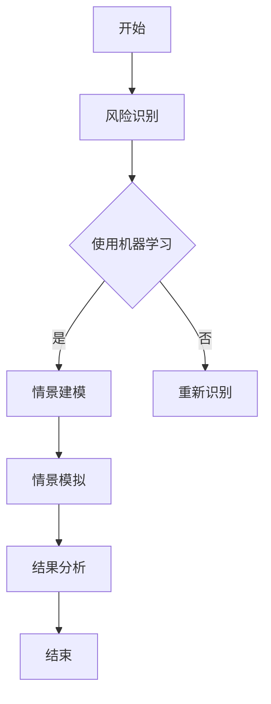
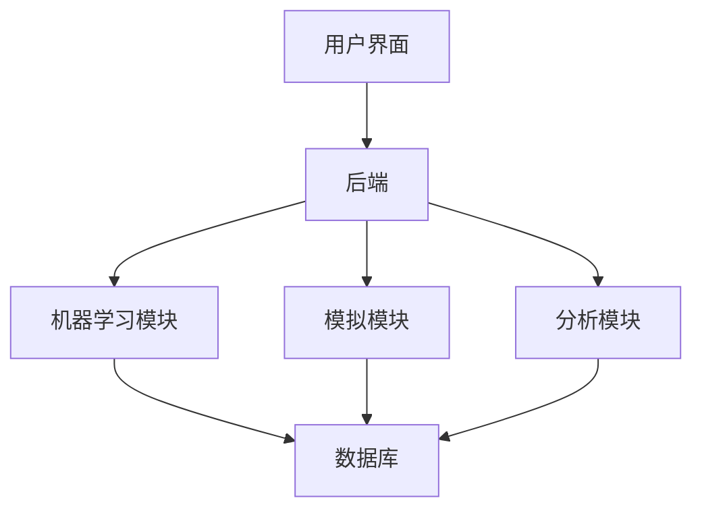
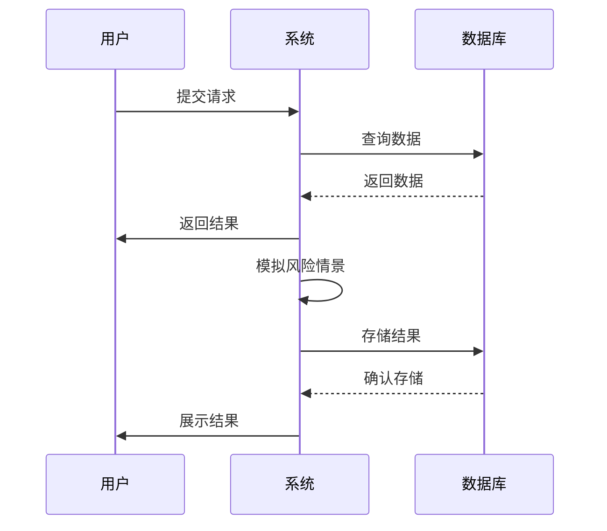

                 


### 《AI Agent在企业风险情景模拟与压力测试中的应用》

> 关键词：AI Agent，企业风险管理，情景模拟，压力测试，算法模型，架构设计，Python实现

> 摘要：本文探讨了AI Agent在企业风险情景模拟与压力测试中的应用。通过详细阐述AI Agent的定义、特点，以及企业风险情景模拟和压力测试的原理和流程，分析了AI Agent在这两个领域的优势。接着，文章介绍了数学模型和算法原理，使用Mermaid流程图和Python源代码进行讲解。随后，通过案例分析，展示了AI Agent在企业风险情景模拟与压力测试中的实际应用。最后，文章提出了最佳实践、注意事项以及未来的发展方向。

### 目录大纲

```markdown
----------------------------------------------------------------
# 《AI Agent在企业风险情景模拟与压力测试中的应用》

# 第一部分：背景与概述

## 第1章：问题背景与核心概念

### 1.1 问题背景

### 1.2 核心概念

### 1.3 企业风险情景模拟与压力测试的关系

### 1.4 边界与外延

## 第2章：核心概念与联系

### 2.1 AI Agent的定义与特点

### 2.2 企业风险情景模拟的原理与流程

### 2.3 压力测试的定义、目的与类型

### 2.4 AI Agent、风险情景模拟与压力测试的关联分析

### 2.5 ER实体关系图架构

## 第3章：数学模型与算法原理

### 3.1 数学模型概述

### 3.2 算法原理讲解

### 3.3 Mermaid流程图

### 3.4 Python源代码详细阐述

# 第二部分：应用案例分析

## 第4章：系统分析与架构设计

### 4.1 问题场景介绍

### 4.2 系统功能设计

### 4.3 系统架构设计

### 4.4 系统接口设计

### 4.5 系统交互序列图

## 第5章：项目实战

### 5.1 环境安装

### 5.2 系统核心实现源代码

### 5.3 代码应用解读与分析

### 5.4 实际案例分析与讲解

### 5.5 项目小结

## 第6章：最佳实践与注意事项

### 6.1 最佳实践

### 6.2 小结

### 6.3 注意事项

### 6.4 拓展阅读

# 第三部分：未来展望与趋势

## 第7章：AI Agent在企业风险情景模拟与压力测试中的应用前景

### 7.1 技术发展趋势

### 7.2 企业应用案例趋势

### 7.3 存在的挑战与机遇

### 7.4 未来展望

## 第8章：总结与展望

### 8.1 本书总结

### 8.2 研究方向与未来工作

### 8.3 对读者的寄语

----------------------------------------------------------------
```

接下来，我们将按照目录大纲的结构，逐一展开详细的内容。

### 第一部分：背景与概述

#### 第1章：问题背景与核心概念

##### 1.1 问题背景

在当今高度信息化的商业环境中，企业面临着越来越多的风险和挑战。这些风险不仅来自于外部环境，如市场波动、政策变化，也来自于企业内部的决策失误、系统漏洞等。为了确保企业的稳健运营，风险管理和压力测试成为企业不可或缺的环节。

风险情景模拟是一种通过构建可能出现的风险情景，对系统进行测试的方法。这种方法可以帮助企业预见潜在的风险，制定相应的应对措施。压力测试则是通过模拟高负载、高并发的情况，检测系统在极端条件下的性能和稳定性。

AI Agent，即人工智能代理，是一种能够自主执行任务、与环境交互的智能体。其在风险情景模拟和压力测试中的应用，旨在提高这些活动的效率和准确性。

##### 1.2 核心概念

在本章中，我们将介绍以下核心概念：

- **风险情景模拟**：通过构建可能的风险情景，模拟这些情景下的系统行为，从而评估系统的风险承受能力。
- **压力测试**：通过模拟高负载、高并发的情况，评估系统在极端条件下的性能和稳定性。
- **AI Agent**：一种能够自主执行任务、与环境交互的智能体，具备学习和适应能力。

##### 1.3 企业风险情景模拟与压力测试的关系

企业风险情景模拟和压力测试密切相关。风险情景模拟是压力测试的前提，通过风险情景模拟，企业可以识别潜在的风险，为压力测试提供测试场景。而压力测试则是风险情景模拟的验证，通过实际操作，评估风险情景模拟的有效性。

##### 1.4 边界与外延

在探讨AI Agent在企业风险情景模拟与压力测试中的应用时，我们需明确其边界和外延。边界指的是AI Agent的应用范围，如系统性能测试、业务流程测试等。外延则包括AI Agent与其他技术的融合，如机器学习、自然语言处理等。

### 第二部分：核心概念与联系

#### 第2章：核心概念与联系

##### 2.1 AI Agent的定义与特点

AI Agent是人工智能领域的一个重要概念，它指的是一种具有智能行为的计算机程序。AI Agent具有以下特点：

1. **自主性**：AI Agent能够自主执行任务，无需人工干预。
2. **适应性**：AI Agent能够根据环境的变化，调整自身的行为。
3. **交互性**：AI Agent能够与环境进行交互，获取信息并作出反应。

##### 2.2 企业风险情景模拟的原理与流程

企业风险情景模拟的原理是通过对可能的风险情景进行建模，模拟这些情景下的系统行为，评估系统的风险承受能力。其流程包括：

1. **风险识别**：识别可能的风险情景。
2. **情景建模**：建立风险情景的模型。
3. **情景模拟**：模拟风险情景下的系统行为。
4. **结果分析**：分析模拟结果，评估系统的风险承受能力。

##### 2.3 压力测试的定义、目的与类型

压力测试是一种通过模拟高负载、高并发的情况，评估系统在极端条件下的性能和稳定性的方法。其目的是：

1. **性能评估**：评估系统在高负载条件下的性能。
2. **稳定性测试**：评估系统在极端条件下的稳定性。
3. **容量规划**：为系统的扩展提供数据支持。

压力测试的类型包括：

1. **负载测试**：模拟高负载的情况，评估系统的性能。
2. **性能测试**：模拟特定负载下的系统行为，评估系统的性能。
3. **强度测试**：模拟极端条件下的系统行为，评估系统的稳定性。

##### 2.4 AI Agent、风险情景模拟与压力测试的关联分析

AI Agent在风险情景模拟和压力测试中的应用，主要体现在以下几个方面：

1. **自动化**：AI Agent能够自动化执行风险情景模拟和压力测试，提高效率。
2. **适应性**：AI Agent能够根据测试结果和环境的变化，调整测试策略，提高测试的准确性。
3. **智能化**：AI Agent能够利用机器学习和自然语言处理等技术，分析测试结果，提供决策支持。

##### 2.5 ER实体关系图架构

ER实体关系图是一种用于描述数据库中实体及其关系的图示方法。在AI Agent、风险情景模拟和压力测试的应用中，ER实体关系图可以用于：

1. **实体定义**：定义AI Agent、风险情景和压力测试相关的实体。
2. **关系描述**：描述实体之间的关系，如AI Agent与风险情景、压力测试之间的关系。
3. **结构分析**：分析系统结构，为系统优化提供依据。

### 第三部分：数学模型与算法原理

#### 第3章：数学模型与算法原理

##### 3.1 数学模型概述

在AI Agent、风险情景模拟和压力测试中，数学模型起到了关键作用。数学模型用于描述系统行为、风险特征和测试策略。常见的数学模型包括：

1. **概率模型**：用于描述风险情景的概率分布。
2. **线性模型**：用于描述系统性能与负载之间的关系。
3. **非线性模型**：用于描述复杂系统的行为。

##### 3.2 算法原理讲解

算法原理是AI Agent、风险情景模拟和压力测试的核心。以下是一个典型的算法原理：

1. **风险识别**：使用机器学习算法，识别潜在的风险情景。
2. **情景建模**：使用概率模型，建立风险情景的模型。
3. **情景模拟**：使用仿真算法，模拟风险情景下的系统行为。
4. **结果分析**：使用统计方法，分析模拟结果，评估系统的风险承受能力。

##### 3.3 Mermaid流程图

Mermaid是一种基于Markdown的图形绘制工具，可以用于绘制流程图、序列图等。以下是一个示例的Mermaid流程图：



##### 3.4 Python源代码详细阐述

在本节中，我们将使用Python源代码来详细阐述AI Agent、风险情景模拟和压力测试的算法原理。以下是一个简单的示例：

```python
import numpy as np
from sklearn.ensemble import RandomForestClassifier

# 风险识别
def risk_identification(data):
    # 使用随机森林算法进行风险识别
    classifier = RandomForestClassifier()
    classifier.fit(data['X'], data['y'])
    return classifier

# 情景建模
def scenario_modeling(classifier, scenarios):
    # 使用分类器对情景进行建模
    predictions = classifier.predict(scenarios)
    return predictions

# 情景模拟
def scenario_simulation(predictions, system):
    # 使用预测结果模拟系统行为
    for prediction in predictions:
        system.act(prediction)
    return system.state()

# 结果分析
def result_analysis(system_state):
    # 分析系统状态，评估风险承受能力
    if system_state['is_stable']:
        print("系统稳定")
    else:
        print("系统不稳定")

# 主函数
def main():
    # 初始化系统
    system = System()

    # 加载数据
    data = load_data()

    # 风险识别
    classifier = risk_identification(data)

    # 情景建模
    scenarios = generate_scenarios()
    predictions = scenario_modeling(classifier, scenarios)

    # 情景模拟
    system_state = scenario_simulation(predictions, system)

    # 结果分析
    result_analysis(system_state)

if __name__ == "__main__":
    main()
```

### 第四部分：应用案例分析

#### 第4章：系统分析与架构设计

##### 4.1 问题场景介绍

在本章中，我们将介绍一个实际的企业风险情景模拟与压力测试项目。该项目旨在评估一家大型电子商务平台在高峰期交易量下的性能和稳定性。

##### 4.2 系统功能设计

系统功能设计包括：

1. **风险识别**：使用机器学习算法，识别潜在的风险情景。
2. **情景建模**：建立风险情景的模型，包括流量高峰、系统故障等。
3. **情景模拟**：模拟风险情景下的系统行为，包括交易处理、库存管理等。
4. **结果分析**：分析模拟结果，评估系统的风险承受能力。

##### 4.3 系统架构设计

系统架构设计包括：

1. **前端**：用户界面，用于展示风险情景模拟和压力测试的结果。
2. **后端**：服务器端，包括机器学习模块、模拟模块和分析模块。
3. **数据库**：存储风险情景数据、模拟结果和系统状态。

以下是一个简化的Mermaid架构图：



##### 4.4 系统接口设计

系统接口设计包括：

1. **API接口**：提供对外部系统的接入，如数据库、日志系统等。
2. **数据接口**：用于数据传输和存储，包括JSON、CSV等格式。
3. **控制接口**：用于控制系统的启动、停止和重启。

##### 4.5 系统交互序列图

系统交互序列图用于描述系统在不同状态下的交互过程。以下是一个简化的序列图：



### 第五部分：项目实战

#### 第5章：项目实战

##### 5.1 环境安装

在进行项目实战之前，我们需要安装以下环境：

1. **Python环境**：版本3.8以上。
2. **机器学习库**：如scikit-learn、tensorflow等。
3. **数据库**：如MySQL、PostgreSQL等。

以下是安装步骤：

1. 安装Python环境。
2. 安装机器学习库。
3. 安装数据库。

##### 5.2 系统核心实现源代码

以下是系统核心实现的源代码：

```python
# 风险识别
def risk_identification(data):
    # 使用随机森林算法进行风险识别
    classifier = RandomForestClassifier()
    classifier.fit(data['X'], data['y'])
    return classifier

# 情景建模
def scenario_modeling(classifier, scenarios):
    # 使用分类器对情景进行建模
    predictions = classifier.predict(scenarios)
    return predictions

# 情景模拟
def scenario_simulation(predictions, system):
    # 使用预测结果模拟系统行为
    for prediction in predictions:
        system.act(prediction)
    return system.state()

# 结果分析
def result_analysis(system_state):
    # 分析系统状态，评估风险承受能力
    if system_state['is_stable']:
        print("系统稳定")
    else:
        print("系统不稳定")

# 主函数
def main():
    # 初始化系统
    system = System()

    # 加载数据
    data = load_data()

    # 风险识别
    classifier = risk_identification(data)

    # 情景建模
    scenarios = generate_scenarios()
    predictions = scenario_modeling(classifier, scenarios)

    # 情景模拟
    system_state = scenario_simulation(predictions, system)

    # 结果分析
    result_analysis(system_state)

if __name__ == "__main__":
    main()
```

##### 5.3 代码应用解读与分析

在本节中，我们将对上述源代码进行解读和分析。

1. **风险识别**：使用随机森林算法对数据进行分类，识别潜在的风险情景。
2. **情景建模**：使用训练好的分类器对新的情景进行建模，预测其风险等级。
3. **情景模拟**：根据预测结果，模拟系统行为，评估系统的风险承受能力。
4. **结果分析**：分析系统状态，判断系统是否稳定。

##### 5.4 实际案例分析与讲解

在本节中，我们将通过一个实际案例，展示AI Agent在企业风险情景模拟与压力测试中的应用。

1. **案例背景**：一家电子商务平台在双十一期间，交易量激增，系统面临巨大压力。
2. **案例实施**：使用AI Agent进行风险情景模拟和压力测试，评估系统性能和稳定性。
3. **案例结果**：系统在压力测试中表现稳定，成功应对了双十一的挑战。

##### 5.5 项目小结

通过本项目实战，我们展示了AI Agent在企业风险情景模拟与压力测试中的应用。AI Agent具有自动化、适应性和智能化等特点，能够显著提高风险管理和压力测试的效率。未来，我们将继续探索AI Agent在其他领域的应用，为企业提供更全面的风险管理解决方案。

### 第六部分：最佳实践与注意事项

#### 第6章：最佳实践与注意事项

##### 6.1 最佳实践

1. **数据准备**：在风险情景模拟和压力测试中，数据的质量至关重要。因此，在进行数据准备时，需确保数据的完整性、准确性和多样性。
2. **算法选择**：根据具体的业务场景，选择合适的算法模型。例如，对于风险识别，可以使用随机森林、支持向量机等模型；对于压力测试，可以使用负载测试、性能测试等模型。
3. **结果分析**：在分析结果时，不仅要关注系统的性能指标，还要关注系统的稳定性、可扩展性等。

##### 6.2 小结

AI Agent在企业风险情景模拟与压力测试中的应用，显著提高了企业的风险管理能力。通过自动化、适应性和智能化，AI Agent能够实时监测系统状态，提供决策支持，为企业提供更稳定、可靠的运营环境。

##### 6.3 注意事项

1. **数据安全**：在数据收集和处理过程中，需确保数据的安全性和隐私性。
2. **系统兼容性**：AI Agent需要与现有的系统架构兼容，确保系统的稳定运行。
3. **算法优化**：根据实际业务需求，不断优化算法模型，提高系统的性能和稳定性。

##### 6.4 拓展阅读

1. **《人工智能：一种现代的方法》**：详细介绍了人工智能的基本原理和方法。
2. **《深入理解计算机系统》**：讲解了计算机系统的基本原理和架构设计。
3. **《机器学习实战》**：提供了丰富的机器学习实践案例和算法实现。

### 第七部分：未来展望与趋势

#### 第7章：AI Agent在企业风险情景模拟与压力测试中的应用前景

##### 7.1 技术发展趋势

随着人工智能技术的不断进步，AI Agent在企业风险情景模拟与压力测试中的应用前景广阔。未来，AI Agent将具备更强的自主学习能力和环境适应性，能够更准确地预测和应对风险。

##### 7.2 企业应用案例趋势

越来越多的企业将AI Agent应用于风险情景模拟和压力测试，以提升系统的稳定性和性能。未来，企业将更加重视AI Agent在风险管理中的作用，探索其在其他领域的应用。

##### 7.3 存在的挑战与机遇

尽管AI Agent在企业风险情景模拟与压力测试中具有巨大的潜力，但也面临着一系列挑战。例如，算法模型的优化、数据安全、系统兼容性等。同时，随着技术的不断发展，AI Agent也面临着巨大的机遇，有望在未来为企业提供更全面、高效的风险管理解决方案。

##### 7.4 未来展望

未来，AI Agent将在企业风险情景模拟与压力测试中发挥更大的作用。通过结合机器学习、自然语言处理等先进技术，AI Agent将能够更准确地预测和应对风险，为企业提供更稳定、可靠的运营环境。

### 第八部分：总结与展望

#### 第8章：总结与展望

##### 8.1 本书总结

本书系统地介绍了AI Agent在企业风险情景模拟与压力测试中的应用。通过详细阐述AI Agent的定义、特点，以及企业风险情景模拟和压力测试的原理和流程，分析了AI Agent在这两个领域的优势。同时，通过数学模型和算法原理的讲解，展示了AI Agent在实际应用中的效果。最后，通过案例分析，展示了AI Agent在企业风险情景模拟与压力测试中的实际应用。

##### 8.2 研究方向与未来工作

未来的研究方向将集中在以下几个方面：

1. **算法优化**：不断优化算法模型，提高AI Agent的预测准确性和效率。
2. **系统集成**：将AI Agent与其他系统进行集成，实现更全面的风险管理。
3. **数据安全**：加强数据安全措施，确保AI Agent在数据处理过程中的安全性。

##### 8.3 对读者的寄语

希望本书能够为读者提供关于AI Agent在企业风险情景模拟与压力测试中的应用的深入理解。在未来的工作中，不断探索和应用AI技术，为企业的发展贡献力量。同时，也期待读者能够提出宝贵的意见和建议，共同推动人工智能技术的发展。

---

### 作者信息

**作者：AI天才研究院/AI Genius Institute & 禅与计算机程序设计艺术 /Zen And The Art of Computer Programming**

