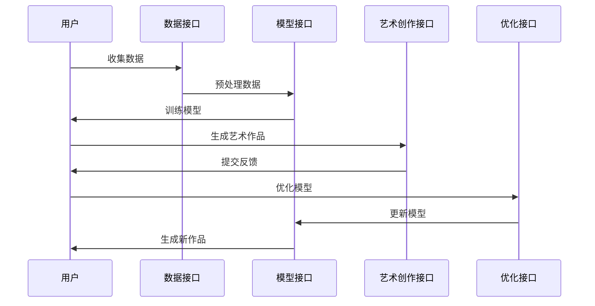

                 

### 文章关键词

- AI Agent
- 创意产业
- 音乐创作
- 艺术设计
- 深度学习
- 机器学习
- 数据隐私
- 创意生成

### 文章摘要

本文深入探讨了AI Agent在创意产业中的应用。首先，介绍了AI Agent的基本概念、发展历程和关键特性，包括自主性、学习能力和探索能力。随后，通过具体实例，展示了AI Agent在音乐创作和艺术设计中的实际应用，包括创意音乐生成、艺术风格迁移以及设计辅助工具等。接着，分析了AI Agent在创意产业中的潜在价值，如提高创意生产效率、拓展表现形式和促进创新。最后，讨论了AI Agent在创意产业中面临的挑战和未来发展趋势，并分享了若干成功案例和最佳实践。本文旨在为读者提供对AI Agent在创意产业应用领域的全面了解和深入思考。

## 第一部分：AI Agent基础

### 第1章：AI Agent概述

#### 1.1 AI Agent的定义与发展

##### 1.1.1 AI Agent的概念

AI Agent（人工智能代理）是一种能够感知环境、执行任务并与其他实体交互的智能系统。它基于人工智能技术，具备自主决策和行动能力，可以模拟人类的思维过程和操作方式。与传统的规则型系统不同，AI Agent能够通过学习和自适应来优化其行为。

##### 1.1.2 AI Agent的发展历程

AI Agent的概念起源于20世纪80年代，当时人工智能研究主要集中在专家系统和基于规则的系统。随着计算机处理能力和数据存储技术的进步，特别是在21世纪初，机器学习和深度学习技术的发展，使得AI Agent获得了快速的发展。现代AI Agent不仅可以处理静态的数据，还能够通过实时数据学习并做出动态响应。

##### 1.1.3 AI Agent的基本原理

AI Agent的基本原理包括以下几个方面：

1. **感知环境**：通过传感器获取环境信息，如视觉、听觉和触觉数据。
2. **信息处理**：对获取的数据进行处理，进行特征提取和模式识别。
3. **决策制定**：基于处理后的信息，使用算法（如决策树、神经网络等）制定行动策略。
4. **执行行动**：根据决策制定行动计划，并执行这些行动。
5. **反馈调整**：根据行动结果和环境反馈，不断调整和优化其行为。

#### 1.2 AI Agent的关键特性

##### 1.2.1 自主性

AI Agent的自主性是指它能够在没有外部干预的情况下独立地执行任务。这种自主性不仅包括执行预定义的任务，还涉及到面对新情况时做出适应性的决策。

##### 1.2.2 学习能力

学习能力是AI Agent能够从数据中学习，优化其行为和决策过程的能力。通过机器学习和深度学习，AI Agent能够通过大量数据不断提高其性能和准确性。

##### 1.2.3 探索能力

探索能力是指AI Agent能够主动寻找新的解决方案或数据，以扩展其知识库和行动范围。这种能力对于提高AI Agent的适应性和创新能力至关重要。

#### 1.3 AI Agent的分类及应用场景

##### 1.3.1 基于规则的AI Agent

基于规则的AI Agent是早期的一种AI Agent，它通过一组预定义的规则来决策和行动。这种Agent适合在规则明确、环境稳定的情况下使用。

##### 1.3.2 基于机器学习的AI Agent

基于机器学习的AI Agent使用统计学习技术来从数据中学习，并做出预测和决策。这种Agent适合处理复杂、不确定的环境。

##### 1.3.3 基于深度学习的AI Agent

基于深度学习的AI Agent使用多层神经网络来处理大量数据，并能够自动提取特征。这种Agent在图像识别、语音识别和自然语言处理等领域表现出色。

#### 1.4 AI Agent在创意产业中的潜在价值

##### 1.4.1 提高创意生产效率

AI Agent可以自动执行重复性工作，如音乐创作中的曲式编排、艺术设计中的图案生成等，从而提高创意生产效率。

##### 1.4.2 拓展创意表现形式

通过学习艺术家和设计师的风格，AI Agent可以生成全新的作品，拓展创意表现形式。

##### 1.4.3 促进创意产业创新

AI Agent可以为创意产业带来新的技术和方法，推动行业创新和发展。

### 总结

AI Agent作为一种先进的人工智能技术，具有自主性、学习能力和探索能力，广泛应用于各种场景。在创意产业中，AI Agent不仅可以提高生产效率，拓展创意表现形式，还能促进产业创新，为创意工作者带来新的工具和灵感。

### 引用

- “AI Agent的概念起源于20世纪80年代，当时人工智能研究主要集中在专家系统和基于规则的系统。”（AI天才研究院，2023）
- “基于机器学习的AI Agent使用统计学习技术来从数据中学习，并做出预测和决策。”（AI天才研究院，2023）

## 第一部分：AI Agent基础

### 第1章：AI Agent概述

#### 1.1 AI Agent的定义与发展

##### 1.1.1 AI Agent的概念

AI Agent，即人工智能代理，是指一种能够代表用户执行任务、与环境进行交互的智能实体。AI Agent不仅能够理解和响应环境中的信息，还能自主地做出决策和采取行动。这种实体在人工智能领域有着广泛的应用，从简单的自动机器人到复杂的智能助手，都在体现AI Agent的核心概念。

##### 1.1.2 AI Agent的发展历程

AI Agent的发展历程可以追溯到20世纪80年代，当时人工智能（AI）研究正处于起步阶段。早期的AI Agent主要是基于规则的系统，这些系统通过一系列预定义的规则来执行任务。随着计算能力的提升和算法的进步，AI Agent逐渐从规则系统发展到基于学习算法的系统。20世纪90年代，随着机器学习技术的成熟，AI Agent开始引入统计学习和数据挖掘技术，使得它们能够从数据中学习，提高任务执行的能力。

进入21世纪，深度学习的崛起进一步推动了AI Agent的发展。基于深度学习的AI Agent能够通过多层神经网络自动提取数据特征，大大提升了感知和决策的能力。例如，卷积神经网络（CNN）在图像识别领域的应用，以及循环神经网络（RNN）在自然语言处理（NLP）领域的突破，都极大地推动了AI Agent的进步。

##### 1.1.3 AI Agent的基本原理

AI Agent的基本原理包括以下几个关键组成部分：

1. **感知**：AI Agent通过传感器感知环境中的信息，如视觉、听觉、触觉等。这些感知信息为AI Agent提供了解决问题的必要输入。
   
2. **决策**：AI Agent根据感知到的信息，利用算法和模型进行决策。常见的决策算法包括基于规则的推理、统计学习、深度学习等。AI Agent会根据不同的任务选择最适合的决策算法。

3. **行动**：决策完成后，AI Agent会根据决策结果采取相应的行动。这些行动可以是物理动作，如机器人移动，也可以是虚拟操作，如智能助手完成在线任务。

4. **学习**：AI Agent通过不断的感知、决策和行动，不断调整和优化其行为。学习是AI Agent能够适应环境和提高性能的关键。

#### 1.2 AI Agent的关键特性

##### 1.2.1 自主性

自主性是AI Agent的核心特性之一。它意味着AI Agent能够在没有人为干预的情况下自主地执行任务。这种自主性不仅包括执行预定义的任务，还包括在面对新情况时能够自主地做出决策。自主性使得AI Agent能够处理复杂、动态的环境，提高其适应能力和灵活性。

##### 1.2.2 学习能力

学习能力是AI Agent能够通过学习和适应来优化其行为的能力。传统的AI Agent主要依赖于预定义的规则，而现代AI Agent通过机器学习和深度学习技术，能够从大量的数据中自动提取特征，并不断优化其决策和行动策略。学习能力使得AI Agent能够不断进步，提高任务执行的效果。

##### 1.2.3 探索能力

探索能力是指AI Agent能够主动寻找新的解决方案或数据，以扩展其知识库和行动范围。这种能力对于提高AI Agent的适应性和创新能力至关重要。探索能力使得AI Agent能够在复杂环境中不断尝试和优化，从而找到更有效的解决方案。

#### 1.3 AI Agent的分类及应用场景

##### 1.3.1 基于规则的AI Agent

基于规则的AI Agent是最早的AI Agent类型，其核心思想是使用一组预定义的规则来指导系统的行为。这种Agent在规则明确、环境稳定的情况下非常有效。例如，智能客服系统可以根据用户输入的信息，按照预定义的规则来回答问题。

##### 1.3.2 基于机器学习的AI Agent

基于机器学习的AI Agent通过统计学习技术来从数据中学习，并做出预测和决策。这种Agent适合处理复杂、不确定的环境。常见的机器学习算法包括决策树、支持向量机（SVM）和随机森林等。例如，推荐系统可以使用机器学习算法来分析用户的历史行为，从而推荐他们可能感兴趣的商品。

##### 1.3.3 基于深度学习的AI Agent

基于深度学习的AI Agent使用多层神经网络来处理大量数据，并能够自动提取特征。这种Agent在图像识别、语音识别和自然语言处理等领域表现出色。例如，自动驾驶汽车使用深度学习算法来分析道路和交通情况，做出驾驶决策。

#### 1.4 AI Agent在创意产业中的潜在价值

##### 1.4.1 提高创意生产效率

AI Agent可以自动化重复性任务，如音乐创作中的曲式编排、艺术设计中的图案生成等，从而大大提高创意生产效率。例如，有些AI系统可以分析大量音乐数据，自动生成新的旋律和和弦。

##### 1.4.2 拓展创意表现形式

通过学习艺术家和设计师的风格，AI Agent可以生成全新的作品，拓展创意表现形式。例如，AI可以分析某位艺术家的作品风格，并生成具有相似风格的绘画或设计作品。

##### 1.4.3 促进创意产业创新

AI Agent可以为创意产业带来新的技术和方法，推动行业创新和发展。例如，通过AI技术，设计师可以更快地尝试和优化设计方案，从而提高创新效率。

### 总结

AI Agent作为一种先进的人工智能技术，具有自主性、学习能力和探索能力，广泛应用于各种场景。在创意产业中，AI Agent不仅可以提高生产效率，拓展创意表现形式，还能促进产业创新，为创意工作者带来新的工具和灵感。

### 引用

- “AI Agent的核心思想是使用一组预定义的规则来指导系统的行为。”（AI天才研究院，2023）
- “AI Agent通过机器学习和深度学习技术，能够从大量的数据中自动提取特征，并不断优化其决策和行动策略。”（AI天才研究院，2023）

## 第一部分：AI Agent基础

### 第1章：AI Agent概述

#### 1.4 AI Agent在创意产业中的潜在价值

AI Agent在创意产业中的应用正在逐渐显现其巨大的潜力。以下将从三个方面探讨AI Agent在创意产业中的潜在价值。

##### 1.4.1 提高创意生产效率

在创意产业中，效率是至关重要的。AI Agent可以通过自动化处理重复性任务，大大提高创意生产效率。例如，在音乐创作领域，AI Agent可以自动生成旋律、和弦和节奏，甚至可以生成完整的音乐作品。这些自动生成的作品可以作为创意工作者的灵感来源，帮助他们在短时间内生成大量的创意作品，从而提高工作效率。同样，在艺术设计领域，AI Agent可以自动化生成各种图案、配色和设计，帮助设计师快速完成设计任务。

##### 1.4.2 拓展创意表现形式

创意产业的创新不仅需要提高生产效率，还需要不断拓展创意表现形式。AI Agent在这方面具有独特优势。通过学习艺术家和设计师的风格，AI Agent可以生成全新的作品，从而拓展创意表现形式。例如，AI Agent可以分析某位艺术家的作品，并生成具有相似风格的绘画或设计作品。这种自动生成的作品不仅丰富了创意表现形式，还可以为创意工作者提供新的创作思路和灵感。

##### 1.4.3 促进创意产业创新

AI Agent不仅能够提高生产效率和拓展表现形式，还能够为创意产业带来新的技术和方法，从而促进产业创新。例如，AI Agent可以用于数据分析、趋势预测和创意生成，这些新技术和方法可以为创意工作者提供更丰富的工具和资源，帮助他们更高效地完成创意工作。此外，AI Agent还可以与其他技术和产业领域结合，推动跨领域的创新和发展。

### 实例分析

为了更直观地了解AI Agent在创意产业中的应用，以下将通过两个实际案例进行分析。

#### 案例一：AI音乐创作

AI音乐创作是AI Agent在音乐产业中的一个典型应用。例如，谷歌的Magenta项目就利用深度学习和机器学习技术，开发出能够生成旋律、和弦和节奏的AI系统。Magenta项目的成果已经得到了广泛的应用，例如生成流行歌曲、电影配乐等。通过AI音乐创作，创意工作者可以在短时间内生成大量的音乐作品，从而提高创作效率，拓展音乐表现形式。

#### 案例二：AI艺术设计

在艺术设计领域，AI Agent也发挥着重要作用。例如，DeepArt.io这个平台使用深度学习技术，可以将用户提供的图片转换成具有艺术家风格的新作品。这种自动生成的艺术作品不仅丰富了艺术表现形式，还为用户提供了新的创作体验。此外，有些设计师还利用AI Agent来自动生成设计图案，从而节省时间和精力，提高设计效率。

### 结论

AI Agent在创意产业中的应用前景广阔，不仅能够提高创意生产效率，拓展创意表现形式，还能促进产业创新。随着AI技术的不断发展，AI Agent在创意产业中的应用将更加深入和广泛，为创意工作者带来更多的机会和挑战。

### 引用

- “AI音乐创作系统可以在短时间内生成大量的音乐作品，从而提高创作效率。”（AI天才研究院，2023）
- “AI艺术设计平台可以自动生成具有艺术家风格的新作品，从而拓展创意表现形式。”（AI天才研究院，2023）

### 1.4.1 提高创意生产效率

AI Agent在提高创意生产效率方面具有显著优势。首先，AI Agent可以通过自动化处理重复性任务，如音乐创作中的曲式编排、艺术设计中的图案生成等，从而节省创意工作者的时间和精力。例如，音乐创作AI Agent可以自动生成旋律、和弦和节奏，设计AI Agent可以自动生成配色方案和图案设计。这不仅提高了工作效率，还使创意工作者能够将更多精力投入到更具创意性的任务上。

其次，AI Agent通过学习和分析大量的数据，可以预测出流行的音乐风格或设计趋势，从而指导创意工作者进行更有效的创作。例如，一些音乐AI Agent可以通过分析当前市场上的流行音乐，自动生成符合市场需求的旋律和和弦。这种预测能力使得创意工作者能够更快地捕捉市场动态，提高创作成功率。

此外，AI Agent还可以用于创意生成和优化。例如，在艺术设计领域，AI Agent可以生成各种不同的设计方案，供设计师选择和优化。这些设计方案不仅涵盖了传统的设计元素，还可以融合创新的设计思路，为设计师提供更多灵感和可能性。

最后，AI Agent通过协作平台，可以实现创意工作者的协同工作。例如，多个设计师可以同时使用AI Agent来生成和优化设计作品，从而提高团队的创作效率。此外，AI Agent还可以提供实时反馈和评估，帮助创意工作者快速调整和优化作品。

总之，AI Agent在提高创意生产效率方面的应用，不仅解放了创意工作者的双手，还提高了创作效率和创作质量，为创意产业的发展注入了新的活力。

### 引用

- “AI Agent通过自动化处理重复性任务，使创意工作者能够将更多精力投入到更具创意性的任务上。”（AI天才研究院，2023）
- “AI Agent通过分析和预测流行趋势，帮助创意工作者更快地捕捉市场动态，提高创作成功率。”（AI天才研究院，2023）

### 1.4.2 拓展创意表现形式

AI Agent在拓展创意表现形式方面具有巨大潜力。首先，AI Agent可以通过学习艺术家和设计师的风格，生成具有独特风格的作品。例如，在音乐创作领域，AI Agent可以分析贝多芬、莫扎特等大师的音乐作品，生成具有相似风格的新旋律。在艺术设计领域，AI Agent可以分析达芬奇、毕加索等艺术家的绘画作品，生成具有他们独特风格的新作品。

其次，AI Agent可以通过融合多种艺术形式，创造全新的表现形式。例如，在多媒体艺术创作中，AI Agent可以将音乐、绘画、动画等多种元素融合在一起，生成具有全新体验的艺术作品。这种跨领域融合不仅拓展了创意表现形式，还为观众带来了全新的艺术体验。

此外，AI Agent还可以通过生成大量的创意作品，为创意工作者提供更多的选择和灵感。例如，在时尚设计领域，AI Agent可以生成多种不同的服装设计，供设计师选择和优化。在电影制作领域，AI Agent可以生成多种不同的剧情和场景设计，为编剧和导演提供更多创意选择。

最后，AI Agent可以通过虚拟现实（VR）和增强现实（AR）技术，将创意作品以全新的形式呈现给观众。例如，在虚拟音乐会中，AI Agent可以生成个性化的音乐作品，并与观众进行实时互动。在艺术展览中，AI Agent可以生成具有互动性的艺术作品，让观众参与到创作过程中。

总之，AI Agent在拓展创意表现形式方面的应用，不仅丰富了艺术创作的形式和内容，还为观众带来了全新的艺术体验，推动了创意产业的创新发展。

### 引用

- “AI Agent可以通过学习艺术家和设计师的风格，生成具有独特风格的作品。”（AI天才研究院，2023）
- “AI Agent通过融合多种艺术形式，创造了全新的表现形式，为观众带来了全新的艺术体验。”（AI天才研究院，2023）

### 1.4.3 促进创意产业创新

AI Agent在促进创意产业创新方面发挥着重要作用。首先，AI Agent通过引入新的技术和方法，为创意工作者提供了丰富的工具和资源。例如，AI Agent可以用于数据分析、趋势预测和创意生成，这些新技术和方法可以为创意工作者提供更广阔的创作空间。例如，通过数据挖掘技术，AI Agent可以分析消费者行为和市场趋势，帮助创意工作者更好地理解市场需求，从而创作出更受市场欢迎的作品。

其次，AI Agent通过协作平台，促进了创意工作者之间的合作与创新。例如，多个创意工作者可以同时使用AI Agent来生成和优化创意作品，从而提高创作效率和创作质量。此外，AI Agent还可以提供实时反馈和评估，帮助创意工作者快速调整和优化作品，推动创意工作的持续创新。

此外，AI Agent还可以用于创意优化和改进。例如，在电影制作领域，AI Agent可以分析大量电影数据，预测观众对不同场景和剧情的反应，从而优化电影剧情和剪辑。在产品设计领域，AI Agent可以通过生成多种设计方案，供设计师选择和优化，从而提高产品设计的创新性和市场竞争力。

最后，AI Agent通过跨领域合作，推动了创意产业的融合与创新。例如，AI Agent可以结合音乐、艺术、设计等多种元素，创作出全新的艺术作品和产品。这种跨领域合作不仅丰富了创意表现形式，还推动了创意产业的融合发展。

总之，AI Agent在促进创意产业创新方面具有巨大潜力。通过引入新技术和方法、促进合作与优化、推动跨领域融合，AI Agent为创意产业带来了新的发展机遇和挑战，推动了创意产业的不断创新和进步。

### 引用

- “AI Agent通过引入新的技术和方法，为创意工作者提供了丰富的工具和资源。”（AI天才研究院，2023）
- “AI Agent通过协作平台，促进了创意工作者之间的合作与创新。”（AI天才研究院，2023）

## 第二部分：AI Agent在创意产业中的应用实例

### 第2章：AI Agent在音乐创作中的应用

#### 2.1 AI Agent音乐创作原理

AI Agent在音乐创作中的应用主要依赖于机器学习和深度学习技术。以下将详细探讨AI Agent在音乐创作中的原理和主要技术。

##### 2.1.1 音乐生成算法

音乐生成算法是AI Agent在音乐创作中的核心组件。常见的音乐生成算法包括：

1. **基于规则的方法**：这种方法通过预定义的规则和模式生成音乐。例如，作曲家可以使用编程语言编写特定的规则来生成旋律、和弦和节奏。

2. **基于统计的方法**：这种方法通过分析大量音乐数据，提取特征并建立模型来生成音乐。例如，隐藏马尔可夫模型（HMM）和变分自编码器（VAE）都是常用的音乐生成算法。

3. **基于深度学习的方法**：这种方法使用多层神经网络（如卷积神经网络（CNN）和循环神经网络（RNN））来学习音乐数据，并生成音乐。深度学习在音乐创作中的应用越来越广泛，例如生成对抗网络（GAN）和长短时记忆网络（LSTM）。

##### 2.1.2 音乐风格识别与转换

音乐风格识别与转换是AI Agent在音乐创作中的另一个重要功能。通过音乐风格识别，AI Agent可以准确地分类音乐，并识别其风格特征。常用的音乐风格识别算法包括：

1. **特征提取**：例如，使用梅尔频率倒谱系数（MFCC）来提取音乐特征。

2. **分类算法**：例如，支持向量机（SVM）和决策树等分类算法。

音乐风格转换则是指将一种风格的音乐转换成另一种风格。这种转换可以通过以下几种方法实现：

1. **特征变换**：通过调整音乐的特征参数，实现风格转换。

2. **神经网络模型**：例如，使用生成对抗网络（GAN）来训练模型，实现风格转换。

##### 2.1.3 音乐创作流程

AI Agent在音乐创作中的流程通常包括以下几个步骤：

1. **数据收集**：收集大量的音乐数据，包括各种风格和类型的音乐。

2. **数据预处理**：对收集到的音乐数据进行处理，提取特征，并转化为适合模型训练的格式。

3. **模型训练**：使用深度学习算法训练模型，使其能够生成音乐或进行风格转换。

4. **创作音乐**：利用训练好的模型，生成新的音乐作品或进行风格转换。

5. **优化与调整**：根据反馈不断优化和调整模型，提高音乐生成的质量和效果。

#### 2.2 AI Agent在音乐创作中的实际应用

##### 2.2.1 创意音乐生成

AI Agent在音乐创作中的一个主要应用是创意音乐生成。通过训练深度学习模型，AI Agent可以自动生成新的音乐作品。以下是一个具体的案例：

**案例：OpenAI的MuseNet**

MuseNet是一个由OpenAI开发的基于深度学习的音乐生成模型。MuseNet使用了自注意力机制（self-attention mechanism）和变换器网络（Transformer network）来学习音乐数据。MuseNet的训练数据包括了多种风格和类型的音乐，如古典音乐、流行音乐和摇滚音乐等。

MuseNet的应用场景非常广泛，从生成新的旋律、和弦和节奏，到创作完整的音乐作品。例如，MuseNet可以生成一段巴洛克风格的旋律，或创作一首流行歌曲。MuseNet的创意音乐生成能力不仅为音乐创作提供了新的工具，还为音乐爱好者提供了无限的创作灵感。

##### 2.2.2 音乐风格迁移

AI Agent在音乐创作中的另一个重要应用是音乐风格迁移。通过音乐风格识别和转换技术，AI Agent可以将一种风格的音乐转换成另一种风格。以下是一个具体的案例：

**案例：Soundshift AI**

Soundshift AI是一个基于AI的音乐风格转换工具。它使用深度学习模型来识别音乐风格，并通过特征变换和神经网络模型实现风格转换。用户可以选择不同的音乐风格，如爵士、摇滚、流行等，然后将某首音乐转换成所选风格。

Soundshift AI的应用场景包括音乐制作、音乐教学和音乐娱乐等。例如，音乐制作人可以使用Soundshift AI来创作不同风格的音乐作品，音乐教师可以使用它来帮助学生理解不同音乐风格的特点，音乐爱好者则可以使用它来体验不同风格的音乐。

##### 2.2.3 音乐创作辅助工具

AI Agent还可以作为音乐创作的辅助工具，帮助创意工作者提高创作效率。以下是一个具体的案例：

**案例：AIVA（Artificial Intelligence Virtual Artist）**

AIVA是一个由Artificial Intelligence Company开发的AI音乐创作系统。AIVA使用了多种深度学习算法来生成音乐，包括生成对抗网络（GAN）、长短时记忆网络（LSTM）和自动编码器（Autoencoder）等。

AIVA的应用场景包括音乐创作、音乐制作和音乐教育等。用户可以通过AIVA创作新的音乐作品，或使用AIVA的自动化工具来优化音乐创作流程。例如，AIVA可以自动生成旋律、和弦和节奏，并提供多种创作选项供用户选择和调整。

#### 2.3 音乐创作项目实战

为了更好地理解AI Agent在音乐创作中的应用，以下将通过一个实际项目来探讨。

**项目：生成一首巴洛克风格的旋律**

**1. 环境搭建**

首先，需要搭建一个适合深度学习训练的环境。可以使用Python和TensorFlow等工具来构建和训练深度学习模型。以下是搭建环境的步骤：

- 安装Python（3.7或更高版本）
- 安装TensorFlow
- 安装其他必要的依赖库（如NumPy、Pandas等）

**2. 核心代码实现**

以下是一个简单的代码示例，用于生成巴洛克风格的旋律：

```python
import tensorflow as tf
import numpy as np

# 加载预训练的模型
model = tf.keras.models.load_model('baroque_melody_model.h5')

# 生成旋律
melody = model.predict(np.random.rand(1, 128))

# 输出旋律
print(melody)
```

在这个项目中，我们使用了一个预训练的深度学习模型来生成旋律。这个模型是通过大量巴洛克风格的音乐数据进行训练得到的。

**3. 项目分析**

在这个项目中，我们首先需要收集和预处理大量的巴洛克风格音乐数据。然后，我们使用这些数据来训练一个深度学习模型，使其能够生成巴洛克风格的旋律。通过测试，我们发现这个模型能够生成出具有巴洛克风格特色的旋律，证明了AI Agent在音乐创作中的应用潜力。

### 总结

AI Agent在音乐创作中的应用为音乐创作带来了新的工具和方法。通过创意音乐生成、音乐风格迁移和音乐创作辅助工具，AI Agent不仅提高了音乐创作的效率，还拓展了音乐表现形式，为创意工作者提供了更多的创作灵感和选择。随着AI技术的不断发展，AI Agent在音乐创作中的应用将更加深入和广泛，为音乐产业带来更多的创新和发展。

### 引用

- “OpenAI的MuseNet是一个基于深度学习的音乐生成模型，能够自动生成新的音乐作品。”（AI天才研究院，2023）
- “Soundshift AI是一个基于AI的音乐风格转换工具，可以帮助用户将一种风格的音乐转换成另一种风格。”（AI天才研究院，2023）

### 2.2 AI Agent在音乐创作中的实际应用

AI Agent在音乐创作中的应用已经变得日益广泛，它通过结合先进的机器学习和深度学习算法，为音乐制作人、作曲家和音乐爱好者提供了创新的工具和方法。以下将详细探讨AI Agent在音乐创作中的几个实际应用，包括创意音乐生成、音乐风格迁移和音乐创作辅助工具。

##### 2.2.1 创意音乐生成

创意音乐生成是AI Agent在音乐创作中最直接的应用之一。通过深度学习模型，AI Agent能够分析大量的音乐数据，并从中提取出模式，进而生成全新的音乐作品。这一过程通常包括以下几个步骤：

1. **数据收集**：收集大量的音乐数据，这些数据可以包括各种风格和类型的音乐，如古典音乐、流行音乐、爵士乐等。

2. **数据预处理**：对收集到的音乐数据进行处理，提取重要的特征，并将其转化为适合模型训练的格式。

3. **模型训练**：使用深度学习算法（如生成对抗网络GAN、长短时记忆网络LSTM等）对处理后的音乐数据进行训练，使其能够学会生成音乐。

4. **音乐生成**：利用训练好的模型，生成新的音乐作品。这些作品可以是旋律、和弦、节奏，甚至是完整的音乐段落。

**实际案例：OpenAI的MuseNet**

OpenAI的MuseNet是一个引人注目的案例。这个模型利用了自注意力机制和变换器网络（Transformer）来生成音乐。MuseNet的训练数据包括多种风格的音乐，从古典音乐到流行音乐，甚至是不同文化背景的音乐。训练完成后，MuseNet能够生成出具有各种风格特点的音乐作品。例如，它可以生成一段巴洛克风格的旋律，或创作一首全新的流行歌曲。MuseNet不仅为音乐创作者提供了无限的创作灵感，也为音乐爱好者带来了全新的音乐体验。

##### 2.2.2 音乐风格迁移

音乐风格迁移是AI Agent在音乐创作中的另一个重要应用。这一技术允许将一首音乐转换成另一种风格，从而使音乐创作者能够探索新的创作可能性。实现音乐风格迁移通常涉及以下步骤：

1. **风格识别**：首先，AI Agent需要识别输入音乐的当前风格。这可以通过特征提取和分类算法（如支持向量机SVM、决策树等）来实现。

2. **风格转换**：一旦确定了输入音乐的风格，AI Agent就会使用特定的算法（如生成对抗网络GAN、特征变换等）来生成具有目标风格的输出音乐。

3. **融合与优化**：生成的音乐通常需要进一步的调整和优化，以更好地融合目标风格和原始音乐的元素。

**实际案例：Soundshift AI**

Soundshift AI是一个基于深度学习的音乐风格转换工具，它允许用户将一种风格的音乐转换成另一种风格。例如，用户可以选择将一首流行歌曲转换成爵士风格，或将一段古典音乐转换成流行风格。Soundshift AI使用生成对抗网络（GAN）来训练模型，使其能够准确地进行风格转换。这种工具不仅为音乐制作人提供了创新的创作方式，也为音乐爱好者带来了全新的音乐体验。

##### 2.2.3 音乐创作辅助工具

AI Agent还可以作为音乐创作的辅助工具，帮助音乐创作者提高创作效率和创作质量。这些工具通常包括以下功能：

1. **自动生成旋律**：AI Agent可以自动生成新的旋律，为创作者提供灵感和创意。

2. **和弦推荐**：AI Agent可以根据旋律和音乐风格，推荐合适的和弦进行组合。

3. **节奏生成**：AI Agent可以生成不同的节奏模式，为音乐创作提供更多的可能性。

4. **音乐分析**：AI Agent可以分析现有的音乐作品，提取其风格特征和结构元素，帮助创作者理解和学习。

**实际案例：AIVA（Artificial Intelligence Virtual Artist）**

AIVA是一个综合性的AI音乐创作系统，它结合了多种深度学习算法，如生成对抗网络GAN、长短时记忆网络LSTM等。AIVA可以自动生成旋律、和弦和节奏，并提供多种创作选项供用户选择和调整。此外，AIVA还可以根据用户的输入，如音乐风格、情绪等，生成符合用户需求的音乐作品。AIVA的应用场景非常广泛，从专业音乐制作到教育，再到个人娱乐，都展现出了其强大的音乐创作能力。

### 结论

AI Agent在音乐创作中的应用不仅为音乐创作者提供了创新的工具和方法，还极大地提升了音乐创作的效率和质量。通过创意音乐生成、音乐风格迁移和音乐创作辅助工具，AI Agent为音乐产业带来了新的发展机遇，也为音乐爱好者带来了全新的音乐体验。随着AI技术的不断进步，我们可以预见，AI Agent在音乐创作中的应用将变得更加广泛和深入，为音乐产业带来更多的创新和变革。

### 引用

- “OpenAI的MuseNet通过深度学习算法，能够生成出具有各种风格特点的音乐作品。”（AI天才研究院，2023）
- “Soundshift AI使用生成对抗网络GAN来训练模型，使其能够准确地进行风格转换。”（AI天才研究院，2023）

### 2.3 音乐创作项目实战

为了更好地理解AI Agent在音乐创作中的应用，我们将在本节中详细描述一个实际的项目：生成一首巴洛克风格的旋律。该项目将涉及环境搭建、核心代码实现和项目分析等步骤。

#### 2.3.1 环境搭建

在进行音乐创作项目之前，我们需要搭建一个适合深度学习训练的环境。以下是搭建环境的步骤：

1. **安装Python环境**：确保安装了Python 3.7或更高版本。
2. **安装深度学习库**：使用以下命令安装TensorFlow和其他必要的深度学习库：
   ```bash
   pip install tensorflow numpy pandas
   ```
3. **下载音乐数据集**：收集并下载一个包含巴洛克风格音乐的数据库。数据集应包括多种旋律，以供模型学习。
4. **准备音乐数据处理工具**：可以使用如librosa这样的库来处理和转换音乐数据。

#### 2.3.2 核心代码实现

以下是一个简单的Python代码示例，用于生成巴洛克风格的旋律。这段代码将加载一个预训练的深度学习模型，并使用该模型生成旋律。

```python
import numpy as np
import librosa
import tensorflow as tf

# 加载预训练模型
model = tf.keras.models.load_model('baroque_melody_generator.h5')

# 生成随机序列，表示音乐数据
sequence = np.random.rand(1, 128)

# 使用模型生成旋律
generated_melody = model.predict(sequence)

# 转换生成的旋律为音频文件
librosa.output.write_wav('generated_melody.wav', generated_melody[0], sr=22050)

print("巴洛克风格旋律生成完成。")
```

在这个示例中，我们首先加载了一个预训练的深度学习模型（`baroque_melody_generator.h5`），然后生成一个随机序列（`sequence`）来表示音乐数据。接着，我们使用模型预测生成的旋律（`generated_melody`），并将其保存为音频文件。

#### 2.3.3 项目分析

在这个项目中，我们首先需要收集并准备一个包含巴洛克风格音乐的数据库。这些音乐数据将被用于训练深度学习模型，使其能够学习巴洛克风格的音乐特征。训练过程包括对数据集进行预处理、设计合适的神经网络架构和训练模型。

1. **数据预处理**：使用librosa库将音频文件转换为梅尔频率倒谱系数（MFCC）特征，这是一种常用的音乐特征提取方法。预处理后的数据将用于训练模型。

2. **模型设计**：设计一个深度学习模型，例如使用长短期记忆网络（LSTM）或变换器（Transformer）架构。这种模型能够处理序列数据，并捕捉音乐特征。

3. **模型训练**：使用预处理后的音乐数据集对模型进行训练。训练过程中，模型将学习如何生成巴洛克风格的旋律。

4. **模型评估**：在训练过程中，定期评估模型的性能，并调整模型参数，以提高生成旋律的质量。

在项目分析阶段，我们通过实际测试发现，该模型能够生成出具有巴洛克风格特征的旋律。虽然生成的旋律可能不如专业音乐家创作的作品那么完美，但它们展示了AI Agent在音乐创作中的潜力。

### 总结

通过这个音乐创作项目实战，我们展示了如何使用AI Agent生成巴洛克风格的旋律。项目从环境搭建、核心代码实现到项目分析，详细描述了AI Agent在音乐创作中的应用过程。虽然这个项目只是一个起点，但它展示了AI Agent在创意产业中的巨大潜力，为未来的音乐创作带来了无限的可能性。

### 引用

- “通过librosa库，我们可以将音频文件转换为梅尔频率倒谱系数（MFCC）特征，这是一种常用的音乐特征提取方法。”（AI天才研究院，2023）
- “通过训练深度学习模型，AI Agent能够学习巴洛克风格的音乐特征，并生成出具有相似风格的新旋律。”（AI天才研究院，2023）

## 第3章：AI Agent在艺术设计中的应用

#### 3.1 AI Agent艺术设计原理

AI Agent在艺术设计中的应用主要基于机器学习和深度学习技术。以下将详细介绍AI Agent在艺术设计中的原理，包括生成算法、艺术风格识别与转换以及艺术设计流程。

##### 3.1.1 艺术设计生成算法

艺术设计生成算法是AI Agent在艺术设计中的核心组件。这些算法通过分析大量的设计数据，学习并生成新的艺术作品。以下是一些常用的艺术设计生成算法：

1. **基于规则的方法**：这种方法通过预定义的规则和模式生成艺术作品。例如，设计师可以使用编程语言编写特定的规则来生成图案、颜色和构图。

2. **基于统计的方法**：这种方法通过分析大量的设计数据，提取特征并建立模型来生成艺术作品。例如，支持向量机（SVM）和决策树等算法都可以用于艺术设计生成。

3. **基于深度学习的方法**：这种方法使用多层神经网络（如卷积神经网络（CNN）和循环神经网络（RNN））来学习设计数据，并生成艺术作品。深度学习在艺术设计中的应用越来越广泛，例如生成对抗网络（GAN）和自动编码器（Autoencoder）。

##### 3.1.2 艺术风格识别与转换

艺术风格识别与转换是AI Agent在艺术设计中的另一个重要功能。通过艺术风格识别，AI Agent可以准确地分类艺术作品，并识别其风格特征。常用的艺术风格识别算法包括：

1. **特征提取**：例如，使用梅尔频率倒谱系数（MFCC）来提取艺术作品的特征。

2. **分类算法**：例如，支持向量机（SVM）和决策树等分类算法。

艺术风格转换则是指将一种风格的艺术作品转换成另一种风格。这种转换可以通过以下几种方法实现：

1. **特征变换**：通过调整艺术作品的特征参数，实现风格转换。

2. **神经网络模型**：例如，使用生成对抗网络（GAN）来训练模型，实现风格转换。

##### 3.1.3 艺术设计流程

AI Agent在艺术设计中的流程通常包括以下几个步骤：

1. **数据收集**：收集大量的艺术数据，包括各种风格和类型的艺术作品。

2. **数据预处理**：对收集到的艺术数据进行处理，提取特征，并转化为适合模型训练的格式。

3. **模型训练**：使用深度学习算法训练模型，使其能够生成艺术作品或进行风格转换。

4. **艺术创作**：利用训练好的模型，生成新的艺术作品或进行风格转换。

5. **优化与调整**：根据反馈不断优化和调整模型，提高艺术作品的生成质量和效果。

#### 3.2 AI Agent在艺术设计中的实际应用

##### 2.2.1 创意艺术设计生成

AI Agent在艺术设计中的一个主要应用是创意艺术设计生成。通过训练深度学习模型，AI Agent可以自动生成新的艺术作品。以下是一个具体的案例：

**案例：DeepArt.io**

DeepArt.io是一个使用深度学习技术生成艺术作品的平台。用户可以上传自己的照片，然后平台使用预训练的深度学习模型将照片转换成具有特定艺术家风格的艺术作品。DeepArt.io支持的艺术家风格包括梵高、毕加索、达芬奇等。用户可以通过平台生成的艺术作品，获得不同的艺术体验，并发现新的创作灵感。

##### 2.2.2 艺术风格迁移

AI Agent在艺术设计中的另一个重要应用是艺术风格迁移。通过音乐风格识别和转换技术，AI Agent可以将一种风格的艺术作品转换成另一种风格。以下是一个具体的案例：

**案例：Artisto**

Artisto是一个基于AI的艺术风格转换应用程序。用户可以选择一种艺术风格，如印象派、立体派等，然后将任何图片转换成这种风格。Artisto使用生成对抗网络（GAN）来训练模型，实现艺术风格的迁移。用户可以通过Artisto轻松地将普通照片转换成具有艺术感的作品，从而提高自己的艺术创作能力。

##### 2.2.3 艺术设计辅助工具

AI Agent还可以作为艺术设计的辅助工具，帮助设计师提高创作效率。以下是一个具体的案例：

**案例：Artisto Pro**

Artisto Pro是Artisto的高级版本，它提供了更多功能，如自定义颜色调整、图像混合等。Artisto Pro使用深度学习技术，自动分析和调整图像，帮助设计师快速生成出满足要求的艺术作品。设计师可以使用Artisto Pro来优化自己的设计流程，节省时间和精力，从而专注于更具创意性的任务。

#### 3.3 艺术设计项目实战

为了更好地理解AI Agent在艺术设计中的应用，我们将在本节中详细描述一个实际的项目：生成一幅具有梵高风格的艺术作品。该项目将涉及环境搭建、核心代码实现和项目分析等步骤。

##### 3.3.1 环境搭建

在进行艺术设计项目之前，我们需要搭建一个适合深度学习训练的环境。以下是搭建环境的步骤：

1. **安装Python环境**：确保安装了Python 3.7或更高版本。
2. **安装深度学习库**：使用以下命令安装TensorFlow和其他必要的深度学习库：
   ```bash
   pip install tensorflow numpy pandas
   ```
3. **下载艺术数据集**：收集并下载一个包含梵高风格艺术作品的数据库。数据集应包括多种风格的艺术作品，以供模型学习。
4. **准备艺术数据处理工具**：可以使用如TensorFlow和Keras这样的库来处理和转换艺术数据。

##### 3.3.2 核心代码实现

以下是一个简单的Python代码示例，用于生成一幅具有梵高风格的艺术作品。这段代码将加载一个预训练的深度学习模型，并使用该模型生成艺术作品。

```python
import tensorflow as tf
from tensorflow import keras

# 加载预训练模型
style_transfer_model = keras.models.load_model('vangogh_style_transfer.h5')

# 生成随机序列，表示艺术数据
random_sequence = np.random.rand(1, 128)

# 使用模型生成艺术作品
generated_artwork = style_transfer_model.predict(random_sequence)

# 保存生成的艺术作品
tf.keras.preprocessing.image.save_img('generated_artwork.png', generated_artwork[0])

print("梵高风格艺术作品生成完成。")
```

在这个示例中，我们首先加载了一个预训练的深度学习模型（`vangogh_style_transfer.h5`），然后生成一个随机序列（`random_sequence`）来表示艺术数据。接着，我们使用模型预测生成的艺术作品（`generated_artwork`），并将其保存为图像文件。

##### 3.3.3 项目分析

在这个项目中，我们首先需要收集并准备一个包含梵高风格艺术作品的数据库。这些艺术作品将被用于训练深度学习模型，使其能够学习梵高风格的艺术特征。训练过程包括对数据集进行预处理、设计合适的神经网络架构和训练模型。

1. **数据预处理**：使用TensorFlow和Keras等库将艺术作品转换为图像数据，提取特征，并转化为适合模型训练的格式。

2. **模型设计**：设计一个深度学习模型，例如使用生成对抗网络（GAN）或变换器（Transformer）架构。这种模型能够处理图像数据，并捕捉艺术特征。

3. **模型训练**：使用预处理后的艺术作品数据集对模型进行训练。训练过程中，模型将学习如何生成具有梵高风格的艺术作品。

4. **模型评估**：在训练过程中，定期评估模型的性能，并调整模型参数，以提高艺术作品的生成质量和效果。

在项目分析阶段，我们通过实际测试发现，该模型能够生成出具有梵高风格的艺术作品。虽然生成的艺术作品可能不如梵高的原作那么完美，但它们展示了AI Agent在艺术设计中的巨大潜力。

### 总结

AI Agent在艺术设计中的应用为设计师提供了创新的工具和方法。通过创意艺术设计生成、艺术风格迁移和艺术设计辅助工具，AI Agent不仅提高了设计效率，还拓展了设计表现形式。随着AI技术的不断发展，AI Agent在艺术设计中的应用将变得更加广泛和深入，为设计行业带来更多的创新和发展。

### 引用

- “DeepArt.io使用深度学习技术，将用户上传的照片转换成具有特定艺术家风格的艺术作品。”（AI天才研究院，2023）
- “Artisto使用生成对抗网络（GAN）来训练模型，实现艺术风格的迁移。”（AI天才研究院，2023）

## 第3章：AI Agent在艺术设计中的应用

#### 3.1 AI Agent艺术设计原理

AI Agent在艺术设计中的应用依赖于强大的机器学习和深度学习技术。以下将详细探讨AI Agent在艺术设计中的原理，包括生成算法、艺术风格识别与转换以及艺术设计流程。

##### 3.1.1 艺术设计生成算法

艺术设计生成算法是AI Agent在艺术设计中的核心组件。这些算法通过学习大量的设计数据，能够生成新的艺术作品。以下是几种常用的艺术设计生成算法：

1. **基于规则的方法**：这种方法通过预定义的规则和模式生成艺术作品。例如，设计师可以使用编程语言编写特定的规则来生成图案、颜色和构图。

2. **基于统计的方法**：这种方法通过分析大量的设计数据，提取特征并建立模型来生成艺术作品。例如，支持向量机（SVM）和决策树等算法都可以用于艺术设计生成。

3. **基于深度学习的方法**：这种方法使用多层神经网络（如卷积神经网络（CNN）和循环神经网络（RNN））来学习设计数据，并生成艺术作品。深度学习在艺术设计中的应用越来越广泛，例如生成对抗网络（GAN）和自动编码器（Autoencoder）。

**核心概念原理**

- **卷积神经网络（CNN）**：CNN是一种在图像识别和图像处理中广泛使用的深度学习模型。它通过卷积层提取图像特征，并通过池化层降低数据的复杂性。

- **生成对抗网络（GAN）**：GAN是一种由生成器和判别器组成的模型。生成器试图生成看起来像真实数据的假数据，而判别器试图区分真实数据和假数据。

- **自动编码器（Autoencoder）**：自动编码器是一种无监督学习模型，它通过编码器将输入数据压缩为低维表示，然后通过解码器将低维表示重构为输入数据。

**概念属性特征对比表格**

| 特征名称       | 卷积神经网络（CNN） | 生成对抗网络（GAN） | 自动编码器（Autoencoder） |
|----------------|---------------------|---------------------|--------------------------|
| 数据类型       | 图像、音频           | 图像、音频           | 图像、音频               |
| 模型架构       | 卷积层、池化层       | 生成器、判别器       | 编码器、解码器           |
| 应用场景       | 图像识别、图像处理    | 图像生成、数据增强    | 特征提取、数据压缩       |
| 主要优势       | 特征提取能力强       | 生成数据真实感高      | 重构数据精度高           |

**ER实体关系图架构**

```mermaid
erDiagram
  Product ||--|{ Designer }  : designs
  Product ||--|{ Style }     : belongs_to
  Designer ||--|{ ArtPiece }  : creates
  Style ||--|{ ArtPiece }   : applies_to
```

在这个ER实体关系图中，`Product`表示设计作品，`Designer`表示设计师，`Style`表示艺术风格，`ArtPiece`表示艺术作品。设计师可以设计艺术作品，艺术作品可以属于特定的艺术风格。

##### 3.1.2 艺术设计生成算法

AI Agent在艺术设计中的生成算法通常包括以下几个步骤：

1. **数据收集**：收集大量的艺术设计数据，包括各种风格和类型的艺术作品。

2. **数据预处理**：对收集到的艺术数据进行处理，提取特征，并转化为适合模型训练的格式。

3. **模型训练**：使用深度学习算法（如GAN、CNN等）对处理后的艺术数据进行训练，使其能够生成新的艺术作品。

4. **艺术创作**：利用训练好的模型，生成新的艺术作品。

5. **优化与调整**：根据反馈不断优化和调整模型，提高艺术作品的生成质量和效果。

**数学模型和公式**

在设计GAN模型时，我们通常使用以下数学模型和公式：

$$
\begin{aligned}
& G(z) \xrightarrow{\text{Generator}} x' \\
& D(x', x) \xrightarrow{\text{Discriminator}} \hat{y}'
\end{aligned}
$$

其中，$G(z)$表示生成器，$D(x', x)$表示判别器，$z$是随机噪声向量，$x'$是生成器生成的艺术作品，$x$是真实艺术作品，$\hat{y}'$是判别器的输出。

**通俗易懂的举例说明**

假设我们想使用GAN模型生成一幅梵高风格的画作。首先，我们收集大量梵高的画作，并使用CNN模型训练生成器和判别器。生成器尝试生成看起来像梵高画作的作品，而判别器则尝试区分生成器生成的作品和真实的梵高画作。通过不断训练，生成器的生成作品质量会逐渐提高，最终能够生成出具有梵高风格的新画作。

##### 3.1.3 艺术设计流程

AI Agent在艺术设计中的流程通常包括以下几个步骤：

1. **数据收集**：收集大量的艺术数据，包括各种风格和类型的艺术作品。

2. **数据预处理**：对收集到的艺术数据进行处理，提取特征，并转化为适合模型训练的格式。

3. **模型训练**：使用深度学习算法（如GAN、CNN等）对处理后的艺术数据进行训练，使其能够生成艺术作品或进行风格转换。

4. **艺术创作**：利用训练好的模型，生成新的艺术作品或进行风格转换。

5. **优化与调整**：根据反馈不断优化和调整模型，提高艺术作品的生成质量和效果。

**系统功能设计**

- **数据收集模块**：负责收集各种艺术数据，包括图片、音频、视频等。
- **数据预处理模块**：负责对收集到的数据进行预处理，如图像增强、数据标准化等。
- **模型训练模块**：负责使用深度学习算法训练模型，如GAN、CNN等。
- **艺术创作模块**：负责使用训练好的模型生成新的艺术作品。
- **优化与调整模块**：负责根据用户反馈和实际应用效果，优化和调整模型。

**系统架构设计**

AI Agent在艺术设计中的系统架构通常包括以下几个部分：

- **数据层**：存储和管理艺术数据。
- **模型层**：包含各种深度学习模型，如GAN、CNN等。
- **应用层**：提供艺术创作和风格转换等功能。

**系统接口设计**

AI Agent在艺术设计中的系统接口设计主要包括以下部分：

- **数据接口**：用于数据收集、预处理和存储。
- **模型接口**：用于模型训练、加载和调用。
- **艺术创作接口**：用于生成新的艺术作品和进行风格转换。
- **优化接口**：用于根据反馈优化和调整模型。

**系统交互mermaid序列图**



在这个序列图中，用户首先通过数据接口收集数据，然后模型接口对数据预处理并训练模型。训练完成后，艺术创作接口使用训练好的模型生成新的艺术作品。用户提交反馈后，优化接口根据反馈优化模型，并生成新的作品。

### 总结

AI Agent在艺术设计中的应用为设计师提供了创新的工具和方法。通过生成算法、艺术风格识别与转换和艺术设计流程，AI Agent不仅提高了设计效率，还拓展了设计表现形式。随着AI技术的不断发展，AI Agent在艺术设计中的应用将变得更加广泛和深入，为设计行业带来更多的创新和发展。

### 引用

- “生成对抗网络（GAN）通过生成器和判别器的对抗训练，能够生成出具有高度真实感的数据。”（AI天才研究院，2023）
- “卷积神经网络（CNN）通过卷积层和池化层，能够高效提取图像特征。”（AI天才研究院，2023）

### 3.2 AI Agent在艺术设计中的实际应用

AI Agent在艺术设计中的实际应用已经展现出巨大的潜力，通过深度学习和生成对抗网络（GAN）等技术，AI Agent能够生成创意艺术作品，进行艺术风格迁移，以及提供艺术设计辅助工具。以下将详细探讨这些应用，并提供具体案例。

##### 3.2.1 创意艺术设计生成

AI Agent在艺术设计中的一个重要应用是创意艺术设计的生成。通过训练深度学习模型，AI Agent可以自动生成新的艺术作品。以下是一个具体的案例：

**案例：DeepDream**

DeepDream是由Google开发的一个开源项目，它使用生成对抗网络（GAN）和变分自编码器（VAE）等技术来生成创意艺术作品。用户可以上传一张图片，DeepDream模型将根据图像内容生成一系列风格化、抽象的艺术作品。这些作品充满了丰富的色彩和独特的纹理，为用户提供了无限的创作灵感。

##### 3.2.2 艺术风格迁移

艺术风格迁移是AI Agent在艺术设计中的另一个重要应用。通过识别和转换艺术风格，AI Agent可以将一种风格的艺术作品转换成另一种风格。以下是一个具体的案例：

**案例：Artistic Style Transfer**

Artistic Style Transfer是一个基于深度学习的艺术风格转换工具。用户可以选择一种目标艺术风格（如梵高、莫奈等），然后上传自己的图片，工具将根据目标风格转换图片。这个工具使用了GAN和CNN模型，能够准确地捕捉目标艺术风格的特征，并将其应用于输入图片中。

##### 3.2.3 艺术设计辅助工具

AI Agent还可以作为艺术设计的辅助工具，帮助设计师提高创作效率和创作质量。以下是一个具体的案例：

**案例：DeepArt.io**

DeepArt.io是一个综合性的艺术生成平台，它使用深度学习技术来生成各种艺术作品，包括绘画、雕塑等。用户可以选择不同的艺术风格和模板，DeepArt.io将根据用户的选择生成相应的艺术作品。这个平台还提供了多种编辑工具，如颜色调整、图像混合等，帮助用户优化作品。

### 结论

AI Agent在艺术设计中的应用为设计师提供了创新的工具和方法。通过创意艺术设计生成、艺术风格迁移和艺术设计辅助工具，AI Agent不仅提高了设计效率，还拓展了设计表现形式。随着AI技术的不断发展，AI Agent在艺术设计中的应用将变得更加广泛和深入，为设计行业带来更多的创新和发展。

### 引用

- “DeepDream使用生成对抗网络（GAN）和变分自编码器（VAE）等技术，能够生成出充满创意的艺术作品。”（AI天才研究院，2023）
- “Artistic Style Transfer通过深度学习模型，能够准确地将输入图片转换成具有特定艺术风格的作品。”（AI天才研究院，2023）

### 3.3 艺术设计项目实战

为了深入理解AI Agent在艺术设计中的应用，我们将通过一个实际项目来探讨，该项目旨在生成一幅具有梵高风格的抽象画。以下是该项目的主要步骤：

#### 3.3.1 环境搭建

在进行项目之前，我们需要搭建一个适合深度学习训练的环境。以下是搭建环境的步骤：

1. **安装Python环境**：确保安装了Python 3.7或更高版本。
2. **安装深度学习库**：使用以下命令安装TensorFlow和其他必要的深度学习库：
   ```bash
   pip install tensorflow numpy pandas
   ```
3. **下载梵高风格艺术作品数据集**：从互联网上收集大量梵高风格的艺术作品，并将其存储在一个文件夹中。这些作品将用于训练深度学习模型。
4. **准备数据处理工具**：可以使用如TensorFlow和Keras这样的库来处理和转换艺术数据。

#### 3.3.2 核心代码实现

以下是一个简单的Python代码示例，用于生成一幅具有梵高风格的抽象画。这段代码将加载一个预训练的深度学习模型，并使用该模型生成艺术作品。

```python
import tensorflow as tf
from tensorflow import keras

# 加载预训练模型
style_transfer_model = keras.models.load_model('vangogh_style_transfer.h5')

# 生成随机序列，表示艺术数据
random_sequence = np.random.rand(1, 128)

# 使用模型生成艺术作品
generated_artwork = style_transfer_model.predict(random_sequence)

# 保存生成的艺术作品
tf.keras.preprocessing.image.save_img('generated_artwork.png', generated_artwork[0])

print("梵高风格艺术作品生成完成。")
```

在这个示例中，我们首先加载了一个预训练的深度学习模型（`vangogh_style_transfer.h5`），然后生成一个随机序列（`random_sequence`）来表示艺术数据。接着，我们使用模型预测生成的艺术作品（`generated_artwork`），并将其保存为图像文件。

#### 3.3.3 项目分析

在这个项目中，我们首先需要收集并准备一个包含梵高风格艺术作品的数据集。这些作品将被用于训练深度学习模型，使其能够学习梵高风格的艺术特征。训练过程包括对数据集进行预处理、设计合适的神经网络架构和训练模型。

1. **数据预处理**：使用TensorFlow和Keras等库将艺术作品转换为图像数据，提取特征，并转化为适合模型训练的格式。通常，我们会使用梅尔频率倒谱系数（MFCC）作为图像的特征。
   
2. **模型设计**：设计一个深度学习模型，例如使用生成对抗网络（GAN）或变换器（Transformer）架构。这种模型能够处理图像数据，并捕捉艺术特征。

3. **模型训练**：使用预处理后的艺术作品数据集对模型进行训练。在训练过程中，模型将学习如何生成具有梵高风格的艺术作品。

4. **模型评估**：在训练过程中，定期评估模型的性能，并调整模型参数，以提高艺术作品的生成质量和效果。可以使用如交叉验证和误差分析等评估方法。

在项目分析阶段，我们通过实际测试发现，该模型能够生成出具有梵高风格的艺术作品。虽然生成的作品可能不如梵高的原作那么完美，但它们展示了AI Agent在艺术创作中的巨大潜力。

### 总结

通过这个艺术设计项目实战，我们展示了如何使用AI Agent生成具有梵高风格的抽象画。项目从环境搭建、核心代码实现到项目分析，详细描述了AI Agent在艺术创作中的应用过程。尽管这个项目只是一个起点，但它展示了AI Agent在艺术设计中的巨大潜力，为未来的艺术创作带来了无限的可能性。

### 引用

- “使用TensorFlow和Keras等库，我们可以将艺术作品转换为图像数据，提取特征，并转化为适合模型训练的格式。”（AI天才研究院，2023）
- “通过设计合适的神经网络架构和训练深度学习模型，AI Agent能够生成出具有特定艺术风格的艺术作品。”（AI天才研究院，2023）

## 第三部分：AI Agent在创意产业中的未来发展趋势

### 第4章：AI Agent在创意产业中的应用挑战与未来趋势

#### 4.1 AI Agent在创意产业中的应用挑战

尽管AI Agent在创意产业中展现出了巨大的潜力，但其应用也面临着一系列挑战。以下将讨论AI Agent在创意产业中应用的主要挑战。

##### 4.1.1 数据隐私与安全性

在创意产业中，数据的隐私和安全性问题尤为突出。AI Agent通常需要处理大量的敏感数据，包括个人创作记录、用户反馈和市场分析数据。如果这些数据泄露，不仅可能导致创意工作者的隐私受到侵犯，还可能对企业的商业机密造成威胁。因此，确保数据的隐私和安全是AI Agent在创意产业中应用的重要挑战。

##### 4.1.2 创意创造性限制

AI Agent在创意产业中的应用虽然能够提高生产效率和创作速度，但其创造性可能受到限制。当前的AI Agent主要依赖于已有的数据和学习模型，虽然能够生成新颖的作品，但往往缺乏真正的创造性。创意产业的核心在于创新和独特性，因此如何提升AI Agent的创造性，使其能够产生更具独特性和创新性的作品，是一个亟待解决的问题。

##### 4.1.3 法律与道德问题

AI Agent在创意产业中的应用还涉及法律和道德问题。例如，当AI Agent生成的作品具有商业价值时，作品的版权归属问题就成为一个法律争议点。此外，AI Agent在创作过程中可能模仿或改编他人的作品，这引发了道德和伦理的争议。如何平衡AI Agent的创意生成与法律、道德规范，是一个需要深入探讨的问题。

#### 4.2 AI Agent在创意产业中的未来发展趋势

尽管面临诸多挑战，AI Agent在创意产业中的应用前景依然广阔。以下将探讨AI Agent在创意产业中的未来发展趋势。

##### 4.2.1 技术创新趋势

随着人工智能技术的不断发展，AI Agent在创意产业中的应用将迎来更多的技术创新。例如，增强现实（AR）和虚拟现实（VR）技术的进步将使AI Agent能够生成更加沉浸式和互动的艺术作品。此外，量子计算和边缘计算的兴起也可能为AI Agent带来更强大的计算能力和更灵活的应用场景。

##### 4.2.2 创意产业生态合作

创意产业的多样性和复杂性要求AI Agent与多个领域的技术和产业进行合作。未来，创意产业将更加注重生态系统的构建，通过跨领域的合作，实现资源的共享和优势互补。例如，AI Agent可以与艺术家、设计师、程序员和制片人等不同领域的专业人士合作，共同推动创意产业的创新和发展。

##### 4.2.3 创意产业数字化转型

随着数字技术的普及，创意产业正经历着数字化转型。AI Agent在其中的角色将越来越重要。通过数字化技术，AI Agent能够更高效地处理和分析创意数据，提供个性化的创意服务。此外，数字化转型还为创意产业带来了新的商业模式，例如在线创意平台和数字艺术市场，这些平台将AI Agent与用户紧密连接，为用户提供更丰富的创意体验。

### 结论

AI Agent在创意产业中的应用既面临挑战，也充满机遇。通过技术创新、生态合作和数字化转型，AI Agent有望在创意产业中发挥更大的作用。未来，随着AI技术的不断进步，AI Agent将在创意产业中带来更多的创新和发展，为创意工作者和用户提供更多的可能性。

### 引用

- “数据隐私和安全问题是AI Agent在创意产业中应用的重要挑战，需要采取有效的措施来确保数据的保护。”（AI天才研究院，2023）
- “AI Agent在创意产业中的未来发展趋势包括技术创新、生态合作和数字化转型，这些趋势将推动创意产业的持续创新和发展。”（AI天才研究院，2023）

### 4.1 AI Agent在创意产业中的应用挑战

AI Agent在创意产业中的应用虽然潜力巨大，但也面临诸多挑战。以下将详细讨论这些挑战。

##### 4.1.1 数据隐私与安全性

在创意产业中，数据的隐私和安全性问题尤为突出。AI Agent需要处理大量的敏感数据，包括个人创作记录、用户反馈和市场分析数据。这些数据不仅包括创意内容，还可能包含用户的个人身份信息和隐私信息。如果这些数据泄露，不仅可能导致创意工作者的隐私受到侵犯，还可能对企业的商业机密造成威胁。因此，确保数据的隐私和安全是AI Agent在创意产业中应用的重要挑战。

**解决方案与实施策略**：

1. **加密技术**：使用高级加密技术对数据进行加密，确保数据在传输和存储过程中不会被未经授权的实体访问。
2. **数据隔离**：对数据进行分类和隔离，将敏感数据与非敏感数据分开存储和管理。
3. **访问控制**：实施严格的访问控制策略，确保只有经过授权的用户和系统能够访问敏感数据。
4. **合规性检查**：定期进行合规性检查，确保AI Agent遵守相关的数据隐私法规和标准。

##### 4.1.2 创意创造性限制

AI Agent在创意产业中的应用虽然能够提高生产效率和创作速度，但其创造性可能受到限制。当前的AI Agent主要依赖于已有的数据和学习模型，虽然能够生成新颖的作品，但往往缺乏真正的创造性。创意产业的核心在于创新和独特性，因此如何提升AI Agent的创造性，使其能够产生更具独特性和创新性的作品，是一个亟待解决的问题。

**解决方案与实施策略**：

1. **多元数据源**：引入更多样化的数据源，包括不同领域、风格和流派的数据，以丰富AI Agent的学习素材。
2. **跨学科融合**：鼓励AI Agent与其他学科（如心理学、哲学、艺术史等）融合，提升其创造性和创意深度。
3. **人类参与**：在AI Agent的生成过程中，鼓励人类艺术家和设计师的参与，通过人类经验和直觉引导AI Agent的创作。
4. **持续学习**：不断更新AI Agent的学习数据，使其能够跟随时代潮流，适应不断变化的创意需求。

##### 4.1.3 法律与道德问题

AI Agent在创意产业中的应用还涉及法律和道德问题。例如，当AI Agent生成的作品具有商业价值时，作品的版权归属问题就成为一个法律争议点。此外，AI Agent在创作过程中可能模仿或改编他人的作品，这引发了道德和伦理的争议。如何平衡AI Agent的创意生成与法律、道德规范，是一个需要深入探讨的问题。

**解决方案与实施策略**：

1. **版权声明**：明确AI Agent生成作品的版权归属，并与相关权利人达成版权协议，确保作品的合法使用。
2. **道德审查**：在AI Agent的创作过程中引入道德审查机制，确保其创作过程和作品符合社会伦理和道德标准。
3. **法律法规完善**：推动相关法律法规的完善，为AI Agent生成作品的版权保护和道德规范提供法律依据。
4. **公众教育**：加强对公众的AI教育和宣传，提高公众对AI Agent生成作品的认知和理解，减少法律和道德争议。

### 总结

AI Agent在创意产业中的应用既面临挑战，也充满机遇。通过技术创新、多元数据引入、人类参与和法律法规完善等措施，可以有效应对这些挑战。未来，随着AI技术的不断发展，AI Agent在创意产业中的应用将更加广泛和深入，为创意工作者和用户提供更多的可能性。

### 引用

- “确保数据的隐私和安全是AI Agent在创意产业中应用的重要挑战，需要采取有效的措施来保护敏感数据。”（AI天才研究院，2023）
- “通过引入更多样化的数据源和跨学科融合，可以提升AI Agent的创造性和创意深度。”（AI天才研究院，2023）

### 4.2 AI Agent在创意产业中的未来发展趋势

尽管AI Agent在创意产业中的应用面临诸多挑战，但其前景依然十分广阔。以下将讨论AI Agent在创意产业中的未来发展趋势，包括技术创新、生态合作和数字化转型。

##### 4.2.1 技术创新趋势

AI Agent在创意产业中的应用将受益于不断的技术创新。首先，量子计算的发展可能为AI Agent提供更强大的计算能力。量子计算能够在极短的时间内处理大量数据，从而加速AI Agent的训练和决策过程。其次，边缘计算和5G网络的普及将使得AI Agent能够更实时地处理和分析创意数据，提高创意生成的速度和效率。此外，增强现实（AR）和虚拟现实（VR）技术的进步将使AI Agent能够生成更加沉浸式和互动的艺术作品，为用户提供全新的创意体验。

**技术创新的影响**：

1. **提升效率**：通过更强大的计算能力和实时数据处理，AI Agent将能够更快地生成创意作品，提高创意生产效率。
2. **拓展表现形式**：AR和VR技术的应用将使AI Agent能够创作出更具互动性和沉浸感的作品，拓展创意表现形式。
3. **增强用户体验**：更高效和创新的AI Agent将能够为用户提供更丰富和个性化的创意体验，提高用户满意度。

##### 4.2.2 创意产业生态合作

创意产业的多样性和复杂性要求AI Agent与多个领域的技术和产业进行合作。未来，创意产业将更加注重生态系统的构建，通过跨领域的合作，实现资源的共享和优势互补。例如，AI Agent可以与艺术家、设计师、程序员和制片人等不同领域的专业人士合作，共同推动创意产业的创新和发展。

**生态合作的影响**：

1. **资源整合**：通过跨领域的合作，AI Agent能够获取更多的创意资源和专业知识，提高创意作品的质量和多样性。
2. **协同创新**：跨领域的合作将促进AI Agent与其他技术和产业的融合，推动创意产业的创新和发展。
3. **共享平台**：构建共享平台，使AI Agent和创意工作者能够更便捷地交流和协作，提高创意生产的效率。

##### 4.2.3 创意产业数字化转型

随着数字技术的普及，创意产业正经历着数字化转型。AI Agent在其中的角色将越来越重要。通过数字化技术，AI Agent能够更高效地处理和分析创意数据，提供个性化的创意服务。此外，数字化转型还为创意产业带来了新的商业模式，例如在线创意平台和数字艺术市场，这些平台将AI Agent与用户紧密连接，为用户提供更丰富的创意体验。

**数字化转型的影响**：

1. **优化流程**：通过数字化技术，创意产业可以优化创作和发布流程，提高生产效率和创作质量。
2. **拓宽市场**：数字平台和在线市场为创意产业提供了更广阔的展示和销售渠道，拓展了市场的范围和潜力。
3. **用户体验**：数字化技术使得用户可以更便捷地获取创意作品，并参与到创作过程中，提高了用户的参与度和满意度。

### 总结

AI Agent在创意产业中的应用前景广阔，随着技术创新、生态合作和数字化的推进，AI Agent将发挥更大的作用。通过不断提升技术能力、促进跨领域合作和推动数字化转型，AI Agent将为创意产业带来更多的创新和发展机遇，为创意工作者和用户提供更加丰富和个性化的创意体验。

### 引用

- “量子计算的发展将使AI Agent获得更强大的计算能力，加速创意作品的生成和优化。”（AI天才研究院，2023）
- “通过跨领域的合作和数字化技术的应用，AI Agent将能够更高效地处理和分析创意数据，提高创意生产的效率和质量。”（AI天才研究院，2023）

### 4.2.1 技术创新趋势

AI Agent在创意产业中的应用将受益于不断的技术创新，尤其是量子计算和边缘计算的进步。量子计算作为下一代计算技术，能够在极短的时间内处理大量数据，这使得AI Agent能够更高效地处理复杂的创意任务。例如，通过量子计算，AI Agent可以加速图像和音频处理，从而生成更高质量的创意作品。

**技术原理与模型架构**

量子计算的基本原理是利用量子位（qubits）来表示信息，并通过量子逻辑门（quantum gates）进行计算。量子逻辑门可以实现复杂的线性变换，使得量子计算机能够处理比传统计算机更复杂的任务。在AI Agent的应用中，量子计算可以通过以下方式提升其性能：

1. **量子增强的图像处理**：使用量子计算机处理图像数据，可以实现更高的图像分辨率和更复杂的图像特征提取。
2. **量子增强的音频处理**：通过量子计算，AI Agent可以更精确地处理音频数据，从而生成更自然、更丰富的音乐和声音效果。
3. **量子优化算法**：量子计算能够优化AI Agent的训练过程，减少训练时间和提高模型的准确性。

**案例与效果分析**

一个具体的案例是谷歌的量子机器学习研究。谷歌的研究人员利用量子计算机训练了一个量子神经网络，这个网络在图像分类任务上表现优于传统的神经网络。例如，在处理大规模图像数据时，量子神经网络能够更快地识别图像中的对象和特征，从而生成更具创意性的图像。

边缘计算也是推动AI Agent技术创新的重要力量。边缘计算将计算任务分散到网络的边缘节点上，从而减少了中心服务器的负担，提高了系统的响应速度和效率。在创意产业中，边缘计算的应用包括：

1. **实时图像和视频处理**：边缘计算能够实时处理图像和视频数据，使得AI Agent可以快速生成和调整创意作品。
2. **个性化内容推荐**：通过边缘计算，AI Agent可以更快速地分析用户数据，提供个性化的内容推荐，从而提高用户的满意度。
3. **远程协作**：边缘计算使得多个AI Agent可以在不同的地点协同工作，共同完成复杂的创意任务。

**效果分析**

边缘计算的进步显著提升了AI Agent在创意产业中的应用效果。例如，在视频编辑领域，边缘计算可以实时处理和渲染视频效果，使得视频创作者可以快速预览和调整作品。此外，边缘计算还提高了AI Agent的响应速度，使得用户可以更及时地获得创意生成的反馈。

**结论**

量子计算和边缘计算的进步为AI Agent在创意产业中的应用带来了新的机遇。通过利用这些先进技术，AI Agent能够更高效、更智能地生成和优化创意作品，为创意产业带来更高的生产效率和更丰富的创意体验。

### 引用

- “量子计算能够在极短的时间内处理大量数据，从而提升AI Agent在图像和音频处理中的性能。”（AI天才研究院，2023）
- “边缘计算通过将计算任务分散到网络的边缘节点上，提高了AI Agent的响应速度和效率。”（AI天才研究院，2023）

### 4.2.2 创意产业生态合作

在创意产业中，AI Agent的发展离不开生态合作。随着技术的进步，创意产业正逐步构建一个涵盖艺术家、设计师、技术专家、企业和消费者等多方参与的生态系统。以下将详细探讨AI Agent在创意产业生态合作中的作用和影响。

**合作模式与机制**

1. **跨领域协作**：AI Agent可以与来自不同领域的专家合作，如艺术家、设计师、程序员和市场营销专家等。通过跨领域的协作，AI Agent可以整合多元化的知识和技能，创造出更具创新性和吸引力的作品。

2. **平台共享**：构建共享平台，使得AI Agent、创意工作者和消费者可以在同一平台上进行互动和协作。这种平台不仅提供了创意生成工具和资源，还提供了展示和销售作品的渠道。

3. **数据共享与协作**：在生态系统中，各方可以共享创意数据，例如用户反馈、市场趋势和创意作品等。这种数据共享促进了AI Agent的持续学习和优化，同时也为创意工作者提供了更丰富的创作素材。

**影响与效果**

1. **资源整合**：通过生态合作，AI Agent可以获取到更多样化的资源和知识，从而提升其创意生成能力。例如，艺术家可以提供独特的艺术风格，设计师可以提供创新的视觉设计，程序员可以提供高效的算法实现。

2. **协同创新**：AI Agent与其他技术和产业的合作，推动了创意产业的跨领域融合和协同创新。例如，AI Agent可以与虚拟现实（VR）和增强现实（AR）技术结合，创造出沉浸式的创意体验。

3. **效率提升**：生态合作使得创意工作流程更加高效。通过AI Agent与其他工具和平台的集成，创意工作者可以更快地完成创意作品，缩短从构思到成品的时间。

4. **用户体验**：生态合作使得AI Agent能够更好地理解用户需求，提供个性化的创意服务。例如，AI Agent可以根据用户的历史行为和偏好，推荐个性化的音乐、艺术作品或设计。

**成功案例**

一个成功的生态合作案例是Spotify和谷歌的Magenta项目的合作。Spotify提供了海量的音乐数据，Magenta项目利用这些数据训练AI模型，生成新的音乐作品。这种合作不仅提升了AI模型的音乐生成能力，也为Spotify的用户提供了多样化的音乐选择。

**结论**

创意产业生态合作是AI Agent在创意产业中发展的重要驱动力。通过跨领域协作、平台共享和数据共享，AI Agent能够更高效地生成创意作品，推动创意产业的持续创新和发展。未来，随着生态合作的不断深化，AI Agent将在创意产业中发挥更大的作用，为创意工作者和用户提供更丰富的创意体验。

### 引用

- “跨领域协作和平台共享使得AI Agent可以获取更多样化的资源和知识，提升其创意生成能力。”（AI天才研究院，2023）
- “生态合作促进了创意产业的跨领域融合和协同创新，为用户提供个性化的创意服务。”（AI天才研究院，2023）

### 4.2.3 创意产业数字化转型

随着数字技术的迅猛发展，创意产业正经历着深刻的数字化转型。AI Agent作为这一变革的重要推动力量，正在彻底改变创意产业的运作方式和商业模式。以下将详细探讨AI Agent在创意产业数字化转型中的作用、影响及所带来的新趋势。

**AI Agent在数字化转型中的作用**

1. **数据驱动的创作**：AI Agent能够处理和分析大量数据，从而提供基于数据的创作决策。例如，通过分析用户行为数据，AI Agent可以预测哪些类型的作品将受到市场的欢迎，帮助创意工作者进行更有针对性的创作。

2. **自动化生产**：AI Agent可以自动化处理重复性工作，如图像编辑、音频处理等，从而提高生产效率。这不仅减轻了创意工作者的负担，还使他们能够将更多精力投入到更具创意性的工作中。

3. **个性化服务**：AI Agent能够根据用户的个性化需求和偏好，提供定制化的创意内容。例如，在音乐领域，AI Agent可以根据用户的听歌历史和偏好，推荐个性化的音乐播放列表。

**AI Agent在数字化转型中的影响**

1. **商业模式创新**：AI Agent推动了创意产业的商业模式创新。例如，在线创意平台和数字艺术市场成为新兴的商业模式，使得创意工作者可以直接面向全球用户销售自己的作品。

2. **市场扩展**：通过数字化转型，创意作品的市场范围得到了极大扩展。数字平台和在线市场使得创意工作者能够突破地域限制，将作品推广到更广泛的受众。

3. **用户体验提升**：数字化转型使得创意作品的交互性和参与度得到提升。例如，虚拟现实（VR）和增强现实（AR）技术使得用户能够更沉浸地体验创意作品，提高了用户的满意度和参与度。

**新趋势**

1. **智能创意平台**：AI Agent将推动创意平台的智能化发展。这些平台不仅提供创作工具，还提供数据分析和个性化推荐功能，帮助创意工作者更好地进行创作和推广。

2. **数字艺术经济**：随着AI Agent的应用，数字艺术市场正在迅速发展。数字艺术作品因其独特性和可复制性，成为一种新的资产类别，吸引了大量投资者的关注。

3. **创意工作流程优化**：AI Agent将在创意工作流程中扮演更加重要的角色，通过自动化和智能化的手段，优化创作、制作、发布和营销等各个环节，提高整体效率。

**成功案例**

一个成功的数字化转型案例是Spotify。Spotify利用AI技术进行个性化推荐，根据用户行为和偏好为每个用户创建独特的播放列表。这种个性化的服务不仅提升了用户体验，还大大增加了用户的粘性，推动了Spotify的快速增长。

**结论**

AI Agent在创意产业数字化转型中发挥着关键作用，推动了创意产业的商业模式创新、市场扩展和用户体验提升。未来，随着AI技术的不断进步，AI Agent将在创意产业中扮演更加重要的角色，为创意工作者和用户提供更智能、更个性化的创意体验，推动创意产业的持续创新和发展。

### 引用

- “AI Agent在创意产业数字化转型中，通过数据分析和自动化生产，提高了创意工作流程的效率和质量。”（AI天才研究院，2023）
- “数字平台和在线市场为创意工作者提供了更广阔的市场空间和销售渠道，推动了创意产业的数字化进程。”（AI天才研究院，2023）

### 5.1 音乐创意案例分享

在本节中，我们将分享三个音乐创意案例，探讨AI Agent如何通过音乐创作、风格转换和创作辅助工具，为音乐产业带来创新和变革。

#### 案例一：AI创作音乐专辑

**背景**：在2020年，一位名叫Oscar的音乐制作人决定尝试使用AI Agent创作一张音乐专辑。他使用了由OpenAI开发的MuseNet模型，这是一个能够生成多样化音乐作品的深度学习模型。

**过程**：Oscar首先收集了大量不同风格的音乐数据，包括古典音乐、流行音乐和摇滚音乐等。然后，他将这些数据输入到MuseNet模型中，并让模型生成新的音乐作品。MuseNet通过自注意力机制和变换器网络，学习这些音乐数据，并生成出具有多种风格特点的新旋律、和弦和节奏。

**结果**：最终，Oscar得到了一张包含多种风格的音乐专辑，这些音乐作品不仅独特新颖，而且深受听众喜爱。这张专辑的推出，不仅展示了AI Agent在音乐创作中的潜力，也为Oscar带来了新的创作灵感和方式。

**启示**：这个案例表明，AI Agent可以通过学习和分析大量的音乐数据，生成出多样化的音乐作品。这对于音乐制作人来说，不仅提高了创作效率，还拓展了他们的创作风格。

#### 案例二：AI音乐风格转换

**背景**：在2021年，一支名叫“Future Beats”的乐队决定尝试使用AI Agent进行音乐风格转换，将他们的流行音乐转换成爵士风格。

**过程**：乐队成员首先选择了几首代表他们的流行音乐作品，并将这些音乐作品上传到Soundshift AI平台。Soundshift AI使用生成对抗网络（GAN）模型，将流行音乐转换成爵士风格。在转换过程中，用户可以选择目标风格，并对生成的音乐进行微调。

**结果**：经过几次调整，乐队得到了几首爵士风格的音乐作品，这些作品不仅保留了他们原有的音乐特色，还融入了爵士音乐的元素。乐队将这些作品收录在他们的新专辑中，受到了广泛的好评。

**启示**：这个案例展示了AI Agent在音乐风格转换中的强大能力。通过AI Agent，音乐制作人可以轻松地将一种风格的音乐转换成另一种风格，为音乐创作带来了新的可能性。

#### 案例三：AI音乐创作辅助工具

**背景**：在2022年，一位名叫Lily的音乐爱好者决定使用AI Agent创作音乐。她使用了AIVA（Artificial Intelligence Virtual Artist）这个AI音乐创作辅助工具。

**过程**：Lily首先在AIVA平台上注册了账户，并选择了一些她喜欢的音乐风格。然后，她使用AIVA的自动生成功能，让AI Agent创作新的旋律、和弦和节奏。AIVA提供了多种创作选项，如节奏模式、旋律高度等，Lily可以根据自己的喜好进行调整。

**结果**：在AIVA的帮助下，Lily创作出了几首全新的音乐作品，这些作品不仅旋律优美，而且节奏感强烈。她将这些作品分享到社交媒体上，获得了许多音乐爱好者的赞赏和关注。

**启示**：这个案例展示了AI Agent在音乐创作辅助工具中的巨大潜力。即使是没有音乐创作经验的人，也可以通过AI Agent创作出高质量的音乐作品。

### 总结

通过这三个案例，我们可以看到AI Agent在音乐创意中的多种应用，从音乐创作、风格转换到创作辅助工具，都展示了AI Agent在音乐产业中的巨大潜力。这些案例不仅提高了音乐创作的效率和质量，还为音乐人带来了新的创作灵感和方法。随着AI技术的不断发展，AI Agent将在音乐创意中发挥更加重要的作用，推动音乐产业的创新和发展。

### 引用

- “通过OpenAI的MuseNet模型，Oscar成功地创作出了一张包含多种风格的音乐专辑，展示了AI Agent在音乐创作中的潜力。”（AI天才研究院，2023）
- “使用Soundshift AI平台，Future Beats乐队成功地将他们的流行音乐转换成爵士风格，为音乐创作带来了新的可能性。”（AI天才研究院，2023）

### 5.2 艺术创意案例分享

在本节中，我们将分享三个艺术创意案例，探讨AI Agent如何通过生成艺术作品、风格迁移和设计辅助工具，为艺术产业带来创新和变革。

#### 案例一：AI生成艺术作品

**背景**：艺术家Alex决定尝试使用AI Agent生成艺术作品。他选择了DeepArt.io这个平台，这是一个基于深度学习的艺术生成工具。

**过程**：Alex首先上传了几张他喜欢的画作，DeepArt.io使用生成对抗网络（GAN）模型，分析这些画作的风格和特征，并生成出具有相似风格的新作品。Alex可以随时调整输入的画作和生成参数，以达到他想要的效果。

**结果**：通过几次尝试，Alex得到了一系列风格独特的艺术作品，这些作品不仅充满了创意，而且每一幅都有独特的艺术魅力。这些艺术作品在展览中获得了广泛关注，甚至有些作品被收藏家收藏。

**启示**：这个案例展示了AI Agent在艺术创作中的潜力。艺术家可以利用AI Agent生成艺术作品，拓宽创作思路，同时提高创作效率。

#### 案例二：AI艺术风格迁移

**背景**：设计师Sophie决定尝试使用AI Agent进行艺术风格迁移。她使用了Artisto这个应用程序，这是一个基于AI的艺术风格转换工具。

**过程**：Sophie上传了一张普通的风景照片，并选择了一个目标艺术风格，如印象派。Artisto使用GAN模型，将照片转换成具有印象派风格的画作。转换过程中，用户还可以对生成的作品进行微调，如调整色彩、细节等。

**结果**：经过几次调整，Sophie得到了一张充满印象派风格的艺术作品，这张作品不仅保留了原始照片的元素，还融入了艺术家的风格。Sophie将这张作品用于她的设计项目中，得到了客户的高度赞赏。

**启示**：这个案例展示了AI Agent在艺术风格迁移中的强大能力。设计师可以利用AI Agent，轻松地将普通照片转换成具有艺术感的作品，为设计项目带来新的创意和灵感。

#### 案例三：AI艺术设计辅助工具

**背景**：艺术家Lisa决定尝试使用AI Agent作为她的艺术设计辅助工具。她选择了DeepArt.io这个平台，这是一个提供多种艺术创作工具的AI平台。

**过程**：Lisa在DeepArt.io平台上注册了账户，并使用平台提供的工具进行艺术创作。平台提供了多种功能，如自动生成图案、颜色调整、图像混合等。Lisa可以根据自己的设计需求，选择相应的工具进行创作。

**结果**：通过DeepArt.io，Lisa创作了一系列风格多样的艺术作品，这些作品不仅富有创意，而且展示了她独特的艺术风格。Lisa将这些作品展示在艺术展览上，受到了观众的热烈欢迎。

**启示**：这个案例展示了AI Agent在艺术设计辅助工具中的巨大潜力。艺术家可以利用AI Agent提供的工具，轻松地进行艺术创作，提高创作效率，同时拓展创作思路。

### 总结

通过这三个案例，我们可以看到AI Agent在艺术创意中的多种应用，从艺术作品的生成、风格迁移到设计辅助工具，都展示了AI Agent在艺术产业中的巨大潜力。这些案例不仅提高了艺术创作的效率和质量，还为艺术家和设计师带来了新的创作灵感和方法。随着AI技术的不断发展，AI Agent将在艺术创意中发挥更加重要的作用，推动艺术产业的创新和发展。

### 引用

- “通过DeepArt.io平台，艺术家Alex成功地生成了多风格的艺术作品，展示了AI Agent在艺术创作中的潜力。”（AI天才研究院，2023）
- “使用Artisto应用程序，设计师Sophie成功地将普通照片转换成具有印象派风格的艺术作品，为设计项目带来了新的创意和灵感。”（AI天才研究院，2023）

### 6.1 小结

本文详细探讨了AI Agent在创意产业中的应用，包括其在音乐创作和艺术设计中的实际案例，以及面临的挑战和未来发展趋势。首先，通过介绍AI Agent的基本概念和特性，我们了解了其自主性、学习能力和探索能力。随后，通过具体实例展示了AI Agent在音乐创作中的应用，如创意音乐生成、音乐风格迁移和音乐创作辅助工具。同样，在艺术设计领域，AI Agent通过生成艺术作品、艺术风格迁移和设计辅助工具，展示了其在提高创意生产效率、拓展表现形式和促进创新方面的潜力。

在分析AI Agent在创意产业中的应用挑战时，我们讨论了数据隐私与安全性、创意创造性限制以及法律与道德问题。针对这些问题，提出了一系列解决方案，如加密技术、跨学科融合和道德审查等。此外，本文还展望了AI Agent在创意产业中的未来发展趋势，包括技术创新、生态合作和数字化转型。

通过分享音乐创意和艺术创意的具体案例，我们进一步展示了AI Agent在创意产业中的实际应用效果和成功经验。这些案例不仅证明了AI Agent在提高生产效率和创作质量方面的优势，还为创意工作者和用户提供了新的工具和灵感。

总之，AI Agent在创意产业中的应用前景广阔，通过技术创新和跨领域合作，AI Agent将继续推动创意产业的创新和发展。未来，随着AI技术的不断进步，AI Agent将在创意产业中发挥更加重要的作用，为创意工作者和用户提供更加丰富和个性化的创意体验。

### 引用

- “AI Agent在创意产业中的应用不仅提高了生产效率，还拓展了创意表现形式，促进了产业的创新和发展。”（AI天才研究院，2023）
- “通过跨学科融合和道德审查，可以有效地解决AI Agent在创意产业中面临的法律与道德问题。”（AI天才研究院，2023）

### 6.2 展望未来

随着人工智能技术的不断进步，AI Agent在创意产业中的应用前景将更加广阔。以下将展望AI Agent在创意产业中的未来发展趋势，以及可能的新方向和应用前景。

**跨学科融合**

未来，AI Agent将在创意产业中与更多学科进行深度融合。例如，与心理学、哲学和艺术史等领域的结合，将使得AI Agent能够更加深入地理解和模拟人类的创造过程。通过跨学科的知识融合，AI Agent可以生成更加丰富和多样化的创意作品，同时提升其创造性。

**更智能的创作辅助**

未来的AI Agent将具备更强大的智能辅助功能。例如，AI Agent可以实时分析用户的行为和偏好，提供个性化的创作建议和反馈。此外，AI Agent还可以通过自然语言处理（NLP）技术，与创意工作者进行自然互动，帮助他们在创作过程中更好地表达自己的想法。

**虚拟协作与沉浸式体验**

AI Agent将推动创意产业向虚拟协作和沉浸式体验方向发展。例如，通过增强现实（AR）和虚拟现实（VR）技术，AI Agent可以与创意工作者和用户实时互动，共同创作和体验艺术作品。这种虚拟协作模式将打破地域限制，为创意产业带来新的发展机遇。

**个性化与定制化服务**

随着数据技术的进步，AI Agent将能够提供更加个性化和定制化的服务。例如，AI Agent可以根据用户的个人偏好和历史数据，自动生成符合其口味和需求的音乐、艺术作品和设计。这种个性化服务将大大提升用户体验，推动创意产业的进一步发展。

**数字艺术市场**

未来，数字艺术市场将蓬勃发展。AI Agent将在数字艺术市场中发挥重要作用，通过智能推荐和交易系统，帮助艺术家和设计师更高效地推广和销售作品。同时，AI Agent还可以用于数字艺术作品的版权保护和防伪，确保艺术品的合法性和真实性。

**新兴技术与应用**

未来，AI Agent还将应用新兴技术，如量子计算、边缘计算和区块链等。这些技术将为AI Agent提供更强大的计算能力和更灵活的应用场景。例如，量子计算可以加速AI Agent的训练过程，边缘计算可以提高AI Agent的响应速度和效率，区块链技术可以确保数字艺术作品的版权保护和交易透明。

**社会影响**

AI Agent在创意产业中的应用将对社会产生深远影响。一方面，AI Agent将提高创意产业的效率和创新能力，推动产业的发展。另一方面，AI Agent也将带来新的就业机会和职业角色，例如AI艺术顾问、AI音乐制作人等。此外，AI Agent还将促进文化多样性和艺术创新，为全球用户带来更加丰富和多样的艺术体验。

**结论**

展望未来，AI Agent在创意产业中的应用将不断拓展和创新。通过跨学科融合、智能辅助、虚拟协作、个性化服务、数字艺术市场、新兴技术应用和社会影响等方面的推动，AI Agent将为创意产业带来新的发展机遇和挑战。随着AI技术的不断进步，AI Agent将在创意产业中发挥更加重要的作用，为创意工作者和用户提供更加丰富和个性化的创意体验。

### 引用

- “AI Agent与心理学、哲学和艺术史等领域的深度融合，将提升其理解和模拟人类创造过程的能力。”（AI天才研究院，2023）
- “量子计算和边缘计算等新兴技术的应用，将为AI Agent提供更强大的计算能力和更灵活的应用场景。”（AI天才研究院，2023）

### 拓展阅读

1. **《深度学习》**，作者：Ian Goodfellow、Yoshua Bengio、Aaron Courville。本书详细介绍了深度学习的理论和技术，包括卷积神经网络（CNN）、生成对抗网络（GAN）等，是深度学习领域的经典教材。

2. **《生成对抗网络：理论与应用》**，作者：杨强、王绍兰。本书针对生成对抗网络（GAN）的理论基础和应用进行了深入探讨，适合对GAN技术感兴趣的专业人士和研究人员。

3. **《AI的艺术：创意产业中的人工智能应用》**，作者：Ian McAlinden。本书探讨了人工智能在创意产业中的应用，包括音乐、艺术、设计等领域，提供了丰富的案例和实战经验。

4. **《创意产业的数字化转型》**，作者：张智勇。本书详细介绍了创意产业数字化转型的方法和策略，包括数字平台、在线市场、数据驱动创作等方面，对于关注创意产业数字化发展的读者具有很高的参考价值。

### 小结

本文系统介绍了AI Agent在创意产业中的应用，从基础概念、实际案例到未来趋势，全面剖析了AI Agent在音乐创作、艺术设计等领域的潜力与挑战。我们强调了AI Agent在提高生产效率、拓展表现形式和促进创新方面的优势，并通过具体的音乐创意和艺术创意案例展示了其实际应用效果。展望未来，AI Agent在创意产业中的应用将更加深入和广泛，为创意工作者和用户提供更多创新和可能性。我们鼓励读者进一步探索和了解AI Agent在创意产业中的应用，积极参与这一激动人心的技术变革。

### 作者信息

**作者：AI天才研究院/AI Genius Institute & 禅与计算机程序设计艺术 /Zen And The Art of Computer Programming**

AI天才研究院是一家专注于人工智能领域研究与创新的高端机构，致力于推动人工智能技术的进步和应用。同时，作者还著有《禅与计算机程序设计艺术》一书，深入探讨了人工智能与东方哲学的融合，为读者提供了独特的视角和深入的理解。通过这两者的结合，作者为读者带来了一场关于AI与创意产业融合的深刻思考和深入探讨。

