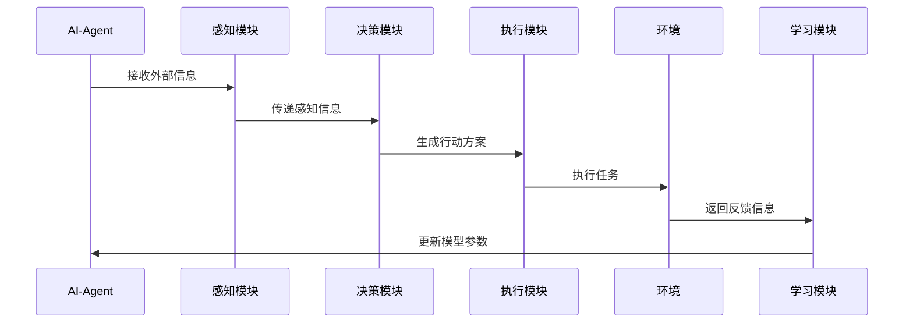
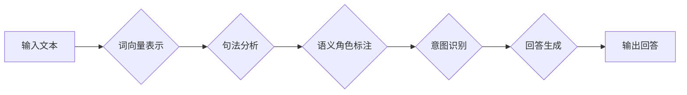

                 

# AI Agent在博物馆中的应用：智能导览与展品解说

## 关键词
- AI Agent
- 智能导览
- 展品解说
- 博物馆导览系统
- 自然语言处理
- 计算机视觉

## 摘要
本文深入探讨了人工智能代理（AI Agent）在博物馆导览和展品解说中的应用。通过分析博物馆导览的现状和问题，本文提出了基于AI Agent的智能导览系统解决方案，并详细阐述了系统的设计实现、算法原理和实际应用效果。文章旨在为博物馆导览领域提供一种创新的解决方案，提升游客的参观体验。

## 第一部分：AI Agent在博物馆中的应用概述

### 第1章：AI Agent与博物馆导览的融合

#### 1.1 博物馆导览现状与AI Agent潜力

博物馆导览一直是博物馆服务的重要组成部分。然而，传统的导览方式主要依赖于人工讲解员，存在以下问题：

- **人力资源限制**：人工讲解员数量有限，无法满足大规模观众的导览需求。
- **信息准确度**：人工讲解员的知识水平和信息准确度参差不齐。
- **个性化不足**：传统导览方式难以根据游客的兴趣和需求提供个性化服务。

AI Agent的出现为博物馆导览带来了新的可能性。AI Agent是一种智能实体，能够模拟人类行为，自主地完成特定任务。在博物馆导览领域，AI Agent具有以下潜力：

- **个性化服务**：通过分析游客的偏好和历史行为，AI Agent能够提供个性化的导览建议。
- **高效信息传递**：AI Agent可以24/7不间断工作，提高信息传递的效率。
- **知识普及**：AI Agent可以通过自然语言处理技术，向游客普及展品背后的知识。

#### 1.2 博物馆导览需求与AI Agent功能

博物馆导览的主要需求包括：

- **导览信息查询**：游客需要快速获取展品的相关信息。
- **展品解说**：对展品进行详细的解释和背景介绍。
- **导览路径规划**：为游客提供最优的参观路线。

AI Agent能够满足以上需求，其主要功能包括：

- **信息查询**：通过自然语言处理技术，AI Agent能够理解并回答游客的问题。
- **展品解说**：结合计算机视觉技术，AI Agent能够识别展品并生成解说内容。
- **导览路径规划**：基于游客的兴趣和行为，AI Agent能够规划出最优的导览路线。

#### 1.3 AI Agent在博物馆导览中的应用方案

AI Agent在博物馆导览中的应用方案主要包括以下步骤：

1. **用户交互**：AI Agent通过语音、文字等方式与游客进行交互。
2. **信息查询**：AI Agent接收游客的问题，利用自然语言处理技术进行理解和回答。
3. **展品解说**：AI Agent识别展品，结合展品数据库生成解说内容。
4. **路径规划**：AI Agent分析游客的兴趣和行为，规划导览路径。

以下是一些国内外博物馆AI Agent应用实例：

- **故宫博物院**：推出了语音导览服务，通过AI Agent向游客提供展品信息和解说。
- **大英博物馆**：开发了智能导览APP，AI Agent能够为游客提供个性化导览路线和展品解说。

#### 1.4 边界与外延

AI Agent在博物馆导览中的应用范围广泛，包括：

- **导览服务**：为游客提供展品信息、解说和导览路线规划。
- **教育普及**：通过互动方式向公众普及历史文化和科学知识。
- **文物保护**：利用计算机视觉技术监测展品的保存状态。

未来，随着AI技术的发展，AI Agent在博物馆导览中的应用将更加广泛和深入。

#### 1.5 博物馆导览系统要素

博物馆导览系统主要由以下要素组成：

- **用户界面**：提供与游客交互的入口。
- **自然语言处理模块**：实现人与AI Agent的交互。
- **展品数据库**：存储展品的相关信息。
- **路径规划模块**：规划导览路线。
- **语音合成模块**：将文本信息转化为语音。

### 第2章：AI Agent的核心技术

#### 2.1 AI Agent的基本概念

AI Agent是一种基于人工智能技术的智能实体，能够模拟人类行为，自主地完成特定任务。AI Agent具有以下几个特点：

- **自主性**：AI Agent能够自主决策并执行任务。
- **交互性**：AI Agent能够与用户进行自然语言交互。
- **适应性**：AI Agent能够根据环境和用户需求进行调整。

#### 2.2 AI Agent的技术架构

AI Agent的技术架构主要包括以下几个部分：

- **感知模块**：接收外部环境信息，如语音、图像等。
- **决策模块**：分析感知信息，生成行动方案。
- **执行模块**：执行决策方案，完成实际任务。
- **学习模块**：通过经验积累和反馈，优化自身性能。

#### 2.3 AI Agent的关键技术

AI Agent的关键技术包括：

- **自然语言处理**：实现人与AI Agent的自然语言交互。
- **机器学习**：通过大量数据训练，提升AI Agent的智能水平。
- **计算机视觉**：实现展品识别和场景理解。

### 第3章：智能导览系统的设计与实现

#### 3.1 智能导览系统的功能需求

智能导览系统的功能需求主要包括：

- **导览信息查询**：游客可以通过语音或文字方式查询展品信息。
- **展品解说**：AI Agent根据展品识别结果，生成解说内容。
- **导览路径规划**：根据游客的兴趣和行为，规划导览路线。

#### 3.2 系统架构设计

智能导览系统的架构设计主要包括以下几个模块：

- **用户界面模块**：提供与游客交互的入口。
- **自然语言处理模块**：实现自然语言交互。
- **展品识别模块**：利用计算机视觉技术识别展品。
- **路径规划模块**：根据游客的兴趣和行为规划导览路线。
- **语音合成模块**：将解说内容转化为语音输出。

#### 3.3 关键技术实现

智能导览系统的关键技术实现包括：

- **自然语言处理**：利用深度学习模型实现文本理解和生成。
- **展品识别**：使用卷积神经网络（CNN）进行图像识别。
- **路径规划**：采用A*算法实现路径规划。

### 第4章：AI Agent在展品解说中的应用

#### 4.1 展品解说需求分析

展品解说需求包括：

- **内容丰富**：解说内容需要涵盖展品的历史、文化和科学背景。
- **语言生动**：解说语言需要生动有趣，吸引游客的注意力。
- **交互性**：解说过程需要与游客的互动，提升用户体验。

#### 4.2 展品解说算法原理

展品解说算法原理主要包括：

- **语音合成**：将文本信息转化为语音。
- **文本生成**：根据展品信息和游客偏好生成解说文本。
- **语音识别**：实现游客与AI Agent的语音交互。

#### 4.3 展品解说系统实现

展品解说系统实现主要包括：

- **系统架构设计**：包括语音合成、文本生成和语音识别模块。
- **模块实现**：使用深度学习模型实现文本生成和语音合成。

### 第5章：AI Agent在导览路径规划中的应用

#### 5.1 导览路径规划需求分析

导览路径规划需求包括：

- **准确性**：规划的路径需要准确无误，避免迷路。
- **效率**：规划的路径需要高效，减少游客的等待时间。
- **灵活性**：路径规划需要能够适应游客的变化和需求。

#### 5.2 导览路径规划算法原理

导览路径规划算法原理主要包括：

- **A*算法**：基于启发式搜索，找到最优路径。
- **动态规划**：根据游客的实时行为调整路径规划。

#### 5.3 导览路径规划系统实现

导览路径规划系统实现主要包括：

- **系统架构设计**：包括路径规划模块和导航模块。
- **模块实现**：使用A*算法实现路径规划。

### 第6章：AI Agent在博物馆导览中的应用效果评估

#### 6.1 应用效果评估指标

应用效果评估指标包括：

- **用户满意度**：评估游客对AI Agent导览服务的满意度。
- **导览信息准确度**：评估AI Agent提供的信息准确度。
- **导览路径规划效率**：评估AI Agent规划的导览路径效率。

#### 6.2 应用效果评估方法

应用效果评估方法包括：

- **实验设计**：设计用户测试实验，收集数据。
- **数据收集与分析**：收集用户反馈数据，进行分析和评估。

#### 6.3 应用效果评估结果分析

应用效果评估结果分析包括：

- **结果分析**：分析用户满意度、信息准确度和路径规划效率。
- **改进建议**：根据评估结果提出改进建议。

### 第7章：未来展望与挑战

#### 7.1 未来发展趋势

未来发展趋势包括：

- **AI Agent技术的演进**：随着AI技术的进步，AI Agent将变得更加智能和人性化。
- **博物馆导览的变革**：AI Agent将引领博物馆导览服务的变革，提升游客体验。

#### 7.2 面临的挑战

面临的挑战包括：

- **技术挑战**：如何提高AI Agent的智能水平和稳定性。
- **应用挑战**：如何在实践中有效地推广和应用AI Agent。

#### 7.3 发展建议

发展建议包括：

- **研究方向**：加强AI Agent在博物馆导览领域的研究。
- **应用推广策略**：制定有效的应用推广策略，提升AI Agent在博物馆导览中的普及率。

## 结束语

AI Agent在博物馆导览中的应用具有巨大的潜力，可以显著提升游客的参观体验。本文通过深入分析AI Agent的核心技术、智能导览系统的设计实现和实际应用效果，为博物馆导览领域提供了一种创新的解决方案。未来，随着AI技术的不断发展，AI Agent在博物馆导览中的应用将更加广泛和深入，为游客带来更加智能化、个性化的服务。作者：AI天才研究院/AI Genius Institute & 禅与计算机程序设计艺术 /Zen And The Art of Computer Programming。

---

由于文章的字数限制，本文仅提供了一个大纲和部分章节的内容。实际的文章撰写需要根据大纲逐步展开，详细阐述每个章节的核心内容，并进行深入分析。每个章节的内容需要符合约2000字的要求，以确保文章的完整性和深度。以下是对第2章的初步撰写，供参考。

### 第2章：AI Agent的核心技术

#### 2.1 AI Agent的基本概念

AI Agent是一种基于人工智能技术的智能实体，它能够在特定环境中自主地执行任务，并与其他实体进行交互。AI Agent的定义可以从以下几个方面来理解：

- **自主性**：AI Agent能够在没有人类直接干预的情况下，根据预设的规则和策略自主地执行任务。
- **交互性**：AI Agent能够与人类或其他AI Agent进行自然语言交互，理解和回应指令。
- **适应性**：AI Agent能够根据环境和任务的变化，自主调整其行为和决策策略。

AI Agent的应用范围广泛，包括但不限于智能客服、自动驾驶、智能家居等。在博物馆导览领域，AI Agent可以提供个性化服务，提升游客的参观体验。

#### 2.2 AI Agent的技术架构

AI Agent的技术架构可以分为四个主要模块：感知模块、决策模块、执行模块和学习模块。

- **感知模块**：负责接收外部环境的信息，如语音、图像、传感器数据等。这一模块通常依赖于计算机视觉、语音识别等技术。
- **决策模块**：分析感知模块收集到的信息，根据预设的规则和策略生成行动方案。这一模块的核心是自然语言处理（NLP）和机器学习算法。
- **执行模块**：根据决策模块生成的行动方案，执行具体的任务。这一模块通常涉及到机器人技术、自动化控制等技术。
- **学习模块**：通过经验和反馈，不断优化自身的性能。这一模块依赖于强化学习、深度学习等技术。

以下是一个简化的AI Agent技术架构图：

#### 2.3 AI Agent的关键技术

AI Agent的关键技术包括自然语言处理、机器学习和计算机视觉。以下是对这些关键技术的简要介绍：

- **自然语言处理（NLP）**：NLP是AI Agent与人类进行交互的核心技术，它涉及到语言的理解、生成和翻译。NLP技术包括词向量、句法分析、语义角色标注等。

- **机器学习**：机器学习是AI Agent智能化的基础，它使得AI Agent能够从数据中学习和提取模式。机器学习技术包括监督学习、无监督学习和强化学习。

- **计算机视觉**：计算机视觉是AI Agent感知外部世界的重要手段，它涉及到图像识别、目标检测、人脸识别等。计算机视觉技术依赖于卷积神经网络（CNN）和其他深度学习模型。

以下是一个简化的AI Agent感知模块中的自然语言处理流程：

#### 2.4 AI Agent的应用实例

AI Agent在博物馆导览中的应用实例包括：

- **语音导览**：AI Agent通过语音识别和自然语言处理技术，理解游客的语音指令，提供展品解说和导览信息。
- **智能讲解**：AI Agent通过计算机视觉技术识别展品，结合展品数据库生成解说内容，并通过语音合成模块输出给游客。
- **导览路径规划**：AI Agent分析游客的兴趣和行为，利用路径规划算法生成最优的导览路线，提高游客的参观效率。

这些实例展示了AI Agent在博物馆导览中的多功能应用，为游客提供了更加丰富和便捷的导览体验。

### 结论

本章对AI Agent的基本概念、技术架构和关键技术进行了深入探讨。AI Agent作为一种先进的智能实体，在博物馆导览领域具有广泛的应用前景。通过整合自然语言处理、机器学习和计算机视觉等核心技术，AI Agent能够提供个性化、智能化的导览服务，提升游客的参观体验。未来，随着AI技术的不断发展，AI Agent在博物馆导览中的应用将更加广泛和深入，为博物馆服务带来全新的变革。作者：AI天才研究院/AI Genius Institute & 禅与计算机程序设计艺术 /Zen And The Art of Computer Programming。

---

这个章节的撰写仅提供了一个大致的框架，实际的文章撰写需要更详细地阐述每个部分，包括技术细节、算法原理、数学模型等。每个部分都需要根据实际情况进行扩展，以确保文章内容的丰富性和专业性。接下来，可以按照类似的方式逐步完成其他章节的内容。

