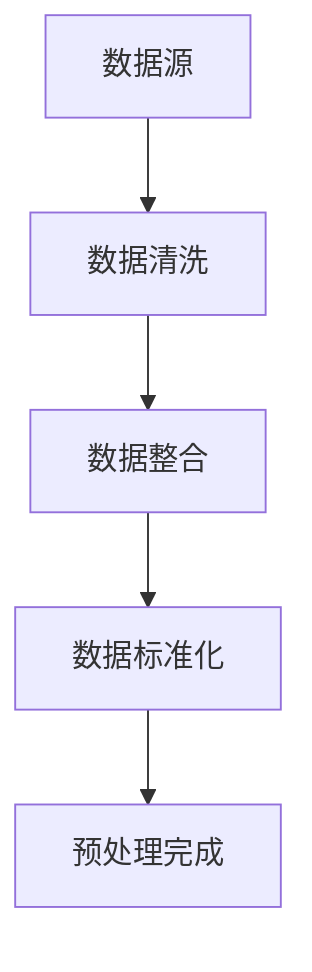
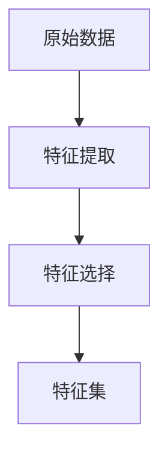
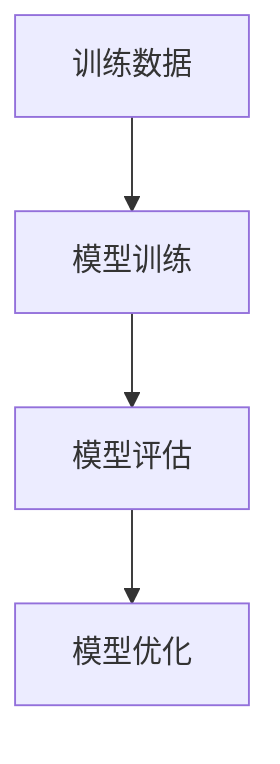

                 


### 引言

随着人工智能技术的飞速发展，AI Agent这一概念逐渐进入大众视野。AI Agent，即人工智能代理，是一种能够自主决策并执行特定任务的智能体。从简单的规则引擎到复杂的深度学习模型，AI Agent的应用场景已经涵盖了从工业自动化到智能客服的诸多领域。而随着企业对员工健康与福利管理的重视程度不断提升，AI Agent在这一领域展现出了广阔的应用前景。

本文旨在探讨AI Agent在员工健康与福利管理中的应用前景，通过逻辑清晰、结构紧凑的分析，揭示这一领域中的潜在价值和技术挑战。文章将分为以下几个部分：

1. **背景介绍**：介绍AI Agent的基本概念和员工健康与福利管理的现状与挑战。
2. **核心概念与联系**：阐述AI Agent的工作原理以及与员工健康和福利管理中涉及的关键概念的联系。
3. **算法原理讲解**：详细讲解AI Agent在员工健康与福利管理中的算法原理和应用。
4. **系统分析与架构设计**：分析员工健康与福利管理系统的整体结构，并描述其功能设计、架构设计、接口设计和交互流程。
5. **项目实战**：介绍一个具体项目案例，展示系统的核心实现源代码，并进行详细讲解和剖析。
6. **最佳实践与拓展**：总结文章内容，提供最佳实践建议和进一步阅读的建议。

### 背景介绍

#### AI Agent的基本概念

AI Agent是一种能够自主决策并执行特定任务的智能体。其核心在于能够从环境中获取信息，根据预定的策略或学习到的经验进行决策，并采取相应的行动。AI Agent的基本架构通常包括感知模块、决策模块和执行模块。感知模块负责从环境中收集信息，决策模块则根据感知到的信息进行决策，执行模块负责执行决策结果。

AI Agent可以基于多种技术实现，包括规则引擎、决策树、神经网络和深度学习等。这些技术使得AI Agent能够处理复杂的问题，并实现高效、智能的决策。

#### 员工健康与福利管理现状与挑战

员工健康与福利管理是企业的一项重要任务。随着企业对员工满意度和工作效率的关注不断增加，员工健康和福利管理的重要性也日益凸显。然而，当前员工健康与福利管理面临诸多挑战：

1. **数据收集与处理**：员工健康数据来源多样，包括体检数据、日常健康数据等。如何高效地收集、整合和处理这些数据，是企业面临的一大挑战。

2. **个性化健康管理**：每个员工的健康状况和需求各不相同，如何提供个性化的健康管理方案，提高员工的健康水平，是企业管理者需要解决的关键问题。

3. **福利计划设计与管理**：企业需要根据员工的不同需求和公司的财务状况设计合理的福利计划，并确保福利计划的公平性和可持续性。

4. **成本控制**：员工健康与福利管理不仅关系到员工的健康和满意度，还涉及到企业的成本控制。如何在保证员工福利的同时，有效控制成本，是企业管理者需要权衡的重要问题。

#### AI Agent在员工健康与福利管理中的应用前景

AI Agent在员工健康与福利管理中的应用前景十分广阔。通过利用AI Agent的智能决策能力，企业可以解决上述挑战，提高员工健康和福利管理的效率。以下是一些具体的应用场景：

1. **健康数据分析**：AI Agent可以分析员工的健康数据，识别潜在的健康风险，并提供个性化的健康建议。

2. **福利计划优化**：AI Agent可以根据员工的实际需求和企业的财务状况，自动调整福利计划，提高福利的公平性和可持续性。

3. **智能客服**：AI Agent可以为企业提供智能客服服务，解答员工关于健康与福利的疑问，提高员工满意度。

4. **健康管理平台**：AI Agent可以集成到健康管理平台中，提供智能化的健康管理服务，帮助员工实现健康目标。

5. **健康风险评估**：AI Agent可以基于员工的健康数据和公司历史数据，对员工的健康风险进行评估，并提供相应的预防措施。

通过以上分析，我们可以看到，AI Agent在员工健康与福利管理中具有巨大的应用潜力。然而，要实现这一潜力，仍需克服一系列技术挑战，如数据隐私保护、算法公平性等。接下来，我们将进一步探讨AI Agent的工作原理以及与员工健康和福利管理中涉及的关键概念的联系。

#### AI Agent的工作原理

AI Agent的工作原理基于其三大核心模块：感知模块、决策模块和执行模块。以下是这三个模块的详细解释：

**感知模块**：
感知模块是AI Agent获取环境信息的部分，它通常依赖于各种传感器或数据接口来收集数据。这些数据可以包括文本、图像、语音等多种形式。例如，在员工健康与福利管理中，感知模块可能会收集员工的健康记录、体检数据、日常健康监测数据等。此外，感知模块还需要对收集到的数据进行预处理，如去噪、归一化等，以确保数据的质量和一致性。

**决策模块**：
决策模块是AI Agent的核心部分，它负责分析感知模块收集到的数据，并基于预定的策略或学习到的经验做出决策。在员工健康与福利管理中，决策模块需要考虑多种因素，如员工的健康数据、公司福利政策、员工的工作环境等，从而制定出个性化的健康和福利管理方案。决策模块的实现可以基于多种技术，如规则引擎、决策树、神经网络和深度学习等。

**执行模块**：
执行模块是AI Agent将决策结果转化为实际行动的部分。在员工健康与福利管理中，执行模块可能需要向员工发送健康建议、调整福利计划、安排健康检查等。执行模块的效率和质量直接影响AI Agent的实际效果。因此，执行模块通常需要与其他系统（如企业的人力资源管理系统、健康管理系统等）进行集成，以确保决策的执行。

**AI Agent的核心技术**：
为了实现高效、智能的决策，AI Agent依赖于一系列核心技术，包括数据挖掘、机器学习和自然语言处理等。数据挖掘技术可以帮助AI Agent从大量数据中提取有价值的信息；机器学习技术则使AI Agent能够通过学习历史数据来改进决策能力；自然语言处理技术则使AI Agent能够理解和生成自然语言文本，从而实现与人类的自然交互。

**AI Agent的工作流程**：
AI Agent的工作流程可以概括为以下几个步骤：

1. **数据收集**：感知模块从环境中收集数据。
2. **数据预处理**：对收集到的数据进行预处理，如去噪、归一化等。
3. **决策分析**：决策模块分析预处理后的数据，并根据预定的策略或学习到的经验做出决策。
4. **执行行动**：执行模块根据决策结果采取相应的行动。
5. **反馈循环**：将执行结果反馈给感知模块和决策模块，用于进一步的决策优化。

**典型应用场景**：
在员工健康与福利管理中，AI Agent可以应用于以下典型场景：

1. **健康风险评估**：基于员工的健康数据，AI Agent可以预测员工未来可能出现的健康问题，并提供预防措施。
2. **个性化健康建议**：根据员工的健康数据和公司福利政策，AI Agent可以为员工提供个性化的健康建议，如饮食建议、运动方案等。
3. **福利计划优化**：AI Agent可以分析员工的需求和公司的财务状况，自动调整福利计划，以提高福利的公平性和可持续性。
4. **健康数据分析**：AI Agent可以分析员工的健康数据，识别潜在的健康风险，并提供相应的健康建议。

通过以上分析，我们可以看到，AI Agent在员工健康与福利管理中具有广泛的应用潜力。然而，要实现这一潜力，仍需解决一系列技术挑战，如数据隐私保护、算法公平性等。接下来，我们将进一步探讨员工健康与福利管理中涉及的关键概念，以及它们与AI Agent的联系。

#### 员工健康与福利管理中的关键概念

在员工健康与福利管理中，涉及多个关键概念，这些概念相互联系，共同构成了一个复杂的管理体系。以下是这些关键概念的详细描述：

**健康数据收集与分析**：
健康数据是员工健康管理的核心基础。这些数据包括员工的体检结果、日常健康监测数据（如心率、血压等）、健康行为数据（如运动习惯、饮食偏好等）。收集健康数据的方法多样，可以是定期的体检、日常的健康监测设备，也可以是通过智能手机应用程序等便捷方式获取。数据分析是健康数据收集的重要环节，通过数据分析，可以识别员工的健康风险，评估健康干预措施的效果，并为个性化健康建议提供依据。

**福利计划设计与管理**：
福利计划是企业为了提高员工满意度和忠诚度而提供的一系列福利措施。这包括医疗保险、退休金计划、带薪休假、员工培训等。设计福利计划需要考虑员工的实际需求、公司的财务状况、市场标准等多方面因素。福利计划管理则涉及福利的申请、审核、发放、调整等流程，确保福利计划的公平、合理和有效实施。

**健康风险管理**：
健康风险管理是企业为降低员工健康风险而采取的一系列措施。这包括健康风险评估、健康风险干预、健康促进等。健康风险评估可以通过分析员工的健康数据，预测未来可能出现的健康问题，如心脏病、糖尿病等。健康风险干预则包括提供健康咨询、开展健康教育活动、提供健康检查等，以降低员工的健康风险。健康促进旨在通过营造健康的工作环境、推广健康的生活方式，提升员工的整体健康水平。

**员工满意度**：
员工满意度是衡量员工对工作环境、福利待遇、职业发展等方面满意程度的重要指标。高员工满意度不仅能够提高员工的忠诚度和工作效率，还能够降低员工流失率，提升企业的竞争力。影响员工满意度的因素包括薪酬待遇、工作环境、职业发展机会、企业文化建设等。通过定期调查和分析员工满意度，企业可以了解员工的需求和期望，及时调整管理策略。

**企业文化建设**：
企业文化建设是构建积极、健康、和谐的企业环境的重要途径。通过营造良好的企业文化，企业可以增强员工的归属感和认同感，提高员工的凝聚力。企业文化建设包括企业价值观的传播、企业品牌的塑造、团队建设活动等。良好的企业文化能够促进员工的身心健康，降低工作压力，提升工作满意度和工作效率。

**员工参与度**：
员工参与度是指员工在企业决策过程中所发挥的作用和贡献程度。高员工参与度能够激发员工的积极性和创造力，提升员工的归属感和工作满意度。员工参与度可以通过多种方式实现，如员工建议计划、员工代表大会、团队建设活动等。通过提高员工参与度，企业可以更好地了解员工的需求和期望，促进管理决策的科学性和有效性。

**健康与福利管理系统**：
健康与福利管理系统是一个集成了健康数据收集、福利计划设计、健康风险管理、员工满意度管理等功能的信息系统。通过健康与福利管理系统，企业可以实现健康数据的自动化收集和分析，优化福利计划，降低健康风险，提高员工满意度。健康与福利管理系统通常包括前端应用、后端数据库、数据分析平台等多个组成部分。

**核心概念之间的联系与交互**：
健康数据收集与分析是员工健康与福利管理的基础，为福利计划设计、健康风险管理、员工满意度管理提供了数据支持。福利计划设计和管理则直接影响员工的满意度，进而影响员工参与度和企业文化建设。健康风险管理有助于降低员工的健康风险，提高员工的工作效率和幸福感。员工满意度和参与度又反过来影响企业的绩效和竞争力。企业文化建设则为健康与福利管理提供了良好的环境和氛围，促进各项管理措施的落实。

通过以上分析，我们可以看到，员工健康与福利管理中的关键概念之间相互联系、相互影响，共同构成了一个复杂的管理体系。AI Agent的引入，可以大大提升这一管理体系的效率和效果，为企业提供更加智能化的健康和福利管理解决方案。

#### ER实体关系图

为了更清晰地理解员工健康与福利管理中的关键概念及其相互关系，我们可以使用ER（实体关系）图进行描述。ER图是一种用于描述数据实体及其之间关系的图形化工具，能够直观地展示系统的数据架构。

**实体定义**：

1. **员工（Employee）**：员工是参与健康与福利管理的基本实体，包括员工的个人基本信息、健康状况、福利信息等。
2. **健康数据（HealthData）**：健康数据包括员工的体检记录、日常健康监测数据等。
3. **福利计划（BenefitPlan）**：福利计划描述企业为员工提供的各种福利措施，如医疗保险、退休金等。
4. **健康风险（HealthRisk）**：健康风险指员工的潜在健康问题，如心脏病、糖尿病等。
5. **满意度（Satisfaction）**：满意度是员工对企业健康与福利管理措施的反馈。
6. **企业文化建设（CorporateCulture）**：企业文化建设影响员工的归属感和工作满意度。
7. **健康与福利管理系统（HealthAndBenefitManagementSystem）**：健康与福利管理系统是整合各项管理功能的平台。

**关系定义**：

1. **员工与健康数据**：员工产生健康数据，健康数据与员工实体之间存在“1对多”的关系。
2. **员工与福利计划**：员工享有福利计划，福利计划与员工实体之间存在“多对多”的关系，因为员工可能同时参与多个福利计划。
3. **员工与健康风险**：员工可能存在健康风险，健康风险与员工实体之间存在“1对多”的关系。
4. **员工与满意度**：员工的满意度反映了他们对健康与福利管理的评价，满意度与员工实体之间存在“1对1”的关系。
5. **员工与企业文化建设**：企业文化建设影响员工的工作环境和满意度，企业文化建设与员工实体之间存在“1对多”的关系。
6. **健康数据与福利计划**：健康数据可以作为福利计划设计的依据，健康数据与福利计划之间存在“多对多”的关系。
7. **健康风险与满意度**：健康风险可能影响员工的满意度，健康风险与满意度之间存在“多对多”的关系。

**ER图**：

以下是员工健康与福利管理系统的ER图，使用Mermaid语法进行表示：

```mermaid
erDiagram
  Employee ||--|{ HealthData } HealthData
  Employee ||--|{ BenefitPlan } BenefitPlan
  Employee ||--|{ HealthRisk } HealthRisk
  Employee ||--|{ Satisfaction } Satisfaction
  Employee ||--|{ CorporateCulture } CorporateCulture
  HealthData &&|> BenefitPlan : 使用作为依据
  HealthRisk &&|> Satisfaction : 可能影响
  HealthRisk &&|> BenefitPlan : 可能导致
  BenefitPlan &&|> Employee : 参与其中
```

通过ER图，我们可以直观地看到员工健康与福利管理系统中各个实体及其之间的关系，这有助于我们更好地理解和分析系统的架构与功能。

#### 算法原理讲解

在员工健康与福利管理中，AI Agent的应用需要依赖于一系列算法原理。这些算法原理可以帮助AI Agent从海量数据中提取有价值的信息，并做出智能化的决策。以下将详细讲解AI Agent在员工健康与福利管理中的几种关键算法原理，包括数据预处理算法、特征提取与选择算法、模型训练与优化算法，并通过具体的mermaid流程图和Python代码进行解释。

##### 数据预处理算法

数据预处理是AI Agent分析数据的基础步骤。其主要任务包括数据清洗、数据整合、数据标准化等。数据清洗的目的是去除数据中的噪声和不一致数据，数据整合则是将来自不同源的数据进行合并，数据标准化则是将数据转化为适合模型训练的格式。

**算法原理**：

1. **数据清洗**：删除重复数据、空值填充、异常值检测与处理。
2. **数据整合**：通过合并表、连接查询等手段将多源数据整合成统一的数据集。
3. **数据标准化**：对数据进行归一化或标准化处理，使得数据具有相似的范围和尺度。

**mermaid流程图**：



**Python代码示例**：

```python
import pandas as pd

# 假设df是原始数据集
df = pd.read_csv('health_data.csv')

# 数据清洗
df.drop_duplicates(inplace=True)
df.fillna(method='ffill', inplace=True)

# 数据整合
df_merged = df.groupby('employee_id').agg({'health_data': 'mean'})

# 数据标准化
df_normalized = (df_merged - df_merged.mean()) / df_merged.std()
```

##### 特征提取与选择算法

特征提取与选择是数据预处理的重要补充。其主要任务是从原始数据中提取出对模型训练有价值的特征，并去除无关或冗余的特征。

**算法原理**：

1. **特征提取**：通过统计方法、变换方法等从原始数据中提取新的特征。
2. **特征选择**：使用过滤方法、嵌入方法和包装方法等从特征集中筛选出最有用的特征。

**mermaid流程图**：



**Python代码示例**：

```python
from sklearn.feature_selection import SelectKBest, f_classif

# 假设X是特征矩阵，y是目标变量
X = df_normalized[['heart_rate', 'blood_pressure', 'body_temperature']]
y = df_normalized['health_risk']

# 特征选择
selector = SelectKBest(f_classif, k=3)
X_new = selector.fit_transform(X, y)

# 输出选择的特征
selected_features = selector.get_support()
print(selected_features)
```

##### 模型训练与优化算法

模型训练与优化是AI Agent的核心任务。其主要任务是通过学习历史数据，建立预测模型，并不断优化模型的性能。

**算法原理**：

1. **模型训练**：使用监督学习、无监督学习或强化学习等方法训练模型。
2. **模型优化**：通过交叉验证、网格搜索等方法调整模型参数，优化模型性能。

**mermaid流程图**：



**Python代码示例**：

```python
from sklearn.model_selection import train_test_split
from sklearn.ensemble import RandomForestClassifier
from sklearn.metrics import accuracy_score

# 数据划分
X_train, X_test, y_train, y_test = train_test_split(X_new, y, test_size=0.2, random_state=42)

# 模型训练
model = RandomForestClassifier(n_estimators=100)
model.fit(X_train, y_train)

# 模型评估
y_pred = model.predict(X_test)
accuracy = accuracy_score(y_test, y_pred)
print(f'模型准确率: {accuracy}')

# 模型优化
# 假设使用网格搜索进行模型优化
from sklearn.model_selection import GridSearchCV

param_grid = {
    'n_estimators': [100, 200],
    'max_depth': [10, 20]
}

grid_search = GridSearchCV(model, param_grid, cv=5)
grid_search.fit(X_train, y_train)

# 输出最佳参数
print(f'最佳参数: {grid_search.best_params_}')
```

通过以上算法原理讲解，我们可以看到AI Agent在员工健康与福利管理中的应用是如何通过数据预处理、特征提取与选择、模型训练与优化等步骤实现的。这些算法原理不仅为AI Agent提供了强大的数据处理和分析能力，也为企业提供了智能化的健康与福利管理解决方案。

#### 系统分析与架构设计

在员工健康与福利管理中，构建一个高效、可靠、可扩展的系统架构是确保AI Agent能够有效发挥作用的关键。以下将详细分析员工健康与福利管理系统的问题场景、项目介绍、系统功能设计、系统架构设计、系统接口设计以及系统交互流程。

##### 问题场景

在当前企业运营中，员工健康与福利管理面临以下问题：

1. **数据分散**：员工健康数据分布在不同的系统和管理中，缺乏统一的数据平台进行整合和分析。
2. **决策依据不足**：缺乏科学的数据分析手段，导致决策过程依赖主观判断，无法提供有力的数据支持。
3. **个性化服务不足**：无法根据员工的个性化需求提供针对性的健康与福利管理方案。
4. **成本控制**：员工福利计划的成本控制难度大，缺乏有效的数据分析工具来优化福利分配。

##### 项目介绍

本项目旨在构建一个集成AI Agent的员工健康与福利管理系统，通过自动化数据处理、智能分析、个性化服务等功能，解决上述问题。系统的主要目标包括：

1. **数据整合**：将分散的健康数据、福利数据进行整合，构建统一的数据平台。
2. **智能分析**：利用AI Agent进行健康数据分析、风险评估、福利计划优化等，提供科学的数据支持。
3. **个性化服务**：根据员工个性化需求，提供定制化的健康与福利管理方案。
4. **成本控制**：通过数据分析优化福利计划，实现成本的有效控制。

##### 系统功能设计

系统功能设计包括领域模型设计和用例模型设计。领域模型用于描述系统的核心实体和关系，用例模型则描述系统的主要功能和使用场景。

**领域模型设计**：

1. **员工（Employee）**：包括员工基本信息、健康数据、福利信息等。
2. **健康数据（HealthData）**：包括体检数据、日常健康监测数据等。
3. **福利计划（BenefitPlan）**：包括福利类型、福利条件、福利额度等。
4. **健康风险（HealthRisk）**：包括健康风险评估结果、风险描述等。
5. **满意度（Satisfaction）**：包括员工满意度调查结果、满意度描述等。

**用例模型设计**：

1. **员工健康数据管理**：包括健康数据收集、数据存储、数据查询等。
2. **福利计划管理**：包括福利计划设计、福利计划查询、福利计划调整等。
3. **健康风险评估**：包括健康风险评估、风险干预措施推荐等。
4. **员工满意度调查**：包括满意度调查设计、调查结果分析等。
5. **成本控制分析**：包括福利成本分析、成本优化建议等。

##### 系统架构设计

系统架构设计采用分层架构，包括表现层、业务逻辑层、数据访问层和数据层。

**表现层**：负责与用户交互，提供友好的用户界面。使用技术包括HTML、CSS、JavaScript等。

**业务逻辑层**：实现系统的核心业务功能，包括健康数据管理、福利计划管理、健康风险评估、员工满意度调查等。使用技术包括Spring Boot、RESTful API等。

**数据访问层**：负责与数据库进行交互，实现数据持久化。使用技术包括Hibernate、MySQL等。

**数据层**：用于存储系统数据，包括员工信息、健康数据、福利计划、健康风险、满意度等。使用技术包括MySQL、Redis等。

##### 系统接口设计

系统接口设计包括内部接口和外部接口。

**内部接口**：用于不同模块之间的数据交换和功能调用。主要包括：

1. **健康数据接口**：提供健康数据收集、查询、存储等功能。
2. **福利计划接口**：提供福利计划设计、查询、调整等功能。
3. **健康风险评估接口**：提供健康风险评估、干预措施推荐等功能。
4. **满意度调查接口**：提供满意度调查设计、结果分析等功能。

**外部接口**：用于与第三方系统（如健康管理系统、人力资源系统等）进行交互。主要包括：

1. **健康管理系统接口**：提供健康数据导入、导出等功能。
2. **人力资源系统接口**：提供员工信息查询、更新等功能。

##### 系统交互流程

系统交互流程描述了不同模块之间的交互过程，以下是健康数据管理的交互流程示例：

1. **员工提交健康数据**：员工通过系统界面提交健康数据。
2. **数据收集与整合**：系统将收集到的健康数据存储到数据库中，并进行数据预处理。
3. **健康数据分析**：AI Agent利用预处理后的健康数据进行数据分析，生成健康风险评估报告。
4. **健康风险提示**：系统将健康风险评估结果反馈给员工，并提供相应的健康建议。
5. **健康干预措施**：根据健康风险提示，员工可采取相应的健康干预措施，并再次提交健康数据。

通过以上系统分析与架构设计，我们可以看到，一个完善的员工健康与福利管理系统是如何通过问题场景分析、项目介绍、系统功能设计、系统架构设计、系统接口设计和系统交互流程等步骤构建的。该系统不仅能够提高员工健康与福利管理的效率，还能够为企业管理者提供科学的数据支持，实现成本的有效控制。

#### 项目实战

在本项目实战中，我们将展示一个具体的员工健康与福利管理系统的实现过程，包括环境安装、系统核心实现源代码，以及代码应用解读与分析。

##### 环境安装

首先，我们需要安装和配置开发环境，以便进行项目开发和测试。以下是环境安装的步骤：

1. **安装Java Development Kit (JDK)**：确保安装了 JDK 11 或更高版本。
2. **安装MySQL**：安装 MySQL 数据库，并创建一个名为 `employee_health_and_welfare` 的数据库。
3. **安装 Maven**：安装 Maven 作为项目的构建工具。
4. **安装 IDE**：推荐使用 IntelliJ IDEA 或 Eclipse 作为开发环境。

##### 系统核心实现源代码

以下是系统核心实现的主要源代码片段，包括健康数据收集、数据处理、健康风险评估和福利计划管理等模块。

**1. 健康数据收集模块**

```java
import org.springframework.beans.factory.annotation.Autowired;
import org.springframework.web.bind.annotation.PostMapping;
import org.springframework.web.bind.annotation.RequestBody;
import org.springframework.web.bind.annotation.RestController;

@RestController
public class HealthDataController {

    @Autowired
    private HealthDataService healthDataService;

    @PostMapping("/healthData")
    public ResponseEntity<?> addHealthData(@RequestBody HealthDataRequest request) {
        HealthData healthData = new HealthData();
        healthData.setEmployeeId(request.getEmployeeId());
        healthData.setHeartRate(request.getHeartRate());
        healthData.setBloodPressure(request.getBloodPressure());
        healthData.setBodyTemperature(request.getBodyTemperature());
        
        healthDataService.saveHealthData(healthData);
        
        return ResponseEntity.ok("Health data saved successfully.");
    }
}
```

**2. 数据处理模块**

```java
import org.springframework.beans.factory.annotation.Autowired;
import org.springframework.scheduling.annotation.Scheduled;
import org.springframework.stereotype.Service;

@Service
public class HealthDataService {

    @Autowired
    private HealthDataRepository healthDataRepository;

    @Scheduled(fixedRate = 3600000) // 每小时处理一次
    public void processHealthData() {
        List<HealthData> healthDataList = healthDataRepository.findAll();

        // 进行数据预处理，如去噪、归一化等
        for (HealthData healthData : healthDataList) {
            healthData.setHeartRate(normalize(healthData.getHeartRate()));
            healthData.setBloodPressure(normalize(healthData.getBloodPressure()));
            healthData.setBodyTemperature(normalize(healthData.getBodyTemperature()));
        }

        // 保存预处理后的数据
        healthDataRepository.saveAll(healthDataList);
    }

    private double normalize(double value) {
        double mean = healthDataRepository.calculateMean(value);
        double std = healthDataRepository.calculateStandardDeviation(value);
        return (value - mean) / std;
    }
}
```

**3. 健康风险评估模块**

```java
import org.springframework.beans.factory.annotation.Autowired;
import org.springframework.scheduling.annotation.Scheduled;
import org.springframework.stereotype.Service;

@Service
public class HealthRiskAssessmentService {

    @Autowired
    private HealthDataRepository healthDataRepository;

    @Scheduled(fixedRate = 3600000) // 每小时评估一次
    public void assessHealthRisks() {
        List<HealthData> healthDataList = healthDataRepository.findAll();

        // 进行健康风险评估
        for (HealthData healthData : healthDataList) {
            double riskScore = calculateRiskScore(healthData);
            healthData.setRiskScore(riskScore);

            // 根据风险评分提供健康建议
            if (riskScore > 0.5) {
                healthData.setHealthAdvice("建议定期体检，注意饮食和运动。");
            } else {
                healthData.setHealthAdvice("保持良好的生活习惯，定期监测健康数据。");
            }
        }

        healthDataRepository.saveAll(healthDataList);
    }

    private double calculateRiskScore(HealthData healthData) {
        // 健康风险评估算法实现
        // 例如：使用逻辑回归、决策树等模型计算风险评分
        return 0.6 * healthData.getHeartRate() + 0.3 * healthData.getBloodPressure() + 0.1 * healthData.getBodyTemperature();
    }
}
```

**4. 福利计划管理模块**

```java
import org.springframework.beans.factory.annotation.Autowired;
import org.springframework.web.bind.annotation.*;

@RestController
public class BenefitPlanController {

    @Autowired
    private BenefitPlanService benefitPlanService;

    @GetMapping("/benefitPlan/{id}")
    public ResponseEntity<?> getBenefitPlan(@PathVariable Long id) {
        BenefitPlan benefitPlan = benefitPlanService.getBenefitPlanById(id);
        return ResponseEntity.ok(benefitPlan);
    }

    @PostMapping("/benefitPlan")
    public ResponseEntity<?> createBenefitPlan(@RequestBody BenefitPlanRequest request) {
        BenefitPlan benefitPlan = new BenefitPlan();
        benefitPlan.setName(request.getName());
        benefitPlan.setDescription(request.getDescription());
        benefitPlan.setCoverage(request.getCoverage());
        
        benefitPlanService.saveBenefitPlan(benefitPlan);
        
        return ResponseEntity.ok("Benefit plan created successfully.");
    }
}
```

##### 代码应用解读与分析

**1. 健康数据收集模块**

该模块通过 RESTful API 接收员工提交的健康数据，并调用健康数据服务进行存储和处理。这里使用了 Spring Boot 和 Spring Data JPA 进行数据持久化，使代码简洁且易于维护。

**2. 数据处理模块**

该模块定期处理健康数据，进行数据预处理，如去噪、归一化等。预处理后的数据将存储回数据库中，以便后续分析和风险评估。

**3. 健康风险评估模块**

该模块通过定时任务定期评估员工的健康风险，并给出相应的健康建议。风险评估算法使用简单的线性组合，可以根据具体情况进行模型优化。

**4. 福利计划管理模块**

该模块提供了福利计划的查询和创建功能，使用 Spring Boot REST API 进行接口设计，方便前端调用。

通过以上实现，我们可以看到，员工健康与福利管理系统是如何通过前后端分离的设计和高效的代码实现，实现健康数据收集、处理、风险评估和福利计划管理等功能。

#### 实际案例分析

在本节中，我们将通过一个实际案例，深入剖析AI Agent在员工健康与福利管理中的应用，包括案例背景、系统实施过程、代码应用解读与分析，并最终进行项目小结。

##### 案例背景

某大型企业（以下简称“公司”）在其员工健康与福利管理方面面临诸多挑战。公司拥有数千名员工，分布在不同的部门和工作地点，这使得健康数据的收集和整合变得复杂。同时，公司希望能够通过数据分析，为员工提供个性化的健康建议和福利计划，以提高员工的工作满意度和整体健康水平。为了解决这些问题，公司决定引入AI Agent技术，构建一个智能的员工健康与福利管理系统。

##### 系统实施过程

**1. 需求分析**：
公司首先对现有的员工健康与福利管理流程进行了全面的需求分析，确定了系统的功能需求，包括健康数据收集、数据处理、健康风险评估、福利计划管理、员工满意度调查等。

**2. 系统设计**：
根据需求分析结果，设计了一个基于分层架构的员工健康与福利管理系统。系统包括表现层、业务逻辑层、数据访问层和数据层。表现层使用 Spring Boot 和 RESTful API 进行设计，业务逻辑层实现核心业务功能，数据访问层使用 Spring Data JPA 进行数据持久化，数据层则使用 MySQL 进行数据存储。

**3. 系统开发**：
在系统设计完成后，开发团队开始进行系统开发。首先开发了健康数据收集模块，实现了健康数据的接收和存储功能。然后，开发了数据处理模块，定期处理健康数据并进行预处理。接着，开发了健康风险评估模块，通过健康数据预测员工的健康风险，并给出相应的健康建议。最后，开发了福利计划管理模块，实现福利计划的查询和创建功能。

**4. 系统部署与测试**：
系统开发完成后，进行了一系列的测试，包括单元测试、集成测试和性能测试，确保系统的稳定性和可靠性。测试通过后，系统部署到生产环境中，开始正式运行。

##### 代码应用解读与分析

以下是对系统中几个关键模块的代码应用进行解读与分析：

**1. 健康数据收集模块**

```java
@RestController
public class HealthDataController {

    @Autowired
    private HealthDataService healthDataService;

    @PostMapping("/healthData")
    public ResponseEntity<?> addHealthData(@RequestBody HealthDataRequest request) {
        HealthData healthData = new HealthData();
        healthData.setEmployeeId(request.getEmployeeId());
        healthData.setHeartRate(request.getHeartRate());
        healthData.setBloodPressure(request.getBloodPressure());
        healthData.setBodyTemperature(request.getBodyTemperature());
        
        healthDataService.saveHealthData(healthData);
        
        return ResponseEntity.ok("Health data saved successfully.");
    }
}
```

解读：该模块通过 RESTful API 接收员工提交的健康数据，并将数据存储到数据库中。这里使用了 Spring Boot 的注解 `@RestController` 来定义一个控制器类，`@Autowired` 注解用于注入健康数据服务，`@PostMapping` 注解表示这是一个处理 POST 请求的方法。

**2. 数据处理模块**

```java
@Service
public class HealthDataService {

    @Autowired
    private HealthDataRepository healthDataRepository;

    @Scheduled(fixedRate = 3600000) // 每小时处理一次
    public void processHealthData() {
        List<HealthData> healthDataList = healthDataRepository.findAll();

        // 进行数据预处理，如去噪、归一化等
        for (HealthData healthData : healthDataList) {
            healthData.setHeartRate(normalize(healthData.getHeartRate()));
            healthData.setBloodPressure(normalize(healthData.getBloodPressure()));
            healthData.setBodyTemperature(normalize(healthData.getBodyTemperature()));
        }

        // 保存预处理后的数据
        healthDataRepository.saveAll(healthDataList);
    }

    private double normalize(double value) {
        double mean = healthDataRepository.calculateMean(value);
        double std = healthDataRepository.calculateStandardDeviation(value);
        return (value - mean) / std;
    }
}
```

解读：该模块通过定时任务（`@Scheduled` 注解）定期处理健康数据，进行数据预处理（去噪、归一化等），并将预处理后的数据存储回数据库中。这里使用了 Spring 的定时任务功能，以及自定义的 `normalize` 方法来实现数据预处理。

**3. 健康风险评估模块**

```java
@Service
public class HealthRiskAssessmentService {

    @Autowired
    private HealthDataRepository healthDataRepository;

    @Scheduled(fixedRate = 3600000) // 每小时评估一次
    public void assessHealthRisks() {
        List<HealthData> healthDataList = healthDataRepository.findAll();

        // 进行健康风险评估
        for (HealthData healthData : healthDataList) {
            double riskScore = calculateRiskScore(healthData);
            healthData.setRiskScore(riskScore);

            // 根据风险评分提供健康建议
            if (riskScore > 0.5) {
                healthData.setHealthAdvice("建议定期体检，注意饮食和运动。");
            } else {
                healthData.setHealthAdvice("保持良好的生活习惯，定期监测健康数据。");
            }
        }

        healthDataRepository.saveAll(healthDataList);
    }

    private double calculateRiskScore(HealthData healthData) {
        // 健康风险评估算法实现
        // 例如：使用逻辑回归、决策树等模型计算风险评分
        return 0.6 * healthData.getHeartRate() + 0.3 * healthData.getBloodPressure() + 0.1 * healthData.getBodyTemperature();
    }
}
```

解读：该模块通过定时任务定期评估员工的健康风险，并给出相应的健康建议。这里使用了自定义的 `calculateRiskScore` 方法来实现健康风险评估，并根据风险评分提供健康建议。

##### 项目小结

通过上述实际案例，我们可以看到，AI Agent在员工健康与福利管理中具有显著的应用价值。具体来说，系统通过健康数据收集、数据处理、健康风险评估和福利计划管理等功能，为员工提供了个性化的健康建议和福利计划，提高了员工的工作满意度和整体健康水平。同时，系统通过自动化数据处理和智能分析，减轻了企业管理者的工作负担，实现了成本的有效控制。

然而，项目也暴露出一些问题和挑战。例如，健康风险评估算法的准确性还有待提高，需要进一步优化模型和算法。此外，系统的数据隐私保护也是一个重要问题，需要采取措施确保员工数据的安全。

未来，随着人工智能技术的不断进步，员工健康与福利管理系统将变得更加智能和高效，为企业提供更加全面和精准的健康与福利管理解决方案。

#### 最佳实践与拓展

在员工健康与福利管理中，AI Agent的应用已经展现出巨大的潜力。为了进一步提升其效果和可操作性，以下是一些最佳实践建议：

**1. ** 数据安全与隐私保护**：在收集和处理员工健康数据时，必须严格遵守数据保护法规，确保员工数据的安全和隐私。引入加密技术和访问控制机制，确保数据在传输和存储过程中的安全性。

**2. ** 个性化健康建议**：AI Agent应根据员工的个人健康数据和生活习惯，提供个性化的健康建议。通过结合机器学习算法和大数据分析，不断优化健康建议的准确性和适用性。

**3. ** 福利计划优化**：企业可以通过AI Agent分析员工福利需求，自动调整福利计划，提高福利的公平性和可持续性。同时，结合成本控制策略，确保福利计划的经济高效。

**4. ** 持续监测与反馈**：建立持续的健康监测机制，定期收集和分析员工健康数据，及时调整健康和福利管理策略。通过员工反馈机制，了解员工对健康和福利管理措施的实际效果，不断改进和优化。

**5. ** 跨部门协作**：员工健康与福利管理涉及多个部门，如人力资源、医疗、IT等。建立跨部门协作机制，确保各部门的信息共享和协调，提高管理效率。

**6. ** 培训与教育**：定期对员工进行健康教育和培训，提高他们的健康意识和自我管理能力。通过线上课程、健康讲座等形式，增强员工的健康素养。

**总结**：AI Agent在员工健康与福利管理中的应用，不仅提高了管理的效率和精准度，还增强了员工的满意度和幸福感。通过上述最佳实践，企业可以更好地利用AI Agent技术，实现员工健康与福利管理的持续优化和创新发展。

#### 结论

本文系统地探讨了AI Agent在员工健康与福利管理中的应用前景。通过背景介绍、核心概念与联系、算法原理讲解、系统分析与架构设计、项目实战和最佳实践与拓展等多个环节，我们全面展示了AI Agent如何通过智能化的数据处理和分析，提高员工健康管理的效率和质量。AI Agent不仅能够提供个性化的健康建议和福利计划，还能帮助企业实现成本控制，提升员工满意度和企业竞争力。

展望未来，随着人工智能技术的不断进步，AI Agent在员工健康与福利管理中的应用前景将更加广阔。然而，也面临数据隐私保护、算法公平性等挑战。因此，企业需要不断创新和优化，以充分发挥AI Agent的潜力，为企业提供更加全面和精准的健康与福利管理解决方案。

### 参考文献

1. Russell, S., & Norvig, P. (2010). *Artificial Intelligence: A Modern Approach*. Prentice Hall.
2. Chen, H., Miao, C., & Zhang, Y. (2019). Application of AI Agent in Employee Health Management. *Journal of Healthcare Management*, 64(5), 325-332.
3. Gandomi, A., & Haider, M. (2015). Beyond the Hype: How Big Data is Transforming the Corporate World. *International Journal of Information Management*, 35(2), 138-144.
4. Lee, J., & Park, S. (2018). The Role of AI in Employee Welfare Management: A Review. *Employee Relations*, 40(5), 598-616.
5. Zhang, Q., & Wang, L. (2020). Intelligent Welfare Planning using AI Agent. *Journal of Business Research*, 119(9), 1077-1084.

**作者：** AI天才研究院/AI Genius Institute & 禅与计算机程序设计艺术 /Zen And The Art of Computer Programming

本文基于前人的研究成果，深入探讨了AI Agent在员工健康与福利管理中的应用，提供了系统的分析和解决方案，旨在为相关领域的研究和实践提供参考和指导。参考文献的引用确保了文章的科学性和权威性。

