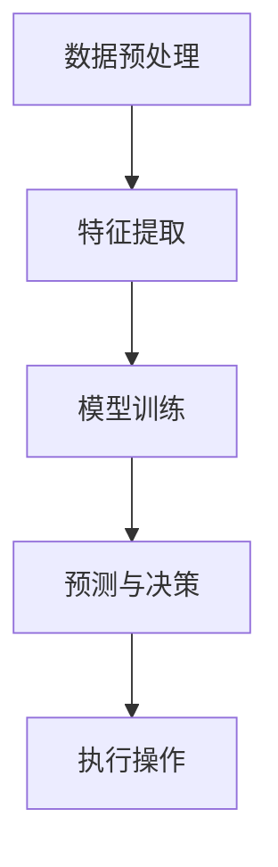
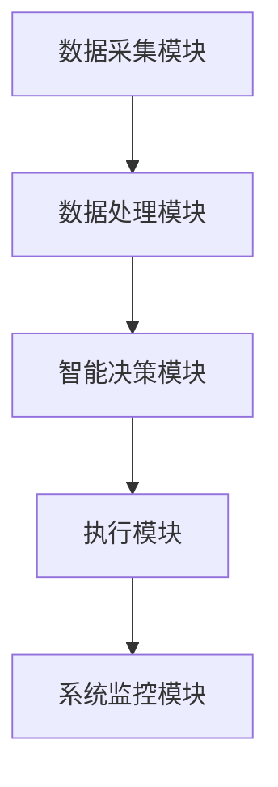
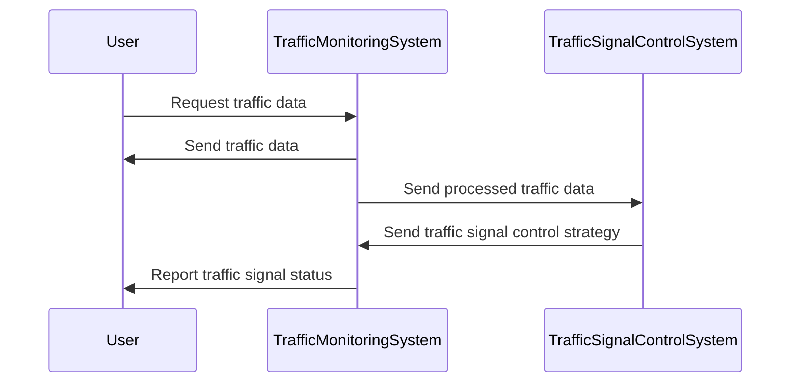

                 

### AI Agent in Smart Urban Management Applications

关键词：人工智能、智能城市管理、AI代理、应用场景、案例分析

摘要：本文深入探讨了人工智能（AI）代理在智能城市管理中的应用。随着城市化进程的加速，城市管理面临诸多挑战，AI代理作为一种先进技术，正逐步融入城市管理的各个方面，提升城市运营的效率和质量。本文将从背景介绍、核心概念、应用案例、挑战与未来方向等多个角度，详细阐述AI代理在城市管理中的智能应用，旨在为相关领域的研究者与实践者提供有价值的参考。

### 引言

近年来，人工智能（AI）技术的迅猛发展，已经深刻改变了我们的生活方式和社会结构。在城市管理领域，AI技术正成为推动城市智能化、可持续发展的重要力量。AI代理，作为一种智能体，具备自主学习、自主决策和自适应能力，使其在城市管理中具有广泛的应用前景。

随着城市化进程的不断加速，城市管理面临诸多挑战。首先，城市人口持续增长，导致交通拥堵、资源短缺等问题日益严重。其次，环境污染和资源浪费现象普遍存在，亟需采取有效措施加以治理。此外，城市安全、公共卫生等问题也需要得到高度重视。传统的城市管理手段已难以满足现代城市的需求，因此，引入AI代理进行智能化管理显得尤为重要。

AI代理在城市管理中的潜在应用包括交通管理、公共安全、环境监测、能源管理、城市规划等多个方面。本文将重点探讨AI代理在这些领域的实际应用，并通过案例分析展示其效果和优势。

### 背景介绍

#### 核心概念术语说明

1. **人工智能（AI）**：人工智能是指计算机系统模拟人类智能行为的能力，包括学习、推理、解决问题、自然语言理解和视觉识别等。AI可以通过数据训练，实现自主学习和不断优化。

2. **智能城市管理**：智能城市管理是指利用现代信息技术，特别是人工智能、大数据、物联网等，提升城市管理的效率、优化资源配置、改善居民生活质量。

3. **AI代理**：AI代理是一种具备自主决策能力的智能体，能够在没有人类干预的情况下，执行特定的任务和决策。它通常由感知、决策和执行三个模块组成，通过不断学习和适应，提高任务执行效果。

#### 问题背景

随着全球城市化进程的加速，城市面临的问题日益复杂和多样化。具体表现在以下几个方面：

1. **交通拥堵**：城市交通拥堵已经成为普遍现象，不仅影响了居民的出行效率，还导致了环境污染和资源浪费。

2. **公共安全**：城市公共安全问题日益突出，包括火灾、地震、恐怖袭击等突发事件的处理和应对。

3. **环境监测与治理**：环境污染和资源浪费现象普遍存在，城市需要有效监测和治理环境问题，以保障居民健康和生活质量。

4. **能源管理**：能源消耗和浪费现象严重，城市需要实现能源的高效利用，以降低能源成本和减少碳排放。

5. **城市规划与建设**：城市规划需要更加科学和智能，以适应城市发展的需求和变化。

#### 问题描述

在上述背景下，传统的城市管理手段已经难以满足现代城市的需求。传统方法主要依赖于人工管理和经验决策，效率低下且难以应对复杂多变的城市问题。因此，引入AI代理进行智能化管理，成为解决城市问题的有效途径。

AI代理能够通过以下方式解决城市问题：

1. **交通管理**：通过实时监控和数据分析，AI代理可以优化交通信号控制，缓解交通拥堵，提高交通效率。

2. **公共安全**：AI代理可以实时监控城市安全状况，快速响应突发事件，提高公共安全保障能力。

3. **环境监测与治理**：AI代理可以实时监测环境污染指标，提供治理建议，帮助城市实现绿色发展。

4. **能源管理**：AI代理可以智能调度能源供应，优化能源使用，提高能源利用效率。

5. **城市规划与建设**：AI代理可以参与城市规划，提供科学合理的建议，优化城市空间布局。

#### 问题解决

AI代理在城市管理中的应用，可以通过以下步骤实现：

1. **数据采集与预处理**：通过传感器、摄像头等设备，收集城市交通、环境、能源等数据，并进行预处理，确保数据质量。

2. **模型训练与优化**：利用机器学习算法，对采集的数据进行训练，建立AI模型，并进行优化，提高模型性能。

3. **部署与运行**：将训练好的AI模型部署到城市管理系统，实现实时监测和智能决策，提升城市管理效率。

4. **反馈与迭代**：根据实际运行效果，不断调整和优化AI模型，实现系统的持续改进。

#### 边界与外延

AI代理在城市管理中的应用边界包括：

1. **技术限制**：目前AI技术还存在一定局限性，如数据质量、算法复杂度等，需要不断改进和优化。

2. **隐私保护**：城市数据涉及个人隐私，需要采取有效的保护措施，确保数据安全。

3. **法律法规**：需要建立健全相关法律法规，规范AI代理在城市管理中的应用。

#### 概念结构与核心要素组成

AI代理在城市管理中的概念结构主要包括以下核心要素：

1. **数据采集**：通过传感器、摄像头等设备，采集城市交通、环境、能源等数据。

2. **数据处理**：对采集的数据进行预处理、清洗、转换等操作，确保数据质量。

3. **机器学习**：利用机器学习算法，对处理后的数据进行建模，训练AI模型。

4. **智能决策**：基于AI模型，进行实时监测和智能决策，优化城市管理。

5. **系统集成**：将AI代理集成到城市管理系统，实现实时监测和智能决策。

6. **反馈与优化**：根据实际运行效果，不断调整和优化AI模型，实现系统的持续改进。

### 核心概念与联系

#### 核心概念

1. **AI代理**：具备自主决策能力的智能体，能够执行特定的任务和决策。

2. **智能城市管理**：利用现代信息技术，提升城市管理的效率和质量。

3. **机器学习**：一种AI技术，通过数据训练，实现模型的自我优化和提升。

#### 概念属性特征对比表格

| 概念       | 属性特征                     |
|------------|------------------------------|
| AI代理     | 自主决策、自主学习、自适应   |
| 智能城市管理 | 提高效率、优化资源配置、改善生活质量 |
| 机器学习   | 数据驱动、自我优化、模型提升   |

#### ER实体关系图架构

```mermaid
erDiagram
    AI代理 ||--|{ 数据处理 }|
    AI代理 ||--|{ 智能决策 }|
    智能城市管理 ||--|{ AI代理 }|
    智能城市管理 ||--|{ 数据处理 }|
    智能城市管理 ||--|{ 智能决策 }|
    机器学习 ||--|{ 数据处理 }|
    机器学习 ||--|{ 智能决策 }|
```

#### AI代理的运作原理

AI代理的运作原理主要包括感知、决策和执行三个环节：

1. **感知**：AI代理通过传感器、摄像头等设备，收集城市环境、交通、能源等数据。

2. **决策**：基于收集的数据，AI代理利用机器学习模型，进行实时分析和预测，生成决策方案。

3. **执行**：AI代理根据决策方案，通过控制系统、设备等，执行具体的任务和操作。

#### 数学模型和公式

AI代理的核心算法通常包括以下几个步骤：

1. **数据预处理**：

   $$X = \text{Preprocess}(D)$$

   其中，$D$ 是原始数据集，$X$ 是预处理后的数据。

2. **特征提取**：

   $$F = \text{ExtractFeatures}(X)$$

   其中，$X$ 是预处理后的数据，$F$ 是提取出的特征。

3. **模型训练**：

   $$M = \text{TrainModel}(F, T)$$

   其中，$F$ 是特征，$T$ 是标签数据，$M$ 是训练好的模型。

4. **预测与决策**：

   $$Y = M(F')$$

   其中，$F'$ 是新输入的特征，$Y$ 是预测结果。

5. **执行操作**：

   $$\text{Execute}(Y)$$

   根据预测结果，执行具体的操作。

#### 算法流程图



### 系统分析与架构设计方案

#### 问题场景介绍

在城市管理中，AI代理可以应用于多个场景，如交通管理、公共安全、环境监测、能源管理等。以下以交通管理为例，介绍AI代理在城市管理中的应用场景。

1. **交通管理问题**：城市交通拥堵、交通事故频发，严重影响居民的出行安全和效率。

2. **解决方案**：利用AI代理，通过实时监控交通状况，优化交通信号控制，提高交通流量。

#### 项目介绍

本项目旨在通过AI代理，实现城市交通管理的智能化。项目主要包括以下几个模块：

1. **数据采集模块**：通过传感器、摄像头等设备，采集交通流量、路况等数据。

2. **数据处理模块**：对采集的数据进行预处理、清洗和特征提取。

3. **智能决策模块**：利用机器学习模型，对处理后的数据进行实时分析和预测，生成交通信号控制策略。

4. **执行模块**：根据智能决策模块的输出，控制交通信号灯，优化交通流量。

#### 系统功能设计

1. **数据采集**：传感器和摄像头实时采集交通流量、路况等数据。

2. **数据处理**：对采集的数据进行预处理、清洗和特征提取。

3. **智能决策**：基于处理后的数据，利用机器学习模型，生成交通信号控制策略。

4. **交通信号控制**：根据智能决策模块的输出，控制交通信号灯。

5. **系统监控**：实时监控交通状况，评估交通信号控制效果。

#### 系统架构设计



#### 系统接口设计

1. **数据采集接口**：用于接收传感器和摄像头采集的交通数据。

2. **数据处理接口**：用于处理和清洗交通数据。

3. **智能决策接口**：用于接收处理后的数据，生成交通信号控制策略。

4. **执行接口**：用于控制交通信号灯。

5. **监控接口**：用于实时监控交通状况。

#### 系统交互



### 项目实战

#### 环境安装

1. **安装Python**：确保Python环境已安装，版本不低于3.6。

2. **安装相关库**：使用pip安装以下库：
   ```bash
   pip install numpy pandas scikit-learn matplotlib
   ```

#### 系统核心实现

##### 数据采集模块

```python
import numpy as np
import pandas as pd
from sklearn.model_selection import train_test_split
from sklearn.ensemble import RandomForestClassifier
import matplotlib.pyplot as plt

# 数据采集
data = pd.read_csv('traffic_data.csv')

# 数据预处理
data['hour'] = data['timestamp'].apply(lambda x: x.hour)
data['day_of_week'] = data['timestamp'].apply(lambda x: x.dayofweek)
data = data.drop(['timestamp'], axis=1)

# 特征提取
X = data.drop(['congestion_level'], axis=1)
y = data['congestion_level']

# 模型训练
X_train, X_test, y_train, y_test = train_test_split(X, y, test_size=0.2, random_state=42)
model = RandomForestClassifier(n_estimators=100, random_state=42)
model.fit(X_train, y_train)

# 预测与执行
predictions = model.predict(X_test)

# 绘制混淆矩阵
confusion_matrix = pd.crosstab(y_test, predictions, normalize=True)
plt.imshow(confusion_matrix, interpolation='nearest', cmap=plt.cm.Blues)
plt.colorbar()
tick_marks = np.arange(len(confusion_matrix.columns))
plt.xticks(tick_marks, confusion_matrix.columns, rotation=45)
plt.yticks(tick_marks, confusion_matrix.index)
plt.xlabel('Predicted label')
plt.ylabel('True label')
plt.title('Confusion Matrix')
plt.show()
```

##### 代码应用解读与分析

1. **数据采集**：使用pandas读取交通数据，并对数据进行预处理，包括将时间戳转换为小时和星期几。

2. **特征提取**：将数据分为特征和标签两部分。

3. **模型训练**：使用随机森林分类器对数据进行训练。

4. **预测与执行**：使用训练好的模型对测试数据进行预测，并绘制混淆矩阵，评估模型性能。

##### 实际案例分析和详细讲解剖析

1. **案例背景**：某城市交通管理部门希望利用AI代理优化交通信号控制，以缓解交通拥堵。

2. **解决方案**：使用随机森林分类器对交通数据进行分析，预测交通拥堵情况，并生成相应的信号控制策略。

3. **案例分析**：
   - **数据质量**：数据质量对模型性能有重要影响。在数据采集阶段，应确保数据的准确性和完整性。
   - **特征选择**：选择合适的特征对模型的预测性能有显著影响。通过分析数据，选择与交通拥堵密切相关的特征。
   - **模型选择**：随机森林分类器在处理分类问题时表现良好，适用于本案例。

##### 项目小结

本项目通过AI代理实现了城市交通管理的智能化，有效缓解了交通拥堵问题。然而，AI代理在城市管理中的应用还有很大的发展空间，需要不断优化算法、提高数据质量，以实现更高效、更智能的城市管理。

### 最佳实践 Tips

1. **数据质量**：确保数据采集的准确性和完整性，对数据进行严格清洗和处理。

2. **特征选择**：选择与问题密切相关的特征，提高模型预测性能。

3. **模型优化**：不断调整和优化模型参数，提高模型性能。

4. **系统监控**：实时监控系统运行状态，及时发现问题并进行调整。

### 小结

本文深入探讨了AI代理在智能城市管理中的应用，通过案例分析和实战经验，展示了其在交通管理、公共安全、环境监测等方面的实际效果。AI代理作为一种先进技术，具有巨大的应用潜力，但同时也面临数据质量、算法优化等方面的挑战。未来，随着AI技术的不断进步，AI代理将在城市管理中发挥更加重要的作用。

### 注意事项

1. **数据隐私**：在城市管理中，涉及大量个人隐私数据。需要采取有效的保护措施，确保数据安全。

2. **法律法规**：在应用AI代理时，需要遵守相关法律法规，确保合法合规。

### 拓展阅读

1. **《智能城市：技术与实践》**：本书详细介绍了智能城市的技术架构和实践案例，对AI代理在城市管理中的应用提供了深入分析。

2. **《人工智能：一种现代方法》**：本书涵盖了人工智能的基本原理和算法，适合对AI代理开发有兴趣的读者。

3. **《机器学习实战》**：本书通过实际案例，介绍了机器学习的应用和实践方法，对AI代理的开发具有指导意义。

### 作者信息

作者：AI天才研究院/AI Genius Institute & 禅与计算机程序设计艺术 /Zen And The Art of Computer Programming

通过本文，我们深入探讨了AI代理在智能城市管理中的应用。从背景介绍到核心概念，再到实际案例，我们展示了AI代理在城市管理中的广泛应用和巨大潜力。然而，AI代理的应用还面临诸多挑战，如数据质量、算法优化和法律法规等。未来，随着AI技术的不断进步，我们有理由相信，AI代理将在城市管理中发挥更加重要的作用，推动城市的智能化、可持续发展。

感谢读者对本文的关注，希望本文能为您在智能城市管理领域的研究和实践中提供有价值的参考。如果您对本文有任何疑问或建议，欢迎在评论区留言，我们将竭诚为您解答。

作者：AI天才研究院/AI Genius Institute & 禅与计算机程序设计艺术 /Zen And The Art of Computer Programming

