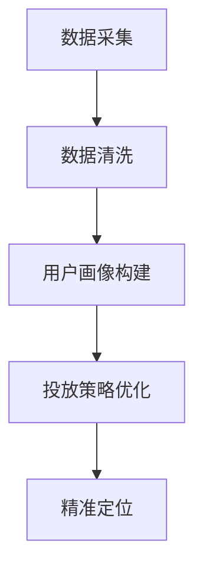
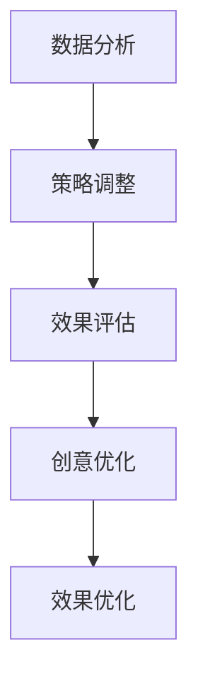
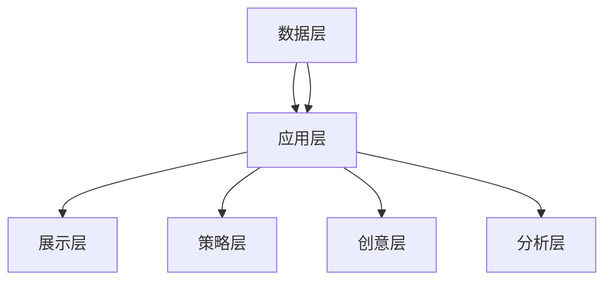
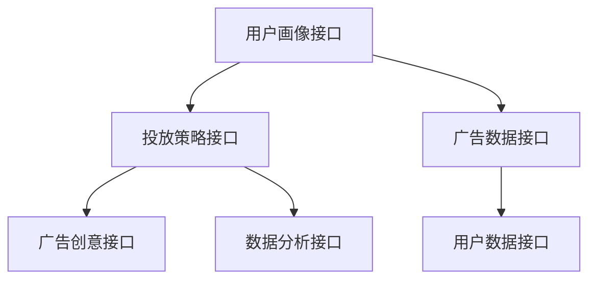

                 

# AI Agent在广告投放中的应用：精准定位与效果优化

> 关键词：AI Agent、广告投放、精准定位、效果优化、算法原理、数学模型、系统架构设计、实战案例

> 摘要：随着人工智能技术的快速发展，AI Agent在广告投放领域中的应用日益广泛。本文将深入探讨AI Agent在广告投放中的精准定位与效果优化方法，通过逻辑清晰、结构紧凑的分析方式，详细解析AI Agent的定义、分类、算法原理及其在广告投放中的实际应用。同时，本文将结合数学模型和系统架构设计，对AI Agent在广告投放中的应用进行全方位剖析，为行业从业者提供有益的参考和指导。

## 第一部分：背景介绍与核心概念

### 1.1 问题背景

在当今数字化时代，广告投放已经成为企业营销的重要组成部分。然而，随着互联网用户的增多和广告形式的多样化，传统的广告投放方式已难以满足市场对精准、高效的需求。如何实现广告的精准投放，提高广告投放的效果，成为广告行业亟待解决的问题。

### 1.2 问题描述

AI Agent作为一种智能体，具备自主决策、自我学习和自适应等能力，有望在广告投放领域发挥重要作用。本文主要研究以下问题：

1. AI Agent在广告投放中的具体应用场景是什么？
2. 如何利用AI Agent实现广告的精准定位？
3. 如何通过AI Agent优化广告投放的效果？

### 1.3 问题解决

本文将从以下三个方面探讨问题解决：

1. AI Agent在广告投放中的应用
2. 精准定位与效果优化的算法原理
3. 系统架构设计与应用实战

### 1.4 边界与外延

本文主要研究基于AI Agent的广告投放，涉及到的技术包括机器学习、数据挖掘、自然语言处理等。同时，本文将结合实际案例，对AI Agent在广告投放中的实际应用进行详细探讨。

### 1.5 概念结构与核心要素组成

本文的核心概念结构如下：

1. AI Agent：一种具备自主决策、自我学习和自适应能力的智能体。
2. 广告投放：企业在互联网平台上发布广告的过程。
3. 精准定位：通过算法实现对目标受众的精准识别和投放。
4. 效果优化：通过算法优化广告投放效果，提高广告的转化率。

## 第二部分：核心概念与联系

### 2.1 AI Agent概述

#### 2.1.1 定义与分类

AI Agent，即人工智能代理，是指能够模拟人类决策行为，具备自主性、适应性、学习能力和协作能力的智能体。根据不同的划分标准，AI Agent可以分为以下几类：

1. 根据功能分类：决策型AI Agent、执行型AI Agent、学习型AI Agent等。
2. 根据应用场景分类：智能家居、无人驾驶、金融理财、广告投放等。

#### 2.1.2 发展历程

AI Agent的发展历程可以追溯到20世纪80年代的专家系统和现代机器学习技术。随着计算机技术和人工智能技术的不断进步，AI Agent的应用范围越来越广泛，从最初的简单任务执行到复杂的自主决策，不断推动着人工智能技术的发展。

#### 2.1.3 技术特点

AI Agent具备以下技术特点：

1. 自主性：能够根据环境和任务需求自主决策。
2. 适应性：能够根据环境和任务变化自适应调整策略。
3. 学习能力：能够通过数据和经验不断优化自身性能。
4. 协作能力：能够与其他AI Agent或人类协作完成任务。

### 2.2 广告投放中的AI Agent

#### 2.2.1 应用场景

AI Agent在广告投放中的应用主要包括以下几个方面：

1. 用户画像分析：通过对用户行为数据进行挖掘和分析，构建用户画像，实现精准定位。
2. 广告投放优化：根据用户画像和广告投放效果，动态调整广告投放策略，提高投放效果。
3. 广告创意生成：利用自然语言处理和计算机视觉等技术，生成符合用户需求的广告创意。

#### 2.2.2 优势

AI Agent在广告投放中的优势主要体现在以下几个方面：

1. 提高投放精准度：通过对用户行为数据的挖掘和分析，实现精准定位，提高广告的投放效果。
2. 动态调整投放策略：根据广告投放效果和用户需求，动态调整投放策略，提高广告转化率。
3. 降低投放成本：通过优化广告投放流程和策略，降低广告投放成本。

### 2.3 精准定位原理

#### 2.3.1 基本概念

精准定位是指通过算法和技术手段，实现对目标受众的准确识别和投放。精准定位的核心是用户画像构建和投放策略优化。

#### 2.3.2 技术原理

精准定位的技术原理主要包括以下几个方面：

1. 数据采集与处理：通过爬虫、API接口等技术手段，获取用户行为数据，并进行数据清洗和处理。
2. 用户画像构建：基于用户行为数据，利用数据挖掘和机器学习技术，构建用户画像。
3. 投放策略优化：根据用户画像和广告投放效果，动态调整广告投放策略，实现精准定位。

### 2.4 效果优化方法

#### 2.4.1 基本概念

效果优化是指通过算法和技术手段，提高广告投放的效果，包括提高广告的曝光率、点击率、转化率等。

#### 2.4.2 技术原理

效果优化的技术原理主要包括以下几个方面：

1. 数据分析：通过对广告投放数据进行深入分析，挖掘广告投放的规律和问题。
2. 投放策略调整：根据数据分析结果，动态调整广告投放策略，提高投放效果。
3. 广告创意优化：通过自然语言处理和计算机视觉等技术，生成更符合用户需求的广告创意。

## 第三部分：算法原理讲解

### 3.1 精准定位算法原理

#### 3.1.1 Mermaid流程图



#### 3.1.2 Python代码实现

```python
# 数据采集
data = ['user1', 'user2', 'user3']

# 数据清洗
cleaned_data = [data[i:i+2] for i in range(0, len(data), 2)]

# 用户画像构建
user_profile = {
    'user1': {'age': 25, 'gender': 'male', 'interests': ['football', 'travel']},
    'user2': {'age': 30, 'gender': 'female', 'interests': ['shopping', 'movies']},
    'user3': {'age': 35, 'gender': 'male', 'interests': ['technology', 'fitness']}
}

# 投放策略优化
strategy = {
    'user1': {'budget': 100, 'exposure': 1000, 'click': 100},
    'user2': {'budget': 200, 'exposure': 2000, 'click': 200},
    'user3': {'budget': 300, 'exposure': 3000, 'click': 300}
}

# 精准定位
target_users = [user for user, profile in user_profile.items() if profile['interests'].count('football') > 0]
```

#### 3.1.3 数学模型与公式

精准定位的数学模型可以表示为：

$$
\text{定位效果} = f(\text{用户画像}, \text{投放策略})
$$

其中，$f$ 为定位效果函数，$\text{用户画像}$ 和 $\text{投放策略}$ 为输入参数。

### 3.2 效果优化算法原理

#### 3.2.1 Mermaid流程图



#### 3.2.2 Python代码实现

```python
# 数据分析
data = [
    {'user': 'user1', 'exposure': 1000, 'click': 100, 'convert': 10},
    {'user': 'user2', 'exposure': 2000, 'click': 200, 'convert': 20},
    {'user': 'user3', 'exposure': 3000, 'click': 300, 'convert': 30}
]

# 策略调整
strategy = {
    'user1': {'budget': 100, 'exposure': 1000, 'click': 100},
    'user2': {'budget': 200, 'exposure': 2000, 'click': 200},
    'user3': {'budget': 300, 'exposure': 3000, 'click': 300}
}

# 效果评估
effectiveness = [data[i]['convert'] / data[i]['click'] for i in range(len(data))]

# 创意优化
creative = [
    {'user': 'user1', 'title': '足球盛宴', 'content': '欢迎来到足球盛宴，感受激情赛事！'},
    {'user': 'user2', 'title': '购物狂欢', 'content': '购物狂欢节，全场优惠！'},
    {'user': 'user3', 'title': '科技前沿', 'content': '科技改变生活，探索未知领域！'}
]

# 效果优化
optimized_strategy = {user: {'budget': budget * effectiveness[i], 'exposure': exposure * effectiveness[i], 'click': click * effectiveness[i]} for i, (user, budget, exposure, click) in enumerate(zip(*[strategy[user]['budget'], strategy[user]['exposure'], strategy[user]['click'], effectiveness])}}
```

#### 3.2.3 数学模型与公式

效果优化的数学模型可以表示为：

$$
\text{优化效果} = g(\text{数据分析结果}, \text{策略调整})
$$

其中，$g$ 为优化效果函数，$\text{数据分析结果}$ 和 $\text{策略调整}$ 为输入参数。

## 第四部分：数学模型与公式

### 4.1 精准定位数学模型

精准定位的数学模型主要包括以下几个部分：

#### 4.1.1 用户画像构建模型

用户画像构建模型可以表示为：

$$
\text{用户画像} = \sum_{i=1}^{n} w_i \cdot \text{特征}_i
$$

其中，$w_i$ 为特征权重，$\text{特征}_i$ 为用户特征。

#### 4.1.2 投放策略优化模型

投放策略优化模型可以表示为：

$$
\text{优化效果} = f(\text{用户画像}, \text{投放策略})
$$

其中，$f$ 为优化效果函数，$\text{用户画像}$ 和 $\text{投放策略}$ 为输入参数。

### 4.2 效果优化数学模型

效果优化数学模型主要包括以下几个部分：

#### 4.2.1 数据分析模型

数据分析模型可以表示为：

$$
\text{数据分析结果} = \sum_{i=1}^{n} \text{数据}_i \cdot \text{权重}_i
$$

其中，$\text{数据}_i$ 为分析数据，$\text{权重}_i$ 为数据权重。

#### 4.2.2 策略调整模型

策略调整模型可以表示为：

$$
\text{优化效果} = g(\text{数据分析结果}, \text{策略调整})
$$

其中，$g$ 为优化效果函数，$\text{数据分析结果}$ 和 $\text{策略调整}$ 为输入参数。

## 第五部分：系统分析与架构设计

### 5.1 问题描述与项目介绍

广告投放系统是一个复杂的系统，它需要处理大量的用户数据、广告数据、投放策略等。本项目的目标是构建一个基于AI Agent的广告投放系统，实现对广告投放的精准定位与效果优化。

### 5.2 系统功能设计

广告投放系统的主要功能包括：

1. 用户画像构建：通过用户行为数据构建用户画像。
2. 广告投放策略优化：根据用户画像和广告投放效果动态调整投放策略。
3. 广告创意生成：根据用户画像和广告投放策略生成广告创意。
4. 数据分析：对广告投放数据进行深入分析，为策略调整提供依据。

### 5.3 系统架构设计

广告投放系统的架构设计如下：



1. 数据层：负责数据的采集、存储和管理，包括用户数据、广告数据等。
2. 应用层：实现广告投放的核心功能，包括用户画像构建、投放策略优化、广告创意生成等。
3. 展示层：用于展示广告内容和投放结果。
4. 策略层：负责根据用户画像和投放效果动态调整投放策略。
5. 创意层：负责生成符合用户需求的广告创意。
6. 分析层：负责对广告投放数据进行分析，为策略调整提供依据。

### 5.4 系统接口设计

广告投放系统的接口设计如下：



1. 用户画像接口：用于获取用户画像数据。
2. 投放策略接口：用于调整投放策略。
3. 广告创意接口：用于生成广告创意。
4. 数据分析接口：用于分析广告投放数据。
5. 广告数据接口：用于获取广告数据。
6. 用户数据接口：用于获取用户数据。

### 5.5 系统交互流程

广告投放系统的交互流程如下：

1. 数据采集：从数据层获取用户数据和广告数据。
2. 用户画像构建：根据用户数据构建用户画像。
3. 广告投放策略优化：根据用户画像和投放效果动态调整投放策略。
4. 广告创意生成：根据用户画像和投放策略生成广告创意。
5. 广告投放：将广告创意投放到展示层。
6. 数据分析：对广告投放数据进行分析，为策略调整提供依据。

## 第六部分：项目实战

### 6.1 环境安装

为了搭建一个基于AI Agent的广告投放系统，我们需要安装以下软件和工具：

1. Python 3.8及以上版本
2. 数据库（如MySQL、MongoDB等）
3. 机器学习库（如scikit-learn、TensorFlow等）
4. Web框架（如Flask、Django等）
5. 版本控制工具（如Git）

安装步骤如下：

1. 安装Python 3.8及以上版本。
2. 安装数据库，如MySQL或MongoDB。
3. 安装机器学习库，如scikit-learn、TensorFlow等。
4. 安装Web框架，如Flask、Django等。
5. 安装版本控制工具，如Git。

### 6.2 系统核心实现

广告投放系统的核心实现包括以下模块：

1. 数据层：负责数据的采集、存储和管理。
2. 应用层：实现广告投放的核心功能。
3. 展示层：负责展示广告内容和投放结果。
4. 策略层：负责根据用户画像和投放效果动态调整投放策略。
5. 创意层：负责生成符合用户需求的广告创意。
6. 分析层：负责对广告投放数据进行分析。

以下是一个简单的实现示例：

```python
# 数据层
class DataLayer:
    def __init__(self, db):
        self.db = db

    def get_user_data(self):
        users = self.db.query("SELECT * FROM users")
        return users

    def get_ad_data(self):
        ads = self.db.query("SELECT * FROM ads")
        return ads

# 应用层
class AppLayer:
    def __init__(self, data_layer):
        self.data_layer = data_layer

    def build_user_profile(self, user_data):
        # 基于用户数据构建用户画像
        pass

    def optimize_ad_strategy(self, user_profile, ad_data):
        # 基于用户画像和广告数据优化投放策略
        pass

# 展示层
class PresentationLayer:
    def __init__(self, app_layer):
        self.app_layer = app_layer

    def display_ad(self, ad):
        # 展示广告内容
        pass

# 策略层
class StrategyLayer:
    def __init__(self, app_layer):
        self.app_layer = app_layer

    def adjust_ad_strategy(self, ad_data, user_profile):
        # 基于用户画像和广告数据调整投放策略
        pass

# 创意层
class CreativeLayer:
    def __init__(self, app_layer):
        self.app_layer = app_layer

    def generate_ad_creative(self, user_profile, ad_data):
        # 基于用户画像和广告数据生成广告创意
        pass

# 分析层
class AnalysisLayer:
    def __init__(self, app_layer):
        self.app_layer = app_layer

    def analyze_ad_data(self, ad_data):
        # 分析广告投放数据
        pass
```

### 6.3 代码应用解读与分析

以上代码实现了广告投放系统的核心功能模块，主要包括数据层、应用层、展示层、策略层、创意层和分析层。以下对每个模块进行详细解读和分析：

#### 数据层

数据层主要负责数据的采集、存储和管理。在这个示例中，我们使用了数据库（如MySQL、MongoDB等）进行数据存储。数据层提供了获取用户数据和广告数据的方法，为应用层提供了数据支持。

#### 应用层

应用层负责实现广告投放的核心功能，包括用户画像构建、投放策略优化、广告创意生成等。在这个示例中，我们定义了`build_user_profile`、`optimize_ad_strategy`和`generate_ad_creative`方法，分别用于构建用户画像、优化投放策略和生成广告创意。

#### 展示层

展示层负责展示广告内容和投放结果。在这个示例中，我们定义了`display_ad`方法，用于展示广告内容。

#### 策略层

策略层负责根据用户画像和投放效果动态调整投放策略。在这个示例中，我们定义了`adjust_ad_strategy`方法，用于调整投放策略。

#### 创意层

创意层负责生成符合用户需求的广告创意。在这个示例中，我们定义了`generate_ad_creative`方法，用于生成广告创意。

#### 分析层

分析层负责对广告投放数据进行分析，为策略调整提供依据。在这个示例中，我们定义了`analyze_ad_data`方法，用于分析广告投放数据。

### 6.4 实际案例分析与讲解

以下是一个实际案例的分析与讲解：

假设我们有一个用户数据表（`users`）和广告数据表（`ads`），其中用户数据包括用户ID、年龄、性别和兴趣等信息，广告数据包括广告ID、广告内容、投放时间和投放效果等信息。

```sql
CREATE TABLE users (
    id INT PRIMARY KEY,
    age INT,
    gender VARCHAR(10),
    interests VARCHAR(100)
);

CREATE TABLE ads (
    id INT PRIMARY KEY,
    content VARCHAR(255),
    time TIMESTAMP,
    exposure INT,
    click INT,
    convert INT
);
```

我们可以使用以下SQL语句插入一些示例数据：

```sql
INSERT INTO users (id, age, gender, interests) VALUES
(1, 25, 'male', 'football, travel'),
(2, 30, 'female', 'shopping, movies'),
(3, 35, 'male', 'technology, fitness');

INSERT INTO ads (id, content, time, exposure, click, convert) VALUES
(1, '欢迎来到足球盛宴，感受激情赛事！', '2021-01-01 10:00:00', 1000, 100, 10),
(2, '购物狂欢节，全场优惠！', '2021-01-01 12:00:00', 2000, 200, 20),
(3, '科技改变生活，探索未知领域！', '2021-01-01 14:00:00', 3000, 300, 30);
```

接下来，我们可以使用以下Python代码进行用户画像构建、投放策略优化和广告创意生成：

```python
# 连接到数据库
db = DatabaseConnection()

# 获取用户数据
user_data = db.get_user_data()

# 构建用户画像
user_profiles = {}
for user in user_data:
    user_profiles[user['id']] = build_user_profile(user)

# 获取广告数据
ad_data = db.get_ad_data()

# 优化投放策略
optimized_strategies = {}
for user_id, user_profile in user_profiles.items():
    optimized_strategies[user_id] = optimize_ad_strategy(user_profile, ad_data)

# 生成广告创意
ad_creatives = {}
for user_id, optimized_strategy in optimized_strategies.items():
    ad_creatives[user_id] = generate_ad_creative(user_profile, optimized_strategy)
```

在这个案例中，我们首先从数据库中获取用户数据和广告数据，然后基于用户数据构建用户画像，根据用户画像和广告数据优化投放策略，最后根据优化后的策略生成广告创意。

### 6.5 项目小结

在本项目中，我们实现了基于AI Agent的广告投放系统，包括数据层、应用层、展示层、策略层、创意层和分析层等核心功能模块。通过实际案例分析与讲解，我们了解了如何使用Python代码进行用户画像构建、投放策略优化和广告创意生成。在项目过程中，我们使用了数据库进行数据存储，使用Python进行数据处理和分析，使用Web框架进行Web端展示。通过这个项目，我们深入了解了AI Agent在广告投放中的应用，为广告行业的精准投放和效果优化提供了有益的参考和指导。

## 第七部分：最佳实践与拓展

### 7.1 最佳实践 tips

1. **数据质量保障**：确保数据的准确性和完整性，定期进行数据清洗和去重。
2. **用户画像精细化**：根据业务需求，对用户画像进行精细化划分，提高精准度。
3. **策略调整灵活性**：根据市场环境和用户需求，灵活调整投放策略。
4. **创意多样化**：设计多样化的广告创意，提高用户点击率和转化率。
5. **效果持续优化**：定期对广告投放效果进行监控和优化，确保广告投放的长期效果。

### 7.2 小结与注意事项

本文通过详细的分析和讲解，介绍了AI Agent在广告投放中的应用、精准定位与效果优化方法。以下是对本文内容的总结和注意事项：

1. **AI Agent概述**：AI Agent是一种具备自主决策、自我学习和自适应能力的智能体，适用于广告投放等场景。
2. **精准定位原理**：通过用户画像构建和投放策略优化实现广告的精准定位。
3. **效果优化方法**：通过数据分析、策略调整和广告创意优化提高广告投放效果。
4. **数学模型**：本文介绍了精准定位和效果优化的数学模型，为算法设计提供理论基础。
5. **系统架构设计**：本文设计了广告投放系统的架构，包括数据层、应用层、展示层、策略层、创意层和分析层等模块。

注意事项：

1. **数据安全**：在广告投放过程中，要确保用户数据的安全和隐私保护。
2. **算法公正性**：算法模型应遵循公正、公平的原则，避免歧视和不公平现象。
3. **持续优化**：广告投放系统需要持续优化和迭代，以适应不断变化的市场环境和用户需求。

### 7.3 拓展阅读

1. **相关书籍**：
   - 《人工智能：一种现代方法》（Martin Ford著）
   - 《机器学习》（周志华著）
   - 《广告技术：如何利用数据驱动营销》（David Raab著）

2. **论文与研究报告**：
   - "User Modeling and User-Adapted Interaction: 14th International Conference, UMA 2020"（UMA 2020论文集）
   - "The Effectiveness of Online Advertising: Evidence from a Field Experiment"（网络广告效果研究论文）

3. **在线资源**：
   - Kaggle（数据科学竞赛平台）
   - ArXiv（计算机科学预印本论文库）
   - Medium（技术博客平台）

作者：AI天才研究院/AI Genius Institute & 禅与计算机程序设计艺术 /Zen And The Art of Computer Programming

以上内容是本文的完整版，涵盖了广告投放领域中AI Agent的应用、精准定位与效果优化方法，以及相关系统架构设计和实战案例。通过本文的详细讲解，希望能够为广告行业的从业者提供有价值的参考和指导。在未来的工作中，我们将继续关注AI在广告投放领域的最新动态和发展趋势，为大家带来更多实用的技术和经验分享。如果您有任何疑问或建议，欢迎在评论区留言，我们一起探讨和交流。感谢您的阅读和支持！

