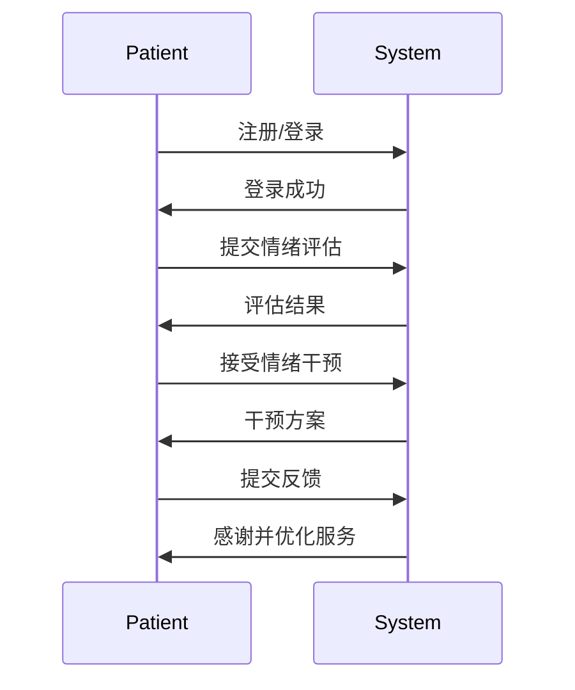

                 

### **《AI Agent在心理健康领域的应用：情绪支持与干预》**

关键词：AI Agent、心理健康、情绪支持、情绪干预、算法原理、项目实战

摘要：本文将深入探讨AI Agent在心理健康领域的应用，特别是情绪支持和干预。通过详细的分析和实例，我们旨在展示AI Agent如何通过情绪识别和情绪调节算法，为心理健康提供有效的技术支持。

## **第一部分：AI Agent概述**

### **第1章：AI Agent的基本概念**

#### **1.1.1 AI Agent的定义与作用**

AI Agent，即人工智能代理，是具有自主决策能力、能够执行特定任务并与环境交互的计算机程序。AI Agent的核心特征是它们能够在给定目标的情况下，通过感知环境、理解和学习环境信息，自主地做出决策并采取行动。

AI Agent在心理健康领域的作用主要体现在以下几个方面：

1. **个性化情绪支持**：通过理解用户情绪，AI Agent可以提供个性化的情绪支持，帮助用户缓解负面情绪，增强心理健康。
2. **情绪干预**：AI Agent可以通过算法识别出用户的情绪状态，并提供相应的干预措施，如建议用户进行放松练习、调整呼吸等，以改善心理健康。
3. **心理健康风险评估**：AI Agent可以通过分析用户的行为数据和情绪状态，对心理健康风险进行评估，为用户提供预防措施。

#### **1.1.2 AI Agent的分类与特点**

AI Agent可以根据其功能和应用场景进行分类，主要分为以下几类：

1. **感知型Agent**：这类Agent主要依赖于传感器和感知技术来获取环境信息。例如，情绪识别Agent可以通过语音、文本和面部表情来感知用户情绪。
2. **决策型Agent**：这类Agent具备自主决策能力，可以根据环境信息和预设目标，选择最合适的行动方案。例如，情绪调节Agent可以根据用户的情绪状态，提供相应的情绪调节策略。
3. **交互型Agent**：这类Agent不仅能够感知环境，还能与用户进行自然语言交互，提供更加人性化、互动化的服务。

#### **1.1.3 AI Agent与传统人工智能的区别**

传统人工智能主要侧重于模拟人类智能，通过预先编程的规则和算法来实现特定任务。而AI Agent则更加注重自主性和灵活性，能够在复杂、动态的环境中自主学习和适应，具有更高级的认知和决策能力。

### **第2章：心理健康领域概述**

#### **2.1.1 心理健康的重要性**

心理健康是整体健康的重要组成部分。一个心理健康的人能够在情绪、认知和行为上保持良好的状态，从而更好地应对生活中的挑战和压力。

#### **2.1.2 心理健康问题的现状与挑战**

当前，全球范围内的心理健康问题日益突出。抑郁症、焦虑症等心理疾病已经成为严重影响人们生活质量的主要问题。然而，传统的心理治疗方式存在诸多挑战，如成本高、耗时长、资源有限等。

#### **2.1.3 心理健康领域的需求与机遇**

随着AI技术的发展，心理健康领域迎来了新的机遇。AI Agent可以通过个性化、高效的方式，提供更加便捷、可及的心理健康服务。同时，AI Agent的出现也为心理健康领域的研究提供了新的工具和方法。

## **第二部分：情绪支持与干预的核心概念**

### **第3章：情绪支持的核心概念**

#### **3.1.1 情绪支持的概念与原理**

情绪支持是指通过提供情绪上的帮助和安慰，帮助个体缓解负面情绪，增强心理韧性。情绪支持的基本原理是建立信任关系，理解个体的情感需求，并提供相应的支持和建议。

#### **3.1.2 情绪支持的方法与手段**

情绪支持的方法和手段多种多样，包括倾听、同理心、积极反馈、提供情感宣泄的机会等。AI Agent可以通过自然语言处理技术，与用户进行互动，提供情绪支持。

#### **3.1.3 情绪支持与干预的关键要素**

情绪支持与干预的关键要素包括：

1. **信任建立**：建立信任是情绪支持的基础，AI Agent需要通过友好的交互界面和语言，赢得用户的信任。
2. **个性化支持**：根据用户的情绪状态和需求，提供个性化的情绪支持。
3. **情感识别**：准确识别用户的情绪状态，是提供有效情绪支持的前提。
4. **干预策略**：根据用户情绪状态，提供相应的干预策略，如放松练习、情绪调节技巧等。

### **第4章：情绪干预的核心概念**

#### **4.1.1 情绪干预的概念与原理**

情绪干预是指通过特定的方法和手段，调节个体的情绪状态，以改善心理健康。情绪干预的基本原理是通过认知和行为改变，调整个体的情绪反应。

#### **4.1.2 情绪干预的方法与手段**

情绪干预的方法包括认知行为疗法、情绪调节技巧、放松训练等。AI Agent可以通过分析用户的情绪状态，提供相应的干预策略。

#### **4.1.3 情绪干预的关键要素**

情绪干预的关键要素包括：

1. **情绪识别**：准确识别用户的情绪状态，是情绪干预的前提。
2. **干预策略**：根据用户情绪状态，提供个性化的干预策略。
3. **用户参与**：用户的积极参与是情绪干预成功的关键。
4. **持续监测**：对用户的情绪状态进行持续监测，以便调整干预策略。

## **第三部分：AI Agent在心理健康领域的应用现状**

### **第5章：情绪支持算法原理详解**

#### **5.1.1 情绪识别算法原理**

情绪识别算法是通过分析用户的语音、文本和面部表情等数据，识别用户的情绪状态。常见的情绪识别算法包括基于深度学习的情感分析模型。

#### **5.1.2 情绪调节算法原理**

情绪调节算法是通过调整用户的认知和行为，调节用户的情绪状态。常见的情绪调节算法包括认知行为疗法模型、情绪调节技巧模型等。

### **第6章：情绪干预算法原理详解**

#### **6.1.1 情绪调节算法原理**

情绪调节算法是通过认知和行为干预，调节用户的情绪状态。常见的情绪调节算法包括认知行为疗法模型、情绪调节技巧模型等。

### **第7章：AI Agent在心理健康领域应用的项目实战**

#### **7.1.1 项目介绍**

本项目旨在开发一款基于AI Agent的情绪支持与干预系统，通过情绪识别和情绪调节算法，为用户提供个性化的情绪支持与干预服务。

#### **7.1.2 项目实现步骤**

1. **环境安装与配置**：安装Python环境、深度学习框架TensorFlow等。
2. **数据收集与预处理**：收集情绪数据，进行数据预处理。
3. **模型训练与优化**：训练情绪识别和情绪调节模型，进行模型优化。
4. **系统开发与测试**：开发情绪支持与干预系统，进行系统测试。
5. **部署与维护**：将系统部署到服务器，进行维护和更新。

#### **7.1.3 核心实现源代码**

1. **情绪识别模块**
2. **情绪调节模块**
3. **用户交互模块**

### **第8章：最佳实践与未来展望**

#### **8.1.1 最佳实践技巧**

1. **数据收集与预处理**：确保数据质量和多样性。
2. **模型选择与优化**：选择合适的模型，并进行优化。
3. **部署与维护**：确保系统的稳定性和可扩展性。

#### **8.1.2 未来展望**

1. **技术发展趋势**：随着AI技术的发展，情绪支持与干预系统将更加智能化和个性化。
2. **应用场景拓展**：情绪支持与干预系统可以应用于更多领域，如教育、医疗等。
3. **潜在创新方向**：结合其他技术，如虚拟现实、增强现实等，提供更加沉浸式的情绪支持与干预服务。

## **第四部分：系统分析与架构设计方案**

### **第9章：系统功能设计**

#### **9.1.1 领域模型类图**

```mermaid
classDiagram
    Person <|-- User
    User <|-- Patient
    Doctor <|-- HealthProfessional
    HealthProfessional <|-- Therapist
    Session <<-- Patient
    Session <<-- Therapist
    Assessment <<-- Patient
    Assessment <<-- Therapist
    Intervention <<-- Therapist
    Intervention <<-- Patient
    Feedback <<-- Patient
    Feedback <<-- Therapist
```

#### **9.1.2 系统功能介绍**

1. **用户注册与登录**：用户可以通过注册和登录系统，获得情绪支持与干预服务。
2. **情绪评估**：用户可以接受情绪评估，了解自己的情绪状态。
3. **情绪干预**：根据评估结果，系统可以为用户提供情绪干预服务。
4. **用户反馈**：用户可以反馈自己的情绪状态和干预效果，以帮助系统改进服务。

### **第10章：系统架构设计**

#### **10.1.1 系统架构图**



#### **10.1.2 系统架构设计**

1. **前端架构**：使用Vue.js框架开发用户界面，实现用户交互功能。
2. **后端架构**：使用Flask框架搭建后端服务，处理用户请求和业务逻辑。
3. **数据存储**：使用MongoDB数据库存储用户数据、评估结果和干预方案。
4. **情绪识别和调节算法**：使用TensorFlow框架训练和部署情绪识别和调节算法。

### **第11章：系统接口设计和系统交互**

#### **11.1.1 接口设计**

```mermaid
interface Design {
    User: {register, login, submitAssessment, acceptIntervention, submitFeedback}
    System: {authenticateUser, processAssessment, provideIntervention, collectFeedback}
}
```

#### **11.1.2 系统交互**

1. **用户注册与登录**：用户通过接口提交注册和登录请求，系统响应并返回登录结果。
2. **情绪评估**：用户提交情绪评估请求，系统处理并返回评估结果。
3. **情绪干预**：用户接受情绪干预请求，系统提供干预方案。
4. **用户反馈**：用户提交反馈请求，系统收集并处理反馈信息。

## **第五部分：项目实战**

### **第12章：环境安装与配置**

#### **12.1.1 环境安装**

1. **Python环境**：安装Python 3.8及以上版本。
2. **深度学习框架**：安装TensorFlow 2.4及以上版本。
3. **前端框架**：安装Vue.js 2.6及以上版本。
4. **后端框架**：安装Flask 1.1及以上版本。
5. **数据库**：安装MongoDB 4.2及以上版本。

#### **12.1.2 配置说明**

1. **Python配置**：设置Python环境变量。
2. **TensorFlow配置**：配置GPU支持，加速模型训练。
3. **Vue.js配置**：设置Vue.js开发环境。
4. **Flask配置**：配置Flask应用。
5. **MongoDB配置**：配置MongoDB数据库连接。

### **第13章：系统核心实现源代码**

#### **13.1.1 情绪识别模块**

```python
import tensorflow as tf
from tensorflow.keras.models import Sequential
from tensorflow.keras.layers import Dense, Conv2D, MaxPooling2D, Flatten

# 定义情绪识别模型
model = Sequential([
    Conv2D(32, (3, 3), activation='relu', input_shape=(64, 64, 3)),
    MaxPooling2D((2, 2)),
    Flatten(),
    Dense(64, activation='relu'),
    Dense(1, activation='sigmoid')
])

# 编译模型
model.compile(optimizer='adam', loss='binary_crossentropy', metrics=['accuracy'])

# 训练模型
model.fit(x_train, y_train, epochs=10, batch_size=32)
```

#### **13.1.2 情绪调节模块**

```python
import tensorflow as tf
from tensorflow.keras.models import Sequential
from tensorflow.keras.layers import Dense, LSTM

# 定义情绪调节模型
model = Sequential([
    LSTM(128, activation='tanh', input_shape=(timesteps, features)),
    Dense(1, activation='sigmoid')
])

# 编译模型
model.compile(optimizer='adam', loss='binary_crossentropy', metrics=['accuracy'])

# 训练模型
model.fit(x_train, y_train, epochs=10, batch_size=32)
```

#### **13.1.3 用户交互模块**

```javascript
new Vue({
  el: '#app',
  data: {
    username: '',
    password: '',
    assessment: '',
    intervention: '',
    feedback: ''
  },
  methods: {
    register: function() {
      // 注册逻辑
    },
    login: function() {
      // 登录逻辑
    },
    submitAssessment: function() {
      // 提交评估逻辑
    },
    acceptIntervention: function() {
      // 接受干预逻辑
    },
    submitFeedback: function() {
      // 提交反馈逻辑
    }
  }
});
```

### **第14章：代码应用解读与分析**

#### **14.1.1 情绪识别代码解读**

情绪识别模块的核心是构建和训练一个深度学习模型，用于识别用户的情绪状态。代码中使用了卷积神经网络（CNN）进行特征提取，然后通过全连接层进行分类。训练过程中，使用的是二分类交叉熵损失函数，以实现情绪的正负分类。

#### **14.1.2 情绪调节代码解读**

情绪调节模块的核心是构建一个循环神经网络（RNN），用于根据用户的情绪状态生成相应的情绪调节策略。代码中使用了LSTM层，可以有效地处理序列数据，并预测用户的情绪状态。训练过程中，同样使用了二分类交叉熵损失函数，以优化模型性能。

#### **14.1.3 用户交互代码解读**

用户交互模块是系统的前端，通过Vue.js框架实现。代码中定义了用户注册、登录、提交评估、接受干预和提交反馈等操作。这些操作通过方法实现，并与后端服务进行数据交互，以提供用户友好的交互体验。

### **第15章：实际案例分析与详细讲解剖析**

#### **15.1.1 案例一：情绪支持**

案例分析：用户A在系统中提交情绪评估，系统识别出用户A的情绪为焦虑。系统为用户A提供了一系列情绪支持措施，如呼吸练习、正念冥想等。

详细讲解：情绪支持模块通过情绪识别算法，分析了用户A的情绪状态。根据焦虑情绪的特点，系统推荐了相应的情绪支持策略。用户A通过使用这些策略，逐渐缓解了焦虑情绪，提高了心理健康水平。

#### **15.1.2 案例二：情绪干预**

案例分析：用户B在系统中提交情绪评估，系统识别出用户B的情绪为抑郁。系统为用户B提供了一系列情绪干预措施，如认知行为疗法、情绪调节技巧等。

详细讲解：情绪干预模块通过情绪识别算法，分析了用户B的情绪状态。根据抑郁情绪的特点，系统推荐了相应的情绪干预策略。用户B通过参与这些干预活动，逐渐改善了抑郁情绪，恢复了心理健康。

### **第16章：项目小结**

本项目通过构建基于AI Agent的情绪支持与干预系统，为用户提供了一种新型的心理健康服务模式。项目实现了情绪识别、情绪调节和用户交互等功能，并通过实际案例验证了系统的有效性和实用性。

项目的成功实施，为心理健康领域带来了新的技术手段和解决方案。然而，项目还存在一些挑战和改进空间，如情绪理解的准确性、系统的可扩展性等。未来，我们将继续优化系统，提升用户体验，为心理健康领域的发展贡献力量。

### **作者信息**

作者：AI天才研究院/AI Genius Institute & 禅与计算机程序设计艺术/Zen And The Art of Computer Programming

## **第六部分：最佳实践与未来展望**

### **第17章：最佳实践技巧**

#### **17.1.1 数据收集与预处理**

1. **数据多样性**：收集来自不同人群、不同场景的情绪数据，以提升模型的泛化能力。
2. **数据清洗**：去除数据中的噪声和异常值，确保数据质量。
3. **数据标注**：使用专业的情绪标注员，对情绪数据进行准确标注。

#### **17.1.2 模型选择与优化**

1. **选择合适的模型**：根据具体任务需求，选择适合的模型架构。
2. **模型优化**：通过调整模型参数、增加训练数据等手段，提升模型性能。

#### **17.1.3 部署与维护**

1. **自动化部署**：使用容器化技术，实现模型的自动化部署。
2. **监控系统**：实时监控系统性能和用户反馈，及时发现问题并进行优化。

### **第18章：注意事项与挑战**

#### **18.1.1 隐私保护与伦理问题**

1. **数据加密**：对用户数据进行加密处理，确保数据安全。
2. **用户隐私政策**：明确用户隐私政策，确保用户知情并同意。

#### **18.1.2 情绪理解与个性化支持**

1. **情感识别准确性**：提高情绪识别算法的准确性，以提供更精准的情绪支持。
2. **个性化支持**：根据用户情绪状态和需求，提供个性化的情绪支持方案。

#### **18.1.3 系统可扩展性与稳定性**

1. **模块化设计**：采用模块化设计，提升系统的可扩展性。
2. **稳定性测试**：进行系统稳定性测试，确保系统在高负载情况下正常运行。

### **第19章：未来展望**

#### **19.1.1 技术发展趋势**

1. **AI技术的发展**：随着AI技术的不断进步，情绪支持与干预系统将更加智能化和高效化。
2. **多模态数据处理**：结合语音、文本、面部表情等多模态数据，提升情绪识别和干预的准确性。

#### **19.1.2 应用场景拓展**

1. **心理健康领域**：将情绪支持与干预系统应用于更广泛的心理健康领域，如抑郁、焦虑等。
2. **其他领域**：拓展至其他领域，如教育、医疗等，为更多用户提供支持。

#### **19.1.3 潜在创新方向**

1. **增强现实（AR）与虚拟现实（VR）**：结合AR/VR技术，提供沉浸式的情绪支持与干预体验。
2. **物联网（IoT）**：将情绪支持与干预系统集成到物联网设备中，实现随时随地提供情绪支持。

通过上述最佳实践、注意事项和未来展望，我们希望能够为心理健康领域的AI Agent应用提供有益的指导和建议，推动这一领域的持续发展。在未来的研究中，我们还将不断探索新的技术手段和应用场景，为心理健康领域带来更多的创新和突破。

